#### Other Important Books

| Ayurvedic Pharmacology & Therapeuticuses of Medicinal Plants<br>(Dravyagunavignyan). by Vaidya V.M. Gogte. English Translation by The<br>Aycademic Team of Bharatiya Vidya Bhavan's Swami Prakashananda Ayurveda<br>Research Centre (SPARC)<br>(MIS 26) |  |
|---------------------------------------------------------------------------------------------------------------------------------------------------------------------------------------------------------------------------------------------------------|--|
| Bhaisajva Kalpana Vijnanam (Text Book). (Based on the Syllabus of CCIM.<br>New Delhi ) Dr. G. Prabhakara Rao.<br>(M.I.S. 13)                                                                                                                            |  |
| Bhaisajya Ratnavali. Composed by Govinda Das Ji Bhisagratna. Commented<br>upon Dr. Ambika Datta Shastri. Eng. Trans. Dr. Kanjiv lochan and Technically<br>reviewed by Dr. Anand K. Choudhary (Vol. 1-3) Complete<br>(C.S.B. 67)                         |  |
| Dietary Rules & Prohibitions in Different Diseases (Based on Bhaisaiya<br>Ratnavali) पथ्यापथ्य विचार। Compiled by Kanjiv Lochan.<br>(C.S.B.70)                                                                                                          |  |
| Hand Book of Ayurvedic Medicine. Dr. O.P. Gupta<br>(C.S.B.51)                                                                                                                                                                                           |  |
| Introduction to Nighantus of Ayurveda. Dr. D.S. Lucas.                                                                                                                                                                                                  |  |
| Edited by Prof. Jyotir Mitra<br>(C.S.B. 58)                                                                                                                                                                                                             |  |
| Mathematics in Ayurveda. Vaidya Mrs. S.A. Gokhale, Vaidya J. Y. Deopujari (M.I.S. 5)                                                                                                                                                                    |  |
| Padartha Vijnana. (as per B.A.M.S. Syllabus) English                                                                                                                                                                                                    |  |
| Translation Dr. Prof. Y ogesh Chandra Mishra<br>(C.S.B. 17)                                                                                                                                                                                             |  |
| Practical Guide to Dravyaguna Vijnanam. Dr. P. Y. Ansary<br>(M.I.S. 18)                                                                                                                                                                                 |  |
| Principles & Practices of A yurvedic Medicines. Dr. S. Gopal.<br>Editorial Assistance by Dr. Kanjiv lochan                                                                                                                                              |  |
| (C.S.B.50)<br>Rasamrita. Dr. Damodar Joshi<br>(C.S.B.2)                                                                                                                                                                                                 |  |
|                                                                                                                                                                                                                                                         |  |
| Rasendra Sara Sangrah of Sri Gopala Krishna Bhatt. Text with English<br>Translation 'Parimita Bhodhini' Commentary & Appendix Dr. P. Suresh & Dr. D.<br>(C.S.B. 72)<br>Vinaya Kumari Dhannapuneni.                                                      |  |
| * Snehana Therapy in Avurveda. (A Descriptive & Analytical Review on Internal<br>Oleation) Vaidya Vasant C. Patil. Foreward by Prof. M.S. Baghel.<br>(M.I.S. 10)                                                                                        |  |
| Vaidyaka Paribhasha Pradeepa. Collected by Sri Govind Sen with English<br>*<br>Commentary Dr.K.Ramachandra Reddy and Dr. P. Suresh<br>(CASSB 34)                                                                                                        |  |
| Vikriti Vijnana and Roga Vijnana (Ayurvediya). Based on the Syllabus of<br>CCIM, New Delhi. Dr. P.S. Byadgi. Vol. I (Vikriti Vijnana) , Vol. II (Roga<br>Vijnana)<br>(M.I.S.3)                                                                          |  |
| Vyavahārāyurveda and Vidhivaidyaka (Text Book). (Based on the syllabus of<br>(CCIM. New Delhi). Dr. U.R. Sekhar Namburi<br>(MIS 32)                                                                                                                     |  |
| Yoga and A vurveda. Dr. Satyendra Prasad Mishra<br>(K.265)                                                                                                                                                                                              |  |

#### CHAUKHAMBHA PUBLICATIONS

4262/3, Ansari Road, Darya Ganj New Delhi - 110002 (India) Telephone : 011-23259050, Telefax : 011-23268639 E-mail : cpub@vsnl.net

ISBN : 978-81-89798-94-9

Price : Rs. 325.00

35 and and go yought yought you google you

MIS

# рэн ... Алмын тэмцэн


# A Text Book of Dravyaguņa Vijñāna

( According to the Syllabus of Central Council of Indian Medicine, New Delhi )

By

Dr. Prakash L. Hegde, M.D. (Ayu.), Ph.D. (Ayu.) Dr. Harini A., M.D. (Ayu.)

# A Text Book of Dravyaguņa Vijñāna


# JAYALAKSHMI INDOLOGICAL BOOK HOUSE

#6, Appar Swamy Koil Street, (Upstairs) (Opp. Sanskrit College) Mylapore. Chennai - 600 004. @ Off : 24990539

#### THE MOHANDAS INDOLOGICAL SERIES 3 ર "SRANE"

# A Text Book of Dravyaguņa Vijñāna

(According to the Syllabus of Central Council of Indian Medicine, New Delhi)

# Volume I

By

Dr. Prakash L. Hegde, MD (Ayu.), Ph.D. (Ayu.) Dr. Harini A., M.D. (Ayu.)

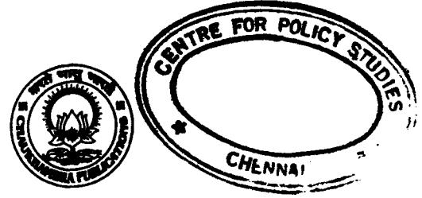

CHAUKHAMBHA PUBLICATIONS New Delhi

#### Publishers : CHAUKHAMBHA PUBLICATIONS Publishers and Distributors of Oriental Cultural Literature 4262/3, Ansari Road, Darya Ganj New Delhi-110002 (India) Telephone : 23259050 Telefax : 011-23268639 E-mail : cpub@vsnl.net

ISBN : 978-81-89798-94-9

Edition : First, 2011 Price : Rs. 325.00

All rights reserved by the publisher. No part of this work may be reproduced, stored in a retrieval system or transmitted in any form or by any means, electronic, mechanical, photocopying, recording or otherwise, without the prior written permission of the copyright owner.

# Head Office : CHAUKHAMBHA SANSKRIT SANSTHAN Publishers and Distributors of Oriental Cultural Literature Post Box No. 1139 K. 37 / 116, Gopal Mandir Lane, Golghar (Near Maidagin) Varanasi-221001 (India) Telephone : 2333445 Telefax : 0542-2335930 E-mail : cssvns@sify.com

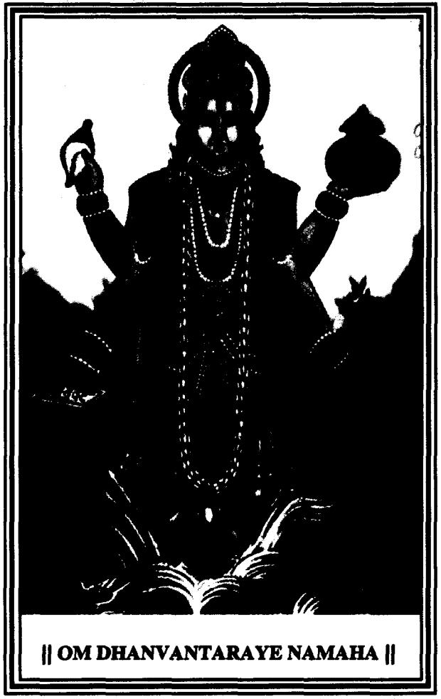

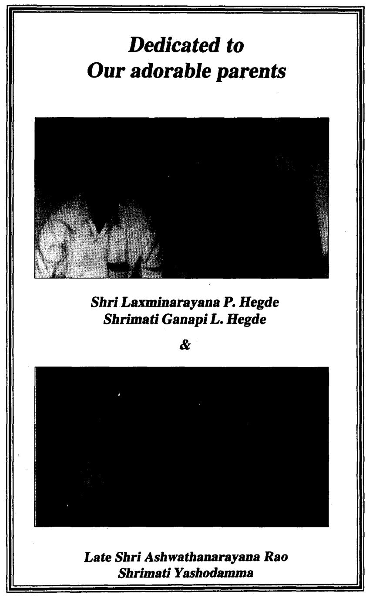


# Foreword

Prof. Mahesh Chandra Sharma M.D.(Avu), PhD.(Avu), M.A.(Sanskrit) Formerly Professor & Head Dept. of PG Studies in Dravvaguna Former Director. National Institute of Ayurveda (NIA) Amer Road. Jaipur

I am extremely glad to go through this text "A Text Book of Dravyaguna" written by Dr Prakash L. Hegde, M.D.(Ayu), PhD.(Ayu) and Dr Harini A. M.D.(Ayu). For successful treatment. appropriate selection of a suitable drug is very important. This can be achieved only, when one has an in-depth knowledge of the basic concepts of Dravyaguna which govern the drug's effect.

Hence this present book is note-worthy as the text is meticulously prepared with classical reference and commentaries with lucid explanation. The authors have put efforts to co-relate certain aspects of Vipaka, Karma in the background of modern pharmacology. This is indeed appreciable and gives scope for young scholars to analyze further.

Tables and flowcharts in the book make it very easy to understand. Though many textbooks are available on Dravyaguna, this text book will surely be a major contribution to this field. Undergraduates, Post graduates, Teachers and Physicians can benefit from this book.

Authors deserve appreciation for their voluminous work. I wish the authors bring more publication in future to fulfill the needs of a vaidya.

Prof. Mahesh Chandra Sharma Former Director, National Institute of Ayurveda (NIA) Amer Road, Jaipur

Jaipur 25.06.2010

# Foreword


Prof. Prasanna N. Rao M.D.(Ayu),PhD.(Ayu) Principal, SDM College of Ayurveda Hassan 573201, Karnataka State

I am happy to go through this book entitled "A Text Book of Dravyaguna" written by Dr. Prakash L. Hegde, M.D.(Ayu), PhD.(Ayu) and Dr Harini A. M.D.(Ayu), who have commendable experience as a teacher and researcher in the field of Dravyaguna.

This comprehensive book includes various concepts of Dravyaguna with lucid & relevant explanations of both classical & modern view. The authors have elaborately referred all major classical texts with commentaries & Nighantus for complete information on every topic. For a clear & absolute understanding of the basic concepts of Dravyaguna, analyzing them in the light of Modern Pharmacology becomes invaluable. The present book is one such honest effort in this direction. I believe that it will fill the current information gap & also meet the educational need of undergraduate & post graduate students who are being trained in this area, for which this book has been especially designed.

This book would be of immense value to graduates, post graduates, teachers of Ayurveda and for the community interested to know about the basic concepts of Ayurvedic Materia medica.

I appreciate & congratulate the authors for their painstaking efforts in producing this work, which I hope will go a long way & contribute significantly to our existing knowledge in this area. May Lord Dhanvantari bless & help them to bring out many more publications in the future for the benefit of the Avurvedic fraternity.

> Prof. Prasanna N. Rao Principal, SDMCA Hassan-573201

Hassan 28.06.2010

# Preface

Man from the very beginning has been aware of the problems of life and for a very long time has been taking care of his health through various means. Ayurveda, which literally means the science of life, is the natural healing system of India, its traditional medicine going back to ancient times. Its originality and holistic approach whose principles of therapeutics are applicable universally remain time tested even to this day. In the course of its life science, plants make an immense impact as either food or medicine.

Plants affect different facets of life, such as cultural, economical, medical and spiritual. Since time immemorial, plants have been extensively used by man for maintenance of health and for treatment of myriad of illnesses. This has been discovered from the clay tablets etched by early man before he was able to record the medicinal value of plants on papyrus parchment.

In India. the earliest mention of the use of medicinal plants is found in the Rigveda which was written between 4500-1600 B.C. A detailed account of the world's first symposium on medicinal plants is given in the first chapter of Vrihat Samhita and since 1600 B.C., the amount of literature on this subject is boundless.

In the course of evolution, long before, Jagdish Chandra Bose demonstrated the sign of life in plants by his scientific experiments. Vedic seers realized it in Chandogya Upanishad (6-11.1). But it was only in the period of the Ayurvedic Samhitas, that there were serious attempts in studying plants scientifically and systematically.

It is interesting to observe that the knowledge about plants

is based on a sophisticated. indigenous knowledge category called Dravyaguna. Though termed as a discipline only during Nighantu period by Narahari, author of Raja Nighantu, the classical texts of Avurveda. i.e. Brahatravee stand testimony to the fact that Drayyaguna (Concepts) formed an integral part of the science in understanding the mechanism of action of plants (food/ medicine) on man.

#### Importance of Dravyaguna

One of the renowned scholars of Dravyaguna of Yesteryear, Prof. P.V. Sharma has aptly defined Dravyaguna as,

विविधास्तथा । गुणकर्माणि दुव्याणां प्रयोग: द्रव्युगणं हि तत ।। 201 खण्यन्ते शास्त्र द्र.ग.वि.-प्रियव्रत शर्मा

Drayyaguna is a science which deals with Guna (Properties), Karma (Actions) and Pravoga (Therapeutics) of Dravya (Drugs).

In the context of Dravyaguna. Dravya refers to Karya Dravyas only. As previously pointed out. Narahari, author of Raja Nighantu laid emphasis on Nighantu (Encyclopedia) by stating that Nighantus form an integral part of a Physician.

#### निघण्दुना विना वैद्यो विद्यान व्याकरणं विना । धनुष्कस्त्रयो अभ्यासेन JJ हास्यस्य भाजनम् ।। रा.नि.

Acharyas used medicinal plants judiciously as food and medicine. Ayurveda is well known as the "Triskandha A yurveda" which refers to the triads or three pillars of Ayurveda.

#### हेतू लिन्द्रौषध ज्ञानं स्वस्थातूर परायणम् । च.स. १/२४

One among these is the Aushadha. Hence an in-depth and systemic knowledge of Ausadha is indispensable for Swastha

#### Preface

(Healthy) and Atura (Diseased). For successful treatment, coordination and co-existence of Chatuspada is extremely essential. These are Bhisak (Physician). Dravya (Medicines). Upasthata (Nurse/Attender) and Rogi (Patient), which form the four limbs of the treatment. On keen observation, Dravya (Medicine) stands only second, reiterating its importance in treatment. It goes without saying the importance of knowledge of Dravya i.e., Dravyaguna Vignana.

Opium obtained from Ahiphena (Poppy) is indeed an excellent medicine. In modern times, Morphine obtained from this has been a great boon, as one of the best analgesics of all times. But the sad story is that the very same Morphine has been the bane of addiction. Hence retrieving the boon or bane of a drug lies in its judicious usage. Similarly Vatsanabha (Aconite) which runs foremost as a Mahavisa, on purification turns out to be an excellent remedy for various illnesses.

Many such examples can be cited in nature and that's why, our acharyas have rightly said.

| योगादपि | विषं       | तीक्ष्णमुत्तमं | भेषजं    | भवेत् ।  |            |
|---------|------------|----------------|----------|----------|------------|
| भेषजं   | दुर्युक्तं | तीक्ष्णं       | संपद्यते | विषम् ।। |            |
|         |            |                |          |          | च.स. १/१२६ |

Hence logical application of Dravyas is very essential for treatment. Hence, a detailed knowledge of Dravyas, its properties takes prime importance.

A physician who has the ability to utilize Dravya acc to the condition and patient for treatment is judged as the 'Srestha Vaidya'.

|  | तदेव | यदारोग्याय | कल्पते ।                                        |
|--|------|------------|-------------------------------------------------|
|  |      |            | स चैव भिषजां श्रेष्ठो रोगेभ्यो यः प्रमोचयेत् ।। |
|  |      |            | च.सू.  १/१३४                                    |

One can utilize Dravyas judiciously for treatment only when one is diligent with the knowledge of the drugs. And for this, knowledge of basic principles which govern Dravyas is equally important. Those basic principles come to be called as the Sapta Padarthas, which include Dravya, Guna, Rasa, Vipaka, Virya, Prabhava and Karma.

# Acknowledgement

We express our profound and immense gratitude to Rajarshi Poojya Dr D. Veerendra Heggadeji, President, S.D.M. Education Society Reg., Ujire, for his divine blessing.

We are very much thankful to Dr B. Yashovarma, Secretary, S.D.M. Education Society, Ujire, for his support and encouragement.

We express our sense of indebtedness to Prof. Mahesh Chandra Sharma, former Director, National Institute of Ayurveda (NIA), Jaipur for his encouraging words and unrelenting patronage.

We are extremely grateful to Prof. Prasanna N. Rao, respected Principal, SDM College of Ayurveda, Hassan for his everlasting support, care and encouragement shown in bringing out this book.

Our heartfelt gratitude to Prof. K.S.Jayashree, Principal, Jayendra Saraswati Ayurvedic College, Chennai, for her constructive appreciation.

We express our humble regards to Prof. Ashalatha M. HOD, Dept. of Dravyaguna, Govt. Ayurveda Medical College, Bangalore for her constant positive appraisal.

We are highly grateful to Dr P.S. Byadgi, Asst. Prof. Dept. of Vikriti Vigyan, IMS, BHU for his excellent, meticulous & critical suggestions.

We are thankful to Dr Shailaja U., Dr Muralidhar Pujar, Dr P. Hemanthkumar and Dr Ashwinikumar M. for their exceptional support.

We are grateful to our departmental colleagues Dr Ashwinkumar Bharathi, Dr Pradeep and Dr Anitha M.G. and other colleagues for their co-operation.

No words can express our gratitude to all our teachers who taught us, nurtured our talents and are responsible for what we are today.

Also thanks to our students who provide continuing challenges & inspirations to achieve the best in our lives.

Words fall short to express our sense of indebtedness to our parents, brothers, sisters and all family members for their tireless support in our life.

Thanks are also due to our friends Dr Bhaskar Rao. Dr. Gururaj M.B., Dr. Nagendra Kumar, Dr. Shashidhar Naik, Dr. Rajesh Bhat. Dr. Prasanna Kulakrni. Dr. Seema Bhat. Dr. Yoganand, Dr. Shivaling Bendekai, Dr. Gurubasavarai K.M., Dr. Vedavathi. Dr. Ramappa Hadkar, Dr. Subramanya kumar and many others who have always been with us to instill confidence.

Sincere thanks are also due to our children. Poornashree & Prabhanjana who have been a source of inspiration to pursue this work in all circumstances.

We shall remain thankful to Mr Jithesh Gupta. Proprietor and publisher Chaukhambha Sanskrit Sansthan, Varanasi for his kind help in printing and publishing this book efficiently & effectively.

We thankfully acknowledge the library staff. Mr Devarai K.M and others for their timely assistance.

And we appreciate & recognize the timely help of each & every individual who have helped us during the course of this work.

#### Dr Prakash L. Hegde

M.D. (Avu), PhD. (Avu) Reader & HOD Dept. of Dravyaguna SDM College of Ayurveda Hassan-573201 Karnataka State. India. e-mail: drorakashheade@vahoo.com

#### Dr Harini A.

M.D. (Avu) Lecturer Dept. of Dravyaguna SDM College of Ayurveda Hassan-573201 Karnataka State. India e-mail: harini013@vahoo.co.in

| Scheme of Transliteration |       |                      |       |  |  |
|---------------------------|-------|----------------------|-------|--|--|
|                           |       | स्वर (Vowels)        |       |  |  |
| अ                         | a     | ਨਾ                   | lr.   |  |  |
| आ                         | a     | ए                    | e     |  |  |
| ર્પ્                      | i     | ऐ                    | ai    |  |  |
| ਵੰ                        | I     | औ                    | 0     |  |  |
| ਤ                         | u     | औं                   | au    |  |  |
| ਤ                         | ū     | ਨੱ                   | am    |  |  |
| ਸੇਂ ਇ                     | I     | अः                   | - ah  |  |  |
|                           |       | व्यञ्जन (Consonants) |       |  |  |
| ಹಿ                        | k     | ਖੰ                   | dha   |  |  |
| ख                         | kha . | ਜ                    | na    |  |  |
| ग                         | ga    | प                    | pa -  |  |  |
| ਧ                         | gha   | फ                    | pha   |  |  |
| ਫੁ.                       | na    | ब                    | ba    |  |  |
| च                         | ca    | भ                    | bha   |  |  |
| ਵਾ                        | cha   | म                    | ma    |  |  |
| ত্য                       | ja    | य                    | ya    |  |  |
| त्त्व                     | jha   | र                    | ra    |  |  |
| ঙ্গ                       | ña    | ल                    | la    |  |  |
| ನು                        | ța    | ਕ                    | va    |  |  |
| ਡ                         | tha   | श                    | ર્ફ વ |  |  |
| ਫ                         | da    | ष                    | ਣ ਬ   |  |  |
| പ്                        | dha   | स                    | sa    |  |  |
| ण                         | na    | ह                    | ha    |  |  |
| ਹ                         | ta    | ਦੱਖ                  | ksa   |  |  |
| ਪ                         | tha   | ਸ                    | tra   |  |  |
| द                         | da    | ਨੀ                   | jña   |  |  |

# Abbreviation

:

| अ.ह.ड.<br>રે.     |     | अष्टाङ्ग हृदय उत्तरतन्त्र          |
|-------------------|-----|------------------------------------|
| २.   अ.ह.सू.      |     | अष्टाङ्ग हृदय सूत्रस्थान           |
| ३. अ.सं.नि.       |     | अष्टाङ्ग संग्रह निदानस्थान         |
| ४. अ.स.सू.        | →   | अष्टाङ्ग संग्रह सूत्रस्थान         |
| ५. आ.द.           |     | आयुर्वेद दर्शन                     |
| ६. आ.र.           | →   | आयूर्वेद रसायन                     |
| ७. गू.दी. शा.प्र. | →   | गूढ़ार्थ दीपिका शाद्र्धर प्रथमखण्ड |
| ८. च.च.           | →   | चरक चिकित्सास्थान                  |
| ९. च.वि.          | →   | चरक विमानस्थान                     |
| १०. च.द.          | →   | चक्रदत्त                           |
| ११. च.शा.         | →   | चरक शारीर स्थान                    |
| १२. च.सू.         | →   | चरक सूत्रस्थान                     |
| १ ३. चक्र.च.सू.   | →   | चक्रपाणि चरक सूत्रस्थान            |
| १४. ध.नि.         | →   | धन्वन्तरि निघण्टु                  |
| १५. कै.नि.मि.व.   | →   | कैय्यदेव निधण्टु मिश्रक वर्गीकरण   |
| १६. का.सं.खि.     | →   | काश्यप संहित खिलस्थान,             |
| १७. प.प्र         | →   | परिभाषा प्रदीप                     |
| १८. प्र.पा.भा.    | →   | प्रशस्तपाद भाष्य                   |
| १९. पं.भू.        | →   | पञ्चभूत सिद्धान्त                  |
| २०. भा.प्र.प्र.   | →   | भावत्रकाश प्रथम खण्ड               |
| २१. यो.ना.सेन्.   | →   | योगेन्द्रनाथ सेन्                  |
| २२. द्र.गू.वि.    | →   | द्रव्यगूण विज्ञान                  |
| २३. यो.र.         | →   | योगरत्नाकर                         |
| २४. दी.आ.शा.प्र.  | →   | दीपिका आढ़मल्ल शार्द्रधर प्रथमखण्ड |
| २५. र.त.          | →   | रस तरङ्गिणि                        |
| २६. र.र.स.        | → → | रस रत्न समूच्चय                    |
| २७. र.वै.         |     | रस वैशेषिक                         |
| २८. रा.नि.मि.व.   |     | राज निघण्टू मिश्रक वर्गीकरण        |
| २९. वै.द.         |     | वैशेषिक दर्शन                      |
| ३०. श.क.द्र.      |     | शब्द कल्प द्रुम                    |
|                   |     |                                    |
|                   |     |                                    |

# Abbreviation

.

. .

| ३१. शा.उ.         | 1   | शार्द्रधर उत्तर तन्त्र              |
|-------------------|-----|-------------------------------------|
| ३ २. शा.प्र.      | ↑ → | शाद्र्घर प्रथम खण्ड                 |
| ३ ३. शा.सं.म.     | →   | शार्द्रधर संहिता मध्यम खण्ड         |
| ३ ४. हे.अ.ह.सू.   | ↑   | हेमाद्रि अष्टाद्म इदय सूत्र         |
| ३५. स.सु.-अ.ह.सू. | →   | सर्वाङ्ग सुन्दरि अष्टाद्ग इदय सूत्र |
| ३६. सु.उ.         | →   | सुश्रुत उत्तर तन्त्र                |
| ३७. सु.चि.        | 1   | सुश्रुत चिकित्सास्थान               |
| ३८. सु.शा.        | ↑   | सुश्रुत शारीर स्थान                 |
| ३९. सु.सू.        | →   | सुद्धता स्वस्थान                    |
| ૪૦. Y.T.A.        | 1   | Yadavaji Trikamaji Acārya           |

●

# Content

# Part-A

| 1.  | Laksana of Dravyaguna Sastra                      |                    |                                       |                                                        | 1      |
|-----|---------------------------------------------------|--------------------|---------------------------------------|--------------------------------------------------------|--------|
|     |                                                   |                    |                                       | General Introduction to Sapta Padārtha-Dravya, Rasa,   | 2      |
|     |                                                   |                    |                                       | Guņa, Vīrya, Vipāka, Prabhāva & Karma                  |        |
| 2.  |                                                   | Laksana of Dravya  |                                       |                                                        | 6      |
|     |                                                   | Panchabhautikatwa  |                                       |                                                        | 7      |
|     |                                                   |                    | Ausadhatwa, Nanausadhitwa             |                                                        | 10     |
|     |                                                   |                    |                                       | Superiority of Dravya (Dravya Pradhanyata)             | 12     |
| 3.  |                                                   |                    |                                       | Classification of Dravya-acc to Chetana Achetana Bheda | 1 d    |
|     | 99                                                |                    | 99                                    | Kārya Kārana Bhēda                                     | 21     |
|     | 9 9                                               |                    | 9 9                                   | Yoni Bhēda                                             | 24     |
|     | י י                                               | -                  | 9 9                                   | Prabhāva Bhēda                                         | 30     |
|     | 99                                                |                    | Varga                                 | Rasa Skanda Bhēda                                      | 36     |
|     | Knowledge of Gana explained by Charaka            |                    |                                       | રેરે                                                   |        |
|     |                                                   |                    |                                       | Suśruta -                                              | 74     |
|     | 9 1                                               |                    |                                       | Vāgbhata                                               | 100    |
|     |                                                   |                    | Classification of Dravya in Nighantus |                                                        | 120    |
|     |                                                   |                    |                                       | Classification of medicinal plants and number          | 140    |
|     |                                                   |                    | of medicinal plants in their family   |                                                        |        |
| 4.  |                                                   | Derivation of Guna |                                       |                                                        | ાં રેણ |
|     | Definition of Guna                                |                    |                                       | ા રહ                                                   |        |
|     |                                                   | Types of Guna      |                                       |                                                        | 1 28   |
|     |                                                   |                    | Detailed knowledge of Gurvadi Guna    |                                                        | 160    |
|     | 9 9                                               |                    |                                       | '' Parādi Guņa                                         | 177    |
| ર્જ |                                                   | Derivation of Rasa |                                       |                                                        | 197    |
|     |                                                   | Definition of Rasa |                                       |                                                        | 197    |
|     | Different meanings of Rasa                        |                    |                                       | 198                                                    |        |
|     | Principles of Rasa Sankhya according to different |                    |                                       |                                                        | 1 99   |
|     | Acharyas and acceptance of general principles     |                    |                                       |                                                        |        |
|     |                                                   |                    |                                       | Pañcabhoutikatva of Rasa & its Nivritti                | 207    |

|    | Content                                                        | XIX |
|----|----------------------------------------------------------------|-----|
|    | Nivritti Višeșa Hētu                                           | 208 |
|    | Differences between Rasa and Anurasa                           | 209 |
|    | Importance of each of 6 Rasas                                  | 211 |
|    | Effects of seasons on Rasa                                     | 212 |
|    | Rasa Upalab thi Kāraņa                                         | 213 |
|    | Niṣpatti Kāraṇa of Rasa                                        | 213 |
|    | Rasa Rupantara                                                 | 215 |
|    | Gunakarma, classification of Rasa, Laksanas of 6 Rasas         | 218 |
|    | Effect of excess usage of Rasa                                 | 234 |
|    | Guna of Rasas as Uttama, Madhyama & Adhama Rasa                | 240 |
|    | Indications for use of Rasa with exception                     | 244 |
|    | Samana and Kõpana of Dosa & Dūsya by Rasa                      | 245 |
|    | Uses of Rasa in Ausadha and Ahara                              | 246 |
| 6. | Derivation of Vipāka                                           | 253 |
|    | Lakṣaṇa of Vipāka                                              | 253 |
|    | Types of Avasthapaka                                           | 254 |
|    | Various theories for establishment of Swarupa and              | 267 |
|    | Sankhya of Vipāka and their acceptance.                        |     |
|    | Guna Karma of Vipāka                                           | 283 |
|    | Vipāka Tāratamya                                               | 284 |
|    | Vipāka Upalabdhi                                               | 286 |
|    | Difference between Rasa & Vipāka                               | 287 |
|    | Supenority of Vipāka                                           | 290 |
| 7. | Derivation of Vīrya                                            | 294 |
|    | Lakṣaṇa of Vīrya                                               | 294 |
|    | Analysis of various theories of Virya and accepted theory  300 |     |
|    | Knowledge of Bhutōtkarsa in Vīrya                              | 308 |
|    | Karma of Vīrya                                                 | 308 |
|    | Vīrya Upalabdhi Hētu                                           | 311 |
|    | General principles regarding establishment of Virya            |     |
|    | along with their exceptions                                    | 313 |
|    | Superiority of Vīrya                                           | 316 |
| 8. | Derivation of Prabhāva                                         | 320 |
|    | Laksana of Prabhāva                                            | 320 |

:

# Dravyaguņa Vijñāna

|    |                      | Prabhāvajanya Karma     |                                                     | 326 |
|----|----------------------|-------------------------|-----------------------------------------------------|-----|
|    |                      | Vichitra pratyārabdha   |                                                     | 328 |
|    |                      | Superiority of Prabhava |                                                     | 333 |
| 9. |                      |                         | Interrelation of Rasagunadi in Dravyas and their    |     |
|    |                      | balābala Nirūpana       |                                                     | 335 |
|    |                      |                         | Part-B                                              |     |
|    | 10. Nirukti of Karma |                         |                                                     | 340 |
|    |                      | Laksanas of Karma       |                                                     | 341 |
|    |                      | Swarüpa of Karma        |                                                     | 342 |
|    |                      | Bheda of Karma          |                                                     | 342 |
|    |                      |                         | Action of Karma acc to ancient and modern views     | 343 |
|    |                      | Classification of Karma |                                                     | 353 |
|    |                      |                         | Various examinations to know Karmukatva of Dravya   | 355 |
|    |                      |                         | Knowledge of Dīpana Karma                           | 361 |
|    | 9 9                  | 9 9                     | Pāchana Karma                                       | 364 |
|    | 9 9                  | 99                      | Samśodhana Karma                                    | 373 |
|    | 99                   | 99                      | Samśamana Karma                                     | 375 |
|    | 99                   | 99                      | Lēkhana Karma                                       | 377 |
|    | 99                   | 99                      | Anulomana Karma                                     | 381 |
|    | 9 9                  | 9 9                     | Sramsana Karma                                      | 382 |
|    | 9 9                  | 9 9                     | Bhēdana Karma                                       | 383 |
|    | 99                   | 99                      | Rēchana Karma                                       | 385 |
|    | 9 9                  | 99                      | Grāhī Karma                                         | 392 |
|    | 9 9                  | 99                      | Stambhana Karma                                     | 393 |
|    | 99                   | 9 9                     | Madākāri Karma                                      | 397 |
|    | 99                   | 9 9                     | Pramāthi Karma                                      | 398 |
|    | 9 9                  | 9 9                     | Vyavāyi Karma                                       | 399 |
|    | :                    | יי                      | Vikāsi Karma                                        | 400 |
|    |                      |                         | 11, Nirūpana of Audbhida Ganas acc to Akrati, Guna, |     |
|    |                      |                         | Karma, Jāti, Kārya Prasiddhi and Sādharmya.         | 420 |
|    | · Panchamula         |                         | · Panchapallava                                     |     |
|    |                      | · Panchavalkala         | · Triphala                                          |     |
|    |                      |                         |                                                     |     |

.

:

:

# Content

|   | Trikatu                                          | Trimada      |     |
|---|--------------------------------------------------|--------------|-----|
| ● | Chaturūsana                                      | Panchakõla   |     |
| ● | Shadūsana                                        | Chaturbīja   |     |
|   | (Jīvanīya) Gana. Astavarga                       |              |     |
|   | Trijātaka                                        | Chaturjātaka |     |
|   | Panchatikta                                      | Amlapancaka  |     |
|   | Mahapanchavisa                                   | Upavisa<br>● |     |
|   | In Bhūmija Dravya                                |              |     |
|   | Lavana Panchaka                                  | Ksāra Dvaya  | 453 |
|   | • Ksārāstaka                                     |              |     |
|   | In Jangama dravya                                |              |     |
|   | · Ksīrastaka                                     | · Mūtrastaka | 456 |
|   | · Pitta Pancaka                                  |              |     |
|   | 12. Basis of nomenclature of Dravya              |              | 458 |
|   | Synonyms with the reasons                        |              | 460 |
|   | Division of Desa Bhumi                           |              | 466 |
|   | Collection of Dravya                             |              | 484 |
|   | Swarupa of Sangrāhya Dravya                      |              | 484 |
|   | Method of Sangrahana (collection)485             |              |     |
|   | Sangrahana of Audbhida Dravya acc to Avayava     |              | 487 |
|   | Bhēda                                            |              |     |
|   | Time of Sangrahana                               |              | 491 |
|   | Sangrahana acc to Vīrya Bhēda                    |              | 492 |
|   | Preservation of collected Dravyas                |              | 497 |
|   | Bhesajagara (storage of medicines)               |              | 497 |
|   | Definition of Mana                               |              | 200 |
|   | Modern and ancient knowledge of Pautava, Druvaya |              | 201 |
|   | and Pāyya Māna                                   |              |     |
|   | 13. Various impurities of Dravya                 |              | 210 |
|   | Purification Methods                             |              | 211 |
|   | Knowledge of adulterants and artificial drugs    |              | 520 |
|   | 1 4. Prašasta Bhesaja                            |              | 526 |

.

| Bhēsaja Prayōga                                        | ર 28   |  |  |  |
|--------------------------------------------------------|--------|--|--|--|
| Prayojyānga                                            | 529    |  |  |  |
| Knowledge of Viruddha Dravyas                          | ર 3 I  |  |  |  |
| Prescription of Ausadha Yoga                           | ર 39   |  |  |  |
| Knowledge of Vaya, Bala, Linga, Agni, Dosa, Dusya, 540 |        |  |  |  |
| Vyādhi, Kosṭha, Dravya Prakriti, Abhyāsa, Satwa,       |        |  |  |  |
| Dēsa, Kāla and Kalpana for deciding drugs dosage       |        |  |  |  |
| Anupāna Vyāvasthā                                      | 247    |  |  |  |
| Bhaisjaya Sevana Kāla                                  | 552    |  |  |  |
| Bhaisajya Prayoga Mārga                                | 261    |  |  |  |
| 15. Brief history of Dravyaguna Śāstra                 | ર્સ્વ  |  |  |  |
| Description of Dravyaguna Sastra in Vedas,             | 267    |  |  |  |
| Āyurvedīya Samhitās                                    | ર્સ્વે |  |  |  |
| Various Nighantus                                      | ર્સ્ડ  |  |  |  |
| Knowledge of Dravyaguna Grantha written by various     |        |  |  |  |
| scholars in recent years.                              | રેતેર  |  |  |  |
| 16. Question papers                                    | 600    |  |  |  |

●

.

# Chapter-1

# Introduction to Dravyaguņa Śāstra

#### Points Dealt

- · Dravyaguna Śāstrasya Laksanam.
- · Saptapadartha- Dravya, Rasa, Guna, Virya, Vipaka, Prabhāva, Karmāni Adinām Sāmānya Paricaya.

# Laksaņa of Dravyaguņa Śāstra

The word, "Dravyaguna" which is composed of two words 'Dravya' & 'Guna' deals with the systemic study of Guna (Properties) and Karma (Actions) of Dravya.

तदायुर्वेदयतीत्यायुर्वेदः, कथमिति चेत् ?.........यतश्रायुष्याण्यनायुष्याणि च द्रव्यगुणकर्मणि वेदयत्यतोऽप्यायुर्वेदः । तत्रायुष्याण्यनायुष्याणि च द्रव्यगुणकर्मणि केवलेनोपदेक्ष्यन्ते तन्त्रेण ।। च. सू. ३०/२३

In Cha. Su. 30/23, Agnivesa in answer to the query as to why the name "Ayurveda", says that Ayurveda is the science which imparts knowledge about Ayu (life) through the detailed analysis of Ayusyani and Anayusyani Dravyani i.e. the sub-stances, its properties and actions that are favourable to promote longevity and unfavourable substances that hamper longevity.

#### द्रव्याणि पुनरोषधयः ।

सु. सू. १/२८

In the context of Ayurvedīya Dravyaguna Sāstra Dravya refers to Kārya Dravya i.e. Ausadhi Dravya.

गुण शब्देन चेह धर्मवाचिना रसवीर्यविपाकप्रभावा: सर्व एव गृह्यन्ते ।

चक्रपाणि-च. सू. १/५९-६१

The term Guna. here indicates and includes Guna. Rasa, Vīrya, Vipāka and Prabhāva.

# द्रव्याणां गुणकर्माणि प्रयोगा: विविधास्तथा । सर्वशो यत्र वर्ण्यन्ते शास्त्रं द्रव्यगुणं हि तत् ।।

द्र. गृ. वि.

Thus, as one of the recent renowned professor puts it, Dravyaguna Sastra is the science which deals with the thorough analysis of the properties (Guna), actions (Karma) and therapeutics (Prayoga) of all Dravyas which are either Ahara or Ausadha.

हेत् लिक्कौषधज्ञानं स्वस्थात्रपरायणम् । च. सू. १/२४

Thorough knowledge of Dravya becomes extremely important for the maintenance of health. This knowledge may be obtained from Dravyaguna Sastra.

#### Pancapadārtha of Dravvaguna

Bhāvamiśra, the author of Bhāvaprakāša Nighantu quotes five Padarthas (Panca Padartha) which reside in a Dravya.

> रसोगणोवीर्यं विपाकः दुल्ये शक्तिरेव च । पदार्था पञ्चतिष्ठन्ति स्वं स्वं कर्वन्ति कर्म च ।।

> > भा. प्र. प्र. ६/१६९

१/५१

Rasa. Guna. Vīrya, Vipāka and Prabhāva (Śakti) are the five Padarthas which take shelter in the Dravya and perform their respective Karma.

#### Sapta Padārthas of Dravyaguna

Prof. Yadavii Trikamii Acharya adds Dravya and Karma to the Pañcapadarthas and thus refers to Sapta Padarthas.

The Sapta Padarthas are :

| Dravya | Rasa             |
|--------|------------------|
| Guna   | Vīrya            |
| Vipāka | Prabhāva (Śakti) |
| Karma  |                  |

These seven constitutes for the fundamental basis for understanding Dravya, its mode of action and therapeutics. Indepth knowledge of these seven basic principles helps in practical utility.

Dravya

| વે મતા અર્જા :                                                                                                                                                                | कमण्णाः    कारणी | सम्बद्धाः यतः । यतः । |         |
|-------------------------------------------------------------------------------------------------------------------------------------------------------------------------------|------------------|-----------------------|---------|
| 【有限】【不】【,】【,】【,】【,】【,】【,】【,】【,】【,】【,】【,】【,】【,】【,】【,】【,】【,】【,】【,】【,】【,】【,】【,】【,】【,】【,】【,】【,】【,】【,】【,】【,】【,】【,】【,】【,】【,】【,】【,】【,】【,】【,】【,】【,】【,】【,】【,】【,】【,】【,】【,】【,】【,】【,】【,】【 |                  |                       |         |
|                                                                                                                                                                               |                  |                       | *** *** |

Dravya is a substance which shelters Karma (Action) and Guna (Properties) and maintains a Samavaya Sambandha (inherent relation) with Karma and Guna. Dravya is the material cause. e.g. Gudūci, Āmalaki, Aśwagandha etc.

#### Guna

# समवायी तू निश्चेष्टः कारणं गुणः । च. सू. १/५१

Guna takes shelter in a Dravya and remains in Samavaya Sambandha (inherent relation) with it, Guna forms the Asamavayi Karana for Karma and is inactive without the help of other factors.

Though the term 'Guna' has several meanings, in this context, physical properties of a substance is more suitable.

e.g. Usna (Hot), Śīta (Cold) etc.

सार्था गुर्वादयो बुन्दिः प्रयत्नान्ताः परादयः । गणा: प्रोक्ता: . . . . . . . . . . . . ··············································································································································································

च. सू. १/४९

Totally, 41 Gunas are considered in Ayurveda.

#### Rasa

|                        | रसनार्थो   रसस्तस्य   द्रव्यमाप:    क्रितिस्तथा । |                          |             |
|------------------------|---------------------------------------------------|--------------------------|-------------|
|                        | निर्वृत्तौ च विशेषे च प्रत्यया: खादयस्त्रय: ।।    |                          |             |
|                        |                                                   |                          | च. सू. १८६४ |
| रस्यत सम्बद्धित राज्यस | । आस्वाद्यत् ।          इति                       | रसः ।                    |             |
|                        |                                                   | चक्रपाणि  (च.  सू.-१/६४) |             |

Rasa (taste) is the object of Rasanendriya (Gustatory sense organ). Ap and Prithvi are the fundamental Mahabhūtās responsible in the manifestation of Rasa (taste), while the rest, i.e. Akasa. Vavu and Teias are the causative factors.

सः १४६५

Amia (sour), Liavana (Salt), Katu (Pun-

gent), Tikta (Bitter) and Kasava (Astringent) are the Sat Rasas accepted in Avurveda.

#### Vipāka

जाठरेणाग्निना योगाद्यददेति रसान्तरम् । रसानां परिणामान्ते सं विपाक इतिस्मृतः ।। अ. हृ. सू. ९/२० अवस्थापाकापेक्षया विशिष्ट: पाक: विपाक: 1

शिवदास

The transformed Rasa at the end of the digestion under the influence of Jatharagni is known as Vipāka. This Vipāka is different compared to Avasthapaka.

त्रिधा विपाको द्रव्यस्य स्वाद्वम्ल कटुकात्मक: ।।

अ. ह. सू. १/१७

Āyurveda advocates 3 Vipākas-Madhura. Amla and Katu. Vīrya

#### ਣੀ ਹੈ क्रियते येन किया । या ਗੁ नावीर्यं कुरुते किश्चित् सर्वा वीर्यकृता क्रिया: ।।

च. सू. २६/६५

The property of a Dravya, which is responsible for the therapeutic effects. There is no action without the involvement of Vīrya (Potency).

# उष्णशीतगृणोत्कर्षात् तत्र वीर्यं द्विधा स्मृतम् ।।

अ. ह. सू. १/१७

Virya are of two types i.e. Usna and Sīta.

#### Prabhāva

# रसवीर्यविपाकानां सामान्यं यत्र लक्ष्यते । विशेष: कर्मणां चैव प्रभावन्तस्य स स्मृत: ।।

च. सू. २६/६७

The special action brought about by the Dravya, which is not in accordance with its Rasa, Guna, Virya or Vipāka is known as Prabhava. Eg : Krimighna action of Vidanga.

Karma

#### संयोगे च विभागे च कारणं द्रव्यमाश्रितम । कर्तव्यस्य किया कर्म. 679 नान्यदर्शन प्रति

च. सू. १/५२

The factor responsible for Samyoga (Association) and Vibhāga (Dissociation) of Dravyas is known as Karma. Karma of a Dravya is accomplished by Rasadi Pancaka (Rasa, Guna, Vipāka, Vīrya & Prabhāva) itself. Eg : Dīpana.

# Chapter-2 Dravya Vijñana

#### Points Dealt :

- · Dravya Nirukti
- · Dravva Laksana
- Dravya Pañcabhautikatwa
- Ousadhatwa of Dravya
- Dravya Prādhānyata

### Dravya Nirukti

# क्ली (द्रोरिव । द्रू + "व्रव्यन्तु भव्ये' । इति यत् प्रत्ययेन निपातनात् साधुः)

The word 'Dravya' is derived from 'Dr' Dhātu and 'Yat' Pratyaya.

#### Dravya Laksana

१. यत्राश्रिता: कर्मगुणा: कारणं समवायि यत । तद्रद्रव्यं ।

च. सू. १/५१

यत्राश्रिता: यत्र समवेता: (समवाय सम्बन्धेन स्थिता:) । कर्म ध्य गुणाश्र कर्म गुणा: । कारणं समवायि यदिति समवायि कारणं यत, द्रव्यमेव हि द्रव्यगुणकर्मणां समवायिकारणम् । समवायिकारणं च यद् यत् स्वसमवेतं कार्यं जनवति; गुणकर्मणी त् न स्वसमवेतं कार्यं जनयतः, अतो न ते समवायिकारणे ।

चक्रदत्त on च. सू. १/५१

Dravya is the substratum which shelters Guna (quality) and Karma (action) and has Samavayi Sambandha (inherent relationship) with them. Dravya has the ability to perform action independently while Guna. Karma cannot perform an action without the assistance of Dravya.

२. क्रियागुणवत् समवायि कारणं द्रव्यम् । सु. सू. ४०/३

क्रियागणवदिति क्रियागणवद्यव्यमित्यर्थः क्रिया कर्मः गणा उक्ता विशातिः । समवायि कारणमपि द्रव्यमेव : यथा पटे तन्तवः, घटे मृत्यिण्ड इत्यादि; न च क्रियायां क्रिया समवेता, न गुणेषु गुणाश्च समवेता इति । डल्हण on सू. सू. ४०/३

Acarya Susruta also defines 'Dravya' in a similar man-

ner, saying that Guna (Quality) and Karma (Action) are in an inherent relationship with the Dravya.

#### ३. क्रियागुणवत् समवायि कारण व्रव्यम । वै. द. १/१५

Vaisesika Darsana defines 'Dravya' as one which has Samavaya Sambandha (inherent relationship) with Guna (Quality) and Karma (Action).

#### ४. द्रव्यमाश्रवर्तनाम्ण घन्नानाम ।

#### भाष्य-रस्तादीनां घर्शानां भूतानां यदाश्रयभूतं तद द्रव्यम् ।

Badanta Nagarjuna defined Dravya as that which shelters the 5 factors i.e. Rasa, Guna, Virya, Vipāka and Prabhāva.

# ५. द्रव्ये रसो गुणो वीर्य विषाक: शक्तिरेव थ्य। पदार्थाः घटनातिष्ठन्ति स्वं स्वं कुर्वन्ति कर्म थ ।। भा. प्र. प्र. ६/१६९

Dravya is one which gives shelter to Pancapadarthas namely Rasa, Guna, Vīrya. Vipāka and Śakti (Prabhāva) which in turn perform their own actions.

#### Pañcabhautikatwa of Dravya

Pañcamahabhuta theory is one of the fundamental theories acepted in Ayurveda.

सर्वे द्रव्यं यास्त्रभौतिकमस्मिन्नर्थे । च. सू. २६/१० सर्वद्रव्यमिति कार्यद्रव्यम् । अस्मिन्नर्थे अस्मिन् प्रकरणे । चक्रपाणि-च. सू. २६/१०

Caraka advocates that all Dravyas (substances) in this universe are composed of Pañcamahabhūta. In this context. 'Sarva Dravya' refers to Kārya Dravyas only.

### तत्र प्रशिव्यप्तेजोवाय्याकाशानां समुदायाद्यव्यभिनिर्वृतिः, उत्कर्षस्त्वभिव्यसको भवति-डदं पार्थिवमिद्याप्यमिदं तैजसमिद्दं वायव्यमिदमाकाशीयमिति ।

सु. सू. ४१/३

Dravya is formed by an appropriate combination of Prithvī, Ap. Teja. Vayu & Ākāsa Mahābhūta. Eventhough Dravya is composed of Pañcamahabhutas, depending on the Pradhānyata of Mahābhūta, the Dravyas are classified into Pārthiva, Apya, Agnēya, Vāyavya and Ākāsīya.

र, वै.

पाञ्चभौतिकमिति प्रशिव्यादिभिः यञ्चभिर्मतैर्णितिराब्धमित्यर्थः प्रकरणान्तरे यद्यपि पञ्चभतात्मन: काल दिशां नवानमपिकारण द्रव्याणां द्रव्यञ्चिब्देन श्रहणं भवति. तथाऽप्यस्मिन द्रव्यगणाधिकारे 'द्रव्यं' शब्देन औषधाहारोपयोगीनि पाञ्चभौतिकानि गडचीगोधमादीनि कार्य द्रव्याण्येवाभिप्रेतनीत्यर्थः । द्र. ग. वि. (Y.T.A) सर्वकार्यद्रव्याणां पञ्चभतारब्युत्त्वं दर्शयित्वा चिकित्सोपयुक्तं पार्थिवरवादि विशेषमाह-तत्रेत्र्यादि समुदायादिति मेलकात् । पुथिवी जलानिलदीनां च यद्यपि विरुद्ध गणत्यं तथाऽप्यद् वर्ष्युद्धवशादेकद्वव्यरूपकर्त्वं. द्रष्टत्त्वादेव भवति । यथा वातादीनामेक व्याध्यारम्भकत्वं शुक्रशोणितन्योर्वा सौम्याग्नेययोर्गर्भजनकत्वं, सत्वरजतमसां वा मदाद्यारम्भकत्त्वम् । उत्कर्ष प्रत्येकं प्रथिव्याद्यत्कर्षः । अभिव्यञ्जूक इति पार्थिवत्वाद्यभिव्यस्वकः तमेवाह इदमित्त्यादि । च. द.

All the Kārya Dravyas are made of Pañcamahābhūtas, they are classified as Pārthiva. Āpya, Āgnēya. Vāyavya and Ākāsīya for the purpose of treatment.

> पञ्चभुतात्मकं तत्तु क्ष्मामधिष्ठाय जायते । अम्बयोन्यग्निपवननभासां सम्बायतः । तन्त्रिवृत्तिर्विशेषश्च, व्ययदेशस्तु भूयसा ।। अ. हृ. सू. ९/१-२

Of the 5 Bhūtas, Prithvi becomes the Adhistana or Āsraya, Jala Mahabhūta forms the Yoni, i.e. it combines the particles in the Dravya and Akasa. Vayu and Agni Mahabhūtas together combine to give a structure to the Dravya.

तुरवधारणे । यत्तदोश्च नित्याभिसम्बन्धात् 'यत्' इत्येदनुकतमप्यर्थाल्लभ्यते । तेनायमर्थः - यद्रसादीनामाश्रय भूतं कार्यद्रव्यं हरीतक्यादि स्थावरं, छागादि वा जङ्गमं, सैन्धवादि वा पार्थिवं तत् पञ्चभूतात्मकं, न त्र यत् कारणं द्रव्यमाकाशादि । तस्य हि पञ्जूभतात्मकत्वे सत्याकाशादीनां प्रथकत्वेनात्मलाभो न स्यात । तत्रश्चेद-माकाशां नाम महाभूतम्, इदं प्रथ्वी नाम महाभूतमिति गदितुं न पार्येत, सर्वस्य पञ्चमहाभूतात्मकत्वात् । न च यत् कारणं तत् कदाचित् कार्यं स्यात् । तस्मात् कार्यद्रव्यस्यैव पञ्चभूतात्मकत्वं, न च कारणद्रव्यस्याऽकाशादेः । अथ केन महाभूतेन कथं कृत्वाऽऽरब्धं तद द्रव्यमित्याह-क्ष्मामित्यादि । प्रथिवीमाधारीकृत्योत्पद्यते । एवं पुथिव्याख्येन भतेनाऽऽधारत्वेनोपकत्य तेन तदारब्धं द्रव्यमित्यच्यते । तथा. अप्व सलिलं, योनि: कारणं, यस्य तदम्बयोनि द्रव्यम् । एवं जलं नाम महाभतं

#### Dravva Viiñāna

रसवत्वाद्योनितयोपकत्य तेन तदारब्धमित्यच्यते । तथा अप्रि पवन नभसां समकायात अप्रथम्भावात्, तस्य द्रव्यस्य निर्वत्तिः निष्पत्तिः । तथा तस्य द्रव्यस्य यो विश्रेषः डदमन्यदिद्यन्यद् द्रुव्यमित्येषं रूपो नानास्वभावः सोऽप्यग्नि पवननभसां समवायात् । एवमग्नि पवननभोभिः समवायि कारणत्वेनोपकत्य तैरेतद द्वव्यमारब्धामित्यच्यते ।

एवं च सर्वं कार्यद्रव्यं पञ्चमहाभरतात्मकं. पञ्चभिर्महाभरतरारब्धत्वात । अरुण दत्त:-अ. हृ. सू.-९/१-२

द्रव्योत्पत्तिमाह-तत्त्विति । तद द्वव्यं क्ष्मां पुथिवीमधिष्ठाय जायते. मदमिव घटः, उपादान कारणं प्रथ्वीत्यर्थः । अम्बु-उदकं, योनिर्विपरिणामकारणं यस्य तदम्बुयोनिः । यथा, घटे निष्पाद्ये मदः पिण्डीभावादौ । अग्न्यादीनां सम्बन्धात् तन्निर्वृत्तिः सम्पूर्णावयवत्वम्, काठिन्यक्रियावकाशादिदानेन । विशेष: परस्परं, सोऽपि तत् राव । यथा पिण्डीभुताया मुदो मणिककरकशरावादि भेदः ।

हेमाद्रि-अ. हृ. सु.-९/१-२

# पञ्चभूतात्मके देहे आहार: पास्वभौतिक: । विपक्वः पञ्चया सम्यगगुणानू स्वानभिवर्धयेत् ।।

सु. सू. ४६/५२६

Pañcabhautika Śarīra digests the consumed Pañcabhautika Ahara and assimilates into the respective Pañcabhautika constituents of the body.

भूतेभ्यो हि परं यस्मान्नास्ति चिन्ता चिकित्सिते । A Vaidya with a sound knowledge of Pañcabhautikatva of Dravyas need not worry to treat Vyadhis.

If one observes the Srstikrma, it is evident that all Dravyas are an outcome of Pañcamahabhuta only. Pañcamahabhūta becomes an inborn constituent of every Dravya on this universe.

3 Dra.Vii.

आकाशादीनि भूतानि सर्वाण्येकगुणान्यथ । महाभूतेषु जन्मेषु गुणव्यव्द्धः गुणव्यव्दिः । एकद्वित्रिचतुः पञ्जगुणत्वं खादिषु स्मृतम् । गुणस्तत्रैक आत्मीय: शेष: संसर्गज: स्मृत: ।। अन्योन्यानुप्रविष्टाति दृश्यभूतानि निर्दिशेत् । पं. भू. तस्मात् पञ्चुगुणान्येव सर्वाणीति विनिश्चयः ।।

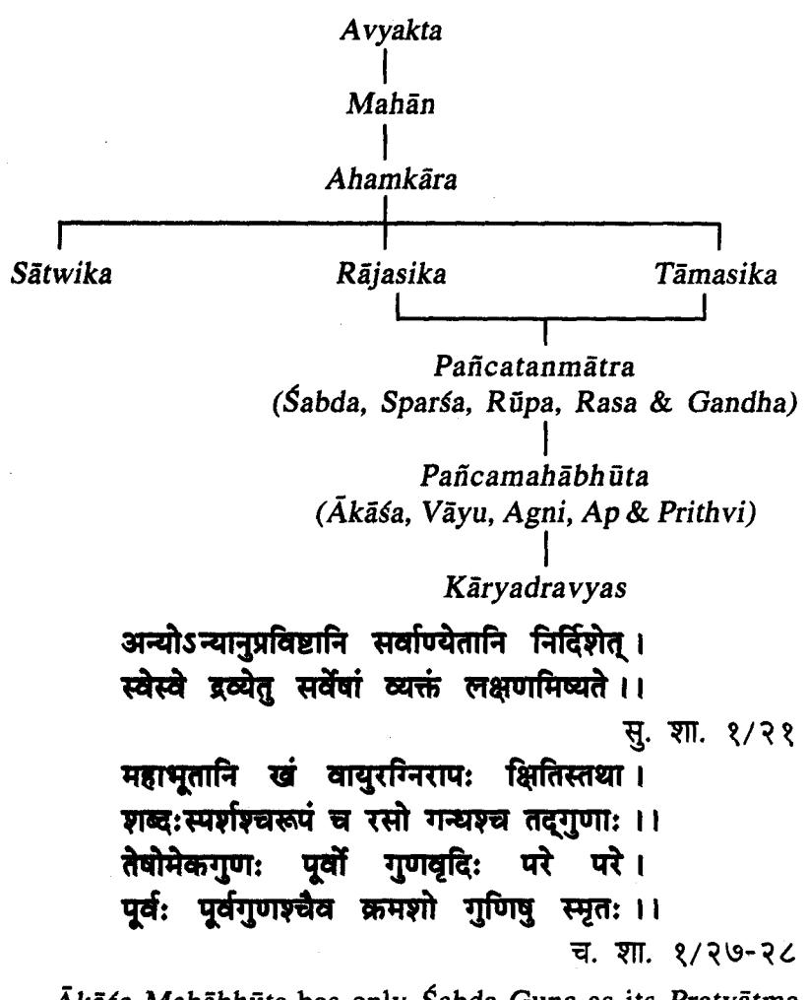

Ākāša Mahābhūta has only Śabda Guņa as its Pratyātma Guna. Based on the principle of Anyonyanupravesa each succeeding Mahabhūtas will encompass one additional Guna. Thus Vayu Mahābhūta has Sparsa as its Pratyātma Guņa along with Sabda Guna. Finally Prithvi Mahabhuta comprises five qualities i.e. Sabda, Sparsa, Rupa, Rasa & Gandha.

### Dravya Auşadhatwa

अनेनोपदेशेन नानीषधिभूतं जगति किञ्चिद्रव्यम्पलभ्यते तां ता युक्तिमध्यँ च तं तमभिप्रेत्य । च. सू. २६/१२

अनेन निदर्शनिन नानीषधिभूतं जगति किश्चिद्रव्यमस्तिः । सु. सू. ४१/५

रसादि भेदैरिति भेषजानां दिश्मात्रमुक्तं न यतोऽस्ति किसित् अनीषयं द्रव्यमिह........... । अ. सं. सू. १२/१२

All the Karyadravyas are Ausadha, there is no Kāryadravya in this universe which is devoid of medicinal properties. These Dravyas needs to be used acc to one's Yukti and Artha. In this context Yukti means using the Dravyas for the purpose of Ausadha in the form of Swarasa, Kalka etc. and Artha means using the Dravyas for the purpose of treatment to perform Vamanadi Karma.

इत्यं च नानौवधीभूतं जगति किशिद् द्रव्यमस्ति विविधार्यप्रयोगवशात् । अ. सं. स. १७/२०

There are no plants in this universe which are devoid of medicinal properties. But one should know proper usage of plants.

#### भिषग्रव्याव्यावरणाता रोगी पादचतुष्टयम् । च. सू. ९/३

Four factors which are essential for the Cikitsa (Treatment) are Bhisak (Doctor), Dravya (Substance/drug) Upsthata (Attender) and Rogi (Patient). Among these four, Dravya is mentioned 2nd only to Bhisak, because of the Ausadhatwa (Medicinal properties).

#### बहुतातत्रयोग्यत्वमनेकविधकल्पना -संपच्चेति चतुष्कोऽयं द्रव्याणां गुण उच्यते ।। च. स. ९/७

A Dravya can be utilised for Cikitsa, only when it possess these four important characteristics. Those are :

(i) Bahuta-Commonly and abundantly available.

(ii) Yogyatva-Should be apt in the given conditions.

(iii) Anekavidhaklpana-Can be utilised in different forms.

(iv) Sampath-Should have best therapeutic qualities.

# द्रव्यरसगुणवीयविपाकनिमित्ते च क्षयवृद्धी दोषाणां साम्यक्त । सु. सू. ४६/३

Susruta is of the opinion that the condition of the Dosas (Ksaya-Vrddhi & Samya) in the body depends on the Rasadi Gunas (Rasa, Guna, Vīrya & Vipāka).

#### Dravyaguna Vijñāna

# गुणा या उक्ता द्रव्येषु शरीरेष्वपि ते तथा । स्थानवृद्धिक्षयास्तस्माद् देहिनां द्रव्यहेतुका: ।।

सु. सू. ४२/१२

The qualities present in the Dravyas are also present in the human body, hence it is the Dravya which is responsible for Vrddhi (increase) and Ksaya (decrease) of Dosa.

# योगादपि विषं तीक्ष्णं उत्तमं भेषजं भवेत् । भेषजं चापि दुर्युक्तं तीक्ष्णं सम्पद्यते विषम् ।। च. सू. १/१२६

Even a poisonous drug, when used skilfully becomes the best medicine and the best medicine when improperly administered transforms into poison.

#### Dravva Prādhānvata

प्रथकत्वदशिनामेष वादिनां वादसंग्रहः । चतुर्णामपि सामग्र्यमिच्छन्त्यत्र विपश्चितः ।। तदद्रव्यमात्मना किंचित्वित्विद्वीर्येण सेवितम् । किंचिद्रसविपाकाभ्यां दोषं हन्ति करोति वा ।।

सु. सू. ४०/१३-१४

एवं द्रव्यरसवीर्यविपाकवादिनां सविवादहेतुनि मतानि निर्दिश्य स्वमतं द्रव्यादिसामग्र्यलक्षणं निर्दिशन्नाह-प्रथक्तवदर्शिनामित्यादि । प्रथक्तव दर्शिनां भेददर्शिनाम्, एष वादसंग्रह इति योज्यम् । वादसंग्रहश्य द्रव्यं प्रधानं, रसा: प्रधानमित्यादिक: । स्वमतमाह-चतुर्णामित्यादि । चतुर्णां रसगणवीर्यविपाकानाम । अपिशब्दः समुच्चये । न केवलमेकस्य द्वयोस्त्रयाणां वा, चतुर्णामपीत्यर्थः । सामग्र्यं समुदायत्वम् । डल्हण-सु. सू.-४०/१३-१४

Each Padartha has been considered important and accordingly debated to be the prime one. Eventhough the Sapta Padarthas are responsible for Karma, they reside in the Dravya and so have no independent existence without Dravya. Hence Dravya becomes the most important off all Padarthas.

The same is further reiterated by the following ref :

द्रव्यमेव रसादीनां श्रेष्ठं, ते हि तदाश्रया: ।

अ. हृ. सू. ९/१

Dravya Vijñana

रसादीनामिति निर्धारणे षष्टी । रसवीर्यादीनां मध्ये द्रव्यमेव प्रधानम् । कुतः ते-रसादयो, हि यस्मात्, तदाश्रया:-तदेव द्रव्यमाश्रयो येषां त एवम । अत एव केवला रसादयो नोपलभ्यन्ते । तस्मात् द्रव्यं प्रधानम् । अरुणदत्त

> पाकोनास्ति विनावीर्याद्वीर्यं नास्ति विना रसात् । रसो नास्ति विना द्रव्यादृष्यं श्रेष्ठतमं स्मतम् ।। सु. सू. ४०/१५

Vipāka depends on Vīrya, Vīrya inturn depends upon Rasa and there is no Rasa without Dravya. Thus Dravya becomes superior.

द्रव्यरसयोरन्योन्यापेक्षिकं जन्म स्मृतम् । अन्योन्यापेक्षिकं जन्म यथा स्याद्देहदेहिनो । वीर्य संज्ञा गणा येऽष्टौ तेऽपि द्रव्याश्रया: सप्तता: । निर्गणास्त भवन्त्येते । । स्मृताः । । गणार यस्मान्द्धि विपच्यन्ते न वड्सा: । द्रव्याणि जेयं. द्रव्यमतो श्रीषा भावास्तदाश्रयाः ।। स. स. ४०/१६-१८

Finally, Acarya Susruta concludes that Dravya and its Asírita Gunas are like Deha & Atma. Astavidha Gunas which are considered as Vīrya reside in the Dravya and not in the Madhuradi Rasa. As per the Śloka, 'निर्गूणस्तू गणा: स्मृता:' Rasa cannot give shelter to Guna, as Rasa itself is a Guna. As all the factors take shelter in the Dravya, Dravya is Pradhana (important).

With the above factors, it can be concluded that Dravya is Pradhana as it is the substratum and is independent, whereas Rasa. Guna. Vīrva. Vipāka depend on Dravya as they reside in Dravya. Hence they are inferior to Dravya.

Susruta and Badanta Nagārjuna have given 12 points and explanations.

#### 1. व्यवस्थितत्वात् (Stable)

व्यवस्थितत्वात् इह खल् द्रव्यं व्यवस्थितं न रसादयः, यथा-आमे फले ये रसादयस्ते पक्वे न सन्ति: । स्. सू. ४०/३

Vyavasthitatva means to remain stable. Drayva is stable where as the Rasadi constituents which reside in the Dravya are not stable.

For e.g. Amra (Mango), when tender and unripe is Kasaya. Amla and green in colour. As it grows, it becomes Amla and when it is fully ripe it is Madhura. This means the qualities of a Dravya, like appearance, taste, smell changes, yet the original Drayva remains the same and is known by the same name like Āmra (Mango).

# . 2. नित्यत्व (Eternal)

नित्याच्च, नित्यं हि द्रव्यमनित्या गुणाः, यथा कल्कादिप्रविभागः, स एव सम्पन्नरसगन्धो व्यापन्नरसगन्धो वा भवति: । स. सू. ४०/३

Nitva means eternal. Dravya is eternal while the Rasadi Pancakas are not. Certain qualities like Rasa. Vīrva get depleted or lost due to the effects of air, water and time.

For e.g. Kalka (Paste), Swarasa (Juice) etc. may loose taste & smell, still they will be called as the Kalka. Swarasa of that Dravva itself.

Campaka flower, in course of time gets dried up and may loose its fragrance completely. But still it will be recognised as the dried flower of 'Campaka' only.

नित्यत्वात क्रियाकालावस्थितास्वादित्यः । अनित्या गणा इति विनाशिन इत्यर्थः । कल्केत्यादि आदिग्रहणात् स्वरस श्रतश्रीतफाण्टानामपि ग्रहणम् । स एव कल्कादिप्रविभाग एव । संपन्नरसगन्धो वा भवतीति संयुक्त रसः संयुक्तगन्धो वा भवतीत्यर्थः । एतेनेतदक्तं भवति-कल्कास्यवस्थास्वपि द्वव्यं तदेव नान्यतरद्वयं, रसगन्धौ त्वन्या संयक्तौ भवत ब्रति गणादनित्यात द्वव्यं नित्यम । अन्ये करुकादि स्थाने 'कालादि प्रविभागात् इति पठन्ति । तेवां मते आदिश्रहणाज्जलवातदेशसोमसूर्या ग्रह्मन्ते । तद्यथा-'ता एवौवध्ययो यीघ्मे नि: सारा रुक्षा' इत्यादि । डल्हण-सु. सू-४०/ ३

नित्यत्वाच्येति नित्यत्वं रसादिनाशेऽध्यवस्थितत्वमिह ज्ञेयं, व्यवस्थितत्वं त रसान्यभात्वे तद्रपतया व्यवस्थितत्वमिति भेदः । कालादीत्यत्रादिशब्देन जलवातादयो ग्रामी । चक्रपाणि

#### 3. स्वजात्यवस्थान (Specificity)

स्वजात्यवस्थानाच्च, यथा हि पार्थिवं द्रव्यमन्यभावं न गच्छत्येव श्रीषाणि ।

सु. सू. ४०/३

स्वस्यां पार्थिवादि जाताववस्थितत्वादित्यर्थः । अन्य भावं न गच्छति आप्यादि जातिं न गच्छति । डल्हण

स्वजात्यवस्थानादिति परिणामेऽपि द्रव्यं स्वजाताववतिष्ठते न जात्यन्तरं भवति, पार्थिवं तु पार्थिवमेव यदाप्यं तदाय्यमेवेस्यादि स्वजात्यपरित्यागः रसस्तु क्षीरमधरत्वं परित्यज्याम्लतां यातीत्यनसरणीयं आतिश्चेह मित्यादि जातिभेदो नोब्दवनीयः । चक्रपाणि

Even if a Dravya is under the influence of Kala etc., it doesnot leave its Pārthivādi nature. But Rasādi Pañcaka are not so. Once the Rasa of a Dravya changes, then it completely looses the qualities of its original Rasa.

For e.g. Initially curds is sweet to taste. After sometime it becomes sour. This means that Madhura Rasa is replaced by Amlatya. Yet the basic nature of curds doesnot change. All that is Parthiva remains to be Parthiva till the end, only the qualities or properties change.

# 4. पश्चेन्द्रिय ग्रहण (Perceptible through five senses)

पञ्चेन्द्रियग्रहणाच्च, पञ्चभिरिन्द्रयैगृह्णते द्रव्यं न रसादयः । स्. सू. ४०/३

पञ्चभिरिन्द्रियेद्रव्यं गृहाते, द्रव्ये गृहीते तदाश्रया गुणा गृहीता भवनित; गणाश्च शब्दस्यर्शिकपरसगन्धाः । द्रव्ये शब्दोऽप्यस्ति; यथा-पार्थिवद्रव्ये कटकटा शब्दः, आप्ये खलाखलाशब्दः; तैजसे तटतठाशब्द इत्यादिक: । वायव्यव्रत्यू-माकाश्रव्यं चानुमानग्राह्ममूर्तत्वात् । न रसादय इति रसगुणवीर्यविषाकस्तु न पञ्चेन्द्रियमान्या इत्यर्थः । ड़लुग

पञ्जामिरिन्द्रियद्रव्यं प्रह्मते इति चश्चया स्पर्शनन तावद्यव्यवृद्यमविवाद सिब्धमेवः, घाणरसनाश्रोत्राणमपि सरभि चन्दनं. मधर: कोषकार:. तथा सस्वरा वीणेत्यादि समानाधिकरण्यज्ञानेन द्रव्यग्रहणं प्रतिस्फुटतर-व्यापाराद् द्रव्यमाहकत्वं श्रेयम् । चक्रमणि

Dravya can be percieved through all the five sense organs, but Rasadi can not be assessod by all the sense organs. Eventhough Guna can be assessed through more than one Indriya, it is Asrayī in Dravya, hence Dravya should be considered as important because it gives shelter to Guna also. Involvement of Pañcendriya with Dravya may be known with the examples.

For e.g. Nagakeśara Puspa

Gandha-Has fragrance

Rasa-Kasava to taste

Rupa-Petals resemble hood of cobra

Sparsa-Soft to touch

Sabda-When dried, becomes powder with sound if crushed.

5. आश्रयत्व (Shelters)

आश्रयत्वाच्च. द्रव्यमाश्रितारसादय: । स्. सू. ४०/३

आश्रयत्वादित्यादि । आश्रय इदं द्रव्यं रसादीनाम् । डल्हण

आश्रयत्वाच्चेति रसादीनां द्रव्यमाश्रयः. तेनाश्रित रसादयः परतन्त्रत्वादप्रधानाः. आश्रयस्तु प्रधानमित्यर्थः । चक्रपाणि

Dravya gives shelter to the five Padārthas i.e. Rasa, Guna. Vīrya and Prabhāva. One which gives Asraya (shelter) is Pradhana (Important).

6. आरम्भ सामर्थ्य (Initiation for treatment)

आरम्भसामध्याच्च, द्रव्याश्रित आरम्भ:, यथा-'विदारिगन्यादिमाहत्य संक्ष्य विपचेत् इत्येवमादिषु न रसादिष्वारम्भः । सु. सू. ४०/३ आरम्भसामर्थ्यात उपक्रमसामर्थ्यादित्यर्थः । संक्षद्य चर्णयित्वेत्यर्थः । डल्हण आरम्भश्चिकित्सायां क्रियारम्भः मुलमाहरेतेत्यादि तस्मिन् द्रव्यस्यैव सामर्थ्यं

न रसादीनामारम्भसामर्थ्यम् । अविकलेन्द्रियः पुरुषः प्रधानो दृष्टः प्रधानो दृष्टः पङ्गोरिति । भाष्य-र, वै. १

It is the Dravya which is selected for procedures and not Rasadi Gunas. In treatment, we utilise Dravyas in toto for preparing formulations. Moreover, it is not possible to seperate the individual constituents like Rasa, Guna etc., which reside in the Dravya.

For e.g. Vidārigandhādi Dravyās are advocated to be used as Kasaya or any form, it is the Drayva which is subjected to the procedure and not the Rasadigunas.

7. शाख्यामाण्यात् (Classical references)

शास्त्र प्रामाण्याच्च, शास्त्रे हि द्रव्यं प्रधानमुपदेशे योगानां, यथा-'मातुलुङ्गाग्निमन्थौ च' इत्यादौ न रसादय उपदिश्यन्तेः । स. स. ४०/३

आगमादित्यर्थः । शास्त्र एवोपदिश्यते हि-'य एव हि गुणा द्रव्ये शरीरेष्वपि ते स्मृताः । तान् द्रव्यैस्तदूगुणैरेव प्रयोगेणाभिवर्धयेत् ।' इति सामान्य प्रयोग वचने विशिष्टेन प्रयोगो निर्दिष्यते इति । भाष्य-र, वै. १

In classics it is the Dravya which are prescribed for treatment and not Rasadi in mitigating the vitiated Dosas. Eventhough Dravyasrita Gunas are responsible for Ksaya and Vrddhi of Dosa, Śāstras do not indicate the use of these properties directly.

E.g. In case of Vātaja Śotha. Agnimantha or Mātulunga may be used.

8. क्रमापेक्षितत्व (Dependence of Rasadi with Dravya )

क्रमापेक्षितत्वाच्च रसादीनां, रसादयो हि द्रव्यक्रममपेक्षन्ते, यथा-तरुणे तरुणा: संपूर्णे संपूर्णा इति: । स्. सू. ४०/३

क्रमेत्यादि । तरुण तरुणा इति अभिनवे अभिनवा इत्यर्थः । (डल्हण)

इतरेषां रसादीनां द्रव्यस्यानुवधिनात् । द्रव्यमनुवर्तन्ते हि रसादयः, तारुण्ये तरुणा: संपतयौ संपन्ना:. विपत्तौ विपन्ना भवन्तीति ये यमनवर्तन्ते ते तस्मादप्रधाना दष्टाः । तद्यथा गरो: शिष्या इति । भाष्य-र. वै. १

Rasadi constituents of a Dravya depends on Dravya itself. i.e., in an immature state, constituents residing in the Dravya are also immature or incomplete. As the Dravya matures, the Rasadi constituents too changes and acquires the mature state. This shows that the Rasadi Pancakas follow the Dravya.

#### 9. एकदेश साध्यत्व (Utility/fractionalisation)

एकदेश साध्यत्वाच्च, द्रव्याणामेकदेशेनापि व्याधयः साध्यन्ते, यथा-महाव्रक्षश्रीरेणेति ।

कस्माद्रसादीनामेकदेशेन व्याधयो न साध्यन्त इत्याह-निरवयत्वकादिति ।

अवयवेव एकदेशेन प्रदेशेन सिद्धेः. प्रयोगेष इति वाक्यशेषः यथा मलत्वा-गादिना अवयवेन यः साधयति स प्रधानो दृष्टः । भाष्य-र, वै. १

Different parts of a Dravya can be used for treatment while Rasadi cannot be used so, as they lack Avayava (parts).

For e.g. Snuhi (Euphorbia nerifolia)-Root, stem, leaves can also be used apart from Ksīra (latex).

Three more points are added by Badanta Nagariuna.

### 10. तरतमयोगानुपलब्धि (No grading)

तरतमयोगो रसादिषु दृष्टः । ....... मधुरतरो, शीततरः, शीततमः, छर्दनीयतरं, छन्दनीयतमं, लघुतरः, लघुतमः, कर्मतरं, कर्मतमम् इति । द्रव्येपुनास्ति यष्टिमधुकतरो यष्टीमधुकतमं इति । तस्मात् तरतमयोगाभावाद रसादिभ्यो द्रव्यं प्रधानमिति । भाष्य-र. वै. स. १

Taratamavoga is seen in Rasādi constituents like in Rasa-Madhura Tara & Madhura Tama, in Guna-Laghu Tara & Laghu Tama. in Vīrva-Sīta Tara and Sīta Tama and in Karma-Chardanīya Tara & Chardanīya Tama. But this type of classification is not applicable to Dravya as there is no Yastimadhu Tara and Yastimadhu Tama.

#### 11. विकल्प सामर्थ्य (Possibility of various formulations)

विविध: कल्पो विकल्प: कल्ककवायादि भेदेन, तस्मिन् विकल्पे सामर्थ्यात् भाष्य–र. वै. सू. १ तत् सर्वं द्रव्यस्मैव नान्यस्येति ।

A Dravya can be utilized in various forms like Kalka. Kasāva etc. but Rasādi Padārthas cannot be utilized in this manner.

12. प्रतीघातसामर्थ्य (Ocupying the space)

प्रतीघात आवरणं तस्मिन् सामर्थ्यं द्रव्यस्यैव भवति, मूर्तिमत्वात् । ...... प्रतिघातसामर्थ्यात् स्वस्थानऽन्यस्थान वकाशदानात् इति । रसादयः संप्रक्तास्ति । भाष्य-र. वै. सू. १ आवरणार्थोऽपि दष्टः चक्रवर्तीति ।

Among Saptapadarthas, Dravya is the only Padārtha which has definite form (Murtiman). When placed, it occupies space. Hence Dravya is important.

# Chapter-3 Classification of Dravya

### Points Dealt

- · Classification of Dravya-Acc to Chetana Achetana Bhēda
- · Classification of Dravya--Acc to Kāryakārana Bhēda
- Classification of Dravya-Acc to Yoni Bheda
- · Classification of Dravya-Acc to Utpatti Bheda
- · Classification of Dravva-Acc to Prabhāva Bhēda
- · Classification of Drayva-Acc to Pravoga Bhēda
- · Classification of Dravya-Acc to Sowmya Agneya Bhēda
- · Classification of Dravya-Acc to Rasaskandha

There are inumerable Dravyas in the universe. To use those Dravyas, proper knowledge regarding their identification, utility is very much necessary. If those are studied through their classification then understanding will be easier. The basis of classification is on their internal and external similarities like wise for the proper understanding of various substances, those dravyas are classified into Chetana & Achetana, Yoni Bheda etc.

# I. Classification of Dravya acc to Chetana Achetana

| तच्चेतनावदचेतनम् ।                             | च. सू. २६/१० |
|------------------------------------------------|--------------|
| सेन्द्रियं चेतनं द्रव्यं, निरिन्द्रियमचेतनम् । | च. सू. १/४८  |

All the Dravyas in the universe are divided into two groups i.e. चेतन (Animate) & अचेतन (Inanimate).

चेतन द्रव्य-A Dravya which exhibits conciousness as a result of union with the Atma and having Indriya is Chetana Dravya.

E.g. Manusva (Human), Pasu (Animals), Vriksa (Tree).

अचेतन द्रव्य-A Dravya which will not exhibit any conciousness and will not have any Indriya is called Achetana Dravya.

E.g. Swarna (Gold)

Note : In our practice plants are used in Achetana form but these are basically alive, they are considered under Chetana Dravya.

In Veda, Chetana and Achetana are refered as (Sasana) and (Anaśana) respectively.

ततो विष्ठाङ्व्यक्रामत् साशनाशने उभे । पुरुषसुक्त, मं. ४

Chetana Dravya is again classified into (Antascetana) अन्तश्चेतन and बहिरन्तश्चेतन (Bahirantascetana) depending upon their activities.

अन्तरचेतन (Antascetana) Dravyas where their activities are hidden, in the sense thev are not clearly evident. E.g. Ausadhi Dravyas like trees, creepers, herbs etc.

तथाहि-सर्यभवताया यथायथा सर्यो भ्रमति तब्या तथा भ्रमणात द्वगनमीयते: तथा लवलीमेघस्तनित श्रवणात् फलवती भवति, तेन श्रोतुमनुमीयते: बीजपुरकमपि श्रगालादिवसागन्येनातीव फलवद्धवति. तेनघ्राणमनमीयतेः चतानां मलस्यवसासेकात् फलाख्यतया रसेनमनमीयते: लज्जालोइव हस्तस्पर्शमात्रेण संकुचितपत्राया: स्पर्शानुमानम् । च. सू. १/४८ (च. द.)

In classical texts there are examples to prove that Vanaspatis also have sense organs (इन्द्रिय).

1. Surva Bhakta (Sunflower) follows the sun movement is an example where inference can be done that this movement may be because of Chaksunndriya.

2. Lavali (Cicca acida) gives fruits when there is thunder.

3. Beeja pūra fruiting after exposure to fox's muscle fat.

4. Chūta (Mango) yeilds more fruits after spraying Matsya Vasa (Fish fat).

5. Lajjalu (Mimosa pudica) folds its leaves when one touches it.

#### बहिरन्तश्चेतन (Bahirantascetana)

In these groups the Dravyas which have movements which are very evident.

E.g. Animals.

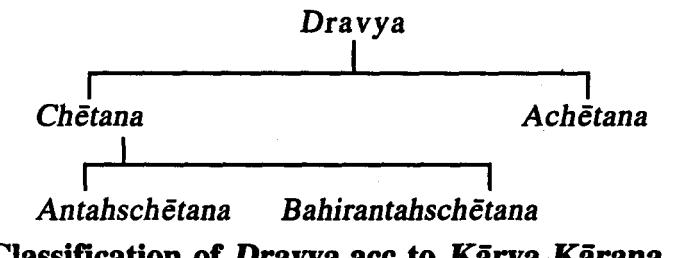

#### II. Classification of Dravya acc to Kārva Kārana Bheda खादीन्यात्मामन: कालोदिशाश्च व्रव्यसंग्रह: 1 च. सु. १/४८ सर्वद्रव्यं पार्श्वभौतिकमस्मिन्नर्थे । च. सू. २६/२०

Total creation may be classified into two groups : i.e. Kārana Dravya (Causual materials) & Kārva Dravvas (Effectual materials).

#### Kārana Dravyas

These are causual materials that, are fundamentals of any Dravya through which creation is possible. There are 9 Karana Dravyas. i.e.

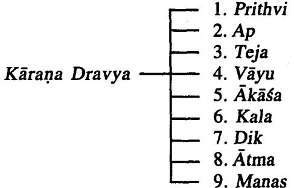

#### Kārya Dravyas

Karya Dravyas are made up of Pañcabhūta and they are innumerable.

E.g. Satavarī, Aśwagandha.

#### III. Classification of Dravya acc to Utpatti Bheda

The Dravyas used in the treatment are made up of Pañcamahabhūta. Eventhough all have Pañcabhūta Amsas, depending on the Utkarsa (predominance) of the Mahabhuta the Dravyas are categorised into 5 divisions. "व्यपदेशस्त् भूयसा"

(स. सू. ४१). Moreover the main characteristic feature of the Dravya is brought by the predominant Mahabhuta.

Pārthiva Dravya Āpya Dravya Agneva Dravya Dravya -Vayavya Dravya Ākāšīya Dravya

पार्थिव द्रव्य : तत्र द्रव्याणि गुरुखरकठिनमन्दस्थिरविशद्यसान्द्रस्युलगन्धगण बहुलानि पार्थिवानि, तान्युपचयसंघातगौरव स्थर्यकराणि; च. सू. २६/११

जलीय द्रव्य : द्रवस्निग्धशीतमन्दमदुपिच्छलरसगुणब्रहूलात्याप्यानि, तान्युप-क्लेदस्नेहबन्यविष्यन्दमार्दवप्रद्वादकराणि । च. स. २६/११ शीतस्तिमितस्निन्यमन्दगुरुसरसान्द्रमुदुपिच्छलं रसबहुलमीष-

त्कषायाम्ललवणं मधुररसप्रायमाप्यम् । तत् स्नेहनहादन क्लेदनबन्धनविष्यन्दनकरमिति ।। सु. सू. ४१/५

तैजस द्रव्य : उष्णतीक्ष्णसक्ष्मलघुरुक्षविश्वरुपगणबहलान्यग्नेयानि. तानि दाहपाकप्रभाप्रकाशवर्णकराणिः च. सू. २६/११ उष्णतीक्ष्णसक्ष्मरुक्ष खरलघुविशाद रूपगणबद्धलमीषद्रम्ल-लवणं कटकरसप्रायं विशेषत्रम्चोर्थ्वगतिस्वभावमिति तैजसम् । तद्रद्वपचनदारणतायनप्रकाशनप्रभावर्णकरमिति । सु. सू. ४१/६

वायव्य द्रव्य : लघुशीतरुक्ष खरविशदस्म्भस्यर्गगुणबद्धलानि वायव्यानि, तानि रौक्ष्यग्लानिविचारवैशाद्यलाधवकराणि ।

च. सू. २६/११

सक्ष्मरूक्षस्वरशिशिरलघुविशदस्पर्शबद्धलमीषतिक्तं विशेषतः कषायमिति वायवीयम् । तद्रश्राव्यलायवरलपनविरुक्षणविचा-रणकरमिति । सु. सू. ४१/७

आकाशीय : मदुलघुसुरम्भूलक्ष्णशब्दगुणबद्धलान्याकांशात्मकानि, तानि मार्दवसौषिर्यलाघवकराणि । द्रुष्य च. सू. २६/११ श्लक्ष्णसुक्ष्ममुद्रव्यवायिविश्रादविविक्तमव्यक्तरसंशब्दबहुल माकाशीयम् तन्मार्दवसौविर्य्यलाघवकपूमिति ।

सु. सू . ४१/८

तत्र, पृथिव्यप्तेजीवाय्वाकाशानां समुदायाद् द्रव्यभिनिवृत्तिः, उत्कर्षस्त्वभि-व्यक्षको भवति इदं पार्थिवमिदमाप्यमिदं वायव्यमिदमाकाशीयमिति ।

सु. सू. ४१/३

पार्थिव द्रव्य : तत्र, स्थूलसारसान्द्रमन्दस्थिर खरगुरुक्त विनगन्यबद्धलमीवरकषाय प्रायशो मधुरमिति पर्थिवम् । तत् स्थैर्यवल गौरव सङ्कातोपचयकर विश्लेषत-श्चाधोगतिस्वभावमिति । सु. सू. ४१/४

| SI.<br>No. | Varga    | Indri-<br>yārtha | Rasa                                     | Guna                                                                                  | Karma                                                                              | Vipāka |
|------------|----------|------------------|------------------------------------------|---------------------------------------------------------------------------------------|------------------------------------------------------------------------------------|--------|
| 1.         | Pärthiva | Gandha           | Madhura<br>Kaşāya                        | Guru,<br>Khara,<br>Kathina,<br>Manda,<br>Sthira,<br>Višada<br>Sthūla                  | Upacaya,<br>Sanghāta,<br>Gaurava<br>Sthairya Kara<br>Adhõgāmi                      | Guru   |
| 2.         | Apya     | Rasa             | Madhura<br>Isatkasāya<br>Amla,<br>Lavana | Drava,<br>Snigdha<br>Sīta,<br>Manda,<br>Mridu,<br>Picchila<br>Guru.<br>Sara<br>Sandra | Upaklēda,<br>Snēhana<br>Bandhana<br>Visyandana<br>Mārdavakara<br>Prahladaka        | Guru   |
| 3.         | Taijasa  | Rūpa             | Kațu<br>İşat  Amla<br>İsat Lavana)       | Usna,<br>Tīksņa<br>Suksma<br>Laghu<br>Ruksa<br>Višada<br>khara                        | Dāhakara<br>Pākakara<br>Prabhavarna<br>Kara<br>Dārana<br>Urdhwa-<br>gami<br>Tāpana | Laghu  |
| 4.         | Vayavya  | Sparša           | Kaṣāya<br>İşat Tikta                     | Laghu<br>Sīta<br>Rūksa<br>Khara<br>Višada<br>Sūksma                                   | Rouksya<br>Glāni<br>Vaisadya<br>Laghavakara<br>(Vichāraņa)                         | Laghu  |

| Akāšīva | Sabda | Avyakta | Mrdu     | Mārdavakara   Laghu |  |
|---------|-------|---------|----------|---------------------|--|
|         |       |         | Laghu    | Sousirya            |  |
|         |       |         | Sūksma   | Lāghavatara         |  |
|         |       |         | Slaksana |                     |  |

IV. Classification of Dravya acc to Source (योनि भेद) तत्पनस्थिविधं प्रोक्तं जाङ्गमौद्धिद्वपार्थिवम् । च. स. १/६८

....... द्रव्याणि पुनरोषधयः । तासू द्विविध:-स्थावरा जाङ्गमश्च ।

सु. सू. १/२८

Caraka divided the Dravya into 3 divisions on the basis of source.

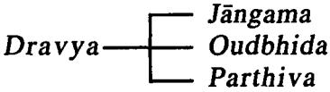

Susruta has mentioned only two types on the basis of source.

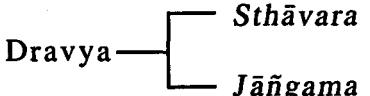

Sthāvara Dravya

उन्द्रिद्य पुथिवीं जायते इति औद्दिद्वम् । (च. द.-च. सू.-१/६८)

Oudbhida Dravyas are of herbal source and which sproutes and grows by piercing the soil.

E.g. Harītaki, Amalaki

.... औद्दिदं तु चतुर्विधम् । वनस्पतिस्तथा दीरूद्धानस्पत्यस्तथाषधिः ।। फलैर्वनस्पतिः पुष्पैर्वानस्पत्यः फलैरपि । ओषध्यः फलपाकान्ताः प्रतानैर्वीरुधः स्मृताः । च. सू. १/७१-७२

Oudbhida Dravyas are again classified into 4 types on the basis of their nature.

Vanaspati Vīrudha Oudbhida Vānaspatya Dravya Ousadhi

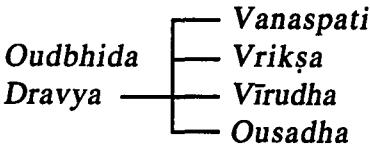

#### Vanaspati

फलैर्वनस्पतिरिति विनापुष्यः फलैर्यक्ता वटोदम्बरादयः ।

च. स. १-७२ (चक्रपाणि)

अपूर्ध्या इति अविधमानपुष्याः फलवन्त इति फलं येषामस्ति ते वनस्पतय इति: के पुनरीदृशा: ? प्लाक्षोदुम्बरादय: । सु. सू. १/२९ (डल्हण)

अपूर्धा इति पुष्पाणामतिसुक्ष्मतया पुष्पाधारकणिकया (Receptacles) आच्छादितत्वाच्च अदृश्यपुष्णा इत्यर्थः । Y. T. A.

The plants which will not have visible flowers are included under Vanaspati.

E.g. Vața, Udumbara, Plaksa etc.

- Vīrudha
प्रतानशब्देन लतागुल्माश्च य्रह्मन्ते । च. सू. १/७२ (चक्रपाणि) लता गल्माप्रच वीरुध: । हारीत

प्रतानवत्य इत्यादि प्रतानवत्यो विस्तारवत्यः वीरुधः,

न केवलं प्रतानवत्यो वीरुधः स्तर्खिलन्यश्च गुल्मिन्यूश्च,

गुल्म पुन: वर्तुललतासन्ततिविटप: ताश्च विदारीकोलवल्ली शालयर्णी-पुष्ट्रिनपर्णीप्रभुतयः । सु. सू. १/२९ (डल्हण)

Those plants which are weak stemmed are known as Vīrudha. Vīrudha is of two types (1) Latā and (2) Gulma.

Lata -> Climbers, Amrita (Tinospora cordifolia), Jivanti (Leptadenia reticulata).

Gulma -> Shrubs, Karavīra (Nerium odorum)

#### iii) Vānaspati/Vriksa

पुष्पैर्वानस्पत्यः फलैरपीति पुष्पानन्तरं फलभाज इत्यर्थः ।

च. सू. १/७२ (चक्रपाणि)

पुष्पफलवन्तो वक्षा इति उभययुक्ता वृक्षाः के ते ? आम्रजम्बप्रभृतयः । सु. सू. १/२९ (डल्हण)

The plants which bear visible flowers and then bear fruits are called Vanaspati, Susruta has given the term "Vriksa".

E.g. Amra (Mango), Jambu (Jamun)

iv) Ousadhi/Osadhi

फलस्य पाकादन्तो विनाशो येषां तिलमुद्रादीनां ते फलपाकान्ताः ।

च. सू. १/७२ (चक्रपाणि)

फलपाकनिष्ठा इति निष्ठानाशः फलपाकेन परिणत्या नाशो यासां तास्तथोक्ताः. ते पुनर्गोधुमादयः । अन्य तु निष्ठाशब्दं प्रत्येकं संवधननित, फलनिष्ठा पाकनिष्ठा इति: तत्र फलनिष्ठा: शालितिलकुलत्यादय:, पाकनिष्ठा:कवकादय: कवकरखात्रक उच्यते । सु. सू. १/२९ (डल्हण)

The plants which dry and end its life by giving fruits are called Ousadhi.

E.g. Tila (Sesamum indicum), Mudga, Godhuma (Wheat).

The plant once grow will also die without giving fruit.

E.g. Dūrva

Oudbhida Gana

मुलत्वक्रसारनिर्यासनाल(उ) स्वरसपल्लवा: । क्षाराः क्षीरं फलं पुष्यं भस्मतैलानि कण्टकाः ।। पत्राणि शुङ्गा कन्दाश्च प्ररोहाश्चौद्धिदो गणः ।।

च. सू. १/२३

Charaka quoted Oudbhida group. Here the parts of the drug and formulation prepared from the drugs are included.

| i) मूल (Root)                                     | x) फल (Fruit)                 |
|---------------------------------------------------|-------------------------------|
| ii) त्वक् (Bark)                                  | xi) पुष्प (Flower)            |
| iii) सार (Heart word/sap)                         | xii) भस्म (Ash)               |
| iv) निर्यास (Exudate/Gum)         xiii) तैल (Oil) |                               |
| v) नाल (Tube)                                     | xiv) कण्टक (Thorns, prickles/ |
|                                                   | spine)                        |

vi) स्वरस (Fresh juice) vii) पल्लव (Tender leaves) viii) क्षारा (Alkaline preparation) ix) क्षीर (Latex)

xv) पत्र (Leaves) xiv) शुङ्ग (Terminal buds) xv) कन्द (Tubers)

xvi) प्ररोह (Arial roots/climbing stems)

#### Jañgama

जङ्गमाः खल्वपि चतुर्विधाः -- जरायुजाण्डजस्वेदजोद्धिजाः । सु. सू. १/३० Jañgama is divided into 4 types

> Jarāvuja Andaja Swēdaja Udbhija

Jarāyuja

तत्र पशुपक्षिमनुष्यव्यालादयो जरायुजाः । सु. सू. १/५०

जरायुजादिषु पूर्वोक्त संस्वेदजादिक्रमत्यागो योनिसंकरं बोधयतिः तेन पक्षितषु बलाका जरायुजा अण्डजा चेति, सर्पजातिषु अहिपताका जरायुजा, संस्वेदजेष्ठ्यापि काश्चित् पिप्पीलिका अण्डजा उद्धिजाश्च । व्यालादय इति व्याला हिंस्त्रपश्च्याधादयः अन्ये तु पशुप्रहणादेव हिंस्त्र पशनामपि यहणमिति व्यालशब्देन सर्यविशेषमाहः ।

Animals which take birth by Placenta (through Yoni).

E.g. Pasu (Other animals), Manusya (Human being), Vyala (Tiger).

Andāja

खगसर्पसर्रासरीसपप्रभुतयोऽ ण्डजाः । सु. सू. १/३०

खगसर्पेत्यादि खुगा: पक्षिण: सर्पामन्दगामिनोऽजगरप्रभृतय:, सरीसपा: शीघ्रगामिन: कृष्ण सर्पादय: मीनमकरादयो वा; प्रभृतिग्रहणात् कूर्मनक्रादीनां ग्रहणं, केचित् प्रभृतिशब्दमपठित्वा लुप्तनिर्दिष्टनादिशब्देनकूर्मादीन् गृहणन्ति । सु. सू. १/३० (डल्हण)

One which have their birth through eggs called Andaja Dravya.

E.g. Khaga (Birds), Sarpa (slow moving snakes),

Sarisrapa (Snakes which are moving fast like king cobra). Kūrma (Tortoise), Nakra (Crocodile).

Swēdaja कुमिकीटपिपीलिकाप्रभृतयः स्वेदजाः । सु. सू. १/३०

क्रमिकीटेत्यादि क्रमय: कोष्ठपुरीषादिबाष्पसंभवा: कीटावृश्चिकषड्बिन्दु प्रभृतयः पिपीलिकाश्चिटिकाः, प्रभृतिग्रहणादेवं विधा अन्येऽपि दृश्यन्ते ।

- सु. सू. १/३० (डल्हण)
सु. सू. १/३०

The creatures which have their birth in the dirty water.

E.g. Krimi (Worms) -- Kosta Krimi > Purisaja Krimi

> Pipilika-Ants Vrścika-Scorpion

Udbhija

इन्द्रगोपमण्डूकप्रभृतय उद्धिजाः ।

इन्द्रगोपड्त्यादि इन्द्रगोपा: प्राकृट्कालजा अतिरिक्तकृमय: इन्द्रवधू इति लोके प्रभृति ग्रहणादीदशा अन्येऽपि । सू. सू. १ (डल्हण)

The smaller creatures and animals lie below the surface of the earth and when the season comes they will come out of the earth, but basically they are Andaja

E.g. Indragõpa

Manduka (Frog) जङ्गमेभ्यश्चर्मनखरोमरुधिरादयः ।।

सु. सू. १/३१

मधुनि गोरसा: पित्तं वसा मज्जाऽसुगामिषम् ।

विण्मूत्रचर्मरेतेस्थिस्नायुशृङ्गनखाः खुराः ।

जङ्गमेभ्यः प्रयुज्यन्ते केशा लोमानि रोचनाः ।। च. सू. १/६८-६९

Both Caraka and Susruta enumerated different sources and products of animals.

- 1. Carma-Skin 10. Vit-Faeces
- 2. Nakha-Nails
- 3. Rõma-Hair 4. Rudhira-Blood
- 11. Mūtra-Urine
- 12. Rētas-Semen
- 13. Asthi-Bone
- 5. Gorasa-Milk & Milk products 14. Snāyu-Ligaments

#### Classification of Dravya

| 6. Madhu-Honey                                               | 15. Śringa-Horns        |  |  |  |
|--------------------------------------------------------------|-------------------------|--|--|--|
| 7. Pitta-Bile                                                | 16. Khura-Hoof          |  |  |  |
| 8. Vasa-Muscle fat                                           | 17. Keśa-Hair           |  |  |  |
| 9. Majja--Bone marrow                                        | 18. Loma-Body hair etc. |  |  |  |
| Pārthiva                                                     |                         |  |  |  |
| सूवर्ण  समलाः  पञ्चलोहाः  संसिकताः  सुधा  ।                  |                         |  |  |  |
| मन:शिलाले मणयो लवणं गैरिकाञ्जने ।।                           | च. सू. १/७०             |  |  |  |
| भौममौषधमुद्दिष्टम्                                           |                         |  |  |  |
| पञ्चलोहा  इति  इति  ताम्ररजतत्रपुशीशकृष्णलोहानां  ग्रहणम्  । |                         |  |  |  |
| समला इति मलशब्देन शिलाजतूनि लोहमलरूपाणि गृह्यन्ते । चक्रपाणि |                         |  |  |  |

The substances which are found underground are called Parthiva Dravya. Commonly seen substances like ores, metals, salts are included under Pārthiva Dravyas.

In Caraka Samhita Suvarna, Śilajatu, Pañcaloha (Tāmra, Rajata, Trapu, Śīsa, Krsnaloha), Sikata (Sand), Sudhā, Manaśila, Lavana (Salt), Gairika etc.

#### V. Classification of Dravya acc to Prayoga

Depending on the usage of the Dravya, it may by classified into two types.

# यवाग् साधनद्रव्यं तावद द्विविधं वीर्य प्रधानमौषधद्रव्यं रसप्रधानमाहारद्रव्यञ्च । चक्रपाणि-च. सू. २/१७

In the chapter of Apamarga Tanduliya of Caraka Samhita, Acarya Cakrapani explained differences between Ousadha Dravya and Āhāra Dravyas. In his opinion the Āhāra Dravya (food) have mainly dominant Rasa, hence they nourish the Dhātu (tissue) and gives strength. E.g. Godhūma, Śāli.

Ousadha Dravyas will have dominant Vīrya and they will show specific pharmacological actions for which purpose it is administered and which will bring normalcy in the Sarīra (body). E.g. Pippali, Śunthi.

यद द्रव्यमुपयुक्तं देहे रसंधातु तद द्वारा रक्तादि धातुश्रु प्राधान्येन पुष्याति, न त्वौषधद्रव्यवत् प्रधानतया देहे शीतोष्णादीन् वीर्यसंज्ञकान् गुणास्कनयति तद् रसप्रधानं, तदाहारद्रव्यम्, यव गोधूमादि । चक्रपाणि-च. सु. २

त्राप्यौषधद्रव्यं त्रिविधं वीर्य भेदात तीक्ष्ण वीर्यं यथा शण्ठ्यादि. मध्यवीर्य बिल्वाग्निमन्थादि, मदवीर्यञ्जामलकादि । सु. सू. २ (च. द.) Depending on the presence of Śīta, Usna, Rūksa etc, Vīrya Ousadha Dravya is divided into 3 types viz. Tīksna Vīrya, Madhya Vīrya and Mrdu Vīrya.

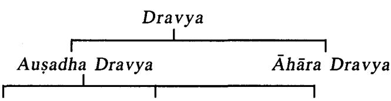

Tīksna Vīrya Madhya Vīrya

Cakrapani Datta has given certain examples for these 3 kinds of Dravyas.

Tīksna Vīrva Dravya-Śunthi Madhya Vīrya Dravvas-Bilva. Agnimantha Mrdu Vīrya-Amalaki

VI. Classification of Dravya acc to Prabhāva

किञ्चिद्दोषप्रशमनं किंचिन्द्वात् प्रद्रषणम् । स्वस्थवत्तौ मतं किञ्चित्रिविधं द्रव्यमच्यते । ।

Acc. to Prabhāva. Dravyas are divided into 3 types viz. Dosa Prasamana. Dhātu Pradūsana and Swastha Hita Dravya.

शमनं कोपनं स्वस्थाहितं द्रव्यमिति त्रिधा ।

अ. हृ. सू. १/१६

Dravya is of 3 types, viz.

Śamana (Subsides Dosa)

Kõpana (Aggravates Dosa)

Swasthahita (Maintains normalcy)

# 1. Doşa Praśamana Dravya

किंचिदिति न सर्वम । दोषस्य दोषयोदोषाणां वा प्रशमनं दोष प्रशमनम् । दोषग्रहणेन दृष्टा रसादयोऽपि ग्रह्यन्ते । तेन द्रव्यमहिम्ना यद्योषाणां द्रष्टानां रसादीनां धातुनां वा शमकमामलकद्ररालभादि ग्रह्मन्ते । आमलकं हि शिवत्वात्रिदोषहरं; दरालभा चापि वातपित्तश्लेष्महरी । यद्यपि चामलकस्य "हन्ति वातं तदाम्लत्वात"

च. सू. १८६७

इत्यादिना गुण द्वारा त्रिदोषहरत्वमूच्यते, तथाऽपि तत्प्रभावब्रहितमेव बोन्द्ध्यम् । यतस्तत्राम्स्लत्वादिना पित्तादि कोपोऽपि युज्यते, स त्यामलकप्रभावन्न भवति ।

चक्रपाणि-च. सू. १/६७

Dravyas which pacify vitiated Dosa and vitiated Rasa, Rakadi Dhātus are called Dosa Prasamana Dravya. E.g. Amalaki is Tridosahara. Duralabha is Vatapitta and Kaphahara (Tridosahara).

#### 2. Dhātu Pradūsaņa Dravya

धातुप्रदूषणमिति वातादीनां समत्वेन शरीरधारणात्मकानां तथा रसादीनां च चक्रपाणि-च. सू. १/६७ दूषणं किश्चित्, यथा-यवक मन्दक विषादि ।

Because of their nature, some Dravyas vitiate. Prākṛta Dosa and Rasādi Dhātus.

E.g. Yavaka & Mandaka Visa

#### 3. Swastha Hita Dravya

सुष्ठ् अवतिष्ठते नीरोगत्वेनेति स्वस्थः; तस्य वृत्तिः स्वस्थरूपतया अनुवर्तनं, तत्र स्वस्थवत्तौ मतमभिमतं पूजितमिति यावत् । अत्रोच्चतेस्वस्थवृत्तिमतं रक्तूशाल्यादि दोषप्रशमनमपि भवति, परं तत प्राय: स्वस्थवुजिहित्वात स्वस्थवृत्तिमतत्वेन ग्रह्मते । चक्रपाणि-च. सू. १/६७

Dravya which are very useful for the Swastha (Healthy person) that which maintains Swasthya (Healthy condition) are Swasthahita Dravya. Some times. Swasthahita Dravyas may also do Dosaprasamana.

E.g. Rakta Śāli, Godhūma etc.

Susruta and Vagbhata have enlisted Dosa Prasamana and Doşa Prakopana Dravya.

#### Vāta Samśamana Dravya

| १. रुक्षः शीतो लघुः सूक्षाश्रलोऽथ विशदः खरः । |               |
|-----------------------------------------------|---------------|
| विपरीतगुणैर्द्रव्यैर्मारुतः  संप्रशाम्यति ।।  | च. सू. १/३९   |
| २. तत्र उष्ण स्निग्धौ वातघ्नौ ।               | सु. सू. ४१/११ |
| ३. तत्र मधुराम्ल लवणा वातघ्नाः ।              | सु. सू. ४२/४  |

४. तत्र भद्रदारु कुष्ठहरिद्रावरुणमेषशुङ्कीबलातिबलार्तगलाकच्छराशाल्लकी कुबेराक्षि वीरतरु सहचराग्निमन्यवत्सादन्येरण्डाश्मभेदकालकोर्कशतावरी पुनर्नवा वसुक वशिर काश्चनक भार्गीकार्पासीवृश्चिकालीपत्तूरबद्रयवकोल कुलत्य प्रभूतीनि विदारिगंधादिश्च द्वे चाद्ये पञ्चमुल्यौ समासेन वातसंशमनो वर्ग: ।।

| स्तुं. | सू. | న | ર્વાપ |  |
|--------|-----|---|-------|--|
|        |     |   |       |  |

| Vātahara Guņa,<br>Rasa, Vipāka & Vīrya                                                                                            | Dravya                                                                                                                                                                                                                                                                                                                                                                                                                                                                            |
|-----------------------------------------------------------------------------------------------------------------------------------|-----------------------------------------------------------------------------------------------------------------------------------------------------------------------------------------------------------------------------------------------------------------------------------------------------------------------------------------------------------------------------------------------------------------------------------------------------------------------------------|
| Guna > Snigdha, Usna,<br>Guru, Sthula, Picchila etc.<br>Rasa→ Madhura, Amla &<br>Lavana<br>Vipāka→ Madhura Vipāka<br>Vīrya-> Usna | Bhadra Dāru, Kuṣṭha, Haridra,<br>Varuna, Mesaśrngi, Bala,<br>Atibala, Artagala (Kakubha),<br>Kacchura, Śallakī, Kuberāksī,<br>Vīrataru, Sahachara, Agni-<br>mantha, Vatsadanī (Gudūci),<br>Eranda, Pāsanabheda, Alarka,<br>Arka, Śatāvari, Punarnava,<br>Vasuka, Vašira (Apāmārga),<br>Kancanaka (Dhattura), Bhā-<br>rangi, Vanakārpasī, Vrścikāli,<br>Pattūra (Kucandana), Badara,<br>Yava, Kola, Kulattha, Vidāri-<br>gandhadi Dravya, Brhatpañca-<br>mūla and Laghu Pañcamula. |

#### Pitta Samśamana

| १. सस्नेहमुष्णं तीक्ष्णं च द्रवमाम्लं सरं कटु ।                         |               |
|-------------------------------------------------------------------------|---------------|
| विपरीतगुणैः  पित्तं  द्रव्यैराशु  प्रशाम्यति ।।                         | च. सू. १८६०   |
| २. शीत मृदु पिच्छिला: पित्तघ्ना: ।                                      | सु. सू. ४१/११ |
| ३. मधुरतिक्तकषाया: पित्तघ्ना: ।                                         | सु. सू. ४२/४  |
| ४. चन्दनकुचन्दन ह्रीबेरोशीर मञ्जिष्ठापयस्यविदारीशतावरीगुन्द्राशैवालकहार |               |

कुमुदोत्पलकन्द(द)लीदूर्वामूर्वाप्रभृतीनि काकोल्यादिः सारिवादिरञ्जनादिरुत्पलादिन्दर्श्य-ग्रोधादिस्तुणयञ्जूमुलमिति समासेन पित्तसंश्रामनो वर्ग: ।। सु. सू. ३९/८

| Pittahara Guna,<br>Rasa, Vipāka, Vīrya                                         | Dravya                                                                                                                                                                                                                                                                                                                 |
|--------------------------------------------------------------------------------|------------------------------------------------------------------------------------------------------------------------------------------------------------------------------------------------------------------------------------------------------------------------------------------------------------------------|
| Guna-> Usņa, Mrdu<br>Sāndra, Rūksa<br>Kasāya<br>Vipāka→ Madhura<br>Vīrya→ Śīta | Candana, Kucandana (Rakta Can-<br>dana), Hrībera, Usīra, Manjistha,<br>Rasa-> Madhura, Tikta Payasya (Ksīra Kākolī), Vidāri,<br>Satāvarī, Gundra, Saivāla, Kal-<br>hara (Raktolpala), Kumuda, Utpala,<br>Kandalī, Dūrva, Mūrva, Kākolyādi<br>Gana, Sārivādi, Añjanādi, Utpa-<br>lādi, Nyagrodhādi & Trnapañca-<br>mūla |

Kapha Samśamana

- १. गुरुशीतमृदुस्निन्धमधुरस्थिरपिच्छलाः ।
श्लेष्मणः प्रशमं यान्ति विपरीतगृणौर्गुणाः ।। च. सू. १८६१ २. तीक्ष्णरुक्षविशदा: श्लेष्मघ्ना: । सु. सू. ४१/११ सु. सू. ४२/४

- ३. कट्रतिक्तकवाया: श्लेष्मघ्ना: ।
४. कालेयकागुरुतिलपर्णीकुष्ठहरिद्रा शीतशिव शतपुष्या सरलारास्नाप्रकीयो-दकीर्येङ्गदी समना काकादनी लाङ्गलकीहस्तिकर्णमुखातकलामज्जकप्रभूतीनि वल्ली-कण्टकपञ्जूमूल्यौ पिप्पल्यादिर्बहत्यादिर्मुष्ककादिर्वचादिः सूरसादिरारग्वधादिरिति समासेन श्लेष्मसंश्रमनो वर्ग: । सु. सू. ३९/९

| Kaphahara Guna<br>Rasa, Vipāka & Vīrya                                                                                                    | Dravya                                                                                                                                                                                                                                                                                                                                                                                                               |
|-------------------------------------------------------------------------------------------------------------------------------------------|----------------------------------------------------------------------------------------------------------------------------------------------------------------------------------------------------------------------------------------------------------------------------------------------------------------------------------------------------------------------------------------------------------------------|
| Guna-> Laghu, Usņa<br>Tīksna, Rūksa, Višada<br>Rasa-> Katu, Tikta &<br>Kasāya<br>Vipāka-> Katu<br>Vīrya-> Usņa<br>(Tiksna, Ruksa, Viśada) | Kaleyaka (Variety of Candana),<br>Aguru, Tilaparnī, Kustha, Hari-<br>dra, Sitšiva (Karpūra), Satapuspa,<br>Sarala, Rāsnā, Prakīrya (Kaņṭaki<br>Karanja), Udakīrya (Cira Bilwa),<br>Ingudī, Sumana (Jāti) Kākādanī,<br>Lāngalaki, Hastikarna, Lāmajiaka<br>(Uśīrabhēda), Munjātaka, Valli-<br>pañcamula, Kantaki Pañcamula,<br>Pippalyādi, Brhatyādi, Muskakādi,<br>Vacadi, Surasadi and Aragwa-<br>dhādi Gana Dravya |

#### Vāta Kopana

तत्र ...... कट्रकवायतिक्त रुक्षलधुशीतवीर्यशाक वल्लरवर कोहालक कोर-द्रष्ट्रयामाक नीवारमुद्रमस्त्राहरेणुकलायनिष्पावानशनाविषमाशनाध्यशनवातमुत्र-प्रीषश्रक्रच्छदि क्षवश्रद्धारबाष्यवेगविधातादिभिविश्वायुः प्रकोपमापद्यते ।

सु. सू. २१/१९

त्रत्र तिक्त कटुकवायरुक्षणीतविष्टम्भिरुढकतणधान्यकलायचणककरीरतम्ब-कालिङ्गचिटविसशालक जाम्बवतिन्दुक शोकोत्कण्ठादिभिरतिसेवितैः वायुः प्रकोपमापद्यते । अ. सं. नि. १

| Vāta Kopaka Guna<br>Rasa, Vipāka & Vīrya                              | Dravya                                                                                                                                                                                                                                         |
|-----------------------------------------------------------------------|------------------------------------------------------------------------------------------------------------------------------------------------------------------------------------------------------------------------------------------------|
| Sīta<br>Rasa→ Kațu, Tikta,<br>Kasāya<br>Vipāka-> Kaṭu<br>Vīrya-> Śīta | Guna-> Rūkṣa, Laghu,  Suṣka Śāka, Vallūra (Śușka Māmsa),<br>Varaka, Uddālaka, (Araņya Ko-<br>drava), Koradūsa, Šyāmāka, Nī-<br>vāra, Mudga, Masūra, Adhaki.<br>Harēnu, Kalāya, Nispāva, Karīra,<br>Cirbhita, Biṣa, Sālūka, Jāmbava,<br>Tinduka |

#### Pitta Kopana

कट्वम्ललवणतीक्ष्णोष्णलघुविदाहि तिलतैलपिण्याककुलत्यसर्वपातसीहरितक-शाक गोधामत्स्याजविकमांसदधितक्रकूर्चिकामस्तसौवीरकसराविकाराम्लफाकेदर प्रभुतिभिः पित्तं प्रकोपमापद्यते । सु. सू. २१/२१

कद्वम्ललवणक्षारोष्णविदाहिशक्तशाण्डाकीमध्यमनमस्तदयियान्याम्लतैलकुलत्य माषनिष्यावतिलान्नकद्वरकुठेरादिवर्गाप्रातकाम्लिकापील् भल्लातकास्थिलाङ्गली मरिच-मैथनोपगमनादिभि: पित्तं प्रकोपमापद्यते । अ. सं. नि. १

| Pitta Kopaka Guna<br>Rasa, Vipāka & Vīrya                                                    | Dravya                                                                                                                                                                                                                                                                                            |
|----------------------------------------------------------------------------------------------|---------------------------------------------------------------------------------------------------------------------------------------------------------------------------------------------------------------------------------------------------------------------------------------------------|
| Guna-> Usņa, Tīkṣṇa<br>Laghu<br>Rasa-> Kațu, Amla &<br>Lavana<br>Katu Vipāka<br>Vīrya-> Usna | Tila Taila, Pinyāka, Kulattha, Sar-<br>sapa, Atasī, Harita Sāka, Matsya-<br>māms: "Ajamāmsa, Avika Māmsa,<br>Dadli., Takra, Kūrcika, Mastu,<br>Vipāka-> Amla Vipāka, Sauvīraka, Sura, Madya Vikāra,<br>Amlaphala, Amrātaka, Amlika,<br>Pīlu, Bhallatakāsthi, Lāngali, Marica<br>and Kṣāra Dravyas |

#### Kapha Kopana

....... मधुराम्ललवणशीतस्निग्धगुरुपिचिछलाभिष्यन्दिहायनकथवकनैपधेत्कटमापमहा-माष गोधम-तिल-पिष्ट-विकृति दधिद्धकशरापायसेक्ष-विकारानपौदकमांसवसा बिसमणालकसेरुक श्रूड्शटक मधर-वल्ली-फलसमशनाध्यशनप्रभूतिः श्लेष्मा प्रकोपमापद्यते । सु. सू. २१/२३

मधराम्ललवणस्निग्धगरुपिच्छिलाभिष्यन्दिनवान्नपिष्टप्रथकस्थल भक्ष्य शास्कल्यामक्षीर किलाटमोरटकर्विकातक्रपिण्डकपीयवेक्ष रसफाणितगडानपपिशित मोचखर्जूर भव्य नारिकेल ....... श्लेष्मा प्रकोपमापद्यते । अ. सं. नि. १/१५

| Kapha Kopaka Guna<br>Rasa, Vipāka & Vīrya                                            | Dravya                                                                                                                                                                                                                                                                                        |
|--------------------------------------------------------------------------------------|-----------------------------------------------------------------------------------------------------------------------------------------------------------------------------------------------------------------------------------------------------------------------------------------------|
| Picchila, Šīta<br>Rasa-> Madhura, Amla<br>& Lavana<br>Vipāka→ Madhura<br>Vīrya→ Śīta | Guna-> Snigdha, Guru, Godhūma, Masa, Mahāmāṣa, Tila,<br>Dadhi, Dugdha, Krsarā, Pāyasa,<br>Iksu Vikāra, Anūpa, Audaka Māmsa,<br>Vasa, Bisa Mrnāla, Kaseruka,<br>Srñgāṭaka, Madhuraphala, Nava-<br>dhānya, Kilāṭa, Moraṭa, Kūrcikā,<br>Takra, Phanita, Moca, Kharjūra,<br>Bhavya, Nārikela etc. |

#### Swāsthahita Dravva

तद्यथा-लोहितशालय: शुक्रधान्यानां पथ्यतमत्वे श्रेष्ठतमा भवन्ति, मुद्राः शमीधान्यानाम्, अन्तरिक्षमुदकानां, सैन्यवं लवणानां, जीवन्ती शाकं शाकानां राणेयं मुगमांसानां, लाव: पक्षिणां, गोधा बिलेशयानां, रोहितो मत्स्यानां, गठ्यं सर्पिः, गोक्षीरं क्षीराणां, तिलतैलं स्थावर जातानां स्नेहानां, वराह वसा आनुप मुगवसानां, चलकी वसा मत्स्य वसानां, पाकहंस वसा जलचर विहड्ववसानां, कक्कुट वसा विष्किरशकुनि वसानां, अजमेदः शाखाद मेदसां, श्रृङ्खेरं कन्दानां, मद्वीक फलानां. शर्करेक्षविकाराणाम इति प्रकृत्यैव हिततमनामाहार विकाराणां प्राधान्यतो द्रव्याणि व्याख्यातानि भवन्ति ।। च.सू. २५/३८

Caraka has considered many Dravyas as most conducive in their own category.

#### Dravyaguna Viiñāna

| SI. No. | Category         | Best Dravya/Swasthahita |
|---------|------------------|-------------------------|
| 1.      | Śūkadhānya       | Lohita Śāli             |
| 2.      | Samidhanya       | Mudga                   |
| 3.      | Udaka            | Antariksa Jala          |
| 4.      | Lavana           | Saindhava Lavana        |
| 5.      | Śāka             | Jivantī  Šāka           |
| 6.      | Mrgamāmsa        | Ena Māmsa               |
| 7.      | Paksi Māmsa      | Lāva Māmsa              |
| 8.      | Bileśaya         | Gōdha Māmsa             |
| 9.      | Matsya           | Rõhita Matsya           |
| 10.     | Sarpi            | Gavya Sarpi             |
| 11.     | Ksīra            | Goksīra                 |
| 12.     | Sthāvara Thaila  | Tila Thaila             |
| 13.     | Anūpa  Mrgamāmsa | Varāha Vasa             |
| 14.     | Matsya Vasa      | Culukī Vasa             |
| 15.     | Jala Cara        | Pāka Hamsa Vasa         |
| 16.     | Säkha Meda       | Aja Mēda                |
| 17.     | Kanda            | Srñgavēra               |
| 18.     | Phala            | Mrdwīka                 |
| 19.     | Iksu Vikāra      | Sarkara                 |

VII. Classification of Dravyas on the Basis of Rasa

Depending on Rasa (Taste), Dravyas are divided into 6 groups namely.

- 1. Madhura Skandha
- 3. Lavana Skandha
- 5. Tikta Skandha
- 2. Amla Skandha
- 4. Katu Skandha

- 
- 6. Kasāya Skandha
#### Madhura Skandha

जीवकऋषभकौ जीवन्ती वीरा तामलकी काकोली क्षीरकाकोली मुद्रपर्णी माषपर्णी शालपर्णी प्रश्निपर्यर्यश्रणपर्णी मधुपर्णी मेदा महामेदा कर्कटश्रृङ्गी शृङ्गाटिका छिन्नरुहा च्छत्राऽतिच्छत्रा श्रावणी महाश्रावणी सहदेवा विश्वदेवा शुक्ला क्षीरशूक्ला बलाऽतिबला विदारी क्षीरविदारी क्षुद्रसहामहासहा ऋष्यगन्था अश्वगन्धा वृश्चीर: पुनर्नवा बृहती कण्टकारिकोरुबको मोरट: श्वदंष्ट्रा संहर्षा शतावरी शतपुष्या मधुकपुष्यी यष्टिमधु मधुलिका मद्वीका खर्जूरं परुषकात्मगुप्ता पुष्करबीज कशेरुकं राजकशेरुक राजादनं कतकं कारमर्यं शीतपावयोदनपाकी तालखर्जरमस्तकमिश्चरि-

क्ष्वालिका दर्भ: कुश: काशः शालिर्गून्व्रेत्कटकः शरमुलं राजक्षवकः ऋष्यप्रोक्ता द्वारदा भारद्वाजीवनन्त्रप्रध्यभीरुपत्री हंसपादी काकनासिका कलिकासी क्षीरवल्ली कपोलवल्ली कपोतवल्ली सोमवल्ली गोपवल्ली मधुवल्ली चेति ।

च. वि. ८/१३९

काकोल्यादि: क्षीरघुतवसामज्जशालिष्टिकयवगोयममापश्चुङ्गाटक कसेरुकत्र-पसैवर्तिकर्का रुकालाबकालिन्दकतकगिलोध्यप्रियालपष्करबीजकार्श्मर्यमध्यकद्वाक्षा -खर्जर राजादनतालनालिकेरेक्षविकारबलातिबलात्मगप्ताविदारी पयस्यागोक्षरकक्षी-रमोरटमधलिकाकुष्माण्डप्रभुतीनि समासेन मधरो वर्ग: । स्. सू. ४२/११

> घ्रतहेमगुडाक्षोडमोचचोचपरुषकम् -अभीरुवीरापनसराजादन मेदे चतुरुः पर्णिन्यो जीवन्ती जीवन्ती जीवकर्षभौ । मधक मधक बिम्बी विदारी श्रावणीयुगम ।। क्षीरशक्ला तुगाक्षीरी क्षीरिण्यौ काश्मरी सहे । क्षीरेक्षुगोक्षरक्षौद्रद्राक्षादिर्मधुरो गण: ।।

Caraka Jīvaka. Rsabhaka. Jīvantī. Vīra, Tāmalakī, Kākolī, Ksīrakakolī, Mudgaparnī, Māsaparnī, Śālaparnī, Prśniparnī, Śaṇaparņī (Aparājita), Vikankata, Meda, Mahāmeda, Karkataśrīgī, Śrīgātika, Guducī, Kokilāksa, Arunakokilāksa, Šrāvaņī, Alambuṣa, Sahadeva, Viswadeva, Śarkara, Brhat Śrngatika, Bala, Atibala, Vidārī, Ksīravidārī, Kumārī (Ksudrasaha), · Mahasaha, · Rsyagandha (Bala Bheda), Aśwagandha, Vrścīra, Punarnava, Brhati, Kantakārī, Urūbaka, Murva (Morata), Gokṣura, Bandāka (Samharsa), Šatāvarī, Satapuspa, Madhūkapuspī, Yasțimadhu, Madhūlika, Mrdwika, Kharjūra, Parūsaka, Ātmagupta, Puskarabīja, Kaśeruka, Rājakaśeruka, Rājādana, Kataka, Kāšmarya, Šitapākī (Sītala), Odanapāki (Nīlazinți), Tālakharjūra, Mastaka, Iksu, Iksuvalika, Darbha, Kuśa, Kāśa, Śāli, Gundra, Itkata, Śaramūla, Rājakṣavaka, Rṣyaprōkta (Balabheda), Dwārada (Śākataru), Bhāradwājī, Vanatrapuṣī, Abhīru

अ. हृ. सू. १०/२२-२५

(Śatāvarī Bheda), Hamsapādi, Kākanāsi, Kuliñgāksī (Pitika), Ksīravallī, Kapotavallī (Suksmaila), Kapolavallī. Somavallī. Gopavallī (Anantamūla), Madhuvallī ( Y astimadhu Bheda).

Kākolyādi Gana Dravya, Ksīra, Ghrta, Vasā, Majja, Suśruta Sāli, Šastika Šāli, Yava, Godhūma, Māsa, Śrngātaka, Kaseruka, Trapusa, Ervāruka, Karkāru, Ālābu, Kālinda, Kataka, Gilodya, Priyāla, Puskarabīja, Kāsmarva, Madhūka, Drāksā, Khariūra, Rājādana. Tāla, Nalikīra, Iksuvikāra, Bala, Atibala, Ātmagupta, Vidārī, Payasva, Goksura, Ksīramūrata, Madhūlika, Kūsmānda.

Ghrta, Hema, Guda, Ksoda, Moca, Coca, Parūsaka, Vāgbhata

Abhīru, Vīra, Panasa, Rājādana, Baltrava (Bala, (A. Hr.) Atibala & Nāgabala). Meda. Mahāmeda. Śāliparnī. Prśniparnī. Mudgaparnī. Māsaparnī. Jīvanti. Jīvaka. Rsabhaka, Madhūka, Madhuka, Bimbī, Vidāri, Šrāvanī, Mahaśrāvanī, Ksīraśukta, Tugaksirī, Ksirinī-Dwava. Gambharī. Mahasahā. Ksudrasahā Ksīra. Iksu. Goksura. Ksaudra. Drāksā.

#### Amla Skandha

आम्रामातकलकुचकरमर्दवृक्षाम्लाम्लवेतसकुवलबद्दरदाडिममातुलूङ्गणडीरामलक नन्दीतकशीतकतिन्तिडीकदन्तशाठैरावतककोशाम्र धन्वनानां फलानि, पत्राणि चाम्रातकाश्मन्तकचाङ्गेरीणां चतुर्विधानां चालिकानां द्वयोश्च कोलयोश्चामश्यष्कयो-द्वयोश्चैव शृष्काम्लिकयार्थ्याम्यारणययोः, आसवद्रव्याणि च सुरासौवीरकतुषोदक मैरेयमेढकमदिरामधुशक्तशीधद्यिमण्डोदश्विद्वान्याम्लादीनि च ।

च. सू. वि. ८/१४०

दाडिमामलकमातुलुङ्गाम्रातककपित्यकरमर्दबदरकोलप्राचीनामलकतिन्तिडीक कोशाम्रक भव्यपारावतवेत्रफललकचाम्लवेतसदन्तशठदधितक्रसराशक्तसौवीरक तषोदक धान्याम्ल प्रभुतीनि समासेनाम्लो वर्ग: । स्. सू. ४२/११ अम्लो धात्रीफलाम्लीकामातुलुङ्गाम्लवेतसम् ।

> दाडिमं रजतं तक्रं चुक्रं पालेवतं दधि। आम्राम्रातकं भव्यं व्यं कपित्थं

करमर्दकम् ।। अ. हृ. सू. १०/२५-२६

- Ācārya Dravva
- Caraka Amra, Āmrātaka, Lakuca, Karamarda, Vrksāmla, Amlavetasa. Kuvala. Badara. Dadima. Matuluñga. Gandīra. Āmalaka. Nandītaka. Šītaka (Amlalota). Tintidīka, Dantaśata, Erāvata (Nāranga), Kośāmra, Dhanvana. Asmantaka. Cangeri. Kōla. Āsava. Sura. Souvira. Tusodaka. Mairēya. Mēdaka. Madira. Madhusukta, Sīdhu, Dadhimanda, Udaświt etc.
- Dādima. Āmlaka. Mātuluñga. Āmrataka. Kapittha. Susruta Karamarda. Badara. Kōla. Prācīnāmalaka. Tintidika, Kośāmra, Bhavyaphala (Karmaranga), Pāravata. Vētraphala Lakuca. Amlavētasa. Dantasatha (Jambīra), Dadhi, Takra, Sura, Sukta, Sauvīraka, Tuşōdaka, Dhānyāmla.
- Vāgbhata Dhātriphala, Āmlika, Matuluñga, Amlavētasa, Dadima, Rajata, Takra, Cukra (Śukta), Pālēvata, Dadhi, (A. Hr.) Amra, Amrataka, Bhavya, Kapittha, Karamarda

#### Lavana Skandha

सम्यव सीवर्चलकालाविडपादन्यानुपक्रव्यवाद्युक्तवमीलकसामुद्रशमकोविदीपर-पाठ्यकर्णाशान्येवप्रकाराणि चान्यानि लवणवर्गपरिसंख्यातानि ।

च. वि. ८/१४१

सैन्धवसौवर्चलविडपाक्यरोमक सामद्रकपक्वित्रमयवक्षारोषरप्रसतसम्बर्धिका प्रभृतीनि समासेन लवणो वर्गः । सु. सू. ४२/११

> वरं सौवर्चलं कृष्णां विडं सामुद्रमौद्धिदम् । रोमकं पांसूज शीसं क्षराश्च लवणो गण: ।।

अ. ह. सू. १०/२७

- Acārya Dravya
- Caraka Saindhava, Sauvarcala, Kāla, Viḍa, Pākya, Ānūpa, Kūpya, Vāluka, Maulaka, Sāmudra, Romaka, Udbhida, Usara, Pāteyaka, Pāmsujanya.
- Saindhava, Sauvarcala, Vida, Pākya, Romaka, Suśruta Sāmudra, Paktrima, Yavaksāra, Ūsara, Suvarcika

Vāgbhata Vara (Saindhava), Sauvarcala, Krsna, Vida, Sāmu-(A. Hr.) dra, Oudbhida, Romaka, Pāmsuja, Śīsa, Ksāra

#### Katu Skandha

पिप्पलीपिण्यलीमलहस्तिपिण्यली चव्य चित्रक श्रृङ्खेर मरिचाजमोदाईकविडङ कस्तुम्बुरुपीलतेजोवत्येलाकुष्ठ भल्लातकास्थिहिङ्गनिर्यासकिलिममुल्क सर्षय लशुन-करञ्जशिश्रुकमधुशियुक्तखरपुष्पभूस्तुणसूमुखसुरसकुठेरकार्लकगण्डीरकालमालकपर्णा-सक्षवक फणिसक क्षारमन्त्रपित्तानीति । च. वि. ८/१४२

शियुमयुश्रियुमुलकलश्चनसुमुखशीतशिवकुष्ठदेवदारुहरेणुकावल्गुजफलचण्डा गुगुलुमुस्तलाङ्गलकीशुकनासापीलु प्रभृतीनि सालासारादिश्च प्रायशः कदुकोवर्गः । सु. सू. ४२/११

# कटुकोहिङ्ग मरिचक्रमिजित् पञ्चकोलकम् । कुठेराद्या हरितका: पित्तं मुत्रमरुष्करम् ।।

अ. हृ. सू. १०/३०-३१

Acārva Dravva

- Caraka Pippalī. Pippalimūla. Gaja Pippali. Cayva. Citraka. Śrngavēra, Marica, Ajamōda, Ārdraka, Vidañga, Dhānyaka, Pīlu, Tejovati, Ela, Kusta, Bhallatakasthi, Hinguniryāsa. Devadāru (Kilīma). Mulaka. Saršapa. Laśuna. Karania. Śigru. Kharapuspa. Bhūstrana. Sumukha (Variety of Tulasi). Surasa. Kuthīraka. Ariaka. Gandīra, Kālamāla, Kšavaka. Phanijjaka, Ksāra, Mūtra, Pitta.
- Śigru. Madhuśigru. Mūlaka. Laśuna. Sumukha. Suśruta Śītiśiva (Karpūra), Kusta, Devadāru, Harenuka, Avalguja (Bākuci), Canda, Guggulu, Musta, Lāñgalaki (Kalikarika), Śukanāsā (Śyonāka), Pīlu and Sālasarādi Gana Dravya.

Vāgbhata Hingu, Marica, Vidañga, Pañcakola, Kuthīra (Śigru), Haritaka. Pitta. Mūtra & Bhallātaka. (A. Hr.)

#### Tikta Skandha

चन्दन नलदक्कतमालनक्तमालनिम्बत्र कुरुकुटजहरिद्रादारुहरिद्रामुस्तामूर्वा-किराततिक्तक कदकरोहिणीत्रायमाणाकारवेल्लिकाकरीरकरवीरकेबककविल्लक-

वुषमण्डकपर्णी कर्कोटकवात किकर्कशकाकमाचीकाकोद्रम्बरिकासप्रव्यतिविषा-पटोलकुलकपाठा गुड्डचीवेश्रांग्रवेतसविक द्वतब कुलसोमवल्क सप्तपर्णसुमनार्कावरगुज -वचातगरागरागरुवालकोशीराणीति । च. वि. ८/१४३

आरंग्वधादिर्गुहच्यादिर्मण्डकपर्णीवेत्रकरीरहरिद्राइयेन्द्रयववकणाखादुकण्टक सप्तपर्ण ब्रहतीद्वयशाद्विनीद्रवन्तीत्रिवृत्कृतवेधनककॉटककारवेललवार्ताक करीर-करवीरसूमन: शाद्यप्र्ययामार्गत्रायमाणाशोकरोहिणी वैजयन्तीसूवर्धला पुनर्नवा-वश्रिकालीज्योतिष्मती प्रभुतीनि समासेन तिक्तो वर्ग: । सु. सू. ४२/११

> तिक्तः पटोली त्रायन्ती वालकोशीरचन्दनम् । भूनिम्बनिम्बकद्वातागरागरु वर्त्सकम् ।। नक्तमालाद्विरजनीमुस्तमूर्वाटरुषकम् पाठापामार्गकांस्यायोगुड्वीधन्वयासकम् पञ्जमलं महद्याध्यौ विशालाऽतिविषा वचा ।। अ. इ. सू. १०/२८-३०

Ācārva Dravya

- Candana, Nalada, Āragwadha, Karañja, Nimba, Caraka Tumburu. Kutaja. Haridra. Dāruharidra. Musta. Mūrva, Kirātatikta, Kaṭukarohiņi, Trāyamāņa, Kāravella, Karīra, Karavīra, Kēbuka, Kathillaka, Vrușa, Mandūkaparņī, Karkoțaka, Vārtāka, Karkaša (Pațola Bheda), Kākamācī, Vetrāgra, Vikankata, Bakula, Somavalka, Vetasa. Saptaparņa, Sumanā, Arka, Avalguja, Vaca, Tagara, Agaru, Bālaka, Ušīra etc.
- Āragvadhādi Gana. Gudūcyādi Gana Dravya. Susruta Mandukaparnī, Vetra, Vetra, Karīra, Haridrā, Dāruharidra, Indrayava, Varuņa, Goksura, Saptaparna, Brhatī, Kaņtakārī, Sankhinī, Dravantī, Trvrit, Krtavedhana, Karkota, Kāravella, Vārtāka, Karīra, Karavīra, Sumana, Sankhapuspī, San Apāmarga. Asokarohinī, Vaijayanti, Suvarcala, Punarnava, Vrścikālī, Jyotismati.

Vāgbhata Patolī, Trāyanti, Bālaka, Ušīra, Candana, Bhūnimba, Nimba, Katuka, Tagara, Agaru, Vatsaka, Karañja, (A. Hr.) 5 Dra.Vil.

Haridra, Dāruharidra, Musta, Mūrva, Atarūsaka, Pāṭa, Apāmārga, Kāmsyāyasī, Gudūcī. Dhanvavasa. Brhatpañcamūla. Vyāghra (Ksudra Brhati), Indravārunī Ativisa, Vacā.

#### Kasāva Skandha

प्रिबङ्घनन्ताम्रास्थ्यम्बन्धम्बन्धर्मेखरसम्बरसम्मद्भायातकीपुष्पपन्नापन्नाकेशरजम्बाम् प्लक्षवटकपीतनोदम्बराश्वत्थ भल्लातकास्थ्यश्रमन्तकशिरीषशिंश्रापासोमवल्कृतिन्दक प्रियालबदरस्वदिरसप्तपर्णाश्वकर्णस्यन्दनार्जनारिमेदैलवालुकपरिपेलवकदम्ब शल्लकी जिङ्गिनीकाशकशेरुकराजकशेरुकट्फलवंशपन्नकाशोकशालधवसर्जभुर्जशास्वरपुष्प्रशास्वरपुष्पा-परशमीमाचीवरकतञ्जाजकर्णस्फर्जकविभीतककम्भीपष्करबीज बिसमुणालताल-खर्जूरतरुणानीति । च. वि. ८/१४४

न्यग्रोधादि अम्बष्ठादिप्रियङ्घादिरोध्रादिखिफलाशल्लकीजम्बवाम्रबक्कल-तिन्दुकफलाति कतकशाकफलपायाणभेदकवनस्पतिफलाति सालसारादिश्च प्रायशः क्रुवककोविदारक जीवन्ती चिल्लीपालाङ्कवायासनिषण्णक प्रभृतीनि वरकादयो मद्भादयश्च समासेन कषायो वर्ग: । सु. सू. ४२/११

> वर्ग: कवाय: पथ्याऽक्षं शिरीष: खदिरो मधु ।। कदम्बोदुम्बरमुक्ताप्रवाला ज्ञनगरिकम् -बालं कपित्यं खर्जूरं बिसपदोत्पलादि च ।। अ. ह. सू. १०/३१-३२

Acarya Dravya

- Priyañgu, Anantā, Amrāșthi, Ambașțaki, Caraka Katvañga, Lōdhra, Mocarasa, Samañga, Dhātakī Puspa, Padma, Padmakēśara, Jambu, Amra, Plaksa, Vata, Kapītana, Udumbara, Aśwattha, Bhallātakāsthi, Asmantaka, Širīsa, Simšapa, Sõmavalka, Tinduka, Priyāla, Badara, Khadira, Saptaparna. Aswakarna. Syandana. Arjuna. Irimeda, Elavāluka, Paripēlava (Kaivarta Mustaka), Kadamba, Śallaki, Jingīnī, Kāśa, Kaśeruka, Rājakaśeruka, Katphala, Vamśa, Padmaka, Aśoka, Śāla, Dhava, Sarja, Bhūrja, Śana, Kharapuspa, Pura, Šamī, Macīka (Devadāru), Varaka, Tunga, Ajakarna, Sphūrjaka, Vibhītaka,
Kumbi, Puskarabīja, Bisa Mrnāla, Tāla. Khariūra, Taruna.

- Nyagrodhādi Varga, Ambaștādi, Priyangvādi, Suśruta Rodhrādi, Gana Dravyas, Triphala, Šallakī, Jambu, Amra, Bakula, Tinduka Phala, Kataka, Śākaphala, Paṣāṇabheda, Nyagrodhādi (Vanaspati) Phala, Sālasarādi Gana Dravya, Kuruvaka, Kovidāra, Jīvantī, Chillī, Palankyā, Suniṣannaka.
- A. Hr. Pathyā, Aksa, Śirīsa, Khadira, Madhu. Kadamba, Udumbara, Mukta, Pravāla, Añjana, Gairika, Bāla-Kapitha, Kharjūra, Bisa, Padma, Utpala etc.

#### VIII. Classification of Dravya acc to Vipāka

Eventhough there is no direct reference regarding classification of Dravya on the basis of Vipāka, but based on the explanation of Dravyas in classical texts, the plants mentioned in the syllabus may be grouped under Trividha Vipāka.

#### Madhura Vipāka

| 1. Guducī                         | 2. Bala                    | 3. Nāgabala    4. Sālmalī                               |                         |
|-----------------------------------|----------------------------|---------------------------------------------------------|-------------------------|
| 5. Goksura                        |                            | 6. Bhallātaka  7. Yașțimadhu  8. Sālaparņī              |                         |
|                                   |                            | 9. Prśniparni 10. Kapikacchu 11. Aragwadha 12. Harītakī |                         |
| 13. Vibhitakī  14. Amalakī        |                            | 15. Dādima                                              | 16. Kūsmānda            |
| 17. Mandūka- 18. Miśreya<br>parnī |                            | 19. Dhānyaka                                            | 20. Sāriva              |
| 21. Sankha-<br>puspī              | 22. Brāhmī                 | 23. Pātala                                              | 24. Drõna-<br>puspī     |
| 25. Pippalī                       | 26. Eranda                 | 27. Sunthī                                              | 28. Šatāvarī            |
| 29. Palāņdu                       | 30. Cavya                  | 31. Sītāphala                                           | 32. Kamala              |
| 33. Kumuda                        | 34. Makhanna 35. Tilaparnī |                                                         | 36. Vikankata           |
| 37. Punnāga                       | 38. Surapun-<br>nāga       | 39. Khatmī                                              | 40. Kārpāsa             |
| 41. Parūsaka 42. Gudśar-          | kara                       | 43. Cancu                                               | 44. Karma-<br>rañga     |
| 45. Badara                        | 46. Unnāva                 | 47. Drāksā                                              | 48. Asthisam-<br>hāraka |

# Dravyaguņa Vijñāna

| 49. Priyāla                | 50. Rumimas-              | 51. Mudga-                 | 52. Māsaparņī |
|----------------------------|---------------------------|----------------------------|---------------|
|                            | tagī                      | parnī                      |               |
| 53. Vidārī                 | 54. Tarunī                | 55. Vātāda                 | 56. Parņabīja |
| 57. Śrņgāṭaka 58. Trapuṣa  |                           | 59. Gariara                | 60. Madhūka   |
| 61. Jīvantī                | 62. Kataka                | 63. Ślesmātaka 64. Gojihvā |               |
| 65. Vrddha-                | 66. Tila                  | 67. Kokilāksa              | 68. Utañgana  |
| dāruka                     |                           |                            |               |
| 69. Aswagōla 70. Putran-   | jīvaka                    | 71. Bhūmyā-<br>malakī      | 72. Tūda      |
| 73. Panasa                 | 74. Aksōta                | 75. Tavaksīri              | 76. Nāgada-   |
|                            |                           |                            | manī          |
| 77. Kadalī                 | 78. Anānās                | 79. Sudaršana              | 80. Tālamūlī  |
| 81. Närikela               | 82. Tāla                  | 83. Kharjūra               | 84. Māna-     |
|                            |                           |                            | kanda         |
| 85. Kašeruka               | 86. Kuśa                  | 87. Sara                   | 88. Kāša      |
| 89. Nala                   | 90. Dūrva                 | 91. Hamsarāja 92. Chatraka |               |
| Amla Vipāka                |                           |                            |               |
| 1. Cāngerī                 | 2. Nimbūka                | 3. Vrkşamla                | 4. Bījāpūra   |
| 5. Amlavētasa 6. Tintidika |                           | 7. Amlika                  | 8. Kara-      |
|                            |                           |                            | marda         |
| 9. Cukra                   |                           |                            |               |
| Katu Vipāka                |                           |                            |               |
| 1. Vatsanābha 2. Atvisa    |                           | 3. Pāthā                   | 4. Dāru-      |
|                            |                           |                            | haridra       |
| 5. Ahiphena                | 6. Varuņa                 | 7. Tuvaraka                | 8. Naga-      |
|                            |                           |                            | keśara        |
| 9. Sāla                    | 10. Bilva                 | 11. Guggulu                | 12. Tejohwa   |
| 13. Nimba                  | 14. Jyotismatī            | 15. Karkāța-               | 16. Sigru     |
|                            |                           | Srngī                      |               |
| 17. Palāša                 | 18. Aparājita 19. Yavāsa  |                            | 20. Karanja   |
| 21. Lata-                  | 22. Śarapunkha 23. Bākucī |                            | 24. Kānca-    |
| karanja                    |                           |                            | n är a        |
| 25. Asoka                  | 26. Širīsa                | 27. Khadira                | 28. Lavañga   |
|                            |                           |                            |               |

ﺰ

44

# Classification of Dravya

|         | 29. Jambu                 | 30. Dhātaki                          | 31. Indravāruņī 32. Paţola                          |               |
|---------|---------------------------|--------------------------------------|-----------------------------------------------------|---------------|
|         | 33. Hingu                 | 34. Satapuşpa                        | 35. Ajamõda                                         | 36. Yavānī    |
|         | 37. Jīraka                | 38. Krsna-                           | 39. Manjista                                        | 40. Madana-   |
|         |                           | jīraka                               |                                                     | phala         |
|         | 41. Gandha-               | 42. Jaṭamānsi                        | 43. Bhrñgaraja 44. Puskara-                         |               |
|         | prasārini                 |                                      |                                                     | mūla          |
|         | 45. Kuştha                | 46. Citraka                          | 47. Vidañga                                         | 48. Lodhra    |
|         | 49. Sapta-                | 50. Kutaja                           | 51. Sarpa-                                          | 52. Karavīra  |
|         | parna                     |                                      | gandha                                              |               |
|         | 53. Arka                  | 54. Kupīlu                           | 55. Kirātatikta                                     | 56. Trvrt     |
|         | 57. Kanțakāri 58. Brhatī  |                                      | 59. Aswagandha 60. Dhattura                         |               |
|         | 61. Pārasi-               | 62. Katukī                           | 63. Syonaka                                         | 64. Vāsa      |
|         | kayavāni                  |                                      |                                                     |               |
|         | 65. Nirgundi              | 66. Agnimantha 67. Bhārīgī           |                                                     | 68. Gambhārī  |
|         | 69. Tulasī                | 70. Punarnava 71. Apāmārga           |                                                     | 72. Marica    |
|         | 73. Jātiphala             | 74. Twak                             | 75. Karpūra                                         | 76. Aguru     |
|         | 77. Candana               | 78. Dantī                            | 79. Arjuna                                          | 80. Udumbara  |
|         | 81. Bhānga                | 82. Devadāru                         | 83. Tālisapatra 84. Haridra                         |               |
| 85. Ela |                           | 86. Rasona                           | 87. Kumārī                                          | 88. Vacã      |
|         | 89. Mustā                 | 90. Usīra                            | 91. Mamīra                                          | 92. Nirvișa   |
|         | 93. Upakun-               | 94. Kāndīra                          | 95. Campaka                                         | 96. Kāstadāru |
|         | cika                      |                                      |                                                     |               |
|         | 97. Pātāla-               | 98. Giripar-                         | 99. Satyanāšī 100. Sarşapa                          |               |
|         | garudī                    | pața                                 |                                                     |               |
|         | 101. Rājika               | 102. Candra-                         | 103. Khubkalā                                       | 104. Todarī   |
|         |                           | šūra                                 |                                                     |               |
|         | 105. Mulaka               | 106. Himsrā                          | 107. Vyaghra-                                       | 108. Karīra   |
|         |                           |                                      | nakha                                               |               |
|         | 109. Banaphsa 110. Tamala |                                      | 111. Sarja                                          | 112. Aswa-    |
|         |                           |                                      |                                                     | karna         |
|         | 113. Latã-                | 114. Pārișa                          | 115. Muca-                                          | 116. Pisāca-  |
|         | kasturī                   |                                      | kunda                                               | kārpasa       |
|         |                           |                                      | 117. Āvartinī 118. Gāngerukī119. Dhanwana120. Atasī |               |
|         |                           | 121. Suddāma122. Haramala 123. Aralu |                                                     | 124. Ingudi   |
|         | 125. Bola                 | 126. Šallakī                         | 127. Māmsa-                                         | 128. Ariştaka |
|         |                           |                                      | rohini                                              |               |
|         |                           |                                      |                                                     |               |

#### Dravyaguņa Vijñāna

| 129. Kośāmra130. Āmra                              |           |               |           | 131. Ankola                               | 132. Guñja    |
|----------------------------------------------------|-----------|---------------|-----------|-------------------------------------------|---------------|
| 133. Agastya 134. Jayanti                          |           |               | 135. Nili |                                           | 136. Asman-   |
|                                                    |           |               |           |                                           | taka          |
| 137. Goraksa 138. Bijaka                           |           |               |           | 139. Simšipa                              | 140. Pāri-    |
|                                                    |           |               |           |                                           | bhadra        |
| 141. Vīrataru 142. Šamī                            |           |               |           | 143. Patranga                             | 144. Cakra-   |
|                                                    |           |               |           |                                           | marda         |
| 145. Kāsa-                                         |           | 146. Methika  |           | 147. Rakta-                               | 148. Caksusya |
| marda                                              |           |               |           | candana                                   |               |
| 149. Kulattha 150. Tiniśa                          |           |               |           | 151. Irimeda                              | 152. Mārkaņ-  |
|                                                    |           |               |           |                                           | dika          |
| 153. Avartakī 154. Babbūla                         |           |               |           | 155. Lajjālu                              | 156. Padmaka  |
| 157. Pāsāna- 158. Silhaka                          |           |               |           | 159. Dhava                                | 160. Taila-   |
| bheda                                              |           |               |           |                                           | parnī         |
| 161. Hijjala                                       |           |               |           | 162. Madayan- 163. Saptacakra164. Eranda- |               |
|                                                    |           | tika          |           |                                           | karkati       |
| 165. Katu-                                         |           | 166. Kośātakī |           | 167. Jīmūtaka                             | 168. Dhāmār-  |
| tumbī                                              |           |               |           |                                           | gava          |
| 169. Bimbī                                         |           | 170. Kārave-  |           | 171. Coraka                               | 172. Nādi-    |
|                                                    |           | llaka         |           |                                           | hiñgu         |
| 173. Kadamba 174. Haridra                          |           |               |           | 175. Tagara                               | 176. Dama-    |
|                                                    |           |               |           |                                           | naka          |
| 177. Cauhāra 178. Sahadevi  179. Muņḍī             |           |               |           |                                           | 180. Akara-   |
|                                                    |           |               |           |                                           | karabha       |
| 181. Aranya- 182. Kukundara183. Jhan du            |           |               |           |                                           | 184. Ayāpāna  |
| jiraka                                             |           |               |           |                                           |               |
| 185. Dugdha- 186. Chikkika                         |           |               |           | 187. Kāsanī                               | 188. Rāsnā    |
| pheni                                              |           |               |           |                                           |               |
| 189. Bakula                                        |           | 190. Pārijāta | 191. Jātī |                                           | 192. Yūthika  |
| 193. Tinduka                                       | 194. Pīlu |               |           | 195. Mesaśrngī 196. Mūrva                 |               |
| 197. Traya-                                        |           | 198. Adha-    |           | 199. Krsņabīja 200. Ākhu-                 |               |
| māņa                                               |           | puspa         |           |                                           | parnī         |
| 201. Amara- 202. Kākamacī203. Kaṭuvīra 204. Tāmra- |           |               |           |                                           |               |
| vallī                                              |           |               |           |                                           | parņī         |

.

#### Classification of Drayva

|           |                        |                                                     | 205. Hrtpatrī 206. Rohitaka 207. Saireyaka 208. Kāla- |           | Megha                 |
|-----------|------------------------|-----------------------------------------------------|-------------------------------------------------------|-----------|-----------------------|
|           | 209. Bhān-<br>dīra     | 210. Priyañgu 211. Pütihā                           |                                                       |           | 212. Jūpha            |
|           | 213. Parņa-<br>yavāni  | 214. Gorakṣa- 215. Pītamūla<br>ganja                |                                                       |           | 216. Īśwarī           |
|           |                        | 217. Kīṭamāri 218. Sugandha-219. Kankola<br>vāstuka |                                                       |           | 220. Patra            |
|           | 221. Medā-<br>saka     | 222. Bandāka 223. Snuhi                             |                                                       |           | 224. Kampi-<br>llaka  |
|           | sīrī                   | 225. Swarnak- 226. Kankusta 227. Jayapāla           |                                                       |           | 228. Nāga-<br>dantī   |
| 229. Vata |                        | 230. Aśwattha 231. Plakṣa                           |                                                       |           | 232. Kāko-<br>dumbura |
|           |                        | 233. Cirabilva 234. Katphala 235. Māya-             | phala                                                 |           | 236. Bhūrja-<br>patra |
|           | 237. Soma              | 238. Sarala                                         | 239. Hapusā                                           | 240. Satī |                       |
|           |                        | 241. Amragan-242. Mahabha- 243. Kebuka              |                                                       |           | 244. Kuñkuma          |
|           | dhiharidra             | ri vaca                                             |                                                       |           |                       |
|           | kanda                  | 245. Varahī- 246. Vanapa-<br>lāndu                  | 247. Dwīpan-<br>tara Vaca                             |           | 248. Ušava            |
|           | 249. Lāñgalī           | 250. Surangana251. Muśalī                           |                                                       |           | 252. Pūga             |
|           | 253. Rakta-<br>niryāsa | 254. Ketakī                                         | 255. Sūrana                                           |           | 256. Kumbhika         |
|           | 257. Vamša             | 258. Rohisa                                         | 259. Mayüra-<br>śikhā                                 |           | 260. Saileya          |
|           | 261. Šaivāla           | 262. Šaņapuspī 263. Sūcī                            |                                                       |           |                       |

#### IX. Classification of Dravyas on the Basis of Virya

Dravyas are classified into two divisions on the basis of Virya (Potency). But this type of classification has not got any direct references in classical text, but still in 3rd chapter of Cikitsa Sthana of Caraka, while refering to various measures to treat Jwara. Abhyanga is also mentioned. Where in Caraka referred to Usna and Sita Virya Dravyas also in preparing Candanadya Taila and Agurvadya Taila.

Śīita Vīrva Dravyas

चन्दनभद्रश्रीकालानसार्यकालीयकप्र्यापन्नकोशीरसारिवमध्यकप्रपौण्डरीकनागपुष्यो-दिख्यवन्यपद्योत्पलनलिनकमदसौगन्धिकपण्डरीकशतपत्रबिसम्मणालकशैवालकशेरुकान-न्ताकुशकाशेक्ष् दर्भ शरनल शालिनमुलजम्बुवेतसवानीरगुन्द्राककु भासनाश्वकर्णस्यन्दन वातपोथ्शालतालधयवतिनिशाखदिरकदरकदरकदम्बकाश्मर्यकलसर्ज्ञप्लक्ष्मीतनो-द्रम्बराश्वत्थन्यग्रोध धातकीद्रवेंद्रकट मुझाटकम सिस्मिष्ठाज्योतिष्मतीपुष्करबीज ऋषि श्रीदन बदरीकोविदारकदलीसंघर्तकारिष्ठशतपर्वाशीतकम्भिका शतावरी श्रीपर्णी श्रीपर्णी श्रीवणी-महाश्रावणी रोहिणीशीतपवयोदनपाकीकालाबलापयस्याविदारीजीवकर्षभकमेदा-महामेदामधून्द्र यप्रोक्ता तणशन्यमोचरसाटरुषकब्रुलकटजपटोलनिम्बशाल्मली-नारिकेलखर्जरमद्वीकाप्रियाल प्रियङ्कधन्वनात्मगप्तामधकानामन्येषां च शीतवीर्याणां यथालाभमौविधानां कषायं कारयेत । च. चि. ३/२५८

Candana (Raktacandana), Bhadrașrī (Śweta Candana), Kālīyaka, Padma, Padmaka, Ušīra, Sāriva, Madhuka, Prapaundarīka. Nāgapuspa. Udīcya. Vanya Padma. Utpala, Nalina, Kumuda, Saugandliika, Pundarīka, Šatapatra, Bisa Mrnāla. Śālūka. Šaivāla. Kaśeruka. Anantā. Kuśa. Kāśa. Iksu. Darbha, Śara, Nala, Śālimūla, Jambu, Vetasa (Sugandhi Mūla), Vānira (Sugandhi Mūla Bheda). Gundra. Kakubha. Asana. Aśwakarna. Svandana (Nemi Vrksa), Vātapotha (Palāša), Śāla. Tāla, Dhava, Tiniśa, Khadira, Kadara, Kadamba, Kāśmarya Phala, Sarja, Plaksa, Vata, Kapītana (Gandhamunda), Udumbara. Aswatha. Nyagrodha, Dhātakī, Durva, Itkata, Śrňgāṭaka, Manjişṭā, Jyotişmatī, Puṣkara Bīja, Krauncādana, Badarī, Kovidāra. Kadalī, Samvartaka (Vibhītakī), Arista (Parvatīva Nimba), Šataparva (Dūrvā), Šītakumbhika (Kāsta Pātala), Šatāvarī, Srīparņī, Šrāvaņī, Mahaśrāvaņī (Sthūlaphala), Rohiņī, Šītapākī (Ganḍa Dūrva), Odanapāki, Kāla (Kākolī), Balā, Payasya, Vidārī, Jivaka, Rsabhaka, Meda, Mahāmeda, Madhurasa, Rsyaprokta (Riddhi), Trņa Śūnya (Ketaki), Mocarasa, Vasa, Bakula, Kutaja, Patola, Nimba, Salmali, Nārikela, Khariūra, Mrdwīka, Privāla, Privañgu, Dhanwana, Atmagupta, Madhūka etc.

The names which are written in bold are not having Sītavīrya. They are having either Usņa Vīrya or Anusņa Vīrya.

#### Usna Vīrya Dravyas

अगरुक ष्ठतंगरपत्रनलदशैलेयध्यामक हरेणकास्थौणेयकक्षेमकलावराम्बद्धल परतमालपत्रभूतीकरोहिषसरलशाल्लकीदेवदार्वरिंग्नमन्यबिल्वश्योनाककाश्मर्यपाटला पनर्नवाः वश्श्रीरकण्डकारीब्रहतीशालयर्णीयभिनयर्णीमाष्ट्रपर्णीमावपर्णीमद्रपर्णीयोक्षर कैरण्डू-शोभाञ्जनक वरुणार्क चिरबिल्वतिल्वकशटीपष्करमलकपर्णीतिलपर्णीपीलपर्णी-मेषश्रुङ्गीहिंस्नादन्त्रशाैरावतक भल्लातकास्फोतकाण्डीरात्मजैकेषीकाकरञ्ज्यान्य-काजमोदपथ्वीकासुमुखसुरस कुठेरककालमालकपर्णासक्षवकफणिज्ञ्ज्यकभूस्रण-श्रङ्वेरपिण्यलीसर्षपाश्वगन्थारास्ना रुहारोहावचाबुलातिब्द्धायाडुबन्धाराष्ट्रवीश्रातप्र्याणीतवलीना-कुलीगन्धनाकुलीश्वेताज्योतिष्मती चित्रकाध्यण्डाम्लचाङ्गे रीतिलबदरकुलत्यमाषाणा-मेवं विधानामत्येषां चोष्णवीर्याणां थ्रथालाभमौषयानां कषायं कारयेत ।

च. चि. ३/२६७

Aguru, Kustha, Tagara, Patra, Nalada, Saileya, Dhyāmaka. Harenuka. Sthaunevaka. Ksemaka (Coraka), Ela. Varanga Dala, Pura, Tamālapatra, Bhutīka, Rohișa (Rāmakarpūra), Sarala, Śallakī, Devadāru, Agnimantha, Bilva, Śyonāka, Kāśmarya, Pātala, Punarnava, Vrscīra, Kantakarī, Brhatī. Śālaparnī, Prsniparnī, Mudgaparnī, Goksuraka, Eranda, Śobhānjana. Varuna, Arka, Cirabilva, Tilvaka, Šatī, Puskaramūla, Mūlakaparnī (Guggulu), Tilaparnī, Meṣaśrngī, Himsra, Dantasatha, Eravataka, Bhallataka, Asphota, Kandīra, Ātmaia (Putraniīva), Ekaisika (Ambastha), Karanja, Dhānyaka, Ajamoda, Prithvīka, Sumukha, Surasa, Kutheraka, Kālamālaka, Parnāsa, Ksavaka, Phanijjaka, Bhūstrana, Śrñgavera, Pippalī, Sarsapa, Aśwagandha, Rāsnā, Ruha (Vrksarūha), Roha (Anjalikārika), Vacā, Bala, Atibala, Guducī, Śatapuṣpa, Śītavalli. Nākulī (Cavika), Gandhanākulī (Rāsnā Bheda), Śweta, Jvotismatī. Citraka. Adhyanda (Śūka Śimbī), Amlacāñgerī, Tila, Badara, Kulattha, Masa etc.

Drugs like Śaileya, Māṣaparņi, Mudgaparņī, Ātmaja, Bala and Atibala are having Śīta Vīrya in this list of drugs and Pippali is having Anusna Vīrya.

Jyotismat is mentioned in both Yogas giving rise to controversy and it is having Usna Vīrya.

# X. Classification of Āhāra Dravyas

Carakokta Varga

शूकधान्यशमीयान्यमांसशाकफलाश्रयान् वर्गान हरितमध्यम्ब गोरसेक्षविकारिकान् ।। चापरी वर्गा कुतान्नाहारयोगिनाम । दर्श િન્ની

च. सू. २७/६-७

| Sl. No. | Name of the Varga | Examples            |
|---------|-------------------|---------------------|
| 1.      | Śukadhānya        | Rakta Śāli, Godhūma |
| 2.      | Samidhānya        | Mudga, Māṣa         |
| 3.      | Māmsa             | Lāva, Matsya        |
| 4.      | Sāka              | Upodika, Vāstuka    |
| રું.    | Phala             | Nārikela, Mrdwika   |
| 6.      | Harita            | Mūlaka, Ardraka     |
| 7.      | Madya             | Sura, Asava, Arista |
| 8.      | Ambu (Jala)       | Divya, Bhauma       |
| 9.      | Gorasa            | Gavyaksīra, Goghrta |
| 10.     | Iksu              | Ikșu, Guḍa, Sarkara |
| 11.     | Krtānna           | Manda, Peya, Vilepi |
| 12.     | Aharayogi         | Taila, Lavaņa       |

#### Suśrutokta Varga

Suśrutācārya have classified Āhāra Dravyas into two category viz. (1) Dravadravya Varga which contains Vargas of liquid form.

(2) Annadravya Varga which contains Vargas of solid form.

Dravadravya Varga

सु. सू. ४५५

| SI. No. | Varga       | Examples                  |
|---------|-------------|---------------------------|
| 1 .     | Jala Varga  | Antariksa, Bhauma         |
| 2.      | Ksīra Varga | Gavyaksīra, Ajakṣīra      |
| 3.      | Dadhi Varga | Godadhi, Mahisadadhi      |
| 4.      | Takra Varga | Maņḍa, Kūrcika            |
| 5.      | Ghrta Varga | Goghrta, Ajaghrta         |
| રં      | Taila Varga | Eranda Taila, Nimba Taila |
|         | Marthu Varz | Pauttika, Barāmara        |

| 8.               | Iksu Varga            | Phānta, Guda              |  |
|------------------|-----------------------|---------------------------|--|
| 9.               | Madya Varga           | Sura, Prasanna            |  |
| 10.              | Mūtra Varga           | Gomūtra, Ajāmūtra         |  |
| Annadravya Varga |                       | सु. सू. ४६                |  |
| SI. No.          | Varga                 | Examples                  |  |
| 1.               | Sāli Varga            | Rakta Śāli, Sastika Śāli  |  |
| 2.               | Kudhanya Varga        | Koradūsa, Kanguni         |  |
| 3.               | Vaidala (Šami)  Varga | Kalāya, Ādhakī            |  |
| 4.               | Māmsa Varga           | Lāva, Tittiri             |  |
| న.               | Phala Varga           | Dādima, Amalaka           |  |
| 6.               | Šāka Varga            | Alābu, Kūṣmāṇda           |  |
| 7.               | Puspa Varga           | Kovidāra, Šālmali         |  |
| 8.               | Kanda Varga           | Vidāri Kanda, Śātāvari    |  |
| 9.               | Lavana Varga          | Saindhava, Samudra        |  |
| 10.              | Krtānna Varga         | Mudga Yūsa, Khada         |  |
| 11.              | Bhaksya Varga         | Ksīrakrta, Gudakrta       |  |
|                  | Acc to Vagbhata       | A. Hr. Sū. 5              |  |
| SI. No.          | Varga                 | Examples                  |  |
| 1.               | Toya Varga            | Sāmudra, Kūpajala         |  |
| 2.               | Kṣīra Varga           | Gavyaksīra, Mānusa        |  |
| 3.               | Iksu Varga            | Paundraka, Śatapatra      |  |
| 4.               | Taila Varga           | Eranda Taila, Atasi Taila |  |
|                  |                       |                           |  |
| ನ.               | Madya Varga           | Vāruni, Sura              |  |
| Q.               | Śūkadhānya Varga      | Vrihi, Yavaka             |  |
| 7.               | Simbidhānya Varga     | Mudga, Ādhakī             |  |
| 8.               | Krtānna Varga         | Manda, Peya               |  |
| இ.               | Māmsa Varga           | Lāva, Tittiri             |  |
| 10.              | Sāka Varga            | Pātha, Sathi              |  |
| 11.              | Phala Varga           | Drākṣā, Dāḍima            |  |
| 12.              | Ausadha Varga         | Saindhava, Sauvarcala     |  |

XI. Classification acc to Habit/Akara

Depending on the habit of the plant, those are divided into 4 viz. 1. Vrksa (Tree)

- 2. Galma (Shrub)
- 3. Ksupa (Herb)
- 4. Latã (Creeper)

#### 1. Vrkşa (Tree)

These are large plants with a single stout trunk and hard and woody branches profusely formed.

|    | SI. No.   Category       | Height                    | Example     |
|----|--------------------------|---------------------------|-------------|
| 1. | Mahāvrksa<br>(Tall tree) | More than 50 Ft. Devadāru |             |
| 2. | Vrksa (Tree)             | 30-50 Ft.                 | Amra, Jambu |
| 3. | Vrksaka<br>(Small tree)  | 15-20 Ft.                 | Kuțaja      |

#### 2. Gulma (Shrubs)

These are medium sized plants with hard and woody stems which branch profusely from near the ground so that the plants often become bushy in habit without having a clear trunk.

| ------------------------------------------------------------------------------------------------------------------------------------------------------------------------------<br>Market of the color of the control of the contributed to the contributed to the contributed to the contributed to the contributed to the contributed to the contributed to the<br>Carolina Comments of Children Annual Property of Children<br>----<br>ANNUAL ANDRESS OF A<br>.<br>------------------------------------------------------------------------------------------------------------------------------------------------------------------------------<br>------------------------------------------------------------------------------------------------------------------------------------------------------------------------------<br>I | ------------------------------------------------------------------------------------------------------------------------------------------------------------------------------<br>1<br>Status Colors of Children<br>t<br>------------------------------------------------------------------------------------------------------------------------------------------------------------------------------<br>------------------------------------------------------------------------------------------------------------------------------------------------------------------------------<br>------------------------------------------------------------------------------------------------------------------------------------------------------------------------------<br>-------------------------------------------<br>------------------------------------------------------------------------------------------------------------------------------------------------------------------------------<br>AND RESEARCE CONSULTION CONSULTER CONSULT CONSULTER CLASS LE RECEIVE LE BELLER   LE LE LE FOR<br>------------------------------------------------------------------------------------------------------------------------------------------------------------------------------ | Management Comments of Children Comments of Children Comments of Arm Children Recommend Child Collection Company Complete Company Complete Company Comparent Company Company C<br>AND LE FREE FOR FOR FOR FOR FOR FOR FOR FOR FOR FOR FOR FOR FOR FOR FOR FOR FOR FOR FOR FOR FOR FOR FOR FOR FOR FOR FOR FOR FOR FOR FOR FOR FOR FOR FOR FOR FOR FOR FOR FOR FO<br>------------------------------------------------------------------------------------------------------------------------------------------------------------------------------<br>--------------------------<br>------------------------------------------------------------------------------------------------------------------------------------------------------------------------------<br>CHARLEMENT A LINERALIE REPORTED LED LEE BREAK LED LEE MARKETER BALL COLLECT COLLECTION CONSULTER A CALL COLLECTION CONSULTER COLLECTION CONSULTER COLLECTION CONSULTER COLLECT<br>------------------------------------------------------------------------------------------------------------------------------------------------------------------------------<br>                                                                                                                                                       |
|--------------------------------------------------------------------------------------------------------------------------------------------------------------------------------------------------------------------------------------------------------------------------------------------------------------------------------------------------------------------------------------------------------------------------------------------------------------------------------------------------------------------------------------------------------------------------------------------------------------------------------------------------------------------------------------------------------------------------------------------------------------------------------------------------------------------------------------------|-------------------------------------------------------------------------------------------------------------------------------------------------------------------------------------------------------------------------------------------------------------------------------------------------------------------------------------------------------------------------------------------------------------------------------------------------------------------------------------------------------------------------------------------------------------------------------------------------------------------------------------------------------------------------------------------------------------------------------------------------------------------------------------------------------------------------------------------------------------------------------------------------------------------------------------------------------------------------------------------------------------------------------------------------------------------------------------------------------------------------------------------------------------------------------------------------------------------------------------------------------------------------------------------------|--------------------------------------------------------------------------------------------------------------------------------------------------------------------------------------------------------------------------------------------------------------------------------------------------------------------------------------------------------------------------------------------------------------------------------------------------------------------------------------------------------------------------------------------------------------------------------------------------------------------------------------------------------------------------------------------------------------------------------------------------------------------------------------------------------------------------------------------------------------------------------------------------------------------------------------------------------------------------------------------------------------------------------------------------------------------------------------------------------------------------------------------------------------------------------------------------------------------------------------------------------------------------------------------------|
| Comments of the Area Comments of Children Comments of Children Comments of<br>------------------------------------------------------------------------------------------------------------------------------------------------------------------------------<br>------------------------------------------------------------------------------------------------------------------------------------------------------------------------------                                                                                                                                                                                                                                                                                                                                                                                             | O CONSULTER BIGINIA<br>---------------------------------------------------------------------------------<br>-------------------<br><br>------------------------------------------------------------------------------------------------------------------------------------------------------------------------------<br>------------------------------------------------------------------------------------------------------------------------------------------------------------------------------<br>------------------------------------------------------------------------------------------------------------------------------------------------------------------------------                                                                                                                                                                                                                                                                                                                                                                                                                                                                                                                                                                                                       | <br>----------<br>------------------------------------------------------------------------------------------------------------------------------------------------------------------------------<br>-------------<br>------------------------------------------------------------------------------------------------------------------------------------------------------------------------------<br>------------------------------------------------------------------------------------------------------------------------------------------------------------------------------<br>BLOG LEBELLERS<br>Househouse Address<br>was an and the first and the commens and included to the<br>www.assa.com Advancessary.com would belocked at the<br>------------------------------------------------------------------------------------------------------------------------------------------------------------------------------<br>------------------------------------------------------------------------------------------------------------------------------------------------------------------------------                                                                                                                                                                             |
| ------------------------------------------------------------------------------------------------------------------------------------------------------------------------------<br>Children Come<br>------------------------------------------------------------------------------------------------------------------------------------------------------------------------------<br>------------------------------------------------------------------------------------------------------------------------------------------------------------------------------<br>------------------------------------------------------------------------------------------------------------------------------------------------------------------------------                                                                                      | ------------------------------------------------------------------------------------------------------------------------------------------------------------------------------<br>------------------------------------------------------------------------------------------------------------------------------------------------------------------------------<br>------------------------------------------------------------------------------------------------------------------------------------------------------------------------------<br>HARREN R. HERRENDERE LE LL REVENTER BOR SECURE & E                                                                                                                                                                                                                                                                                                                                                                                                                                                                                                                                                                                                                                                                                        | ------------------------------------------------------------------------------------------------------------------------------------------------------------------------------<br>Commended on the consisted on the consisted on the consideration of the control of<br>Company of the count of the county of concession from the many of the controlled in the contribution of the contribution of the contribution of the contribution of the contri<br>------------------------------------------------------------------------------------------------------------------------------------------------------------------------------<br>were answer for the country and the comments and the comments on the first and the comments of<br>------------------------------------------------------------------------------------------------------------------------------------------------------------------------------<br>------------------------------------------------------------------------------------------------------------------------------------------------------------------------------<br>------------------------------------------------------------------------------------------------------------------------------------------------------------------------------ |

#### 3. Ksupa (Herb)

These are small plants with soft stems and attains maximum height of 5 ft.

| ------------------------------------------------------------------------------------------------------------------------------------------------------------------------------<br>------- | Status Company<br>Company of Concession of Concession of Concession of Children                                                                                                                                                                                                                                                | CONSECTION<br>ANNUAL COLUMN OF CO<br>1<br>1                                                                                                                                                                                                                                                                                                                                                                                                                                                                                                                                                                                                                                                                                                                                                                                                                                                                                                                      | ANNA AND ARLA<br>Champer                                                                                                                                                                                                                                                                                                                                                                                                                                                                                                                                                                                                                                                                                                                                                                                                                                                                                                                                                                                    |
|-------------------------------------------------------------------------------------------------------------------------------------------------------------------------------------------|--------------------------------------------------------------------------------------------------------------------------------------------------------------------------------------------------------------------------------------------------------------------------------------------------------------------------------|------------------------------------------------------------------------------------------------------------------------------------------------------------------------------------------------------------------------------------------------------------------------------------------------------------------------------------------------------------------------------------------------------------------------------------------------------------------------------------------------------------------------------------------------------------------------------------------------------------------------------------------------------------------------------------------------------------------------------------------------------------------------------------------------------------------------------------------------------------------------------------------------------------------------------------------------------------------|-------------------------------------------------------------------------------------------------------------------------------------------------------------------------------------------------------------------------------------------------------------------------------------------------------------------------------------------------------------------------------------------------------------------------------------------------------------------------------------------------------------------------------------------------------------------------------------------------------------------------------------------------------------------------------------------------------------------------------------------------------------------------------------------------------------------------------------------------------------------------------------------------------------------------------------------------------------------------------------------------------------|
| 100 - 100 - 100                                                                                                                                                                           | Companies of the drawn<br>Andred States and and                                                                                                                                                                                                                                                                                | And Antiques of the comments of the comments of the comments of the comments of the comments of the comments of the comments of the comments of the comments of the comments o                                                                                                                                                                                                                                                                                                                                                                                                                                                                                                                                                                                                                                                                                                                                                                                   | ------<br>A COLLEGION OF<br>amarda<br>------------------------------------------------------------------------------------------------------------------------------------------------------------------------------<br>1<br>------------------------------------------------------------------------------------------------------------------------------------------------------------------------------<br>A CONSULATION OF COLLECTION OF CHILIPS OF CHEARTH AND THE OFFICE OF CHILIP OF CHEARTH AND THE OFFICE OF CHEARTH AND THE FORM OF CHEARTH AND THE FORM OF CHEARTH AND THE CHART<br>A Charles Comments                                                                                                                                                                                                                                                                                                                                                                                          |
| -------------------------------------------------------------------------------------------------<br>Children Company<br>A MONDANIA COLLECTION<br>-------                                 | -----------<br>------------------------------------------------------------------------------------------------------------------------------------------------------------------------------<br>ports and a not considered a do the desires of the formers<br>-------<br>----<br>-------<br>----------------<br>------------- | 1<br><br>------------------------------------------------------------------------------------------------------------------------------------------------------------------------------<br>--------<br>------------------------------------------------------------------------------------------------------------------------------------------------------------------------------<br>------------------------------------------------------------------------------------------------------------------------------------------------------------------------------<br>------------------------------------------------------------------------------------------------------------------------------------------------------------------------------<br>------<br>------------------------------------------------------------------------------------------------------------------------------------------------------------------------------<br>------- | 1<br>------------------------------------<br>---------------------------------------------------<br>malaki<br>Second of the career of the control of the control of the controller<br>------------------------------------------------------------------------------------------------------------------------------------------------------------------------------<br>and the comments of the continues and the continues and the continues and the continues and the continues and the continues and the continues and the continues and the contin<br>any and the charge of the<br>------------------------------------------------------------------------------------------------------------------------------------------------------------------------------<br>------------<br>-------------<br>1<br>----------<br>------------------------------------------------------------------------------------------------------------------------------------------------------------------------------ |

### 4. Lata (Creeper)

These are the weak stemmed plants which spreads on the ground or climbes to the sup >rt.

#### i) Prasara (Prostrate)

Weak stemmed plants which lie prostrate on the ground are said to be Prasara (Prostrate or procumbent) Eg. Mentha.

#### ii) Valli (Twiners)

These are plants with long and slender stems and branches. They climb by twining bodily round trees, shrubs and hedges, they have no special organs of attachment like the proper climbers. Eg. Dioscorea bulbifera.

#### ii) Ārohini (Climbers)

These have thin and long stems with diffuse branches and they climb by means of some special organs of attachment.

a) Rootlet climbers-Such plants climb by means of small adventitious roots, which often form small adhesive discs or claws to act as hold fasts, or secrete a sticky juice. Eg. Piper betle.

b) Hook climbers-The flower stalk of Artabotrys (Kantali Champa) produces a curved hook which facilitates to some extent the climbing of the branches. Often prickles and thorns are curved and hooked in certain plants. Eg. Glory of the garden (Bougainvillea).

c) Tendril climbers-These are plants which produce slender, leafless, spirally-coiled structures known as tendrils and climb objects with the help of these tendrils. Eg. Ballon vine (Cardiospermum helicacabum).

d) Leaf climbers-The petiole of the plant coil round any neighbouring object that helps the plant climb. Eg. Clematis

The leaf apex becomes closely coiled like a tendril. Eg. Gloriosa.

#### iv) Pratānini (Lianes)

These are very thick & woody perennial climbers. they twine themselves round tall trees in search of sunlight and ultimately reach their tops. Eg. Wood rose (Ipomoea tuberosa)

# XII. Classification of the Plants on the Basis of Ayu (Life span)

According to the duration of their life the plants are classified into (i) Annuals

#### (ii) Biennials (iii) Perennials

(i) Annuals-Annuals are those plants that attain their full growth in one season, living for a few months or at most for one year producing flowers, fruits and seeds within this period.

Eg. Sarsapa, Śāli

(ii) Biennials-Biennials are those plants that line for the years. They attain their full vegetative growth in the first year and produce flowers and seeds in the second year, after which they die off. Eg. Mūlaka, Grñjana.

(iii) Perennials -Perennials are those plants that persist for number of years. The aerial parts of such plants may die down every year at the end of the flowering season but next year new shoots develop again from the underground stem after a few shower. Eg. Sunthi

#### XIII. Classification of Plants on the Basis of Udbhava (Origin or Nature)

Depending on the origin or nature of the plants, they are (i) Sthalaja (Terrestrial) of 4 types. Viz.

- (ii) Jalaja (Aquatic)
- (iii) Vrksaruha (Epiphytic)
- (iv) Vrksādana (Parasitic)

#### (i) Sthalja (Terrestrial)

The plants which grow on earth are called terrestrial plants. Eg. Aśoka, Arjuna.

#### (ii) Jalaja (Aquatic)

Plants which grow in water are known as Jalaja (Aquatic). Eg. Utpala.

#### (iii) Vrksarūha (Epiphytes)

These are plants that grow upon other plants, but do not absorb food from them. Eg. Orchids

#### (iv) Vrksādana (Parasites)

These are plants that grow upon other living plants and absorb food from them. Eg. Cascuta.

# Carakokta Varga Jnāna

Caraka Samhita which is considered one among Brahatrayīs, where the Dravyas are grouped under 50 Vargās. Here Varga means, which is a group having limited number of the Dravyas which are having similar pharmacological actions. In Caraka each Vargas consisting of 10 Dravyas and the Vargas are named acc to their Karma. Varga of Caraka have found very useful in Cikitsa that Vaidya can select the Drugs and do his own formulation by combinations of drugs. So it is very necessary to have in depth knowledge of these Vargas.

#### 1. Jīivanīva Mahākasava Varga (Vitalisers)

जीवक ऋषभकौ मेदामहामेदा काकोली क्षीरकाकोली मुद्रपर्णी माषपण्याँ जीवन्ती मधुकमिति दशेमानि जीवनीयानि भवन्ति । चु. सू. ४/९

- 1. Jīvaka (Microstvlis wallichi)
- 2. Rsabhaka (Microstylis mucifera)
- 3. Mēda (Polygonatum verticillate)
- 4. Mahāmeda (Polygonatum Sp.)
- 5. Kākolī (Lillium polyphyllum)
- 6. Ksīra Kākolī (Lillium Sp.)
- 7. Mudgaparnī (Phaseolus trilobus)
- 8. Māsaparnī (Teramnus labialis)
- 9. Jīvantī (Leptadenia reticulata)
- 10. Madhuka (Glvcerrhiza glabra)

#### 2. Brmhanīva Mahākasāva Varga (Nourishing)

#### क्षीरिणी राजक्षवकाश्वगन्धाकाकोलीक्षीरकाकोलीवाट्यायानी भद्रौदनी भारद्वाजीपयस्यव्यागन्या इति दशेमानि बुंहणीयानि भवन्ति । च. स. ४/९

- 1. Ksīrinī (Euphorbia hirta)
- 2. Rājaksavaka (Euphorbia microphylla)
- 3. Aśwagandhā (Withania somnifera)
- 4. Kākolī (Lillium polvphyllum)
- 5. Ksīrakākolī (Lillium species)
- 6. Vātvāvanī (Sida cordifolia)
- 7. Bhadraudanī (Sida veronicaefolia)
- 8. Bharadwaii (Thespesia lampas)

9. Pavasva (Peuraria tuberosa)

10. Rsvagandha (Argeria speciosa)

- 3. Lekhanīya Mahakasāya Varga (Emaciating)
#### मस्तक छहरिद्रदारुह रिद्वावचातिविषाकदरोहिणीचित्रक चिरबिल्व हैमवत्य इति दशेमानि लेखनीयानि भवन्ति । च. सु. ४/९

- 1. Musta (Cyperus rotundus)
- 2. Kusta (Saussurea lappa)
- 3. Haridra (Curcuma longa)
- 4. Dāruharidrā (Berberis aristata)
- 5. Vacha (Acorus calamus)
- 6. Ativisa (Aconitum heterophyllum)
- 7. Katurohinī (Picrorhiza kurroa)
- 8. Citraka (Plumbago zevlanica)
- 9. Cirabilva (Holoptelia integrifolia)
- 10. Haimavatī (Iris germanica)

#### 4. Bhedanīya Mahākasāya Varga (Purgatives)

#### सुवहार्को रूबकाग्निमुखीचित्रकाचिरबिल्वशास्त्रिनीशुकुलादनीस्वर्णक्षीरिण्य इति दशेमानि भेदनीयाति भवन्ति । च. सु. ४/९

- 1. Suvahā (Operculina turpethum)
- 2. Arka (Calotropis procera)
- 3. Urūbaka (Ricinus communis)
- 4. Agnimukhi (Gloriosa superba)
- 5. Citrā (Baliospermum montanum)
- 6. Citraka (Plumbago zeylanica)
- 7. Cirabilva (Holoptelia integrifolia)
- 8. Sankhinī (Euphorbia dracanculoides)
- 9. Sakulādanī (Picrorhiza kurroa)
- 10. Swarnaksīri (Argemone mexicana)

### 5. Sandhānīya Mahākasāya Varga (Healers)

#### मधुकमधुपर्णीपृश्‍निपर्ण्‍यम्बष्ठकीसमंगामोचरस धातकीलोध्र प्रियङ्गकट्रफलानीति दशेमानि सन्धानीयाति भवन्ति । च. सू. ४/९

- 1. Madhuka (Glycyrrhiza glabra)
- 2. Madhuparnī (Tinospora cordifolia)

#### Classification of Dravya

- 3. Prasniparnī (Uraria picta)
- 4. Ambaştaki (Cissampelos pareira)
- 5. Samanga (Rubia cordifolia)

6. Mõcarasa (Salmalia malabarica)

7. Dhātakī (Woodfordia fruticosa)

8. Lõdhra (Symplocos racemosa)

9. Priyangu (Callicarpa macrophylla)

- 10. Katphala (Myrica nagi)
#### 6. Dīpanīya Mahākaṣāya Varga (Appetizers)

#### पिप्पलीपिप्पलीमुलचव्यचित्रकश्च वेराम्लवेतसम्मरिचाजमोद्र भल्लातकास्थि हिङ्गनिर्यासा इति दशेमानि दीपनीयानि भवनित । च. स. ४/९

- 1. Pippali (Piper longum)
- 2. Pippalīmūla (Root of piper longum)
- 3. Cavya (Piper caba)
- 4. Citraka (Plumbago zeylanica)
- 5. Srangavera (Zingiber officinale)
- 6. Amlavetasa (Garcinia pedunculata)
- 7. Marica (Piper nigrum)
- 8. Ajamoda (Apium graveolens)
- 9. Bhallatakasthi (Seed of semecarpus anacardium)
- 10. Hinguniryasa (Ferula narthex)

#### 7. Balya Mahākasāya Varga (Strength Promoters)

#### रान्द्रीऋषभ्यातिरसर्व्यप्रोक्तोपयस्याभ्यगन्था स्थिरारोहिणीबलातिबला इति दशमानि बल्यानि भवन्ति । च. सू. ४/१०

- 1. Aindrī (Bacopa monnieri)
- 2. Rsabhī (Mucuna prurita)
- 3. Atirasa (Asparagus racemosus)
- 4. Rsyaprokta (Teramnus labialis)
- 5. Pavasva (Ipomoea digitata)
- 6. Aśwagandha (Withania somnifera)
- 7. Sthirā (Desmodium gangeticum)
- 8. Rohinī (Picrorrhiza kurroa)
- 9. Bala (Sida cordifolia)
- 10. Atibalā (Abutilon indicum)

6 Dra.Vij.

#### 8. Varnya Mahākasāya Varga (Complexion promoters)

चन्दनतुरूपन्नकोशीरमधुकमंखिष्ठासारिवापयस्यासितालता इति दशेमानि वर्णयानि भवन्ति । च. सु. ४/१०

- 1. Candana (Santalum album)
- 2. Tunga (Callophyllum inophyllum)
- 3. Padmaka (Prunus cerasoides)
- 4. Uśīra (Vetiveria zizanoides)
- 5. Madhuka (Glycyrrhiza glabra)
- 6. Maniistha (Rubia cordifolia)
- 7. Sārivā (Hemidesmus indicus)
- 8. Pavasya (Ipomoea digitata)
- 9. Sitã (Cynodon dactylon)
- 10. Lata (Cynodon dactylon)

#### 9. Kanthva Mahākasāva Varga (Good for throat)

#### सारिवेक्षमलमधकपिण्यलीद्राक्षाविदारीकैटर्यूहंसपादीबहरतीकण्टकारिका डात दशेमानि कण्ड्यानि भवन्ति । च. सु. ४/१०

- 1. Sāriva (Hemidesmus indicus)
- 2. Iksumūla (Root of Saccharum officinarum)
- 3. Madhuka (Glycyrrhiza glabra)
- 4. Pippali (Piper longum)
- 5. Drāksā (Vitis vinifera)
- 6. Vidāri (Pueraria tuberosa)
- 7. Kaitarva (Myrica nagi)
- 8. Hamsapādi (Adiantum lunulatum)
- 9. Brhatī (Solanum indicum)
- 10. Kantakārī (Solanum xanthocarpum)

#### 10. Hrdva Mahākasāva Varga (Cardiotonics)

#### आम्राम्रातकलिकुचकरमर्दव्यक्षाम्लाम्लवेतसकुवलबदरदाडिममात्तुलूक्रानीति दशेमानि हृद्यानि भवन्ति । च. सू. ४./१०

- 1. Āmra (Mangifera indica)
- 2. Āmrātaka (Spondias mangifera)
- 3. Likucha (Artocarpus lakoocha)
- 4. Karamarda (Carissa carandus)
- 5. Vrksāmla (Garcinia indica)

#### Classification of Drayva

- 6. Amlavetasa (Garcinia pedunculata)
- 7. Kuvala (Zizyphus sativa)
- 8. Badara (Zizyphus jujuba)
- 9. Dadima (Punica granatum)
- 10. Mātulunga (Citrus medica)
- 11. Trptighna Mahākasāya Varga (Digestants)

#### नागरचव्यचित्रकविडड्रमुर्वागुड्डचीवचामुस्तपिण्यलीपटोलानीति दशेमानि तप्तिघ्नानि भवन्ति । च. सू. ४/१९

- 1. Nāgara (Zingiber officinale)
- 2. Cavya (Piper chaba)
- 3. Citraka (Plumbago zevlanica)
- 4. Vidanga (Embelia ribes)
- 5. Mūrva (Marsedenia tenacissima)
- 6. Gudūcī (Tinospora cordifolia)
- 7. Vacā (Acorus calamus)
- 8. Musta (Cyperus rotundus)
- 9. Pippalī (Piper longum)
- 10. Patola (Trichosanthes dioica)

#### 12. Arśoghna Mahākasāva Varga (Anti-haermorrhoidal)

#### कटज बिल्व चित्रकनागरातिविषाभयायन्वयासकदारुहरीद्वावचाचव्यानीति दशेमानि अशोघ्नानि भवन्ति । च. सु. ४/११

- 1. Kutaja (Holarrhena antidysenterica)
- 2. Bilwa (Aegle marmelos)
- 3. Citraka (Plumbago zevlanica)
- 4. Nägara (Zingiber officinale)
- 5. Ativisa (Aconitum heterophyllum)
- 6. Abhaya (Terminalia chebula)
- 7. Dhanvayasaka (Fagonia critica)
- 8. Dāruharidra (Berberis aristata)
- 9. Vaca (Acorus calamus)
- 10. Cavya (Piper chaba)

### 13. Kuşthaghna Mahākaşāya Varga (Anti-dermatosis)

खदिराभयामलकहरिद्रारुष्करसप्तपर्णारंग्वधकरवीरविडङ्ग जातीप्रवाला इति दशेमानि कुष्ठघ्नानि भवन्ति । च. सू. ४/११

#### Dravvaguna Viiñāna

- 1. Khadira (Acacia catechu) 2. Abhava (Terminalia chebula) 3. Amalaka (Phyllanthus emblica) 4. Haridra (Curcuma longa) 5. Aruskara (Semecarpus anacardium) 6. Saptaparna (Alstonia scholaris) 7. Āragwadha (Casia fistula) 8. Karavīra (Nerium odorum) 9. Vidanga (Embelia ribes) 10. Jātīpravāla (Jasminum officinale) 14. Kandūghna Mahākasāva Varga (Anti-pruritic) चन्दननलदक्कतमालनक्तमालनिष्बकुटजसर्वपमथुकदारुहरिद्रामुस्तानीति दशेमानि कण्डघ्नानि भवन्ति । च. सू. ४/११ 1. Candana (Santalum album) 2. Nalada (Nardostachys iatamansi) 3. Krtamāla (Cassia fistula) 4. Naktamāla (Pongamia pinnata) 5. Nimba (Azadirachta indica) 6. Kutaja (Holarrhena antidysenterica) 7. Sarsapa (Brassica campestris) 8. Madhuka (Glycvrrhiza glabra) 9. Haridra (Curcuma longa) 10. Musta (Cyperus rotundus) 15. Krimighna Mahākasāya Varga (Anthelmintics) अक्षीवमरिचगण्डीर के ब्रुकविड क्रनिर्गुण्डी किणिहीश्वदंष्ट्राव्यपर्णी काखूर्पणिका इति दशेमानि क्रिमिध्नानि भवन्ति । च. सू. ४/११ 1. Aksīva (Moringa oleifera) 2. Marica (Piper nigrum) 3. Gandira (Stem part of Ferula narthex) 4. Kebuka (Costus speciousus) 5. Vidanga (Embelia ribes) 6. Nirgundī (Vitex negundo) 7. Kinihī (Achyranthes aspera)
	- 8. Swadamstra (Tribulus terrestris)
- 9. Vrasaparnī (Ipomoea species)
- 10. Akhuparni (Ipomoea reniforms)
- 16. Viṣaghna Mahākaṣāya Varga (Anti-poisonous)

#### हरिद्वामञ्जिष्ठासुवहासुक्ष्मैलापालिन्दीचन्दनकतक शिरीषसिन्ध्रवार श्रलेष्मातका इति दशेमानि विषध्यानि भवन्ति । च. सु. ४/११

- 1. Haridra (Curcuma longa)
- 2. Manjistha (Rubia cordifolia)
- 3. Suvahā (Pluchea lanceolata)
- 4. Sūksmaila (Elettaria cardamomum)
- 5. Pālindī (Ichnocarpus frutiscens)
- 6. Candana (Santalum album)
- 7. Kataka (Strychnos potatorum)
- 8. Śirīsa (Albizzia labback)
- 9. Sindhuvāra (Vitex negundo)
- 10. Ślesmātaka (Cordia dichotoma)

#### 17. Stanyajanana Mahākasāya Varga (Breast milk promoters)

वीरणशालिषष्टिकेक्षवालिकादर्भकाशकाशगन्द्रेत्कटवणमुलानीति दशोमानि स्तन्यजननानि भवन्ति । च. सू. ४/१२२

- 1. Vīrana (Vetiveria zizanoides)
- 2. Śālī (Oryza sativa)
- 3. Sastika Śālī (Oryza Sp)
- 4. Iksuvālika (Asteracantha longifolia)
- 5. Darbha (Imperata cylindrica)
- 6. Kuśa (Demostachya bipinnata)
- 7. Kāśa (Sacharum spontaneum)
- 8. Gundra (Typha angustata)
- 9. Itkata (Typha elephantina)
- 10. Katrana (Cymbopogan schoenanthus)

#### 18. Stanya Śodhana Mahākasāya Varga (Galactopurificators) पाठामहौषधसुरदारुमुस्तमुर्वागुड्डचीवत्सकफलकिराततिक्तकद्ररोहिणीसारिवा इति स्तन्यशोधनानि भवन्ति । च. सू. ४/१२

. . . . . . . . .

1. Pāthā (Cissampelos pareira)

- 2. Mahausadhi (Zingiber officinale)
#### Dravvaguna Viiñāna

- 3. Suradāru (Cedrus deodara)
	- 4. Musta (Cyperus rotundus)
	- 5. Mūrva (Marsedenia tenacissima)
	- 6. Guduci (Tinospora cordifolia)
	- 7. Vatsakaphala (Holarrhena antidysenterica)
	- 8. Kirātatikta (Swertia chirata)
	- 9. Katurohinī (Picrorrhiza kurroa)
	- 10. Sãrivã (Hemidesmus indicus)

#### 19. Śukrajanana Mahākaṣāya Varga (Spermatogenic)

जीवकर्षभककाकोलीक्षीरकाकोलीमुद्रपर्णीमाषपर्णमिदाबुद्धरुहा जटिलाकुलिङ्गा

च. सु. ४/१२

#### इति दशोमानि शक्रजननानि भवन्ति ।

- 1. Jīvaka (Microstylis wallichi)
- 2. Rsabhaka (Microstylis species)
- 3. Kākolī (Lillium polyphyllum)
- 4. Ksīrakākolī (Lillium species)
- 5. Mudgaparnī (Phaseolus trilobus)
- 6. Māsaparnī (Teramnus labialis)
- 7. Meda (Polygonatum verticillatum)
- 8. Vrddharuhā (Asparagus racemosus)
- 9. Jatilā (Nardostachys jatamansi)
- 10. Kulinga (Abrus sp.)

#### 20. Śukraśodhana Mahākasāya Varga (Spermato purification)

कुष्ठैलवालूककट्फलसमुद्रफेनकदम्बनिर्यासिक्षकाण्डेक्ष्विक्ष रक वसुकोशीरा-णीति दशेमानि शक्रशोधनानि भवन्ति । च. सू. ४/१२२

- 1. Kustha (Sassurea lappa)
- 2. Elavāluka (Prunus cerasus)
- 3. Katphala (Myrica nagi)
- 4. Samudraphena (Sepia afficinalis) cuttle fish
- 5. Kadambaniryasa (Anthocephalus cadamba)
- 6. Iksu (Saccharum officinarum)
- 7. Kāndeksu (Saccharum spontaneum)
- 8. Iksuraka (Asteracantha longifolia)
- 9. Vasuka (Calotropis procera)
- 10. Usīra (Vettiveria zizanoides)

#### 21. Snehopaga Mahākaşāya Varga (Adjuvant of oleation) मुद्वीकामधकमध्यपर्णी मेदाविदारीकाकोलीक्षीरकाकोलीजीवकजीवन्तीशालयपर्य इति दशेमानि स्नेहोपगानि भवन्ति । च. सू. ४/१३

- 1. Mrdwīkā (Vitis vinifera)
- 2. Madhuka (Glvcvrrhiza glabra)
- 3. Madhuparnī (Tinospora cordifolia)
- 4. Meda (Polygonatum verticillatum)
- 5. Vidārī (Peuraria tuberosa)
- 6. Kākolī (Lillium polyphyllum)
- 7. Ksīra Kākolī (Lillium Sp)
- 8. Jīvaka (Microstylis wallichi)
- 9. Jīvantī (Leptadenia reticulata)
- 10. Salaparnī (Desmodium gangeticum)

#### 22. Swedopaga Mahākasāva Varga (Adiuvant of sudation)

शोधाञ्जनकैरण्डार्कवर्ष्युञ्चीरपुनर्नवायवतिलकुलत्यमाषबदराणीति दशेमानि स्वेदोपगानि भवन्ति । च. सू. ४/१३

- 1. Sobhanjana (Moringa oleifera)
- 2. Eranda (Ricinus communis)
- 3. Arka (Calotropis procera)
- 4. Vrschīra (Trianthema portulacastrum)
- 5. Punarnava (Boerhavia diffusa)
- 6. Yava (Hordeum vulgare)
- 7. Tila (Sesamum indicum)
- 8. Kulatha (Dolichos biflorus)
- 9. Māsa (Phaseolus mungo)
- 10. Badara (Zizyphus jujuba)

#### 23. Vamanõpaga Mahakasāya Varga (Sub-emetics)

#### मधुमधुककोविदारकर्बुदारनीपविदुलबिम्बी शणपुष्पी सदापुष्पाप्रत्यक्र्युष्या इति दशेमानि वमनोपगाति भवन्ति । च. सू. ४/१३

- 1. Madhu (Honey)
- 2. Madhuka (Glycyrrhiza glabra)
- 3. Kovidāra (Bauhinia purpurea)
- 4. Karbudāra (Bauhinia variegata)
- 5. Nīpa (Anthocepalus cadamba)
- 6. Vidula (Barringtonia acutangula)
- 7. Bimbī (Coccinia indica)
- 8. Sanapuspi (Crotalaria verrucosa)
- 9. Sadāpuspā (Calotropis gigantia)
- 10. Pratyakpuspa (Achyranthes aspera)

#### 24. Virechanopaga Mahākasāva Varga (Sub-purgatives) द्राक्षाकाश्मर्यपुरुषकाभयामलकविभीतककवलबदरकर्कन्थपीलनीति दशेमानि विरेचनोपगानि भवन्ति । च. सू. ४/१३

- 1. Drāksā (Vitis vinifera)
- 2. Kāsmarva (Gmelina arborea)
- 3. Parūsaka (Grewia asiatica)
- 4. Abhaya (Terminalia chebula)
- 5. Amalaka (Emblica officinalis)
- 6. Vibhītaka (Terminalia belirica)
- 7. Kuvala (Zizyphus sativa)
- 8. Badara (Zizyphus mauritiana)
- 9. Karkandhu (Zizyphus nummularia)
- 10. Pīlu (Salvadora persica)

#### 25. Asthāpanopaga Mahākasāva Varga (Adjuvants of Nirūha Basti)

त्रिवृद्धिल्वपिण्यलीकुष्ठसर्वपवचावत्सक फलशतपुष्पामधुकमदनफलानीति टण्डोमानि आस्थापनोपगानि भवन्ति । च. स. ४/१३

- 1. Trivrit (Operculina turpethum)
- 2. Bilva (Aegle marmelos)
- 3. Pippalī (Piper longum)
- 4. Kustha (Saussurea lappa)
- 5. Sarsapa (Brassica nigra)
- 6. Vaca (Acorus calamus)
- 7. Vatsakaphala (Fruit of Holarrhena antidysenterica)
- 8. Satapuspa (Anethum sowa)
- 9. Madhuka (Glycyrrhiza glabra)
- 10. Madanaphala (Randia dumetorum)

#### 26. Anuvāsanopaga Mahākaşāya Varga (Adjuvants of Anuvasana Basti)

रास्नासरदारुबिल्वमदनशतपुष्पावश्र्वीरपुनर्नवाश्वद्धारिनमन्यश्योनाका इति दशेमानि अनुवासनोपगानि भवन्ति । च. स. ४/१३

- 1. Rasna (Pluchea lanceolata)
- 2. Suradārū (Cedrus deodara)
- 3. Bilva (Aegle marmelos)
- 4. Madana (Randia dumetorum)
- 5. Śatapuspa (Anethum sowa)
- 6. Vrschīra (Trianthema partulacastrum)
- 7. Punarnava (Boerhavia diffusa)
- 8. Swadamstra (Tribulus terestris)
- 9. Agnimantha (Premna mucronata)
- 10. Śyonāka (Oroxylum indicum)

# 27. Śirovirechanōpaga Mahakasāya Varga (Adjuvants of Nasya)

ज्त्योतिष्मतीक्षवकमरिचपिण्यलीविडङ्गशियुसर्षपायमार्गतण्डुलश्वेतामहाश्वेता च. सू. ४/१३

- इति दशेमति शिरोविरेचनोपगानि भवन्ति ।
	- 1. Jyotismatī (Celastrus paniculatus)
	- 2. Ksavaka (Centipeda orbicularis)
	- 3. Marica (Piper nigrum)
	- 4. Pippalī (Piper longum)
	- 5. Vidanga (Embelia ribes)
	- 6. Sigru (Moringa oleifera)
	- 7. Sarsapa (Brassica nigra)
	- 8. Apāmārga Tandula (Seeds of Achyranthes aspera)
	- 9. Sweta (Clitoria turnatea)
	- 10. Mahasweta (Clitoria ternatea)

### 28. Chardinigrahana Manakasaya Varga (Anti-emetics)

#### जम्बवाप्रपल्लवमातुलुङ्गार्मीबद्रदाडिमयवषष्टिकोश्शीर मुल्लाजा इति दशेमानि छदिनित्रहणानि भवन्ति । च. सू. ४/१४

- 1. Jambūpallava (Eugenia jambolana-tender leaves)
- 2. Amrapallaya (Mangifera indica-tender leaves)
- 3. Matulunga (Citrus medica)
- 4. Amlabadara (Zizyphus jujuba)
- 5. Dādima (Punica granatum)
- 6. Yava (Hordeum vulgare)
- 7. Yastika (Glycvrrhiza glabra)
- 8. Usīra (Vetiveria zizanoides)
- 9. Mrat (Mud)
- 10. Laja (Parched grains)

#### 29. Trşnanigrahana Mahākaşāya Varga (Antidypsic)

#### नागरधन्वयासकमस्तपर्यटकचन्दनकिराततिक्तुग्डचीन्नीबेरधान्यकपटोलानीति दशेमानि तष्णानित्रहणानि भवन्ति । च. सु. ४/१४

- 1. Nägara (Zingiber officinale)
- 2. Dhanvavāsaka (Fagonia critica)
- 3. Musta (Cyperus rotundus)
- 4. Parpataka (Fumaria parviflora)
- 5. Candana (Santalam album)
- 6. Kirātatikta (Swertia chirata)
- 7. Guducī (Tinospora cordifolia)
- 8. Hrīvera (Pavonia odorata)
- 9 Dhānyaka (Coriandrum sativun)
- 10. Patola (Tricosanthes dioica)

#### 30. Hikkānigrahana Mahākasāya Varga (Anti-hiccough)

#### शटीपुष्करमुलबदरबीजकण्टकारिक बृहती वृक्षरुहा भयापिष्यलीदुरालभा कुलीरशृङ्गयः इति दशेमानि हिक्कानिग्रहणानि भवन्ति । च. सु. ४/१४

- 1. Sati (Hedvchium spicatum)
- 2. Puskaramūla (Inula racemosa)
- 3. Badarabīja (Seeds of Ziyphus jujuba)
- 4. Kantakārika (Solanum xanthocarpum)
- 5. Brhatī (Solanum indicum)
- 6. Vrksaruhā (Loranthus longiflora)
- 7. Abhaya (Terminalia chebula)
- 8. Pippalī (Piper longum)
- 9. Duralabha (Fagonia critica)
- 10. Kulīrașrangī (Pistacia integerrima)

### 31. Purīsa Sangrahaņīya Mahākasāya Varga (Bowel binders)

प्रियङ्ग् यनन्ताम्रास्थिकटवड्गलोध्रमोचर ससम्बद्धायातकीपुष्प्यप्रन्नापन्नकेशराणीति दशेमानि परीषसंग्रहणीयानि भवन्ति । च. स. ४/१५

- 1. Priyangu (Callicarpa macrophyllum)
- 2. Ananta (Hemidesmus indicus)
- 3. Amrasthi (Mangifera indica-seed coat)
- 4. Katvanga (Oroxylum indicum)
- 5. Lodhra (Symplocos racemosa)
- 6. Mocharasa (Resin of Salmalia malabarica)
- 7. Samanga (Mimosa pudica)
- 8. Dhātakīpuspa (Woodfordia floribunda)
- 9. Padma (Clerodendron serratum)
- 10. Padmakeśara (Nelumbo nucifera)

# 32, Purīsaviraianīva Mahākasāva Varga (Bowel normalisers) जम्बूशल्लकीत्वक्कच्छूरामधूकशाल्मलीश्रीवेष्टकश्रृष्टयस्य स्योत्पलतिलकणा

# इति दशेमानि परीषविरजनीयानि भवन्ति ।

- 1. Jambū twak (Bark of Eugenia jambolana)
- 2. Śallakī twak (Bark of Boswellia serrata)
- 3. Kacchurā (Mucuna pruriens)
- 4. Madhūka (Madhuca indica)
- 5. Śālmalī (Salmalia malabarica)
- 6. Śrīvestaka (Pinus roxburghi)
- 7. Bhrstamrt (Fried mud)
- 8. Pavasva (Ipomoea digitata)
- 9. Utpala (Nelumbo nucifera)
- 10. Tilakana (Sesamum indicum)

#### 33. Mūtrasangrahanīva Mahākasāva Varga (Antidiuretics)

# जम्बवाम्लप्लप्लक्षवटकपीतनोद्दम्बराश्वत्यभल्लातकाश्मन्तक सोमवल्का इति

दशेमानि मृत्रसंग्रहणीयानि भवन्ति ।

च. सू. ४/१५

च. सु. ४/१५

- 1. Jambū (Eugenia jambolana)
- 2. Amra (Mangifera indica)
- 3. Plaksa (Ficus lacor)
- 4. Vata (Ficus bengalensis)
- 5. Kapītana (Albizzia lebbeck)

#### Dravvaguna Viiñāna

- 6. Udumbara (Ficus glomerata)
- 7. Aśwattha (Ficus religiosa)

8. Bhallataka (Semecarpus anacardium)

9. Asmantaka (Ficus rumphi)

- 10. Somavalka (Acacia catechu)
#### 34. Mūtravirajanīya Mahākasāya Varga (Urine normalisers) पद्मोत्पलनलिनकुमदसौगन्धिक पण्डरीकशतपत्र मधकप्रियङ्घ्यातकीपष्पाणीति दशेमानि मुत्रविरजनीयानि भवन्ति । च. सु. ४/१५

- 1. Padma (Nelumbo nucifera)
- 2. Utpala (Nelumbium speciosum)
- 3. Nalina (Nelumbo Sp)
- 4. Kumuda (Nymphaea alba)
- 5. Saugandhika (Nymphaea Sp)
- 6. Puņdarīka (Nelumbo Sp)
- 7. Satapatra (Nelumba Sp)
- 8. Madhuka (Glycyrrhiza glabra)
- 9. Priyangu (Callicarpa macrophylla)
- 10. Dhatakīpuspa (Woodfordia floribunda flowers)

#### 35. Mūtravirēchanīya Mahākasāya varga (Diuretics)

वृक्षादनीश्वदंष्ट्रावसुकवशीरपाषाणभेद दर्भकुशकाशगुन्द्रेत्कटमूलानीति दशेमानि मन्रविरेचनीयानि भवन्ति । च. सू. ४/१५

- 1. Vrksādanī (Loranthus longiflora)
- 2. Swadamstra (Tribulus terrestris)
- 3. Vasuka (Trianthema portulacastrum)
- 4. Vašira (Achyranthes bidentata)
- 5. Pasaanabheda (Berginia ligulata)
- 6. Darbha (Imperata cylindrica)
- 7. Kuśa (Desmostachya bipinnata)
- 8. Kaśa (Saccharum spontaneum)
- 9. Gundra (Typha angustata)
- 10. Itkatamula (Typha elephentina)
- 36. Kāsahara Mahākaşāya Varga (Anti-tussives)

# द्राक्षामयामलकी पिण्यलीदूरालयामुद्रीकण्टकारिकाल श्रीरपुनर्नवातामा श्रेमनि कासहराणि भवन्ति ।

1. Drāksā (Vitis vinifera)

2. Abhaya (Terminalia chebula)

3. Āmalaka (Emblica officinalis)

4. Pippalī (Piper longum)

5. Durālabha (Fagonia critica)

6. Srngī (Pistacia integerrima)

7. Kantakārika (Solanumx anthocarpum)

8. Vrscīra (White varietv of Boerhavia diffusa)

9. Punarnava (Boerhavia diffusa)

10. Tāmalakī (Phyllanthus amarus)

#### 37. Śwāsahara Mahākasāya Varga (Anti-dyspnetic)

#### शटीपुष्करमुलाम्लवेतसैलाहिङ्ग्वगुरुसुरसातामलकीजीवन्ती चण्डा उति दशेमानि श्वासहराणि भवन्ति । च. सु. ४/१६

- 1. Śatī (Hedvchium spicatum)
- 2. Puskaramūla (Inula racemosa)
- 3. Amlavetasa (Garcinia pedunculata)
- 4. Ela (Elattaria cardamomum)
- 5. Hingu (Ferula narthex)
- 6. Agarū (Aquilaria agallocha)
- 7. Surasā (Ocimum sanctum)
- 8. Tāmalakī (Phvllanthus amarus)
- 9. Jīvantī (Leptadenia reticulata)
- 10. Candā (Angelica glauca)

#### 38. Śwavathuhara Mahākasāva Varga (Anti-inflammatory)

# पाटलाग्निमन्य श्रयोनाकबिल्वकाश्मर्यकण्टकारिकाबुहती शालपर्णीपुश्रिनपर्णी

# गोक्षरका इति दण्डोमानि श्वयथहराणि, भवन्ति ।

च. स. ४/१६

- 1. Pātalā (Stereospermum suaveolens)
- 2. Agnimantha (Premna mucronata)
- 3. Syonāka (Oroxylum indicum)
- 4. Bilva (Aegle marmelos)
- 5. Kāśmarva (Gmelina arborea)
- 6. Kantakārika (Solanum xanthocarpum)
- 7. Brhatī (Solanum indicum)
- 8. Salaparnī (Desmodium gangeticum)

9. Prśniparnī (Uraria picta)

10. Goksuraka (Tribulus terrestris)

#### 39. Jwarahara Mahākasāva Varga (Antipyretics)

सारिवाशर्करापाठामञ्जिष्ठाद्राक्षापीलुपरुषकाभयामलकविभीतकानीति दशेमानि ज्वरहराणि भवन्ति । च. सू. ४/१६

- 1. Sāriva (Hemidesmus indicus)
- 2. Śarkarā (Sugar)
- 3. Pāthā (Cissampelos pareira)
- 4. Maniistha (Rubia cordifolia)
- 5. Drākṣā (Vitis vinifera)
- 6. Pīlu (Salvadora persica)
- 7. Parūśaka (Grewia asiatica)
- 8. Abhava (Terminalia chebula)
- 9. Āmalaka (Phyllanthus emblica)
- 10. Vibhītaka (Terminalia belerica)

#### 40. Śramahara Mahākasāva Varga (Fatigue dispellers)

#### द्राक्षाखर्जूरप्रियालबदरदाडिमफल्गपरुषकेक्ष्यवषष्टिका इति दशेमानि श्रमहराणि भवन्ति । च. सु. ४/१६

- 1. Drāksā (Vitis vinifera)
- 2. Kharjūra (Phoenix sylvestris)
- 3. Priyāla (Buchanania lanzan)
- 4. Badara (Zizyphus jujuba)
- 5. Dādima (Punica granatum)
- 6. Phalgu (Ficus carica)
- 7. Parūsaka (Grewia asiatica)
- 8. Iksu (Saccharum officinarum)
- 9. Yava (Hordeum vulgare)
- 10. Sastika (Oryza sativa)

#### 41. Dāhapraśamana Mahākasāya Varga (Coolant)

#### लाजाचन्दनकाश्मर्यफलमधुकशर्करानीलोत्पलोशीरसारिवगुड्डचीह्नीबेराणीति दशेमानि दाहप्रश्नमनानि भवन्ति । च. सू. ४/१७

- 1. Laja (Parched grain)
- 2. Candana (Santalum album)

#### Classification of Dravya

- 3. Kāśmarya Phala (Fruit of Gmelina arboroea)
- 4. Madhūka (Madhuca indica)
- 5. Śarkara (Sugar)
- 6. Nīlotpala (Nymphea stellata)
- 7. Usīra (Vetiveria zizanoides)
- 8. Sāriva (Hemidesmus indicus)
- 9. Guducī (Tinospora cordifolia)
- 10. Hrībera (Pavonia odorata)
- 42. Śītapraśamana Mahākaṣāya Varga (Calefacient)

#### तगरागरुधान्यकश्र वेरभूतीकवचाकण्टकार्यग्निनमन्य श्रयोनाकपिप्पस्य इति दशेमानि श्रीतप्रश्रमानि भवन्ति । च. स. ४/१७

- 1. Tagara (Valeriana wallichi)
- 2. Aguru (Aquillaria agallocha)
- 3. Dhānyaka (Coriandrum sativum)
- 4. Srngavera (Zingiber officinale)
- 5. Bhūtīka (Trachyspermum ammi)
- 6. Vachā (Acorus calamus)
- 7. Kantakārī (Solanum xanthocarpum)
- 8. Agnimantha (Premna mucronata)
- 9. Syonāka (Oroxylum indicum)
- 10. Pippalī (Piper longum)

#### 43. Udardapraśamana Mahākasāya Varga (Antiallergic)

#### तिन्दुकप्रियालबदरखदिरकदरसप्तपर्णाश्वकर्णार्जुनासनारिमेदा इति दशेमानि उदर्दप्रश्नामनानि भवन्ति । च. सू. ४/१७

- 1. Tinduka (Diospyros embryopteris)
- 2. Priyāla (Buchanania lanzan)
- 3. Badara (Zizyphus jujuba)
- 4. Khadira (Acacia catechu)
- 5. Kadara (Acacia suma)
- 6. Saptaparna (Alstonia scholaris)
- 7. Aśwakarņa (Dipterocarpus alatus)
- 8. Arjuna (Terminalia arjuna)
- 9. Asana (Pterocarpus marsupium)
- 10. Arimeda (Acacia fernesiana)

#### 44. Aṅgamardaprašamana Mahākasāva Varga (Anti-malaise) विद्यारीगन्धापश्रिनपर्णी बाहरीकृण्डका रिकैरण्डका कोली चन्दनोष्टीरैलामध्यकानीति दशेमान्यञ्जमद्रमुद्रशमनानि भवन्ति । च. स. ४/१७

- 1. Vidārigandha (Desmodium gangeticum)
- 2. Prsniparnī (Uraria picta)
- 3. Brhatī (Solanum indicum)
- 4. Kantakarikā (Solanum xanthocarpum)
- 5. Eranda (Ricinus communis)
- 6. Kākolī (Lillium polyphyllum)
- 7. Candana (Santalum album)
- 8. Usīra (Vetiveria zizanoides)
- 9. Ela (Elattaria cardamomum)
- 10. Madhuka (Glycyrrhiza glabra)

#### 45. Śūlapraşamana Mahākaşāya Varga (Anti spasmodics)

#### पिप्पली पिप्पलीमुलचव्यचित्रकश्रुकेरमरिचाजमोदाजगन्धाजाजीगण्डीराणीति दशेमानि शलप्रशमनानि भवन्ति । च. सू. ४/१७

- 1. Pippalī (Piper longum)
- 2. Pippalīmūla (Root of piper longum)
- 3. Cavya (Piper chaba)
- 4. Citraka (Plumbago zeylanica)
- 5. Srngavera (Zingiber officinale)
- 6. Marica (Piper nigrum)
- 7. Aiamoda (Apium graveolens)
- 8. Ajagandha (Gynandropsis pentaphylla)
- 9. Ajajī (Cuminum cyminum)
- 10. Gandīra (Euphorbiasp)

#### 46. Śoņitasthāpanā Mahākasāya Varga (Haemostatic)

#### मधुमधुकरुधिरमोचरसमृत्कपाललोध्यगैरिकप्रियङ्गशर्करालाजा इति दशेमानि शोणितस्थापनाति भवन्ति । च. सु. ४/१८

1. Madhu (Honey)

- 2. Madhuka (Glycyrrhza glabra)
- 3. Rudhira (Crocus sativa)
- 4. Mocharasa (Resin of Salmalia malabarica)
- 5. Mrtkapāla (Fried soil)
- 6. Lodhra (Symplocos racemosa)
- 7. Gairika (Red ochre)
- 8. Privangu (Callicarpa macrophylla)
- 9. Śarkara (Sugar)
- 10. Laja (Parchedrice)

47. Vedanāsthāapna Mahākaşāya Varga (Anodynes)

# शालकदफलकदम्बपद्मकतम्बमोचरसशिरीषवञ्जलैलवालकाशोका उति

#### दशेमानि वेदनास्थायनानि भवन्ति ।

च. सू. ४/१८

- 1. Śāla (Shorea robusta)
- 2. Katphala (Myrica nagi)
- 3. Kadamba (Anthocephalus cadamba)
- 4. Padmaka (Prunus cerasoides)
- 5. Tumba (Xanthoxylum armatum)
- 6. Mocarasa (Resin of Salmalia malabarica)
- 7. Śirīsa (Albizzia labback)
- 8. Vaniula (Salix caprea)
- 9. Elavāluka (Prunus cerasus)
- 10. Asoka (Saraca asoca)

#### 48. Sanjñāsthāpana Mahākasāva Varga (Resuccitative)

हिङ्कैदर्यारिमेदावचाचोरकवयस्थागोलोमीजटिलापलब्धाशोकरोहिण्य इति दशेमानि संज्ञास्थापनानि भवन्ति । च. सु. ४/१८

- 1. Hingu (Ferula narthex)
- 2. Kaitarva
- 3. Arimeda (Acacia fernesiana)
- 4. Vacha (Acorus calamus)
- 5. Coraka (Angelica glauca)
- 6. Vavastha (Bacopa monnieri)
- 7. Golomī (Selinium tenuifolium)
- 8. Jatilā (Nardostachys iatamansi)
- 9. Plankasa (Commiphora mukul)
- 10. Asokarohinī (Picrorriza kurroa)

# 49. Prajāsthāpana Mahākasāva Varga (Fertility promoters)

रान्द्रीब्राह्मीशृतवीर्यालयसम्बद्धाः मोधाऽ व्यथाशिवाऽ रिष्टावाट्यप्र्थीविश्वक्सेन कान्ता इति दशेमानि प्रजास्थापनानि भवन्ति । च. सु. ४/१८ 7 Dra.Vii.

- 1. Aindri (Citrullus colocynthis)
- 2. Brahmī (Bacopa monneiri)
- 3. Satavirya (Cynodon dactylon)
- 4. Sahasravīryā (Cynodom Sp)
- 5. Amogha (Stereospermum suaveolens)
- 6. Avyatha (Musa paradisica)
- 7. Siva (Terminalia chebula)
- 8. Arista (Picrorrhiza kurroa)
- 9. Vātyapuspi (Sida cordifolia)
- 10. Viswaksenakānta (Callicarpa macrophylla)
- 50. Vayasthāpana Mahākasāya Varga (Longevity promoters)

अमृताऽ भयाधात्रीमुक्ताश्वेताजीवन्त्यतिरसा मण्ड्कपर्णी स्थिरा पुनर्नवा इति

दशेमानि वयः स्थापनानि भवन्ति ।

- च. स. ४/१८
- 1. Amrtã (Tinospora cordifolia)
- 2. Abhaya (Terminalia chebula)
- 3. Dhātrī (Emblica officinalis)
- 4. Muktā (Pluchea lanceolata)
- 5. Sweta (Clitoria ternatea)
- 6. Jīvantī (Leptadenia reticulata)
- 7. Atirasā (Asparagus racemosus)
- 8. Mandūkaparnī (Centella asiatica)
- 9. Sthirā (Desmodium gangeticum)
- 10. Punarnava (Boerharia diffusa)

#### Suśrutokta Gana Jnāna

In Susruta Samhita the Dravyas are grouped under 37 Ganas. Here Gana means, which is a group, where the number of Dravyas vary that is no fixed number of Dravyas as in Carakokta Varga. The Ganas are named after the first drug of that Gana or based on morphology and useful parts.

#### 1. Vidārigandhadi Gana

विदारिगन्था विदारी विश्वदेवासहदेवा श्वदंष्टाप्रथक्रपर्णी शतावरी सारिवा क्रम्णसारिवा जीवकर्षभकौ महासहा क्षद्रसहा बृहत्यौ पुनर्नवैरण्डो हंसपादी वृश्चिका-ल्युषभी चेति ।

# विदारिगन्धादिरियं गणः पित्तानिलापहः । शोषगल्माङ्गमदोर्घ्वश्वासकासविनाशनः ।।

सु. सू. ३८/४-५

- 1. Vidārigandha (Desmodium gangeticum)
- 2. Vidāri (Peuraria tuberosa)
- 3. Viswadeva (Grewia hirsuita)
- 4. Sahadevi (Vernonia cinerea)
- 5. Swadamstra (Tribulus terrestris)
- 6. Prathakparni (Uraria picta)
- 7. Satavarī (Asparagus racemosus)
- 8. Sāriva (Hemidesmus indicus)
- 9. Krsnasāriva (Cryptolepsis buchanani)
- 10. Jīvaka (Microstylis wallichii)
- 11. Rsbhāka (Microstylis mucifera)
- 12. Mahāsaha (Teramnus labialis)
- 13. Ksudrasaha (Vigna trilobata)
- 14. Brahatī (Sūksmaphala) (Solanum indicum)
- 15. Brahati (Sthulaphala) (Solanum indicum)
- 16. Punarnava (Boerhavia diffusa)
- 17. Eranda (Ricinus communis)
- 18. Hamsapādī (Adiantum lunulatum)
- 19. Vršchikāli (Pergularia extensa)
- 20. Rsabhi (Mucuna pruriens) .

Totally 21 drugs are mentioned in this gana.

Dosakarma : Vātapittahara

Indications : Śoṣa, Gulma, Angamarda, Urdhwaśwāsa & Kāsa.

2. Āragwadhādi Gana

आरग्वधमदनगोपधोण्टाकण्टकीकुटजपाठापाटलामुर्वेन्द्रयवसप्तपर्णीनिम्ब कुरु-ण्टकदासीकरुण्टकगडची चित्रकशार्ड्श्टाकरन्जद्वयपटोलकिराततिक्तानि सर्षवि चेति ।

आरग्वधादिरित्येष गणः श्लेष्मविषापहः ।

मेहक्ष्ठज्वरवमीकण्डघ्नो व्रणशोधन: ।।

सु. सू. ३८/६-७

- 1. Āragwadha (Cassia fistula)
- 2. Madana (Randia dumetorum)
- 3. Gopaghonta (Momordica charantia)
- 4. Kantaki (Flacortia rhamontchi)
- 5. Kutaja (Holarrhena antidysenterica)
- 6. Pāthā (Cissampelos pareira)
- 7. Pātalā (Stereospermum suaveolens)
- 8. Mūrva (Marsedenia tenacissima)
- 9. Indravava (Seed of Holarrhena antidysenterica)
- 10. Saptaparna (Alstonia scholaris)
- 11. Nimba (Azadirachta indica)
- 12. Kuruntaka (Barleria prionitis)
- 13. Dāsīkuruntaka (Barleria strigosa)
- 14. Guduchī (Tinospora cordifolia)
- 15. Chitraka (Plumbago zeylanica)
- 16. Sarngasta (Peristrophe bicalyculata)/(Physalis minima)
- 17. Karania-Chirabilwa (Holoptelia integrifolia)
- 18. Kantakī Karanja (Caesalpinia crista)
- 19. Patola (Tricosanthes dioica)
- 20. Kirātatikta (Swertia chirata)
- 21. Susavī (Momordica charantia)

Totally 21 dravyas are included in this Gana.

Dosakarma : Kaphahara

Indications : Visaroga, Meha, Kustha, Jwara, Chardi, Kandu and Vrana Sodhanartha.

#### 3. Sālasarādi Gana

सालसाराजकर्णखदिरकदरकालस्कन्यक्रमुकभुकभुक भुजमेष श्रृङ्गतिनिश्चन्दनकुचन्दन शिंश्रायाशिरीषासनयवार्जुनतालशाकनक्तमालपुतौकाश्वकर्ण गुरुणी कालीयकं चेति ।

#### सालसरादिरित्येष गण: कृष्ठ विनाशन: । मेहपाण्डवामयहर: कफमेदोविशोषण: ।।

सु. सू. ३८/८-९

- 1. Salasara (Resin of Shorea robusta)
- 2. Ajakarna (Vateria indica)
- 3. Khadira (Acacia catechu)

Classification of Drayva

- 4. Kadara (Acacia suma)
- 5. Kālaskandha (Diospyros melanoxylon)
- 6. Kramuka (Areca catechu)
- 7. Bhūrja (Betula utilis)
- 8. Mesaśrnga (Pistacia integerrima)/(Dolichandrone falcate)
- 9. Tiniśa (Ougenia dalbergioides)
- 10. Candana (Santalum album)
- 11. Kucandana (Pterocarpus santalinus)/(Caesalpinia sappan)
- 12. Simsapa (Dalbergia sisso)
- 13. Śirīsa (Albizzia labback)
- 14. Asana (Pterocarpus marsupium)
- 15. Dhava (Anogeissus latifolia)
- 16. Arjuna (Terminalia arjuna)
- 17. Tala (Borassus flabellifer)
- 18. Saka (Tectona grandis)
- 19. Naktamāla (Pongamia pinnata)
- 20. Pūtika (Holoptelia integrifolia)
- 21. Aśwakarna (Dipterocarpus alatus)
- 22. Aguru (Aquillaria agallocha)
- 23. Kaliyaka (Jateorhiza palmate)/(Coscinium fenestratum)

There are 23 Dravyas included in this Gana.

Dosakarma : Kapha Śāmaka

Indications : Kustha, Meha, Pandu and Medoroga.

#### 4. Varunādi Gana

वरुणार्तगलाशियमध्यशियतकारीमेषश्रृङ्कीपतीकनक्तमालमोरटाम्निम्नम्थ सैरेयक-द्वयबिम्बी वसुकवसिरचित्रकशतावरीबिल्वाजश्रृङ्गीदर्भाः ब्रहतीद्वयं चेति ।

# वरुणादिर्गणो द्व्येष कफमेदोनिवारण: । विनिहन्तिशिर: शलगल्माभ्यन्तरविद्रधीन ।।

सु. सू. ३८/१०-११

- 1. Varuna (Crateava nurvala)
- 2. Artagala (Barleria prionities)/Xanthium strumarium
- 3. Šigru (Moringa oleifera)
- 4. Madhusigru (Moringa concanensis)
- 5. Tarkāri (Premna mucronata)
- 6. Mesaśrngī (Pistacia integerrima)/Dolicandrone falcata
- 7. Pūtīka (Holoptelia integrifolia)
- 8. Naktamāla (Pongamia pinnata)
- 9. Morata (Flower of Alangium salvifolium)
- 10. Agnimantha (Premna integrifolia)
- 11. Raktapuspasaireyaka (Barleria cristata)
- 12. Nīlapuspasairevaka (Barleria strigosa)
- 13. Bimbī (Coccinia grandis)
- 14. Vasuka (Trianthema partulacastrum)/Osmanthus fragrans
- 15. Vasira (Achvranthes aspera)
- 16. Citraka (Plumbago zeylanica)
- 17. Šatāvarī (Asparagus racemosus)
- 18. Bilva (Aegle marmelos)
- 19. Ajaśrńgī (Pergularia extensa)
- 20. Darbha (Desmostachya bipinnata)
- 21. Brihatī (Solanum indicum)
- 22. Kantakāri (Solanum xanthocarpum)

Totally 22 Dravyas are mentioned in this Gana.

Dosakarma : Kaphaśāmaka

Indications : Śiraśūla, Gulma, Medoroga and Abhyantara Vidradhi.

#### 5. Vīratarvādi Varga

वीरतरुसहचरद्वयदर्भवृक्षादनीगुन्द्रानलकुशकाशाश्मभेदकागिनमन्यमोरटावसुक वसिरभल्लुककुरण्टिकेन्दीवरकपोतवर्क्श श्रदंष्टा चेति ।

> वीरतर्वादिरित्येष गणो वातविकारनुत् । अश्मरीशर्करामूत्रकृच्छ्याधातरुजापहः 11

- 1. Vīrataru (Saccharum munja)/Dichrostachys cinerea
- 2. Raktapuspa (Barleria cristata)
- 3. Nīlapuspa (Barleria strigosa)
- 4. Darbha (Desmostachya bipinnata)/(Imperata cylindrica)
- 5. Vrksādani (Loranthus longiflorus)
- 6. Gundra (Typha angustata)
- 7. Nala (Lobelia nicotianaefolia )/(Arundo donax)

सु. सू. ३८/१२२-१३

#### Classification of Dravya

- 8. Kuśa (Eragrostis cynosuroides)
- 9. Kāša (Saccharum spontaneum)
- 10. Asmabhedaka (Berginia ligulata)
- 11. Agnimantha (Premna integrifolia)
- 12. Morata (Flower of Alangium salvifolium)/Marsedenia tenacissma
- 13. Vasuka (Trianthema pertulacastrum)/Osmanthus fragrans
- 14 Vasira (Achyranthes aspera)
- 15. Bhallūka (Oroxylum indicum)
- 16. Kurantika (Barleria prioritis)/(Celosia argentea)
- 17. Indivara (Pergularia extensa)/(Celosia cristata)
- 18. Kapotavanka (Bacopa monnieri)/(Dalbergia lancedonia)
- 19. Śwadamstra (Tribulus terrestris)

Totally 19 Dravya are included in this Gana

Dosakarma : Vātahara

Indications : Vātaroga, Asmarī, Šarkara, Mūtrakrchra and Aghātaja Ruja.

#### 6. Rodhrādi Gana

लोध्यसावरलोध्यपलाशकटन्न्द्रदाशोक फंस्क्रीकदफलैलवालकशल्लकी जिड़िनी कदम्बसालाः कदली चेति ।

> राष रोध्रादिरित्यक्तो मेद:कफहरो गण: । योनिदोषहर: स्तम्भी वण्यो विषविनाशन: ।।

> > सु. सू. ३८/३५

- 1. Lodhra (Symplocos racemosa)
- 2. Sabaralodhra (Symplocos crataegoides)
- 3. Palāša (Butea monosperma)
- 4. Kutannata (Oroxylum indicum)
- 5. Aśoka (Saraca asoca)
- 6. Phanji (Clerodendron serratum)/(Rivea ornata)
- 7. Katphala (Myrica nagi)
- 8. Elavāluka (Prunus cerasus)
- 9. Sallaki (Boswellia serrata)
- 10. Jingini (Odina woodier)
- 11. Kadamba (Anthocephalus cadamba)

12. Sāla (Vateria indica/Shorea robusta)

13. Kadalī (Musa paradisica)

Totally 13 drugs have been included in this Gana.

Dosakarma : Kaphahara

Indications : Medoroga, Yonidosa, Visa.

7. Arkādi Gana

अर्कालिकरञ्जूद्यनागदन्तीमयूरक भार्कीरारनेन्द्रपुष्यीक्षद्रश्वेतामहाश्वेता वश्चिकान्यलवणास्तापसव्यक्षश्चिति ।

> अर्कादिको गणो होष कफमेदोविषापहः । विशेषादव्रणशोधन: ।। क्रमिकष्ठप्रश्नमा

> > सु. सू० ३८/१६-१७

- 1. Arka (Calotropis procera)
- 2. Alarka (Calotropis gigantia)
- 3. Vrksakaranja (Pongamia pinnata)
- 4. Vitapakaranja (Holoptella integrifolia)
- 5. Nāgadantī (Baliospermum montanum)/Baliospermum calycinum
- 6. Mayūraka (Achyranthes aspera)
- 7. Bharangi (Clerodendron serratum)
- 8. Rasna (Pluchea lanceolata)
- 9. Indrapuspī (Caesalpinia crista)/(Gloriosa superba)
- 10. Ksudrasweta (Clitorea ternatea)/Albizia procera
- 11. Mahāšweta (White flowered Clitorea ternatea)/Albizia lucida
- 12. Vrschikālī (Pergularia extensa)
- 13. Alavana (Celastrus paniculatus)
- 14. Tapasa Vrksa (Balanites roxburghii)

This Gana includes 14 Dravyas.

Doṣakarma : Kaphanāśaka

Indications : Krimi, Kustha, Vrana and Medoroga

#### 8. Surasādi Gana

सूरसाश्वेत सुरसाफणिस्मिकार्णक भूस्तुणसुरान्थकसूम्बर्कालमालकुठेरक

#### Classification of Drayva

कासमर्दक्षवक खरपुष्पाविड क्रूकटफल सरसीनिर्गण्डीकुलाहलोन्द्ररुकर्णिकाफसी प्राचीबलकाकमाच्योविषमुष्टिकश्चेति ।

> सूरसादिर्गणो होष कफहृत् कृमिसूदनः । व्रणशोधनः ।। प्रतिश्यायारुचिश्वासकासध्नो

> > स्. सू. ३८/१८-१९

- 1. Surasa (Ocimum sanctum)
- 2. Swetasurasa (Ocimum sanctum)
- 3. Phanjjaka (Origanum majorana)
- 4. Ariaka (Ocimum basilicum)
- 5. Bhustrna (Cymbopogon citratus)/(Hyptis suaveolens)
- 6. Sugandhaka (Leucas aspera)
- 7. Sumukha (Brassica juncea)/Ocimum Sp.
- 8. Kālamāla (Ocimum basilicum)
- 9. Kāsamarda (Cassia occidentalis)
- 10. Ksavaka (Origanum Sp.)/(Centipeda minima)
- 11. Kharapuspa (Origanum Sp.)/(Thymus serpyllum)
- 12. Vidanga (Embelia ribes)
- 13. Katphala (Myrica nagi)
- 14. Surasī (White variety of vitex negundo)/(Limonia crenulata)
- 15. Nirgundī (Vitex negundo)
- 16. Kulahala (Spaeranthes indicus)
- 17. Undurukarnika (Ipomea reniformis)
- 18. Phanji (Clerodendron serratum)
- 19. Prāchībala (Perstrophe bicalyculata)
- 20. Kākamāchī (Solanum nigrum)
- 21. Visamustī (Strychnos nux-vomica)

Totally 21 Drayvas have been included in this Gana.

Dişakarma : Kaphahara

Indications : Krimi, Pratisyāya, Aruchi, Śwāsa, Kāsa, Vraņa

#### 9. Muskakādi Gana

मुष्क कपलाशयव चित्रकमदनवुक्षक शिश्रापावज्रवृक्षस्थिफला चौति । मध्ककादिरणा होष मेदोघ्न: श

# मेहार्शः पाण्डरोगध्नः शर्करानाशनः परः ।।

#### स्. सू. ३८/२०-२१

- 1. Muskaka (Stereospermum suaveolens)/(Schrebera swieteniodes)
- 2. Palāša (Butea monosperma)
- 3. Dhava (Anogeissus latifolia)
- 4. Citraka (Plumbago zevlanica)
- 5. Madana (Randia spinosa)
- 6. Vrksaka (Holarrhena antidysenterica)
- 7. Simsapa (Dalbergia sissoo)
- 8. Vaira Vrksa (Euphorbia nerifolia)
- 9. Harītaki (Terminalia chebula)
- 10. Vibhītaki (Terminalia belerica)
- 11. Amalaki (Emblica officinalis)

Totally 11 Dravyas are mentioned under this Gana.

Dosakarma : Kaphahara

Indications : Medoroga. Śukradosa. Meha. Arśa. Pandu and Śoka.

#### 10. Pippalvādi Gana

पिप्पलीपिप्पलीमूलचव्यचित्रक शृङ्घवेरमरिचहस्तिपिप्पलीहरेणुकैलाजमोदेन्द्रयव पाठाजीरकसर्षपमहानिम्बफलहिङ्ग भांगीमधुरसाऽतिविषायचाविडङ्गानि कदुरोहिणी चेति ।

#### पिप्पल्यादि: कफहर: प्रतिश्यायानिलारुची: । निहन्याब्द्वीपनो गल्मशलघ्नश्चामपाचनः ।।

सु. सू. ३८/२२-२३

- 1. Pippali (Piper longum)
- 2. Pippalīmūla (Root of Piper longum)
- 3. Cavya (Piper chaba)
- 4. Citraka (Plumbago zeylanica)
- 5. Srngavera (Zingiber officinale)
- 6. Maricha (Piper nigrum)
- 7. Hastipippali (Scindapsus officinalis)/(Piper chaba)
- 8. Harenuka (Pisum sativum)/(Amomum subulatum)

#### Classification of Dravya

- 9. Ela (Elattaria cardamomum)
- 10. Ajamoda (Apium graeolens)
- 11. Indrayava (Seed of Holarrhena antidysenterica)
- 12. Pātā (Cissampelos pariera)
- 13. Jīraka (Cuminum cyminum)
- 14. Sarsapa (Brassica campestris)
- 15. Mahanimbaphala (Fruit of Melia azadirachta)
- 16. Hiñgu (Ferula narthex)
- 17. Bharngi (Clerodendron serratum)
- 18. Madhurasã (Marsedenia tenacissima)/(Maerua grenana)
- 19. Ativisa (Aconitum heterophyllum)
- 20. Vacã (Acorus calamus)
- 21. Vidañga (Embelia ribes)
- 22. Katurohinī (Picrorrhiza kurroa)

Totally 22 drugs are included in this Gana.

Dosakarma : Kaphahara and Vatahara

Indications : Pratisyaya, Aruci, Agnimāndya, Gulma, Śūla

#### 11. Elādi Gana

एला तगरकुष्ठमांसीध्यामकत्वक्यव्रनागपुष्यप्रियड्गहरेणुकाव्याघ्रनखश्रक्ति चण्डास्थौणेयकश्रीवेष्टकचोचचोर कवालुकगुगुलुसर्जर सतुरुष्ककुन्दुरुका गरुस्पृक्को -शीर भद्रदारुकु मानि पुन्नागकेशरं चेति ।

#### एलादिको वातकफौ निहन्याद्विषमेव च । वर्णप्रसादन: कण्डपिडकाकोठनाशनः ।।

सु. सू. ३८/२४-२५

- 1. Ela (Elattaria cardamomum)
- 2. Tagara (Valeriana wallaichi)
- 3. Kusta (Saussurea lappa)
- 4. Māmsī (Nardostachys jatamansi)
- 5. Dhyamaka (Cimbopogan citratus)
- 6. Twak (Cinnamomum zeylanica)
- 7. Patra (Cinnamomum tamala)
- 8. Nãgapuspa (Mesua ferrea)
- 9. Privangu (Callicarpa macrophylla)

10. Harenuka (Pisum sativum)/(Amomum subulatum)

- 11. Vyaghranakha (Capparis sepiaria)
- 12. Sukti (Vyaghranakha Bheda) (Capparis Sp.)
- 13. Canda (Angelica archangelica)
- 14. Sthauneyaka (Clerodendron infortunatum)/(Taxus baccata)
- 15. Śrīvestaka (Pinus roxburghi)
- 16. Coca (Cinnamomum zeylanica)
- 17. Coraka (Angelica glauca)
- 18. Vāluka (Prunus cerasus)
- 19. Guggulu (Commiphora mukul)
- 20. Sarjarasa (Vateria indica)
- 21. Turuska (Liquidamber orientalis)
- 22. Kunduru (Niryasa of Boswelia serrata)
- 23. Sprakka (Anisomeles malabarica)/Delphinium zalil
- 24. Usīra (Vetiveria zizanoides)
- 25. Bhadradāru (Cedrus deodara)
- 26. Kumkuma (Crocos sativus)
- 27. Punnaga (Calophyllum inophyllum)
- 28. Keśara (Mimusops elengi)

Totally 29 Drugs are mentioned

Dosakarma : Vātakaphahara

Indications : Visa. Kandū. Pidaka. Kōta and as Vrnaprasādaka.

#### 12. Vacādi Gana

वचामुस्तातिविषाभयाभद्रदारुणि नागकेशरं चेति । सु. सू. ३८/२६

- 1. Vacā (Acorus calamus)
- 2. Musta (Cyperus rotundus)
- 3. Ativisa (Aconitum heterophyllum)
- 4. Abhaya (Terminalia chebula)
- 5. Bhadradaru (Cedrus deocura)
- 6. Nāgakeśara (Mesua ferrea)

#### 13. Haridrādi Gana

हरिद्रादारुहरिद्राकलशीकुटजबीजानि मधुकं चेति ।। शातौ गणौ स्तन्यविशोधनौ । वचाहरिद्रादी

#### आमातिसारशमनौ

# विशेषाहोषपाचनौ ।।

सु. सू. ३८/२७-२८

- 1. Haridra (Curcuma longa)
- 2. Dāruharidra (Berberis aristata)
- 3. Kalasī (Uraria picta)
- 4. Kutajabīja (Seed of Holarrhena antidysenterica)
- 5. Madhuka (Glycvrrhiza glabra)

Both Vachadi and Haridradi Gana have similar properties.

Dosakarma : Dosa Pacaka

Indications : Stanya Dusți, Āmātisāra

#### 14. Śyāmādi Gaņa

श्यामामहाश्यामात्रिवन्द्धनीशास्त्रिनीतिल्वककम्पिल्लकरम्यक पुत्रश्रेणी गवाक्षीराजवृक्षकरञ्जूषयगुडूचीसप्तलाच्छगलान्द्रीसुधाः सुवर्णक्षीरी चेति ।

> उक्त: श्यामादिरित्येष गणो गुरूमविषापह: । आनाहोदर विड्येदी तथोदावर्तनाशन: 11

> > सु. सू. ३८/२९-३०

- 1. Syama (Ipomoea turpethum)
- 2. Mahāšvāma (Argereia speeiosa)/(Ipomoea petaloidea)
- 3. Trvrit (Operculina turpethum)
- 4. Dantī (Balio spermum montanum)
- 5. Sankhinī (Euphorbia dracunculoides)
- 6. Tilvaka (Symplocos racemosa)/(Vibrum nervosum)
- 7. Kampillaka (Mallotus philippinensis)
- 8. Ramyaka (Melia azadirachta)
- 9. Kramuka (Fruit of Areca catechu)
- 10. Putrasrenī (Croton tiglium)/(Croton oblongifolius)
- 11. Gavaksī (Citrulus colocynthis)
- 12. Rājavrksa (Cassia fistula)
- 13. Vraksa Karania (Pongamia pinnata)
- 14. Vitapakarania (Holoptelia integrifolia)
- 15. Gudūcī (Tinospora cordifolia)
- 16. Saptala (Euphorbia tirucalli)/(Euphorbia pilosa)
- 17. Chāgalāntrī (Argeria nurvosa)/(Ipomoea biloba)
- 18. Sudhā (Euphorbia nerifolia)
- 19. Suvarņaksīrī (Garcinia morella)/(Euphorbia thomsoniana)

Totally 19 drugs have been mentioned in this Varga Dosakarma :

Indications : Gulma. Visa. Anāha. Udara. Udāvarta

15. Brhatyādi Gana

ब्रहतीकण्टकारिकाकुटजफलपाठामधुकं चेति ।

पाचनीयो बहुत्यादिर्गण: पित्तानिलापह: ।

कफारोचकहरद्रद्रोगमध्रकाच्छन् रुजापह:

11 स्. सू. ३८/३१-३२

- 1. Brhatī (Solanum indicum)
- 2. Kantakārī (Solanum xanthocarpum)
- 3. Kutaja Phala (Fruit of Holarrhena antidysenterica)
- 4. Pātha (Cissampelos pareira)
- 5. Madhuka (Glycyrrhiza glabra)

Number of drugs mentioned in this Gana are 5

Dosakarma : Pittavātahara

Indications : Aruchi. Hridroga. Mūtrakrchra. Ruja.

#### 16. Patolādi Gana

पटोलचन्दनकचन्दनमुर्वागडचीपाठा: कटरोहिणी चेति ।

पटोलादिर्गणः पित्तकफारोचकनाशनः । व्रण्यश्छदिकण्ड्विषापहः ।। ज्वरोपशामनो

```
सु. सू. ३८/३३-३४
```
- 1. Patola (Tricosanthes dioica)
- 2. Candana (Santalum album)
- 3. Kuchandana (Pterocorpus santalinus)
- 4. Mūrvā (Marsedenia tenacissima)
- 5. Gudūcī (Tinospora cordifolia)
- 6. Pāta (Cissampelos pareira)
- 7. Katurohinī (Picrorrhiza kurroa)

Total drugs are 7 in this Gana.

Dosa Karma : Pittakaphahara

Indications : Arocaka. Jwara. Vrana. Chardi. Kandu and Visa.

17. Kākolyādi Gaņa

काकोलीक्षीर का कोलीजीवकर्ष भक्रमद्रपर्णीमा पर्णीमिदामहा मेदाच्छिन्नरुहा कर्कट श्रृङ्गीतुगाक्षीरीपद्मकप्रपौण्डरीकर्थिवन्द्रमुद्वीकाजीवन्यो मधुकं चेति ।

> काकोल्यादिरियं पित्तशोणितानिलनाशनः । जीवनो ब्रृंहणो वृष्यः स्तन्यश्लेष्मकरस्तथा ।।

> > सु. सू. ३८/३५-३६

- 1. Kākolī (Lillium polyphyllum)
- 2. Ksīrakākolī (Lillium Sp.)
- 3. Jīvaka (Microstylis wallichii)
- 4. Rsabhaka (Microstylis mucifera)
- 5. Mudgaparnī (Phaseolus trilobus)
- 6. Māsaparnī (Teramnus labialis)
- 7. Meda (Polygonatum verticillate)
- 8. Mahāmeda (Polygonatum Sp.)
- 9. Chinnarūha (Tinospora cordifolia)
- 10. KarkataSringī (Pistacia integerrima)
- 11. Tugaksīrī (Bambusa arundinacia)
- 12. Padmaka (Prunus cerasoides)
- 13. Prapoundarīka (Nelumbo nucifera)/(Prunus Sp)
- 14. Rddhi (Habenaria Sp.)
- 15. Vrddhi (Habenaria Sp.)
- 16. Mrdwīka (Vitis vinifera)
- 17. Jīvantī (Leptadenia reticulata)
- 18. Madhuka (Glycyrrhiza glabra)

Totally 18 drugs are included in this Gana.

Dosakarma : Pittavātasāmaka

Indications : Klaibya. Stanyakšava. Krša

18. Ūsakādi Gana

ऊषक सैन्धवशिलाजतकासीसद्वयहिङ्गनि तत्यकं चेति ।

#### कषकादि: कफं हन्ति गणो मेदोविशोषण: । अश्मरीशर्करामुत्रकृच्छ्गुल्सव्रणाशनः 11

सु. सू. ३८/३७-३८

- 1. Üsaka (Ksāra Mrttika)/(Dorema ammoniacum)
- 2. Saindhava (Rock salt)
- 3. Silājatu (Bitumen)
- 4. Kāsīsa (Ferrous sulphate)
- 5. Puspakāsīsa (Ferrous sulphate)
- 6. Hingū (Ferula narthex)

Totally 6 Dravyas are mentioned in this gana.

Dosakarma : Kaphahara

Indications : Medoroga. Asmarī. Sarkara. Mūtrakrcchra. Gulma and Vrana.

19. Sārivādi Gana

सारिवामध्यकचन्दनकचन्दनप्रककाश्मरीफलमधकपष्पाण्यशीरं चेति ।

सारिवादि पिपासध्नी रक्तवित्तहरो गण: । विश्रोषाब्द्धाहनाशनः ।। पित्तज्वरप्रश्रममो

सु. सु. ३८/३९-४०

- 1. Sāriva (Hemidesmus indicus)
- 2. Madhuka (Glycyrrhiza glabra)
- 3. Kucandana (Pterocarpus santalinus)
- 4. Padmaka (Nelumbo nucifera)/(Prunus cerasoides)
- 5. Kāśmarīphala (Fruit of emelina arboroea)
- 6. Madhūkapuspa (Flower of Madhuka indica)
- 7. Usīra (Vetiveria zizanoides)

Totally 7 drugs are mentioned in this Gana.

Dosakarma : Pittahara

Indications : Pipasa, Raktapitta, Pittajwara and Daha

20. Anjanādi Gana

अञ्जनरसास्त्रननागपूर्धप्रप्रियङ्गनीलोत्पलनलदनलिनकेशराणि मधुकं चेति । ह्येषरक्तपित्तनिबर्हणः । अञ्जनादिगणो

# विषोपशमनों दाहं निहन्त्याध्यन्तरं भृशम् ।।

सु. सू. ३८/४१-४२

- 1. Anjana (Sauvirānjana) (Coryllium)/Hardwickia binata
- 2. Rasānjana (Coryllium) (Berberis aristata)
- 3. Nagapuspa (Mesua ferrea)
- 4. Priyañgu (Calicarpa macrophylla)
- 5. Nīlotpala (Nymphaea stellata)
- 6. Nalada (Nardostachys jatamansi)
- 7. Nalinakeśara (Nelumbo nucifera)
- 8. Madhuka (Glycyrrhiza glabra)

Totally 8 Dravyas are mentioned in this Gana.

Dosakarma : Pittahara

Indications : Visa, Dāha

#### 21. Parūsakādi Gana

परुषकद्राक्षाकदफलदाडिमराजादनकतकफलशाकफलानित्रिफला चेति ।

गणोऽनिलविनाशनः । परुषकादिरित्येष मन्नदोषहरो हृद्यः पिपासाध्नो रुचिप्रदः ।।

सु. सू. ३८/४३-४४

- 1. Parūsaka (Grewia asiatica)
- 2. Drāksā (Vitis vinifera)
- 3. Katphala (Myrica nagi)
- 4. Dādima (Punica granatum)
- 5. Rājādana (Manilkara hexandra)
- 6. Katakaphala (Fruit of Strychnos potatorum)
- 7. Sakaphala (Fruit of Tectona grandis)
- 8. Amalaki (Emblica officinalis)
- 9. Harītakī (Terminalia chebula)
- 10. Vibhītakī (Terminalia belerica)

Total Dravyas in this Gana are 10.

Dosakarma : Vātanāška

Indications : Mūtradosa, Hrdroga, Pipāsa and Aruci.

8 Dra.Vij.

#### 23. Privañgvādi Gana

#### प्रियङ्गसमञ्जा धातकीपुन्नागनागपुष्पचन्दनकुचन्दन मोचरसरसाञ्जन कम्भीक स्त्रोतोंजनपन्नकेसरयोजनवल्ल्यो दीर्घमुला चेति । सु. सू. ३८/४६

- 1. Privañgu (Calicarpa macrophylla)
- 2. Samanga (Mimosa pudica)
- 3. Dhātakī (Woodfordia floribunda)
- 4. Punnaga (Calophyllum inophyllum)
- 5. Nagpusa (Mesua ferrea)
- 6. Candana (Santalam album)
- 7. Kucandana (Pterocarcus santalinus)
- 8. Mocarasa (Exudate of Salmalia malabaricum)
- 9. Rasañiana (Collyrium) (Berberis aristata)
- 10. Kumbhīka (Careya arborea)
- 11. Srotoñjana (Collyrium)
- 12. Padmakeśara (Nelumbo nucifera)
- 13. Yoianavallī (Rubia cordifolia)
- 14. Dīrghamūla (Alhagi camelorum)

Totally 14 drugs are mentioned in this Gana

#### 23. Ambasthādi Gana

अम्बष्ठाधातकी कुसुमसमङ्गाकट्वङ्गमधुकबिल्वपे शिकासावर रोध्रपला श नन्दीवुक्षा: पन्नकेशराणि चेति ।

# गणौ प्रियङ्ग्वम्बष्ठादी पक्वातीसारनाशनौ । सन्धानीयौ हितौ पित्ते व्रणानां च रोपणौ ।।

सू. सू. ३८/४६-४७

- 1. Ambastha (Cissampelos pareira)
- 2. Dhātakī (Woodfordia floribunda flowers)
- 3. Samañga (Mimosa pudica)
- 4. Katvañga (Ailanthes excelsa)
- 5. Madhuka (Glycvrrhiza glabra)
- 6. Bilva (Aegle marmelos)
- 7. Sabara lodhra (Symplocos crategoides)
- 8. Palāša (Butea monosperma)
- 9. Nandī Vrksa (Gmelina arboroea)/(Ficus rumphii)
- 10. Padmakeśara (Prunus cerasoides)

Totally 10 drugs are mentioned in this Gana. Both Privangvadi and Ambasthadi Gana Dravyas are having same properties.

Doşakarma : Pittahara

Indications : Pakwātisāra, Bhagna and Vrana.

#### 24. Nyagrodhādi Gaņa

न्यग्रोधोदुम्बराश्वरस्थानधूककपीतनककुभाग्र कोशाम्रचोरकपत्रपत्र प्रय प्रियालमधुकरोहिणीवसलकदम्बबदरीतिन्दुकीसल्लकी रोध्यसाबररोध्य भल्लातक पलाशा नन्दीवृक्षश्रीति ।

#### न्यग्रोधादिर्गणोव्रष्यः संप्राही भग्नसाधकः । योनिदोषहर् ।। रक्तपित्तहरो दाहमेदोघ्नो

सु. सू. ३८/४८-४९

- 1. Nyagrodha (Ficus bengalensis)
- 2. Udumbara (Ficus glomerata)
- 3. Aswattha (Ficus religiosa)
- 4. Plaksa (Ficus lacor)
- 5. Madhuka (Glycyrrhiza glabra)
- 6. Kapītana (Spondias mangifera)/(Thespesia populnea)
- 7. Kakubha (Terminalia ariuna)
- 8. Amra (Mangifera indica)
- 9. Kosamra (Schleichera trijuga)
- 10. Corakapatra (Angelica glauca leaves)
- 11. Rāja Jambu (Eugenia jambolana)
- 12. Kāka Jambu (Eugenia operculata)
- 13. Priyala (Buchanania lanzan)
- 14. Madhūka (Madhuca indica)
- 15. Rohinī (Myrica nagi)
- 16. Vañjula (Salix caprea)
- 17. Kadamba (Anthocephalus cadamba)
- 18. Badarī (Zizyphus jujuba)
- 19. Tindukī (Diospyros embryopteris)
- 20. Sallakī (Boswellia serrata)
- 21. Rodhra (Symplocos racemosa)
- 22. Sābara lodhra (Symplocos crategoides)

#### Dravyaguņa Vijñāna

- 23. Bhallataka (Semecarpus anacardium)
- 24. Palāša (Butea monosperma)
- 25. Nandīvrksa (Thespesia populnea)

Total number of drugs mentioned in this Gana are 25.

Dosakarma : Pittahara

Indications : Vrna, Bhagna, Daha, Medoroga and Yonidosa

#### 25. Gudūchvādi Gana

# गुड्चीनिम्बक्रस्तुम्बुरुचन्दनानि पद्मकं चेति । राषसर्वज्वरान् हन्ति गुड्ड्यादिस्तु दीपनः । हृल्लासारोचकवमीपिपासा दाहनाशन: ।।

सु. सू. ३८/५०-५१

- 1. Guduchī (Tinospora cordifolia)
- 2. Nimba (Azadirachta indica)
- 3. Kustumburu (Coriandrum sativum)
- 4. Candana (Santalum album)
- 5. Padmaka (Prunus cerasoides)

Totally 5 drugs are mentioned in this Gana.

Dosakarma : Kaphahara

Indications : Sarvajvara. Agnimāndya. Hrllāsa, Arocaka, Chardi, Pipasa and Daha.

#### 26. Utpaletyādi Gaņa

उत्पलरकोत्पलकुमुदसौगन्धिक कुवलयपुण्डरीकाणि मधुकं चेति ।

उत्पलादिरियं दाहपित्तरक्तविनाशन: । पिपासाविषह्रद्रोगच्छदिमुच्छन् हरोगण: 11

सु. सू. ३८/५२-५३

- 1. Utpala (Nymphaea stelleta)
- 2. Raktotpala (Nymphaea rubra)
- 3. Kumuda (Nymphaea alba)
- 4. Saugandhika (Nymphaea Sp.)
- 5. Kuvalaya (Nymphaea Sp.)
- 6. Pundarīka (Nelumbium speciosum)
- 7. Madhuka (Glycyrrhiza glabra)

Total drugs in this Gana are 7.

Dosakarma : Pittahara

Indications : Raktapitta. Pipāsā. Visa. Hrdroga. Chardi & Mürcha.

#### 27. Mustādi Gana

मुस्ताहरिद्वादारुहरिद्वाहरीतक्यामलकविभीतक कुष्ठहैमवर्तीवचापाठाकद्ररोहिणी शार्ड ष्टातिविषाद्राविडीभल्लातकानि चित्रकश्चेति ।

> एष मस्तादिको नाम्ना गण: श्लेष्मनिष्ठदन: । स्तन्यशोधन: पाचनस्तथा ।। योनिद्वोषहर:

> > स्. सू. ३८/५४-५५

- 1. Mustā (Cyperus rotundus)
- 2. Haridra (Curcuma longa)
- 3. Dāruharidrā (Berberis aristata)
- 4. Harītakī (Terminalia chebula)
- 5. Amalaka (Emblica officinalis)
- 6. Vibhitaka (Terminalia belerica)
- 7. Kustha (Saussurea lappa)
- 8. Haimavatī (Iris germanica)
- 9. Vaca (Acorus calamus)
- 10. Pāṭhā (Cissampelos pereira)
- 11. Katurohinī (Picrorrhiza kurroa)
- 12. Sarñgesta (Solanum nigrum)/(Physalis minima)
- 13. Ativisa (Aconitum heterophyllum)
- 14. Drāvidī (Elattaria cardamomum)
- 15. Bhallataka (Semecarpus anacardium)
- 16. Citraka (Plumbago zevlanica)

Total drugs in this Gana are 17.

Dosakarma : Kaphahara

Indications : Yonidosa, Stanyadusți and Ajīrņa

#### 28. Harītakvādi Gana

हरीतक्यामलकविभीतकानीति त्रिफला । कफपित्तघ्नी मेहकुष्ठविनाशनी । त्रिफला

Dravyaguna Vijñāna

#### दीपनी चैव विषमण्वरविनाशनी !! ਹਮਿਆ।

सु. सू. ३८/५६-५७

1. Harītaki (Terminalia chebula)

2. Āmalaka (Emblica officinalis)

3. Vibhītaki (Terminalia belerica)

These three drugs are also called as Triphala.

Dosakarma : Kapha Pittahara

Indications : Meha, Kustha, Netraroga, Agnimandya and Visama Jwara

29. Pippalvādi Gana

पिण्पलीमरिचश्रृङ्गवेराणीति त्रिकदुकम् ।। ल्यूषणां कफमेदोध्नं मेहकुष्ठत्वागामयान् । निहन्यादीपनं गुल्मपीनसाग्न्यल्यतामपि ।।

1. Pippalī (Piper longum)

2. Marica (Piper nigrum)

3. Srñgavera (Zingiber officinale)

These three drugs are also called as Trikatu. Tryusana is Paryaya of Trikatu.

Dosakarma : Kaphahara

Indications : Medoroga, Meha, Kustha, Twagroga, Agnimandya, Gulma and Pinasa.

#### 30. Āmalakvādi Gana

आमलकीहरीतकीपिप्परल्याश्रित्रक श्रीति आमलक्यादिरित्येष गण: सर्वज्वरापह: । चक्षण्यो दीपनोवृष्यः कफारोधकनाशनः ।।

सु. सू. ३८/६०-६१

- 1. Āmalakī (Emblica officinalis)
- 2. Harītakī (Terminalia chebula)
- 3. Pippalī (Piper longum)
- 4. Chitraka (Plumbago zevlanica)

सु. सू. ३८/५८-५९

Total drugs in this Gana are 4.

Dosakarma : Kaphahara

Indications : Sarvaivara, Netravikāra, Agnimāndya, Klaibya and Arochaka.

31. Trpvādi Gana

#### त्रपसीसताम्ररजतसम्बर्णकुष्णलोहानि लोहमलश्चेति ।

| गणस्त्रप्वादिरित्येष                                                                                                                                                                               | गरक्रिमिहर: |               |  |
|----------------------------------------------------------------------------------------------------------------------------------------------------------------------------------------------------|-------------|---------------|--|
| A ----------------------------------------------------------------------------------------------------------------------------------------------------------------------------<br>पिपोस्ताविषहद्भग | पाण्डु      | मेहहरस्तथा ।। |  |

सु. सू. ३८/६२-६३

- 1. Trpu (Vañga) (Tin)-Stannum
- 2. Sīsa (Nāga) (Lead)-Plumbum
- 3. Tāmra (Copper)-Cuprum
- 4. Rajata (Silver)-Argentum
- 5. Suvarna (Gold)-Aurum
- 6. Krsnaloha (Tīksna loha) Ferum-(Iron)
- 7. Lohamala-Ferro-ferric oxide

Totally 7 Parthiva Dravyas are mentioned in this Gana.

Indications : Garaviṣa, Krmi, Pipāsa, Viṣa, Hrdroga, Pandu and Meha.

#### 32. Lāksādi Gana

लाक्षारेवतकुटजाश्वमारकट्फलहरिद्राद्वयनिम्बसप्त च्छद् मालत्यस्तायमाणा चेति ।

कषायतिक्त मधुर: कफपित्तातिनाशन: । कुष्ठक्रिमिहरश्रीव दृष्टव्रणविशोधन: ।।

सु. सू. ३८/६४-६५

- 1. Lāksā (Laccifera lacca)
- 2. Ārevata (Cassia fistula)
- 3. Kutaja (Holarrhena antidysenterica)
- 4. Aśwamāra (Nerium indicum)
- 5. Katphala (Myrica nagi)
- 6. Haridrã (Curcuma longa)
- 7. Daruharidrā (Berberis aristata)
- 8. Nimba (Azadirachta indica)
- 9. Saptacchada (Alstonia scholaris)
- 10. Mālatī (Aganosma caryophyllata)/(Jasminum grandiflorum)
- 11. Trayamana (Gentiana kurroa)
	- 11 drugs are mentioned in this Gana.

Dosakarma : Kapha Pittahara

Indications : Arti. Kustha. Krimi and Dusta Vrna.

#### 33. Kanīya Pañcamūla

तत्र त्रिकण्टकबुहतीद्वय प्रथकपण्यों विदारिगन्या चेति कनीय: ।

कुषायतिक्तमधरं कनीय: पञ्जूमुलकम् । बलवर्धनम् ।। पित्तशामनं बुंहणां वातघ्नं

```
सु. सू. ३८/६६६-६७
```
- 1. Trikantaka (Tribulus terrestris)
- 2. Brhatī (Solanum indicum)
- 3. Kantakārī (Solanum xanthocarpum)
- 4. Prthakparnī (Uraria picta)
- 5. Vidārigandha (Desmodium gangeticum)

These drugs are also called as Laghy Pañcamula.

Dosa Karma : Vāta Pittahara

Indications : Kārśya and Dourbalya

#### 34. Mahat Pañcamūla

बिल्वाग्निमन्थटिण्टक पाटला: काश्मरी चेति महत् ।

सतिक्तं कफवातघनं पाके लध्वग्निदीपनम । मधुरानुरसं चैव पञ्चमूलं महत् स्मृतम् ।।

- 1. Bilva (Aegle marmelos)
- 2. Agnimantha (Premna integrifolia)
- 3. Tintuka (Oroxylum indicum)
- 4. Pātala (Stereospermum suaveolens)
- 5. Kāśmarī (Gmelina arboroea)

These drugs are also called as Brhat Pañcamula.

सु. सू. ३८/६८-६९

# Dosakarma : Kaphavātahara Indications : Agnimāndva अनयोर्दशमुलमुच्यते ।

#### गण: श्वासहरो होष कफपित्तातिलापह: 1 पाचनश्चिव सर्वज्वरविनाशन: ।। आसस्य

सु. सू. ३८/७०-७१

Combination of Kaniya and Mahat Pañcamula is called as Daśamūla.

Dosakarma : Tridośahara

Indications : Śwāsa, Ajīrņa and Sarva jwara.

#### 35. Vallīpañcamūla

# विदारीसारिवारजनीगडच्योऽजशुङ्गी चेति वल्लीसंज्ञः ।।

सु. सू. ३८/७२

- 1. Vidārī (Pureria tuberosa)
- 2. Sarivā (Hemidesmus indicus)
- 3. Raianī (Curcuma longa)/(Rubia cordifolia)
- 4. Guducī (Tinospora cordifolia)
- 5. Ajaśrīgi (Gymnema sylvestrae)

#### 36. Kantaka Pañcamūla

करमर्दत्रिकण्टकसैरीयकशतावरी गृध्रनख्य इति कण्टक संज्ञः ।

|               |       | and the country of the country of the country of the country of the country of the country of the county of the country of the country of the country of the country of the co |  |
|---------------|-------|--------------------------------------------------------------------------------------------------------------------------------------------------------------------------------|--|
| रक्तुपित्ततरी | ઘ્યતા | शाफत्रयावनाशना ।                                                                                                                                                               |  |
| सर्वमेहहरौ    | ਹ ਕ   | शुक्रदोषविनाशनौ ।।                                                                                                                                                             |  |

सु. सू. ३८/७३-७४

- 1. Karamarda (Carissa carandes)
- 2. Trikantaka (Tribulus terrestris)
- 3. Sairīyaka (Barleria prionitis)
- 4. Satavarī (Asparagus racemosus)
- 5. Grdhranakhya (Capparis zeylanica)

Both Vallipancamula and Kantaka Pañcamula are having same properties.

Dosakarma : Pittaśāmaka

Indications : Trividha sotha, Sarvameha and Sukradosa. 37. Trnapañcamula

कुशकाशनलदर्भकाण्डेक्षुका इति तण संज्ञक: ।

मूत्रदोषविकारं च रक्तपित्तं तथैव च । अन्त्यः प्रयुक्तः क्षीरेण शीघ्रमेव विनाशयेत् ।।

```
सु. सू. ३८/७५-७६
```
1. Kuśa (Desmostachya bipinnata)

2. Kāša (Saccharum spontaneum)

3. Nala (Phragmites kirka)

4. Darbha (Eragrostis cynosuroides)/(Imperata cylindrica)

5. Kāndeksu (Saccharum officinarum)

Dosakarma : Pittahara

Indications : Raktapitta

Comparative Analysis of Caraka and Susrutokta Classification

#### 1. Number of Vargas

Acarya Caraka quotes fifty (50) Vargas where Susruta gives 37 Ganas.

#### 2. Number of Dravyas in each Varga

Carakacarya has restricted the number of Dravyas in each Varga to ten. While Acarya Susrutha has no such limitation, the number of Dravyas varies. For e.g. Trikatu has three Dravyas, while Syamadi includes 19 Dravyas and Eladi has 28 Dravyas.

#### 3. Naming of Each Varga

Acarya Caraka has named the Ganas on the basis of action, while Susrutacarya names the Gana after the first drug.

#### 4. Naming of the Varga acc. to Part used

Susrutha mentions certain Ganas based on the part used.

For e.g. Brhat Pañcamula, Laghu Pañcamula and Kantaka Pañcamūla.

In these the useful part of the Dravyas are Mula (Root).

#### 5. Consideration of Morphology

Another highlight of Susruta's classification is Ganas which highlight the morphology of the Dravyas in a group.

For e.g. Kanṭaka Pañcamūla indicates that the Dravyas of this Gana have Kanțaka (Spines)

Trịapañcamūla, signifies that these Dravyas are Trịa (Grass).

#### 6. Varga Dedication to Dhātu

A feature seen in Susrutokta Vargīkaraņa is, a Gaņa devoted only on Dhātus i.e. Trpvādi Gana. On the other hand Caraka has mentioned just Bhrstamrt under Purisavirajanīya Varga and Mrtkapāla and Gairika in Śoņithasthāpana Varga.

#### 7. Consideration of Multifaceted Properties

Acarya Caraka has grouped ten (10) Dravyas which exhibit a Pradhāna Karma. While Suśrutācārya groups Dravyas and explains its multifaceted properties. It seems, Caraka gives more importance to the main action of the Dravya while Susruta to the Dravyas itself.

#### 8. Varga Visa-vis-Gana

Caraka termed it as Varga. Varga means a group of limited number of Dravyas having similar pharmacological properties. While Susruta named Ganas, Gana is a group having varied number of Dravyas having similar pharmacological actions.

|    | SI No.   Carakokta Varga                          | Suśrutokta Gana                                                                                                                               |
|----|---------------------------------------------------|-----------------------------------------------------------------------------------------------------------------------------------------------|
| 1. | 50.                                               | Number of Vargas are Number of Ganas quoted<br>are 37.                                                                                        |
| 2. | each Varga restricted<br>to 10.                   | Number of Dravyas in Number of Dravyas are not<br>restricted. Varies from 3-28.<br>3 Dravyas in Trikatu, Triphala<br>28 Dravyas in Eladigaņa. |
| 3. | Naming based on<br>Karma. E.g. Jivanīya<br>Varga. | Naming after the first drug of<br>Gana. E.g. Aragwadhādi<br>Gana.                                                                             |

Carakokta Varga Vis-a-Vis Susrutokata Gana

| 4. | the useful part                                 | No Varga named after Gana named after the parts<br>used. E.g. Brhat Pañcamūla                                            |
|----|-------------------------------------------------|--------------------------------------------------------------------------------------------------------------------------|
| 5. | its morphology                                  | No Varga dedicated to   Morphological consideration<br>is also done.<br>E.g. Kantaka Pañcamūla<br>(Plants having spines) |
| 6. | No separate Varga in<br>the name of the Dhatus. | A Gana devoted to Dhātus<br>present. E.g. Trpvādi Gana                                                                   |
| 7. | Dravyas having Pradhā-<br>na Karma are grouped  | Groups of Dravya having<br>multifaceted properties                                                                       |
| 8. | Caraka names the cla-<br>ssifications as Varga. | Susruta termed the classifica-<br>tion as Gana.                                                                          |

Dravyaguna Vijñāna

### Classification of Drugs in Astanga Hrdaya

In Astanga Hrdaya there is no separate chapter for Pañcakarmokta Dravyas and Dosa Prakopahara Dravyas. Including all the Vargas total number of Vargas or Ganas are 32.

#### 1. Vamana Gana

100

मदनमध्युकलम्बानिम्बन्धिम्बीविशालात्रपुसकुटजमूवदिवंदालीक्रमिघ्नम् । विदल दहनचित्राः कोशवत्यौ करञ्चः कणालवणवचैलासर्षपाश्च्छर्दनानि । ।

अ. हृ. सू. १५/१

- 1. Madana (Randia dumetorum)
- 2. Madhuka (Glycyrrhiza glabra)
- 3. Lambā (Lagenaria vulgaris)
- 4. Nimba (Azadirachta indica)
- 5. Bimbī (Coccinia grandis)
- 6. Viśāla (Citrullus colocynthis)
- 7. Trapusa (Cucumis sativus)
- 8. Kutaja (Holarrhena antiovsenterica)
- 9. Mūrvā (Marsedenia tenasicima)
- 10. Devadālī (Luffa echinata)
- 11. Krmighna (Embelia ribes)
- 12. Vidula (Salix caprea)
- 13. Dahana (Plumbago zeylanica)
- 14. Citra (Tricosanthes dioica)

#### Classification of Dravya

- 15. Kośātakī (Luffa acutangula)
- 16. Rāja Kośātakī (Luffa cvlindrica)
- 17. Karania (Pongamia pinnata)
- 18. Kanā (Piper longum)
- 19. Lavana (Rock salt)
- 20. Vaca (Acorus calamus)
- 21. Ela (Elattaria cardamomum)
- 22. Sarsapa (Brassica campestris)

Totally 22 Vamana Dravyas are mentioned in this Gana.

- 2. Virecana Gana
# निकुम्भकुम्भव्रिफलागवाक्षीस्नुक्शन्धिनीनीलिनितिल्वकानि । शम्याककम्पिल्लकहेमदुग्या दुग्धं च मृत्रं च विरेचनानि ।।

अ. हृ. सू. १५/२

- 1. Nikumbha (Baliospermum montanum)
- 2. Kumbha (Operculina turpathem)
- 3. Harītakī (Terminalia chebula)
- 4. Amalakī (Emblica officinalis)
- 5. Vibhītakī (Terminalia belerica)
- 6. Gavāksī (Citrullus colocynthis)
- 7. Snuk (Euphorbia neirifolia)
- 8. Sankhinī (Euphorbia tirucolli)
- 9. Nīlinī (Indigofera tinctoria)
- 10. Tilvaka (Symplocos racemosa)
- 11. Śamyāka (Cassia fistula)
- 12. Kampillaka (Mallotus philippinensis)
- 13. Hemadugdhi (Garcinia morella)
- 14. Dugdha (Milk)
- 15. Mūtra (Urine)

Totally 15 Dravyas are mentioned in this Gana.

- 3. Nirūhagana
मदन कुटक कुछद्वद्यालीमधुक्कवचाद्स मुम्बद्धरारमाः -यवमिशिकतवेधनं कुलत्या मधु लवणं त्रिवृता निरुहणानि । ।

अ. हृ. सू. १५/३

#### Dravvaguna Vijñana

- 1. Madana (Randia spinosa)
- 2. Kuțaja (Holarhena antidysenterica)
- 3. Kustha (Saussurea lappa)
- 4. Devadalī (Luffa echinata)
- 5. Madhuka (Madhuca indica)
- 6. Vaca (Acorus calamus)
- 7. Bilva (Aegle marmelos)
- 8. Agnimantha (Premna integrifolia)
- 9. Syonaka (Oroxylum inidcum)
- 10. Pātala (Stereospermum suaveolens)
- 11. Gambhārī (Gmelina arboroea)
- 12. Śālaparņī (Desmodium gangeticum)
- 13. Prsniparnī (Uraria picta)
- 14. Brhatī (Solanum indicum)
- 15. Kantakarī (Solanum xanthocarpum)
- 16. Goksura (Tribulus terestris)
- 17. Dārū (Cedrus deodora)
- 18. Rāsnā (Pluchea lanceolata)
- 19. Yava (Hordium vulgare)
- 20. Miśi (Anethum sowa)
- 21. Krtavedhana (Luffa cylindrica)
- 22. Kulattha (Dolichos biflorus)
- 23. Madhu (Honey)
- 24. Lavana (Salt)
- 25. Trvrit (Operculina turpathem)

Totally 25 Dravyas are mentioned in this Gana.

#### 4. Nāvana Gana

# वेल्लापामार्गव्योषदार्वीसूराला बीजं शैरीषं बाहरतं शैय्यवं च । सारो माधूकः सैन्धवं ताक्ष्यशैलं त्रुब्यौ पृथ्वीका शोधयन्त्युत्तमाङ्गम् । । अ. ह्व. सू. १५/४

- 1. Vella (Embelia ribes)
- 2. Apamārga (Achyranthes aspera)
- 3. Pippali (Piper longum)
- 4. Marica (Piper nigrum)
- 5. Sunthi (Zingiber officinale)

Classification of Dravya

- 6. Dārvī (Berberis aristata)
- 7. Surāla (Vateria indica)
- 8. Śairīśa Bīja (Seeds of Albizzia labback)
- 9. Barhata Bīja (Seeds of Solanum indicum)
- 10. Sigru Bīja (Seeds of Moringa oleifera)
- 11. Madhūkasāra (Juice of flowers of Madhuca indica)
- 12. Saindhava (Rock salt)
- 13. Tārksya Śaila (Collyrium)
- 14. Sūksmaila (Elattaria cardamomum)
- 15. Sthūlaila (Ammomum subulatum)
- 16. Prithvika (Leaves of Ferula narthex)

These 16 Dravyas are included under Nirūha Gana.

#### 5. Vātaghna Gana

#### भद्रदारूं नतं कृष्ठं दशमूलं बलाद्यम् । विदार्यादिश्चनाशयेत् ।। वायुवीरतरादिश्च

अ. ह. स. १५/५

- 1. Bhadradārū (Cedrus deodara)
- 2. Nata (Valeriana wallaichi)
- 3. Kustha (Saussurea lappa)
- 4. Bilva (Aegle marmelos)
- 5. Agnimantha (Premna integrifolia)
- 6. Syonāka (Oroxylum indicum)
- 7. Patalā (Stereospermum suaveolens)
- 8. Gambhārī (Gmelina arboroea)
- 9. Salaparnī (Desmodium gangeticum)
- 10. Prśniparnī (Uraria picta)
- 11. Brhatī (Solanum indicum)
- 12. Kantakārī (Solanum xanthocarpum)
- 13. Goksūra (Tribulus terrestris)
- 14. Balā (Sida cordifolia)
- 15. Atibala (Abutilon indicum)

and Drugs of Vīratarvādi and drugs of Vidāryādi Gaņa have been included in this Gana.

#### 6. Pittaghna Gana

दर्वाऽनन्ता निम्बुवासाऽत्मगुप्ता गुन्द्राऽधीरु: शीतपाकी प्रियङ्ग: ।

# न्ययोधादि: पद्मकादि: स्थिरे द्वे पद्मां वन्यं सारिवादिश्च पित्तम ।।

अ. हृ. स. १५/६

- 1. Dūrva (Cynodon dactylon)
- 2. Ananta (Yavāsaka) (Alhagi camelorum)
- 3. Nimba (Azadirachta indica)
- 4. Vasa (Adhatoda vasica)
- 5. Atmagupta (Mucuna pruriens)
- 6. Gundra (Typha angustata)
- 7. Abhīru (Asparagus racemosus)
- 8. Śītapāki (Solanum nigrum)
- 9. Priyañgu (Callicarpa macrophylla)
- 10. Saliparnī (Desmodium gangeticum)
- 11. Prsniparnī (Uraria picta)
- 12. Padma (Nelumbo nucifera)
- 13. Vanya (Ksudra Musta) (Ceyperus scariosus)

and the drugs of Nyagrodhādi, Padmakadi and Sārivādi Gana of Susruta have been included under Pittaghna Gana.

#### 7. Ślesmaghna Gana

#### आरग्वधादिर कादिर्मुष्ककाद्योऽसनादिक: 1 सुरसादिः समुस्तादिर्वत्सकादिर्बलासजित् ।।

अ. ह. सू. १५/७

The drugs of Aragwadhādi, Arkādi, Muskakādi, Asanādi, Surasādi, Mustādi and Vatsakādi Gaņokta Dravyas are included under Kapha Śāmaka Gana.

8. Jīvanīyagana/Jīvantyādi Gana

# जीवन्ती काकोल्यौ मेदे हे मुद्रमाषपण्यों च । ऋषभकजीवक मधकं चेति गणो जीवनीयाख्य: ।।

अ. ह. सू. १५/८

1. Jīvantī (Leptadenia reticulata)

- 2. Kākolī (Lillium polyphyllum)
- 3. Kṣīrakākolī (Lillium Sp.)
- 4. Meda (Polygonatum verticillate)
- 5. Mahāmeda (Polygonatum Sp.)

6. Mudgaparnī (Vigna trilobata)

7. Māsaparnī (Teramnus labialis)

8. Rsabhaka (Microstylis species)

9. Jīvaka (Microstylis wallichi)

10. Madhuka (Glycyrrhiza glabra)

10 drugs are included in this Gana.

#### 9. Vidāryādi Gana

विद्यारियञ्जाङ्गलवृश्चिकाली वृश्चीव देवाह्नयशूर्यपर्यं । कण्डकरी जीवनहरूस्वसंजे हे पश्चके गोपसता त्रिपादी ।। विद्यार्यादिरियं बातपित्तहा । ा उणौ દિવેલા ગુજરાત રાજ્યના शोषगुल्माङ्गमदीर्घर्श्वासकासहरो गणः ।।

अ. इ. सू. १५/९-१०

- 1. Vidārī (Peureria tuberosa)
2. Pancañgula (Ricinus communis)

3. Vrschikālī (Pergularia extensa)

4. Vrschiva (Boerhavia diffusa)

5. Devāhvaya (Cedrus deodara)

6. Mudgaparnī (Vigna trilobata)

7. Māsaparnī (Teramnus labialis)

8. Kandukarī (Mucuna pruriens)

9. Abhīru (Asparagus racemosus)

- 10. Vīra (Terminalia ariuna)
11. Jīvantī (Leptadenia reticulata)

- 12. Jīvaka (Microstylis wallichi)
- 13. Rsabhaka (Microstylis Sp.)
- 14. Brhatī (Solanum indicum)
- 15. Kantakarī (Solanum xanthocarpum)
- 16. Salaparnī (Desmodium gangeticum)
- 17. Prsniparnī (Uraria picta)
- 18. Goksura (Tribulus terrestris)

19. Gopasuta (Hemidesmus indicus)

- 20. Tripadī (Adiantum lunulatum)
Properties : Vatapittahara. Brimhana

Indications : Śoṣa, Gulma, Angamarda, Urdhwa Śwāsa & Kāsa.

9 Dra.Vii.

10. Sārivādi Gana

#### सारिवोशीरकाश्मर्यमध्यकशिशिरद्वयम् -यष्टी परुषकं हन्ति दाहपित्तास्त्रत्र क्वरान् ।।

अ. हृ. सू. १५/११

- 1. Sāriva (Hemidesmus indicus)
- 2. Usīra (Vetiveria zizanoides)
- 3. Kāśmarya (Gmelina arboroea)
- 4. Madhūka (Madhuka indica)
- 5. Candana (Santalum album)
- 6. Raktacandana (Pterocarpus santalinus)
- 7. Yaştī (Glycyrrhiza glabra)
- 8. Parūsaka (Grewia asiatica)

Property : Pittahara

Indications : Daha, Raktapitta, Trit & Jwara.

#### 11. Padmakādi Gana

# पद्मकपुण्डीव्यव्दितुगर्द्धः शङ्ग्यम्रता दश जीवनसंज्ञाः । स्तन्यकरा ध्नन्तीरणापित्तं प्रीणनजीवनबुंहणवुष्याः ।।

अ. हृ. सू. १५/१२

- 1. Padmaka (Nelumbium speciosum)
- 2. Pundra (Nelumbo nucifera)
- 3. Vrddhi (Eulophia nuda)
- 4. Tuga (Bambusa arundinaceae)
- 5. Rddhi (Habenaria Sp)
- 6. Sringī (Pistacia integerrima)
- 7. Amrtā (Tinospora cordifolia) &
- 10 drugs of Jīvantyādi Gana

Property : Stanyajanaka. Prīnana, Jīvana, Brhmana, Vrsya, Vatapitthara.

#### 12. Parūsakādi Gana

परुषकं वरा द्राक्षा कट्रफलं कतकात् फलम् । राजाह दाडिमं शाकं तण्मूत्रामयवाताजित् ।।

#### Classification of Dravva

- 1. Parūṣaka (Grewia asiatica)
- 2. Harītakī (Terminalia chebula)
- 3. Amalakī (Emblica officinalis)
- 4. Vibhītaki (Terminalia belerica)
- 5. Drākṣā (Vitis vinifera)
- 6. Katphala (Myrica nagi)
- 7. Katakaphala (Strychnos potatorum)
- 8. Rājāhwa (Rājādana) (Manilkara hexandra)
- 9. Dādima (Punica granatum)
- 10. Saka (Tectona grandis)

Property : Vātahara

Indications : Trsnā. Mūtrāmava.

#### 13. Añjanādi Gaņa

अञ्चनं फलिनी मांसी पद्मोत्पल रसाखनम् । विषान्तर्दाहरिपित्तनुत् ।। सैलामधकनागार

- 1. Añjana (Srotoñjana)
- 2. Phalini (Callicarpa macrophylla)
- 3. Māmsī (Nardostachys jatamansi)
- 4. Padma (Nelumbium speciosum)
- 5. Utpala (Nymphaea stelleta)
- 6. Rasãñjana (Coryllium)
- 7. Ela (Elattaria cardamonum)
- 8. Madhuka (Glycyrrhiza glebra)
- 9. Nägahwa (Mesua ferrea)

Properties : Pittahara. Visahara & Daha hara.

#### 14. Patolādi Gana

#### पटोलकद्रद्रोहिणीचन्दनंमधुस्त्रवगुड्नवगुड्निपाठान्वितम् I निहन्ति कफपित्तकृष्ठज्वरान विषं वमिमरोचक कामलाम् । ।

अ. हृ. सू. १५/१५

- 1. Patola (Tricosanthes dioica)
- 2. Kațurohinī (Picrorrhiza kurroa)
- 3. Candana (Santalum album)

अ. ह. सू. १५/१४

4. Madhusrava (Marsedenia tenacissima)

5. Guducī (Tinospora cordifolia)

6. Pāthā (Cissampelos pereira)

Dosakarma : Kaphapittahara

Indications : Kuştha, Jwara, Vişa, Chardi, Arocaka & Kāmala.

# 15. Gudūcvādi Gana

#### ग्रहचीपद्ममारिष्ठधानकारक्तचन्दनम् l पित्तश्लेष्मण्यरच्छदिदाहरूणाहरमग्निकृत् ।।

अ. इ. सू. १५/१६

- 1. Guducī (Tinospora cordifolia)
- 2. Padma (Prunus cerasoides)
- 3. Arişta (Azadirachta indica)
- 4. Dhānaka (Coriandrum sativum)
- 5. Raktacañdana (Pterocarpus santalinus)

Dosakarma : Pittakaphahara

Indications : Jwara, Chardi, Daha, Trsna & Agnimandya.

# 16. Āragwadhādi Gana

सारम्बद्धित्र यवपाठीलंका कानिकानिकामिन्य स्थान विद्युक्तमाठाई । भुनिम्बसैर्यकपटोलकरखायुग्मसक्तच्छदाग्निस्यवीफलबाणयोण्टाः ।। आरग्वधादिर्जयति छदिकुष्ठविषज्ञस्त्रान् । कफं के कण्डू क प्रमेहं च दुष्टव्रण विशोधन: ।।

अ. ह. सू. १५/१७-१८

- 1. Aragwadha (Cassia fistula)
- 2. Indrayava (Seed of Holarrhena antidysenterica)
- 3. Pātali (Stereospermum suaveolens)
- 4. Kākatikta (Solanum nigrum)
- 5. Nimba (Azadirachta indica)
- 6. Amrutã (Tinospora cordifolia)
- 7. Madhurasa (Marsedenia tenacissima)
- 8. Sruvarrksa (Flacortia montana)
- 9. Pāthā (Cissampelos pareira)

#### Classification of Drayva

- 10. Bhunimba (Swertia chirata)
- 11. Sairvaka (Sahacara) (Barleria cristata)
- 12. Patola (Tricosanthes dioica)
- 13. Pūtīkarañja (Holoptelia integrifolia)
- 14. Karañja (Pongamia pinnata)
- 15. Saptacchada (Alstonia scholaris)
- 16. Agni (Plumbago zeylanica)
- 17. Susavi (Momordica charantia)
- 18. Phalam (Randia dumetorum)
- 19. Bāna (Sahacara-Nīlavarna) Barleria strigosa.
- 20. Ghonta (Zizyphus jujuba)

Dosakarma : Kaphahara

Indications : Chardi. Kustha. Visa. Jwara. Kandū. Prameha and Dusta Vrana

17. Asanādi Gana

असनतिनिशाभूर्जश्वेतवाहप्रकीर्याः खदिरकदर भण्डीशिशिपामेषश्रम्यः । त्रिहिमं तालपलाशा जोक्क शाकरणालीक्रमुकधवकलिश्रुच्छागकणशिकर्णाः ।।

- असनादिर्विजयते श्वित्रकष्ठकफक्रिमीन । पाण्डरोगं प्रमेन मेदोदोषनिबर्हण: ।। ਈ
अ. इ. सू. १५/१९९-२०

- 1. Asana (Pterocarpus marsupium)
- 2. Tiniśa (Ougeinia dalbergiodes)
- 3. Bhūria (Betula utilis)
- 4. Swetavaha (Terminalia arjuna)
- 5. Prakīrya (Holoptela integrifolia)
- 6. Khadira (Acasia catechu)
- 7. Kadara (Acasia sumo)
- 8. Bhandi (Albizzia labback)
- 9. Simsipa (Dalbergia sissoo)
- 10. Mesasrngī (Gymnema svivestre)
- 11. Malayaja (Santalum album)
- 12. Rakta Candana (Pterocarpus santalinus)
- 13. Dāruharidra (Berberis aristata)
- 14. Tāla (Borasus flabellifera)
- 15. Palāša (Butea monosperma)
- 16. Joñgaka (Aquillaria agallocha)
- 17. Śāka (Tectona grandis)
- 18. Śāla (Shorea robusta)
- 19. Krmuka (Areca catechu)
- 20. Dhava (Anogeissus latifolia)
- 21. Kalinga (Holarrhena antidysenterica)
- 22. Chagakarna (Dipterocarpus Sp)
- 23. Aśwakarna (Dipterocarpus alatus)

Dosakarma : Kaphahara

Indications : Świtra, Kustha, Krmī, Pāndu, Prameha, Medodosa and Visa.

### 18. Varunādi Gana

वरुणसैर्यकयुग्मशतावरीदहनमोरटबिल्वविषणिकाः । द्विबहतीद्विकरञ्जजयाद्यवहलपल्लव दर्भरुजाकरा: ।। कफं मेडो मन्दाग्नित्वं वरुणादि: नियच्छति । सविद्रधिम् ।। आढ्यवातं शिर:शालं गुल्मं चान्त:

- 1. Varuna (Crateava nurvala)
- 2. Sairyaka (Raktapuspa)- (Barleria cristata)
- 3. Sairyaka (Pītapuspa)- (Barleria prionitis)
- 4. Satavarī (Asparagus racemosus)
- 5. Dahana (Plumbago zeylanica)
- 6. Morata (Marsedenia tenacissima)
- 7. Bilva (Aegle marmelos)
- 8. Visanika (Horn of deer)
- 9. Brhatī (Solanum indicum)
- 10. Kantakārī (Solanum xanthocarpum)
- 11. Pūtikarañja (Holopteila integrifolia)
- 12. Karañja (Pongamia pinnata)
- 13. Tarkāri (Jayā) (Premna integrifolia)
- 14. Harītakī (Jayā) (Terminalia chebula)
- 15. Bahalapallava (Moringa oleifera)
- 16. Darbha (Desmostachya bipinnata)
- 17. Rujākarā (Hintāla) (Borassus Sp.)

अ. ह्व. सू. १५/२१-२२

Dosakarma : Kaphahara

Indications : Agnimāndva. Medoroga. Ādhyavāta. Śiraśūla, Gulma and Antarvidradhi.

#### 19. Ūsakādi Gana

ऊषकंस्तत्यकं हिङ्गकासीसद्वय सैन्यवम् । संशिलाजतु कुच्छाश्मगुल्ममेदः कफापहम् । ।

अ. ह. सू. १५/२३

- 1. Usaka (Dorema ammoniacum)
- 2. Tutthaka (Copper sulphate)
- 3. Hiñgu (Ferula narthex)
- 4. Kāsīsa (Ferrous sulphate)
- 5. Puspakāsīsa (Ferrous sulphate)
- 6. Saindhava (Rock salt)
- 7. Śilājatu (Bitumen)

Dosakarma : Kaphahara

Indications : Mūtrakrcchra. Aśmarī, Gulma and Medoroga.

#### 20. Vīratarvādi Gaņa

वेल्लन्तरारणिकबुकवषाश्मभेदगोकण्टकेत्कट सहाचरबाणकाशाः । वृक्षादनीनलकुशाद्वयगुण्ठगुन्द्रा भल्लूकमोरटकुरण्टकरम्भपार्थाः ।। वर्गो वीरतराद्योऽयं हन्ति वातकृतान् गदान् । अश्मरीशर्करामुत्रक च्छाघातरुजाहर: 11

अ. ह. सू. १५/२४

- 1. Vīratara (Vetvreria zezanoides)/Dicrostachys cineria
- 2. Aranika (Premna integrifolia)
- 3. Būka (Bakapuspa) (Variety of jasmine) [Jasmium sp.]
- 4. Vrsa (Adhatoda vasica)
- 5. Asmabheda (Berginia ligulata)
- 6. Gokantaka (Tribulus terrestris)
- 7. Itkata (Typha elephantina)
- 8. Sahacara (Barleria Sp.)
- 9. Bāna (Nīla sairevaka) (Barleria strigosa)
- 10. Kasa (Saccharum spontaneum)
- 11. Vrksadanī (Loranthus longiflorus)
- 12. Nala (Arundo donax)
- 13. Sūksma Dūrva (Cynodon dactylon)
- 14. Sthula Dürva (Cynodon dactylon)
- 15. Guntha (Vrttatrna) (Grass varietv)
- 16. Gundrã (Typha elephantiana)
- 17. Bhallūka (Oroxylum indicum)
- 18. Morata (Marsedenia tenacissima)
- 19. Kuranta (Sitivara) (Celosia argentea)
- 20. Karambha (Uttamārani) (Pergularia extensa)
- 21. Pārthā (Ādityabhakta) (Malva rotundifolia)

Dosakarma : Vatahara

Indications : Vātavvādhi. Asmarī. Śarkara. Mūtrakrcchra Mūtraghāta

21. Rodhrādi Gaņa

रोध्रशाबरकरोथ्रपलाशाजिङ्गिणीसरलक्कदफलयक्ताः कुल्सिताम्बकदलीगतशोकाः सैलवालुपरिपेलवमोचाः ।। रोध्रादिको नाम मेद: कफहरो गणः । राज विषविनाशन: ।। योनिदोषहर: स्तम्भी वर्ण्यो अ. ह. सू. १५/२६-२७

- 1. Rodhra (Symplocos racemosa)
- 2. Sabarakarodhra (Symplocos crategoides)
- 3. Palāša (Butea monosperma)
- 4. Jiñginī (Krsnasālmali) (Odina woodier)
- 5. Sarala (Pinus roxburghi)
- 6. Katphala (Myrica nagi)
- 7. Yuktā (Pluchea lanceolata)
- 8. Kutsitāmba (Anthocephalus cadamba)
- 9. Kadalī (Musa paradisica)
- 10. Gataśoka (Saraca aśoka)
- 11. Elavāluka (Prunus cerasus)
- 12. Paripelava (Putannata) (Oroxylum indicum)
- 13. Moca (Nirvasa of Śalmalia malabarica)
	- Doşakarma : Kaphahara

Indications : Medoroga, Yonidosa, Vaivarnya & Visa

#### 22. Arkādi Gana

अर्कालकोँ नागदन्ती विशल्या भार्डी रास्नावश्रिकालीप्रकीया । प्रत्यक्ष्पी पीततैलोदकीयश्चितायुग्मूं तापसानां च वृक्षः ।। अयमर्कादिको वर्ग: कफमेदोविषापह: । कुमिकुष्ठप्रशमनोविशेषाद्वणशोधन: 

अ. ह. स. १५/२८-२९

- 1. Arka (Calotropis procera)
- 2. Alarka (Calotropis gigantea)
- 3. Nāgadantī (Baliospermum calvcinum)
- 4. Visalva (Gloriosa superba)
- 5. Bharñgī (Clerodendron serratum)
- 6. Rāsnā (Pluchea lanceolata)
- 7. Vršchikālī (Pergularia extensa)
- 8. Prakirvā (Pongamia pinnata)
- 9. Pratyakpuspi (Achyranthes aspera)
- 10. Pītataila (Kākadanī) (Celastrus paniculetu)
- 11. Udakīrva (Holoptella integrifolia)
- 12. Kinihi (Albizia procera)
- 13. Katabhi (Albizia lucida)
- 14. Tāpasa Viksa (Balanites aegetpiaca)

Dosakarma : Kaphahara

Indications : Medoroga, Visa, Krimi, Kusta and Vrna

#### 23. Surasādi Gaņa

सूरसयुग्मफणिज्जं कालमाला विडक्लंखरवुषकर्णीकद्रफलं कासमर्दः । क्षवक सरसिभार्डीकार्मुका: काकमाचीकुलहल विषमुष्टीभुखणी भूतकेशी ।। सरसादिर्गणः श्लेष्ममेद : क्रमिनिषुदनः । प्रतिश्यायारुचिश्वासकासघ्नो व्रणशोधनः ।।

अ. ह. सू. १५/३०-३१

- 1. Swetatulasi (Ocimum sanctum)
- 2. Krsnatulasi (Ocimum sanctum)
- 3. Phanijja (Piper nigrum)
- 4. Kālamāla (Ocimum basilicum)
- 5. Vidanga (Embelia ribes)
- 6. Kharavusa (Thymus serpyllum)
- 7. Vrsakarni (Ipomoea reniformis)
- 8. Katphala (Myrica nagi)
- 9. Kāsamarda (Casia occidentalis)
- 10. Ksavaka (Centipeda minima)
- 11. Sarasī (Zanthoxylum armatum)
- 12. Bharñga (Clerodendron serratum)
- 13. Kārmukā (Peristrophe bicalyculata)
- 14. Kākamācī (Solanum nigrum)
- 15. Kulahala (Bhūkadamba) (Spaeranthes indicus)
- 16. Visamustī (Melia azadirachta)
- 17. Bhustrana (Hyptis suaveolens)
- 18. Bhūtakeśī (Nardostachys Jatamsnsi)

Dosakarma : Kaphahara

Indications : Medoroga, Krmi, Pratisyaya, Aruci, Swasa, Kāsa and Vrna.

24. Muskakādi Gana

मुष्ककस्नुग्वरद्वीपिपलाशधवशिंशिया: -गुल्ममेहाश्मरीपाण्ड्मेदोर्शः कफशकजित ।।

```
अ. हृ. सू. १५/३२
```
- 1. Muskaka (Schrebera swietenioides)
- 2. Snuk (Euphorbia nesifolia)
- 3. Varā (Holarrehna antidysentenca) (Varatiktā)
- 4. Dwipi (Plumbago zeylanica)
- 5. Palāša (Butea monosperma)
- 6. Dhava (Anogeissus letifolia)
- 7. Simsipa (Dalbergia sissoo)

Dosakarma : Kaphahara

Indications : Gulma, Meha, Asmarī. Pandu. Arsas and Śukradosa.

# 25. Vatsakādi Gana

# वत्सकम्रर्वा भार्श्वीकद्दकामरिचंघुणप्रिया च गण्डीरम् । एला पाठाऽजाजीकट्वक्रुफलाजमोदसिन्द्वार्थवचाः ।।

# जीरकहिङ्गविडड़ं पशुगन्या पञ्चकोलकं हन्ति । चलकफमेहः पीनसगुल्मज्वरशूल दुर्नामघनः ।।

अ. हृ. सू. १५/३३-३४

- 1. Vatsaka (Holarrhena antidysenterica)
- 2. Murvã (Marsedenia tenacissima)
- 3. Bharngi (Clerodendron serratum)
- 4. Katuka (Picrorrhiza kurroa)
- 5. Marica (Piper nigrum)
- 6. Ghunapriya (Aconitum heterophyllum)
- 7. Gandīra (Euphorbia nerifolia)
- 8. Ela (Elattaria cardamomum)
- 9. Pāthā (Cissampelos pareira)
- 10. Ajājī (Cuminum cyminum)
- 11. Katvangaphala (Ailanthes excelsa fruit)
- 12. Ajamoda (Apium graveolens)
- 13. Siddhārtha (Brassica compestris)
- 14. Vacā (Acorus colamus)
- 15. Jīraka (Carum carvi)
- 16. Hingu (Ferula narthex)
- 17. Vidanga (Embelia ribes)
- 18. Pasugandha (Gynandropis gynandra)
- 19. Pippalī (Piper longum)
- 20. Pippalimula (Root of piper longum)
- 21. Cavya (Piper chaba)
- 22. Citraka (Plumbago zevlanica)
- 23. Nagara (Zingiber officinale)

Dosakarma : Kaphahara

Indications : Pīnasa, Gulma, Jwara, Śūla and Arśas

#### 26. Vacādi Gaņa

वचाजलददेवाह्यनागरातिविषाभया: । हरिद्राद्वयव्यावरुकलशीकुटजोन्द्रवा: ।। वचाहरिद्रादिगणवामातीसारनाशनौ मेदः कफाद्वयप्रयप्रवनस्तन्यदोषनिबर्हणौ ।। अ. ह. सू. १५/३५-३६

- 1. Vaca (Acorus calamus)
- 2. Jalada (Cyprus rotundus)
- 3. Devāhwa (Cedrus deodara)
- 4. Nagara (Zingiber officinale)
- 5. Ativisa (Aconitum heterophyllum)
- 6. Abhava (Terminalia chebula)
- 7. Haridra (Curcuma longa)
- 8. Dāruharidra (Berberis aristata)
- 9. Yastī (Glycvrrhiza glabra)
- 10. Kalasī (Uraria picta)
- 11. Kutajodhbhava (Seeds of Holarrhena antidysentirica)

Dosakarma : Kaphavātahara

Indications : Āmatīsāra. Medoroga and Stanyadosa.

#### 27. Privañgvādi Gana

# प्रिया प्रणाल् वर्ष्यमण्डल प्रयाद्रजायाजनवल्लयनन्ता । मानद्रमो मोचरस: समक्का पुन्नागशीतं मदनीयहेतु: ।।

अ. ह. सू. १५/३७-३९

- 1. Priyañgu (Callicarpa macrophylla)
- 2. Srotonjana (Collyrium)
- 3. Sauvīrāñjana (Collyrium)
- 4. Padma (Nelumbium speciosum)
- 5. Padmakeśara (Nelumbo nucifera)
- 6. Yojanavallī (Rubia cordifolia)
- 7. Ananta (Fagonia critica)
- 8. Mānadruma (Salmalia malabarica)
- 9. Mocarasa (Niryasa of Salmalia malabarica)
- 10. Samañga (Mimosa pudica)
- 11. Punnaga (Callophyllum in phyllum)
- 12. Sīta (Santalum album)
- 13. Madanīya Hetu (Woodfordia fruiticosa)

#### 28. Ambaşthādi Gaņa

अम्बष्ठा मधुकं नमस्कारीनन्दीवृक्षपलाशकच्छूरा: । रोध्रं धातकी बिल्वपेशिके कट्वक्षः कमलोन्द्रवं रजः ।।

#### प्रियाण्यवम्बर्म्बर्डादी यक्वातीसारनाशना । गणी पित्ते व्रणानामापि रोपणी ।। सन्धानीयौगिहतौ

अ. ह. स. १५/३७-३९

- 1. Ambastā (Cissampelos pareira)
2. Madhuka (Glycyrrhiza glabra)

- 3. Namaskārī (Mimosa pudica)
- 4. Nandivrksa (Ficus rumphi)

5. Palāša (Butea monosperma)

- 6. Kacchura (Fagonia critica)
- 7. Rodhra (Symplocos racemosa)
- 8. Dhātaki (Woodfordia fruticosa)
- 9. Bilvapešika (Pulp of Aegle marmelos)
- 10. Katvanga (Oroxylum indicum)
- 11. Kamalodbhava raja (Nelumbo nucifera)

Both Privangvādi & Ambasthādi Gana are having same properties.

Doşakarma : Pittahara

Indications : Pakwātīsāra and Vrna

#### 29. Mustādi Gana

# मस्तावचारिनविद्यादितिकाभल्लात्मानामाठात्रिफला विषाख्याः । कर्छ त्रटी हैमवती व योनिस्तन्यामयध्ना मलपाधनाश्य !!

अ. ह. सू. १५/४०

- 1. Musta (Cyperus rotundus)
- 2. Vacã (Acorus calamus)
- 3. Agni (Plumbago zeylanica)
- 4. Haridra (Curcuma longa)
- 5. Dāruharidra (Berberis aristata)
- 6. Katuka (Pincrorrhiza kurroa)
- 7. Kākatikta (Karanja) (Pongamia pinnata)
- 8. Bhallata (Semecarpus anacardium)
- 9. Pātha (Cissampelos pareira)
- 10. Amalaki (Emblica officinalis)
- 11. Harītaki (Terminalia chebula)
- 12. Vibhitaki (Terminalia belerica)
- 13. Visa (Aconitum ferox)

14. Kustha (Saussurea lappa)

15. Truti (Elattaria cardamomum)

16. Haimavatī (Iris germanica)

Properties : Yonidosahara. Stanyāmavaghna and Malapãcana.

30. Nyagrodhādi Gana

न्ययोधपिण्यलसदाफलरोध्रयग्मंजम्बद्धयार्जनवर्षीतनसोमवल्काः -प्लक्षाम्रवञ्जूलप्रियालपलाशनन्दीकोलीकदम्बन्दिरला मधुकं मधुकम् ।। न्यग्रोधादिर्गणो द्रव्यः संग्राही भग्नसाधनः । मेदः पित्तास्त्रत्र दाहयोनिरोग निबर्हण: ।।

अ. ह. स. १५/४१-४२

- 1. Nyagrodha (Ficus bengalensis)
- 2. Pippala (Ficus religiosa)
- 3. Sadāphala (Ficus racemosa)
- 4. Rājajambū (Eugenia jambolana)
- 5. Kākajambū (Eugenia operculata)
- 6. Rodhra (Symplocos racemosa)
- 7. Sabararodhra (Symplocos crategoides)
- 8. Arjuna (Terminalia arjuna)
- 9. Kapītana (Spondias mangifera)
- 10. Somavalka (Myrica nagi)
- 11. Plaksa (Ficus lacor)
- 12. Amra (Mangifera indica)
- 13. Vañiula (Salix caprea)
- 14. Priyala (Buchanania lanzan)
- 15. Palāša (Butea monosperma)
- 16. Nandī (Ficus rumphi)
- 17. Kolī (Zizyphus jujuba)
- 18. Kadamba (Anthocephalus cadamba)
- 19. Virala (Diospyros melanoxylon)
- 20. Madhuka (Glycyrrhiza glabra)
- 21. Madhūka (Madhuca indica)

Dosakarma : Pittahara

Indications : Vrna, Bhagna, Pittāsra, Trt, Dāha and Yoniroga.

#### 31. Elādi Gana

एलायुग्मतुरुष्कुक ष्ठफलिनीमांसीजलध्यामकंस्प्रक्काचोर कचोचपत्रतगरस्थौणेय-अतिरसाः ।

श्रूक्तिव्याधनखोऽमराहिमगुरुः श्रीवासकः कुङ्कूमं चण्डागुगुलदेवधूपखपुराः पुन्नाग नागार्डयम् ।।

#### एलादिको वातकफौ विषं च विनियच्छति । कण्डपिटिकाकोठनाशन: ।। वर्णप्रसादनः

अ. ह. सू. १५/४३-४४

- 1. Ela (Elattaria cardamomum)
- 2. Sthūlaila (Ammomum subulatum)
- 3. Turuska (Liquidamber orientalia)
- 4. Kustha (Saussurea lappa)
- 5. Phalinī (Callicarpa macrophylla)
- 6. Mamsī (Nardostachys jatamansi)
- 7. Jalam (Pavonia odorata)
- 8. Dhyamaka (Cymbopogon citratus)
- 9. Sprakka (Delphinium zalil)
- 10. Coraka (Angelica glauca)
- 11. Coca (Cinnamomum zevlanica)
- 12. Patra (Cinnamomum tamala)
- 13. Tagara (Valeriana wallichi)
- 14. Sthouneyaka (Taxus baccata)
- 15. Jātīrasa (Commiphora myrrh)
- 16. Sukti (Capparis Sp.)
- 17. Vyāghrana kha (Capparis seperia)
- 18. Amarāhwa (Cedrus deodara)
- 19. Agaru (Aquillaria agalocha)
- 20. Śrīvāsaka (Pinus roxburghi)
- 21. Kumkuma (Crocus sativus)
- 22. Canda (Angelica archangelica)
- 23. Guggulu (Commniphora mukul)
- 24. Devadhūpa (Vateria indica)
- 25. Khapura (Boswellia serrata)
- 26. Punnaga (Calophyllum inophyllum)
- 27. Nagāhwa (Mesua ferrea)

Dosakarma : Vātakaphahara

Indications : Visa. Vaivarnya. Kandu and Kota.

32. Śyāmādi Gaņa

श्यामादन्तीद्रवन्तीक्रमुककुटरणाशाद्विनीचर्मसाह्वर्णक्षीरीगवाक्षीशिखारि-रजनकच्छन्नरोहाकरखाः ।

#### बस्तान्त्री व्यायियातोबहलबहरसस्तीक्ष्णवक्षात् फलानि श्यामाद्यो हन्ति गुल्म विषयमरुचिकफौहद्रद्रजं मूत्रकृच्छूम् ।। अ. ह. सू. १५/४५

- 1. Syama (Operculina turpethum)
- 2. Dantī (Baliospermum montanum)
- 3. Dravanti (Croton tiglium)
- 4. Kramuka (Pattikarodhra) (Vibrum nervosum)
- 5. Kutarana (Sutatrivrt) (Ipomoea turpethum)
- 6. Sankhini (Euphorbia dracunculoides)
- 7. Carmasāhvā (Sātala) (Euphorbia pilosa)
- 8. Swarnaksīri (Garcnia morella)/(Euphorbia thomsoniana)
- 9. Gavāksī (Citrullus colocynthis)
- 10. Sikharī (Achyranthes aspera)
- 11. Rajanaka (Mallotus philippinensis)
- 12. Chinnaruha (Tinospora cordifolia)
- 13. Karania (Pongamia pinnata)
- 14. Bastantrī (Vrddhādōruka)- (Argeria speciosa)
- 15. Vyadhighata (Cassia fistula)
- 16. Bahala (Moringa oleifera)
- 17. Bahurasa (Saccharum officinarum)
- 18. Tiksnavrksa (Salvadora persica)

Dosakarma : Kaphahara

Indications : Gulma. Visa, Aruchi, Hrdruja and Mutrakrcchra.

#### Classification of Dravyas in Bhavaprakaśa Nighantu

Dravyas are categorised into 23 Vargas.

#### I. Harītakyādi Varga

|            | 1. Harītakī      2. Vibhītaki     3. Āmalakī |            | 4. Sunthī   |
|------------|----------------------------------------------|------------|-------------|
| 5. Ārdraka | 6. Pippalī                                   | 7. Maricha | 8. Pippalī- |
|            |                                              |            | mūla        |

#### Classification of Dravya

|  | 9. Chavya                | 10. Gaja-                    | 11. Chitraka                                    | 12. Rakta-               |
|--|--------------------------|------------------------------|-------------------------------------------------|--------------------------|
|  | 13. Nila-                | pippali<br>14. Yavānī        | 15. Ajamoda                                     | chitraka<br>16. Pārasīka |
|  | chitraka                 |                              |                                                 | Yavāni                   |
|  | 17. Šukla-<br>jīraka     | 18. Krsna-<br>Jīraka         | 19. Dhānyaka                                    | 20. Satapuspa            |
|  | 21. Methika              | 22. Chandrasura23. Hingu     |                                                 | 24. Vaca                 |
|  | 25. Pārasika-            |                              | 26. Kulinjana 27. Mahabhari-28. Chopa-          |                          |
|  | vacha                    |                              | vacha                                           | chīnī                    |
|  | 29. Hapușa               | 30. Vidanga                  | 31. Nādihingu 32. Tumburu                       |                          |
|  | 33. Vamša-<br>locana     | 34. Samudra-<br>phena        | 35. Yaştimadhu 36. Kampi-                       | llaka                    |
|  | 37. Aragwadha38. Katukī  |                              | 39. Trāyamāna 40. Kiratatikta                   |                          |
|  | 41. Indrayava 42. Madana |                              | 43. Räsna                                       | 44. Sarpa-               |
|  |                          |                              |                                                 | gandha                   |
|  | 45. İswarī               | 46. Māchika                  | 47. Tejovati                                    | 48. Jyotismati           |
|  | 49. Kusta                | 50. Puşkara-                 | 51. Katuparnī                                   | 52. Karkata-             |
|  |                          | mūla                         |                                                 | sringi                   |
|  | 53. Katphala             | 54. Bhārañgī                 | 55. Pāsāņa-<br>bheda                            | 56. Dhātakī              |
|  | 57. Manjista             | 58. Kusumbha 59. Laksā       |                                                 | 60. Haridrā              |
|  | 61. Karpūra-             | 62. Vana-                    | 63. Dāru-                                       | 64. Rasānjana            |
|  | haridra                  | haridra                      | haridra                                         |                          |
|  | 65. Bākuchī              | 66. Chakra-<br>marda         | 67. Ativisa                                     | 68. Lodhra               |
|  | 69. Lasuna               | 70. Palāņdu                  | 71. Vana-<br>palāņdu                            | 72. Bhallātaka           |
|  | 73. Bhanga               | 74. Khākhasa 75. Saindhava   |                                                 | 76. Sākam-<br>bhariya    |
|  | 77. Sāmudra-<br>lavaņa   | 78. Vidalavaņa 79. Sauvar-   | chala                                           | 80. Khanja<br>lavaņa     |
|  | 81. Chana-<br>kāmla      | 82. Yavakṣāra 83. Sarjikṣāra |                                                 | 84. Tankana              |
|  |                          |                              | Totally 84 Dravyas are mentioned in this Varga. |                          |

10 Dra.Vij.

.

.

:

:

.

.

.

.

:

.

:

# II. Karpūrādī Varga

Totally 52 Dravyas are mentioned.

| 1. Karpūra                | 2. Chīna-                   | 3. Kastūrī                                | 4. Lata-        |
|---------------------------|-----------------------------|-------------------------------------------|-----------------|
|                           | karpūra                     |                                           | kastūrī         |
| 5. Gandhamar-6. Chandana  |                             | 7. Rakta-                                 | 8. Patanga      |
| jāra Vīrya                |                             | chandana                                  |                 |
| 9. Agaru                  | 10. Devadāru                | 11. Sarala                                | 12. Tagara      |
| 13. Padmaka               | 14. Guggulu                 | 15. Sarala-                               | 16. Rāla        |
|                           |                             | niryāsa                                   |                 |
| 17. Kunduru               | 18. Šilarasa                | 19. Jātīphala                             | 20. Jātīpatra   |
| 21. Lavana                | 22. Sthūlaila               | 23. Sūksmaila                             | 24. Twak        |
| 25. Tejapatra             | 26. Nāga-                   | 27. Surapun-                              | 28. Kumkuma     |
|                           | keśara                      | nāga                                      |                 |
| 29. Gorocana 30. Vyaghra- |                             | 31. Hrībera                               | 32. Ušīra       |
|                           | nakha                       |                                           |                 |
| 33. Jaṭāmāmsī 34. Šaileya |                             | 35. Mustaka                               | 36. Nāgara-     |
|                           |                             |                                           | musta           |
| 37. Karcūra               | 38. Gandha-                 | 39. Priyangu                              | 40. Renuka      |
|                           | palāšī                      |                                           |                 |
| 41. Granthi-              |                             | 42. Sthouneya 43. Tālīsapatra 44. Kankola |                 |
| parna                     |                             |                                           |                 |
| 45. Gandha-               | 46. Lāmajjaka 47. Elavāluka |                                           | 48. Kaivartī-   |
| kokila                    |                             |                                           | mustaka         |
| 49. Sprakka               | 50. Parpatī                 | 51. Nalika                                | 52. Punderī     |
| III. Gudūchyādi Varga     |                             |                                           |                 |
|                           |                             |                                           |                 |
|                           |                             | 140. Dravyas are mentioned in this Varga. |                 |
| 1. Gudūcī                 | 2. Nāgavallī                | 3. Bilva                                  | 4. Gambhārī     |
| 5. Pāṭaļa                 |                             | 6. Gantapātala 7. Ksudrāgni-              | 8.  Brihat Agni |
|                           |                             | mantha                                    | mantha          |
| 9. Syōnāka                |                             | 10. Śālaparņī 11. Praśnīparņī 12. Vārtākī |                 |
| 13. Kaņtakārī 14. Goksura |                             | 15. Brihat-                               | 16. Jīvantī     |
|                           |                             | goksura                                   |                 |
| 17. Mudga-                | 18. Māṣaparņī 19. Eranda    |                                           | 20. Vyaghrai-   |
| parnī                     |                             |                                           | randa           |
| 21. Śwetarka              | 22. Rakārka                 | 23. Snuhi                                 | 24. Vajra-      |
|                           |                             |                                           | kantaka         |

# Classification of Dravya

| 25. Sātala    | 26. Kalihārī              | 27. Karavīra               | 28. Pītakara-     |
|---------------|---------------------------|----------------------------|-------------------|
| 29. Dhattūra  | 30. Vāsā                  | 31. Parpata                | vīra<br>32. Nimba |
| 33. Maha-     | 34. Pāri-                 | 35. Pārijātaka             | 36. Kānca-        |
| nimba         | bhadra                    |                            | nāra              |
| 37. Raktakān- | 38. Sobhan-               | 39. Aparājita              | 40. Sinduvāra     |
| chanāra       | jana                      |                            |                   |
| 41. Kutaja    | 42. Karanja               | 43. Kantaki                | 44. Chira-        |
|               |                           | Karanja                    | bilwa             |
| 45. Gunja     | 46. Kapi-                 | 47. Māmsa-                 | 48. Chilhaka      |
|               | kacchu                    | rohīnī                     |                   |
| 49. Tankārī   | 50. Vetasa                | 51. Jalavetasa             | 52. Hijjala       |
| 53. Ankota    | 54. Bala                  | 55. Mahābala               | 56. Atibala       |
| 57. Nāgabala  | 58. Sahadevī              | 59. Laksmaņa               | 60. Swarna-       |
|               |                           |                            | vallī             |
| 61. Kārpāsa   | 62. Vamša                 | 63. Nala                   | 64. Bhadra-       |
|               |                           |                            | munja             |
| 65. Kāša      | 66. Gundra                | 67. Erakā                  | 68. Kuśa          |
| 69. Katrana   | 70. Bhūstraņa 71. Dūrva   |                            | 72. Vārāhi-       |
|               |                           |                            | kanda             |
| 73. Vidāri-   | 74. Ksīra-                | 75. Muśali-                | 76. Šatāvarī      |
|               | vidāri                    | kanda                      |                   |
| 77. Aśwa-     | 78. Pāṭhā                 | 79. Trivrit                | 80. Shyama-       |
| gandha        |                           |                            | trivrit           |
| 81. Dantī     | 82. Jayapāla              | 83. Indravārunī 84. Viśāla |                   |
| 85. Nili      | 86. Sara-                 | 87. Vrddha-                | 88. Yavāsa        |
|               | punkha                    |                            |                   |
| 89. Mundī     | 90. Apāmārga 91. Raktāpa- |                            | 92. Kokilaksa     |
|               |                           | marga                      |                   |
| 93. Asthi-    | 94. Kumārī                | 95. Punarnava 96. Varsābhu |                   |
| samhāra       |                           |                            |                   |
| 97. Gandha-   | 98. Śweta-                | 99. Krsna-                 | 100. Bhringa-     |
| prasārīnī     | sāriva                    | sāriva                     | rāja              |
| 101. Sana-    | 102. Trāya-               | 103. Mūrvā                 | 104. Kāka-        |
| puspī         | māna                      |                            | māchī             |
| 105. Kāka-    | 106. Kāka-                | 107. Nāgapuspī 108. Meșa-  |                   |
| nāsa          | janghī                    |                            | śrangī            |

.

### Dravyaguņa Vijñāna

| padī                      |                                                 | 109. Hamsa- 110. Somalata 111. Ākāšavallī 112. Pātāla- | garudī                |
|---------------------------|-------------------------------------------------|--------------------------------------------------------|-----------------------|
|                           | 113. Vandāka114. Vatapatrī 115. Hingu-          | patrī                                                  | 116. Vamša-<br>patrī  |
| 117. Mat-<br>syāksī       | 118. Sarpāksī 119. Šankha-                      | puspī                                                  | 120. Arkapuspī        |
| 121. Lajjālu              |                                                 | 122. Alambusa 123. Dugdhika 124. Bhūmyā-               | malakī                |
|                           | 125. Brāhmī 126. Mandūka-127. Droņa-<br>parnī   | puspī                                                  | 128. Suvarcala        |
| karkoki                   | 129. Vandhya-130. Mārkan- 131. Devadāli<br>dika |                                                        | 132. Jala-<br>pippalī |
| 133. Gojihwā 134. Nāgada- | manī                                            | 135. Vīratarū                                          | 136. Chikkanī         |
| 137. Kukun-<br>dara       | 138. Sudar-<br>sana                             | 139. Akhuparnī 140. Mayūra-                            | sikha                 |
| IV. Puşpa Varga           |                                                 |                                                        |                       |
|                           |                                                 |                                                        |                       |
|                           |                                                 | Totally 32 flowering plants are grouped in this Varga. |                       |
| l. Kamala                 | 2. Sthala-                                      | 3. Kumuda                                              | 4. Vāriparnī          |
|                           | kamala<br>5. Jalakumbhi 6. Śatapatrī            | 7. Vāsantī                                             | 8. Varsikī            |
| 9. Mālatī                 | 10. Yūthika                                     | 11. Champaka                                           | 12. Bakula            |
| 13. Kadamba 14. Kubjaka   |                                                 | 15. Mādhavī                                            | 16. Ketakī            |
| 17. Kinkirāta             | 18. Karnikāra 19. Ašoka                         |                                                        | 20. Amlāṭana          |
| 21. Saireyaka 22. Kunda   |                                                 | 23. Mucha-<br>kunda                                    | 24. Tilaka            |
|                           | 25. Bandhujīva26. Japāpuspa 27. Sindūrī         |                                                        | 28. Agastya           |
| 29. Tulasī                |                                                 | 30. Marūbaka 31. Damanaka 32. Barbari                  |                       |
| V. Vatādi Varga           |                                                 |                                                        |                       |
|                           |                                                 | Total plants mentioned in this Varga are 41.           |                       |
| 1. Vata                   | 2. Pippala                                      | 3. Pārīsa                                              | 4. Nandī-<br>vrksa    |
| 5. Udumbara               | 6. Kākodum-<br>bara                             | 7. Śirīsa                                              | 8. Śāla               |

.

.

·

#### Classification of Dravya

| 13. Bījaka    | 14. Khadira               | 15. Sweta-<br>khadira                           | 16. Irimeda                 |
|---------------|---------------------------|-------------------------------------------------|-----------------------------|
| 17. Rohitaka  | 18. Babbüla               | 19. Aristaka                                    | 20. Putranjīva              |
| 21. Inguda    | 22. Jinginī               | 23. Tamāla                                      | 24. Tooni                   |
| 25. Bhūrja-   | 26. Palāša                | 27. Śālmalī                                     | 28. Mocha-                  |
| patra         |                           |                                                 | rasa                        |
| 29. Kūta-     | 30. Dhava                 | 31. Dhanwanga 32. Karīra                        |                             |
| śālmalī       |                           |                                                 |                             |
|               | 33. Sākotaka  34. Varuņa  | 35. Katabhī                                     | 36. Moksa                   |
|               | 37. Jalaśirīśika 38. Šamī | 39. Saptaparna 40. Tiniśa                       |                             |
| 41. Bhūmisaha |                           |                                                 |                             |
|               | VI. Āmrādi Phalavarga     |                                                 |                             |
|               |                           | 55 plants which are giving fruits are included. |                             |
| 1. Amra       |                           | 2. Āmrātaka  3. Kośāmra                         | 4. Panasa                   |
| 5. Lakucha    | 6. Kadalī                 | 7. Chirbhita                                    | 8. Nārikela                 |
| 9. Kälinda    |                           | 10. Kharjūra  11. Trapusa                       | 12. Pūga                    |
| 13. Tāla      | 14. Bilva                 | 15. Kapitha                                     | 16. Nāranga                 |
| 17. Tinduka   | 18. Kupīlu                |                                                 | 19. Rājajambu 20. Jalajambu |

- 23. Karkandhu 24. Lavalī 21. Badara 22. Unnāba 28. Vikankata 25. Karamarda26. Priyāla 27. Rājadana
- 29. Padmāksa 30. Makhānna 31. Šrangātaka 32. Kairavīniphala 33. Madhūka 34. Parūsaka 35. Tūta 36. Dādima 37. Bahuvāra 38. Kataka 39. Drāksā 40. Kharjūra 41. Pinda-42. Vātāda 43. Sevam 44. Amratakharjūra phala
- 47. Bījapūra 48. Madhu-45. Pīlu 46. Aksota karkoti 49. Jambīra 51. Mistanim-52. Karma-50. Nimbūka būphala ranga
- 53. Amlika 54. Amlavetasa 55. Vraksāmla
- VII. Dhātwādi Vargoparanamaka Dhatūpadhātu Rasoparasaratnoparatnavisopavisa Varga

Totally 64 Dravyas (including 7 Upavisa) are mentioned.

- 4. Ranga 2. Raupya 1. Suvarna 3. Tāmra
### Dravyaguņa Vijñāna

| 5. Yasada                                | 6. Sīsa                | 7. Loha       | 8. Sāraloha   |
|------------------------------------------|------------------------|---------------|---------------|
| 9. Kāntaloha 10. Kittī                   |                        | 11. Suvarna-  | 12. Tāra-     |
|                                          |                        | māksika       | māksika       |
| 13. Kāmsya                               | 14. Tutha              | 15. Pittala   | 16. Sindūra   |
| 17. Šilājatu                             | 18. Pārada             | 19. Hingula   | 20. Gandhaka  |
| 21. Abhraka                              | 22. Manaśila           | 23. Srotoan-  | 24. Sauvīrañ- |
|                                          |                        | jana          | jana          |
| 25. Tankana                              | 26. Sphatika           | 27. Rājāvarta | 28. Chumbaka  |
| 29. Gairika                              | 30. Khatika            | 31. Vāluka    | 32. Kāsīsa    |
| 33. Saurāstri                            | 34. Krasna             | 35. Kardama   | 36. Kaparda   |
| Mrittika                                 | Mrittika               |               |               |
| 37. Sankha                               | 38. Bola               | 39. Kankusta  | 40. Hīraka    |
| 41. Mānikya                              | 42. Pusparāga 43. Nīla |               | 44. Gomeda    |
| 45. Vaiḍhūrya 46. Mauktika   47. Pravāla |                        |               | 48. Uparatna  |
| 49. Vatsanābha 50. Hāridra               |                        | 51. Saktuka   | 52. Pradīpana |
| 53. Saurāstrika 54. Srangika             |                        | 55. Kālakūta  | 56. Hälähala  |
| 57. Brahma- 58. Upavisa (7)              |                        |               |               |
| putra                                    |                        |               |               |

#### VIII. Dhānya Varga

29 Dhānyas are mentioned in this Varga.

| 1. Shālī                    | 2. Yava               | 3. Godhūma                            | 4. Mudga          |
|-----------------------------|-----------------------|---------------------------------------|-------------------|
| 5. Māsa                     | 6. Rājamāsa           | 7. Nispāva                            | 8. Vana-<br>mudga |
| 9. Masūra                   | 10. Adhakī            | 11. Canaka                            | 12. Kalāya        |
| 13. Triputa                 | 14. Kulatha           | 15. Tila                              | 16. Atasī         |
| 17. Tuvarī                  | 18. Sarsapa           | 19. Rājika                            | 20. Kangu         |
| 21. Chīnāka                 | 22. Syāmāka           | 23. Kodrava                           | 24. Cārūka        |
| 25. Vamša<br>Yava           | 26. Kusum-<br>bhabīja | 27. Gavedhuka 28. Nīvāra              |                   |
| 29. Yāvanāla                |                       |                                       |                   |
| IX. Śāka Varga              |                       |                                       |                   |
|                             |                       | 66 Sakas are mentioned in this Varga. |                   |
| 1. Vāstuka                  | vāstuka               | 2. Sugandha- 3. Potakī                | 4. Mārisa         |
| 5. Raktamāriṣa 6. Tandulīya |                       | 7. Panīyatan-<br>dulīya               | 8. Palatya        |

#### Classification of Dravya

| 9. Kālaśāka  10. Pattašāka  11. Kalambī |                           |                           | 12. Loni     |
|-----------------------------------------|---------------------------|---------------------------|--------------|
| 13. Brahallonī 14. Cāngeri              |                           | 15. Cukrika               | 16. Cancu    |
| 17. Hilamocika 18. Šitivāra             |                           | 19. Mūlaka-               | 20. Drona-   |
|                                         |                           | patra                     | puspi patra  |
| 21. Yavānišāka22. Dadrughna23. Sehuņda  |                           |                           | 24. Parpata  |
|                                         | Patra                     |                           |              |
| 25. Gojihwa                             | 26. Pațola-               | 27. Guduci-               | 28. Kāsa-    |
|                                         | patra                     | patra                     | marda        |
| 29. Canaka-                             | 30. Kaleya-               | 31. Sarsapa               | 32. Agastya- |
| sāka                                    | sāka                      |                           | sāka         |
| 33. Kadalī-                             | 34. Sigru                 | 35. Kūsmānda              | 36. Kūṣmāṇdī |
| 37. Alābū                               | 38. Katutumbī 39. Karkatī |                           | 40. Cicinda  |
| 41. Kāravella                           | 42. Mahāko-               | 43. Rājako-               | 44. Patola   |
|                                         | šātkaki                   | šātaki                    |              |
| 45. Bimbī                               | 46. Šimbī                 | 47. Kolaśimbi             | 48. Sobhan-  |
|                                         |                           |                           | jana         |
| 49. Vrantāka                            | 50. Dindiša               | 51. Pindāra               | 52. Karkotī  |
| 53. Jodikā                              | 54. Kantkāri              | 55. Sūrana-               | 56. Alūka    |
|                                         |                           | kanda                     |              |
| 57. Raktālu                             | 58. Mūlaka                | 59. Grañjana              | 60. Kadalī   |
|                                         |                           |                           | kanda        |
| 61. Māna-                               | 62. Varāhi-               | 63. Hastikarna 60. Kebuka |              |
| kanda                                   |                           |                           |              |
|                                         |                           |                           |              |

- 65. Śālūka 66. Catraka
# X. Māmsa Varga

Māmsa of 57 types are included in this Varga.

|         |                                                                                               |                                                                                                                                              |                                                                                               | 8. Plava                                                          |
|---------|-----------------------------------------------------------------------------------------------|----------------------------------------------------------------------------------------------------------------------------------------------|-----------------------------------------------------------------------------------------------|-------------------------------------------------------------------|
|         |                                                                                               |                                                                                                                                              |                                                                                               | 12. Janghāta                                                      |
|         |                                                                                               |                                                                                                                                              |                                                                                               | 16. Prasata                                                       |
|         |                                                                                               |                                                                                                                                              |                                                                                               | 20. Mundī                                                         |
|         |                                                                                               |                                                                                                                                              |                                                                                               | 24. Vārtika                                                       |
|         |                                                                                               |                                                                                                                                              |                                                                                               | 28. Vanaku-                                                       |
| tittiri |                                                                                               |                                                                                                                                              |                                                                                               | kkuta                                                             |
|         |                                                                                               |                                                                                                                                              |                                                                                               |                                                                   |
|         |                                                                                               |                                                                                                                                              |                                                                                               | 36. Aswa                                                          |
|         | 1. Bileśaya<br>5. Pratuda<br>17. Nyanku<br>21. Sedha<br>25. Kraşna-<br>29. Mayūra<br>33. Mēṣa | 6. Prasaha<br>9. Kośastha   10. Pādina<br>13. Enaharina 14. Kurañga<br>18. Sābara<br>22. Paksina<br>26. Chataka<br>30. Pārāvata<br>34. Edaka | 7. Grāmya<br>11. Matsya<br>15. Risya<br>19. Rājīva<br>23. Lāva<br>27. Kukkuta<br>35. Vrașabha | 2. Guhāšaya   3. Parņamraga 4. Viṣkirā<br>31. Paksyanda 32. Chāga |

#### Dravyaguna Vijñāna

| 37. Mahisa            | 38. Mandūka           | 39. Kacchapa                                             | 40. Sarpa             |
|-----------------------|-----------------------|----------------------------------------------------------|-----------------------|
| 41. Matsya            | 42. Šilindra          | 43. Mochika                                              | 44. Patīna            |
| 45. Srangī            | 46. Illīsa            | 47. Šaskulī                                              | 48. Gargara           |
| 49. Kavika            | 50. Varmī-<br>matsya  | 51. Danda-<br>mastya                                     | 52. Eranga            |
| 53. Mahāša-<br>phara  | 54. Garagnī           | 55. Madgura                                              | 56. Prostī            |
| 57. Ksudramatsya      |                       |                                                          |                       |
| XI. Krtānna Varga     |                       |                                                          |                       |
| are mentioned         |                       | In this Varga the food preparation from different Dhānya |                       |
| 1. Bhakta             | 2. Dālī               | 3. Kršara                                                | 4. Tāpaharī           |
| 5. Ksīrika            | 6. Nārikera-<br>ksīrī | 7. Sevika                                                | 8. Samita             |
| 9. Mandaka            | 10. Polika            | 11. Lapsika                                              | 12. Roțika            |
| 13. Bala-<br>bhadrika | 14. Dhūmasī           | 15. Jharjharī                                            | 16. Canaka-<br>rotika |
| 17. Pistika           | 18. Bedamika          | 19. Parpata                                              | 20. Pūrika            |
| 21. Vataka            | 22. Vešavara          | 23. Sahadraka 24. Takra-                                 | māmsa                 |
| 25. Sūlya-<br>phala   | 26. Mantha            | 27. Karpūra-<br>nalika                                   | 28. Phenika           |
| 29. Saskulī           | 30. Sevika-<br>midaka | 31. Dugdha-<br>kūpika                                    | 32. Sarkara-<br>dika  |
| 33. Pānaka            | 34. Kānjī             | 35. Yavasaktu                                            |                       |
| XII. Vāri Varga       |                       |                                                          |                       |

In this Varga Jala and different varities of Jala are mentioned.

2. Karakā 1. Dhārājala 3. Tausāra 4. Haima (i) Audbhidajala(ii)Nairjhara 5. Bhauma-(iii) Sārasa (iv) Tadāga (v) Vāpya (vi) Kaupa (vii) Caunjya (ix) Vikira (xi) Vrsțijala (viii) Pālva (x) Kaidara (xii) Sudakajala(xiiii) Sītajala

#### XIII. Dugdha Varga

In this Varga various synonyms of Dugdha (Milk),

#### Classification of Dravya

contraindicated persons and varieties are mentioned.

|          | 1. Godhugdha 2. Māhiṣa | 3. Ajadugdha 4. Mrga |         |
|----------|------------------------|----------------------|---------|
|          | dugdha                 |                      |         |
| 5. Āvika | 6. Austrī              | 7. Hasti             | 8. Nārī |

There are mentioning of Piyūsa, Kilāta, Ksīrašāka, Takrapinda, Morata, Santānika, Khandādiyukta dugdha, Mathika, Dugdhaphena and Nindita Dugdha.

#### XIV. Dadhi Varga

In this Varga qualities of curds, types of curds are mentioned.

1. Manda 2. Swādu 3. Swādwamla 4. Atyamla Dadhi Dadhi

These are the varieties of curds.

Then properties of Godadhi, Mahisa Dadhi, Aja Dadhi, Nisara Dadhi, Galita, Rātrī Bhaksita Dadhi are mentioned.

#### XV. Takra Varga

Takra types, qualities of Takra, action on Tridosa, Pakwa and Apakwa Takra qualities and Takra Sevana Vidhi are explained.

Types of Takra :

1. Ghola 2. Mathita 3. Udaświt 4. Checchika

#### XVI. Navanīta Varga

Navanīta (Butter) properties, synonyms, properties of different varieties of Takra are mentioned in this Varga.

#### XVII. Ghrta Varga

This Varga contains explanations regarding synonyms of Ghrta (Ghee), properties of different varieties of Ghrta and Ghrta Prayoga.

Types of Ghrta are :

| 1. Gavya | 2. Mahișa | 3. Aja Ghrta                                 | 4. Austra       |
|----------|-----------|----------------------------------------------|-----------------|
| Ghrta    | Ghrta     |                                              | Ghrta           |
|          |           | 5.  Āvika Ghrta 6.  Nāri  Ghrta   7.  Vaḍava | 8. Hastinī      |
|          |           | Ghrta                                        | Ghịta - Ghịta - |

Types of Ghrta based on Kala :

1. Navina Ghrta2. Purana Ghrta

#### XVIII. Mūtra Varga

This Varga has explanations about Gomūtra, its properties, Manusya Mūtra and varieties of Mūtra.

| 1 Go     | 2. Aja   | 3. Avi     | 4. Khara |
|----------|----------|------------|----------|
| 5. Ustra | 6. Hasti | 7. Manuṣya | 8. Aśwa  |

#### XIX. Taila Varga

Various sources and varieties of Taila (Oil) are mentioned in this Varga.

|                   | 1. Tila Taila     2. Sarșapa           | 3. Rājika  | 4. Tuvarī |
|-------------------|----------------------------------------|------------|-----------|
|                   | 5. Atasī Taila 6. Kusumbha 7. Ahiphena |            | 8. Eranda |
|                   | Taila                                  | Bīja Taila | Taila     |
| 0 Cariaraca Tailo |                                        |            |           |

9. Sarjarasa Taila

#### XX. Sandhāna Varga

Various alcoholic preparations are grouped in this Varga.

|          | 1. Tusodaka   2. Sauvīra | 3. Aranāla | 4. Śindākī |
|----------|--------------------------|------------|------------|
| 5. Śukta | 6. Madya                 | 7. Arista  | 8. Sura    |
|          | 9. Vārunī                |            |            |

#### XXI. Madhu Varga

8 types of Madhu (Honey), Nava & Purana Madhu and their properties are explained in this Varga.

Types of Madhu :

|  |  | 1. Māksika | 2. Bhrāmara   3. Ksaudra |  | 4. Pauttika |
|--|--|------------|--------------------------|--|-------------|
|--|--|------------|--------------------------|--|-------------|

- 6. Ārghva 5. Chātra 7. Auddālaka 8. Dāla
#### XXII. Iksu Varga

13 varieties of Iksu (Sugar cane) and their properties are mentioned. Properties of Guda, Matsyandi Puranaguda, Navina Guda, Khanda and irkara are also explained in this Varga.

Types of Iksu (Sugar cane)

- 3. Vamśaka 4. Śata-1. Paundraka 2. Bhīruka
poraka

#### Classification of Dravva

| 5. Kāntāra              | 6. Tāpaseksu  7. Kāņdīkṣu |              | 8. Sūcī-               |
|-------------------------|---------------------------|--------------|------------------------|
| 9. Naipāla   10. Dīrgha | patra                     | 11. Nīlapora | patraka<br>12. Kośakrt |

13. Manogupta

#### XIII. Anekārtha Nāma Varga

In this Varga Paryayas with the plants are mentioned and number of plants considered for each synonyms are also enlisted.

- 1. Dwayarthaka
Synonym which is given for two plants.

Eg. Dīpyaka synonym is present for two plants like Yavāni and Ajamoda.

- 2. Tryarthaka
One synonym for 3 plants.

Eg. Priyaka for Priyañgu, Kadamba and Asana.

- 3. Caturarthaka
One synonym for 4 plants

Eg. Śwetapuspa for Indravāruņī, Sindhvāra, Śwetarka and Sairīyaka.

- 4. Bahwarthaka
One synonym for more than 5 plants.

Eg. Nāga for Sarpa, Hasti, Mesa, Sīsa, Nāgakeśara, Nāgavalli and Nāga Danti.

Like wise Bhavamisra has divided and grouped the Dravyas in 23 Vargas.

### Classification of Dravyas in Dhanwantari Nighantu

In Dhanwantari Nighantu the Dravyas are classified into 9 Vargas.

#### I. Gudūcyādi Varga

Totally 128 Dravyas are included in this Varga.

- 4. Morata 3. Mūrva 1. Gudūcī 2. Ativisa
#### Dravyaguņa Vijñāna

| 5. Manjista                             | 6. Dhanvayasa 7. Yasa      |                            | 8. Vāsaka     |
|-----------------------------------------|----------------------------|----------------------------|---------------|
| 9. Khadira                              | 10. Somavalka 11. Nimba    |                            | 12. Mahā      |
|                                         |                            |                            | nimba         |
| 13. Kirātatikta 14. Katuka              |                            | 15. Musta                  | 16. Jalamusta |
| 17. Parpata                             | 18. Bālaka                 | 19. Patola                 | 20. Swādupa-  |
|                                         |                            |                            | trapațola     |
| 21. Haridra                             | 22. Dāru-                  | 23. Šati                   | 24. Gandha-   |
|                                         | haridra                    |                            | palāšī        |
| 25. Puskara-                            | 26. Bhärangī               | 27. Pāthā                  | 28. Śwāsarī   |
| mūla                                    |                            |                            |               |
| 29. Katphala                            | 30. Devadārū 31. Katrana   |                            | 32. Kapata    |
| 33. Guntha                              | 34. Sringi                 | 35. Ajaśringī              | 36. Śālaparņī |
| 37. Sālaparni- 38. Pršniparnī 39. Tanvī |                            |                            | 40. Brhatī    |
| bheda                                   |                            |                            |               |
| 41. Kantakārī 42. Laksmaņa 43. Kāsaghnī |                            |                            | 44. Vrntākī   |
| 45. Goksura                             | 46. Bilva                  | 47. Agnimantha 48. Śyonāka |               |
| 49. Kāśmarya 50. Pāṭala                 |                            | 51. Kāstapātala 52. Jīvaka |               |
| 53. Rsabhaka                            | 54. Meda                   | 55. Vijaya                 | 56. Kākolī    |
| 57. Ksīra-                              | 58. Māṣaparņī 59. Mudga-   |                            | 60. Jīvantī   |
| kākolī                                  |                            | parnī                      |               |
| 61. Madhuyasti 62. Klitanaka            |                            | 63. Riddi                  | 64. Vidārika  |
| 65. Ksīra-                              | 66. Kapi-                  | 67. Dadhi-                 | 68. Śitivāra  |
| vidāri                                  | kacchu                     | puspi                      |               |
| 69. Pāṣāna-                             | 70. Srāvaņi                | 71. Sāriva                 | 72. Bākucī    |
| bheda                                   |                            |                            |               |
| 73. Madana                              | 74. Kațuka-                | 75. Jīmūtaka               | 76. Trapusa   |
|                                         | lambuni                    |                            |               |
| 77. Urvāruka                            | 78. Vāluka                 | 79. Šīrnavrnta             | 80. Cirbhata  |
| 81. Ungarī                              | 82. Kūṣmāṇ-                | 83. Karkotaki              | 84. Dhāmār-   |
|                                         | dika                       |                            | gava          |
| 85. Kośātakī                            | 86. Aśmantaka 87. Kovidāra |                            | 88. Avartaki  |
| 89. Šaņapuspī 90. Bimbī                 |                            | 91. Harītakī               | 92. Vibhītaki |
| 93. Amalaki                             | 94. Prācīnā-               | 95. Āragwadha 96. Karņika  |               |
|                                         | malaka                     |                            |               |
| 97. Danti                               | 98. Varaņī                 | 99. Jayapāla               | 100. Dravantī |
| · 101. Nīlinī                           | 102. Snuhī                 | 103. Sātala                | 104. Ksīriņi  |
|                                         |                            |                            |               |

·

.

# Classification of Dravya

| 105. Śyāma                               | 106. Śukla-                | 107. Indra-                               | 108. Śweta-                                             |
|------------------------------------------|----------------------------|-------------------------------------------|---------------------------------------------------------|
|                                          | bhandī                     | varunī                                    | puspī                                                   |
| 109. Trāya-<br>māņa                      | 110. Yavatikta 111. Ankota |                                           | 112. Apāmārga                                           |
| 113. Rakta-<br>puspa                     |                            | 114. Tejaswinī 115. Jyotiśmatī 116. Rāsnā |                                                         |
| 117. Aśwa-<br>gandha                     | 118. Punar-<br>nava        | 119. Krūra                                | 120. Saireyaka                                          |
| 121. Bala                                |                            | 122. Mahābala 123. Gangerukī 124. Atibala |                                                         |
| 125. Prasā-<br>rinī                      |                            | 126. Šatāvari  127. Sahasra-<br>vīrya     | 128. Eranda                                             |
| II. Šatapuspyādi Varga                   |                            |                                           |                                                         |
|                                          |                            |                                           | Total number of Dravyas mentioned in this Varga are 54. |
| 1. Śatapuspa                             | 2. Misreya                 | 3. Vaca                                   | 4. Hapusa                                               |
| 5. Vidanga                               | 6. Kutaja                  |                                           | 7. Yavaksāra 8. Sarjaksāra                              |
| 9. Indrayava 10. Tankaņa                 |                            |                                           | 11. Saindhava 12. Vidalavana                            |
| 13. Sauvarcala14. Audbhida 15. Samudra   |                            |                                           | 16. Hingu                                               |
| Lavana                                   | Lavana                     | Lavana                                    |                                                         |
| 17. Hingupatri 18. Nādihingu 19. Tumburu |                            |                                           | 20. Sūksmaila                                           |
| 21. Bhadraila 22. Nadihingu 23. Twak     |                            |                                           | 24. Tamāla-<br>patra                                    |
| 25. Tālīsa                               | 26. Vamša-                 | 27. Palāša-                               | 28. Upakuncī                                            |
|                                          | locana                     | gandha                                    |                                                         |
| 29. Dādima                               | 30. Dhānyaka 31. Jīraka    |                                           | 32. Sukla-                                              |
|                                          |                            |                                           | Jīraka                                                  |
| 33. Krisņa-                              | 34. Brihat-                | 35. Pippalī                               | 36. Pippalī-                                            |
| jīraka                                   | phalī                      |                                           | mūla                                                    |
| 37. Cavika                               | 38. Gaja-<br>pippalī       | 39. Citraka                               | 40. Sunthi                                              |
| 41. Ardraka                              | 42. Marica                 | 43. Śweta<br>marica                       | 44. Yavānī                                              |
| 45. Cauhāra                              | 46. Yavāni                 | 47. Vrksāmla 48. Amlave-                  |                                                         |
|                                          | Višēsa                     |                                           | tasa                                                    |
| 49. Ajamoda                              |                            | 50. Ajagandha51. Kapittha                 | 52. Sarkara                                             |
| 53. Madhu-                               | 54. Yavãsa-                |                                           |                                                         |
| sarkara                                  | Sarkara                    |                                           |                                                         |

·

#### III. Candana Varga

Total number of Dravyas in this Varga are 79.

| 1. Candana                 | 2. Rakta<br>candana    | 3. Kucandana                                    | 4. Kālīyaka   |
|----------------------------|------------------------|-------------------------------------------------|---------------|
| 5. Barbarika               | 6. Kumkuma             | 7. Usīra                                        | 8. Priyañgu   |
| 9. Tūni                    | 10. Gorocana           | 11. Turuska                                     | 12. Agaru     |
| 13. Kāleyaka               | 14. Kastūri            | 15. Karpūra                                     | 16. Tālipatri |
| 17. Jātiphala              | 18. Kankolaka19. Pūga  |                                                 | 20. Lavañga   |
| 21. Nalika                 | 22. Māmsī              | 23. Gandhamāsi24. Kusta                         |               |
| 25. Renuka                 | 26. Tagara             | 27. Pariplava                                   | 28. Nakha     |
| 29. Vyaghra-               | 30. Sprakka            | 31. Sthaune-                                    | 32. Coraka    |
| nakha                      |                        | yaka                                            |               |
| 33. Bola                   | 34. Damana             | 35. Dama                                        | 36. Mura      |
| 37. Śaileya                | 38. Elavāluka          | 39. Sarala                                      | 40. Sapta-    |
|                            |                        |                                                 | parna         |
| 41. Lāksā                  | 42. Tāmalakī           | 43. Lāmajjaka                                   | 44. Padmaka   |
| 45. Dhātaki                | 46. Prapoun-<br>darika | 47. Karcura                                     | 48. Manaśila  |
| 49. Sindūra                | 50. Girisin-<br>dūra   | 51. Saurāstra<br>Mrittika                       | 52. Gandhaka  |
| 53. Vatasu-<br>gandhika    | 54. Ambika             | 55. Sikthaka                                    | 56. Rāla      |
| 57. Kāsīsa                 | 58. Puspa-<br>kāsīsa   | 59. Guggulu                                     | 60. Kunduru   |
| 61. Šrīvestaka 62. Šallakī |                        | 63. Kampillaka 64. Kankusta                     |               |
| 65. Bhallataka 66. Tuttha  |                        | 67. Hemamak- 68. Anjana<br>sika                 |               |
| 69. Samudra-<br>phena      | 70. Caksusya           | 71. Rasañjana 72. Puspañ-                       | jana          |
| 73. Šilajatu               | 74. Gairika            | 75. Swarna-<br>gairika                          | 76. Kataka    |
| 77. Lodhra                 | 78. Kramuka            | 79. Sankha.                                     |               |
| IV. Karavīrādi Varga       |                        |                                                 |               |
|                            |                        | Totally 75 Dravyas are mentioned in this Varga. |               |
|                            |                        |                                                 |               |

- 1. Karavīra 2. Cakramarda 3. Dhattura 4. Lāngalī 5. Bhrñgarāja 6. Arka 8. Būka 7. Rājarka
#### Classification of Dravya

| 9. Kākamācī 10. Kākajangha11. Kākanāsa |                           |                                          | 12. Kākādanī  |
|----------------------------------------|---------------------------|------------------------------------------|---------------|
| 13. Cūdamaņi 14. Śweta-                |                           | 15. Mūlaka                               | 16. Canakya   |
|                                        | kamboji                   |                                          | Mūlaka        |
| 17. Grñjana                            | 18. Sigru                 | 19. Sarsapa                              | 20. Rājaksa-  |
|                                        |                           |                                          | vaka          |
| 21. Bhūstrana 22. Surasa               |                           | 23. Jambīra                              | 24. Kuteraka  |
| 25. Śāluka                             | 26. Sumukha               | 27. Āsurī                                | 28. Kāndīra   |
| 29. Jalapi-                            | 30. Rasona                | 31. Garjara                              | 32. Palandu   |
| ppalī                                  |                           |                                          |               |
| 33. Kadalī                             | 34. Kāsța-                | 35. Sinduvāra                            | 36. Šephālika |
|                                        | kadalī                    |                                          |               |
| 37. Aśwakhura38. Tantukāri 39. Padma-  |                           |                                          | 40. Grasti    |
|                                        |                           | charini                                  |               |
| 41. Māmsa-                             | 42. Vandaka               | 43. Suvarcala                            | 44. Brahmī    |
| rohinī                                 |                           |                                          |               |
| 45. Nākulī                             | 46. Gandha-               | 47. Vrddha-                              | 48. Raktapādi |
|                                        | nākulī                    | dāru                                     |               |
| 49. Viswa-                             | 50. Sankha-               | 51. Visnukrānta52. Taņdulīya             |               |
| ganthi                                 | puspī                     |                                          |               |
| 53. Kāsamarda 54. Iksu                 |                           | 55. Guda                                 | 56. Kāša      |
| 57. Munja                              | 58. Darbha                | 59. Sara                                 | 60. Vamša     |
| 61. Nala                               | 62. Mahānala 63. Dūrva    |                                          | 64. Sweta-    |
|                                        |                           |                                          | dūrva         |
| 65. Ganda-                             | 66. Pundarika 67. Saugan- |                                          | 68. Rakta-    |
| dūrva                                  |                           | dhika                                    | padma         |
| 69. Kumuda                             | 70. Ksudrot-              | 71. Padma-                               | 72. Padmini   |
|                                        | pala                      | mūla                                     |               |
| 73. Padmabīja 74. Mrņāla               |                           | 75. Padmakeśara                          |               |
| V. Āmrādi Varga                        |                           |                                          |               |
|                                        |                           | 74. Dravyas are mentioned in this Varga. |               |
| 1. Āmra                                | 2. Ksudrāmra 3. Rājāmra   |                                          | 4. Āmrataka   |
|                                        |                           |                                          | 8. Bījapūra   |
| 5. Jambīra                             | 6. Madhu-<br>jambīra      | 7. Nāranga                               |               |
|                                        | 10. Amlika                | 11. Ksudrāmlika12. Arūka                 |               |
| 9. Madhu-                              |                           |                                          |               |
| karkati                                | 14. Tinduka               | 15. Vikankata                            | 16. Madhūka   |
| 13. Bhavya                             |                           |                                          |               |

.

:

:

136

.

Dravyaguņa Vijñāna

: .

.

:

:

| 17. Jalaja          | 18. Pīlu                  | 19. Kharjurī                                    | 20. Pinda-<br>kharjurī |
|---------------------|---------------------------|-------------------------------------------------|------------------------|
| 21. Draksā          | 22. Uttara-<br>pathika    | 23. Aksotaka                                    | 24. Parūsaka           |
| 25. Tūda            | 26. Pālevata              | 27. Tāla                                        | 28. Māda               |
| 29. Priyāla         | 30. Nārikela              | 31. Vata                                        | 32. Aswatha            |
| 33. Plaksa          | 34. Jambu                 | 35. Udumbara                                    | 36. Kāko-              |
|                     |                           |                                                 | dumbara                |
| 37. Rājādana        | 38. Slesma-<br>taka       | 39. Sami                                        | 40. Badara             |
| 41. Karīra          | 42. Kara-<br>mardaka      | 43. kadamba                                     | 44. Karanja            |
| 45. Udakīrya        | 46. Angāra-<br>vallika    | 47. Širīša                                      | 48. Arjuna             |
| 49. Vetasa          | 50. Varuna                | 51. Šimšapa                                     | 52. Sarjaka            |
| 53. Asana           | 54. Šālmalī               | 55. Rohitaka                                    | 56. Mustaka            |
| 57. Irimeda         | 58. Mallika               | 59. Vārsikī                                     | 60. Jāti               |
| 61. Vāsantī         | 62. Yūthika               | 67. Kunda                                       | 68. Šatapatrī          |
| 69. Atimukta        | 70. Bakula                | 71. Kinkirāta                                   | 72. Tilaka             |
| 73. Aśoka           | 74. Kimśuka               |                                                 |                        |
| VI. Suvarņādi Varga |                           |                                                 |                        |
|                     |                           | Totally 181 Dravyas are included in this Varga. |                        |
| Dhātu               |                           |                                                 |                        |
| 1. Suvarņa          | 2. Raupya                 | 3. Tāmra                                        | 4. Trapu               |
| 5. Rītika           | 6. Sisaka                 | 7. Kāmsya                                       | 8. Loha                |
| 9. Vartaloha        | 10. Lohacchista11. Pārada |                                                 | 12. Hingula            |
| Ratnāni             |                           |                                                 |                        |
| 1. Vaikrānta        | 2. Gārutmata              | 3. Hīraka                                       | 4. Rājavarta           |
| 5. Mauktika         | 6. Pravāla                |                                                 |                        |
| Dhānyāni            |                           |                                                 |                        |
| 1. Śāli             | 2. Vrīhī                  | 3. Yava                                         | 4. Šālavrīhī           |
| 5. Mudga            | 6. Rājamāsa               | 7. Kodrava                                      | 8. Nīvāra              |
| 9. Śyāmāka          | 10. Priyangu              | 11. Makusta                                     | 12. Adhakī             |
| 13. Masūra          | 14. Godhūm                | 15. Dhānya-                                     | 16. Canaka             |
|                     |                           | māsa                                            |                        |

# Classification of Dravya

| 17. Kalāya                  | 18. Kulattha          | 19. Jūrņa             | 20. Karata            |
|-----------------------------|-----------------------|-----------------------|-----------------------|
| 21. Nispāva                 | 22. Methika           | 23. Vanamethi         | 24. Atasi             |
| 25. Kusumbha 26. Khastila   |                       | 27. Aphūka            | 28. Tila              |
| Dravadravyani               |                       |                       |                       |
| 1. Taila                    | 2. Tilataila          | 3. Atasitaila         | 4. Sarspa-<br>taila   |
| 5. Eranda-<br>taila         | 6. Kusumbha-<br>taila | 7. Kośāmra-<br>taila  | 8. Atmagupta<br>taila |
| 9. Nimbataila 10. Aksataila |                       | 11. Taila Višesa      |                       |
| Ghrta                       |                       |                       |                       |
| 1. Goghrta                  | 2. Mahisa-<br>ghrta   | 3. Ajaghrta           | 4. Avikaghrta         |
| 5. Ustraghrta               | 6. Aswaghrta          | 7. Gärdabha-<br>ghrta | 8. Hastīni-<br>ghrta  |
| 9. Srīghrta                 | 10. Puranaghrta       |                       |                       |
| Dugdha                      |                       |                       |                       |
| 1. Godugdha                 | 2. Ajapaya            | 3. Aurabhra-<br>paya  | 4. Mahipaya           |
| 5. Ustripaya                | 6. Aśwapaya           | 7. Gārdabha<br>paya   | 8. Mānuṣa-<br>paya    |
| 9. Hastīnipaya              |                       |                       |                       |
| Dadhi                       |                       |                       |                       |
| 1. Mathitā                  | 2. Godadhi            | 3. Ajadadhi           | 4. Aurabhra-<br>dadhi |
| 5. Mahisi-<br>dadhi         | 6. Ustridadhi         | 7. Aśwadadhi          | 8. Gardabhi-<br>dadhi |
| 9. Hastinī-<br>dadhi        | 10. Strīdadhi         | 11. Takra             | 12. Takra-<br>kūrcikā |
| 13. Manda                   | 14. Kilāta            | 15. Morața            | 16. Navanīta          |
| Madhu                       |                       |                       |                       |
| l. Bhrāmara                 | 2. Ksaudra            | 3. Māksika            | 4. Mādhvisita         |
| Sandhāna Dravya             |                       |                       |                       |
| 1. Śukta                    | 2. Kānjika            | 3. Sauvīraka          | 4. Sura               |
| 11 Dra.Vii.                 |                       |                       |                       |

| 138 |                                              |  | Dravyaguņa Vijñāna      |  |                      |  |                       |  |  |
|-----|----------------------------------------------|--|-------------------------|--|----------------------|--|-----------------------|--|--|
|     | 5. Yavasura                                  |  | 6. Aksitīsura           |  | 7. Madhūka-<br>sīdhu |  | 8. Rasāsava           |  |  |
|     | 9. Kola                                      |  | 10. Jagala              |  | 11. Bakkasa          |  | 12. Mardvīka          |  |  |
|     | 17. Sarkara                                  |  | 18. Surāsava            |  | 19. Mairēya          |  | 20. Jāmbavi-<br>sīdhu |  |  |
|     | 21. Aksikīsīdhu 22. Arista                   |  |                         |  |                      |  |                       |  |  |
|     | Jala                                         |  |                         |  |                      |  |                       |  |  |
|     | 1. Pañcavidha Bhauma Jala<br>2. Nārikelodaka |  |                         |  |                      |  |                       |  |  |
|     | Doşa                                         |  |                         |  |                      |  |                       |  |  |
|     | 1. Vāta                                      |  | 2. Pitta                |  | 3. Kapha             |  |                       |  |  |
|     | Dhātu and  Upadhātu                          |  |                         |  |                      |  |                       |  |  |
|     | 1. Asthi                                     |  | 2. Māmsa                |  | 3. Rakta             |  | 4. Sukra              |  |  |
|     | 5. Maija                                     |  | 6. Rasa                 |  | 7. Meda              |  | 8. Twak               |  |  |
|     | 9. Roma                                      |  |                         |  |                      |  |                       |  |  |
|     | Māmsa                                        |  |                         |  |                      |  |                       |  |  |
|     | l. Mānușa                                    |  | 2. Stri                 |  | 3. Hasti             |  | 4. Aśwa               |  |  |
|     | 5. Ustra                                     |  | 6. Gardabha             |  | 7. Chāga             |  | 8. Mesa               |  |  |
|     | 9. Vrka                                      |  | 10. Vyaghra             |  | 11. Simha            |  | 12. Sūkara            |  |  |
|     | 13. Mrga                                     |  | 14. Mahisa              |  | 15. Balivarda        |  | 16. Gomāmsa           |  |  |
|     | 17. Matsya                                   |  | 18. Kacchapa 19. Mūsak  |  |                      |  | 20. Maha-             |  |  |
|     |                                              |  |                         |  |                      |  | mūsaka                |  |  |
|     | 21. Bidāla                                   |  | 22. Gandha-<br>marjāra  |  | 23. Srgāla           |  | 24. Taraksu           |  |  |
|     | 25. Kukkura                                  |  | 26. Vānara              |  | 27. Bhrāmara         |  | 28. Šuka              |  |  |
|     | 29. Sārika                                   |  | 30. Cakravāka 31. Hamsa |  |                      |  | 32. Kukkuta           |  |  |
|     | 33. Lāva                                     |  | 34. Kokila              |  | 35. Kāka             |  | 36. Bhasa             |  |  |
|     | 37. Ulūka                                    |  | 38. Ksudro-             |  | 39. Sarpa            |  | 40. Mandūka           |  |  |
|     |                                              |  | lüka                    |  |                      |  |                       |  |  |
|     | 41. Karkata                                  |  |                         |  |                      |  |                       |  |  |
|     | Gorasa Varga                                 |  |                         |  |                      |  |                       |  |  |
|     | 1. Gomaya                                    |  | 2. Gomūtra              |  | 3. Ajāmūtra          |  | 4. Mahisa-            |  |  |
|     |                                              |  |                         |  |                      |  | mūtra                 |  |  |
|     | 5. Gajamūtra                                 |  | 6. Aśwamūtra            |  | 7. Ustrmūtra         |  | 8. Gārdabha-          |  |  |
|     | 9. Mānuṣamūtra                               |  |                         |  |                      |  | mūtra                 |  |  |
|     |                                              |  |                         |  |                      |  |                       |  |  |

: 上一篇:

:

 . 1

: :

#### VII. Misrka Vargīkaraņā

In this Varga Dravyas and other things are grouped into various categories. Totally 70 Vargas are mentioned.

|     | 1. Triphala                | 2. Swadu-                   | 3. Sugandhi                               | 4. Trikatu           |
|-----|----------------------------|-----------------------------|-------------------------------------------|----------------------|
|     |                            | triphala                    | triphala                                  |                      |
|     | 5. Trikarsika              | 6. Cātur-                   | 7. Pañcakola                              | 8. Pañca-            |
|     |                            | bhadra                      |                                           | pallava              |
|     | 9. Pañca-                  | 10. Brhat                   | 11. Madhya-                               | 12. Jivanapañ-       |
|     | valkala                    | Pañcamula                   | pancamūla                                 | camula               |
| 13. | Trnapañ                    | 14. Kanțaka-                | 15. Laghupañ-                             | 16. Jivaniya-        |
|     | camūla                     | pañcamula                   | camula                                    | gana                 |
| 17. | Vesavāra                   | 18. Sambhāra 19. Sikharinī  |                                           | 20. Sarvau-<br>sadhi |
|     | 21. Sugandha- 22. Pañcasu- |                             | 23. Parārdha-                             | 24. Yakşa-           |
|     | malaka                     | gandha                      | vātyapuspa                                | kardama              |
|     | 25. Mantha                 | 26. Santar-                 | 27. Pañcamrta                             | 28. Pañca-           |
|     |                            | pana                        |                                           | gavya                |
|     | 29. Pañcam-                | 30. Pañca-                  | 31. Lavana-                               | 32. Pañca-           |
|     | laka                       | nimbaka                     | pañcaka                                   | sirişa               |
|     | 33. Pañcanga               | 34. Pañca-                  | 35. Pañca-                                | 36. Pañcasid-        |
|     |                            | sārpaka                     | sūraņa                                    | dhausadhi            |
|     | 37. Rakta-                 | 38. Sukla-                  | 39. Pañcagana 40. Mūtras-                 |                      |
|     | varga                      | varga                       |                                           | taka                 |
|     | 41. Ksāra-                 | 42. Ksāra-                  | 43. Ksārastaka 44. Trilavana              |                      |
|     | traya                      | pañcaka                     |                                           |                      |
|     | 45. Lavanas-               | 46. Trima-                  | 47. Sadrasa                               | 48. Ausadha          |
|     | tka                        | dhura                       |                                           |                      |
|     | 49. Pathya                 | 50. Arogya                  | 51. Nīroga                                | 52. Rogī             |
|     | 53. Vaidya                 | 54. Ahara                   | 55. AstavidhaAma56. Saptadhātu            |                      |
|     | 57. Upadhātu               |                             | 58. Navaratna 59. Pañcaratna 60. Uparatna |                      |
|     | 61. Uparasa                | 62. Sādhā-                  | 63. Dhātu                                 | 64. Visa             |
|     |                            | raņarasa                    |                                           |                      |
|     | 65. Sthavara-              | 66. Varjyavisa 67. Mahāvīsa |                                           | 68. Jāngama          |
|     | visa                       |                             | (9 Dravyas)                               | Vişa                 |
|     |                            |                             |                                           |                      |
|     | 69. Pārthiva               | 70. Upavișa                 |                                           |                      |
|     | visa                       |                             |                                           |                      |

#### Classification of Dravvas acc. to Kula (Family)

#### 1. वत्सनाभ कुल (Rananculaceae Family)

- 1. Vatsanābha (Aconitum ferox)
- 2. Ativisa (Aconitum heterophyllum)
- 3. Mamīra (Thalictrum foliolosum)
- 4. Nirvisa (Delphinium denudatum)
- 5. Upakuncika (Nigella sativa)
- 6. Kāndīra (Rananculus scieratus)

### 2. चम्पक कुल (Magnoliaceae)

1. Campaka (Michelia Champaka)

#### 3. सीताफल कुल (Annonaceae)

- 1. Sītāphala (Annona squamosa)
- 2. Kāstadāru (Polvalthia longifolia)

# 4. गुड्ची कुल (Menispermaceae)

- 1. Guduci (Tinospora cordifolia)
- 2. Pāthā (Cissampelos pariera)
- 3. Pātālagarudi (Cocculus hirsutis)
- 4. Kālīyaka (Coscinium fenestratum)

### 5. दारुहरिद्रा कुल (Berberidaceae)

- 1. Dāruharidra (Berberis aristata)
- 2. Giriparpata (Podophyllum hexandrum)

### 6. कमल कुल (Nymphaceae)

- 1. Kamala (Nelumbo nucifera)
- 2. Kumuda (Nymphaea stellata)
- 3. Makhānna (Euryale ferox)

# 7. अहिफेन कुल (Papaveraceae)

- 1. Ahiphena (Papaver somniferum)
- 2. Satyanasī (Argemone mexicana)

# 8. पर्यट कुल (Fumariaceae)

1. Parpata (Fumaria parviflora)

#### 9. सर्षप कुल (Cruciferae)

- 1. Sarsapa (Brassica campestris)
- 2. Rājika (Brassica juncea)
- 3. Candrasūra (Lepidium sativum)
- 4. Khubkalā (Sisymbrium irio)
- 5. Todarī (Lepidium iberis)
- 6. Mūlaka (Raphanus sativus)

#### 10. वरुण कुल (Capparidaceae)

- 1. Varuna (Crataeva religiosa)
- 2. Himsra (Capparis sepiaria)
- 3. Vyaghranakhī (Capparis zeylanica)
- 4. Karīra (Capparis decidua)

# 11. तिलपर्णी कुल (Cleomaceae)

- 1. Tilaparnī (Cleome gynandra)
#### 12. वनप्शा कुल (Violaceae)

1. Vanapsa (Viola odorata)

#### 13. तुवरक कुल (Flacourtiaceae)

- 1. Tuvaraka (Hydnocarpus wightiana)
- 2. Vikankata (Flacourtia ramontchi)

#### 14. नागकेशर कुल (Clusiaceae)

- 1. Nāgakeśara (Mesua ferrea)
- 2. Punnaga (Calophyllum inophyllum)
- 3. Surapunnaga (Orchocarpus longifolius)
- 4. Tamāla (Garcinia morella)
- 5. Vrksāmla (Garcinia indica)
- 6. Amlavetasa (Garcinia pedunculata)

#### 15. शाल कुल (Dipterocarpaceae)

- 1. Śāla (Shorea robusta)
- 2. Saria (Vateria indica)
- 3. Aśwakarna (Dipterocarpus turbinatus)

#### 16. कार्यास कुल (Malvaceae)

1. Bala (Sida cordifolia)

- 2. Atibala (Abutilon indicum)
- 3. Nãgabala (Sida veronicaefolia)
- 4. Latākastūri (Hibiscus abelmoschus)
- 5. Pārīsa (Thespesia populnea)
- 6. Khatmi (Althoea officinalis)
- 7. Kārpāsa (Gossvpium nerbaceum)
- 8. Japa (Hibiscus rosa-sinensis)

#### 17. शाल्मली कुल (Bombacaceae)

- 1. Salmali (Salmalia malabaricum)
#### 18. पिशाच कार्पास कुल (Sterculiaceae)

- 1. Pisacakārpāsa (Abroma angusta)
- 2. Avartini (Helictres isora)
- 3. Mucakunda (Pterospermum acerifolium)

#### 19. परुषक कुल (Tiliaceae)

- 1. Parūsaka (Grewia asiatica)
- 2. Gangerukī (Grewia populifolia)
- 3. Gudasarkara (Grewia hirsuita)
- 4. Dhanvana (Grewia tilaefolia)
- 5. Cancu (Corchorus fascicularis)

### 20. अतसी कुल (Linaceae)

1. Atasī (Linum usitatissimum)

#### 21. गोक्षर कुल (Zygophyllaceae)

1. Goksura (Tribulus terrestris)

#### 22. चाद्गेरी कुल (Oxalidaceae)

- 1. Cangeri (Oxalis corniculata)
- 2. Karmaranga (Averhoa carambola)

#### 23. निम्बुक कुल (Rutaceae)

- 1. Nimbūka (Citrus lemon)
- 2. Bilva (Aegle marmelos)
- 3. Bījapūraka (Citrus medica)
- 4. Suddāma (Ruta graveolens)
- 5. Haramala (Peganum haramala)
- 6. Tejohwa (Zanthoxylum armatum)

#### Classification of Drayva

#### 24. इक्रदि कुल (Simaroubaceae/Balanitaceae)

#### 1. Iñgudi (Balanites aegyptiaca)

2. Aralu (Ailanthus excelsa)

#### 25. गुग्गुलु कुल (Burseraceae)

- 1. Guggulu (Commiphora mukul)
- 2. Bola (Commiphora myrrh)
- 3. Śallaki (Kunduru)-(Boswellia serrata)

#### 26. निम्ब कुल (Meliaceae)

- 1. Nimba (Azadirachta indica)
- 2. Māmsarohinī (Soymida febrifuga)

# 27. ज्योतिष्मती कुल (Celastraceae)

- 1. Jyotismatī (Celastrus paniculatus)
#### 28. बदर कुल (Rhamnaceae)

- 1. Badara (Zizyphus jujuba)
- 2. Unnāba (Zizyphus saliva)

#### 29. द्राक्षा कुल (Vitaceae)

- 1. Drāksā (Vitis vinifera)
- 2. Asthisamhāraka (Cissus quadrangularis)

#### 30. अरिष्टक कुल (Sapindaceae)

- 1. Aristaka (Sapindus mucrosii)
- 2. Kośāmra (Schleichera trijuga)

#### 31. आम्र कुल (Anacardaceae)

- 1. Karkatasrñgī (Pistacia integerrima)
- 2. Bhallataka (Semecarpus anacardium)
- 3. Amra (Mangifera indica)
- 4. Tintidīka (Rhus parviflora)
- 5. Privala (Buchanania latifolia)
- 6. Rūmī Mastagī (Pistacia lentiscus)

#### 32. अंकोल कुल (Alangiaceae)

1. Ankola (Alangium salvifolium)

# 33. शोभास्तन कुल (Moringaceae)

1. Śigru (Moringa oleifera)

# 34. अपराजिता कुल (Papilionaceae)

- 1. Aparajita (Clitoria ternatea)
- 2. Madhuyasți (Glycyrrhiza glabra)
- 3. Palāša (Butea monosperma)
- 4. Yavāsa (Alhagi camelorum)
- 5. Saliparnī (Desmodium gangeticum)
- 6. Prśniparnī (Uraria picta)
- 7. Karanja (Pongamia pinnata)
- 8. Kapikacchu (Mucuna pruriens)
- 9. Sarapunkha (Tephrosia purpurea)
- 10. Bakuci (Psoralea corylifolia)
- 11. Gunja (Abrus precatorius)
- 12. Agastya (Sesbania grandiflora)
- 13. Jayantī (Sesbania aegyptiaca)
- 14. Nīlī (Indigofera tinctoria)
- 15. Mudgaparnī (Phaseolus trilobus)
- 16. Māsaparnī (Teramnus labialis)
- 17. Bījaka (Pterocarpus marsupium)
- 18. Simsapa (Dalbergia sissoo)
- 19. Pāribhadra (Erythrina indica)
- 20. Raktacandana (Pterocarpus santalinus)
- 21. Kulatha (Dolichos biflorus)
- 22. Goraksa (Dalbergia lanceolaria)
- 23. Vidāri (Peuraria tuberosa)
- 24. Methika (Trigonella foenumgraecum)
- 25. Tiniśa (Ougeinia dalbergioides)

#### 35. पूर्तिकरख्न कुल (Caesalpinaceae)

- 1. Latākarañja (Caesalpinia bonduc)
- 2. Kāncanāra (Bauhinia purpurea)
- 3. Aśoka (Saraca asoca)
- 4. Āragwadha (Cassia fistula)
- 5. Amlikā (Tamarindus indica)
- 6. Patranga (Caesalpinia sappan)
- 7. Cakramarda (Cassia tora)
- 8. Kāsamarda (Cassia occidentalis)
- 9. Caksusyā (Cassia absus)
- 10. Mārkandika (Cassia angustifolia)
- 11. Aśmantaka (Bauhinia valhi)
- 12. Avartakī (Cassia auriculata)

#### 36. बब्बुल कुल (Mimosaceae)

- 1. Śirīsa (Albizzia lebbeck)
- 2. Khadira (Acacia catechu)
- 3. Vīrataru (Dichrostachys cinerea)
- 4. Samī (Prosopis cineraria)
- 5. Irimeda (Acacia farnesiana)
- 6. Babbüla (Acacia arabica)
- 7. Lajjālu (Mimosa pudica)

# 37. तरुणी कुल (Rosaceae)

- 1. Tarunī (Rosa centifolia)
- 2. Vātāda (Prunus amygdalus)
- 3. Padmaka (Prunus puddum)

#### 38. पाषाणभेद कुल (Saxifragaceae)

- 1. Pāsānabheda (Bergenia ligulata)
### 39. पर्णबीज कुल (Crassulaceae)

- 1. Parnabīja (Bryophyllum calycinum)
#### 40. सिल्हक कुल (Hamamelidaceae)

- 1. Silhaka (Altingia excelsa)
#### 41. हरीतकी कुल (Combretaceae)

- 1. Harītakī (Terminalia chebula)
- 2. Vibhītakī (Terminalia belerica)
- 3. Arjuna (Terminalia arjuna)
- 4. Dhava (Anogeissus latifolia)

#### 42. लवड़ कुल (Myrtaceae)

1. Lavanga (Syzygium aromaticum)

- 2. Jambu (Eugenia jambolana)
- 3. Tailaparnī (Eucalyptus globulus)

#### 43. हिज्जल कुल (Barringtonaceae)

1. Hijjala (Barringtonia acutangula)

- 2. Kumbhika (Careya arboroea)
# 44. दाडिम कुल (Punicaceae)

- 1. Dādima (Punica granatum)
# 45. मदयन्तिक कुल (Lythraceae)

- 1. Dhātakī (Woodfordia floribunda)
- 2. Madavantika (Lawsonia inermis)

# 46. शुङ्गाटक कुल (Onagraceae)

- 1. Śrńgātaka (Trapa bispinosa)
### 47. सप्तचक्र कुल (Hippocrataceae)

- 1. Saptacakra (Salacia roxburghii)
# 48. एरण्डकर्कटी कुल (Caricaceae)

- 1. Erandakarkatī (Carica papaya)
# 49. कोशातकी कुल (Cucurbitaceae)

- 1. Indravarunī (Citrullus colocynthis)
- 2. Kūsmānda (Benincasa hispida)
- 3. Patola (Trichosanthes dioica)
- 4. Trapusa (Cucumis sativus)
- 5. Katutumbī (Iksvāku)-(Lagenaria leucantha)
- 6. Kośātaki (Luffa acutangula)
- 7. Jīmūta (Luffa echinata)
- 8. Dhāmārgav (Luffa cylindrica)
- 9. Bimbī (Coccinia grandis)
- 10. Kāravellaka (Momordica charantia)

# 50. मण्डूकपर्णी कुल (Umbelliferae)

- 1. Mandukaparnī (Centella asiatica)
- 2. Hingu (Ferula foetida)
- 3. Satapuspa (Anethum sowa)
- 4. Misreva (Foeniculum vulgare)
- 5. Dhānyaka (Coriandrum sativum)
- 6. Ajamoda (Apium graveolens)
- 7. Yavani (Carum copticum)
- 8. Jīraka (Cuminum cyminum)
- 9. Krsnajīraka (Carum carvi)
- 10. Garjara (Daucus carota)
- 11. Coraka (Angelica glauca)

#### 51. मखिल्ठा कुल (Rubiaceae)

- 1. Manjista (Rubia cordifolia)
- 2. Madanaphala (Randia dumetorum)
- 3. Gandhaprasārinī (Paederia foetida)
- 4. Nādihingu (Gardenia gummifera)
- 5. Kadamba (Anthocephalus cadamba)
- 6. Haridru (Adina cordifolia)

#### 52. मांसी कुल (Valerianaceae)

- 1. Jatāmānsī (Nardostachys iatamansi)
- 2. Tagara (Valeriana wallichii)

#### 53. भूकराज कुल (Asteraceae)

- 1. Bhrngarāja (Eclipta alba)
- 2. Puskaramūla (Inula racemosa)
- 3. Kustha (Saussurea lappa)
- 4. Damanaka (Artemisia vulgaris)
- 5. Cauhāra (Artemisia maritima)
- 6. Sahadevi (Vernonia cineria)
- 7. Mundi (Sphaeranthus indicus)
- 8. Akārakārabha (Anacyclus pyrethrum)
- 9. Aranvaiīraka (Centratherum anthelminticum)
- 10. Kukundara (Blumea lacera)
- 11. Jhandu (Tagetus erecta)
- 12. Avapana (Eupatorium triplinerve)
- 13. Dugdhapheni (Taraxacum officinale)
- 14. Cikkika (Centipeda minima)
- 15. Kāsanī (Chicorium intybus)
- 16. Rasna (Pluchea lanceolata)

### 54. चित्रक कुल (Plumbaginaceae)

1. Citraka (Plumbago zeylanica)

#### 55. विडड़ कुल (Myrsinaceae)

1. Vidanga (Embelia ribes)

#### 56. मधूक कुल (Sapotaceae)

- 1. Madhūka (Madhuca indica)
- 2. Bakula (Mimusops elengii)

#### 57. लोध्र कुल (Symplocaceae)

- 1. Lodhra (Symplocos racemosa)
#### 58. पारिजात कुल (Nyctahthaceae)

- 1. Pārijāta (Nyctanthes arbortristis) 59. जाती कुल (Oleaceae)
	- 1. Jātī (Jasminsum grandiflorum)
	- 2. Yūthikā (Jasminum auriculatum)

#### 60. तिन्दुक कुल (Ebenaceae)

1. Tiñduka (Diospyros tomentosa)

#### 61. पीलू कुल (Salvadoraceae)

1. Pīlu (Salvadora persica)

#### 62. कुटज कुल (Apocynaceae)

- 1. Saptaparna (Alstonia scholaris)
- 2. Karavīra (Nerium indicum)
- 3. Kutaja (Holarrhena antidysentrica)
- 4. Sarpagandha (Rauwolfia serpentina)
- 5. Karamarda (Carissa carandas)

#### 62. अर्क कुल (Asclepiadiaceae)

- 1. Arka (Calotropis procera)
- 2. Alarka (Calotropis gigantea)
- 3. Sāriva (Hemidesmus indicus)
- 4. Krsnasariva (Ichnocarpus frutiscens)
- 5. Jīvantī (Leptadenia reticulata)

#### Classification of Dravya

- 6. Mesaśrigī (Gymnema svlvestrae)
- 7. Murvā (Marsedenia tenacissima)

### 64. कारस्कर कुल (Loganiaceae)

1. Kupīilu (Strychnos nux-vomica)

- 2. Kataka (Strvchnos potatorum)
#### 65. भुनिम्ब कुल (Gentianaceae)

- 1. Kirātatikta (Swertia chirata)
- 2. Trāvamāna (Gentiana kurro)

#### 66. श्लेष्मातक कुल (Boraginaceae)

- 1. Ślesmātaka (Cordio dichotoma)
- 2. Goiihwa (Onosma bracteatum)
- 3. Adhapuspī (Trichodesma indicum)

#### 67. श्रिवृत् कुल (Convolvulaceae)

- 1. Sankhapuspi (Convolulus pluricaulis)
- 2. Trvrt (Operculina turpethum)
- 3. Vrddhadāru (Argyreia nervosa)
- 4. Krsnabīja (Ipomoea hederacea)
- 5. Akhuparnī (Merremia emarginata)
- 6. Amaravallī (Cuscuta reflexa)

#### 68. कण्टकारी कुल (Solanaceae)

- 1. Kantakāri (Solanum surattense)
- 2. Brhatī (Solanum indicum)
- 3. Aśwagandha (Withania somnifera)
- 4. Dhattūra (Datura metel)
- 5. Pārasīka Yavāni (Hyoscyamus niger)
- 6. Kākamācī (Solanum nigrum)
- 7. Katuvīra (Capsicum annum)
- 8. Tāmraparna (Nicotiana tobaccum)
- 9. Sūcī (Atropa belladona)

#### 69. कट्रका कुल (Scrophulariaceae)

- 1. Katukī (Picrorhiza kurroa)
- 2. Brāhmī (Bacopa monnieri)

# 70. श्योनक कुल (Bignoniaceae)

- 1. Syonāka (Oroxylum indicum)
- 2. Patala (Stercospermum suaveolens)
- 3. Rohitaka (Tecoma undulata)

# 71. तिल कुल (Pedaliaceae)

1. Tila (Sesamum indicum)

# 72. वासा कुल (Acanthaceae)

- 1. Vasa (Adhatoda vasica)
- 2. Saireyaka (Barleria prionitis)
- 3. Kokilāksa (Asteracantha longifolia)
- 4. Kālamegha (Andrographis paniculata)
- 5. Utangana (Blepharis edulis)

# 73. निर्गुण्डी कुल (Verbenaceae)

- 1. Nirgundī (Vitex negundo)
- 2. Gambhāri (Gmelina arborea)
- 3. Agnimantha (Clerodendron phlomidis)
- 4. Bhārngī (Clerodendron serratum)
- 5. Bhandīra (Clerodendrum infortunatum)
- 6. Privañgu (Callicarpa macrophylla)

# 74. तुलसी कुल

- 1. Tulasī (Ocimum sanctum)
- 2. Dronapuspī (Leucas aspera)
- 3. Pūtīhā (Mentha piperata)
- 4. Jūpha (Hyssopus officinalis)
- 5. Parnavavānī (Coleus aromaticus)
- 75. अश्वगोल कुल (Plantaginaceae)
	- 1. Aśwagola (Plantago ovata)
- 76. पुनर्नवा कुल (Nyctaginaceae)
	- 1. Punarnava (Boerhavia diffusa)

# 77. अपामार्ग कुल (Amaranthaceae)

- 1. Apāmārga (Achyranthes aspera)
- 2. Goraksaganjā (Aerva lanata)

#### 78. चक्र कुल (Polygonaceae)

- 1. Cukra (Rumex vesicarius)
- 3. Pitamula (Rheum emodi)

#### 79. इश्वरी कुल (Aristolochaceae)

- 1. Īśwarī (Aristolochia indica)
- 2. Kītamārī (Aristolochia bracteata)

#### 80. वास्तुक कुल (Chenopodiaceae)

- 1. Sugandha Vāstuka (Chenopodium ambrosiodes)
#### 81. पिप्पली कुल (Piperaceae)

- 1. Marica (Piper nigrum)
- 2. Pippalī (Piper longum)
- 3. Kankola (Piper cubeba)
- 4. Cavya (Piper chaba)

#### 82. जातीफल कुल (Myristicaceae)

- 1. Jātīphala (Myristica fragrans)
#### 83. कर्पूर कुल (Lauraceae)

- 1. Karpūra (Cinnamomum camphora)
- 2. Twak (Cinnamomum zeylanicum)
- 3. Patra (Cinnamomum tamala)
- 4. Medasaka (Litsea chinensis)

#### 84. अगरु कुल (Thymelacaceae)

- 1. Agaru (Aquilaria agallocha)
#### 85. बन्दाक कुल (Loranthaceae)

- 1. Bandāka (Dendrophthoe falcata)
#### 86. चन्दन कुल (Santalaceae)

- 1. Candana (Santalum album)
#### 87. एरण्ड कुल (Euphorbiaceae)

- 1. Eranda (Ricinus communis)
- 2. Dantī (Baliospermum montanum)
- 3. Amalakī (Emblica officinalis)
- 4. Snuhī (Euphorbia nerifolia)
- 5. Kampillaka (Mallotus philippinensis)
- 6. Putarnjivaka (Putranjiva roxburghii)
- 7. Bhūmyāmalakī (Phyllanthus urinaria)
- 8. Swarnaksīrī (Dugdhika)-(Euphorbia thomsonia)
- 9. Jayapāla (Croton tiglium)
- 10. Nāgadantī (Croton oblongifolius)

#### 88. वट कुल (Moraceae)

- 1. Udumbara (Ficus glomerata)
- 2. Vata (Ficus bengalensis)
- 3. Aśwatha (Ficus religiosa)
- 4. Plaksa (Ficus lacor)
- 5. Tūda (Morus alba)
- 6. Kākodumbara (Ficus hispida)
- 7. Panasa (Artocarpus integrifolia)

#### 89. चिरबिल्व कुल (Ulmaceae)

- 1. Cirabilva (Holoptelea integrifolia)
#### 90. भाङ्ग कुल (Cannabinaceae)

1. Bhanga (Cannabis sativa)

#### 91. अक्षोटक कुल (Juglandaceae)

1. Aksota (Juglans regia)

#### 92. कट्फल कुल (Myricaceae)

1. Katphala (Myrica nagi)

#### 93. मायाफल कुल (Cupiliferae)

- 1. Mayaphala (Quercus infectorius)
### 94. भूर्ज कुल (Betulaceae)

1. Bhurja (Betula utilis)

### 95. सोम कुल (Gnetaceae)

- 1. Soma (Ephedra gerardiana)
### 96. देवदारु कुल (Pinaceae)

1. Devadāru (Cedrus deodara)

- 2. Tālisapatra (Abbies webbiana)
- 3. Sarala (Pinus roxburghii)

# 97. इपुषा कुल (Cupressaceae)

- 1. Hapusā (Juniperus communis)
# 98. हरिद्रा कुल (Zingiberaceae)

- 1. Haridra (Curcuma longa)
- 2. Sunthi (Zingiber officinale)
- 3. Brhat Ela (Ammomum subulatum)
- 4. Suksmaila (Elattaria cardamomum)
- 5. Satī (Hedvchium spicatum)
- 6. Tavaksīrī (Curcuma angustifolia)
- 7. Amragandhiharidrā (Curcuma amada)
- 8. Mahābhārī Vacā (Alpinia galanga)
- 9. Kebuka (Costus specious)

# 99. नागदमनी कुल (Amaryllidaceae)

- 1. Nagadamanī (Crinum asiaticum)
- 2. Sudarsana (Crinum latifolium)

# 100. कदली कुल (Musaceae)

1. Kadalī (Musa paradisiaca)

# 101. अननास कुल (Bromeliaceae)

- 1. Ananasa (Ananas comosus)
# 102. केशर कुल (Iridaceae)

1. Kumkuma (Crocus sativus)

# 103. तालमूली कुल (Hypoxidaceae)

- 1. Tālamūlī (Curculigo orchioides)
# 104. वाराही कुल (Dioscorcaceae)

- 1. Varahīkanda (Dioscorea bulbifera)
# 105. रसोन कुल (Lilliaceae)

- 1. Rasona (Allium sativum)
- 2. Kumarī (Aloe vera)
- 3. Satavarī (Asparagus racemosus)

12 Dra.Vij.

- 4. Palāndu (Allium cepa)
- 5. Vanapalāndu (Urginea indica)
- 6. Dwīpantara Vacā (Smilax glabra)
- 7. Usava (Smilax zevlanica)
- 8. Lāngalī (Gloriosa superba)
- 9. Suranjana (Colchicum luteum)
- 10. Musalī (Asparagus adescendens)

#### 106. पूग कुल (Arecaceae)

- 1. Nārikela (Cocos nucifera)
- 2. Pūga (Areca catechu)
- 3. Tala (Borassus flabellifera)
- 4. Kharjūra (Phoenix sylvestris)
- 5. Raktaniryasa (Daemonorops propingues)

#### 107. केतकी कुल (Pandanaceae)

- 1. Ketakī (Pandanus tectorius)
#### 108. सुरण कुल (Araceae)

- 1. Vacā (Acorus calamus)
- 2. Surana (Amorphophallus companulatus)
- 3. Mānakanda (Alocasia indica)

#### 109. मुस्तक कुल (Cyperaceae)

- 1. Musta (Cyperus rotundus)
- 2. Kaseruka (Scirpus grossus)

#### 110. यद्य कुल (Poaceae)

- 1. Uśīra (Vetiveria zizanoides)
- 2. Vamśa (Bambusa arundinaceae)
- 3. Kuśa (Desmostachya bipinnata)
- 4. Sara (Saccharum munja)
- 5. Kāša (Saccharum spontaneum)
- 6. Nala (Arundo donax)
- 7. Dūrva (Cynodon dactylon)
- 8. Rohisa (Cymbopogan martini)

#### 111. हंसराज कुल (Polypodiaceae)

- 1. Hamsarāja (Adiantum lunulatum)
#### Classification of Dravya

C

2. Mayūraśikha (Adiantum caudatum)

### 112. शैलेय कुल (Parmeliaceae)

1. Śaileya (Parmelia perlata)

#### 113. शैवाल कुल (Ceratophyllaceae)

- 1. Śaivāla (Ceratophyllum demersum)
#### 114. छत्रक कुल (Agaricaceae)

1. Chatraka (Agaricus campestris)

# Chapter-4 Guņa Parijñāna

# Points Dealt

- 1. Gunasya Nirukti
- 3. Guna Bhedaha & Sankhya
- 5. Parādi Guņa
- 7. Adhyatmika Guna
- 2. Guna Laksanāni
- 4. Gurvādiguna
- 6. Višesa Guna
- 8. Guna Prādhānyata

च. सू. १८/५१

# 1. Gunasya Nirukti (Etymology of Guna)

Guna, commonly understood as qualities, is an entity which is widely recognised by people. Usually people are attracted to a person or material due to its qualities or properties.

Hence, Guna is defined as the factor which attracts.

गुण आमन्त्रणे । गृण्यते आमन्त्र्यते लोक अनेन इति गुण: । वाचस्पति गुण्यते समवेतत्वेनामन्त्र्यते द्रव्येणेति गुणः यद्वा गुणयति आमन्त्र्यते समवादित्वेन द्रव्यं इति गुण: । गुणपरिज्ञान

Though Guna resides in the Dravya, it is through the properties, that the Dravya is recognised.

# 2. Guna Lakşana (Characteristic Features of Guna)

समवायि तु निश्चेष्ट कारणं गुण: ।

चक्रपाणि भाष्य-- समवायीति समवायाधेय: । गुणः समवायी द्रव्यसमवायी । द्रव्यसमवायान् गुणः कारणं भवति । समवायि कारणं द्रव्यमपीत्यत आह्वनिश्चेष्ट-स्त्वति । त्रकारो द्रव्याद् व्यवच्छिनत्ति । नास्ति चेष्टा यस्य स निश्चेष्टः निष्क्रियः ।

द्रव्यं गुणकर्माश्रयः, गुणस्तु गुणकर्मावाश्रय इति द्रव्यतो भेदः । योगेन्द्रनाथ सेन

द्रव्याश्रय गुणवान् संयोग-विभागेश्वकारणमनपेक्ष इति गुणलक्षणम् । वै. द. अ. १/सू. १६

#### अथ द्रव्याश्रिता ज्ञेया निर्गुणा निष्क्रिया गुणा: । कारिकावलि गुणग्रन्थः

Guna is defined as the entity which resides in the Dravya in an inherent relation. Guna itself is inactive i.e. doesnot perform any action independent of Dravya and doesnot shelter any Guna.

In other words. Guna has an inherent relation (Samayaya Sambandha) with Dravya and has an non-inherent relation (Asamavāva Samabandha) with Karma.

| Dravya     | Guna                                           | Karma                           |
|------------|------------------------------------------------|---------------------------------|
| Karma etc. | Shelters Guna   Does not shelter<br>Guna Karma | Kāraņa for Samyoga<br>& Vibhäga |
|            | Does not perform<br>Karma independently        |                                 |

विश्व लक्षणा: गणा: ।

र. वै. अ. १/सू. १६८

विश्वं विकीर्णं भिन्नं लक्षणं येषां ते विश्वलक्षणा गणाः । इदमन्नोक्त भवति-श्रोषाणां पञ्चानां (द्रव्य-रस-वीर्य-विपाक-कर्मणां) पदार्थानामेकलक्ष्ठाणावरोधो विद्यते, यथा-शब्दादीनामाश्रयत्वं सर्वद्रव्यभेदानां तुल्यम्, आस्वादश्राह्मावरोध्यम्ब रसभेदानां, कर्म लक्षणावरोधत्वं वीर्याणां, विपाकयोश्च परिणामलक्षणावरोधस्तल्य: गणानामेवमेकलक्षणावरोधो नास्त्रि । यथा-श्रीतोष्णादयः स्पर्शन्तियच्यः श्राण्ड्राः, स्निग्ध-रुक्षौ चक्षर्गाह्यौ स्पर्शनेन्द्रिययाह्यौवा. एवं सर्वे एकलक्षणावरोधं न गच्छन्ति गणाः । यस्मादेवमेकलक्षणावरोधं व गच्छन्ति तस्मादेवस्तेषां अतल्यं विकीर्ण-लक्षणत्वमेव लक्षणमिति । भाष्य

One whose characteristics are varied and vast is Guna. This is because, each of the other Padarthas have distinct characteristics and identifying features. Like, that which shelters the Sabdadi is Dravya. That entity which can be percieved through Rasanendriya or tongue is Rasa. Virya can be assessed through its actions and Vipaka by the change it undergoes. Whereas Guna is one entity/factor which is difficult to be assessed by a single parameter, due to its varied characteristics. Hence Guna is characterised by Viswa Laksana. In otherwords, Viswa Laksana i.e. varied nature of Guna is itself the Laksana (Characteristic feature) of Guna.

# 3. Guna Sankhva

सार्था गवदियो बन्दि: प्रयत्नान्ता: परादय: ।

च. सू. १/४९

Caraka gives totally 41 Gunas under the following sub headings as :

| 1. Artha Guna             | - 5                                             |
|---------------------------|-------------------------------------------------|
| 2. Gurvādi Guņa           | - 20                                            |
| 3. Buddhi prayatnānta – 6 |                                                 |
| 4. Parādi Guna            | - 10<br>Company of Children Company of Children |
| Total                     | 41                                              |

Chakrapani comments that these can be put under three broad headings as :

| i)  Vaiśesika – includes  Śabdādi  Artha     | t |    |
|----------------------------------------------|---|----|
| ii) Sāmānya – includes Gurvādi & Parādi – 20 |   |    |
| iii)  Ātma  Guna — includes                  |   | 6  |
| Total                                        |   | 41 |

Note : Yogendranath Sen has added the 42nd Guna as Mana, because even this is considered to be a quality of Atma as per the Śloka.

मनो मनोऽर्थो बुद्धिरात्मा चेत्यध्यात्मद्रव्य गुण संग्रहः । च. सू. ८/१३ Nāgarjuna mentioned Śītosnādi Daśa (10) Karmanya Gunas.

### Guna Vibhājana (Classification of Guna)

Generally all these 41 Gunas are classified as Ādhyātmika and Adibhautika.

Thus the entire classification of Guna can be represented in a flow chart as shown below.

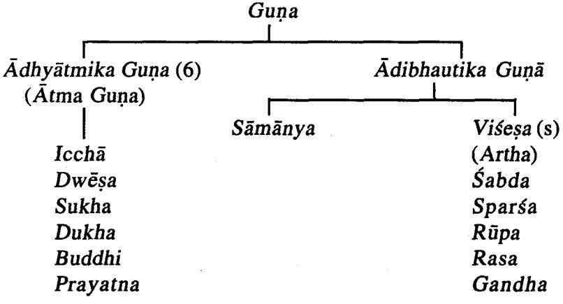

| Sāmānya              |  |  |
|----------------------|--|--|
|                      |  |  |
| Parādi (10)          |  |  |
| (Cikitsopayogi Guna) |  |  |
| Para                 |  |  |
| Apara                |  |  |
| Yukti                |  |  |
| Sankhya              |  |  |
| Samyoga              |  |  |
| Vibhāga              |  |  |
| Prthaktwa            |  |  |
| Parimāņa             |  |  |
| Samskāra             |  |  |
| Abhyāsa              |  |  |
|                      |  |  |

Adhyātmika Guņa (Ātma Guņa)

इच्छाद्वेषः सुखं दु:खं प्रयत्नश्चेतना धृति । बुद्धिः स्मृतिरहक्कारो लिङ्गानि परमात्मन: । । च. शा. १/७२

The qualities of Atma are known as Adhvātmika Guna. These are 6 in number. Cakrapani in his commentary includes Dhrti, Smrti, Ahankara & Cetana under Buddhi itself. Thus the Adhyātmika Gunās are Iccha, Dwesa, Sukha, Dukha, Prayatna & Buddhi.

### Visesa Guna (Artha)

अर्थाः शब्दादयो जेया गोचरा विषया गणाः । च. शा. १/३१ चक्रपाणि भाष्य-तत्रार्थाः शब्द-स्पर्श-रूप-रूप-रस-गन्धाः ।

The Pradhana Guna of each Mahabhūta come to be called as Artha. These are five in number and are known as Visesa or Vaisesika Guna. They are Sabda, Sparsa, Rupa, Rasa and Gandha.

#### Gurvādi Guna

स विशति गणा: - गुरु- लघु-शीत-उष्ण-स्निग्ध-रूक्ष- मन्द- तीक्ष्ण-स्थिर-

सर- मूद्र- कठिण-विश्व- पिच्छिल- शलक्ष्ण-खर- सुध्य-स्थूल- सान्द्र- व्रवानुगमात् । च. स. २५/३६

> गुरु- मन्द- हिम- स्निन्ध- रूलक्ष्ण- सान्द्र- मृदु-स्थिरा: । सस्वक्ष्म - विशादा विंशाति: सविपर्यया: ।। गणा:

अ. ह्व. सू. १/१८

Gurvādi Gunas are also known as Śārīrika Gunās. These are 20 in number: Guru, Laghu, Manda, Tīksna. Hima. Usna. Snigdha, Rūksa, Ślaksna, Khara, Sāndra, Drava, Mrdu, Kathina, Sthira, Sara, Suksma, Sthūla. Višada and Picchila.

Parādi Guna

परापरत्वे युक्तिश्च संख्या संयोग एव च । विभागरुच प्रथक्तवं च परिमाणमधापि च । संस्कारोड भ्यास इत्येते गुणा ज़ेया: परादय: ।।

च. सू. २६/२९-३०

These are also known as Cikitsopayogi Guna and are 10 in number, those are Para. Apara. Yukti. Sankhya. Samyoga. Vibhāga. Prthaktwa. Parimāna. Samskāra & Abhvāsa.

# 4. Gurvādi Guna

गुणा या उक्ता द्रव्येषु शरीरेष्वपि ते तथा । सु. सू. ४२/१२

Gurvadi Gunas which are twenty in number are commonly found in Sarira as well as in Dravya. Hence thev are also known as Śārīrika Guna.

Acarya Caraka and Susruta described Gurvadi Guna while discussing about Ahara and its Sevana.

There is slight variation in the enumeration of Gunas from different authors. Usually two Gunas which are antagonists to each other are grouped together. The following table shows variations in this combination as per different authors.

| Vāgbhata   | Caraka    | Susruta   |             | Nāgārjuna Bhāvamišra |
|------------|-----------|-----------|-------------|----------------------|
| Ref. A.Hr. | Ca. Sū.   | Su. Su.   | Ra. Vai. A. | B. Pr.               |
| Su. 1/18   | 25/36     | 46/518    | & Sü. 111   |                      |
| Guru x     | Guru x    | Guru x    | Guru x      | Guru x               |
| Laghu      | Laghu     | Laghu     | Laghu       | Laghu                |
| Manda x    | Manda x   | Mrdu x    | Mrdu x      | Manda x              |
| Tiksna     | Tiksņa    | Tīksņa    | Tīksņa      | Tiksņa               |
| Hima x     | Sīta x    | Sīta x    | Sīta x      | Šīta x               |
| Uşna       | Uşna      | Uşna      | Usna        | Usna                 |
| Snigdha x  | Snigdha x | Snigdha x | Snigdha x   | Snigdha x            |
| Rūksa      | Rūksa     | Rūksa     | Rūkṣa       | Rūksa                |
| Slaksņa x  | Slakşna x | Slakşņa x |             | Slakşņa x            |
| Khara      | Khara     | Karkaśa   |             | Karkaśa              |
| Sāndra x   | Sāndra x  | Sāndra x  |             | Suşka x              |
| Drava      | Drava     | Drava     |             | Drava                |
| Mrdu x     | Mrdu x    |           | -           |                      |
| Kathina    | Kațhina   |           |             |                      |
| Sthira x   | Sthira x  | Manda x   |             | Sthira x             |
| Sara       | Sara      | Sara      |             | Sara                 |
| Sūksma x   | Sūksma x  | Sükşma x  |             | Sükşma x             |
| Sthūla     | Sthūla    | Sthūla    |             | Sthūla               |
| Višada x   | Viśada x  | Visada x  | Višada x    | Visada x             |
| Picchila   | Picchila  | Picchila  | Picchila *  | Picchila             |
|            |           | Sugandha- |             |                      |
|            |           | Durgandha |             |                      |

.

| A.Hr. & A.S. Caraka |          | Suśruta   | Nāgārjuna | Bhāvamiśra |
|---------------------|----------|-----------|-----------|------------|
| Guru                | Guru     | Guru      | Guru      | Guru       |
| Laghu               | Laghu    | Laghu     | Laghu     | Laghu      |
| Manda               | Manda    | Manda     |           | Manda      |
| Tīkṣṇa              | Tīksņa   | Tīksņa    | Tīkṣṇa    | Tīkṣṇa     |
| Hima                | Sīta     | Sīta      | Sīta      | Sīta       |
| Uşna                | Uļņa     | Usņa      | Usna      | Uļņa       |
| Snigdha             | Snigdha  | Snigdha   | Snigdha   | Snigdha    |
| Rūksa               | Rūkṣa    | Rūksa     | Rūkṣa     | Rūksa      |
| Slaksņa             | Slaksņa  | Slaksņa   | -         | Slaksna    |
| Khara               | Khara    |           | -         |            |
| Sāndra              | Sāndra   | Sāndra    | -         |            |
| Drava               | Drava    | Drava     |           | Drava      |
| Mrdu                | Mrdu     | Mrdu      | Mrdu      | Mrdu       |
| Kațhina             | Kațhina  |           |           |            |
| Sthira              | Sthira   |           | -         | Sthira     |
| Sara                | Sara     | Sara      | -         | Sara       |
| Sūkṣma              | Sūkṣma   | Sūkṣma    | ಹಾ        | Sūkṣma     |
| Sthūla              | Sthūla   | Sthūla    |           | Sthūla     |
| Višada              | Višada   | Višada    | Višada    | Višada     |
| Picchila            | Picchila | Picchila  | Picchila  | Picchila   |
|                     | -        | Karkaśa   | -         |            |
|                     | -        | Sugandha- | -         |            |
|                     | -        | Durgandha | -         |            |
|                     | -        | Vyavãyi   | 1         |            |
|                     | -        | Vikāsī    | -         |            |
|                     | -        | Ašukarī   |           | Asu        |

Gurvādi Guņās mentioned by Various Scholars

The following observations can be drawn from the above two tables :

1. Caraka and Vagabhata have no difference of opinion regarding enlisting the 20 Gurvadi Guna.

2. Susruta describes Gunas in the following manners;

i) First lists 5 Gunas with their antagonists. Sīta x Usna. Snigdha x Rūkṣa, Picchila x Viśada, Tīksna x Mrdu & Guru x Laghu.

ii) Later continues to list 13 Gunas, they are Drava. Sandra. Sthūla, Ślaksna, Karkaśa, Sugandha, Durgandha. Sara. Manda, Vyavāyī, Vikāsī, Sūksma & Aśukari.

3. Extra Gunas referred by Susruta are :

Karkaśa. Durgandha. Sugandha. Vyavāvī. Vikāsī & Āšukāri.

4. Susruta varies from Caraka's version :

| Caraka         | Suśruta       |
|----------------|---------------|
| Manda x Tiksna | Mrdu x Tīksna |
| Sthira x Sara  | Manda x Sara  |

5. Gunas left by Susruta are Kathina, Khara & Sthira.

Though extra Gunas are described under Gurvadi Gunas. commentator Hemadri, is of the opinion that these extra Gunas enlisted can be included under the 20 Gurvadi itself & proposes the following :

|            | 1. Vyavayī                   |                 |  |
|------------|------------------------------|-----------------|--|
| 2. Vikāsī  | -> in Khara                  | अ. हृ. सू. 1/18 |  |
| 3. Āśukārī | → within Cala                |                 |  |
|            | 4. Sugandha  → under Manda   |                 |  |
|            | 5. Durgandha -> under Tīkṣṇa |                 |  |

Guru-Laghu

|         | Guru                                                                                                    | Laghu                                |
|---------|---------------------------------------------------------------------------------------------------------|--------------------------------------|
| English | Heaviness                                                                                               | Lightness                            |
|         | Definition   The quality responsible  The quality responsible<br>for gravity or heaviness for lightness |                                      |
| Nirukti | (पु) गृ-गिरणे गृ-शब्दे कर्तरि.<br>गीर्य्यते  स्तूयते  वा  कर्मणि  या<br>(वाचस्पति)<br>कडच्च ।           | (न) लधि-कुं नि नलोप: ।<br>(वाचस्पति) |

# Dravyaguņa Vijñāna

| Bhoutika   | Prthvi + Ap                    | Agni + Vāyu + Akāśa           |
|------------|--------------------------------|-------------------------------|
| Sanghaṭana |                                |                               |
| Karma :    |                                |                               |
| Dosa       | Vātahara & Kaphakara           | Vātakara & Kaphahara          |
| Dhātu      | Dhātu Vrddhi                   | Dhātu Ksaya                   |
| Mala       | Mala Vrddhi                    | Mala Ksaya                    |
| Anya       | Brhmana                        | Langhana                      |
|            | Sāda                           | Pathya                        |
|            | Upalepa                        | Anupalepa                     |
|            | Balakrt                        | Lekhana                       |
|            | Tarpana                        | Ropana                        |
|            | Pustikrt                       | Sīghrapākī                    |
|            | Cirapākī                       |                               |
|            |                                |                               |
| Examples   | Māṣa, Āragwadha &              | Mudga, Dādima &               |
|            | Satāvarī                       | Patola                        |
| Classical  | गुरुत्वं जलभूम्योः पतनकारणम् । | लघुस्तद्विपरीतः ।             |
| References | (प्र.पा.भा.)                   | (प्र.पा.भा.)                  |
|            | गौरवं पार्थिवमाप्यञ्च ।        | लाघवमन्यदीयम् ।               |
|            | (र.वै. ३/ १ १ ६ )              | (र.वै.३/११६६)                 |
|            | सादोपलेप बलकृत् गुरुस्तर्पण    | लघुस्तद्विपरीतस्याल्लेखनो     |
|            | बंहण: ।<br>(सु.सू. ४६/५१८)     | रोपणस्तथा । (सु.सू.४६/५१९)    |
|            | गूरुवतिहरः पुष्टिश्लेष्मकृत्   | लघू पथ्यं परं प्रोक्तं कफघ्नं |
|            | चिरपाकी च । (भा.प्र. ६/२०३)    | शीघ्रपाकी च । (भा.प्र.६/२०३)  |
|            | यस्य द्रव्यस्य बृंहणे कर्मणि   | यस्य द्रव्यस्य लङ्घने कर्मणि  |
|            | शक्तिः स गुरुः ।               | शक्तिः स लघुः ।               |
|            | (हेमाद्रि-अ.हृ.सू. १/१८ )      | (हेमाद्रि-अ.हृ.सू.१/१८ )      |
| Practical  | Guru Guņa Dravyas are          | Laghu Guna Dravyas are        |
| utility    | very useful in Vāta            | useful in Kaphaja             |
|            | Vyādhi                         | Vyādhi                        |
|            |                                |                               |

··

Śita—Usņa

|                         | Šīta                                                                                                                                                                                                 | Usņa                                                                                                                                                                    |  |  |
|-------------------------|------------------------------------------------------------------------------------------------------------------------------------------------------------------------------------------------------|-------------------------------------------------------------------------------------------------------------------------------------------------------------------------|--|--|
| English                 | Cold                                                                                                                                                                                                 | Hot                                                                                                                                                                     |  |  |
| Definition              | Property which reduces<br>temperature or imparts<br>coldness                                                                                                                                         | Property which increases<br>temperature or imparts<br>heat                                                                                                              |  |  |
| Nirūkti                 | (न) इयै-क्त स्पर्शे सम्म्र ।<br>(वाचस्पति)                                                                                                                                                           | (प) उष + नक् ।                                                                                                                                                          |  |  |
| Bhoutika<br>Sanghaṭana  | Ap + Vāyu                                                                                                                                                                                            | Agni + Vāyu                                                                                                                                                             |  |  |
| Karma :<br>Doșa         | Pittahara, Vātakapha-<br>Kara                                                                                                                                                                        | Pittakara, Vātakapha-<br>hara                                                                                                                                           |  |  |
| Dhātu<br>Mala           | Dhātu Vṛddhi<br>Mūtrala, Swedapurīsa<br>Sthambhaka                                                                                                                                                   | Dhātu Kṣaya<br>Pravartaka                                                                                                                                               |  |  |
| Anya                    | Sthambhana<br>Hlādana<br>Mūrchā<br>Useful in<br>Trt<br>Sweda<br>these<br>conditions<br>Dāha                                                                                                          | Swedana<br>Pācana (Vrņādīnam<br>Pachanam)                                                                                                                               |  |  |
| Examples                | Candana, Uśira,<br>Manjista                                                                                                                                                                          | Citraka, Bhallātaka                                                                                                                                                     |  |  |
| Classical<br>References | ह्णदन:  स्तम्भन:  शीतो<br>मूच्छा तृट्स्वेद दाहजित् ।<br>(सु.सू.४६/५१५)<br>शाीतस्तु ह्वादन: स्तम्भी<br>मूच्छातृटस्वेददाहनूत् ।<br>(भा.प्र.६/२०८)<br>यस्य द्रव्यस्य स्तम्भने कर्मणि<br>शक्तिः स शीतः । | उष्णस्तद्विपरीतः स्यात्<br>पाचनश्च विशेषतः ।<br>(सु.सू.४६/५१५)<br>उष्णो भवति विपरीतश्च<br>पाचन ।<br>(भा.प्र.६/२०८)<br>यस्य द्रव्यस्य स्वेदने कर्मणि<br>शक्तिः स उष्णः । |  |  |
|                         | (हेमाद्रि-अ.हृ.सू.१/१८ )                                                                                                                                                                             | (हेमाद्रि-अ.ह.सू.१/१८ )                                                                                                                                                 |  |  |

.

i

#### Dravyaguņa Vijñāna

| Practical | Sīta Guņa is very useful   Uṣṇa Guṇa is helpful |                       |
|-----------|-------------------------------------------------|-----------------------|
| utility   | in Pittaja Vyādhi and                           | in Vātakaphaja Vyādhi |
|           | in case of Daha, Mürchal and Ajīrņa, very       |                       |
|           | & Atisweda, Sitaguņa                            | necessary quality for |
|           | Dravyas are used.                               | Swedana Karma         |

# Snigdha–Rukşa

|                        | Snigdha                                             | Rūksa                                                      |
|------------------------|-----------------------------------------------------|------------------------------------------------------------|
| English                | Oily/Unctuous/Viscid                                | Rough/Harsh/Dry                                            |
| Definition             | The property which in-<br>stills or imparts oilness | The quality which helps<br>in drying                       |
| Nirükti                | (त्रि) स्निह-वन स्नेहयुक्त ।                        | (त्रि) रुह-क्स-अचिक्कणे नि:स्नेहे<br>कठोरे ।<br>(वाचस्पति) |
| Bhoutika<br>Sanghatana | Jala (+ Prithvī)                                    | Vayu (+ Agni)                                              |
| Karma :                |                                                     |                                                            |
| Dosa                   | Vātahara, Kaphakara                                 | Kaphahara, Vatakara                                        |
| Dhātu                  | Dhātu Vardhaka                                      | Dhātu Kṣaya                                                |
| Mala                   | Malapravartaka, Loo-<br>sens Mala                   | Mala Sosaka & Stham-<br>bhaka                              |
| Anya                   | Kledana                                             | Sosana                                                     |
|                        | Snehana                                             | Stambhana                                                  |
|                        | Mārdava<br>Balya                                    | Kāṭhiņyakara                                               |
|                        | Varnya                                              |                                                            |
|                        | Vrsya                                               |                                                            |
| Examples               | Eranda, Devadāru<br>Manjista                        | Apāmārga, Vidanga                                          |
| Classical              | यस्य द्रव्यस्य क्लेदने कर्मणि                       | यस्य द्रव्यस्य शोषणे कर्मणि                                |
| References             | शक्तिः स स्निग्धः ।                                 | शक्तिः स रूक्षः ।                                          |
|                        | (हेमाद्रि-अ.हू.सू.१/१८ )                            | (हेमाद्रि-अ.ह.सू.१/१८                                      |
|                        | स्नेहोमार्दवकृत् स्निग्धो                           | रूक्षस्तद्विपरीतः  स्याद्विशेषात्                          |
|                        | बलवर्णकरस्तथा ।                                     | स्तम्भनः खरः ।                                             |
|                        | (सु.सू.४६/५१६)                                      | (स.स.४६/५१६)                                               |

|                      | स्निग्ध वातहर श्लेष्मकारि<br>वृष्यं बलावहम् । (भा.प्र.६/२०३)  मतम् ।               | रूक्षं समीरणंकरं परं कफहर<br>(भा.प्र.६/२०३)                         |
|----------------------|------------------------------------------------------------------------------------|---------------------------------------------------------------------|
| Practical<br>utility | Snigdha Guna is very<br>necessary for Snehana<br>Karma and useful in<br>Vātavyādhi | Ruksa Guna is very<br>useful in Atiklēda and<br>for Stambhana Karma |

# Manda—Tīksņa

|                        | Manda                                            | Tīkṣṇa                                                       |
|------------------------|--------------------------------------------------|--------------------------------------------------------------|
| English                | Dull/Slow                                        | Sharp                                                        |
| Definition             | That which is respon-<br>sible for slow activity | The property respon-<br>sible for sharpness or<br>quickness  |
| Nirukti                | (त्रि) मदि-अच्-मृदौ अल्पे ।<br>(वाचस्पति)        | (न) किस-कृस्त दीर्घश्च खरे<br>स्पर्शे श्रीवे ।<br>(वाचस्पति) |
| Bhoutika<br>Sanghatana | Prithvī + Jala                                   | Agni (+ Vāyu)                                                |
| Karma :                |                                                  |                                                              |
| Doșa                   | Pittahara, Kaphakara                             | Pittakara, Kaphahara                                         |
| Dhātu                  | Dhātu Vrddhikara                                 | Dhātu Kṣayakara                                              |
| Mala                   | Mala Apravartaka                                 | Mala Pravartaka                                              |
| Anya                   | Samana                                           | Sodhana                                                      |
|                        | Yātrākara                                        | Dāhakara                                                     |
|                        | Cirakārī                                         | Pākakara                                                     |
|                        |                                                  | Srāvaņa                                                      |
|                        |                                                  | Lekhana                                                      |
| Examples               | Guducī, Ativisa                                  | Pippali, Bhallataka                                          |
| Classical              | यस्य द्रव्यस्य शमने कर्मणि                       | यस्य द्रव्यस्य शोधने कर्मणि                                  |
| References             | शक्तिः स मन्दः ।                                 | शक्तिः स तीक्ष्णः ।                                          |
|                        | (हेमाद्रि-अ.ह.सू. १/१८ )                         | (हेमाद्रि-अ.ह.सू.१/१८)                                       |
|                        | मन्दा यात्राकर: स्मृत: ।                         | दाहपाककरस्तीक्ष्णः स्त्रावणाम् ।                             |
|                        | (सु.सू.४६/५२२)                                   | (सु.सू.४६/५१८)                                               |
|                        | यात्राकर: इति वर्तनं करोति इति ।                 |                                                              |
|                        | डल्हण भाष्य)                                     |                                                              |

# Dravyaguņa Vijñāna

|                      | मन्द: सकलकार्येषु शिथिलोऽअल्योपि   तीक्ष्णंपित्तकरं प्रायो लेखन कफ-<br>कथ्यते । (भा.प्र.६/२१११)                                           | (भा.प्र.६/२०४)<br>वात्रहत् ।                           |
|----------------------|-------------------------------------------------------------------------------------------------------------------------------------------|--------------------------------------------------------|
| Practical<br>utility | Mandaguņa Yukta Dra-<br>vyas are useful for Dosa necessary for Sodhana<br>Samana in case of Krsa<br>& Durbala persons and<br>in Alpa Doșa | Tiksna Guna is very<br>Karma and useful in<br>Bahudosa |

# Sthira—Sara

| Firm/steady/fixed                                                                                                                                | Moving/motion                                                                                                                                                                                             |
|--------------------------------------------------------------------------------------------------------------------------------------------------|-----------------------------------------------------------------------------------------------------------------------------------------------------------------------------------------------------------|
|                                                                                                                                                  |                                                                                                                                                                                                           |
| firmness or steadiness                                                                                                                           | That which gives<br>momentum                                                                                                                                                                              |
| (प्) स्था-किरयू कठिने निश्चले ।<br>(वाचस्पति)                                                                                                    | (न) सरति-सृ-अच् गमने ।<br>(वाचस्पति)                                                                                                                                                                      |
| Prithvī                                                                                                                                          | Jala (Su) (+Vayu-P.V.S.)                                                                                                                                                                                  |
| Vātahara, Kaphakara<br>Dhātu Vrddhi<br>Bandhaka/Stambhaka<br>Dhārana                                                                             | Vātakara<br>Dhātu Ksaya<br>Mala Pravartaka                                                                                                                                                                |
| Mala Stambhī                                                                                                                                     | Prasarana<br>Anulomana                                                                                                                                                                                    |
| Khadira, Babbula                                                                                                                                 | Harītakī, Trvrta                                                                                                                                                                                          |
| यस्य द्रव्यस्य धारणे कर्मणि<br>शक्तिः स स्थिरः ।<br>(हेमाद्रि-अ.ह.सू. १/१८)<br>स्थिरो वातमलस्तम्भी ।<br>(भा.प्र.६/२०७)<br>Note: Susruta does not | यस्य द्रव्यस्य प्रसरणे कर्मणि<br>शक्तिः स सरः ।<br>(हेमाद्रि-अ.ह.स्. १/१८ )<br>सरोऽनुलोमनो प्रोक्ता ।<br>(स्.सू.)<br>अनुलोमनो वातमलंप्रवर्तकः ।<br>(डल्हण भाष्य)<br>सरस्तेषां प्रवर्तकः ।<br>(भा.प.६/२०७) |
|                                                                                                                                                  | That which imparts<br>Vāta Stambhī<br>mentioned Sthira Guna                                                                                                                                               |

| Practical | Sthira Guna is useful in   Sara Guna helps in Anu- |                       |
|-----------|----------------------------------------------------|-----------------------|
| utility   | Stambhana Karma and   lomana Karma, So very        |                       |
|           | gives stability                                    | useful in Malabadhata |

Note : Suśruta while describing Pitraja Bhāva says certain parts of body like Keśa, Loma, Asthi, Danta, Dhamani, Reta are produced out of Pitraja Bhāva. Hence these can be manipulated by drugs having Sthira Guna.

|            | Mrdu                          | Kathina                        |
|------------|-------------------------------|--------------------------------|
| English    | Soft                          | Hard/Stiff                     |
| Definition | That which imparts            | That which results in          |
|            | softness                      | hardening                      |
| Nirukti    | (त्रि) मृद्-कु-कोमले ।        | (त्रि) कठ-इनन् कठोरे ।         |
|            | (वाचस्पति)                    | (वाचस्पति)                     |
| Bhoutika   | Jala + Ākāśa                  | Prithvi                        |
| Sanghatana |                               |                                |
| Karma :    |                               |                                |
| Doșa       | Kaphakara, Vātapittahara      | Vātakara                       |
| Dhātu      | Dhātu Śaithilyakara           | Dhātu Dṛḍhīkaraṇa              |
| Mala       | Softens-Mrdukara              | Hardens                        |
| Anya       | Slathane (loosening/          | Drdīkarana                     |
|            | relaxing)                     |                                |
|            | Dāhanāšaka                    | Sanghatakara                   |
| Examples   | Godhūma, Yașțimadu            | Pravala, Śankha                |
| Classical  | यस्य द्रव्यस्य श्लूथने कर्मणि | यस्य द्रव्यस्य दृढ़ीकरण शक्तिः |
| References | शक्तिः स मद्दः ।              | स कठिण: ।                      |
|            | (हेमाद्रि-अ.ह.सू.१/१८ )       | (हेमाद्रि-अ.हृ.सू. १/१८ )      |
|            | मार्दवं अन्तरिक्षभाष्यं च ।   | तत्र द्रव्याणि कठिनणगृणबहुलानि |
|            | (र.वै. ३/ १ १ ३ )             | पार्थिवानि ।<br>(च.सू.२६)      |
|            | शिथिलावयवत्वं मृदुत्वम् ।     | संघातोऽवयवानां काठिण्यम् ।     |
|            | (आ.द.३-२-३१)                  | (आ.द.३-२-२४)                   |
| Practical  | Mrdu Guna gives soft-         | Katina guna imparts            |
| utility    | ness to the skin and          | hardness hence it gives        |

#### Mrdu—Kathina

13 Dra.Vij.

| hence useful in rough-   strength to the Dhātus<br>ness and hardness of |  |  |
|-------------------------------------------------------------------------|--|--|
| the skin                                                                |  |  |

Note : Suśruta while describing Mātrja Bhāvas say that tissues which are Mrdu in nature are formed out of Matrja Bhava. Hence one can utilise Dravays having Mrdu Guna to influence these Mrdu tissues in the body, like Māmsa, Śonita, Meda, Majjā, Yakrt, Plīhā, Hrdaya, Guda etc.

|                                          | Višada                                                                                                                                      | Picchila                                                                                                                                     |
|------------------------------------------|---------------------------------------------------------------------------------------------------------------------------------------------|----------------------------------------------------------------------------------------------------------------------------------------------|
| English                                  | Clear/Pure/Clean/Spotless                                                                                                                   | Slimy/Lubricous/Slippery                                                                                                                     |
| Definition                               | That which clears or<br>cleans                                                                                                              | That which has a<br>smearing effect                                                                                                          |
| Nirukti                                  | पू-वि+शद्-अच् श्रभ्रवर्णे, विमले,<br>व्यक्ते ।<br>(वाचस्पति)                                                                                | 'त्रि'-पिच्छ्-वा-इल स्निग्ध सूपार्ट<br>पिच्छ+अस्त्यर्थे पिच्छा इलच                                                                           |
| Bhoutika<br>Sanghatana Akāśa             | Prithvi+Vayu+Agni+                                                                                                                          | Jala                                                                                                                                         |
| Karma :<br>Dosa<br>Dhātu<br>Mala<br>Anya | Vātakara, Kaphahara,<br>Ksaya, Lekhana<br>Mala Śoşaka<br>Ksālana<br>Klēdacūsana Kledācūsana<br>Ropana                                       | Kaphakara, Vatahara<br>Dhātu Vrddhi, Brhmana<br>Malotsarga<br>Lepana<br>Prāņadhāraņa<br>Balya<br>Sandhārana                                  |
| Examples                                 | Nimba, Ksāra, Guggulu                                                                                                                       | Ślesmātaka, Śālamali                                                                                                                         |
| Classical<br>References                  | यस्य द्रव्यस्य क्षालने कर्मणि<br>शक्तिः स विशदः ।<br>(हेमाद्रि-अ.हृ.सू.१/१८ )<br>विशदे विपरीतोऽस्मात् क्लेदाचूषण<br>रोपण: ।<br>(स.स.४६/५१७) | यस्य द्रव्यस्य लेपने कर्मणि शक्तिः<br>स कठिण: ।<br>(हेमाद्रि-अ.ह.सू.१/१८)<br>पिच्छिलो जीवनोबल्यः सन्धान<br>श्लेष्मलो गुरुः ।<br>(स.स.४६/५१७) |

Viśada-Picchila

# Guņa Parijñāna

్లు

|                      | क्लेदच्छेदकर: ख्यातो विशदो<br>व्रणरोपणः ।                             | पिच्छिलस्तन्त्र्लबिल्यः सन्धानः<br>(भा.प्र.६/२०८)  श्लेष्मलो गुरु: । (भा.प्र.६/२०७) |
|----------------------|-----------------------------------------------------------------------|-------------------------------------------------------------------------------------|
| Practical<br>utility | Viśāda is very useful<br>Guna in Vrana as it<br>dries up the moisture | Picchila is useful quality<br>in Bhagna as it helps in<br>joining                   |

# Slakṣṇa–Khara

|                                          | Ślakṣṇa                                                                                                                                                                                             | Khara                                                                                                                                                                                                     |
|------------------------------------------|-----------------------------------------------------------------------------------------------------------------------------------------------------------------------------------------------------|-----------------------------------------------------------------------------------------------------------------------------------------------------------------------------------------------------------|
| English                                  | Smooth/Glossy/Polished                                                                                                                                                                              | Hard/Rough                                                                                                                                                                                                |
| Definition                               | That quality which<br>results in glossiness                                                                                                                                                         | That quality which re-<br>sults in roughness/coarse                                                                                                                                                       |
| Nirükti                                  | (त्रि)-श्लिष-कृस्त नि चिक्कणे<br>मनोहरे ।<br>(वाचस्पति)                                                                                                                                             | (पु)—र खमिन्द्रियं लाति ला क वा<br>रलयोरेकत्वम् ।<br>(वाचस्पति)                                                                                                                                           |
| Bhoutika<br>Sanghaṭana                   | Akāśa (Caraka)<br>Agni (Rasa Vaiśeșika)                                                                                                                                                             | Vāyu+Prthvī (Caraka)<br>Vāyu+Agni(Su), Vāyu<br>(R. Vai)                                                                                                                                                   |
| Karma :<br>Doșa<br>Dhātu<br>Mala<br>Anya | Kaphakara, Vatahara<br>Dhātu Vardhaka<br>Mala Pravartaka<br>Ropana<br>Similar to Picchila i.e.<br>Jivana<br>Balya<br>Sandhārana                                                                     | Vātakara<br>Dhātu Kṣaya<br>Lekhana                                                                                                                                                                        |
| Examples                                 | Vaikrānta, Pravāla, Mukta                                                                                                                                                                           | Śukti                                                                                                                                                                                                     |
| Classical<br>References                  | यस्य द्रव्यस्य रोपणे कर्मणि<br>शक्तिः स श्लक्ष्णः ।<br>(हेमाद्रि-अ.हृ.सू. १/१८ )<br>श्लक्ष्णः पिच्चित्रलवत् ज्ञेयः ।<br>(सु.सू.४६/५१६)<br>श्लक्ष्णः स्नेहं विनाऽपि स्यात्कति-<br>णोऽपि हि चिक्कणः । | यस्य द्रव्यस्य लेखने कर्मणि शक्तिः<br>स खर: ।<br>(हेमाद्रि-अ.हृ.सू.१/१८ )<br>खरोऽमृद् : ।<br>(सं.(अ)-अ.हू.सू.१ )<br>Note : Suśruta does not<br>mention Khara Guna<br>(भा.प्र.६/२०६) but refers to Karkaśa |

: 上

#### Dravyaguņa Vijñāna

|                      | श्लक्ष्णा अपरुषः ।                                                                                      |  |
|----------------------|---------------------------------------------------------------------------------------------------------|--|
|                      | (सं(अ)-अ.ह्रहस्. १                                                                                      |  |
| Practical<br>utility | Slaksna is very necessary  Khara Guna Yukta Dra-<br>for the healing of ulcers   vyas useful in Sthoulya |  |

# Sūkṣma—Sthūla

|            | Sūksma                                  | Sthūla                              |  |
|------------|-----------------------------------------|-------------------------------------|--|
| English    | Subtle/Fine/Minute/                     | Bulk/huge                           |  |
|            | Acute/Penetrating                       |                                     |  |
| Definition | That which penetrates                   | That which imparts                  |  |
|            | or is very subtle                       | bulk                                |  |
| Nirukti    | (न)-सुच्-मनृ-सुवरच नेट् । अणू-          | (त्रि)—अद्-चु-उभ-अक्-मेट् ।         |  |
|            | परिमाणयुक्ते अल्पे । (वाचस्पति)         | बंहणे । (वाचस्पति)                  |  |
| Bhoutika   | Agni+Vāyu+Akāśa                         | Prithvī                             |  |
| Sanghatana |                                         |                                     |  |
| Karma :    |                                         |                                     |  |
| Dosa       | Vātakara, Kaphahara                     | Vātahara, Kaphakara                 |  |
| Dhātu      | Dhātu Ksaya                             | Dhātu Vrddhi                        |  |
| Mala       | Malaksayakara ·                         | Malotsarga                          |  |
| Anya       | Vivarane (Open up                       | Samvarane (Conceds                  |  |
|            | channel) "Sūksma                        | channels) Sthoulyakara              |  |
|            | Chidresu Višedya                        | Dehe Srotasam Avaro-                |  |
|            |                                         | dha kāraka                          |  |
| Examples   | Madya, Madhu                            | Dadhi, Pistaka                      |  |
| Classical  | यस्य द्रव्यस्य विवरणे कर्मणि            | यस्य द्रव्यस्य संवरणे कर्मणि शक्ति: |  |
| References | शक्तिः स सूक्ष्मः ।                     | स स्थुल: ।                          |  |
|            | (हेमाद्रि-अ.हृ.सू.१/१८)                 | (हेमाद्रि-अ.ह.सू.१/१८)              |  |
|            | सूक्ष्मास्त् सौक्ष्म्यात् सूक्ष्मेषु    | Not mentioned by                    |  |
|            | स्रोतः स्वन् सरः स्मृतः ।               | Suśruta                             |  |
|            | (सु.सू.४६/५२४)                          |                                     |  |
|            | देहस्य सूक्ष्मछिद्रेषु विशेद्यत्सूक्ष्म | स्थूल: स्थौल्यकरो देहे स्त्रोतसाम-  |  |
|            | मुच्यते ।<br>(भा.प्र.६/२१०)             | वरोधकृत् ।<br>(भा.प्र.६/२०९)        |  |
|            |                                         |                                     |  |

| Practical | Sūksma Guna is useful | Sthūla Guna may be      |
|-----------|-----------------------|-------------------------|
| utility   | in Vamana Karma and   | used in Krśa as it acts |
|           | the drug should have  | as Brhmana              |
|           | Suksma Guna which     |                         |
|           | enable the Dravya to  |                         |
|           | penetrate             |                         |

# Sāndra—Drava

|                              | Sāndra                                                                                   | Drava                                                    |  |
|------------------------------|------------------------------------------------------------------------------------------|----------------------------------------------------------|--|
| English                      | Compact/Dense                                                                            | Fluid/Liquid                                             |  |
| Definition                   | A quality which imparts<br>compactness there by<br>resulting in clearing the<br>channels | That which imparts<br>fluidity or moisture to<br>tissues |  |
| Nirukti                      | (त्रि)—अदि ख् सह् अन्द्रण ।                                                              | (दु)–द्रु गतौ भावे अप् ।                                 |  |
|                              | (वाचस्पति)                                                                               | (वाचस्पति)                                               |  |
| Bhoutika<br>Sanghatana       | Prithvī<br>Jala                                                                          |                                                          |  |
| Karma :                      |                                                                                          |                                                          |  |
| Dosa                         | Kaphakara, Vātahara                                                                      | Pittakara                                                |  |
| Dhātu                        | Dhātu Upacaya                                                                            | Dhātu Ksaya                                              |  |
| Mala                         | Compactness                                                                              | Loosens                                                  |  |
| Anya                         | Prasādana                                                                                | Vilodana                                                 |  |
|                              | Bandhakāraka                                                                             | Prakledana                                               |  |
|                              |                                                                                          | Syandanakāraka                                           |  |
|                              |                                                                                          | Vyāpti                                                   |  |
| Examples                     | Vidārikanda, Muśalī                                                                      | Iksurasa, Ksīra                                          |  |
| Classical                    | यस्य द्रव्यस्य प्रसादने कर्मणि                                                           | यस्य द्रव्यस्य विलोडने कर्मणि                            |  |
| References                   | शक्तिः स सान्द्रः ।                                                                      | शक्तिः स द्रवः ।                                         |  |
|                              | (हेमाद्रि-अ.हृ.सू.१/१८ )                                                                 | (हेमाद्रि-अ.हृ.सू.१/१८ )                                 |  |
| सान्द्रः स्थान बन्धकारकः ।   |                                                                                          | द्रवः प्रक्लेदनः परः ।                                   |  |
|                              | (सु.सू.४६/५२०)                                                                           | (सु.सू.४६/५२०)                                           |  |
|                              | तत्र द्रव्याणि-सान्द्र-गुण बहुलानि                                                       | द्रवः क्लेदकर्रा व्याधि ।                                |  |
| पार्थिवानि ।<br>(च.सू.२६/११) |                                                                                          | (भा.प्र.६/२१०)                                           |  |

|                      | Note : Bha. Mi'sra does<br>not mention Sandra, but<br>refers to Suska as antog-<br>onist to Drava |                                                             |
|----------------------|---------------------------------------------------------------------------------------------------|-------------------------------------------------------------|
| Practical<br>utility | Sandra Guna is Kapha-<br>Vardhaka, in case of<br>Krsa it may be used to<br>improve weight         | Drava Guna is very use-<br>ful in case of constipa-<br>tion |

Gunas apart from 20 Gurvādi Guna.

- · Vyavāyi
- Vikāsī
- Āšukāri
- Karkaśa
- Sugandha
- Durgandha
- Śuska .

#### 1. Vyavāyi

The word Vyavayī is derived from (प) वि + अव + हण + छत्र ।

# पूर्वं व्याप्यमखिलं कायं ततः पाकं च गच्छति । व्यवायी तद्यथा भाङ्ग फेनं चाहिसमुद्धवम् ।। शा. प्र. ४/१९-२०

व्यवायी चाखिलं देहं व्याप्य पाकाय कल्पते ।

सु. सू. ४६/५२३

व्यवायि गुण: अखिलमित्यादि अपक्त एवाखिलं देहं व्याप्नोति पश्चान्यद्यविषवत् पाकं यातिः अन्ये भावाय कल्पते इति पठन्ति, तत्रापि स्थितये कल्पते नोध्वेमधो वा: प्रवतेत इति स एवार्था:, अपरे तु पुनर्भावशब्दमभिप्रायार्थ मिच्छन्ति, तत्र नियतद्ववप्रभावेणात्मशक्यनरूपं तत्तद्रव्यं मद्यविषवद्वद्विशिष्टाभियायाय कल्पन इत्यर्थः । डल्हण भाष्य

The factor by which a Dravya spreads throughout the body first and later undergoes digestion is called Vyavayi. These Dravyas have Vāyu & Ākāša Mahābhūta predominance.

Eg. Bhanga, Ahiphena.

The constituents of these drugs spread in the body and produces its effect immediately. It is at later period, that the drug gets digestion later like that of Madya and Visa.

Note : Hemādri commentator on Astānga Hrdaya includes Vyavayi under Drava itself.

2. Vikāsī

# सन्धिबन्धांस्तु शिथिलान्यत्करोति विकाशि तत् । विश्लेष्यौजश्च धातभ्यो यथा क्रमककोद्रवा: 11

शा. स. प्र. ४/२.-२१

# विकासी विकसन्नेवं धातुबन्धान् विमोक्षयेत् ।।

सु. सू. ४६/५२३

That quality which disunites Ojas from the Dhātus and loosens the Sandhibandha is Vikasi. These Dravyas have predominance of Vayu Mahabhuta.

Eg. Kramuka Kodrava

These drugs spread throughout the body before digestion. 3. Āśukārī

| आशुराशुकरो देहे धावत्यम्भसि तैलवत् ।      | भा. प्र. ६/२११ |
|-------------------------------------------|----------------|
| आशुकारी तथाऽऽशुत्वाद्धावत्यम्भसि तैलवत् । |                |
| आशुकारि  गुणः  आशुत्वात् ।                | सु. सू. ४६/५२४ |

That quality which leads to rapid action is called Asukari.

Just like oil which spreads quickly on water, similarly an Aśukāri Dravya works instantaneously.

- आशकारि-चले ।
हे—अ. हृ. सू. १/१८

Hemādri consider Āšukārī as a part of Cala Guna.

Eg. Visa Dravya

#### 4. Karkaśa

The word Karkaśa is derived from-

(पु) कृम् हिंसायां त्रिच् क: सन् + कशति-कर्क-अच्, कर्क + लोमादि, श. करे कशति-कश-शब्दे अपू शक् वा । कठोरे । वाचस्पति कर्कशो विश्रदो यथा । सु. सू. ४६/५२१ विशादो विपरीतोऽस्मातु क्लेदाचुषण रोपणः । सु. सू. ४६/५१८

Karkaśa is said to be similar to Viśada. Hence Karkaśa is a quality which results in Kledacusana (Drying) and Ropana (Wound healing). Karkaśa is predominently made up of Vāyu Mahābhūta.

Acarya Suśruta mentions Karkaśa Guna. It is considered as similar to Khara and regarded as an antagonist to Ślaksna.

Eg. Harītaki Twak

5. Śuska

The word Śuska is derived from

(त्रि)-शूष + क्त । कृत शोषणे । वाचस्पति

द्रव क्लेदकरो व्यापी शुष्कस्तद्विपरीतकः । भा. प्र. ६/२१०

Śuska is a quality described by Bhāvamiśra. He explains this is an antagonist to Drava Guna.

That which removes moisture or dehydrates is called Suska. This Guna is predominantly constituted by Prthvi, Vayu and Teja Mahābhuta.

Eg. Śukti

### 6. Sugandha

It is a quality described by Acarya Suśruta. The word Sugandha is derived from

(पु)-सुष्ठ् गन्थाऽस्य न इत् । वाचस्पति सुखानुबन्धी सूक्ष्मश्च सुगन्धो रोचनो मृदु: । सु. सू. ४६/५२१ सुखानुबन्धी सुखोत्पादक इत्यर्थः । सुक्ष्मोऽवगातकः ।

डल्हण भाष्य सु. सू. ४६/५२१

That which creates happiness is Sugandha. Sugandha Dravyas are Suksma (Penetrating) subtle & soft. These are very pleasing and aggreable (Rocana) to mind and body.

Eg. Nāgakeśara

Some regard Sugandha as a Manda Guna Visesa.

सुगन्धदुर्गन्थौ तु मन्दतीक्ष्णविशेषौ । हे-अ. हृ. सू. १/१८

# 7. Durgandha

Acarya Susruta describes Durgandha as an antagonist to Sugandha. The word Durgandha is derived from

(प) द: स्थितो गन्धोऽस्य । वाचस्पति दुर्गन्धो विपरीतोऽस्याद् हल्लासारुचिकारकः । सु. सू. ४६/५२२२

The quality which induces unhappiness is Durgandha. Durgandha Dravyas cause Hrllasa (Nausea) and Aruci (Aversion). It is not pleasing to mind & body.

Hemadri considered this Guna as a speciality of Tiksna Guna.

Eg. Gandhaprasārini

# 5. Parādi Guņa

Acarya Caraka explains about ten special Gunas which are useful for treatment. These are called Paradi Gunas.

> परापरत्वे युक्तिश्च संख्या संयोग एव च । विभागश्च प्रथक्तवं च परिमाणमथापि च ।। संस्कारोऽभ्यास इत्येते गणा ज्ञेया: पराद्यः । सिद्धयायाश्चिकित्साया लक्षणैस्तानु प्रयक्ष्महे ।।

> > च. सू. २६/२९-३०

Parādi Gunās are Para, Apara, Yukti, Sankhya, Samyoga, Vibhāga, Prithaktwa, Parimāna, Samskāra and Abhyāsa.

### 1. Paratwa

The word Paratwa is derived from पृ-भावे अष्ट, कर्तरि अथवा meaning भिन्ने or उत्तरे ।

देश- काल- वयो- मान- पाक-वीर्य- रसादिष् । परापरत्वे................................ I च. सू. २६/३१ चक्रपाणि भाष्य तच्च परत्वं प्रधानत्वम् ।

Para means Pradhana or that which is superior or best. In other terms that which is conducive for health comes to be called as Para. This favourability depends on various factors like Desa, Vaya, Māna, Rasa, Vīrya, Vipāka, Prkruti, Bala etc.

This property is explained in Vaiśesika Darśana and is suitably adopted to Ayurveda.

#### 2. Aparatwa

The word Apara is derived from

#### (न)-न पुर्य्यते यतः पु-अपादाने, अप् । वाचस्पति

अपरत्वं अप्रधानम् । चक्रपाणि भाष्य च. सू. २६/३१

Apara is the factor which is inferior or worst. In Cikitsa point of view, it can be defined as those factors which are nonconducive for health.

Cakrapāni further explains Paratwa & Aparatwa with suitable example.

तद्विवरणं देशकालेल्यादि । तत्र देशो मरु: परः, आनूपोऽपरः, कालो विसर्ग: पर: आदानमपर: वय:स्तरुणं परम्, अपरमितरत; मानं च शरीरस्य यथा वक्ष्यमाणं शरीरे परं, ततोऽन्यदपरं, पाकवीर्यरसास्तु ये यस्य योगिनस्ते तं प्रति पराः अयौगिकास्त्वपराः आदिश्रहणात् प्रकृति बलादीनां ग्रहणम् ।

चक्रपाणि भाष्य च. सू. २६/२९-३०

|    | SI. No. Factors | Para                   | Apara           |
|----|-----------------|------------------------|-----------------|
| 1. | Deśa            | Maru (Jāngala)         | Anūpa           |
| 2. | Kāla            | Visarga                | Adāna           |
| 3. | Vaya            | Taruna                 | Vrddha          |
| 4. | Mãna            | Prakruta  Śarīra  Māna | Vikrta          |
| 5. | Pāka-Vīrya-Ras  | Yougika (In            | Ayaugika (Not   |
|    |                 | accordance)            | in accordance)  |
| 6. | Prakruti        | Dissimilar to Dosa     | Similar to Dosa |
|    |                 | Prakopa                | Prakopa         |
| 7. | Bala            | Pravara                | Avara           |

On observing these factors, it becomes clear that Para includes factors which are conducive for Swasthya or to cure

a disease easily, where as Apara includes factors which are not favourable or makes it difficult for treatment.

> साध्योऽसाध्य इति व्यायिद्विधा, तौ तू पुनर्द्विधा । ससाध्यः कच्छसाध्यश्च याप्यो यश्चानपक्रमः । । सर्वीषध क्षमे देहे युन: पुंसोजितात्मन: । अमर्मगोऽ ल्पहेत्वग्ररूप रूपोऽनुपद्रवः ।। अतुल्यद्यदेशर्तु पादसंपदि । ग्रहेष्वनुगुणेष्वेकदोषमार्गों नवः सखः ।। अ. हृ. सू. १/३०-३१

For example, if the patient is young, native of Jangala Pradesa has Pravara Bala, it becomes easier for treatment when compared to an old patient with Avarabala and of Anupa Desa.

Agrya Varga of Caraka enlists Dravyas which are the best in a particular category. This can be taken as Para.

Hitāhāra enlisted to finalise Sādhyāsādhyata or Vyādhis can also be understood under this context.

### 3. Yukti

The word Yukti is derived from-

formulation (Samīcīna Kalpana) is called Yukti.

युक्तिश्च योजना यातु युज्यते । च. सू. २६/३१ Logical reasoning in using Bhesaja to prepare a

#### अनेनोपदेशेन नानौषधिभूतं जगति किंचिद्रव्यमुपलभ्यते तां युक्तिमर्थं च तं तमश्मिप्रेत्य । च. सू. २६/१२

Caraka says that all Dravyas in this universe are medicinal if used in accordance to Yukti (Upaya) and Artha (Prayojana).

Hence logical reasoning (Yukti) involves a thorough assessment of Dosa, Dūsya, Bala, Kāla, Vaya, Prakruti and other factors and selecting a Bhesaja suitable to the condition.

युक्तिश्चेत्यादौ योजना दोषाद्यपेक्षया भेषजस्य समीचीनकल्पना, अत एवोक्तं-या त युज्यते; या कल्पना यौगिकी भवति सा तु युक्तिरुच्यते, अयौगिकी तु

वाचस्पति

कल्पनाऽपि सती युक्तिनोच्यते पुत्रोऽप्यपत्रवत् । युक्तिश्चेयं संयांग परिमाण संस्काराद्य-चक्रपाणि भाष्य च. सू. २६/३१ न्तर्गताऽप्युययुक्तत्वात् प्रथगुच्यते ।

Cakrapani comments that a treatment without logical reasoning is a waste like a person having worthless son.

Though Samvoga, Parimāna and Samskāra comprehends yukti, it is highlighted under Paradi Guna as it is very significant for a successful treatment.

The importance of Yukti can be further reiterated by Caraka's saying that

# योगादपि विषं तीक्ष्णमत्तमं भेषजं भवेत । भेषजं चापि दुर्युक्तं तीक्ष्णं सम्पद्यते विषम् ।।

च. सू. १/१२६

Even a poison can be modified into a medicine through logic and a good medicine can become poisonous if used carelessly.

4. Sankhya

संख्या स्याद्रणिम ।

The word 'संख्या' is derived from-

(न) संख्यायतो परस्परनामोच्चारणं क्रियतेऽत्र सम् + ख्या-धञर्थे क । वाचस्पति

च. सू. २६/३२

गणितमिहैकद्वित्यादि ।

चक्रपाणि भाष्य च. सू. २६/३२

'Samkhya' meansGanita denotes counting or calculation. Numbering is an essential part of Avuryeda as we have 3 Dosa. 7 Dhātu, 3 Mala, 5 Mahābhūta, 6 Rasa, 20 Prameha etc.

Apart from this, even for treatment Samkhya is very important. We have to decide the dosage, its frequency & duration which requires correct calculations.

Also for planning Basti treatment one needs to calculate the amount of Kwatha, Taila etc. to be prepared for a particular patient in a specific condition. This calls for mathematical estimations.

Hence Samkhya is a pre-requisite for successful treatment.

5. Samyoga

The word Samyoga is derived from-

(पु) सम् + युज-धज । मेलनम् ।

वाचस्पति

योग: सह संयोग उच्यते ।

द्रव्याणां द्वन्द्वसर्वेककर्मजोऽनित्य एव च ।। च. सू. २६/३२

Union of two or more substances is called Samyoga.

Combinations are usually of two types as

(i) Nitva (Samavāva)

(ii) Anitya (Samyoga)

The combination of Dravya and its inherent Guna are in an inherent relation or in Nitya Sambandha which is called Samavāya.

Combinations of two Dravyas is a temporary relation and is Anitya, which is called as Samyoga.

Caraka says Samyoga are of 3 types as :

सहेतिमिलितानां द्रव्यानां योग: प्राप्तिरित्यर्थ, सहेत्यनेनेहाकिंचित्करं परस्परसंयोगं निराकरेति । तब्द्रदेशाहृद्वन्द्वेत्यादि । चक्रपाणि च. सू. २६/३२

- a) Dwandwa Karmaja
- b) Sarva Karmaja
- c) Eka Karmaja

### a) Dwandwa Karmaja

तत्र द्वन्द्वकर्मजो यथा-युध्यमानयोर्मेषयो: । चक्रपाणि भाष्य च. सू. २६/३२

Combinations of two Dravyas wherein both take part actively towards the effect.

Eg. Two Mesas fighting together.

# Practical Application :

Application of Kumari and Haridra lepa for skin diseases. Here both drugs act to combat the discase.

### b) Sarvakarmaja

सर्वकर्मजो यथा-भाण्डे प्रक्षिप्यमाणानां माषाणां बहल माषक्रिया योगजः । चक्रपाणि भाष्य च. सू. २६/३२२

Combination of more than two Dravyas wherein all Dravyas work to produce the effect.

Eg. Māṣa (Blackgram) kept in a vessel which many in numbers, all will be converted into one particular preparation.

#### Practical Utility :

Trikatu Cūrna in Kāsa-Here all the three drugs i.e., Marica, Pippali and Śuņthi together help to mitigate Kāsa.

#### c) Ekakarmaja

Combination of Dravyas where in only one remains active to produce the result.

Eg. A crow sits on the tree. Here 'crow' alone takes active part in Samyoga.

#### Practical Utility :

Eranda Patra is tied over the knee with the help of a bandage cloth (Gauze) to treat Śotha. Here Eraņḍa Patra and gauze come together, but it is only Eranda which relieves Sotha.

#### 6. Vibhāga

The word Vibhaga is derived from

(प)-वि + भञ्च- भावे धजु ।

वाचस्पति

विभागस्तु विभक्ति: स्याद्वियोगो भागश्रो ग्रह: । च. स. २६/९

विभागमाह-विभागस्त्वित्यादि विभक्तिः विभक्षनम् । विभक्तिमेव विवृणोति-वियोग इति: संयोगस्य विगमो वियोग: । तत् किं संयोगाभाव राव वियोग इत्याह-भागशौ ग्रह इति । विभागशो विभक्तत्वेन ग्रहणं यतो भवतीति भावः; तेन विभक्तिरित्येषा भावरूपा प्रतीतिः, न संयोगाभावमात्रं भवति, कि तर्हि भावरूप विभागगुणयुक्ते इत्यर्थः । चक्रपाणि भाष्य च. सू. २६/३३

Vibhaga is the opposite quality of Samyoga. Division of any combination is termed as Vibhaga. Like Samyoga this also Anitya.

Vibhaga has 3 words.

#### (i) Vibhakti

Cutting the Dravyas into pieces to prepare any formulations.

Eg. Making coarse powder of Kutaja bark to prepare Kutaja Kasāya.

#### (ii) Viyoga

Two meanings may be derived from this term.

(a) Loosing its original qualities, i.e. when one drug is not included in any formulation like Hingwastaka Chūrna, the formulation may loose some qualities.

(b) Usage of substitutes : In case of non-availability of any drug using other drugs in its place.

Eg. Using Śatāvari in place of Meda which is not available.

#### (iii) Bhāgaśo Graha

Considering only a small portion of a preparation. For Eg. While consuming Rasayoga. Making it into several divisions for proper therapeutic action.

#### 7. Prthaktwa

The word Prthaktwa is derived from

प्रथ. वा. ककि पुथक इत्यस्य भाव: त्व भिन्न नाना रूपे (वाचस्पति) पुथत्तवं स्यादसंयोगो वैलक्ष्णयमनेकता । च. सू. २६/३३ प्रथकत्वं त् 'इदं द्रव्यं पटलक्षणं, घटात्' प्रथग्' इत्यादिका बुद्धिर्यतो भवति

तत् प्रथकत्वं भवति । चक्रपाणि भाष्य च. सू. २६/३३

The uniqueness of substance by which it differentiates from others is called Prthaktwa.

Cakrapani comments saying that Ghata and Paṭa is different because of their unique qualities.

Eg. Dhatura is different from Harītaki.

Prthaktwa is of 3 types.

#### तच्चाचार्यस्त्रैविध्येनाह-प्रथकत्वमित्यादि ।

च. सू. २६/३३

- (i) Asamyoga
- (ii) Vailaksnya
- (iii) Anekata

(i) Asamyoga

त्रत्र यत् सर्वधाऽसंयुज्यमानयोरिव मेकहिमाचलयोः पृथक्तवम् । रातदसंयोग चक्रपाणि भाष्य च. सू. २६/३३ इत्यतेनोक्तम् ।

The conspicuous differentiation between two substances which cannot be combined together is Asamyoga.

Eg. Meru & Himālaya Parvata cannot be brought together or combined. This clear distinction between the two is called Asamyoga Prthaktwa.

#### (ii) Vailaksnya

तथा संयुज्यमाना निधि पुथक्तवं विजातीयानां महिषवराहादीना तदाह वैलक्षयमित्यादि । विशिष्टलक्षणयुक्तत्वलक्षितं विजातीयानां प्रथक्तवमित्यर्थः ।

चक्रपाणि भाष्य च. सू. २६/३३

The differences between substance which belong to a single category but still are separate or different due to their distinct characters (Visista Laksana) is called Vailaksnya Prthaktwa.

Eg. 1. Mahisa (Buffallo) & Varaha (Pig). Both belong to the category of animals, but are different from each other ( Vijāti).

2. Śatāvarī and Vacā are herbal drugs. But each have clear characters to differentiate.

### (iii) Anekata

तथैकजातीयानामप्यविलक्षणानां माषाणां प्रथकत्वं भवतीत्याह अनेकतेति । एकजातीयेषु हि संयुक्तेषु न वैलक्ष्णय नाप्यसंयोग: अथ चानेकता प्रथक्तवरूपा चक्रपाणि भाष्य च. सू. २६/३३ भवतीति भाव: ।

Differences between substances of the same class is called Anekatā.

Eg. 1. Māsa grains belong to same Jāti but each Māsa grain varies from its size or colour.

2. Two types of Tulasi belongs to same Jāti but both have differences based on the colour.

### 8. Parimāna

The word Parimana is derived from

| (न)—परिमीयतेऽनेन परि + मा—न्युट् । | वाचस्पति                    |
|------------------------------------|-----------------------------|
| परिमाणं  पुनर्मानम् ।              | च. सू. २६/३४                |
| मानं  प्रस्थाढ़कादितुलादिर्मयम् ।  | चक्रपाणि भाष्य च. सू. २६/३४ |

The quality which aids in measurement is called Parimāna.

#### अणु दीर्घ महद हृस्वमिति तद्रभेद इरित: ।

कारिकावली

Anu, Dīrgha, Mahat, Hrswa are types of Parīmāna. Classification of Parīmāna :

#### (i) Dairghyamāna (Dimension)

Measuring the proportions of an object. It is further of two types as Nitya & Anitya.

Nitya Dravya is measured through Paramanu and Anitya Dravya is further subdivided into

Samkhya Janya Parimāna Janya Pracaya Janya

#### (ii) Gurutwamana (weight)

Which measures heaviness of an object. It is also of two types as Nitya and Anitya.

Amarakosa details 3 types of Māna as

(i) Pautava (Measuring weight)

(ii) Druvaya (Measures volume)

(iii) Payya (Measures length)

Eg. 1. Weight of different ingredients in Trikatu Churna is the example for Pautavamana.

2. Measuring the final out come after the preparation of Triphala Quatha is an example for Druvayamana.

3. Measuring length of Arjuna tree is an example for Pāyvamāna.

9. Samskāra

The word Samskāra is derived from

(पु) सम् + कृ-सुर् च । एतोगुणान्तराधानरूपे ।

वाचस्पति

च. सू. २६/३४

संस्कार: करणं मतम ।

करणं गुणान्तराधायकत्वं संस्करणमित्यर्थः ।

चक्रपाणि भाष्य च. सू. २६/३४

14 Dra.Vij.

The factor which imparts, modifies the qualities of a substance is called samskāra.

करणं पनः स्वाभाविकानां द्रव्याणामभिसंस्कारः ।

संस्कारो हि गणान्तराधानमच्यते । ते गणस्तोयाग्निसन्निकर्ष शौचमन्थनदेशकाल वासनभावनादिभिः कालप्रकर्ष भाजनादिभिश्राधीयन्ते । च. वि. १/२२

Oualities of a substance is influenced due to various factors like Jala. Agni, Śauca, Manthana, Peśa, Kāla, Vāsana, Bhāvana, Kālaprakarsa, Bhājana and others.

Cakrapani explains with examples :

1. Souca Sali when washed, cleaned and cooked becomes Odana which is light (Laghu).

2. Manthana-Dadhi which is Śothakara is transformed on churning with Sneha and becomes Sothahara.

2. Desa-Māmsa obtained from different region possess varied qualities. Jangala Māmsa is preferred to Anūpa.

4. Kala-Rice which is naturally Guru becomes Laghu on storing for an year.

5. Vasana-Mixing Dravyas with Sugandha Dravyas, imparts fragrance.

6. Bhavana-Visa Dravyas are poisonous, but its poisonous effects can be mitigated by subjecting it to Bhavana with Gomutra or other procedures.

7. Kālaprakarsa–The Śāli or Madhu which is kept as it is for years becomes Purana and aquire good qualities.

8. Bhajana-Applying Triphala Kalka to an iron vessel imparts Rasayana effect to Triphala.

Thus Samskaras can be aptly utilised for treatment to enhance the qualities of medicines and thereby for a successful treatment.

#### 10. Abhyasa

The word Abhyasa is derived from

(पु)-- आभिमुख्येनास्यते क्षिप्यते असक्षेपे अभ्यसनम् । आवर्तिः अभ्यासेन सततानुश्रीलनेन योग: । वाचस्पति

भावाभ्यसनमभ्यासः शीलनं सततक्रियाः । च. सू. २६/३४

भावस्य षष्टिकादेव्ययिमादेश्चाभ्यसनमभ्यासः ।

अभ्यसनमेव लोकप्रसिद्धाभ्यां पर्यायाभ्यां विवरणोति-शीलनं सतत क्रियेति. यं लोकाः शीलनसततक्रियाभ्यामधिद्याति सोऽभ्यास इति भावः ।

चक्रपाणि भाष्य च. सू. २६/३४

Regular usage of a substance/practice is called Abhyasa.

This is very relevant to treatment because for successful relief from a disease, continuous usage of medicaments and practices are very essential.

शेषत्वादायषो याप्यः पथ्याभ्यासाद्विपर्यये । अ. हृ. सू. १/३२

Treatment of Yapya disorders is through regular usage of Pathyahara and Vihara.

# 6. Vaišesika Guna (Višișta Guna)

Vaisesika Guna are five in number. The natural and Pradhāna Guna of the individual Mahābhūta are considered as Vaišesika Guna.

# महाभुतानि खूं वायुरग्निराप: क्षितिस्तथा ! शब्द: स्पर्शश्च रूपं च रसो गन्धश्च तद्रणा: ।।

च. शा. १/२७

Śabda, Sparśa, Rūpa, Rasa & Gandha are the special quality of Akasa, Vayu, Agni, Jala and Prthvi respectively. These five are itself known as Vaisesika Guna.

Based on the principle of Bhūtānupraveśa, Ākāša has one quality, i.e. Sabda and Prthvī possess all the five qualities, i.e. Sabda. Sparśa. Rupa. Rasa & Gandha. Though Prthvi Bhūta includes all the five Guna, Gandha is considered as its special property.

अर्थाः शब्दादयो ज्ञेयो गोचरा विषया गुणाः । च. शा. १/३१ शब्दादयो यथा संख्यं खादीनां नैसर्गिक गुणा ज्ञेया । चक्रपाणि भाष्य

Acaryas have elaborately explained the different properties of each Mahabhuta in the following manner.

| Mahabhūta Caraka |           | Suśruta                                                                           | Bhāva-<br>prakāša |
|------------------|-----------|-----------------------------------------------------------------------------------|-------------------|
| पृथ्वी           | खुर       | गुरु, सर्वमूर्तसमूहो गुरुता, गन्धेन्द्रिय                                         | गुरू              |
| তাল              | द्रव      | शीत, स्नेह, रेत:, सर्वद्रवसमूहो रसनेन्द्रिय   स्निग्ध                             |                   |
| अग्नि            | उष्ण      | रूपेन्द्रिय, वर्ण, सन्ताप, भ्राजिष्णुता, पक्ति   तीक्ष्ण<br>क्रोध, तीक्ष्ण, शौर्य |                   |
| वायु             | चल        | स्पर्शेन्द्रिय, सर्वचेष्टा समूह, सर्वशरीर<br>स्पन्दन लघु                          | रूक्ष             |
| आकाश             | अप्रतीघात | ।शब्देन्द्रिय, सर्वच्छिद्रसमूह्रो विविक्ता                                        | लघु               |

खरद्रवचलोष्णत्वं भुजलानिलतेजसाम् । आकाशस्याप्रतिघातो दृष्टं लिङ्ग यथाक्रमम् । । लक्षणं सर्वमेवैतत् स्पर्शनेन्द्रियगोचरम् । स्पर्शनेन्द्रियविज्ञेयः स्पर्शो हि सविपर्ययः ।। च. शा. १/२९-३०

लघुर्गुरुस्तथा स्निग्धो रूक्षस्तीक्ष्ण इति क्रमात् । नभोभुवारिवातानां वन्हेरेते गणा: स्मृता: ।। भा. प्र. मित्रक प्रकरण २०१

शब्द शब्देन्द्रिय सर्वच्छिद्र समूहो विविक्ता च । स्पर्शः स्पर्शनिन्द्रियं सर्वचेष्टा समुहः सर्वशरीर स्पन्दनं लघुता च । रूपं रूपेन्द्रिय वर्णः सन्तापो भ्राजिष्णता प्रक्तिरमर्षस्तैक्ष्णयं शौर्यं च । रसो रसनेन्द्रियं सर्वद्रवसमुहो गुरुता शैल्यं स्नेहो रेतुश्च । गन्धो गन्धेन्द्रिय सर्वर्मुर्तसमुहो गुरुता चेति । स्. शा. १/१९

Though number of Gunas are attributed for each Mahabhuta, Śabdādi form the speciality of each.

These Sabdadi Guna of the Mahabhūta are percieved by the five specific sense organs (Jñanendriya) of the body. Hence these Sabdadi form the Artha or Visaya for the Jñãnendriya.

| अर्थाः शब्दादयो ज्ञेयो गोचरा विषया गुणाः ।      | च. शा. १/३१ |
|-------------------------------------------------|-------------|
| पञ्चेन्द्रियार्थाः -- शब्द स्पर्श्तपरस गन्धाः । | च. सू. ८/११ |
| चक्रपाणि भाष्य-इन्द्रियार्थाः इन्द्रियविषयाः ।  |             |

Of the 5 Śabdādi Guna present in the Dravya, Rasa is one which can be easily elicited.

These Vaisesika Guna have less importance in understanding its effect on the body.

However, eliciting the Pradhana Mahabhūta in a Dravya, its probable effect on the body can be analysed by relating it to the common properties and actions of its respective Prthviyadi Pradhāna Dravya.

For eg.

Gandha of Hingu } Gandha assessed by Nose

Cakralakṣaṇika of Guducī \ Rūpa assessed by Eye

Matsyaśakalākāra of Katuki

Madhura Rasa of Iksu } Rasa assessed by Tongue

Kapikacchu | Sparśa assessed by Touch

Lajjālu

Madana } Śabda assessed by Ear

Śabda

#### शब्दबहुलमाकाशः ।

आ. द.

Śabda is the quality of Akāśa and is assessed by Śrotrendriya (Ears).

#### Practical Utility :

Śabdāsahisnuta is one of the symptom in Rasa Ksaya. This is due to increase of the Akasīya Amśa in the body, there by leading to Vata Vrddhi & Kapha Ksaya. In such condition, Dravyas which are Vatahara & Kaphakara like Ksīra, Ghrta are beneficial.

### Sparša

स्पर्शबद्रुलां वायुः ।

आ. द.

Sparsa is predominently seen in Vayu Mahabhūta and is percieved by Sparsanendriya or skin.

#### Practical Utility :

In Vatavyadhi where there is Vāta Vrddhi, Abhyanga is performed using various Tailas.

#### Rūpa

#### रूपबहुलो अग्नि: ।

Rupa is the special property of Agni Mahabhuta and is assessed by Caksurindriya (Eyes).

#### Practical Utility :

Rupa is very important quality in diagnosing diseases. The Kusta variety can be assessed by colour, shape, size of the lesion.

#### Rasa

#### रसबहलमाप्यम् ।

Rasa is the natural property of Ap Mahābhūta and percieved by Rasanendriya (Tongue)

#### Practical Utility :

Actions of Some drugs can be assessed through Rasas. Madhura Rasa Dravyas are Vātapitta Śāmaka and hence useful in Vātapittaja disorders.

#### Gandha

#### गन्धबहुला पथ्वी ।

Gandha is the important property of Prithvī Mahābhūta and can be percieved through nose.

#### Practical Utility :

Action of Sanjñasthapana Dravya may be understood to act on the basis of its strong odours. Hingu may be beneficial in Mūrchā, Sanjñānāša due to its Tīkṣṇa Gandha.

Susrutokta Gunas of Sugandha & Durgandha can be included under Gandha as these two are just variants of Gandha itself.

190

#### आ. द.

आ. द.

आ. द.

#### Guna Parijñana

Sugandha-Good odour Eg. Nāgakeśara Durgandha-Bad odour Eg. Gandhaprasārini

# 7. Adhyātmika Guna

आत्मानं अधिकृत्य इति

Adhvātmika means related to Atma.

शरीरेन्द्रिय सत्वात्मा संयोगो धारिजीवितम् । पर्यायैरायुरुच्यते ।। नित्यगश्चानबन्ध्यञ्च

Atma forms an integral part of Ayu (Life). Life seizes to exist in the absence of Atma.

> समदोष: समाग्निश्च समागित् मलक्रिय: । प्रसन्नात्मेन्द्रियमनाः स्वस्थ

सु. सू. १५/४१

For a Swastha person apart from a healthy body, a healthy soul & mind is equally important. Hence Atma has been given prime importance in Ayurveda. The properties of Atma which are known as Adhyatmika Guna also come under the perview of Guna.

# इच्छा द्वेषः सुखं दुःखं प्रयत्नश्चेतना धृतिः । बुद्धिः स्मृतिरहंकारो लिङ्गानि परमात्मनः ।। च. शा. १/७२

Acc. to Caraka, Adhyatmika Guna are six in number those are Iccha. Dwesa. Sukha. Dukha. Prayatna and Buddhi. The other properties of Atma i.e. Cetana, Dhrti, Smrti and Ahamkara are included in Buddhi itself.

### 1. Iccha (Wish/Desire)

एषणां इच्छा । स्वार्थ परार्थ वाऽप्राप्तप्रार्थनेच्छा । शब्दकल्पद्रुः तर्क संग्रः

च. सू. १/४२

A strong desire to acquire or possess any object or material either for oneself or for others is called Iccha.

#### Practical Utility :

The patient should develop this quality so that he can consume Viruddha Guna Yukta Ahara which subsides the disease.

### 2. Dwesa (Hate/Aversion/Dislike/Distaste/Hostility)

| प्रज्वलनात्मको  द्वैषः  । | प्रशस्तपाद |
|---------------------------|------------|
|                           |            |

यस्मिन सति प्रज्वलितमिवात्मानं मन्यते स द्वेषः । प्रशस्तपाद

Aversion towards any object is Dwesa. Dwesa inturn produces Prajwalana within one's body or it produces pain.

#### Practical Utility :

Patient should adopt this quality so that he can avoid similar Gunayukta Ãhāra, which will help him to get cured quickly.

#### 3. Sukha (Delight/Happy/Agreeable)

सर्वेषां अनुकूलवेदनीयं सुखम् । तर्क संग्रह प्रशस्तपाद

धर्मजन्यमनुकुलवेदनीयं सुखम् ।

That which is favoured or aspired by a person and imparts happiness is Sukha. Sukha is an outcome of following Dharma.

#### Practical Utility :

The person must adopt this quality, this feeling possible if one consumes Pathyāhāra.

### 4. Dukha (Unpleasant/Sorrow/Pain)

| उपयातलक्षण दः खम                                                            | श्रशस्तपाद                                |
|-----------------------------------------------------------------------------|-------------------------------------------|
| .  C<br>Children Children College of Children<br><br>Ages of I was an an an | THE FEE A TO AND ANNUAL OF THE FE SHOW OF |

अधर्मजन्य प्रतिकूलवेदनीय गुणो दु:खम् । प्रशस्तिषाद

That which arises from Adharma and always results in unhappiness/misery is Dukha. This property is not favoured by anyone.

#### Practical Utility :

This is the quality or feeling the patient experiences after consumption of unwholesome food (Apathya).

#### 5. Pravatna (Effort/Endeavour/Perseverance)

| कृतिः  प्रयत्नः  । | 10-10-10-14-14-14-14-14-14-14<br>तक संग्रह |
|--------------------|--------------------------------------------|
|--------------------|--------------------------------------------|

प्रयत्नः संरम्भ उत्साह इति पर्यायः ।

The continued effort to achieve a goal is called Prayatna. Samrambha and Utsaha are its synonyms.

#### Practical Utility :

This is the quality that everybody should adopt to achieve the goal.

# 6. Buddhi (Perception/Comprehension/Discrimination/ Intellect)

बुब्धिस्तुं ऊहापोहज्ञानम् । चक्रपाणि भाष्य च. शा. १/७२ सर्वव्यवहार हेतुर्जानं बुद्धिः । तर्क संग्रह

The property which helps in perception, analysis and comprehension is Buddhi. It includes Cetana, Dhrti, Smrti & Ahankara. Buddhi is the cause for all communication skills.

#### Practical Utility :

This is the skill of a Vaidya which he utilises while treating a patient.

# 8. Guna Prādhanyata

Suśruta doesnot mention Guna Prādhānyata, whereas Badanta Nagarjuna puts forth ten reasons in support of Guna.

### 1. Rasābhibhāva

गुणाद् रसानामभिभावात् ।

र. वै. सू. अ. १/१२२२

इदानीं गुणप्राधान्य पक्षः । गुणान् प्रधानान् मन्यन्ते रसेभ्य इति मन्यामहे, रसानामभि भवादिति वचनात् । रसानभिभूय गुणाः स्वं कार्यं निवर्तयन्ति । यथा-उष्णोदकं श्लेष्माणं हरति माधुर्यमधिभूय तथा पटोलश्च महत्पञ्चमूलं च तिक्तमौष्णयाद्वातं जयति । यद् येनाभिभूयते तत्तस्माद् प्रधानं द्रष्टम् । यथा-भानोर्नक्षत्रमिति । भाष्य

Guna overpowers Rasa and bringout its effect.

Eg.(i) Usna Jala is Kaphahara eventhough it possess Madhura Rasa. Here Usna Guna of hot water overpowers the qualities of Madhura Rasa.

प्रशस्तपाद

(ii) Patola and Brhat Pañcamūla is Tikta vet Vātahara. In this case. Usna Guna suppresses the Vata Kara action of Tikta Rasa and hence becomes Vatahara.

#### 2. Vipāka Kāranatwāt

विपाक कारणत्वात ।

र. वै. सू. अ. १/१२३

गणा विपाकयो: कारणम: श्रीत-स्निग्ध-गरु-पिच्छिला गुरु विपाकस्य, लघु-रुक्ष-विशद-तीक्ष्णा लघुविपाकास्येति । कथयमेवं रसेभ्यः प्रधाना ? इति । रसानां कार्यतिवृत्तिः पाकयत्ता, स च पाको गुणायत इति । यदपेक्षयाऽन्यस्य वृत्तिस्तस्मात् तस्य प्राधान्यं दृष्टम । यथा वायोदोष-धात-मलानाम । भाष्य

Vipāka of a Dravya depends on its Guna. Śīta, Snigdha, Guru and Picchila Gunas undergo Guru Vipāka. Dravyas having Laghu, Rūksa, Tīksna, Viśada leads to Laghu Vipāka.

Assessment of Rasa is through Vipāka and Vipāka itself depends on Guna.

Śārīrika Vāta controls the Dosa, Dhātu, Mala and hence it is considered as Pradhāna. Similarly Guna is Pradhāna as other constituents are its dependents.

#### 3. Bāhulyāt

बाहुल्यत् ।

र. वै. सू. अ. १/१२४

रसेभ्यो बहवो गुणा: दृष्टा: रसा: षड्गुणा दशेति; अल्पेभ्यो बहवोविशिष्टा इति लोकप्रसिद्धमेककर्मणि । भाष्य

The number of Gunas are more when compared to Rasa. Rasas are 6 in number while Guna which are of various categories are totally 41. Due to its numeral superiority, Guna is said to be Pradhāna.

#### 4. Bahudhopayõgat

बहुधोपयोगात् ।

र. वै. सू. अ. १/१२५

किं च, बहुधाऽभ्यङ्ग परिषेकावगाहरूपेण शीतादय उपयुज्यन्ते, रसास्तु मुखत रावेति गुणाः प्रधानाः, ये बहुधोपयोगं गच्छन्ति प्रधानाः दृष्टाः । यथा-कल्पवृक्षाः । भाष्य

Rasa is utilised only through gustatory organ, whereas Guna can be used through various form like Abhayanga, Pariseka. Avagāha. Udwartana etc.

5. Aneka Karmatwat

अनेक कर्मत्वात

र. वै. सू. अ. १/१२६

अनेकं कर्म धातु-मलानां वर्धन क्षपणादि वर्णयन्ति तन्न युक्तम्, अन्येषां च सामान्यादितिः; तस्मादन्योऽर्थस्य विन्यासः-अनेकेषां कर्म अनेककर्म, तद् येषां तेऽनेककर्माणः : तस्मादतेक कर्मत्वात् । रसादिसहितास्तेषां तेषां तत्कर्मीणि साहचर्य-करणादनेक कर्माणि इति । भाष्य

Guna produces a vast number of effects in the body by coordinating with Rasa etc.

6. Mahā Visavatwat

र. वै. सू. अ. १/१२७ महाविषयत्वात ।

पूर्ववद् रसेषु यथा ।

Guna can be assessed through various means of sense organs.

Eg. (i) Usna & Śīta assessed through touch.

(ii) Snigdha & Ślaksna through sight & touch.

#### 7. Gunanugrahītanam Rasānam Prādhānyat

र. वै. सू. अ. १/१२८ गुणानुगृहीतानां रसानां प्राधान्यात् ।

गुणै: शीतादिभिरनुगृहीता ये रसास्तेषां प्राधान्य दर्शनात् रसेभ्यो गुणा: प्रधाना इति विघ्नः । कथं 'शैत्यात् स्नेहान्मार्दवाच्च पैच्छिल्यादविभागतः । मधुराणां घृतं श्रेष्ठं विपाके लाघवेन च । अविदाहान्मृदुत्वाच्च कषाय- मधुरान्वयात् । अम्लेष्वा-मलकं श्रेष्ठं विपाके लाघवेन च । नात्युष्णत्वान्मदुत्वाच्च स्नेहेनानुगमादपि । लवणानां स्मृतं श्रेष्ठमविदाहाच्च सैन्धवम् । मृदुत्वाच्च गुरुत्वाच्च वात-पित्त प्रकोपणात् । कटुकानां स्मृताः श्रेष्ठाः पिप्पल्यो गुणसम्पदा ।। वृष्यत्वाच्च गुरुत्वाच्च मारुतस्याप्रकोपणात् । तिक्तानां तु स्मृतं श्रेष्ठं पैच्छिल्येत च कुलकम् । वृष्यत्वाद् ब्रहणत्वाच्च हिक्कायां वात निश्रहात् । कषायाणां श्रेष्ठं विविधैश्च गुणैर्मधु । इति । भाष्य

A Dravya is said to be the best in a Rasa Skandha based on its qualities only.

Eg. Ghrta possess Śīta, Snigdha, Mrdu, Picchila Guna and is hence considered as the best among Madhura Skanda.

भाष्य

| SI. No. | Examples           | Guna                                | Rasa<br>Skandha |
|---------|--------------------|-------------------------------------|-----------------|
| 1       | Ghrta              | Śīta, Snigdha, Mṛdu, Picchila       | Madhura         |
| 2       | Amalaki            | Avidāhi, Mrdu, Laghupāka            | Amla            |
| 3       | Saindhava          | Nātyusņa, Mīdu, Snigdha,<br>Avidahī | Lavaņa          |
| 4       | Pippali            | Guru,  Mrdu                         | Katu            |
| 5       | Kulaka<br>(Patola) | Guru, Picchila                      | Tikta           |
| 6       | Madhu              | Brhmana & other qualities<br>Kasāya |                 |

#### 8. Upadeśāt

उपदेशात् ।

र. वै. सू. अ. १/१२९

किं चान्यात् ? उपदेशादिभिस्त्रिभिः पुर्वोक्तैरिति । 'तेषां गुरुष्णा स्निग्धा वातघ्नाः' इत्यादिरूपदेशः । भाष्य

Classical literature also elaborate on Guna.

Eg. Guru, Usna and Snigdha are Vatahara.

#### 9. Apadēśāt

र. वै. सू. अ. १/१२९ अपदेशात् । अपदेश:-तीक्ष्णोऽयं पुरुष, मृदुरयं गीत इति । भाष्य

Dravyas or persons are described based on their qualities. Eg. (i) A person is very sharp.

(ii) Bhallataka is Tīkṣṇa.

### 10. Anumānāt

र. वै. सू. अ. १/१२९ अनुमानात् । अनुमानं पूर्ववत् । भाष्य

The action of a Dravya is inferred by analyzing the qualities of a Dravya.

Eg. Guru Guna is Kaphavardhaka.

# Chapter-5 Rasa Parijñāna

#### Topics Dealt :

- 1. Rasasya Nirukti
- 2. Rasa Śabdasya Nānārtha
- 3. Rasa Laksana
- 4. Rasa Sankhya Nirdharane Vibhinna Mata Vivecanam, Purassaram, Siddhānta Nirūpanam
- 5. Rasanam Pañcabhautikatwam
- 6. Rasa Nivrtti Višesa Hetu
- 7. Rasa Anurasasyo Bhedaha
- 8. Sannānām Rasasya Vaišistyam, Pañcabhautika Sanghatanam
- 9. Ritu Prabhãva
- 10. Bhautika Nispatti Nirdharanam
- 11. Rasopallabdhi Hetavaha
- 12. Rasarupāntaram
- 13. Rasānam Vargīkaraņam
- 14. Sat Rasānām Laksanāni
- 15. Sat Rasānām Gunakarmāni
- 16. Sat Rasānām Atyupayogī Dosāšca
- 17. Rasa Gunanam, Uttama, Madhyama Adhamatwena Vyavastha
- 18. Rasānām Sāpavāda Nirdeša Jñānam
- 19. Rasesu Dosadūsyānam Šamanam Kopanatwam
- 20. Ausadhe Āhāreca Rasānām Prayoga Kramaha
- 21. Rasa Prādhānvata

#### 1. Rasa Nirukti (Etymology of Rasa)

आस्वादे अ. चु. सक. सेत् रसयति-ते अरसत्-त । पु. रस्यते इति रस अच्, रसधात् । अच्चु प्रत्यय । आस्वाद्ये । रस आस्वादने । वाचस्पति

Rasa is an attribute of the drug which is experienced by an individual (on consumption) or by tasting it.

# 2. Rasa Paribhāsā-Rasa Śabdasya Nānārtha

On literary review, we come across various meanings for the term 'Rasa' under different contexts. Of these, four meanings are note-worthy here.

#### 1. Rasa-as Dhātu

तत्र रस गतौ धातुः, रसति अहरहर्गच्छतीति रसः । सु. सू. १४/१३

Rasa is one which circulates all over the body, it is one among the Saptadhātu.

| 2. Rasa-as Pārada (Mercury) -                   |              |
|-------------------------------------------------|--------------|
| रसनात्  सर्वधातूनां  रसेन्द्र  इति  कोर्तितः  । | र. र. स.     |
| रसति  भक्षयति  सर्वान्  लोहान्  इति  रसः  ।     | द्र. गु. वि. |

Mercury which engulfs other Loha (Metals) like Swarna (Gold), Rajata (Silver) etc. is known as Rasendra.

### 3. Rasa-as Kalpana (Preparation)

आहतात्तत्क्षणाकृष्टा वस्त्रनिष्पीडितो यः स रसः स्वरस उच्यते ।। शा. स. म. १/२ रसति शरीरे आश्रप्रसरति इति रस: । द्र. गू. वि.

The juice procured by pounding drugs or by other procedures and which is absorbed quickly is called Rasa.

### 4. Rasa-as an Indriyartha

| रस्यते आस्वाद्यते इति रसः ।          | च. द.                     |
|--------------------------------------|---------------------------|
| रसनेन्द्रिय  ग्राह्मत्वात्  रसः  ।   | अ. हृ. सू. १/१४-१५ स. सू. |
| तत्र रसना याह्यो रसः ।               | अ. हृ. सू. १/१४-१५ आ. र.  |
| रसनेन्द्रिय ग्राह्यो योऽर्थः स रसः । | शिवदास सेन                |

The Rasa (Taste) is a special entity, which is percieved by Rasanendriya (Tongue).

Among these four meanings fourth one Rasa as an Indriyartha is considered in Dravyaguna.

# 3. Rasa Laksana (Characteristic Feature)

रसनार्थो रस: ।

#### रसनार्थो रसस्तस्य द्रव्यमापः क्षितिस्तथा ।

Rasa is an Indriyartha of Rasanendriva and the taste which is percieved by an individual is itself its characteristic feature.

#### 4. Rasa Sankhvā

षडेव रसाः इत्युवाच भगवानात्रेयः पुनर्वसुः, मधुराम्ललवण कदृतिक्त कषायाः । च. सू. २६/९

Rasas are six in number.

|  | 1. Madhura - Kṣīra, Drākṣa               |
|--|------------------------------------------|
|  | 2. Amla       -  Cangeri, Jambīra        |
|  | 3. Lavana   –  Saindhava, Sāmudra Lavaņa |
|  | 4. Kațu                                  |
|  | 5. Tikta                                 |
|  | 6. Kaṣāya - Khadira, Harītakī            |

#### Different Views of Sages on Number of Rasas

The sages who attended the meeting held at the 'Chaitraratha Vana' proposed their theories.

एक एव रस इत्युवाच भद्रकाव्यः, यं पञ्चानामिन्द्रियार्थानामन्यतमं जिह्वा वैषयिकं भावमाचक्षते कुशलाः, स पुनरुदकादनन्य इति । द्वौ रसविति शाकुन्तेयो ब्राह्मणः, छेदनीय उपशमनीयश्चेति । त्रयो रसां इति पुर्णाक्षो मौद्रल्यः, छेदनीयोपशमनीय साधारण इति । चत्वारो रसा इति हिरण्याक्षः कौशिकः, स्वादुर्हितश्च स्वादुरहितश्चा-स्वादुर्हितश्चास्वादुरहितश्चिति । पञ्च रसा इति कुमारशिर भरद्वाजः, भौमौदकाग्नेयवाय-व्यान्तरिक्षाः । षडसा इति वायोर्विदो राजर्षिः, गुरुलधशीतोष्ण स्निग्ध रूक्षाः । सप्त रसा इति निमिवेदेहः, मधुराम्ललवणकद्रतिक्तकषायक्षाराः । अष्ट्रौ रसा इति बडिशो धामार्गवः. मधराम्ललवणकदतिक्तकषाय क्षाराव्यक्ताः । अपरिसंख्येया रस इति काङ्क्रायनो बाह्यीक भिष्क, आश्रयगुणकर्मसंस्वादविशेषाणामपरिसंख्येय-त्वात् । च. सू. २६/८

कारिकावली

#### Dravyaguņa Vijñāna

Table showing different concepts of various sages.

| SI. No. | Acarya/Sage              | Number of Rasa | Name of the Rasa                                                                   |
|---------|--------------------------|----------------|------------------------------------------------------------------------------------|
| 1.      | Bhadrakāpya              | 1              | Udaka                                                                              |
| 2.      | Śākunteya<br>Brahmana    | 2              | 1. Chedanīya<br>2. Upaśamaniya                                                     |
| 3.      | Pūrnaksa<br>Maudgalya    | 3              | 1. Chedanīya<br>2. Upaśamaniya<br>3. Sādhāraņa                                     |
| 4.      | Hiranyāksa<br>Kauśika    | 4              | 1. Swäduhita<br>2. Swāduahita<br>3. Aswāduhita<br>4. Aswāduahita                   |
| ડ .     | Kumārašira<br>Bharadwāja | 5              | 1. Pārthiva<br>2. Āpya<br>3. Agneya<br>4. Vāyavya<br>5. Antariksa                  |
| 6.      | Rājarsi<br>Vāyorvida     | 6              | 1. Guru<br>2. Laghu<br>3. Śīta<br>4. Usna<br>5. Snigdha<br>6. Ruksa                |
| 7.      | Vaideha Nimi             | 7              | 1. Madhura<br>2. Amla<br>3. Lavana<br>4. Katu<br>5. Tikta<br>6. Kasāya<br>7. Ksāra |
| 8.      | Badiśa<br>Dhāmārgava     | 8              | 1. Madhura<br>2. Amla<br>3. Lavaņa<br>4. Katu<br>5. Tikta                          |

|    |                      |             | 6. Kasāya          |
|----|----------------------|-------------|--------------------|
|    |                      |             | 7. Ksāra           |
|    |                      |             | 8. Avyakta         |
| 9. | Bāhlīka<br>Kānkāyana | Innumerable | Indefinite numbers |

# Rasa Sankhvā Nirdhārane Siddhānta

# Nirūpanam

After listening to all the scholars views, finally as the chairperson of the meeting, Lord Punarvasu Atreya concluded by saying there are only six individual Rasas, not less or not more than six. He disproved all the theories by giving suitable reasons.

# Explanation on Eka Rasa Concept of Bhadrakāpya

तेषां षण्णां रसानां योनिरुद्रकम् । च. सू. २६/९

तेषां षण्णनित्यादि । योनिः आधारकारणं, कार्यकारणयोश्च भेदात् सिद्ध उदकाद्रसभेदः प्रत्यक्ष एवेति भावः । क्षितिव्यतिरिक्तमुदकमेव यथा रसयोनिस्तथा "रसनार्थो रसस्तस्य (सू. अ. १) इत्यादौ विवृतमेव दीर्घं जीवितीये ।

चक्रपाणि भाष्य

Udaka is substrata for all kinds of Rasas, and it is the cause not the effect. Here, cause and effect are different. So Udaka cannot be acepted as Rasa.

# Explanation on Dwi Rasa Concept by Śākunteva Brāhmana

छेदनोपशमने द्वे कर्मणि ।

च. सू. २६/९

Chedana (Emaciation) and Upasamana (Nourishing) are the two actions of different Rasas, they are not Rasa themselves.

# Explanation or Tri Rasa Concept of Pūrnāksa Maudgalya

तयोर्मिश्रीभावात् साधारणत्वम् ।

च. सू. २६/९

# तयोर्मिश्रीभावादिति कर्मणोरमुर्तयोर्मिश्रीभावानुपपत्तौ तदाधारयोर्द्रव्ययोर्मि-श्रीभावादिति बोन्द्रव्यम् । साधारणमिति साधारण कार्ययोगित्वम् ।

चक्रपाणि भाष्य

Again these three are the Karma (Actions) exhibited by 15 Dra.Vij.

Rasas. Here Sadharana is a common action representing combination of Chedaniya (Emaciating) and Upasmaniya (Nourishing). So it can not be accepted as Rasa.

# Explanation on Chaturasa Concept of Hiranvāksa Kauśika

स्वाद्वस्वादुता भक्तिः, हिताहितौ प्रभारौ । च. स. २६/९

भक्तिः इच्छेत्यर्थः । तेन, यो यमिच्छति स तस्य स्वादरस्वदरितर इति पराषापेक्षौ धमौ, न रसभेदकार्यावित्यर्थः । चक्रपाणि भाष्य

Palatability or non-palatability is a relative sensation of an individual, it differs from person to person. Hence it can not be considered as Rasas.

# Explanation on Pañcarasa Concept Proposed by Kumāraśira Bharadwāja

पञ्चमहाभत विकारास्त्वाश्रयाः प्रकृतिविकृतिविचारदेशकालवशाः ।

च. सु. २६/९

पञ्जमहाभूतोत्यादौ 'तु' शब्दोऽवधारणे । तेन आश्रया एव, न रसा इत्यर्थः । किंभता भौमादयो भतविकार आश्रया इत्याह-प्रकृति विकृतिविचारदेशकालवशा इतिः वशशब्दोऽधीनार्थः. स च प्रकत्यादिभिः प्रत्येकं योज्यः । तत्र प्रकृतिवाशा यथा-मुद्गाः कषाया मधुराश्च सन्तः प्रकृत्या लघवः, एतब्धि लाघवं न रसवर्श, तथाहि सति कषायमधुरत्वाद्धकत्वं स्यात् विकृतिवशं च व्रीहेलाजानां लघुत्वम्, सतुसिब्द्धपिण्डकानां गुरुत्वम्,.......कालवशं तु मूलकमधिकृत्योत्तं ''तद्वालं दोषहरं चक्रपाणि भाष्य वन्द्धं त्रिदोषम्'' ।

These Prithivyadi Pañcabhūtas are the substrata for the origin of different Rasas. They are the Asraya and Rasa is Asrayi. Asraya and Asrayi can not become one and the same. Cakrapani gives several examples like Mudga, Lāja, Saktupinda etc. as they depend on Prkruti (Nature), Vikrti (Modification), Vicāra (Combination), Desa (Region) and Kala (Time factor). So this theory of Pañcarasa proposed by Kumāraśira Bhāradwāja is not acceptable.

Explanation on Śat Rasa Concept of Rājarsi Vāyorvida

तेष्वाश्रयेषु द्रव्यसंज्ञकेषु गुणा गुरुलघुशीतोष्णस्निग्धरुक्षाद्याः ।

च. सू. २६/९

स्निग्धरुक्षाद्या इत्यन्नादि यहणेनानक्ता अपि तीक्ष्णमद्रादयो न रसाः. किंत द्रव्यगणाः प्रथगेवेति दर्शयति । चक्रपाणि भाष्य

These are the Gunas (Oualities) of different Drayyas, not only these six, there are 20 Gurvadi Gunas which cannot be considered as Rasa. Hence this concept was not accepted.

#### Explanation on Sapta Rasa Concept of Vaideha Nimi

क्षरणात् क्षरणात् ।

# च. स. २६/९

क्षरणात अधोगमनक्रियायोगात क्षारो द्रव्यं नासौ रसः ..........अनेक रसत्व-मेवाह-कद्रुकलवण भुमिष्ठति । चक्रपाणि भाष्य

Ksāra is a Dravya which has corrosive quality, all Ksāra Dravyas have corrosive action, can be percieved by more than one Indriva and more over Ksara is the combination of two Rasas namely Katu and Lavana. Hence it cannot become an individual Rasa. So this theory is also disproved by Atreya.

# Explanation on Asta Rasa Concept Proposed by Badiśa Dhāmārgava

अव्यक्ती भावस्तु खल् रसानां प्रकृतौ भवत्यनुरसेऽनुरस समन्विते वा द्रव्यं । च. स. २६/९

अव्यक्त रसपक्षं निषेधयति-अव्यक्तीभाव इत्यादि । अव्यक्तीभाव इत्यभततब्द्धावे चिप्रत्ययेन रसानां मधरादीनां व्यक्तानामेव क्वचिदाधारेऽव्यक्तत्वं. नान्यो मधरादिभ्यो-ऽव्यक्त रस इत्यर्थः । अव्यक्तत्वं च रससामान्यमात्रोपलब्धिर्मधुरादिविशेषश्रृंया, सा च जले भवति । चक्रपाणि भाष्य-च. सू. २६/९

Avvākta (Tastelessness) is a state of Rasa, not Rasa itself. Sometimes Anurasa will be in Avyaktavastha. One which is Vyākta (Perceptible clearly) is Rasa. Madhurādi six Rasas can be percieved clearly. So it cannot be accepted as individual Rasa.

# Explanation on Aparisankhyeya (Innumerable) Rasa Concept Proposed by Kānkāvana of Bahlīka

अपरिसंख्येषत्वं पनस्तेषामाश्रयादीनां भावानां विशेषापरिसंख्येयत्वान्न युक्तम्, एकैकोऽपि होषामाश्रयादीनां भावानां विशेषानाश्रयते विशेषापरिसंख्येयत्वात्, न च तस्मादन्यत्वमुपपद्यते: परस्पर संस्क्व भयिष्ठत्वान्न चैषामन्निनिव्रत्तेर्गणप्रकृतीनाम-परिसंख्येयत्वं भवतिः तस्मान्न संस्रष्टानां रसानां कर्मोपदिशन्ति बन्दिसन्तः ।

च. सु. २६/९

अपरिसंख्येय पक्षं दृषयति-अपरित्यादि । तेषामिति रसानाम, अपरिसंख्येयत्वं न युक्तम्; आश्रयादीनां भावानामिति आश्रय गुणकर्मसंस्वादानाम्; विशेषापरि-संख्येयत्वादिति आश्रयादि भेदस्यापरिसंख्येयत्वात् । एवं मन्यते यद्यपि शालिमुद्र-घतक्षीरादयो मधरस्याश्रया भिन्ना:, तथाऽपि तत्र मधरत्वजात्याक्रान्त एक एव चक्रपाणि भाष्य-च. सु. २६/९ रसो भवति ।

This theory proposes that there are innumerable number of Rasas, but it is not correct to accept them as individual Rasas. Because of the permutation and combination of Mahabhutas and even Rasa themselves there may be number of Rasas, they are residing in different Dravyas but belong to same Jati (Category).

For eg. Śāli (Rice), Mudga (Green gram), Ghrta (Ghee), Ksīra (Milk) etc. are various Dravyas which have different proportions of sweetness. Here all belong to Madhura (Sweet). Rasa (Jāti) category. So it was not accepted by Maharsī Ātreya.

# Concludory Remarks by Bhagavan Ātreya Punarvasu

षडेव रसा इत्युवाच भगवानात्रेयः पुनर्वस्;, मधुराम्ललवण कद्धृतिक्तुकषायाः । च. स. २६/९

After disproving different concepts proposed by various scholars Bhagawan Ātreva Punarvasu concludes by saying that there are only six individual Rasas, not more than six or 'not less than six.

#### Suśruta's Views

सखल्वाप्यो रस: शेषभत संसर्गाद्विदग्ध: षोढा विभज्यते तद्यथा मधुरोऽम्लो लवणः कदकस्तिक्तः कवाय इति । स्. सू. ४२/३

Ap Mahābhūta with combination of remaining Mahābhūtas will form six Rasas namely Madhura, Amla, Lavana, Katu, Tikta and Kasava Rasas.

#### Vāgbhāṭa's (Aṣtānga Hṛdayakāra) Views

रसाः स्वाद्वम्ल लवणतिक्तोषण कषायकाः । षडद्रव्यमाश्रितास्ते च यथापर्वं बलावहा: ।।

अ. हृ. सू. १/१४-१५

There are six Rasās, i.e. Swādu (Madhura), Amla, Lavana, Tikta, Usana (Katu) & Kasāya. All six Rasa's have their shelter in Dravya.

Modern Equivalent Terms for Six Tastes

- 1. Madhura Sweet ﺴﮯ 2. Amla Sour 3. Lavana Salty 4. Katu Pungent 5. Tikta Bitter 6. Kasāya Astringent
#### Modern Concepts on Taste

The actual organ of taste is called the taste bud. Each taste bud (there are approximately 10,000 taste buds in humans) is made up of many (between 50-150) receptor cells. Receptor cells live for only 1 to 2 weeks and then are replaced by new receptor cells. Each receptor in a taste bud responds best to one of the basic tastes. A receptor can respond to other tastes, but it responds strongest to a particular taste.

#### Taste Bud

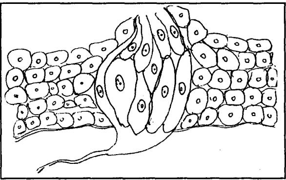

There are two cranial nerves that innervate the tongue and are used for taste :

i.e. (i) The Facial Nerve (7th cranial nerve)

(ii) The Glossopharyngeal Nerve (9th cranial nerve)

The facial nerve innervates the anterior (front) 2/3rd of the tongue and the glossopharyngeal nerve innervates that posterior (back) 1/3rd part of the tongue. Another cranial nerve (10th) i.e. Vagus nerve carries taste information from the back part of the mouth. The cranial nerves carry taste information into the brain to a part of the brain stem called the "nucleus of the solitary tract." From the nucleus of the solitary tract, taste information goes to the thalamus and then to the cerebral cortex.

Like information for smell, taste information also goes to the limbic system (Hypothalamus and amygdala). Another cranial nerve (5th), the trigeminal nerve also innervates the tongue, but is not used for taste.

Note :

- The complete inability to taste is called Ageusia. .
- Reduced inability to taste is called Hypogeusia. .
- · Enhanced ability to taste is called Hypergeusia.

#### Types of the Taste

There are five basic tastes.

- 1. Sweet
- 2. Sour
- 3. Salty
- 4. Bitter
- 5. Umami-Recently discovered taste

#### 1. Sweetness

Sweetness is produced by the presence of sugars, proteins and few other substances. Sweetness is detected by a variety of 'G protein coupled receptors' coupled to the 'G protein gustducin' found on the taste buds.

#### 2. Sourness

Sourness is the taste that detects acidity. The mechanism

for detecting sour taste is similar to that which detects salt taste.

#### 3. Saltiness

Saltiness is a taste produced primarily by the presence of sodium ions. Other ions of the alkali metals group also taste salty.

#### 4. Bitterness

The bitter taste is percieved by many to be unpleasant and disagreeable. Common bitter foods and beverages include coffee and quinine.

Research has shown that TAS 2RS (taste receptors, type 2, such as TAS 2R38) coupled to the G protein gustducin are responsible for the human ability to taste bitter substances.

#### 5. Umami

Umami is the name for taste sensation produced by compounds such as glutamate and are commonly found in fermented foods. In English it is also known as meatiness or savoriness.

# 5. Rasanam Pañcabhautikatwam

सौम्याः खल्वायोऽन्तरिक्षप्रभवाः प्रकृतिशीता लाध्यश्चाव्यक्तरसाश्च, तास्त्वन्त-रिक्षाद्धार्थमाना भ्रष्टाश्च पञ्चमहाभूतगुणसमन्विता जङ्गम स्थावराणां भूतानां मूर्तीरभिप्रीणयन्ति, तासु षडभिमूच्छन्ति रसाः । च. सू. २६/३९

सौम्या इत्यादि । सौम्या सोमदेवताका: । भ्रृश्यमाना इति वदता भूमिसम्बन्ध-व्यतिरेकणान्तरीक्षेरितै: पुथिव्यादि परमाण्वादिभि: संबन्धो रसारम्भको भवतीति दुर्यते । मूर्तिरिति व्यक्तिः । अभिप्रीणयन्तीति तर्ययन्ति, किं वा जनयन्ति । अभिमुच्छन्ति रसा इति व्यक्तिं यान्ति । अत्र चान्तरीक्षमुद्कं रसंकारणत्वे प्रधानत्वादक्तं, तेन क्षितिस्थमणि स्थावरजङ्गमोत्यत्तौ रसकारणं भवत्येव ।

चक्रपाणि भाष्य-च. सू. २६/३९

आकाशपवनद्द्रन तोथ्यभूमिषु यथासक्ख्यमेकोत्तरपरिवृद्धाः शब्दस्पर्शरूप रसगन्धाः, तस्मादाप्यो रसः । परस्पर संसर्गात् परस्परानुग्रहात् परस्परानुप्रवेशाच्च सर्वेषु सर्वेषां सन्निध्यमस्ति, उत्कर्षापकर्षात्तु ग्रहणम् । स खल्वाप्यो रस: शोषभूत संसर्गाद्विदग्यः षोढ़ा विभव्यतेः तद्यथा मधुरोऽम्लो लवणः कदुकारतिक्त कषाय सु. सू. ४२/३ डति ।

#### क्ष्माम्भोग्निश्चाम्बतेज: खवाय्वग्नि अनिलगोनिलै: । द्वयोल्बर्णैः क्रमान्द्धतैर्मधरादिरसोद्धवः । अ. हृ. सु. १०/१ द्रव्यस्य पाञ्चभौतिकत्वात् तदाश्रित रसेऽपि पाञ्चभौतिक: । योगेन्द्रनाथ सेन

Jala is the substrata for all Rasa, when Jala which is Soumya in Antariksa (Atmosphere) will have Avyakta Rasa (No taste), when it touches ground it acquires all Pañcabhautika qualities attains 6 individual tastes which nourish the animals and plants.

Susruta opines that because of combinations of different Mahabhūtas the manifestation of 6 Rasas occur. All the six Rasas will have all the Mahabhutamsas. but one or two Mahabhūtas will be dominant.

Yogendranāth sēn gives a logical point that when Dravya is Pañcabhautika, automatically the Rasa which is residing in Dravya must be Pañcabhautika.

# 6. Rasa Nivrtti Višesa Hetu रसनार्थो रसस्तस्य द्रव्यमाप: क्षितिस्तथा । निवृत्तौ च विशेषे च प्रत्यया: खादयस्त्रयः ।। च. सू. १८६४

रसनार्थ इत्यादि । रस्यत आस्वाद्यत इति रसः । रसनार्थ इति जिह्वाग्राह्मः । एतच्च घण्णामपि रसानामनुगतं रूपादिषु च व्यावृत्तत्वात् साधुलक्षणम् । तस्येति रसस्य । द्रव्यमिति आधारकारणम् । .......... क्षितिजलसंबन्धः; .................................................................................................................. किं व्यक्तावक्षिती कारणं किं वा विशेष इत्याह-निवृत्तावित्यादि । निवृत्तौ चेति अभिव्यवतौ । एतेन रसोऽभिव्यज्यमानो जलक्षित्याधार एव व्यज्यत इति दर्शयति । चकाराद्विशेषेऽपि मधुरादि लक्षणे अक्षिती प्रत्ययौ । तेन 'सोमगुणातिरेकान्मधुरः, पृथिव्यग्निगुण्यतिरेकादम्लः' इत्यादिना जलपृथिव्योरपि विशेषकारणत्वं वक्ष्यमाण-मपपन्नम् । विशेष च प्रत्ययाः खादय इति मधुरादिविशेषनिवृत्तौ निमित्तकारणां खवाय्वनला:, न त्वाधारकारणभूता: । खादय इत्यनैनैव त्रित्वे लब्धे पुनस्न्रय: इति वचनं तेषामेव व्यस्तसमस्तानामपि प्रत्ययत्वदर्शनार्थम्; अत एव व्यस्तसमस्ता-काशादि संसर्गभेदाद्रसानां मधुर तरमधुरतमाखवान्तरभेद उपपन्नः ।

The Rasa which is an Indriyartha of Rasanendriya, takes its origin from Ap & Prithvi Mahābhūta and hence Ap & Prithvi Mahābhūtas are the Adhāra Karana. Remaining three Mahābhūtas like Ākāša. Vāvu & Agni are also contributing to the manifestation of different Rasas. hence they are considered as Nimitta Karana. Here Visesa also implies a meaning that the time factor also plays an important role in formation of Rasas. All the Rasas are having Pañcamahabhütamśas but there will be dominance of two Mahabhuta which decide the particular Rasa.

Another concept is, it is because of the permutation and combination of these Mahabhutas variations in taste like Madhura Tara, Madhura Tama etc are noticed.

#### Schematic Representation of Origin of Rasa

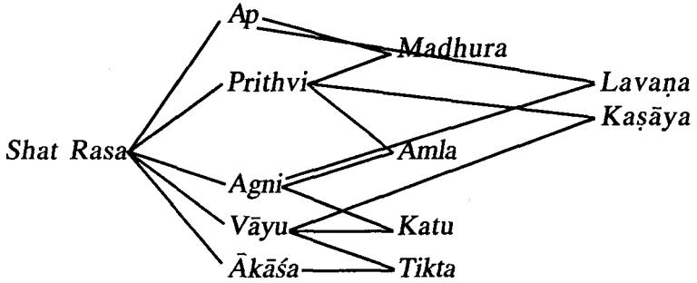

#### 7. Rasa and Anurasasya Bheda

व्यक्तः शृष्कस्य चादौ च रसो द्रव्यस्य लक्ष्यते । विपर्ययेणानुरसो रसो नास्तीह सप्तमः । च. सू. अ. २६

भाष्य-व्यक्त इत्यादि । शुष्कस्य चेति चकरादार्द्रस्य च, आदौ चेति चकरादन्ते च: तेन शष्कस्य वाऽऽर्द्रस्य वा प्रथम जिह्वासम्बन्धे वाऽऽस्वादान्ते वा यो व्यक्तत्वेन मधुरोऽयमम्लोऽयमित्यादिना विकल्पेन ग्रह्माते, स रसः, यस्तुक्तावस्था-चतुष्ठयेऽपि व्यक्तो नोपलभ्यते, किं तर्ह्यव्यपदेश्यतया छायामात्रेण कार्यदर्शनिन वा मीयते, सोऽनुरस इति वाक्यार्थः । चक्रपाणिदत्त

तत्र व्यक्तो रस: । अनुरसस्तु रसेनाभिभूतत्वादव्यक्तो, व्यक्तो व किंचिदन्ते । अ. सं. सू. १७ तत्र च द्रव्ये रसेनेन्द्रियग्राह्यो व्यक्तः स्फुटो 'रस' शब्देनोक्तः । इन्द्र भाष्य-अ. सं. स. १७

तत्र व्यक्तो रस: स्मृत: ।

अव्यक्तोऽनरसः किञ्चिदन्ते व्यक्तोऽपि चेष्यते । अ. हृ. सू. ९

भाष्य-तत्र द्रव्ये. कश्चिब्दर्मः सद्यो व्यक्तः. कश्चिद्यव्यक्तः कश्चिदीषद व्यक्तः कश्चिदन्ते व्यक्तः । तेष्वाद्यो रसाख्यः, इतरे त्रयोऽनरसाख्याः । हेमाद्रि

The Rasa (Primary taste) is percieved immediately on consumption of the Dravya and remains stable even in its dry state.

Anurasa (Secondary taste) on the other hand is one which is percieved after the perception of the primary taste and is not stable in its dry state and not easy to percieve distinctly.

Rasa is vividly or clearly percieved whereas Anurasa is obscure.

Hence there are only 6 Rasas and not seven.

Eg. 1. Chitraka whose Rasa is Katu in fresh form continues to remain Katu in its dry form. i.e. Rasa is stable both in fresh & dry states.

2. Amalakī has Pañca Rasa (Five tastes). But it is Amla Rasa which is percieved immediately on consumption and hence considered as Pradhana (Primary) while others i.e. Madhura, Katu, Tikta & Kasāya are Anurasas.

3. Pippalī in its fresh state has Madhura Rasa but on drying transforms into Katu Rasa which is percieved first.

| SI.No.  Rasa |                                     |    | Sl. No.   Anurasa        |
|--------------|-------------------------------------|----|--------------------------|
|              | Primary taste                       |    | Secondary taste          |
| 2.           | Percieved immediately               | 2. | Percieved later          |
| 3.           | Percieved distinctly                | 3. | Not percieved distinctly |
| 4.           | Percieved completely                | 4. | Percieved partly         |
| 5.           | Remains stable in dry<br>state also | 5. | Not stable in dry state  |

Table showing the difference between Rasa & Anurasa.

#### 8. Snannānām Rasasva Pañcabhautika Sanghatanam Vaiśistvam

All the Rasas (tastes) have five Mahabhutas, but manifestation of various Rasas depends on the predominant Mahabhutas and their combination in particular way.

तेषां षण्णां रसानां सोमगुणातिरेकान्मधुरो रसः प्रथिव्यग्नि भूविष्ठत्वादम्लः, सलिलाग्निभूयिष्ठत्वाल्लवण:, वाय्वग्नि भूविष्ठत्वात कट्रक: वाय्वाकाशातिरिक्तवा तिक्तः, पवन प्रथिव्यतिरेकात् कषाय इति । च. सू. २६/४०

तत्र, भुम्यम्बुगण बाहुल्यान्मधूर:, भ्रम्यग्निगणबाहल्यादम्लः, तोयाग्निनगण-बाह्यूल्याल्लवण:, वाय्वग्निगुणबाहुल्यात् कट्रक: वाय्वाकाश गुण बाहूल्यात्तिक:, पुथिव्यनिलगुणबाहुल्यात् कषाय इति । सु. सू. ४२/३

क्ष्माम्भोग्निक्ष्माम्बुतेज: ख्वाय्वगिन अनिलगोनिल्लै: ।

द्वयोल्बर्णैः क्रमान्द्धतैर्मधरादिरसोन्द्रवः ।।।

```
अ. हृ. सू. १०/१
```
(आ. रसायन (हेमाद्रि))

तत्र रसानामुत्पत्तिमाह-क्ष्माम्भोग्निति । पृथिव्युदकाभ्यामुल्वणाभ्यां मधुर-रसस्योत्यत्तिः, तेजः पृथ्यिवीभ्यामम्लस्य, उदकतेजोभ्यां लवणस्य, वाय्वाकाशाभ्यां तिक्तस्य, तेजोवायभ्यां कदकस्य, वायपुथिवीभ्यां कषायस्य।

तत्र प्रशिव्यपां बाहुल्यान्मधुरं विद्यात् अम्लमपामग्नेश्च, लवणमग्नेरपां च, कद्रुकमग्नेवायोश्च, तिक्त कस्य वायोश्च, कषायमग्नेवायोश्च ।

र. वै. अ. ३/३८-४३

Chart showing predominant Mahabhūtas in Rasa as per Brhatvayīs.

| SI.<br>No. | Rasa   | Caraka<br>Samhita         | Suśruta<br>Samhita                         | Astānga<br>Hrdaya |
|------------|--------|---------------------------|--------------------------------------------|-------------------|
| 1.         |        | Madhura Ap & Prthvi       | Prthvi & Ap                                | Prthvi & Ap       |
| 2.         | Amla   | Prthvi & Agni   Ap & Agni |                                            | Agni & Prthvi     |
| 3.         | Lavana | Ap & Agni                 | Prthvi & Agni   Ap & Agni                  |                   |
| 4.         | Katu   | Vāyu & Agni               | Vāyu & Agni                                | Agni & Vāyu       |
| ર .        | Tikta  |                           | Vāyu & Akāśa   Vāyu & Akāśa  Vāyu & Akāśa  |                   |
| 6.         | Kaṣāya |                           | Vāyu & Pṛthvi Pṛthvi & Vāyu  Vāyu & Pṛthvi |                   |

#### Note :

Caraka and Susrutacarva have difference of opinion regarding Amla & Lavana Rasas. Caraka opined Amla is having Prthvi & Agni Mahabhūta's where as Suśruta has mentioned Ap & Agni for Amla. Caraka envisaged that Lavana is composed of Ap & Agni and Susruta has opined Prthvi & Agni are dominant in Lavana Rasa.

Acarya Nāgārjuna differs when it comes to Kasāva Rasa. he opined that Kasava is having dominance of Agni & Vayu Mahābhūtas. And Lavana is Agni Mahābhūta predominent.

#### 9. Rtu Prabhāva & Rasa

षहृतकत्वाच्च कालस्योपपन्नो महाभृतानां न्युनातिरेक विशेष: ।

च. सू. २६/४०

स षड् ऋतुकत्वात्कालस्य महाभुतगुणैरुनातिरिक्तः संस्रष्टां विषमं विदग्धः षोढ़ा पुथरिनपरिणमते मधुरादि भेदेन । अ. सं. सू. १८/३

कथं महाभतानामनाधिक्यम ? उच्यते-कालस्य संवत्सराख्यस्य बहुतकत्वा-द्रसस्यापि षडभेदत्वम । तथा च शिशिरे वाय्वाकाशयोराधिक्याद्रसस्य तिक्तता. वसन्ते वायपुथिव्यो: कषायता, ग्रीष्मेऽग्निवाय्वो: कट्ता, वर्षास्वग्निपुधिव्योरम्लता, शरद्यग्न्युदकयोर्लवणता, हेमन्ते प्रथिव्युद्कयोर्मधुरतेति प्रधान्याद् व्यपदेशः, तेनान्यर्तुद्धवानामपि रसानां यथोक्तमहाभूतद्वपाधिक्यमेव कारणं विज्ञेयम् । इन्दु:भाष्य-अ. सं. सू. १८/३)

The year is divided into six Rtus, like wise because of variation in dominancy of mahabhūtas six Rasas will be formed.

The chart showing Rtus and corresponding Rasas :

| SI. No. |         | Rtu (Season)   Mahābhūtas Dominant   Rasa formed |        |
|---------|---------|--------------------------------------------------|--------|
| 1.      | Śiśira  | Vāyū & Akāśa                                     | Tikta  |
| 2.      | Vasanta | Vāyu & Prthvi                                    | Kaṣāya |
| 3.      | Grsma   | Agni & Vāyu                                      | Katu   |
| 4.      | Varsã   | Agni & Prthvi                                    | Amla   |
| 5.      | Śarat   | Agni & Jala                                      | Lavana |
| 6.      | Hemanta | Prthvi & Jala<br>Madhura                         |        |

# 10. Bhautika Nispatti Nirdhāranam

अयं च भतानां सन्निवेशोऽद्यष्टप्रभावकत एव च. स च सन्निवेश: कार्य-दर्शनेनोन्नेय: । तेन यत्र कार्यं दृश्यते तत्र कल्प्यते, यथा ......लवणे उष्णत्वादग्निर्विष्यन्दित्वाच्च जलमनुमीयते । चक्रपाणि भाष्य-च. सु. २६/४०

Eventhough each and every Rasa constitutes Pañcabhūtas. dominant two Mahabhutas will be assessed easily based on the actions done by the particular Rasāvukta Dravyas. By knowing - the Karma done by the Rasa it is not apt to say it is made of two Mahabhūtas only. For the reference two Mahabhūtas may be considered.

For eg. Usnatwa of Lavana Rasa indicate that it has Agnimahābhūta Pradhanyata and Abhisyandi Karma denotes it has predominance of Ap Mahabhuta. Finally it may be concluded that Layana has predominant Ap & Agni Mahābhūtas.

#### 11. Rasopalabdhi Hetavaha

रसो निपाते द्रव्याणाम ।

च. स. २६/७७

रसादीनां एकद्रव्यनिविष्टानां भेदेन ज्ञानार्थ लक्षणमाह रसो निपात इत्यादि । निपाते इति रसनोयोगे । द्रव्याणामिति उपयज्यमान द्वव्याणाम् ।

चक्रपाणिदत्त भाष्य

द्रव्याणां निपाते रसनायोगे जिह्वास्पर्शमात्रेण, रसः मधुरादिः उपलभ्यते । योगेन्द्रनाथ सेन

यद्येवं द्रव्याणां स्वभावो वीर्यं गणारूच रसादयः सर्वाणि वीर्याणि, तत कथं रसादीनां भेद उपलब्धत इत्यत उच्यते रसो निपात इत्यादि । द्रव्याणा अभ्यवाद्वीय-

माणानां मुखे रसनायां निपाते रसो मधुरादिरुपलभ्यते, नन् सर्व वीर्यम् । गंगाधर राय

अ. सं. सू. १७

रसं विद्यान्निपातेन ।

रसमित्यादि निपातेन जिद्वास्पर्शमात्रेण रसविशेषं विद्यात् द्रव्यस्य । इन्द् प्रत्यक्षतोऽनुमानादपदेशत्रुच रसानामपलब्धिः । र. वै. अ. उ. स. १०८ भाष्य-आस्वाद्य प्रत्यक्षत उपलब्धन्ते । अनुमानात् पूर्वोत्तं लिङ्गं दृष्ट्रवा मधुरोऽय-मित्युपलभ्यते । उपदेशतः आगमात् कषायं मधु, मधुरमुदकं इत्यादि ।

अथवा आस्वादतः रसानां सामान्यत उपलब्धिर्भवति, अनुमानलिङ्गपूर्वकात् विशेषोपलब्धिर्भवति, उपदेशतः, कर्मणि रसानां प्रवत्यपलभ्यत इति । अथवा सर्वत्रास्वादत एव रसो न ग्रह्यते, आगम क्वचित्, क्वचिदनुमानाच्येति । "श्रीतं कषायं मधुरं विष्ठनं वर्ण्यं च मेधारमृतिवर्धनं च । रसायनीयं लघु रूक्षमस्तं. कषायतिक्तं लघुरुप्यमाहः ।।'' अत्रास्वादतो रसो न लभ्यते इति ।

Rasa of a Dravya is directly percieved on its contact with Rasanendriya (Tongue).

Badanta Nagārjuna further explains that Rasa is percieved through 3 modes.

1. Pratvaksa-By direct perception from sense organ

2. Anumāna-Inference.

3. Aptopadeśa-By ancient literature.

#### 1. Pratvaksa

An individual becomes aware of Rasa (taste) on contact with Rasanendriya (Tongue).

Eg. Tikta Rasa of Kiratatikta.

Madhura Rasa of Iksu.

Katu Rasa of Marica.

Lavana Rasa of Saindhava Lavana.

#### 2. Anumāna

At times. Rasa (Taste) cannot be assessed directly through sense organs. At such instances, one can assess Rasa (Taste) through inference.

Eg. Visa Drayyas cannot be tasted to percieve its Rasa. So. here Anumana should be used.

#### 3. Aptopadeśa (Ancient Literature)

If assessment of Rasa (Taste) is inconclusive through Pratyaksa and Anumana, then one can refer the ancient literature for clarity & conclusion. Eg. Assesing the Rasa of Swarna (Gold) is difficult through Pratyaksa and Anumana and hence, on reviewing classical literature, we get the reference of its Rasa as Kasāva and Madhura.

#### 12. Rasa Rupantara (Transformation of Taste)

Rasa (Taste) of a Dravya may alter under the influence of various factors. Badanta Nagarjuna throws light on these factors.

#### 1. Sthana (Kept Unaltered)

र. वै. सू. अ. ३/२९ अन्यथात्वगमनं स्थानात् ।

एवं रसानां षटत्व प्रसाध्येदानीमन्यथात्वगमनं वक्ष्यतेअन्यथात्वेत्यादि । अन्यथात्वगमनं नाम अन्यस्वादस्थ प्राप्तिः । अन्यथात्वगमनं स्थानाच्च भवति । स्थानं किंचित् व्यवस्थानम् । यथा-रसतो मधुर ओदन अवस्थापितो धान्याम्लं भवति । अथवा स्थानात् स्थीयतेऽत्रेति स्थानमधिकरणं तन्द्धेतोरपि रसान्तरं भवति: अम्लभाजने प्रक्षिप्तं क्षीरं मधुरमम्लतामापद्यते । भाष्य

A substance when kept unaltered at a place may lead to change in its Rasa (Taste).

Eg. Madhura Rasa (Sweet taste) of cooked rice changes to Amla Rasa (Sour taste) when kept in a place unaltered.

#### 2. Patra (Utensil)

Substance placed in certain metallic utensils change its taste.

Eg. Curds which is Amla (Sour), when kept in Kamsya Patra (Bronze utensil), changes its Rasa from original Amla (Sour) to Katu (Pungent).

#### 3. Samyoga (Combination)

र. वै. सू. अ. ३/३० ........... संयोगत: ............ ।

संयोगतरूच रसानामन्यथात्वं भवति । संयोग इति द्रव्यान्तर संयोगः । यथा-सुधा चुर्णेन भस्मना वा संयुक्तं चित्रसाफलमम्लं मधुरं भवति । भाष्य

The taste may change when a Dravya (Substance) is combined with certain substances.

Eg. Cinca (Tamarind) which is Amla (Sour), when mixed with Sudha (Lime) turns to Madhura Rasa (Sweet taste).

#### 4. Pākāt (Exposure to Heat)

••••••••••••••••••••••••••••••••••••••••••••••••••••••••••••••••••••••••••••••••••••••••••••••••••••••••••••••••••••••••••••••••••••••••••••••••••••••••••••••••••••••••••••••

### र. वै. सू. अ. ३/३०

# अग्निनिमित्तं पाकादित्यक्तं भवति । तदेव चित्र्था फलं अग्निपवनं मधरं भवति, पाकाज्जाम्बवान्याद्र्राणि वायुना शोषितान्यम्लानि मधुरोभवन्ति । भाष्य

A substance when subjected to heat may alter its taste.

Eg. Cinca & Jambu which originally has Amla Rasa (Sour taste) changes to Madhura Rasa (Sweet taste) on heating.

# 5. Atapa (Exposure to Sunlight)

.......... आतपात् । र. वै. स. अ. ३/३१

तम्बरुफलान्यातपपरिशोषितानि कषायाणि मधरीभवन्ति । भाष्य

Exposure to sunlight may at times change the taste of a Dravya (Substance).

Eg. On exposing Tumburu Phala to sunlight, its Kasāya Rasa (Astringent taste) gets altered to Madhura Rasa (Sweet taste).

### 6. Bhavana (Trituration)

.......... भावनया ।

```
र. वै. सू. अ. ३/३२
```
यष्टिमधुभावितास्तिला: कषाय-तिक्त-मधुरा: सन्तो मधुर एव भवन्ति । भाष्य

Eg. Tila which has Kasāya (Astringent), Tikta (Bitter) & Madhura (Sweet) Rasas when given Bhavana with Yastimadhu will transform to Madhura Rasa (Sweet taste).

# 7. Deśa (Region)

.......... देश .......... भ्याम् । र. वै. सू. अ. ३/३२२ देशतः क्वचिद्वेशे आमलकफलानि परममधराणि भवन्ति किल । भाष्य

Taste of a Dravya (Substance) may vary acc. to the region where it is grown.

Eg. Amalaki grown in Nainital is sweeter when compared to those grown in other places.

- 8. Kāla (Time)
र. वै. सू. अ. ३/३२ .......... कालाभ्याम् । कालतः कदलीफलं कषायं मधुरतामापद्यते, तदेवान्यरसं भवतीति । भाष्य

Time also has an impact on the taste of a Dravya (Substance). After some duration, taste of certain Dravyas gets altered.

Eg. Kadaliphala (Banana) in unripen state has Kasaya Rasa (Astringent taste) but on ripening turns to Madhura Rasa (Sweet taste).

Apakwa Badara which has Kasaya Rasa on ripening will acquire Madhurāmla Rasa.

#### 9. Parināma (Transformation)

परिणामत: ।

र. वै. सू. अ. ३/३३३

परिणामोऽन्यथा भावः । अथवा परिणामतः कालव्यतिक्रमादति परिणामतः । यथा-पनसफलमतिक्लिन्नं कालात्ययात् परिणतमम्लं भवति, तथा-तालफलं च । भाष्य

Transformation of a Dravya from one form to another also leads to change in Rasa.

Eg. On curdling milk which is Madhura (Sweet) changes to Amla. Panasa phala & Tala phala becomes Amla.

#### 10. Upasarga (Infestation)

उपसर्गतः ।

र. वै. सू. अ. ३/३४

उपसर्गतः कुमिप्रभृतिभिरूपसंस्कृतस्त्वस्त्रदस्तिक्ता अम्ला वा भवन्ति । भाष्य Infestation of a Dravya results in altered taste.

Eg. Infested Iksu (Sugar cane) will have Amla or Tikta Rasa.

#### 11. Vikriva (Special Acts)

विक्रियतः ।

र. वै. सू. अ. ३/३५

विक्रियातश्चान्यथात्वगमनं भवति, विरुद्धा विप्रतिषिट्टा वा क्रिया विक्रिया, तब्देतोश्च रसान्तरप्राप्तिर्भवति । तद्यथा तालफलं दग्यं भुमौ बहुशः परिवर्तितं तिक्तं भवतिः पनसफलं हस्तेन बहुशः परिपीडितं क्लिष्टं चाम्लं भवतीति । भाष्य

Certain substances change its taste on subjecting it to some special actions.

16 Dra.Vij.

Eg. Talaphala if it is heated and rubbed along soil floor will change its Rasa to Tikta (Bitter). Panasa phala squeezed in hand becomes sour.

#### 13. Rasānām Vargikaraņam

Considering various references and contexts. Rasa may be classified into many groups.

#### I. Classification of Rasa acc. to Sowmyagnibheda

केचिदाहः - अग्निषोमीयत्वाज्जगतो रसा द्विविधाः - सौम्याश्चाग्नेयाग्ञ्च । मधुर: तिक्तकषाया: सौम्या:, कट्वम्ल लवणा आग्नेया: । स्. सू. ४२/७

The universe constitutes Sowmya & Agneya Dravyas which are having Sowmya & Agneva Rasa.

1. Sowmya Rasas-Madhura, Tikta & Kaṣāya.

2. Agneva Rasas-Katu. Amla & Lavana.

# II. Classification of Rasa acc. to Guna

तत्र मधुराम्ल लवणा: स्निग्धा गुरवर्ध, कट्रतिक्तकवाया रुक्षा लघवश्च ।

सु. सू. ४२/७

1. Snigdha & Guru Rasa-Madhura, Amla & Lavana.

2. Rūkṣa & Laghu Rasa-Kaṭu, Tikṭa & Kaṣāya.

#### III. Classification of Rasa acc. to Virva

सौम्या: शीता:, आग्नेया उष्णा: ।

#### सु. सू. ४२/७

1. Śīta Vīrya Rasa-Madhura, Tikta & Kaṣāya.

2. Usna Vīrya Rasa—Kaṭu, Amla & Lavaṇa.

#### IV. Classification of Rasa acc. to Vidāhi & Avidāhi

कट्वम्ल लवणा वैद्यैर्विदाहित इति स्मृता: स्वादु-तिक्त- कषाया: स्यूर्विदाह-रहित रसा: । विदाहितो रसा मूच्छा जनयन्ति प्रयोजिता: । विदाहिरहिता मूच्छा र. वै. भा. शमयन्तीति निश्चितम् ।

1. Vidāhi Rasas-Kaṭu, Amla & Lavaṇa.

2. Avidāhi Rasas—Madhura, Tikta, Kasāya.

Note :

If used Vidahi Rasas will cause Murcha (Giddiness) and Avidāhi Rasas will relieve from Mūrchā (Giddiness).

V. Classification of Rasas acc. to Dosas/Samana & Kopana

स्वाद्वम्ल लवणा वायुं, कषायस्वादुतिक्तका: । जयत्ति पित्तं, श्लेष्माणं कषायकदृतिक्तका: ।।

च. सू. १८६६

कटवस्ललवणा पित्तं स्वाद्वम्ललवणा: कफम । कोपयन्ति समीरणम् ।। कटतिक्तकषायाश्र पाठान्तर-यो. ना. सेन

A. Śāmak Rasa

1. Vāta Šāmaka Rasa-Madhura, Amla & Lavana.

2. Pitta Śāmaka Rasa-Kasāya, Madhura & Tikta.

3. Kapha Śāmaka Rasa-Kasāya, Katu & Tikta.

B. Kõpana Rasa

1. Vāta Kopana Rasa-Katu. Tikta & Kasāva.

2. Pitta Kopana Rasa-Katu, Amla & Lavana.

3. Kapha Kopana Rasa-Madhura, Amla & Lavana

VI. Classification of Rasa acc. to Gati

त्रत्राग्निमारूतात्मका रसाः प्रायेणोर्ध्वभाजः. लाघवादत्प्लवनत्वाच्च वायोरुर्थ्व-ज्वलनत्वाच्च वह्नेः; सलिल-प्रशिव्यात्मकास्तु प्रायेणाधोभाज:, पृथिव्या गुरुत्वा-न्निम्नगत्वाच्चोदकस्थः व्यामिश्रात्मकाः पुनरुभयतो भाजः । च. स. २६/४१

Depending upon the movement of different Rasatmaka Dravyas. Rasas are divided into 3 types.

1. Urdhwabhāja

2. Adhobhāja

3. Ubhayatobhaja

1. Urdhwabhaia : The Rasas having dominance of Agni and Vayu Mahabhutas will help in upward movement because of their Laghu nature.

Eg. Katu Rasa

2. Adhobhaja : The Rasas having the predominance of Ap and Prthvi Mahabhūtas help the Dravyas move towards downward direction because of its Guru quality.

Eg. Madhura Rasa

3. Ubhavatobhaja : Rasa having dominance of Prthvi & Vayu or Jala & Agni Mahabhutas will have movement in different or both the direction.

Eg. Lavana Rasa.

#### Rasa Vikalpa

### Combination and Permutation of Rasa

भेदश्चैषां त्रिषष्टिविध विकल्पो द्रव्यदेशकालप्रभावाद्धवति, तमुपदेक्ष्यामः । च. सू. २६/१४

त्रैतेषां रसानां संयोगास्त्रिषष्टिर्भवन्ति । तद्यथा-पञ्चदशा द्विकाः, विशातिस्तिका:, पञ्चदशचतुष्का:, घट्पक्खका: एकश: षड्सा:, एक: षट्क इति । सु. सू. ४२/१२

| संयोगा: सप्तपञ्जाशत्कल्पना तु तु त्रिषष्टिधा ।                                                                           |  |  |             |
|--------------------------------------------------------------------------------------------------------------------------|--|--|-------------|
| रसानां यौगिकत्वेन यथास्थूलं विभिज्यते ।                                                                                  |  |  |             |
| एकैकहीनास्तान्  पञ्चदशः यान्ति  रसा  द्विके ।।                                                                           |  |  |             |
| त्रिके स्वादुर्दशाम्लः षट् त्रीन् पदुस्तिक्त एककम् ।                                                                     |  |  |             |
|                                                                                                                          |  |  |             |
| चतुष्केषु  दश  स्वादुश्चतुरोऽम्लः   पदुः   सकृत्  । । पञ्चकेष्ठोकन्मेवाम्लो     मधुरः     पञ्चुरः     पञ्च     सेव्यते । |  |  |             |
| द्रव्यमेकं                                                                                                               |  |  |             |
|                                                                                                                          |  |  | च. शा. १/७२ |

Because of the effects of Dravya (Substance), Deśa (Place) & Kala (Time), there are 63 types of permutation & combination of Rasa.

| SI. No. | Permutation & Combination of Rasa  | No. of Combination |
|---------|------------------------------------|--------------------|
| 1.      | Eka Rasa (One taste)               | 6                  |
| 2.      | Dwi Rasa (Combn of two Rasa)       | ાં ર               |
| 3.      | Trika Rasa (Combn of three Rasa)   | 20                 |
| 4.      | Catfuska Rasa (Combn of Four Rasa) | ાં ર               |
| 5.      | Pañca Rasa (Combn of Five Rasa)    | 6                  |
| 6.      | Sad Rasa (Combn of Six Rasa)       |                    |
|         | Total                              | રે રે              |

Chart showing the permutation & combination of Rasa :

#### Eka Rasa (Substance with Single Rasa)

अतः परमेकैकरसानाह-सन्तानिकागोदुग्धादिकं मधुरम्, आमकरमर्दादिकं अम्लम्, रोमकादिकं लवणम्, चव्यादिकं कटुकम, निम्बपर्यटादिकं तिक्तम् पद्मन्य-ग्रोधाद्यद्वरादिकं कषायम् एवं षट् कथिताः ।

| Sl. No. | Eka Rasa          | Examples         |  |
|---------|-------------------|------------------|--|
| 1.      | Madhura           | Godugdha         |  |
| 2.      | Amla<br>Karamarda |                  |  |
| 3.      | Lavana            | Romaka           |  |
| 4.      | Katu              | Cavya            |  |
| న్న     | Tikta             | Nimba, Parpataka |  |
| 6.      | Kasāya            | Padma, Nyagrodha |  |

Dwika Rasa Samyoga (Combination of Two Rasa)

संयुक्ता यथा-बदरकपित्यफलादिकं मधुराम्लम् (१), उष्ट्रीक्षीरोरभ्रमांसादिकं मधुरलवणम् ( २), कुक्कुरशृगालमांसादिकं मधुरकदुकम् ( ३ ), श्रीवाससर्जरासादिकं मधूरतिक्तम् (४), तैलधन्वन्दनकलादिकं मधुरकषायम् (५), ऊषकादिकं अम्ललवणम् (६), चुक्रादिकं अम्लकटुकम् (७), सूरादिकं अम्लतिक्तम् (८), हस्तिनीदधिशूक-मांसादिकं अम्लकषायम् (९), त्रपुसीसादिकं लवर्णातिक्तम् (१०), गोमुत्रस्वर्जिकादिकं लवणकद्कम् (११), समुद्रफेनादिकं लवणकषायम् (१२), कर्पूरजातीफलादिकं तिक्तकटुकम् (१३), लवलीफलहस्तिनीघ्रतादिकं तिक्त कषायम् (१४), भल्लातक-मज्जाहरितालादिकं कटुकषायम् (१५) एवं द्विरस भेदा: पञ्चदशधा दर्शिता: । डल्हण भाष्य-स्. उ. ६३/४

Totally 15 combinations can be made with two Rasa combinations.

|    | SI. No.   Combination of Rasa   Examples |                        |
|----|------------------------------------------|------------------------|
| 1  | Madhura Amla                             | Badara & Kapittha      |
| 2. | Madhura Lavana                           | Ustra  Ksīra           |
| 3. | Madhura Katu                             | Kukkura & Śrgāla Māmsa |
| ব  | Madhura Tikta                            | Śrīvāsa & Sarjarasa    |

#### Table showing combinations of two Rasa :

| 5.  | Madhura Kasāya | Taila (Tila) & Dhanwana Phala |
|-----|----------------|-------------------------------|
| 6.  | Amla Lavana    | Üşaka (Kşara Mṛt)             |
| 7.  | Amla Katu      | Cukra                         |
| 8.  | Amla Tikta     | Surā                          |
| 9.  | Amla Kasāya    | Hastinī Dadhi                 |
| 10. | Lavana Tikta   | Trpu & Sīsa                   |
| 11. | Lavaņa Katu    | Gomūtra, Swarjika Ksāra       |
| 12. | Lavana Kasāya- | Samudraphena                  |
| 13. | Tikta Katu     | Karpūra, Jatīphala            |
| 14. | Tikta Kasāya   | Lavalīphala, Hastighrta       |
| 15. | Katu Kasāya    | Bhallataka Majja              |

Trika Bheda (Combination of Three Rasa)

अतः परं रसत्रितय भेदा वक्ष्यन्ते-हस्तिमांसादिकं मधराम्ल लवणम् (१), शल्यक मांसादिकं मधुराम्ल कटुकम् (२), गोधुमोत्य सुरादिकं मधुराम्लतिक्तकम् (३), मस्तुबक्रादिकं मधुराम्लकषायम् (४), काणकपोतमांसादिकं मधुरलवण-कटुकम् (५), शम्बुकादिमांसं मधुरलवण तिक्तम् (६), पद्मकन्दादिकं गुडसंयुक्तं मधुरलवणकषायम् (७), वृणशुन्याफलश्रृष्ककुस्तुम्बर्यादिकं मधुरकद्रतिक्तकुम् (८), गोधामांसैरण्डतैलादिकं मधुरकदुकषायम् (१०), रौप्यशिलासत्वादिकं अम्लावणकदुकम् (११), हस्तिमूत्रादिकं अम्ललवणतिक्तम् (१२), सरोमकं हस्तिनी दध्यादि अम्ललवणकषायम् (१३३) मरिचसंस्कृत सुरादिकं अम्लकद्रतिक्तकम् (१४), अम्लवेतसादिकं अम्लकटुकषायम् (१५५), कीरमांसयुत सुरादिकं अम्लतिक्तकषायम् (१६), अविमूत्रादिकं लवण कदुरिक्तम् (१७), अरुष्करं सरोमकं लवणकटुकषायम् (१८), समुद्रफेनाविकं लवणतिक्तकषायम् (१९), कृष्णागरुसुरदारुम्लेहादिकं कदुरिक्तकषायम् (२०) एवं त्रिकभेदा विंशतिदर्शिताः । डल्हण भाष्य-सु. उ. ६३/४

| SI. No.   Combination of Rasa | Examples         |
|-------------------------------|------------------|
| Madhura Amla Lavana           | Hasti  Māmsa     |
| Madhura Amla Kațu             | Salvaka Māmsa    |
| Madhura Amla Tikta            | Godhūmottha Surā |

Table showing combination of three Rasa :

| 4.  | Madhura Amla Kaṣāya   | Mastu, Takra                     |
|-----|-----------------------|----------------------------------|
| 5.  | Madhura Lavaṇa Kaṭu   | Kāņakapota Māmsa                 |
| Q.  | Madhura Lavaņa Tikta  | Śambūka Māmsa                    |
| 7.  | Madhura Lavaṇa Kaṣāya | Padmakanda with Guda             |
| 8.  | Madhura Katu Tikta    | Šuska Kustumburu                 |
| 9.  | Madhura Kaṭu Kaṣāya   | Eranda Taila                     |
| 10. | Madhura Tikta Kaṣāya  | Gudūcī Śāka, Tuvavaraka<br>Taila |
| 11. | Amla Lavana Katu      | Roupya, Śilajatu                 |
| 12. | Amla Lavaņa Kaṣāya    | Hasti  Mūtra                     |
| 13. | Amla Lavaņa Kaṣāya    | Hastinidadhi with Romaka         |
| 14. | Amla Katu Tikta       | Marica Samskarita Surā           |
| 15. | Amla Kaṭu Kaṣāya      | Amlavetasa                       |
| 16. | Amla Tikta Kasaya     | Kīramāmsayuta Sura               |
| 17. | Lavaņa Kaṭu Tikta     | Avimūtra                         |
| 18. | Lavaṇa Kaṭu Kaṣāya    | Aruskara with Romaka             |
| 19. | Lavaņa Tikta Kaṣāya   | Samudraphena                     |
| 20. | Katu Tikta Kaṣāya     | Krsnāgaru                        |

#### Catuşka Rasa Samyoga

अतः परं चतुः संयोगा: पञ्चदश प्रकाश वक्ष्यन्ते-गोमूत्रान्वित शिलाजतुप्रभृतिकं मधुराम्लवणकदुकम् (१), गोमूत्रैकशफक्षीरादिकं मधुराम्ललवणतिक्तकम् (२), सैन्यवान्विततक्रादिकं मधुराम्ललवणकषायम् (३), लशुनान्वितं सूरादिकं मधुराम्ल-कद्र्तिक्तम् (४), काञ्जिकान्वितैरण्डतैलादि खदिरान्वितशिलाह्नादिकं च मधुराम्ल-कदुकषायम् (५), उदुम्बरान्वितं यवासशर्करादिकं मधुराम्लतिक्तकषायम् (६), वार्ताकफलादिकं मधुरलवणतिक्तकट्रुकम् (७), गोमूत्रान्वित तैलादिकं मधुरलवणकदु कषायम् (८), तिलगुग्गुल्वादिकं मधुरकदुतिक्त कषायम् (९), समुद्रफेनशर्करा-चित्रकान्वित बदरादि मधूरलवणतिक्तकषायम् (१०), सुवर्चलान्वित हस्तिनीदध्यादि-कृतसुरादिकं अम्ललवणकदुतिक्तम् (११), सौवर्चलान्वित हस्तिनीदध्यादिकं अम्ललवणकटुकषायम् (१२), औद्धिद लवणान्वितं शुक्रमांसादिकं अम्ललवणितिक्त कषायम् (१३), बालमूलक हस्तिनीदध्यादिकं अम्लकदुतिक्तकषायम् (१४),

सरोमकं बालबिल्वादिकं लवणकदुतिक्तकवायम् (१५), एषं चतुष्क रस संयोगा: पञ्जदशकथिताः । डल्हण भाष्य-सू. उ. ६३/४

Table showing combinations of four Rasa :

| SI. No. | Combination of Rasa                          | Examples                                  |
|---------|----------------------------------------------|-------------------------------------------|
| 1.      | Madhura Amla Lavana Katu                     | Gomūtrārnvita Śilajatu                    |
| 2.      | Madhura Amla Lavana Tikta                    | Gomūtra                                   |
| 3.      | Madhura Amla Lavaṇa<br>Kasāya                | Saindhavānvita Takra                      |
| 4.      | Madhura Amla Kațu Tikta                      | Laśunānvita Sura                          |
| న్.     | Madhura Amla Katu Kasaya                     | Kānjikānvita Eraņḍa<br>Taila              |
| 6.      | Madhura Amla Tikta Kasāya                    | Ūdumbarānvita Yavāsa<br>Sarkara           |
| 7.      | Madhura Lavana Tikta Katu                    | Vārtāka Phala                             |
| 8.      | Madhura Lavana Katu<br>Kaṣāya                | Gomūtranvita Taila                        |
| 9.      | Madhura Katu Tikta Kasāya                    | Tila & Guggulu                            |
| 10.     | Madhura Lavana Tikta<br>Kaṣāya               | Samudraphena Sarkarā-<br>nvita Badara     |
| 11.     | Amla Lavaņa Kaṭu Tikta                       | Suvarcalanvita Hastini-<br>dadhikrta Surā |
| 12.     | Amla Lavaņa Kaṭu Kaṣāya                      | Sauvarcalnvita Hastini-<br>dadhi          |
| 13.     | Amla Lavaņa Tikta Kaṣāya                     | Audbida Lavaṇanvita<br>Šukamāmsa          |
| 14.     | Amla Katu Tikta Kaṣāya                       | Bālamūlaka                                |
| 15.     | Lavaņa Katu Tikta Kaṣāya Saromaka Bāla bilwa |                                           |

#### Pañca Rasa Samyoga

अतः परं पञ्चरससंयोगाः षड् वक्ष्यन्ते-आमकरमदर्शन्वितं भ्रष्ट वार्ताकफलादिकं मधुराम्ललवणतिक्तकदुकम् (१), कदुत्रय यवक्षारान्वित तक्रादिकं मधुराम्ललवण-कद्दकषायम् (२), औद्धिदान्विततक्रादिकं मधुराम्ललवण तिक्त कषायम् (३), हरीतकी धात्रिफलादिकं मधुराम्ल कटुतिक्तकषायम् (४), रसोनादिकं मधुरलवण-कद्धतिक्तकषायम् (६), एवं पञ्चरससंयोगा: षड् दर्शिता: ।

डल्हण भाष्य-सू. उ. ६३/४

|     | Sl. No.   Combination of Rasa        | Examples                                      |
|-----|--------------------------------------|-----------------------------------------------|
| 1.  | Madhura Amla Lavana Tikta<br>Katu    | Amrakaramardanvita<br>Värtakaphala            |
| 2.  | Madhura Amla Lavana Katu<br>Kasāya   | Katutraya Yavaksārān-<br>vita Takra           |
| 3.  | Madhura Amla Lavana Tikta<br>Kaṣāya  | Audbhidanvitata Takra                         |
| 4.  | Madhura Amla Katu Tikta<br>Kaṣāya    | Haritakī & Amalakī                            |
| న్. | Madhura Lavana Katu, Tikta<br>Kasāya | Rasona                                        |
| 6.  | Amla Lavana Katu Tikta<br>Kasāya     | Bhallātaka Roupya Šila-<br>jatu Miśrita Nimba |

#### Table showing combinations of five Rasa :

Sat Rasa Samvoga

अतः परं षड्रसं वक्ष्यते-एण मांसादिकं मधुराम्ललवणकदुतिक्त कषायम् । डल्हण भाष्य-सू. उ. ६३/४

Ena Mrga Mamsa is the Eg. for combination of six Rasa.

# 14. Sat Rasānām Laksanāni

(Characteristics of six Tastes)

Each Rasa will possess its own characteristic features.

1. Madhura Rasa Laksana (Characteristics of Sweet Taste)

स्नेहनप्रीणानाह्मादमादमादवैरुपलभ्यते -मुखस्थो मधुराश्रास्यं व्याप्नुवलिम्पतीव च ।। च. सू. २६/७४ त्रत्र यः परितोषमुत्पादयति प्रह्मादयति तर्पयति जीवयति मुखोपलेषं जनयति

श्लेष्माणां चाभिवर्धयति स मध्यरः ।

स. स. ४२/९

तेषां विद्याद्रसं स्वादं यो वक्त्रमनलिम्पति । आस्वाद्यमानो देहस्य द्वादनोऽक्षप्रसादनः ।। पिपीलिकादीनाम्................. प्रियः अ. हृ. स. १०/२

Sweetness is identified with its Snehana unctuousness, Prīnana (Deliciousness), Āhlādana (Pleasentness) and Mardavatva (Softness), when consumed it spreads all over the mouth and sticks firmly. Tarpayati (Nourishes the body), Jīvavati (Sustains the life). Slesmānām Abhivardhavati (Increases the Kapha Dosa). Aksaprasādana (Nourishes the sense organs) & Priyaha Pipīlikādīnam (Liked by ants).

2. Amla Rasa Laksana (Characteristics of Sour Taste)

दन्तहर्षान्मुखास्नावात् स्वेदनान्मखबोधनात । विदाहच्चास्यकण्ठस्य प्राह्मीवाम्लं रसं वदेतु ।।

च. सू. २६/७५

यो दन्तहर्षमत्पादयति मखास्त्रावं जनयति श्रद्धां च उत्पादयति सोऽप्लः । सु. सू. ४२/९

#### क्षलयते अम्ल मुखम् । हर्षणो रोमदन्तानामक्षिभ्रवनिकोचन: ।।

अ. हृ. सू. १०/३

Sourness is identified with its actions like Dantaharsa (Prickling sensation of tooth), Mukhasrava (Salivation), Swedana (Sweating), Mukhabodhanāt (Clarity in mouth), Vidāhaschāsyakanthasya (Burning sensation in mouth & throat), Śrddhām ca Utpadayati (Creates interest towards the taste) & Aksibhruvanikocana (Closing of eyes).

3. Lavana Rasa Laksana (Characteristics of Saline Taste)

> प्रलीयन् व्यन्ति विष्यन्दमार्दवं कुरुते मुखे। यः शीघ्रं लवणो ज्ञेयः स विदाहान्मुखस्य च ।।

यो भक्तरूचिमत्यादयति कफ्फ्रसेकं जनयति मार्दव चापादयति स लवणः । सु. सू. ४२/९

लवणः स्यन्दयत्यास्यं कपोलगलदाहकृत् । अ. ह. सू. १०/४

Saline taste is one which is Pratīyan (Dissolves quickly), Kleda (Moistens), Visyandakāraka Mārdavam (Softens for a while). Vidahan Mukhasya (Causes burning sensation in mouth). Bhaktarucimutpadayati (Gives good taste to the food), Kaphaprasekam Janayati (Which cause salivation), Mārdavamapadayati (Takes away soften nature) & Kapolagala Dahakrt (Causes burning sensation over cheek and throat).

Mārdavam Kuruta reference should be understood as it softens for a while then causes dryness.

4. Katu Rasa Laksana (Characteristics of Pungent Taste)

> संवेजयेद्यो रसनं निपाते तुदतीव व च । विदहनमुखनासाक्षि संस्त्रावी स कदु स्मृत: ।।

> > च. सू. २६/७७

यो जिल्लायं बाधते उद्येगं जनयति शिरो गुहृणीते नासिकां च स्नावयति स कटुकः । स्. सू. ४२/९

> उद्वेजयति जिह्वायं कुर्वश्रिचिमिचिमां कदुः । स्त्रावधत्यक्षिनासास्य कपोलौ दहतीव च ।।

> > अ. हृ. सू. १०/५

Katu Rasa (Pungent taste) causes irritation to tongue (Rasana), Nipate tudativa Ca (Causes pricking pain), Vidahanmukhanāsāksi Samsrāvī (Causes burning sensation over mouth, nose & eves and cause secretions) & Kapolau Dahatīva Ca (Causes burning sensation over chèek).

5. Tikta Rasa Laksana (Characteristics of Bitter Taste)

प्रदिन्द्रन्ति निपाते यो रसनं स्वदते न च । तिक्तो मुख वैशद्यशोषप्रद्धादकारक: !। स

च. सू. २६/७८

यो गले चोषमत्पादयति मखवैशृद्धं जनयति भक्तरुचिं चापादयति हर्षं च स तिक्तः । स्. सू. ४२/९

तिक्तो विशदयत्यास्यं रसनं प्रतिहन्ति च । अ. हृ. सू. १०/४

Tikta Rasa (Bitter taste) when consumed Pratihanti Nipate Yo Rasanam (Which will not allow to percieve other tastes). Swadate na ca (Which itself is not tasty) Mukha Vaiśadva Kāraka (Cleanses the mouth). Šosakārata (Cause dryness). Prahlāda-kāraka (Gives pleasent feeling). Gale Cosamutpadavati (Which cause burning sensation in throat), Bhaktarucimapadayati (Takes away the good taste of preparations) & Harsam Ca Apadavati (People won't desire to take bitter substances).

6. Kasaya Rasa Laksana (Characteristics of Astringent Taste)

> वैश्राद्यस्तम्भजाडयैर्यो रसनं बध्नातीत च यः कण्ठं कृष्ठायः स विकास्यपि ।।

> > च. सु. २६/७९

यो वक्त्रं परिशोषयति जिह्वां स्तम्भयति कण्ठं बध्नाति हृदयं कर्षति पीडयति च स कषाय इति । स्. सू. ४२/९

कषायो जाडये जिह्नां कण्ठस्रोतोविबन्धकत । अ. हृ. सू. १०/६

Kasava Rasa (Astringent taste) when consumed causes Vaiśadva (Non-sliminess), Sthambha (Stiffness), Jādyata (Slows down the functions of tongue). Badhnatīva Ca Ya Kantham (Causes obstructions in throat), Vikāsvapi (Has got Vikāsi action which is not good for heart). Hrdavam Pidayati (Cause discomfort heart) & Srotovibandha Krt (Obstructs the channels).

These actions are observed when the Dravya which is having only one Rasa is consumed.

### 16. Satrasānām Gunakarmāni

1. Madhura Rasa (General Properties of Sweet Taste)

तत्र. मधरो रस: शरीरसात्म्याद्रसरुधिरमांसमेनोस्थिसज्जौज: शक्राभिवर्धन आयुष्यः षडिन्द्रियप्रसादनोबलवर्णकरः पित्तविषमारुत्राजस्तुष्णादाह प्रशुमनस्वच्यः

केश्य: कण्ठयो बल्य: प्रीणनो जीवनस्तर्पणो बंहण: स्थैर्यकर: क्षीणक्षतसन्धान-करोध्राणमुखकण्ठौष्टजिह्वाप्रह्मादनों दाहमूच्छ प्रिशमनः घट्पदपिपीलिकानामिष्टतमः स्निग्धश्रीतोगुरुआ । च. सू. २६/४३(१)

तत्र, मधुरो रसो रसरक्तमांसमेदोऽस्थिमज्जौजः शूक्रस्तन्यवर्धनश्चिष्यः केश्यो वर्ण्याँ बलकृत्सन्धानः शोणितरसप्रसादनोबालवन्द्धक्षतक्षीणाहितः षट्रपद-पिपीलिकानामिष्ठतमस्तृष्णामूर्च्छद्दाहरप्रशमनः षडिन्द्रियप्रसादनः कृमिकफकरश्चेतिः । स्. सू. ४२/९(१)

..........मधुरो रस: ।

आजन्मसात्म्यात् कुरुते धातूनां प्रबलं बलम् । बालव्द्ध क्षतक्षीण वर्णकेशेन्द्रयौजसाम् । । प्रशस्तो बंहण: कण्ठय: स्तन्यसन्धानकद्वरुः । आयुष्यो जीवन: स्निग्ध: पित्तानिल विषापह: 11

अ. हृ. सू. १०/६-८

| Doşa Karma    | Dhātu Karma                                   |
|---------------|-----------------------------------------------|
| Vātapittahara | Rasādi Sapta Dhātu Vardhaka, Ojovardhaka,     |
| Kaphavardhana | Ayuskara (Increases life span), Sadindriya    |
|               | Prasadaka (Nourishing sense organs and also   |
|               | pleasens the mind), Balakara (increases       |
|               | strength), Varnakara (Gives good comple-      |
|               | xion), Visahara (Reduces potency of poison),  |
|               | Trsnāhara (Quenches the thirst), Dāha-        |
|               | praśamaka (Reduces burning sensation),        |
|               | Twachya (Good for skin), Keśya (Good for      |
|               | hairs), Kantya (Conducive to throat), Prīnana |
|               | (Nourishes all body parts, Jīvana (Sustains   |
|               | the life), Brhmana (Gives bulkeyness),        |
|               | Ksinaksta Sandhānakara (Heals up),            |
|               | Sthairyakara (Gives stability), Ghrana,       |
|               | Mukha, Kantha, Osta, Jihwa Prahlādana         |
|               | (Soothing effect on nose, mouth, throat, lips |
|               | and tongue), Murcha Prasamana (Relieves       |
|               | from unconciousness) Stanyavardhaka           |
|               | (Improves breastmilk) and Krmikara            |

#### Dravyaguna Vijñāna

|               | (Causes for the manifestation of worms) |  |
|---------------|-----------------------------------------|--|
| Other effects | Liked by ants and insects               |  |
| & features    |                                         |  |

2. Amla Rasa (General Properties of Sour Taste)

अम्लो रसं भवतं रोचयति, अप्रिं दीपर्यति, देहं बुंहयति, ऊर्जयति, मनो बोधयति इन्द्रियाणि दृढ़ीकरोति, बलं वर्धयत्ति, वातानुलोमयति, हृदयं तर्यवर्ति, अस्यामास्त्रावयति, भक्तमपकर्ष्यति कोदयति जरयति, प्रीणयति, लघरुरुष्ण स्निग्थश्च । च. सु. २६/४३(२)

अम्लो जरण: पाचनो दीपन: पवननिग्रहणोऽनलोमन: कोष्ठविद्याही बहि:श्रीत: क्लेदनः प्रायशोद्धयश्चिति । सु. सू. ४२/९(२)

> अम्लोऽग्निनीप्तिकत स्निग्धोहृद्यः पाचनरोचनः । उष्णवीर्योहिमस्पर्शः प्रीणनः क्लेदनो लघुः । करोति कफपित्तास्त्रमुढवातानलोमन: ।।

> > अ. हृ. सू. १०/१०

| Guņa (Qualities)              | Dosakarma                                      |  |
|-------------------------------|------------------------------------------------|--|
| Laghu, Uṣṇa, Snigdha          | Vāta Šāmaka (Alleviate<br>Dosa)                |  |
| Himasparsa (Cold to<br>touch) | Kaphapittakāraka (Aggra-<br>vate Pitta & Kapha |  |

#### Dhātukarma

Bhaktamrocavati (Increases deliciousness of preparations), Agnidīpana (Appetizer), Deha Brahmanakāraka (Increases bulk of the body). Uriakara (Gives energy), Manobodhaka (Sharpens mind), Indriya Dradhikāraka (Energises sense organs), Balavardhaka (Gives strength), Vātānulomaka (Brings Vāta to its normal patnway). Hrdaya Tarpaka (Gives strength to heart), Asya Srāvaka (Cause salivation), Bhaktamapakarsaka (helps in swallowing), Kledaka (Moistens), Jarayati (Digests the food). Kosta Vidahi (Causes burning sensation in throat).

3. Lavana Rasa (General Properties of Salt Taste)

लवणो रसः पाचनः क्लेदनो दीपनश्च्यावनश्छेदनो भेदनस्तीक्ष्णः सरो विकास्ययः स्रंस्यवकाशकरो वातहर: स्तम्भबन्धसङ्कातविधमन: सर्वरस प्रत्यनीकभात: आस्यामास्नावयति. कफं विष्यन्द्रयति. मार्गान विशोधयति. सर्वशरीरावयवान मुद्रकरोति, रोचयत्याहारम्, आहारयोगी नात्यर्थे गरु-स्निग्ध उष्णश्च ।

च. सु. २६/४३(३)

लवण: संशोधन पाचनो विश्लेषण क्लेदन: शैथिल्यकदष्ण: सर्वरसप्रत्यनीको मार्गविशोधनः सर्वशरीरावयवमार्दवकरश्चेतिः । स. स. ४२/९(३)

> स्तम्भसङ्कातबन्धविध्मापनोऽ ग्निकत । लवण: स्वेदनस्तीक्ष्णो रोचनश्चिद भेदकुत स्नेहन:

> > अ. हृ. सू. १०/१२-१३

| Guna (Qualities)         | Dosakarma      |
|--------------------------|----------------|
| Nāti Guru, Snigdha, Uṣṇa | Vātahara       |
| Tiksna, Sara             | Kapha Vardhaka |

#### Dhātukarma

Pācana (Digestant), Kledana (Moistening), Dīpana (Appetizer), Chedana (Produces excision effect), Bhedana (Incision), Vikāsī (Clear), Adhasramsya (Laxative), Avakāšakara (Clear), Sthambha, Bandha & Sanghāta Vidhamana (Cure stiffness, obstruction and accumulation). Sarvarasa Pratvanīkabhūta (Nullifies the effect of other tastes), Asyasravaka (Salivation), Marga Visodhaka (Clear the channels), Sarva Šarīrāvavavan Mrdu Karoti (Softens all the body parts). Rocavatvahārān (Gives good taste to the food).

4. Katu Rasa (General Properties of Pungent Taste)

कदुको रसो वक्त्रं शोधयति, अग्नि दीपयति, भुक्तं शोषयति, घ्राणमास्नावयति, चक्षर्विरेचयति, स्फूटीकरोतीन्द्रियाणि, अलसकश्चयथ्यययोददशिष्ण्यन्दस्नेहस्वेदक्लेद-मलानुपहन्ति, रोचयत्यशन, कण्डर्विनाशयति, व्रणानवसादयति, क्रिमीन हिनस्ति, मांसं विलिखति, शोणित सङ्घातं भिनत्ति, बन्धाश्छिनत्ति, मार्गानू विवृणोति श्लेष्माणं शमयति, लघुरुष्णो रूक्षश्रु । च. सू. २६/४३(४)

कद्दको दीपन: पाचनो रोचन: शोधन: स्थौल्यालस्यकफकमिविष कृष्ठकण्ड-प्रशमनः सन्धिबन्धविच्छेदनोऽवसादनः स्तन्यशक्रमेदसामपहन्ता चेति । सु. सू. ४२/९(४)

> कदुर्गलामयोदर्दकुष्ठालसकशोफजित् l स्नेहमेद: क्लेदोपशोषण: ।। व्रणावसादन: दीपन: पाचनो रुच्य: शोधनोऽन्नस्य शोषण: । छिनत्ति बन्धान स्नोतांसि विव्रणोति कफापहः ।।

Guna (Qualities)

Laghu, Usņa, Rūkṣa

Dosakarma

Kaphahara Vātapittavardhaka

अ. हृ. सू. १०/१७-१८

#### Dhātukarma

Vaktraśodhaka (Cleanses the mouth), Agnidipaka (Appetizer), Bhuktam Śoṣayati (helps in absorption), Ghranamasravavati (Secretion from the nose). Caksurvirecyati (Causes lacrimation), Sphutīkarotindriyani (Brings proper action from sense organs), Alasaka, Śwayathu, Upacaya, Udarda, Abhisvanda. Sneha. Sweda. Kleda Malapupahanti (Cure diseases like inflammation, obesity, Urticaria, Conjunctivitis and helps in the elimination of waste products), Rocayatyaśanam (Gives good taste), Kandurvināšavati (Alleviates itching) Vrnānavasādayati (Stops excess growth of wound), Krmīn Hinasti (Alleviates germs), Māmsa Vilikhati (Scrapes away unwanted growth in muscle tissue). Sonita Sanghata Bhīnatti (Breaks the blood clots), Bandhanschinatti (Breaks the obstructions), Mārgān Vivrnoti (Clear the channels), Kusthaghna (Good for skin disorders), Stanya Śukramedasamupahata (Reduces breastmilk, semen and fatty tissue).

- 5. Tikta Rasa (General Properties of Bitter Taste) तिक्तो रस: स्वयमरोचिष्णरष्यरोचकघ्नो विषध्न: क्रिमिध्नोमुच्छादाह कण्डू-
कुष्ठत्रष्णाप्रशमनस्त्वङ्मांसयो: स्थिरीकरणो ज्वरञ्ज: दीपन: पाचन: स्तन्यशोधनो लेखनः क्लेदमेदोवसामञ्जलसीकापयस्वेदमन्नपरीषपित्तश्लेष्मोपशोषणोषणो रूक्षः श्रीतो लघुश्र । च. स. २६/४२(५)

तिक्तश्छेदनो रोचनो दीपन: शोधन: कण्डूकोठतृष्णामूर्च्छाज्वरप्रशमन: स्तन्य-शोधनो विण्मूत्रक्लेदमेदोवसापुयोपशोषणश्चिति । स्. स्. ४२/९१५

> तिक्तः स्वयमरोचिष्णूररुचिं कृमितुडविषम् । कुष्ठमुच्छर्जिन्दरोत्वरलेशदाहपित्तकफानु जयेत ।। क्लेदमेदोवसामज्जाशकन्मन्नोपशोषण: लघुर्मेध्यो हिमो रूक्ष: स्तन्यकण्ठविशोधन: ।।

अ. हृ. सू. १०/१४-१६

| Guna (Qualities)   | Dosakarma          |
|--------------------|--------------------|
| Rūksa, Šīta, Laghu | Pittakapha  Śāmaka |
|                    | Väta vardhaka      |

#### Dhātukarma

Swayamrocisnurapyarocakaghno (Itself is not tasty but cures anorexia), Visaghna (Anti piosonous). Krmighna (Anthelmintic). Mūrca. Dāha, Kandū, Kustha, Trsna Praśamana (Relieves from fainting, burning sensation, itching, skin diseases & thirst), Twakmamsayo Sthirikarana (Gives firmness to skin & muscles). Jwaraghna (Relieves from fever), Dīpana (Appetizer), Pācana (Digestive). Stanya śodhana (Purifies breastmilk), Lekhana (Scrapes away unwanted tissue), Kleda, Meda. Vasa. Maija. Lasika, Pūyasweda, Mūtra, Mala Śosaka (Which dries up moisture, fats, muscle fat. bone marrow. lymph tissue, pus, sweat, urine and faeces). Medhya (Promotes intelligence) and Kantha Śodhana (Clears the throat).

6. Kasaya Rasa (General Properties of Astringent Taste) कषायो रस: संशमन: संग्राही सन्धानकर: पीडनो रोपण: शोषण: शोषण: स्तम्भन: श्लेष्मरक्तपित्तप्रशमन: शरीरक्लेदस्योपयोक्ता रूक्ष: शीतोऽलघुरुच ।।

17 Dra.Vij.

कषाय: संग्राहको रोपण: स्तम्भन: शोधनो लेखन: शोषण: पीडन: क्लेदो-पश्रोषणश्रेति । सु. सू. ४३/१०

> गुरुरस्रविशोधनः । कषायः पित्तकफहा पीड़नो रोपण: शीत: क्लेदमेदोविशोषण: ! आमसंस्तम्भनो याही रूक्षोऽर्ति त्वक्रप्रसादन: ।।

> > अ. हृ. स. १०/२०-२१

| Guna (Qualities)                                | Dosakarma     |
|-------------------------------------------------|---------------|
| Rūkṣa, Śīta, Alaghu (Guru)   Pittakapha  Sāmaka | Vāta vardhaka |

#### Dhātukarma

Sangrahī (Constipative). Sandhanakara (Joins the fractured surfaces), Ropana (Heals up), Sosana (Dries up), Śarīrakledopayukta (Absorbs the fluid), Lekhana (Scrapes out unwanted tissues). Asravisodhana (Purifies the blood), Artināšaka (Relieves from pain).

16. Rasātisevanajanva Vikāra (Diseases Due to Excessive Intake of Different Rasa Tastes)

1. Madhura Rasa Atisevanajanya Vikāras (Diseases Due to Excessive Intake of Sweet Taste)

स एवं गणोऽप्येकं एवात्यर्थमपयज्यमानः स्थौल्यंमार्दवमालस्यमतिस्वप्नं गौरवमनन्नाभिलाषमग्नेदौर्बल्यमास्यकण्ठयोर्मांसाधिवुद्धि श्वासकास प्रतिश्याया-लसकशीतज्वरानाहास्यमायूर्यवमथ्यसंज्ञास्वरप्रणाशगलगण्डगण्डमाला श्लीपदगल-शोफबस्तिथमनीगलोपलेपाक्ष्यामयाभिष्यन्दानित्येवं प्रभृतीन् कफजान विकारान-पजनयति । च. सू. २६/४३-१

स एवं गणोऽप्येक एवात्यर्थमासेव्यमानः कासश्रवासालसकवमथ वदनमाधर्य-स्वरोपधातक्रमिगलगण्डानापादयति तथार्बुदश्लीपदबस्तिगुदोपलेपाभिष्यन्द्रप्रभूतीन् जनयति । सू. सू. ४२/१२

> कुरुतेऽत्युपयोगेन स मेद: श्लेष्मजानू गदान् । स्थौल्याग्निसादसंन्यासमेहगण्डार्बद्धदादिकान ।। अ. हृ. सू. १०/९

- Dosakarma-Kaphakopana
Sthoulya (Causes obesity), Mārdava (Tenderness of body parts), Alasya (Laziness), Atiswapna (Excess sleep), Gouravata (Heaviness), Anannabhilāsa (No interest towards food). Agnidourbalva (Loss of appetite), Asyakanthayormamsabhivrddhi (Excess muscular growth around mouth and throat), Śwāsa (Breathlessness), Kāsa (Cough), Pratiśyāya (Corv-za), Alasaka (Intestinal torpor), Śītaiwara (Fever preceeded with cold). Anaha (Distension). Asya Madhuryata (Sweetness in mouth), Vamathu (Vomitting), Sanjñanasa (Loss of conciousness), Swarapranasa (Loss or hoarseness of voice), Galaganda & Gandamala (Diseases related to thyroid), Ślīpada (Elephantiasis), Galasopha (Pharyngitis), Basti, Dhamani & Galopalepa (Adhesion in the bladder, blood vessels & throat). Aksyamaya Abhisyandi (Produces conjunctivitis etc. eye disorders). Also produces different diseases originating from Kapha Dosa).

2. Amla Rasa Atisevanajanva Vikāra (Diseases Due to Excessive Intake of Sour Taste)

स एवं गुणोऽप्येक रावात्यर्थमुपयुज्यमानो दन्तान् हर्षयति, तर्षयति, संमीलयत्यक्षिणी, संवेजयति लोमानि, कफं विलापयति, पित्तमभिवर्धयति, रक्त द्रषयति, मांसं विदहति, कायं शिथिलोकरोति, क्षीणक्षतदुर्बलानां श्वयश्रमापादयन्ति, अपि च. क्षताभिहतदृष्टदग्य भग्नशनग्राच्यतावमन्त्रितपरिसर्वितमदित्तच्छन्नभिन्नविश्लेष्टो-द्विन्द्रोत्पिष्टदीनि पाचयत्याग्नेय स्वभावात् परिदहति कण्ठमुरो हृदयं च ।

च. सू. २६/४३-२

स एवं गणोऽप्येक एवात्यर्थमपसेव्यमानोदन्तहर्षनयनसंमीलनरोमसंवेजन कफविलयनशरीरशैथिल्यान्यापादयति तथा क्षताभिहतदर्यद्यद्य भग्नशन रुग्णप्रच्युता-वमन्नितविसर्पितच्छित्रभिन्नविन्द्वोत्पिष्टादीनि पाचयत्याग्नेय स्वभावात परिदहति कण्ठमुरो सु. सू. ४२/१३ हृदयं चेति ।

सोऽत्यभ्यस्तस्तनो: कुर्याच्छैथिल्यं तिमिरं भ्रमम् ।

# कण्ड्याण्ड्रत्ववीसर्पशोफविस्फोट वडज्वरान ।।

अ. हृ. सू. १०/१२

#### Dosakarma-Pitta Kapha Vardhaka

When used in excess Dantan Harsavati (Causes morbid sensation in teeth). Tarsayati (Burning sensation), Samīlavatvaksini (Closure of eves), Samveiavati Lomāni (Horripulation), Raktadūsavanti (Vitiates blood), Māmsam Vidahati (Burning sensation in muscular, tissues). Kāvam Šithilī Karoti (Causes weakness), Ksīnaksata Durbalanām Śwayathumāpādayati (Causes swellings in the persons like emaciated, injured and weakened). Ksatabhihatadastadagdhabhagnapracvutavamūtrita Parisarpita Marditachinnabhinnaviślisto Dwiddhotpistadīni (Causes suppuration of wounds caused by ulceration, trauma, contagious bites, burn, fracture, swelling, dislocation, poisonous urine, contact with poisonous animals, bruise, excision, incision, separation, perforation and crushing). Paridahati Kanthamurohrdayam (Causes burning sensation in throat, chest and cardiac region). Timira Bhrama (Giddiness), Kandu (Itching sensation), Pandutwa (Anaemia), Visarpa (Herpes), Visphota (Boils) and Jwara (Fever).

3. Lavana Rasa Atisēvanajanva Vikāra (Diseases Due to Excessive Intake of Salt Taste)

स एवं गणोऽप्येक एवात्यर्थमपयुज्यमानः पित्तं कोपयति. रक्तं वर्षयति. तर्षयति, मुच्छयति, तापयति, दारयति, कृष्णाति मांसानि, प्रगालयति कुष्ठानि, विषं वर्धयति. शोफान स्फोटयति. दन्तारच्यावयति. पुस्त्वमुपहन्ति. इन्द्रियाण्यपुरुणाद्वि. वलियलितखालित्यमापादयति, अपि च लोहितपित्ताम्लपित्तवीसर्ववातरक्तविचर्चि-केन्द्रलय्तप्रभुतीन्विकारानुपजनयति । च. सू. २६/४३

स एवं गणोऽप्येक एवात्यर्थमासेव्यमानो गात्रकण्डकोठशोफवैवर्ण्य पंस्त्वो-पथातेन्द्रियोपतापमखाः क्षिपाकरक्तपित्तवातशोणिताम्लीकाप्रश्नतीनापादयति । सु. सू. ४२/१०-३ सोऽतियुक्तोऽस्त्रपवनं खलतिं पलितं वलितं वलिम् । तदकुष्ठविषयीसर्वान् जनयेत्र्ययेद्वलम् ।।

अ. हृ. सू. १०/१३-१४

#### Dosakarma

When salt is used in excess Raktam Vardhavati (Aggravation of Raktadhātu), Tarsayati (Causes thirst) Mūrchavati (Loss of conciousness). Tāpavati (Burning sensation), Darayati (Causes erosion), Kusnāti Māmsāni (Vitiates muscle tissue), Pragālayati Kusthani (Formation of slough from skin lesions). Visam Vardhavati (Aggravates poisonous symptoms), Sophan Sphotayati (Bursting of inflammed region), Dantān Scyāvavati (Dislodges teeth), Pumstvamupahanti (Reduces sexual strength), Indriyanuparunaddhi (Obstructs the normal functioning of sense organs), Valipalita Khalityamapadayati (Causes premature wrinkling, graving and baldness), Lohitapittāmlapittavīsarpa Vātaraktavicarcikāndraluptaprabhrtin Vikārān Janayanti (Causes bleeding disorder, dyspepsia, herpes, gout, skin diseases, alopacia etc.). Susruta adds some symptoms : Kandu (Itching all over the body), Kotha (Skin disease), Vaivarnya (Depigmentation), Mukhāksipāka (Ulcers in mouth & eye) etc.

4. Katu Rasa Atisēvanajanya Vikāra (Diseases Due to Excessive Intake of Pungent Taste)

स एवं गुणोऽप्येक एवात्यर्थमुपयुज्यमानो विपाकप्रभावात पुंस्त्वमुपहनित, रसवीर्यप्रभावान्मोहयन्ति, ग्लापयति, सादयति, कर्शयति, मुच्छायति, नमयति, तमयति, भ्रमयति, कण्ठं परिदहति, शरीरतापमुपजनयति, बलं क्षिणोति, तृष्णां जनयति; अपि च वाय्वग्निगुणवाहृल्याद्धमदवथु कम्पतोदर्भेदैश्चरणभुजपार्श्व-प्रष्ठप्रभृतिषु मारुतजानू विकारानुपञ्जनयति । च. सू. २६/४३-४

स एवं गुणोऽप्येक एवात्यर्थमुपसेव्यमानो भ्रममद गलताल्वोष्ठशोष दाह-संतापबलविधातकम्पतोद भेदक्रतु करचरणपार्श्वप्रष्ठप्रभृतिषु च वातशूलानापादयति । सु. सू.४२/१०-४

#### Dravvaguna Viiñāna

# सोऽतियोगेन वर्ष्णां शुक्रबलक्षयम् । माकश्चनं कम्पं कटिपुष्ठादिष व्यथाम ।।

अ. हृ. सू. १०/१९

#### Dosakarma-Vātapittavardhaka

When Katu (Pungent) Rasa excessively used Vipākaprabhavāt Pumstvamupahanti (Because of its Vipāka it reduces sexual capacity). Rasavīryaprabhavanmohayanti (Because of their taste & potency it cause unconciousness), Glapayati (Discomfort), Sadayati (Numbness), Karśayati (Emaciation), Murchavati (Fainting), Namavati (Choking), Tamayati (Cuases giddiness), Bhramayati (Vertigo), Kantham Paridahati (Burning sensation in throat). Šarīratapamupajanavati (Increases the body temperature), Balam Ksinoti (Diminishes strength), Trsnām Janavati (Produces thirst), Vayvagnigunabahulyadwamathukampatodabhedaischaranabhyapāršwaprsta Prbhratīs Mārutayān Vikārānupajanavati (Because of predominance of Vayu & Agnimahabhūtas it cause giddiness, burning sensation, tremors, pricking pain, stabbing pain, and pain in legs, arms, flanks, back etc. Vataja disorders) & Śukra Ksaya (Diminishes semen).

5. Tikta Rasa Atisēvanajanya Vikāra (Diseases Due to Excessive Intake of Bitter Taste)

स एवं गुणोऽप्येक एवात्यर्थमुपयुज्यमानो रौक्ष्यात्वरविशदस्वभावाच्च रसर्राधिरमांसमेदोस्थिमज्जशुक्राण्युच्छोषयति, स्रोतसां खरत्वमुपपादयति, बलमादत्ते, कर्शयति, ग्लपयति, मोहयति, भ्रमयति, वदनमुपशोषयति, अपरांश्च वातविकारानु-पजनयति । च. स. २६/४३-५

स एवं गुणोऽप्येक एवात्यर्थमुपसेव्यमानो गात्रमन्यास्तम्भास्तम्भाक्षेपकार्दित शिरः शलभ्रमतोद भेदच्छदास्यवरस्यान्यापादयति । स्. सू. ४२/१०-५ .

#### धातुक्षयानिलण्याधीनतियोगात्करोति च ।

अ. हू. सू. १०/१६

Dosakarma : Vāta Vardhaka

When Tikta (Bitter) is used in excess singly, Rouksyātkharaviśada Swabhavāccha Rasarudhiramāmsa Medosthimaijaśukrānyucchosavati (Eecause of its dryness, roughness and non-sliminess it deplete plasma, blood, muscle fat, bone-marrow and semen), Srotasam Kharatwamupapadayati (Produces roughness in channels), Balamadatte (Reduces strength), Karśayati (Causes emaciation), Glapayati (Causes tiredness), Mohayati (Causes unconciousness), Bhramayati (Cause giddiness), Vadana-mupaśosayati (Cause dryness of mouth), Aparamsca Vata Vikarānupajanavati (Produces diseases of Vāta Dosa), Gatramanya Stambha (Stiffness all over the body & nape), Aksepaka (Tremors), Ardita (Facial paralysis), Śiraśūla (Head ache), Asya Vairasya (Distaste) & Dhātuksayakaraka (Depletes all the Dhātu).

6. Kasāya Rasa Atisēvana Janya Vikāra (Diseases Due to Excess Intake of Astringent Taste)

स एवं गणोऽप्येक एवात्यर्थमपयज्यमान आस्यं शोषयति. इदयं पीडयति. उदरमाध्मापयति, वाचं निगृह्यति, स्रोतांस्यवबध्नाति, श्यावत्वमापाद्यति, पुंस्त्व-मपहन्ति, विष्टभ्य जरां गच्छति, वातमुत्र पुरीषरेतांस्यवगृहणति, कर्शयति, रूपयति, तर्षयति, स्तम्भयति, खरविशदरुक्षत्वात् पक्षवध्रहापतानाकादितप्रभूतींश्च वात विकारानुपजनयति । च. सू. २६/४३-६

स एवं गुणोऽप्येक एवात्यर्थमुपसेव्यमानो हृत्यीडास्यशोषोदराध्मानवाक्यग्रह-मन्यास्तम्भगात्रस्कृरणचुमचुमामनाकुञ्चनाक्षेपणप्रश्रतीञ्जनयति । स्. सू. ४२/१०

> करोति शीलितः सोऽति विष्टम्भाध्मानद्वद्युः । वृद्काश्र्ययौरुषभ्रंशस्त्रोतोरोधमलय्रद्भानु 11

अ. हृ. सू. १०/२१-२२

#### Dosakarma : Vāta Vardhaka

When astringent taste used in excess singly. Asyam Sosayati (Causes dryness in mouth), Hrdayam Pīdayati (Discomfort in heart), Udaramadhmāpayati (Distension of abdomen), Vacam Nigrhnati (Disturbance in speech), Srotamsvavabadhnāti (Obstruction to Srotas), Syavatvamapadayati (Blackish discolouration of body parts), Pumstvamupahanti (Reduces sexual power), Vistabhya Jaram Gacchati (Obstructs and gets digested slowly), Vātamūtra Purisaretamsyavagrhnāti (Cause obstruction to the passages of flatus, urine, faces and semen), Karsayati (Cause to emaciation), Glapayati (Tiredness), Tarsayati Stambhavati (Cause stiffness). (Thirst). Kharaviśadarūkṣatwat Pakṣawadhagṛhāpatāna-kārata Prbhrtimscha Vātavikārānupajanayati (Because of its roughness, non-sliminess, dryness it cause various Vātavyādhis like hemiplegia, spasm, convulsions, facial paralysis etc.

Gatraspurana (Pulsating sensation all over the body)] Cumucumayana (Numbness).

# 17. Rasa Gunānām Uttama. Madhyama. Adhamatwena Vyavastha (Grading of Rasa (Tastes) with Special Reference to Their Qualities) Rasa Guna (Oualities of Rasa)

Rasa itself is a Guna, it won't posses other qualities as per the reference from Caraka Samhita.

# गुणा गुणाश्रया नोक्तास्तस्माद्रसगुणान् भिषक् । विद्याद्रव्यगुणान् कर्तुरभिप्रायाः पृथ्यम्विधाः ।।

च. सू. २६/३६

So the qualities mentioned to the Rasa will be the qualities of Dravya itself. With a view of showing the relationship between Rasa and Gurvadigunas, the various qualities are attributed as the qualities of particular Rasa.

# 1. Madhura Rasa Guna (Qualities of Sweet Taste)

त्रत्र मधुरो रसः...........स्निग्धशीतो गुरुङ्घ ।

Madhura Rasa (Sweet taste) has the qualities like Snigdha (Unctuousness). Sīta (Cold) & Guru (Heavy).

#### 2. Amla Rasa Guna (Oualities of Sour Taste)

अम्लो रसो...........लघुरुष्ण: स्निग्धश्च । च. सू. २६/४३-२

Amla Rasa (Sour taste) has the qualities like Laghu (Lightness), Usna (Hot) & Snigdha (Unctuousness).

### 3. Lavana Rasa Guna (Qualities of Salt Taste)

लवणो रसः.............नात्यर्थं गुरुः स्निग्ध उष्णश्च । च. सू. २६/४३-३

Lavana Rasa (Salt taste) has the qualities like Nātvartaguru (Not very heavy), Snigdha (Unctuous) & Usna (Hot).

#### 4. Katu Rasa Guna (Qualities of Pungent Taste)

कद्दको रसो..........लघुरुष्णो रुक्षश्च । च. सू. २६/४३-४

Katu Rasa (Pungent taste) has the qualities like Laghu (light), Usna (Hot) & Rūksa (Dryness).

# 5. Tikta Rasa Guņa (Qualities of Bitter Taste)

तिक्तो रसः . . . . . . . . रूक्षः श्रीतो लघुश्च । च. सू. २६/४३-५

Tikta Rasa (Bitter taste) has the qualities like Rūksa (Dryness), Śīta (Cold) & Laghu (Light).

# 6. Kasāva Rasa (Qualities of Astringent taste)

कषायो रस: ..........रूक्षः शीतोऽलघुश्र ।

Kasāya Rasa (Astringent taste) has the qualities like Rūksa (Dryness), Śīta (Cold), Alaghu (Not very light).

* Astānga Sangrahakāra attributed Mrdu Guna to Madhura Rasa, Tiksna Guna to Lavana Rasa, Nātirūksa to Tikta Rasa and Atirūksa to Kasāya Rasa.

Rasa (Taste) SI. No. | Guna (Oualities) Madhura (Sweet) Snigdha. Śīta. Guru 1 2 Amla (Sour) Laghu, Usna, Snigdha 3 Lavana (Salt) Natiguru, Snigdha, Usna Laghu, Usna, Rūksa এ Katu (Pungent) Rūksa, Śīta, Laghu 5 Tikta (Bitter) Kasāva (Astringent) Rūksa, Śīta, Alaghu 6

Table dipicting Shat Rasa Guna (Qualities of six tastes)

Susruta explains briefly regarding the qualities of Rasa. तत्र मधुराम्ललवणा: स्निग्धा गुरवश्र, कटुतिक्तकवाया रूक्षा लघवश्र, सौम्या: शीता: आग्नेया उष्णा: । स्. सू. ४२/७

Madhura, Amla and Lavana Rasa will have Snigdha (unctuousness) and Guru (Heavy) Gunas where as Katu. Tikta and Kasaya Rasas will have Ruksa (Ununctuousness) and Laghu (Light). Sowmya (Mild) Rasas are having Sīta (Cold) quality where as Agneya (Strong) Rasas have Usna (Hot) quality.

* Difference between the qualities attributed to Amla and Kasāya may be noticed among Caraka and Susruta.

Taratamata of Rasa (Relative Superiority of Taste Based on Quality)

> रौक्ष्यात् कषायो रूक्षाणामुत्तमो मध्यमः कटुः । तिक्तोऽ वरस्त्रयोष्णानामुष्णत्वाल्लवणः पर: ।। मध्योऽम्लः कटुकश्चान्त्यः स्निग्धानां मधुरः परः । मध्योऽम्लो लवणश्चान्त्यो रस: स्नेहन्निरुच्यते । । मध्योत्कृष्टावराः शैल्यात् कषायस्वादुतिक्तताः । कषायाल्लवणोऽवरः ।। स्वादुर्गुरुत्वाधिक: अम्लात् कटुस्ततस्तिक्तो लघुत्वादत्तमोत्तमः । लवणं केचिल्लघुनामवरमिच्छन्ति रसम् । गौरवे लाघवे सोऽवरस्तुभयोरपि ।। च. सू. २६/५३-५६

#### Rasa Pariiñana

| SI.No. | Guna<br>(Qualities)       | Uttama<br>(Best) | Madhyama<br>(Moderate) | Avara<br>(Infenor |
|--------|---------------------------|------------------|------------------------|-------------------|
| 1      | Ruksa (Dryness)           | Kaşāya           | Katu                   | Tikta             |
| 2      | Snigdha<br>(Unctuousness) | Madhura          | Amla                   | Lavaņa            |
| 3      | Usna (Hot)                | Lavaņa           | Amla                   | Kațu              |
| 4      | Śīta (Cold)               | Kaṣāya           | Madhura                | Tikta             |
| 5      | Guru (Heaviness) Madhura  |                  | Kaṣāya                 | Lavaņa            |
| б      | Laghu (Lightness)  Tikta  |                  | Katu                   | Amla              |

Table showing superiority of Rasa w.s.r. Guna

कटवम्ललवणा वीर्योष्णा यथोत्तरम् । रस्माः तिक्तः कषायो मधुरस्तद्वदेव च शीतला: ।। तिक्त: कट्ट: कषायाश्च रूक्षा बन्द्धमलास्तथा । पद्वम्लमधराः स्निग्धाः सष्टविण्मुत्रमारुताः ।। पटो: कवायस्तस्माच्च मधुर: परमं गुरु: । लघुरम्लः कदुस्तस्मात्तस्माद्रपि च च तिक्त: ।।

अ. हृ. सू. १०/३६-३८

Vagbhata has considered Madhura Rasa (Sweet) as most Śīta (Cold) instead of Kasāya.

Determination of Virya on the Basis of Rasa

शीतं वीर्येण यद्रव्यं मधुरं रसपाकयो: । तयोरम्लं यदुष्णं च यद्रव्यं कदुव्यं कदुकं तयो: 11 च. सू. २६/४५

Common rule is that the Dravya having Sīta Vīrya will have Madhura Rasa and Madhura Vipāka and Dravyas having Amla Rasa, Amla Vipāka, Katu Rasa and Kaṭu Vipāka will have Uṣṇa Vīrya.

Some substances will follow or will have Rasa, Guna, Virya & Vipaka in accordance to one another.

| तेषां | and the comments of the count<br>रसायदर्शन      निर्देश्या      गुण |  | सम्बद्धः ।           |  |
|-------|---------------------------------------------------------------------|--|----------------------|--|
|       | वीर्यतोऽ विपरीतानां                                                 |  | पाकतश्रोपदेश्यते । । |  |

#### Dravyaguņa Vijñāna

#### यथासर्पिर्युथा वा वा चव्यवित्रको । यथापयो एवामादीनि चान्यानि निर्दिशेद्रसतो भिषक् ।।

च. सू. २६/४६-४७

Paya (Milk), Sarpi (Ghee), Cavya & Citraka are the examples that their Vipaka and Virya can be assessed on the basis of their Rasa as they follow the general rule.

| SI. No. | Dravya Nāma | Rasa    | Vipāka  | Vīrya |
|---------|-------------|---------|---------|-------|
|         | Paya        | Madhura | Madhura | Śīta  |
|         | Sarpi       | Madhura | Madhura | Śīta  |
|         | Cavya       | Katu    | Kațu    | Uṣṇa  |
| ব       | Citraka     | Katu    | Kațu    | Uşna  |

18. Rasānām Sāpavāda Nirdeśa Jñānam

(Viryas Contradictory to Rasa) मधुरं किंचिदुष्णां स्यात् कषायं तिक्तमेव च । यथा महत्पञ्जूमलं यथाऽ ब्जानपुर्मामिषम् ।। लवणं सैन्धवं नोष्णमम्लमामलकं तथा । अर्कागुरुगुडचीनां तिक्तानामण्णमच्यते ।।

च. सू. २६/४८-४९

Some Dravyas will not follow the general rule as they possess opposite Vīrya instead of common Vīrya. Eg.

| SI. No. | Dravya               | Rasa          | Vīrya |
|---------|----------------------|---------------|-------|
|         | Anūpa & Abja Māmsya  | Madhura       | Usna  |
| 2       | Mahat Pañcamūla      | Tikta, Kaśāya | Usņa  |
| 3       | Saindhava Lavaṇa     | Lavana        | Šīta  |
| ব       | Āmalakī              | Amla          | Śīta  |
|         | Arka, Agaru & Gudūci | Tikta         | Usna  |

Variations in the Karma of Dravyas Having Similar Rasa

Some times two Dravyas having similar Rasa will possess different Karma (Actions).

किंचिदम्लं हि संग्राहि किंचिदम्म भिनत्ति च । यथा कपित्यं संग्राहि भेदी चामलकं तथा ! ! पिप्पली नागरं वृष्यं कद् चाव्यव्यमुच्यते । कषाय: स्तम्भन: शीत: सोऽभयायामतोऽन्यथा ।। तस्माद्रसोपदेशेन न न सर्वं द्रव्यामादिशेत् । दृष्टं तुल्यरसेऽधेवं द्रव्ये द्रव्ये गुणान्तरम् ।। च. सृ. २६/५२

Eg. 1. Kapittha & Amalaki both are having Amla Rasa, but here Kapittha is Sangrahi (Constipative) where as Amalaki is Bhedaka (Laxative).

2. Generally Katu Rasa Dravyas are avrsya (Non-aphrodisiac) but Pippali and Sunthi are Vrsya (Aphrodisiac).

Commonly drugs having Kasaya Rasa are 3. Sthambhaka (Constipative) where as Harītakī eventhough has Kasāya Rasa acts as Anulomaka (Laxative).

So, it is not always possible to explain or determine other factors or actions only on the basis of Rasa.

# 19. Rasesu Dosadusvanām Šamanatwa (Effect of Rasa on Dosa-Alleviation & Aggravation)

Dosa Śamanatwa (Alleviation of Doşa)

स्वाद्वम्ल लवणा वायुं, कवाय स्वादतिक्तका: । जयन्ति पित्तं, श्लेष्माणं कषाय कद्रतिक्तका: 11

च. सू. १८६६

त्रत्र दोषमेकैकं ....... त्रयस्नयश्चीपशमयन्ति । तद्यथा ...... मधुराम्ललवणास्वेन शमयन्ति; .......मधुरतिक्तकषायास्त्वेन शमयन्ति; ...... मधुरतिक्तकषायास्त्वेन शमयन्ति; .....................................................................................................................................................................

तत्र मधुराम्ललवणा वातघ्नाः मधुरतिक्त कषायाः पित्तध्नाः, कदृतिक्तकषायाः श्लेष्मघ्नाः । सु. सू. ४२/४

> तत्राद्यामारुतं घनन्ति त्रयस्तिक्तादयः कफम् । कषाय क्वर्ते ।।। अ. हृ. सू. १/२५

Based on their alleviating action on Dosa, the Rasa can be categorised under three groups.

Vāta Śāmaka Rasa—Madhura, Amla & Lavana Pitta Śāmaka Rasa-Kaśāya, Tikta & Madhura

Kapha Śamaka Rasa-Katu, Tikta & Kasāya

Dosa Kōpanatwa (Aggravation of Dosa)

तत्र दोषमेकैकं त्रयस्त्रयो रसा जनयन्ति, ......... । तद्यथा-कदुतिक्तकषाया वातं जनयन्ति, ........; कद्वम्ललवणा: पित्तं जनयन्ति, .............................. मधुराम्ललवणा: श्लेष्माणं जनयन्ति, .......... I च. वि. १/६

> कट्वम्ललवणा: पित्तं, स्वाद्वम्ललवणा: कफम् । कोपयन्ति कदृतिक्तकषायाश्र समीरणम् ।।

> > पाठान्तर-योगीन्द्रनाथ सेन

Based on aggravating action on Dosa, the Rasa can be grouped under three categories.

Vāta Kopaka Rasa-Katu, Tikta & Kasāya

Pitta Kopaka Rasa-Katu, Amla & Lavana

Kapha Kopaka Rasa-Madhura, Amla & Lavana

Chart showing action of individual Rasa on individual Dosa :

| Sl. No. | Name of the Rasa | Vāta              | Pitta           | Kapha               |
|---------|------------------|-------------------|-----------------|---------------------|
|         | Madhura          | Śāmaka            | Śāmaka          | Vardhaka            |
| 2       | Amla             | Śāmaka            |                 | Vardhaka   Vardhaka |
| 3       | Lavaņa           | Śāmaka            |                 | Vardhaka  Vardhaka  |
| 4       | Katu             | Vardhaka          | Vardhaka Śāmaka |                     |
| 5       | Tikta            | Vardhaka   Śāmaka |                 | Śāmaka              |
| 6       | Kaṣāya           | Vardhaka   Śāmaka |                 | Śāmaka              |

#### 20. Rasa Pravoga as Ausadha

In Kasyapa Samhitā elaborate description has been given about the particular order of Rasas which are to be used in different stages of Vyadhis originated from different Dosas. Order of Rasa in Case of Kapha Vyadhi

कदुतिक्तकषायांस्तु रसान् प्राज्ञो यथाक्रमम् । योगत: कफजे व्याधौ भैषज्यमवचारयेत !! प्रयुक्त: कटुक: पूर्वं पैच्छिल्यं गौरवं च यत् । श्लेष्मणस्तं निहन्त्याश तिक्तस्तस्मादनन्तरम् ।। कफं संशोषयत्यपि । हास्यत्सास्य माध्य माध्यय संग्रहणति कषायश्च स्नेहं वाप्यवकर्षति ।।

Skillful Vaidya will administer Katu, Tikta and Kasāya Rasa Yukta Dravyas in order in diseases originated from Kapha Dosa.

 Katu Rasa Dravya to be used first, if it is administered . it reduces Paichilyata (Sliminess) and Gauravata (Heaviness).

Secondly Tikta Rasa Dravyas should be used as it re-. lieves Mukha Madhuryata (Sweetness in mouth) and dries up the Kapha.

Thirdly Kasaya Rasa Dravyas are to be administered, . it thicken the Kapha and removes Snehamsa (Oiliness).

#### Order of Rasa in Case of Pittaja Vyadhi

तिक्तस्वादुकषायाः स्युः क्रमशः पैत्तिके हिताः । आमान्वयत्वात् पित्तस्य पूर्वं तिक्तोऽ वचारितः ।। पाचयत्याशु तं पक्वं ततस्तु मधुरो रसः । शैत्यात् गुरुत्वात् स्नेहाच्च माधुर्याच्च नियच्छति ।। कषायाश्चावचारित: । तदद्रवत्वविघातार्थं रौक्ष्याद्विशोषिभावाच्य विशोषयति तैजसम् ।।

का. स. खि. ६/२७-३०

In case of Pittaia Vyadhis Tikta. Madhura and Kasaya Dravyas are to be used in order.

Tikta Rasa Dravyas will do Ama Pacana when it is . used at the begining.

Then Madhura Rasa Dravya takes care of Pitta ● Prakopa by subsiding its Usna and Laghu Guna as Madhura is Śīta and Guru.

काश्यप स. खिलस्थान ६/२४-२७

Lastly Kasava Rasa to be administered, owing to its Rauksatwa it dries up Drava Guna of Pitta and does Sosana. Order of Rasa in Vātaja Vvādhi

> वातिके क्रमशो योज्या: पट्वम्लमधुरा: रसा: । वातिके लवण: पूर्वं संयोगादवच्यारित: । प्रक्लेदिभावाज्जयति विबन्धं मातरिश्वनः । । निहन्तिशेत्यमुष्णत्वात् गुरुत्वच्यापि लाघवम् । तधैवाम्लो रस: परचात्तस्मिन्नेवादचारित: ।। जडीकतानि स्त्रोतांसि तैक्ष्ण्याददधाच्य मारुतम् । अनुलोमयति क्षिप्रं स्निग्धोष्णत्वाद्धिमार्गगम् ।। अम्लादनन्तरं पश्चात् प्रयुक्तो मधुरो रसः । वायोर्लघुत्वं वैशाद्यं रुक्षत्वं च व्यपोहिति ।। गुरुत्वात पिच्छिलत्वाच्च स्निग्धत्वाच्च यथाबलम् । इत्युक्ताः सर्वदोषेषु रसानां प्रविचारणा: ।।

In Vataia Vyadhis the order of administration of Rasa Dravyas should be Lavana. Amla and Madhura.

Initially if lavana Rasa Dravya is used it relieves Vibandhata because of its Prakledi Guna, reduces Saityata owing to its Usna quality and relieves laghuta due to its Guru Guna.

Then Amla if used because of its Tiksna, Snigdha and . Usna it relieves Sroto Avarodha and brings back the Vata Dosa to its normal pathway.

· Lastly Madhura Rasa Dravva is to be administered. Because of its Guru, Picchila and Snigdha qualities it reduces Laghu. Visada and Rūksa Guna of Vāta.

#### Rasa Prayoga as Ahāra

Our Acaryas have emphasized the order of intake of Rasa while consuming food.

> मधुरमश्नीयान्मध्येऽम्ललवणौ र रसौ । पश्चाच्छेषान् रसानू वैद्यो भोजनेष्ववचारयेत् ।। सु. सू. ४६/४६०

का. स. खि. ६/३०-३५

पर्वमित्यादि । बभक्षिते परुषे वातपित्तप्रशमनाय प्रथमं मध्यरो रसः पक्वाशयगतं वायुं जयति, अम्लावणौ मध्यभोजनस्थौ पित्ताशये अग्निदीपितं कुरुतः, अन्ते कफजयाय कटवादयः । डल्हण भाष्य-सू. सू. ४६/४६०

Susruta insisted upon the order of Rasa that one has to follow during the intake of food.

| Sl. No.   Avastha | Rasa Dravya                           |
|-------------------|---------------------------------------|
| Prathama          | Madhura Rasa Dravyas                  |
|                   | Madhyama   Amla & Lavana Rasa Dravyas |
| Antima            | Katu, Tikta & Kasāya Rasa Dravyas     |

If a person is hungry, first one has to consume Madhura Rasa Dravyas in order to calm down Vata & Pitta. In the middle stage one has to take Amla and Lavana Rasa Dravyas to increase the appetite and at the end one has to go for Katu. Tikta & Kasaya Rasas to tackle Kapha which will be increased after taking food.

#### लवणाम्ल कटष्णानि विदाहीन्यति यानि त । हर्तुमाहार मधुरेण समापयेत ।। तब्द्धोषं

भा. प्र. ५/१६४

Bhavamisra is of the opinion that one has to end his food by consuming Madhura Rasa which overcomes Vidaha caused by Usna Guna Yukta Rasas like Lavana, Amla and Katu.

Before taking particular Rasadravyas the person should assess his Agni. Depending on the condition of Agni one can change the order.

# भोजनाथे सदापथ्यं लवणार्द्रक भक्षणम । अग्निसंदीपनं रुच्यं जिह्वा कण्ठ विशोधनम् ।।

भा. प्र. ५/१३०

Bhāvamiśra opines that the person having Ksīnāgni should consume Saindhava Lavana with Ardraka. Which increases the appetite and improves the taste by cleaning Jihwa (Tongue) and Kantha (Throat).

#### 21. Rasa Prādhānvata

Like Dravya & Guna, Rasa is also Pradhāna (Impor-18 Dra.Vij.

tant). The importance of Rasa is illustrated through different reasons. In this regard Susruta has given 4 reasons and Badanta Nagarjuna has added other reasons.

#### 1. Āgamāt

आगामात् आगमो हि शास्त्रमुच्यन्ते. शास्त्रे हि रसा अधिकृता:. यथा-"रसायत्त आहार इति, तस्मिस्तु प्राणाः" इति । स्. सू. ४०/४

आगमाच्चेति आगमः श्रृतिः । तत्र प्राज्यद्रव्यप्रतिनिधिवचने रसेनैव निर्देशः कृत इति । यथा आज्यार्थ यत्किचिन्मधुरमाहरेदिति । चेति 'च' शब्दः सर्व-समुच्चयार्थः । डल्हण भाष्य

In classical references. Ahara is described on the basis of its taste and even in Ausadha Prakarana, Rasa has been given importance.

For e.g. Śālī is Madhura. Śālī is a Hitāhāra on account of its Madhura Rasa as Madhura imparts strength.

In Javara Chikitsa, Tikta Rasa Dravyas are regarded best owing to their Dipana action.

#### 2. Upadeśāt

उपदेशाच्च, उपदिश्यन्ते हि रसा:, यथा-'मधुराम्ललवणा वातं शमयन्ति' । सु. सू. ४०/४

उपदेश: शास्त्रं सामान्येनोपदिशति-मधुराम्ल लवणा वातं जयन्ति, श्लेष्माणं जनयन्ति' इति शास्त्रोपदेशः । डल्हण भाष्य

Clear principles on Rasa laid down by our ancient scholars help Vaidyas to mitigate the aggravated Dosa.

Eg. Madhura, Amla & Lavana Rasa Yukta Dravyas need to be used in vitiated Vāta.

#### 3. Anumānat

अनुमानाच्च रसेन ह्यानुमीयते द्रव्यं, यथा-मधुरमिति । सु. सु. ४०/४ तस्माद्-मानादित्येवं स्यात्-रसमुखेन द्रव्याण्यपरिछिन्नस्वभावान्यपि आस्वाद्य रसतः परिच्छेद्यानि भवन्ति, तस्माद् द्रव्याद् रसाः प्रधानाः आस्वाद्यभूतगणौरित्युक्तत्वात् । भाष्य–र. वै. सू. १/११६

The action of a Rasa is assessed through inference.

Eg. If a Dravya has got Amla (Sour) Rasa, it is infered that it is Hrdya.

#### 4. Rsivacanāt

ऋषिवचनाच्च, ऋषिवचनं वेदः यथा किंचिदित्यार्थं मधुरमाहरेदिति तस्माद्रसाः प्रधानं; रसेषु तु गुणसंज्ञा । स्. सू. ४०/४

The concept of Rasa is as old as Vedas, as we find reference to the Madhuradi Rasa even in Vedas.

Eg. While performing ritual rites, it is said 'Madhuramanaya'meaning to bring Dravyas with Madhura Rasa.

#### 5. Adhikārāt

रसानविकारात् ।

केचिद् रसात् प्रधानान् ब्रृवतेऽधिकारात् ते ह्याधिकृताश्चिकित्सायामिति । कथं-'घट्स्वेव युक्तं वमनं, षटसु युक्तं विरेचनम् । षट्सु चास्थापनं युक्तं, षट्सु संशमनं हितम् ।।' इत्यादि । यो यस्मिन्नर्धिकृतः स तस्मिन्नन्येभ्यः प्रधानो दृष्टः । तथा-सेनायां सेनापतिः । भाष्य

To perform Vamanadi Pañcakarma in treatment, different Dravyas having various Rasas are used.

Eg. In Caraka Samhita Vimana Sthana 8th chapter different Rasa Skandha Dravyas are mentioned for Asthāpana Basti.

Rasa is very important in a Dravya as commander for a troupe.

#### 6. Upasamhārat

तेनोपसंहारात् ।

तेन रसने उपसंहत्य तन्मखेन शेषस्य वचनम् । यथा-विदारिगन्धादीन द्रव्यगुणानुक्तवा "यानि यान्येवंप्रकाराणि मधुरस्कन्ध परिसंख्येयानि भवनित, एवमम्लस्कन्धादयः'' इति । अस्यार्थमन्यथा वर्णयन्ति केचितु-तेन रसेन रसुधातो-रूपसंहारादाहरणादादानात्; संपन्नरसं द्रव्यमाहरन्ति, अन्यद् वर्जयन्तीति । भाष्य

Substitutes for drugs are told based on similarity of tastes.

For eg. Madhura Skanda Dravyas are used as a substitute for Vidaryadi Gana. This is due to similarity in the taste of both these groups.

र. वै. १/११२

र. वै. १/११११

#### 7. Vyapattinimittata

तदव्यापत्तः शेषव्यायत्ते ।

र. वै. १ सू/११३

अनेनास्यैकार्थतिति न युक्तं, तदव्यापत्तौ, रसव्यापत्तिनिधित्त शेषाणां द्रव्यादीनां व्यापत्तेः । यथा-क्षीरस्य रसे दुष्टे क्षीरं न प्रह्मते, तद्विपाकादयश्च विपन्ना इति । भाष्य

When Rasa is spoilt or altered then it may be easily inferred that the Dravya is spoilt.

Eg. If the taste of Ksīra (Milk) is altered, it indicates that the milk is spoilt.

8. Apadeśat

अपदेशात् ।

र. वै. १ सू. ११५

अपदेशादिति अपदेशो नाम अन्येनान्योऽपदिश्यत उपमारुपेण । पुरुष सिंहः, पुरुषव्याघ्रः, इति प्रधानेन; एवमिहापि अपदेशो दृष्टः-मध्युरं गान्धर्वं, मधुरा वाणी, कटुक: फणीति । भाष्य

Rasa is also commonly used to describe one's characters.

Eg. Madhura Vani-Sweet voice

Katuka Phani-Angry serpant

#### 9. Nānavisavatwāt

नानाविषयत्वात् ।

र. वै. १ सू. ११७

अनेकाधारत्वादिति मधुरस्य । तावदिक्ष क्षीर-शर्करा-खण्डादयः एवमन्यैषां च । यद बहविषयं तत प्रधानं दृष्टं यथा मन: अथवा चक्रवर्ती । भाष्य

Depending upon Rasa also Dravyas are grouped into many categories, each containing many Dravyas.

Eg. Madhura Rasa Skanda contains many Dravyas like Iksu (Sugarcane), Ksīra (Milk), Śarkara (Sugar), Khanda (Candy) etc.

# Chapter-6 Vipāka Parijñāna

#### Points Dealt :

- · Vipākasya Nirukti
- Vipāka Laxanam
- · Avasthāpāka Bhedāt Bhedana
- · Vipāka Swarūpa Sankhya Nirdhāraņe Vibhinna Mata Vivecana Purassaram Siddhānta Sthāpanam
- Vipākānam Gunakarmani
- Vipāka Tāratamvam
- Vipāka Upalabdhi
- · Rasa Vipākavorbhedaha
- Vipāka Viparvāsa Hetu
- Vipāka Prādhānyata

Vipāka Nirukti

(पु) वि+पच्च+भावे कर्मणि वा धजू । पचनम् । वाचस्पति भाग ६ विशिष्टः जरणनिष्ठाकाले रसविशेषस्य पाकः प्रादर्भाव विपाकः ।

प्रशस्तपाद

The transformed Rasa obtained at the end of digestion is defined as Vipāka.

### Vipāka Laxana

#### जाठरेणाग्निना योगाद्यद्रदेति रसान्तरम् । रसानां परिणामान्ते स विपाक इति स्मृतः ।।

अ. ह. स. ९/२०

The final out come of Rasa transformation under the influence of Jatharagni is called Vipāka.

रसानां-रसवतां द्रव्याणां जाठरग्निना संयोगात् यद्रसान्तरमुत्पद्यते स विपाक । आ. र.-अ. हृ. सू. ९/२०

Hemadri, commentator on Astanga Hrdaya also support the views of Vagbhata.

विपाकं लक्षयति । जाठरेण औदर्येण अग्निना, योगात् संश्लेषात्, रसानां परिणामान्ते जरणनिष्ठाकाले, यद् रसान्तरं रसविशेष: उदेति उत्पद्यते, स 'विपाक'

#### इति स्मृतः मनिभिः कथितः ।

सर्वाङ्गसन्दरि-अरुणदत्त ९/२०

Arunadatta is also of the opinion that the transformation of Rasa which takes place at the end of Jatharagni Pāka is known as Vipāka.

#### अवस्थापाकापेक्षया विशिष्ट: पाको विपाक: ।

शिवदास सेन-सु. सू. ४०/१०

Śivadāsa Sen goes a step further and says that Vipāka is different from Avasthāpāka.

जठराग्नियोगादाहारस्य निष्ठाकाले यो गुण उत्पद्यते स विपाक: ।

चक्रपाणि-च. सू. २६/५७-५८

The quality obtained after the completion of digestion is known as Vipāka.

पाकः पचनं द्रव्याणां स्वरूपरसयो: परावृत्ति: । सा च स्वरूपात्तरत्वेन रसान्तरत्वेन च परिणति: तस्य विशेषो विपाक: ।

गङ्गाधर-च. सु. २६/५७-५८

Gangadhara says that digestion of Dravya results in the transformation of Swarupa and Rasa of the Dravya. This special transformation of Rasa of a Dravya under the influence of Agni (Pāka) is called Vipāka.

विशिष्ट पाको विपाक:, न पाकमात्रस्वरूप: । हेमाद्रि-अ. ह. सू. १/१७

Hemadri is also of the same opinion that the special Pāka happening is known as Vipaka.

#### Avasthāpāka Bhedāt Bhedana

#### Ahara Pācana Krama

अन्नमादान कर्मातु प्राण: कोष्ठं प्रकर्षति । तद् द्रवैर्भिन्नसंघातं स्नेहेन मृदुतां गतम् । । समानेनावधतोऽ ग्निरुदर्यः पवनोद्वहः । काले भूकं समं सम्यक पचत्यायुविवृद्धये ।। रसमलायान्नामाशयस्थमधः स्थितः । एवं पचत्यग्निर्यथा च. स. चि. १५/६-८

#### Vipāka

Prana Vata because of its Annamadana Karma (Carrying the food) transport the food from mouth to Kosta, there it will be subjected to softening process by Mrdu Guna. Once it becomes soft it will be broken into small particle.

Then Jātharāgni, which is stimulated by Samāna Vāta digests food which is taken in proper quantity and in proper time and helps in maintaining body in Swastha condition.

How the vessel filled with rice and water which is kept over fire results in Anna, in the same way food taken by the person undergoes digestion.

#### Avasthāpāka and Nisthāpāka

In Avurveda, the digestion and metabolism of any substance is explained in two stages i.e. Avasthāpāka and Nisthapaka. These two can also be considered as two phases of transformation of particular substance which is ingested. Here, Avasthapaka is the first phase and understood as digestion and Nisthapaka or Vipaka is the second phase and considered as metabolism. In Caraka 'Prapāka' word has been used which may be taken as synonym for Avasthapaka.

Depending on the different levels where in digestion process is taking place, the Avasthapaka is of three types. They are (i) Madhura Avasthāpāka, (ii) Amla Avathāpāka, (iii) Katu Avasthāpāka.

#### (i) Madhura Avasthāpāka

#### अन्नस्य भक्तमानस्य घडसस्य प्रापकत: । मध्याद्यात कफो भावात फेनभुत उदीर्यते ।।

च. चि. १५/९

The digestion process starts as soon as the person consumes the substances having six Rasas. Eventhough there will be six Rasas, it is Madhura part which under goes digestion first and stimulates Kapha which is having froathy nature.

#### (ii) Amla Avasthāpāka

विदग्धस्याम्ल भावत: । परं पच्च्यादास्थ्य

#### Dravyaguna Vijñāna

#### आश्रयच्यावमानस्य

#### पित्तमच्छमदीयति ।।

च. चि. १५/१०

After the completion of Madhura Avasthapaka, semi-digested form substance undergoes digestion at Pachyamanasaya and there it mixes with Amla Bhava (HCl etc.) and stimulates Achapitta (Bile) production.

#### (iii) Katu Avasthāpāka

# पक्वाशयं तु प्राप्तस्य शोध्यमाणस्य वहिना । परिपिण्डितपक्वस्य वाय: स्यात कद्रभावत: ।।

च. चि. १५/११

The substance which reaches Pākwāśava (Large intestine) will loose its Dravamsa because of Śosana by Agni and becomes a bolus. In this stage dominance of Katu Rasa is observed which leads to the stimulation of Vata.

Different Acaryas have used various terms like Udīrana, Bhāva etc. to indicate Vrddhi in particular Dosa. Here Vrddhi in the sense Prākruta Dosa Vrddhi or Vikrta Vrddhi, and to explain this Cakrapāni has given his view.

यत्त. अनेनावस्थापाकेन कफपित्तयोदीरण मात्रं क्रियते नत वन्द्धः, वब्दिः निष्ठापाके एव भवतीति वदन्ति, तद्रपपत्ति शुन्यं भाति: किंच अवस्थापाकात् कफणित्तयोष्ठब्दिः तथा निष्ठापाकाच्च मलरुपतया उत्पाद इति युक्तं पश्यामः । चक्रपाणि-च. सू. १५/९-११

Cakrapani explains that acc to some scholars, during Avasthapaka, there will be only stimulation of Kavha and Pitta not the aggravation of these Dosas. It is during Nisthapaka only these are get aggravated. Cakrapani condemned this concept and proposed his view stating that the aggravation of Kapha and Pitta takes place in first and second phase of Avasthapaka and during Nistapāka Malarūpa Dosas are formed as a by product of Dhātwāgni.

#### Digestion

Digestion is the process of breaking down of the com-

Vipāka

plex food-stuff with the help of digestive juices into simple constituents, which can be normally absorbed and assimilated in the body. The high molecular weight food stuffs (Carbohydrates, protein and fats) are thus broken down into low molecular weight, water soluble and absorbable constituents (glusose, aminoacids, fatty acids and glycerol).

This digestion process includes two types of processes, i.e.

(i) Mechanical breakdown-Mastication (Chewing)

(ii) Chemical digestion-by enzymes present in secretions produced by glands and accessory organs of the digestive system.

A. The digestion process starts as soon as the food comes in contact with saliva. Saliva contains the enzyme amylase that begins the breakdown of complex sugars, including starches. reducing them to the disacharide maltose. Enzyme action continues during swallowing until terminated by the strongly acidic pH of the gastric juices, which degrades the amylase. Here, starting of digestion of cabohydrates till it comes in contact with gastric juices can be considered for Madhura Avasthapaka.

B. Once the food comes in contact with HCl (Hydrochloric acid), HCl acidifies food and stops the action of salivary amylase. It provides the acid environment needed for effective digestion by pepsins. Pepsinogens are activated to pepsins by hydrochloric acid and pepsins already present in the stomach. They begin the digestion of proteins, breaking them into smaller molecules. Then food move down and mixes with pancreatic juice, where trypsinogen and chymotrypsinogen (inactive enzyme precursors) are activated by enterokinase, an enzyme in the microvilli, which converts them into the active proteolytic enzymes trypsin and chymotrypsin. These enzymes convert polypeptides into tripeptides, dipeptides and amino acids. Pancreatic amylase converts all remaining polysacharides to disacharids. Then Lipase converts fats to fatty acids and glycerol. To aid the action of lipase, bile salts emulsify fats, i.e. reduce the size of the globules. Bile salts make cholesterol and fatty

acids soluble enabling fat-soluble vitamins (i.e. vitamins A. D, E & K) to be readily absorbed. Till this stage, the process of digestion may be understood as Amla Avasthapaka.

C. Then the partially digested food comes in contact with succus entericus (Secretion from small intestine), it gets converted into final digestive products. The proteolytic enzymes of succus entericus are the peptidases which convert peptides into amino acids. The carbohydrate splitting enzymes of succus entericus are lactase, sucrase and maltase which convert the disacharicles into two molecules of monosacharides. Intestinal lipase acts on triglycerides and converts them into fatty acids. Then the product moves to large intestine where in absorption of water and other substances takes place. This may be considered as Katu Avasthāpāka.

The process where Jatharagni takes an active role may be considered for Avasthāpāka. The question is. Vāgabhata has given clear reference regarding the involvement of Agni that the change in Rasa brought about by Jatharagni is Vipāka. So we can consider the final product that emerges out after the process of digestion is Vipāka.

# Nisthā Pāka नह्यवस्थापाकोऽयं रसस्वभावं निष्ठापाकं बाधते ।

चक्रपाणि भाष्य-च. चि. १५/९-११

Nisthapaka is one where in transformation of Rasa takesplace and can be considered as the final product that emerges out after the digestion. Here we can consider Bhūtāgni and Dhātvāgni Pāka.

This Nisthapāka may be considered for metabolism which is process of chemical changes occuring in the body after absorption of products of digestion.

Nisthāpāka is the synonym of Vipāka itself. Details of this Vipāka is delt in further explanations of this chapter.

| Table showing the differences between Avasthapaka and |                                                    |                                              |  |
|-------------------------------------------------------|----------------------------------------------------|----------------------------------------------|--|
| Nisthapāka                                            |                                                    |                                              |  |
| SI. No.                                               | Avasthāpāka                                        | Nisthāpāka                                   |  |
| 1                                                     | Initial phase                                      | Final phase                                  |  |
| 2                                                     | Avasthāpāka represents<br>the taste of food during | Vipāka reprsents the<br>taste at the time of |  |
|                                                       | the process of digestion<br>at different levels.   | metabolism                                   |  |
| 3                                                     | Prākruta Dosas are<br>increased -Cakrapāņi         | Malarūpa Dosas are<br>produced -Cakrapani    |  |
| ব                                                     | Directly percievable                               | Percieved through<br>Annimana                |  |

#### Metabolism

The term metabolism is the sum of anabolism and catabolism. Metabolism is a wider term that referes to the total fate of a drug in the body including absorption, distribution, biotransformation and excretion.

1. Mineral or Electrolyte Metabolism-where electrolytes are excreted as such and do not undergo the process of biotransformation.

2. Carbohydrate, Protein and Fat Metabolism-where in energy is provided for vital processes and new materials are produced and assimilated for growth which usually doesnot happen during the process of biotransformation of drugs.

### Biotransport and Transport Mechanisms

The movement or translocation of drug from one side of the biological barrier to the other is called biotransport and the mechanisms underlying the transfer of a drug across the biological barriers are called as the transport mechanisms.

At all levels, whether a drug is absorbed, distributed, metabolized or excreted, it has to pass across the cell membrane.

Major transport Mechanisms :

I. Passive diffusion

- II. Carrier mediated transports
	- (i) Facilitated diffusion
	- (ii) Active transport
- III. Pinocytosis/Phagocytosis
- IV. Filtration.

# I. Passive Diffusion

It is a transport process in which the drug molecules pass through a biological barrier from the phase of higher concentration to the phase of lower concentration without requiring any expenditure of energy by the biological system.

#### II. Carrier Mediated Transport

Polar compounds such as sugars and amino acids and certain drugs of therapeutic interest cannot penetrate membranes by passive diffusion but are moved by carrier systems present on the membrane surface. These carrier molecules which are usually proteins, combine with the drug substrate in question and form a complex. This drug-carrier complex exhibits better permeability than the drug alone. After the complex traverses the membrane, the carrier dissociates with the drug. The carrier then either returns to the original side of the membrane for reuse or is essentially produced on one side and eliminated at the other side.

Carrier Mediated Transports are of two types.

#### (i) Facilitated Diffusion

It is a capacity limited process, i.e. the rate of diffusion depends upon the binding ability of the drug to its carrier and is limited by the availability of carrier.

#### (ii) Active Transport (Up Hill Transport)

The active transport of drugs is an energy dependent, carrier mediated transport taking place against the electro-chemical gradient. The energy needed for the active transport is generated by the membrane AT pase.

### III. Pinocytosis/Phagocytosis

Pinocytosis is a process where cell drinks or engulfs a fluid or a drug in solution.

#### Vipāka

Phagocytosis is a process where in the particulate matter can also be transferred by local invagination of the cell membrane.

#### IV. Filtration

The free or unbound drugs of smaller molecular size can pass through the process of filtration. It is purely a physical process where the rate of filtration is proportional to a pressure gradient. This is an important mechanism for drugs which are filtered through glomerulus.

#### Absorption

Absorption is the movement of drug into the blood stream from its site of administration.

Important sites of absorption are

#### 1. Absorption Via Gastrointestinal Tract

The absorption of drugs from GIT-is mainly by passive diffusion through the lipid sheath. Few drugs, however, are small enough to diffuse through the pores in the cell membrane : While uptake of sugar and other nutrients is by active transport. The gut is more permeable to the non-ionised lipid soluble form of drugs and less permeable to the ionised form.

#### 2. Absorption Via Parenteral Sites

Drugs when injected intravenously are completely absorbed and rapidly distributed, as they reach the blood stream directly, without crossing any membrane.

#### 3. Absorption Via Lungs

Lipid soluble drugs when given in a vapourised form or as aqueous solution spray or as spray of suspended microfined particles are absorbed by simple diffusion from the mucous membrane of trachea and lungs.

#### 4. Absorption Via Topical Sites

Absorption of most drugs through the intact skin is ofcourse poor as the keratinised epidermis behaves like a barrier to

#### Dravyaguna Vijñāna

permeability. However, the underlying dermis is quite permeable to many lipid soluble drugs and therefore significant absorption can occur if the skin is abraded.

#### Bioavailability

The bioavailability is defined as the rate at which and the extent to which the active concentration of the drug is available at the desired site of action.

Factors influencing Absorption and Bioavailability.

These can be broadly classified into two categories.

1. Pharmaceutical factors

2. Pharmacological factors

#### 1. Pharmaceutical Factors

The first important influence upon bioavailability is the formulation of the drug in the form of tablet, capsule, suspension etc.

Factors which can affect disintegration and dissolution are :

(i) Particle size

(ii) Salt form

(iii) Crystal form

(iv) Water of hydration

(v) Nature of excipients and adjuvants

(vi) Degree of ionisation

#### 2. Pharmacological Factors

(i) Gastric emptying and gastrointestinal motility

(ii) Gastro intestinal disease

(iii) Food and other substances

(iv) First pass effect

(v) Drug-Drug interactions

(vi) Pharmacogenetic factors

(vii) Miscellaneous factors

#### Distribution

Drug distribution means the pattern of 'Scatter' of the

#### Vipāka

specified amount of drug among the various locations within the body. Once absorbed into the blood stream, a drug is distributed to all organs including those not relevant to its pharmacological or therapeutic effect. Thus after absorption the drug may not only get reversibly associated with its site of action but may get bound to plasma proteins or may accumulate in various storage sites or may enter into the tissues which are not involved in its primary action. This part of pharmacokinetics which deals with distribution, metabolism and excretion is termed as drug disposition, because these three phases precisely decide the fate of the drug after absorption.

Physiological barriers to drug distribution.

- (i) Blood brain barrier
- (ii) Placental barrier

#### Biotransformation

Biotransformation means enzyme catalysed chemical transformation of drugs within the living organism. The metabolites thus formed are much less lipid soluble, hence not reabsorbed from the renal tublules and thus are finally excreted. The biotransformation of drugs, which is the more preferred term occurs mainly in liver, although kidney, intestines, adrenal cortex, lungs, placenta and skin may be involved to some extent.

The biotransformation reaction of any drug may have three different consequencess with respect to pharmacological activity of its metabolite.

1. Formation of an inactive metabolite from the pharmacologically active drug.

2. Formation of an active metabolite from an inactive or a lesser active drug.

3. Formation of an active metabolite from an equally active drug.

#### First Pass Metabolism

All the drugs taken orally first of all, pass through GIT

wall and then through portal system before reaching the systemic circulation. First pass metabolism or the presystemic metabolism or the first pass effect means the drug metabolism occuring before the drug enters the systemic circulation. The net result is the decreased bioavailability of the drug and consequently a diminished therapeutic response, because a significant amount of the drug is inactivated before reaching the systemic circulation. The first pass effect may be by-passed if the drug is administered parenterally or sublingually. If a drug, after oral administration, furnishes metabolites which are active, the significance of first pass decreases but in liver disease it acquires greater significance as the oral bioavailability of the drug might go much higher.

Chemical pathways of Drug Biotransformation.

Drug biotransformation reactions are commonly grouped into two types.

(i) Phase I reactions

(ii) Phase II reactions

#### Phase I Reactions

These are degradative reactions. The drug is diminshed to a smaller polar/non-polar metabolite by introduction of a new group. These reactions are mainly microsomal leaving a few which are non-microsomal.

#### Phase I Reactions include

#### A. Oxidations

1. Microsomal Oxidations

(i) Aromatic hydroxylations

(ii) Aliphatic hydroxylations

(iii) N-O- and S- dealkylation

(iv) N- and S- oxidation

(v) Deamination

(vi) Desulfurisation

2. Non-Microsomal Oxidations

(i) Mitochondrial oxidations

#### Vipāka

- (ii) Cytoplasmic oxidation
- (iii) Plasma oxidative processes

#### B. Reductions

1. Microsomal Reductions

- (i) Nitro reduction (ii) Azo reduction (iii) Keto reduction
#### 2. Non-Microsomal Reductions

# C. Hydrolysis

1. Microsomal hydrolysis

2. Non-Microsomal hydrolysis

#### Phase II Reactions

These are synthetic reactions and are also called as conjugation reactions. These may be catalysed by microsomal, mitochondrial or cytoplasmic enzymes. The metabolite formed is usually polar, water soluble and is mostly inactive.

Some drugs originally contain reactive groups capable of being conjugated and may therefore undergo Phase II reactions immediately without having to go through Phase I, while in others, the metabolites, formed after Phase I reactions, may undergo Phase II process, if they posses these reactive groups in their molecules.

### Reactions of Phase II

### A. Conjugators

- 1. Microsomal Conjugations
(i) Glucoronide conjugation

- 2. Non-Microsomal Conjugation
	- (i) Non-Acetyl conjugation
	- (ii) Sulfate conjugation

(iii) Amino acid conjugation

- (iv) Methyl conjugation
- (v) Glutethione conjugation
- (vi) Ribosides and riboside phosphates

19 Dra.Vij.

Drug metabolism or biotransformation implies chemical transformation of the drug within the body.

Schematic representation of Drug Metabolism

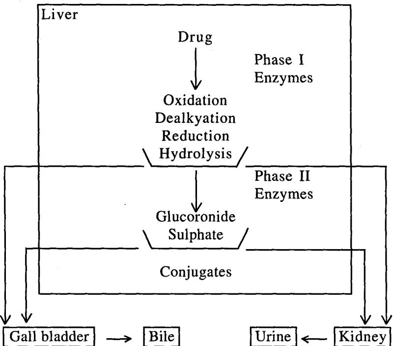

#### Drug Metabolising Enzymes

Enzymes are reaction specific, protein catalysts for chemical reactions in bioligical systems. These usually require a non-protein organic compound for their catalytic activity.

Groups bound with enzyme :

(i) Prosthetic groups-Cannot be readily removed.

(ii) Coenzymes-Dissociable entities.

#### Factors Affecting Drug Metabolism

- (i) Age
- (ii) Sex
- (iii) Species
- (iv) Race

(v) Genetic variation (vi) Nutrition and diet (vii) Disease (vii) Drug-Drug interactions

#### Elimination/Excretion of Drug

Drugs are eliminated from the body either unchanged or as water soluble metabolites. Both the processes of metabolism and excretion are essential for the elimination of drugs from the body.

#### Maior Routes of Drug Excretion

(i) Renal

(ii) Biliary

(iii) Fecal

(iv) Alveolar

#### Minor Routes of Drug Excretion

(i) Milk

(ii) Skin

(iii) Hair

(iv) Sweat

(v) Saliva

#### Vipāka Swarūpa

सर्वद्रव्याणां विपाको जाठराग्निसम्बन्धात् द्रव्यस्य स्वरूपान्तरप्रादुर्भावः । तत्र किञ्चित स्वाद विपाकम । किञ्चिदम्लविपाकम । किञ्चित कर्ट्विपाकम् । इन्द टीका-अ. स. स. ७/२७

All Dravyas undergo Vipāka only after completion of role of Jatharagni. Vipāka is one which brings transformation of Dravyas. Some drugs under go Madhura Vipāka, some undergo Amla Vipāka and some will undergo Katu Vipāka. The Swarupa of Vipākas is explained acc to their types.

# Vipāka Sankhyā Nirdhāraņe Vibhinna Mata Vivecana Purassaram Siddhānta Sthāpanam (Theories Regarding Different Types of Vipāka)

There exists difference of opinion regarding the number

of Vipāka. The following theories are put forth by various scholars.

#### I. Sadvidha Vipāka Vāda

According to this view, there are six. Vipāka. Under this. there are two schools of thought, they are :

- (a) Yathārasa Vipāka Vāda (Niyata Vipāka Vāda)
- (b) Anivata Vipāka Vāda

#### (a) Niyata Vipāka Vāda

It is not clear as to which scholar supports this theory. We only get cross references to this view in Susruta Samhita and Rasa Vaisesika, both of whom disagree with this concept.

तत्राहरन्ये प्रति रसं पाक इति । सु. सू. ४०/१०

प्रतिरसं पाक इति रसं रसं रसं प्रति पाक उत्पद्यत इत्यर्थः ।

```
डल्हण भाष्य–सू. सू. ४०/१०
```
मधुरो मधुरस्याम्लोऽम्लस्यैवं सर्वेषामिति केचिदाहुः । दृष्टान्तं चोपदिशन्ति यथा तावत् क्षीरमुखगतं पच्चमानं मधुरमेव-यथात्तथा शालियवमुद्रादयः प्रकीर्णाः स्वभावमत्तरकालेऽपि न परित्यजन्ति तददिति । स्. सू. ४०/१२

The scholars of this view opine that the Vipāka of a Dravva is definite and according to its Rasa. In other words Madhuradi Rasa will definitely transform to its respective Madhuradi Vipāka.

#### Accordingly

| Rasa    | Undergoes | Vipāka  |
|---------|-----------|---------|
| Madhura | 1         | Madhura |
| Amla    | ↑         | Amla    |
| Lavana  | 1         | Lavana  |
| Katu    | →         | Katu    |
| Tikta   | >         | Tikta   |
| Kaṣāya  |           | Kaṣāya  |

Just like milk on boiling will not change its Madhura Rasa and Śāli, Yava, Mudga etc. do not transform from sowing,

#### Vipāka

growth and even after maturation but will continue to be Salyadi itself, similarly Rasa of a Dravya will not change after digestion but remains the same on Vipaka also.

प्रति रसं पाक इति केचित् । अथमाशयः-यथा स्थालीस्थं तावत् क्षीरं मधुरमेव स्यात् , यथा वा शालियव मुद्गादयः प्रकीर्णाः स्वभावं न परित्यजनित अर्थात शालि-यव-मुद्रादि बीजेभ्यः शालियवमद्राधकरा उत्पद्यन्ते, तद्वन्मधरादयो जवराग्निपक्वाः स्वं स्वं स्वं स्वयं मधरादिकं न त्यजनित । मधरो मधरमेव पच्यते. अम्लोऽम्लमेवमन्ये च: तेन वण्णानां रसानां घडविपाका भवन्ति ।

Yogendranath is also of the same opinion that the respective Rasa undergoes respective Vipāka and he supports this theory with examples. How new Śāli. Yava. Mudga plants sproutes from their seeds like wise Madhuradi Rasas will not leave their qualities and undergo respective Vipāka.

इह केचिदाचक्षते-प्रतिरसं पाक: अम्लोऽम्लस्य, मधरोमधरस्य, लवणो लवणस्य, कटुकः कटुकस्य, तिक्ततिक्तस्य, कषायः कषायस्येति षडेव विपाकाः । किमन्नप्रमाणमिति चेत्, उच्यते-यथा क्षीरमतिपथ्यमानमपि मधुरमेव स्यात्, यथा वा शालियवादयः उक्ताः प्ररुढाश्च फलिताश्च शाल्यादिस्वरूपा एव भवन्ति, यथा मधुरादयोऽपि निष्ठापाकेऽपि मधुरादि स्वरूपा एव भवित्तमर्हन्तीति । उक्तं च-उप्ताः षष्टिकमाषाधाः बाह्यपक्वाश्च घडसाः । यान्ति नान्यत्वमित्येवं पाकः प्रतिरसं भवेत । शिवदास सेन भाष्य

Sivadasa Sen also support this theory, that how Atipakwa Ksīra undergoes Madhura Vipāka and how Śāli, Yava etc. plants gives rise to their own kind of new plants likewise Madhuradi Rasas are also undergo their respective Vipāka. Hence the Vipākas are six in number.

#### Points to Reject this Theory

1. This theory is not well accepted by other scholars like Vāgbhata, Susruta and Nāgārjuna.

> यथारसं जगुः पाकान् घट् केचित्तदसाम्प्रतम् । यत्स्वाद्यविद्वीहिरम्लत्वं न चाम्लमपि दाडिमम् ।। याति तैलं च कदुतां कदुकापि न पिप्पली । यथारसत्वे पाकानां न स्यादेवं विपर्ययः ।।

योगेन्द्रनाथ सेन भाष्य

स्वादर्गरुरुग्ण्यनिलप्रदः । यस्मादश्रो यवः वसोष्णाप्यग्निसादिनी ।। दीपनं शीतमप्याज्यं कट्रपाकोऽपि पित्तध्नो मुद्गो माषास्तु पित्तलः । स्वादुपाकोऽपि चलक्रतिन्नग्धोष्णं गुरुफाणितम् । ।

अ. सं. सू. १७/२९

There are various instances where the Vipāka of a Dravya varies from its Rasa for eg.

| SI. No. | Dravya   | Rasa    | Vipāka  |
|---------|----------|---------|---------|
| 1       | Vrīhi    | Madhura | Amla    |
| 2       | Pippalī  | Katu    | Madhura |
| 3       | Amalaki  | Amla    | Madhura |
| 4       | Pațola   | Tikta   | Madhura |
| ﮐ       | Kulatha  | Kaṣāya  | Amla    |
| 6       | Harītakī | Kasāya  | Madhura |

Thus, the above table clearly depicts the variation in Rasa & Vipāka of a particular Dravya. This further reiterates that Vipaka of a Dravya will not be similar to its Rasa.

2. Bhadanta Nagarjuna says that the characteristics (Laksana) of Rasa & Vipāka are different.

3. Rasa is identified immediately on taste & is Pratyaksagamya while Vipāka is assessed after digestion and is Anumānagamya.

4. And if Rasa & Vipāka were same, there was no necessary for an independent description of Rasa & Vipāka.

Thus, this theory cannot be accepted.

#### B. Anivata Vipāka Vāda

It is not clear about the proposers of this theory. We only get cross references from author like Susruta. The commentators Sivadasa Sen and Yogendranāth Sen have given explanations regarding this type of Vipāka.

केचिद्वदन्ति-अबलवन्तो बलवतां वशमायान्तीति । सु. सू. ४०/१०

अन्ये बलवन्तो बलवतां वशामायान्तीति मतानामनियतत्वमः तस्मादसिब्धान्त एष अनागम एष इत्यर्थ: । भाष्य-सू. सु. ४०/१०

The scholars of this thought opine that the predominant Rasa at the time of digestion overpowers the other Rasas and the resultant Vipāka will be according to that predominent Rasa.

प्रायशो यहणात् क्वचिन्नैवं विधोऽपि । यथा शण्ठीपिप्पल्यादीनां कटनां मधरो विपाक: कषायस्य कलत्यस्याम्ल: कषाया हरीतकी अम्लमामलकं च मधरं पच्यते, मधुरो हश्चाम्लं, तथाविधं तैलं पन: कदकम । योगेन्द्रनाथ सेन भाष्य

| Sl. No. | Dravya   | Rasa   | Vipāka  |
|---------|----------|--------|---------|
|         | Śunțhī   | Katu   | Madhura |
| 2       | Pippalī  | Katu   | Madhura |
| 3       | Kulatha  | Kaṣāya | Amla    |
| ব       | Harītakī | Kaṣāya | Madhura |
| 5       | Amalaki  | Amla   | Madhura |

Yogendranath Sen support this theory with the examples.

Hence Madhura Rasa Dravya may undergo Amla Vipāka or Katu Rasa Dravya may undergo Madhura Vipāka due to their predominence during digestion.

As it is difficult to assess the predominence of Rasa at different stages, it is unable to assess definitely the Vipāka of a Dravya and is hence indefinite.

Just as the predominence of Rasa is indefinite, so also its Vipāka. Hence it is not possible to say that a Madhura Rasa Dravya will undergo Madhura Vipaka only. According to this school of thought also, Vipāka are six in number but is indefinite for a Dravya.

This theory is also not accepted by other scholars because of its unscientific approach.

### II. Pañcavidha Vipāka Vāda

नन्, ''पञ्चभुतात्मके देहे ह्याहारः पाञ्चभौतिक: । विपक्वः पञ्चधा सम्यग्गुणान् स्वानभिवर्धयेत् ।।'' सु. सू. ४६/५२६

इत्यनेन पञ्चाऽपि विपाकस्तेनैवोक्तः, तत्कथं न विरोध इति चेत्; नैवम्, उपाधि भेदेन विरोधाभावात । शिवदास सेन भाष्य

पञ्चभूतात्मके देहे आहार: पाञ्चभौतिक: । विपाक्व: पञ्चधा सम्यक् स्वान् गुणानभिवर्धयेत् । इत्यनेन पञ्चधा पाकोऽभिहितः । चक्रपाणि भाष्य

The Ahara consumed by the person is Pañcabhautika. hence Vipāka is of 5 types based on the predominence of Mahābhūta.

तत्र पुथिव्यत्येजोवाय्वाकाशानां द्वैविध्यं भवति गुण साधर्म्याद्वरुता लघुता च: पुथिव्यापश्च गर्व्य: श्रोषाणि लघनि । सु. सू. ४०/१०

Just like Dravyas are concised within Sowmya (Guru) and Agneya (Laghu) though they are Pañcabhautika, similarly the five Vipaka based on Pañcamahabhūta can be brought under Guru and Laghu Vipāka or else Pañcavidha Vipāka Vāda may be an extended form of Dwividha Vipāka Vāda.

| SI. No. | Mahābhūta Pradhānyata | Vipāka    |        |
|---------|-----------------------|-----------|--------|
| 1.      | Prithvī               | Parthiva  | Guru   |
| 2.      | Ap                    | Apya      | Vipāka |
| 3.      | Agni                  | Taijasiya |        |
| 4.      | Vāyu                  | Vāyavya   | Laghu  |
| પર      | Ākāša                 | Ākāśīya   | Vipāka |

Sivadasa Sen while establishing his theory on Vipāka Vada contradicts various other theories.

He says that some scholars say that there are 5 Vipāka according to the 5 Mahabhūtas. He disagrees with this concept saying that this theory can be explained within Dwividha Vipaka Vada itself. Here the five Vipākas are explained separately by attributing it to each Mahabhuta. But these five can be put with Guru & Laghu Vipāka.

#### III. Trividha Vipāka Vāda

कट तिक्त कषायाणां विपाक: प्रायश: कट्ट: । अम्लोऽम्लं पच्यते, स्वादुर्मधुरं लवणस्तथा ।।

```
च. सू. २६/५७-५८
```
संप्रति विपाकस्यपि रसरुपत्वाल्लक्षणमाह-परमित्यादि । प्रायोग्रहणात पिप्पलीकुलत्यादीनां रसाननुगुणपाकितां दर्शयति । कटुकादिशब्देन च तदायारं द्रव्यमुच्यते; यतो न रसाः पच्यन्ते, किंत् द्रव्यमेव । लवणस्तधेति मधरविपाकः चक्रपाणि भाष्य-च. सू. २६/५७-५८ प्राय इत्यर्थः ।

Caraka proposed Trividha Vipāka Vāda and says that probably Katu, Tikta & Kasāya Dravyas undergo Katu Vipāka, Amla Rasa Dravya undergo Amla Vipāka and Madhura to Madhura Vipāka.

Cakrapāni explains Trividha Vipāka with few examples like Pippali which has Katu Rasa but undergo Madhura Vipāka and says this may be the probable reason to Caraka's reference of 'Pravaha'. Even Kulatha is also an exception that has Kasaya Rasa but will undergo Amla Vipaka. But finally he says whatever the Vipaka may be, it will be of three types, viz. Madhura, Amla and Lavana.

त्रिधाः विपाको द्रव्यस्य स्वाद्वम्ल कटुकात्मकः । अ. हृ. सू. १/१७

विपाकस्त्रिविधिः, सर्वद्रव्याणां परिणामकलिभावी कार्यानुमेयो जाठराग्नि-सम्बन्धाद्रसस्य स्वरूपान्तरप्रादुर्भावः । स त्रियैव, रसषदृत्वेऽपि न घोढ़ा । तेन किञ्चित्रवादुपाकं, किश्चिदम्लविपाकं, किश्चित्कदुविपाकं द्रव्यम् । तत्र मधुर-लवणयोर्मधरो विपाक: । अम्लस्याम्लः । तिक्तकटकथायाणां कटकः । स च कार्यानमेयः । अरुणदत्त भाष्य-अ. हृ. सू. १/१७

> स्वादु: पढ़श्च मधुरम्लोऽम्लं पच्यते रस: । तिक्तोषणकषायाणां विपाकः प्रायशः कदुः ।।

> > अ. हृ. सू. ९/२१

Acārya Vāgbhata supports Trividha Vipāka Vāda saying that the six Rasas usually undergo three Vipāka they are Madhura, Amla and Katu.

| Rasa       |   | Vipāka  |
|------------|---|---------|
| Madhura  → |   | Madhura |
| Lavana     |   |         |
| Amla       | → | Amla    |

```
Katu
Tikta
       -> Katu
Kasāya )
```
स्वादु: स्वादुविपाको, लवणोऽपि स्वादृविपाक इत्यर्थ: । अम्लो रसो-दधिकाश्चिकादिः, अम्लं पच्यते-अम्ले विपाको भवति । तिक्तोषण कवायाणां प्रायशः कदुर्विपाको भवति । प्रायशोग्रहणं पूर्वत्रापि योजनीयम् । तेन व्रीहिस्थो मधुरो रसोऽम्लं पच्यत इत्युपन्नम् । तथा चोक्तम् (अ. ह. सू. ६/१०)-"स्वादुरम्लविपाकोऽन्यो व्रीहिः" इति । तथा हरीतक्या भूयस्त्वेन यः कषायो रस:, स मधुरमेव पच्चते । तथा कटुको रस: शण्ठयाद्रक पिण्यल्यादिस्थो मधुर पच्यते । तथा चोक्तम् (अ. ह. स. ६/१५३)-"कवाया मधुरा पाके'' इति । तथा (अ. ह. स. ६/६३)- 'नागरं दीपनं वृष्यं याहि हृद्यं निबन्धनुत् । रुच्यं लधुस्वादुपाकं (अ. हृ. सू. ६) इति, तद्वदाईकम्' इति । तथा श्लेष्मला स्वादुशीताऽऽद्रा इत्यारभ्य यावत् 'स्वादुपाका' (अ. ह. सू. ६) इति । अत्र केचिदाहः तिक्तकषाययोरव कट्विपाकतया पित्तकर्तत्वमापद्यत इति । तदेतदसत्, शीतवीर्यत्वेनतयो: पित्तहर्हत्वात् । वीर्यं हि रसविपाकौ विजयते ।

अरुणदत्त भाष्य-अ. हृ. सू. ९/२१

विपाकत्रैविध्यमाह-स्वादुरिति । स्वादु: पट्र्श्च मधुरो लवणारुच मधुरं पच्यते पक्वो मधुरत्वं यातीत्यर्थः । मधुरमिति क्रियाविशेषणम् । पच्यत इति कर्म-कर्तर्यात्मनेपदम् । एवमम्लो रसोऽम्लं पच्यते । तिक्तादीनां त्रयाणां कट्रको विपाक: । मधुरस्यापि व्रीहिर्विपाकेऽम्लत्वात् लवणस्यापि सौवर्चलस्य कदुविपाकत्वात्, कषायस्यापि कुलत्यस्याम्लविपाकत्वात् 'प्रायश' इत्युक्तम् ।

हेमाद्रि भाष्य–अ. हृ. सू. ९/२१

The word 'Prayaśaha' denotes that there are exceptions to this rule. As we see a few examples where Vipāka donot follow the above general rule.

| SI. No. | Dravya     | Rasa    | Vipāka  |
|---------|------------|---------|---------|
|         | Vrihī      | Madhura | Amla    |
| 2       | Sauvarcala | Lavana  | Katu    |
| ನ       | Dadima     | Amla    | Madhura |
| ব       | Patola     | Tikta   | Madhura |
| તે      | Pippali    | Kațu    | Madhura |
| 6       | Kulatha    | Kasāya  | Amla    |

Eventhough there are exceptions but the total number of Vipaka are three only.

विपाकस्तूच्यते-विपाकस्तु प्रायः स्वादुः स्वादु-लवणयोः, अम्लोऽप्लस्य, कट्रितरेषाम् । अ. सं. सू. १७/१६

स्वाद्वम्ल- कट्रकास्त्रयो विपाका: । तत्र मधुरद्रव्यस्य सर्वस्य मधुरविधाकित्वं, तद्वल्लवणस्यः अम्लो विपाकोऽम्लस्यैवः; श्रेषाणां कट्ः । विपाकस्तु जठराग्निसंयोगे परिणामवशाद द्रव्यस्य रसस्य स्वरूपान्तरप्रादुर्भावः ।

इन्द्र भाष्य अं. सं. सू. १७/१६

Astanga Sangrahakāra also supports the view of Caraka i.e. Trividha Vipāka Vāda. Usually Vipāka are three. Swādu, Amla & Katu.

| Swādu   →           |        | Swādu                                                |
|---------------------|--------|------------------------------------------------------|
| Lavaņa              |        |                                                      |
| Amla                | ->     |                                                      |
| Katu                |        |                                                      |
| Tikta               | > Katu |                                                      |
| Kaṣāya              |        |                                                      |
| पराश्ररस्तु   पढति— |        |                                                      |
|                     |        | पाकारन्नयो  रसानामम्लोऽम्लं  पच्यते,  कटुः  कटुकम् । |
|                     |        | चत्वारोऽन्ये                                         |
|                     |        | कट्-तिक्त-कषायाणां कटुको येषां विपाक इति पक्षः ।     |
|                     |        | तेषां                                                |
|                     |        | अ. सं. सू. १७/१७-१८                                  |

In Astanga Sangraha we come across a cross reference to Parasara's view on Vipāka.

Parāšara accepts Trividha Vipāka and says.

| Rasa                       |   | Vipāka  |  |
|----------------------------|---|---------|--|
| Madhura<br>Tikta<br>Kaṣāya | 1 | Madhura |  |
| Lavaņa                     |   |         |  |
| Katu                       | 1 | Katu    |  |

 Amla Amla 1 - 1 - 1 - 1 - 1 - 1 - 1 - 1 - 1 - 1 - 1 - 1 - 1 - 1 - 1 - 1 - 1 - 1 - 1 - 1 - 1 - 1 - 1 - 1 - 1 - 1 - 1 - 1 - 1 - 1 - 1 - 1 - 1 - 1 - 1 - 1 - 1 - 1 - 1 - 1 - 1 - 1 - 1 - 1

And combined Rasa produces combined Vipāka. Parāšara says that Tikta and Kasāya undergoes Madhura Vipāka. He argues that if Tikta. Kasāya Rasa undergoes Katu Vipāka, then it is not able to explain its Pittahara Karma. So considering that Tikta, Kaṣāya Rasa undergoes Madhura Vipāka explains its Pittaśāmaka Karma.

पराशरनामा मुनिर्विपाकामन्यथा पठितवान् । पाकस्त्रयो रसानामित्यायाद्वयं पराशरपठितमनुपठति । सर्वेषां रसानां त्रयो विपाकाः-मध्युरः, अम्लः कदुश्च । त्रत्राम्लरसोऽम्लविपाक:, कदुरस: कदुविपाक:, चत्वारोऽन्ये शेषा मधुर-लवण-तिक्त कषाया मधुरविपाकः । संकीर्णरसानां मिश्ररसानां संकीर्ण विपाकित्वम् । स त पराश्शरस्रिक्तकषाययोमधरविपाकित्वमिच्छति, अन्ये त्वाचार्यस्तावेव कदविपाका विच्छन्ति तन्मतं दर्षयितकामः पराशर आह-ये आचार्याः कद-तिक्त-कषायाणां कदृविपाकित्वतिच्छन्ति तेषां तिक्त कषाययोः पित्तहरत्वं न संभवति, मन्मते तु तयोरर्मधूरविपाकित्वात् पित्तहरत्वं संभवतीति पराशरः । तच्च न चतुरस्रमिति मन्यामहे । यतः पित्तहर्त्वं रसस्यैव स्वरूपम् । कदुस्तु विपाको यत्र स्वल्पोऽपि भवति न तत्र कट्टः स्वकार्यं करोति "यद्यद् द्रव्ये रसादीनां" (अ. सं. सू. १७) डति न्यायात् । तथा च-तिक्त रसस्य कदविपाकस्यायि निम्बस्य पित्तहरत्वमेव । यत्र च विपाकस्य कटोराधिक्यं तत्र यस्य पित्तकतृत्वमेव । यथा-तिक्त रसेऽपि द्रव्ये कटोर्विपाकस्याधिक्यात बहतीद्वयस्य पित्तकरत्वम्, एवं कषायऽपि कल्पनीयम् । एवं रसस्यैव स्वभावः पित्तहरत्वम् । यत्रश्च तिक्तरस्ये कषाय रसे च द्रव्ये नैसर्गिकेण बलेन रस-वीर्यास्थां विपाक: प्रायेणाभिभूयते, अत उच्यते-तिक्त कषायौ पित्तहरावित्यस्माभिः, अतः, पराश्ररमतमचतुरस्रमिव ।

इन्दु भाष्य-अ. सं. सू. १७/१७-१८

Indu comments that Tikta Rasa is mainly responsible for Pitta Samaka action. In Dravyas where the degree of Katu Vipāka is very weak, there Vipāka is suppressed by Rasa and exhibits its action. Hence, though Nimba which is Tikta Rasa undergoes Katu Vipāka is Pittašāmaka Here Tikta Rasa exhibits its Karma.

In Dravyas where Katu Vipāka is strong, Vipāka suppresses Rasa and exhibits its Karma. So we observe that Tikta Rasayukta Brhatī Dwaya is Pittakāraka where Kaṭu Vipāka is dominating.

Hence in Tikta, Kasaya Rasa Dravyas, usually the natural or inherent power of Rasa and Virya overpowers Vipāka. Hence we observe that Tikta, Kasāya Dravyas are Pittahara.

वस्तुतस्तु दोषाणां त्रैविध्याद्विपाकस्यापि तदनुगुणतया त्रैविध्यमेवोचितम् । योगेन्द्रनाथ सेन भाष्य

Yogendranāth Sen opines that as Dosas are of three types Vipāka is also of three types based on its action over Dosa.

| Sl. No. | Vipāka  | Action on<br>Vāta | Action on<br>Pitta | Action on<br>Kapha |
|---------|---------|-------------------|--------------------|--------------------|
|         | Madhura | Šāmaka            | Śāmaka             | Vardhaka           |
|         | Amla    | Śāmaka            | Vardhaka           | Vardhaka           |
|         | Katu    | Vardhaka          | Vardhaka           | Śāmaka             |

Table showing action of Vipāka on Dosa :

अन्ये तु वातादिभ्यो दोषेभ्य एव त्रीन पाकानिच्छन्ति-कफात् वातकफाच्च मधुरः, कफपित्तादम्लः, वातात् पित्तात् वातपित्ताच्च कदुक इति । तदुक्तं-कफात् वातकफात् स्वादुरम्लः वित्तकण्ठोद्धवः । दोषैस्नयोऽनिलात् पित्तात् वातपित्तात् कदर्मतः । शिवदास सेन

Acarva Śivadāsa Sen presents his view with little alteration. According to him particular Dosa is responsible for particular Vipāka, i.e.

| Doșa       | Vipāka  |  |
|------------|---------|--|
| Kapha      | Madhura |  |
| Kaphavāta  | Madhura |  |
| Kaphapitta | Amla    |  |
| Vāta       | Katu    |  |
| Pitta      | Katu    |  |
| Vātapitta  | Katu    |  |

This concept is not accepted because it is not the Dosa which decides the Vipāka. Rasa is one which transforms into Vipāka. Vipāka may show its action on Dosa but Dosa does not show its action on Vipāka.

#### IV. Dwividha Vipāka Vāda

आगमस्त्वाह-द्विविध एव पाको मधुर:, कदुकश्च: तयोर्मधुराख्यो गुरु:,

कद्रुकाख्यो लघुरिति । तत्र पृथिव्यसेजोवाय्वाकाशानां द्वैविध्यं भवति तद् गुण साधर्म्याद, गुरुता, लघुता च; पृथिव्यापश्च गुर्व्य;, शेषाणि लघुनि; तस्माद् द्विविध एव विपाक इति ।

भवन्ति चात्र-

द्रव्येषु पच्चमानेषु येष्वम्बू पश्चिवी गणाः । निर्वर्तन्तेऽधिकास्तत्र उच्यते ।। तेजोऽनिलाकाशागणाः पच्चमानेषु येषु निर्वर्तन्तेऽधिकास्तत्र प्रापाक: कदुक उच्यते ।।

स. स. ४०/१०-१२

Suśruta has proposed Dwividha Vipāka concept. Acc to him Vipāka is of two types-Madhura and Kaṭu. Madhura Vipāka can be considered as Guru Vipāka and Kaṭu Vipāka is considered as Laghu Vipāka.

Guru Vipāka has dominance of Prithvī and Ap Mahābhūta. where as Laghu Vipāka has predominance of remaining Mahābhūtas like Agni, Vāyu and Ākāśa.

Further Susruta describes that Madhura Vipāka exhibits certain qualities which have dominance of Prithvi and Ap Mahābhūta. On the other hand Katu Vipāka exhibits qualities of Agni, Vāyu and Ākāša Mahābhūtas.

This Dwividha Vipāka Vāda is considered as concised form of Pañcavidha Vipāka Vāda.

| SI. No. | Vipāka  | Pañcabhūta<br>Relation  | Rasa                  | Equated<br>with |
|---------|---------|-------------------------|-----------------------|-----------------|
| 1       | Madhura | Prithvi & Ap   Madhura, | Amla &<br>Lavaņa      | Guru            |
| 2       | Katu    | Agni, Vāyu<br>& Ākāša   | Katu, Tikta<br>Kasāya | Laghu           |

आगमादिति यदुक्तं तद् व्याकरोति-आगमस्त्वहेत्यादि । आगम इह धन्वन्तरिवचनं; तमनुवदति-द्विविध एव पाको मधुर: कद्रकश्च इति । मधुरकटुकपाक्योर्यथाक्रमं गुरुतां लघुतां च चिकित्सोपयुक्तां दर्शयति-तयोर्मधुराख्या इत्यादि । मधुरे गौरस्य कटौ च पाके लाघवस्योपपत्तिं दर्शयन् भूतगुणादिति हेतुं च व्याकरोति-तत्र प्रथिवीत्यादि । पञ्चानां भुतानां कथं द्वैविध्यमित्याह-तदगण-चक्रपाणि भाष्य–सु. सू. ४०६/१०-१२ साधम्यादिति ।

स्वमतमिदानीं दर्शयन्नाह-आगमे इत्यादि । आगमे शास्त्रे । अन्ये 'आगमस्त्विह' इति पठन्ति । तत्र तु शब्दोऽव्यर्थः, अथवा विशेषार्थस्तुशब्दः, तेन प्रत्यक्षादि-प्रमाणाविरुद्धोऽपि शिष्टागम इत्यर्थः: अथवा. आगमशब्दोऽयं सिद्धान्त वचन: तेन सिद्धान्तः पनरिहेत्यर्थः । प्रथिव्यप्तेज इत्यादि । पुथिव्यादीनां गणसाधर्माद गुणसमानतया द्वैविध्यं भवतीत्यर्थः । गुणमेवाह-गुरुता लघुता चेति । भवनित चात्रेत्यादि । निर्वर्तन्ते तेऽधिका इति जायन्ते उत्कटा इत्यर्थः ।

डल्हण भाष्य–सु. सू. ४०/१०-१२

Both Cakrapani and Dalhana have supported the view of Suśruta and given similar explanations.

मधरोऽपि पार्थिवाप्यः, गरुरपि गणः पार्थिवाप्य इति, तथा गणशब्दोऽपि परिणामे गुरुर्लधुरिति; गौणगरूगण जनितः परिणामे गरुरित्युक्तः. लघुगणजनितो लघुरिति । मधुरो गुरुभ्यां, कदुर्लघुभिः (सु. ५४), गुणकारणत्वं कथं भवतीत्याह-मधुर इत्यादि । मधुरो विपाको गुरुभ्यां प्रथिव्युदकाभ्यां भवति, कटुर्लघुभिरिति त्रिभिरग्न्यादिभिर्भवति । एवं भूतैराधिक्यान्निर्वर्त्यमान्ये याके तद्गुणसमावेशाच्चि-रादचिराच्चेति विशेषो भवतीति । आह च- "द्रव्यस्य पच्चमानस्य यस्यापां धातुरुत्तमः । निर्वर्तते पार्श्विवर्श्च तस्य पाको ध्रवं गुरुः । आपो निर्वर्त्यमाना हि मद् कुर्वन्ति पावकम् । पुथिवी धातुरप्येवं तस्मात् पाकस्तयोर्गुरुः । एतत्तु गुरुपाकानां द्रव्याणां पाकलक्षणम् । अत् ऊर्ध्व प्रवक्ष्यामि लघुपाकं यथा भवेत । हीनश्च पुथिवीधात्तविविक्तपञ्चाद् गुणाः स्मृताः । यस्मिन् द्रव्ये भवन्येवं तस्य पाको थ्रुवं लघुः इति । भाष्य-र. वै. अ. २/५४

Badanta Nāgarjuna also supported Dwividha Vipāka theory. Even he has given Guru term for Madhura Vipaka and Laghu for Katu Vipāka. Badanta Nāgarjuna gives another two terms i.e. Cira and Acira considering the fact that how much time it takes to undergo Pāka.

He gives reason for Guru and Laghu Vipāka, that Guru has predominance of Prithvi and Ap Mahābhūta, which subside Agni, hence undergo Pāka lately (Cirapāka), where as Laghu Vipāka which has dominance of Agni, Vāyu and Akāša Mahābhūta improves Agni and hence undergo Pāka quickly (Acira Pāka).

| SI. No. | Pāka    | Suśruta/<br>Dalhana | Badanta<br>Nāgārjuna | Mahābhūta<br>  Prādhānyata |
|---------|---------|---------------------|----------------------|----------------------------|
|         | Madhura | Guru                | Cirapāki             | Prithvi & Ap               |
| )       | Katu    | Laghu               | Acirapāka            | Agni, Vāyu &<br>Ākāśa      |

# Trividha Vipāka Verses Dwividha Vipāka (Similarity and Differences Between Trividha & Dwividha Vipāka)

केचित त्रिविधमिच्छन्ति-मधुरं, अम्लं, कट्रकं चेति । तत्तु न सम्यक, भतगणादागमाच्चाम्लो विपाको नास्तिः पित्तं हि विद्युमम्लतामपैत्याग्नेयत्वातः. यद्येवं लवणोऽप्यन्यः पाको भविष्यति. श्लेष्मा हि विद्युधो लवणतामपैतीति । सु. सू. ४०/१०

Susruta while explaining Dwividha Vipāka mentions that some scholars have mentioned three types of Vipāka namely Madhura, Amla and Katu and he condemn, that theory in establishing Dwividha Vipāka Vāda.

Acc to him Amla is the state which is seen only in Vidagdhāvastha of Pitta not during its Prakrutāvastha. In Prakrutāvasta of Pitta. Katu will be the taste hence this Amla Vipāka can not be accepted. In Vipāka. only Prakrutāvasta is to be considered not Vikrutāvastha of anv Dosa. If Vikrutāvasthā is considered then Lavana Vipāka should also be accepted which is the state seen in Vidagdhāvasthā of Kapha.

अम्लापाकस्याभ्युपगमानभ्युपगमयोर्बीजे तु चरकनये पित्तं प्रकृत्याम्लं कद् च; सुश्रुते तु कटुरसं, यत् पुनरम्लत्वं तदस्य विदग्धस्यैवैति सुश्रुतेन पित्तस्य प्राकृतस्याम्लत्वानङ्गीकारात् सुतरामम्लपाकोऽपि नाङ्गीक्रियते, निष्प्रयोजनत्वात् योगेन्द्रनाथ भाष्य इह पुनरम्लः पाक: सप्रयोजन एव ।

Yogendranāth Sen opines that the reason for the difference between Caraka and Susruta is Caraka has considered both Amla and Katu Rasas for Prakrutāvasthā of Pitta whereas

Susruta consider Katu Rasa for Prakruta Avastha of Pitta and not Amla. which is seen in vitiated condition of Pitta.

कालतो गुणतो रसतम्भानुपपत्तिः त्रित्वस्य । र. वै. सू. ४/५०

एवं परस्य हेतुद्रवणं कृत्वा विपाकद्वित्वसायकानां हेतुनां त्रित्वसाधकत्वेऽभाव दर्शयन्नाह-कालत इत्यादि । कालतवित्यं नोपपद्यते, विराधिरकालव्यतिरिक्त स्याभावात्; पूर्वं 'कतमे वद् काला' इत्यत्र कृतभाष्यम् । गुणतश्य त्रित्वं नोपपद्यते; गुरुधूतजनिता, लघुभूतजनिता, इति गुणद्वैविध्याति । रसत्रम्य त्रित्वस्यानुपयति; कटुक-तिक्त-कषायास्तू लघवो, गुरवः परे, इति द्विविधभेदावरोधादिति । रसत इत्यस्यादमधी न भवति, गुणत इत्यन्त्रवादरोधात । तस्मादन्यथा वर्ण्यन्ते यथाऽस्माकं मधुर कट्रकशब्दी रसवाचको मुख्याँ गणवत्था विपाकेऽध्यारोपितौ. तथाऽम्लशब्दस्य विपाकेऽर्थन्तरेध्यारोपपितं न शक्यते गौरवाभावादितिः हेत्वभावो "मधरो गौरवाल्लयुत्वात कटुक इत्यस्य वाक्यस्य भाष्ये प्रदर्श्यते । भाष्य

Badanta Nagarjuna also proposed the theory of Dwividha Vipāka. He gives following reasons to sav Vipāka are of two kinds.

#### 1. Kālataha

There are only two kinds of substance as per time taken for undergoing Vipaka. Cira and Acira. Cira is one which takes more time to undergo Vipāka hence it is also known as Guru Vipāka. Where as Acira is one which undergo Vipaka very quickly and it is known as Laghu Vipāka. Apart from these two there is no possibility of a third one, hence Vipaka are of two types, not three.

#### 2. Gunataha

If Guna is considered then also Vipaka is of two types viz. Gurubhūta Janita and Laghubhūta janita hence Vipāka is of two types.

#### 3. Rasataha

If Rasa is taken, transformation of Rasas will happen in two categories.

(i) Madhura-Amla & Lavana undergoes Guru Vipāka.

(ii) Katu-Tikta & Kasāya Rasas undergo Laghu Vipāka. Here Rasas are assessed through their Guna only.

If observed carefully both Acarya's views are acceptable. The base for ideologies of both Acaryas are different. 20 Dra.Vil.

Caraka has considered Prakruta Avastha of Tridosas giving importance to the state of Rasa. Where as Susruta explained on the basis of Panca Mahabhuta and their qualities. Here Dosas are having respective Mahābhūta Pradhānyata and they are identified or assessed through their qualities.

Both Acarya's have accepted Madhura and Katu Vipāka. The difference is there only in considering Amla Vipaka. Here Susruta has not described the Vipāka of Amla Rasa.

In mentioning predominent Mahabhūtas of six Rasas also there is difference between Susruta and Caraka. Caraka said Prithvi & Agni Mahābhūta Prādhānyata for Amla Rasa where as Susruta mentioned Ap and Agni.

Understanding of Vipāka is based on Avastha of Dosa, while explaining Vipāka Prakruta Avastha of Dosa in relation with Rasa is considered. Susruta has not accepted Amla Rasa as Prakruta Avastha Rasa of Pitta, he considers katu in place of Amla.

Inclusion of Amla Rasa under Guru Vipāka is also questionable, as it is the combination of Ap & Agni, respresents Guru and Laghu respectively. Finally it becomes inconclusive, but usually we come across Trividha Vipākas namely Madhura, Amla and Katu, while studying about Dravyas.

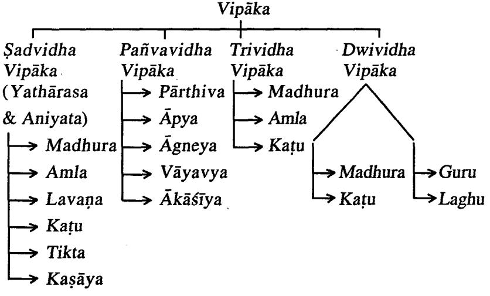

Schematic Representation of Different Types of Vipāka

#### Vipāka Guna Karma

The effect of Vipaka on the body is elaborately explained by Caraka. He clearly explains the effect of each Vipāka on Dosa, Dhātu & mala.

> मधुरो लवणाम्लौ च स्निग्धभावात्रयो रसः । वातमुत्रपुरीषाणां प्रायो मोक्षे सुखा मता: 11 कट्रतिक्तकषायास्तु रूक्षभावात्रयो र रसा: । दुःखाय मोक्षे दृश्यन्ते वातविण्मूत्र रेतसाम् ।। शक्रहा बन्द्धविण्मुत्रो विपाको वातल: कट्र: । मधर: सष्ट विण्मुत्रो विपाक: कफशक्रल: 11 पित्तकृत् सष्टविण्मुत्र: पाकोऽम्ल: शक्रनाशन: । तेषां गुरुः स्यान्मधूरः कदुकाम्लावतोऽन्यथा ।।

च. सू. २६/५९-६२

|   | Sl. No.   Vipāka | Guna             | Effect on<br>Doşa       | Effect on<br>Dhātu | Effect on<br>Mala  |
|---|------------------|------------------|-------------------------|--------------------|--------------------|
| 1 | Madhura  Snigdha | Guru             | Kapha-<br>vardhaka      | Śukrala            | Srsta<br>Vinmūtra  |
| 2 | Amla             | Snigdha<br>Laghu | Pittavar-<br>dhaka      | , Śukranā-<br>śana | Srsta<br>Vinmūtra  |
| 3 | Katu             | Rūkṣa            | Vāta<br>vardhaka   śana | Śukranā-           | Baddha<br>Vinmūtra |

In this context, Caraka says that Madhura Vipāka is Guru in nature while Katu, Amla are Laghu. This correlates with Susruta's Dwividha Vipāka Vāda.

Ācārya Susruta also quotes the properties of Guru & Laghu Vipāka.

गुरुपाको वातपित्तघ्नः लघुपाकः श्लेष्मघ्नः । ......गुरुपाकः सृष्टविण्मूत्रतया कफोत्क्लेशन च, लघुर्बद्धविण्मूत्रतया मारुत कोपेन च ।

| SI. No. | Vipāka | Effect on Doşa                 | Effect on Mala  |
|---------|--------|--------------------------------|-----------------|
|         | Guru   | Vātapittahara<br>Kaphotkleśana | Srasta Vinmūtra |
|         | Laghu  | Slesmahara<br>Vātakopana       | Badda Vinmūtra  |

Vagbhata considers that the effects of Vipāka are similar to its Rasa.

रसैरसौ तुल्यफलः ।

अ. स. सू. १७/१६

असौ विपाको रसैर्मधुराम्लकदुकैस्तुल्यफलः सदृशफलः । तेन मधुरस्य विपाकस्य ते गणा ये मधरस्य रसस्य । एवमम्मलकदकयोरपि ।

इन्दू भाष्य-अ. सं. सू. १७/१६

Hence properties and actions of Madhura Vipaka is similar to the properties and actions of Madhura Rasa. The same principle applies to Amla & Katu Vipāka also.

दर्धनक्षपणप्रशमानवकोपेषु तयोरनियमः । र. वै. अ. १—सू. ५३३

यथा लघुविपाकमुदम् । श्लेष्मणा वर्धयति, लघुविपाकं मधु श्लेष्माणां हरतीति । तस्मादमेव गुरुविपाको वर्धन एव लघुविपाक: शमन एव इति नियमो नास्ति । भाष्य-र. वै. १/५३

Nagarjuna opines that the properties & actions of Vipāka cannot be generalised as we observe that jala which undergoes Laghu Vipaka is Kapha Vardhaka and Madhu which also undergoes Laghu Vipāka is Kapha Sāmaka.

Hence the properties & actions of Vipāka donot follow a systematic rule.

| ------------------------------------------------------------------------------------------------------------------------------------------------------------------------------ |                                                      | A-00 II LEBERTAIN | " VOSa                                |
|--------------------------------------------------------------------------------------------------------------------------------------------------------------------------------|------------------------------------------------------|-------------------|---------------------------------------|
| CONSTITUTION CONSULTIONAL                                                                                                                                                      |                                                      |                   | <aphavardhaka< td=""></aphavardhaka<> |
| ------------------------------------------------------------------------------------------------------------------------------------------------------------------------------ | A STATISTIC OF CREAT AND FORM A FORM A FORM A FORM A |                   | anhasamaka<br>                        |

Vipāka Tāratamva .

|           | विपाकलक्षणस्याल्पन्ध्यभूयिष्ठतां | प्रति ।          |              |
|-----------|----------------------------------|------------------|--------------|
| द्रव्याणी | गणवैशेष्यात्तत्र                 | त्रोपलक्षयेत् ।। |              |
|           |                                  |                  | च. सू. २६/६३ |

विपाक लक्षणस्याल्यमध्यमध्यमध्यसूयिष्ठतामुपलक्ष्येत्, प्रति प्रति द्रव्याणां गुणवैश्लेष्या-द्वेतोरित्यर्थः । एतेन, द्रव्येषु यहूण वैशेष्यं मधुरत्व मधुरतरत्वमधूरतमत्वादि, ततो हेतोविपाकानामल्यत्वादयो विशेषा भवन्तीत्युक्त भवति ।

चक्रपाणि भाष्य-च. सू. २६/६३

तेन मधुर रसविपाको मधुर: श्रेष्ठो विण्मुत्रमोक्षे कफशक्रवद्धी च, लवणरसविपाको मधुरस्वल्य स्वर्ष्वविण्मुत्र कफशक्रश्चाल्यः अम्लश्च मध्यमस्यू-विण्मुत्र: शुक्रनाशनश्च मध्यम:, तिक्तकटुकवायाणां तिक्तरस विपाक: कट्ररल्यरूपेण शुक्रहा वृद्धविण्मूनो वातलश्च कदुरसविपाक: कटुर्मध्यमरूपेण, कवाय रसविपाक: कद्दकत्तमरूपेणेति । एवं द्रव्याणां स्नेहरौक्ष्यादि गुणवैशेष्यादल्यमध्यश्रेष्ठतामुपलक्ष्य ब्रुयात् । गङ्गाधर-च. सू. २६

The degree of variation of Vipaka depends on the variation of Rasa & Guna in the Dravya. Caraka expresses this as three degrees : Alpa, Madhya & Uttama.

| Vipaka  | Uttama  | Madhvama | A 1021 |
|---------|---------|----------|--------|
| Madhura | Madhura | Amla     | Lavana |
| atu     | Kasava  | Katu     | Tikta  |

This shows that a Madhura Rasa Dravya undergoing Madhura-Vipāka will exhibit maximum effect on the body when compared to Madhura Vipaka from Lavana Rasa will have least effect with respect to Srasta Vinmūtra, Kapha & Śukra Vrddhi.

रसै रसौ तुल्यफलः । द्रव्यगुणविशेषेण चास्याल्पमध्यभुयस्त्वमुपलक्षयेत् । अ. सं. सू. १७/१६

अस्य च विपाकस्य स्वल्यत्वं मध्यस्त्वं भयस्त्वं च द्रव्यगण विशेषणोपलक्ष्येत । किमुक्तं भवति ? उच्यते-यत्र रसेन सदृशो विपाको मधुराम्लकट्रकानां द्रव्याणां तत्र प्रधानरससमानगुणानामुक्कृष्ठत्वाद्विपाकस्योत्कृष्टत्वं कल्पनीयम् । एवं मध्यत्वा-न्मध्यत्वम् । स्वल्पत्वाच्च स्वल्यत्वम् । यत्र तु रसाद्धिपरीतो विपाको लवणतिक्त-कषायाणां तत्र रसविपरीतानां गुणानामुक्त्वादुत्कृष्टत्वं कल्पयेद्विपाक सद्दशाना-मित्यर्थः । एवं मध्यत्वमल्पत्वं च । इन्दू भाष्य-अ. सं. सू. १७/१६

Astānga Sangrāhakara mentions about Taratama of Vipāka as Alpa, Madhya and Bhūyastwa.

Indu in his commentary elaborately explains that if Madhura, Amla & Kaṭu are the Pradhāna Rasa of that Dravya and if undergoes respective Vipaka then it is superior, where

as these Rasas if they possess Madhyama Bala will be of Madhyama Vipāka and if Alpa Bala then will be of Swalpa type.

Then in case of Dravyas having Lavana, Tikta and Kasaya Rasas, if the Dravyas possess good qualities then it will be Utkrsta Vipāka, if moderate qualities then Madhya Vipāka and if lesser qualities then it is considered as Swalpa Vipaka.

| Madhura Rasa<br>Amla rasa<br>Katu Rasa   | Respective -> Utkrsta<br>Samāna Guna<br>Vipāka<br>with respect to<br>Rasa |
|------------------------------------------|---------------------------------------------------------------------------|
| Madhura Rasa<br>Amla rasa<br>Katu Rasa   | Madhyama Guna → Madhya Vipāka                                             |
| Madhura Rasa<br>Amla rasa<br>Katu Rasa   | Swalpa Guna -> Swalpa Vipāka                                              |
| Lavana Rasa<br>Tikta rasa<br>Kasāya Rasa | Utkrsta Guna -> Utkrsta Vipāka                                            |
| Lavaņa Rasa<br>Tikta rasa<br>Kasāya Rasa | Madhyama Guna -> Madhya Vipāka                                            |
| Lavana Rasa<br>Tikta rasa<br>Kasāya Rasa | Swalpa Guna -> Alpa Vipāka                                                |

#### Vipāka Upalabdhi Hetu (Assessment of Vipaka)

विपाक: कर्मनिष्ठया । च. सू. २६/६६

कर्मणो निष्ठा निष्पत्ति-कर्मनिष्ठा कर्मसमाप्तिः । रसोपयोगे सति योऽन्त्याहार परिणामकतः कर्मविशेषः कफ-शक्राभिवृद्धयादिलक्षणः. तेन विपाको निश्चीयते. एतेन विपाको नित्यपरोक्षः, तत्कार्येणानुमीयते । चक्रपाणि भाष्य-च. सू. २६/६६

Caraka opines that Vipāka is determined by its actions on the body.

Cakrapāni comments that Vipāka is always assessed through Anumana i.e. it is infered through its effect on the body.

तर्हि विपाकोऽपि वीर्यं निपाते द्रव्याणां नोपलभ्यते, कथमुपलभ्यत इत्याह-विपाक: कर्मनिष्ठयेति, द्रव्याणां भुक्तानां यावन्ति कर्माणा तावतां कर्मणां निष्ठया गंङ्गाधर भाष्य-च. सू. २६/६६ परिसमाप्तया विपाक उपलभ्यते ।

Gangadhara also expressed same opinion that once ingested substance undergoes digestion and exhibits particular action then only Vipaka may be known.

विपाक: कर्मण: आहारपरिणामकृतस्य, निष्ठा निष्पत्ति: दोष-शूक्रवृद्धि-क्षयलक्षणा, तया उपलभ्यते । योगेन्द्रनाथ सेन

Yogendranath Sen is also of the same view and says that Vipaka can be determined by its therapeutic actions observed after digestion. The effect of Dravya on Dosa. Dhātu in the form of Ksaya and Vrddhi infers its Vipāka.

अयं च विपाकाधेयो रसो न रसनेन्द्रिय ग्राह्मः, किन्तु तत्तत्कार्येणैवोन्नीयते-यथा कट्रसाया उष्णवीर्याया अपि शृण्ठया वृष्यत्वेन मधुरः पाकोऽनुमीयते, तथा लवणस्य सष्टविण्मन्त्रत्वेन मधरः पाक उन्नीयते. तथा तिक्तकषाययोर्बद्धविण्मुत्रतया कट्रपाक उन्नीयते । शिवदास सेन

Sivadasa Sena further explains this view with suitable examples. Though Vipāka follows Rasa it cannot be assessed by Rasanendriya, but by their actions.

Sunthi which has Katu Rasa. Usna Vīrya exhibits Vrsya action. This Vrsya Karma infers that Śuņṭhī undergoes Madhura Vipāka. Similarly the Srasta Vinmūtra action of Saindhava Lavana determines that it undergoes Madhura Vipāka.

विपाकं द्रव्याणां कर्मण: परिनिष्ठया । अ. सं. सू. १७

विपाक विशेषं त कर्मण: तत्कृतस्य परिनिष्ठया निष्यत्ते: दोषवृद्धि क्षय विशेषेण विद्यात् । इन्दू भाष्य-अ. सं. सू. १७

Vagbhata says that perception of Vipāka is through the Vrddhi-Ksaya of Dosa's in the body.

# Rasa Vipāka vorbheda (Differences Between Rasa & Vipāka)

न. भिन्नलक्षणत्वात ।

र. वै. सू. अ. ४/३२२

नायं पक्ष साधुः । कुतः ? भिन्नलक्षणत्वात्; 'आस्वाद प्राह्मो रसः', परिणाम लक्षणो विपाक: इति । विपाकस्य मधुरता कथमास्वाद्यते ? यद्यास्वाधेत्, रसलक्षणत्वाद् रस एवेति । विपाकाभावः; यदि नास्वाद्येत्, कथं भवता 'मधुरं पञ्यते' इत्युपलाब्यिमित्युक्तं भवति । भाष्य

Vipaka and Rasa are different entity of a Dravya. Which may be known through the following examples.

|   | SI. No.   Points | Rasa                                                                            | Vipāka                                                                         |
|---|------------------|---------------------------------------------------------------------------------|--------------------------------------------------------------------------------|
| 1 | Laksana          | रसनेन्द्रिय ग्राह्यो रस: । (आस्वाद)<br>Rasa is percieved<br>through Rasanendrya | परिणाम लक्षणो विपाक: ।<br>Final transformation<br>after digestion is<br>Vipāka |
| 2 |                  | Upalabdhi  Rasa Aswadana will<br>happen immediately                             | Vipāka Upalabdhi<br>takes place after<br>sometime                              |

Acarya P.V. Sharmaji putforths the following points to bring out the differentiation between Rasa & Vipāka.

| SI. No.   Bheda |                     | Rasa                                                                             | Vipāka                                                                      |
|-----------------|---------------------|----------------------------------------------------------------------------------|-----------------------------------------------------------------------------|
| 1               | Laksaņa             | रसनेन्द्रिय माह्यो रस: ।                                                         | परिणाम लक्षणो विपाक: ।                                                      |
|                 |                     | Rasa is percieved                                                                | Final transformation                                                        |
|                 |                     | through Rasanen-<br>driya                                                        | after digestion is<br>Vipāka                                                |
| 2               | Kala                | Quick action                                                                     | Delayed action                                                              |
| 3               | Karına              | Has both local and<br>systemic effects                                           | Has only systemic<br>effects                                                |
| 4               | Karmādhi-<br>sțhăna | Has effect on mind<br>& body                                                     | Has only physical<br>effects                                                |
| 5               | Upalabdhi           | रसो निपाते द्रव्याणाम् ।<br>Rasa assessed by<br>Indriya and is<br>Pratyakşagamya | विपाक: कर्मनिष्ठया ।<br>Vipāka assessed by<br>actions & is Anumana<br>Gamya |

#### Vipāka

# Vipāka Viparvāsa Hetu

# (Factors Responsible for Variations in Vipāka)

द्रव्यप्रमाण- संस्कार-सात्म्यग्निबलाबल-देश-काल- संयोग-पाक विश्रोष-र्विपाकविपर्यासः । र. वै. सू. अ. ४/५५

Nagarjuna enlists the following as the reasons or factors responsible for variations in Vipāka of a Dravya.

#### 1. Dravya Pramana

द्रव्यप्रमाणाद् विपर्यासः गुरुविपाकं क्षीरमल्यं लघु पच्यते, लध्यतिप्रमाणाद्द गरु पच्यते. यथा शालिरतिभक्तः । भाष्य

Milk which undergoes Guru Vipaka will quickly digest when taken in lesser quantity.

Śālvodana which has Laghu Pāka takes as longer duration to digest when eaten in large quantity.

#### 2. Samskāra

संस्काराद-गुरुविपाकं द्रव्यं दीपनीय संस्काराल्लघुविपाकं भवति । भाष्य

Milk boiled with Dīpanīya Dravya gets digested quickly though it is Guru Pākī in nature.

#### 3. Sātmva

सात्म्यतः - क्षीरोचितानां क्षीरं लघु विपाकं भवति । भाष्य

Milk when habituated will digest quickly.

#### 4. Agnibalabalāt

अग्निबलात्-तीक्ष्णाग्नीनां गुरुविपाकं लघुविपाकं भवति । भाष्य .

Persons with Tiksnagni will digest Guru Pākī Dravyas quickly.

#### 5. Deśa Viśesāt

देश विशेषात्-जाद्गुलेषु गुरुविपाकारच लघवो भवन्ति प्रायशः, अनुपेषु लघुवियाकारख गुरुवियाका भवनित । भाष्य

Guru Vipākī Dravyas digest quickly in Jāngala Deśa and in Ānūpa Desa, even Laghu Pāka Dravyas take longer duration to get digested.

#### 6. Kālaviśesāt

कालविशेषात्-ग्रीष्मे लघवो भवन्ति गुरवः वर्षा-हेमन्तयोगुरेवो ऽपि लघवः । भाष्य

In Varsā Rtu. Laghu Pākīva Dravvas takes longer time to digest and in Hemant Rtu Guru Pākīya Dravyās digest quickly.

#### 7. Samyoga Višesāt

क्षीरं शुण्ठीसंयोगाल्लघुविपाकं भवति ।

Milk mixed with Śunthī gets easily and quickly digested, inspite of its Guru Paka.

#### 8. Pāka Višesāt

पाक विशेषात्-दग्धं विद्युं वा द्रव्यमुपयुक्तं गुरु विपच्यते, लध्वापि, क्षीरं गुरु अपि शृतं ल्यु भवतीति । भाष्य

Charred or half baked Dravya will take a longer duration to digest even if its laghu Pākī. Ksīra which is Gurupākī if boiled properly, easily gets digested.

#### Vipāka Prādhānyata (Importance of Vipāka)

नेत्याहरन्ये विपाक: प्रधानमिति । कस्मात् ? सम्यङ्ग्मिथ्या विपाकत्त्वात; इह सर्वद्रण्याण्यभ्यवहृतानि सम्यङ्गमिथ्याविपक्वानि गुणदोषं वा जनवन्ति ।

सु. सू. ४०/१०

भाष्य

विपाक: प्रधानमिति प्रतिज्ञा । विपाक शब्देनेह लक्षणया अभ्यवहृत द्रव्यपाकाधेय आहारस्य रसविशेषो गौरवेण लाघवेन वा यक्तोऽभिधीयतेः विशिष्टो नैष्ठिक पाको विपाक इत्यर्थ: । अत्र हेतु:- सम्युड मिथ्याविपाकत्वादिति । अस्यार्थ व्याकरोति-सर्वद्रवयाणीत्यादि । सम्यग्विपक्वाति गुणं, मिथ्या विपक्वानि दोषं, जनयन्ति । सम्यक्याक: समेनाग्निना, मिथ्यापाकस्तु हीनातिपाकरुपो यथाक्रमं मन्देन तीक्ष्णेन वाऽग्निना क्रियते । तत्र हीनपाके आमविकाराः तीक्ष्णपाके च भस्मविकारा दोष:, समपाके तु धातुसाम्यं गुणश्च । अयं च पाको यद्यपि जठराग्न्यधीन: सर्वाहार साधारणे न तु द्रुणधीनो द्रव्यगुणरूपो य इहाधिकृत: "पिप्पल्यो मधुरविपाकाः" "आर्ध्य मधु विपाकम्" इत्यादिना प्रतिपादनीयः । चक्रपाणि भाष्य-सु. सू. ४०/१०

Acarya Susruta while discussing the Pradhanata of Padarthas, says that Vipāka is Pradhāna because the pharmacological actions of Dravya depends on Vipāka. If a Dravya

#### Vipāka

undergoes Samyak Pāka, it imparts Guna (Good effects) to the body and if a Dravya undergoes Mithya Paka, it imparts Dosa (bad effects).

Cakrapanidatta has supported this view with elaborate explanation with examples. He says if there is Samapaka then there will be Dhatu Samyata, if there is Visama Paka then there will be Amavikara or Bhasmaka Roga.

अत्र द्रव्यगणानरूपो निष्ठापाक: सम्यग्विपाक उच्यते, तद्विपरीतस्त मिथ्या-विपाक: । तयोराद्य: कटुकश्चित्रक: पाकेऽपि कट्रुक इत्यादौ, द्वितीयस्तु कद्दुका पिप्पली पाके मधुरा इत्येवमादौ बुभूत्सितण्यः । गुणं दोषं वा इति वा शब्दङ्ग्यार्थे, सम्यग्विपक्वानि मिथ्याविषक्वानि वा गणं दोषं च जनयन्ति; मिथ्याविषक्वा पिप्पली या शुक्रवर्धनादिरूपं गुणं प्राक्स्वेदजननादिरूपं दोषं च जनयति । यद्वा अग्निसाम्यान्न हीनं नापि चायिकं निष्ठापाक: सम्यक विपाक: तदन्यस्त अग्निवैषम्या-न्मिथ्याविपाक: । तत्र सम्यग्वियाके यथोक्ता गुणा: मिथ्याविपाके चामादि दोषा: संभवन्तीत्यायुर्वेदविदो भाषन्ते । हरणचन्द्र

Haranacandra opines that any Dravya which undergoes Samyak Pāka like that of Citraka which has Katu Rasa, undergoes Katu Vipāka may produce Agni Dīpana as its Guņa and Baddha Vid Mutrata. Where as Pippali if undergoes Mithyavipāka may produce Śukra Vardhana as its Guna and Swedajanana Karma as its Dosa (Bad effects). So finally concludes that the Karma depends on Samyak and Mithya Vipaka.

Nagarjuna putsforth the following points in support of Vipāka Pradhānyata.

विपाकस्य प्राधान्यं प्रत्येके ब्रृवते । र. वै. सू. अ. १/१४१ विपाकसादगण्ये तीक्ष्णाग्नीनां न दोषकराधिपाकाः । भाष्य

Vipāka is very important factor which decides the Karma.

1. Doṣa Praśamana Vardhana Kāraṇad

तन्निमित्तत्वात् प्रशमन वर्धनयो: । र. वै. सू. अ. १/१४२

दोषाणां प्रशमन वर्धने तन्निमित्ते; सम्यक् पक्वेनाहारेणौषधेन वा दोषा: प्रशमं यान्ति, असम्यक्यक्वेन वृद्धिं गच्छन्तीति । तस्मात् तयोरायुर्वेदसारभूतयो: साधनात् विपाकः प्रधानम् । यद् वृद्धि-प्रशमन-हेतुः तत् प्रधानं दृष्टम् । भाष्य

Vipāka is responsible for Dosa Prašamana and Dosa Vardhana, if Dravya undergoes Samyak Paka then there will be Dosa Prasamana and on the other hand if there is Asamyak Pāka it aggravates the Dosa, So Vipāka is important.

#### 2. Dhātupadehāt

धात्रुपदेहात् ।

धातुनामुपचय उपदेह: । पूर्वोक्तिनैव किमेतन्न सिद्धम् ? तत्र व्याध्युत्यति-प्रशमनमभिप्रेतम्, अत्र प्रतिदिवसं स्वस्थस्य धातुवृद्धि इति । भाष्य

Dhātu Nirmāna in the body is brought about by Vipāka itself and relieves the diseases, hence it is Pradhana.

#### 3. Vipākāpeksitatwat

विपाकापेक्षत्वादितरेषां, प्रायशो विपाकसादुगुण्ये च गुणवतामप्यदोषात् । र. वै. स. अ. १/१४४

#### विपाकात तीक्ष्णाग्निनां न दोषकरमिति ।

All the Dravyas whether Ahara or Ausadha imparts their therapeutic effect only after digestion, i.e. they are under the influence of Vipāka. Properly digested Ähāra or Ausadha gives strength and health.

#### 4. Vipāka Vaigunya Cause Dosa

विपाक वैगुण्ये गुणवतामपि दोषात् । र. वै. सू. अ. १/१४५ पथ्याहारस्याप्यसत्याके सति व्याधिरत्वादिति । भाष्य

If Vipāka is not proper eventhough the Dravya possess good qualities then it will aggravate Dosa and induces ill effects to the body.

#### 5. Śāstra Prāmāņyāt

शास्त्रप्रामाण्यात् ।

किं च, शास्त्रेऽपि "जीर्णेऽश्नतः कुमारस्य त्रितयं त्रिषु वर्त्मसु । यथावद वर्तते नित्यं हिताहितनिषेवणात् ।'' इति । विपाकसाद्गुण्ये इत्यादीनां त्रयाणां वाक्यानायप्ययमागमोऽर्थसाधनः । भाष्य

In ancient texts Vipāka is been given utmost importance considering its Hita and Ahita effects on the body.

भाष्य

र. वै. सू. अ. १/१४३

र. वै. सु. अ. १/१४६

#### 6. Cikitsābhāvāt

किञ्च तदभावे चिकित्साभावात् । र. वै. सू. १/१४७

तस्य विपाकस्याभावे मूलत एव चिकित्सा न स्यात् अग्निना हापक्वानामौषधानां कार्यकरणं नास्तीति । भाष्य

If there is no Vipaka then there won't be any treatment possible, as the Dravyas show their action after undergoing digestion.

#### 7. Arogvapravojanatwat

किंचान्यत ? आरोग्यप्रयोजनत्वादायवेदस्य सम्यग्विपाके तदपलब्धिः । र. वै. सू. १/१४८

समस्तस्य तंत्रस्य प्रयोजन भूतस्था, रोगस्य साधनापाक: प्रधानम् । कथं सम्यग्विनपाके सति तच्चारोग्यं भवतीति । भाष्य

Vipāka helps in maintaining healthy condition of the body, as Samyak Vipāka gives good health.

# 8. Vipāka Dusti Sarva Śarira Pradosāt

किंच, सर्वशरीर प्रदोषात् तस्मिन् दुष्टे । र. वै. सू. १/१४९

विसूच्यलसकादिषु सर्वशरीरप्रदोषो दृष्टः । तत्र शरीरग्रहणेन शरीरावयवाः दोषाः परिगृहीताः । सर्वदोषप्रकोपादित्यर्थः । भाष्य

As said earlier, improper Pāka leads to aggravation of all the Dosas hence Vipaka should be proper for the normalcy of Dosas and inturn the Sarira.

9. Śarīranugrahat

र. वै. सू. १/१५०

भाष्य

#### इत्येतदव्यनेनैव गतार्थम् ।

किं च सर्व शरीरानुश्रहात् ।

Vipāka nourishes the Śarīra hence it is important.

# Chapter-7 Vīrya Parijñāna

#### Points Dealt

- Vīrva Nirukti
- Vīrya Laxanam
- · Vīrya Swarūpa
- · Vīrya Sankhya Nirdhārane Vibhinna Mata Samīksā Purassaram Siddhānta Sthāpanam
- · Vīryesu Bhutotkarsa Vicāra
- · Vīrva Karmani
- · Vīrya Upalabdhi Hētavaha
- · Vīrya Nirdhārane Sāmānya Siddhānta Nirūpana Purassaram Sāpavāda Nirdesa
- · Vīrya Prādhānya Nirūpanam

Vīrva Nirukti

वीरे साधु । तत्र साधुः इति यत् । यद्वा वीर्यतेऽनेनेति वीर विक्रान्तौ-''अचो यत्'' इति यत् । यद्वा वीरस्य भावः । यत् । वाचस्पत्यम्

Virya the root of Vīrya has meanings like valour, strength, power, energy etc.

#### Vīrya Laxana

येन कुर्वन्ति तद्वीर्यम् । च. सू. अ. २६/१३; सु. सू. ४१/५

येनेति प्रभावेण, रसेन, वीर्येण, विपाकेन वा; अयं वीर्य शब्द: पारिभाषिक वीर्यवचनो न भवति, किन्तु शक्तिमात्र वचन:; तेन प्रभाव रसादय: सर्व एव स्वकार्य कुर्वन्ति: शक्तिपर्याय रूपवीर्यवाच्या इति ज्ञेया: ।

चक्रपाणि भाष्य-च. सू. २६/१३

The factor responsible for any action is Virya.

Cakrapāni adds, Vīrva is a Śakti (force/energy) of a Dravya, through which the Dravya perform any action. Eventhough Prabhava, Rasa etc. which are residing in the Dravya bring out their own action, but it is the Virya which decides the Karma in many instances.

......वीर्यं तु क्रियते येन या क्रिया । नावीर्यं कुरुते किञ्चित् सर्वा वीर्यकृता क्रिया ।।

च. सु. २६/६५

वीर्यं त्वित्यादि । वीर्यमिति शक्तिः । येनेति रसेन वा, विपाकेन वा, प्रभावेण वा, गुर्वादि परादिभि गुणैर्वा, या क्रिया तर्पण-प्रहाद-शमनादि रूपा क्रियते, तस्यां क्रियायां तद्रसादिवीर्यम् । ......नावीर्यमित्यादि, अवीर्यम्, अशक्त-मित्यर्थः । वीर्यकृतेति वीर्यवता वृता वीर्यकृता । चक्रपाणि भाष्य-च. स्. २६/६५

Virya (Potency) in general has wider meaning that there cannot be any action without the involvement of Virya. Thus all the actions are done by Virya only.

Cakrapāni comments on this concept and opines that if the Rasa is bringing out any action of its own, then in that context Rasa becomes the Virya of that Dravya. So Vipāka, Guna and Prabhāva also becomes the Vīrva (Potency) of the Dravya at different circumstances.

वीर्यं शक्तिः सा च पृथिव्यादीनां भूतानां यः सारभागस्तदतिशयरूपा बोध्या । सा च द्विविधा चिन्त्याचिन्त्य क्रिया हेतुत्वेन, तत्र चिन्त्यक्रियाहेतुर्या द्रव्यरसादीनां स्वस्वकर्मणि स्वभाव सिद्धाः शक्तिः. अचिन्त्यक्रियाहेतुश्च प्रभावपर्याय द्रव्याणां रसाधननुरूपकार्यकरणशक्तिः । उक्तं च भृतप्रसादातिशयो द्रव्ये पाके रसे स्थितः । चिन्त्याचिन्त्याक्रेषा हेतुवीर्यं धन्वन्तरे मतम् । शिवदास सेन-द्र. गृ. स. १/८

Śivadāsa Sen is also of the same opinion that Vīrva is a potency of a Dravya which enables the Dravya to show its action. More over Virya is Sarabhaga (Essence) of Prthvi Adi Bhutas. If it is possible to explain the factor responsible for action then it is called Chintya Śakti and if impossible to explain then it is called as Acintya Śakti.

> वीर्यं द्रव्यस्य तज्ञेयं यद्योगात् क्रियते क्रिया । नावीर्यं कुरुते किंचित सर्वा वीर्यकृता हि सा ।। अ. सं. सू. १७/१२२

वीर्यं तत् तत् क्रियते येन येन या क्रिया। नावीर्यं करुते किंचित सर्वा वीर्यकता हि सा ।।

अ. हृ. सू. ९/१३-१४

Both Vagbhatas have similar opinion like that of Caraka and says all the actions done by the Virya.

Note : Y. T. Acarva has considered Vīrya as active principles of a Dravya.

#### Dravyaguna Vijñāna

Usually the Gunas which are potent are considered as Vīrya.

Reasons in support of considering Gunas as the Virya.

# गुर्वाद्या वीर्यमुच्यन्ते शक्तिमन्तोऽन्यथा गुणाः । परसामर्थ्यहीनत्वाद् गुणा रावेतरे गुणा: ।।

अ. सं. सू. १७

... गर्वाद्या अष्टी यदोल्कृष्टशक्तयः सन्तो द्रव्यं समयिश्रोरते तदा वीर्यशब्दवाच्याः. यदातुर्कृष्ट्रशक्तियुक्ता न भवन्ति तदा सामान्यगुणा एव । ये च गर्वादिशिष्टा द्वादश गुणा: ते स्वभावेनैव परसामर्थ्यहीना उत्कृष्टशक्तिरहितास्तेऽपि सामान्य गुणशब्द-वाच्याः. ते न कदाचिदपि वीर्याख्यां लभन्ते । इन्द्र भाष्य-अ. सं. सु. १७

The eight qualities like Guru, Laghu, Snigdha, Rūksa, Tiksna, Manda, Sita and Usna are possessing intense potency among Gurvadi 20 Gunas, they are considered as Vīrya where as remaining 12 qualities won't have strong potency hence they are only qualities.

|              | गुर्वादिष्येव वीर्याख्या व तेनान्वर्थेति व वर्ण्यते ।   |                                          |                    |
|--------------|---------------------------------------------------------|------------------------------------------|--------------------|
| समयगुणसारेषु |                                                         | शत्तन्युत्कर्षविवर्तिषु ।।               |                    |
|              | व्यवहाराय       मुख्यत्वात्         बड्वयत्रत्रहणादपि । |                                          |                    |
|              |                                                         | अत्रश्च विपरीतत्वात् संभवत्यपि नैव सा ।। |                    |
|              |                                                         |                                          | अ. हृ. सू. ९/१४-१६ |

Astanga Hrdayakāra gives four reasons to state why only eight among 20 Gurvadi Gunas to be considered as Virya.

#### 1. Samagraguna Sārata

समग्राश्च ते गुणाश्च तेषु सारा: चिरकालावस्थितयो गुर्वादय एव, तथा च जठराग्निसंयोगेनापि न मधुरादिरसवत् स्वभावमेते जहति । सर्ते: 'सुह स्थिरे' हेमाद्रि भाष्य-अ. ह. ह. सू. ९/१४-१६ इति धन्द्रि सारशब्द: ।

These eight Gunas are stable when they come in contact with Jatharagni where as Madhuradi Rasas will loose their originality.

# 2. Śaktyutkarsāt

तथा अन्येभ्यो मन्दसान्द्रादिभ्यो गुणेभ्यो रसादिभ्यो वा गुर्वादयः शक्त्युत्कर्ष-

Vīrya

विवर्तिनः शक्तेः सामर्थ्यस्य उत्कर्षः आधिक्यं. विशेषेण वर्तो विवर्तः विशेषेण भवनं, शत्त्युत्कर्षस्य विवर्तः, स विद्यते येषां त एवम् ।

हेमाद्रि भाष्य-अ. हृ. सू. ९/१४-१६

These eight qualities possess more strength than other Gunas.

#### 3. Vyavahārāva Mukhvatwāt

किंच गर्वादीनां गुणानां व्यवहाराय व्यवहारार्थं मुख्यत्वात; अन्येभ्यो गणेभ्यो गुर्वदियः प्रधानभृता इत्यर्थः । तथा च गर्वादयो गुणा द्रव्ये पुथिव्यादौ रसाश्रयेः । इत्युक्तं, न मधुरादयो गुणा इति । तस्माद् गर्वादीनां गुणानां व्यवहारमुख्यत्वं हेमाद्रि भाष्य-अ. हृ. सू. ९/१४-१६ रसादिभ्यः ।

These eight qualities are commonly mentioned in classical texts and frequently these qualities are used in day to day practice.

#### 4. Bahwagragrahanāt

बह्ये द्रव्य रसादयो गुर्वादिभिगुहीता भवनित । तथा चायवेद शास्त्रेषु रसादिश्यो गुर्वादीनामग्रे ग्रहणं दृष्टम् । यथा वातादिदोष गुणनिरूपणानां गुर्वादीनां पूर्वं ग्रहणं, न रसादीनाम् । .......बह्रगुण गणनायां प्रथमग्रहणात् ।

हेमाद्रि भाष्य-अ. हृ. सू. ९/१४-१६

These Gunas are mentioned earlier to Rasa and these eight qualities are frequently seen in Dravya.

#### Vīrva Swarūpa

Vīrya is as Śakti (Potency) of a Dravya and is responsible for the actions done by the Dravya.

Vīrya is given prime importance in classical texts as this decides the Karma. If the Dravya becomes Nirvīrya (Loose potency) then the Dravya is useless.

Various preparations are given shelf life based on its potency. Moreover the part collected from the plant for medicinal use is based on the Virya it possess.

Like wise in various contexts Virya has got its own importance.

21 Dra.Vij.

Vīrva Swarūpa are explained in different Vīrva Vādās like Dravya Vīrva Vāda. Guna Vīrva Vāda and Karma Vīrva Vāda.

Virva is considered as 'Active Principles' of a Drayva.

There are nine important pharmacologically active principles in plants.

Those are : (i) Alkaloids

(ii) Glycosides

(iii) Oils

- (iv) Resins
(v) Oleoresin

- (vi) Gums
(vii) Tannins

- (viii) Antibacterial substances
- (ix) Miscellaneous

#### (i) Alkaloids

Alkaloids are basic substances containing cyclic nitrogen. which are insoluble in water but combine with acids to form well defined water soluble salts.

Eg. Morphine

The names of all alkaloids end in 'ne'.

#### (ii) Glycosides

Glycosides are those substances where a sugar is joined to a non-sugar with a either linkage (-o-). However if the sugar is glucose, the glycoside is called glucoside and if it is an aminosugar then it is called as aminoglycoside.

Sugar -o- Non sugar - Glycoside

Glucose -- o- Non sugar - Glucoside

Aminosugar -o- Non sugar - Aminoglycoside

On hydrolysis with mineral acids, all glycosides split up into sugar & non-sugar residues.

The pharmacological activity of a glycoside resides in its non-sugar molecule, called aglycon. The sugar portion, however governs the pharmacokinetic characteristics of the glycoside.

Eg. Cardiac glycoside-Digoxin.

Aminoglycosides are rather obtained from micro organisms and used as antimicrobial agents.

(iii) Oils

Oils may be fixed, volatile (from plants) and mineral.

Fixed oils : These are glycerides of oleic, plamitic and stearic acids. They are non-volatile, have food value and become rancid on prolonged storage. These are obtained by solvent extraction of crushed seeds.

Eg. Castor oil.

Essential (Volatile) oil : These are hydrocarbon terpene or some polymer of it. They are volatile, have no food value, possess aroma. Volatile oils are obtained from leaves or flowers by steam distillation.

Volatile oils are used as

Carminatives-Eg. Ginger

Antiseptics-Eg. Thymol for mouth wash

Counter irritants-Eg. Oil of wintergreen

Flavouring agents-Eg. Oil of pepperment

Pain relieving agents-Eg. Oil of clove in case of tooth ache. Mineral Oil :

These are mostly petroleum products and are obtained by dry distillation of woods. These have no food value, mainly used for preparation of ointments.

Eg. Paraffin

#### (iv) Resin

These are formed by oxidation or polymerization of volatile oils and are insoluble in water but soluble in alcohol.

Eg. Benzoin, shellac

#### (v) Oleoresin

They are mixtures of volatile oil & resins.

#### (vi) Gums

These are secretary products of plants. These are the colloidal exudates which either swell or dissolve to form adhesive mucilage in water. These are used as emulsifying or suspending agents.

Eg. Gum acasia

#### (vii) Tannins

These are non-nitrogenous plant constituents characterized by their astringent action upon mucous membranes they precipitate from the cells of mucous membrane and thus exert a protective action. Substances which release tannic acid in small intestine were used for treatment of diarrhoea.

Eg. Catechu

#### (viii) Antibacterial

These are derived from moulds, bacteria & fungi.

Eg. Pencillin

#### (ix) Miscellaneous

Phytochemicals such as flavinoids, terpenes and retinoids.

# Vīrya Sankhyā Nirdhārane Vibhinna Mata Samīksā Purassaram Siddhānta Sthāpanam

#### (Various Theories Regarding Number of Virya)

Various concepts have been proposed by different Ācārya to frame the number of Virya.

#### 1. Śakti Vīrya Vāda or Dravya Vīrya Vīrya Vāda

This theory is proposed by Acarya Caraka and supported by Cakrapānidatta and Śivadas Sen.

#### येन कर्वन्ति तद्वीर्यम् ।

च. सू. २६/१३

येनेति प्रभावेण, रसेन, वीर्येण, विपाकेन वा: अयं च वीर्यशब्द: पारिभाषिक वीर्यवचनो न भवति, किन्तु शक्तिमात्र वचन:, यदुक्तं चरकेऽपि-'नावीर्यं कुरुते किञ्चित सर्वा वीर्यकृता क्रिया' । इति: तेन प्रभाव रसादय: सर्व एव स्वकार्य कुर्वन्तः शक्ति पर्यायरूपवीर्यवाच्या इति ज्ञेयाः । चक्रपाणि भाष्य-च. सू. २६/१३

Acarya Caraka opines that all the karmas done by the Dravya is attributed to its Vīrya or Sakti. He has not fixed any numbers.

Cakrapani elaborates that whatever may be the factor. either Rasa or Prabhāva or Vīrya or Vipāka, which brings out the Karma is a Vīrva (Śakti) which may be Cintya Śakti or Acintya Śakti. So, totally the factor resides in Dravya and brings out the Karma known as Virya of that Dravya or all the factors may support one action done by the Drayva leading to a combined effect and not possible to attribute to any one factor.

This Vīrya Vāda is also known as Bahu Vīrya Vāda.

#### 2. Guna Vīrya Vāda or Pāribhāsika Vīrya Vāda

Acarva Susruta and Vagbhata have strongly proposed this theory. Even Caraka has mentioned Guna Viryas.

This Vīrva Vāda mav be divided into two as (i) Astavidha Vīrya Vāda & (ii) Dwividha Vīrya Vāda.

#### (i) Asta Vidha Vīrva Vāda

Acarvas who put forward this concept have given the reason that the eight qualities among 20 Gurvādi Gunas possess more strength than others. Hence they are considered as Viryas.

#### Caraka's View

| मृदु- तीक्ष्ण- गुरु- लघु-स्निग्ध- रूक्षोष्ण- शीतलम् । |              |
|-------------------------------------------------------|--------------|
| A C<br>वायमण्टावध काचतुं,                             | च. सू. २६/६४ |

Eight Vīryas mentioned by Caraka are.

- 1. Mrdu
- 2. Tīksna
- 3. Guru
- 4. Laghu
- 5. Snigdha
- 6. Rūksa
- 7. Usna
- 8. Śīta

#### Suśruta's View

केचिद्यविधमाहू :- शीतं, उष्णं, स्निग्धं, रूक्षं, विशदं, पिचिछलं, मृद् तीक्ष्णं चेति । सु. सू. ४०/५

Eight Vīrya as per Suśruta are.

- 2. Usna
- 3. Snigdha
- 4. Rūksa
- 5. Visada
- 6. Picchila

7. Mrdu

- 8. Tīksna
Note : Susruta has mentioned Picchila and Visada in place of Guru and Laghu Virva. but while explaining about importance of Virya over Rasa, Guru & Laghu has been mentioned.

#### View of Vagbhata of Astanga Sangraha

वीर्यं तु केचित् गुरु-लघु-स्निग्ध-रूक्ष-तीक्ष्ण-मन्द श्रीतोष्ण भेदनाष्टविधमाहुः ।

अ. सं. स. १७/१२२

- 1 Guru
- 2. Laghu
- 3. Snigdha
- 4. Rūksa
- 5. Tīksna
- 6. Manda
- 7. Šīta
- 8. Usna

Note : Manda Virya is mentioned in place of Mrdu Vīrya.

View of Vagbhata of Astanga Hrdaya

वीर्यं स्निग्ध हिम-मुद् ग रु

लघु रूक्षोष्णां-तीक्ष्णं च तदेवं मतमण्ट्या ।।

अ. हृ. सू. ९/१२-१३

<sup>1.</sup> Śita

#### Vīrva

He also opines that there are eight Virya.

1. Guru

2. Snigdha

3. Hima (Śīta)

4. Mrdu

5. Laghu

6. Rūksa

7. Usna

8. Tīksņa

#### Dwividha Vīrya Vāda

All most all Ãcarya have supported this view of two kinds of Viryas.

#### View of Caraka

...... केचिद् द्विविधमास्थिता: ।

श्रीतोष्णमितिः .......... !

च. स. २६/६४-६५

Vīrya are of two kinds-Śīta and Usna.

#### Suśruta View

तच्च वीर्यं द्विविधम-उष्णं. शीतं च, अग्नीषोमीयत्वाज्जगतः ।

सु. सू. ४०/५

Susruta also supported this theory of two Vīrya viz. Usna and Śīta with reason. He opined that Agni and Soma are dominant in the universe, hence Vīrya is of two types.

#### Astānga Sangraha

अग्नी- षोमात्मकत्वादान-विसर्ग विभागेन कालस्य चोष्ण शीतात्मकत्वाद द्विविधमेवामनन्ति । एवं चाहः -

#### नानात्मकमपि द्रव्यमग्नी- षोमौ महाबलौ । व्यक्ताव्यक्तं जगदिव नातिक्रामति जातुचित् ।।

अ. सं. सू. १७/१४

Eventhough there are innumerable substances in the universe they are governed by two qualities namely Usna (Agni) & Sita (Soma). Hence Virya is of two types as there are two Kālas like Ādāna and Visarga Kāla.

View of Astānga Hrdayakāra

उष्णं शीतं श्रीतं द्विधैवान्ये वीर्यमाचक्षतेऽपि च । द्रव्यमग्नीषोमौ नानात्मकमपि महाबलौ । व्यक्ताव्यक्तं जगदिव नातिक्रामनि जातुचित् ।। अ. हृ. सू. ९/१७-१८ उष्ण-शीतगृणोत्कर्षोत्तत्र वीर्यं द्विधा स्मृतम् ।।

अ. हृ. सू. १/१७

He is also of the same opinion and mentions the same reason that as there is dominance of Usna and Śīta Gunas, Virya is also of two types.

#### Karma Vīrya Vāda

The concept of Karma Vīrya Vāda is first propounded by Ācārya Badanta Nāgārjuna. Ācārya Nimi has supported this theory.

कर्म लक्षणं वीर्यम । र. वै. सू. अ. १/१६९

मेधाजननादि मेधां दृष्टवा ज्ञायते, ऊर्ध्वभागिकमपि तथेति । भाष्य

The Virya will be known after the manifestation of Karma only.

Eg. 1. After assessing Medha the Medhya action of any drug may be confirmed.

2. After observing Vamana Karma, then only it may be concluded that there is Vamana and Virya responsible for the Vamana Karma may be assessed.

मधुर रसं स्निग्धं शीतं च यष्टिमधुकं, क्षीरं च तादुगेव स्रंसयतीति विशेष: । अस्य कर्मविशेषस्य दर्शनादेतस्याद् रसगुणाख्यात् कारणमन्यध्वद्यते । अस्य विशेषस्य साधकं तद वीर्यमिति जातीय इति । भाष्य

Actually this particular Śloka explains more about Prabhāva than Virya. As per this Śloka, Vīrya is one which is responsible for specialised action by the Dravya.

Eg. Both Yastimadhu and Ksīra having similar Guna, Rasa, Vipāka etc. but Yastimadhu acts as Sandhānakara where as Ksīra is Virecaka.

वीर्याणि पुनश्छर्दनीयानुलोमनीयोभयतो भाग-प्रशमनीय-संग्रहण-दीपनीय-प्राणघ्न-मादन-विदारण-श्वयथकरणविलयनानि-इदानीमात्मावसरप्राप्तं वीर्यं भेदतः उत्पलिश्च विचिन्त्यते-वीर्याणीत्यादि । वीर्याणीति वीर्य भेदा: ।

र. वै. अ. ४; सू. १

Further Badanta Nāgariuna savs that Vīrva is responsible for these Karmas and those are only to be considered as types of Vīrva and gives predominant Mahābhūta also.

| Sl. No. | Vīrya        | Pradhāna Mahābhūta         |
|---------|--------------|----------------------------|
| 1       | Chardanīya   | Agni + Vāyu                |
| 2       | Anulomanīya  | Prithvī & Ap               |
| 3       | Ubhayabhãga  | Prithvī, Ap, Teja and Vãyu |
| 4       | Praśamanīya  | Prithvī, Udaka & Agni      |
| ર       | Sangrāhika   | Prithvī & Vāyu             |
| 6       | Dīpanīya     | Agneya                     |
| 7       | Prāņaghna    | Agneya                     |
| 8       | Madanīya     | Agni & Vāyu                |
| 9       | Vidāraņa     | Agni & Vāyu                |
| 10      | Swayathukara | Agni & Vāyu                |
| 11      | Vilayana     | Ap & Prithvī               |

Each and every Karma has its own Vīrya.

Like wise Karma Vīryas are explained by Badanta Nagarjuna which are innumerable.

Eg : Cardanīya Vīrya is responsible for Cardanīya Karma. Nimi's View

> अपुभिजमधोभागं तथैवोभयतो भागं मध्यगन्यनिलजं मतम् । । संग्राहिकं विजानीयात् पृथिव्यनिलसंभवम् । वायसोममहीजातं यथा संशामनं विद् : ।। प्रशिव्यनिल बाहुल्याद्दीपनं प्रचक्ष्महे । पुथिव्यपां गुणौर्युक्तं जीवनीयमिति स्थिति: । ।

#### Dravyaguņa Vijñāna

|      |                                  | वाय्वनलस्वभावाच्च  प्राणघनं  मदनं  मतम् । |  |
|------|----------------------------------|-------------------------------------------|--|
|      | प्राणाच्नं तीव्रभावात्तु दोषधातु | प्रकोपनम् ।।                              |  |
|      | मदनं                             | दोषकोपनमेव<br>हा।                         |  |
| अपां | गुणबहुत्वात्तुः                  | शीतीकरणमिष्यते ।।                         |  |

निमि

15 Vīryas enumerated by Ācārya Nimi are :

| SI. No. | Vīrya           | Mahābhūta Prādhānyata |
|---------|-----------------|-----------------------|
| l       | Adhobhāgahara   | Ap + Prithvī          |
| 2       | Ürdhwabhāgahara | Agni & Vāyu           |
| 3       | Ubhayabhāgahara | Prithvī +Agni + Vāyu  |
| 4       | Sangrāhika      | Prithvī + Vāyu        |
| 5       | Samśamana       | Vāyu + Ap + Prithvī   |
| б       | Dīpana          | Prithvī + Vāyu        |
| 7       | Jivanīya        | Prithvī + Ap          |
| 8       | Prānaghna       | Agni & Vāyu           |
| 9       | Madana          | Vāyu + Agni           |
| 10      | Śitīkarana      | Jala, Agni & Vāyu     |
| 1 I     | Sothakara       | Prithvī + Ap          |
| 12      | Śothaghna       | Ākāśa + Vāyu          |
| 13      | Pācana          | Agni                  |
| 14      | Dārana          | Vāyu + Agni           |
| ા ર     | Ropana          | Prithvī + Jala + Vāyu |

Schematic Representation of Classification of Virya

Guņa Vīrya Vāda

Asṭa Vidha Vīrya Dwividha Vīrya Usņa Charaka Suśruta Astānga Sangraha Śīta Astānga Hrdaya

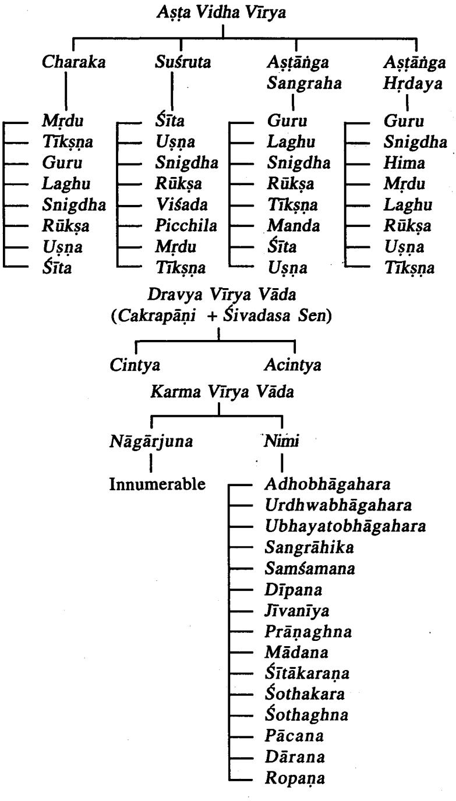

#### Vīryesu Bhūtotkarsa Vicāra

तत्र य इमेऽष्टौ गुणा वीर्यसंज्ञका: शीतोष्ण-स्निग्ध-रूक्ष-मृद्-तीक्ष्ण-पिच्छिल-विशदस्तेषां तीक्ष्णोष्णवाग्नेयौ, शीत-पिच्छलवाम्बुगुणभूयिष्ठौ, पृथिव्यम्बुगुणभूयिष्ठः स्नेहः, तोयाकाशागुण भूयिष्ठं मृदुत्वं, वायुगुणभूयिष्ठं रौक्ष्यं, क्षिति-समीरणगुणभुयिष्ठं वैश्राद्यम् । सु. सू. ४१/१

गुरु .............................अग्न्याकाशसमीरणगुण भूविष्ठं लघुत्वम् ।

| Sl. No. | Vīrya    | Pradhāna Mahābhūta |
|---------|----------|--------------------|
| 1       | Usna     | Agni               |
| 2       | Śīta     | Ap                 |
| 3       | Snigdha  | Prithvī & Ap       |
| 4       | Rūkṣa    | Vāyu               |
| 5       | Mrdu     | Ap & Ākāśa         |
| б       | Tīksņa   | Agni               |
| 7       | Picchila | Ap                 |
| 8       | Višada   | Prthvī & Vāyu      |
| ರ       | Guru     | Prthvī & Ap        |
| 10      | Laghu    | Agni, Vāyu & Ākāśa |

There are only eight types in Virya, Susruta has mentioned Picchila and Visada in place of Guru and Laghu.

#### Vīrya Karmāņi

Uṣṇa Vīrya Karma त्र कर्माण्यण्युष्णस्य दृहन-पाचन-मुच्छन-स्वेदन-वमन-विरेचनानि । त्र उष्ण............. वातघ्नौ । सु. सू. त्रत्रोष्णं दहन-पच्चन-स्वेदन-विलयनानिल कफशमनानि करोति । अ. सं. सू. १७/१६ तत्रोष्ण वीर्यस्य दहनादीनि कर्माणि । इन्दु तत्रोष्णं भ्रम-तृड्-ग्लानि- स्वेद-दाहाशुपाकिताः । शमं च वात-कफयो: करोति । अ. हृ. सू. ९/१८-१९ उष्णं कफवातहरं पित्तकरम् । द्रव्यगणसंग्रहः धान्यवर्ग/८

| Vīrya  | Dosa Karma     | Karma                      |
|--------|----------------|----------------------------|
|        | Vātahara       | Dahana (Burning sensation) |
|        | Kapha Vilayana | Pācana (Digests)           |
|        | (Kaphahara)    | Mūrchana (Cause fatigue)   |
| Vīry   |                | Swedana (Induce sweating)  |
|        |                | Vamana (Induce vomiting)   |
| ู้รุกล |                | Virecana (Cause purgation) |
|        |                | Bhrma (Cause giddiness)    |
|        |                | Trt (Induce thirst)        |
|        |                | Glāni (Cause discomfort)   |

Śīta Vīrya Karma

शीतस्य-प्रह्मादन-विष्यन्दन-स्थिरीकरण-प्रसादन-क्लेदन-जीवनानि ।

श्रीत.............पित्तघ्ना ।

सु. सू. ४१/११

शीतं ह्लादन-स्तम्भन-जीवन- रक्तपित्तप्रसादनादीनि ।

...............शिशिरं पुनः ।

ह्लादनं जीवनं स्तम्भं प्रसादं रक्तपित्तयो: । अ. हृ. सू. ९/१९

शीतं- कफमारुतकृत् ।

शिवदास सेन-द्रव्यगुण संग्रह: धान्यवर्ग ८

| Vīrya     | Dosa Karma    | Karma                           |
|-----------|---------------|---------------------------------|
| Śīta Vīry | Kaphavātakara | Prahladana (Refreshing)         |
|           | Pittahara     | Visyandana (Flowing)            |
|           |               | Sthirīkarana (Steadiness)       |
|           |               | Prasādana (Calmness)            |
|           |               | Vamana (Induce vomiting)        |
|           |               | Kledana (Moistening)            |
|           |               | Jivana (Enlivening)             |
|           |               | Stambhana (Obstructing)         |
|           |               | Raktaprasādaka (Good for blood) |

3. Snigdha Vīrya

स्निग्धस्य स्नेहन-बृंहण- संतर्पण- वाजीकरण- वय: स्थापनानि,

...........स्निग्धौ वातघ्नौ ।

सु. सू. ४१/११

#### Dravyaguņa Vijñāna

| Vīrya | Doşa Karma                 | Karma                                                                                                                                 |
|-------|----------------------------|---------------------------------------------------------------------------------------------------------------------------------------|
| ПР    | Vātahara<br>Kaphapittakara | Snehana (Lubricating)<br>Brhmana (Nourishing)<br>Santarpana (Gratifying)<br>Vāiīkarana (Aphrodisiacs)<br>Vayasthapana (Youthfullness) |

4. Rūkṣa Vīrya

# रूक्षस्य अनिलवृद्धि- संग्रहण-पीडन-विरुक्षणोपरोपणानि,

.... रूक्ष.................श्लेष्मध्नाः ।

सु. सू. ४१/११

| Vīrya   | Doşa Karma                 | Karma                                                                                       |
|---------|----------------------------|---------------------------------------------------------------------------------------------|
| yn<br>t | Vātakara<br>Pittakaphahara | Sangrahana (Grasping)<br>Pidana (Distressing)<br>Virūksaņa (Roughening)<br>Ropaṇa (Healing) |

# 5. Višada Vīrya

### विशदस्य क्लेदाचूषणविरूक्षणोपरोहणानि,

विशदा: श्लेष्मध्ना: ।

सु. सू. ४१/११

| Vīrva | Dosa Karma            | Karma                                                                        |
|-------|-----------------------|------------------------------------------------------------------------------|
|       | Kaphahara<br>Vātakara | Kledacusana (Suck moisture)<br>Virūksana (Roughening)<br>Uparohana (Healing) |

6. Picchila Vīrya

# पिच्छिलस्योपलेपन-पूरण-बृंहण- संग्रलेषण- वाजीकरणानि,

पिच्छिलाः पित्तध्नाः ।

सु. सू. ४१/११

| Vīrya     | Doşa Karma | Karma                                                                                                                                 |
|-----------|------------|---------------------------------------------------------------------------------------------------------------------------------------|
| chil<br>C | Pittaghna  | Upalepana (Smearing)<br>Pūrana (Filling up)<br>Brhmanaa (Bulk promoter)<br>Samslesana (Binding together)<br>Vājīkarana (Aphrodisiacs) |

#### 7. Mrdu Vīrya

#### मृदो रक्तमांसप्रसादनसुस्पर्शनानि,

# मृदु……….पित्तघ्नाः ।

#### सु. सु. ४१/११

| Virva | Dosa Karma | Karma                                                                            |
|-------|------------|----------------------------------------------------------------------------------|
|       | Pittahara  | Raktamāmsa Prasādana<br>(Conducive to Rakta & Mamsa)<br>Susparsa (Soft to touch) |

#### 8. Tīksna Vīrya

#### तीक्ष्णस्य-संग्रहाचूषणावदारण स्रावणानि,

तीक्ष्णा.................श्लेष्मघ्नाः ।

सु. सू. ४१/११

| Vīrya  | Doşa Karma | Karma                                                                                           |
|--------|------------|-------------------------------------------------------------------------------------------------|
| Tiksņa | Kaphahara  | Sangraha (Supporting)<br>Acusana (Sucking up)<br>Avadāraņa (Restricting)<br>Srāvaņa (Trickling) |

#### 9. Guru Vīrya

### ....................उपलेप.................आदिना ।

गुरु.............वातघ्ना ।

स्. सू. ४६/५१८

|                                                                                                                                                                                     | <br>------------------------------------------------------------------------------------------------------------------------------------------------------------------------------<br>i<br>117<br>1<br> | ------------------------------------------------------------------------------------------------------------------------------------------------------------------------------<br>------------------------------------------------------------------------------------------------------------------------------------------------------------------------------<br>--------------------------------------<br>:<br><br><br>------------------------------------------------------------------------------------------------------------------------------------------------------------------------------ |
|-------------------------------------------------------------------------------------------------------------------------------------------------------------------------------------|---------------------------------------------------------------------------------------------------------------------------------------------------------------------------------------------------------|-----------------------------------------------------------------------------------------------------------------------------------------------------------------------------------------------------------------------------------------------------------------------------------------------------------------------------------------------------------------------------------------------------------------------------------------------------------------------------------------------------------------------------------------------------------------------------------------------------------|
| .<br>------------------------------------------------------------------------------------------------------------------------------------------------------------------------------ | organ<br>                                                                                                                                                                                               | ------------------------------------------------------------------------------------------------------------------------------------------------------------------------------<br>-------------------------------------------------------------------------------------------------------<br>------------------------------------------------------------------------------------------------------------------------------------------------------------------------------                                                                                                                               |

#### 10. Laghu Vīrya

............लघवो..........लेखनादिना ।

लघु.............श्लेष्मध्नाः ।

सु. सू. ४६/५११

| <br>.<br>                                                                                                                                                                           | <br>------------------------------------------------------------------------------------------------------------------------------------------------------------------------------<br>                                | The for the county of the first for the first for the first for the<br><br>------------------------------------------------------------------------------------------------------------------------------------------------------------------------------                                                                                                                                                                     |
|-------------------------------------------------------------------------------------------------------------------------------------------------------------------------------------|-----------------------------------------------------------------------------------------------------------------------------------------------------------------------------------------------------------------------|-------------------------------------------------------------------------------------------------------------------------------------------------------------------------------------------------------------------------------------------------------------------------------------------------------------------------------------------------------------------------------------------------------------------------------|
| ------------------------------------------------------------------------------------------------------------------------------------------------------------------------------<br>1 | ------------------------------------------------------------------------------------------------------------------------------------------------------------------------------<br>anhahara<br>1<br>A SHORE CON REAL C | ------------------------------------------------------------------------------------------------------------------------------------------------------------------------------<br>------------------------------------------------------------------------------------------------------------------------------------------------------------------------------<br>A 469<br>400 All real proport<br>on and an a cars at<br>. |

#### Vīrva Upalabdhi Hetavaha

वीर्यं यावदधीवासान्निपाताच्चोपलभ्यते ।

च. सू. २६/६६

अधीवास: सहावस्थानं, यावदधीवासादिति यावच्छरीरनिवत्सात; एतच्च विपाकात् पूर्वं निपाताच्चोर्ध्वं ज्ञेयम् । निपाताच्चेति शरीर संयोगमात्रात्; तेन किंचिद्वीर्यमधीवासादपलभ्यते. यथा-आनप मांसादेरुष्णत्वं: किञ्चिच्च निपातादेव लभ्यते, यथा मरीचादीनां तीक्ष्णत्वादि; किञ्चिच्च निपाताधीवासाभयां, यथा मरीचादीनामेव । एतेन रस: प्रत्यक्षेणैव; वीर्यं तु किंचिदनुमानेन, यथा सैन्यवगतं शैत्यमानपमांसगतं वा औष्णयं. किञ्चिच्च वीर्यं प्रत्यक्षेणैव, यथा राजिकागतं तैक्ष्णयं घ्राणेन. पिच्छिलविश्वरूक्षादयः चक्षः स्पर्शनाभ्यां निश्चीयान्त इति चक्रपाणि भाष्य-च. सू. २६/६६ वावयार्थः ।

The Virya of a Dravya is percieved through two means, viz. Adhīvāsa (Anumāna-Inference) and Nīpāta (Pratvaksa-Directly).

| SI. No. | Means of<br>Perception    | Pramāna                     | Example             | Vīrya  |
|---------|---------------------------|-----------------------------|---------------------|--------|
| 1       | Adhivāsa                  | Anumāna                     | Anūpamāmsa          | Usna   |
| 2       | Nipāta                    | Pratyaksa                   | Marica              | Tīksna |
| 3       | Both Adhivāsa<br>& Nipāta | Both Anumana<br>& Pratyaksa | Marica              | Usna   |
| 4       | Adhivāsa                  | Anumāna                     | Saindhava<br>Lavana | Šīta   |
| ર       | Nipāta                    | Pratyaksa                   | Rājika              | Tiksna |

Cakrapāni gives several examples in this regard.

Here Adhivāsa (Anumāna) means after knowing the Karma done by the Dravya, infering its Virya. Nipāta (Pratyaksa) means directly the Virya of a Dravya is percieved through sense organs. When a Dravya comes in contact with any of the sense organ it is grouped under Nīpāta. Vīryās like Picchila. Visada, Snigdha, Rūksa etc. are percieved through Caksurindriya (Eye), Tiksna Vīrya may be percieved through Ghranendriya (Nose) etc.

#### Suśruta's View

तेषां मुद्रशीतोष्णाः स्पर्श्राम्द्याः, पिच्छिलविशादौ चक्षः स्पर्शाभ्यां, स्निग्धरूक्षौ चक्षषा, तीक्ष्णो मुखे द्वःखोत्पादनात् । सु. सू. ४२/११

Susruta has enumerated eight types of Virya and proposed the concept that how these are percieved.

| 10 | 1<br>1 |  |
|----|--------|--|
|    | 4      |  |

| SI. No. | Vīrya    | Means of Perception                   |
|---------|----------|---------------------------------------|
| l       | Šīta     | Sparsanendriyagrāhya (Touch)          |
| 2       | Usņa     | Sparsanendriyagrahya (Touch)          |
| 3       | Mrdu     | Sparsanendriyagrāhya (Touch)          |
| 4       | Picchila | Both Sparsanendriyagrāhya &           |
|         |          | Caksurindriyagrahya (Touch & vision)  |
| 5       | Višada   | Both Sparsanendriyagrahya, Caksurind- |
|         |          | riyagrāhya (Touch + Vision)           |
| 6       | Snigdha  | Caksurindriyagrahya (By observing)    |
| 7       | Rūksa    | Caksurindriyagrāhya (By observing)    |
| 8       | Tīksna   | Mukha (Ghrana) Through tongue or nose |

Upalabdhi of Guru and Laghu Vīrya

एतच्च वीर्यं सहजं कृत्रिमं च ज्ञेयम् । एतच्च यथा संभवं गुरुलध्वादिषु चक्रपाणि भाष्य-च. सू. २६/६६ वीर्येषु लक्षणं ज्ञेयम् ।

एतच्च वीर्यं सहजं कृत्रिमं च ज्ञेयम्, तत्राद्यां माषाणां गौरवं मुद्गानां लाघवमित्यादि, कृत्रिमं तू लाजादीनां लघुत्वामित्यर्थः ।

शिवदास सेन भाष्य-च. सू. २६/६६

There will be Sahaja (Natural) and Krtrima (Artificial) Viryas. Processing of Dravyas may change its Virya. Eg. Fried paddy have Laghu Virya.

Caraka has included Guru and Laghu Virya among Astavidha Vīryas.

Examples : (1) Guru Vīrya-Māsa

(2) Laghu Vīrya-Mudga

# Vīrva Nirdhārane Sāmānya Siddhānta Nirūpana Purassaram Sāpavada Nirdeśa (General Principles and Exceptions) शीतं वीर्येण यदद्रव्यं मधूरं रसपाकयो: ।

तयोरम्लं यदुष्णां च यद् द्रव्यं कटुकं तयो: 11 तेषां रसोपदेश्रोन निर्देश्यो गुणसंग्रहः ।

22 Dra.Vij.

#### वीर्यतोऽविपरीतानां पाकतश्चोपदेक्ष्यते ।। यथा पयो यथा सर्पिर्यथा च चव्यचित्रको ।।

च. सू. २६/४५-४७

General principle is the Dravya having Madhura Rasa will have Sita Virya where as the Dravyas having Amla and Katu Rasas will have Usna Vīrya.

Table showing the general principle with regards to Rasa, Vipāka and Vīrya.

| Sl. No. | Rasa           | Vipāka  | Vīrya |
|---------|----------------|---------|-------|
|         | Madhura        | Madhura | Śīta  |
| 2       | Amla           | Amla    | Uṣṇa  |
| 3       | Lavaņa         | Madhura | Usna  |
| ব       | Kațu           | Kațu    | Uṣṇa  |
| ന       | Tikta          | Katu    | Śīta  |
| Q       | Kaṣāya<br>Katu |         | Sīta  |

Caraka has quoted Dugdha, Ghrta, Cavya and Citraka as examples for the Dravyas follow Samanya Siddhānta.

Following examples are the instances where, if one factor is known, then one can guess other factors as they follow general rule.

| SI. No. | Example    | Rasa    | Vipāka  | Vīrya |
|---------|------------|---------|---------|-------|
| -       | Kūṣmānda   | Madhura | Madhura | Śīta  |
| 2       | Cangeri    | Amla    | Amla    | Usna  |
| 3       | Sauvarcala | Lavaņa  | Madhura | Uşna  |
| 4       | Agaru      | Katu    | Kațu    | Uṣṇa  |
| ર       | Kumāri     | Tikta   | Katu    | Sīta  |
| 6       | Udumbara   | Kaşaya  | Katu    | Sita  |

Vīrva Nirdhārane Apavāda Exceptions in Assessing Vīrya

Some Dravyas will not have their Virya acc to their Mahabhautika composition.

|     | मधुरं              |                      |                            |       |
|-----|--------------------|----------------------|----------------------------|-------|
| यथा | पञ्जूषा मुख्       |                      | यथाऽब्जानूपमामिषम् ।।      |       |
| लवण | सैन्धवं            | नोष्णमन्त्रमामलनं कं |                            | तथा । |
|     | अर्कागुरुगुडूचीनां |                      | तिक्तानामुष्णमुच्यते । । । |       |

च. सू. २६/४८-४९

| SI. No. | Example for Exceptions | Rasa               | Vīrva |
|---------|------------------------|--------------------|-------|
| 1       | Brhat Pañcamūla        | Kasāya, Tikta Usņa |       |
| 2       | Anūpa Māmsa            | Madhura            | Usna  |
| 3       | Saindhava Lavaṇa       | Lavaņa             | Šīta  |
| র্ব     | Amalaki                | Amla               | Šīta  |
| ನ       | Arka                   | Tikta              | Usna  |
| 6       | Aguru                  | Tikta              | Usna  |
| 7       | Gudūcī                 | Tikta              | Usna  |

While explaining about importance of Virya, Susruta has enumerated several examples which are also examples for exceptions.

यथा तावन्महत्यञ्चमुलं कषायं तिक्तानुरसं वातं श्रामयति, उष्णवीर्यत्वम् तथा कुलत्यः कषायः, कद्दकः पलाण्डः, स्नेहभावाच्च, मधुरश्रेक्षरसो वातं वर्धयति, शीतवीर्यत्वात्, कदुका पिप्पली पित्तं शामयति, मृदुशीतवीर्यत्वात्, कदुका पिप्पली पित्तं शमयति, मृदुशीतवीर्यत्वात्, अम्लमामलकं लवणं सैन्यवं च; तिक्ता काकमाची पित्तं वर्धयति, उष्णवीर्यत्वात्, मधुरा मत्स्याश्च, कटुकं मूलकं श्लेष्माणं वर्धयति. स्निग्यवीर्यत्वात: अम्लं कपित्यं श्लेष्माणं शामयति रूक्ष्मवीर्यात. मधुरं क्षौद्रं च । सु. सू. ४०/५

| SI. No. | Examples       | Rasa          | Vīrya     |  |
|---------|----------------|---------------|-----------|--|
|         | Mahatpañcamūla | Kasāya, Tikta | Usna      |  |
| 2       | Kulatha        | Kasāya        | Snigdha   |  |
|         | Palandu        | Katu          | Snigdha   |  |
| ব       | Iksurasa*      | Madhura       | Sita      |  |
|         | Pippalī        | Kațu          | Mrdu Śīta |  |

Yogendranath Sen support this theory with the examples.

| 6  | Amalakī          | Amla    | Šīta    |
|----|------------------|---------|---------|
|    | Saindhava Lavaṇa | Lavana  | Śīta    |
| 8  | Kākamacī         | Tikta   | Uṣṇa    |
| ರ  | Matsya           | Madhura | Usņa    |
| 10 | Mūlaka           | Kațu    | Snigdha |
| 11 | Kapitha          | Amla    | Rūkṣa   |
| 12 | Ksoudra          | Madhura | Rūksa   |

* Exception in relation to Karma.

# Vīrya Prādhānyata Superiority of Virya

Susruta has given prime importance to Vīrva among the constituents of Dravya, as the Virya is responsible for various actions done by Dravya.

नेत्याहूरन्ये, वीर्यप्रधानमिति । कस्मात् ? तद्वश्रोनौषधकर्म निष्यत्तेः । इहौषधकर्माण्यवर्ध्वाधोभागोभयभागसंशोधन- संशमन- संग्राहिकारिनदीपन-पीडन-लेखन- ब्रंहण-रसायन- वाजीकरण- श्वयथुकरविलयन- दहन- दारण- मादन-प्राणघ्न-विषप्रश्रशमनादीनि-वीर्यप्राधान्याद्भवन्द्रवन्ति । सु. सू. ४०/४

The following Karma's done by the Dravyas are attributed to Vīrya (i) Urdhwābhagahara (Emesis) (ii) Adhobhāgahara (Purgation) (iii) Ubhayabhaga Samśodhana (Both emesis and purgation) (iv) Samsamana (Paciffying the Dosas) (v) Sangrāhita (vi) Agnidīpana (Improving appetite) (vii) Pīdana (viii) Lekhana (Scraping out unwanted tissue) (ix) Brhmana (Bulk promotor) (x) Rasāyana (xi) Vājikarana (xii) Swayathukara (Cause swelling) (xiii) Swayathu Vilayana (Reduces inflammation) (xiv) Dahana (Burning) (xv) Dāraņa (xvi) Mādana (Intoxication) (xvii) Prāņaghna (Poisonous effects) (xviii) Viṣaghna (Antipoisonous) etc. Karmas are done by Virya.

Note : Astānga Hrdayakara opines that Prabhāva is responsible for Samsodhana, Vājikarana, Prānaghna, Visaghna etc. Karma.

एतानि खलु वीर्याणि स्वबलगुणोत्कर्षाद्रसमधिभुयात्मकर्म कुर्वन्ति । यथा तावन्महत्पञ्चमूलं कषायं तिक्तानुरसं वातं शमयति, उष्णवीर्यत्वात्; तथा कुलत्यः कषायः कटुकः पलाण्डु स्नेहभावाच्च; मधुरश्चेश्वरसो वातं वर्धयति, शीतवीर्यात्वात्; कदुका पिण्पली पित्तं शामयति, मुद्रशीतवीर्यत्वात; अम्लमामलकं लवणं सैन्यवं च तिक्ता काकमाची पित्तं वर्धयति. उष्णवीर्यत्वात: मधरा मत्स्याशचः कटकं मुलक श्लेष्माणं वर्धयति, स्निग्धवीर्यत्वात; अम्लं कपित्यं श्लेष्माणं शमयति, रूक्षवीर्यत्वात: मधर क्षौद्र च । सु. सू. ४०/५

Susruta further explains about predominance of Vīrya with examples.

Eg. 1. Brhatpañcamula having Kasāya Rasa & Tikta Anurasa reduces Vata because of its Usna Vīrya.

2. Kulatha does Vāta Šamana eventhough it has Kasāya owing to its Usnavirya.

3. Palāndu again Vātahara eventhough it possess Katu Rasa because of its Snigdha Virya.

4. Iksu having Madhura Rasa but does increase Vata because of its Śīta Vīrya.

5. Pippali does Pitta Śamana owing to its Mrdu Śīta Vīrya.

6. Āmalaki eventhough has Amla Rasa does Pitta Śaman by virtue of its Mrdusīta Vīrya.

7. Saindhava Lavana eventhough has Lavana Rasa acts as Pittahara owing to its Mrdu Śīta Vīrya.

8. Kākamāci aggravates Pitta eventhough having Tikta Rasa because of its Usna Vīrya.

9. Matsya having Madhura Rasa but acts as Pitta Vardhaka owing to its Usna Vīrya.

10. Mūlaka acts as Kapha Vardhaka eventhough it has Katu Rasa because of its Snigdha Vīrya.

11. Kapittha has Amlarasa but does Kapha Śamana by the virtue of its Rūksa Vīrya.

12. Ksoudra eventhough has Madhura Rasa does Kapha Samana owing to its Rūksa Vīrya.

#### Dravyaguna Vijñāna

ये रसा वातशमना भवन्ति यदि तेषु वै। रौक्ष्य-लाघव-शैल्यानि न ते हन्युः समीरणम् ।। ये रसा: पित्तशमना भवन्ति यदि तेष वै। तैक्ष्णयौष्णय लघुताश्चैव न ते तत्कर्मकारिणा: ।। ये रसा: श्लेष्मशमना भवन्ति यदि तेषु वै। स्नेह- गौरव-शैल्यानि न ते ते तत्कर्मकारिण: । । तस्माद्वीर्यं प्रधानमिति ।। सु. सू. ४०/६-९

Eventhough Dravyas having Madhura, Amla, Lavana Rasas will not subside Vata if they possess any one among Rūksa, Laghu and Śīta Vīrya.

Dravyas won't subside Pitta eventhough they have Madhura, Tikta, Kasaya Rasas if it has Tīksna, Usna and Laghu Vīrya.

Dravyas are not capable of subsiding Kapha if they have Snigdha, Guru and Śīta Vīrya eventhough they are having Katu, Tikta and Kasaya. This indicates Virya is dominant and important.

Acarva Badanta Nagariuna had following reasons to say Vīrya is important.

#### 1. Vīrva Prādhānikāt

वीर्य प्रधानमित्येक, वीर्यप्राधान्याद् द्रव्याणाम् । र. वै. अ. १; सू. १३० द्रव्याण्यपि वीर्यविशिष्टानि प्रधानानि भवन्ति यस्माद् वीर्यप्रधानमित्येके, निर्वीर्याणिपरित्यजन्तीति । भाष्य-र. वै. अ. १; सू. १३०

In treatment, the substances having good potency only utilised not the one which lost its potency.

#### 2. Karma Karanāt

तेन कर्मकरणात ।

र. वै. अ. १; सू. १३१

तेन वीर्येण कर्म इविस्तं पश्चं तस्य करणात् साधनात् 'सर्व वीर्यकृता क्रिया' भाष्य र. वै. अ. १; सू. १३१ द्वति वचनात ।

All the Acaryas have given prime importance to Virya as it is responsible for all Karmas done by the Dravya.

- 3. Tulya Rasa Guneşu Viśeşat
किञ्च तुल्य रस गुणेषु विशेषात् । र. वै. अ. १; सू. १३६ तुल्य रसेषु तल्यगुणेषु विशेषो दृश्यते-तिक्तशीतोमदर्लघः पिचुमन्दः कुष्ठं जयति, कदवर्ष सन्दर्थाति पक्वातिसारम् एवं विशेषदर्शनात द्रव्य रस गण विशिष्ट मस्ति प्रधानभूतं वीर्यं, तस्याधिष्ठानमात्रं खल्विमे द्रव्यादय इति जानीयः । भाष्य-र. वै. अ. १; सू. १३६

Virya overpowers Rasa in bringing out its own Karma.

Eg : Nimba → Tikta, Śita, Mrdu & Laghu alleviates Kustha Katvanga → Aralu. Tikta. Śita. Katuvipāka. over comes. Atisāra.

4. Āgamāt

र. वै. अ. १; सू. १४० आगमाच्च । शास्त्रादायुर्वेदादिति । यथा-"वीर्यतः कार्यसामर्थ्यं द्रव्याणां भिषजो विद्: ।' भाष्य-र. वै. अ. १; सू. १४० इति ।

In classical texts Vīrya is given utmost importance.

# Chapter-8 Prabhāva Parijñāna

#### Points Dealt

- · Prabhavasya Nirukti
- · Prabhāva Laksanam
- Prabhāva Swarūpa
- · Prabhãvajanyakarma
- · Vīcitrapratyārabdhatwam & Prabhāva
- Prabhāva Prādhānyata Nirūpanam

### Prabhāvasva Nirukti

(पु) प्र+भू-धज् । राज्ञं कोषद जाते तेजसि अमर: तेष्वसि सामर्थ्यो क्षेम च विक्रमे प्रभागर्भजाते सुर्यपुत्रभेदे प्रभाशब्दे दृश्यम् । वाचस्पत्यत्यम्

पं स्वभावे । सामर्थ्ये

वै. श. सि.

Has more power, dominant, excelling and distinguished are the meanings.

### Prabhāva Lakṣaṇam

रसवीर्यविपाकानां सामान्यं यत्र लक्ष्यते । विशेषः कर्मणां चैव प्रभावस्तस्य स स्मृतः ।।

प्रभावलक्षणमाह-रसवीर्येत्यादि । सामान्यमिति तुल्यता । विशेष: कर्मणामिति दन्त्याद्याणां विरेचनत्वादीनाम् । सामान्यं लक्ष्यत इत्यनेन रसादिकार्यत्वेन यन्नावधारयित् शक्यते कार्यं तत् प्रभावकृतिमिति सूचयति, अत्र एवोक्तं प्रभावोऽचिन्त्य उच्यते, रसवीर्यविपाककार्यतयाऽचिन्त्य इत्यर्थः । चक्रपाणि-च. सू. २६/६७

Prabhava is a special action exhibited by the Dravya which can not be explained with respect to its Rasa, Virya and Vipāka.

Cakrapāņi gives same explanations but he calls it as Achintya Śakti.

रसादि साम्ये यत्कर्मविशिष्टं तत्प्रभावजम् । अ. सं. सू. १७/३२२

एवं रसाद्याः ज्ञाताः प्रभावस्तु न ज्ञातः, अतस्तद्विज्ञानार्थमुच्यते रसादीत्यादि । रसवीर्यविपाकानां परस्पर साम्येऽपि यद्यद्विशिष्टं कर्म दृश्यते तत्तत् प्रभावजं विन्दि । एवताबतैवदुक्तं भवति विशिष्टा सर्वातिशायिनी द्रव्यशक्तिः प्रभावशब्दवाच्या । तस्य च प्रभावनस्य कर्मण उदाहरणमुच्यते दन्तीत्यादि । भाष्य

च. सू. २६/६७

#### Prabhãva

Vagbhata also opines the same that, the peculiar action of one Dravya seen even when the Rasa. Virya, Vipākā's are similar with those of another Dravya. Because of this inexplicable nature the action is said to be Prabhavajanya.

# रसवीर्यविपाकादिगुणातिशयवानलम् द्रव्यस्वभावो निर्दिष्टः यः प्रभावः स कीर्तितः ।।

अ. द. भाष्य-अ. हृ. सू. ९

Arunadatta also opines in a similar manner, that the peculiar unexplainable action brought about by the Drayya may be considered as Prabhava.

> रसगणभुतसम्बद्धायाश्रय एवानवधारणः । तथा रसभुतसमुदायानामन्येषामन्यथावीर्यत्वात् । ।

र. वै. ४/२८

Badanta Nagāriuna has termed Prabhāva as Anavadhāra-nīya which is not under the control of Rasādi Gunas.

> अमीमांस्यान्यचिन्त्यानि प्रसिद्धानि स्वभावतः । आगमेनोपयोज्यानि भेषजानि विचक्षणैः ।।

> > सु. सू. ४०/१९

Eventhough direct references regarding Prabhava is not available in Susruta Samhita, word 'Acintya' is refered to the drugs where one can not explain the mode of action, which may be considered for Prabhava. He has mentioned Khadira, Tuvaraka. Haridra etc. which alleviates Kusta as example for Prabhāva.

Various examples are given for Prabhāva in classical literature.

1. Citraka and Danti

कदक: कटक: पाके वीर्योष्णश्चित्रको मत: । विरेचयति मानवम ।। प्रभावस्तु ता दिन्दी च. स. २६/६८

अस्यैव दुरभिगमत्वादुदाहरणाति बहन्याह कट्रक इत्यादिना । तद्वदिति चित्रकसमानगणा । .............................................................................................................................................................. सामान्यविशेषः दन्तीत्वादियुक्ता शक्तिरेव. यतः शक्तिर्हिस्वरूपमेव भाषानां नातिरिक्त किचिन्द्रमान्तरमः एव प्रदेशान्तरोक्तनण प्रभावादिष्वपि वाच्यं: यथोक्तं "द्रव्याणि हि द्रव्यप्रभावात् गुणप्रभावात्'' इत्यादि । न च वाच्यं दन्त्यादि स्वरूपत एव विरेचयति, तेन किमिति जलाद्युपहृता दन्ती न विरेचयतीति; प्रतिबन्यका भावविशिष्ट-स्यैव प्रभावस्य कारणत्वात्, जलोपहतायां दन्त्यां जलोपद्यातः प्रतिबन्धक इत्याद्यनु-चक्रपाणि भाष्य-च. सू. २६/६८ सरणीयम् ।

चित्रकः कटको रसे पाके च. वीर्ये चोष्णः तस्य तस्य कार्य सामान्यकदरसस्य यत कार्यं. कदविपाकस्य यत कार्य. उष्णवीर्यस्य च यत कार्यं तल्लक्ष्यते. न चाधिकं कर्म लक्ष्यते. तद्वहन्ती रसे पाके च कटका, वीर्ये चोष्णा, तद्रसविपाकवीर्याणां कर्माणि शक्रहननादीनि यानि तेषां मध्ये सामान्यं लक्ष्यते. विशेषस्त विरेचनं कर्म लक्ष्यते. तत् प्रभावान्मान्नवं विरेचयति ।

दन्ती रसाद्यैस्तुल्यापि चित्रकस्य विरेचनी ।

|  |  |  | अ. सं. सू. १७/३१; अ. हृ. सू. ९/२६-२७ |  |  |  |  |  |  |  |  |  |
|--|--|--|--------------------------------------|--|--|--|--|--|--|--|--|--|
|--|--|--|--------------------------------------|--|--|--|--|--|--|--|--|--|

| SI. No.   Dravya | Kasa | Vipāka | Vīrva | Karma    |
|------------------|------|--------|-------|----------|
| Citraka          | Katu | Katu   | Usna  | Dīpana   |
| Danti            | Katu | Katu   | Usna  | Virecaka |

Here both Citraka and Danti have Katu Rasa. Katu Vipāka and Usna Virva but Citraka acts as Dīpaka where as Danti acts as Virecaka. The Virecana Karma exhibited by Danti is considered as Prabhavajanya Karma.

#### 2. Yastimadhu and Mrdwīka

मधुकस्य च मुद्वीका । अ. सं. स. १७; अ. ह. स. ९/२७ मधकस्य रसाद्यः सादृश्यपि द्राक्षा विरेचनी. न मधुकमिति प्रभावकर्म । इन्द भाष्य: अ. सं. स. १७

Here both Yastimadhu and Mrdwika are having Madhura Rasa. Madhura Vipāka and Śīt. Vīrya but their actions are different. Mrdwīka cause Virecana. where as Yastimadhu won't. Here the Karma of Yastimadhu, that which doesn't cause Virecana is an example for Prabhāva.

#### Prabhāva

#### 3. Ksīra and Ghrta

घृतं क्षीरस्य दीपनम् । अ. सं. सू. १७; अ. ह. सू. ९/२७ क्षीरस्य रसाद्यैः सदशमपि घतं दीपनं व क्षीरमिति प्रभावः ।

इन्दु भाष्य-अ. सं. सं. सं. सू. १७

| Sl. No.   Dravya   Rasa | Vipāka                   | Vīrva | . Karma         |
|-------------------------|--------------------------|-------|-----------------|
| Ksīra                   | Madhura   Madhura   Śīta |       | Agni-<br>māndya |
| Ghrta                   | Madhura   Madhura   Śīta |       | Dīpana          |

Eventhough both ksīra and Ghrta are having Madhura Rasa. Madhura Vipāka and Śīta Vīrya. Ksīra will act as Agnimandya Kara where as Ghrta increases Agni.

#### 4. Kaphavātahara Karma of Laśuna

|       | कदुपाकरसस्निग्ध       | गुरुत्वैः |                                                                                                                                                                                       | ------------------------------------------------------------------------------------------------------------------------------------------------------------------------------<br>कफवाताजत् । |  |              |
|-------|-----------------------|-----------|---------------------------------------------------------------------------------------------------------------------------------------------------------------------------------------|-----------------------------------------------------------------------------------------------------------------------------------------------------------------------------------------------|--|--------------|
| लशुनो | वातकफकृत्रन्न      तु |           | व में बाद में बाद में बाद में बाद में बाद में बाद में बाद में बाद में बाद में बाद में बाद में बाद में बाद में बाद में बाद में बाद में बाद में बाद में बाद में बाद में बाद में<br>तर्व | यद्गुणैः ।।                                                                                                                                                                                   |  |              |
|       |                       |           |                                                                                                                                                                                       |                                                                                                                                                                                               |  | अ. सं. स. १७ |

लशन: कदरसत्वेन कटविपाकित्वेन कफजित स्निग्धत्वेन गुरुत्वेन वाताजित, स लशनः स्वरेव गुणैर्वातकफौ न करोतीति प्रभावः । तेनैतदक्तं भवति-कदरस-विपाकौ तु लशुने कफच्छित्वे द्रव्यप्रभावात् पर्याप्तौ, न तु वातकरत्वे; तथा तत्र स्निग्धत्वं गुरुत्वं च वाताजित्वे द्रव्यप्रभावात् पर्याप्तं, न तु श्लेष्मकरत्वं इति । इन्द्र भाष्य-अ. सं. स. १७

Laśuna, because of its Katu Rasa and Katu Vipāka acts as Kaphasamaka and owing to its Snigdha & Guru Gunas does Vata Samana. Eventhough it is having Katu Rasa and Katu Vipāka won't aggravate Vāta and Snigdhatwa & Gurutwa won't aggravate Kapha. Here the Karma Vatakaphahara is considered as Prabhāva.

#### 5. Raktaśāli and Yava

मिथो विरुद्धानु वातादीनु लोहिताद्या जयन्तियत् । कुर्वन्ति यवकाद्याश्च तत् प्रभावविज्रम्भितम् ।।

अ. सं. सू. १७

परस्परविरुद्धानपि वातादीनू रक्तशालिः स्निग्धत्वेन गुरुत्वेन नाशयति, यवकश्च तानेव करोतीति प्रभावकर्म ।

| SI. No.   Dravya | Kasa                                 | Guna | Vīrva Karma |
|------------------|--------------------------------------|------|-------------|
|                  | Raktaśālī   Madhura   Snigdha   Sīta |      | Vātahara    |
| ava              | Madhura   Snigdha   Śīta             | Guru | Vātakara    |

Here both Raktasali and Yava have similar properties but Raktaśāli is Vātahara and Yava is Vātakara. Rakta Śāli has Vatahara action on the basis of its properties, but Yava is not. Vatakara of Yava is Prabhāva.

# 6. Visaghna Karma of Śirīsa

विषं विषध्नयुक्तं यत् प्रभावस्तत्र कारणम् । च. स. २६/६९

विषध्‍यनमक्तमिति तस्माहंष्टाविषमौलं इत्यादिना । .................................................................................................. या च विषस्य विषध्मत्वे उपपत्तिरुक्ता........... । चक्रपाणि भाष्य-च. सु. २६/६९

शिरीषादि विषं हन्ति स्वप्नाद्यं तद्विवृद्धये । अ. सं. स. १७

शिरीषहरिद्वादिकं विषं नाशयति. स्वप्नभेद्यादि च तदेव विषं वर्धयति. तत प्रभावकर्म । इन्द्र भाष्य-अ. सं. सू. १७

Sirisa and Haridra are considered as Visaghna Dravyas (One which reduces poisonous effects) and Swapna (Sleep) and Megha (Cloudy atmosphere) are aggravating the poisonous condition. Here both Visaghna and Visavardhaka Karmas are said as Prabhāvajanya Karma.

Other examples are :

#### 7. Manidharana (Wearing Precious Stones)

Sometimes wearing precious stone will yield good effects.

#### 8. Mantra

Chanting of Mantra will also yield some effects which are considered under Prabhava.

#### 9. Śalyāharana

Removal of foreign body by certain Dravyas are also an example for Prabhāvajanya Karma.

10. Vamana and Virecana

ऊर्ध्वानुलोमिकं यच्च तत् प्रभावप्रभावितम् । च. सू. २६/६९ ऊर्वाधोगामित्वविरोध लक्षण साऽन्तर्भागत्वात प्रभावादेव भवति । चक्रपाणि भाष्य-च. सू. २६/६९

ऊर्वाधोभागिकं यच्च द्रव्यं । अ. सं. सू. १९

यच्च द्रव्यं मदनफलादि ऊर्ध्वदेहे गच्छति, हरीतक्यादि वाऽधः ततप्रभावात् । इन्दू भाष्य-अ. सं. सू. १७

If a Dravya is having Vamaka Karma, then it is attributed to Urdhwabhāgahara Prabhāva.

Eg. Vamana Karma by Madanaphala.

Virecana Karma done by the Dravya is attributed to Adhobhāgahara Prabhāva of that Dravya.

Eg. Anulomana Karma of Harītaki.

#### Swarūpa of Prabhāva

अत एव सर्वातिशयी द्रव्यस्वभाव: प्रभाव इत्याम्नात: ।

अ. सं. स. १७/१३

अनयैव यक्तन्या यो द्रव्यस्य सर्वगणातिशायी स्वभावः स प्रभावशब्देनोक्तः । तेनैतदक्तं भवति-यथैव गुर्वादीनां कार्यकर्त्वे प्राधान्यापेक्षया वीर्यत्वं तथैव गुर्वादीनां प्राधान्यापेक्षया कस्याश्चिच्छत्तेः सर्वातिशायित्वात् संज्ञा प्रभाव इति । न हि ताह्यतिरिक्तेषु रसादिषु कल्प्यमानेषु दृश्यते । अतः स्वभाव विशेष एव सः । इन्दू भाष्य-अ. सं. सू. १७/१५

All Acaryas have considered Vīrya and Prabhāva as Śakti (Force/potency) of a Dravya. Eventhough Virya is a strong factor but it perform action acc to the Gurvadi Gunas which may be explained (Cintya) where as Prabhava is one which cannot be explained (Acintya) based on Gurvadi Gunas. Hence it is considered as an exceptional power of drug.

> रसेन वीर्येण गुणेश्च कर्म द्रव्यं विपाकेन च यद्विदध्यात् । सद्योऽन्यथा तत्कुरुते प्रभावाद्देतेरतस्तत्र न गोचरोऽस्ति ।।

अ. सं. सू. १७/३२२

एतमेव प्रभावार्थमुपसंहति-रसेनेत्यादि । रक्षादिभिकरणैद्रव्यं यतः कर्मकरोति

तत् प्रभावेनान्यथा कुरुते विपरीतयतीत्यर्थः । अतस्तस्य प्रभावहेतोमार्गणा न शक्यते । तथा विधभावस्वभावत्वात् ।

Commonly Dravya shows its action based on Rasa, Guna, Virya or Vipāka & if the Dravya exhibits extraordinary action irrespective of its Rasadi Gunas. where the casue of the action cannot be traced then it is Prabhava.

|  | अमीमांस्यान्यचिन्त्यानि  प्रसिद्धानि  स्वभावतः ।            |  |
|--|-------------------------------------------------------------|--|
|  | आगमेनोपयोज्यानि      भेषजानि                                |  |
|  | प्रत्यक्षलक्षणफलाः     प्रसिद्धाश्रु    स्वभावतः ।          |  |
|  | नौषधीर्हेतुभिर्विद्वान्                                     |  |
|  | सहस्रेणापि       हेतूनां           नाम्बष्ठादिर्विरेचयेत् । |  |
|  | तस्मात्तिष्ठेत्तु                                           |  |
|  | सु. सू. ४०/१९-                                              |  |

Certain principles laid down by Acarya should not be argued and if possible only explanations regarding the mode of action may be traced or the actions may be observed directly. If its not possible to explain not to worry much as the words of Acaryas are always true that Ambastadigana Dravyas never cause Virecana.

अत्र वीर्यशब्देन द्रव्यस्य द्विविधाऽपि चिन्त्याऽचिन्त्या च शक्तिरुच्यते । तत्र अचिन्त्या शक्तिया तत्रान्तरे प्रभाव इत्युच्यते सा ग्राह्मा, तस्मैव च वीर्यस्य प्रभावाख्यस्य स्वतन्त्रे 'तद्रव्यमात्मना किञ्चित्' इत्यनेन ग्रहणं ज्ञेयम् । ………अचिन्त्य क्रिया हेतश्च प्रभावापरपर्याया द्रव्याणां रसादननरूप कार्य कारणशक्तिः ।

चक्रपाणि–सु. सं. सू. ४०/५

ર્ ૧

Cakrapani in his commentary on Susruta opined that both Virya and Prabhava are the Sakti of a Dravya. Further, says Prabhava is exhibiting independent action.

#### Prabhāvajanva Karma

दन्ती रसाद्यैक्तुल्यापि ... ... ......................................................................................................... I शिरीषादिविषं हन्ति स्वप्नाद्यं तद्विवृद्धये ।। मणिमन्त्रौषधीनां च यत्कर्म विविधात्मकम् । रक्षायर्थीवशादिकम ।। शल्याहरण पुद्धन्म

दर्शनाद्यैरपि विषं विषं यान्नियच्छति चागद् : । विरेचयति यद्रव्यमाशु शुक्र करोति वा ।। ऊर्वाधीभागिकं यच्च द्रव्यं यच्छमनादि च । मातादिप्राप्य तत्त्वच्य यत्रपञ्चन व्यव्यप्रयतम् ।। तच्च प्रभावजं सर्वमतोऽचिन्त्यः स उच्यते ।

अ. सं. सू. १७/१६

Different actions done by the Dravyas are considered as Prabhāvajanya Karmas.

1. Virecana Karma done by the Danti is given as example for Prbhāvajanya Karma.

2. Visaghna Karma-The Karma done by Sirīsa etc. Dravya, which subsides the poisonous effects.

3. Visakara-Certain factors are responsible for worsening of poisonous conditions like cloudy atmosphere and sleep.

4. Manidharana-Special effects felt by the persons wearing precious stones cannot be explained.

5. Mantra-The effect caused by chanting of Mantra or Śloka.

6. Ausadha-Certain drugs shows pharmacological actions which is impossible to explain.

7. Salyaharana-Removal of foreign body is also Prabhāvajanva Karma.

8. Punarjanma-The concept of rebirth is difficult to explain.

9. Raksoghna-Antimicrobial activity of certain Dravyas are difficult to describe.

10. Dhī/Medhva-Some drugs like Brahmi improves one's intelect.

11. Vašīkarana-To cativate.

Capturing a person with supernatural power.

12. Agadiya Karma-Any antidote for poison may be grouped under Prabhavajanya Karma.

13. Asu Sukrakara-After administering a Dravya which produces Sukra immediately is also Prabhavajanya Karma.

14. Urdhwa Bhagahara-Vamana Karma can not be explained completely on the basis of Rasadi Gunas.

15. Adhobhāgahara-Virecana is also Prabhāvajanya Karma. Not many Dravyas are having Virecana Karma.

Concept of Samana Pratyarabdha and Vicitra Pratyārabdha

> इति सामान्यतः कर्म द्रव्यादीनां पनश्च तत् । विचित्र प्रत्यारब्ध द्रव्यभेदेन श्रिद्यते ।। स्वादुर्गुरुश्च गोधुमो वातजित्वातकूद्ययवः । उष्णा मत्स्या: पय: शीतं कट्र: सिंहो न शुकर: ।। अ. हृ. सू. ९/२७-२८

इति प्रकारे, अनेन प्रकारेण द्रव्यरसवीर्यादीनां सामान्येन कर्म व्याख्याताम्; न विशेषण । यैरेव महाभूतैरसवीर्यादयो द्रव्याश्रिता आरब्धाः, तैरैव तथा भूतैस्तदाश्रयमपि द्रव्यम् । ..................विचित्रप्रत्यारब्धं च तस्य भेदो विशेषः, तेन विचित्रप्रत्ययारब्ध द्रव्यभेदेन, तत् सामान्योक्तं कर्म द्रव्यादीनां, भिद्यते नानात्वेन सम्पद्यते । द्रव्याश्रितत्वाद्ररसादीनां अपि यत्कर्म तदपि द्रव्यभेदेन भिद्यते । ननु, सर्वमपि देशकालादि वशाद्विचित्र प्रत्यारब्धम्, परस्पर वैलक्ष्णया-द्रव्याणाम् । परस्पर वैलक्ष्ण्ये चैषां विचित्र प्रत्यारब्धत्वमेव कारणम् । ......... स्वादरसोपेतो गरुगणयक्तश्च गोधमो मधररसोपदिष्टं वातजित्वं यत कर्म तत करोति. समान प्रत्यारब्धत्वात् । यवस्तु स्वादरसोपेतो गुरुगुणयुक्तश्च मधुररसोपदिष्ट यद्वाजित्वं कर्मं तन्न करोति, अपि तु वातकृत्वमेव करोति, विचित्र प्रत्यारब्धत्वात् मत्स्य: स्वादरसोपेतो गरु गणोपेतश्च न मधर रसोपदिष्ट शीतवीर्य: किं तर्हि ? उष्णवीर्यः किंचिल प्रत्यारब्धत्वात् । क्षीरं च स्वादुरसोपेतं गुरुगुणयूक्तं च मधुररसोपदिष्टि शीतवीर्यम्, समानप्रत्यारब्धत्वात् । स्वादुरसयुक्तो गुरुगुण युक्तश्च सिंहो न यथा रसं मधुरविपाक: किं तर्हि ? कदुको विपाके, विचित्र प्रत्यारब्धात् । शूकरो मधररसयक्तो गरुगणोपेतश्च यथारसं मधुरविपाक एव, समान प्रत्यारब्धत्वात् । अ. द.-अ. हृ. सू. ९/१९-२१

Samana Pratvarabda Dravyas are those, which have their Rasa, Guna, Vipāka, Vīrya in accordance to their Pāncabhautika composition and show the Karma accordingly.

#### Eg. Godhūma

Godhūma which has Madhura Rasa, Guru, Guņa, Madhura Vipāka will have Vātahara Karma.

| SI. No. | Dravya          | Rasa    | Guņa           | Vipāka  | Vīrya | Karma              |
|---------|-----------------|---------|----------------|---------|-------|--------------------|
| l       | Ajamoda         | Katu    | Laghu<br>Rūkṣa | Kaṭu    | Usna  | Dīpana             |
| 2       | Aśoka           | Kaṣāya  | Laghu          | Katu    | Śīta  | Stham-<br>bhaka    |
| 3       | Aragwa-<br>dha  | Madhura | Guru           | Madhura | Sīta  | Stham-<br>bhaka    |
| 4       | Udum-<br>bara   | Kaṣāya  | Rūksa          | Kațu    | Sīta  | Stham-<br>bhaka    |
| 5       | Uśīra           | Tikta   | Rūksa          | Katu    | Sita  | Dāhapra-<br>śamana |
| б       | Karavīra Kaṭu   |         | Laghu          | Katu    | Uṣṇa  | Kustha-<br>ghna    |
| 7       | Krsna<br>Jīraka | Kațu    | Laghu          | Katu .  | Usna  | Dīpana             |
| 8       | Khadira         | Kaṣāya  | Laghu          | Kațu    | Śīta  | Stham-<br>bhaka    |
| 9       | Goksura         | Madhura | Guru           | Madhura | Śīta  | Vrsya              |
| 1 0     | Candana         | Tikta   | Laghu          | Kațu    | Sīta  | Dāhapra-<br>Samana |

Table showing Samānapratyārabda Dravya

Vicitrapratyarabda Dravyas are those which donot have their Rasa, Guna, Vipāka and Vīrya in accordance to Pañcabhautika consititution or one among those five factors will not fall in the rule and sometimes exhibit different Karma.

Eg. Yava

Yava is having Madhura Rasa, Guru Guņa but is Vātakara.

23 Dra.Vij.

Table showing Victrapratvarabdha Dravya.

| SI. No. | Dravya          | Rasa    | Guņa              | Vipāka       |      | Vīrya  Karma     |
|---------|-----------------|---------|-------------------|--------------|------|------------------|
| l       | Agni-<br>mantha | Tikta   | Laghu<br>Rūkṣa    | Katu         | Usņa | Sotha-<br>hara   |
| 2       | Ativisa         | Tikta   | Laghu<br>Rūksa    | Katu         | Uşna | Grāhi            |
| 3       | Aśvagan-<br>dha | Tikta   | Laghu<br>Snigdha  | Madhura      | Usņa | Balya            |
| 4       | Amalaki         | Amla    | Guru<br>Rūkṣa     | Madhura      | Šīta | Pramē-<br>haghna |
| 5       | Ardraka         | Katu    | Guru<br>Tikṣṇa    | Madhura Usna |      | Vāta-<br>hara    |
| б       | Eranda          | Madhura | Snigdha<br>Tīksņa | Madhura      | Usņa | Kustha<br>ghna   |
| 7       | Guggulu         | Tikta   | Laghu             | Katu         | Uṣṇa | Sotha-<br>hara   |
| 8       | Gudūcī          | Tikta   | Guru              | Katu         | Usņa | Jvara-<br>hara   |
| 9       | Drona-<br>puspi | Kațu    | Guru              | Kațu         | Usņa | Dīpana           |
| 1 0     | Nāgake-<br>śara | Katu    | Laghu             | Kațu         | Usna | Pācana           |

Samāna Pratyarabda/Prkrtyanuguņa Concept

तेषां रसोपदेशेन निर्दिश्यो गुण संग्रहः ।

वीर्यतोऽविपरीतानां पाकतश्चोपदेक्ष्यते ।

यथा पयो.......................................................................................................................................................................

च. सू. २६/४६

Caraka says, Vipāka and Vīrya of some substances may be assessed on the basis of Rasa only and those are considered as Prkrtyanuguna. Eg. Paya.

Madhura Vipāka and Śīta Vīrya of Paya is known through Madhura Rasa.

#### Prabhāva

#### Vicitra Pratvārabda/Prkrtvananuguna

मधुरं किञ्चिदृष्णं स्यात् कषायं तिक्तमेव च । यथा महत्वश्रमुलं यथाऽब्जानपमामिषम ।। लवणं सैन्धवं नोष्णम्लमामलकं तथा । अर्कागुरुगुड्चीनां तिक्तानामण्णमच्यते ।। च. सू. २६/४८-४९

Some Dravyas have the Vīryas which are contradictory to Rasa may be considered under Vicitra Pratyarabda or Prkrtyananuguna.

Eg. 1. Brhat Pañamūla has Usna Vīrya eventhough it has Kasāya Tikta Rasa.

2. Anupamamsa is Madhura in Rasa but has Usna Vīrya.

3. Saindhava Lavana, Lavana Rasa has Śīta Vīrya.

4. Āmalaki has Śīta Vīrya even it has Amla Rasa.

5. Arka. Agaru and Gudūcī are having Tikta Rasa but has Usna.

These are the exceptions and may be considered under Vicitrapratyārabda concept.

#### Prkrti Samasamaveta and Vikrta Visama Samaveta

न हि विकतिविषमसमवेतानां नानात्मकानां परस्परेण चोपहतानामन्यैश्च विकल्पनैर्विकल्पितानामवयवध्यभावानमानेनैव समदायप्रभावतत्वमध्यवसातं शक्यम् । च. वि. १/१०

विकृतिविषमसमवेतानामिति विक्रतिसमवेतानां तथा विषमसमवेतानां चेति विकृतिविषमसमवेतानाम् । समवेतानमिति मिलितानां रसानां दोषाणां च । तत्र रसस्य विकृति समवायो यथा-मधरे तण्डलीयके; मध्यरो हि प्रकृत्या स्नेह-वृष्यत्वादिकरः, तण्डुलीयके तु विकृति समवेतत्वेन तन्न करोति । विषम समवेतास्तु तिलेकषायकदतिक्त मधुरा:. यदि हीमे रसा: समया मात्रया समवेता: स्युस्त-तस्तिलोऽपि पित्तश्लेष्महरास्त्रिदोषहरो वा स्यात्, पित्तकफकरस्त्वयं; तेनात्र रसानां क्वचित् कर्तत्वमकर्तत्वं च क्वचिदिति वैषम्यमुन्नीयते । नानात्मकानामित्यादि-हेतुत्रयं तु विक्रतिसमवायविषमसमवाययोरेवोपलम्भकम् । ........................................................................................................................... द्रषणदर्शनादन्यथा व्याख्यायते-यत्-द्विविधो मेलको भवति रसानां दोषाणा च

प्रकृत्यनुगुणः, प्रकृत्यननुगुणश्चः, तत्र यो मिलितानां प्राकृत गुणानुपर्मदेन मेलको भवति, स प्रकृतिसमसमवायशब्दोनोच्यते; यस्तु प्राकृतगुणोवमदेंन भवति, स विकृतिविषम समवायोऽभिधीयते; विकृत्या हेतुभूतया विषमः प्रकृत्यननुगुण: समवायो विकति विषम समवाय इत्यूर्थः ।

तत्र खल्वनेकरसेषु द्रव्येष्वनेकदोषात्मकेषु विकारेषु रसदोष प्रभावमेवैक-श्वेनाभिसमीक्ष्य ततो द्रव्यविकारयोः प्रभावतत्वं व्यवस्येत् । -भाषा

Prakruti Samasamaveta is a concept where many Dravyas having different Rasas may be used in diseases originated because of different Dosas. If it is combined then it may be used in varieties of diseases may be Ekadosaja, Dwidosaja etc.

Eg. If four drugs which are acting on Jwara, show its action on any Jwara.

It cannot be said that always it will be showing its action on diseases of any origin. The combination of two or more Dravyas may also be showing bad effects.

Eg. 1. Madhura Rasayukta Tandulīyaka has Snigdha Guna it will be Vrsya, where as Vikruta Tandulīyaka won't have Vrsyatwa.

2. Tila if it is combined with Katu, Tikta, Kasaya & Madhura Rasa Dravya in proper combination will be Pittahara, Slesmahara, even Tridosahara, where as improper use of tila may be Pitta Kapha Kāraka.

3. Combination of Matsya & Dugdha, Madhu & Ghrta in equal quantity are not showing good effects eventhough individually they have good qualities.

#### Prabhava Visa-Vis Vicitrapratyarabdatwa

1. All Prabhāva Dravyas may be included under Vicitrapratyārabda but all Vicitra Pratyārabda Dravyas are not Prabhāva Dravyās.

2. It is not necessary that all Vicitrapratyarabda Dravyas have extraordinary actions but Prabhava is an Adbhuta Karma (Extra ordinary action).

3. All the Drayvas having difference in their constituents like Rasa, Guna, Vipāka, Vīrya and Karma and they are not in accordance with Pañcabhūtas are Vicitra Pratyārabda Dravyas. where as Prabhav Dravya is independent from other factors and importance is geven to its special action.

4. Common Vicitrapratvārabda Dravyas apart from Prabhava Dravyas will have different chemical structure but exhibit common actions where as vicitrapratyarabda with Prabhava have different chemical structure and have peculiar action like Visaghna.

Eg. 1. Vicitrapratyarabdatwa-Dadhi

| Dravy? | asa              | THIP    |      |      | arma      |
|--------|------------------|---------|------|------|-----------|
| Dadhi  | Madhura<br>asava | Snigdha | Amla | JSna | Pittakara |

2. Vicitrapratyarabda with Prabhava-Sirisa

| Dravva | Kasa                       | Guna                     | Vipāka | Virva        | Prabhava |
|--------|----------------------------|--------------------------|--------|--------------|----------|
| Sirisa | Kasāya<br>Tikta<br>Madhura | Laghu<br>Ruksa<br>Tiksna | Katu   | İşat<br>Usna | Visaghna |

#### Prabhāva Prādhānvata

Ácarya Nagārjuna has given following reasons to say Prabhava as Pradhāna.

#### 1. Acintya

अचिन्त्यत्वात् ।

र. वै. अ. १; सू. १३२

The actions done by Dravyas having Prabhāva cannot be imagined.

Eg. Virecana Karma of Danti.

#### 2. Daivapratighāta

- दैवप्रतीघातत्वातु ।
र. वै. अ. १; सू. १३२

Extraordinary power which takes out all the evil spirits.

Eg. Raksoghna Karma of Guggulu.

- 3. Visapratīghāta
विषप्रतीयातात् ।

### र. वै. अ. १; सू. १३४

The anti poisonous effects can be seen directly. Eg. Sirisa

4. Darśana

दर्शनात् ।

र. वै. अ. १; सू. १३५

Special action done by the Prabhava Dravyas are seen directly.

Eg. Dīpana Karma of Ghrta.

5. Śravaņat

श्रवणात् ।

र. वै. अ. १; सू. १३५

All praise the Dravya which has Prabhava.

Eg. Madanaphala is considered as best Vamaka.

#### 6. Tulyarasagunesu Višesata

तुल्यरसगुणेषु विशेषात् । र. वै. अ. १; सू. १३६

Eventhough Dravyagata Padarthas are common in their strength but Prabhava bringout extraordinary Karma from the Dravya.

#### 7. Adbhuta Karma

- दर्शनाच्चादृभूतादीनां कर्मणाम् । र. वै. अ. १; सू. १३९
Prabhava Dravyas will exhibit mesmerizing actions.

Eg. Krimighna action of Vidanga

#### 8. Āgama

आगमाच्च ।

र. वै. अ. १; सू. १४०

In classical texts. Prabhāva is considered as superior as it supersede other factors which are residing in the Dravya to bring out Karma.

#### Vāgbhatā's View

# अप्रधानाः पृथक् तस्माद् रसाद्याः संश्रितास्तु ते । प्रभावाश्य यतो द्रव्ये, द्रव्यं श्रेष्ठमतो मतम् ।

अ. सं. सू. १७

Prabhāva is superior most factor among the factors residing in the Dravya and the presence of Prabhāva in the Dravya gives added speciality to the Dravya.

#### Chapter-9

# Dravyāśrita Rasādinām Paraspara Sambandhasya Balabalasya Cha Nirūpanām (Internal Relations Among Rasādi Gunas)

Dravyas exhibit various actions on consumption. The Karma (action) is attributed not to a single factor but for other factors also which reside in that Dravya itself. To identify the entity which is responsible for a particular Karma exhibited by the drug. It is very necessary to have a prior knowledge about internal relation between the Dravyagata Padartha i.e. Rasa. Guna, Vipāka, Vīrya and Prabhāva. There are three rules in understanding the internal relation.

#### Rule-I

शीतं वीर्येण यद्रव्यं मधुरं रसपाकयो: । तयोरम्लं यदुष्णं च यद्रव्यं कट्रव्यं कट्टकं तयो: 11 तेषां रसोपदेशेन निर्देश्यो गणसंग्रहः । पाकतश्चोपदेक्ष्यते ।। वीर्यतोऽविपरीतानां यथापयो यथासर्पिर्यथा वा चव्यवित्रको । एवमादीनि चान्यानि निर्देशद्रसतो भिषक ।।

च. सू. २६/४५-४७

Common rule is that the Dravya having Madhura Rasa will undergo Madhura Vipāka and have Śīta Vīrya, Amla Rasa Dravya undergo Amla Vipāka and have Usna Vīrya and Katu. Rasa Dravyas undergo Katu Vipāka and has Usna Vīrya where as other Rasas Lavana which undergo Madhura VIpāka and have Usna Vīrya and Tikta & Kasāya Rasa Dravyas undergo Katu Vipāka and have Šīta Vīrva acc to their nature of compositions.

| Sl. No. | Rasa    | Vipāka  | Vīrya |
|---------|---------|---------|-------|
| 1       | Madhura | Madhura | Śīta  |
| 2       | Amla    | Amla    | Uṣṇa  |
| 3       | Lavaņa  | Madhura | Uṣṇa  |
| র্য     | Kațu    | Kaṭu    | Uṣṇa  |
| റ       | Tikta   | Katu    | Śīta  |
| 6       | Kasāya  | Katu    | Sīta  |

Table showing Rasa and respective Vipāka & Vīrya

Eg. 1. Ksīra (Milk) has Madhura Rasa undergoes Madhura Vipāka and will have Śīta Vīrya.

2. Citraka has Katu Rasa undergoes Katu Vipaka and will have Usna Vīrya.

If a Dravya follows this rule then knowledge of any one factor will lead to the assessment of other factors automatically.

#### Rule-II

किञ्चित् रसेन कुरुते कर्म वीर्येण चापरम् । द्रव्यं गुणेन पाकेन प्रभावेण च किंचिन ! ! विपाकरत्तौ वीर्यं प्रभावास्तानपोहिति । बलसाम्ये रसादीनामिति नैसर्गिकं बलम् ।। च. सू. २६/७१-७३ रसवीर्य भुतोत्कर्षापकर्षतः । प्रभुतयो एकरूपा विरूपा वा द्रव्यं समधिश्रोरते ।। पैच्छिल्यस्नेहगौरवमन्दता: । माधर्यशैल्य

सहवृत्या स्थिता: क्षीरे न त्वानुपौदकमिषे ।। इन्दू-अ. सं. सू. १७/२४

The drugs exhibit their actions by virtue of their Rasa (Taste) or by their Vīrya (Potency) or by their Guna (quality) or by their Vipaka (specific change after digestion) or by virtue of their Prabhava (unexplainable action).

In case the Rasa, Vipāka, Vīrya and Prabhāva possess equal

strength, by their nature Vipāka superseds Rasa. Vīrva superseds both Rasa & Vipāka and it is the Prabhāva which overcomes all the factors brings out its own Karma.

Astānga Sangrahakāra interpret this concept by various examples.

Eg. 1. Madhu (Honey) eventhough Madhura in Rasa (Taste) won't aggravate Kapha because of Katu Vipāka which supersedes Madhura Rasa in bringing out Kapha Śāmaka Karma.

2. Anupamamsa (Meat of animals living in Marshy region) eventhough Madhura in Rasa and Vipaka but aggravates Pitta owing to its Usna Vīrya which overcomes both Rasa & Vipāka.

3. Danti (Baliospermum montanum) having Katu Rasa. Katu Vipāka and Usna Vīrya acts as Recaka owing to its Prabhāva which defeats Rasa, Vipāka and Vīrya in bringing out its Recana Karma.

#### Rule-III

द्रव्ये रसादीनां बलवत्वेन वर्तते ! यद्यद् अभिभूयेतरांस्तान् तत् कारणत्वं प्रपद्यते ।। विरुद्ध गण संयोगे भयसाल्यं हि जीयते ।

अ. सं. सू. १७/३१-३२; अ. हृ. सू. १/२३-२४

If the factors residing in Dravya are possessing different strengths, then the one which is stronger will over power other factors and brings out the Karma.

# तद्रव्यमात्मना किंचित्किचिद्वीर्येण सेवितम । किंचिद्रसविपाकाभ्यां दोषं हन्ति करोति वा ।। सु. सू. ४०/१४

Susruta also explains in the same way that different factors which are residing in the Dravya are responsible for particular Karma, which aggravate or pacify the Dosa.

Dalhana in his commentary on Susruta Sūtra 40/14 Śloka enumerates different examples.

नन, तर्हि द्रव्यमेव क्रियाकारि न रसादय इत्याशङ्याहरुदित्यादि । आत्मना स्वयमेव: द्रव्यमात्मना करवा किञ्चिद्वोषं हन्ति करोति वा. किञ्चिद्रव्यमेव वीर्येण करवा हन्ति करोति वा. किञ्चिद्दन्ति करोति वा रसविपाकाभ्यां कत्वा, सर्वत्र द्वव्यं ह्रनने करणे च कर्तुकारकं; तत्र द्रव्यमात्मना पार्थिवाप्यतैजसवायव्याकाशीयस्वरूपेण दोषं हन्ति; यथा खदिरः कुष्ठं, दोष शब्दोऽत्र व्यायावपि वर्तते; वीर्येण द्विविधेनाष्टविधेन वा सेवितं द्रव्यं दोषं हन्ति, तच्च महत्यश्चमुलादिक मेतस्मिन्नध्याये कथितमेव; रसेन कृत्वा द्रव्यं दोषं हन्ति, यथा-तिक्ता गुड्युष्णवीर्याऽपि पित्तं शामयति; विपाकेन कत्वा द्रव्यं दोषं हन्ति यथा-शण्ठी कदकाऽपि वातं शमयति. मधर-डल्हण भाष्य–सु. सू. ४०/१४ विपाकत्वात ।

Eg. 1. Karma because of Prabhāva Prādhānyata-In Khadira Prabhāva overcomes Tikta & Kaṣāya Rasa, Katu Vipaka and Sīta Vīrya making it as best Kusthaghna Dravya.

2. Karma because of Vīrya Prādhānyata-Brhatpañcamūla has Tikta Kasāva Madhura Rasa and Katu Vipāka acts as Vāta Śāmaka because of its Usna Vīrya.

3. Karma because of Rasa Pradhanyata-Eventhough Guducī is Usna in Vīrya acts as Pitta Šāmaka because of its Tikta Rasa.

4. Karma because of Vipāka Prādhānyata-Šunthī acts as Vata Śāmaka owing to its Madhura Vipāka.

Explanation given by Ācārya Vāgbhāta, author of Aṣṭānga Sangrahakara for non interference of other factors which are opposite to it.

> विरुव्द्धापि चान्योन्यं रसाद्याः कार्यसाधने । नावश्यं स्युर्विधाताय गुणदोष मिथो यथा ।। अ. सं. सू. १७/२३३

नन यत्र रसादीनामन्यतमस्य कार्यमितरस्य कार्येण विरुध्यते तत्र कस्य कार्यकलेत्वं भवति ? यदि तु प्रभूतस्य स्वभावमलवतश्चेत्युच्यते । तत्राल्पोऽल्पबलश्च किंचित कर्तुं शक्तो न वेत्येवं प्रष्ट इदमाह-विरुद्धा इत्यादि । रसाद्या रसवीर्यविपाक गण प्रभावा अन्योन्यं परस्परं विरूद्धा अपि न नाशाय भवन्ति कार्यसाधन काले । द्यान्तो-गणदोषा मिथो यथेति । गणा: सत्वरजस्तमांसि परस्परं पुरुषाद्यभिधानकार्य-साधने विरुद्धा अपि यथा विधाताय न भवन्ति । दोषाश्श्व वातपित्तकफा विरुद्धा अपि देहरोगादि साधने यथा मिथो विधाताय न भवन्ति । तद्रसादयोऽपि । इन्द्र शशिलेखा-अ. सं. स. १७/२३

Eventhough the factors residing in Dravya are having opposite nature, they won't affect the final outcome of the Dravya, as like Satwa. Raia & Tama Guna and Vata, Pitta & Kapha Dosas, even they are opposite to one another but they maintain homeostasis of the body. This can be well appreciated in the drug having multiple pharmacological actions.

#### Conclusion

If one has idea about these rules, he can easily explain the mode of action of different pharmacological actions exhibited by the Dravya.

# Chapter-10 Karma Parijñāna

#### Points Dealt :

- · Karma Nirukti
- Karma Swarūpa
- Karma Bhēda
- Karma Laksana
- Karma Paryāya
- Prācinadrstya Karma Kriya Vivēcana
- · Modern concept of drug action
- Karma Vargīkarana
- · Dravya Kārmukata Vividha Parīkṣaṇa
- · Common Experimental animals
- · Experimental models.
- Dīpana Karma
- · Samsõdhana
- Lēkhana •
- · Anulōmana
- · Bhēdana
- · Grāhi
- Madakāri
- · Vyavāvi
- Rasāvana
- Pācana Karma
- Samśamana
- · Chēdana
- · Sramsana
- · Rēcana
- · Stambhana
- Pramāthi
- Vikāsī
- Vājīkarana
- · Carakōkta Karma (50 Mahākasāya Varga)
- · Karmas Commonly cited in Ayurvedic texts.

### Karma Nirukti

#### (न) क्ली (यत्क्रियते तत्) । क्रू+मनिन् । कमें क कर्त्तुः क्रियया यद्वयाप्यते तद्धा क्रियाण्याप्यं कर्मेति केचित् ।।

श. क. द्र. Vol. II

Karma is that factor which peforms an action (Kriya).

# क्रियते इति कर्म । द्र. गू. वि.

The word 'Karma' here refers to the action which is the out come of a process (Kriya).

#### Karma Laksana

क्रिया लक्षणं कर्म । र. वै. स. ८

Kriya i.e 'Performace' itself is a characteristic feature of Karma.

संयोगे च विभागे च कारणं द्रव्यमाश्रितम् । कर्तव्यस्य क्रियाकर्म कर्म कर्म नान्यदपेक्षते ।। च. च. स. १/५२।। रावं द्रव्यमगणं संयोगविभागेष्ठनपेक्षकारणमिति कर्म लक्षणम् । वै. द. १/१/१७

```
संयोगविभागवेगानां कर्म समानम् । वै. द. १/१/२०
यत् कुर्वन्ति तत् कर्म । स्. सू. ४२/५
```
Acarya Caraka says, that entity in the dravya which is responsible for Samyoga (association) and Vibhaga (dissociation) is Karma. This entity is in an inherent relation with Dravya and is responsible for a specific action.

Thus the following may be considered as the characteristics of Karma.

(i) संयोगे च विभागे च→ The entity should be responsible for Samyoga and Vibhaga.

(ii) द्रव्यमाश्रितम्-> Resides in the Dravya. Karma has no existence without Dravya.

(iii) कर्तव्यस्य क्रिया कर्म-> That entity should perform a specific action, attributed to the Dravya.

Note : The term 'Karma' is also used at different contexts to explain :

- Pancakarma (i)
- (ii) Adrusta Karma
- (iii) Pūrvajanma Karma
- (iv) Prayatnādi Karma
- (v) Utksepanādi Karma

It should be remembered that these are not relevant in the context of Dravyaguna.

That entity which performs or executes a specific action (Ausadhīya Karma) of the Dravya is 'Karma' in the context of Dravyaguna.

#### Karma Swarūpa

क्रिया लक्षणं कर्म । र. वै. अ. १/१७१

Kriya is the Swarūpa of Karma.

Whatever the action done by the Dravya to relieve disease is the Karma.

#### Karma Paryāya

#### प्रवृत्तिस्तु खलु चेष्टा कार्यार्थ सैव क्रिया कर्म यत्न: कार्यसमारम्भश्च ।

(च. वि. ८/१२९)

Caraka while describing Dasa vidha Parīksya, describes Pravrutti as Cesta or activity and gives the following as synonyms.

- Kāryārtha (i)
- (ii) Kriva
- (iii) Karma
- (iv) Yatna
- (v) Kārvasamarambha

These except karma, can be taken as the synonyms of Karma also.

#### Karma Bheda

There is no clear cut references for the types of Karma in classical literature. We can compile different cross references and bring it under the heading.

- (i) Samśodhana Samśamana
- (ii) Antaparīmārjana Bahiparimārjana
- (iii) Sthānika Sārvadaihika
- · (iv) Mukhya Gauna

#### Karma

| उत्क्षेपणं                                                |  | ततोऽपक्षेपणमाकुञ्चनं |  | तथा । |                     |
|-----------------------------------------------------------|--|----------------------|--|-------|---------------------|
| प्रसारणं    च      गमनं     कर्माण्येतानि     पञ्च    च । |  |                      |  |       |                     |
| भ्रमणं    रेचनं     स्यन्दनोध्व     ज्वलनमेव     च ।      |  |                      |  |       |                     |
| तिर्थगामनमप्यत्र                                          |  | गमनादेव              |  |       | लभ्यते ।। कारिकावलि |

Kārikāvali has mentioned 5 types of Karma.

Utksepana (i)

(ii) Apaksepana

(iii) Akuncana

(iv) Prasārana

(v) Gamana- Includes Bhramana, Recana, Syandana & Urdhwaiwalana etc.

#### Pracīna Drstya Karma Kriya Vivecana

भौमाप्याग्रेयवायव्या: पञ्चोष्माण: सनाभसा । पञ्जाहारगुणास्वान् स्वान्यार्थिवादीन्पचन्ति हि ।। च. चि. १५/१३ यथा स्वं च पुष्णान्ति देहे द्रव्यगुणा: प्रथक् । पार्थिवा: पार्थिवानेव शेषा: शेषांश्रु कृत्स्नशः ।। च. च. चि. १५/१४ सप्तभिदेंहधातारो धातवो द्विविधं पुनः । यथा स्वमग्निभिः पाकं यान्तिः किद्रप्रसादवत् ।। च. चि. १५/१५

Ayurveda solely depends on Pancabhautika theory and henceforth explain all concepts on this basis only.

Caraka while elaborating on Bhūtāgni Pāka & Jaṭharāgni Paka says that the Pancabhautika Ahara consumed is influenced by their respective Bhūtāgni and nourish the respective Bhūtās in the body.

The same can be adopted to explain the therapeutic action of Dravyas which are also Pancabhautika and can influence the Pāncabhautika Śarīra.

गणा या उक्ता द्रव्येषु शरीरेष्वपि ते तथा ! वृद्धिक्षयास्तस्माद्देहिनां द्रव्यहेतुकाः द्रव्यहेतुकाः स्थान सु.सू. ४१/१२ Gunas which are explained is a component of both Dravya and Sarira. This will influence the Sthana-Vrddhi-Ksaya of the Dosa Dhatu mala, which all in turn are made up of Pancamahābhūta.

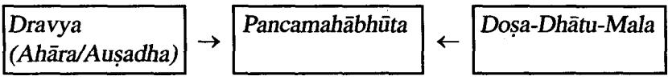

अनेन निदर्शनिन .......................युक्तिर्विशेषमर्थं चाभिसमीक्ष्य स्ववीर्यगुणयुक्तानि द्रव्याणि कार्मुकाणि भवन्ति । तानि यदा कुर्वन्ति स कालः, यत् कुर्वन्ति तत् कर्म, येन कुर्वन्ति तद्वीर्यं, यत्रकूर्वन्ति तदधिकरणं, यथा कुर्वन्ति स उपाय: यन्निष्पादयन्ति तत् फलमिति ।। सु. सू. ४१/५

न तु केवलं गुणप्रभावादेव द्रव्याणि कार्मुकाणि भवन्ति; द्रव्याणि हि द्रव्यप्रभावाद्वणप्रभावाद्वव्यगुणप्रभावाच्च तस्मिस्तस्मिन काले तत्तदधिकरणमासाद्य तां तां च युक्तिमर्थं च तं तमन्नि प्रेत्य यत् कुर्वन्ति तत् कर्म, येन कुर्वन्ति तद्वीर्यं, यत्र कुर्वन्ति तदधिकरणं, यदा कुर्वन्ति स कालः, यथा कुर्वन्ति स उपायः, यत् साधयन्ति तत् फलम् ।। च. स. सु. २६/१३

Caraka opines that there are three means by which the Karma is produced. Those are-

- Dravya Prabhāva- Because of its strength dravya (i) gives rise to a Karma.
- Guna Prabhāva-- The Karma produced by the con-(ii) stituents residing in a Dravya.
- (iii) Dravya Guna Prabhava- It is the combined contribution of both Dravya and Gunas to produce any Karma.

Both Caraka and Susruta have given different terms and modalities involved in bringing out a Karma.

- (i) Yat Kurvanti Tat Karma- One which is performing an action (Kriya).
- Yen Kurvanti Tadvirvam- The potent factor respon-(ii) sible for an action.
- (iii) Yatra Kurvanti Tadadhikaranam- Where the action is performed that is Adhikarana.

#### Karma

- (iv) Yadā Kurvanti Sa Kāla– When the action is done that is Kāla.
- Yatha Kurvanti Sa Upāyaha- How the Karma is per-(v) formed that is Upaya.
- (vi) Yat Sadhayanti (Nispadayanti) Tat Phalam- The out come after the action is Phala.

यत् कुर्वन्तीत्यादावुदाहरणं यथा- शिरोविरेचन द्रव्याणि यच्छिरोविरेचंन कुर्वन्ति, तच्छिरोविरेचनं कर्म: येनोष्णत्वादिकारणेन शिरोविरेचनं कर्वन्ति तद्वीर्थं, वीर्यं शक्ति: सा च द्रव्य गणस्य वाः यत्र शिरोविरेचनं कर्वन्ति तदयिकरणं शिरः नान्यत्राधिकरणे शिरोविरेचन द्रव्यं प्रभवतीत्यर्थः: यदेति वसन्तादौ शिरोगौरवादियुक्ते च काले. रातेनाकाले शीते शिरोविरेचनं स्तब्धत्वान्न कार्मुकं किन्तु सकाल रावः यथारान प्रकारेण प्रधमावपीडनादिना तथा ''प्रसारिताङ्गमूत्तानं शयने संस्तरासते । ईषत्पत्रल-म्बशिरसं संवेश्य चाव्रतेक्षणम्' ' – इत्यादिना विधिना कुर्वन्ति, स उपायः ; यत् साधयन्ति शिरोगौरव शुलाद्यमपरमं, तत फलम; फलं उद्देश्यम् । कर्म कार्य साधनम्, उद्देश्यं फलं साध्यं, यथा- या गति धर्म: कार्यतया कर्म, तज्जन्यस्त स्वर्गादिरुद्देश्य: फलम: रावं वमनादिष्वपि कर्माधिकरणाद्युर्न्तयम् ।। च. सू. २६/१३

Cakrapani has given very clear explanation regarding different modalities with an example.

- Karma- Dravyas used to perform Śirovirecana Karma (i) should produce Śirovirecana Karma.
- Vīrya- The factor responsible for Śirovirecana Karma (ii) is Virya of it.
- (iii) Adhikarana– In Sirovirecana Karma, Adhikarana is Siras.
- (iv) Kāla- Vasantādi Ritus when the person having Širogauravata.
- Upāva– Considering the procedure like Pradhamana (v) or Avapidana Nasya administering the Ausadha in proper position.
- (vi) Phala-After completion of the procedure the desired result, if patient is relieved from heaviness of head then it is called Phala.

345

24 Dra.Vij.

Further he opines that same method may be used to assess Vamanādi Karma.

#### Modern Concept of Drug Action (Pharmacodynamics)

Pharmakon=drug, dynamics=action or activity is the study of the biochemical & physiological effects of drugs & their mode of action. These effects are achieved by some underlying biochemical and/or physiologic interaction between the drug and a functionally important tissue component (usually a receptor) in the body. Thus it is important to recognise the following properties of drugs :

#### General properties of Drugs

- 1. Drugs do not confer any new functions on a tissue or organ in the body, they only modify existing functions. Therefore the effects of drugs can be recognised only by alterations of a known physiologic function or process.
Eg: Administration of a cathartic (an agent having purgative action) can potentiate the rate of evacuation of the large intestine.

- 2. Drugs in general exert multiple actions rather than a single effect. Consequently drugs may in varving degrees produce undersirable responses because of their potential to modify more than one function of the body.
- 3. Drug action results from a physico chemical interaction between the drug and a functionally important molecule in the body.

#### Action-Effect Sequence

'Drug action' and 'Drug effect' are often loosely used interchangeable but are not synonymous.

Drug action– It is the initial combination of the drug with its receptor resulting in a conformational change in the receptor.

Drug effect- It is the ultimate change in biological function brought about as a consequence of drug action.

#### Karma

The type of response produced by the drug is called its effect, but how & where it is produced is called its action. In other words, drug action always preceds the drug effect.

For eg. Miosis (Contraction of pupil) produced by pilocarpine is its effect, however it results due to parasympathetic stimulation of the circular muscles of iris, hence this is its action.

| Drug | Action                                                  | Effect |
|------|---------------------------------------------------------|--------|
|      | Pilocarpine → > Parasympathetic stimulation >> > Miosis |        |
|      | l of circular muscles of iris                           |        |

#### Principles of Drug action

Drugs (except those gene based) do not impart new functions to any system, organ or cell; they only after the pace of ongoing activity. The basic types of drug action can be broadly classed as :

1. Stimulation

2. Depression

3. Irritation

4. Replacement

5. Cytotoxic action

1. Stimulation- It is selective enhancement of the level of activity of specialized cells. Eg : Adrenaline stimulates Heart.

2. Depression- It is selective diminution of activity of specialized cells.

Eg : Quinidine depress heart.

3. Irritation- This refers to non selective, often noxious (harmful) effect & is particularly applied to less specialized cells (epithelium, connective tissue). Mild irritation may stimulate associated function. Eg : Bitters increase salivary & gastric secretion.

4. Replacement- This refers to the use of natural metabolites, hormones or their congeners (same kind) in deficiency states.

Eg : Insulin in Diabetes mellitus. Iron in Anemia

5. Cytotoxic Action- Selective cytotoxic action for inavading parasites/cancer cells, killing them without significantly affecting the host cells.

Eg : Pencillin.

#### Site of Drug Action

Two drugs may exhibit the same effect but their site of action may differ. For example the site of action of pilocarpine, for producing miosis, is the circular muscle of iris. However, morphine also produce miosis but its site of action is stimulation of 3rd cranial nerve nucleus.

| Drug             |   | Site & Action                            | Effect |
|------------------|---|------------------------------------------|--------|
| Pilocarpine -- > |   | [ Stimulate circular muscle]<br>of iris  | Miosis |
| Morphine         | ↑ | [ Stimulate 3rd cranial<br>nerve nucleus | Miosis |

#### The drugs may act at

1. Extracellular

- 2. Cellular
- 3. Intracellular site

1. Extracellular Site of Action- Action is outside the cell.

Eg : Antacids neutralise gastric acidity.

2. Cellular Site of Action- Action is on the cell membrane.

Eg : Inhibition of membrane bound AT pase by cardiac glycosides.

3. Intracellular Site of Action- Action is produced within the cell.

Eg : Sulfa drugs act by interfering the synthesis of folic acid (which is an intracellular component).

#### Mechanisms of Drug Action

Barring a handful of drugs whose actions can be explained on the basis of their simple physical or Chemical properties, Karma

majority of drugs act in complex manner-all elements of which are seldom known. The fundamental mechanisms of drug action can be distinguished into four categories.

1. Physical action

2. Chemical action

3. Through enzymes

4. Through receptors

1. Physical action- A physical property of the drug is responsible for its action.

Eg : Mass of drug - Bulk laxatives.

Osmotic activity- Magnesium sulfate retains fluid inside lumen of intestine & thus increase fecal bulk.

2. Chemical Action- The drug reacts extracellularly according to simple chemical equation.

Eg : Antacids neutralize gastric HCl.

3. Through Enzymes- Almost all biological reactions are carried out under catalytic influence of enzymes; hence enzymes are a very important target of drug action. Drugs can either increase or decrease the rate of enzymatically mediated reactions.

(i) Stimulation-Drugs which stimulate the enzyme & there by influence the rate of reaction.

(ii) Inhibition- Inhibition of enzymes is a common mode of drug action. This may be non-specific or specific.

Non-specific Inhibition : Drugs which alter the structure of any enzyme with which they come in contact & inhibit.

Eg : Alcohol, Formaldehyde

Specific Inhibition : Drugs inhibit a particular enzyme without affecting others.

4. Through Receptors- Most drugs exert their effects, both beneficial & harmful, by interacting with receptors. Receptors are specialized target macromolecules present on the cell surface or intracellularly which binds with specific drugs and mediate their pharmacologic actions.

#### Dravyaguņa Vijñāna

Binding of a drug with its receptor results in the formation of the drug-receptor complex and leads to a biologic response Drug + Receptor => Drug-Receptor complex->Biologic effect. (DR complex)

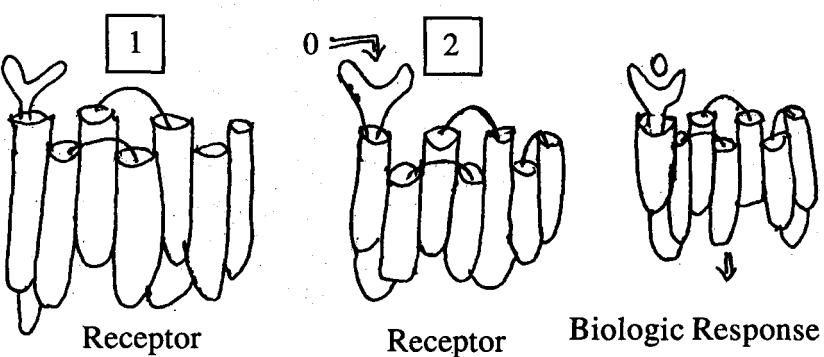

Figure : The recognition of a drug by a receptor triggers a biologic response.

Receptor is defined as a specific binding site with functional correlate (s). Receptors are situated on the surface or inside the effector cell & specific agonists combine with them to initiate the characteristic response. Ligand (Latin=ligare-to bind) It is a molecule which attaches selectively to particular receptors or sites. Here it can be called as Drug.

The overall effect is attributed to the following two factors :

(a) Affinity : Which means the capability of a drug to form the complex with its receptor (DR complex)

Eg : The key entering the key hole of the lock has got an affinity to its levers.

(b) Efficacy (Intrinsic Activity-IA) : Which means an ability of a drug to trigger the pharmacological response after making the DR complex.

Eg : If the same key after entering the key hole of the lock opens it too, it has got intrinsic activity also, otherwise only

On the basis of affinity & efficacy, the drugs can be broadly classified into

1. Agonist- It activates a receptor to produce an effect similar to that of the physiological signal molecule. It has both, high affinity & efficacy.

2. Inverse agonist (negative antagonists)- It activates a receptor to produce an effect in the opposite direction to that of the well recognised agonist. It has full affinity but intrinsic activity ranges between zero and -1.

3. Antagonist- It prevents the action of an agonist on a receptor or the subsequent response, but does not have any effect of its own. It has only affinity but no intrinsic activity.

4. Partial agonist- It activates a receptor to produce submaximal effect but antagonises the action of a full agonist.

These have full affinity to receptor but with low intrinsic activity (IA=O to 1) and hence are only partly effective, as an agonist.

| Type                                             | Affinity | Efficacy (IA)                          | Characteristic                                                        |
|--------------------------------------------------|----------|----------------------------------------|-----------------------------------------------------------------------|
| Agonists                                         | Maximum  | Maximum<br>IA=1                        | Activate receptors to<br>produce maximum<br>biologic response         |
| Inverse<br>agonists<br>(Negative<br>antagonists) | Maximum  | Submaximal<br>IA=O to -1               | Activate receptor to<br>Intrinsic activity produce opposite<br>effect |
| Antagonist<br>(Competitive)<br>antagonist)       | Maximum  | No intrinsic<br>activity IA=O          | Binds to receptor to<br>Prevent the binding<br>of an agonist.         |
| Partial<br>agonist                               | Maximum  | Low intrinsic<br>activity<br>IA=0 to 1 | Activates receptor but<br>antagonises the action<br>of a full agonist |

#### Receptor types

These receptors may be divided into 4 families.

- 1. Ligand-gated ion channels
- 2. G-protein-coupled receptors
- 3. Enzyme linked receptors
- 4. Intracellular receptors.

1. Ligand-gated ion channels- These receptors are localised on cell membrane and are coupled directly to an ion channel that are responsible for regulation of flow of ions across cell membranes. These channels open only when the receptor is occupied by an agonist. The subsequent flow of ions can elicit cellular response.

2. G-protein coupled receptors- A second family of receptors consists of G-protein coupled receptors. Comprised of a single peptide that has seven membrane spanning regions, these receptors linked to a G-protein (Gs) having 3 subunits, an o subunit that binds guanosine triphosphate (GTP) & a Br subunit. Binding of the appropriate ligand to the extracellular region of the receptor activates the 'G'protien so that GTP replaces guanosine diphosphate (GDP) on the α-subunit. Dissociation of G-protein occurs & both the a-GTP subunit & Br unit subsequently interact with other cellular effectors. These effectors are known as second messengers, because they are responsible for further actions within the cell.

#### The cellular effectors are two :

(i) Activation of adenyl cyclase- Results in the production of cyclic-adenosine monophosphate (CAMP).

(ii) Activation of phospholipase C- Results in generation of inositol- 1,4,5- triphosphate (IP) & diacylglycerol.

3. Enzyme-linked receptors- A third major family of receptors consists of those that have a cytosolic enzyme activity as an integral part of their structure/function. Binding of a liegend to an extracellular domain activates or inhibits its cytosolic enzyme activity.

4. Intracellular receptors- The receptor is entirely intracellular & therefore the ligand (drug) must diffuse into the cell to interact with receptor.

Binding of the ligand with its receptor leads to activation. The activated ligand-receptor complex migrates to the nucleus, where it binds to specific DNA sequences. resulting in regulation of gene expression.

# References

- Leda M. Mckenry, Evelyn Salerno, "Pharmacology in 1. Nursing,' 20th edn, Mosby, U.S.A. 1998 : 30.
- K. D. Tripathi, ''Essentials of medical pharmacology 5th 2. edn, Jaypee Brothers, New Delhi, 2003 : 33.67.
- Richard D. Howland, Mary, J. Mycek, "Lippincott's Il-3. lustrated reviews : Pharmacology," 3rd edn, Indian edition. Lippincott Williams & Wilkins. Philadelphia, 2006 : 25.
- H.L. Sharma. K.K. Sharma. "General pharmacology-Ba-4. sic concepts'', 1st edition, Paras publishing, Hyderabad, 1999 : 65.

#### Karma Vargīkaraņa

There is no direct reference to classification of Karma. We find that drug exert their action either on Dosa. Dhātu, Mala or Srotas. Accordingly, Karma can be classified based on the effect.

#### 1. Karma in relation to Dosa

- (i) Vātakara (v)
- (ii) Pittakara (vi)
- (iii) Kaphakara (vii) Tridosahara
- (iv) Vātahara

#### 2. Karma in relation to Dhātu

- Rasa Vrddhikara (i) (ii)
- Rakta Vrddhikara (iv) Rakta ksayakara (iii)
- Pittahara
- Kaphahara
- - Rasaksayakara

#### Dravyaguna Vijñāna

- Māmsa Vrddhikara (vi) Māmsa Ksavakara (v)
- (vii) Mēdokara (viii) Medohara
- (ix) Asthivrddhikara (x)
	- (xi) Majjavrddhikara (xii) Majjahara
	- (xiv) Śukrahara (xiii) Śukravrddhikara

# 3. Karma in relation to Mala

- Purīṣa Vṛddhikara (i) (ii) Purīsahara
	- Mūtravrddhikara (iv) (iii)
	- (v) Swedakara (vi) Swedahara

# 4. Karma in relation to Srotas

(a) Prānavaha Srotas : Karma related are, Kāsahara, Śwāsahara, Hrdya, Kanthya etc.

(b) Udakavaha : Trsnanigrahana, Hikkanigrahana, Trptighna.

(c) Annavaha : Dīpana, Pācana, Rēcana, Vamanōpaga, Chardinigrahana, Krmighna, Anulomana, Trptighna, etc.

(d) Rasavaha Srotas : Balva. Jīvanīva. Stanvajanana. Stanyaśodhana etc.

(e) Raktavaha Srotas : Raktasodhaka, Śonitasthāpana, Varnya etc.

(f) Māmsavaha Srotas : Brahmana etc.

(g) Mēdovaha Srotas : Mēdohara, Lēkhana etc.

(h) Asthivaha Srotas : Sandhānīya

(i) Maijavaha Srotas : Majjāvardhaka

(j) Śukrovaha Srotas : Śukrala, Vrsya, Śukraśodhaka, Śukrasthambhaka, Śukraśoṣaka

(k) Ārtavavaha : Ārtavajanaka

(1) Purīsavaha Srotas : Purīsasangrahanīya, Purīsavirajanīya, Bhēdana, Rēcana etc.

(m) Mūtravaha Srotas : Mūtrala, Mūtrasangrahanīya, Mūtravirajanīya, Mūtravirēcanīya.

#### Karma

(n) Swedavaha Srotas : Swedakara.

#### 5. Effect on diseases

| Krmighna |
|----------|
|          |

- (ii) Atisāraghna (viii) Kāsahara
- (iii) Raktapittaghna
- Pramehaghna Śūlapraśamana (iv) (x)
- Kusthaghna (v) (xi) Angamarda Praśamana

(ix)

Śwāsahara

- (vi) Aršoghna (xii)
#### Dravya Kārmukata Vividha Parīksana

#### Avurvedic view

1. Acārya Caraka while applving the Dasavidha Parīksa to Cikitsa says that Bhesaja form the Karana. He further elaborates the assessment parameter for Bhesaja.

करणं पुनर्भेषजम् । भेषजं नाम तद्यद्रपकरणायोपकल्पते भिषजो धातु-साम्याभिनिवृत्तौ प्रयतमानस्य विशेषतश्चोपायान्तेभ्यः । ........................................................................................................................ तद्वमनादिष् योगमुपैति । तस्यायीयं परीक्षा-इदमेवंप्रकृत्यैवंगुणमेवंप्रभावमस्मिन् देशे जातमस्मिन्नुतवैवं गृहीतमेवं निहितमेवमुपस्कृतमनया च मात्रया युक्तमस्मिन् व्याधावेवंधिधस्य पुरुषस्यैवातावन्तं दोषमपकर्षत्युपश्रमयति वा यदन्यदपि चैवंविधं भेषजं भवेतञ्जानेन विशेषण युक्तमिति ।। च. वि. ८/८७

- इदं राव प्रकृति- Possess specific characteristics. 1.
- रावं गुण- Possess respective properties. 2.
- रावं प्रभाव- Possess specific actions. 3.
- अस्मिन् देशे जात:- Grown in a specific region. 4.
- 5. अस्मिन् ऋत्- During a specific season.
- रावं गृहीतमेवं- Collected at right & specific time. 6.
- रावं निहितं– Preserved through right mode. 7.
- रावं उपस्कृतमनया- Processed in a specific method. 8.
- 9. च मात्रया- To be administered in right dose.

- यक्तमस्मिन व्याथावेवं विधस्य परुषस्यैवतावन्तं दोषमपकर्षत्यप्रशामयति वा– If 10. the above are followed, then that Bhesaia will have a specific & measured effect on Dosa either Upasamana or Apakarsana.
2. According to Ayurveda, there are three basic mean to acquire knowledge, which can be aptly adopted to assess the drug action.

# द्विविधाः त खल परीक्षा ज्ञानवतां-प्रत्यक्षमः अनमानं च । रातब्धि द्वयमंपदेशश्च परीक्षा स्यात् । रावमेषा द्विविधा परीक्षा, त्रिविधा वा सहोपदेशेन । च. वि. ८/८३

Pratyaksa, Anumāna & Upadeśa (Āptōadeśa) are the means to acquire knowledge.

Accordingly, the Dravya Karmukata can be assessed or examined through these. We understand a Dravya through its Rasadi Padartha, hence assessment of these, in turn will help in examination of Dravya Kārmukata.

(a) Pratvaksa- Rasa can be assessed through Rasanēndriva.

Certain Guna can also be assessed through Jnanendriva. like Snighda, Rūksa, Picchila, Viśada Mrdu etc.

Virya can also be sometimes examined through Sparśanēndriya.

(b) Anumana- Vipāka is assessed only after inference, i.e. by observing the actions of a dravya on the body or after observing the drug effect.

In Ayurveda many a times, drug action is assessed after observing its effect only. Hence Anumana plays an important role.

(c) Aptopadesa- Knowledge obtained from classical literature helps to examine the drug action.

#### Modern View

Drug Evaluation- The crude drugs can be identified on the basis of their following studies.

(i) Morphological (Organoleptic)

#### Karma

(ii) Microscopic

(iii) Chemical

(iv) Physical

(v) Biological

(i) Morphological- It refers to evaluation of drugs by colour, odour, taste, size, shape and special features like touch, texture etc.

(ii) Microscopic- It allows more detailed examination of drug and can be used to identify drugs by their histological characters.

(iii) Chemical- It comprises of different chemical tests and chemical assays. The isolation, purification & identification of active constituents are chemical method of evaluation.

(iv) Physical- Physical standards such as moisture content, viscosity, ash value etc. are determined which help in evaluation.

(v) Biological- When drug is evaluated by means of its affect on living organisms like bacteria, fungus or animal tissue or entire animal, it is known as biological evaluation or bioassay. This is otherwise known as Animal experimentation.

Animal experimentation or Experimental pharmacology aims to study the action of existing drugs or new drugs. It is done in two main stages :

(i) Preclinical Experimental Pharmacology- Which involves identification of novel chemical lead structures & testing on animals & animal tissues or organs for their biological actions.

(ii) Clinical Pharmacology- Where testing of drugs is done on human volunteers & patients for assessing the pharmacokinetics, safety & efficacy in humans.

#### Note :

Study carried in an artifical environment like test Invitro-> tube or culture media.

In vivo-> Study carried in the living body or in animals.

#### Dravyaguna Vijñāna

# Common Experimental Animals

Common experimental animals used are listed below. Tis-· sues, organs, or the entire animal is used for pharmacological investigations of drugs.

| SL.<br>No. | Animal                                      | Weight   | Advantages                                                                                                              | Commonly<br>used to study                                                             |
|------------|---------------------------------------------|----------|-------------------------------------------------------------------------------------------------------------------------|---------------------------------------------------------------------------------------|
| 1.         | Guinea Pig  600-800g                        |          | -Easy to breed &<br>maintain.<br>-Sensitive to<br>histamine.                                                            | -Local anaesthetics<br>-Bronchodilators<br>-Amoebiasis<br>-Cholera<br>-Antispasmodics |
| 2.         | Albino Rat<br>(Wistar<br>Rat)               | 200-300g | -Resembles man<br>in several organ<br>function & nutrition<br>-Sensitive to most<br>drugs.<br>-Lack vomiting<br>centre. | -Hepatoprotective<br>-Hypoglycaemic<br>-Antifertility                                 |
| 3.         | Albino<br>mouse<br>(Swiss<br>white<br>mice) | 25-30g   | -Easy to breed &<br>maintain.<br>-Smallest lab animals<br>-Senstive to most<br>drugs.                                   | -Toxicity study<br>-Analgesics<br>-CNS active drugs<br>-Chemotherapeutics             |
| 4.         | Rabbit                                      | 2-3 kg   | -Resistant to action<br>of Atropine.                                                                                    | -Pyrogen testing                                                                      |
| న్.        | Frog                                        | 150-200g | -Inexpensive<br>-Easily available                                                                                       | -Local anaesthetics<br>(Nerve block)                                                  |
| 6.         | Cats+Dogs 5-8 kg                            |          | Easy availability                                                                                                       | -Blood pressure<br>-Gastric secretory<br>function                                     |
| 7.         | Monkeys                                     |          | -Sub human<br>mammals closet<br>to man                                                                                  | -Toxicity study                                                                       |

#### Karma

# Experimental Models for Select Activities

#### References

- 1. S.K. Kulkarni, "Hand book of Experimental Pharmacology'' 3rd edn, Vallabh Prakāšan, Delhi 1999 : 12.
- S.K. Gupta (Editor), "Drug screening methods," 1st edn. 2. Jaypee Brothers, New Delhi, 2004.

Advances in drug discovery has led to new screening methods, utilizing various techniques spanning in vitro, in vivo & clinical system. The following table gives a glimpse of few animal experimental models for some common pharmacological activities.

| SI.<br>No | Activity          | Pharmacological   Experimental Models            | Animal              |
|-----------|-------------------|--------------------------------------------------|---------------------|
| 1.        | Toxicity study    | In vivo                                          |                     |
|           | (LD30)            | Procaine hydrochloride<br>induced acute toxicity | Mice                |
| 2.        | Antiucler         | Invivo                                           |                     |
|           |                   | -Pylorus ligation                                | Rat (wistar)        |
|           |                   | -Stress ulcer models                             | Albino Rat          |
|           |                   | -Histamine induced                               | Male guinea<br>pigs |
| 3.        | Cardiotonic       | -Coronary ligation method                        | Rat                 |
|           |                   | -Chronic Rapid Pacing                            | Dog                 |
|           |                   | -Volume & Pressure<br>over-load                  | Rabbit              |
| 4.        | Antihyperetensive | In Vitro                                         |                     |
|           |                   | -Tail cuff method                                | Rat                 |
|           |                   | -Chronic Renal<br>Hypertension                   | Dog                 |
|           |                   | -Renin Inhibition                                | Monkey              |
|           |                   | -Fructose induced<br>hypertension                | Wistar Rat          |

# Dravyaguņa Vijñāna

| ડ. | Antidepressant | In Vivo                                                | Animal                 |
|----|----------------|--------------------------------------------------------|------------------------|
|    |                | -Water wheel model                                     | Mice                   |
|    |                | -Learned helplessness test                             | Wistar Rat             |
|    |                | -Isolation induced<br>hyperactivity                    | Wistar Rat             |
| 6. | Antiepileptics | In Vitro                                               |                        |
|    |                | -Electrical recording                                  | Isolated Brain<br>Cell |
|    |                | In Vivo                                                |                        |
|    |                | -Electrically induced<br>Siezures                      | Mice/Rat               |
|    |                | Chemically induced                                     | Mice/Rat               |
|    |                | Siezures induced by focal<br>lesions                   | Monkey                 |
| 7. | Learning &     | In Vitro                                               |                        |
|    | Memory         | -Study of field excitatory<br>Post Synaptic potentials | Wistar Rat             |
|    |                | In Vivo                                                |                        |
|    |                | -Passive avoidance                                     | Rat/mice               |
|    |                | -Active avoidance                                      | Rat/mice               |
|    |                | -Morris water maze                                     | Rat/mice               |
| 8. | Antiobesity    | In Vivo                                                |                        |
|    |                | -Diet induced                                          | Female Rat             |
|    |                | -Hypothalamic obesity                                  | Female<br>sprague Rat  |
| 9. | Analgesic      | In Vivo                                                |                        |
|    |                | -Haffner's tail clip method                            | Male mice              |
|    |                | -Hot plate method                                      | Mice                   |
|    |                | -Tool warm water                                       | Female                 |
|    |                | immersion method                                       | Wistar Rat             |
|    |                | -Writhing test                                         | Mice                   |

| 10. | Anti-         | In Vitro                                  |                       |
|-----|---------------|-------------------------------------------|-----------------------|
|     | inflammatory  | -Mast cell degranulation                  | Peritonial            |
|     |               |                                           | Mast Cell             |
|     |               | In Vivo                                   |                       |
|     |               | -Carrageenan-induced<br>paw edema Model   | Rat/Mice              |
|     |               | -UV-B- induced erythema                   | Guniea pigs           |
|     |               | -Papaya latex induced<br>arthritis        | Rat                   |
| 11. | Anti-diabetic | In Vivo                                   |                       |
|     |               | -Alloxan induced<br>Diabetes              | Rabbit/<br>Wistar Rat |
|     |               | -Dexamethasone induced                    | Rat                   |
|     |               | Diabetes                                  |                       |
|     |               | -Surgically induced<br>Diabetes           | Cat/Dog               |
| 12. | Antiasthmatic | In Vitro                                  |                       |
|     |               | -Isolated lung                            | Guniea pig            |
|     |               | -Isolated perfused lung                   | Sprague Rat           |
|     |               | In Vivo                                   |                       |
|     |               | -Histamine induced<br>bronchoconstriction | Guinea pig            |
|     |               | Airway inflammation                       | Mice                  |

निम्नांकित कर्मवाचक पद उदाहरण संहित विसृत विवेचन-

# Dīpana

Nirukti

दीपन-क्ली (दीपयति) वन्हिमिति । दीप + णिच् + ल्यु ।) श. क. द्रु.-Vol.II दीपनी-स्त्री (दीप्यति)जठरवह्निरनया । दीप + णिच् + न्युद् । स्न्याँ डीप्) श. क.

25 Dra.Vij.

That which stimulates or kindles the digestive fire is Dipana. Paribhāsa

पचेन्नामं वन्हिकृच्च दीपनं तद्यथा मिशि । शशि । शा. शा. प्र. ४/१ दीपनीयो वन्हेरुब्द्वीपनाय हितः । गणनाथ सेन् on च. सू. -४/८ दीपनमन्तरग्ने संधुक्षणं, तस्मै हितं दीपनीयम् । योगरत्नाकर पचेन्नाम वन्हिकृद्यद्दीपनं तद्यथा मिसि: । भा.प्र. मिश्रकारकरण-२१२ यदग्रिकृत् पचेन्नामं दीपनं तद्यथा घृतम् ।। कै. नि. मिश्रक वर्ग-१९० तन्त्रान्तरेच दीपनपाचनयोर्लक्षणमुक्तं म् । यथा- यदास्रिकृत्पचेन्नामं पाचनं सद्विपर्यस्तं यथा वक्ष्यामि वक्ष्यामि । लक्षणम् । । सर्वाङ्ग सून्दरि on अ. हृ. सू. १४/७

That which kindles the Agni (digestive fire) but does not digest Ama is called Dīpana.

Śārngadhara and Bhāvamiśra give the example of Miśi (Śatapuspa) while Kaiyyadiva gives Ghrta.

Arunadatta gives a cross reference to the definition of Dīpana.

#### Paryãya

दीपनं दीपनीयं च वह्निकृद् वह्निवर्द्धनम् । कै. नि. मिश्रक वर्ग-१९० Synonyms of Dīpana are : Dīpana, Dīpanīya, Vahnikrt and Vahnivardhana.

Characteristics of Dīpanīva Dravya

दीपनमग्निगुणभूयिष्ठं तत्समानत्त्वात् । सु. सू. ४१/६ उष्णतीक्ष्णसुक्ष्मरूक्षरबरलघुविशदं रूपबहुलमीषदृल्लवण कटुकरसप्रायं विशेषतः......................................। सु. सू. ४१/३ कटुकाम्ल.....लवणान् रसान् तीक्ष्णोष्णलघुन् गुणार्श्चाश्रितमिति पित्तलान् रसान् गुणांश्र्य दीपनीयम् । तदाग्रेयम् । र. वै. सू. अ-४/१० पुथिव्यनिलबाहल्याब्दीपनं

#### Karma

Nāgarjuna says that Dīpana Dravyas are Prthivi & Agni Mahābhūta predominent, while Susruta says that Dīpana is dominent of Agni Mahabhūta & hence will resemble the characteristics of Āgneva dravva.

Thus the characterisits of Dīpana Dravya can be summarised as :

Rasa - Amla, Lavana, Katu

Guna - Tīksna. Usna. Laghu. Sūksma. Khara. Viśada.

#### Examples :-

Miśi (Śatapuspa)- Anethum sowa

Ghrta

#### Dīpanīya Gana of Caraka

# पिप्पलीपिप्पलामूलचव्यचित्रक शृङ्गवेराम्लवेतसमरिचाजमोद-भल्लातकास्थि हिङ्गनिर्यास इति दशेमनि दीपनीयानि भवन्ति ।

च. स. ४/९

Caraka has mentioned 10 drugs in Dīpanīva Varga.

| (i) | Pippalī               | (ii) | Pippalī mūla    |
|-----|-----------------------|------|-----------------|
|     | (iii)  Cavya          |      | (iv)   Citraka  |
|     | (v)    Śrngavēra      |      | (vi)            |
|     | (vii)  Marica         |      | (viii)  Ajamoda |
|     | (ix)   Bhallātakāsthi | (x)  | Hinguniryāsa    |

वह्निकृत् वहिदीप्तिकृत् । ननु यद्वन्हिं प्रदीपयति तदायं कथं न पचेदित्या-शङ्कायामुच्यते, दीपन द्रव्यं तावन्तं वन्हिं प्रदीपयति यद् 'अन्ने भोक्तमिच्छामुत्यादयन्ति, न त्वामं पक्तुं क्षमम्, यथा-सुक्ष्मदीपाग्निः इह्योतं करोति न तु बृहत्स्थालीस्थान् तण्डुलान् ओदनं कर्तु क्षमः ।। भाष्य-भा. प्र. मिश्रक-२१२

There arises a doubt as to why a drug which can kindle digestive fire, is incapable of digesting Ama. The answer is, that a dīpana dravya kindles Agni to an extent that it only stimulates appetite and is hence incapable of digesting. Just like a small lamp imparts light but fails to cook rise in a vessel.

नन कथमेतद्वणयक्त मिशिर्नामग्री भवति तदविनाशकत्वेन कथमग्रेः प्रबोधः स्यात् ? । उच्यते-द्रव्याणां प्रभावी विचारणीय इति सुश्रुतः न हेतुभिर्विचार्यते । ं दीपिका-भाष्य on शा. प्र-४/१

Adhamalla, the commentator on Śārangadhara Samhita rises the same question and says that it is the innate chemical nature of the Dravya which helps only to ignite Agni.

#### Appetizers

These are drugs which stimulate appetite. Symptomatically, appetite can often be improved by varying the diet and by use of such simple preparations like lemon pickles, bitters such as bitter orange peel, cardamom & soups.

- · Alcohol in small quantities can augment the gastric secretion both reflexly by stimulation of taste buds and by a direct action.
- · Even insulin, on parental administration, augments gastric secretion by producing hypoglycemia.

Ref : Satoskar, a Pharmacology & Pharmacotheropeutics'' 18th edn, Popular Prakaśan, Mumbai, 2003, 561.

#### Pācana

#### Nirukti

पाचनं क्ली (पाच्यते ऽनेनेति । पच्चु + णिच्यु + करणे ल्युट् ।) श. क. द्र. ३ पाचनः पु (पाचयतीति । पच्च + णिच्यु + नन्दिग्रहीति । ल्युः ।) श. क. द्र. ३ पाचनी, स्त्री (पाच्यते ) भुक्तद्रव्याद्रदिकं यथा। स्त्रियां पच + णिच. ल्यट पाचन (न)—पाचयति कर्तरिल्यु पाच्यते ऽनेन करणे ल्युट वा । वाचस्पत्य ५

That which is digestive is Pācana.

# Paribhāsā

पचत्यामं न वन्हिं च च कुर्याद्यताद्धितान्द्धि पाचनम् । नागकेशरवत् ............................................................... ! शा. प्र. ४/१२ यन्द्रव्यमामं पचति वहिं न कुर्यात् तत् पाचनं ज्ञेयम् । अत्रापि बोन्द्वव्यः द्रव्यप्रभावो । दीपिका- on शा. प्र. ४/१-२ यत् आमं पच्चति वहिं वहिं न कुर्यात् न कुर्यात् तत्पाचनम् । गूडार्थदीपिका on शा. त्र. ४/१-२

पचन्तमग्रिंग प्रतिपक्ष क्षपर्णन बलदानेन च यत्-पाचयति तत् पाचनं, त्वच्यनं, त्वच्च वायवाग्रिगुण भूविष्ठम् । चक्र- च. सू-२२२/८

पाचयतीति पाचनम् । पचतोऽग्रेः पक्तं शक्तिमधिकां यदत्पादयति

तद्रव्यं क्रिया वा पाचनमुच्यते । यथा, लङ्कनं मुस्तादि वा । सर्वाङ्ग सुन्दरी-अ.हृ.सू. १४/६-७

अग्नेस्तु र. बै. भाष्य- पृ. १८७

That Dravya which digests Ama but does not stimulate Agni is Pācana.

Cakrapāni comments that which strengthens Agni and thus digests Ama is Pācana. This is Vāyu & Agni bhūta predominent.

Nagarjuna is of the opinion that Pacana dravya are Agni bhūta dominant.

Arunadatta says that a dravya or kriva which strengthens the Agni and thus digests Ama is Pacana.

For example : Kriya→ Langhana Dravya-> Musta

पाचनानीति-आहारानु पचन्तं जाठरमग्निं सन्धुक्षयन्ति तदबलं वर्धयन्ति च । यानि पाचयन्ति तानि पाचनानि वाय्वग्रिगुणबद्धलानि सैन्धवमादीनि द्रव्याणि । लौकिकोऽयं च वहिरपि पाचन: । गङ्गाधर on च.सू. २२/१८

Note :

- · Both Pacana & Dipana are considered to be types of Samana.
समीकरोति विषमान् शमनं तच्च सप्तधा ।

पाचनं दीपनं दीपनं श्रृतृङ्ख्यायामात्त्वमारूताः ।। अ. ह. सू. १४/६-७

- · Caraka considered Pacana as a type of Langhana.
पिपासामारुतातपैः । चतुष्प्रकाराः संशुद्धिः व्यायामश्रेति पाचनान्युपवासश्र लङ्घनम् ।। च. सू. २२/१८ Asṭānga Hrdaya

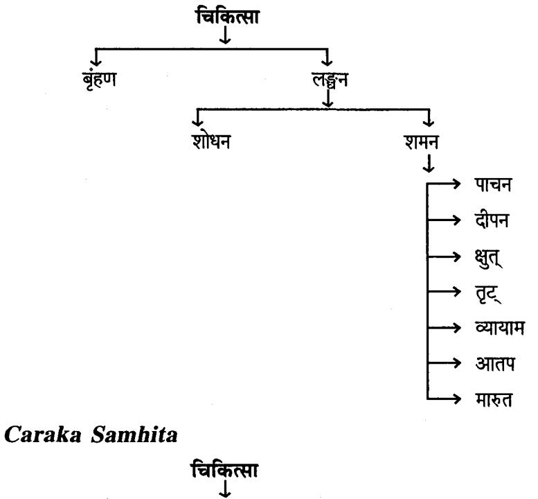

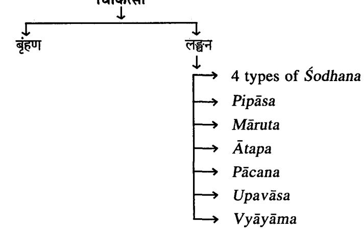

#### Karma

# Dīpana Pācana

चित्रो दीपनपाचन: । शा. प्र. ४/१

That which acts both as a Dīpana & Pācana is called Dīpana Pācana.

Eg : Citraka

# Understanding Dīpana-Pācana Karma

A review of gastrointestinal physiology will help to understand these Karma.

Gastric secretion :

The stomach mucosa has two important types of tubular glands.

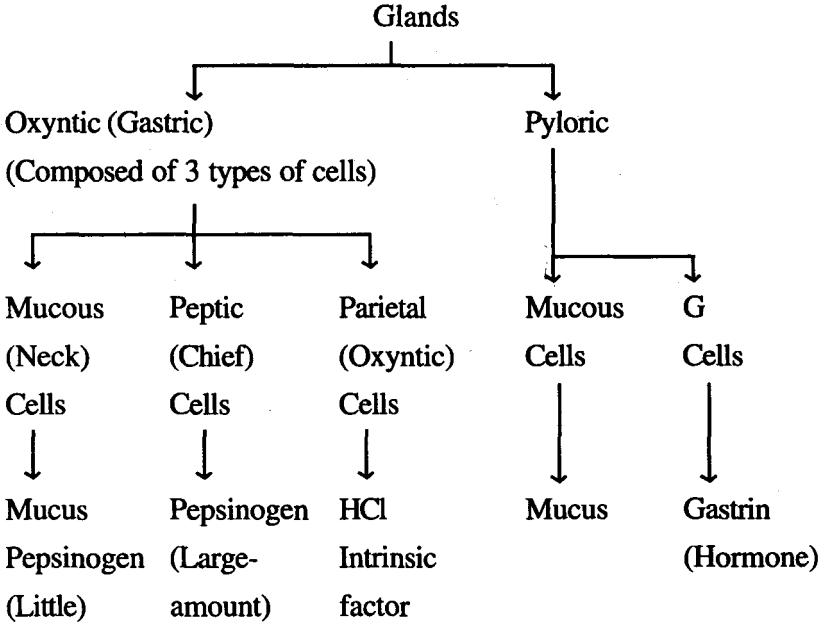

| SI.<br>No. | Content             | Secreted by                           | Function                                                                                                     |
|------------|---------------------|---------------------------------------|--------------------------------------------------------------------------------------------------------------|
| 1.         | HCl                 | Parietal Cells<br>of Oxyntic<br>gland | Activates pepsinogen to<br>pepsin<br>Bacteriolytic action<br>· Provides acid medium for<br>action of enzymes |
| 2.         | Pepsinogen          | Peptic cells of<br>Oxyntic gland      | Pepsin (activated pepsino<br>gen) helps in protein<br>digestion.                                             |
| 3.         | Mucus               | Pyloric &<br>Oxyntic gland            | Mucus cells of  • Protection of stomach wall                                                                 |
| 4.         | İntrinsic<br>factor | Oxyntic Cells                         | Parietal cells of . Necessary for Vitamin B12<br>absorption                                                  |
| 5.         | Gastric Lipase      |                                       | • Helps in lipid digestion                                                                                   |

Gastric Secretion & Function

Ref : K. Sembulingam & Prema Sembulingum, "Essential of Medical Physiology,'' 2nd Edn, Jaypee Brothers, New Delhi 2001, 167-168.

#### Regulation of Gastric Secretion

Gastric secretion is mainly controlled by following three regulators.

| SI.<br>No. | Regulators               | Stimulates                                                       | Effect                                           |
|------------|--------------------------|------------------------------------------------------------------|--------------------------------------------------|
| 1.         | Acetylcholine<br>(Vagus) | • Neck cells<br>• Peptic cells<br>· Parietal cells<br>.  G Cells | -> Mucus<br>-> Pepsinogen<br>→ HCI<br>-> Gastrin |
| 2.         | Gastrin (Hormone)        | · Stimulates histamine<br>production                             | → HCl                                            |
| 3.         | Histamine                | · Stimulates parietal<br>cells                                   | > HCl                                            |

# Activation of Pepsinogen

Inactive pepsinogen is activated by HCl into Pepsin. Pepsin has proteolytic activity (digests protein). It is inactivated at pH2. Hence HCl is important for activation of Pepsinogen & there by in protein digestion.

### Pancreatic Secretion

| Constituents & their function : |  |  |  |  |  |
|---------------------------------|--|--|--|--|--|
|---------------------------------|--|--|--|--|--|

| SI.<br>No. | Content                   | Secreted bv      | Function                                |
|------------|---------------------------|------------------|-----------------------------------------|
| I          | Enzymes                   | Pancreatic acini |                                         |
| 1.         | Trypsin                   |                  | Protein digestion                       |
| 2.         | Chymotrypsin              |                  | Protein digestion                       |
| 3.         | Carboxypoly-<br>peptidase |                  | Protein digestion                       |
| 4.         | Pancreatic<br>amylase     |                  | Carbohydrate digestion                  |
| 5.         | Pancreatic<br>lipase      |                  | Fat digestion                           |
| 6.         | Cholesterol<br>esterase   |                  | Fat digestion                           |
| 7.         | Phospholipase             |                  | Fat digestion                           |
| II.        | Sodium bicar-<br>bonate   | Ductules         | Neutralize HCl<br>emptied into duodenum |
| III.       | Water                     | Ductules         |                                         |

#### Note :

Proteolytic enzymes when synthesized in pancreatic cells are in inactive forms as trypsinogen, chymotrypsinogen & procarboxy polypeptidase which are activated by enterokinase enzyme secreted by intestinal mucosa.

Inactivated

| Proteolytic enzymes | Enterokinase   | Active Proteolytic  |
|---------------------|----------------|---------------------|
| (Pancreas)          | (in intestine) | enzymes (Intestine) |

#### Regulation of Pancreatic Secretion

| SI.<br>No. | Regulator                                                                       | Stimulates                  | Effect                                                  |
|------------|---------------------------------------------------------------------------------|-----------------------------|---------------------------------------------------------|
| 1.         | Acetyl choline                                                                  | Acinar cells of<br>Pancreas | Produce enzymes                                         |
| 2.         | Cholecystokin in<br>(Hormone secreted<br>by duodenal & upper<br>Jejunal mucosa) | Acinar cells of<br>Pancreas | Produce enzymes                                         |
| 3.         | Secretin (Hormone)<br>(Secreted by duoden-<br>al & Jejunal mucosa)              | Ductol cells of<br>Pancreas | Produce large<br>amount of Sodium<br>Carbonate solution |

# Secretion of Bile by Liver

#### Constituents & Functions :

| SI.<br>No. | Content                  | Functions                    |
|------------|--------------------------|------------------------------|
| 1.         | Water                    |                              |
| 2.         | Bile Salts               | Emulsify fat, fat absorption |
| 3.         | Bilirubin (bile pigment) | Broken down to urobilinogen  |
|            |                          | gives faeces brown colour    |
| 4.         | Cholesterol              |                              |
| 5.         | Fatty acids              |                              |
| 6.         | Bicarbonate              | Neutralise the acidic chyme  |

#### Note :

.

- Part of bile secretion is stimulated by 'Secretin' .
- Gall bladder emptying is controlled by ''Cholecystoki-. nin''

#### Karma

# Small Intestinal Secretion :

Secretion from Small intestine is called Succus entericus. Constituents & Functions :

| No. | Content                                                      | Functions                                  |
|-----|--------------------------------------------------------------|--------------------------------------------|
| 1.  | Digestive enzymes<br>· Proteolytic-peptidases<br>dipeptidase | Splits peptidases to aminoacids            |
|     | · Amylolytic-sucrase,<br>maltase, lactase                    | Splits disacharidas into<br>monosacharides |
|     | · Lipolytic-lipase<br>phosphatase                            | Splits fat into glycerol & fatty<br>acids  |
| 2.  | Enterokinase                                                 | Activates Trypsinogen to<br>Trypsin        |
| 3.  | Bicarbonate                                                  | Neutralizes acidic chyme                   |
| 4.  | Hormones :                                                   | Stimulates secretion of bicar-             |
|     | · Secretin                                                   | bonate from pancreas                       |
|     | · Enterogastrone                                             | Inhibits gastric secretion &<br>motility   |
|     | · Cholecystokinin                                            | Stimulates gall bladder to<br>expel bile   |

#### Requirements for optimal intestinal digestive activity:

Although the primary functions of the small intestine are digestion & absorption, intestinal juice provides little of what is needed to perform these functions.

Most substances required for chemical digestion, bile, digestive enzymes (except for brush border enzymes) & bicarbonate ions are imported from the liver & pancreas.

Hence, anything that impairs liver or pancreatic function or delivery of their juices to the small intestine severely hinders our ability to digest food & absorb nutrients.

Optimal digestive activity also depends on a slow, measured delivery of chyme from stomach.

# References

- Makenna B.R., Collander, ''Illustrated Physiology'', 6th 1. . edition, Churchill living stone, NY, 1997 : 78-79, 82-90.
- Bijlani R.L. "Understanding Medical Physiology'', 3ª edn. 2. Jaypee Brother, New Dlhi : 2004 : 367.
- Elaine Marieb, ''Human Anatomy & Physiology'', 6th edn, ಳ Addison- Wesley (The Benjamin/cummings publishing company) california, 1998 : 806-890.

# Points to ponder

- Most of the digestive process occurs in gastrum & duode-. num.
- Maximum absorption takes place in Jejunum & ileum. .
- Proper digestion depends on appropriate secretion from . gastrum, pancreas, liver & small intestine.
- These secretions are regulated by neural & humoral mecha-● nisms.

### Hence it can be suggested that

- Drugs which stimulate secretions (either gastric/pancreatic/ . bile/small intestine) can be considered to possess Dīpana Karma.
- Drugs which will aid in the digestive process (activation . of enzymes maintain pª environment/motility) can be considered to possess Pāchana Karma.
- However, it should be remembered, that clear cut bifurca-. tion between Dipana & Pacana Karma is difficult and both co-ordinate most of the time.

# Utility of Dīpana & Pācana in Cikitsa

It is a well established fact that

रोगाः सर्वेऽपि मन्देऽग्रौ सुतरामुदराणि तु । अ. हृ. नि. १२/१

Mandagni is the root cause for all diseases. Hence Agni plays a vital role in the management of any disease.

Restoring Agni to its normalcy is the prime goal of Cikitsa & this can be effectively brought about by the Judicious and logical use of Dīpana Pācana Karma & Dravyas.

It would not be wrong, if we say that Dipana and Pacana is the first line of treatment for any disease, followed by Vyadhi Pratyanīka Cikitsa.

#### Samśodhana

Nirukti

संशोधनं, क्ली (सं + शुध + ल्युट 1) संशुद्धि । श. क. द्र-5 Vol संशूब्दि, स्त्री (सम + शूध + क्लित् ।) सम्यक् शोधने । वाचस्पत्य-6 Vol

That which purifies thoroughly and completely.

Paribhāsā

| स्थानाद्धहिर्नयेदूर्ध्वमधो | ਹੈ।                                                                                                                                                                                               | मलसिंचयम् । |
|----------------------------|---------------------------------------------------------------------------------------------------------------------------------------------------------------------------------------------------|-------------|
| A<br>दहस्रशायन             | and the comments of the country of the country of the country of the country of the country of the country of the country of the country of the country of the country of the<br>तत्स्याद्वदीलाफल | यथा ।।      |

शा. प्र. -४/८-९ & भा. प्र. -६/२२०

यब्द्धव्य प्रकुपित स्थानात् मलसञ्चयं दोषादीनां स्वस्थानादुर्ध्वमधो वा बहिर्नयेत् बहि: करोति तद्हेहे शरीरे शोधनं कथितम ।

.............................................................................................................................................................................. शोणितावसेन्वनमपि गृह्यते शोधनत्वात् । यतः शोधनं द्विविधमाचक्षते बहिराश्रयमभ्यन्तराश्रयं च । तत्र बहिराश्रयं शस्त्राक्षाराग्नि प्रलेपादयः । अभ्यन्तराश्रयं त चतः प्रकारं वमन रेचनास्थापनशोणितमोक्षणं च । राके शिरोविरेचनं मन्यन्ते । तच्चात्रं वमनान्तर्भतं बोन्द्वव्यमः अर्ध्वश्रोधनत्वात् । दी-आढमल-शा. प्र. ४/८-९

यद्रव्यं स्थानाद्वहिः स्थानान्निरस्य ऊर्ध्वं वा अधः मलसञ्चयं नयेत तद्देहे संशोधनं स्यात् । गृ. दी. on शा. प्र. ४/८-९

Drugs which expel the aggravated Dosas from the body either from upward or downward direction is known as Deha Samśodhana or Śodhana or Samśodhana.

Eg : Dēvadāli

Adamalla, in his commentary refers to two types of Śodhana as.

(a) Bahirāśraya Śodhana

(b) Ābhyantarāšraya Śodhana

Purificatory measures undertaken to expel the external impurities (Mala) are known as Bahirāsraya Śodhana.

Eg : Śastra, Ksāra, Agni Karma, Pralepa etc.

Measures, like Vamana, Virecana, Asthāpana basti, Rakta moksana, Śiriovirecona which assist to expel the internal impurities or aggravated Dosas is known as Ābhyantarāstava Śodhana.

स्थानान्निष्कासानाद् बहिराभ्यन्तराश्रयान् । वापि दोषान् समेत्य देहसंशोधनं च तत् ।। कै. नि. मिश्रक वर्ग - १९८

Kaiyyadeva Nighantukāra also defines Samśodhana in a similar manner, that drugs which expel the internal and external Dosas from the body.

### Thus Śodhaṇa encompasses :

- Expelling internal Dosas from either upward or downward . direction.
- Expelling internal and external Dosas from the body. .

यदीरयेद्वहिर्दोषानु पञ्चधा शोधनं च तत् । निरुहो वमनं कायशिरोरेकोऽस्रविस्त्रतिः ।। अ. हृ. सू. १४/५ यदौषधं दोषानु वातादीनन्तः स्थितानु, बहिरीरयेत्-क्षिपेत्, तच्छ्गेधनम् । स. सू. on अ. हृ. सू. १४/५

#### बहिर्निष्कासयेत्तधनम् । यदीरयेदिति. यद्योषान

आ. र. on अ. हृ. सू. १४/५

Vagbhata defines as that which expels Dosas and proposes 5 types, as Nirūha Basti, Vamana, Virēcana, Śiriovirecana and Raktamõksana.

#### Karma

# No. of Śodhana Karma

रेचनं वमनं रातानि शा. उ. ८/६३

यदीरयेद्वहिदोषान् प्रण्ड्या शोधनं शोधनं च व तत् । निरुहो वमनं वमनं कायशिरोरेकोऽस्त्रविस्त्रतिः ।।

अ. हृ. सू. १४/५

| SI.No. | Caraka          | Śārñgadhara | Vāgbhaṭa     |
|--------|-----------------|-------------|--------------|
|        | Vamana          | Vamana      | Vamana       |
| 2.     | Virēcana        | Rēcana      | Rēcana       |
| 3.     | Asthāpana Basti | Nirūha      | Nirūha       |
| 4.     | Anuvāsana Basti | Anuvāsana   | Asruvisrati  |
|        | Śirovirēcana    | Nasya       | Śirovirēcana |

#### Samśamana

#### Nirukti :

शमनं क्ली (शम + ल्युट्)- यज्ञार्थपशुहननम् ।।शान्तिः ।। श. क. द्र शमनः पु (शमयति पापिनां कर्म आलोचयतीति) । कर्तरिल्युः । यमः ।। श. क. द्र-५

That which appeases or subdues.

#### Paribhāsā

न शोधयति न द्वेष्टि समान् दोषांस्त्रशोद्धतान् । समीकरोति विषमान्शमनं न शोधयति यद् दोषान् समान्नोदीरत्यपि । समीकरोति च क्रुब्द्धान् तत् संशामनमुच्यते ।। कै. नि. मिश्रकवर्ग-१९३ न समीकरोति विषमाच्छमनं

#### A Śamana dravya has the following characteristics :

(a) It does not expel the vitiated Dosas.

(b) It does not aggravate the normal Dosa.

(c) It normalises/subdues the aggravated Dosa.

Eg : Guduci

शोधयति समान्नोदीरयत्यपि । न यन्द्रोषान समीकरोति विषमान् शमनं शमनं तच्च सप्तधा ।। . पाचनं क्षुत्रङ्घ्यायामातप मारुता: । । टीपन अ. ह. स. १४/६-७ Vagbhata gives seven types of Samśamana.

(i) Pācana (ii) Dīpana (iii) Ksut (iv) Trt (v) Vyavama (vi) Atapa (vii) Märuta आकाशगुणभूयिष्ठं संशमनम् । सु. सू. ४१/६ संशमनानीति सम्यक शमयतीति संशमनं, सम्यक्तवं च दुध्दावस्यानिहरणपूर्वक शमनम्, अदुष्टस्यानुद्वीरणो च:, व्याधिसंशमनं तु प्रस्तुतव्याधेः संशमनमप्रस्तुतव्याधेरनुदीरणाम् । दी- शा. प्र. ४/२ & डल्हण- on सू. सू. ३९/७ संशमनं नाम यन्द्वोषं दोषश्रहणगढ़ीतं च व्याधि संशोधनं नोदीरयति । विना श्लपयति. सम রা

चक्रपाणि on सु. सू. ३९/७

Susruta in Samśodhanasamśamanīya Adhyaya, i.e. 39th Chapter gives classification of Dravya based on Samsodhana & Samśamana.

| (सु. सू. ३९/७) | Vāta Samśamana   Pitta Samśamana<br>(सु. सू. ३९/८) | Kapha Samśamana<br>(सु. सू. ३९/९) |
|----------------|----------------------------------------------------|-----------------------------------|
| Kustha         | Candana                                            | Šatapuspa                         |
| Haridra        | Hribēra                                            | Lāngalī                           |
| Varuna         | Ušīra                                              | Pippalī                           |
| Bala           | Manjistha                                          | Karpūra                           |
| Śatavari       | Sāriva                                             | Brhatī                            |
| Badara         | Vata                                               | Vacā                              |

The following is a list of examples of Samsamana dravya.

#### Karma

Acarya Susruta considers that Samsamana Dravyas are Akāša bhūta predominent, while Rasa Vaisesika Kara considers Vāyu, Jala & Prthvibhūta.

#### Lekhana

#### Nirukti

# लिख्-ल्युट् । लिख्यतेऽनया ल्युट् । (वाचस्पत्य)

That which scratches/scrapes/makes thin or which emaciates.

#### Paribhāsā

|  | धातून्मलान्वा                                                  |                               |  |
|--|----------------------------------------------------------------|-------------------------------|--|
|  | लेखनं                                                          |                               |  |
|  |                                                                | शा. प्र. ४/१०, भा. प्र. ६/२२६ |  |
|  | विशोष्योल्लिख्य व यद् यद् द्रव्यमपवृष्य  शनैः   शनैः    शनैः । |                               |  |
|  | दोषानुन्मूलयत्येवं              लेखनं                          |                               |  |
|  |                                                                | कै. नि. मिश्रकवर्ग-२०१        |  |

That which dries up Dhātu & Mala and scrapes resulting in a lean body is called Lekhana.

Eg : Ksaudra, Usnajala, Vaca, Yava.

Thus Lekhana dravya will impart the following effect.

- · Dries up and scrapes Dhatu, especially of Kapha & Mēdas.
- · Dries up & scrapes Mala.
- · Dries up & scrapes Deha, resulting in a lean body.

लेखनमनिलानलगुणभूयिष्ठम् । सु. सू. ४१/७ लेखनं ककमेदसो: । डल्हण सु. सू. ४१/६ लेखनं पत्‍तलींकरण: । डल्हण सु. सू. ४६/५१९

Suśruta says Lēkhana dravya is Vāyu and Tēja bhūta predominent.

Dalhana comments that Lekhana dravya it mainly acts on Kapha dosa and Meda dhatu, and further says that it results in lean body.

26 Dra.Vii.

लेखनो खर: । हेमाद्रि on अ. हृ. सू. १/१८ Hemadri opines that Lekhana is one of the Karma of Khara guna or a Khara dravya results in Lekhana Karma.

कठिनात् स्थूलवृत्तौष्ठान् दीर्यमाणान् पुनः पुनः । कठिनोत्सन्नमांसां श्रू लेखनेनाचरेत् भिषक् । समं लिखेत् सुलिखितं लिखितं लिखोन्निरवशेषतः । वर्त्मनां तु प्रमाणेन समं शस्त्रेण निर्लिखेत् ।। स्. चि. १/३८-३९ क्षौमं प्लोतं पिचं फेनं यावशकं सस्तैन्धवम् । कर्कशानि च पत्राणि लेखनार्थ प्रदापयेत् ।। (सु.चि. १/४०)

In the context of Śalya tantra, Lekhana is one among Sasti Upakrama. It is a procedure to scrape Vrna. In case of Vartma, Lekhana is done with Sastra. Dravyas utilised for Lekhana upakrama are Ksauma (Atasīvastram), Plota (Karpata), Picu (Kārpāsatūlam), Yāvašūka (Yavaksāra), Phena (Samudraphena), Saindhava and Karkaśa patra.

लेखनीयो देहधर्षणोनेषद्विदारणाय देहद्यर्षणाय लेखनाय हितः । गणनाथसेन् on च. सू. ४/८

यद्रव्यं देहस्थानु धातुन्मलाविशोष्य शृष्कं कृत्वा लेखयेत् क्रशादि तल्लेखनम् । स्थुलस्य कारयेत् गुडार्थ दीपिका-शा. प्र. ४/१०

Lekhana is one which scrapes unwanted tissue there by making a person lean.

Lekhaniya Varga of Caraka

# मुस्तकुष्ठहरिद्रादारुहरिद्रा वचाऽतिविषाकट्ररोहिणीचित्रक-चिरबिल्व हैमवत्य इति दशेमानि लेखनीयानि भवन्ति । च. सु. ४/८

10 drugs having Lekhana Karma as mentioned by Caraka

(i) Musta (iii) Haridra (v) Vaca (vii) Kaṭurohīņi (ix) Cirabilva

(ii) Kustha (iv) Dāruharidra (vi) Ativisā (viii) Citraka (x) Haimavatī

#### Karma

#### Chedana

#### Nirukti

### (न) छिट्-भावे ल्युट् । वाचस्पत्य-४

That which cuts /tears or splits

#### Paribhāṣā

| श्लिष्टान् |        |        | कफादिकान् | यद्भुजात ।                         |  |
|------------|--------|--------|-----------|------------------------------------|--|
| छेदनं      | तद्रथा | क्षारा | मरिचानि   | -                                  |  |
|            |        |        |           | (भा. प्र. ६/२२३ & शा. प्र. ख. ४/९) |  |

Drugs when forcefully disunites the adhered 'Kaphadi Dosas' from the Srotas (or body) is called Chedana.

Chedana dravyas should necessarily fulfill the following characters :

- (i) Śliṣtan Kaphādi Doṣān- Act on adhered Doṣās.
- (ii) Vislesayati Kaphādi Dosan-Seperates/Disunites adhered Doşas.
- (iii) Unmulayati Asu- Eradicates or uproots quickly out of the body.
- (iv) Unmulayati Balat- Up roots forcefully out of the body.

Eg : Ksāra, Marica & Śilājatu

विश्लेषयति यद् दोषान् संहतास्तु कफादिकान् । विज्ञेयं पश्चादन्मलयत्याश छेदनम् ।। तानि यद् विधायोन्मुलने संग्रहस्य विभागं क्षमम् । भवत्याश तदय्याहश्रूछेदनं क्षारवत् बयाः ।।। कै. नि. मिश्रकवर्ग १९९-२००

Kaiyyadeva considers Chedana Karma to occur in two stages, the first which involves Vislesana i.e. Separation or disunion of adhered Dosa, the second stage is Unmulana i.e. eradicate or uproot the separated Dosas out of the body.

यद्रव्यं शिलष्टान् सञ्जितान परस्परत्रथितानित्येके, अत्यर्थं कुपितानित्यापरे, कफाद्दिकानू दोषानु, आदिग्रहणेन वातपित्तशोणित क्रमित्रहणं व तु दुष्यदूष्यातादिकं, यतः दोषानिति पुनर्श्रहणं कृमिशोणितयोरपि दोषसंज्ञा । ........। बलादिति स्वशक्तितः उन्मुलयति उच्छेदयति, तच्छेदनं ज्ञेयम् । (आ. on शा.प्र. ४/९-१०)

यब्दव्यं श्लिष्टान् लग्नान् मलादिकान्दोषान् बलादुन्मूलयति स्वभावान्नाशयति तच्छेदनं ज्ञेयम् । यथा क्षार मरिचानि शिलाजतु । गू. शा. प्र. ४/९-१०

Ãdamalla comments that by the term 'Kaphādi dōsa' one has to consider Vātapitta Śoņita & Krmi not Dūsya.

> अपाकेषु तु तु रोगेषु क् कठिनेषु स्थिरेषु च । स्नायुकोथादिषु तथा व्या च्छेदनं प्राप्तमुच्यते ।। सु. चि. १/३३-३४

Suśruta considers Chedana Karma among Sasti upākrama.

हिङ्गनिर्यासच्छेदनीय-दीपनीयानुलोमिक-वातश्लेष्महराणाम् ।।

च. सु. २५/४०

In Agradravya adhyaya, Caraka says Hingu Niryasa is best Chedaniya dravya.

|  |  |  | Difference between Lekhana & Chedana |  |  |
|--|--|--|--------------------------------------|--|--|
|--|--|--|--------------------------------------|--|--|

| SI.<br>No. | Aspect                   | Lēkhana                                                                 | Chēdana                                                                                           |
|------------|--------------------------|-------------------------------------------------------------------------|---------------------------------------------------------------------------------------------------|
| 1.         | Meaning                  | Scraping                                                                | Cutting/Tearing                                                                                   |
| 2.         | Site of action           | Dosa (especially kapha)<br>Dhātu (esp. Meda)<br>Mala                    | Kaphādi Dōṣa, (Vāta,<br>Pitta, Kapha, Śonita,<br>Krmi & Mala)<br>Ślista Dōṣa<br>(Adhered Dosa)    |
| 3.         | Mechanism<br>of action   | (i) Višosana-First it<br>dries up.<br>(ii) Lekhayet-later it<br>scrapes | (i) Vislesayati-Disunites<br>the adherent dosa.<br>(ii) Unmūlayati Balat-<br>detaches forcefully. |
| ।4.        | Time taken<br>for action | शनै शनै दोषानुन्मूलयति<br>Removes dosās in<br>parts slowly              | उन्मूलयति आश्<br>Removes/uproots<br>dosas quickly                                                 |
| న్.        | Example                  | Ksoudra, Usnajala                                                       | Ksāra, Śilajatu                                                                                   |

#### Karma

#### Anulomana

#### Nirukti

(पु) यथाक्रमे अव्ययी अच्यसमा । वाचस्पत्य Vol-1

That which is in regular or natural order.

#### Paribhāsā

क्रत्वापाकं मलानां यद्भित्वा बन्धमधो नयेत । तच्चानुलोमनं ज्ञेयं यथा प्रोक्ता हरीतकी । ।

Drugs which act on partially formed Mala and assist in the formation of well formed Mala, clears the obstruction and thus helps in its easy expulsion.

Eg : Harītakī

यद द्रव्यं मलानां दोषाणां पाकं कोपशान्तिं कृत्वा. बन्धं विबन्धं च भित्वा भिन्नतां नीत्वा, अधोनयेत् अधः करोति वातादिकम् इति शेषः; तेन प्रतिलोमादनुलोम करोतीत्यर्थः. तच्चानलोमनं ज्ञेयम् । अनलोमनं वातादीनां अधः प्रवर्तनं. सरगणत्वातः यथा-हरीतकी । सैवानलोमनी प्रसिद्धैव । बन्धमिति दोषाणां परस्पर ग्रशितत्वमः राके वात-मुत्र-परीषादी नामप्रवत्तिरूपं विवधमाहः । आढमल्ल on शा. प्र. ४/३-४

यद द्रव्यमपरिपच्यमानानां मलानां पाकं कृत्वा, बन्ध च भित्वा अधो नयेत कोष्ठादधः पातयेत् तदनुलोमनं ज्ञेयम् । काशीराम on शा. प्र. ४/३-४

Both Adamalla and Kasīrama commentators of Sarñgadhara Samhita opine that Anulomana act on both Malapāka and Dosapāka. Dosapāka means mitigation of aggravated Dosas. Anulomana dravyas clears the obstruction caused by Vāta, Mūtra & Purīṣa.

सरोऽनुलोमनो प्रोक्तो..................... । अनुलोमनी वातमल प्रवर्तन:... । डल्हण on सु. सू. ४६/५२२२

Susruta considered Anulomana as a special action brought about by Sara Guna.

Even Dalhana is of the same opinion when he says that Anulomana are Vātamala Pravartaka.

शा. प्र. ४/३-४

Thus, an Anulomana dravya has the following effect :

- (a) Acts on partially formed Mala
- (b) Helps in Mala pāka (formation of well-formed faeces)
- (c) Clears obstruction caused due to Vāta. Mūtra, Purīsa in GIT (Intestine)
- (d) Assists an easy expulsion of formed Mala.

Some scholars correlate Anulomana to carminatives.

#### Carminatives

These are the drugs used to expel gas from the stomach or the intestines in the treatment of flatulence and of colics.

Most of these drugs are aromatic volatile oils. They act by mild irritation, there by increasing the gastrointestinal motility and causing relaxation of sphincters. They produce a feeling of warmth in the stomach. They do not affect the gastric acid secretion significantly. The common ones are Cardamom, Cinnamon bark, Cloves and coriander. (Ref. Satoskar)

#### Sramsana

#### Nirukti

# (न) सूतस्-णिच्-ल्युट् । ऊर्ध्वर्गत स्वाधोनयने पतने युच् ।

वाचस्पत्य Vol-6

That which causes to fall or which brings down.

#### Paribhāsā

#### यद्यक्तवैव श्लिष्टं कोष्ठे मलादिकम् । पक्तव्यं स्त्रसंनं तद्यथा स्यात् स्यात् कृतमालकः ।। नयत्यधः शा. प्र. ४/४-५

When the partially processed Mala residing in the Kostha is expelled without Malapaka (digestion) it is known as Sramsana.

Eg : Krtamāla (Āragwadha)

यद् द्रव्यं मलादिकमपत्त्वैव तेषां पाकमकत्वैव, अधो नयति अधः पतनं

जरोति, तत् स्रंसनं स्यात; यथा-कृतमालक: कीद्रशं मलादिकमित्याह-पक्तव्यमिति । .....पच्यमानम् अत राव कोष्ठे शिलष्टम । कोष्ठे इति पाचकस्थाने । श्लिष्टमिति आश्रितम् । आदमल्ल on शा. स. प्र. ४/४-५

When partially and completely digested Mala is expelled then it is called Sramsana.

> अविधायैव यत्पाकं सविबन्धं मलं तथा । स्थितं नयत्यत्यधस्तात्तत् स्त्रसनं परिकीर्तितम ।। कै. नि. मिश्रकवर्ग/१९४

Even Kaiyyadeva Nighantukāra also opines that if undigested food eventhough obstructed will be expelled in Sramsana Karma.

स्रंसन शब्दो विरेचन सामान्येऽपि प्रयुज्यते यथा- "पित्तं वा कफपित्तं वा पित्ताशयगतं हरेत् । संस्नन'' । च. च. चि. ३/१७१

Caraka considered it as Virechana and says Sramsana is one which subsides pitta or Kapha pitta or Pittasayagata Dosa.

स्रंसनं विरेचन् । योगेन्द्रनाथ सेन् on च. चि. ३/१७१

Yogendra nath sen has considered Sramsana as synonym of Virecana.

#### Bhedana

#### Nirukti

# (त्रि) भेदयति-भिद्-गिचु-ल्यू । विरेचने । वाचस्पत्य-Vol-6

That which breaks, loosens and separates.

#### Paribhāṣa

# मलादिकमबब्द च बन्द्धं वा पिण्डितं मलैः ।

भित्वाऽधः पातयति तद्भेदनं कदुको यथा ।। शा. प्र. ४/५-६

That which expels Abaddha (liquid) Purīsa & dosa or Baddha Śuska purīsa, Baddha ghrathita Dosa in the downward direction is called Bhedana.

Eg : Katukī

यन्मलादिकमबब्द मलैदर्शिश्र कृत्वा पिण्डित परियाकात पिण्डीभतं बन्द्धं, ईद्रशं, मलादिकं भित्वा स्थानात् संचाल्य, अधः पातयति, तब्देदन, 'जातव्यम्' इति शोषः । यथा-कट्रकी । बब्दुं विबद्धं शाष्कं, यथितं च । तत्र शाष्कं परीष विषयं, ग्रशितं दोषादिविषयम् । तदा अबद्धं द्रव्यरूपमपि द्विविधम्-रावं पुरीषविषयम्, अन्यन्मलादिकमिति । मलोऽत्र दोषः आदिग्रहणात् रुक्षदृषिता-(तकता) दीनामपि ग्रहणम् । भित्वेति तत् परीषं भित्व विद्यायाधः पातयति द्रव्यम् इति शेषः ।

आढ़मल्ल on शा. प्र. ४/५-६

यद द्रव्यमबन्द्धं मलादिकं पिण्डीभतैर्मलैर्बद्ध वा भित्वा विदार्य, अधः पातयति तद भेदनम् । काशीराम on शा. प्र. ४/५-६

Commentators of Śārangadhara Samhita also opines in similar way that Baddha and Abaddha mala will be expelled through Adhōmarga is called Bhedana.

भेदनीयो भेदनाय शरीरान्मलदोषनिर्हरणाय हितः । गंङ्गाधर on च. स. ४/९

Bhedana is one which breaks down the Dosas accumulated inside the body and expells the Mala downward.

### भेदनं पिण्डित मलानां द्रवीकत्य बहिःसारणं. तस्मै हितम ।

योगेन्द्रनाथ सेन् च. सू. ४/९

Only Yogendranāth Sen opines that Bhedana dravya liquifies the Pinditamala and expels it out.

| विबन्द्वं | अविबन्द्रं | वा | पिण्डीभूतं | मलादिकम् ।          |  |
|-----------|------------|----|------------|---------------------|--|
| भित्वाऽधः | पातयाति    |    | યત્તદ્     | भद्नमुद्दाहृतम् । । |  |
|           |            |    |            | कै. नि. मि. १९५     |  |

That which expels Baddha. Abaddha and Pindibhuta mala in downward direction is called as Bhedana.

तथैवदेमङ्गवत्स्वपि । अन्तः प्रयेष्ववक्रेषु गतिमत्सू च रोगेषु भेदनं प्राप्तमुच्यते ।। सु. चि. १/३४ Susruta considers Bhēdana among Sasti Upakrama and indicates in Antapūya, Utsangī etc. diseases.

सवहार्कोरूबकाग्रिमुखी चित्रा चित्रक चिरबिल्व शाख्यिनी शकुलादनी स्वर्णक्षीरिण्य इति दशोमानि भेदनीयानि भवन्ति । च. सू. ४/९

#### Karma

### Ten drugs of Bhedanīya Varga mentioned by Caraka are :

- (i) Suvahā (vi) Citraka (ii) Arka
- (iii) Urūbaka (Eranda)
- (iv) Agnimukhi (Lāngali)
- (v) Citra
- 
- (vii) Cirabilva
- (viii) Śankhini
- (ix)
- (x) Swarnaksīri

#### Recana

#### Nirukti

(न)-श्चि- ल्युट् । मलभेदनेन तन्नि:सारणे । वाचस्पत्य Vol-6

That which evacuates or empties.

#### Paribhāsā

# विपक्वं यद्यक्वं वा मलादि द्रवतां नयेत् ।

रेचयत्यपि तज्ज्ञेयं रेचनं रेचनं त्रिवृता यथा ।। शा. प्र. ४/६-७

That which liquifies the Pakwa and Apakwa mala (Purisa & Dosa) and expels out of the body is Recana.

Eg : Trvrit

यद द्रव्यं विपक्वमपक्वं वा. मलादि दोषादिकं. द्रवतां नयेत द्रवाभावं करोतीत्यर्थः. न केवलं द्रवतां नयेत रेचयत्यपि च, तद्रेचनं ज्ञेयं; यथा-त्रिवृता । मलादिकमिति आदिश्रहणात् दूष्यादीनामत्र संप्रहः । आढ़मल्ल on शा. प्र. ४/६-७

Adamalla is also of the same opinion.

तत्र विरेचनद्रव्याणि पुथिव्यम्बगण भयिष्ठानि. प्रश्यव्यापोगर्व्यः, ता गुरुत्वादधो गच्छन्ति, तस्माद्विरेचनमधोगुणभुयिष्ठामनुमानात् । सृ. सू. ४१/६

Suśruta says that Virecana dravya are Prthvī & Ap Mahābhūta predominant & since these are heavy in nature, they have a downward movement. It is thus inferred that Virecana dravvas facilitate downward movement.

दोषहरणमधोभागं व विरेचन व संज्ञकम् । च. क. १/४ अधोगदेन दोषनिर्हरणं भजत इत्यधोभागम् । च. द. on च. क. १/४

Caraka also says that expelling Dosas from downward direction is known as Virecana. He further explains the mechanism of drug action as follows.

तत्रोष्ण-तीक्ष्ण-सुक्ष्म-व्यवायि-विकाशीन्यौषधानि स्ववीर्येण हृदयमपेत्य धमनीरनसत्य स्थलाणस्नोतोभ्यः केवलं शरीरगतं दोषसंघातमाग्रेयत्वात विष्यन्दयन्ति. तैक्ष्णयाद् विच्छिन्दन्ति, स विच्छन्नः परिप्रलवन् स्नेहभाविते काये स्नेहाक्त भाजन स्थमिव क्षौद्रमसज्जन्नणु प्रवणभावादामाशयमागम्योदान प्रणन्नोऽस्रि.............................................................................................................. पुथिव्यात्मकत्वादधो भागप्रभावाच्चौषधस्याय प्रवर्तते । च. क. १/५

Virecana dravyas are having following properties : Usna, Tīksna, Sūksma, Vyavāyi & Vikāšī.

These dravyas by means of their potency reach the heart through the blood vessels. Due to Suksma, Vyavayī guna, these dravya spread throughout the minute channels in the body. By virtue of its Agni Guna & Tiksna Guna it breaks & liquifies the Dosa Sanghāta, which reaches the Āmāšava. As Virecana Drayyas are Prthvi and Jala predominant, these liquified dosa are expelled in the downward direction.

विरेचनं पित्तहराणाम् .................................... मुद्रविरेचनानां, त्रिवृत् स्नुक्पयस्तीक्ष्ण विरेचनानाम्............ । च. सू. २५/४०

Caraka while explaining Agradrayya says that Virecana is best Pittahara and continues to classify Virecana based on its intensity as :

(a) Sukha Virecana-Trivrt is the best

(b) Mrdu Virecana-Āragwadha best Mrdu Recaka.

(c) Tiksna Virecana-Snuhiksīra best Tīksna Virecaka.

तथाऽनुलोमनीयम् तत् । पार्श्विवमाप्यं च । र. वै. ४/४

Rasa Vaiśesika kāra gives same opinion as like that of Suśruta.

#### Karma

Comparison of Anulomana, Sramsana, Bhedana & Recana :

| Parameter                         | Anulomana              | Sramsana         | Bhedana                         | Recana                     |
|-----------------------------------|------------------------|------------------|---------------------------------|----------------------------|
| Gati<br>(Movement)                | Adho                   | Adho             | Adho                            | Adho                       |
| Helps in<br>evacuation<br>of Mala | Yes                    | Yes              | Yes                             | Yes                        |
| Nature of<br>Mala<br>(Acts on)    | Apakwa<br>Mala         | Paktavya<br>Mala | Baddha<br>or<br>Abaddha<br>Mala | Pakwa or<br>Apakwa<br>Mala |
| Effect on<br>Mala                 | Malapāka               | No<br>Malapāka   | Bhedana                         | Dravata                    |
| Additional<br>task                | Relieves<br>Adhobandha |                  |                                 |                            |

#### Anulomana

- · Effect on Samana Vayu (Rectifies the Pacana, Vivecana and Murcana action of Samana Vayu).
- · Thus indirectly stimulates digestion,
- · Helps in relieving Adhobandhana.

#### Sramsana

- · Effect on last part of small intestine and large intestine's motility.
- · Thus expels without any absorption.
- · May also affect the flow of bile (as choleretic)

#### Bhedana

- · Mainly effect on large intestine
- · Increases intestinal Motility.

#### Recana

- · Mainly effect on large intestine.
- · Increases intestinal secretion & Motility.
- · Thus expels loose stools.

# Understanding Anulomana, Recana, Bhedana & Sramsana

A brief review of intestinal physiology will help to understand these Karma :

# Secretions of large intestine

Great amount of secretion in the large intestine is mucus. The mucus contains large amounts of bicarbonate ions. On irritation, the mucosa also secretes large quantities of water & electrolytes.

# Absorption in the large intestine

Approximately 1500 ml of chyme pass through the ileocaecal valve in to the large intestine each day. Most of the water & electrolytes in this are absorbed in the colon, usually leaving less than 100 ml of fluid to be excreted in the faeces.

The mucosa has capability for active absorption of sodium. It absorbs chloride ions in exchange transport of bicarbonate ions. The absorption of sodium and chloride ions creates an osmotic gradient across the mucosa, which inturn causes absorption of water.

# Digestion in the large intestine

A small amount of digestion by enteric bacteria leads to production of Vitamin K, B,, which are absorbed. No further breakdown occurs in large intestine.

# Primary function of large intestine

- 1. Absorb reminent electrolyte (Na+, Clr) water.
- 2. Absorb Vit K, B12
- 3. Secrete bicarbonate ion
- 4. Propulsion of faecal matter and defecation.

#### Motility of Large Intestine

- (i) The most frequent movements seen in the colon are haustral contractions, which are slow segmenting movements that occur every 30 minutes.
- (ii) Mass movements are long, slow-morning but powerful contractile waves that move over large areas of the colon three/four times daily & force the contents toward the rectum.

#### Defecation

The rectum is usually empty, but when feces are forced into it by mass movements, stretching of the rectal wall initiates the defecation reflex. This is a spinal cord-mediated parasympathetic reflecx that causes the walls of the sigmoid colon & the rectum to contract & the anal sphincters to relax.

#### Factors affecting faecal movement in colon

- 1. Water- Minimum amount of water in faeces is required to maintain the stool in soft consistency & thus enable it to pass smoothly through the colon.
- 2. Mucus- It provides the adherent medium for holding fecal matter together.
- 3. Bulk (Fiber)- Fiber in the diet increases the strength of colon contractions and softens the stool, allowing the colon to act like a well oiled machine.
- 4. GI Movement- Mass movements that move over large areas of colon force the contents towards the rectum.
- 5. Secretion- Intestinal mucosa secretes large quantities of water & electrolytes when irritated, which causes rapid movements of feces.
- 6. Absorption- Appropriate absorption of water in sufficient time keeps the stool soft. Over absorption of water due to prolonged duration of matter in colon, leads to hard stool which is difficult to pass.

#### Modern Perspective of Laxatives

Laxatives are drugs that promote evacuation of bowels. A distinction is sometimes made according to the intensity of action.

- (a) Laxative or Aperient- Milder action, elimination of soft but formed stools.
- (b) Purgative or Cathartic- Stronger action resulting in more fluid evacuation.

Many drugs in low doses act as laxative & in large doses as purgatives.

### Mechanism of Action

All purgative increase the water content of feces by-

- (a) An osmotic action, retaining water & electrolytes in the intestinal lumen, thus increase the volume of colonic content & make it easily propelled.
- (b) Acting on intestinal mucosa to decrease net absorption of water & electrolytes; intestinal transit is enhanced indirectly by the fluid bulk.
- (c) Increasing propulsive activity as primary action allowing less time for absorption of salt and water as a secondary effect.
- (d) Stimulate crypt cells, thus increase water & electrolyte secretion.

#### Classification

These drugs are sometimes classified according to the intensity of action as mild, moderate or drastic.

Laxatives can be classified according to their mechanism of action as follows :

- (i) Bulk forming laxatives
- (ii) Stool softner or Emmollient laxatives
- (iii) Stimulant purgatives
- (iv) Osmotic laxatives (Saline laxatives)

| ડી.<br>No | Type                              | Mode of action                                                                                                                                                                                                                          |                                                                                                                                            |               | Example                        |                                                                                           |                                                                                             |  |
|-----------|-----------------------------------|-----------------------------------------------------------------------------------------------------------------------------------------------------------------------------------------------------------------------------------------|--------------------------------------------------------------------------------------------------------------------------------------------|---------------|--------------------------------|-------------------------------------------------------------------------------------------|---------------------------------------------------------------------------------------------|--|
| t.        | Bulk                              | These laxatives are not absorbed &<br>increase the indigestible residue. These<br>absorb water & swell up, thus providing<br>the stimulus of mechanical distension for<br>evacuation.                                                   |                                                                                                                                            |               |                                | · Isapgol<br>(Plantago ovata)<br>· Sabza<br>(Ocimum basill-<br>(icum                      |                                                                                             |  |
| 2.        | Emollient                         |                                                                                                                                                                                                                                         | These laxatives are not significantly<br>absorbed and exerts a softening &<br>lubricating effect on faeces.                                |               |                                | · Docusates                                                                               | · Liquid Paraffin                                                                           |  |
| 3.        | Stimulant                         | These are powerful purgatives which act<br>by altering absorptive & secretory activity<br>of mucosa & thus accumulates water &<br>electrolytes in the lumen (colon). They<br>also increase motility by acting on<br>mysenteric plexuses |                                                                                                                                            |               |                                | · Anthraquinones<br>Senna (Cassia<br>angustifolia)<br>· Fixed irritant oil<br>castor oil. |                                                                                             |  |
| 4.        | Osmotic                           |                                                                                                                                                                                                                                         | Solutes (salts) that are not absorbed in<br>the intestine retain water osmotically &<br>distend the bowel, thus help in easy<br>evacuation |               |                                |                                                                                           | · Magnesium<br>sulfate (Epsonsalt)<br>· Sodium<br>potassium<br>tartarate<br>(Rochelle salt) |  |
| ડા.<br>No | Type                              |                                                                                                                                                                                                                                         | Act on                                                                                                                                     | Time<br>taken | Nature of<br>stool             | Side<br>effect                                                                            | Action                                                                                      |  |
| t.        | Osmotic<br>(Saline)               |                                                                                                                                                                                                                                         | Small &<br>large<br>intestine                                                                                                              | 1-3 hrs       | Watery                         | Little<br>griping<br>pain                                                                 | Drastic                                                                                     |  |
| 2.        | Stimulant<br>(Castor oil)         |                                                                                                                                                                                                                                         | Small<br>intestine                                                                                                                         | 2-3 hrs       | Copious liquid<br>(Semi fluid) | Griping<br>pain                                                                           | Drastic                                                                                     |  |
| 3.        | Stimulant<br>(Anthro<br>quinones) |                                                                                                                                                                                                                                         | Large<br>intestine                                                                                                                         | 6-8 hrs       | Semisolid                      | Little<br>griping                                                                         | Moderate                                                                                    |  |
| 4.        | Bulk                              |                                                                                                                                                                                                                                         | Large                                                                                                                                      | 12-36 hrs     | Solid &                        | No                                                                                        | Mild                                                                                        |  |
|           |                                   |                                                                                                                                                                                                                                         | intestine                                                                                                                                  |               | Semi solid                     | griping                                                                                   |                                                                                             |  |
| 5         | Emollient                         |                                                                                                                                                                                                                                         | Large<br>Intestine                                                                                                                         | 1-3 days      | Soft                           | No<br>griping                                                                             | Mild                                                                                        |  |
|           |                                   |                                                                                                                                                                                                                                         |                                                                                                                                            |               |                                |                                                                                           |                                                                                             |  |

#### Castor Oil

Castor oil, oil obtained from the seeds of Ricinus communis contains triglyceride of Ricinoleic acid. It is hydrolysed in the ileum by lipase to Ricinoleic acid & Glycerol.

Ricinoleic acid is poorly absorbed. It decreases intestinal absorption of water, electrolytes & enhances secretion. Peristalsis is increased secondily.

#### Cassia angustifolia (Senna)

Senna, dried leaves obtained from Cassia angustifolia. The glycosides are not active as such, unabsorbed in the small intestine, they are passed to the colon, where bacteria liberate the active anthrol form, which either acts locally or is absorbed into circulation-excreted in bile to act on small intestine. They act on the mysenteric plexus to increase peristalsis & decrease segmentation. They also inhibit salt & water absorption in the colon.

#### Grāhī

#### Nirukti

(पु) ग्रह-णिनि । मलबन्धकारके । वाचस्पत्य

That which holds or clutches.

Paribhāsā

यत्स्यादुष्णत्वाद्रवशोषकम् । दीपनं પાછન ग्राहि शाण्डी जीरक गजपिप्पली । । Groot 2211 शा. प्र. ४/११-१२

परीष संग्रहणं पुरीषस्य स्तम्भनं, तस्मै हितम् । गणनाथ सेन

A dravya which is both Dīpana pācana and dries up moisture by virute of Usna Guna is said to be Grahi.

Example : Śuņthi, Jīraka, Gajapippalī (Cavya Phala)

संग्राहिकमनिलगुण भुयिष्ठम्, अनिलस्य शोषणात्मकत्वात् ।

सु. सू. ४१/६

Susruta says that Grāhi dravyas are Vāyu Mahābhūta

#### Karma

predominent, where as Sarangadhara opines dravasosana is brought about by Usna guna.

To clear this difference of opinion, Adhamalla comments thus,

नन् संप्राहकमनिलगुण भूयिष्ठं यतोऽनिलस्य शोषणात्मकत्वात् । तत्कथमुक्त-मुध्यात्वादिति उच्यते, पक्वामग्राहकत्वेन द्विविधं हि संग्राहकत्वं तत्र यद युहण्यमामं सम्पाच्य वन्हिं करवा तत्रस्थं द्रवं च शोषयित्वा स्तम्भनं करोति तद्र्ष्ण्याहकं ज्ञेयम् । यद द्रव्यमतीसारादी पक्वमलादिकं संस्तभ्य संग्रहं करोति तच्छीत्रमाहकं ज्ञेयमेतदनिलगणभुयिष्ठमित्यदोषः । आढ़मल्ल on शा. प्र. ४/११-१२

Adhamalla says that Grahi are of two types as-

1. Pakwagrāhi (Śītasangrāhi or Stambhana)

2. Āmagrāhi (Usņa Sangrāhi or Grāhi)

When the Mala is 'Apakwa' i.e in Ama mala, primary requisite is to digest Ama and hence should be Dīpana. Pacana and later it does Drava Sosana with the help of Usna guna. Hence this type of Sangrāhi is called as Usņa Sangrāhi or Grāhi.

Where as, if the condition is Pakwa mala where digestion is not required then Drava Sosana is accomplished by Vayu and hence this is called as Śīta Sangrāhi or as Stambhana.

| Type                          | Nature of Mala   Drava Sosana |              | Example              |
|-------------------------------|-------------------------------|--------------|----------------------|
| Usna Sangrāhi<br>(Grahi)      | Ama                           | Usņa guņa    | Sunthī               |
| Śīta  Sangrāhi<br>(Stambhana) | Pakwa                         | Vāyu (Rūksa) | Tunțuka<br>(Syonāka) |

### Stambhana

#### Nirukti

(पु) स्तम्भयति-स्तम्भ-णिच् ल्यु । जडीकरणे । (वाचस्पत्य)

That which obstructs, hinders or restrains.

#### Paribhāsa

# रौक्ष्याच्छत्यातु कषायत्वाल्लघुपाकाच्य यन्द्रवेत् ।

वातकत् स्तम्भनं तत् स्याद्यथा वत्सक दुण्दुकौ । । शा. प्र. ४/१२ 27 Dra.Vij.

# स्तम्भनं स्तम्भयति यद् गतिमन्तं चलं ध्रुवम् । शीतमन्दमदुश्लक्षणं रुक्षं सुक्ष्मं द्रवं स्थिरम् ।। यद् द्रव्यं लघु चोद्दिष्टं प्रायस्तत् स्तम्भनं स्मृतम् ।। च. सू. २२/११-१२

Drugs which stop or obstruct the motility or movement is called Stambhana.

It could stop the movement of fluids that are eliminated from the body like Vamana, Atisara or it could stop the movements of internal fluids like Rakta and Pitta.

Dravyas which have the properties of Śita, Manda, Mrdu, Ślaksna, Rūksa, Sūksma, Drava, Sthira, Laghu are Stambhana dravyas.

........... वात वृद्धित्यनेन कोष्ठवायोर्विषृम्भकं, तस्मात् तद् द्रव्यं स्तम्भनं भवतीत्यर्थः । आढ़मल्ल on शा. प्र. ४/१२२

Dravyas by Virtue of Vāta Vrddhikara Gunas like Rūksa & Laghu produce Stambhana.

Eg : (i) Vatsaka (Kutaja)

(ii) Tuntuka (Śyonāka)

Hence, a Grahi dravya, should have the following characters.

(i) Dipana- Should increase or stimulate Agni.

(ii) Pācana- Should digest Āma

(iii) Drava Sosana- Dries up moisture by Virtue of Usna guna

Caraka has mentioned Purisa Sangrahanīya Mahakasāya Varga which includes 10 drugs.

|               |                  | संग्राहिकं        विज्ञानीयात |      |                      |
|---------------|------------------|-------------------------------|------|----------------------|
|               | (ix) Padma       |                               | (x)  | Padmakeśara          |
| (vii) Samanga |                  |                               |      | (viii)  Dhātakīpuṣpa |
|               | (v)   Lōdhra     |                               | (vi) | Mõcarasa             |
|               | (iii)   Āmrāsthi |                               | (iv) | Kaṭvañga             |
|               | (i) Priyangu     |                               | (ii) | Ananta               |

ब्णेश्योऽन्यत् संग्राहिकं, तत् पार्थिव-वायव्यम् । र. वै. ४

#### Karma

Rasa Vaiśesika Kāra says that Sangrāhi dravyas are Prthvi & Vayu predominent and have Rasa other than Lavana & is Usna and Tiksna.

# Understanding Grahi & Stambhana Absorption in the small intestine

Water & electrolytes are absorbed as well as secreted in the intestine. Jejunum is freely permeable to salt & water which are passively absorbed secondary to nutrient (glucose, aminoacids etc.) absorption.

#### Absorption

Na+ Active transport-Na+ K+ AT pase mediated

H.O follows Na+ osmotically (passive)

Cl- follows osmotically (passive)

Glucose-secondary active transport (Na-Co transport)

Amino acids-secondary active transport (Na-CO-transport)

#### Secretion

H+ in exhange for Na+ (Passive)

K+ in exhange for Na+ (Passive)

Thus, anything that interfers with water absorption reduces other salt & nutrient absorption also.

#### Diarrhoea

Diarrhoea is defined as too frequent, too precipitate passage of poorly formed stools. In pathological terms, it occurs due to passage of excess water in faeces.

#### Pathophysiology :

- (i) Impaired absorption of water due to osmotically active substances in chyme.
- (ii) Active secretion by small intestinal epithetium (Crypts of Lieberkuhn).
- (iii) Deranged intestinal motility.
- (iv) Altered mucosa leading to mal abosrption. .

#### Dravyaguna Vijñāna

#### Treatment

- (i) Specific treatment-depends on cause.
- (ii) Correction of dehydration and electrolyte imbalance.
- (iii) Supportive therapy :

Agents useful in supportive therapy are-

- (a) Act locally, as protectives by coating the gut
- (b) Decrease the propulsion of intestinal contents.
- (c) Act directly on mucosal transport processes (anti secretary action)
- (d) Act on intestinal microcirculation.

(a) Protectives and Adsorbents- These agents may be useful predominantly because of their ability to absorb noxious substances such as gases, bacteria & its toxins. In addition, some of these possess an astringent action (toughen the surface making it stronger & decrease exudation). While others protect the gastro intestinal mucous from the irritants by coating it physically.

Thus, with this back ground we can say, that a Grahi dravya stimulates gastric secretion, & duodenal secretion which includes bile juice and pancreatic secretion. These will help to digest the chyme.

A Grahi dravya also helps in proper absorption by acting on the mucosal transport processes and also decrease secretion.

Grahi- Dīpana- Stimulates gastric secretion.

Pacana- Stimulates (Pancreatic, bile & Succus entericus).

Dravasosana- Regulate absorption of H,O & electrolytes.

Reduce secretions from intestine. A stambhana dravya on the other hand, has the following effect.

Stambhan dravya– Acts on motility of intestine (decrease propulsion)

Protects mucosa.

#### Madakāri

#### Nirukti

मादन-(न) मादयति मद्-णिच्-ल्यु । हवीकारके । वाचस्पत्य Vol-6

That which intoxicates.

#### Paribhāsā

# बुद्धिं लम्पति यद्रव्यं मदकारि तदुच्यते ।

तमो गण प्रधानं च यथा मद्यं सरादिकम ।। शा. प्र. ४/२१-२२ A dravya which is predominent with Tamoguna and hence hampers the mental faculties is called as Madakāri.

Eg : Madya, Sura

यद् द्रव्यं बुद्धिं ज्ञानविषयं लुम्पति आच्छादयति तन्मदकारि कथ्यते, अत राव तमोगुणप्रधानं तमोगुणबद्धलमित्यर्थः । यथा सुरादिकं मद्यादिकम् । बुब्धिस्तु मेधाधृति स्मृति प्रतिपत्तिषु वर्तते । रातेषां लक्षणं प्रसङ्गादुच्यते ।

आढ़मल्ल- शा. प्र. ४/२१-२२२

Buddhi involves Medha, Dhriti, Smrti, Mati, Pratipatti. A Madakari dravya hampers all or any of these mental faculties. Note :

मेधा- ग्रन्थाकर्षणसामर्थ्य,

Intelligence.

धृति- धृति: सन्तुष्टि: अन्ये नियमात्मिका बुद्धिमाहू,

Satisfaction or steadiness.

स्मृति- स्मृतिः पूर्वानुभूतस्य स्मरणम् । अर्थधारणश्राक्तिरित्यन्ये । Retention power or memory.

मति— मतिरनागतविषयोपदेशः ।

Judgement.

प्रतिपत्ति- प्रतिपत्तिर्थावबोधप्रागलभ्यामिति ।

Discriminative skill

# Alcohal

Alcohol is a neuronal depressant. Since the highest areas are most easily deranged & these are primarily inhibitory apparent excitation & euphoria are experienced at lower concentrations.

Hesitation, caution, self criticism & restraint are lost first. Mood & feelings are altered; anxiety may be allayed. With increasing concentration, mental clouding, disorganization of thought, impairment of memory & other faculties, alteration of perception & drowsiness supervene. Performance is impaired, fine discrimination & precise movements are obliterated, errors increase. (K.D. Tripathi).

# Pramāthi

### Nirukti

(त्रि)- प्रपुर्वमथधातो: कर्तरि देहेन्द्रियक्षोभक इत्यर्थः । श. क. दु. ३

प्रमाथः (पु)- प्र + मथु + भावे धञ् प्रमथनम् । बलात् । हरणात् ।

That which agitates or tears and sets in motion.

# Paribhāṣā

# निजवीर्येण यद् द्रव्यं स्रोतोभ्यो दोषसंचयम् ।

निरस्यति प्रमाथि स्यात्, तद्यथा मरिचं वचा । । शा. प्र. ४/२३-२४

A Dravy by virtue of its potency, removes the accumulated Dosas from the Srotas is called Pramāthi.

Eg : Marica, Vacā

यद् द्रव्यं निजवीर्येण स्वप्रभावेण कृत्वा स्नोतोभ्यः कर्ण-मुख-नासिकादीनामन्यतमविवरेभ्यो दोषबाह्वल्यं निरस्यति, तत् प्रमाथिसंज्ञं कथितम् । यथा-मरिचं वचा च । दोषशब्दोऽत्र व्याधिष्वापि वर्तते कारणे कार्योपचारातः तेन व्याधि संचयमपीत्यर्थः । आढ़मल्ल on शा. प्र. ४/२३-२४

Admalla comments Srotas as the channels of Karna, Mükha, Nasa and other channels where their is accumulation of Dosa.

यद् द्रव्यं निजवीर्येण स्वप्रभावेण, स्रोतोभ्यो रसवाहिसिरामार्गेभ्यो, दोषसंचयं निरस्यति दूरीकरोति, तत् प्रमाथि स्यात् । काशीराम on शा. प्र. ४/२३-२४

Kāśirāma comments that Srotas here refers to Rasavāhi Sirã & a Pramãthi dravya removes the accumulated Dosas in Rasādi Srotas.

Thus a Pramāthi dravya celars both external & internal pathways or channels.

# Vvavāvi

#### Nirukti

(पु) वि + अव + इण + घञ् । वाचस्पति-6

That which dissolutes.

#### Paribhāsā

पुर्वं व्याप्याखिलं कायं ततः पाकं च गच्छाति ।

व्यवायि तद्यथा भङ्गपेन चाहिसमुद्धवम् ।। शा. प्र. ४/१९-२० व्यवायी चार्खिलं देहं व्याप्य पाकाय कल्पते । सृ. सू. ४६/५२३ व्याप्नोति देहमादौ यत् पश्चात् पाकं च गच्छति ।

तद् व्यवायि.................................................।। कै. नि. मि. २०७ The dravya which spreads throughout the body and later undergoes digestion is called Vyavayi.

· Eg : Bhanga Ahiphena

व्यवायी गुण: । अखिलमित्यादि अपक्व रावाखिलं देहं व्याप्नोति पश्चान्मद्यविषवत् पाकं याति: अन्ये भावाय कल्पते इति पठन्ति, तत्रापि स्थितये कल्पते नोर्ध्वमधो वा प्रवर्तते इति स रावार्थः, अपरे तु पुनर्भावशब्द-मधिप्रायार्थामिच्छन्ति, तत्र नियतद्वव प्रभावेणात्मशक्यनुरूपं तत्तद् द्रव्यं मद्यविषवद्विशिष्टाभिप्रायाय कल्पन इत्यर्थः । डल्हण- सु. सू. ४६/५२३

Suśruta describes Vyavāvi as a Guna. Some authors consider Vyavāyi as a part of Drava Guņa.

व्यवायी द्रवेऽन्तर्भूतः । हेमाद्रि on अ. ह. सू. १/१८

व्यवायीति गणविशेषः । अपक्वमेवाखिलं देहं व्याप्नोति पश्चान्मध्यविषयत पाकं याति । रावं भङ्गा अहिफेनं च । आढमल्ल on शा. प्र. ४/१९-२०

Adhamalla, commentator on Sarñgadhara Samhita says that Vyavavi is Gunavišesa special property. The constituents of the dravya spread first through out the body & gets digested later like Madva & Visa. These are Vayu & Ākāša Mahābhūta predominent.

#### Pharmacokinetics of Alcohol

Rate of alcohol absorption from stomach is dependent on its concentration, presence of food and other factors. Absorption from intestines is very fast. Thus, gastric emptying determines rate of absorption. Limited first pass metabolism occurs in stomach & liver.

Alcohol gets distributed widely in the body, crosses blood brain barrier efficiently. It is oxidized in liver to the extent of 98%. Even with high doses, not more than 10% escapes metabolism.

Alcohol requires no digestion and is metabolized rapidly. (K. D. Tripathi)

#### Vikāsī

#### Nirukti

#### विकासित्वं विकसनशीलत्वं सरत्वमिति यावत् । चक्रपाणि on च. च. चि. २४/३० विकासित्वादिति हिंसनशीलत्वात् ; विपूर्वोहि कसतिर्हिंसार्थः । चक्रपाणि on च. च. चि. २३/२४

That which is having spreading nature.

#### Paribhāsā

शिथिलान्यत्करोति सन्धिबन्धास्तुं विकाशि तत् । विश्लेष्यौजश्च धातुभ्यो यथा क्रमुक कोद्रवाः ।। शा. प्र. ४/२०-२१ विकासी विकसन्नेव धातुबन्धान् विमोक्षयेत् । सु. सू. ४६/५२३ स्याद् सन्धिबन्ध विमोक्षयेत् । । कै.नि.मि. २०७ विकासि

#### Karma

The dravya by which Ojus is disunited from the Dhātu and loosens the Sandhi Bandha (Joints) is known as Vikāsī.

These Dravyas are Vāyu bhūta predominant.

Eg : Kramuka

Kodrava

विकसन् प्रसर्पन् । रावमिति अपक्व राव सकलं देहें व्याप्य । धातुबन्धानु विमोक्षयेत् धातुशैथिल्यं करोतीत्यर्थः । डल्हण on सु. सू. ४६/५२३

These dravyas also spread through out the body before digestion and exerts its effects. Susruta considers Vikāsī as a Guna.

विकाशी-खरे । हेमाद्रि on अ. ह. सू. १/१८

Hemādri put Vikāsī as a part of Khara Guna.

यद द्रव्यं सन्धिबन्धानु शिथिलीभुतानु करोति तद्विकाशि बोन्द्वव्यम्, विकाशि इत्यपि गुणविशेषः, न केवलं सन्धि बन्धान् शिथिलान् करोति किन्तु धातुभ्य ओजो बलं विश्लेष्य विभज्य पाकं गच्छति इत्यध्याहारः । धातु शैथिल्यमपि करोति इत्यभिप्रायः । चकरादपक्वमेवेत्यत्रापि संबन्धः । क्रमुककोद्रवा इति । क्रमुकं पुगफलं कोद्रवं कुधान्य विशेष: । अतः क्रमुकोद्रवा मदकरा ज्ञेया । ......... I

आढ़मल्ल on शा. प्र. ४/२०-२१

It not only causes Sandhiśaithilya, but also Dhātu Śatilya and Ojoksaya.

#### Properties of Pūga

Areca catechu (Palmae)

गरु हिमं रुक्षं कषायं कवायं ककपित्तजित् ।

दीपनं रुच्यमास्यवैरस्यनाशनम् । भा. प्र. आम्रादिवर्ग-५०

Constituents- Areca contains alkaloids like arecoline (0.1-0.5.%), arccaine, guavicine.

Arecoline has muscarinic as well as nicotinic actions concluding those on skeletal muscle endplate. It also has prominent CNS effect.

Properties of Kōdrava (Koradūsaka)

| उप्पा :      | कैषायमधुरा         | रुक्षाः  | - - - - - - - - - - - - - - - - - - - - - - - - - - - - - - - - - - - - - - - - - - - - - - - - - - - - - - - - - - - - - - - - - - - - - - - - - - - - - - - - - - - - - - -<br>कटुविपाकिनः । |  |
|--------------|--------------------|----------|------------------------------------------------------------------------------------------------------------------------------------------------------------------------------------------------|--|
| श्र्लेष्मघ्न | 1<br>बद्धानस्यन्दा | वातपित्त | प्रकोपणः ।।                                                                                                                                                                                    |  |

स्. सू. ४६/२२

कोद्रवो वातलो याही हिम: पित्तकफायह: । भा. प्र. धान्यवर्ग-८० Kōdrava (Paspalum scrobiculatum-Graminae) has Usna Vīrya, Kasāya & Madhura Rasa, Rūksa Guna and Katuvipāka. It obstructs Srotas and increase Vata & Pitta Dosa.

#### Rasãyana

The word Rasayana comprises of two words, Viz., Rasa & Avana.

The word Rasa is derived from the root 'रस गतौ' which means to move, thus, the fluid, which is on constant movement is Rasa.

The word Ayana is derived from the root 'अयनं शमनं गत्यर्थ, means moving or entrance or to carry.

त्रत्र रसगतौ धातुः अहरहर्गच्छतीत्यतो रसः । सु. सू. १४/१३ Paribhāsā

रसानां रक्तादीनामयनमाप्यायनं............। सु. सू. १/७

लाभोपायो हि शस्तानां रसादीनां रसादीनां रसायनम् । च.च.चि. १-१/८

रसानां रसरक्तादिनामयनमाप्यायनं.....................................अथवा रसानां रसवीर्यविपाकादिनामायुः प्रभृतिकारणानामयनं विशिष्ट लाभोपायो रसायनं, तदर्थं तन्त्रं रसायनतन्त्रम् । डल्हण-सू.सू. १/७

Rasayana is that which carries the Rasa to the different parts of the body. It makes Rasa dhātu as an ayana to supply the nutrients to the concerned Dhatu or Srotas.

रसायनं च तज्ञेयं यज्जराव्याधिनाशनम् । यथाऽमृता रुदन्ति च गुगुलुश्च हरीतकी । । शा. प्र. ४/२३

#### Karma

Those dravyas which destroys Jara and Vyadhi are Rasayana.

Eg : Harītakī (Terminalia chebula) Amruta (Tinospora cordfolia) Rudanti (Cressa cretica) Guggulu (Commiphora mukul)

#### Benefits of Rasāvana

दीर्घमायुः स्मृतिं मेधामारोग्यं तरुणं वयः । प्रभावर्णस्वरौदार्य देहेन्द्रिय बलं परमु ।। वाकुसिब्दिं प्रणतिं कान्तिं लभते वा रसायनात् । लाभोपायो हि शस्तानां रसादीनां रसायनम् ।। च. चि. १-१/७-८

If one takes Rasayana dravya he will have benefits like;

- (i) Dīrghāyu-Longevity.
- (ii) Tarunam Vayaha- Preservation of youth.
- (iii) Vayasthapana-Maintains youth.
- (iv) Jarā Vidhwamsī-Destroys old age.
- (v) Brhmana-Weight promoting.
- (vi) Vrsya-Improves sexual ability.
- (vii) Deha Bala-Improves physical endurance.
- (viii) Indriva Bala- Optimal sensory cognition.
	- (ix) Caksusya- Maintains good vision.
- (x) Smrti-Medhākara-Improves memory & intellectual ability.
	- (xi) Prabhā-Imparts charm.
- (xii) Varna-Imparts complexion.
- (xiii) Swara-Gives good voice.
- (xiv) Kānti-Promotes luster.
- (xv) Pranati-Highly adorable.

# यज्जराव्याधि विध्वंसि भेषजं तद्रसायनम् ।

Hence Vayasthapana Mahākasaya and Jīvanīya Mahākasāya of Caraka can also be considered as Rasāyana Dravyas.

- Eg : (i)
	- (ii) Pippalī
	- (iii) Śatāvari
	- (iv) Gudūci
	- (v) Yaştimadhu
	- (vi) Harītakī

#### Vājikarana

### Nirukti

अवाजी वाजीव क्रियतेऽनेन वाजिन् + चिवक- ल्युट् । वाचस्पत्य-६ वृष्यः (पु)- वृषायहितो वृष-शुक्रवृद्धिकारके । वाचस्पत्य-६ That which increases libido.

Paribhasa

#### यस्माद्रद्रव्याद्धवेत्स्त्रीषु हर्षो वाजीकरं च तत् ।

यथा नागबलाद्याः स्युर्बीजं च कपिकच्छुजम् ।। शा. प्र. ४/१४-१५

That which improves one's Sexual vigour is Vajikara.

Eg : Nāgabala Kapikacchu

येन नारीषु सामर्थ्यं वाजीवल्लभते नरः । व्रजेच्चाभ्यधिकं येन वाजीकरण मेव तत् ।। च. चि. २-४/५१ वाजीवातिबलो येन यात्यप्रतिहतोऽङ्गनाः । भवत्यतिप्रियः स्त्रीणां येन येनोपचीयते । तद्वाजीकरणं तब्दि देहस्योजस्करं परम् ।। अ. हू. उ. ४०/२-३

That which imparts sexual strength like a horse is Vajīkara and thus help to beget a good pregnancy.

#### Scope of Vājīkaraņa

अल्परेतसः प्रकृत्यैव स्तोकरेतसः तेषामाप्यायन निमित्तं । दृष्टरेतसो वातादि दुष्टरेतसः तेषां प्रसादनिमित्तः क्षीणरेतसः कारणैः स्वमानदल्यीभूतरेतसः तेषां उपचयनिमित्तं; विशुष्क रेतसः स्वामानादत्यर्थ क्षीणरेतसः तेषां जनननिमित्तम् । अथवाऽल्परेतसः पञ्चविशंतिमप्राप्ताः, क्षीणरेतस्तु मध्यवयसः कारणादल्पीभूतरेतसः शाक्करेतसो वृद्धाः । प्रहर्षजननार्थं चेति स्वस्थस्य शक्रवृद्धि स्नतिकरणार्थं चेत्यर्थः ।

|    | Sl.No.   Condition | Caused by                       | Management   |
|----|--------------------|---------------------------------|--------------|
| 1. | अल्परेतस           | प्रकृत्यैव  स्तोकरेतस           | शक्र अप्यायन |
|    |                    | Naturally less in quantity      |              |
|    |                    | पञ्चविंशतिमश्राप्ताः            |              |
|    |                    | Aged below 25 yrs               |              |
| 2. | क्षीणरेतस          | कारणैः स्वमानादत्यर्थ अल्पीभूतं | शक्र उपचय    |
|    |                    | Less due to a cause             |              |
|    |                    | मध्यवयस: कारणात्                |              |
|    |                    | Less quantity at middle age     |              |
| 3. | विश्रष्क           | स्वमानादत्यर्थ क्षीणेतसः        | शुक्र जनन    |
|    |                    | Reduced in quantity             |              |
|    |                    | शृष्करेतसो वृद्धाः              |              |
|    |                    | Reduced at old age              |              |
| 4. | दुष्टि             | द्रष्टरेतसो वातादि दुष्टरेतस:   | शक्रिश्रसादन |
|    |                    | Vitiated by Vātādi Doļa         |              |

and also for Praharsajananartha i.e. Swasthasya Sukravrddhi (increasing quantity of semen) and Sukra sruti (ejaculation in the healthy).

#### Classification

Caraka & Susruta have commentaries where in we find references to 3 types of Vajīkaraņa.

अनेन निरूक्तिन त्रिविधमपि वृष्यमवरुध्यते, यथा शुक्रवन्द्रिकरं च माषादि, तथा स्नुतिकर (च्युतिकरं) सङ्कल्पादि, शुक्रमुतिवृद्धिकरं क्षीरादि यदुक्तमन्यन्न शुक्रस्रुतिकरं किञ्चिच्छुक्त विवर्धनम् । सुतिवृद्धिकरं किञ्चित् त्रिविधं वृष्यमुच्यते । (चक्र. च. चि. २-४/५१)

तत् त्रिविधं-जनकं, प्रवर्तकं, जनकप्रवर्तकं चेति । तत्र जनकं मांसघृतादिकं यतस्तद्रसादि धातुक्रमेण परिणत सत् प्रधानधातुपूर्णिं करोति; प्रवर्तकम्प्र्व्यटाचूर्णादिकं शुक्रवैरेचनिकं………जनकप्रवर्तकं तु गव्यघृतगोधूममाष काकण्ड फलादिकम् । (डल्हण-सू. चि. २६/६)

| SI.<br>No. | Type                                        | Mechanism of action                          | Example                      |
|------------|---------------------------------------------|----------------------------------------------|------------------------------|
| 1.         | शुक्रवृद्धिकर<br>(शुक्रजनक)                 | It increases Śukra through<br>Dhātu pusti    | Māmsa                        |
| 2.         | शक्र स्त्रुतिकर<br>(शुक्र प्रवर्तक)         | It improves ejaculation                      | Sankalpa<br>Vcchaṭa cūrna    |
| 3.         | शुक्र वृद्धिस्त्रतिकर<br>(शुक्रजनकप्रवर्तक) | It increases Śukra as well<br>as ejaculation | Māṣa, Dugdha<br>Kākandaphala |

Śārñgadhara describes the following as specialities in Vājīkaraņa Ausadha.

- Śukrala (i)
- (ii) Śukrapravartaka
- (iii) Śukrājanaka
- (iv) Śukrarecana
- (v) Śukrastambhaka
- (vi) Śukraśoṣaṇa
- (i) Śukrala

#### यस्माच्छ्रकस्य व्रव्द्धिः स्याच्छुक्रलं च तदुच्यते ।

यथाऽश्वगन्था मुसली शर्करा च शतावरी ।। शा. प्र. १/१५-१६ यस्मात् द्रव्यात् शुक्रस्य वृद्धिः स्यात् तत् शुक्रलं स्यात् ।

आढ़मल्ल- शा. प्र. ४/१५-१६

That which increases Śukra.

- Eg : Aśwagandha Musali Śarkara Sātāvarī
# (ii) & (iii) Śukrapravartaka & Janaka दुग्धं माषाश्रु भल्लात्फलमज्जामलानि च । प्रवर्तकानि कथ्यन्ते जनकानि च रेतसः ।। शा. प्र. ४/१६-१७

#### न केवलं प्रवर्तकानि उत्पादकराणि च कथ्यन्ते प्रभावात् ।

आढ़मल्ल-शा. प्र. ४/१६-१७

That which increases production of Sukra as well as improves ejaculation is Sukra pravartaka and Janaka. These Dravyas act by virtue of Prabhāva.

Eg : Dugdha, Māsa, Bhallatakaphala Maija, Āmalakī, Strī

(iv) Śukrarēcana

•••••••••••••••••••••••••••••••••••••••••••••••••••••••••••••••••••••••••••••••••••••••••••••••••••••••••••••••••••••••••••••••••••••••••••••••••••••••••••••••••••••••••••••• That which improves ejaculation.

Eg : Brhatīphala

(v) Śukra Stambhaka

जातीफलं स्तम्भकं........................................... । शा. प्र. ४/.१८

That which controls or stops ejaculation.

Eg : Jātīphala.

(vi) Śukra śoṣaṇa

...................... च शोषणी च हरीतकी । शा. प्र. ४/११८ That which dries up the Sukra.

Eg : Harītakī

Thus we can classify Karma which comes under Vajīkarana as.

(i) शुक्रवद्दिकर/शुक्रल-> Increases Sukra

(ii) शूक्रपवर्तक/शूक्ररेचक/शूक्रस्नुतिकर-> Ejaculates Sukra

(iii) शक्रजनक-> Influences Sukra utpatti (Spermatogenesis)

(iv) शक्रस्तम्भक-> Helps in controlling premature ejaculation.

(v) शुक्रशोषक-> Hampers Sukra Utpatti.

|      |                  | Carkokta Karma (50 Mahākaṣāya Varga                                                                                                                                          |                               |
|------|------------------|------------------------------------------------------------------------------------------------------------------------------------------------------------------------------|-------------------------------|
|      | SI. No. Karma    | finition with example                                                                                                                                                        | Example                       |
|      | जीवनीय (जीवन     | वनम् आयुः तस्मै हितं जीवनीयम् । जीवनीयशब्देनेहायुष्यत्वमभिप्रेतम्                                                                                                            | īvantī, Madhuka<br>Kṣīra      |
|      |                  | वक्रपाणि on च. सू. ४/८<br>(इन्दु on अ. सं. सू. ३४<br>वनीयं प्राणानां संधारकम्                                                                                                |                               |
| 2.   | बृंहणीय (बृंहण   | (च. सू. २२२/१००) (गंगाधर- च. सू. ४/८)<br>which preserves or sustains life यच्छरीरस्य जनयेत्तत्र बृंहणम् ।                                                                    | śwagandh<br>Māmsa             |
| 3.   | लेखनीय (लेखन     | हणीयो देह बृहणाय हितः ।  hat which increases the bulk in the (रंगामधर- च. सू. ४/८ /  तेवनं कर्शनम्, तस्मीरहितं लोकनीयम् ।  तेखनं कर्शनम्, तस्मै हिंदं लोकनीयम् ।  लेखने देहे | Kaṭukī<br>Vacã                |
| ் 4. | भेदनीय (भेदन)    | य शरीरान्मल दोष निर्हरणाय हितम् ।<br>दनाय शरीरान्मल दोष निर्हरणाय हितम् ।<br>is Lekhana.                                                                                     | Arka, Eraņda<br>Yava<br>Trvịt |
| 2 :  | सन्धानीय (सन्धान | गंगाधर- च. सू. ४/८ )<br>ody is Bhēdana. न्धानाय भग्रसंयोजनाय हितं सन्धानीयम्                                                                                                 | Ohātakī, Mocarasa<br>Madhuka  |
|      |                  | न्यानक शराउन्स:सहातकर भावानाम् ।                                                                                                                                             |                               |

:

:

.

ﺮ

:

.

# Dravyaguņa Vijñāna

| SI. No. | Karma        | Definition with exampl                                                                                                                       | Example                   |
|---------|--------------|----------------------------------------------------------------------------------------------------------------------------------------------|---------------------------|
| 9       | दीपनीय (दीपन | पनीयो वन्हेरुद्धीपनाय हितम् । (गंगाधर-च. सू. ४/८) hat which stimulates digestive capacity in the body                                        |                           |
|         |              |                                                                                                                                              | Pippalī Śuņṭhī            |
| に       | बल्य         | (गंगाधर-च. सू. ४/८<br>लाय हितं बल्यम्                                                                                                        | atavarī, Bala             |
|         |              | which increases strength of the body                                                                                                         |                           |
| ంల      | वर्ण्य       | (गंगाधर-च. सू. ४/८<br>हितं  वर्ण्यम् ।                                                                                                       | Candana                   |
|         |              | That which normalises & improves complexion of skir रूण्ठस्य स्वराय हितं कण्ठ्यम् ।                                                          |                           |
| oi      | कण्ठ्य       | गंगाधर-च. सू.                                                                                                                                | Manjiṣṭa Drākṣā Kanṭakāri |
|         |              |                                                                                                                                              |                           |
| 10      | हद्य         | (गंगाधर-च. सू. ४/८)<br>hat which improves voice दयाय मनसे हितं हद्यम् ।                                                                      | Dāḍima Āmrātaka           |
|         |              |                                                                                                                                              |                           |
| 11.     | तृप्तिघ्न    | t which pleases the mind & beneficial for hear : श्लेष्मविकारो, येन तृप्तमिवात्मानं मन्यते, तदघ्नं तृप्तिघ्न                                 |                           |
|         |              |                                                                                                                                              |                           |
|         |              |                                                                                                                                              | Nāgara Pippali            |
|         |              |                                                                                                                                              |                           |
| 12.     | अशोध्व       | That which alliviates Trpti (Aruci) and is also beneficial Slesmahara is  Trpti (Aruci) and is also beneficial    शांसि हन्तीति अर्शोध्यम् । |                           |
|         |              | which destroys Arsas is Arsoghn                                                                                                              | Kutaja Citraka            |
| 13.     | कुष्ठघ्न     | ऽ हन्तीति कुष्ठघ्नम् । nat which mitigates Kuştha is Kuşthaghr                                                                               | Haridra                   |
|         |              |                                                                                                                                              | Abhaya                    |
| 14.     | कण्ड्रूघ्न   |                                                                                                                                              | Karanja                   |
|         |              | ण्डूं हन्तीति कण्डूघ्नम् । hat which eradicates Kaṇḍū is Kaṇḍūghn                                                                            | Nimba                     |

28 Dra.Vij.

Karma

|       | SI. No. Karma       | inition with exam                                                                                                                                                          | Example        |
|-------|---------------------|----------------------------------------------------------------------------------------------------------------------------------------------------------------------------|----------------|
| . 15. | कृमिघ्न             | न् हन्तीति कृमिघ्नम्                                                                                                                                                       |                |
|       |                     | t which removes or destroys Krmi is Krmighna                                                                                                                               | Vidañga Marica |
| 16.   | विषध्‍न             | हन्तीति विषध्नम् ।                                                                                                                                                         | Śirīṣa Haridra |
|       |                     | t which destroys  Viṣa and its effect is  Viṣaghna  जनयतीति स्तन्य जननम् ।                                                                                                 |                |
| 17.   | स्तन्य जनन          |                                                                                                                                                                            | Uśīra          |
|       |                     |                                                                                                                                                                            | Šatāvarī       |
| 18.   | स्तन्यशोधन          | nat which increases breast milk production is Stanyajanan भद्वृषितं स्तन्यं शोधयतीति स्तन्यशोधनम् । श्वदूषितं स्तन्यं शोधयतीति स्तन्यशोधनम् । http://www.bases.com         | Kaṭukī Pāṭhā   |
|       |                     |                                                                                                                                                                            |                |
| 19    | शुक्रल              | जनयति इति शुक्रजननम्                                                                                                                                                       | śwagandh       |
|       |                     |                                                                                                                                                                            | Kapikacchu     |
| 20.   | शुक्रजनन् शुक्रशोधन |                                                                                                                                                                            | Uśīra          |
|       |                     |                                                                                                                                                                            | adambaniryā    |
| 21.   | स्नेहोपग            | hat which increases sperm production. क्रं शोधयतीति शुक्रशोधनम् । hat which purifies the vitiated Śukrza. हिनस्य सर्पिरादे: स्नेहनक्रियायां सहायल्वेनोपगच्छतीति स्नेहोपगम् | Mṛdwīka        |
|       |                     | (चक्रपाणि-च. सू. ४/८                                                                                                                                                       | Madhuka        |
|       |                     |                                                                                                                                                                            |                |
|       |                     |                                                                                                                                                                            |                |
| 22.   | स्वेदोपग            | That which is used as an adjuvant to Snehana karma & hus enhances  Snehana property. वेदन  व्रव्यस्य  अप्र्र्यादे:  स्वेदनक्रियायां  सहायत्वनोपगच्छतीति  स्वेदोपगम्        | īraņḍa         |
|       |                     | (चक्रपाणि-च. सू. ४/८                                                                                                                                                       | Kulattha       |
|       |                     |                                                                                                                                                                            |                |
|       |                     | nat which is used as an adjuvant to Swedana karma hance its quality of Swedana.                                                                                            |                |

:

410

- - - - - - - - - - - - - - - - - - - - - - - - - - - - - - - - - - - - - - - - - - - - - - - - - - - - - - - - - - - - - - - - - - - - - - - - - - - - - - - - - - - - - -

: ·

### Dravyaguņa Vijñāna

| ંટર                                                                                                                                                                                                                                                              |                                                                                                                                                                                                                                            | . I Z                                                                          | .0Z                                                                         | .61                                                                                     | .81                                                                                                                   | ์ L I                                                | .oN .IS                                                                                                                                                                       |
|------------------------------------------------------------------------------------------------------------------------------------------------------------------------------------------------------------------------------------------------------------------|--------------------------------------------------------------------------------------------------------------------------------------------------------------------------------------------------------------------------------------------|--------------------------------------------------------------------------------|-----------------------------------------------------------------------------|-----------------------------------------------------------------------------------------|-----------------------------------------------------------------------------------------------------------------------|------------------------------------------------------|-------------------------------------------------------------------------------------------------------------------------------------------------------------------------------|
| ప్రాసి                                                                                                                                                                                                                                                           |                                                                                                                                                                                                                                            | વ્યવ                                                                           | माण्डर्गेक                                                                  | मान्यूजन                                                                                | 11:10 PM Print                                                                                                        | 112252                                               | Surms                                                                                                                                                                         |
| : www.bangsar.com<br>नीनिश्चरण्डलोण प्रीलिक नीानाष्ट्रानिकामानाजानाजा : छात्र<br>5-05/6/8  2)  ) 11 फिस्टू डाय का पर्णपत्री मिल्लास्य मीलिकास स्थान मीणिक सीएस<br>and surels osla bus disast and of the guests sovig divide ted<br>by removing adhered particles | 11 :1000 : 2017 : 10:10:17 : 10:10 : 11:08 : 11:28 : 2017 : 11<br>मोण्डू फ्रार्कार स्थिम प्रणिक :फ्राणि :स्ट्राणि :स्ट्रालय :फिफर :फिफार :फिफारस :फिफारस :फिफार :फिफारस :किण्डम :कुट्यूम<br>ราชบาล 10 ธนุมาร์ 10 ธนุมารถเลขทรานเทพ 16 เมื่ | and and to to on onioning an doing grown<br>। मुख्यमं तेजी शिक्ष<br>(.ਈ. நூ.Σ) | । मण्डरूर्क तेडी फिल्मित<br>101211 รอขอาณาที่ ที่วิเป็น 184<br>(.ਸੀ .ਸੂ .ਡ) | । मार्माणूड़ प्रेडी मिश्रू<br>อนเพลง อน อานุธรรณุ รัฐมนาย นักฟุตบอล เล็ก<br>(.ਈ. ਗੁ .ਡ) | oileridan and second sours severner doidward for<br>। मन्दर्भ स्थानमांक होतिथान फ़िल्म :सम्म स्थानमा<br>्.मी .गु  .ह) | निश्लाराज्यस्य लोगित्रमणमानी हुस्ती<br>(.घी. गू .इ.) | ıqlığından çıxırların çıxırların bir və bir və bir və bir və bir və bir və bir və bir və bir və bir və bir və bir və bir və bir və bir və qalınmışdır. Bu mərkəzi və qalınmış |
| ander gegege<br>Miniba                                                                                                                                                                                                                                           | ទេព ប្រពន្ធ ប្រជាជា ជា ជួ<br>nypewijse j<br>yuzedexyqpüey                                                                                                                                                                                  | Madhuka<br>dindey youry                                                        | e prodexxercuse >                                                           | exnypey                                                                                 | e Apryv<br>expelleurg                                                                                                 | នរន្តវា                                              | duexp                                                                                                                                                                         |

ន​បន្ទប្រវែង ខេត្តពន្ធ​នូវ​សម្រាប់​ក្រ

| 91                                                                                                                                                      | . Cl                                                                                                |                                                            | ・・ I     | EI                                                                                   | . 21                                                                                                                                                                                                                    |                                                                                                                                                                                                                                                                                                                                                                                                   | shows       |
|---------------------------------------------------------------------------------------------------------------------------------------------------------|-----------------------------------------------------------------------------------------------------|------------------------------------------------------------|----------|--------------------------------------------------------------------------------------|-------------------------------------------------------------------------------------------------------------------------------------------------------------------------------------------------------------------------|---------------------------------------------------------------------------------------------------------------------------------------------------------------------------------------------------------------------------------------------------------------------------------------------------------------------------------------------------------------------------------------------------|-------------|
| FFFFF<br>शास्त्रणिक्तू                                                                                                                                  | 分ややっぱ                                                                                               |                                                            | हालागारि | गात्मूलास्                                                                           | ही होगी होती है। इस बार की में बाद में बाद में बाद की होगी की की की में बाद में बाद की होगी की की की की ही होगी है कि में बाद कि की की की की की में बाद किया है कि कि में कि                                            | ਝੀਬਾਈਟ                                                                                                                                                                                                                                                                                                                                                                                            | guirey      |
| । PERFERER सीमिलनर प्रश्नी प्रारंभ<br>That which destroys Sukra and that leads to infectility<br>।<br>ອງປີ  ຮອງຕົນນາ  ປຸລາປຸ່ນ  ງິນຊາ<br>। (ही .गू .इ.) | ्र)। मनाद्यान्स्युष्ट्र । म्रूरूढ़ङ्गणय मीर्मितिरू कार देंड्याष्ट्र : वास् स्टिणि<br>www.ppppps.com | winister vol sayvant radio to seithing sediomi doidw today | .        | । চুফার্মা মৌলফাতফাহুল মুখ্যম সীক্ষায়াঙ্গা<br>unitesuas guiusno or<br>(えとり/ヨヌ『요 ・B) | run8 ning pur<br>and and but and the gib guinde and season and the<br>जागरिकी कार रंगा गणनी क्या गण्डली क्या में प्रक्रमाशन करण्या<br>३०१ १८४ १५ .मु .एक्टर .एक्टर ) । श्रीरूही हेसीरू नामहरूम घोषित हुन्छन्दी मंसिक्या | मानवारी रिक्त किसी मिलामित्राणि कार होत्यामी स<br>The which blocks the channels of its Picchild<br>४५ १४ .म . १ .गए ) ।। छोट एक जोखोशास्त्र कर रंगीप्रण का<br>। : ग्रामी : हिमास किंडू हा फ्रूर फार्माण फाफ्लरखे<br>1/3× .g .g .g .jpg .jpg .jpg .jpg .jpg .jpg .jpg .jpg .jpg .jpg .jpg .jpg .jpg .jpg .jpg .jpg .jpg .jpg .jpg .jpg .jpg .jpg .jpg .jpg .jpg .jpg .jpg .jpg .jpg .jpg .jpg .jpg | roitiniitet |
| រុប្រមពុជន៍រុមខ្ល                                                                                                                                       | eses y                                                                                              | nype py                                                    | ារបុទ្ធ  | nsy<br>sales varia va                                                                | ន៍ វេទ្យ ប្រជាជន ជា ជា<br>sipidsiu  rajue Y<br>-supply.it N                                                                                                                                                             | avavabla<br>ਪ੍ਰਸ਼ਟ(                                                                                                                                                                                                                                                                                                                                                                               | Example     |

and the comments of the comments of

:

ムレ

| .on .la | SITTER S         | roitinition                                                      | appliers g                                                                                    |
|---------|------------------|------------------------------------------------------------------|-----------------------------------------------------------------------------------------------|
|         | नगार शास्त्रास्त | मानिस्तरण्ड इसनी निर्माण्ड्याह । मनारमास्यास्य क्रान्सारमास्य का | o archarger                                                                                   |
|         |                  | (১৪১৮۶ .দী .টূ)                                                  | eure persued                                                                                  |
|         |                  | se uwoud si ti .uv & bus sys V  2010/201 susdādis A              | efn wep ure pries Free for the production of the forme of the forme of the forme of the forme |
|         |                  | od and to tuo são o evomer ot si leog nism s'II susquito         | itrabasti                                                                                     |
|         |                  | รที่มิวิท  เรื่องราชอิส  ออกจน  อาหาร  เทพ                       |                                                                                               |
|         | ન્માનનિદ         | ( > > > >                                                        | uncakarm                                                                                      |
|         |                  | and and the prove as greating of the interest the                | rocedure                                                                                      |
|         |                  | on seop if your and nidiiw banister si ii drauodT .surestivun    | rue Aexeue ye y                                                                               |
|         |                  | susse any harm.                                                  | ខ ប្រព                                                                                        |
|         | म्भूमि           | । : ਜਦਾ :ਸਲਾਜਾਦਾ :ਸੀਲ ਲਿਆ ਸ਼ਾਮਲ ਜਾਂਦਾ ਜਾਂਦਾ ਸਾ<br>えとり/ヨメ 温 ・圧)   | лецрицев                                                                                      |
|         |                  | स्नूमम्भू कार्डाफ़की हर्रव्यक्ति हर्रुखीमध्युम् एकडा             | espnošy                                                                                       |
|         |                  | म्मू रूप लेकिनमी रेलिक विक्कार किसी प्रश्न<br>১৪ (১ .۲  ITE)     | Eranadatails                                                                                  |
|         |                  | The while the stilling of your first the minute than             |                                                                                               |
|         |                  | other body.                                                      |                                                                                               |
| .01     | न्द्राणार (म्मूळ | । इस में शुरू स्थारको रंपर्शन स्थान हो ग्रामीण्डामध्यमूल         | ខបុប្ផខ្មែរនេះខេត្ត                                                                           |
|         |                  | ।। : इंग्ल फेरी केम्मणुम्भर संर एक्ट्रेसीमा<br>४६)६६ .घो .इ.)    | nidny                                                                                         |
|         |                  |                                                                  |                                                                                               |
|         |                  |                                                                  |                                                                                               |
|         |                  | University of Andely a Andersy a Australia Research              |                                                                                               |

,

9 [ レ :

|         |                 | a siperinia ui belio yururusos seuris                                                            |                                      |
|---------|-----------------|--------------------------------------------------------------------------------------------------|--------------------------------------|
| Sh. She | Surfall         | រូបរៀបប៊ែរ។ ទ្រឹ                                                                                 | addrexg                              |
|         | പട്ടിക          | मारु नेखाणार हेर प्रकाणालाधीकी<br>. ਜ<br>১/১১ - ৮                                                |                                      |
|         |                 | the belief in sparts lighteess to the body                                                       |                                      |
| · 乙     | 0189            | ण्डर श्री प्रीररू हार वार्ष्य काण्ड<br>.巨)<br>ਮੁੱਖ<br>০১/১২ ১                                    | SAB Y                                |
|         |                 | งวันเรื่อง  8  เรื่องประเทศรีนิยา  เรื่องราว  ท่วยเปพ                                            | ន អូន ខ្ញើ ខ្លួន ខ្លួន ខ្លួន ជ្រូវ ន |
|         |                 | Apo                                                                                              |                                      |
| 3.      | न्द्रीनि        | อกครองค์การแข่งขัน<br>る/とと  法  年)                                                                | ខ្លរ់បុរ្                            |
|         |                 | the interest and the most seen and morely                                                        |                                      |
|         |                 | and body, is suestan                                                                             |                                      |
| ・レ      | न्दर्शन         | रूपारूई के दिखें विज्ञापित्रणीमध<br>る/らら  注  注)                                                  | edesies                              |
|         |                 | ( but bloc , ssenivest , ssenifits sevents , colornal                                            |                                      |
|         |                 | nuspemy si guitsaw                                                                               |                                      |
| 5.      | পানির্হিত হচ্ছে | काद्यांस नगर गंगार्की माण्ड<br>8/8  8/8  8/8  8/2  8/2  8/2  8/2  8/2  8/2  8/2  8/2  8/2  8/2/2 | eydeuepey                            |
|         | खागामीळ्डर      | which world the with active and the upon                                                         |                                      |
|         |                 | รินธานธ์ V   ริเ  สิตภัณฑ์สาร์ที่                                                                |                                      |
|         | দর্শনী          | रूद्रांस नर्णिती ग्रामीआण<br>(४) १.११ .६)                                                        | inij                                 |
|         | જીના પાકિષ્દ    | and and mort sesson bearing and stages doille th                                                 | exisxiynug                           |
|         |                 | ection is Vireccans                                                                              |                                      |

SIP

.

:

-

STATE N

| SI. No. Marm |                   | unting with worlduite                                                                    | positions |
|--------------|-------------------|------------------------------------------------------------------------------------------|-----------|
| ರಿಗಿ         | न्याश्रमाणीरिष्ठ  | सारम्भारी होतिहरणार्थ किकुर रूड्यमंडीह स्टेब्रह स्ट्रिय मिश्री मिश्र                     | gynypey   |
|              |                   | २/२ फुट फ़ -गणीरक्श                                                                      | SERIEDO M |
|              |                   | नम्भारतीहरू लोगोणीष्ठ लेणारकात्राणीय<br>ះ                                                |           |
|              |                   | While will which removes the vitisted from the vitisted Parti                            |           |
| . Lt         | ירושלים ליני ה    | suistisms<br>न्याध्यान्त्रह स्त्रीलिएमास्य किकुर में प्रिश्र रून ब्रानी के संघालय        | equepey   |
|              |                   | ১১১  টু  .দু- আদক্ষে                                                                     | axoza     |
|              |                   | and and and againd bus suability doidwared t                                             |           |
|              |                   | uoisipuos                                                                                |           |
| 8★           | नगार्श्य ग्राह्मं | म्माध्याद्या हांस लोकिस्तागार्थ निकड प्रदान<br>७७४ .फू .इन्द्रीयरूक                      | រនិយុម្ភ  |
|              |                   | รวมรมอเวทอว 10 ธนิธินี  เรื่อง  เรื่อง  เร็วเปพ  วันนี  เร็กโ                            | ോമ പ      |
| . QA         | -Piraliek         | मानाशाध्याच्या लोहिणास्य प्रारंश्य केंद्र रंगलासपाधि                                     | យបុខរប្រ  |
|              | FPTBB Fire        | २ ।४  तुम्  .घ्नाणीरस्क                                                                  | TIAVALIBS |
|              |                   | with was with to reason the doesness in the the sures and                                |           |
| .02          | नगार्श्य : प्रिम  | न्याकर :PP लीलिएणाडा गंग्सा :PP<br>surely sudding (features<br>১/৪  টুট  .৮- ট্রেটার্মিক | នាយយម្    |
|              |                   | รอบรมัตรของประเทศ  เหตุ                                                                  | yayı      |

や「や「

| ી તેમને છે. જીરુ, મગફળી, તલ, બાજરી, રજકો તેમ જ દૂધની ડેરી જેવી સવલતો પ્રાપ્ય થયેલી છે. આ ગામના લોકોનો મુખ્ય વ્યવસાય ખેતી, ખેતમજૂરી તેમ જ પશુપાલન છે. આ ગામમાં પ્રાથમિક શાળા, | are y                                                                                                                                                                          | exe qiim withii wa                                                                                                                                                            | proxize                |
|------------------------------------------------------------------------------------------------------------------------------------------------------------------------------|--------------------------------------------------------------------------------------------------------------------------------------------------------------------------------|-------------------------------------------------------------------------------------------------------------------------------------------------------------------------------|------------------------|
| કે દ                                                                                                                                                                         | ളിനിക                                                                                                                                                                          | म्प्रश्नारू श्रीलिप्रह स्रास                                                                                                                                                  | ននុវិធីវុន្មែរ(T       |
|                                                                                                                                                                              |                                                                                                                                                                                |                                                                                                                                                                               | eddid                  |
| . દ                                                                                                                                                                          | and and series of the sering of the station of the state of the station of the station of the station of the station of the station of the station of the station of the state | น้ำมาในปี 2010 ที่มีความที่มีความที่มีความความหาวิทยาลัยเพื่อของ 2018 เมื่อวันที่ 2 เมื่อวันที่ 2 เมื่อวันที่ 2 เมื่อวันที่ 2 เมื่อวันที่ 2 เมื่อวันที่ 2 เมื่อวันที่ 2 เมื่อ | ទនុព្យ                 |
|                                                                                                                                                                              |                                                                                                                                                                                | or which which a beneficed in Swasar                                                                                                                                          | since sensing          |
| 8 E                                                                                                                                                                          | रहार्शाष्ट्र                                                                                                                                                                   | मुख्याष्ट मीणित्रह क्षार्थ                                                                                                                                                    | Bilid                  |
|                                                                                                                                                                              | ച്ചിത്രശ                                                                                                                                                                       | That which reduces swell                                                                                                                                                      | នបុរាជនជារុជឱ្យម       |
| .୧୧                                                                                                                                                                          | ్రెస్ లే                                                                                                                                                                       | म्हरू मीरिएड गंगाल्मफ्य संघ्य                                                                                                                                                 | svirās                 |
|                                                                                                                                                                              |                                                                                                                                                                                | That which alliviates fe                                                                                                                                                      | жерешу                 |
| 0セ                                                                                                                                                                           | החלק המדינות שלו המועד המועד המועד המועד המועד המועד המועד המועד המונה למשלה למוזיקה המועד המונה למוזיקה למשלה המועד המונה למוזיקה למשלה המועד המועד המונה למשלה המועד המועד   | ਸਾਡਸਾK  ਸੀਸਿਸਤਾਂਸ                                                                                                                                                             | Charjura               |
|                                                                                                                                                                              |                                                                                                                                                                                | əsinə aid bitki növü. İstinadlar                                                                                                                                              | និង្កនិងនិងប្រ         |
| ・レ                                                                                                                                                                           | नमार्श्वाद                                                                                                                                                                     | Prevensis                                                                                                                                                                     | euepue                 |
|                                                                                                                                                                              |                                                                                                                                                                                |                                                                                                                                                                               | aris ()                |
| こな                                                                                                                                                                           | नमाडरफ़्राहि                                                                                                                                                                   | ຂະໜອບ ສຸບັນນານປີ ໂຣກາຈາກຈາກການ ຂວາມຊາວກັນ ຂວາມສຸດທ້າຍ ນໍ້າໄປສາມຸກຄົນ                                                                                                          | រដ្ឋមន្ត្រី            |
|                                                                                                                                                                              |                                                                                                                                                                                |                                                                                                                                                                               | និង ស្រុក នៃ វិទ្យាល័យ |
| દિવ                                                                                                                                                                          | नमार्श्वर रैंडर्ट                                                                                                                                                              |                                                                                                                                                                               | Madis                  |
|                                                                                                                                                                              |                                                                                                                                                                                |                                                                                                                                                                               | នបញ្ជើរម្              |
| ヤレ                                                                                                                                                                           | नमार्श्वर रेमिका                                                                                                                                                               | שירות היישוב היישוב היישוב ברייבי                                                                                                                                             | ខ្លួបខេរដ្ឋ            |
|                                                                                                                                                                              |                                                                                                                                                                                | ust which allevisies body ach                                                                                                                                                 | દાસ                    |
| ਟੋ /> ਹੋ />                                                                                                                                                                  | नमाश्राणुरु                                                                                                                                                                    | मनमाडाराजुर सीफिस्मावर लिंग                                                                                                                                                   | pedia                  |
|                                                                                                                                                                              |                                                                                                                                                                                | and the course abouting to                                                                                                                                                    | epowely                |

|       | SI. No.   Karms            | durxa qışım uoilluyyət                                                                                                                                                         | apply                                                                                                                                                                          |
|-------|----------------------------|--------------------------------------------------------------------------------------------------------------------------------------------------------------------------------|--------------------------------------------------------------------------------------------------------------------------------------------------------------------------------|
| .62   | ण्ड्राध्याण्ड पु           |                                                                                                                                                                                | andana                                                                                                                                                                         |
|       |                            | २४४ १५ १५ १७ १७१०मा ११०१० मी १०१८ मीफिसम्मान मीण्ड्रप्रमी प्रेक्षणनी प्रेक्षणिक प्रदान<br>ะหร่วม  จวกรอ  รหนุ                                                                  | xxxxxxxxxxxxxxxxxxxxxxxxxxxxxxxxxxxxxxxxxxxxxxxxxxxxxxxxxxxxxxxxxxxxxxxxxxxxxxxxxxxxxxxxxxxxxxxxxxxxxxxxxxxxxxxxxxxxxxxxxxxxxxxxxxxxxxxxxxxxxxxxxxxxxxxxxxxxxxxxxxxxxxxxxxxxxx |
| . OE  | ण्ड्राग्नीत्कर है          | ( > <                                                                                                                                                                          | រូមន្ត្                                                                                                                                                                        |
|       |                            | and bus ExhiH 10f 2101281 avitesus2 and 2011/2011 11:11W 18dT                                                                                                                  | Treddid                                                                                                                                                                        |
| . I E | പ്രത്യേക്കും               | cures Hikka<br>(১/৪ .৮ . = - সংখ্যাণ। ।                                                                                                                                        | ខិត្តបន្ទយមន្ត្រ                                                                                                                                                               |
|       |                            | The which restrains the movement of<br>Pursa                                                                                                                                   | បុរាន់នឹងយក                                                                                                                                                                    |
| ં ટદ  | शानिच्छात्रीमाण्ड्रियाणिमू | मार्गीना कोर्याग्री मोर्गोफर सामनी कारणी स्वासीय                                                                                                                               | Samali                                                                                                                                                                         |
|       |                            | ( 2/2  沿  上一 - 路  出 - 上一 - - - - - - - - - - - - - - - - - - - - - - - - - - - - - - - - - - - - - - - - - - - - - - - - - - - - - - - - - - - - - - - - - - - - - - - - - - - | aquir                                                                                                                                                                          |
|       |                            | and                                                                                                                                                                            |                                                                                                                                                                                |
|       |                            | as the areas assocs the normal colour of Purs                                                                                                                                  |                                                                                                                                                                                |
| ે દદ  | र्णाण्डलस्म                | \\\                                                                                                                                                                            | eje A                                                                                                                                                                          |
|       |                            | ilsmon suds bus noiding the ups is severler doidw tan't                                                                                                                        | bbmbara                                                                                                                                                                        |
|       |                            | Mutrapraviti.                                                                                                                                                                  |                                                                                                                                                                                |
| .4E   | शानिष्ण्यात्मु             | फिक्स फिल्म सामीकारमार्थ हो शिक्षण हो हुन् । मण्डलार गिर्टाणितिकारी हुन् स्वा                                                                                                  | edsndiyeyeyy                                                                                                                                                                   |
|       |                            | ।<br>५ \४  .पूर्व  .घनाणीररूह                                                                                                                                                  | adhacka                                                                                                                                                                        |
|       |                            | and bus artisM mort noitsitiv add sevomer doitly ted]                                                                                                                          |                                                                                                                                                                                |
| . ટેદ | शान्द्रमणीसू               | (১/৪ .৮ .৮ - गणीररूक)। मणीनर्सिकी में होती हिम्ह<br>omalises urine colour.                                                                                                     | Goksuss                                                                                                                                                                        |
|       | ्धिम                       | and stadio stadis unimus                                                                                                                                                       |                                                                                                                                                                                |

|                                                                            | 82                                                                                                                                                                                                                                                                                                                                             | . LZ                                                                                                                                                               | .92                                                                                                                                                                                                                                                            | ેટર                                                                                                                                                                                                | .77                                                                                                                                                                                                                                                                                                                                            | . દર                                                                     | SI. No. Warms                 |
|----------------------------------------------------------------------------|------------------------------------------------------------------------------------------------------------------------------------------------------------------------------------------------------------------------------------------------------------------------------------------------------------------------------------------------|--------------------------------------------------------------------------------------------------------------------------------------------------------------------|----------------------------------------------------------------------------------------------------------------------------------------------------------------------------------------------------------------------------------------------------------------|----------------------------------------------------------------------------------------------------------------------------------------------------------------------------------------------------|------------------------------------------------------------------------------------------------------------------------------------------------------------------------------------------------------------------------------------------------------------------------------------------------------------------------------------------------|--------------------------------------------------------------------------|-------------------------------|
|                                                                            | បង្ការជាជាតិនោះ                                                                                                                                                                                                                                                                                                                                | गर्मान्दर्शनीतिष्ठी                                                                                                                                                | របស់ព្រះអាចក្រម                                                                                                                                                                                                                                                | Printeries                                                                                                                                                                                         | गर्मानिर्मिती                                                                                                                                                                                                                                                                                                                                  | יידישער                                                                  |                               |
| and and and the roller and and and setting the land<br>us allevates Chardi | हुई हा स्टिक गण्डलीफ्य रण्डसनीरी शिक्षिणम्म मोण्डुग्मीनीछ<br>้ ธนิเวท ธนธวรมเขตเรื้  างวิ  โมริ  เมริ  เมวิทพ  เธนา<br>। श्रीहरू रंग ,हिम्भूल गीम्माण्ड्रवर्ग<br>( > / > > > > > > > > > > > > > > > > > > > > > > > > > > > > > > > > > > > > > > > > > > > > > > > > > > > > > > > > > > > > > > > > > > > > > > > > > > > > > > > > > > > > | . 1288 Burses Virtus of Sturvulps Se Dessu 218 USD 18 USD<br>। नीएक्ट्राफ णिफ्टर र्मिनाशर म्हण्डीमध्ये हु गिर्मान्दर्शनीयिष्ठ<br>( ১ /৪  .৮  .৮ - णिर रूपणीर रूप ) | เครื่องราชทางการเรื่องราช ทั้งหมด แมรสถานี ครออร ค.ศ. 1978 ค.ศ. 1978 ค.ศ. 1978 ค.ศ. 1978 ค.ศ. 1978 ค.ศ. 1978 ค.ศ. 1978 ค.ศ. 1978 ค.ศ. 1978 ค.ศ. 1978 ค.ศ. 1978 ค.ศ. 1978 ค.ศ.<br>and and and the of any and on and and and and the<br>(১১১ .৮ .৮ .৮-ग्योगरूद्र | लिख्याणीनित्रणाडार ग्रंथारसीयमाध्यामानस्थान शिल्याण गणारण स्थाप्यास<br>. Visadond sii asusuus ot<br>a was a massai a suscent diving to die be su are doing terfil<br>। मानीनगरमास्त्राध<br>( > ( > | and with insured as a subscribined to Venanz Karn<br>मार्गानर को प्रीमिख्याणार्मिकायतार प्रशासनीयक्सी क्रिकेशित होती काळ हान्दर्शन<br>( ১ /৪  .৮  .৮ - .  .  .  .  .  .  .  .  .  .  .  .  .  .  .  .  .  .  .  .  .  .  .  .  .  .  .  .  .  .  .  .  .  .  .  .  .  .  .  .  .  .  .  .  .  .  .  .  .  .  .  .  .<br>(১১১ .৮ .৮ .৮-ग्योगररू | गर्मानम् होतिख्याणी किस्तानम् संसारकोत्तमंत्री जनवरी में शासनमान मिळूनमा | อุปุตยรรษ น้ำไพ แดนนุนมูลอื่น |
|                                                                            | មួយប៉ុន្ម័យប៉ុន្ម័យ<br>ននិងពុព្រះនរ្យ                                                                                                                                                                                                                                                                                                          | edsideres<br>yotusito/<br>gapopular and                                                                                                                            | wiidd                                                                                                                                                                                                                                                          | edsinderes<br>iiiiii                                                                                                                                                                               | greupp<br>appage<br>និនិន្យនិង(                                                                                                                                                                                                                                                                                                                | nype W                                                                   | apdurexp                      |

:

ק ו

នយោជន៍​ជា​របស់​នេះ​នោះ​នោះ​នោះ​នោះ​នោះ​នោះ​នោះ​នោះ​នោះ​នោះ​នោះ​នោះ​នោះ​នោះ​នោះ​នោះ​នោះ​នោះ​នោះ​នោះ​នោះ​នោះ​នោះ​នោះ​នោះ​នោះ​នោះ​នោះ​នោះ​នោះ​នោះ​នោះ​នោះ​នោះ​នោះ​នោះ​នោះ​នោះ​នោ

·

-

| SI. No. | Karma         | Definition                                                                                                                                                                                     | Example    |
|---------|---------------|------------------------------------------------------------------------------------------------------------------------------------------------------------------------------------------------|------------|
| 23.     | क्तत्रश्रसादन | क्तं प्रसादयति इति रक्त प्रसादनम्                                                                                                                                                              | Sāriva     |
|         |               |                                                                                                                                                                                                | Manjișțha  |
|         |               |                                                                                                                                                                                                |            |
|         |               |                                                                                                                                                                                                |            |
| 24.     | वेदसंग्राहक   | (च. सू. २५/४०<br>That which relieves all the diseases pertaining to Rakta by ourifying Dūsita Rakta. It imparts normal colour to Rakta i t is also known as Rakta śodhaka. शीरं स्वेदापनयन प्र | Ušīra      |
|         | स्वेदापनयन    | 'hat which reduces sweating is known as Swedasangrāhan                                                                                                                                         |            |
| 25.     | अश्मरिभेदन    | hat which breaks urinary stones into pieces is known as                                                                                                                                        | āṣaṇabhed. |
|         |               |                                                                                                                                                                                                | Kulattha   |
| 25.     | व्रणरोपण      |                                                                                                                                                                                                | Triphala   |
|         |               | smaribhedaka. दृद्धं व्रणं यानि द्रत्याणि रोपयन्ति, तानि रोपणानि इत्युच्यन्ते । (इ. गु. वि.) 'hat which heal Śuddha Vṛṇa is known as Ropaṇa.                                                   |            |
|         |               |                                                                                                                                                                                                |            |
|         |               |                                                                                                                                                                                                |            |
|         |               |                                                                                                                                                                                                |            |
|         |               |                                                                                                                                                                                                |            |
|         |               |                                                                                                                                                                                                |            |
|         |               |                                                                                                                                                                                                |            |
|         |               |                                                                                                                                                                                                |            |
|         |               |                                                                                                                                                                                                |            |

Karma

.

:

# Chapter-11 Miśraka Vargīkaraņa

#### Points Dealt :

- · Introduction to Miśraka Vargīkaraṇa
- · Brhat Pancamūla
- Daśamūla
- Kantaka Pancamūla
- Madhyama Pancamūla
- · Panca Pallava
- . Trikatu
- · Pancakōla
- . Trimada
- · Jivanīya Gana
- · Trijātaka
- Katu Caturjātaka
- Amlapancaka
- Mahāpancavisa
- · Upavisa
- · Swalpa Triphala
- Pancasugandhika
- Sarvausadhi Gana
- Varārdhaka & Ādyapuspa
- · Trimadhura & Madhuratraya · Samatrika
- Jīvanīya Pancamūla
- Pancabhrñga
- Pancasūrana

#### Bhauma

- · Trilavana
- · Lavana Satka
- Ksārapancaka
- Ksārasaptaka
- Laghupancamūla
- · Vallipancamūla
- Trnapancamūla
- · Pancavalkala
- · Triphala
- Caturūsana .
- Sadūsana
- Caturbīja
- Astavarga
- Caturjataka
- · Pancatikta
- · Amlavarga
- · Nava Visa
- Madhura Triphala
- Sugandhi Triphala
- · Mahāsugandha
- Sugandhāmalaka
- · Trikarsika & Caturbhadraka
- 
- · Pancamrta Yoga
- · Pancanimba
- Lavaṇa Pancaka
- Ksāratraya
- Ksārasatka
- Ksārāstaka

### Jāngama

- Ksīrastaka
· Mūtrastaka

- · Pittapancaka
# Introduction to Miśraka Vargīkarana . यान्यौषधानि मिलितानि परस्परेण संज्ञान्तरैण्यवहृतानि च योगकड्किः । तेषां स्वरूपकथनाय विमिश्रकाख्यं वर्ग महागणमुदारमुदीरयाम: ।। रा. नि. मिश्रकादि वर्ग/१

A Vaidya who prepares medicines by mixing drug gives a separate name for the combination for easy indentification and also to indicate their similarities. Such a group is called as Varga. Rajanighantukara mentions one chapter in the name of Miśrakādi Varga. Almost all Nighantus mentioned one chapter, dedicated to Miśraka Vargīkarana.

# अत्रौषधीनां मिश्रीकृत्य गणरूपतयाऽज्ञिधानादस्य मिश्रक संज्ञा । (चक्रपाणि)

Again, the combination of many Ausadha dravyas having similar morphology and pharmcological actions is called a Gana and Miśraka is synoym of Gana.

The first reference of Gana or Miśraka goes back to Suśruta Samhita, where for the first time Susruta has given the name 'Gana' for 37 groups which is mentioned in 38th chapter called Dravya Sangrahanīyamadhyāyam, like Brhat pancamūla, Laghupancamula, Vallī pancamula, Kantaka pancamūla, Trnapancamula and Triphala.

Advantages with Miśraka Vargikarana are it is very easy to remember the drugs included, easy to prepare medicines and to prescribe.

In modern pharmacology as such there is no direct references regarding the combination, but there also one of the criterias being similar pharmacological actions.

# 1. Brhat Pancamūla

| बिल्वाग्निमन्थटिण्टुक पाटला: काश्मरी चेति महत् ।। |           |              |  |                  |  |
|---------------------------------------------------|-----------|--------------|--|------------------|--|
| सतिक्तं                                           | कफवातघ्नं |              |  |                  |  |
| मधुरानुरसं                                        |           | पञ्जूषु मूलो |  | महत्             |  |
|                                                   |           |              |  | सु. सू. ३८/६८-६९ |  |

|          |                     |                  | बिल्व                        |
|----------|---------------------|------------------|------------------------------|
|          | जयेत्कषायतिक्तोष्णं | ्                | कफानिलौँ । ।                 |
|          |                     |                  | अ.हृ.सू. ६/१६७-१६८           |
| श्रीफलः  |                     |                  | सर्वतोभद्रा                  |
| श्योनाकः |                     |                  | पञ्चभिश्चैतेः                |
| पञ्चमूलं |                     |                  | महत्तिक्तं                   |
| मधुर     |                     | श्वासकासघ्नमुष्ण | लघ्वग्निदीपनम् ।।            |
|          |                     |                  | भा.प्र. गुडूच्यादिवर्ग ३०-३१ |

This is also called as 'Mahat Pancamūla'

| SI.<br>No. | Dravya<br>Nāma | Latin Name                 | Guņa Karma                            |
|------------|----------------|----------------------------|---------------------------------------|
| 1.         | Bilva          | Aegle marmelos             | Rasa-Tikta Kaṣāya                     |
| 2.         | Agnimantha     | Premna integrifolia        | Guna-Laghu                            |
| 3.         | Tintuka        | Oroxylum indicum           | Dosakarma-<br>Kaphavātahara           |
| বা         | Pātala         | Streospermum<br>suaveolens | Karma-Śwāsahara,<br>Kāsahara & Dīpaka |
| റ          | Kāśmarī        | Gmelina arboroea           |                                       |

#### 2. Laghu Pancamūla

年,在

तत्र त्रिकण्टकबृहतीद्वय पृथक्पण्यो विदारिगन्या चेति कनीयः ।

11 1

|        | कषायतिक्तमधुरं               कनीयः | पञ्चमूलकम् ।                                             |
|--------|------------------------------------|----------------------------------------------------------|
|        |                                    | वातध्नं                                                  |
|        |                                    | सु.सू. ३८/६६-६७                                          |
| हृस्वं |                                    | बृहत्यंशुमतीद्वयंगोक्षुरकैः                              |
|        |                                    | स्वादुपाकरसं         नातिशीतोष्णं        सर्वदोषजित् । । |

अ.हृ.सू. ६/१६८-१६९

#### Miśraka Vargīkarana

शालपर्णी प्रश्नियर्णी वार्ताकी कण्टकारिका । गोक्षरः कनिष्ठं पञ्चमूलकम् ।। पञ्चमुलं बल्यं पित्तानिलापहरम् । लघु स्वाद् नात्युष्णं बंहणं याहि ज्वरश्वासारमरी प्रणत । । भा.प्र. गुड्रच्यादिवर्ग ४७-४८

This is also known as Kanīya or Kanistha Pancamūla

| SI.<br>No. | Dravya<br>Nāma | Botanical Name             | Guna Karma                                   |
|------------|----------------|----------------------------|----------------------------------------------|
| 1.         | Goksura        | Tribulus terrestris        | Rasa-Tikta Kasāya<br>Madhura                 |
| 2.         | Brhatī         | Solanum indicum            | Guna-Laghu,                                  |
| 3.         | Kantakāri      | Solanum xanthocarpum       | Dosakarma-Vāta                               |
| 4.         |                | Prisniparnī   Uraria picta | pittahara<br>Karma-Brahmana,<br>Balya, Grāhi |
| న్.        | Śālaparņī      | Desomodium<br>gangeticum   | Aśmaribhedana                                |

3. Daśamūla

अनयोर्दशमुलमुच्यते l गण:श्वासहरो ह्रेष कफपित्तानिलापह: ।। आमस्य पाचनश्चैव सर्वज्वरविनाशन: ।। सु.सू. ३८/७०-७१।। पाटलाग्रिमन्थश्योनाकबिल्वकाश्मर्यकण्टकारिका ब्रहतीशाल-पर्णीप्रश्निपर्णी गोक्षरका इति दशेमनि श्वयथ्रहराणि भवन्ति । च.सू. ४/१६ उभाभ्यां पञ्चमूलाभ्यां दशमूलमुदाहृतम् । दशमुलं त्रिदोषध्नं श्वासकासशिरोरोरुजः । तन्द्राशोथज्वरानाह पञ्चमूलकयोरेतद्द्वयञ्च मिलितं ययदा । तदाभिष्मिराख्यातं गुणाढ्यं दशमूलकम् ।। रा.नि. मिश्रक.२८

Combination of Brhat pancamula and Laghu panca-mula is known as Daśamūla

| SI.<br>No. | Dravya<br>Nāma | Botanical Name              | Guna Karma                |
|------------|----------------|-----------------------------|---------------------------|
| 1.         | Pātala         | Stereospermum<br>suaveolens | Dosakarma-<br>Tridoşahara |
| 2.         | Agnimantha     | Premna integrifolia         | Karma-Śwāsahara,          |
| 3.         | Śyonāka        | Oroxylum indicum            | Kāsahara, Rujāhara,       |
| 4.         | Bilva          | Aegle marmelos              | Jwarahara                 |
| 5.         | Kāśmarya       | Gmelina arboroea            | Indications-Śwāśa,        |
| 6.         | Kantakāri      | Solanum xanthocarpum        | Kāsa, Śiroruja,           |
| 7.         | Brhatī         | Solanum indicum             | Tandra, Śotha,            |
| 8.         | Śālaparņī      | Desmodium gangeticum        | Jwara,                    |
| 9.         | Prsniparnī     | Uraria picta                | Anāha, Pārśwapīda         |
| 10.        | Goksuraka      | Tribulus terrestris         |                           |

#### 4. Vallī Pancamūla

|              |        |          | विदारी  सारिवा  रजनीगुडूच्योऽजशृङ्गी  चेति  वल्लीसंज्ञः  ।। |
|--------------|--------|----------|-------------------------------------------------------------|
| रक्तदित्तहरौ | ह्येतौ |          | शोफत्रयविनाशनौ ।                                            |
| सर्वमेहहरौ   | चैव    | शुक्रदोष | विनाशनौ ।।                                                  |
|              |        |          | सु.सू. ३८/७२-७४।।                                           |

विदारी विदारीकन्द: रजनी हरिद्रा, रजनी इत्यन्ये पठन्ति रञ्जनी शिरहलक: अजश्रूङ्गी मेठिका, कर्कटशृङ्गीत्यपरे । वल्ली संज्ञः पञ्चमूलं इति शेष: ।

| SI.No. | Dravya    | Botanical Name       |
|--------|-----------|----------------------|
|        | Vidāri    | Pueraria tuberosa    |
| 2.     | Sāriva    | Hemidesmus indicus   |
| 3.     | Rajani    | Curcuma longa        |
| 4.     | Guducī    | Tinospora cordifolia |
| 5.     | Ajaśrañgī | Gymnema sylvestre    |

#### Gunakarma

Raktapittahara, Trividha Śothahara, Sarvameha hara and Śukradoṣanāśaka.

#### 5. Kanțaka Pancamūla

#### करमर्दश्रिकंटकसैरेयक शतावरी ग्रधुनख्य इति कण्टकसंज्ञः ।। रक्तिपित्तहरौँ शोफत्रयविनाशनौ । ह्रयेतौ सर्वमेहहरौ चैव

The group of plants having spines and useful part is Root.

| SI.<br>No. | Dravya      | Botanical Name      | Guna Karma         |
|------------|-------------|---------------------|--------------------|
| 1.         | Karamarda   | Carissa carandas    | Raktapittahara,    |
| 2.         | Goksura     | Tribulus terrestris | Trividha Śophahara |
| 3.         | Saireyaka   | Barleria prionitis  | Sarvamehahara &    |
| 4.         | Śatāvarī    | Asparagus racemosus | Śukradoṣanāśaką    |
| న్న        | Grdhranakha | Capparis zeylanica  |                    |

6. Trna Pancamūla

कुशकाशनलदर्भकाण्डेक्षुका इति तृणसंज्ञकः । मुत्रदोषविकारं च रक्तपित्तं तथैव च । अन्त्यः प्रयुक्तः क्षीरेण शीघ्रमेव विनाशयेत् ।। सु.सू. ३८/७५-७६ तृणाख्यं

दर्भादिपञ्चकं त्रणपञ्चमुलसंज्ञं पित्तजिच्च । दर्भः - कुशः । काशः - काशेक्षः । इक्षः - गुडदण्डः । श्रारो-मुञ्जः । शालयः - स्वनाम प्रसिब्द्धाः ।

हेमाद्रि भाष्य on अ.ह.सू. ६/१७१

| SI.No. | Dravya   | Botanical Name        |
|--------|----------|-----------------------|
|        | Kuśa     | Desmostachya bipimata |
| 2.     | Kāśa     | Hemidesmus indicus    |
| 3.     | Nala     | Phragmites kirka      |
| 4.     | Darbha   | Imperata cylindrica   |
|        | Kandeksu | Saccharum officinarum |

29 Dra.Vij.

#### Karma

Dosakarma-Pittahara

Karma-Mūtradosahara, Raktapittahara

Note- If Kasaya prepared from Trnapancamula is used with Ksīra then it reduces Rakta pitta quickly.

#### 6. Madhyama Pancamūla

बलापनर्नवैरण्डशर्पपर्णपर्णाद्वयेन तु । मध्यमं काफवातघनं नातिपित्तकरं सरम् ।। अ.ह.सू. ६/१६९-१७० बलापनर्नवैरण्ड सर्यपर्णी द्वयेन च ।

एकत्र योजितैनैतन्मध्यमं पञ्जूमूलकम् ।। रा.नि. मिश्रकादिवर्ग २९

| SI.<br>No. | Dravya     | Botanical Name     | Guna Karma    |
|------------|------------|--------------------|---------------|
| 1.         | Bala       | Sida cordifolia    | Guna-Sara     |
| 2.         | Punarnava  | Boerharia diffusa  | Doșakarma     |
| 3.         | Eranda     | Ricinus communis   | Kaphavātahara |
| 4.         | Mudgaparnī | Phaseolus trilobus | Nātipittakara |
| 5.         | Māsaparnī  | Teramnus labialis  |               |

- · This group first time mentioned by Vagbhata
- · Śūrpaparnī dwaya are Māsaparni & Mudgaparnī
- · Rājanighantukāra given Sūryaparnī for Māsaparnī & Mudgaparnī
- 8. Pancavalkala/Panacakşīri Vı̣kṣa

न्यग्रोधोदम्बराश्वत्थपारीषण्लक्षपाद्याः l पञ्चैते क्षीरिणो वक्षस्तेषां त्वकपञ्जवल्कलम ।। केचित्तु पारीषस्याने शिरीषं वेतसं परे, वा वदन्तीति विशेष: ।। क्षीरिवक्षा वर्ण्या योनिरोगव्रणापन्नाः । हिमा मेदोघ्ना विसर्पामयनाशन: । रुक्षा: कषाया

शोधपित्तकफास्त्रघ्नाः भग्नास्थियोजकः । स्तन्या व्रणशोधविसर्पजितं ।। त्वकृपञ्जूकं ग्राहि हिमॅ भा.प्र. वटादिवर्ग/१५-१७

उदम्बरो वटोऽश्वत्थो वेतसः प्लक्ष एव च । पञ्जैते क्षीरिणी व्रक्षास्तेषां त्वक्रपञ्चवल्कलम् ।। च.द. न्यग्रोधोदुम्बराश्वत्थ प्लक्षवेतसवल्कलैः । सर्वरिकत्र पञ्जवेतसमुच्यते ।। मिलितै: रा.नि. मिश्रकादिवर्ग/२५

तेषां पत्रं हिमंग्राहि कफवातास्त्रनुल्लघु । विष्टम्भाध्मानजिस्तिक्तं कषायं लघु लेखनम् ।। भा.प्र. वटादिवर्ग/१८

| SI.No. | Dravya    | Botanical Name     |
|--------|-----------|--------------------|
| 1.     | Nyagrodha | Ficus bengalensis  |
| 2.     | Üdumbara  | Ficus glomerata    |
| 3.     | Aśwattha  | Ficus religiosa    |
| 4.     | Pārīṣa    | Thespesia populnea |
| 5.     | Plaksa    | Ficus lacor        |

Cakradatta mentioned Vetasa (Salix capera) in place of Pārisa. Even Rājanighaņtukāra has given same opinion.

#### Gunakarma

Virya-Śīta, Guna-Laghu, Rasa-Tikta kasāya. Dosakarma-Kaphavātahara,

Karma-Grāhi, Lekhana,

Indications-Vistambha, Adhmana, Visarpa, Bhagna, Vrna, Sotha etc.

#### 9. Pancapallava

आम्र जम्बू कपित्यानां बीजपुरक बिल्वयो: ।

गन्धकर्मणि सर्वत्र पत्राणि पञ्जूपल्लवम् ।। कै.नि. मिश्रकादि का/८-९।।

Tender leaves of five plants are called Pancapallava.

| SI.<br>No. | Dravya     | Botanical Name     | Guna Karma           |
|------------|------------|--------------------|----------------------|
| 1.         | Amra       | Mangifera indica   | For Gandhakarma      |
| 2.         | Jambu      | Eugenia jambolana  | (to give good odour) |
| 3.         | Kapittha   | Feronia elephantum |                      |
| 4.         | Bijapūraka | Citrus limonum     |                      |
| રું .      | Bilva      | Aegle marmelos     |                      |

Utility : For Gandha Karma (to give good odour)

#### 10. Triphala

हरीतक्यामलकविभीतकानीति न्यूनिफला ।। त्रिफला कफपित्तघ्नी मेहकुष्ठ विनाशिनी । चक्षुष्या दीपनी चैव विषमज्वरविनिाशनो ।। सु.सू. ३८/५६-५७।। पथ्याविभीत धात्रीणां फलै: स्थात्त्रिफला समै: । फलत्रिकश्च त्रिफला सा वरा च प्रकीर्तिता । । त्रिफला कफपित्तध्नी मेहकुष्ठहरा सरा । चक्षुष्या दीपनी रुच्या विषमज्वरनाशिनी ।। भा.प्र. हरीतक्यादि वर्ग/४२-४३ हरीतकी चामलक विभीतकमिति त्रयम । त्रिफला त्रिफली चैव फलत्रय फलत्रिके ।। रा.नि. मिश्रकादिवर्गे/३ राका हरीतकी योज्या द्वौ च योज्यौ विभीतको ।। चत्वार्यामलकान्येत त्रिफला दीपनी कुष्ठहन्ती सर्पिमधुभ्यां शिवा द्यादशभागिका । हरीतक्यास्त्रयो भागा: षड्भागाः Combination of three fruits is called as Triphala. All the

Acarva's have similar opinion regarding combination of Amalaki. Harītaki and Vibhitakī, but difference of opinion persists about its ratio.

| SI.<br>No. | Dravya    | Botanical Name      | Guna Karma                                                   |
|------------|-----------|---------------------|--------------------------------------------------------------|
| 1.         | Haritaki  | Terminalia chebula  | Guna-Sara                                                    |
| 2.         | Āmalaki   | Emblica officinalis | Dosakarma-Kapha<br>Pittaghni                                 |
| 3.         | Vibhītakī | Terminalia belerica | Karma-Mēhaghni,<br>Kustaghni, Dīpana,<br>Caksusya, Rasāyana. |

# Synonyms of Triphala

Phalatrika, Varā, Triphalī & Phalatraya. The combination of three friuts is very useful in treating many diseases and even one who want to have Rasayana action can use Triphala. With various Anupana like Madhu. Ghrta, it may be used in various diseases. Ratio of three fruits in Triphala as per different Acārvas :

| SI.<br>No. | Name of<br>Book/Acārya | Harītakī | Vibhītakī | Āmalakī |
|------------|------------------------|----------|-----------|---------|
|            | Suśruta                |          | 1         | 1       |
| 2.         | Bhāvaprakāša           | 1        | 1         | 1       |
| 3.         | Yogaratnākara          | 1        | 2         | 4       |
| 4.         | Cakradatta             | 1        | 2         | 4       |

#### Guna karma

Dosaghnata- Tridosa, Śāmaka, but mainly Kapha pittaghna.

Karma- Caksusya, Dīpana, Ruchya

Rogaghnata~ Prameha, Kustha, Visamajwara, Nētravikāra and Agnimāndya.

11. Trikațu

पिप्पलि मरिचशुङ्गवेराणीति त्रिकटुकम् । त्र्यूषणं क् कफमेदोघ्नं मेहकुष्ठत्वगामयान् । गुल्मपीनसाग्त्यल्पतामपि ।। सु.सू. ३८/५८-५९ निहन्याद्वीपनं विश्वोपकुल्या मरिचं त्रयं त्रिकट् कथ्यते । कट्रत्रिकं तु त्रिकट् न्यूषणां व्योष ऊच्यते । त्र्युषण दीपनं हन्ति श्वासकासत्वगामयान् ।। गुल्ममेह कफस्थौल्यमेद: श्र्लीपद्यीनसानु । । भा.प्र. हरीतक्यादि वर्ग/६२-६३ पिप्पली मरिचं शुण्ठी त्रयमेतद्विमिश्रितम् । त्रिकटू न्यूषण व्योषं कटुत्रिकमधोच्यते । दीपनं रुचिदं वातश्लेष्ममन्दाग्रिशूलनुत् ।। यो.र. पूर्वाध पिप्पली मरिचं शुण्ठी त्रयमेतद्विमिश्रितम् । त्रिकट्ट व्यूषणां त्र्युषं कटुत्रयकद्रद्रिकम् ।। रा.नि. मिश्रकादिवर्ग/२

| SI.No. | Dravya    | Botanical Name      |
|--------|-----------|---------------------|
|        | Pippali   | Piper longum        |
|        | Marica    | Piper nigrum        |
|        | Śrīgavēra | Zingiber officinale |

Guna karma

Rasa->Katu, Vīrya->Usna, Vipāka->Katu

Dosakarma→Vātakaphahara

Karma->Dīpana, Śwāsahara, Rucida, Śūlahara

Indications->Agnimāndya, Śwāsa, Kāsa, Gulma, Pīnasa, Twakroga, Prameha, Sthoulya, Medoroga.

Synonyms->Tryusana, Katutrika & Vyosa

### 12. Caturuṣaṇa

त्र्युषणं सकणामुलं कथितं चतुरुषणम् । व्योषस्येव गुणा: प्रोक्ता अधिकश्चतुरुषणे । । भा.प्र. हरीतक्यादि वर्ग/६६

#### त्र्युषणं य्रन्थिकयुतं ज्ञायते चतुरुषणम् । चतुरुषणमाख्यातं गुणैस्ल्युषणवद् बुधैः । । कफाय्रिमान्द्य करण विष्टम्भारुचिपीनसकासनुत् ।। यो.र. पूर्वार्ध

Trikatu if combined with Pippali mula (Root of piper longum) is called Caturusana. Kanamula and Grnthika are the synonyms of Pipalī mūla. The properties are similar to Trikatu but is more potent.

| SI.<br>No. | Dravya      | Botanical Name       | Properties & Uses            |
|------------|-------------|----------------------|------------------------------|
| 1.         | Pippalī     | Piper longum         | Dīpana, Śwāsa &<br>Kāsa hara |
| 2.         | Marica      | Piper nigrum         | Kaphadosahara                |
| 3.         | Śunthī      | Zingiber officinale  | Uses-Agnimandya,<br>Aruci,   |
| 4.         | Pippalimüla | Root of Piper longum | Pīnasa, Kāsa                 |

#### 13. Pancakola

पिप्पली पिप्पलीमूलं चव्यचित्रक नागरै: । पञ्चाभि: कोलमात्रं पञ्चकोलं "तदच्यते ।। पञ्चकोलं रसे पाके कटुकं रुचिक्रन्मतम् । तीक्ष्णोष्णं पाचनं श्रेष्ठं दीपनं कफवातनुत् । । गुल्मप्लीहोदरानाहश्यलघ्नं पित्तकोपनम् । । भा.प्र. हरीतवयादिवर्ग/७२-७३ पिण्यली पिप्पलीमुलं चव्यचित्रक नागरम् । मिश्रितैरेभिः पञ्जूकोलकमुच्यते ।। राकत्र पञ्जूकोलं रुच्यं दीपनपाचनम् । शुलगुल्मार्तिनाशनम् ।। स्वरभेदहरं ਦੈਕ ध.नि. मिश्रकादि वर्ग/१२-१३ पिप्पली पिप्पलीमुल चव्ययित्रक नागरै: । सर्वेरिकत्र मिलितै: पञ्जूकोलकमुच्यते ।। रा.नि. मिश्रकादि वर्ग:/२४

The group of five drugs where in each are taken in the quantity of One Kola (Appr. 6gm) is called Pancakola, and as they are Usna they are known as 'Panca Usana'.

| SI.No. | Dravya       | Botanical Name      |
|--------|--------------|---------------------|
|        | Pippali      | Piper longum        |
|        | Pippalī Mūla | Piper longum (Root) |
| 3.     | Cavya        | Piper chaba         |
| 4.     | Citraka      | Plumbago zeylanica  |
|        | Nāgara       | Zingiber officinale |

#### Guna Karma

Rasa-Katu Guna-Tiksna. Usna

Vipāka—Katu Vīrya-Usna

Dosakarma-Kapha Vātahara, Pittakopaka (Tridoṣaghnaby Dhanvantari Nighantu).

Karma-Rucikara, Pācana, Dīpana, Swarabhedahara, Artināšaka.

Rogaghnata-Gulma, Plīha, Udara, Anāha, Śūla & Swarabheda.

#### 14. Sadușaņa

डूषणमुदाहृतम् समरिचं एक्ट्रकाल पञ्चकोल गण तत्त रुक्षमण्ण विषापहम् ।।

भा.प्र. हरीतक्यादि वर्ग /७४

The group containing Pancakola and Marica is called as Sadusana. The properties of Sadusana is similar to Panakola.

| SI.No. | Dravya      | Botanical Name          |  |
|--------|-------------|-------------------------|--|
|        | Pippali     | Piper longum            |  |
| 2.     | Pippalīmūla | Piper longum (Root)     |  |
| 3.     | Cavya       | Piper chaba             |  |
| 4.     | Citraka     | Plumbago zeylanica      |  |
| 5.     | Nāgara      | Zingiber officinale · · |  |
| 6.     | Marica      | Piper nigrum            |  |

#### Miśraka Vargīkarana

#### Guna Karma

Rasa-Katu Guna-Tiksna, Ruksa, Usna Vipāka—Katu Vīrya-Usnavirya Dosakarma-Kaphavātahara Karma-Viṣāpaha, Rucikara, Pacana, Dīpana. Rogaghnata-Visaroga, Agnimāndya, Gulma etc.

#### 15. Trimada

#### विडङ्गमुस्तचित्रश्च त्रिमदः समुदाहृतः । प.प. ३/१५०

| SI.No. | Dravva  | Botanical Name     |  |
|--------|---------|--------------------|--|
|        | Vidanga | Embelia ribes      |  |
|        | Musta   | Cyperus rotundus   |  |
|        | Citraka | Plumbago zeylanica |  |

Trimada, here 'Mada' means which cause intoxication to Krimi and indicated in 'Krimi' Roga.

#### 16. Caturbija

|         | मेथिका             चन्द्रशूरश्रुम्        | कालाऽजाजी    | यवानिका ।                      |  |
|---------|-------------------------------------------|--------------|--------------------------------|--|
|         | रातच्यतुष्टयं                             | चतुर्बीजमिति | सृतम् । ।                      |  |
|         | तच्चूर्णं        भक्षितं           नित्यं | निहन्ति      | पवनामयम् ।                     |  |
| अजीर्णं | शूलामाध्मानं                              | पारर्वशूलं   | कटिव्यथाम् ।।                  |  |
|         |                                           |              | भा.प्र. हरीतक्यादि वर्ग/९८-९९९ |  |

Combination of 4 types of seeds is known as Caturbija.

| SI.No. | Dravya     | Botanical Name           |
|--------|------------|--------------------------|
|        | Methikā    | Trigonella foenumgraecum |
|        | Candraśūra | Lepidium sativum         |
|        | Kālajāji   | Carum carvi              |
|        | Yavānika   | Apium graveolens         |

#### Guna Karma

Dosakarma-Vātahara

Rogaghnata-Ajīrņa, Śūla, Ādhmāna, Pārśwa śūla and Katiśūla.

### 17. Jīvaniya Gana

जीवकऋषभकौ मेदा महामेदा काकोली क्षीरकाकोली मुद्रपर्णी माषपण्यौँ जीवन्ती मधुकमिति दशेमानि जीवनीयानि भवन्ति । च.सू. ४/८

|             |       | जीवकर्षभकौ                                                    |                           |
|-------------|-------|---------------------------------------------------------------|---------------------------|
|             |       | द्वे शूर्यपण्यौ जीवन्ती मधुकं चेत्ययं गणः ।।                  |                           |
|             |       | नाम्ना       मधुर       इत्युक्तो      जीवनीयो      रसायन:  । |                           |
| जीवनो       |       | जीवनीयश्चस्वादुमधुरकस्तथा ।।।                                 |                           |
| शुक्रदोषहरो | बल्यो | मूत्रदोषापहारकः ।।                                            |                           |
|             |       |                                                               | ध.नि. मिश्रकादिवर्ग/२८-३० |

Caraka mentioned Jivanīya Varga as first Varga among 50 Mahākaṣāya Vargas and included 10 Dravyas in this group.

Rāja Nighantukāra has mentioned Madhura Jivakādi Gana which includes 12 drugs.

स्याज्जीवकर्षभक- युग्मयुग-द्विमेदाकाकोलिकाद्वययुताद्विकस्प्ययपर्ण्याः । जीवन्त्या मधुकयुतया मधुराव्ह्या योगो महानिह विराजति जीवकादिः ।। रा.नि. मिश्रकादि वर्ग/५९

| SI.No. | Dravya      | Botanical identification  |
|--------|-------------|---------------------------|
| 1.     | Jīvaka      | Microstalis wallichi      |
| 2.     | Rsabhaka    | Microstalis muscifera     |
| 3.     | Meda        | Polygonatum cirrhafoliam  |
| 4.     | Mahāmeda    | Polygonatum verticillatum |
| 5.     | Kākolī      | Fritillaria roylei        |
| 6.     | Ksīrakākolī | Lillium polyphyllum       |
| 7.     | Mudgaparnī  | Phaseolus trilobus        |
| 8.     | Māsaparnī   | Teramnus labialis         |
| 9.     | Jivantī     | Leptadenia reticulata     |
| 10.    | Madhuka     | Glycyrrhiza glabra        |
| 11.    | Rdhi        | Habenaria intermedia      |
| 12.    | Vrddhi      | Habenaria edgeworthi      |

Guņa Karma

Rasa-Madhura Vipāka—Madhura Karma-Jīvanīya, Balya Rogaghnata-Śukradosa, Dourbalya, & Mūtra dosa

18. Astavarga

जीवकर्षभकौ मेदे काकोल्यौ ऋदि व्यव्दिके। अष्टवर्गेऽ ष्टभिर्द्रव्यैः कथितश्चरकादिभिः । अष्टवर्गे हिम: स्वादुर्बहुंण: शुक्रलो भग्नसन्धानकत्कामबलासबलवर्द्धन: | | वातपित्तास्त्रत्रद्रदाहज्वरमेहक्षयप्रणुत् भा.प्र. हरीतवयादि वर्ग/१२०-१२२

जीवकर्षभकौ मेटे काकोल्या मिलितैरे तैरष्टवर्ग: प्रकीर्तितः ।। एकत्र रा.नि. मिश्रकादिवर्ग/६०

Combination of Eight drugs is called Astavarga

| SI.No. | Dravya      | Botanical Identification  |
|--------|-------------|---------------------------|
| 1.     | Jīvaka      | Microstalis wallichi      |
| 2.     | Rsabhaka    | Microstalis muscifera     |
| 3.     | Meda        | Polygonatum cirhafoliam   |
| 4.     | Mahāmeda    | Polygonatum verticillatum |
| 5.     | Kākolī      | Fritillaria roylei        |
| 6.     | Ksīrakākolī | Lillium polyphyllum       |
| 7.     | Rddhi       | Habenaria intermedia      |
| 8.     | Vrddhi      | Habenaria edgeworthi      |

Guņa Karma

Rasa-Madhura Vipāka—Madhura Guna—Śīta, Guru Vīrya-Śīta

Dosakarma-Vāta Pittahara & Kaphavardhaka

Karma- Brhmana, Sukrala, Bhagna Sandhānakara, Kāmavardhaka, Balavardhaka.

Rogaghnata- Śukradourbalya, Bhagna, Dourbalya, Trt. Daha, Jwara, Meha, Ksaya.

The drugs mentioned among drugs are all not available hence it is very necessary to use substitutes. Bhavamistra advocates 4 drugs which can be used in place of Astavarga Dravyas.

# Substitutes of Astavarga Drayva

मेदाजीवककोलीत्रमब्दिद्वन्द्वेऽपि चासति ।

वरीविदार्यश्वर्गवांधावाराहीश्चक्रमातु क्षिपेत । । भा.प्र. हरीतक्यादि वर्ग/१४४

| SI.<br>No. | Dravya                | Pratinidhi<br>Dravya | Botanical Indentification |
|------------|-----------------------|----------------------|---------------------------|
| 1 a.<br>b. | Meda<br>Mahameda      | Śatavari             | Asparagus racemosa        |
| 2a.<br>b.  | Jīvaka<br>Rsabhaka    | Vidarī               | Pureria tuberosa          |
| 3a.<br>b.  | Kākoli<br>Ksīrakākolī | Aśwagandha           | Withania somnifera        |
| 4a.<br>b.  | Rddhi<br>Vrddhi       | Varāhi               | Dioscorea bulbifera       |

But the properties of substitutes mentioned are not exactly equal, hence it is important to use individual drugs as substitutes.

K.C. Chunekar advocates different substitutes

- 1. Jivaka is substituted with Guduci
- 2. Rsabhaka is substituated with Vamsalocana
- 3. Meda is substitued with Munjataka.
- 4. Prasarini may be used for Mahameda.
- 5. Kākoli is substituted with Krsnamuśalī.
- 6. Śwetamuśalī for Ksīrakākolī.
- 7. Bala or Utañgana bīja for Rddhi.
- 8. Mahābala for Vriddhī

19. Trijātaka

त्वगेलापत्रकैस्तुल्यैरित्रसुगन्धि त्रिजातकम् । तद्वयं रोचनं रुक्षं तीक्ष्णोष्णोष्णां मुखगन्धहृत् । लघुपित्ताग्रिकद्वण्य कफवातविषापहम् ।। भा.प्र. कर्पूरादिवर्ग४/७२-७३

त्वगेलापत्रकैस्तुल्यैस्तिसुर्गन्धि त्रिजातकम् । रा.नि. मिश्रकादिवर्ग/१८ राला वराङ्गपत्रैश्च त्रिसुगंधीं त्रिजातकम् । कै.नि. मिश्रकवर्ग/१

Combination of three aromatic drugs.

| SI.No. | Dravya | Botanical Name        |
|--------|--------|-----------------------|
|        | Twak   | Cinnamomum zeylanicum |
|        | Ela    | Elettaria cardamomum. |
|        | Patra  | Cinnamomum tamala     |

Guna Karma

Guna-Tiksna. Laghu. Usna

Dosakarma-Kapha Vatahara.

Karma-Rocana, Mukha dourgandhya hara, Agni Vardhaka, Varnya, Visapaha.

### 20. Caturjātaka

```
नागकेशर संयुक्त चतुर्जातकमुच्यते ।
```
रा.नि. मिश्रकादिवर्ग/१८ और भा.प्र. कर्पूरादि वर्ग/७२

त्रिगन्थकं सनागाह्यं चतुर्जातं प्रकीर्तितम् ।। कै.नि. मिश्रकवर्ग/१

Trijātaka if combined with Nāgakeśara then it is called Caturjātaka.

| SI.No. | Dravya     | Botanical Name        |
|--------|------------|-----------------------|
|        | Twak       | Cinnamomum zeylanicum |
| 2.     | Ela        | Elettaria cardamomum, |
| ಳ      | Patra      | Cinnamomum tamala     |
| 4.     | Nāgakeśara | Mesua ferrea          |

#### Dravyaguna Vijñāna

The properties told for Caturjātaka is similar to Trijātaka.

#### Guņa Karma

Guna–Rūksa, Tīksna, Usna

Dosakarma-Kapha Vātahara.

Karma-Rocana, Mukha dourgandhya hara, Agnivardhaka, Varņya and Viṣahara.

#### 21. Kaṭu Caturjātaka

#### एलात्वक पत्रकैस्तुल्यैर्मरिचेन समन्वितैः ।

चान्यच्चातुर्जातकमुच्यते ।। रा.नि. मिश्रकवर्ग/१९ कट्रपूर्वमिदं

Trijātaka is combined with Marica, then it is called Kațucaturjataka.

| SI.No. | Dravya | Botanical Name        |
|--------|--------|-----------------------|
|        | Ela    | Elettaria cardamomum  |
| つ      | Twak   | Cinnamomum zeylanicum |
| ಿ      | Patra  | Cinnamomum tamala     |
|        | Marica | Piper nigrum          |

Katu Caturjataka will be more Usna and Katu when compared to Trijātaka.

#### 22. Pancatikta

| गुडूची निम्बमूलत्वक्<br>निदिग्धिका ।<br>भिष्डङ्गाता<br>प्रकीर्तितम् ।।।  र.त. २/१९<br>पटोलयत्रमित्त्येतत्<br>पञ्जतिक्तं |                |                      |
|-------------------------------------------------------------------------------------------------------------------------|----------------|----------------------|
| SI.No.                                                                                                                  | Dravya         | Botanical Name       |
| 1.                                                                                                                      | Gudūcī         | Tinospara cordifolia |
| 2.                                                                                                                      | Nimbamūla Twak | Azadirachta indica   |
| 3.                                                                                                                      | Bhiṣañgmātā    | Adhatoda vasica      |
| 4.                                                                                                                      | Nidigdhika     | Solanum xanthocarpum |
| ર્ડ .                                                                                                                   | Patola patra   | Tricosanthes dioica  |

As the name only indicates it is the combination of bitter drugs.

Dosakarma : Pittakaphahara Karma : Jwarahara & Raktapittaghna Indication : Jwara, Raktapitta.

#### 23. Amla pancaka

Amlapancaka includes fruits having Amla Rasa. There are different groups mentioned under this category.

#### Group-I

कोलदाडिम वृक्षाम्लं चुल्लकी साम्लवेतसा ।

फलं पञ्चाम्लमुद्दिष्टं अम्लपञ्जूफलं स्मृतम् ।। रा.नि. मिश्रकादिवर्ग/३४ कोलदाडिम वृक्षाम्लं चुक्रिका चाम्लवेतसः ।

पञ्जाम्लकं समुद्दिष्टं विद्वद्भिश्च भिष्यवरै: ।। ध.नि. मिश्रकादिवर्ग/५४

| SI.No. | Dravya     | Botanical Name       |
|--------|------------|----------------------|
| 1.     | Kola       | Zizyphus jujuba      |
| 2.     | Dāḍima     | Punica granatum      |
| 3.     | Vrkṣāmla   | Garcinia indica      |
| 4.     | Cullakī    | Tamarindus indica    |
| 5.     | Amlavetasa | Garcinia pedunculata |

#### Group-II

जम्बीर-नारङ्ग-सहाम्लवेतसैः सतिन्तिडीकैश्च सबीजपुरकैः । समांश्रा भागेन तु मेलितैरिदं द्वितीयमुक्तञ्च फलाम्लपञ्जकम् । । रा.नि. मिश्रकादिवर्ग/३५

बीजपूरक जम्बीरं जनारङ्ग साम्लवेतसम् । पञ्चाम्लकं ख्यातं तिन्तिडीसहितं परम् ।। फलं ध.नि. मिश्रकादिवर्ग/५३

| SI.No. | Dravya     | Botanical Name       |
|--------|------------|----------------------|
| 1.     | Jambira    | Citrus lemon         |
| 2.     | Nāranga    | Citrus reticulata    |
| 3.     | Amlavetasa | Garcinia pedunculata |
| 4.     | Tintidika  | Rhus parviflora      |
|        | Bījapūraka | Citrus medica        |

24. Amlavarga

चाङ्गेरीलिकुचाम्लवेतसयुतं जम्बीरकं पूरकं नारङ्ग-फलषाउवस्त्विति तु अम्त्रष्ठासहितं द्विरेतदुदितं पञ्चाम्लकं तद्वयं-विज्ञेयं करमर्द निम्बूकयुतं स्यादम्ल वर्गाव्हयम् ।। रा.नि. मिश्रकादिवर्ग/३६

Amlavarga dravyas include:-

| SI.No. | Dravya              | Botanical Name       |
|--------|---------------------|----------------------|
| 1.     | Cangerī             | Oxalis corniculata   |
| 2.     | Likuca              | Artocarpus lakoocha  |
| 3.     | Amlavetasa          | Garcinia pedunculata |
| 4.     | Jambira             | Citrus acida         |
| న.     | Bījapūraka          | Citrus medica        |
| 6.     | Nāranga             | Citrus reticulata    |
| 7.     | Phalasādava         | Punica granatum      |
| 8.     | Pindāmla (Kapittha) | Feronia elephantanum |
| 9.     | Vrksāmla            | Garcinia indica      |
| 10.    | Ambasthā (Āmrātaka) | Spondias mangifera   |
| 11.    | Karamarda           | Carisa carandas      |
| 12.    | Nimbūka             | Citrus limon         |

#### 25. Mahāpancavisa

# श्रङ्गिक: कालकुटश्च मुस्तको वत्सनाभक: । सक्तकश्चेति योगोऽयं महापञ्जविषाभिधः ।। रा.नि. मिश्रकादि वर्ग/४२

Rājanighantukāra has mentioned five poisons, origin of which is not explained. Maha pancavisa narrated are.

- (i) Śrngika
(ii) Kālakūta

(iii) Mustaka

(iv) Vatsanābha-Aconitum ferox

(v) Saktuka

#### 26. Nava Visa

In Dhanvantari Nighantu and Bhavaprakāsa Nighaņtu we come across nine Visadravyas which are included under Sthāvara Visa.

|             |                      | कालकूट       वत्सनाभः                                      |  |
|-------------|----------------------|------------------------------------------------------------|--|
|             |                      | हालाहलो     ब्रह्मपुत्रो      हारिद्रः      सक्तुकस्तथा ।। |  |
|             |                      | सौराष्ट्रिक इति प्रोक्ता विषभेदा अमी नव ।।                 |  |
|             |                      | ध.नि. मिश्रकादिवर्ग/९३-९४                                  |  |
| वत्सनाभः    |                      | सहारिद्रः      सक्तुकश्च      प्रदीपन: ।                   |  |
| सौराष्ट्रिक | পৃষ্ঠিত প্রযুক্ম প্র | कालकूटस्तथैव     च ।                                       |  |
| हालाहलो     |                      | ब्रह्मपुत्रो                                               |  |
|             |                      | भा.प्र. मिश्रकादिवर्ग/९१                                   |  |

Nava Visas mentioned are

(i) Kālakūṭa

(ii) Vatsanābha

- (iii) Śrngaka
(iv) Pradīpana

(v) Hālahala

(vi) Brhmaputra

(vii) Hāridra

(viii) Saktuka

(ix) Saurāstrika

30 Dra.Vij.

#### विषं प्राणहरं प्रोक्तं व्यवायि च विकाशी च ।

आग्नेयं वातकफहृत् योगवाहि मदावहम् ।। भा.प्र. धात्वादिवर्ग/२०३

#### Properties of Visa

Guna-Vyavāvi. Vikāši. Yogavāhi Dosakarma-Vatakaphahara Karma-Pränahara, Madakara.

27. (i) Upavisa

Rājanighantukāra has mentioned 5 Upavisas.

#### स्नह्यूकरवीराणि लाङली विषम्मिला ।

रातान्युपविषाण्याह्य पञ्च पाण्डित्यशालिन: ।। रा.नि. मिश्रकादि वर्ग/४३

| SI.No. | Dravya   | Botanical Name       |
|--------|----------|----------------------|
|        | Snuhi    | Euphorbia neriifolia |
| 2.     | Arka     | Calotropis procera   |
| 3.     | Karavīra | Nerium odorum        |
| 4.     | Lāngali  | Gloriosa superba     |
| તે     | Kupīlu   | Strychnos nux-vomica |

(ii) Sapta Upavisa

अर्कक्षीरं स्नुहिक्षीरं लाङ्गली करवीरक: ।

गुञ्जाऽहिफेनो धन्तरः सप्तोपविषजातयः ।। भा.प्र. धात्वादिवर्ग/२०६ Bhavamisra have mentioned seven Upavisa dravyas.

| SI.No. | Dravya     | Botanical Name       |  |  |
|--------|------------|----------------------|--|--|
| 1.     | Arkaksīra  | Calotropis procera.  |  |  |
| 2.     | Snuhiksīra | Euphorbia neriifolia |  |  |
| 3.     | Lāngalī    | Gloriosa superba     |  |  |
| 4.     | Karavīra   | Nerium odorum        |  |  |
| 5.     | Gunja      | Abrus precatorius    |  |  |
| 6.     | Ahiphena   | Papaver somnifera    |  |  |
| 7.     | Dhattura   | Datura metal         |  |  |

भल्लातकं चातिविषं च चतुर्भागं च खाखसम् । करवीरं द्विधा प्रोक्तमहिफेनं व द्विधा मतम् । ! धत्तरश्च चतुर्था स्याद् द्विधा गुञ्जा च निर्विषा। विषमुष्टिलाङ्गली गणश्रोपविषाह्वयः ।। च च ।

ध.नि. मिश्रकादिवर्ग/ १ १ ३-११४

| SI.No. | Dravya             | Botanical Identification               |
|--------|--------------------|----------------------------------------|
| 1.     | Bhallātaka         | Semecarpus anacardium                  |
| 2.     | Ativisa            | Aconitum heterophyllum                 |
| 3.     | Khākasa            | Papaver capsulae                       |
| 4.     | Karvira (two type) | Nerium indicum<br>& Thevetia nerifolia |
| న్.    | Ahiphena           | Papaver somnifera                      |
| 6.     | Dhattura           | Datura metal                           |
| 7.     | Gunja              | Abrus precatorius                      |
| 8.     | Nirvisa            | Delphinium denudatum                   |
| 9.     | Visamusti          | Strychnos nux-vomica                   |
| 10.    | Lāngali            | Gloriosa superba                       |

Other Vargas :

#### 28. Madhura Triphala

द्राक्षाकाश्मर्यखर्जनीफलानि तु । मधुरात्रिफला ज्ञेया मधुरादि फलत्रयम् ।। रा.नि. मिश्रकादिवर्ग/४ द्राक्षाकाश्मर्यफलानीति ् सैव स्वादुर्दितीया तु त्रिफला त्रैफला स्मृता । चक्षुध्या दीपनी रुच्या विषमज्वरनाशिनी ।। ध.नि. मिश्रकादिवर्ग/३-४

Three Dravyas having Madhura Rasa is combined, and it is called as Madhura Triphala.

#### Dravyaguna Vijñāna

| SI.No. | Dravya   | Botanical Name     |  |
|--------|----------|--------------------|--|
|        | Drāksā   | Vitis vinifera     |  |
|        | Kharjūra | Phoenix sylvestris |  |
|        | Kāśmarya | Gmelina arboroea   |  |

Karma-Caksusya, Dīpana, Rucya, Visamajwarahara.

#### 29. Swalpa Triphala

द्राक्षापरुषकाश्मर्यफलैः कापि फलोस्तमा ।। कै.नि. मिश्रकवर्ग/३

| SI.No. | Dravya   | Botanical Name   |  |
|--------|----------|------------------|--|
|        | Drāksā   | Vitis vinifera   |  |
|        | Parusaka | Grewia asiatica  |  |
|        | Kaśmarya | Gmelina arboroea |  |

Karma : Śramahara

Indication : Jwarottara Dourbalya

# 30. Sugandhi Triphala

जातीफलं पुगफलं लवङ्गकलिकाफलम् । प्रोक्ता सरभित्रिफला सगन्धि त्रिफला च सा ।। रा.नि. मिश्रकादिवर्ग/५

|  | जातीफलं                        |  | च ।।                    |  |
|--|--------------------------------|--|-------------------------|--|
|  | सुगन्धि    त्रिफला    प्रोक्ता |  |                         |  |
|  | मधुरा हो । पाके पाके प         |  | कफवातविबन्धनुत् ।।      |  |
|  |                                |  | ध.नि. मिश्रकादिवर्ग/४-५ |  |

There is difference between Sugandhi Triphalas mentioned by Rājanighantu Kāra and Dhanwantari Nigantukāra. Rajanighhantukāra has mentioned Pūga phala where as Dhanwantari Nighantu refers to Ela in place of Puga.

| SI.No. | Dravya     | Botanical Name      |  |  |
|--------|------------|---------------------|--|--|
|        | Jātīphala  | Mvristica fragrans  |  |  |
|        | Pūga phala | Areca catechu       |  |  |
|        | Lavanga    | Syzygium aromaticum |  |  |

Sugandhi Triphala as per Rājanighantu :

#### Miśraka Vargīkaraņa

| SI.No. | Dravya    | Botanical identification |
|--------|-----------|--------------------------|
|        | Jātīphala | Myristica fragrans       |
|        | Ela       | Elattaria cardamomum     |
|        | Lavanga   | Syzygium aromaticum      |

Sugandhi Triphala as to Dhanwantari Nighantu

#### Guna Karma

Rasa-Madhura Katu Vipāka-Madhura

Karma-Sangrāhi Dosakarma-Kaphavātahara, & Vibandhahara

# 31. Pancasugandhika

| कंकोलकं                                                  |  |                           |
|----------------------------------------------------------|--|---------------------------|
| जातिफलानि                                                |  |                           |
| पञ्चसुगन्धिकं        शीतं                                |  |                           |
| हन्त्याशु    मुखवैगन्ध्यं    पीनसं    च     कफासृजित् ।। |  | ध.नि. मिश्रकादिवर्ग/४४-४६ |
| कर्मूर                                                   |  |                           |
| सुगन्ध पञ्चकं                                            |  | कै.नि. मिश्रकवर्ग/ १ ३    |

Group of 5 plants having fragrans is called Pancasugandhika. In Kaiyadeva nighanțu Coca (Teja) is mentioned instead of Pugaphala.

Pancasugandhika Acc. to Dhanvantari Nighaṇṭu

| SI.No. | Dravya         | Botanical Name      |  |
|--------|----------------|---------------------|--|
|        | Kankola        | Piper cubeba        |  |
| 2.     | Pūgaphala      | Areca catechu       |  |
| 3.     | Lavanga Kusuma | Syzygium aromaticum |  |
| 4.     | Jatiphala      | Myristica fragrans  |  |
| న్న    | Karpūra        | Cinnamomum camphora |  |

| SI.No. | Dravya    | Botanical Name      |
|--------|-----------|---------------------|
|        | Karpūra   | Cinnamomum camphora |
| 2.     | Coca      | Cinnamomum cassia   |
| 3.     | Kankola   | Piper cubeba        |
| 4.     | Jatiphala | Myristica fragrans  |
| ನ      | Lavangaka | Syzygium aromaticum |

#### Pancasugandhika Acc. to Kaiyyadīva Nighaņṭu

#### Guņa Karma

Vīrya-Śīta

Dosakarma-Kaphahara

Indications-Raktapitta, Mukhadourgandhya, Pīnasa & Raktadoṣas

### 32. Mahāsugandha/Yakṣakardama

| कुंकुमागरु कर्पूरो कर्मूरो कस्तूरी वन्दनानि व च ।।                                              |           |                               |  |                         |
|-------------------------------------------------------------------------------------------------|-----------|-------------------------------|--|-------------------------|
| महासुगन्धि                                                                                      | इत्युक्ते | नामतो            यक्षकर्दमः । |  |                         |
| यक्षकर्दम                                                                                       |           | राष्ठ्                        |  |                         |
| सुगन्धि           कान्तिदश्चैव                                                                  |           |                               |  |                         |
|                                                                                                 |           |                               |  | ध.नि. मिश्रक वर्ग/४५-४६ |
|                                                                                                 |           |                               |  |                         |
| wares for and on the commended on and and and and services for a seasonalize of the commenders. |           |                               |  | ಳ                       |

यक्षेकहरूमा । कै.नि. मिश्रक वर्ग/१३-१४

| SI.No. | Dravya       | Scientific Name      |
|--------|--------------|----------------------|
|        | Kumkuma      | Crocus sativus       |
| 2.     | Agaru        | Aquilaria agallocha  |
| 3.     | Karpūra      | Cinnamomum camphora  |
| 4.     | Kasturi      | Moschus moschiferous |
|        | Śwetacandana | Santalum album       |

The drugs included in Mahāsugandha are :

#### Miśraka Vargīkarana

Kastūri is an animal drug.

#### Guna Karma

Vīrya-Śīta

Karma-Twagdosahara, Kāntida, Śirortināšaka, & Visanāšaka.

#### 33. Sarvausadhi Gana

कुष्ठ-मांसी-हरिद्राभिर्वचा शैलेय-चन्दनै: । मुरा कर्पूर मुस्ताधि: सर्वौषधमुदाद्दतम् ।। रा.नि. मिश्रकवर्ग/६१ कुष्ठ मांसी हरिद्रे द्वे मुराशैलेय चम्पका: ।। वचाकर्युरमुस्ता च च सर्वाषधिकमुच्यते । सर्वेषधिस्त्रिदोषध्नी मुत्रदाहापहा मता मता । । रसायन्यर्शः पित्तध्नी मुखरोग विनाशिनी । धनि. मिश्रकवर्ग/४०-४२

Sarvausadhi Varga Dravyas will alleviate disorders originated from three Dosas.

| SI.No. | Dravya      | Botanical Name         |
|--------|-------------|------------------------|
| 1.     | Kustha      | Saussurea lappa        |
| 2.     | Māmsī       | Nardostachys jatamansi |
| 3.     | Haridra     | Curcuma longa          |
| 4.     | Dāruharidra | Berberis aristata      |
| న్న    | ´ Mura      | Erythrina stricta      |
| 6.     | Saileya     | Parmelia perlata       |
| 7.     | Campaka     | Michelia champaca      |
| 8.     | Vaca        | Acorus calamus         |
| 9.     | Karpūra     | Cinnamomum camphora    |
| 10.    | Musta       | Cyperus rotundus       |

Rājanighantukāra has mentioned Candana (Santalum album) and Karcūra (Curcuma zedoaria).

#### Guna Karma

Dosakarma– Tridosaghnī

Karma~ Rasāyana, Mukharoganāšaka, Mūtradā hahara & Arsoghna.

# 34. Sugandhā-malaka

सर्वौषधि समायुक्ताः शुष्काश्चामलकत्वचः । यदा तदाऽयं योग: स्यात् सुगन्थामलकाभिध: ।। रा.नि. मिश्रकादिवर्ग/६३

सर्वौषधि संयुक्त : शुष्काश्चाऽऽमलकत्वचः ।। विचक्षणा: । सुगन्धामलकं ह्येतन्त्रिर्दिशन्ति मुत्रदोषनत् ।। सगन्धामलक व्य पवित्रं तथा । हन्ति योनिद्वाष प्रश्नमन दोषत्रय ध.नि. मिश्रकादिवर्ग/४२-४३

| SI.No. | Dravya      | Botanical Name         |
|--------|-------------|------------------------|
| 1.     | Kustha      | Saussurea lappa        |
| 2.     | Māmsī       | Nardostachys jatamansi |
| 3.     | Haridra     | Curcuma longa          |
| 4.     | Dāruharidra | Berberis aristata      |
| 5.     | Mura        | Erythrina stricta      |
| Q.     | Saileya     | Parmelia perlata       |
| 7.     | Campaka     | Michelia champaca      |
| 8.     | Vaca        | Acorus calamus         |
| 9.     | Karpūra     | Cinnamomum camphora    |
| 10.    | Musta       | Cyperus rotundus       |
| 11.    | Amalakī     | Emblica officinalis    |

If Amalaki is added to Sarvausadhi Guna then it is called Sugandhāmalaka.

### Guņa Karma

Dosakarma- Tridosaghnī Karma-Vrsya, Mūtradosahara & Yoni dosahara

- 35. Varardhaka and Advapuspak चन्दनं कुङ्कमं वारि त्रयमेतद्वराव्द्धकम् । त्रिभागकुङ्कमोपेतं तद्दक्तं चाद्यपुष्यकम् ।। रा.नि. मिश्रकादि वर्ग/६ चन्दनं कुसुमं तुल्यं परार्धमभिधीयते । त्रिभागकुसुमं यच्च तदुक्तं वाट्यपुष्पकम् ।। ध.नि. मिश्रकादिवर्ग/४६-४७
Combination of Candana, Kumkuma and Vari (Sugandhabāla) is called as Varārdhaka, but Dhanvantri Nighantukāra refers to only two Candana & Kusuma (fragrant flowers) as Parārdhaka.

If 3 parts of Kumkuma is mixed instead of equal parts then it is called Adhyapuspaka, where as Dhavantari Nighantukāra mentions it as Vātyapuspaka.

| SI.No. | Dravya  | Botanical Name  |
|--------|---------|-----------------|
|        | Candana | Santalum album  |
|        | Kumkuma | Crocus sativus  |
|        | Vāri    | Pavonia odorata |

### 36. Trikarsika & Caturbhadraka

नागरातिविषा मुस्ता त्रयमेतत्रिकर्षिकम् । गुडच्या मिलितं चातुर्भद्रकमुच्यते ।। रा.नि. मिश्रकादि वर्ग/१६-१७ मुस्ता नागरातिविषा चातुर्भद्रकमुच्यते ।। गडची चैव संयतं ज्वरच्च पाचनं प्रोक्तं त्रिदोषशमनं स्मृतम् । । जीर्णज्वरारोचकघ्नं कण्ठामयविनाशनम् ।। ध.नि. मिश्रकादिवर्ग/७-८

#### Dravyaguna Vijñāna

| SI.No. | Dravya  | Botanical Name         |
|--------|---------|------------------------|
|        | Nāgara  | Zingiber officinale    |
|        | Ativisa | Aconitum heterophyllum |
|        | Musta   | Cyperus rotundus       |

#### (i) Trikarsika

#### (ii) Caturbhadraka

| SI.No. | Dravya  | Botanical Name         |
|--------|---------|------------------------|
|        | Nāgara  | Zingiber officinale    |
| 2.     | Ativisa | Aconitum heterophyllum |
| ম      | Musta   | Cyperus rotundus       |
| 4.     | Guducī  | Tinospora cordifolia   |

#### Guna Karma

Dosakarma- Tridosaghnī

Karma-Jwaraghna, Pācana, Arocakaghna & Kanthāmaya Vināšaka.

Note : Both Trikarsika and Caturbhadra have similar properties.

#### 37. Trimadhura & Madhuratraya

त्रिमधरं मधुसर्पिगुडैर्युतम् ।। कै.नि. मिश्रकवर्ग/२ सितामाक्षिकसर्पिषि मिलितानि यदा तदा ।

मधुरत्रयमाख्यातं त्रिमध्यु स्यान्मधुत्रयम् ।। रा.नि. मिश्रकादिवर्ग/१०

Combination of Madhu (Honey), Sarpi (Ghee) & Guda (Jaggery) is known as Trimadhura.

Ir Rajanighantu Sita (Sugar candy) is told instead of Guda (Jaggery)

#### 38. Samatrika/Samatritaya

अभया गुड़ विश्वाह्वैस्त्रिसमं स्यात् समन्निकम् । कै.नि. मिश्रकवर्ग/३ हरीतकी नागरञ्ज गुडश्रेति त्रयं समम् । समन्नितयमित्युक्तं

#### Paryãya-Trisama

| SI.No. | Dravya | Botanical Name/English |
|--------|--------|------------------------|
|        | Abhaya | Terminalia chebula     |
|        | Nāgara | Zingiber officinale    |
|        | Guda   | Jaggery                |

#### 39. Jivanīya Pancamūla

### अभीरु वीरा जीवन्तीजीवकर्षभकैः स्मृतम् ।

जीवनाख्यं तु चक्षुष्यं वृष्यं पित्तानिलापहम् ।। ध.नि. मिश्रकादिवर्ग/२५

| SI.No. | Dravya        | Botanical Name        |
|--------|---------------|-----------------------|
|        | Satavarī      | Asparagus racemosus   |
| 2.     | Vīra (Kākoli) | Lillium polyphyllum   |
| 3.     | Jivanti       | Leptadenia reticulata |
| 4.     | Jīvaka        | Microstalis wallichi  |
| ನ್ನ    | Rsabhaka      | Microstalis mucifera  |

#### Guna Karma

Dosakarma- Pittavātahara

Karma-Jivanīya, Cakṣuṣya & Vṛṣya

#### 40. Pancāmrta Yoga

गुडूची गोक्षुरश्रीव मुषली मुण्डिका तथा ।

शतावरीति पञ्चानां योग: पञ्चामृताभिध: ।। रा.नि. मिश्रकादिवर्ग/३०

| SI.No. | Dravya   | Botanical Name       |
|--------|----------|----------------------|
| 1.     | Gudūcī   | Tinospora cordifolia |
| 2.     | Goksura  | Tribulus terrestris  |
| 3.     | Muśalī   | Asparagus adscendens |
| 4.     | Mundikā  | Sphaeranthus indicus |
| રું ર  | Śatavarī | Asparagus racemosus  |

- 41. Pancabhrñga
देवदाली शमी शृङ्गा निर्गुण्डी शणकस्तथा ।

रोगान्ते स्नानपानार्थ पञ्चभृङ्गमिति स्मृतम् ।। ध.नि. मिश्रकवर्ग/१६

| SI.No. | Dravya    | Botanical Name       |  |
|--------|-----------|----------------------|--|
|        | Devadālī  | Luffa echinata       |  |
| 2.     | Śamī      | Prosopis spicigera   |  |
| 3.     | Bhrñgā    | Eclipta alba         |  |
| 4.     | Nirgundi  | Vitex negundo        |  |
|        | Šaņapuspī | Crotolaria verrucosa |  |

Uses : For Snana and Pāna

#### 42. Pancanimba

निम्बस्य पत्रत्वकपुष्प फलमूलैर्विमिश्रितैः । पञ्चनिम्बं समाख्यातं तत्तिक्तं निम्बपञ्चकम् ।। रा.नि. मिश्रकादिवर्ग/३३ निम्बस्य पत्रं त्वक्पुष्पफलमूलैः समन्वितम् । पञ्जनिम्बमिति ख्यातं नामतः शास्त्रकोविदैः ।। पञ्जनिम्बमिदं क्ष्ठपञ्चकव्रव्यानाशनम् । ध.नि. मिश्रकादिवर्ग/५५-५६

Patra (leaves), Twak (bark), Puspa (flower), Phala (fruit) and Mūla (root), of Nimba (Azadirachta indica) is called Nimba

Pancaka.

Uses : 5 types of Kustha and Vrna.

Same 5 parts of Śirīsa (Albizzia labback) if combined then it is called Pancasirsa and which is used in case of all kinds of Visa.

#### 43. Pancasūrana

# अत्यम्लपर्णी काण्डीर मानकन्द द्विशूरणौः । प्रोक्तो भवति योगोऽयं पञ्चशूरणसंज्ञकः ।।

रा.नि. मिश्रकादिवर्ग/४१, ध.नि. मिश्रकादिवर्ग/६०

| SI.No. | Dravya        | Botanical Name              |
|--------|---------------|-----------------------------|
|        | Atyamlaparnī  | Amorphophallus bulbifera    |
| 2.     | Kāndīra       | Rananculus sceleratus       |
| 3.     | Mānakanda     | Alocasia indica             |
| 4.     | Grāmya Sūraņa | Amorphophallus campanulatus |
| r      | Vanya Sūrana  | Amorphophallus campanulatus |

Two types of Surana-one is cultivated and another variety is wild.

#### Bhauma

#### 1. Trilavana

सैन्धवं रुचकं चैव विडं च लवणत्रयम् ।

रातत्रिलवणं प्रोक्तं नामतत्वार्थकोविदैः ।। धनि. मिश्रकवर्ग/७० Saindhava, Rucaka (Sauvrcala) and Vida if combined then it is called Trilavana.

#### 2. Lavana Pancaka

काच सैन्धव सामद्र विडसौवर्चलै: समै: ।

स्यात् पञ्चलवण..........................।। रा.नि. मिश्रकादिवर्ग/४९ सिन्धुसौवर्चल विड सामुद्रोद्भिदरोमकै: । कै.नि. मिश्रकवर्ग/१८ Saindhava, Sauvarcala, Vida, Samudra and Romaka are called Panca lavaņa

#### 3. Lavana Satka

### सामुद्र सिन्धुरुचकं बिडरोमकपांशुजम् ।

षडेते च समाख्याता लवणाः शास्त्रकोविदैः ।। ध.नि. मिश्रकादि वर्ग/७१ As per Dhanvantari Nighantu Six types of Lavana are Sāmudra, Saindhava, Rucaka, Viḍa, Romaka and Pamśuja.

Rājanighantukāra has mentioned Mrtsna Lavana in place of Pāmśuja Lavana.

4. Ksaratraya

सर्जिक्षारं यवक्षारं यवक्षारमेव च । क्षारत्रयं समाख्यातं त्रिक्षारं च प्रकीर्तितम ।।

ध.नि. मिश्रकादिवर्ग/६६, रा.नि. मिश्रकादिवर्ग/८

क्षारत्रयं यवक्षार स्वर्जिकास्वर्णद्वावकैः । कै.नि. मिश्रकवर्ग/१६ Three types of Ksara are

- 1. Yavaksāra
- 2. Sarjiksāra
- 3. Tankana

#### 5. Ksārapancaka

पलाशतिलमुष्काणां क्षाराः सर्जियवायजैः । समांशामिलिता: पञ्च क्षारपञ्चकमादिशत् ।। ध.नि. मिश्रकादिवर्ग/६७ यवमुष्ककसजनिां प्रत्नाश तिलयोस्तथा । क्षारैस्त पञ्चभि: प्रोक्त: पञ्चक्षाराभिधोगण: ।। रा.नि. मिश्रकादिवर्ग/४८ तिलनालोद्धवक्षारस्वर्जिकायावशक्कजैः ।

पालाशापामार्गजैश्च प्रोक्तं तत् क्षारपञ्जूकम् ।। कै.नि. मिश्रकवर्ग/१६

|    | Sl.   Kṣārapancaka acc to<br>No. Dhanvantari & Rājanighaņtu   No.   Kaiyyadeva Nighaņtu | SI. | Ksārapancaka acc to  |
|----|-----------------------------------------------------------------------------------------|-----|----------------------|
| 1. | Palāša Ksāra                                                                            | 1.  | Tilanālodbhava Ksāra |
| 2. | Tila Ksāra                                                                              | 2.  | Swarjiksāra          |
| 3. | Muṣkaka Kṣāra                                                                           | 3.  | Yavakaksāra          |
| 4. | Sarjiksāra                                                                              | 4.  | Palāśa kṣāra         |
| 5. | Yavaksāra                                                                               | ನ್  | Apāmārga Ksāra       |

6. Ksārasatka

क्रुष्णतिलजपालाशौ वचापमार्गजौ तथा । कौटजो मुष्कजश्चैव क्षारषट्कं विनिर्दिशेत् ।। ध.नि. मिश्रकादिवर्ग/६८ धवापामार्गकुटजलाङ्गली तिलमुष्कजैः । क्षारैरेतस्तुः मिलितैः क्षारषट्कमुदाहृतम् ।। रा.नि. मिश्रकादि वर्ग/५१

Miśraka Vargīkarana

| SI.<br>I No. I | Six types of Kşāra acc to<br>Dhanvantari Nighaṇṭu | SI.<br>No. | Six types of Ksāra acc<br>to Rājanighanțu |
|----------------|---------------------------------------------------|------------|-------------------------------------------|
| 1.             | Krsnatilakṣāra                                    | 1.         | Dhava Kṣāra                               |
| 2.             | Palāša Ksāra                                      | 2.         | Apāmārga Ksāra                            |
| 3.             | Vacā Ksāra                                        | 3.         | Kutaja Ksāra                              |
| 4.             | Apāmārga Ksāra                                    | 4.         | Lāngalī Ksāra                             |
| 5.             | Kutaja Kṣāra                                      | 5.         | Tila Ksāra                                |
| 6.             | Muskaka Ksāra                                     | 6.         | Muskaja  Ksāra                            |

### 7. Ksārasaptaka

संशियु मुष्कक क्षारैज्ञातव्यं क्षारसप्तकम् । कै.नि. मिश्रकवर्ग/१७

If Sigrukṣāra and Muṣkakakṣāra is added to Kṣāra Pancaka then it is called as Ksarasaptaka. Seven types of Ksara are-

- 1. Tilanālodbhava
- 2. Swarjiksara
- 3. Yavaksāra
- 4. Palāša ksāra
- 5. Apāmārga kṣāra
- 6. Šigru kṣāra
- 7. Muskaka kṣāra

# 8. Kşārāṣṭaka

# अपामार्गपलाशार्कतिलमुष्कयवाय्रजम्

| At<br>साजकाटण्करणयुत | क्षाराष्ट्रमुदाहृतम् ।। ध.नि. मिश्रकादिवर्ग/६९ |
|----------------------|------------------------------------------------|
| टकणक्षारसयुक्त       | क्षाराष्टमुदाहृतम् । कै.नि. मिश्रकवर्ग/१७      |

#### Eight types of Ksara are-

- 1. Apāmarga kṣāra
- 2. Palāša ksāra
- 3. Arkaksāra
- 4. Tilaksāra
- 5. Muskaka Ksāra
- 6. Yavaksāra
- 7. Sarjika Ksāra
- 8. Taņkaņa Kṣāra.

Note : Kaiyyadeva nighantukara has mentioned Śigru ksāra in place of Arkaksāra.

#### Jañgama

1. Ksīrāstaka

अविक्षीरमजाक्षीरं गोक्षीरं माहिषं च यत् । उष्ट्रीणामध नागीनां वडवाया; रित्रियास्तथा । । च.सू. १/१०६ दुग्धं समधरं स्निग्धं वातपित्तहरं सरम् । सद्यः शक्रकरं शीतं सात्म्यं वाजीकरं परम । जीवनं बुहंणां बल्यं मेध्यं वाजीकरं परम् । वयः स्थापनमायुष्यं सन्धिकारि रसायनम् । भा.प्र. दुग्धवर्ग/१-२

Eight types of milk are-

- 1. Aviksīra
- 2. Ajaksīra
- 3. Goksīra
- 4. Mahisaksīra
- 5. Ustraksīra
- 6. Nāgaksīra (Hasti ksīra)
- 7. Aśwaksīra
- 8. Stanya

#### Properties :

Rasa-Madhura, Guna-Snigdha, Sara

Vīrya-Śīta

Dosakarma-Vātapittahara

Karma-Sadyaśukrakara, Jīvana, Brhmana, Balya, Medhya, Vayasthapana, Ayusyakara & Rasayana.

#### 2. Mūtraṣṭaka

अविमुत्रमजामुत्रं गोमुत्रं माहिषं च यत् । हस्तिमूत्रमधोष्ट्रस्य हयस्य च खरस्य च । उष्णं तीक्ष्णमथोऽरुक्षं कटुकं लवणान्वितम् ।। च.सू. १/९३-९४

#### Eight types of Mutra (Urine)

- 1. Avimūtra
- 2. Ajāmūtra
- 3. Gomūtra
- 4. Mahisamūtra
- 5. Hastimūtra
- 6. Ustramūtra
- 7. Havamūtra
- 8. Kharamūtra

#### Properties :

Rasa-Katu. Lavana Guna-Usna. Tīksna. Rūksa Vīrya-Usna Indications-Vāta Vyādhi

#### 3. Pittapancaka

- पञ्चविधं पित्तं बहिजम् । रसार्णव ५/३६ मत्स्यगवाश्वनर
#### Five types of Pitta

- 1. Matsya Pitta Bile of Fish
- 2. Gopitta Bile of Cow
- 3. Aswapitta Bile of Horse
- 4. Narapitta Bile of Humans
- 5. Barhi (Mayūra) Bile of Peacock

### Chapter-12

# Dravya Nāmakarana, Sangrahādi Vijñāna

#### Points Dealt :

- Dravya Nāmakarana .
- Dravya Nāmakaranasva Ādhāra & Parvāva Ādhāra.
- · Utility of Paryaya in plant identification.
- · Deśa Bhūmi Pravibhāga.
- Dravva Sangrahana
- Sangrāhita Dravya Swarūpa
- Sangrahana Vidhi
- · Nava and Purana Dravya Sangrahana
- · Audbhida Dravyanām Avayava Bhedena Sangrahana Vidhi.
- Sangraha Kāla Jnānam.
- Vīrva Bhedēna Dravyānām Sangrahanam.
- · Dravya Sangrahana as per Bhūmi.
- Jāñgama Dravva Sangraha.
- Āhāra Dravya Sangrahana.
- Bhesajāgāra & Samraksana Vidhi.
- · Māna Paribhāsa-Pautava, Druvaya, Payyamānanam, Prācīna Arvācina Bhēdena Vivecanam.

#### Dravva Nämakarana

Dravya Namakarana or drug nomenclature is naming of plants. Utility of plants for medicinal purpose makes it necessary to give certain names for recognising, differentiating and calling them in particular identity.

Naming of plants in ancient India has been through a process of development, addition and modifications under various influences and circumstances. Hence the tradition of nomenclature has led to existence of many Niruktas and in the later period the emergence of innumerable names for drugs & synonyms.

Knowledge of nomenclature was given equal importance. as justified by the following shloka.

ओषधीनामरुपाध्यां जानते हाजपा वने । अविपाश्रीव गोपाश्च ये घान्ये वनवासिन: ।। न नामज्ञानमात्रिण रूपज्ञानेन वा पुनः । ओषधीनां परां प्राप्तिं कश्चिद्वेदितुमर्हति ।। च.सू. १/१२०-१२२

Knowledge regarding nomenclature (Nama) & morphology (Rupa) of plants should be obtained from people living in forests or shepherds or cowherds. But mere Nama Jnana & Rupa Jnana is insufficient. One should also be thorough about Ausadhi Guna Jñana. Thus the three, i.e. Nãma inãna. Rupa inana and Guna inana were equally important.

The same is reiteriated by Narahari, by saying .......

आभारणोपालप्रालिन्दतापसः पन्थास्तथाऽन्येपि च बन्यायारगार । परीक्ष्य तेष्यो विविधौषधाभिधा- रसादिलक्ष्माणि ततः प्रयोजयेत् । । रा.नि. १/११

#### Modern Botanical Nomenclature

Taxonomy is an important aspect of systematics, which helps in identifying, naming and classifying of species.

The modern system of naming living things began with the 18th century. Swedish naturalist Carl Linnaeus. that we owe the general adoption of present binomial system, in which the first name denotes the genus, while the second (Specific epithet) name denotes the species. The specific name is usually chosen to indicate some striking characteristic of the plant.

The modern rules governing the terminology of plant taxonomy are laid down in the International code of Botanical Nomenclature (ICBN).

#### Some basic rules for writing binomial

- 1. Names of general species are printed in italics or are underlined when written or typed.
- 2. All specific names may be written with small initial letters.
- 3. Generic name starts with capital letter.
- 4. A generic name may be written alone when one is referring to the entire group of species making up the genus. Eg : Asparagus sp.
- 5. A specific epithet (species name) is meaningless when written alone, as it is used in conjunction with dozens of different generic name. A specific epithet is always preceded by the name or the initial letter of the genus that includes. Eg : Manjista (Rubia cordifolia)

#### Dravva Nāmakaranasva Adhāra & Parvāva Adhāra

The drugs in use are many in number and varied in character. Acurate identification of these is necessary for appropriate use in medicine. Indentification of a plant is usually based on morphological description. One of the ancient methods in the identification of plants are through 'Parvaya'.

#### Parvāva :

The word Parvaya is derived from.

# परि + इन् गतौ परावनुपात्यय इन् । क्रमप्राप्तस्यानातिपातो अनुपात्ययः । (श.क.द्र)

That which follows an order.

श.क.द्र defines Paryaya as,

येन सह यत सम्पर्क सम्बन्धस्तेन सह तत् पर्याय: । यथा समानं कलभावन्त्र दानादानत्तथैव च ।

तयोर्वश्र समानं हि पर्यायक्त प्रवक्षते ।। इति कुलदीपिका

Words which are related to each other are called as Paryaya.

In English Parvaya means 'Synonym'. and is derived from the latin word (Syn=alike) & (noma=name).

Thus synonym is a word/phrase that means exactly or nearly the same as another.

In earlier times, the only method for identification of plants was through synonyms. These Paryaya were based either on their structure, source, habitat, season, properties, actions, customs, historical importance or sensory perception.

Narahari, the author of Raja Nighantu puts forth a few parameters on the basis of which plants are named.

> नामानि क्वचिदिह रुक्कितः स्वभावात् । देशोक्त्या क्वचन च लांछनोपमाभ्याम् । वीर्येण क्वचितितराह्यातिदेशात्-सप्तधोदितानि ।। रा.नि. मङ्गलाचरण. १३ द्रव्याणामिहविभाजनं

Plants are named based on the following criteria.

- (i) Rūdhi
- (ii) Swabhava
- (iii) Desokta
- (iv) Lānchana
- (v) Üpamā
- (vi) Vīrva
- (vii) Itarāhwaya

# (i) Rūdhi :

These names have no specific meaning but have been in traditional use since generation.

Example :

| Rūdhi Nāma | Vyavahrta Nāma |
|------------|----------------|
| Tunțuka    | Syonāka        |
| Pacampaca  | Dārvī          |
| Vīravrksa  | Vīrataru       |
| Kinihi     | Apāmārga       |
| Nrpadrma   | Aragwadha      |

#### (ii) Swabhāva

These names are used to describe the plants special innate activity which it is very familiar.

| Paryãya<br>Swabhāva | Meaning                 | Common<br>name |
|---------------------|-------------------------|----------------|
| प्लीहारी            | Useful in disease-Plīha | Sarapuñkha     |
| क्रमिघ्न            | Useful in Krmī          | Vidanga        |
| हयमार (अश्वमार)     | Kills horse             | Karavīra       |
| कमिज                | Formed by infestation   | Agaru          |
| घूणवल्लभा           | Easily infested         | Ativișa        |
| गर्भनुत्            | Aborteficent            | Lāngalī        |

# (iii) Deśokta :

Plants are named on the basis of their source or habitat.

| Synonym             | Meaning                                   | Drug name   |
|---------------------|-------------------------------------------|-------------|
| मलयज                | Grows in Malaya region<br>(Western Ghats) | Candana     |
| चानाक कर्पूर        | Obtained from China                       | Karpūra     |
| मागधी               | Obtained from Magadha deśa                | Pippalī     |
| द्राविडी            | Obtained from Dravida<br>(Deccan)         | Ela         |
| हैम                 | Grows in Himalaya                         | Kirātatikta |
| कम्पिल्य            | Grows in Kampilla deśa<br>(Western U.P.)  | Kampillaka  |
| काश्मीर<br>बाह्यलीक | Grows in Kasmīra & Bahlīka                | Kumkuma     |

# (iv) Lānchana :

Names which describe the specific morphological features of the plant or used part.

| Synonym     | Meaning                                   | Drug name |
|-------------|-------------------------------------------|-----------|
| ध्यल        | Outer bark is whitish                     | Arjuna    |
| चित्रतण्डुल | Spotted seeds                             | Vidañga   |
| वक्रपुष्प   | Curved flowers                            | Agastya   |
| शुक्लकन्दा  | White tubers                              | Ativişa   |
| खरमञ्जूषी   | Inflorescence with spinuous<br>bracteoles | Apāmārga  |
| त्रिपुट     | Fruit with 3 surfaces                     | Ela       |
| दीर्घफल     | Fruits which are long                     | Ãragwadha |
| जन्तुफल     | Fruits filled with insects                | Udumbara  |

# (v) Upamā :

Certain plants are named on the basis of Simile i.e., comparison of the plant parts to similar looking plants or animals or things.

| Synonym    | Meaning                    | Drug name  |
|------------|----------------------------|------------|
| अजमोद      | Fruit smells like Goat     | Ajamoda    |
| लाङ्गली    | Tubers shaped like plough  | Lāñgalī    |
| क दृश्तिका | Fruit resembles comb       | Atibala    |
| পূর্বা     | Tubers are horn-like       | Ativișa    |
| ताम्रपल्लव | Coppery young leaves       | Asoka      |
| वराहकर्णी  | Leaves resembles pigscars  | Aśwagandha |
| पञ्चाङ्गल  | Leaves are palmately lobed | Eranda     |

(vi) Vīrya :

Plants are named on the basis of their potency or property.

| Synonym       | Meaning                | Drug name |
|---------------|------------------------|-----------|
| शीतवल्कल      | Bark has Śīta Vīrya    | Udumbara  |
| उत्कट , ऊषण   | It is Tiksna in nature | Sunțhī    |
| तीक्ष्णतण्डुल | Fruits are Tiksņa      | Pippalī   |
| प्रदाक        | It is śīta             | Padmaka   |
| बहवीर्य       | Efficacious drug       | Śālmalī   |

(vii) Itarawaya :

Other names which do not belong to the above categories are considered as Itarahwaya or miscellaneous.

| Synonym | Meaning                  | Drug name  |
|---------|--------------------------|------------|
| वीरा    | A potent drug            | Marica     |
| वरी     | Best medicine            | Śatāvarī   |
| पण्या   | Drug or article of trade | Jyotismatī |
| लवण     | Alleviates diseases      | Jyotismatī |
| पुर     | Best Niryāsa             | Guggulu    |

# Utility of Parvava in plant indentification

Synonyms are given to almost every drug in classical texts, Nighantus which follow different trends. style and format based on various factors. Paryayas comprehensively covers the various aspects of the drugs, relating to nomenclature, identification, pharmacodynamics and therapeutics. Thus they will help in identifying and understanding the dravya in total.

#### 1. Dhattūra :

The plant Dhattūra has some synonyms like, Unmatta > Refers to its Madaka action Ghantapuspa -> Refers to funnel shaped flowers Kanakahwaya -> Refers to golden brown seeds Matulaputraka-> Refers to the fruit

#### 2. Katukī :

|             | Kantakaruhā  → Grows by stem or rhizomes.               |
|-------------|---------------------------------------------------------|
|             | Matsyasakala -> Rhizomes have fleshy scales.            |
| Cakrāñgī    | → Refers to the circular ring on transverse<br>section. |
| Krsnabhēda  | -> Black coloured on breaking.                          |
| Katvī       | -> Unpalatable due to its bitter taste                  |
| Matsyapitta | -> Taste & smells like Matsya pitta.                    |

#### 3. Apāmārga :

| Kharamanjari -> Refers to the spiny spike inflorescence. |     |                             |      |                                            |  |
|----------------------------------------------------------|-----|-----------------------------|------|--------------------------------------------|--|
| Sikhari                                                  | - " |                             | <br> |                                            |  |
| Adhah salya > Spinuous perianth.                         |     |                             |      |                                            |  |
| Vrttaphala                                               |     | -> Refers to globose fruit. |      |                                            |  |
| Durgraha                                                 |     |                             |      | -> Difficult to touch because of spiny in- |  |
|                                                          |     | florescence.                |      |                                            |  |

Thus with the help of a group of synonyms and not a single synonym, we can to some extent identify the plant.

#### Limitations of Paryavas in Indentification

Compilation of Parvaya started with Nirukta and later by Nighantu. the author of these Nighantus compiled about names which were prevalent during that time and at that region. They also added and coined new terms which led to repitition.

1. We find several such examples, where a single name is used as Paryayas for many drugs.

(i) Amrta->Refers to Harītakī, Vibhītaki, Guducī.

(ii) Haimavati->To Vacã. Harītakī.

(iii) Lāñgulī->For Kapikacchu, Jalapippalī, Nārikīla

(iv) Madhuparnī->For Guducī, Gambhārī.

(v) Krsna->For Pippali, Marica, Parpați

2. There are very few synonyms which gives clear morphological description of all plants.

3. Synonyms which refers to properties or actions fail to identify the plant.

Due to these reasons, synonyms at many instances have led to controversv in identification.

#### Solution

- (i) Compile Paryavas used in Brhatrayī and give more emphasis to these.
- (ii) Adopt suitable modern botanical identification with taxonomy.
- (iii) Therapeutic assessment to finalise.

Thus a collaborative work between the subject expert, a Sanskrit scholar, botanist and clinician will help to solve controversy caused due to Parvavas. The final conclusion should be made authoritative and accepted everywhere.

#### Deśa Bhūmi Pravibhāga

In Ayurveda, Desa refers to two factors :

# मिदेहं प्रभेदेन देशमाहूरिह द्विधा । अ.ह.सू. - १/२३ शस्तु भूमिरातूरश्च । च.वि. ८/९२

They are Bhūmi deśa & Deha deśa (Ātura deśa).

In the present context. Bhumi desa is described as the medicinal plants used for treatment, whether cultivated or wild are grown on land. Hence a thorough knowledge of Bhumi is necessary.

As Susruta rightly puts,

#### सर्वलक्षणसम्पन्नः भामिः साधारणा स्मृता ।

द्रव्याणि यत्र तत्रैव तद्वुणाति विशेषतः ।। स्त्रसू. ३६/१५

The properties of Dravya depends on the Bhumi where it grows.

Usually the term Desa refers & region and Bhumi refers to soil.

In Avureda. Desa is classified inot 3 divisions as :

त्रिविध: खल् देश:-जाङ्गल: आनुप: साधारणश्चिति । च. क. १/८ देशस्त्वानुपो जाङ्गलः साधारण इति । सु.सू. ३५/४२

# जङ्गलं वातभूयिष्ठमानूपं तु कफोल्बणम् । साधारणं सममलं सममलं त्रिधा भूदेशमादिशेत् ।। अ.ह.स. १/२४

The authors of Samhita, Nighantu refer to the basic 3 divisions as : Jāngala, Ānūpa & Sādhārana.

We get references about Desa Vibhaga even in Vrksāyurveda. In Rājanighantu, apart from the above classification, we find other divisions of Bhumi based on Brhmyadi ksetra and Pārthivādi ksetra. Two chapters, Anūpādi Varga and Dharanyadi Varga are devoted to describe Bhūmi and their related aspects.

Analysing the references on Desa from various sources. the characteristics of Desa can thus be tabulated.

#### Jāngala Deśa

आकाश समः प्रविरलाल्पकण्टकिवक्ष प्रायोऽल्पवर्षप्रस्रवणोदपानोदकप्ताय उष्णादारुणवात: प्रविरल्लाल्पशैल: स्थिरक्रशशरीर मनुष्यप्रायो वातंपित्तरोगभुविष्ठश् जाङ्गलः । सु.सू. ३५/४२

तत्र जाङ्गलः पर्याकाश भयिष्ठः तरुभिरपि च कदर-खदिरासनाश्वकर्ण-धवतिनिश शाल्लकी शालसोमवल्क-बदरी-तिन्दुकाश्वरथ वटामलकी वनगरुनः, अनेक शमी-ककुभ-शिंश्रापाप्राय: स्थिरश्चिमवनवलाबिधयमानप्रनंत्यत्तरुणविद्य:, प्रततमग्रत्यात्त्वादशक्तनखरपरुषसिकता शर्कराबहुलः, लावतित्तिरिचकोरान् चरितद भामि भागः, वातपित्तबहुलः स्थिरकविणमनुष्यप्रायो ज्ञेयः । च.क. १८८

मरुप्रायस्तु यो देश: स चोक्तो जाङ्गलात्रिय: (कै.नि. धरण्यादि वर्ग-६) Characteristics of Jañgala Desa

| Feature   | Characteristics                                               |
|-----------|---------------------------------------------------------------|
| Land      | Clear sky and the land is even.<br>(i)                        |
|           | (ii) Very few and small hills.                                |
|           | (iii) The young trees dance due to the dry & strong<br>winds. |
|           | (iv) Occurance of mirages.                                    |
| Soil type | Soil is rough, Sandy and mixed with gravel.                   |

#### Dravyaguna Vijñana

|         | Water/Rain (i) Less rainfall                                                                                                                                                         |
|---------|--------------------------------------------------------------------------------------------------------------------------------------------------------------------------------------|
|         | (ii) Less water in lake, well etc.                                                                                                                                                   |
| Air     | Harsh and hot air<br>(i)                                                                                                                                                             |
|         | (ii) Dry & strong winds                                                                                                                                                              |
| Plants  | Few, Small, thorny trees<br>(i)                                                                                                                                                      |
|         | (ii) Plants commonly seen are-Kadara, Khadira,<br>Asana, Aśwakarna, Dhava, Tiniśa, Sallakī,<br>Sāla, Somavalka, Badarī, Tinduka, Aśwattha,<br>Vața, Amalakī, Samī, Kakubha, Simśapa. |
| Birds/  | Common birds and animals seen are;                                                                                                                                                   |
| Animals | Lāva, Tittira, Cakora.                                                                                                                                                               |
| People  | People are usually having bodies which are<br>(i)<br>Sthira, Krsa (stable and lean body).                                                                                            |
|         | (ii) Stable & strong men.                                                                                                                                                            |
| Dosa    | Vata and Pitta are dominant Dosa.                                                                                                                                                    |

# Ānūpa Deša

तत्र बहुदकनिम्नोस्नतनदीवर्षगहनो मृदुशीतातनिलो बहुमहापर्वत वृक्षो मृदु-सुक्रमारोपचितशारीरमनुष्यप्रायः कफवातरोग भूयिष्ठा श्रानूपः । सु.सू. ३५/४२

अथानुपो हिन्तालतमालनारिकेलकदलीवनगहन: सरित्समद्रपर्यन्त प्राय: शिश्विरपवनबहुल: वञ्जूलवानीरोपशोधिततीराभि: सरिद्धिरूप गतभूमिभाग:, क्षितिधरनिक ओपशोभित:, मन्दपवनानुवीजितक्षितिरूह गहन:, अनेकवनराजीपुष्पित-वनगहन भूमि भाग:, स्निग्धरुपप्रतानोपगुढ: हंसचक्रवाक-बलाका-नन्दीमुख-पुण्डरीक-कादम्ब- मद्रू- भृद्भराज- शतपत्र- मन्तकोकिलानुनादित तरुविटप: सुकुमार पुरुषः, पवनकफप्रायो ज्ञेयः । च.क. १/८

# Characteristics of Ānūpa Deśa

| Feature |       | Characteristics                                                   |
|---------|-------|-------------------------------------------------------------------|
| Land    | (i)   | Uneven land is predominantly seen, i.e.,<br>changes in altitudes. |
|         | (ii)  | Many large mountains.                                             |
|         | (iii) | Rivers are long and reach ocean.                                  |

Dravya Nāmakarana. Sangrahādi Vijñāna

|                   | (iv)<br>River banks are decorated with the plants of<br>Vanjula, Vanīra.             |
|-------------------|--------------------------------------------------------------------------------------|
|                   | (v)<br>Mountains and springs are many.                                               |
|                   | (vi)<br>The trees move about due to mild winds.                                      |
|                   | Land is covered with thick forests and are<br>(vii)<br>filled with flowering plants. |
| Air               | Mild winds<br>(i)                                                                    |
|                   | Soft and cold winds<br>(ii)                                                          |
| Water             | Lot of water resources like Nadi etc.<br>(i)                                         |
| Resource/         | Heavy rainfall<br>(ii)                                                               |
| Rain              | (iii)<br>Rivers reach ocean.                                                         |
| Plants            | Many large trees<br>(i)                                                              |
|                   | Land covered with many Snigdha taru (Soft<br>(ii)<br>plants)                         |
|                   | Plants like Hintāla, Tamāla, Nārikela, Kadali<br>(iii)<br>are commonly seen.         |
| Animals/<br>Birds | Hamsa, Cakravāka, Balāka etc. are seen.                                              |
| People            | People are Mrdu, Sukumara, and well built.                                           |
| Doşal<br>Disease  | Kaphavata Roga are predominently seen.                                               |

# Sādharaņa Deśa

उभयदेशलक्षणः साधारण इति । सु.सू. ३५/४२ समा: साधारणे यस्माच्छीतवर्षोध्ममारुता: ।

दोषाणां समता जन्तोस्तस्मात्साधारणो मतः ।। सु.सू. ३५/४३ अनयोरेव द्वयोदेशयोर्वी कुनस्पतिवानस्पत्यशकनिम्म गणयतः स्विमरसक्कमार-बलवर्णसंहननोपपन्न साधारणगुणयुक्त पुरुष: साधारणो ज्ञेय: । च.क. १/८ Characteristics of Sadhārana Desa

That region where the characteristics of both Jañgala & Anupa are found, is Sādhārana Desa. Here all the factors like

Sīta, Varṣā, Usmā, & Marutā remain balanced (Sama) and hence the 'Tridosas' are also remain balanced in the body. Hence it is called Sadhārana or Sama Deśa.

The plants and animals of Jañgala and Anupa are found in Sadharana Desa. The people also have mixed characteristics and in a balanced state.

अल्पोदकद्वुमो यस्तु प्रवात: प्रवात: प्रचुरातप: । जेयः स जाङलो देश: स्वल्परोगतमोऽपि च । प्रचुरोदकवृक्षो यो निवातो दुर्लभातपः । आनुपो बहुदोषश्च. सम: साधारणो मत: ।। च.वि. ३/४७-४८ केचिदल्पोदकद्रमो यस्त्वित्यादिग्रन्थं जाङ्गलादिदेशलक्षणमत्र पठन्ति । चक्रपाणि on च.वि. ३/४७-४८

In च.वि-३, there is a reference about Desa. Cakrapani comments that, these are the Slokas which refer to the characteristics of Jāñgalādi Deša from other texts.

But the characteristics are very clear & simple.

| Factors       | Jāñgala     | Anūpa        | Sādhāraņa |
|---------------|-------------|--------------|-----------|
| Udaka         | Alpa        | Pracura      | Sama      |
| Druma (Vrkṣa) | Alpa        | Pracura      | Sama      |
| Vāta          | Pravāta     | Nivāta       | Sama      |
| Ātapa         | Pracurātapa | Durlabhātapa | Sama      |
| Roga/Doșa     | Swalpa      | Bahudoşa     | Sama      |

Note :

तत्र देशो मरु: पर: आनुपोऽपर: । चक्रपाणी on च.सू. २६/३१ मरुभूमिरारोग्यदेशानाम्, आनूपोऽहितदेशानाम् । च.सू. २५/४०

Caraka while describing Para & Apara Guna, Says that Maru (Jañgala) is favorable when compared to Anupa.

In another context, while describing Agrya varga, Caraka says that Marubhumi is best for health, where as Anupa is Ahita or not conducive for health.

|    | Sl.   Division No.       | rea covered/Boundaries   States                                   |                              |                        | Altitude   Ecologica<br>zone                                                                                                                                                  | eature/Highlights Corelation                         |               |
|----|--------------------------|-------------------------------------------------------------------|------------------------------|------------------------|-------------------------------------------------------------------------------------------------------------------------------------------------------------------------------|------------------------------------------------------|---------------|
| 1. |                          | imalayas of West-Ladakh ange, Shiwalik Range, arakoram. arakoram. | Jammu                        | Above  '000Mtr         | רן דער פריינער די קיין די קיין די קיין די קיין די קיין די קיין די קיין די קיין די קיין די קיין די קיין די קיין די קיין די קיין די קיין די קיין די קיין די קיין די קיין די קיי | ory in Ladakh Ubtropical in foot Ills to alpine abov | /āngala Änūpa |
|    | អ្នកន្លងទាក់             |                                                                   | Kāshmi                       |                        |                                                                                                                                                                               |                                                      |               |
|    | b. Central Himalayās     | malayas in Nep                                                    | Nepal                        |                        |                                                                                                                                                                               |                                                      |               |
|    | c. Eastern  Himalayās    | orth eastern, ranges faga hills, Garo hills arail range           | īkkim,<br>leghalays Nagaland | 600 to 5000 mtr. Humic |                                                                                                                                                                               | River Brahmaput Iigh rainfall                        | Ānūpa         |
| 2. | Northerr Plains<br>Great |                                                                   |                              |                        |                                                                                                                                                                               |                                                      |               |
|    | . Westerr<br>Plains      | Sounded by South- Gravali Range, Nort Gangetic plain              | ijasthan                     | 300 Mu                 | Arid                                                                                                                                                                          | Thār Desert, san oam soil                            | añgala        |
|    |                          | Northern North foothills of ains (Indo Himalays South-Inc         | Haryana<br>U.P.              | 300 Mir                | Humid                                                                                                                                                                         | Alluvial soil Fertile                                |               |

: : ·

|    | Sl.   Division No   | a covered/Boundaries   States                             |                    |         | titude Ecological | eature/Highlights Corelation  |                |
|----|---------------------|-----------------------------------------------------------|--------------------|---------|-------------------|-------------------------------|----------------|
|    |                     |                                                           |                    |         | zone              |                               |                |
|    | gangetic            | nga trough, (Rur                                          | Punjab             |         |                   | ivers-Gang                    |                |
|    | plains or           | arallel to Himalay:                                       |                    |         |                   | ndus & Tributri               |                |
|    |                     | eat plans) from J &K to Assan                             |                    |         |                   |                               |                |
|    |                     | great plains are classified into 4 divisions as           |                    |         |                   |                               |                |
|    |                     | habar belt-high porosity and hence has underground st     |                    |         |                   |                               | Sādharaņ:      |
|    |                     | 'erai belt-excessively moist and thickly foreste          |                    |         |                   |                               |                |
|    |                     | Bangar belt-Older alluvium with laterite deposi           |                    |         |                   |                               |                |
|    |                     | o Khadar belt-Newer alluvium deposited by following rive  |                    |         |                   |                               |                |
| ಗೆ | Central             |                                                           |                    |         |                   |                               |                |
|    |                     |                                                           |                    |         |                   |                               |                |
|    | Highlands a. North- |                                                           | ajasthan           | 300-600 | Semi-ario         | Hilly                         |                |
|    | Western             | t- Aravalli ranges th-Vindhyan ranges th-indo-ganga troug | Madhya- Pradesh    | Mtr.    |                   | Aravalli ranges Chambal basin | Jpper Ānūpa to |
|    | eninsular           |                                                           |                    |         |                   |                               | ower           |
|    | Plateau             |                                                           | U.P.               |         |                   | Bundelkhand                   | añgala         |
|    |                     |                                                           |                    |         |                   | iplands                       |                |
|    | b.North             | h-rim of Baghelkhand                                      | Jharkhand  300-900 |         | Semi-ari          | zaribag platu                 |                |
|    | Eastern             |                                                           | attisgarh   mtr    |         |                   | otanagpur pl¿                 |                |

.

# Dravyaguņa Vijñāna

|     | SI.   Division No | rea covered/Boundaries   States      |                                                                                                                                                                                |                             | titude Ecologica   | eature/Highlights Corelation                                                       |  |
|-----|-------------------|--------------------------------------|--------------------------------------------------------------------------------------------------------------------------------------------------------------------------------|-----------------------------|--------------------|------------------------------------------------------------------------------------|--|
|     |                   |                                      |                                                                                                                                                                                |                             | zone               |                                                                                    |  |
|     | ennisula          |                                      |                                                                                                                                                                                |                             |                    |                                                                                    |  |
|     | Plateau           |                                      | Orissa M.P (Part)                                                                                                                                                              |                             |                    | Maikala Rang Bagelkhand                                                            |  |
|     |                   |                                      | Bihar (Part) W. Bengal (Part)                                                                                                                                                  |                             |                    |                                                                                    |  |
|     |                   |                                      |                                                                                                                                                                                |                             |                    |                                                                                    |  |
|     |                   |                                      |                                                                                                                                                                                |                             |                    |                                                                                    |  |
| 4.  | Deccar            | h-Vindhyas a                         | laharastra                                                                                                                                                                     |                             | emi-aric           |                                                                                    |  |
|     | Plateu            |                                      | amataka                                                                                                                                                                        |                             |                    |                                                                                    |  |
|     |                   | atpura Range astern and Western Ghat |                                                                                                                                                                                |                             |                    |                                                                                    |  |
|     |                   |                                      | ------------------------------------------------------------------------------------------------------------------------------------------------------------------------------ |                             |                    |                                                                                    |  |
| (a) |                   |                                      | aranataka                                                                                                                                                                      |                             |                    |                                                                                    |  |
|     |                   | Testern                              | Goa  Kerala                                                                                                                                                                    | 000 000 2007 2007 2007 2007 | Humid to Semi arid | Satmala hills  Vilgiri  hills   \naimalai  hills                                   |  |
|     |                   |                                      |                                                                                                                                                                                |                             |                    |                                                                                    |  |
|     | ains)             |                                      | Tamil Nadu Maharashtra                                                                                                                                                         |                             |                    |                                                                                    |  |
|     |                   |                                      |                                                                                                                                                                                |                             |                    |                                                                                    |  |
| (b) | Easter            | rabian sea.  isontinous range of     | Nest-                                                                                                                                                                          | 000 Mu                      |                    | Anai Mudi Tardamom hills Thats is vivisected Vers like vivisected Trishna & Kaveri |  |
|     | Ghats             |                                      | ାରଣ୍ଡା ପ୍ରତିଷ୍ଠାରୁ ମୁରିଷଦ୍ୟ                                                                                                                                                    |                             |                    |                                                                                    |  |
|     |                   |                                      |                                                                                                                                                                                |                             |                    |                                                                                    |  |
|     |                   |                                      |                                                                                                                                                                                |                             |                    |                                                                                    |  |
|     |                   |                                      | A.P. Tamilnadı                                                                                                                                                                 |                             |                    |                                                                                    |  |

:

32 Dra.Vij.

473

,

:

|       | SI.   Division | rea covered/Boundaries   States                |                     | ltitude Ecologica | ature/Highlights Corelation |  |
|-------|----------------|------------------------------------------------|---------------------|-------------------|-----------------------------|--|
| No.   |                |                                                |                     | zone              |                             |  |
| રું ર | Coastal        |                                                |                     |                   |                             |  |
|       | Plains         |                                                |                     |                   |                             |  |
| (a)   | West           | arrow & Ghats rise                             | Gujarat Maharashtra |                   | irectly exposed :           |  |
|       | Coastal        | eeply from plair                               |                     |                   | lonsoon curren              |  |
|       | Plain          |                                                | Goa,                |                   | Enjoys Good rainfall.       |  |
|       |                |                                                | Karnataka           |                   |                             |  |
|       |                |                                                | Kerala              |                   |                             |  |
| (b)   | East           |                                                | Orissa              |                   | eward locatio               |  |
|       | Coastal        | Tider at points, where vers have formed dellas | A.P.                |                   |                             |  |
|       | Plain          | d the ghat is neithe                           | Tamilnadu           |                   |                             |  |
|       |                | ntinuous range nor v                           |                     |                   |                             |  |
|       |                | high                                           |                     |                   |                             |  |
|       |                |                                                |                     |                   |                             |  |


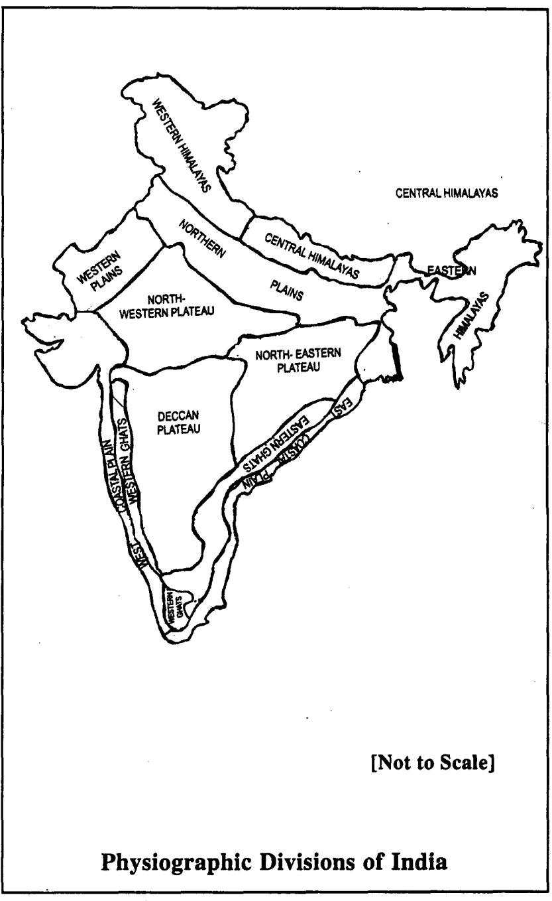

In Vrksāyurveda, there is reference to forests and their division in the country.

(Ref. Vrksāyaurveda-3rd chapter, Vanavargasūtrīva Adhyāva. of Bījotpatti Kānda)

#### The forests enlisted are :

1. Kālaka Vana-Western Himālavas

2. Caitraratha Vana-Central Himālavan region

3. Kirāta Vana-Eastern Himālavās

4. Pancanada (Northern Plainsat foothills of Himalayas)-Extending from the mouth of river Sindhu (Indus) upto the Himalayas, including the region of Kālañjara and Kuruksetra.

5. Prācya (Indo-Gangetic Plain)-Extends from Prayāg, the confluence of the Ganga (with the Yamuna) upto the Himālayan region.

6. Vedikārusaka (Central highlands)- Spreads in Tripura (Modern Tewar in Jabbalpur district) & Kosala.

7. Añgireva (Sunderbans, Naga hills. Miker Hills. Chota Nagpur)-Covers region of Utkala & Banga.

8. Kālingaka (Dandakarnya)- In Vindhya and Citrakūta hills, extends further southwards, through the land of Kalinga and Dravida, upto the sea cost.

9. Dāšārnaka (Nilgiri hills, Anaimalai)-Forest in the hills of Śrīšaila. Vedaśaila. & Malaya Parvata where sandal wood trees grow.

10. Aparanta (Western Ghats)-In Sahyadri hill region spreading upto Bhrgu-Kaccha (Kutch of Gujarath).

11. Saurāstra-Belongs to Avanti & Dwaravati.

# Bhūmi Vibhāga

Acarva Susruta while describing the examination of Bhūmi refers to two types of Bhumi classification, they are-

(i) Sāmānya (ii) Višesa

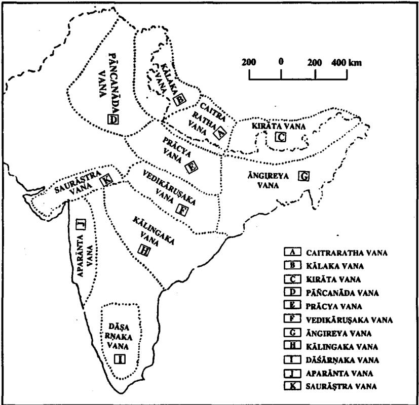

# Classification of Vana In Vrkşāyurveda

स भूमिविभागे द्विविध: - सामान्यो विशिष्टश्च । डल्हण on सु.सू. ३६/३ श्वभ्रश्नर्कराश्रमविषमवल्मीकश्मशानाघातनदेवतायतनसिकताभिरनुपहृतमनुषराम-भद्गरामदूरोदकां स्निग्धा प्ररोहवती मुद्धी स्थिरा समां कृष्णां गौरी लोहिता वा भूमिमौषध्यग्रहणाय परीक्षेत् । सु.सू. ३६/३

Medicinal plants grown in the soil with following characteristics should be collected.

### Characteristics of soil (Ideal Soil)

- 1. Soil should be devoid of
	- (a) Sarkara (Gravel)
	- (b) Aśma (stones)
	- (c) Visama Valmīka (Anthill)
	- (d) Śmaśāna (Grave yard)
	- (e) Aghatana (Slaughter house)
	- (f) Devatayatana (Temple/auspicious place)
	- (g) Sikatabhiranuphata (Sand)
	- (h) Anusara (Saline/Alkaline)
	- (i) Abhañgura (Brittle)
- 2. Adurodaka-On digging, water resource should be nearby.
- 3. Qualities of soil-Snigdha, Mrdu, Sthira. Gauri or Lohita.
- 4. Sama-Even land.
- 5. Prarohavati-Ability to germinate seeds.

Medicinal plants grown from such a soil & land is only admirable for collection.

He further explains the specific classification of Bhumi (Land/soil) based on various parameters :

# I. Classification based on Ākāśādi Bhūta

विशोषस्तु तत्र,

- · अश्मवती स्थिरा गुर्वी श्यामा कृष्णा वा स्थूल वृक्षशस्यप्राया स्वगुण भ्रयिष्ठ ।

|  | Dravya Nāmakarana, Sangrahādi Vijñāna |  |  |
|--|---------------------------------------|--|--|
|--|---------------------------------------|--|--|

1

.

| រដ្ឋារ នៅ | Type   | Qualities                          | Colour of soil                              | haracters of land                                     | Characters of pla                                     |
|-----------|--------|------------------------------------|---------------------------------------------|-------------------------------------------------------|-------------------------------------------------------|
| 1 .       | Pṛthvī | Sthira (Stable) Guru (Heavy)       | Syāma Krṣṇā                                 | eavy stony region<br>śmavatī—stable &                 | arge & stout trees                                    |
| で         | Āpya   | nigdha (Unctuous)<br>Śītala (Cool) | Śuklā                                       | bundant of water<br>esources                          | icate plants like grasse                              |
| గ్రా<br>1 | gnēya  | Laghu (light)                      | ānavarņa                                    | maller stones                                         | few & small trees which<br>ave Pāṇḍu Varņa            |
| 4.        |        | āyavya   Rūkṣa (Dry                | ash or donkey<br>sabha (Colour<br>Bhasma or | -                                                     | ess in number, Hollo<br>rees.                         |
| : S       | Ākāša  | Mṛdu (Soft)                        | Syāma                                       | and is even & water<br>vill be devoid of any<br>taste | Mountaineous region with<br>large trees which are dry |

479

.

.

- · स्निग्धा शीतलाऽऽसन्नोदका स्निग्यशस्यवणकोमल वक्षप्राया शक्लाऽम्बुगण भयिष्ठा ।
- · नानावणा लध्यश्रमवति प्रविरलाल्य पाण्डवक्ष प्ररोहा प्रिगण भविष्ठ ।
- · रुक्षा भस्मरासम्रवर्णा तनव भारतकोटरवुक्षप्राया जनिल गणभयिष्ठा ।
- · मद्वी समा श्रृवत्यव्यक्तरसजल । सर्वतोऽसारवृक्षा महापर्वतव्यक्षप्राया श्यामा चाकाशगुणभूयिष्ठा । सु.सू. ३७/४

#### II. Classification of Bhumi based on Rasa

गन्धवर्णरसोपेता घडिवया भूमिरिष्यते । तस्माद्धूमि स्वभावेन बीजिन: घड़सायुता: ।। सू.सू. ३६/१२

Bhūmi (soil) which is endowed with Gandha. Varna. Rasa is classified into 6 types based on Rasa. Hence Drayvas will posses similar qualities (Gandha-Varna-Rasa) to the Bhūmi from which it grows.

The chapters in previous section dealt exclusively with the basic concepts of Dravyaguna Sastra. After analysing and understanding the basic concepts of Dravyaguna Sastra, it is equally important to have a thorough knowledge about plant growth, collection and preservation.

In ancient times. Avurvedic scholars and people used Ãhāra dravyas extensively for food and medicine, as preservation of health was the main motto. Ausadha dravyas were used very cautiously and judiciously as they collected them from the wild. Hence the demand for medicinal plants was moderate and thus they maintained ecological balance.

But in the present scenario, due to industrilization, commercialization and world-wide demand for medicinal plants in health care, it has led to grave consequences like extinction. adulteration and substitution. One measure to contain this situation, is large scale cultivation of medicinal plants according to GCP (Good cultivation practice) to fulfill the world's soaring demand.

Cultivation involves convergence of various factors such

as soil, climate, water, altitude and others. When all such factors are precisely applied, it ensures quality and better yield.

Our ancient seers did realise the necessity to collect quality medicinal plants to beget the best therapeutic effect. Hence we find references about region (Desa), soil (Bhumi), collection (Sangrahana) and other factors affecting plant. In chapters which mainly deal with Samsodhana dravyas, Since Samsodhana dravyas were used for Samsodhana and Samsamana. (Ref .: च.क. १, स.सू. ३६)

#### Factors Affecting Plant Growth

Plant growth takes cognizance of plant habitats and climatic requirements for their favourable growth.

The factors which are given special attention are :

(1) Altitude

(2) Temperature

(3) Humidity

(4) Soil & Soil fertility

(5) Rain fall.

Soil- Soil, word derived from Latin, Solum, which means earthy material in which plants grow.

Soil is the upper weathered and humus containing layer of the earth's crust which sustains life.

Importance of soil- It is found that soil influences a number of plant activities besides being a source of anchorage, water and minerals. They are-

(i) Ability of seeds to germinate

(ii) Size & erectness of plants

(ii) Woodiness of stem

(iv) Vigour of vegetation parts

(v) Extent of root system etc.

All soils develop from weathered rock, volcanic ash deposites or accumulated plant residues.

Composition of soil- Soil has four major components. They are-

(i) Mineral matter ¡ These form total solid space.

(ii) Organic matter

- (iii) Soil air These form total pore space
- (iv) Soil water

An ideal soil contains about 50% solid space and 50% pore space. Mineral matter & organic matter occupy the total solid space of soil by 45% and 5% respectively. The total pore space of the soil is occupied by air and water on 50:50 basis that is 25% water and 25% air.

| Total solid space-50% T Mineral-45% |              |
|-------------------------------------|--------------|
|                                     | L Organic-5% |
| Total pore space-50% 「 Air 25%      |              |
|                                     | L Water 25%  |

Mineral matter consists of stone, gravel, sand, silts and clav [Soil seperates].

Organic matter consists of plant, animal and microbial residues in various stages of decay (humus).

| Mineral<br>matter | Size           | Features                                                                                  |
|-------------------|----------------|-------------------------------------------------------------------------------------------|
| Stone             | > 3 inches     | Rounded/irregularly angular<br>or even flat.                                              |
| Gravel            | 2 mm-upto 3"   | Rounded/irregularly angular<br>or even flat                                               |
| Sand              | 2.0 mm-0.05 mm | Not sticky, rapid water per-<br>colation, low fertility, low<br>· vater holding capacity. |
| Silt              | 0.05-0.002 mm  | Intermediary between sand<br>and clay.                                                    |
| Clay              | <0.002 mm      | Large surface area, on being<br>wet, it is sticky.                                        |

#### Dravya Nāmakarana, Sangrahādi Vijñāna

#### Soil Texture

It is one of the physical properties of soils. Natural soils are composed of soil particles of varying sizes. The soil-size groups, called soil separates, are sands, silts and clays. The relative proportions of soil separates in a particular soil determine its soil texture.

#### Soil textural classification

Names are given to soils based on the relative proportions of each of the 3 soil separate-sand, silt & clay.

Silt-Soil with high silt content

Clay-Soil with high clay.

Sand-Soil with a high sand percentage

Loam-Soil which doesn't exhibit the dominant physical properties of any of the 3 groups.

| Textural group  | Sand   | Silt   | Clay   |
|-----------------|--------|--------|--------|
| Sand            | 80-100 | 0-20   | 0-20   |
| Sandy loam      | 50-80  | 0-50   | 0-20   |
| Loam            | 30-50  | 30-50  | 0-20   |
| Silt loam       | 0-50   | 50-100 | 0-20   |
| Sandy clay loam | 50-80  | 0-30   | 20-30  |
| Silty clay loam | 0-30   | 50-80  | 20-30  |
| Clay loam       | 20-50  | 20-50  | 20-30  |
| Sandy clay      | 50-70  | 0-20   | 30-20  |
| Silty clay      | 0-20   | 50-70  | 30-20  |
| Clay            | 0-50   | 0-50   | 30-100 |

Soil is the major factor that limits types of Vegetation and crops. It is impractical, however to consider soil entirely apart from climate, particularly precipitation. (Precipitation is the cooling. condensation and falling down of water vapours present in air as dew, rain, snow and hail). Under similar climate conditions, a loose porous soil that retains little water will support

only grassland or desert vegetation, where as a deep, fertile loam. clay, may support trees. shrubs and vines of the type found in Savanna or even monsoon forests.

The soil p" decides favorable growth of plants and presence of micro-organisms as soil p4 greatly affects the solubility of minerals. The maximum availability of plant nutrients is between the pH range of 6.5 to 7.5.

#### Dravva Sangrahana

Collection of plants is an important stage for further processing and formulating medicines. Whether from the wild or cultivated, Collection follows a method and are based on various criteria. Drugs are collected suitably when they contain maximum concentration of active constituents. The advantage of existing environmental conditions is also taken into consideration while collecting the crude drugs.

A few criterias on the basis of which drugs are collected :

- (i) Part of the plant
- (ii) Season
- (iii) Time
- (iv) Method
- (v) Purpose
- (vi) Drug potency

#### Sangrahīta Dravya Swarūpa

तस्यां जातमपि क्रमिविष शर्मातपपवनद्दहनतोयसंबाधमार्गेसपहतमेकरसं पुष्टं प्रथ्ववगाढमुलमुदीच्यां चौषधमाददीतेत्येष भूमिपरीक्ष विशेष: सामान्य: 11 सु.सू. ३६/३

The drugs which are to be collected should be grown in the previous described Prasasta Bhūmi.

#### These drugs should posses the following characteristics-

- Krmi Anupahata >> Not affected or infested. (i)
- Vişa Anupahata (ii)

|     |                                   | (iii) Sastra Anupahata -> Not affected by weapons or<br>should be fully grown plant. |
|-----|-----------------------------------|--------------------------------------------------------------------------------------|
|     |                                   | (iv) Atapa Anupahata >> Not affected by extreme heat.                                |
| (v) |                                   | Pavana Anupahata -> Not affected by wind/storms.                                     |
|     |                                   | (vi) Dahana Anupahata -> Not affected by fire.                                       |
|     |                                   | (vii) Toya Anupahata >> Not affected by water/moisture                               |
|     | (viii) Sambādha<br>Anupahata      | > Not affected by other problems.                                                    |
|     |                                   | (ix) Margoranupahata -> Not destroyed/damaged by ram-<br>page.                       |
|     | (x)    Ekarasam<br>(Utkrstarasam) | -> Best quality.                                                                     |
|     | (xi) Pusta                        | -> Well grown and nourished.                                                         |
|     | (xii)  Prthu<br>(Prthu Valkalam)  | > Plant should possess abundant<br>bark.                                             |
|     | (xiii) Avagādha mūla              | -> Deep rooted.                                                                      |

Such plants are only selected. The required part of such plants is collected from Udicya (Uttara) northern direction.

#### Sangrahana Vidhi

ग्रहीयात्तानि सुमनाः शृचिः प्रातः सूवासरे । आदित्यसंमुखो मौनी नमस्कृत्य शिवं हृदि । ग्रहीणयदुत्तराश्रितम् ।। शा.म. १/५६-५७ साधारणधराद्रव्य वल्मीककुत्सितानूपश्रमशानोषरमार्गजाः 1 जन्तुवन्हिहिमव्याप्ता नौषध्यः कार्यसिदिन्द्रदाः ।। शा.प्र. १/५८

- Drugs should not be collected from region which have (i) abundant Valmika, (ant hill), Anupa (Watery/marshy area), Śmaśāna (Grave yard:), Üṣara (alkaline), Mārgaja (streets). & Kutsita (Dirty place).
- (ii) Drugs should not be affected by Jantu (insects or germs), Vahni (fire) and Hima (moisture).
- (iii) Person should collect during early morning hours, with a pure conciousness, neat and tidy mentally and physically. While collecting, person should be quite and facing east or northward and collect the drug with due prayers to Siva.
- (iv) Dīpika comments that Uttarāśrita means collect roots which are situated in the northern direction.

#### Collection of Wet or Drv and New or Old Drugs

सर्वाण्येव चाभिनवानि, अन्यत्र मध्यत गुड पिप्पली विडड़ेभ्यः । विडडू पिण्यली क्षौद्रं सर्पिश्राप्यनवं हितम् । गृह्णीयद्योषवर्जितम् ।। सु.सू. ३६/७-८ श्रोषमन्ययत्वभिनवं

All drugs should be collected Nava (new) i.e drugs should be collected immediately after they are full grown and mature. These are best for usage. A few exceptions are usage of Vidañga. Pippali, Ksoudra, Sarpi which are used when Purana (old). These old drugs should be devoid of Dosa.

# नवान्येव हि योज्यानि द्रव्याण्याखिलकर्मस् ।

विना विडड्रक्रमणाभ्यां गुडधान्याज्यमास्थिक: ।। शा.प्र. १/४४ All drugs are to be used when new, except Vidanga. Krsna (Pippali), Guda, Dhānya, Ājya (Sarpi), Māksika (Madhu). Which are to be used old. Purana means only one year old.

गुडूची कुटजो वासा कृष्माण्डं च शतावरी । अश्वगन्था सहचरी शतपथ्या प्रसारिणी ।। प्रयोक्तव्या सदैवरद्रा द्विगुणा नैव योजयेत । शाष्कं नवीन यद्यव्यं योज्यं सकलकर्मस । आद्री च द्विगुणं युज्यादेष सर्वत्र निश्चय: ।। शा.स.प्र. १/४५-४६

All dravyas should be dry and new, except Gudūcī, Kutaja, Vāsā. Kūsmānda. Śatavari. Aśwagandha. Sahacarā. Śatapuspa & Prasārini.

# Audbhida Dravva -- Avavava Bheda

#### Sangraha Vidhi

#### (1) Leaves

Collection time : Leaves are collected from the plants during the following period as in this season plant is very active. the sap movement and photosynthetic activity are maximum and leaves contain maximum percentage of active constituents.

Weather condition : As the moisture decreases their constituents, they are collected in dry weather.

Method of collection : Method of collection of leaf drugs is characteristic of each drug.

#### Examples

- 1. Swarnapatri- Leaves picked up individually from plant.
- Brahati, Kantakari-Leaves with flowering tops are 2. collected.

#### (2) Bark

Collection Time : Barks are collected only after 3-8 yrs. of plant growth. Usually collected in spring or early summer. In this season, cambium is active and barks get easily separated at cambium.

Method of Collection : Bark is collected by making suitable longitudinal and transverse incisions on the stem/root of plant.

Different methods : (i) Felling-The tree is felled at base by an axe and bark is stripped off. This is a primitive method.

(ii) Uprooting-Stems of tree of definite age & diameter are cut down and then stripped off.

(iii) Coppicing-Stems of plants of definite age and diameter are cut at a certain distance above the ground and bark is collected. From the stumps above soil, new shoots arise.

#### Examples :

(i) Arjuna- Outer surface-dark brown, rough with cracks and fissure. Inner surface-Dark brown to black longitudinally striated.

(ii) Asoka- Outer-rough with warty protuberances and rusty brown. Transverse and longitudinal cracks are seen. Inner-Smooth, soft and reddish brown.

#### (3) Seed

Collection Time : when fruits are ripe but before the dehisce on plant.

Method of collection : It varies according to the plant. Examples :

1. Kupilu-Ripe fruits are collected and seeds are removed.

2. Eranda- Capsules are collected from plants when they begin to turn brown. These capsules are exposed to sun. After 3-4 days, capsules burst suddenly and seeds flung out violently. (4) Fruit

Time of collection : The suitable time is early autumn or when ripe but still firm. Sometimes when the oldest fruits are just ripe, fruits are harvested.

Condition : Early morning hours

#### Method of Collection :

- · Picked individually or cut in branches.
- · Sometimes, reaping machines are also used.

Note : Over ripe fruits are not to be collected as they may not dry properly.

#### Examples :

---

1. Fennel- Stems are cut with a sickle and dried in sun. Fruits are beaten on a cloth in the sun.

2. Caraway (Carum carvi)- When the oldest fruits are just ripe, the crop is harvested with a reaping machine, choosing the early morning. These are allowed to dry for 2-3 weeks and later fruits are separated in threshing machine.

#### 5. Flowers

Time of collection : Usually in spring or summer, collection of flowers must be done about the time of pollination.

Condition during collection : In fine, dry weather and in the fore noon after few hours of sunshine when dew has dessipated. (Petals which are damp when gathered become badly discoloured during drying).

They are dried in shade as sun bleaches the flowers and makes them paler.

#### Examples :

1. Clove : Clove buds are at first white, then green and finally become crimson-red in colour. Before the corolla expands, crimson red buds are picked out in dry weather.

2. Saffron : Collection made about sunrise in fine weather during September and November. Flowers are hand picked and put into baskets, later stigmas are removed and corollas rejected.

#### (6) Stem

Time of collection : Stems are collected after the plant has begun to flower. This is because during this time, the plant puts most effort for growth.

#### Method of collection :

Annual plants : Stems from annual plants are collected by cutting them 5-10 cm above ground.

Perinneal plants : In perinneal plants, stems are cut higher above ground to encourage further crops.

#### Example :

Chirata (Swertia chirata)-The entire plant is collected when the flowering is well advanced.

#### (7) Root/Rhizome/Corm/Bulb (Any underground part)

Time of collection : Roots are collected only after plant growth. Usually collected during summer or autumn (Autumn in temperate countries). Else, any underground part should be

33 Dra.Vij.

harvested when the plant have borne fruits, shed seeds and arial parts have started to wither.

Roots from annual plants are generally not collected. Reason for this time:

- · High active chemical composition is seen when vegetable growth is ceased.
- · They are fully mature, developed and of good quality.
- · As plants have already shed seeds, crop continues in next season through natural regeneration.

# Examples :

- 1. Liquorice (Yastimadhu)-In the third year, when leaves fall, the plants are dug up, buds and rootlets are removed and the roots and stolons are dried rapidly in the sun and finally in a heated chamber.
- 2. Vaca-The long, creeping horizontal rhizome is collected in autumn. Trimmed, cut into pieces of 10 cm and dried.

# (8) Heart wood (wood)

A large portion of most commercial woods consists of heart wood by which is understood xylem tissue which consist of dead cells which has ceased to perform any conduction.

# Examples :

1. Candana (Sandalwood)-Trees which are more than 25yrs of age are normally selected for collection. Tree is uprooted and roughly deprived of its bark and part of sap wood.

# (9) Sap/Latex

Sap is collected in the spring as it rises or as it tails in Autum.

# (10) Galls

Galls are pathological out growths formed on the twigs of trees. Galls are collected before the escape of the insect or during August & September.

### Sangraha Kāla Jnāna

अत्र केचिदाहुराचार्याः प्रांवृङ्वर्षाश्ररद्देमन्तवसन्त्रग्रीष्येषु यथा संख्यं मूलपत्रत्वक् क्षीरसारफलान्याददीतेतिः तत्तु न सम्यक् । सु.सू. ४६/५

Acarya Susruta gives a cross reference for time of drug collection. He quotes a ref., where in different parts of a plant are collected during specific season. Acarya Susruta does not agree to this.

तेषां शाखापलाशमधिरप्ररुढ़ं वर्षावसन्तयोर्याह्या, यीष्मे मूलानि शिशिरे वा शीर्णप्ररुढ़पर्णानां,शरदि त्वक्कन्द क्षीराणि, हेमन्ते साराणि, यथर्तु पुष्पफलमिति । च.क. १/१०

कन्दं हिमतौँ शिशिरे च मूलं पुष्यं वसन्ते गुणदं वदन्ति । प्रबालपत्राणि निदाधकाले स्युः पङ्कजातानि शरत्प्रयोगे । ।

रा.नि. धरण्यादि वर्ग-५७

| Ritu                          | Ref. in<br>Suśruta | Caraka                | Ra. Ni        |
|-------------------------------|--------------------|-----------------------|---------------|
| Vasanta<br>(Mar. 16-May 15)   | Sāra               | Śākhā, Patra          | Puspa         |
| Grīsma<br>(May 16-July 15)    | Phala              | Mūla                  |               |
| Prāvrt<br>(Jyly 16-Aug. 15)   | Mūla               | -                     |               |
| Varsā<br>(Aug. 16-Sept. 15)   | Patra              | -                     | Prabāla Patra |
| Śarad<br>(Sept. 16-15Nov.)    | Twak               | Twak, Kanda.<br>Ksīra | Pankajāta     |
| Hemanta<br>(Nov16 .- Jan. 15) | Ksīra              | Sāra                  | Kanda         |
| Śiśira<br>(Jan16 .- March15)  |                    | Mūla                  | Müla          |

# Collection of used parts acc to season

The following table shows the difference in opinion of different scholars about time of collection.

| SI.<br>No. | Prayojyānga                              | Caraka                                   | Suśruta | Ra. Ni  |
|------------|------------------------------------------|------------------------------------------|---------|---------|
| 1.         | Mūla (Root)<br>(शीर्णप्ररुढ़द्रपर्णानां) | Grisma<br>Šiśira                         | Prāvrt  | Śiśira  |
| 2.         | Palāša<br>(Newly developed<br>leaves)    | Varsā<br>Vasantā                         |         |         |
| 3.         | Šākā (Branches)                          | Varsā<br>Vasanta                         |         | ﺴﺖ      |
| 4.         | Puspa (Flowers)                          | Acc to<br>flowering<br>season            |         | Vasanta |
| న్.        | Twak (Bark)                              | Śarad                                    | Sarad   |         |
| 6.         | Ksīra (Latex)                            | Śarad                                    | Hemanta | -       |
| 7.         | Sara (Heart wood)                        | Hemanta                                  | Vasanta | -       |
| 8.         | Phala (fruit)                            | Acc to<br>fruiting<br>season of<br>plant | Grīsma  | Vasanta |
| 9.         | Kanda (stem, root<br>tubers/bulb)        | Śarad                                    |         | Hemanta |
| 10.        | Patra (Leaves)                           |                                          | Varsā   | Śiśira  |
| 11.        | Pancañga<br>(Whole plant)                | -                                        | -       | Śarad   |

# Vīrya Bhedena Dravyānam Sangrahaņam

Acarya Susruta disagrees with the previously described drug collection based on season and puts forth the following theory.

He says.

त्त्त न सम्यक. सौम्याग्रेयत्वाज्जगतः । सौम्यान्यौषधानि सौम्येष्वधर्तुष्वाददीत. आग्नेयान्याय्रेयेष, रावमप्यापन्नगणानि भवन्ति । सौम्यान्यौषधानि सौम्येष्वर्तष ग्रहीतानि सोमगुणभूयिष्ठायां भूमौ जातन्यतिमधुरस्निग्ध शीतानि जायन्ते । रातेन शेषं व्याख्यातम् । (सु.सू. ३६/५)

As the entire universe is composed of Saumya and Agneyatva, hence Saumya dravyas have to be collected from Saumya Ritu. Agneya dravyas are collected during Agneya Ritu.

A Saumya dravya collected during Saumya Ritu which was grown from a Saumya Bhūmi will possess Atimadhura. Snigdha & Śita guna.

| Dravya | Ritu                                     | Bhūmi | Dravya-Guna                           |
|--------|------------------------------------------|-------|---------------------------------------|
|        | Saumya   Saumya-Varṣā, Hemanta<br>Šiśira |       | Saumya   Atimadhura.<br>Snigdha, Śita |
| Agneya | Sarad, Vasanta & Grīsma Agneya           |       | Katu, Ruksa<br>Uṣṇa                   |

आग्नेय विन्ध्यशैलाद्या: सौम्यो हिमगिरिर्मत: । स्युरनुरुपाणि हेतुभि: ।। अतस्तदौषधानि अन्येष्वपि प्ररोहन्ति वनेषुपवनेषु । शा.प्र. १/५५

This is a reference from Śārñgadhara who advocates collection of Agneya and Saumya dravya from specific regions.

Agneya Dravya (Usna Vīrya Dravya) should be collected from Vindhya, Malaya, Śala Parvata (region). As these regions have an ecological features which is Agneya and hence Usna Virya Dravyas collected from here will be excellent.

Saumya Dravya (Śita Vīrya Dravya) is to be collected from Himagiri (Himalayan regions) as the ecological condition is Saumya.

| Type of Dravya | Region               |
|----------------|----------------------|
| Agneya         | Vindhya, Malaya etc. |
| Saumya         | Himigiri             |

#### Dravyaguna Viiñāna

The same concept has to be adopted to Vana & Upavana also. Depending on the prevailing ecological conditions of the forest/garden, respective drugs have to be collected.

#### Dravya Sangrahana as per Bhūmi

#### Bhūmi :

तत्र प्रशिव्यम्बुगण भयिष्ठायां भमौ जातानि विरेचन द्रव्याव्याददीत अग्रयाकाशमारुतगण भयिष्ठायां वमन द्रव्याणि. उभयगण भविष्ठायाम भयतोभागानि. आकाशगणभयिष्ठायां संशमनानि रावं बलवत्तराणि भवन्ति ।। सु.सू. ३६/६

Dravyas are collected from specific types of soils for specific purposes.

| Sl.No.   Bhūmi                                | Purpose          |
|-----------------------------------------------|------------------|
| Prthvi + Ambu Gunabhūyistha   Virecana Dravya |                  |
| Ākāśa + Māruta + Agni                         | Vamana Dravya    |
| Ubhaya Gunabhūyistha                          | Ubhayabhāgahara  |
| Akāśa Gunabhūyistha                           | Samśamana Dravya |

- Virecana dravyas should be procured from soil which is . predominent with Prithvi & Ap Mahabhūta.
- Vamana dravyas should be collected from soil which � posses the qualities of Agni, Vayu & Akāśa.
- Ubhaya bhāgahara dravyas to be collected from soil . having Prithvi, Ambu, Agni, Vāyu & Ākāsa guņa.
- Samśamana dravyas should be collected from soil which . posses Akāśa Guna.

### Jāñgama Dravya Sangraha (Collection of Animal Products)

#### जाङ्गमानां वयः स्थानां रक्तरोमनखादिकम् । क्षीरमुलपुरीषाणि जीर्णाहारेषु संहरेत् ।। स्.सू. ३६/१६

Different parts of animals are used as food & medicine. These animal products have to be collected from an young, mature animal (Vayasthā).

- (i) For collecting the Rakta (Blood), Roma (Hairs) & Nakha (Nails) of animals, a well grown young & mature animal is selected.
- For collecting Ksīra (Milk), Mūtra (Urine) & Purīsa (ii) (Faeces), these have to be collected from a mature animal only after the previously eaten food by the animal has been digested.

# Ahāra Dravva Sangrahana (Collection of Food Products)

We find references at different contexts giving specific instructions to the collection of food materials whether plant or animal origin.

# 1. Dhānya (Śūka-Śamī Dhānya)

व्याधिहतमपर्यागतमेव अनार्तवं च ।

अभूमिजं नवं चापि न धान्यं गुणवत् स्मृतम् ।। सु.सू. ४६/५०

While collecting Dhanya, the following needs to be kept in mind.

- (1) Anartavam (Anyartujātam)-Grains grown in off season.
- Vyadhihatam-Grains which are infested. (2)
- (3) Aparyagatam (Apakwam)-Grains which are immature.
- (4) Abhūmijam (Usaropalakādisavisabhūmijam)-Grains grown in infertile or bad soil.
- (5) Nava-Grains within one year.

Grains as described above are unfit for consumption.

नवं धान्यमभिष्यन्दि लघु संवत्सरोषितम् । विदाहि गुरु विष्टम्भि विरुढ़ं दृष्टिदूषणम् ।। सु.सू. ४६/५१ नवमिति वर्षं यावत् । ....................प्रथम वर्षादूर्ध्वं द्वितीयं वर्षं यावत् पुराणं गुणवच्च भवति, तदूर्ध्वं तु नीरसत्वान्न गुणकरमिति । डल्हण सु.सू. ४६/५१

- · Grains within one year are Abhisyanda in nature, i.e.
Dosadhātumalasrotasām Klēdaprāptijananam it vitiates Dosa, Dhātu, Mala & Srotas.

- Hence one year old grains are suitable for consumption . as these are easy for digestion (Laghu). Beyond this period, grains loose their potency.
- Virūdha grains are Guru, Visthambhi & Vitiate vision. . In this context Virūdha has two meanings.

विरुढं अङ्गरजननशक्तिरहितमित्यर्थ- Grains which have lost the ability to sprout, like for example fried Canaka or fried Mudga.

- · Virūdhamañguritam-Sprouted grains.
- 2. Śāka

#### कर्कशां परिजीर्णं च कुमिजष्टमदेशजम् । तद्यदकालविरोहि ।। सु.सू. ४६/२९७ वर्जयेत पत्रशाक

The following types of Patra Śāka is unfit for collection.

- Karkaśa (Kharasparśam)-Very rough & hard. (i)
- (ii) Parijīrna (Purātanam)- Very old.
- (iii) Krmijustam (Krmibhaksitam)- infested.
- (iv) Akālajam (unseasonal).
- (v) Adeśaja (Anucita deśotpannam)—Unnatural habitat.

### 3. Kanda

# बालं ह्यनार्तवं जीर्णं व्याधितं क्रमिभक्षितम् ।

कन्दं विवर्जयेत् सर्वं यो वा सम्यक् रोहति ।। सु.सू. ४६/३२ Kanda (tubers) which possess the following characteristics are unfit for consumption.

- (1) Bāla-immature.
- (2) Anartava-unseasonal.
- (3) Jirna-Old/dried.
- (4) Vyadhita-Diseased
- Krmibhaksitam-Infested by worms (5)
- (6) NaSamyak Rohati-Not properly grown.

#### 4. Phala

परिपक्वं यद्गुणवत्तदुदादृतम् । फलेषु बिल्वादन्यत्र विज्ञेयमामं तब्द्धि गुणोत्तरम् । याह्यूष्णं दीपनं तब्दि कषायकद्रद्रतिक्तकम् । व्याधितं क्रमिजुष्टं व पाकातीतमकालजम् । वर्जनीयं प्रकलं सर्वमपर्यागतमेव च ।। सु.सू. ४६/२०९-२१०

- Fruits which are well grown and mature are fit for col-(i) lection except for Bilva. (In Bilva, unripe fruits are better to ripe)
- (ii) Vyadhitam-Diseased.
- Krmijustam-Eaten by insects or infested. (iii)
- (iv) Atiphala-Over ripen
- (v) Akālaja-Unseasonal
- (vi) Aparyāgata (Apakwa)- Unripe & immature.

# Bhesajāgāra & Samraksana Vidhi (Storage House) (Preservation)

गहीत्वा चानुरुपगुणवद्धाजन स्थान्यागारेषु प्रागुदग्द्वारेषु निवातप्रवातैकदेशेषु नित्यपुष्पोपहारबलिकर्मवत्स्, अग्नि सलिलोपस्वेद-धूम-रजो-मूषक-चतुष्पदामनभिगमनीयानि स्वच्छन्नानि शिक्येष्वासज्य स्थापयेत् ।। च.क. १/११

ग्रहीत्वेत्यादि । अनुरूपगुणवद्धाजनस्थानीति अनुरूपगुणवत्ता च भाजनस्य भेषजसमानगुणतयैव । स्वच्छन्नानीति सम्यक्विहितानि ।

चक्रपाणि भाष्य on च.क. १/११.

#### Acārya Caraka

- 1. Properly collected drug should be stored in containers having similar qualities.
- 2. Stored in house, built in suitable place with proper ventilation.
- 3. Everyday the store house should be worshipped after cleaning.
- 4. It should be devoid of fire, water, moisture, smoke, dust, Rats and other insects.
- 5. Store house should not be situated at or near circle or junction.

प्लोतम्बद्धाण्डफलकशाङ्कविन्यस्त भेषजम् । प्रशस्तायां दिशि शुचौ भेषजागारमिष्यते ।। सु.सू. ३६/१७ गृहीतौषधस्थापनोपायं दर्शयन्नाह-प्लोतेत्यादि । प्लोतः, कर्पटः । मृद्धाण्ड मृत्तिकापात्रं, फलकं पट्टकं, शङ्कः कीलकः रातेषु प्लोतादिषु विन्यस्तं ध्रतमौषधं यस्मिन गृहे तद्धेषजागारं भेषजग्रहमिष्यत इति संबन्धः । प्रशस्तायां पर्वस्थामुत्तरस्यां वा । शुचौ देशे । डल्हण on सु.सू. ३६/१७

Preservation techniques-The collected drugs have to be properly preserved and stored. The drugs are to be kept either in :

Plota (Karpata)-Ragged cloth (Gunny bag)

Mrdbhāņḍa (Mrttikā Pātra)-Earthern pots.

Phalaka (Pattaka)-Plank.

Śanku (Kīlaka)--(Stake/pillar/post/pale) and these are to be kept in a clean storage area.

# Expiry Period of Ayurvedic formulations

Once the expiry period is reached the formulations or medicines should not be stored.

|       |  | गुणहीनं           भवेत्               वर्षादूध्वर्ध्वं |  |
|-------|--|--------------------------------------------------------|--|
|       |  | मासद्वयात्तथा                                          |  |
|       |  | हीनत्वं                                                |  |
| हीनाः |  | स्युततैलाद्याश्चितुर्मासाधिकात्तथा ।।                  |  |
|       |  | ओषध्यो लघुपाकाः स्युर्गुणैर्युक्ता आसवो धातवो रसाः ।।  |  |
|       |  | शा.स.प्र. १/५१-५३।।                                    |  |

As the drug may loose their potency in a stipulated period, hence it is not advised to use the medicines which have lost their potency. So those medicines should be discarded.

| SI.No. | Formulation/Medicine  | Expiry Period   |
|--------|-----------------------|-----------------|
| 1.     | Cūrna (Powders)       | After 2 months  |
| 2.     | Gutika (Tablets)      | l yr.           |
| 3.     | Avaleha (Confections) | l yr.           |
| 4.     | Ghrta (Ghee)          | After 4 months  |
| 5.     | Taila (Oil)           | After 4 months  |
| 6.     | Laghupāka Auṣadhas    | After 1 yr.     |
| 7.     | Asavārista            | Infinite Period |
| 8.     | Dhātu & Rasa Yogas    | Infinite Period |

#### Storage

Preservation of crude drugs need sound knowledge of their physical and chemical properties.

They should be stored in the premises which are waterproof, fire proof and rodent proof.

A number of drugs absorb moisture during their storage and become susceptible to microbial growth. The moisture, not only increase the bulk of the drug, but also causes impairment in the quality of the crude drug. Hence such drugs should be stored in air-tight containers.

Atmospheric oxygen is also destructive to several drugs and hence they are filled completely in well closed containers, or the air in the containers is replaced by an inert gas.

Apart from protection against adverse physical & chemical changes, preservation against insect or mould attacks is also important. They can be prevented by drying the drug thoroughly before storage and also by giving treatment of fumigants.

The common fumigants used for storage of crude drugs are methyl bromide, carbon disulphide and hydrocyanic acid.

At times, drugs are given special treatment such as liming of ginger and coating of nutmeg.

Temperature is also important factor in preservation of

drugs, as it accelerates several chemical reactions leading to decomposition of constituents. Hence most of the drugs need to be preserved at a very low temperature.

Small quantities of crude drugs could be readily stored in air-tight, moisture proof & light proof containers such as tins, cans, covered metal tins or amber glass containers.

Wooden boxes and paper bags should not be used for storage of crude drugs.

#### Preservation

Medicinal plants can be preserved in a number of ways, the most common & simple, being air/oven drying. A warm, dry place for example an airing cup board is ideal. Use plain paper for drying herbs, never printed news paper. Dried herbs can be stored for many months in a dark glass jar or brown paper bay.

(Ref : Ravindra sharma, ''Agro-techniques of medicinal plants, Daya publishing house 2007:196).

#### Māna Paribhāsā

#### Māna Nirukti

#### मीयते अनेनेति मानम् । अमरकोश ।

Mana is an entity through which weight, volume or length of a substance are measrued.

# परिमाणं पुनर्मानम् । च.सू. २६/३४

Parimāna is one among Parādi gunas, where Carakācārya gives due importance to Mana and considers one of the Cikitsopayogi Guna.

#### Utility of Mana

### न मानेन विना यक्तिद्रर्णयाणां जायते क्वचित् ।

अतः प्रयोग कार्यार्थं मानमत्रोच्यते मया ।। शा.प्र.ख. १/१४ Quantification is impossible without proper means of measurment. One fails to prescribe medicines and advise food materials without the help of Mana.

While formulating a formulation measurment is must and to finalize the dosage of Yoga, Mana is very much necessary.

दोष भेषज देश काल बल शरीर साराहार सात्म्य सत्य प्रकृति वयसां मानमवहितमनसा यथावज्ञेयं भवति भिषजा, दोषादि मान ज्ञानायत्तत्वात् क्रियायाः । न ह्यमानज्ञो दोषदीनां भिष्यंग व्यायिनित्रह समर्थो भवति ।। च.वि. १/३

Acarya Caraka has given much importance to Māna. Vaidya has to measure Dosa, Bhesaja (Medicine), Deśa (Place), Kāla (time), Bala (Strength). Śarira (body stature), Sāra (Compactness), Ahāra (food), Sātmya (Conducive substances), Satwa (Mental status), Prakruti (Constitution) and Vaya (Age) through Mana before advising treatment. If Vaidya won't take use of Mana while assessing all these factors is going to fail in his treatment.

# Types of Māna

मानं च द्विविधं प्राहृः कालिङ्गं मागधं तथा ।

कालिङ्गान्मगधं श्रेष्ठमेवं मानविदो विद्रः ।। च.क. १२/१०५ Acarya Caraka has mentioned two types of Māna.

(i) Kālinga Māna (Belongs to Orissa)

(ii) Magadha Māna (Belongs to Bihar). Caraka considers Magadha Mana is superior.

# पौतवं द्रवयं पाय्यमिति मानार्थकं त्रयम् ।

मानं तुलाङ्गलि प्रस्थै: गुञ्जा पञ्जाद्य माषक: ।। अमरकोश २/९/८५

In Amara Kośa, 3 types of Māna are mentioned.

(i) Pautava Māna

(ii) Druvaya Māna

(iii) Pāyya Māna

(i) Pautava Mana- Measuring weights.

Pautava Mana is one where measures are used to weigh solid substances.

(ii) Druvaya Mana- Measuring volumes.

Measures used to denote volume of liquids is known as Druvaya Mana.

(iii) Payya Mana- Measuring length. Measures which represent length is known as Payya Mana.

Pautava Māna-As per Caraka

षड़ ध्वंश्यस्तु मरीचि: स्यात षण्मरीच्यस्तु सर्वय: । अष्टौ ते सर्षया रक्तास्तण्डलश्चापि तद्वयम् ।। धान्यमाषो भवेदेको धान्यमाषद्वयं यवः । अण्डिका ते तु चत्वारस्ताश्च्यतस्वस्तु माषकः । । हेमश्च धान्यकश्चोक्तो भवेच्छाणस्तु ते त्रयः । शाणौ द्वौ द्रङ्क्षणं विद्यात कोलं बदरमेव च । विद्याद्वौ द्रङ्क्षणौ कर्षं सूवर्णे चाक्षमेव च । विडाल पदकं चैव पिचुं पणितलं तथा ।। तिन्दुकं च विजानीयात् कवलग्रहमेव च । द्वे सुवर्णे पलार्धं स्याच्छूक्तिरष्टमिका तथा ।। द्वे पलार्थे पलं मुष्टि: प्रकुश्रोऽथ चतुर्थिका । बिल्वं घोडशिका चाम्रं हे पले प्रस्तं विद् : ।। अष्टमानं तु विज्ञेयं कुडवौ द्वौ तु मानिका । पलं चतुर्गुणं विद्यादश्चलिं कुडवं तथा ।। चत्वारः कुडवाः पात्रं तदेव विज्ञेयं कंस: प्रस्थाष्टकं तथा ।। कंसश्चतुर्गणो द्रोणश्चार्मणां नलवणं च तत् । स राव कलश: ख्यातो घटमुन्मान्नमेव च ।। द्रोणस्तु द्विगुण: शूर्पो विज्ञेय कुम्भ राव च । गोणीं शूर्यद्वयं विद्यात् खारीं भारं तथैव च ।। द्वात्रिशंतं विजानीयाद्वाहं शूर्याणि बुद्धिमान् । तुलां शतपलं विद्यात् परिमाणविशारदः ।। शुष्कद्रव्येष्विदं मानमेवमादि प्रकीर्तितम् ।।

च.क. १२/८७-९९९

Acarya Caraka in Kalpasthana while mentioning about quantity of substances referred Mana.

| 6 Dhwamśi     | = 1 Marici                                        |  |
|---------------|---------------------------------------------------|--|
| 6 Marici      | = 1 Sarsapa                                       |  |
| 8 Sarşapa     | = 1 Tandula                                       |  |
| 2 Tandula     | = 1 Dhānya Māṣa                                   |  |
| 2 Dhānya Māṣa | = 1 Yava                                          |  |
| 4 Yava        | =  1 Aṇḍika [2 Ratti=250 mg]                      |  |
| 4 Andika      | = 1 Māṣaka [8 Ratti=1 g]                          |  |
| 3 Māṣaka      | = 1 Śāṇa [24 Ratti=3 g]                           |  |
| 2 Śāna        | = 1 Kola [48 Ratti=6 g]                           |  |
|               | 2 Kola (Drankṣaṇa) = 1 Karṣa (Swarṇa) [Tola=12 g] |  |
| 2 Karşa       | = 1 Śukti (Palārdha) [2 Tola=24 g]                |  |
| 2 Śukti       | = 1 Pala [4 Tola=48g]                             |  |
| 2 Pala        | = 1 Prasruta [8 Tola=96g]                         |  |
| 2 Praśruta    | = 1 Kudava [16 Tola=192g]                         |  |
| 2 Kudava      | = 1 Mānikā [32 Tola=384 g]                        |  |
| 2 Mānikā      | = 1 Prastha [64 Tola=768 g]                       |  |
| 4 Prastha     | = 1 Adhaka [256 Tola=3072 g]                      |  |
| 4 Adhaka      | = 1 Drona [1024 Tola=12.288kg]                    |  |
| 2 Drona       | = 1 Sūrpa [2048 Tola=24.576 kg]                   |  |
| 2 Šūrpa       | = 1 Khāri (Bhāra) [4096 Tola=49.152 kg]           |  |
| 100 Pala      | = 1 Tula (400 Tola) = 4.800 kg.                   |  |

# Pautava Māna-As per Suśruta

पलकुडवादीनामतो मानं तु व्याख्यास्याम: - तत्र द्वादश धान्यमाषा मध्यमा: सुवर्णमाषक:, ते घोड़श सुवर्णम; अथवा मध्यमनिष्याव राकोनविंश्तिधरणं, तान्यर्धतृतीयानि कर्षः; ततश्चोर्घ्व चतुर्गुणमभिवर्धयन्तः पलकुडव प्रस्थाढ्रकद्रोणा इत्यभिनिष्यद्यन्ते, तुला पुनः पलज्ञात, ता: पुनर्विंशतिभारः, शृष्काणामिदं मानमु, आर्द्रवाणां च द्विगुणामिति ।। सू.चि. ३१/७

While explaining about Snehapāka Kalpa Acārya Susruta has given reference about Pautava Māna.

#### Dravvaguna Viiñāna

|    | 1 Suvarna Māṣaka |
|----|------------------|
| ။  | 1 Suvarņa        |
| ll | 1 Dharana        |
| == | l Karsa          |
| 11 | 1 Pala           |
| ll | 1 Kudava         |
| ll | 1 Prastha        |
| ll | 1 Ādhaka         |
| ll | 1 Drona          |
| ll | 1 Tula           |
| ll | 1 Bhāra          |
|    |                  |

These measurements are for dry drugs and the quantity should be double in case of fresh drugs.

> Pautava Māna-As per Śārñgadhara त्रसरेणुर्वुधैः त्रसरेणुस्तु जालान्तरंगते भानौ तस्य त्रिंशत्तमो भागः परमाणः स कथ्यते । जालान्तरगतैः षड्वंशीभिर्मरीचिः स्यात्ताभिः षड्रमिस्तु राजिका ।

> तिसभी राजिकाभिश्च सर्षप: प्रोच्यते बुधै: ।। यवोऽषृसर्षपैः प्रोक्तो षड्गिस्तु रक्तिकाभि: स्यान्माषको हेमधान्यकौ । । माषैश्चतुर्भि: शाण: स्याद्धरण: स निगद्यते । टङ्कः स राव कोलद्वयं च कर्ष: स्यात्स प्रोक्त: पाणिमानिका । । अक्षं पिचु: पाणितलं किंचित्पणिश्च तिन्दुकम् । विडालपदकं चैव चैव तथा तथा षोडशिका मता ।।

करमध्यो उद्ग्बरं च च पर्यायै: कर्ष राव निगद्यते । स्यात्कर्षाभ्यामर्थपलं शुक्तिरष्टमिका शुक्तिभ्यां च पलं ज्ञेयं मुष्टिराम्रं चतुर्थिका । । प्रकुञ्चः षोडशी बिल्वं पलमेवात्र कीर्त्यते । पलाभ्यां प्रसृतिज्ञेया व प्रसृतश्च निगद्यते । । प्रसृतिभ्यामञ्जूलिः अष्टमानं च स ज्ञेयः कडवाभ्यां च मानिका ।। शरावोऽष्टपलं शरावाभ्यां भाजनं कंसपात्रं च चतुः चतुर्भिराढकैद्रोण: कलशो उन्मानश्च घटो द्रोणाभ्यां शर्मकम्भौ च चतुः षष्टिशरावका: । । शूर्याभ्यां च भवेद्रोणी वाही गोणी च सा स्मृता । द्रोणीचतुष्टयं खारी चतुः पलालां द्विसहस्रं च च भार रावाद राक: प्रकीर्तित: ।। तुला

- शा.स.प्र. १/१५-३२
- 30 Paramānu =
- 6 Vamśi =
- 6 Marīci =
- = 1 Sarşapa 3 Rājika
- 8 Sarsapa = 1 Yava = 31.25 mg
- 1 Gunja (Rattika) = 125 mg 4 Yava -။
- = 6 Rattikā
- = 4 Māṣaka

34 Dra.Vij.

#### Dravyaguna Vijñäna

| 2 Śāna     | ll | 1 Kola [48 Ratti=6g]              |
|------------|----|-----------------------------------|
| 2 Kola     | ။  | 1 Karṣa [96 Ratti=1 Tola=12 g]    |
| 2 Karsa    | ແ  | 1 Śukti [2 Tola=24 g]             |
| 2 Śukti    | ။  | 1 Pala [4 Tola=48 g]              |
| 2 Pala     | ແ  | 1 Prasruta [8 Tola=96 g]          |
| 2 Prasruta | ။  | 1 Kudava [16 Tola=192 g]          |
| 2 Kudava   | == | 1 Śarāva (Mānikā) [32 Tola=384 g] |
| 2 Śarāva   | ။  | 1 Prastha [64 Tola = 768 g]       |
| 4 Prastha  | II | 1 Adhaka [256 Tola = 3072 g]      |
| 4 Adhaka   | ။  | 1 Drona (1024 Tola = 12.288 kg)   |
| 2 Drona    | ။  | 1 Surpa [2048 Tola=24.576 kg]     |
| 2  Śurpa   | ။  | 1 Droni [4096 Tola = 49.152 kg]   |
| 4 Droni    | ll | 1 Khāri [4096 Pala = 196.608 kg]  |
| 2000 Pala  |    | =                                 |
| 100 Pala   | ။  | 1 Tulā [400 Tola = 4.8 kg]        |

Śārñgadhara—Quadruple System

माषटङ्काक्षबिल्वानि कुडवः प्रस्थमाढ़कम् । राशिर्गोणी खारिकेति यथोत्तर चतुर्गुणा: ।। शा.स.प्र. १/३२-३३

Śārñgadhara has given a formula to remember Māna easily.

- 1 Māsa ニ 1 Tanka
- 4 Tanka == 1 Aksa
- 4 Aksa == 1 Bilwa
- 4 Bilwa 1 Kudava ==
- 4 Kudava 1 Prastha こ
- 4 Prastha == 1 Ādhaka
- 4 Ādhaka == 1 Rāšī
- 4 Rāši ニ 1 Goni
- 4 Goni == 1 Khāri

| Kalingamāna of Śārñgadhara                   |                                                                  |  |
|----------------------------------------------|------------------------------------------------------------------|--|
|                                              | यवो द्वादशभिगौरसर्वपै: प्रोज्यते बुधै: ।।                        |  |
| यवद्वयेन गुञ्जा स्यात्रिगुस्खो बल्ल उच्यते । |                                                                  |  |
|                                              | माषो गुञ्जाभिरष्टाभिः सप्रभिर्वा भवेत्ववित् ।।                   |  |
|                                              | स्याच्चतुर्माषकै: शाणा: स निष्कषृङ्क राव च ।                     |  |
|                                              | गद्याणो माषकैः षड्डिभ कर्षः स्याद्दशमाषिकः ।।                    |  |
|                                              | चतुष्कर्षः पलं प्रोक्तं दशक्तं दशशाणामितं बुधैः ।                |  |
|                                              | चतुष्पलैश्च कुडवं प्रस्थाद्याः पूर्ववन्मताः ।। शा.स.प्र. १/३९-४२ |  |
| 12 Gaura Sarsapa = 1 Yava                    |                                                                  |  |
| 2 Yava                                       | = 1 Gunja                                                        |  |
| 3 Gunja                                      | ll<br>1 Valla                                                    |  |
| 8 Gunja                                      | =  1 Māṣa [8 Ratti = 1 g]                                        |  |
| 4 Māsaka                                     | 1 Śāṇa (Tanka) [32 Ratti=4 g]<br>ll                              |  |
| 6 Mäsaka                                     | = 1 Gadyana [48 Ratti = 6 g]                                     |  |
| 10 Māsaka                                    | 1 Karsa (Tola) [80 Ratti = 10 g]<br>ll                           |  |
| 4 Karsa                                      | 1 Pala [320 Ratti = 40 g]<br>=                                   |  |
| 4 Pala                                       | = 1 Kudava [1280 Ratti = 160 g]                                  |  |
| 4 Kudava                                     | =   1 Prastha [(64 Tola) 5120 Ratti = 640 g]                     |  |
| 4 Prastha                                    | =   1  Adhaka [256  Tola = 2.56  kg]                             |  |
| 4 Adhaka                                     | 1  Droṇa   [1024  Tola = 10.24  kg]<br>ll                        |  |
| 2 Drona                                      | = 1 Śūrpa [2048 Tola = 20.48 kg]                                 |  |
| 2 Śurpa                                      | = 1 Dronī [4096 Tola = 40.96 kg]                                 |  |
| 4 Dronī                                      | = 1 Khārī [16384 Tola = 163.84 kg]                               |  |
|                                              |                                                                  |  |

#### Druvaya Māna

तस्य प्रमाणमष्टौ बिन्दवः प्रदेशिनीपर्वद्वयनिःसताः प्रथमा मात्रा द्वितीया शुक्तिः तृतीया पाणिश्शिक्तिः इत्येतास्तिस्रो मात्रा यथा बलं प्रयोज्याः स्.चि. ४०/२८

While describing Sneha Matra, Acarya Susruta has mentioned measures for liquids.

1 Bindu equals to a drop which drops from finger which is dipped in water upto two proximal phallengial joints.

8 Bindus = 1 Śāṇa 32 Bindus = 1 Śukti 64 Bindus = 1 Pāņi Śukti

Pāvva Māna

अंगष्ठे सकनिष्ठे स्यात् वितस्तिः द्वादश अङ्गलः । प्रकोष्ठे विस्तृतकरे बद्धया ।। मुष्या ਹੋ स रत्नि: स्याद अरविनिस्तु निष्कानिष्ठेन मुष्टिना । व्यामो बाहौ: सकरयो: तत् तयो: तिर्यगन्तरम् । । अमरकोश २/६/८६

In Amarakośa measurements for measuring length is given.

| l Vitasti     | =  12 Angula [9 Inches]    |
|---------------|----------------------------|
| ਨ<br>1 Ačatni | = 22 Angula [16 ½, inches] |
| l  Hasta      | = 24 Angula [18 inches]    |
| 1 Rājahasta   | = 27 Angula [22 inches]    |
| 1 Vyāma       | = 4 Hasta [72 inches]      |

### Measure for weight

| l Miligram          |  | = 1/1000 gm   |  |  |  |  |
|---------------------|--|---------------|--|--|--|--|
| 10 Miligram         |  | = 1 Centigram |  |  |  |  |
| 10 Centigrams       |  | = 1 Decigram  |  |  |  |  |
| 10 Decigrams        |  | = 1 Gram      |  |  |  |  |
| 10 Grams            |  | = 1 Deca gram |  |  |  |  |
| 10 Deca grams       |  | = 1 Hectogram |  |  |  |  |
| 10 Hectogram        |  | = 1 Kilogram  |  |  |  |  |
| 100 Kilograms       |  | = 1 Quintal   |  |  |  |  |
| 10 Quintals         |  | = 1 Ton       |  |  |  |  |
| Measure for liquids |  |               |  |  |  |  |
|                     |  |               |  |  |  |  |

1 Mililitre = 1/1000 ltr.

# Dravya Nāmakarana, Sangrahādi Vijñāna

| 10 Millilitre                            | = 1 Centilitre                                 |
|------------------------------------------|------------------------------------------------|
| 10 Centilitre                            | =  1 Deci litre                                |
| 10 Deci litres                           | = 1 Litre                                      |
| 10 litres                                | = 1 Deca litre                                 |
| 10 Deca litres                           | = 1 Hecta litre                                |
|                                          | 10 Hecta litres = = 1 Kilo litre (1000 litres) |
| Measures for length or distance          |                                                |
|                                          | 1 Millimeter             =  1 / 1000 meter     |
| 10 Millimeters          =   1 Centimeter |                                                |
| 10 Centimeters                           | = 1 Decimeters                                 |
| 10 Decimeters                            | = 1 meters                                     |
| 10 meters                                | = 1 Deca meters                                |
| 10 Deca meters                           | = 1 Hecta meter                                |
| 10 Hecta meters                          | =  1 Kilo meter.                               |
| l Inch                                   | = 2.5 Centimeters                              |
| 12 Inches                                | = 1 Foot                                       |

.

509

# Chapter-13 Dravya Asudhi Śōdhanādi Vijñāna

# Points Dealt

- · Dravyanām Vividhāšuddhasva. Tāsām Śodhanam.
- · Pratinidhi Dravya (Substitutes)
- · Apamiśrana Jnānam (Adulteration)
- · Kritrima Dravyānām Jnānam

# Dravyanām Vividha Asuddḥ Tāsām Śodhanam

Commonly plant and mineral origion drugs will have 3 kinds of impurities.

(i) Sahaja-Natural impurities- Some poisonous drugs like Vatsanābha, Ahiphena, Guñjā, Jayapāla etc. naturally possess poisonous principles in it. So it has to be purified before usage. But it cannot be considered as impurity.

(ii) Bhautika Aśuddhi-Physical impurities- During drug collection sometimes mud particles, sand, grass, wooden pieces, different parts of same plant may be accidentally mixed or to increase the bulk or weight. This can also be termed as adulteration. Adulteration has become a common problem in Ayurvedic Pharmaceutical industries. Even a spurious or low cost materials may be mixed for commercial purpose.

(iii) Rāsāyanika Aśuddhi-Chemical impurities– This type of impurities are commonly found in mineral drugs, where the ores come in contact with different metals.

Eg : Parada with Naga or Vanga

# Necessity for Śodhana

- 1. Poisonous drugs can not be used directly without purification as they produce severe life threatening effects.
- 2. To remove the physical impurities it has to be subjected for purification, otherwise the quality or efficacy of drugs may not be to the desired extent.
- 3. Purified mineral drugs will have good therapeutic efficacy.
- 4. Adulteration has become a common practice, desired

result may not be possible if the drugs are not subjected for Śodhana.

Eg : Kampillaka-For Recana karma the drugs should be administered in particular dose. If the drug is pure then the drug administered in particular dose will produce purgation, if it is adulterated it won't cause purgation at all.

#### Śodhana उद्दिष्टैरौषधैः सार्व्हें क्रियते पेषणादिकम । मलविच्छित्तये यन्तु शोधनं व तदिहोच्यते ।। र.त. २/५२

Purification of a substance through various procedures like Mardana, Ksalana or Nirvapa etc. is called as Śodhana.

Here the word Mala refers not only to impurities but also to poisonous principles.

There are many kinds of Śodhana procedures viz.,

#### (1) Bhāvana

#### यच्चर्णितस्य धात्वादेद्रवैः सम्पेष्य शोषणाम् । तन्मतं विज्ञैर्भावना च च निगद्यते ।। र.त. २/४९ भावनं

Trituration of Ausaddha Chūrna with water, decoction or juice etc and later dried is known as Bhavana.

Eg : Ahiphena śodhana done by giving 7 times Bhāvana with Ardraka Swarasa.

तानि च यथां दौषं प्रयुञ्जीत सुरा- सौवीरक- तुषोदक-मैरेय-मेदक-धान्याम्ल-दध्याम्लादिभिवति, मुद्वीकामलक-मधुक-परुषक-फणितक्षीरादिभि: पित्ते, श्लेष्मणि त् मधुमूत्र कषायादिभिभावितन्यालोडितानि च; इत्युपदेशः । तं विस्तरेण द्रव्य-देह-दोष-सात्म्यादीनि प्रवि भाज्य व्याख्यास्याम: । च. क. १/१२

While explaining Ausadhi Sevana and Sahapana. Acarya Caraka has mentioned Bhāvana Dravyas in different Dosajanita Vikārās. [Kalpa sthāna-Vamana Kalpa].

- Vātajanita Vikāra- Bhāvana with Surā, Sauvīra, (i) Tusodaka, Maireya, Medaka, Dhanyamla, Dugdha etc.
- (ii) Pittajanita Vikāra-Mrdwīka, Āmalaka, Madhu, Madhuka. Parūsaka. Phānita. Ksīra etc.
- (iii) Kaphaja Vikāra-Madhu, Mūtra, Kasāva etc.

2. Dhālana (Dipping solid material)

संद्रावितस्य द्रव्यस्य द्रवेनिक्षेपणं त् यत् । ढालनं तत्समदिष्टं रसकर्मविशारदैः ।। र.त. २/३६

After heating any Dravya, immersing it in liquid media like Kwātha, Swarasa, milk etc. is known as Dhālana.

Eg : Dipping Swarna in, Tila taila.

# 3. Avapa (Dipping liquified material) द्रव्यान्तर विनिक्षेपो द्रुते वङ्गादिके त् यः । क्रियते स प्रतीवाप आवापश्च निगद्यते ।। र.त. २/३९

Liquified materials are immersed in specified liquids (Kāñji, Dugdha, Kwātha etc) for purification.

Eg : Liquified Gandhaka immersed in Dugdha.

4. Nirvāpa

#### धात्वादेवीन्हितत्पस्य यन्त्रिषेचनम् । स निर्वाप: सृतश्चापि निषेक: स्नपनञ्ज तत् ।। र.त. २/४०

Red hot dravyas are dipped into the specified liquids for purification. Followed in Rasaśāstra.

### 5. Swedana

दोलायन्त्रे स्थापयित्वा रसेन्द्रं क्षारैरम्लैरौषयैर्वा कषायैः । युक्तया यत्स्यात्याचनं स्वेदनं तत प्राज्ञैरुक्तं दोषशैथिल्यकारि ।। र.त. ५/४६

Swedana is a method where in the drug is suspended in alkaline, sour liquids or decoction of various drugs filled in Dolayantra and heated for specific duration.

Eg : Guñja Śodhana done with Swedana by Godugdha.

### 6. Mardana

क्षाराद्यैरोषधैर्वा यत् खल्वे सूतस्य पेषणम् । प्रोक्तं तन्मर्दनं बुधैः

Pounding mercury in a Khalwa by mixing with Ksara or any Ausadha dravya is called Mardana. With mardana procedure external impurities of Mercury is removed.

# 7. Bharjana (Frying)

चूर्णेषु भर्जितं हिङ्ग देयं नोत्क्लेदक्रद्धवेत् । शा.सं.म. ६/२

Frying any substance in a pan by using Ghee etc. is known as Bharjana.

Eg : Hingu, if it is fried in Ghee looses its Tiksnata.

Note :- Not only for Curna, in case of Gutika & Leha preparations Bharjita Hingu to be considered.

# 1. Vatsanābha Śodhana

यथोक्तगुणसंपन्नं वत्सनाभं समाहरेत् । ततश्रुणक संस्थानं खण्डशः कारयेद्धिषक् ।। पाषाणचषके वापि वापि मुत्तिका भाजने ततः । गोमुत्रेण समा प्रूनाव्य स्थापयेत्ररवरातपे ।। प्रत्यहं पुर्व पूर्व निक्षिप्तं गोमुत्रमपनीय तु । दत्वा च नूतनं मूत्रं तीव्रधर्में तु विन्यसेत् ।। रावं दिनत्रयं दिनत्रयं कृत्वा व त्वचामपनयेत्ततः । शेषयेच्च विषं विषं त्वेवं शुद्धिमायात्ति अनुत्तमाम् ।। र.त. २४/१९-२२

Mature tubers of Vatsanabha are cut into small pieces (to size of Bengal gram) and put into a vessel made of mud or stone, filled with Gomūtra. This vessel is kept under hot sun. Fresh Gomutra is used every morning and the process repeated for three days. Later, the tubers are removed, deskined and dried.

विषं चणक संस्थानं कृत्वा पोड़लिकागतम् । सूरभीपयसा चेह चेह दोलिकायन्त्रयोगत: ।। यामद्वयं वा वा यामैकं स्वेदयेदतियत्नतः । संशोधितं विषं त्वेवं विशुद्धयति न संशय: ।। र.त. २४/२३-२४ Vatsanābha is cut into small pieces and placed in a Potali (formed out of cloth). This Fotali containing pieces of Vatsanābha is immersed in a vessel containing milk & boild for 3 or 6 hrs. [Dolāyantra Swedana with Godugdha for 3-6 hrs).

2. Visatinduka (Kupīlu) Śodhana :

विषतिन्दुक बीजानि विन्यसेद् ग्रह्वारिणी । दिनत्रयं प्रयत्नेन त्वयनीय बहिस्त्वचम । । निदाघे चाथ संशोष्य चर्णयेद्विषजां वरः । रावं विशुद्धिमायाति सर्वथा विषतिन्दुकम् ।। र.त. २४/१७२-१७३

Seeds from mature fruits of Kupīlu are kept in a vessel filled with Kanii for 3 days. Later the seeds are dehusked and dried in sunlight. Then it is powdered.

# 3. Ahiphena Śodhana

निर्मलं त्वहिफेनं तु तु शृङ्गवेरस्य वारिणा । शुब्धिमायात्यनुत्तमाम् ।। र.त. २४/२४२ विभावितं सप्तवारं

Clean Ahiphena should be triturated with Ardraka Swarasa for 7 times and dried.

# 4. Jayapāla Śodhana

त्वयसंज्ञाविरहितं जयपालस्य बीजकम । वस्वंशटङ्कणोपेतं पोट्टल्यां रोधयेद् दृढ़म् ।। स्वेदयेद दोलिकायन्त्रे द्वियामं गायदुग्धतः । इत्यं स्विन्नस्तु जैपालः शुब्धिमायात्यनुत्तमाम् । । र.त. २४/३१३-३१४

Outer seed coat and embroval axis (radical & plumule) are removed and mixed with 8 parts of Tankana. The seeds and Tankana are taken in a Poṭalī and subjected to Dolyāyantra Swedana with Godugdha for 6 hours.

# 5. Dhattūra Śodhana

नवानि धर्तबीजानि दोलिकायन्त्रयोगतः । स्वेदयेत गव्यमुत्रेण यामैकं पोट्टलीगतम् ।।

# खल्वेऽथ्य खल्नु सम्पेष्य वस्त्रपूतं तु कारयेत् ।

इत्यं शुद्धानि बीजानि वीतशङ्क प्रयोजयेत् ।। र.त. २४/३४८-३४९

Newly collected seeds of Dhattūra are subjected to Dolayantra Swedana with Gomutra for 1 Yama (3 hrs). Later seeds are powdered.

# 6. Bhāñga Śodhana

|  |  |  | मातुलानीं शुष्कपत्रां   सलिले   तु    निमज्जयेत् ।           |                 |
|--|--|--|--------------------------------------------------------------|-----------------|
|  |  |  | निष्पीड्य शुष्कां शुष्कां गव्याज्ये व भर्जयेन्मन्दवन्हिना ।। |                 |
|  |  |  | सुभृष्टामथ      विज्ञाय      सत्वरं                          |                 |
|  |  |  | इत्यं  विशोधितां   भङ्गां    भर्कां                          |                 |
|  |  |  |                                                              | र.त. २४/३९४-३९५ |

Dried Bhanga leaves are immersed in water for sometime and later dried in sunlight. These leaves are fried thoroughly with Goghrita on Mandagni. Later leaves are cooled & utilised.

# 7. Guñja Śodhana

|  |  | नवानि   गुञ्जा   बीजानि   चूर्णीकृत्य   प्रयत्नतः ।    |  |                             |
|--|--|--------------------------------------------------------|--|-----------------------------|
|  |  | द्विगुणीकृतवस्त्रान्तः       पोट्टल्यां                |  |                             |
|  |  | स्वेदयेद्दोलिकायन्त्रे     द्वियामं                    |  |                             |
|  |  | इत्यं तु   गुञ्जाबीजानि   शुद्धिमायान्त्यनुज्तमाम्  ।। |  |                             |
|  |  |                                                        |  | 100 - 100 - 100 - 11 - 11 - |

र.त. २४/४४३-४४४

Newly collected seeds of Guñja are crushed and subjected to Dolayantra Swedana with Godugdha for 6 hours.

# 8. Bhallātaka Śodhana

इष्टिका चूर्ण संयुक्तं फलं भल्लातकोद्भवम् । मध्यनिहितं घर्षयेन्नातिवेगतः ।। पोड़ली क प्रतप्ततोयेन ततः इत्यं तैलत्वचाहीनं भल्लातं शुद्धिमापनुयात् ।। र.त. २४/४७७-४७८

#### Dravyaguna Vijñana

Bhallataka fruits are mixed with brick powder and rubbed thoroughly. Later the fruits are removed and washed with hot water.

# Pratinidhi Dravya (Substitutes)

Pratinidhi dravya or substitutes means the substances having similar pharmacological activities as like that of genuine drug but may not have similar appearance.

The concept of substitutes is not new, Bhavamisra in the context of Abhava dravyas has given detail description of the substitutes and enumerated number of substitutes in the absence of the original drug.

#### Qualities of substitutes

- (i) Substitutes should have similar pharmacological actions like that of genuine drugs.
- Should be available easily and in large quantity. (ii)
- (iii) Should be easy to prepare required formulations.

| चित्रकाभावतो                         |       | क्षारः      |                     | शिखरिजोऽथवा ।          |
|--------------------------------------|-------|-------------|---------------------|------------------------|
| अभावे        धन्वयासस्य              |       | प्रक्षेप्या |                     | तु                     |
| तगरस्याप्यभावे                       |       | कुष्ठं      |                     | दद्याद्भिषग्वरः ।      |
| मूर्वाऽभावे   त्वचो                  |       |             |                     |                        |
| अहिंस्राया                           | अभावे |             |                     |                        |
| लक्ष्मणया    अभावे     तु    नीलकण्ठ |       |             |                     |                        |
| बकुलाभावतो                           | देयं  |             | कहलारोत्पलपङ्कजम् । |                        |
| नीलोत्पलस्याभावे                     |       |             |                     | कुमुदं                 |
| जातीपुष्यं                           |       |             | त्र                 |                        |
| अर्कपर्णादि                          |       |             |                     | तद्रसो                 |
| पौष्कराभावतः        कुष्ठ            |       |             |                     |                        |
| स्थौणेयकस्याभावे                     |       |             |                     | भिषग्भिर्दीयते         |
| चविकागजपिप्पल्यौ                     |       |             |                     | पिप्पलीमूलवत्सृतौ ।। । |

### Dravya Aşuddhi Śōdhanādi Vijñāna

अभावे यदि न स्याद्दारु निशा तदा देया निशा बुधै: 11 रसाञ्जन स्यभावे तु दार्वी क्वाथः प्रयुज्यते । सौराष्ट्रयभावतो दे देया स्कटिका व तद्रुणा व जनैः ।। तालीसपत्रकाभावे भाङ्गर्द्रर्यभावे रूचकाभावतो अभावे मुधुयष्टयास्तु वधातकी च च प्रयोजयेत् ।। अस्तवेतस्यकाले कस्तूर्यभावे कङ्कोलं कङ्कोलस्याप्यभावे सुगन्धिमुस्तकं ड खुलानि स्वर्तनानि अभावे रक्तचन्दनकाभावे नवोशीरं मुस्ताचातिविषाभावे अभावे मेदाजीवककाकोलीन्द्रद्दि वरीविदार्यश्चिगन्धावाराहीश्च वाराध्यश्च भल्लातकसंहत्वे भल्लाता भा.प्र.पू. ६/१३८-१५९

# List of Pratinidhi Dravyas

| SI.<br>No. | Genuine Drug  | Substitutes        |
|------------|---------------|--------------------|
| 1.         | Citraka       | Danti              |
| 2.         | Citraka       | ApāmārgaKsāra      |
| 3.         | Dhanvayasa    | Durālabha          |
| 4.         | Tagara        | Kustha             |
| રાં        | Mūrva         | Jiñgini Twacã      |
| 6.         | Ahimsrā       | Mānakanda          |
| 7.         | Laksmana      | Mayüraśikhā        |
| 8.         | Kula ?        | Kahlāra            |
| 9.         | Utpala        | Kumuda             |
| 10.        | Utpala        | Padma              |
| 11.        | Jātīpuspa     | Lavañga            |
| 12.        | Arkaksīra     | Arkapatra Swarasa  |
| 13.        | Puskaramūla   | Kustha             |
| 14.        | Lāngali       | Kustha             |
| 15.        | Cavika        | Pippalimūla        |
| 16.        | Gajapippali   | Pippalimūla        |
| 17.        | Somarāji      | Cakramarda         |
| 18.        | Dāruharidra   | Haridra            |
| 19.        | Rasāñjana     | Dāruharidra Kwātha |
| 20.        | Saurāstra Mrt | Sphatika           |
| 21.        | Tālisapatra   | Swarnatālī         |
| 22.        | Bhārīgī       | Talīsa             |
| 23.        | Bhārīgī       | Kantakārī Mūla     |
| 24.        | Rucaka Lavana | Pāmśu Lavaņa       |

| SI.<br>No. | Genuine Drug         | Substitutes    |
|------------|----------------------|----------------|
| 25.        | Madhuyașți           | Dhātaki        |
| 26.        | Amlavetasa           | Cukrā          |
| 27.        | Drāksā               | Kāśmariphala   |
| 28.        | Kāśmariphala         | Madhūkapuṣpa   |
| 29.        | Nakha                | Lavanga Kusuma |
| 30.        | Kastūri              | Kankola        |
| 31.        | Kankola              | Jātipuspa      |
| 32.        | Karpüra              | Sugandhimusta  |
| 33.        | Karpūra              | Granthiparna   |
| 34.        | Kumkuma              | Kusumbhakusuma |
| 35.        | Srikhandacandana     | Karpūra        |
| 36.        | Śweta Candana        | Raktacandana   |
| 37.        | Rakta Candana        | Navosīra       |
| 38.        | Ativișa              | Musta          |
| 39.        | Hārītakī             | Āmalakī        |
| 40.        | Nāgakeśara           | Padmakeśara    |
| 41.        | Meda & Mahāmeda      | Śatāvarī       |
| 42.        | Jīvaka & Rsabhaka    | Vidārī         |
| 43.        | Kākolī & Kṣīrakākolī | Aśwagandha     |
| 44.        | Rddhi & Vrddhi       | Vārāhī         |
| 45.        | Vārahi               | Carmakāralu    |
| 46.        | Bhallataka Asahyatwa | Rakta Candana  |
| 47.        | Bhallātaka           | Citraka        |
| 48.        | Iksu                 | Nala           |

# List of different species used as a substitute

| SI.<br>No. | Dravya       | Original Species          | Substitutes               |
|------------|--------------|---------------------------|---------------------------|
| 1.         | Vaca         | Acorus Calamus            | Alpina galanga            |
| 2.         | Mamīra       | Coptis teeta              | Thalictrum foliolosum     |
| 3.         | Mārkandika   | Cassia angustifolia       | Pluchea lanceolata        |
| 4.         | Jatamānsi    | Nardostachys<br>jatāmansi | Valeriana officinalis     |
| 5.         | Katuki       | Picrorrhiza kurroa        | Gentiana kurroa           |
| 6.         | Sarpagandha  | Rauwolfia serpentia       | Rauwolfia tertraphylla    |
| 7.         | Mandūkaparni | Centella asiatica         | Hydrocotyle javanica      |
| 8.         | Candana      | Santalum album            | Ximenia americana         |
| 9.         | Sāriva       | Hemidesmus<br>indicus     | Smilax aspera             |
| 10.        | Apāmārga     | Achyranthes aspera        | Achyranthes bidentata     |
| 11.        | Dāruharidra  | Berberis aristata         | Coscinium ferestratum     |
| 12.        | Kapikacchu   | Mucuna pruriens           | Mucuna utilis             |
| 13.        | Nāgakeśara   | Mesua ferrea              | Calophyllum<br>inophyllum |
| 14.        | Śatavari     | Asparagus<br>racemosus    | Asparagus officinalis     |
| 15.        | Tulasi       | Ocimum sanctum            | Ocimum basilicum          |

# Apamiśraņa Jnānam (Adulteration)

Adulteration is a practice of replacing orginal crude drug partially or wholly with other similar looking substances but the later is either free from or inferior in chemical and therapeutic properties.

#### Reason for Adulteration

- (i) With the intention of enhancing the profits
- (ii) Scarcity of the drug
- (iii) High price in prevailing market
- (iv) Accidental because of improper identification

### Types of Adulterants

- (i) Adulteration with substandard commercial varietieswhere adulterant resemble original drug morpholigically, chemically but substandard and cheaper.
- Eg : Indian senna replaced with Arabian senna.
- Adulteration with superficially similar inferior drugs-(ii) only with morphological resemblance these are used as an adulterant.
- (iii) Mixing with artificially manufactured substances. Artificially prepared substance which resemble original drug is mixed.
- Eg : Paraffin wax made yellow coloured and adulterated for bees wax.
- (iv) Mixing with exhausted drugs-

Mixing of substance devoid of therapeutic activities. Eg : Artificial colour of exhausted saffron.

- Using synthetic drugs : (v)
Synthesized chemicals are used to enhance natural characters.

- Eg : Citral is an adulterant for lemon oil.
- Presence of vegetable matter of same plant. A part of (vi) same plant which is devoid of therapeutic action is mixed.
- Eg : Stem portion of Dhatura is mixed with leaf.

### Detection of Adulteration

Adulteration may be evaluated by following methods or steps.

- Morphological or Organoleptic tests. (i)
- Microscopic evaluation->Presence of stoma, trichomes etc. (ii)

Chemical evaluation->Prsence of Akaloids, Saponins etc. (iii) 35 Dra.Vij.

- (iv) Physical evaluation→Moisture, Solubility, Refractive index, Ashvalue, Foreign matter etc.
- (v) Chromatography->Thin layer chromatography (TLC) or High performance thin layer chromatography (HPTLC).
- (vi) Spectrophotometry-Ultra violet and visible Spectrophotometry, Infrared Spectroscopy etc.
- (vii) Radio Immuno Assay (RIA)
- (viii)Biological evaluation-Hypoglycaemic activity, Antinflammatory activity etc.

# Adulterants for the Drugs

| SI.<br>No. | Drug Name    | Genuine Source            | Adulterant                      |
|------------|--------------|---------------------------|---------------------------------|
| 1.         | Aśoka        | Saraca asoca              | Polyalthia longifolia           |
| 2.         | Bhūmyāmalaki | Phyllanthus niruri        | Phyllanthus<br>marderaspatensis |
| 3.         | Dāruharidra  | Berberis aristata         | Mahonia borealis                |
| 4.         | Parpata      | Fumeria parviflora        | Justicia procumbens             |
| 5.         | Saptala      | Acacia rugata             | Acacia concina                  |
| 6.         | Vāsaka       | Adhatoda vasica           | Ailanthes excelsa               |
| 7.         | Kumāri       | Aloe vera                 | Acacia catechu                  |
| 8.         | Yastimadhu   | Glycyrrhiza glabra        | Abrus precatorius               |
| 9.         | Jatāmansi    | Nardostachys<br>jatamansi | Selinum vagitation              |
| 10.        | Katukī       | Piccorrhiza kurroa        | Latotis castimiria              |
| 11.        | Sarpagandha  | Rauwolfia<br>serpentina   | Rauwolfia<br>densiflora         |
| 12.        | Khadira      | Acacia catechu            | Senecio<br>jacquemontianus      |
| 13.        | Markandika   | Cassia angustifolia       | Cassia obtusa                   |
| 14.        | Marica       | Piper nigrum              | Schinus molle                   |
| 15.        | Lāñgali      | Gloriosa superba          | Costus speciosus                |

# Examples

### 1. Plant Drugs

(i) Karpūra

Latin Name : Cinnamomum canmhora

Family : Lauraceae

Karpūra is very commonly adulterated with gum, resin, alum, starch etc.

#### Tests for genuinity :

- 1. Original camphor dilutes very quickly when put in chloroform or solvent Ether, but adulterated may dilute slowly.
- 2. Original camphor floats.
- 3. Genuine camphor burns quickly.

### (ii) Guggulu

Latin Name : Commiphora mukul

Family : Burseraceae

Guggulu is adulterated with sand, wood pieces, pieces of bark & Sallaki exudates. Guggulu is one of the commonest drug used in Ayurvedic pharmaceutics, so to increase the weight it is adulterated.

#### Test for genuinity :

(1) When put on fire first liquifies then gives white fumes.

(2) When small particles put on water, the particles become round.

### 2. Animal Drugs :

#### (i) Kasturi-Musk

Kasturi has become very rare and demand for musk is high so musk is commonly adulterated. Powder of black earth or starch is mixed with any oil to make a bolus, then it is externally covered with skin of deer and sold as musk.

#### Tests for genuinity :

(1) 3 days musk should be immersed in water, then dried. if it possess same odour then it is original musk.

(2) It spreads odour even when it is diluted 3000 times of water.

(3) If musk comes in contact with garlic and camphor, they loose their odour.

#### Kritrima Dravvānāma Jnānam (Artificially prepared/Synthetic Drugs)

Substances which are prepared artificially to replace the original substances are known as Kritrima Dravyas.

Due to scarcity of genuine drugs, when demand is more, substances resembling original drug in size, odour, colour etc are prepared and sold in the name of original drug. Many substances are prepared synthetically in Ayurvedic pharmaceutical industry.

#### Examples :

#### 1. Kastūri (Musk)

Since musk fetches a high price in the market, the unfortunate little animal, the musk deer, has been ruthlessly hunted for its valuable scent pod. Compounds having the odour of musk have been prepared synthetically but such substances have an entirely different chemical structure from the natural musk. These are however not poisonous and are largely substituted in the cheaper forms of perfumery for the expensive natural product. The musk substitutes at present known are trinitro-meta-tertiary butyl-toluene and the corresponding compounds obtained from the homologous of toluene and the dinitro derivatives of the ketones which are formed by the interaction of acyl chlorides on derivatives of toluene. Of these, Trinitrobutyltoluol C,HNO,CH,C,H, has been considered to be the best.

#### 2. Gorocana

Gorocana is a concretion found in the stomach and in the

gall bladder of an ox or cow and occurs as light yellowish or green, solid or spherical concretions. As it is scarcely available, extensively used and costly, it is artificially prepared.

Artificial gall stone is a substance made up of ox gall mixed with hair, wood, magnesia, phosphate of lime, pipe clay etc.

#### 3. Karpūra

Now a days synthetic camphor is prepared with sublimation process.

#### 4. Vamśalocana

Vamśalocana is synthetically prepared from calcium or calcium rich substances.

# Chapter-14 Bhēsaja Prayōga Vijñāna

### Points Dealt

- · Praśasta Bhēsaja
- · Bhēsaja Prayoga
- Prayojya Añga
- Dravyānam Vairodhika Vicāra
- Ausadhi Yoga Prastuti
- Mātra Nirdhārane Vayo-Bala-Linga-Agni-Dosa-Dūsya-Vyādhi-Kostha-Dravya-Prakrti-Abhyāsa-Satwa-Deśa-Kāla-Kalpādinām Vicāra
- Anupāna
- Bhaisaiya Pradhāna Kāla
- Bhesaja Prayoga Mārga
- Bhesaja Vyavastha Patra

# Praśasta Bhesaja

#### तत्रयोग्यत्वमनेकविधकल्पना । बहुत्।

संपच्येति चतुष्कोऽयं द्रव्याणां गुण उच्यते ।। च.सू. ९/७

Caraka opines that when a dravva possess four important qualities then it is considered as ideal drug.

# १ , बहुता- बहुता भेषजगुण:, अल्पं हि भेषजं गुणवद्यविद्यामानमिव असाधकत्वात् । चक्रपाणि Commentory on च.स. ९/७

Should possess maximum potency so that it cures disease in small quantities.

# २. योग्यत्व- तत्र प्रतिकर्तव्ये व्याधौ योग्यत्वं तत्र योग्यत्वम् ।

चक्रपाणि Commentory on च.स. ९/७

The dravya should be useful or suitable in given condition

३. अनेकविधकल्पना-अनेकविधकल्पना नाना प्रकार स्वरसाद्युपयुक्त कल्पनायोग्यत्वमित्यर्थः, यतः प्राणिनः केचित् स्वरसद्धिषः केचित् कल्कद्विष रावमादि: रावं व्याधि स्वभावादपि काचित् कल्पना हिता भवति, यथा-ज्वरे कषाय इत्यादि: तेनानेक कल्पनायोग्यत्वाद्यद्यत्र यज्यते तत्तत्र क्रियते । ।

चक्रपाणि on च.सू. ९/७

The drug should be capable of formulating into various preparations like Swarasa. Kalka etc. or the drug should be fit to be manipulated acc. to the formulation.

# ४. सम्पत-संपदिति कुमिसलिलाधनुपहृतत्वेन रसादि संपत् ।। चक्रपाणि on च.सू. ९/७

Drug should be potent qualitatively in terms of its Rasadi proportion. It should not be affected by Krmi (insects), Salila (moisture) etc.

# तदेव युक्तं भैषज्यं यदारोग्याय कल्पते । च.सू. १/१३४

The ideal Dravya (drug) is one which restores normalcy (health) in the body.

| प्रशस्त                | देश |                    | प्रशस्तेऽहनि      |  |
|------------------------|-----|--------------------|-------------------|--|
| युक्तमात्रं            |     | गन्धवर्ण           | रसान्वितम् ।।     |  |
| दोषध्नमग्लानिकरमविकारि |     |                    | विपर्यये ।        |  |
|                        |     | समीक्ष्य द्वादत्तं | पाद     उच्यते ।। |  |
|                        |     |                    | स्.स. ३४/२२-२३    |  |

Suśruta opines,

- · Prasasta Desa Sambhūta-Grown in good region.
- · Prasaste Ahani Cōdhrata-Produced on a good day.
- · Yukta mātra-Given in proper dose.
- · Manaskanta-Pleasing to mind.
- · Gandhavarnarasanvita-Having proper odour, colour & taste.
- · Dosaghna-Relieves vitiated Dosas.
- · Aglanikara-Should not cause any discomfort.

If a drug possess all these qualities then it may be considered as Praśasta Bhesaja.

# बहुकल्पं बहुगुणं सम्पन्नं योग्यमौषधम् ।। अ.ह.सू. १/२८

Vāgbhatācārya also opines that a drug should possess four important qualities.

(i) Bahukalpa- Possible to prepare different formulations not like that of Lavana Rasa.

(ii) Bahuguna- Should have maximum qualities or should possess qualities with which it can cure the disease.

(iii) Sampanna- Collected from Prasasta bhūmi and posses maximum potency.

(iv) Yogya- Should be eligible to administer in specific conditions.

# Bhesaja Prayoga

Bhesaja Prayoga means administration of the medicine to cure diseases. While administering the medicine Vaidya has to consider various aspects like Vyadhi. Vyadhyavastha, method of preparation of medicines, ingredients of formulations, time of administration, Routes of administration, possible adverse drug reactions, strength of the patient, Prakruti, Satmya, Desa, Matra etc. The best drug for the particular disease should be selected.

# योगाद्दपि विषं तीक्ष्णं उत्तमं भेषजं भवेत । भेषजं चापि दुर्युक्तं तीक्ष्णं सम्पद्यते विषम् ।। च.सू. १/१२७

Caraka has rightly pointed out the importance of proper utilization of different drugs and warned that if proper samskāra and proper preparation method is followed a poisonous drug may have very good therapeutic utility, on the other hand the best drug if not used judiciously will turn poisonous and cause several untoward effects.

Assessing Dosa, Dūsya, Bala, Kāla, Anala, Kostha, Dravya, Satmya etc. not only applies to decide the dosage but also to the selection of the Bhesaja. As Caraka precisely said,

# ततो भैषज्यस्य तीक्ष्ण मृदु मध्य विभागेन त्रैविध्यं विभज्य यथा दोषं भैषज्यमवचारयेदिति ।। च.वि. ८/१२२३

One should analyze Dosas, strength of the Vyadhi, preparation (medicine) and also purusa (patient) before administering any medicine.

# Pravoiya Añga यस्मिन्नुङ्गे तु द्रव्याणां वीर्यं भवति चाधिकम् । तदेवाङ्गं प्रयुस्तीत मतं मतं तत्वविदामिदम् ।। द्र.ग.वि. ८/१२३

Acarya P.V. Sharma has rightly correlated the usage of a specific part of the plant with its part being highly potent.

Both plant and Animal drugs are used in Ayurveda where different useful parts are enumerated.

#### Plants

# मूलत्वक् सारनिर्यासनाल (ड) स्वरस पल्लवाः । क्षारा क्षीरं फलं पष्णं भस्म तैलानि कण्टकाः । पत्राणि शङ्गः कन्दाश्च प्ररोहाश्चौद्धिदो गणः ।। च.स. १/७३-७४

While enlisting Audbhida Gana Dravyas Acarya Caraka has mentioned the following useful parts.

- 1. Mūla (Root)
- 2. Twak (Bark)
- 3. Sara (Heart wood)
- 4. Niryāsa (Exudate)
- 5. Nāla (Stalk)
- 6. Swarasa (Juice)

7. Pallava (Tender leaves)

- 8. Ksāra (Alkali)
- 9. Ksīra (Latex)
- 10. Phala (Fruits)
- 11. Puspa (Flower)
- 12. Bhasma (Ash)
- 13. Taila (Oil)
- 14. Kantaka (Thorns)
- 15. Patra (Leaves)
- 16. Suñga (Bud)
- 17. Kanda (Tuber)
- 18. Praroha (Vertical roots)

| अतिस्थूलजटा या: या: स्युस्तासां याह्यास्त्वचो बुधै: । |          |                   |                   |  |
|-------------------------------------------------------|----------|-------------------|-------------------|--|
| गृहुणीयात्सूक्ष्ममूलानि             सकलान्यपि         |          |                   |                   |  |
| न्यग्रोधादेस्त्वचो                                    |          | स्याद्वीजकादितः । |                   |  |
| तालीसादेश्च                                           |          |                   |                   |  |
| धातक्यादेश्रु                                         | पुष्पाणि |                   | स्नुह्यादेः       |  |
|                                                       |          |                   | शा.स.प्र. १/६०-६२ |  |

Sarngadhara has given clarifications that in the absence of specification of useful part then the following rule has to be followed.

- (i) If root is very thick then bark of the root is to be taken.
- If roots are thin, then the whole root is used. (ii)
- (iii) Nyagrodha etc. the stem bark is to be used.
- (iv) Bījaka etc. Sāra (Heart wood) to be used.
- Tālisa etc. Patra (leaf) (v)
- (vi) Triphala etc. Phala (fruit)
- (vii) Dhātaki etc. Puspa (flower)
- (viii) Snuhi etc. Ksīra (Latex) to be used.

#### Animals

मधूनिगोरसाः पित्तं वसा मज्जाऽस्त्रृगामिषम् । विण्मूत्र चर्मरेतोस्थिस्नायु शृङ्ग नखाः खुरा ।

जङ्गमेभ्यः प्रयुज्यन्ते केशा लोमानि रोचनाः ।। च.सू. १/६८-६९

Parts from animal source are also used for food & medicine, like

| (i) Madhūni | Various kinds of honey. |
|-------------|-------------------------|
|-------------|-------------------------|

- Different types of milk and (ii) Gõrasa their products (Curds etc).
- (iii) Pitta -
- Fat of muscle tissues (iv) Vāsā -
- (v) Majja Bone marrow -
- (vi) Asrag
- Blood ー

: 上一

Bile

| (vii) Amisa   |                                                                                                                                                                                | Flesh     |
|---------------|--------------------------------------------------------------------------------------------------------------------------------------------------------------------------------|-----------|
| (viii) Vit    |                                                                                                                                                                                | Faeces    |
| (ix) Mūtra    | ------------------------------------------------------------------------------------------------------------------------------------------------------------------------------ | Urine     |
| (x) Carma     |                                                                                                                                                                                | Skin      |
| (xi) Retās    |                                                                                                                                                                                | Semen     |
| (xii) Asthi   |                                                                                                                                                                                | Bone      |
| (xiii) Snāyu  |                                                                                                                                                                                | Ligaments |
| (xiv)  Śrañga | 1 .                                                                                                                                                                            | Horn      |
| (xv) Nakha    |                                                                                                                                                                                | Nail      |
| (xvi)  Khura  |                                                                                                                                                                                | Hoof      |
| (xvii) Keśa   |                                                                                                                                                                                | Hair      |
| (xviii) Lõma  |                                                                                                                                                                                | Body hair |
|               | (xix) Rocana (Gorocana) -   Ox bile                                                                                                                                            |           |

#### Dravvānam Vairōdhika Vicāra

यत्किञ्चित दोषमास्त्रव्य न निर्हरति कायतः । सर्वमहितोपपद्यते ।। च.सू. २६/८५ आहारजातं तत्

अनुक्त वैरोधिकसंग्रहार्थमाह-यत् किञ्चिदित्यादि । आह्रियत इत्याहारो भेषजमपि । दोषमास्त्रव्येति दोषानुत्क्लिष्टरुपान् जनयित्वा न निर्हरतीति । अनेन वमनविरेचन द्रव्याणि निराकरोति, तानि हि दोषानास्त्राव्य निर्हरन्ति ।।

चक्रपाणि on च.सू. २७/८५

Food substances which dislodge the Dosas but do not expel them out of the body are known as Viruddha or Ahita dravyas (Incompatibility).

| CALL A SECURE A CONSECT A CONSULT A CONSULT AND A CONSULT AND A CONSULT AND A CONSULT AND A CONSULT AND A CONSULT AND A CONSTITUTION AND A CONSTITUTION OF CONSULT AND AND AND<br>यात्काश्चिमुत्क्लब्धयः न । हरत्तत्समासतः ।। |  |        |  |
|-------------------------------------------------------------------------------------------------------------------------------------------------------------------------------------------------------------------------------|--|--------|--|
| विरुव्धम्                                                                                                                                                                                                                     |  | अ.ह.स. |  |

यत्किञ्चित् अन्नपानमौषधं वा, दोषमुत्क्लेश्य स्वस्थानात्सञ्जल्य, न हरेत् बहिर्न निष्कासयेत्, तत् समासतः संक्षेपतो विरुब्बम् । अरुणदत्त ०.१ अ.ह.सू. ७/४५

अनुक्त विरोध संङ्ग्रहार्थं विरोध सामान्य लक्षणमाह-यत्किञ्चिदिति । यत्किञ्चिद्रव्यं दोषमुत्क्लेशयति न तु निर्हरति, तत्सर्वं विरुद्धम्, समासतः संक्षेपात् । विस्तरस्तु संयोगादि भेदैरनन्तः । शोधनमण्युत्क्लेशयति परं निर्हरति, शमनमपि न निर्हरति परं नोत्क्लेशयति, इति न तयोर्विरुद्धत्वम् । हेमार्द्रि on अ.हृ.सू. ७/४५

Food, liquids or medicines which aggravate Dosas but expel won't is known as Viruddha.

Arunadatta and Hemādri, commentator of Astañga Hrdava opines in similar way and also clarified why Sodhana and Šamana dravyas are not Viruddha dravyas. Śodhana drayvas even though cause aggravation of Dosas but they expel out of the body, hence Sodhana dravyas are not incompatible. When it comes to Samana drayvas, they do not cause any aggravation of Dosas hence they are not Viruddha.

यक्तिञ्चिद्वोषमत्क्लेश्य युक्तं कायान्न निर्हरित ।

रसादिष्वयुथार्थं व वा तद्विकाराय कल्पते ।। सु.सू. २०/२० The food or medicine which when consumed won't nourish Rasadi Dhātus and inturn aggravate dosas and not expelled are Viruddha.

#### Types of Viruddha :

यच्चापि देशकालाग्रिमात्रा सात्म्यानिलादिभिः । संस्कारतो वीर्यतश्च कोष्ठावस्थाक्रमैरपि ।। परिहारोपचाराभ्यां पाकात संयोगतो ऽपि च । विरुद्धं तच्च न हितं हृत्संपद्धिमिश्च यत् ।। च.सू. २७/८६-८७

Caraka has mentioned 18 types of Viruddha.

- 1. Deśa Viruddha
- 3. Agni Viruddha
- 5. Sātmva Viruddha
- 7. Samskāra Viruddha
- 9. Kostha Viruddha
- 11. Krama Viruddha
- 13. Upacāra Viruddha
- 15. Samyoga Viruddha
- 17. Sampat Viruddha
- 2. Kāla Viruddha
- 4. Mātra Viruddha
- 6. Dosa Viruddha
- 8. Vīrya Viruddha
- 10. Avastha Viruddha
- 12. Parihāra Viruddha
- 14. Pāka Viruddha
- 16. Hrt Viruddha
- 18. Vidhi Viruddha

Caraka has explained 18 types of Viruddha with examples.

#### 1. Deśa Viruddha

| विरुद्धं | देशतस्तावद्रूक्षतीक्ष्णादि                            | धन्वनि । |  |
|----------|-------------------------------------------------------|----------|--|
|          | आनूपे स्निग्धशीतादि भेषजं यन्निषेव्यते ।। च.सू. २६/८८ |          |  |

If a person doesnot follow the dietic rules and regulation as per the region then it becomes Desa Viruddha.

Eg : (i) Intake of Rūksa (Dry) & Tiksna (sharp) substances in Jañgala (Dry) region is Viruddha (incompatible).

(ii) Intake of Snigdha (Unctuous) & Śita (Cold) substances in Anupa (Marshall) region becomes Viruddha (incompatible).

#### 2. Kāla Viruddha

# कालतोऽपि विरुद्धं यच्छीतरुक्षादि सेवनम् ।

# शीतेकाले, तथोष्णे च कटुकोष्णादि सेवनम् ।। च. सू. २६/८९

Depending on time one has to take proper food otherwise it will become Viruddha.

Eg : Consuming Śita (Cold) & Rūksa (Dry) food in Śitakāla (winter) becomes Viruddha.

Intake of Katu (Pungent) & Usna (Hot) Dravya in Usna Kāla (Summer) becomes Viruddha.

#### 3. Agni Viruddha

#### विरुद्धमनले तद्वदन्नपानं चतुर्विधे । च.स. २६/९०

After assessing Agnibala one has to consume food accordingly. So 4 types of food may be consumed as per the strength of Agni.

Eg: In Mandagni-Light food should be taken otherwise it becomes Viruddha.

#### 4. Mātra Viruddha

### मधुसर्पिः समघुतं मात्रया तद्विरुध्यते । च.स. २६)९०

Some substances if taken in equal amount may cause harmful effects on body.

Eg : Honey and Ghrta in equal amount may be harmful.

#### 5. Sātmya Viruddha

# कटकोष्णादि सात्म्यस्य स्वादुशीतादि सेवनम् ।

यत्रत् सात्म्य विरुखं.................................... ।। च.सू. २६/९१

If a person habituated for one substance then opposite quality in substance which he is going to consume becomes Viruddha.

Eg : Person who is habituated for pungent and hot substances if consumes sweet and cold substance then it becomes Viruddha to him.

# 6. Doșa Viruddha

# .............................. विरुद्धं त्वनिलादिभिः ।

समानगुणाभ्यासविरुद्धान्नौषधक्रिया ।। च.सू. २६/९१-९२ या

Using similar qualities which vitiate Dosas will aggravate the condition. Hence it is Viruddha.

- 7. Samskāra
# संस्कारतो विरुद्धं तद्यद्भोज्यं विषवद्भवेत् ।

रारण्डसीसकासक्तं शिखि मांसं यथैव हि ।। च.स. २६/९२-९३

If proper processing not followed while preparing any medicine or article then it causes harmful effects.

Eg : Peacock meat cooked with castor wood becomes Ahīta.

# 8. Vīrya Viruddha

# विरुद्धं वीर्यतो ज्ञेयं वीर्यतः श्रीतलात्मकम् ।

तत संयोज्योष्ण वीर्येण द्रव्येण सह सेव्यते ।। च.स. २६/९३-९४

Combination of two substances having opposite Virya (Potency) becomes Viruddha.

Eg : Sita Vīrya (Cold Potency) if combined with Usna Vīrya (Hot potency) becomes Viruddha.

#### 9. Kostha Viruddha

क्ररकोष्टस्य चात्यल्यं मन्दवीर्यमभेदनम् ।। मुद्दकोष्ठस्य गरु च भेदनीयं तथा बहु ।

रातत् कोष्ठ विरुद्धं तु..................... ।। च.सू. २६/९४-९५ If medicines not consumed as per the Kostha (Nature of stomach) then it becomes Viruddha.

Eg : A mild purgative in Krūrakostha patient won't cause purgation or in case of Mrdu Kostha patient of strong purgative is administered will cause severe purgation.

#### 10. Avastha Viruddha

| श्रमव्यवायव्यायामसंक्त | स्यानिलकोपनम् । |  |  |
|------------------------|-----------------|--|--|
|                        | निद्रालसस्य     |  |  |

Food consumed without assessing condition of the person may become Viruddha.

Eg : When a person exhausted due to hard work, intercourse and exercise consumes food which aggravates Vāta and when a person sleeps after consuming Kaphavardhaka Ahara further aggravates Dosa.

#### 11. Krama Viruddha

यच्चालुसज्य विण्मुत्रं भुङ्क्ते यश्चाबुभुक्षितः । तच्चक्रमविरुद्धं स्याद्यच्यातिक्षद्वशानुगः ।। च.सू. २६/९७

Person if does not follow an order may have bad effects from food.

Eg : When person consumes food before he passes urine and bowel or when he is not hungry or when he has severe hunger becomes Viruddha.

#### 12. Parihāra Viruddha

| and the comments of the comments of the comments of the comments of the comments of the comments of the contribution of the contribution of the contribution of the contributi | परिहार     विरुद्ध     तु | AC S<br>वराहाद्यान्नर्षव्य यत् । |  |
|--------------------------------------------------------------------------------------------------------------------------------------------------------------------------------|---------------------------|----------------------------------|--|
|                                                                                                                                                                                |                           | संवताष्ण                         |  |
|                                                                                                                                                                                |                           | .                                |  |

Intake of Usna dravyas after consuming pork etc.

#### 13. Upacāra Viruddha

..............................................................................................................................................................................

Taking Śita (Cold) Dravyas after the intake of Ghrta (Ghee).

#### 14. Pāka Viruddha

#### विरुद्धं पाकतश्चापि

अपक्व तण्डुलात्यर्थ पक्वदग्धं च यद्भवेत् ।। च.सू. २६/९९

If proper method is not followed while cooking then it becomes Viruddha.

Eg : Cooking the food material with rotten fuel or wood of poisonous plants becomes Viruddha.

#### 15. Samyoga Viruddha

संयोगतो विरुद्धं तद्यथाऽम्लं प्रयसा सह । च.सू. २६/९९

Combining two different Rasa like Amla & Madhura becomes Viruddha.

Eg : Milk mixed with Amla dravya.

#### 16. Hrt Viruddha

#### अमनोरुचितं यच्च हृद्धिरुद्धं तदुच्यते ।। च.स. २६/१००

Substance which is not pleasant to mind is considered as Hrt Viruddha.

Eg : The dravya which is not palatable is Hrt Viruddha.

#### 17. Sampat Viruddha

संपद्धिरुद्धं यत् । अतिक्रान्त रसं वाऽपि विपन्नरसमेव वा ।। च.सू. २६/१०१

Consuming the substance which are immature, over mature or rotten becomes Viruddha.

#### 18. Vidhi Viruddha

ज्ञेयं विधिविरुद्धं तु भुज्यते निभृते न यत् ।

स्याद्विरुब्द्धमुपयोजितम् ।। । च.सू. २६/१०१।। विधमन्त्रं तदेव

While taking food certain rules to be followed otherwise it becomes Viruddha.

Eg : Taking meals in public is Viruddha.

In Hitahitādhyāva of Sūtrasthāna in Susruta Samhita. Acarya Susruta has mentioned various types of Viruddha dravyas. In this chapter many Ahitas are mentioned which may be considered as Viruddha.

(i) Karma Viruddha- Here Karma refers to Samskāra (Procedure).

# रारण्ड तैल सिब्द्धा वा नाद्यात् ।। सु. सू. २०/१४

Any food cooked with Eranda Kāsṭha becomes Viruddha.

(ii) Mana Viruddha- Quantity of two substances is considered.

मधुसर्पि मानतस्तुल्ये नाश्रीयात्; । सु.सू. २०/१५

Madhu (Honey) & Ghrta (Ghee) should not be taken in equal quantity.

(iii) Rasa Viruddha- Two substances having different/opposite Rasas should not be mixed.

# तत्र मधुराम्लौ रसवीर्य विरुब्दौ । सु.सू. २०/१६

Madhura Rasa and Amla Rasa becomes Rasa Viruddha and also Vīrya Viruddha.

#### (iv) Vipāka Viruddha

अम्लकटुकौ रसविपाकाभ्याम् । सु.सू. २०/१६

Combination of Dravyas undergoing Amla Vipāka and Katu Vipāka becomes Ahita.

#### (v) Virya Viruddha

कटुतिक्तौ रसवीर्याभ्यां । सु.सू. २०/१६

Dravyas have Katu Rasa will have Usna Vīrya and Tikta Rasa will have Sita Virya. Combination of these two Dravyas becomes Viruddha.

36 Dra. Vij.

#### Diseases due to Viruddhāhāra Sevana

षाण्ड्यान्ध्यवीसर्यदकोदराणां विस्फोटकोन्माद भगन्दराणाम् । मर्छमिदाध्मानग-लयन्नग्नं पाण्डवामयस्यामविषस्य चैव ।। किलासकष्ठ्यहणीगदानां शोधाम्लापित्त ज्वरपीनसानाम् । सन्तानदोषस्य तथैव मुत्योविरुब्द्धमन्नं प्रवदन्ति हेतुम् ।।

च.सू. २६/१०२-१०३

If a person indulges in such food habbits which are Viruddha continuously he will suffer from Sandhya (Sterility). Andhatā (Blindness), Viśarpa (Herpis), Dakodara (Ascites), Visphota (Eruptions), Unmāda (Insanity), Bhagandara (Fistula in ano), Mūrchā (Fainting), Mada (Intoxication), Adhmāna (Distention of abdomen), Galagraha (Obstruction in throat), Pandu (Anemia), Āmavisa (Toxicity), Kilāsa (Vitiligo), Kustha (Skin diseases), Grahanī (Sprue), Sotha (Swelling), Amlapitta (Sour belching), Jwara (Fever), Pinasa (Rhinorrhoea), Santana dosa (Anamolies in foetus) and Mrtyu (Death).

#### व्याधिमिन्द्रिय दौर्बल्यं मरणं चाधिगच्छति । विरुद्धरसवीर्याणि भुञ्जानोऽनात्मवान्नरः ।। स्.स्.सू. २०/१९

If one consumes Viruddha dravyas it cause various disease, Indriya dourbalya (Weakness of sense organs) or Marana (Death).

# सात्म्यतोऽल्पतया वाऽपि दीप्ताग्रेस्तरुणस्य च । स्निग्धव्यायाम बलिनां विरुद्धं वितथं भवेत् ।।

स्.सू. २०/२२ & च.सू. २६/१०५

Both Caraka and Susruta have mentioned some exceptions that if they indulge in Viruddhahara then also they may not be harmed.

| (i) Sātmya           | If person is habituated |
|----------------------|-------------------------|
| (ii) Alpata          | If the quantity is less |
| (iii) Diptagni     – | If appetite is strong   |
| (iv)  Taruna         | If person is young      |
| (v) Snigdha          | If person does oleation |
| (vi) Vyayāma    –    | If person does exercise |
|                      |                         |

(vii) Balinā If person is naturally strong. 

### Ausadhi Yoga Prastuti

यदौषधं त प्रथमं यस्य योगस्य कथ्यते । तन्नाम्नैव स योगो हि कथ्यतेऽत्र विनिश्चया: ।। शा.सं.प्र. १/३६-३७।।

यदिति । यस्य योगस्य गणस्वरूपस्य प्रथमादि पठितमौषधं भवति तन्नाम्भव स योगः कथ्यते इत्यत्र विनिश्चयो ज्ञातव्य । यथा क्षुद्रादि, गुड्डच्यादिति तात्पर्यार्थः । मगधदेशे प्रायशः प्रचरतीत्यतो मगधपरिभाषा कथ्यते ।। आढ़मल्ल

Ausadha is named after the first drug mentioned or important ingredient of that particular formulation.

Eg : Guducyādi Kasāya where Guducī is first ingredient.

All preparations can not be considered as Ausadha unless it has Vyadhihara qualites, then only a Yoga becomes Ausadha.

#### भेष रोगं जयतीति औषधं इत्यमर: ।। श.क.द्र.

That which conqures the disease is Ausadha.

Various preparations are used in Ayurveda to treat the disease, it may be a single drug in different forms or combination of drugs.

Appropriate method of preparation is told for specific drugs by which the formulation will have maximum potency to alleviate different diseases.

Nature of the drug, availability, number of ingredients, form of the preparation, main and other ingredients will decide the potency or quality of a Yoga.

# Formulation used in Avurvedic system

|    | 1. Swarasa - |   | Tulasi Swarasa                                                                  |
|----|--------------|---|---------------------------------------------------------------------------------|
|    | 2. Kalka     | । | Nimba Kalka                                                                     |
| 3. | Chūrņa       | । | Pippalī  Cūrna                                                                  |
| 4. | Kwātha       | । | Manjiṣṭādi Kwātha                                                               |
| 5. | Hima         | । | Dhānyaka Hima                                                                   |
| 6. | Phānta       | ﺍ | Pancakola Phānta                                                                |
|    | 7. Vati      | । | Śankha Vați                                                                     |
|    | 8. Avaleha   | - | Kūṣmāṇḍa Avaleha                                                                |
|    | A            |   | responsive of the first of the first of the first of the first of the first for |

- 9. Taila Mahānārāyana Taila

| 10. Ghrta  | - Dādimādi Ghrta |
|------------|------------------|
| 11. Āsava  | – Pippalyā sava  |
| 12. Arista | – Drāksārista    |

Apart from these another classification of Yoga can also be made

1. Herbal- In this, only herbal drugs are included.

Eg : Triphala Cūrna

2. Herbo-Minerals- Combination of both herbal and mineral drugs.

Eg : Arogyavardhini Rasa.

3. Minerals- Only mineral drugs are used to prepare the preparation.

Eg : Gagana Sundara Rasa.

#### Important Qualities of a Yoga

- Should have potency to cure in given condition. (i)
- (ii) Must have all the ingredients told in it.
- (iii) Should be prepared by proper method.
- (iv) Should be effective in smaller dosage.
- (v) Should not have lost its potency.

#### Mātra Nirdhārana

|  |  |  | दूष्यं     देशं      बलं     कालमनलं     प्रकृतिं      वयः   । |  |                     |
|--|--|--|----------------------------------------------------------------|--|---------------------|
|  |  |  | सत्वं    सात्म्यं     तथाऽऽहारमवस्थाश्रु     प्रथग्विधा ।      |  |                     |
|  |  |  | सूक्ष्म     सूक्ष्माः      समीक्षैषां       दोषौषध             |  |                     |
|  |  |  | यो वर्तते । चिकित्सायां न स स स्खलति जातुचित् ।                |  |                     |
|  |  |  |                                                                |  | (अ.हू.सू. १२/६७-६८) |

Vāgbhatācārya advises thorough evaluation of 10 aspects before fixing dosage of any formulation. Those are,

- Dūsya- Vātādi dosa, Rasādi Dhātu & Trimala. (i)
- Desa- Dehadeśa (Patient's body) & Bhūmi deśa (ii) (Region).

```
Bala- Strength
(iii)
```
(iv) Kala-Time-(Morning, Afternoon, Eveining etc)

(v) Anala- Agni (Visama, Sama, Manda & Tiksna)

(vi) Prkruti-Vātādi Prkruti (Constitution)

(vii) Vaya-Taruna. Bala. Vrddha. (Age)

(viii) Satwa-Mental status

(ix) Sātmya- Deśa Sātmya and Āhāra Sātmya

- Ahara- Food (x)
#### अतो अभियुक्त: सततं सर्वमालोच्य सर्वथा ।

तथा युञ्जीत भैषज्यमारोग्याय यथा ध्रुवम् ।। अ.ह.सू. १२/७३

By assessing all the points, if the medicine is administered then definitely it gives very quick result.

तत्रो भैषज्यस्य तीक्ष्णमुदमध्यविभागेन त्रैविध्यं विभज्य यथादोष भैषज्य-मवचारयेदिति ।। च.वि. ८/१२३

Caraka says that based on strength of the potency of formulation they are of three kinds, viz., Tiksna (Strong), Mrdu (Weak) and Madhya (Moderate). These three kinds of formulations should be used after assessing Dosa etc.

# मात्रयां नास्त्यवस्थानं दोषमग्रिं बलं वयः । व्याधिं द्रव्यं च कोष्ठं च वीक्ष्य मात्रां प्रयोजयेत् ।। कै.नि.मि. १७८

The skillful Vaidya fixes the dosage by assessing Dosa, Agni, Bala, Vaya, Vyadhi, & Kosta.

# तत्र सर्वाण्येवौषधानि व्याध्याग्रिपुरुष बलान्यभि समीक्ष्य विदध्यात् ।

सु.सू. ३९/१०

Susruta while explaining dosage of Dravyas used for Samsodhana and Samsamana Karma mentions certain regulations to be followed to finalise dosage.

### स्थितिनास्त्येव मात्राया: कालमग्निं वयो बलम् ।

प्रकृतिं दोषदेशौ च दृष्ट्वा मात्रां प्रकल्पयेत् ।। शा.प्र. १/३७-३८

Sarngadhara has also emphasized the importance of fixing the dosage and says one has to fix the dosage by knowing Kāla, Agni, Vaya, Bala, Prakruti, Dosa, Deśa etc. of a patient.

### 1. Vaya

Based on age a dosage varies, like in Bāla (children) dose should be minimal when compared to adult.

बालस्य प्रथमे मासि देया भेषजरक्तिका । अवलेहीकृतेकैव क्षीरक्षौद्र सिताधूतै: सिताधूतै: वर्धयेत्तावदेकैकां यावद्भवति वत्सरः ।। माषैव्द्धस्तदर्ध्वं ततः स्थिरा भवेत्तावद्यावद्वर्षाणि सप्ततिः ।। ततो बालकवन्मात्रा ह्रासनीया शनैः शनैः शनैः । मात्रेयं कल्क चूर्णानां कषायाणां चतुर्गुणा ।। शा. स. प्र. ६/१४-१७

Śārīgadhara has mentioned particular method of planning the dose for Kalka & Chūrna starting from 1st month.

| Age       | Mātra             | Equivalent      |
|-----------|-------------------|-----------------|
| 1 Month   | 1 Ratti           | 125 mg          |
| 2 Months  | 2 Rattis          | 250 mg          |
| 3 Months  | 3 Rattis          | 375 mg          |
| 4 Months  | 4 Rattis          | 500 mg          |
| 5 Months  | 5 Rattis          | 625 mg          |
| 6 Months  | 6 Rattis          | 750 mg          |
| 7 Months  | 7 Rattis          | 875 mg          |
| 8 Months  | 8 Rattis [1 Māṣa] | 1000 mg         |
| 9 Months  | 9 Rattis          | 1125 mg         |
| 10 Months | 10 Rattis         | 1250 mg         |
| 11 Months | 11 Rattis         | 1375 mg         |
| 12 Months | 12 Rattis         | 1500 mg [1.5 g] |
| 2 Yrs     | 24, Māṣa          | 2.5 g           |
| 3 Yrs     | 34, Māṣa          | 3.5 g           |
| 4 Yrs     | 4'l, Māṣa         | 4.5 g           |
| 5 Yrs     | 51/2 Masa .       | 5.5 g           |

| 6 Yrs     | 61, Māṣa   | 6.5 g  |
|-----------|------------|--------|
| 7 Yrs     | 74, Māṣa   | 7.5 g  |
| 8 Yrs     | 81/, Māṣa  | 8.5 g  |
| 9 Yrs     | 94, Māṣa   | 9.5 g  |
| 10 Yrs    | 101/, Māṣa | 10.5 g |
| 11 Yrs    | 111/, Māṣa | 11.5 g |
| 12 Yrs    | 12'l, Māṣa | 12.5 g |
| 13 Yrs    | 131/, Māṣa | 13.5 g |
| 14 Yrs    | 14'l, Masa | 14.5 g |
| 15 Yrs    | 15 /, Māṣa | 15.5 g |
| 16-70 Yrs | 161/, Mäṣa | 16.5 g |
| 71 Yrs    | 151/, Māṣa | 15.5 g |
| 72 Yrs    | 141/2 Māṣa | 14.5 g |
| 73 Yrs    | 134, Māṣa  | 13.5 g |
| 74 Yrs    | 124, Māṣa  | 12.5 g |
| 75 Yrs    | 111/, Māṣa | 11.5 g |

Note : This dose is for Chūrna & Kalka, but for Kasāya it should be 4 times of the dose.

#### 2. Bala

रावं प्रकृत्यादीनां विकृति वर्ज्यानां भावानां प्रवरमध्यावर विभागेन बलविश्रोषं विभजेत । विकृति बल त्रैविध्येन त दोषबलं त्रिविधमनुमीयते । ततो भैषज्यस्य तीक्ष्णमदमध्यविभागेन त्रैविध्यं विभज्य यथादोषं भैषज्यमवचारयेदिति ।।

च.वि. ८/ १२३

Depending upon Bala (strength) Purusas and Dosas are of 3 types-Pravara, Madhyama and Avara. Hence dosage also are of 3 types.

Incase of Pravara-Tiksna Mātrā Incase of Madhyama-Madhya Matra Incase of Avara-Mrdu Mātrā

#### 3. Linga

Dosage also varies depending on the sex of an individual. Usually male should be administered a higher dose when compared to females as females have a smaller body size and a mild constitution.

### 4. Agni

Agni is one of the important factors in fixing dose.

(i) Tiksna Agni- Adhika Mātra (More quantity)

(ii) Mandāgni-Alpamātra (Less quantity)

Note : If Adhika Mātra is given in Mandāgni it causes Agnimandya. Śūla and Vistambha.

# 5. Dosa

Assessing the quantum of vitiation of Dosa is very important to fix the dose.

Pravara Dosa->Adhika Mātra Madhvama Dosa->Madhvama Mātra Avara Dosa->Hīna Mātra

# 6. Dūsva

If Rasa Raktādi Dhātus undergone severe affliction from vitiated Dosa then the dosage should be more if not a lesser dose will be sufficient.

# 7. Vvādhi

If the disease is severe and deep seated, the dosage should be more where as in a mild disease lesser dosage will passify the disease.

# 8. Kostha

Depending on the type of Kostha also dosage varies. In case patient is of Krūra Kostha and immediately after having food the dosage should be higher and on the other hand in Mrdu Kostha and on empty stomach the dosage should be less.

# 9. Dravya

When dravyas posses strong potency (Tiksna Vīrya), then

it should be administered in lesser quantity where as Drayyas of mild nature are adminstered in larger doses.

### 10. Prakruti

Usually persons having Vata & Kapha Prakuti are given high dose and in Pitta Prakruti persons as they are Sukumāra they are administered lesser dosage.

### 11. Abhyāsa

In some persons some drugs like Bhañga. Ahiphena and alcohol becomes Satmya then vogas of these drugs to be used in higher dosage.

#### 12. Satwa

There are three kinds of people based on mental status (i) Pravara (ii) Madhyama & (ii) Hīna. In case of Pravara person who can withstand the severity of disease may also withstand power of medicine and on the other hand person having Hina Satwa may not with stand both disease and power of medicine. Efficiency of drug can be affected by patient's belief, attitude and expectations.

#### 13. Deśa

Deśas are of 3 types viz, Jañgala, Ānūpa, Sādhāraņa. Persons living in Jāñgala Deśa easily tolerate Śita Vīrya Dravyas, Where as people living in Anupa Desa bear the effects of Usna Vīrva Dravya.

### 14. Kāla

Depending on the season or time in a day dosage should be planned.

In Usna Ritu. Vasanta. Grīsma the dosage of Usna Vīrva Drayva should be less and in case of Sīta Ritus like Śiśira and Hemanta. Śita Vīrya Dravyas should not be taken more.

During after noon hours as Pitta is Pradhãna, so Usna Vīrva Dravyas to be taken in less quantity.

#### 15. Kalpa

The dosage of a formulation depends on its ingredients. In case of pure herbal preparations dosage may be little higher (except poisonous plants) where as in case of mineral and herbomineral preparations lesser dosage may be sufficient to alleviate the disease.

So before administering any preparation Vaidya should assess all these factors to plan the dose to get desired result.

> Importance of Mātra नाल्पं हन्त्यौषधं व्याधिं यथाऽऽपोऽल्या महानलम् । दोषवच्चातिमात्रं स्यात्सस्यंस्यात्युदकं यथा ।। संप्रधार्य तस्मादामयस्यौषधस्य बल च । नैवाति नात्यल्पं भैषज्यमवचारयेत् ।। बह च.वि. ३०/३१३-३१४

The dosage if less won't passify the Vyadhi and also if Mandagni won't reduce the Vyadhi. On the other hand Atimatra in a mild Vyadhi will cause harmful effects like how more water is supplied to the plant which may die. So after knowing Baladi factors adequate dose to be administered.

हीनया द्रव्यं विकारं विकारं न निवर्तयेत । मात्र्या

द्रव्याणामति बाहुल्यात् व्यापत् व्यापत् संज्ञायते ध्रुवम् ।। च.वि. ८ A lesser dose fails to cure disease, excessive dosage in a mild condition will lead to harmful effects, just like excessive irrigation destroys plants.

#### Dosage

'Dose' is the appropriate amount of a drug needed to produce a certain degree of response in a patient. Accordingly, dose of a drug has to be qualified in terms of the chosen response.

The dose of a drug is governed by its inherent potency, i.e the concentration at which it should be present at the target site, and its pharmacokinetic characteristics.

Standard Dose- The same dose is appropriate for most patients-individual variations are minor or the drug has a wide safety margin so that enough can be given to cover them.

Regulated Dose- The drug modifies a finely regulated body function which can be easily measured. The dosage is accurately adjusted by repeated measurement of the affected physiological parameter.

Several formulae are formulated to fix proper dosage.

(i) Young's formula-

$$\text{Dose for a child} = \frac{\text{Age in years}}{\text{Age} + 12} \times \text{Adult dose}$$

(ii) Cowling's formula-

$$\text{Child dose} = \text{Adult dose} \times \frac{\text{Age} + 1}{24}$$

Anupãna

अनुपानमिति । अनुपश्चात्पानं तत् कुतः तदाह-'यथा जलगतं तैलं तत्क्षणादेव सर्पति । तथा भैषज्यमङ्गेषु प्रसर्पत्यनुपानतः । इति । आढ़मल्ल शा.म.ख. ८/४

Adhamalla in his commentary Dipika has categorically defined Anupana as the liquid which is consumed after the intake of medicines. Further he gives its importance through a simile that like the oil drop which spreads very quickly over water in the same way drug reaches every organ quickly with the help of Anupana.

अन्नादनुपश्चात् पीयत इत्यनुपानम् । डल्हण on सू.सू. ४६/४१९ Dalhana is firmly of the opinion that Anupana is the one which is consumed after the food.

औषध्य भार्क्षणोपरि यत्वीतं तदनुपानमित्यर्थः । आढ़मल्ल शा.स.म. ६/४-५

Any liquid consumed after taking medicine is Anupana.

अनुपश्चात्पीयत इत्यनुपानम् । हेम्मद्रि-अ.ह.सू. ८/४७

Hemadri is also of the opinion that the liquid consumed after the intake of medicine.

#### Best Anupāna

# सर्वेषांमनुपानानां सात्म्यं वा यस्य यत्तोयं तत्तस्मै हितमुच्यते ।। स्.स. ४६/४३४

Among all the Anupana rain water is the best or whatever is suitable in given condition is said to be the best.

### Properties of Anupāna

# यदाहार गुणौ: पानं विपरीतं तदिष्यते । अन्नपानं धातूनां दृष्टं यन्न विरोधि च ।। च.सू. २७/३१९

Caraka explains properties of Anupana that it should have opposite qualities to food and similar qualities to Dhātus.

विपरीतं यदन्नस्य गुणै: स्यादविरोधि च । अनुपानं समासेन

The Anupana which has opposite properties to food but not incompatible with them is an ideal Anupana.

#### Anupāna acc to Avasthā

स्निग्धोष्णां मारुते शस्तं पित्ते मधुरशीतलम् । कफेऽनुपानं रुक्षोष्णां क्षये मांसरस: परम । उपवासाध्वभाष्यस्त्रीमारुतातपकर्मभि: क्लान्तानामनुपानार्थं पयः पयः पथ्यं यथ्यं यथाऽम्तम् । सुराक्रशानां काश्यार्थं स्थूलदेहानामनु शस्तं मधूदकम् । अल्याग्रिनामनिद्राणां तन्द्राशोक भय क्लमै: । मद्यमांसोचितानां

च.सू. २७/३२११-३२४

| SI.<br>No. | Condition (Avastha)/<br>Vyādhi | Anupāna Dravya/the qualities    |
|------------|--------------------------------|---------------------------------|
|            | Vāta                           | Snigdha (unctuous) & Usna (hot) |
|            | Pitta                          | Madhura (Sweet) & Śitala (cold) |
|            | Kapha                          | Rūkṣa (dry) & Uṣṇa (hot)        |

| 4.  | Ksaya                                                                                                                                                                        | Māmsarasa (Meat soup)                 |
|-----|------------------------------------------------------------------------------------------------------------------------------------------------------------------------------|---------------------------------------|
| న్. | Upavāsa<br>(observed fasting)<br>Adhwa (travelled)<br>Bhasya (speech)<br>Strī klānta (intercourse)<br>Maruta (wind)<br>Atapa (sunlight)<br>Karma (purificatory<br>measures). | Paya (Milk)                           |
| 6.  | Krša (lean person)                                                                                                                                                           | Surā (wine)                           |
| 7.  | Sthūla (obese)                                                                                                                                                               | Madhūdaka (honey water)               |
| 8.  | Alpagni (mild appetite)<br>Anidra (loss of sleep)<br>Bhaya (fear)<br>Šoka (sorrowness)<br>Klama (mental fatigue)                                                             | Madya (wine)<br>Māmsarasa (Meat soup) |

 हिमं यवगोधुमयोर्हितम् । अनुपानं वारि दधिमद्ये पिष्टमयेषु तु । विषे क्षौद्रे कोष्णां मस्तु तक्राम्ल काज्जिकम् । शाकमुद्रादि विकृतौ पुष्टार्थं स्थूलानां कशानां मधुदकम् । सरा तु मांसे स्वल्पे च पावके । मांसरसो मध्यं शोषे व्याध्यौषधाध्वभाष्यस्त्रीलङ्घनातप कर्मभि: । पथ्यं यथ्याऽमुतम् ।। श्लीणे वन्द्धे च बाले च पय: अ.हू.सू. ८/४७-५०

Cold water is ideal after taking meals prepared from Yava and Godhuma and also after consuming curds, wine, poison and honey.

Warm water is an ideal Anupana after consuming food stuffs prepared from Pista (starch), Saka (leafy vegetables), Mudga (Green grām), Takra, Amlakāñjikā (fermented gruel).

Sura is best Anupana in case of Krsa to make him stout. Madhūdaka is good for Sthoulya to make him lean.

Māmsarasa is best for emaciated. Madva is said to be good for the person having poor appetite and also after eating meet.

Paya (Milk) is equal to Amrta (Nectar) in case of debilitated persons because of diseases, medicines, walking long distance, speaking for long time, sexual intercourse, fasting, exposure to sun, old and children.

# Oualities of Anupana taken in different times

तदादौ कर्श्यित्पीतं

पश्चात्पीतं ब्रंह्यति व तस्माद्वीक्ष्य प्रयोजयेत् । । सू.सू. ४६/४३८

Anupana dravyas when taken at the start of a meal causes emaciation, in the middle maintains the body and if taken at the end promotes body weight. So should analyze all these before consuming Anupana.

Note : If one wants to reduce body weight then he should take Dravya before meal, to maintain weight should use during meal and take at the end of meals to increase body weight.

# Benefits of Anupāna

# अनुपानं करोत्युर्जां तप्तिं व्याप्तिं दृढ़ाङ्गताम् ।

अन्नसङ्घात शैथिल्य विक्लित्तिजरणानि च ।। अ.ह.सू. ८/५२

Anupana gives strength, imparts stability to the body, helps in spreading of food material. It moistens, softens, the ingested food and thus helps in digestion.

अथानुपान कर्मगुणान् प्रवक्ष्यामः - अनुपानं तर्पयति, प्रीणयति, ऊर्जयति, ब्रह्यति, पर्याप्तिमभिनिर्वर्तयति, भक्तमवसादयति, अन्नसङ्कातं भिनत्ति, मार्दवमापादयति, क्लेदयति, जरयति, सूखपरिणामितानाशूव्यवायितां चाहारस्योपञनयतीति ।।

# अनुपानं हितं युक्तं तर्पयत्याशु मानवम् ।

सुखं पचति चाहारमायुषे च बलाय च ।। च.सू. २७/३२५-३२६

Proper Anupana if given-nourishes, gives energy, increase bulk of the body, brings out complete action, settles down the food which is consumed, breaks the large food mass into smaller

particles, imparts softness, moistens, digests and helps in proper assimilation of food.

If proper Anupana is taken then it instantaneously nourishes, undergoes easy digestion and promotes life span and gives good strength.

#### Contraindications of Anupāna

| नोध्वाङ्गमारुतविष्टा                                        |                                            |  | न                                 |                  |
|-------------------------------------------------------------|--------------------------------------------|--|-----------------------------------|------------------|
| न     गीतभाष्याध्यायन     प्रसक्ता    नोरसि      क्षताः । । |                                            |  |                                   |                  |
| पिबेयुरुदकं                                                 | भुक्तवा    तब्दि     कण्ठोरसि    स्थितम् । |  |                                   |                  |
| स्नेहमारजं                                                  | ्                                          |  | दोषाय                 कल्पते  । । |                  |
|                                                             |                                            |  |                                   | च.सू. २७/३२७-३२८ |

Udaka (water) as Anupana is contraindicated in persons suffering from Vataja Śiroroga, Hikkā, Śwāsa, Kāsa, who indulges in singing, giving speech, reading with loud voice, Urasi ksata (Chest injury). If these persons drink water it stays in throat & chest, takes away Snehamśa and further aggravates the conditions.

# न पिबेच्छवासकासातीं रोगे चाण्यर्ध्वर्षजत्रगे । क्षतोरस्कः प्रसेकी च यस्य चोपहतः स्वरः ।। सु.सू. ४६/४४०-४४१

Susruta also opines the same that one should not take Anupana when suffering from dyspnoea, cough, supraclavicular diseases. Chest injury, excessive salivation and hoarseness of voice.

#### पीत्वाऽध्वभाष्याध्ययनगेयस्वप्नान्न शीलयेत । प्रद्य्यामाशयं तब्द्धि तस्य कण्ठोरसि स्थितम् । सादच्छर्घादीनामयञ्जनयेद्वहून् ।। सु.सू. ४६/४४१-४४२ स्यन्दाग्रि

After consuming Anupana, one should not walk, talk, read & write, chant or sing. If one involves in these activities it will vitiate Vātādi dosa in Āmāšava, settles in throat or chest causes Kaphasravana (excessive salivation), Agnisada (loss of appetite), Cardi (vomiting) etc. diseases.

#### Bhaisaiva Kāla (Times of Drug Administration)

Bhaisajya Kala means time of administration of medicines. Importance

Medicines given at proper time cures the disease very quickly.

न ह्यप्राप्तातीकालमौषधं यौगिकं भवति । अ.सं.सू. २३/१२

Vagbhata rightly mentioned that medicine administered at improper time will not bring good results.

If the time of administration of medicine is apt, then only one can expect the desired result. Even though the vaidya has assessed the Dosavasthā, Vyādhi avastha, Bala, Agnibala etc. if the medicines are not administered at proper time, then the drug fails to cure the disease.

दिनातरौषधव्याधिजीर्णलिङ्गर्वं वेक्षणम् । कालं विद्याद्विनावेक्ष: पुर्वान्हे वमनं तथा ।। रोग्यवेक्षो यथा प्रातरन्निरन्नो बलवानु पिबेतु ।

भेषजं लघु पथ्यान्नैर्युक्तमद्यात्तु दुर्बलः ।। च.च.चि. ३०/२९६-२९७

Bhesaia Kāla (time of administration) depends upon Dina (different time of the day), Atura (nature of the patient), Ausadha (nature of medicine) Vyadhi (nature of the disease), Jirlnalinga (stage of the food-digestion) and Ritu (season), when it comes to emetic therapy, morning is the suitable time.

The time of administration of medicines also depends on the strength of the patient. Strong patient should take medicine on empty stomach in the morning and a weak person should take medicine along with light and conducive food.

### Types of Bhaisajya Kala acc to different scholars

भैषज्यकालो भुक्तादौ मध्ये पश्चान्मुद्वर्मुहः ।

सामुद्गां यासम्पासान्तरे दुश ।। च.च.चि. ३०/२९८ भक्त सयक्त

अत ऊर्ध्वं दशौषधकालान् वक्ष्यामः । तत्राभक्तं प्रारभक्तमधोभक्तं मध्येभक्तमन्तराभक्तं सभक्तं सामुद्रं मुहुर्मुहुर्यासं यासान्तरं चेति दशौषधकालाः । स.उ. ६४/६५

#### Bhēsaja Prayōga Vijñāna

युज्यादन्नमन्नादौ यासे यासे मुहुः सान्नं सामुद्गं निशि चौषधम् । । अ.ह.सू. १३/३७ ज्ञेयं पञ्चविध: कालो भैषज्यग्रहणे नृणाम् । किश्चित्सूर्योदये ज्ञाते तथा दिवस भोजने।। सायन्तने भोजने च मुहुश्र्मापि तथा निशि । शा.स.प्र. २/२-३

Different Bhaisajya Kāla as per different Ācaryas

| SI.<br>No. | Caraka                           | Suśruta           | Vāgbhața<br>(A.H.)     | Śārñgadhara        |
|------------|----------------------------------|-------------------|------------------------|--------------------|
| 1.         | Bhuktādi<br>(Prātah-<br>Niranna) | Abhakta           | Ananna                 | Süryodaye          |
| 2.         | Bhuktādi<br>(Prāgbho-<br>jana)   | Prāgbhakta        | Annāda                 | Divasabho-<br>jane |
| 3.         | Madhye-<br>bhakta                | Adhobhakta        | Madhye-<br>bhakta      | Sayantane          |
| 4.         | Paścād-<br>bhakta<br>(Pratah)    | Madhyē-<br>bhakta | Antebhakta<br>(Pratah) | Muhurmuhu          |
| న్.        | Paścād-<br>bhakta<br>(Sāyam)     | Antara-<br>bhakta | Antebhakta<br>(Sayam)  | Nik                |
| 6.         | Muhurmuhu                        | Sabhakta          | Kavalāntara            |                    |
| 7.         | Sāmudga                          | Sāmudga           | Grāsagrāsa             |                    |
| 8.         | Bhaktasa-<br>myukta              | Muhurmuhu         | Muhurmuhu              |                    |
| 9.         | Grāsa                            | Sagrāsa           | Sānna                  |                    |
| 10.        | Grāsāntara                       | Grāsāntara        | Sāmudga                |                    |
| 11.        |                                  |                   | Nisi                   |                    |

37 Dra.Vij.

Bhaşajya Kāla acc. to Caraka

| lsı.<br>l Kāla       | Description                                                        | Indication                                                                                                                                 |
|----------------------|--------------------------------------------------------------------|--------------------------------------------------------------------------------------------------------------------------------------------|
| Bhuktādi<br>(Pratah) | अपाने विगूणे पूर्वे,<br>च.चि. ३०/२९९                               | Apānavāta<br>Vikrti                                                                                                                        |
|                      | अत्र भूक्तादावित्यनेन कालद्वय मूच्यते                              |                                                                                                                                            |
|                      | यथा प्रातरेव निरत्रं(चक्रपाणि)                                     |                                                                                                                                            |
|                      | On empty stomach in early<br>morning medicines are<br>administered |                                                                                                                                            |
| Bhuktadi             | अपाने विग्रणे पूर्वे,                                              | Apānavāta                                                                                                                                  |
| (Prag<br>bhojana)    | च.चि. ३०/२९९९<br>तथा प्राग्भोजनं तथा । (चक्रपाणि)                  | Vikrti                                                                                                                                     |
|                      | Just before morning meal<br>medicine is administered.              |                                                                                                                                            |
| Madhye-              | समाने मध्यभोजनम् । च.चि. ३०/२९९९                                   | Samāna                                                                                                                                     |
|                      | given.                                                             | Vāta Vikrti                                                                                                                                |
| Paścādbhakta         | व्याने तू शातरशित  (च.चि. ३०/२९९)                                  | Vyānavāta                                                                                                                                  |
|                      |                                                                    | Vikrti                                                                                                                                     |
|                      |                                                                    | Udāna Vāta                                                                                                                                 |
|                      |                                                                    | Vikrti                                                                                                                                     |
|                      |                                                                    | Śwāsa, Kāsal                                                                                                                               |
|                      | महर्मूहः । (च.चि. ३०/३००)                                          | Pipāsā                                                                                                                                     |
|                      | Repeated administration.                                           |                                                                                                                                            |
| Sāmudga              | सामुद्रं हिविकने देयं लघुनाऽन्नेन                                  | Hikka                                                                                                                                      |
|                      | संयुतम् । (च.चि. ३०/३०१)                                           |                                                                                                                                            |
|                      | Before and after taking<br>light food.                             |                                                                                                                                            |
|                      | bhakta<br>(Prātah)<br>Paścādbhakta<br>(Sayam)<br>Muhurmuhu         | During meal medicine is<br>After morning meal.<br>उदाने भोजनोत्तरम् ।<br>(च.चि. ३०/२९९)<br>After evening meal.<br>श्वासकासपिपास् त्ववचायाँ |

| 8. | Bhakta<br>samyukta | संभोज्यं त्वौषधं भोज्यैविचित्रिंचित्रैरुचौ<br>हितम् । च.चि.  ३०/३० १<br>Processed with food | Aruci<br>Unknown<br>Vyādhi |
|----|--------------------|---------------------------------------------------------------------------------------------|----------------------------|
| 9. | Grāsa              | वायौ प्राणे प्रद्रष्टेत् यास-----इष्यते ।<br>च.चि. ३०/३००<br>Along with morsel of food      | Prāņavata                  |
|    | 10.   Grāsāntara   | वायौ प्राणे प्रदुष्टेत्---- म्रासान्तरमिष्यते ।<br>च.चि. ३०/३००<br>In between two morsels   | Pranavata<br>Vikti         |

# Bhaisaia Kāla acc. to Susruta

- 1. Abhakta ·
केवलमेवौवधमुपयुज्यते । तत्राभक्तं यत वीर्याधिकं भवति भेषजमन्नहीनं हन्यात्तथाऽऽमयमसंशयमामाश्र चैव । तद्वालवन्द्रवनितामदवस्तु पीत्वा ग्लानि परां समुपयान्ति बलक्षयं च ।। स.त. ६४/६६-६७

Abhakta means medicines to be taken on empty stomach. This is indicated in strong persons and which gives very quick result.

It is contraindicated in Bala (Children), Vrddha (Old), Vanitā (Ladies) & Mrdava (Soft people) as it causes Glāni (discomfort and Balaksaya (loss of strength).

2. Prāgbhakta

प्रागभक्तं प्रागाभक्तस्योपयुज्यते ।। नाम यत शीघ्रं विपाकमुपयाति बलं नहिस्यादन्नायूतं न च मुहूर्वदनान्निरोहति । प्रारभक्तसेवितमथीवधमेतदेव द्याच्य वृद्धशिश्यू भीरुकूशास्त्रगनाभ्यः ।। सू.त. ६४/६८-६९

Medicine is administered iust before meals. The medicine given in this time undergoes Paka very quickly and won't cause any discomfort. This time is indicated for Vrddha (old). Sisu (child), Abhīru (fearful), Krsa (lean) and Añganabhyah (ladies). 3. Adhobhakta

# अधोभक्तं नाम-यदधो भक्त स्वेति ।। सु.उ. ६४/७०

Taking medicine immediately after meal is Adhobhakta.

# पीतं यदन्नम्पयुज्य तदूर्ध्वकाये हन्याद्गदान् बहुविधांश्र्य बलं ददाति । । स.उ. ६४/७२

If medicine is taken just after the meal cures all Urdhwajatrugata Vikāras (diseases occurring above clavicle) and gives strength.

#### 4. Madhyabhakta

# मध्ये भक्तं नाम-यन्मध्ये भक्तस्य पीयते ।। सु.उ. ६४/७१

Consuming medicine during the course of the meal is Madhyabhakta.

# मध्ये त पीतमपहन्त्यविसारिभावाद्ये मध्यदेहमधिभुय भवन्ति रोगा: ।। स.उ. ६४/७२

If medicine is taken in this time it spreads all over the Kostha and cures the discases affecting Kostha.

### 5. Antarābhakta

अन्तरा भक्तं नाम-यदन्तरा पीयते पर्वापरयोर्भक्तयो: । स.उ. ६४/७३ Taking medicine in the afternoon once the morning food gets digested.

### 6. Sabhakta

### संभक्तं नाम-यत् सह सह भक्तेन । स्.उ. ६४/७४

Medicine is processed with food article.

# पथ्यं सभक्तमबलाबलयोर्हि नित्यं तद्वेषणामपि तथा शिशुव्द्धयोश्श्व । हृद्यं मनोबलकरं त्वथ दीपनं च पथ्यं सदा भवति चान्तरभक्तंक यत् ।। स्.उ. ६४/७५

Medicines administered in Antarabhakta and Sabhakta are having similar properties that it is conducive, good for heart, gives strength to mind and appetizer. Hence it is indicated in Balahīna (weak persons), Sisu (child) & Vrddha (old).

7. Sāmudga

#### पीयते । सामुद्ग यद्भक्तस्यादावन्ते नाम D दोषे द्विधा प्रविसृते तु सामुद्ग संज्ञमाधन्तयोर्यदशनस्य निषेव्यते त् ।। सु.उ. ६४/७६-७७

Taking medicine just before meal and immediately after meal is known as Samudga.

#### 8. Muhurmuhu

# मुहू मुहू नाम-सभक्तमधक्तं वा यदौषधं मुहुमधूरुपयुज्यते । श्वासे मुहुर्मुहुरतिप्रसूते च कासे हिक्का वमीषु स वदन्त्यमुपयोज्यमेतत् ।। स्.उ. ६४/७८-७९

Irrespective of meal, taking medicines frequently is Muhurmuhu. It is indicated in Śwāsa, Kāsa, Hikka and Cardi.

9. Grāsa

# ग्रासं तु यत्पिण्डव्यामिश्रम् ।। सु.उ. ६४/८०

# ग्रासेषु चुर्णमबलाग्निषु दीपनीयं वाजीकराण्यपि त्रू योजयितुं यतेत ।। सू.उ. ६४/८२

Medicine is consumed along with a morsel of food. This method is good for Cūrna sevana, Vājīkaranārtha & Dīpanārtha.

#### 10. Grāsāntara

# यासान्तरं तु यद्रासान्तरेषु । सु.उ. ६४/८१ ग्रासान्तरेषु वितरेद्वमनीय धूमान् श्वासादिषु प्रशित दृष्ट गुणाश्श्व लेहान् । ।

- सु.उ. ६४/८२
Drug is taken in between the two morsels. In case of Śwāsa etc this method holds good.

# Bhaisajya Kāla acc. to Vāgbhața (Astañga Hrdaya)

#### 1. Ananna

# कफोद्रेके गदेऽनन्नं बलिनो रोगरोगिणो: । अ.ह.सू. १३/३८

In Kaphaja Vyadhi and Balawan Rogi medicine is to be administered on empty stomach.

#### 2. Annāda

# अन्नादी विगुणेऽपाने । अ.इ.सू. १३/३८

Administering the medicine just before meal is indicated in Apāna Vāta Vikrti.

#### 3. Madhyebhakta

#### ................. समाने मध्य इष्यते । अ.इ.स. १३/३८

In case of Samana Vata Vikrti medicine is administered in between the meals.

#### 4. Antebhakta (Prātah)

### व्यानेऽन्ते प्रातराशस्य.........................। अ.इ.सू. १३/३९

In Vyana Vata Vikrti the medicine is administered just after morning meal.

#### 5. Antebhakta (Savam)

#### .............................................................................................................................................................................

Medicine is administered just after evening meal in case of Udāna Vāta Vikrti.

#### 6. Kavalantara (Grāsāntara)

# .............................................................................................................................................................................

In case of Pranavata Vikrti the medicine is to be administered in between two morsels of food.

#### 7. Grāsagrāsa

म्रास .......................प्राणे प्रदुष्टे मातरिश्वनि ।। अ.ह.सू. १३/३९

Medicines are administered with each morsel of food is known as Grasagrasa and this method is to be followed in Prānavāta Vikrti.

#### 8. Muhurmuhu

#### मुद्रम् दिवच्छदिहिय्मादृद्दशसकासिबु । अ.इ.सू. १३/४०

Medicines should be administered frequently in case of Vişa (Poison), Chardi (Vomitting), Hidhma (Hiccough), Trt (Thirst), Swasa (Dyspnoea) & Kasa (Cough).

#### 9. Sānna

# योज्यं संभोज्यं भैषज्यं भोज्यैश्चित्ररोचके ।। अ.ह.सू. १३/४०

In case of Aruci (anorexia) the medicines should be processed with food article and then consumed.

#### 10. Sāmudga

# कम्पाक्षेपक हिध्मास् सामुद्रं लघुभोजिनाम् । अ.ह.स. १३/४१

Just before and immediately after the light meal medicines should be administered in patients of Kampa (tremors), Aksepaka (Convulsion) and Hidhma (Hiccough).

#### 11. Niši

# ऊर्ध्व जन्नुविकारेषु स्वप्रकाले प्रशस्यते । अ.ह.सू. १३/४१

In case of Urdhwaiatrugata Vikārās (disease occuring above clavicle) the medicines should be administered at night.

# Bhaisajya Kāla acc. to Śārñgadhara

#### 1. Prathama Kāla-Sūrvodave

विरेकवमनार्थयो: । पित्तकफोद्रेके प्रायः लेखनाथी च भैषज्यं प्रभाते तत्समाहरेत् । , रावं स्यात्प्रथमः कालो भैषज्यग्रहणे नृणाम् ।। शा.स.प्र. २/३-४

If Pitta and Kapha aggravation, to remove Pitta by Virecana and Kapha by Vamana the medicines should be administered at morning. For Lekhana Karma also the medicines should be given in morning only. But the word Prayasa refers that in these conditions medicines may be given during morning time also.

### 2. Dwitīva Kāla-Divasa bhojana

| भैषज्यं            | विगुणेऽपाने का | भोजनाये         | प्रशस्यते ।                                |
|--------------------|----------------|-----------------|--------------------------------------------|
| अरुचौ              | चित्रभोज्यैश्व | मिश्रं म        | रुचिरमाहरेत् । ।                           |
| t<br>समानवात       | (<br>दिग्रण    | मन्देऽ ग्रावम्ि | दीपनम् ।                                   |
|                    |                |                 | दध्याद्मोजन मध्ये च भैषज्यं कुशलो भिषक् ।। |
| व्यान कोपे घर घर प |                | भैषज्यं         | 4<br>समाहरत् ।                             |

च हिक्काक्षेपक भैषज्यकर्मणि । द्वितीय रावं कालश्र

शा. स. प्र. २/५-८

If Apana Vata is aggravated the medicine is to be given just before day meal.

In Aruci medicines should be mixed with various food articles and then administered.

In Samānavāta Vikruti or Mandāgni, for Agnidīpanārtha medicine to be administered in between the meal.

If Vyanavāta is aggravated then medicines to be administered just after the meal.

In case of Hikka (Hicough), Aksepaka, Kampa (tremors) medicines to be administer iust before and immediately after the meal.

3. Trtīya kāla-Sāvambhukta

|        | उदाने                                                |  | स्वरभङ्गादिकारिणि ।।                                            |
|--------|------------------------------------------------------|--|-----------------------------------------------------------------|
| ग्रासे | यासान्तरे    देयं     भैषज्यं                        |  | सान्ध्य     भोजने ।                                             |
|        |                                                      |  | प्राणे   प्रदुष्टे   सान्ध्यस्य   भुक्तस्यान्ते   च    दीपने ।। |
|        | औषधं   प्रायशो   धीरै:    कालोऽयं   स्यात्तृतीयक:  । |  |                                                                 |

शा.स.प्र. २/८-१०

If Udāna Vāta got aggravated or in case of Swarabhanga (Hoarse voice) etc. medicines are administered along with morsels or in between two morsels.

If Prānavāta is aggravated then medicine is to be taken at the end of evening meal.

#### 4. Caturthakāla-Muhurmuhu

# मुद्रर्मद्रश्च तट्र्च्छदिहिक्काश्वास गरेषु. च ।

सान्नं च भेषजं दधादिति कालश्चतुर्थकः ।। शा.स.प्र. २/१०-११ In case of Trt (thirst), Cardi (Vomitting), Hikka (Hicough), Swasa (Dyspnoea), Gara visa (Poison) etc the medicines are administered repeatedly or medicines are processed with food.

#### Bhēsaja Prayõga Vijñāna

#### 5. Pancamakāla-Niśi

ऊर्ध्वजन्नविकारेष लेखने तथा । बहणो पाचनं भेषज्जां निशि । इति पञ्चमकालः स्यात् प्रोक्तो भैषज्य कर्मणि ।। शा.स.प्र. २/११-१२

In diseases of Śira. Karna. Ghrāna. Mukha etc. for Lēkhana and Brhmana Karma, Pacanārtha and Dōsa śamanārtha (to passify dosas) the medicine is administered at night.

#### Bhesaja Prayoga Marga (Routes of administration of Drugs)

Administration of medicines in appropriate route is very much important to obtain maximum therapeutic effect from the drug. Hence different Bhesaja Prayoga Mārga (Route of administration) have been mentioned in classical texts.

|         |                 |     |             | आस्यादामाशयस्थान्  हि  रोगान्  नस्तः  शिरोगतान् । |  |
|---------|-----------------|-----|-------------|---------------------------------------------------|--|
|         | गुदात्          |     | हन्द्याम् ( | दत्तमौषधम् ।।                                     |  |
|         | शरीरावयवोत्येषु |     |             | विसर्पपिडिकादिषु ।                                |  |
| यथादेशं |                 | शमन |             | स्याद्विशेषतः ।।                                  |  |
|         |                 |     |             | च.चि. ३०/२९४-२९५                                  |  |

आस्यादित्यादि । आस्यादित्यादौ ततीय स्थाने पञ्चमी; तेनास्येन दत्तमौषधां वमनाद्यामाशयस्थान् गदानाशृतरं निहन्ति । रावं नासायादत्तमौषधं शिरोगतानु हन्ति । गुदेन दत्तं पक्वाशयस्थान् हनित । बहिः परिमार्जन भेषजप्रयोगं शरीरदेशापेक्षामाह शरीरावयवोत्येष्वित्यादि । यथादेशमिति व्याधिदेशे । प्रदेहादीनि चक्रपाणि, च.चि. ३०/२९४-२९५ प्रदेह परिषेकोपनाहादीनि ।।

- If a medicine is adminstered through Mouth then it cures . Amasayastha (diseases of stomach) Vyadhi very quickly.
- Administration of a drug by Nasya (inhalation) cures ● diseases pertaining to head.
- Administration of medicines through Guda marga (rec-. tal route) cures diseases originated from Packwasaya (colon).

- For the diseases like Visarpa. Pidaka etc. which are lo-. cated in various parts of the body external application like Padeha or Pariseka (pouring hot/warm decoction) is better.
हन्याश्र युक्तं वक्त्रेण द्रव्यमामाशयान्मलान । ध्राणेन चोर्ध्वजन्नुत्यानू पक्वाधानाहुदेन च ।। अ.ह.सू.. १३/३०-३१

वक्त्रेण द्रव्यं युक्तं-पीतं, आमाशयात् मलानाशु हन्ति । घ्राणोन तु पीतम्र्ध्वजन्नत्यान् मलानाश् इन्ति । गुदेन युक्तं पक्वाधानात्-पक्वाशयात्, आश् मलान् हन्ति ।। अरुणदत्त अ.द्व.सू. on १३/३०-३१

If medicine is administered through mouth then it cures Āmāšava Vyādhi.

Medicines administered through Nose relieves the disease above the clavicle region.

If drugs are administered through Guda marga (Rectum) cures diseases afflicting Pakwasaya (Large intestine)

# Routes of Drug Administration

Many a times drugs can be administered by various routes but the choice of the route depends both on drug as well as patient related factors in a given condition. Most of the time convenience of patient is preferred.

Routes are classified into two categories :

(i) Local route

(ii) Systemic route

#### Local route :

This route is commonly used in case of localized lesions.

(i) Topical- This refers to external application of the drug to the surface for localized action.

Eg : Ointment, cream.

(ii) Deeper tissues- Deep areas may be reached by using needle and syringe.

Eg : Intra articular injection.

#### Systemic route

The drugs which can be absorbed and reaches the site through circulation are mainly administered in this route.

(i) Oral- Here the medicines are consumed orally and which is commonest mode of drug administration, because it is safer, convenient, no assistance is required, non invasive and painless.

(ii) Sublingual- Tablet containing particular drug is placed under the tongue. Here absorption is rapid as liver is by passed and the drug is directly absorbed into systemic circulation.

(iii) Rectal- Some irritant and unpleasant drugs can be put into rectum as suppositories or retention enema for systemic effect. Even if patient is having vomiting then also this route can be used. Absorption is slower and inconvenient.

(iv) Inhalation- Volatile liquids and gases are given by inhalation for systemic action.

Eg : General anaesthetics.

(v) Nasal- Certain drugs are put into nose as mucous membrane of the nose can readily absorb the drugs.

(vi) Parenteral- Administration of drugs by injection which takes the medicine directly into the tissue fluid or blood without having to cross intestinal mucosa.

Here action is faster and can be employed even in unconscious, noncooperative and patients having vomiting.

It is having some disadvantages like, needs to be sterilized, costly, invasive technique and painful.

(a) Subcutaneous (s.c.)- Drug is deposited in the loose subcutaneous tissue which is richly supplied by nerves. Here deep penetration is not required.

(b) Intramuscular (i.m.)- Drug is injected into large skeletal muscles like Gluteus maximus, deltoid etc. Where nerves are less but highly vascular. Absorption will be faster.

(c) Intravenous (i.v.)- Drug is injected or infused slowly in one of the superficial veins. The drugs are directly reaches into the blood stream and immediately produces effects.

(d) Intradermal injection- Certain vaccines are injected into the skin by raising a bleb.

Eg : BCG Vaccine.

# Bhēsaja Vyavastha Patra Knowledge of writing prescription

Prescription is a document which includes details of patient, complaint and medicines advised by a doctor.

Good prescription is always an indicator of a good doctor. Points to be remembered while writing a prescription.

- Should write prescription with utmost care because it is 1. a document carried by the patient wherever he visits.
- Precription should include, 2.
	- (i) Patients name, age, date, address & occupation.
	- (ii) Should also include vital details like B.P., pulse, temperature (if, febrile), Sugar levels (if diabetic).
- 3. Write Rx Sign first, then each medicines with dose, number of times, number of days, with what vehicle (Anupāna).
- Should be written legibly, no short forms to be used. 4.
- Follow update should be mentioned. 5.
- 6. Write minimum medicines and should not change medicines by which patient has got relief.
- 7. Palatable drug should be prescribed for children.
- Should instruct the patient to bring prescription during 8. next visit.

.

:

# Sample Prescription

| Name of the doctor ___________________________________________________________________________________________________________________________________________________________ | - Address_____________________________________________________________________________________________________________________________________________________________________<br>Contact No .__________________________________________________________________________________________________________________________________________________________________ |           |  |
|--------------------------------------------------------------------------------------------------------------------------------------------------------------------------------|------------------------------------------------------------------------------------------------------------------------------------------------------------------------------------------------------------------------------------------------------------------------------------------------------------------------------------------------------------------|-----------|--|
| Reg. No ._                                                                                                                                                                     |                                                                                                                                                                                                                                                                                                                                                                  |           |  |
| Name of the Pt .______________________________________________________________________________________________________________________________________________________________ | _ Age ________________________________________________________________________________________________________________________________________________________________________                                                                                                                                                                                   |           |  |
| Reg. No<br>Place_                                                                                                                                                              | _ Date.                                                                                                                                                                                                                                                                                                                                                          |           |  |
| Occupation____________________________________________________________________________________________________________________________________________________________________ |                                                                                                                                                                                                                                                                                                                                                                  |           |  |
| CIO                                                                                                                                                                            |                                                                                                                                                                                                                                                                                                                                                                  |           |  |
|                                                                                                                                                                                |                                                                                                                                                                                                                                                                                                                                                                  |           |  |
| Vital details :   Pulse_______________________________________________________________________________________________________________________________________________________ | B.P                                                                                                                                                                                                                                                                                                                                                              |           |  |
| Investigations : __                                                                                                                                                            |                                                                                                                                                                                                                                                                                                                                                                  |           |  |
| Rx.                                                                                                                                                                            |                                                                                                                                                                                                                                                                                                                                                                  |           |  |
| 1. Tab Arogyavardhini Vați                                                                                                                                                     | 1 tid                                                                                                                                                                                                                                                                                                                                                            | 7 days    |  |
| 2. Syp Aragwadhādi Kaṣāya                                                                                                                                                      | 3 tid                                                                                                                                                                                                                                                                                                                                                            | 7 days    |  |
|                                                                                                                                                                                | with equal warm water                                                                                                                                                                                                                                                                                                                                            |           |  |
| 3. Marichādya Taila                                                                                                                                                            | Abhyanga once a day 7 days                                                                                                                                                                                                                                                                                                                                       |           |  |
| Instructions-                                                                                                                                                                  |                                                                                                                                                                                                                                                                                                                                                                  |           |  |
| Pathya                                                                                                                                                                         |                                                                                                                                                                                                                                                                                                                                                                  | Apathya   |  |
| Next follow up.                                                                                                                                                                |                                                                                                                                                                                                                                                                                                                                                                  |           |  |
|                                                                                                                                                                                |                                                                                                                                                                                                                                                                                                                                                                  | Signature |  |
|                                                                                                                                                                                |                                                                                                                                                                                                                                                                                                                                                                  |           |  |

# Chapter-15 Dravyaguņa Itihāsa

#### Points Dealt

- Dravyaguņa Śāstrasya Samksipta Itihāsa, Prācīna kāle . Vedesu Dravyaguna Sastrasya Nirdeśa.
- Avurvēdīva Samhitāsu Dravyaguna Prakaranāni .
- · Nighantu Granthanam Samanya Paricaya
- · Arvācīna Vidvad Viracitānam Dravyaguna Vijnānīya Granthanam Paricaya.

# Dravyaguņa Śāstrasya Samkşipta Itihāsa, Prācīnakāle Vēdesu Dravyaguņa Śāstrasya Nirdeśa

The function of the historian is neither to love the past nor to emancipate himself from the past, but to master and understand it as the key to the understanding of the present.

-E.H. Carr.

The history of Dravyaguna goes back to eternity. Preservation of health has been instinctive necessity of mankind from the very beginning of creation. Use of plants for food and medicine started very early. Gradually, with advent of time, it developed as and later systematised as one of the Upavedas. There may be some change in the form and content of plant usage from age to age but the central motive and instinct is the same, i.e. 'Preservation of health and cure of disease''.

For the sake of convenience, historical study can be divided into following periods.

Pre-Vedic (i)

(ii) Vedic

(iii) Post-Vedic

### 1. Pre-Vedic

Prevedic period covers the history from antiquity to the times before the emergence of Vedas includes prehistory and protohistory including Indus valley civilisation.

In Paleolithic age, man was hunter and used to collect his food and other requirements from the surrounding nature. He covered his body with skin of animals or bark or leaves of plant and thus protected himself from the fury of the weather.

In Neolithic age (about 10,000-6,000 BC), man learnt cultivation and began to grow crops.

Excavations at Harappa and Mohenio-daro discovered a prehistoric city culture known as Indus valley civilization (3.000-1,500 B.C.). The elaborate and planned drainage system, a unique feature of Indus valley civilization.

He identified and knew the plants which he used as garments and food; stones and other minerals which he used as implements and also animals which he saw around and hunted. It is logical to presume that the prehistoric man derived his medicinal substance from all these three sources-vegetable, animal and mineral. This continued even in later ages when these three are taken as sources of drugs.

There are evidences of tree worship, which indicates great importance of plants in human life. On this basis, it may be presumed that plant drugs were commonly used.

The indus people were on their body seals depicting animals as amulets to ward off evil-spirits. Thus there was belief in visible pathological agents comprising mostly of evil spirits.

#### 2. Vedic :

Vedic period contains the status of medicine and use of plants as evidenced from the Vedic literature in its various ramifications-Samhitās, Brāhmanās, Upanisads and Kalpasūtras.

The Vedas were handed down from mouth to mouth from a period of unknown antiquity. The period from 2000 B.C. to 1000 B.C. may be taken as the main Vedic period.

In vedic age, man had intimate contact with the environment particularly plants as he depended on them not only for his day to day requirements but also for necessary appliances and instruments for domestic use and agriculture. In rites, ceremonies and sacrifices plant played a great role in various forms.

Vedas are four in number viz., Rigveda, Yajurveda, Samaveda, and Atharva Veda of which Rigveda is the earliest. Ayurveda is intimately connected with Vedas is evident from the fact that Ayurveda is regarded as Upaveda of Atharva Veda.

A few points which highlights the knowledge of medicinal plants and basic concepts during vedic period are enlisted.

- Rigveda is the oldest document of Indian culture and 1. the plants mentioned there in are undoubtedly the oldest ones. Gradually the number of plants increased which are found in later vedic texts.
- Ousadhi Sūkta of Rigveda (10.97. 1-23) is the authori-2. tative document of the knowledge of plants in that age.
- The plant 'Soma' has been praised as the elixir of life 3. and was considered as the king of plant.
- Indentification and classification of plants on various 4. parameters.
	- (a) Acc to form and size, they were divided into two-Ousadhi (herbs) & Vanaspati (trees). These were again subdivided as Ōsadhi into Vīrudh & Vanaspati into Vanaspatya.
	- (b) Based on usage, plants were classified as
		- Atharvani (treatment through offerings, (i) pravers)
		- Angīrasi (Hypnotherapy) (ii)
		- (iii) Daivi (Treatment through natural resources like sun, water).
		- Manusvaja (Treatment through medicinal (iv) plants, mineals and animal drugs).
- 5. They compared parts of plants with corresponding parts of man such as Loma, Twak, Rakta, Mamsa, Snāyu, Asthi & Maija are compared with Parna (leaves & hairs), Bahirupatika (epiderm), Niryāsa, Šakara (mesoderm), Kinaṭa (endoderm), Ābhyantara Kāṣṭha (heart wood) & Maija (Pith).
- 6. Use of plants in various disease was based on experience and observation of the effects of plants particularly on animals like boars, mongoose, snakes & cows.
- Another basis of knowledge was doctrine of signature 7. such as Haridra in Jaundice.
- In the 12th Sookta of Śukla Yajurvēda, the medicinal 8. properties of different herbs, their uses, collection of drugs and usage are described.
- 9. References to many medicinal plants like Arka. Arjuna, Aśwattha, Alabu, Amalaka, Amra, Udumbara, Eranda, Karañja, Karīra, Kāśmarya, Khadira, Guggulu, Godhūma, Jivantī, Dūrva, Nyagrodha, Pippali, Plaksa, Bhūrja, Mañjiṣṭā, Māṣa, Yava, Śamī, Śālmalī, Śigru, Śimśapa and many others.
- 10. To furnish rational explanation of the use of drugs, basic concepts were evolved on the basis of Law of uniformity of nature (Lokapurusa sāmya).
- 11. Even during the vedic period, it was thought the drug acts because of its inherent power, which was termed as Vīrya.

Thus the foundation of rational medicine was laid down in Vedic age, which consolidated after formulation of basic concepts in later period.

# Ā vurvēdīya Samhitāsu Dravyaguņa Prakaranāni Post Vedic or Samhita Period :

This period extends from 1,500, B.C to 18-2nd century A.D. and marks the highest development of Avurveda. It is believed that during this period, the two great epics, viz, Rāmāyana and Mahābhārata were compiled. The Saddarśanas also took form during this period.

The Risis and Acarvas systematised and generalized the science of Ayurveda by recording the observations made during vedic age, in the form of Samhitas.

38 Dra.Vij.

The important Samhitas during this early part of post-vedic age are :

- Caraka Samhita (i)
- Suśruta Samhita (ii)
- (iii) Vāgbhata (Astāñga Sangraha & Hrdaya)

The knowledge regarding Dravyaguna concepts and medicinal plants during Samhita period are highlighted.

#### Caraka Samhita

Caraka Samhita is one of the most important reference book for Dravyaguna Vijñana. Important references are available in following chapters.

#### Sutrasthāna

#### Adhvāya 1- Dīrghañjīvītivoadhvāva

- Dravyasangraha .
- Cetanācētana Bhēdena Dravvasva Dwaividhvam .
- Dravya. Guna and Karma Laksanam
- Rasasya laksanam. Rasānām Sangraha
- Dosānām Praśamanāha Prakopāśca Rasa
- Prabhāva Bhēdena Dravya Bheda
- Jāñgama, Pārthiva & Audbhida Draya Sangraha.

#### Adhyãva 2- Apãmãrga Tandulivoadhyãya

- Śirovirecana dravya, Vamana dravya, Virecana dravya, . Asthapana & Anuvasana dravyas are mentioned.
#### Adhvāva 3- Āragvadhīvoadhīvoadhyāva

- Various herbs which are used for application are . mentioned.
#### Adhyaya 4- Sadvirecanśatīyoadhyaya

- 600 Yogas for Vamana & Virecana are mentioned. .
- 50 Maha Kasaya Vargas, each containing 10 drugs are . mentioned as per Karma.

### Adhvāva 5- Mātrāśītivoadhvāva

- Mātra (Quantity) of Āhāra dravyas are mentioned. .
# Adhyāya 9- Khuddāku Catuspādoadhyāya

- Pādacatustava .
- Dravyanam Guna-Qualities of ideal drugs .

# Adhyaya 22- Langhana Brahmaniyoadhyaya

- Langhana, Brahmana, Rūksana, Snehana, Swedana & . Stambhana Dravyas are mentioned.
# Adhyāya 25- Yajjapurusīyoadhyāya

- · Agryanam Sangraha (Best drugs for particular disease or action).
# Adhyāya 26- Ātrēya Bhadrakāpyoadhyāya

Total chapter deals with various aspects of Dravyaguna

- Varieties of Rasa. Concept of Rasa
- Concept of Vipāka
- Concept of Virya
- Concept of Prabhava .
- Viruddha dravyas. (Incompatibility of substances) .

# Adhyāva 27- Annapāna Vidhivādhvāva

- Various vargas like Śukadhānva. Śamidhānya. Māmsa . Varga, Śāka Varga etc are described.
# Vimāna Sthāna

### Adhvāva 1- Rasa Vimāna

- Rasa mithyopayujyānām dosaprakopakatwam (Aggra-. vation of dosas due to improper use of Rasas)
- Pippali, Ksara, Lavna Gunas and their side effects. .

### Adhvāva 8- Rogabhisagiitivam Vimānam

- Various drugs mentioned under Madhura Rasa Skanda . etc. 6 Skandas.
# Cikitsa Sthāna

# Adhyāva 1- Rasāvanādhvāva

- Includes 4 Pādās and many Rasayana dravyas are men-. tioned.
# Adhvāva 2- Vāiikaranā adhvāva

- Includes 4 Pādās, many Vājikarana dravyas are men-. tioned.
Adhyava 3 to Adhyava 30 Various diseases and their treatment with drugs are mentioned.

### Kalpa Sthāna

# Adhvāva 1 to Adhvāva 6- Vamanadravvas Adhvāva 7 to Adhvāva 12- Virecana Yogas are mentioned.

# Suśruta Samhita

Suśrua Samhita also contains much references about Dravvaguna.

### Sūtrasthāna

# Adhyāya 1- Vedotpatti madhyāyam

- · 4 Types of Sthavara & Jañgama Ausadhis.
### Adhvāva 20- Hitāhitīvamadhvāvam

- . Samyogato Ahitani (Incompatibily)
# Adhyāya 34- Yuktasinīyamadhyāyam

- Bhesaja Guna-Qualities of ideal drug is explained. .
# Adhyāya 36- Bhumipravibhāgavijnāniyādhyāya

- Ausadhāharana Yogya Bhūmi-ideal place to collect . drugs.
# Adhyāva 37- Miśrakādhyāya

- Groups of drugs used for particular Karma like Śodhana, . Ropana etc.
# Adhyāya 38- Dravya Sangrahaņīyadhyāya

- 37 Ganas of drugs are mentioned. .
### Adhvāva 39- Samśodhana Samśamanivādhvāva

- · Pancakarmopayogi Dravyas (Drugs useful for Pancakarma) like Urdhwabhagahara, Adhobhagahara, Sirovirecana Dravyas are mentioned.
- Vatādi Dosaśamana Dravyas are mentioned. .
# Adhyāva 40- Dravya Rasa Guna Vīrya Vipāka Vijnānivamadhyāva

Concepts of Dravyaguna are explained in this chapter.

# Adhyāva 41– Dravyaviśesa Vijnānīvadhyāva

- Dravya Pancabhautikatwa
- · Laxanas of Pānchavidha Dravyas

# Adhvāva 42- Rasa Višesa Vijnānīvadhvāvam

- Concept of Rasa and types are described. .
# Adhyāya 43– Vamanadravya Vikalpa Vijñānīyādhyāya

- · Preparations of Vāmaka dravvas like Madanphala. Krtavedhana etc are mentioned.
# Adhyāya 44- Virecana dravya Vikalpa Vijñāniyādhyāya

- · Preparations of Virecana dravyas like Danti etc. are mentioned.
# Adhyāya 45- Dravadravyavidhyadhyāyopakrama

- Various Vargas like Pāniva Varga (Drava Varga) are . mentioned.
### Adhyāya 46- Annapāna Vidhyadhyāya

- · Dhānya Varga, Phala Varga etc are mentioned.
### Uttaratantra

### Adhyāya 63- Rasabhedavikalpopakrama

Various permutation & combinations of Rasa are mentioned.

# Astāñga Hrdavam

Clear cut references about Dravyaguna are available in Astanga Hrdaya, for example, for the first time clear definition for Vipāka is given by Acārya Vāgbhata.

# Sutrasthāna

# Adhyāya 1- Āyuskāmīyamadhyāvam

- Description of basic concepts of Dravyaguna like Rasa. . Prabhāva, Vīrya, Vipāka & Guna
- Ausadha Caturgana-Qualities of drug .
- · Types of Deśa

# Adhyāya 5- Dravadravya Vijñāniyādhyāva

- Vargas like Toya Varga, Ksira Varga etc. are mentioned. .
# Adhyāya 6- Annaswarūpa Vijñānīvadhvāva

- Solid substances like Śūka. Śimbī Dhānya etc are de-. scribed.
# Adhyāva 7- Annaraksādhyāya

- Virodhitwa (Incompatibility) is explained. .
# Adhyāya 9- Dravyādi Vijñāniyādhyaya

- Parthiva dravya etc. Dravya laksanas are described. .
- Pancabhautikatwa of Dravya is mentioned. .
- Concepts and types of basic principles of Dravyaguna . are explained.

# Adhyāya 10- Rasabhēdiyādhyāya

- Rasa Utpatti, Madhurādi Sadrasa Laksana, Various . Skandhas are mentioned.
# Adhyaya 14- Dwividhopakramanīyādhyaya

- · Laksanas of Brhmana & Langhana are mentioned.
# Adhyāya 15- Śodhanādigana Sangrahoadhyaya

- Mentioned 32 Ganas which include many drugs. .
# Cikitsasthāna

- Various preparations from different dravyas are men-. tioned as per disease
# Kalpasthana

- Vamana & Virecana Kalpas are mentioned. .
# Uttaratantra

# Adhyāya 39- Rasavana Vidhiradhvāva

- Many Rasayana dravyas and their preparations are men-. tioned.
# Adhyāya 40- Vājīkaraṇa Vidhiradhyāya

- Vājikara dravyas and yogas are described. .
# Śārñgadhara Samhita

Eventhough Śārñgadhara Samhita mainly deals with Bhaisaiva Kalpana but plenty of concepts of Dravaguna are also delt.

# Pūrvakhanda

# Adhvāva 1-

- Mānaparibhāsā (Measurements) .
- Dravyanam Grahana Vidhi (Collection of drugs) .

# Adhvãva 2-

- Concepts like Rasa. Guna. Vīrva. Vipāka & Prabhāva . are explained.
- · Ausadha Sevana Kala (Time of administration)

### Adhvava 4-

- Different types of Karma like Dipana, Pacana are ex-. plained with examples.
# Nighantu Granthānām Sāmānva Paricava Dhanwantari Nighantu

Authorship- Authorship is not clear but many scholars believe Mahendra Bhogika son of Krisna Bhogika a resident of Thaneśwar as the author.

First Name- Dravyāvalī Period-10th-11th Century

Ksīraswāmy commentator of Amarakośa belonged to 11th century, Ksīraswāmy mentioned Dhanvantari Nighantu. Hence it must belong to earlier days.

#### Style and sepciality-

- (i) As like other Nighantus this Nighantu also contains many dravyas but systemic classification of drugs under different ganas was done.
- (ii) There are only 7 Vargas which is comparatively less when compared to Rājanighantu & Bhāvaprakāša Nighantu.

#### 7 Vargas are-

1. Guducvādi Varga- Includes 128 drugs like Guduci. Ativisa, Kapikacchu, Harītakī etc.

2. Satapuspādi Varga- 54 drugs are mentioned, mostly spices.

Eg : Satapuspa, Vaca, Pippali etc.

3. Candanādi Varga- Mostly aromatic drugs, total number of dravays are 79.

Eg : Candana, Raktacandana, Kramukha etc.

4. Karavīrādi Varga-75 Tīksna dravyas are included in this Varga.

Eg : Karavira, Arka etc.

5. Amradi Varga- 74 fruit bearing plants are mentioned.

Eg : Āmra

6. Suvarnādi Varga-It includes minerals, precious stones, grains, liquids, ghee, honey, body tissues etc. total Dravyas are 181.

7. Miśraka Vargīkarana– Totally 70 Vargas (groups) are mentioned.

Eg : Triphala, Trikatu, Pancavalkala, Visa etc.

# Sodhala Nighantu

Author- Acarya Sodhala. Son of Swaccha. Other Name- Nighantu of Śodhala

Period- It may be the work of 12th Century A.D. He refered explanation of Madhu by Dalhana while giving commentary on Susruta samhita. Dalhana belongs to early part of 12th century. Hence it is placed as the book of 12th century.

#### Speciality-

- 1. Jayapala is not explained where as in Sarñgadhara Samhita various preparations are mentioned.
- Yaśadha is not mentioned in Śodhala Nighantu. 2.
- Bhanga, Ahiphena, Rumi mastagi etc. are not men-3. tioned in Śodhala Nighantu.
- During 10th century only Parada and different Samskaras র্ব of Parada were developed. which are mentioned in Sodhala Nighantu indicating this book belongs to later period to 10th Century A.D.

Subject Matter- Totally 27 classification were made.

| SI.<br>No. | Name of the Varga  | Number of drugs                                                              |
|------------|--------------------|------------------------------------------------------------------------------|
| 1.         | Gudūcyādi Varga    | Totally 115 drugs are included.                                              |
| 2.         | Šatapuspyādi Varga | Totally 59 dravyas including<br>spices are mentioned.                        |
| 3.         | Candanādi Varga    | The drugs having aroma are in-<br>cluded. Total number of Dravyas<br>are 79. |
| 4.         | Karavīrādi Varga   | 88 Tīksna dravyas are mentioned.                                             |
| 5.         | Amrādi Varga       | Plants bearing fruits are included.<br>Total number of dravyas are 80.       |
| 6.         | Swarnādi Varga     | Pārada, Swarna etc metals and<br>minerals are mentioned.                     |
| 7.         | Laksmanādi Varga   | A special Varga includes special<br>68 drugs.                                |
| 8.         | Pāniyādi Varga     | Various liquids are mentioned                                                |

| 9.  | Pānīya Varga       | Types of water & their properties.        |
|-----|--------------------|-------------------------------------------|
| 10. | Ksīra Varga        | Various types of Milk are men-<br>tioned. |
| 11. | Dadhi Varga        | Qualities of Curds are described.         |
| 12. | Takra Varga        | Types of Takra, qualities.                |
| 13. | Navanīta Varga     | Butter and its qualities.                 |
| 14. | Ghrta Varga        | Types of Ghee & qualities.                |
| 15. | Taila Varga        | Different types of Oils.                  |
| 16. | Madhu Varga        | Honey qualities & types.                  |
| 17. | Iksu Varga         | Various types of Sugarcane.               |
| 18. | Madya Varga        | Sandhānīya Preparations.                  |
| 19. | Mūtra Varga        | Types of Mūtra & Properties.              |
| 20. | Śūkadhānya Varga   | Adhaki etc Dhānya.                        |
| 21. | Jūrna Varga        | Maize etc.                                |
| 22. | Trnadhānya Varga   | Sāli, Godhūma etc.                        |
| 23. | Simbi Dhānya Varga | Various types of pulses.                  |
| 24. | Krtānna Varga      | Preparations of different varieties.      |
| 25. | Anupāna Varga      | Various Anupana & their uses.             |
| 26. | Māmsa Varga        | Properties of various Mamsa.              |
| 27. | Miśraka Varga      | Groups of drugs.                          |

# Madanapāla Nighantu

Author-Rāja Madanapāla, King belongs to Tika dynasty. Other Name- Madana Vinõda.

Period- Author has given the date as 6th day of Māgha in the year 1431 of Vikrama samvatsara corresponds to Sasti tithi, of Śuklapaksa of the year 1374 AD.

### Speciality-

- 1. As like other Nighantu it includes descriptions about Ausadha, Ahara and Dravadravyas.
- 2. More than 500 substances are included.
- Newer drugs like Jayapāla, Bhañga, Ahiphena, Pārasīka 3. Yavani etc. are mentioned for the first time.

Subject Matter- Totally 13 Vargas are made in Madanapāla Nighhaņtu

| SI.<br>No. | Name of the Varga   | Number of drugs                                                           |
|------------|---------------------|---------------------------------------------------------------------------|
| 1.         | Abhayādi Varga      | Total 165 drugs, Eg : Triphala                                            |
| 2.         | Śunthyādi Varga     | Number of drugs-39 Eg : Śunthi                                            |
| 3.         | Karpūradi Varga     | 84 drugs, which are aromatic<br>Eg : Candana                              |
| 4.         | Suvarnādi Varga     | 44 metels & minerals are men-<br>tioned. Eg : Hingula                     |
| న్.        | Vațādi Varga        | 50 Drugs Eg : Vața, Udumbara                                              |
| 6.         | Phala Varga         | 56 fruit yielding plants Eg : Drākṣā                                      |
| 7.         | Šāka Varga          | 56 Dravyas Eg : Trapusa                                                   |
| 8.         | Pānīyādi Varga      | Liquid substances like milk, water<br>etc.                                |
| 9.         | Iksu Varga          | Includes sugarcane, Madhu etc.                                            |
| 10.        | Dhānya Guna Varga   | Various Dhānyas like Śāli,<br>Godhuma and their qualities De-<br>scribed. |
| 11.        | Dhānyakrtanya Varga | Descriptions regarding various<br>food preparations are explained.        |
| 12.        | Māmsa Varga         | Meat of different birds & animals                                         |
| 13.        | Miśraka Varga       | Anupāna, Nidra, Añjana etc.                                               |

# Kaiyyadeva Nighanțu

Original name of, Kaiyyadeva Nighantu was 'Pathyapathya Vibodhika'. But this work has became famous in the name of the author Kaiyyadeva as Kaiyyadeva Nighanțu.

Author- Author of this Nighantu was Pandit Kaiyyadeva, who belonged to Bharadhwaja Gotra, son of Acarva Śārīga and grandson of Acarva Padmanabha.

Period- 1450 A.D.

Kāsīnātha, commentator of Śārīgadhara Samhita has referred this book in his commentary Gudartha dīpika which belongs to 17th century A.D. So definitely this book is written between 15th to 16th century.

Contents :- This book officially has 8 Vargas, but some authors consider a 9th Varga as Nānārtha Varga but its reference is not available.

| SI.<br>No. | Name of the<br>Varga | No. of Drugs    | First & Last Drug     |  |
|------------|----------------------|-----------------|-----------------------|--|
| 1.         | Ausadhi Varga        | 455 Dravyas     | Guduci—Mālati         |  |
| 2.         | Dhātu Varga          | 59 Dhātus       | Suvarna-Vāluka        |  |
| 3.         | Dhānya Varga         | 50 Dhānyas      | Śāli—Gavedhuka        |  |
| ব          | Drava Varga          | 9 Vargas        | Tōyavarga-Mūtra Varga |  |
| 5.         | Krtānna Varga        | 62 Preparations | Odana-Parpața         |  |
| 6.         | Māmsavarga           | Anūpa & Sarpa   | Viskira-Karkata       |  |
| 7.         | Vihāra Varga         | Dinacarya etc.  | Dinacarya-Akālamrtyu  |  |
| 8.         | Miśraka Varga        | Combinations    | Trijātaka—Nidra       |  |

### Bhāvaprakāša Nighantu

Considered as one of the best reference book for Dravyaguna.

Author- Bhāvamiśra

First name of book- Harītakvādi Nighantu

Period- 15th-16th Century

Bhāvamiśra has followed Śarñgadhara Samhita and Madanapala Nighantu which belongs to 13th & 14th century and the works of 17th century like Yogaratnakara and Lolimbarajīya.

Vimarśakāra- Krisna Candra Cunekar

Subject Matter- Total number of Vargas are 23.

| SI.<br>No. | Name of the Varga                         | Number<br>of Drugs | Examples                                 |
|------------|-------------------------------------------|--------------------|------------------------------------------|
| 1.         | Harītakyādi Varga                         | 84                 | Harītaki, Vibhitaki etc.                 |
| 2.         | Karpūrādi Varga                           | 52                 | Karpūra, Kastūri etc                     |
| 3.         | Guḍūcyādi Varga                           | 140                | Guducī, Nāgavalli                        |
| 4.         | Puspa Varga                               | 32                 | Kamala, Ketaki                           |
| న్.        | Phala Varga                               | ર ર                | Āmra, Bījapūra                           |
| 6.         | Vațādi Varga                              | 41                 | Vata, Aśwattha                           |
| 7.         | Suvarnādi Varga                           | 64                 | Gandhaka, Suvarna                        |
| 8.         | Dhānya Varga                              | 29                 | Śāli, Vrhi                               |
| 9.         | Śāka Varga                                | ર્ભ્વ              | Vāstuka, Šigru                           |
| 10.        | Māmsa Varga                               | 57                 | Pratuda, Viṣkira                         |
| 11.        | Krtānna Varga                             | રે રે              | Mantha, Kañji                            |
| 12.        | Vāri Varga                                | 13                 | Tausāra, Kaupa                           |
| 13.        | Dugdha Varga                              | 8                  | Godugdha, Mahisadugdha                   |
| 14.        | Dadhi Varga                               | 8                  | Mandadadhi, Godhadhi                     |
| 15.        | Takra Varga                               | 4                  | Ghola, Mathita                           |
| 16.        | Navanīta Varga                            | 2                  | Mahisa, Dugdhotta                        |
| 17.        | Ghrta Varga                               | 8                  | Goghrta, Mahisaghrta                     |
| 18.        | Mūtra Varga                               | 8                  | Gomūtra, Khara Mūtra                     |
| 19.        | Taila Varga                               | 9                  | Tilataila, Sarsapataila                  |
| 20.        | Sandhāna Varga                            | 10                 | Sauvīra, Arista                          |
| 21.        | Madhu Varga                               | 8                  | Māksika, Ksaudra                         |
| 22.        | Iksu Varga                                | 13                 | Paundraka, Nīlapora                      |
| 23.        | Anekārtha Varga<br>Dwayārtha<br>Trayārtha | 114<br>84          | Raktabīja, Candrahāsa<br>Vasuka, Śreyasī |
|            | Caturārtha<br>Bahvartha                   | 3<br>4             | Ambasthā<br>Aksa                         |

#### Rāja Nighantu

Author- Narahari Pandit

Father's Name- Ishwara Pandit who was the roval physician of Kāśmir King.

Original Name- Abhidhāna Cūḍāmaṇī or Dravyābhidhāna Gana Sangraha.

#### Latest Name- Rāja Nighantu

# निर्देश्य लक्षण परीक्षणनिर्णयेन नानाविधौषधि विचारपरायणो यः । सोऽधीत्य यत ।

This Nighantu is compiled after analyzing each and every aspect of a medicinal plant like its morphology and therapeutic uses. Hence Narahari himself gives the name 'Rāja Nighantu' as he considers it as best among all Nighantu.

Period- Though he has not mentioned his period, it can be guessed that this work belongs to 15th century. He has mentioned that he has referred Madanapala and Dhanwantari Nighantu. "धन्वन्तरी ग्रन्थमतानुसार क्रम'' So it is after 14th Century.

#### Speciality-

- 1. Narahari has mentioned a few special Vargas like-Anūpādi Varga, Dharanyādi Varga, Manusyādi Varga, Rogādi Varga & Satwādi Varga.
- 2. In Ausadhi Varga total 698 drugs have been mentioned.
- Has included many more synonyms when compared to 3. other Nighantus.
- Recognized Dravyaguna as one among the Astañgas 4. and stressed knowledge of Dravyaguna and its importance for a good physician.
- Apart from including good number of new drugs he 5. has developed a method for plant nomenclature.

Subject Matter- It includes 23 Vargas

1. Ānūpādi Varga-First time a Varga is dedicated to Desa (region). Types & features of Various desas like Anupa, Jañgala & Sadhārana with their subdivisions are included.

2. Dharanvādi Varga- Bhūmi (Soil) and its varities, names & Synonyms of different parts of plants. plants denoted for 27 stars are named.

3. Gudūcyādi Varga- 44 medicinal plants like Gudūcī, Kapikacchu. Jyotismati etc. are mentioned

4. Śatāhwādi Varga- Plants like Śatahwā, Miśrēya, Śālaparni etc. 60 drugs and varieties are included.

5. Parpatādi Varga- 59 drugs like Parpata. Jīraka. Dronapuspi etc. are explained.

6. Pippalvādi Varga- Pippali. Śunthi. Marica. Lavana. Ksāra etc. 86 Dravyas are mentioned.

7. Mūlakādi Varga- 5 types of Mūlaka, 4 types of Śigru, Vārtāki etc. 105 vegetables are included.

8. Śālmalyādi Varga- Totally 59 drugs which are grown wild are mentioned in this Varga.

Eg : Śālmali, Śami etc.

9. Prabhadrādi Varga-47 medicinal trees are mentioned.

Eg : 5 types of Nimba. Kāsmarva etc.

10. Karavīrādi Varga- Totally 41 medicinal plants are mentioned.

Eg : 4 types of Karavīra, 3 types of Dhatūra.

11. Āmrādi Varga- This Varga included plants which give fruits. Totally 110 plants are mentioned.

Eg : 5 types of Amra, 4 types of Jambu.

12. Candanadi Varga- Most of the drugs are aromatic, totally 47 drugs are included.

13. Suvarnādi Varga-In this Varga 45 mineral origin drugs are mentioned.

Eg : Suvarna, Rajata, Tāmra etc.

14. Pānivādi Varga-This Varga includes items which are liquid.

Eg : Jala, Madhu, Madya etc.

15. Ksīrādi Varga- Various types of Ksīra (milk), Ghrta (Ghee), Takra, Dadhi etc are explained.

16. Śālvādi Varga– Includes Śāli and its types, Māsa. Mudga etc. pulses and grains.

17. Māmsādi Varga– It includes various types of Māmsa and their qualities.

18. Manusvādi Varga- Names and svnonyms of Purusa & Strī. Synonyms of different parts of the body are mentioned.

19. Simhādi Varga- Various wild animals like Simha (Lion), Vyaghra (Tiger) & birds are included.

20. Rogadi Varga- In this varga several diseases with their synonyms are mentioned.

Eg : Rājavaksma, Pāndu etc.

21. Satwādi Varga- Satwa, Raja, Tama- Mental qualities, related diseases, Ritu & their fratures are mentioned in this Varga.

22. Miśrakādi Varga- Triphala, Trikatu, Madhura-Triphala, etc. groups are mentioned.

23. Anekārthādi Varga-Here synonyms which represents different drugs are enlisted.

Eg : Sahasravedhi for Kastūri & Hiñgu

# Astāñga Nighantu

Author- Acarva Vāhata or Acārva Vāgbhata.

Edited by- Prof. Privavrat Sharma

Period- 8th Century A.D.

### Subject Matter-

- 26 Ganas of Vagbhata are mentioned and also other 1. Ousadha dravyas are mentioned.
- 2. Śāka Varga
- Phalavarga & Puspavarga. 3.
- Pārthiva Dravyas-Mineral drugs 4.
- 5. Jāntava Dravyas-Animal drugs
- Visa Dravyas 6.
- Jalīya Dravyas 7.

#### Dravyaguna Itihāsa

- 8. Iksu & Madhu Varga
- 9. Taila Varga
- 10. Madya Varga
- 11. Dhānva Varga
- 12. Miśraka Varga
- 13. Krtānna Varga
- 14. Māmsa Varga
- 15. Graha, (Planets), Gods, Various parts of plants are mentioned.

### Priya Nighanțu

Author- Acarya Priya Vrata Sharma, Born in a small village Khagaul near Patna of Bihar State.

Period/Date- Published in 1983 by Chowkhambha Bharati Academy, Varanasi.

#### Subject Matter-

| SI.<br>No. | Name of the Varga | Number<br>of Drugs | Examples                  |
|------------|-------------------|--------------------|---------------------------|
| 1.         | Harītakyādi Varga | 115                | Harītaki, Bilva           |
| 2.         | Pippalyadi  Varga | 38                 | Pippali, Kapikacchu       |
| 3.         | Śatapuṣpādi Varga | 114 .              | Śatapuṣpa, Jīraka         |
| 4.         | Sarādi Varga      | 78                 | Sara, Darbha              |
| న్.        | Kastūryādi Varga  | 17                 | Kastūri, Śukti            |
| 6.         | Suvarnādi Varga   | 36                 | Suvarna, Vañga            |
| 7.         | Šāka Varga        | ર્સ્વ              | Vastuka, Upodika          |
| 8.         | Phala Varga       | 46                 | Amra, Narañga             |
| 9.         | Māmsa Varga       | Q .                | Chāgamāmsa, Aņda          |
| 10.        | Dhānya Varga      | 29                 | Sāli, Madhūlikā           |
| 11.        | Krtānna Varga     | 47 Yogas           | Yavāgu, Ōdana             |
| 12.        | Dravavarga        | 23 Bheda           | Jala, Dadhi               |
| 13.        | Dravyādi Varga    | 40 aspects         | Dravya, Rasāyana<br>Karma |

39 Dra.Vij.

#### Dravyaguna Sangraha

#### Author- Cakrapānidatta

Some believes it is the work of Narayana Datta father of Cakrapanidatta, who was the resident Garuda Desa.

#### Period- 11th Century

As king Nyavapala of Garuda Desa was living in 11th Century (1040-1075 A.D.) where brother of Cakrapaṇi Bhānudatta was working, so Cakrapanis period also 11th Century.

#### Speciality-

1. Cakrapāni has given the identification of Dravyas as per its morphological features.

2. Some of the special drugs mentioned are Gañgeruki, Nägadanti, Madhu Valli etc.

Subject Matter- Totally 15 Vargas are mentioned

1. Dhānya Varga-First, qualities of Six Rasa, Śita & Usna Virya, Trividha Vipāka then Dhānyas like Gōdhūm Śali etc.

2. Mamsa Varga- Qualities of meat of animals and birds like Ena. Harina Tittradi.

3. Śaka Varga-Leafy vegetables like Jīvanti, Tanduliyaka, Vāstuka etc.

4. Lavanādi Varga- Lavana,Ksāra, Lasuna, Palāndu etc are mentioned.

5. Phala Varga- Qualities of fruits like Dadima, Amra, Jambira etc are explained.

6. Panīya Varga- Qualities of various Jala are explained in this Varga.

7. Ksīra Varga- Types of milk, qualities of milk, curds and their properties, Ghee and Varieties of ghee are explained.

8. Taila Varga- Common properties and various Tailas are mentioned.

9. Iksu Vikrti Varga- Qualities of Iksu, Phāņita, Guda Sarkara, Madhu etc. are explained.

10. Madva Varga-Oualities of Surā, Madva. Jagala. Sīdhu. Ásava etc. mentioned.

11. Krtanna Varga-Various preparations from Śāli, Yava like Manda are explained.

12. Bhaksya Varga- Qualities of Prthuka (parched rice). Lāja, Kulmāsa etc are mentioned.

13. Āhāravidhi Varga- How one should consume food, Dhātu, Mala Utpatti etc. are explained.

14. Anupāna Varga- Oualities of various Anupāna. when to give Anupana are explained.

15. Miśraka Varga- Actions of various qualities like Usna, Sita, Qualities of Vyayama, Abhyanga etc are mentioned.

#### Abhidhāna Ratnamāla

Author- Not clear, but may be inferred that elder brother of Catura Racita was the author.

Other Name- Sadrasa Nighantu.

Period- 12th Century A.D.

Contents- Contents of Abhidhana Ratnamala is divided into 6 Skandhas as per Rasa.

| Includes 102 drugs |
|--------------------|
| Includes 32 drugs  |
|                    |
|                    |
|                    |
|                    |
|                    |

### Hrdaya Dīpaka Nighanțu

Author- Bopadēva, Son of Keśava

Period- 13th Century A.D.

Contents- Contents are divided into 8 Vargas

- 1. Catuspāda Varga
- 2. Tripāda Varga

#### Dravyaguna Vijñana

- 3. Dwipāda Varga
4. Ekapāda Varga

- 5. Dwināma Varga
- 6. Ekanāma Varga
- 7. Nänārtha Varga
- 8. Miśraka Varga

#### Mādhava Dravvaguna

#### Author- Mādhava

Period- 12th Century

Contents- Madhava dravyaguna has 29 classification of Dravyas.

- 1. Vividhausadhi Varga
- 2. Lavana Varga
- 3. Iksu Varga
- 4. Madhu Varga
- 5. Ksīra Varga
- 6. Dadhi Varga
- 7. Takra Varga
- 8. Navanīta Varga
- 9. Ghrta Varga
- 10. Taila Varga
- 11. Sneha Varga
- 12. Madya Varga
- 13. Kāņiika Varga
- 14. Mūtra Varga
- 15. Toya Varga
- 16. Śāli Varga
- 17. Kudhānya Varga
- 18. Śimbidhānya Varga
- 19. Māmsa Varga
- 20. Matsya Varga
- 21. Phala Varga
- 22. Šāka Varga
- 23. Šresta Varga
- 24. Rasa Varga
- 25. Manda Varga
- 26. Anna Varga
- 27. Pānabhakṣya Varga
- 28. Anupana Vidhi
- 29. Prakīrna Varga

### Camatkāra Nighantu

Author- Rangacharya, son of Raghavāchārya

Period- No particular evidence but few scholars opine that it belongs to 10th Century A.D.

Subject Matter- Totally 225 drugs and their identification, Which are correlated to 167 Telugu names.

#### Siddha Mantra

Author- Vaidvācārva Kēśva Edited bv- Śankaradāji Śastri Period- 13th Century A.D.

#### Classification of Drugs

Eight groups were made

- 1. Vātaghna Varga
- 2. Pittaghna Varga
- 3. Kaphaghna Varga
- 4. Vātapittaghna Varga
- 5. Kaphavataghna Varga
- 6. Kaphapittaghna Varga
- 7. Dosaghna Varga
- 8. Dosala Varga

#### Parvāva Ratnamāla

Author- Madhavakara, who was the son of Indukara belongs to Silāhrda.

Other Name- Ratnamāla

Period- 7th Century A.D.

Speciality- Synonyms are given much importance in this book. Words having many meanings also included.

# Nighantu Śesa

#### Author- Hēmacandra

Period- 11th-12th Century A.D.

Contents- It includes 389 Slokas which gives various synonyms of plants. Divided into six Kanda.

|  | l. Vrksa Kānda           |  | Includes explanation of trees. |  |
|--|--------------------------|--|--------------------------------|--|
|  | A . Children . The state |  |                                |  |

- 2. Gulma Kānda
- Includes Shrubs.
- 3. Latā Kānda
- Explanation about creepers. -Various Vegetables.
- 4. Śāka Kānda
- 5. Trna Kānda Grasses.
- 6. Dhānva Kānda Pulses and grains. -

# Śataśloki

Author- Bōpadēva

Period- 12th Century A.D.

Contents- This work contains 100 Ślokās or Verses explaining synonyms of various drugs.

#### Ayurveda Mahōdadhi

Author- Susena Vaidya

Other Name- Annapanavidhi

Period- 14th Century A.D.

Contents- Explanations regarding dietary articles.

#### Sāligrāma Nighantu

Author- Lāla Saligrāma Vaidva belongs to Moradabad. Uttarpradesh.

Period- 19th Century

Contents- Book has two Khandas

1. Prathama Khanda - Consists 24 Chapters.

2. Dwitiya Khanda - Consists of 2 Chapters.

### Harītakvādi Nighantu

Author- Vaidyāla nkāra Shiva Sharma

Time/Period- 1926 A.D.

Contents- Haritakyādi Nighaņṭu has 24 Vargas.

- 1. Harītakvādi Varga
- 3. Gudūcyādi Varga
- 5. Phala Varga
- 7. Dhātu Varga
- 9. Šāka Varga
- 11. Dugdha Varga
- 13. Takra Varga
- 15. Ghrta Varga
- 17. Taila Varga
- 2. Karpūrādi Varga
- 4. Puspa Varga
- 6. Vatādi Varga
- 8. Dhānva Varga
- 10. Vāri Varga
- 12. Dadhi Varga
- 14. Navanīta Varga
- 16. Mūtra Varga
- 18. Madhu Varga

19. Iksu Varga

- 20. Sandhāna Varga
21. Dravya Parīksa Varga

- 22. Māmsa Varga
23. Kritānna Varga

- 24. Anekārtha Varga
# Śivakosa

Author- Śivadatta Miśra. Son of Caturbhuja

Period- 17th Century

Contents- Various drugs with their availability are mentioned. Alphabetical order is followed while writing.

# Dravyaguna Śataka

Author- Trimalla Bhatta

Other name- Dravyaguna Śataśloki.

Period- 17th Century A.D.

Contents- Drugs in this book are classified into 15 Vargas.

- 1. Jalavarga
- 3. Dhānya Varga
- 5. Śāka Varga
- 7. Taila Varga
- 9. Sunthyadi Varga
- 11. Sandhāna Varga
- 13. Abhyañgādi Varga
- 15. Suvarnādi Varga
- 2. Dugdhavarga
- 4. Māmsa Varga
- 6. Iksu Varga
- 8. Phala Varga
- 10. Kritānna Varga
- 12. Medhya Varga
- 14. Tāmbūlādi Varga

# Nighantu Ādarśa

Author- Bapalal Vaidya

Period= 1928 A.D.

Contents-

- · Book has two volumes:
- · Volume I Deals with basic principles of Dravyaguna Volume - II
- · Totally 571 drugs are mentioned
- · Total number of Vargas mentioned are 126.

#### Mahausadha Nighantu

Author- Ārvadāsa Kumārasimha belongs to Srilanka. Date- 1971 A.D.

Contents- Drugs are classified into 7 Vargas

1. Mahausadhi Varga

- 2. Candanādi Varga
- 3. Bilwādi Varga
- 4. Phala Varga
- 5. Suvarnādi Varga
- 6. Samiśra Varga
- 7. Sankhya Varga

# Arvācīna Vidval Viractiam Dravyaguņa Vijñaniya Granthānam Paricava Dravya Guna Viiñana

Author- Yadavji Trikamaji Acārya

Year of Publication- 1953

Volumes-I & II

Volume I- Basic Concepts of Dravyaguna are explained under 5 Chapters.

Volume II- Drugs and their actions are explained

- · Includes explanation of 351 drugs belinging to 100 Vargas.
- · 41 Jāñgama Dravyas their Swarūpa. Karma are described.

### Dravva Guna Vijñana

Author- Priya Vrat Sharma, a pioneer in the field of Dravyaguna and authored several books.

Year of Publication : 1968 A.D.

Volumes-I to V

Volume I - Concepts of Dravyaguna are explained under 4 Khandas.

Volume II-383 Drugs are described.

Volume III-Animal products, Minerals & Deitetic substance are mentioned.

Volume IV-Vedic plants and History of Dravyaguna Volume V-Discussion on drugs mentioned in Brahatrayi.

#### Dravvaguna Viiñāna (Materia Medica-Vegetable Drugs

Author- Dr. Gyanendra Pandey Year of Publication : 2002 A.D. Contents- Has 3 Volumes Volume I-Descriptions of 156 Drugs (A-J) Volume II-Descriptions of 141 Drugs (K-N) Volume III-Descriptions of 161 Drugs (P-Y)

# Some Controversial Drugs in Indian Medicine

Author- Dr. Bapalal Vaidya Year of publication 1982. A.D.

Contents- Has 11 chapters about controversial aspects of various drugs and different species considered for one drug.

# Contributions of Dalhana in the field of Dravyaguņa Śāstra

Author- Dr. Shivakumar Vyas Year of Publication- 1986 Contents- Has 16 chapters

### Dravyaguna Hastāmalaka

Author- Vaidya Banavarilal Mishra Year of Publication- 1986 A.D.

Contents- Has two Khanda (Part)

Prathama Khanda- Has 11 Chapters and explanations of basic concepts of Dravyaguna are included.

Dwitiya Khanda- Medicinal Plants are described.

### Nāmarūpa .Jñanam

Characterization of Medicinal plnats based on Etymological derivation of names & Synonyms.

Author- Prīya Vrata Sharma

First Edition- 2000 A.D.

Contents- Synonyms of 150 plants are mentioned and explained.

# Dravya Guna Vijñana

Author- Dr. J.L.N. Sastry. Contributed lot in the field of Dravyaguna and written many books.

Year of Publication-2002 A.D.

Volumes - I to IV

Volumes I- Fundamental Principles of Pharmacotherapeutics in Ayurveda

Volume II- Described 122 detail and 250 non detail drugs

Volume III- Knowledge on animal durgs & foods in Ayurveda

Volume IV- Practical training for Dravyaguna students.

# Rasa Pancaka

Author- S.C. Dhvani

Published- 1980 A.D.

This text is written after doing many research works.

Contents- Has 6 chapters and appendices.

Chapter-1. Introductory considerations

Chapter-2. Rasa

Chapter-3. Vipāka

Chapter-4. Guna

Chapter-5. Vīrya

Chapter-6. Prabhāva

Appendices- Medicaments, Alphabetic list of drugs and their parts used.

# Avurvedic Pharmacology and Therapeutic Uses of Medicinal Plants

#### (Dravyaguna Vignyāna)

Author- Vishnu Mahadev Gogte First English Edition- 2000 A.D. Contents- Book has 5 parts. Part 1- Basic concepts of Drayyguna Part 2 & 3- Medicinal plants. Part 4 & 5-Dravyas of Animal origin.

# A Hand Book of Dravyaguna

Author- Prof. J.K. Ojha

Published in the year- 2004 A.D.

Contents- · Basic Concepts of Dravyaguna

- · 378 Medicinal plants
- · 11 Animal origin drugs

# Dravyaguņa Vijñāna Basic Principles

Author- Prof. D. Shantha Kumar Lucas

Published in- 2006 A.D.

Contents- Has 16 Chapters, all the basic concepts of Dravyaguna are explained.

#### Dravyaguna Sūtramāla

Author- Dr. J.L.N. Sastry

#### Published in the year-2005 A.D.

Contents- 504 plants names are mentioned and derivation is given.

# Indian Medicinal Plants

Authors- Kirtikar K.R. & Basu B.D.

Year of Publication- 1918 A.D.

Volumes- I. II. III & IV

Volume I- Includes 50 families

Volume II- Includes 40 families

Volume III- Contains plants of 42 families

Volume IV- Includes 23 families. Fungi. Algae & Lichens.

Each families with their family features, keywords to identify different species, explanation regarding genus are mentioned. Each species includes its morphology, distribution, pharmacological actions and vernacular names.

# Indian Materia Medica

Edited by- Dr. K.M. Nadkarni

Year of Publication- 1908 A.D.

Number of Volumes- 2

Volume I- Introduction part includes description regarding Tridosha theory, weights & measurements, classification of drugs, dosage etc.

Total 2671 species belongs to vegetable kingdom are explained.

Volume II- Mineral Kingdom- 98 mineral drugs, Animal Kingdom-130 Animal drugs.

Apendix I- Pharmacological actions and species.

Appendix II- Drugs, Preparations and their specific uses in diseases.

Index- List of plants with their natural order.

# Indian Medicinal Plants

#### Forgotton Healers

A guide to Avurvedic Herbal Medicines.

Authors- Dr. Prakash Paranjape

Year of Publication- 2001 A.D.

Total number of Drugs-135. With their photographs.

Methods of Description- Introduction, Ayurvedic properties, Medicinal uses and Ayurvedic Preparations of each drugs are explained.

#### Medicinal Plants

Authors- Robert Bentley & Henry Trimen

Year of Publication- 1981 A.D.

Number of Volumes- I to IV

Volume I- 26 Families (Rananculace to Anacardace) 69 plants.

Volume II- 12 Families (Leguminosae to Valerianaceae) 77 Plants

Volume III- 28 Families (Compositae to Thymelacae) 81 plants

Volume IV- 28 Families (Artocarpaceae to Algae) 78 plants

#### Method of description

Morphology, habitat, official part, general characters & composition, Medicinal properties and uses of each plant are described.

#### Indian Medicinal Plants Orient Longman

Editors- P.K. Warrier V.P.K. Nambiar C. Raman Kutty

Number of Volumes- I to V

Volume I- Includes 100 drugs (Bhenda to Kusumbha)

Volume II- Includes 100 drugs (Śrītāla to Vajrakanțaka)

Volume III- Includes 100 drugs (Snuhi to Rājādana)

Volume IV- Includes 100 drugs (Tavaksira to Yuthikāparni)

Volume V- Includes 100 drugs (Eranda to Karkandhu)

Total Drugs = 500

Method of Description- Vernacular names, distribution. parts used, properties, uses and classical references.

# Pharmacognosy of Indigenous Drugs

Publishers- Central Council for research in Ayurveda and Siddha New Delhi.

#### Number of Volumes-3

Volume I-34 drugs are described.

Volume II-26 drugs are explained.

Volume III-20 drugs are described.

Method of description- Each drugs explanation include-Botanical origin. Sanskrit names, regional names, parts used, properties & uses, economic uses, botanical description, distribution, cultivation, collection, macroscopic and microscopic characters, physical constituents, diagnostic characters, pharmacology etc.

### Database on Medicinal Plants Used in Avurveda

| Authors- K.V. Bellore<br>M.B. Yelne |
|-------------------------------------|
| T.J. Dennis                         |
| B.G. Chaudhari                      |

Published by-CCRAS, Dept. of ISM & H

Volumes- I to VIII

Volume- 1 includes 40 drugs

- 2 includes 40 drugs
- 3 includes 30 drugs
- 4 includes 30 drugs
- 5 includes 30 drugs
- 6 includes 30 drugs
- 7 includes 30 drugs
- 8 includes 30 drugs

#### Method of description

Each drug explanations include Botanical name. Natural order, classical names, Vernacular names, Botanical description. Distribution, Parts used, Actions and uses, Pharmacognosy, Chemical constituents, Pharmacological activities, Therapeutic evaluation. Formulation and Preparations. Trade & Commerce, Substitutes & adulterants, Propagation & Cultivation & Bibliography.

#### II Year B.A.M.S. Degree Examination-June 2009

# Dravyaguna Vignana, Paper-I (OS, RS & RS2) OP Code : 1263

Your answers should be specific to the questions asked. Draw neat labelled diagrams wherever necessary.

#### Long Essay

#### 2X11=22 Marks

- What are the seven padarthas of Dravyaguna Sastra ? 1. Describe briefly about all of them.
- Describe the importance of purification of drugs along 2. with the purification methods indicated for Ahiphena. Vatsanabha & Kupilu.

#### Short Essay

# 10X5=50 Marks

- 3. What is the difference between Rasa and Anurasa ?
- Describe Paradi gunas. ব
- Describe the Panchbhautic configuration of six rasas. 5.
- 6. Describe the difference between Samanya Pratyarabdha and Vichitra pratyarabdha dravyas.
- Describe the different time of drug administration in 7. Ayurveda (Bhaisajya kala).
- What is the difference between grahi and Stambhana ? 8.
- Describe Chaturbeeja and their guna karmas. 9.
- Describe the time, author and specialities of Kaiyadev 10. Nighantu.
- 11. What is the different time of drug collection as per different part of the plant concerned ?
- Describe the difference with appropriate examples of 12. Deepana and Pachana.

#### Short Answers

- 13. Describe different types of vipaka.
- 14. Guru and laghu guna.
- Classification of drugs as per the origin (Yoni-bheda). 15.
- Pitta shamak and pitta prakopaka rasas. 16.
- 17. Trimada
- 18. Panchkola
- Pramathi dravyas 19.
- Prashasta bhesaja 20.
- 21. Anupana (vehicle)
- 22. Madanapala Nighantu
- 23. Mutrastaka
- 24. Veerya bheda
- 25. Atma Gunas
- 26. Madhura rasa karma

. . . . .

#### II Year B.A.M.S. Degree Examination-January 2009

# Dravyaguna Vignana, Paper-I (OS, RS & RS2) OP Code : 1263

Your answers should be specific to the questions asked. Draw neat labelled diagrams wherever necessary.

Long Essay

#### 2X11=22 Marks

- 1. Describe the principles of inter-relationship of rasa panchaka in dravyas and criteria of their functioning.
- 2. Describe the classification of dravyas. What are the contributions of Charaka and sushruta in it ?

#### Short Essay

#### 10X5=50 Marks

- 3. What are the sapta padarthas of Dravyaguna sastra ?
- Describe the gurvadi gunas. ব
- Describe the rasa responsible for vitiation and pacifica-ર્જ 
 અંગ્રેસ tion of doshas.
- Describe shortly the types of vipaka described by 6. Charaka.
- Difference between veerya and prabhava. 7.
- Describe Panchtikta and their guna karmas. 8.
- Write examples of Anulomana, sramsana, rechana and 9. Bhedhana dravyas.
- Describe shortly the dravva Samraksana. 10.
- Write a short note on Bhav Prakash Nighantu. 11.
- Describe the types of Virudha in Combinations (drug 12. incompatibility).

#### Short Answers

- 13. Triphala
- 14. Brihat panchmoola
- 15. Vikashi dravyas
- 16. Kshirastaka
- Lavana panchaka 17.
- Prabhava 18.
- Vishesha gunas 19.

### Question Paper

- 20. Anurasa
- 21. Samskara
- 22. Ashtavarga
- 23. Kaşaya rasa
- Rasa lakshana 24.
- 25. Ahiphena sodhana
- 26. Vedana sthapaka dravyas

# II Year B.A.M.S. Degree Examination-July 2008

# Dravyaguna Vignana, Paper-I (OS, RS & RS2) OP Code : 1263

Your answers should be specific to the questions asked. Draw neat labelled diagrams wherever necessary.

#### Long Essay

#### 2X11=22 Marks

- Write dravyaguna sastra lakshanam and give brief de-1. scription about sapthapadartham.
- 2. Write down veerya nirukthi, lakshanam and veerya sankhya vicharam.

#### Short Essay

#### 10X5=50 Marks

- Bheshajaprayogam 3.
- Dravya virudham র্ব
- Bhaishajya kalam ર.
- Storage of collected raw materials and drug stores 6. (Bhesajagaram)
- Pouthavamana of charaka 7.
- Methods of detection of adulteration. 8.
- Division of different area (desa) 9.
- Describe deepana and pachana 10.
- Difference between rasa and vipaka 11.
- Describe samsodhana and samsamana 12.

#### Short Answers

- Pathanam (Distillation & sublimation) 13.
- Kalavirudha 14.
- Dose of virechanadravya 15.
- Ahara matra 16.
- Collection of food materials 17.
- Time of collection according to potency (veerya) 18.
- Vajeekaranam 19.
- Mahasugandham 20.
- Trinapanchamoolam 21.
- 22. Panchathiktha
- 23. Anuloma
- Chethana 24.
- Sukshma 25.
- Mahavisha 26.

II Year B.A.M.S. Degree Examination-January 2008

# Dravyaguna Vignana. Paper-I (OS & RS) (OR, RS & RS2)

#### OP Code : 1263

Your answers should be specific to the questions asked. Draw neat labelled diagrams wherever necessary.

#### Long Essay

#### 2X11=22 Marks

- What is the importance of rasas in Ayurveda ? Describe 1. the functions of shad rasas in detail.
- What is the base (Adhara) of nomenclature and descrip-2. tion of different synonyms (paryaya) of plants in Ayureda ? Describe in detail.

#### Short Essay

#### 10X5=50 Marks

- 3. Describe lakshana. bheda and pradhanata of vipaka.
- Describe the panchabhautikatwa of drugs. 4.
- Describe prabhava with examples. 5.
- What is the procedure of administration of rasa as 6. Aushadha dravya and Ahara dravyas ?
- Describe snigdha and ruksna guna and their mode of ac-7. tion.
- What is lekhana karma ? 8.
- Laghu panchmoola and their guna karmas. ﻬﺎ
- What are different routes of drug administration ? 10.
- Describe time, author and specialities of sodhala Nighantu. 11.
- Describe briefly the history of Dravyaguna sastra. 12.

#### Short Answers

- 13. Guna lakshana
- Karma lakshana 14.
- 15. Ushna veerya karma
- Yukti 16.
- Karana Dravya bheda 17.
- Samsodhana dravyas 18.

# Dravyaguņa Vijñāna

- 19. Trikatu
- 20. Chaturjataka
- Bhesajagara 21.
- 22. Jayapala sodhana
- 23. Mana paribhasa
- 24. Prayojyanga (parts used)
- 25. Raj Nighantu
- Yavagu kalpana 26.

.

# II Year B.A.M.S. Degree Examination-August 2007 Dravyaguņa Vignana, Paper-I (OS, RS & RS2) OP Code : 1263

Your answers should be specific to the questions asked. Draw neat labelled diagrams wherever necessary.

#### Long Essay

#### 2X11=22 Marks

- Explain the following sutra 1. (Rasadadisaamye yat Karma Vishishtam Tat Prabhavajum) (रसादिसाम्ये यत् कर्मवैशिष्टयं तत् प्रभावजम्)
- 2. Explain in detail Prashasta Bheshaja (प्रशस्तभेषज) and Bhaishajya Prayoga Marga (भैषज्य प्रयोग मार्ग)

#### Short Essay

- 3. Write short note on Kashaya Rasa (कषायरस)
- Write about Kulbhedena (कृलभेदेन) and Vayabhedena 4. (वयभेदन) classification of drugs.
- 5. Explain Dravya Aushadnatvam (द्रव्य औषधनत्वम्)
- 6. Write short note on Ruksha guna (रूक्षगण) and Snigdha Guna (स्निग्धगुण)
- Write about Vipakaupalabdhi Hetu (विपाक उपलब्ध हेतु) 7.
- Write short note on Bhedan Karma (भेदनक्रम) 8.
- Write short note on Panchapallava (पंचपल्लव) 9.
- Write short note on Pramathi Karma (प्रमाथि कर्म) 10.
- Explain Druvayamana & Payyamana (द्रुव्यमान-पाय्यमान) 11.
- 12. Write short note on Anupana (अनुपान)

#### Short Answers

13.

- Write definition of Veerya (वीर्य)
- Write action of Vipaka (विपाक) 14.
- Write definition of Dravya (द्रव्य) ાં રેં.
- Write Karyakaranbheden Vargikaran (कार्यकारण भे 16. वर्गीकरणम)

#### 10X5=50 Marks

- Write prayogakarma (प्रयोगकर्म) of Rasa (रस) for Anar 17. (Dadima) (दांडिम)
- Write name of Saptapadartha (सप्तपदार्थ) of Dravyaguna 18. Shastra (द्रव्यगण शास्त्र)
- Write Upalabdhi of Rasa (रस उपलब्ध) 19.
- Write definition of Madakari Karma (मदकारि कर्म) 20.
- Write author and period of Rajnighantu (राजनिषन्दु) 21.
- What is the importance of Shodhana (शोधन) 22.
- Which is the proper collection time for Root & Bark part 23. of the drug ?
- Write action of Panchatikta (पंचतिक्त) 24.
- Write the definition of Vikasi Karma (विकाशिकर्म) 25.
- What is known as Dravyavirodha (द्रव्यविरोध) 26.

# II Year B.A.M.S. Degree Examination-February 2007 Dravyaguna Vignana. Paper-I (OS. RS & RS2) OP Code : 1263

Your answers should be specific to the questions asked. Draw neat labelled diagrams wherever necessary.

Long Essay

#### 2X11=22 Marks

- Write definition of Guna (गण) and Explain following 1. gunas- Guru (गुरु), Ruksha (रूक्ष), Khara (खर), Vishada (विशद)
- Explain in details-2. Dravyashrit Rasadigunanam Paraspar Sambandha (द्रव्याश्रिता: रसादिगणानानां परस्पर संबध)

Short Essay

### 10X5=50 Marks

- Write short note on Dividhveeryawada (द्विविध वीर्यवाद) 3.
- Write on Madhura Rasa (मधर रस) 4.
- Dravya (द्रव्य वर्गीकरण) classification according to 5. Yonibheden (योनिभेदेन) and Akrutibheden (आकृतिभेदेन)
- 6. Write short note on Prabhava (प्रभाव)
- Write definition of Vipaka (विपाक) and explain Guru and 7. Laghu Vipaka (लघु विपाक) in short.
- Write short note on Deepan Karma (दीपनकर्म) 8.
- Write difference between Anulomana (अनुलोमन) and 9. Sransankarma (स्रंसनकर्म)
- 10. Write in short about Laghu Panchamoola
- 11. Write short note on Dhanvantari Nighantu
- Write only name of Bhaishjyakala (भैषज्यकाल) according 12. to charaka samhita (चरक संहिता) and Sharangdhar Samhita (शारंगधर संहिता)

#### Short Answers

- Write Upalabdhi of Veerya (वीर्य उपलब्ध) 13.
- Write two drug of Sheetaguna (शीतगुण) 14.
- Write Kaphashamak Rasa (कफशामक रस) 15.
- 16. Write Prayogbheden (प्रयोगभेदेन) classification
- Write main action of Picchila guna (पिच्छिल गुण) 17.
- What is Yukti guna (युक्तिगूण) 18.
- 19. Write panchbhautikata (पंचभौतिकत) of Madhura rasa (मधूर रस) & Kashaya Rasa (कषाय रस)
- 20. Write author and period of Bhavprakash Nighantu (भावप्रकाश निघन्द्)
- Write proper sangrahkala (संग्रहकाल) for Kshira (क्षीर) & 21. flower of the drugs.
- 22. Write 1 Karsh (कर्ष) -gram, 1 Pala (पल)-gram.
- 23. Write action of Trikatu (त्रिकट्
- What is the importance of Anupana (अनुपान) 24.
- Write Dravya of Trimad gana (त्रिमदगुण द्रव्य) 25.
- 26. Write defination of Vvavayi Karma (व्यावायीकर्म)

II Year B.A.M.S. Degree Examination-August 2006

#### Dravyaguna Vignana. Paper-I (OS. RS) (OS. RS & RS2) OP Code : 1263

Your answers should be specific to the questions asked. Draw neat labelled diagrams wherever necessary,

#### Long Essav

#### 2X11=22 Marks

- 1. Describe the concept of Vipaka in detail
- 2. Describe dravyaguna during the nighantu period

#### Short Essay

#### 10X5=50 Marks

- 3. Write classification of drugs according to charaka
- 4. Explain vishada and pichhila guna
- 5. Describe ashtavidha veervam in detail
- Explain the panchabhuthik composition of shatrasas in 6. detail.
- 7. Write the guna and karma of madhurarasa
- 8. Describe the term grahi
- 9. Write the properties and uses of the drugs of panchakola
- 10. Describe the time of collection and preservation of bark.
- Write the importance of Bhavaprakasa Nighantu. 11.
- Write the drugs mentioned in Valleepanchamoolam and 12. their properties and uses.

#### Short Answers

- 13. Write the guna and karma of amla
- 14. Explain achethana dravyas
- 15. Write the nirukti of Karma
- 16. Describe rasa sankya nirdharanam
- 17. Describe shaktiveeryavadam
- 18. Describe anurasam
- Mention the adhyatmikaguna 19.
- 20. Write the drugs mentioned in chaturbeejam
- 21. Describe the guna and karma of ksheerashtakam
- 22. Write the drugs mentioned in mahapanchavisha
- 23. Oushadha matra
- 24. Describe the term purishavirechaneevam
- 25. Describe Bhedana Karma
- Describe the dravya samanya shodhana 26.

# II Year B.A.M.S. Degree Examination-March 2006

# Dravyaguna Vignana, Paper-I (OS, RS) OP Code : 1263

Your answers should be specific to the questions asked. Draw neat labelled diagrams wherever necessary.

#### Long Essay

#### 2X11=22 Marks

- 1. Write Nirukti of Rasa (रस निरुक्ति) and describe in detail Amla Rasa (अम्लरस) and Katu Rasa (कट्रस).
- Write definition of Karma and explain following karma-2. Lekhan (लेखन), Grahi (याहि), Stambhan (स्तम्भ), Samshaman (संशमन)

#### Short Essay

# 10X5=50 Marks

- Write short note on-Atmaguna (आत्मगुण) 3.
- Write guna (गुण) Karmani (कर्मानि) of Madhura vipaka (मधूर 4. विपाक).
- What are Samanpratyarabdha (समानप्रत्यारब्ध) and Vichitra 5. Pratyayarbdha (विचित्रपत्यारब्ध) ? Explain in short.
- 6. Explain-Dravyasya Panchbhautikta (द्रव्यस्य पांचभौतिकत्वम्)
- Difference between Avasthapaka (अवस्थापन) and 7. Nishthapaka (निष्टापाक)
- 8. Write short note on-Kaideva Nighantu (कय्यदेव निधन्दु)
- Write short note on Triphala (त्रिफल) 9.
- Write about samrakshanvidhi (संरक्षनाविधि) (Preservation 10. method) of the drug.
- Write short note on shodhanvidhi (शोधनविधि). 11.
- Write short note on Ideal drug. 12.

#### Short Answers

- Write definition of Veerya (वीर्य). 13.
- Write Upalabdhi of Vipaka (विपाक उपलब्ध). 14.
- Wite Pittashamak Rasa (पित्तशामक रस). ા રે.
- Write Dosha Karma bheden (दोषकर्मभेदेन) classification. 16.
- 17. Write importance of Paraguna (परगुण).
- Write Vaisheshik guna (वेबेषिकगूण). 18.
- Write two drugs of Ushnaveerya (उष्णवीर्य). 19.
- 20. Write definition of Manaparibhasha (मानपरिशाष).
- Write drugs of Chaturjat gana (चतुर्जात गण). 21.
- Write importance of Anupan (अनुपान) 22.
- 23. Write 1 Gunja, (गुंजा) 1 Kudav (कूडव)
- Write definition of Vyavayi Karma (व्यवायिकर्म) 24.
- Write collection time for fruits and flowers of the drug. 25.
- Write Author and period of Shaligram Nighantu (शालियाम 26. निघन्द्)

#### Second Professional B.A.M.S. Degree Examination, August-2005

# Dravyaguna Vignana, Paper-I (OS, RS) OP Code : 1263

Your answers should be specific to the questions asked. Draw neat labelled diagrams wherever necessary.

#### Long Essay

#### 2X11=22 Marks

10X5=50 Marks

- 1. Write the discussion on rasa sankhya nirdharana as mentioned in charaka samhita 26th chapter.
- 2. Explain the oushadha marga in detail.

#### Short Essay

- 3. Write Shariraka guna and mention dravya as example for each guna.
- 4. Write asta vidha virya with suitable examples.
- 5. Explain the difference among rasa and anurasa.
- ·Define vipaka in detail. 6.
- Rasa guna. 7.
- Write a detail note on Lavana panchaka. 8.
- 9. What is grahi & sthambhana ? Explain with suitable examples.
- 10. Write about dravya sangraha kala.
- Explain bhaishaja kala. 11.
- Paryayaratnamala. 12.

#### Short Answers

- Prashasta bheshajam. 13.
- 14. Amayika prayogam.
- 15. Vishamusti sodhana.
- 16. Trimada.
- 17. Sresta matra.
- 18. Lekhanam.
- 19. Kritrima dravyam.
- 20. Karya karana dravya.
- 21. Adhyatmika guna.
- 22. Snigdha rasa.
- 23. Rasa-vipaka relation.
- Karma virya vada. 24.
- 25. Vyavavi.
- 26. Samana pratyarabdhata.

#### Second Professional B.A.M.S. Degree Examination, March-2005

# Dravvaguna Vignana. Paper-I OP Code : 1263

Your answers should be specific to the questions asked. Draw neat labelled diagrams wherever necessary.

Long Essay

#### 2X11=22 Marks

- 1. Write down Nirukti of Guna, its Lakshana and Gurvadi twenty Gunas.
- Define the term Prabhava and difference between 2. Prabhava and Virya.

#### Short Essay

- Describe Samtarpana and Apatarpana. 3.
- Describe Samshodhanam and Samshamanam. র .
- Describe the properties uses and drugs of Jeevaneeya 5. verga.
- 6. Describe the classification of drugs in detail.
- Describe the Avasthapaka and Nishtapakam. 7.
- 8. Write the Nirukti of Prabhava.
- Write the Nirukti and definition of Rasa. Explain the 9. Karma of Katu Rasa.
- 10. Describe the term Anulomana and Sramsana.
- Describe the term Bedhana and Bhedana. 11.
- Write the importance of Rajanighantu. 12.

#### Short Answers

#### 14X2=28 Marks

- 13. Para Guna.
- Rasa Dosha Sambhanda. 14.
- Chetana Bheda. 15.
- 16. Vibhaga
- Stambhana 17.
- Jeevaneeya Gana 18.
- Abhyasa 19.

#### 10X5=50 Marks

- 20. Triphala
- 21. Ksharastaka
- 22. Ksheerastaka
- Asta Vidha Veerya 23.
- 24. Pancha Kola
- 25. Samshamana
- 26. Chatur Beeja

Second Professional B.A.M.S. Degree Examination, 2004

# Dravvaguna Vignana. Paper-I

#### RC : 1263

Your answers should be specific to the questions asked. Draw neat labelled diagrams wherever necessary.

Long Essay

#### 2X11=22 Marks

- Define the term ''Veeryam' and establish its number 1. considering the difference of opinion among the Acharyas.
- 2. Explain in detail the interrelatioship between Guna and Veeryam.

#### Short Essay

#### 10X5=50 Marks

- 3. Write the definition of Dravyam and establish its Pradhanyata.
- Describe the classification of Dravyam according to 4. Karya Karanabhedena.
- 5. Describe Paradiguna.
- Write the Guna. Karma and Bhautika composition of 6. Madhura Rasam.
- Define the term Vipaka and write the Guna and Karma 7. of Katuvipaka.
- 8. Explain the term Karma.
- Describe the term Deepana and Pachanam. 9.
- Mention the drugs of Trinapanchamoolam and write its 10. properties and uses.
- Mention the drugs of Triphala and explain its properties, 11. uses and Matra.
- Describe the collection and preservation of root drugs. 12.

#### Short Answers

- 13. Explain Vichitrapratyayarabhdha.
- Write the Guna and Karma of Amlarasa. 14.
- 15. Write the Panchabhautika composition of Lavanarasa.
- Describe prabhava in brief. 16.
- 17. Describe the role of Rasas in Dosha Shamanam.
- 18. Explain Vipaka Upalbdhi.
- Describe Guru and Laghu gunam. 19.
- 20. Write the drugs and substitutes of Ashtayarga.
- 21. Mention the drugs of upavisham.
- 22. Write the importance of synonyms in the description of plants give examples.
- 23. Describe anupanavyavastha.
- 24. Write the route of administration of drugs.
- 25. Explain the term Mutravirechaneeyam.

# Bibliography

- 1. Acarya Priyavrat Sharma, Dhanwantari Nighantu Chaukhambha Orientalia. Varanasi. 2002.
- 2. Acarya Priyavrat Sharma and Dr. Guruprasad Sharma Kaiyyadeva Nighantu. Chaukhambha Orientalia. Varanasi, 1979.
- 3. Acarya Priyavrat Sharma, Dravyaguna Sutram, Chaukhambha Sanskrit Bhawan, Varanasi, 2002.
- 4. Acārya Priyavrat Sharma Dravyaguņa Vijnāna, Vol.1, Chaukhambha Bharati Academy, Varanasi, 1995.
- 5. Acārva Priyavrat Sharma, Priya Nighantu, Chaukhambha Surabharati Prakashan. Varanasi, 1995.
- 6. Acārya Priyavrat Sharma, Caraka Samhita, Chaukhambha Orientalia, Varanasi, 1997.
- 7. Acārva Vidyadhara Shukla, Kaya Chikitsa, Chaukhambha Surabharati Prakashana, Varanasi, 1995.
- 8. Ambikadatta Shastri and Rajeshwaradatta Shastri Bhaishajya Ratnavali, Chaukhambha Sanskrit Sansthan, Varanasi, 1997.
- 9. Avodhva Prasad Achal. Avurvēdiva Padārtha Viiñāna. Chaukhambha Surabharati Prakashana Varanasi 1991.
- 10. Balwant Singh Thakur, Glossary of Vegetable drugs in Brahatrayee.
- 11. Bijalani R.L., Understanding Medical Physiology, Jaypee Brothers, New Delhi 2004.
- 12. C. Dwarakanath. Digestion and Metabolism in Ayurveda. Chaukhambha Krishnadas Academy, Varanasi, 2001.
- 13. Dr. Anna Moreshwar Kunte and Krishna Ramachandra Shastri Navre. Krishnadas Academy Varanasi 1995.
- 14. Dr. Bapalal Vaidya. Some controversial Drugs in Indian Medicine, Chaukhambha Orientalia, Varanasi, 1982.
- 15. Dr. Bhaskar Govind Ghanekar, Swastya Vijnana aur Sarwajanika Arogva. Chaukhambha Bharati Academy, Varanasi. 1994.
- 16. Dr. C.K. Kokate, A.P. Purohit, S.B. Gokhale, Pharmacognosy, Nirali Prakashan, Pune, 2004.
- 17. Dr. Chandra Bhushan Jha. Ayurvediya Rasa Shastra Chaukhambha Surabharati Prakashan, Varanasi, 1998.
- 18. Dr. Indradev Tripathi. Raja Nighantu Krishnadas Academy. Varanasi, 1998.
- 19. Dr. J.L.N. Sastry, Dravyaguna Vijñāna, Vol. 1. Chaukhambha Orientalia, Varanasi, 2002.
- 20. Dr. K. Nisteshwar, Text Book of Dravyaguna, Chaukhambha Sura Bharati Prakashan, Varanasi, 2007.
- K.C. Chunekar, Bhāvaprakāša Nighantu, 21. Dr. Chaukhambha Bharati Academy, Varanasi, 1998.
- 22. Dr. Kishor Patwardhan. Human Physiology in Ayurveda. Chaukhambha Orientalia, Varanasi.
- 23. Dr. N.R. Gavatri. Padārtha Viiñāna. Directorate ISM & H. Karnataka, 1990.
- 24. Dr. Ramkaran Sharma and Vaidya Bhagwan Dash, Caraka Samhita Vol I-VII, Chaukhambha Sanskrit Series Office, Varanasi, 2005.
- 25. Dr. S.C. Dhyani. Rasa Panchaka, Krishnadas Academy, Varanasi. 1994.
- 26. Dr. Shivakumar Goud, Ayurvediya Sharira Kriya Vijnanam, Nath Pustak Bhandar, Rohtak, 1993.
- 27. Dr. Shobha G. Hiremath, A Text Book of Bhaishajya Kalpana, IBH Prakashana, Bangalore, 2005.
- 28. Dr. Siddinandan Mishra, Ayurvediya Rasa Shastra, Chaukhambha Orientalia, Varanasi, 1996.
- 29. Elaine Maries Human Anatomy and Physiology, Addisonwesley, California, 1998.
- 30. Hargovinda Shastry, Amarakōsha. Chaukhambha Sanskrit Sansthan, Varanasi, 2001.
- 31. H.L. Sharma. K.K. Sharma. 'General Pharmacology, Basic Concepts, Paras Publishing, Hyderabad, 1999.
- 32. K.D. Tripathi, Essentials of Medical Pharmacology, Jaypee Brothers, New Delhi, 2003.
- 33. Dr. K.M. Nadkarni, and A.K. Nadkarni. Indian Materia Medica, Chaukhambha Publications, New Delhi, 2000.
- 34. K. Sembulingam and Prema Sembulingam. Essential of Medical Physiology, Jaypee Brothers New Delhi, 2001.
- 35. Kaviraja Ambika Datta Shastri, Sushruta Samhita, Chaukhambha Sanskrit Sansthan, Varanasi, 1995.
- 36. Kaviraja Sri Vishwanath Dwivedi, Drugs in Ayurveda and their classification, Institute for Ayurvedic studies and Research, Jamnagar.
- 37. Kavirraja Umesh Chandra Gupta. Vaidyaka Shabda Sindhu, Chaukhambha Orientalia, Varanasi, 1999.
- 38. Krishna Ramachandra Sastri Navre. Ashtanga Hradayam, Krishnadas Academy, 1995.
- 39. Jagadeesh Lal Shastry, Anuvada Chandrika, Motilal Banarasidas, New Delhi, 1995.
- 40. Leda M. Mckenry, Evelyn Salerno, Pharmacology in Nursing, Mosby, USA, 1998.
- 41. Makenna B.R. Collander. Illustrated Physiology. Churchill living stone. Newyork 1997.
- 42. N. Ranganath Sharma. Amarakosha Suvidaya Prakashana.
- 43. N.L. Bhattacharya, Ashtanga Hradaya Samhita. ISAM, Bangalore, 1992.
- 44. Pandit Parashuram Shastri, Sharngadhara Samhita, Chaukhambha Orientalia, Varanasi, 2002.
- 45. Pandit Rajeshwara datta Shastri, Charaka Samhita, Chaukhambha Bharati Academy, Varanasi, 1996.
- 46. Prof. K.R. Arumugam and Dr. N. Murugesh. Text book of Pharmacognosy. Sathya Publishers. Madurai. 2001.
- 47. Ravindra Sharma, Agrotechniques of Medicinal plants, Dava Publishing house. 2007.
- 48. S.K. Gupta. Drug Screening Methods. Jaypee Brothers. New Delhi 2004.
- 49. S.K. Kulkarni, Hand Book of Experimental Pharmacology, Vallabh Prakashan, Delhi, 1999.
- 50. Satoskar, 'Pharmacology and Pharmacotherapeutics, Popular Prakashan, Mumbai, 2003.
- 51. Shri Brahma Shankar Shastri, Yogaratnakara, Chaukhambha Sanskrit Sansthan, Varanasi, 2004.
- 52. Shri Chandraraj Bhandari, Vanaushadhi Chandrodaya. Vol.1 Chaukhambha Sanskrit Sansthan, Varanasi, 1993.
- 53. Shri Brahma Śankara Miśra and Sri Ruplalji Vaiśya, Chaukhambh Sanskrit Sansthan, Varanasi.
- 54. Sri Dayashankara Pandya, Śarñgadhara Samhita Chaukhambha Amara Bharati Prakashana, Varanasi, 1998.
- 55. Sri Giriraj Dayalu Shukla, Bhela Samhita, Chaukhambha Vidya Bhavan, Varanasi, 1959.
- 56. V. Gopal Rao Hegde, Rasa Ratna Samucchaya, Vol.1. Directorate ISM & H., Bangalore, 1987.
- 57. Vaidya Banavarilal Miśra, Dravyaguna Hastamalaka, Ayurved Sanskrit Hindi Pustak Bhandar, Jaipur 1995.
- 58. Vaidya Chandrakanta Ba. Sonare, Dravyaguna Sangraha, Chaukhambha Orientalia Varanasi, 1998.
- 59. Vaidya Shree Govardhan Sharma Changani, Ashtanga Sangraha, Chaukhambha Sanskrit Sansthan, Varanasi, 1997.
- 60. Vaidya V.M. Gogte, Ayurveda Pharmacology and Therapeutic uses of Medicinal Plants.
- 61. Vaidya Yadavji Trikamaji Acharya, Nayan Ram Acarya, Sushruta, Samhita, Chaukhambha Orientalia Varanasi, 1997.
- 62. Vaidya Yadavaji Trikamaji Acharya, Dravyaguna Vijñana, Sri Bhaidyanath Ayurveda Bhavan limited, Nagpur.
- 63. Vaidya Yadunandan Upadhyaya, Ashtanga Hradayam, Chaukhambha Sanskrit Sansthan, Varanasi, 2000.
- 64. Vishwanath Dwivedi Shastry, Bhavaprakasha Nighantu Motilal Banarasidas, New Delhi, 1998.
- 65. Yogananda Natha, Ayurveda Sutram, Oriental Researach Institute, Mysore, 1988.

# Index

| Abhidāna Ratnamāla      | 587  | Ayurvēda Mahodadhi             | રુજી    |
|-------------------------|------|--------------------------------|---------|
| Abhyāsa                 | I 86 | Ayurvedic Pharmacology         | રતેર    |
| Absorption              | 261  | Bahirantascētana               | 20      |
| Acētana Dravya          | 19   | Bhallātaka Śōdhana             | ર્ર I ર |
| Action-effect sequence  | 346  | Bhanga Śōdhana                 | ર્ટ I ર |
| Adhyātmika Guna         | 191  | Bharjana                       | 213     |
| Adulteration            | 520  | Bhaisajya Kāla                 | 552     |
| Ahāra dravya sangrahana | 495  | Bhāvanā                        | 211     |
| Ahiphena Śōdhana        | 514  | Bhāvaprakāša Nighantu          | 280     |
| Alkaloids               | 298  | Bhēdana                        | 383     |
| Amla Avasthāpāka        | 255  | Bhēsaja Prayõga                | 528     |
| Amla Skanda             | 38   | Bhēsaja Prayõga Mārga          | 201     |
| Amla Vipāka Dravya      | 44   | Bhēsaja Vyavasthāpatra         | ર્સ્વ   |
| Amla Pancaka            | 439  | Bhēsajāgāra                    | 497     |
| Amla Varga              | 440  | Bhumi Vibhāga                  | 476     |
| Andaja                  | 27   | Bioavailability                | 262     |
| Aniyata Vipāka Vāda     | 270  | Biotransformation              | 263     |
| Antascētana Dravya      | 20   | Biotransport                   | 259     |
| Anulomana               | 381  | Bitterness                     | 207     |
| Anūpa Deša              | 468  | Botanical nomenclature         | 459     |
| Anupāna                 | 547  | Brhat Pancamūla                | 421     |
| Apamiśrana              | 520  | Camatkāra Nighantu             | 288     |
| Aparatwa                | 178  | Caraka Samhita                 | 570     |
| Appetizers              | 364  | Carakokta āhāra varga          | ર૦      |
| Arambha Samarthya       | 1 ୧  | Carakokta Karma                | 408     |
| Asrayatwa               | ો ર  | Carakokta Varga                | રેરે    |
| Astāñga Hrdayōkta Gana  | 100  | Carminatives                   | 382     |
| Astānga Nighantu        | 284  | Carrier mediated transport 260 |         |
| Astāvarga               | 435  | Caturbhadraka                  | 449     |
| Āšukāru                 | 175  | Caturbīja                      | 433     |
| Ausadhi Yoga Prastuti   | ર 39 | Caturjātaka                    | 437     |
| Ausadhatwa of Dravya    | 10   | Cētana Dravya                  | 19      |
| Āvāpa                   | 512  | Chedana                        | 379     |
| Avasthapaka             | 254  | Common Karma                   | 415     |

| Comparison of Caraka         |                                                                                                                                                                               |
|------------------------------|-------------------------------------------------------------------------------------------------------------------------------------------------------------------------------|
| & Suśruta vargīkaraṇa _      | d8                                                                                                                                                                            |
| Dašamūla                     | 423                                                                                                                                                                           |
| Database on medicinal        |                                                                                                                                                                               |
| plants                       | રુજરાત રાજ્યના દરતુજીના પાકની ખેતી કરવામાં આવે છે. આ ગામમાં પ્રાથમિક શાળા, આંગણવાડી તેમ જ દૂધની ડેરી જેવી સવલતો પ્રાપ્ય થયેલી છે. આ ગામનાં પ્રાથમિક શાળા, આંગણવાડી તેમ જ દૂધન |
| Dēša Bhūmi Pravibhāga        | 466                                                                                                                                                                           |
| Dēšokta                      | 462                                                                                                                                                                           |
| Dhālana                      | 212                                                                                                                                                                           |
| Dhanwantari Nighantu         | 575                                                                                                                                                                           |
| Dhattūra Śōdhana             | 214                                                                                                                                                                           |
| Dhātu Pradūsaņa Dravya       | 31                                                                                                                                                                            |
| Digestion                    | 256                                                                                                                                                                           |
| Dīpana                       | 361                                                                                                                                                                           |
| Distribution                 | 262                                                                                                                                                                           |
| Dosa Kōpanatwa of Rasa       | 245                                                                                                                                                                           |
| Dosa Samanatwa of Rasa       | 245                                                                                                                                                                           |
| Dosage                       | 547                                                                                                                                                                           |
| Dosa praśamana Dravya        | 30                                                                                                                                                                            |
| Dravya Bhēda Ahāra Dravya 50 |                                                                                                                                                                               |
| Dravya Bhēda acc to          |                                                                                                                                                                               |
| ākāra (Habit)                | રી I                                                                                                                                                                          |
| Dravya Bhēda acc to Āyu      |                                                                                                                                                                               |
| (Life span)                  | રે રે                                                                                                                                                                         |
| Dravya Bhēda acc to          |                                                                                                                                                                               |
| Kula (family)                | 140                                                                                                                                                                           |
| Dravya Bhēda acc to          |                                                                                                                                                                               |
| Prabhāva                     | 31                                                                                                                                                                            |
| Dravya Bhēda acc to          |                                                                                                                                                                               |
| Prayõga                      | 30                                                                                                                                                                            |
| Dravya Bhēda acc to Rasa     | 36                                                                                                                                                                            |
| Dravya Bhēda acc to          |                                                                                                                                                                               |
| Udbhava (Origin)             | રવ                                                                                                                                                                            |
| Dravya Bhēda acc to          |                                                                                                                                                                               |
| Vipāka                       | 43                                                                                                                                                                            |
| Dravya Bhēda acc to Vīrya    | 47                                                                                                                                                                            |
| Dravya Bhēda acc to Yoni     | 24                                                                                                                                                                            |

| Dravya Kāmukata Vividha                  |                                                                                                                                                                               |
|------------------------------------------|-------------------------------------------------------------------------------------------------------------------------------------------------------------------------------|
| Parīksana                                | રેરે રેણવાડી રહેરી જેવી સાચારી તેમ જ દૂધની ડેરી જેવી સવલતો પ્રાપ્ય થયેલી છે. આ ગામનાં સુરત દેશના પાકની ખેતી કરવામાં આવે છે. આ ગામનાં પ્રાથમિક શાળા, આંગણવાડી તેમ જ દૂધની ડેરી |
| Dravya Laksana                           | 6                                                                                                                                                                             |
| Dravya Nāmakarana                        | 458                                                                                                                                                                           |
| Dravya Nirukti                           | 6                                                                                                                                                                             |
| Dravya Prādhānyata                       | 12                                                                                                                                                                            |
| Dravya Sangraha as per                   |                                                                                                                                                                               |
| Bhūmi                                    | 494                                                                                                                                                                           |
| Dravya Sangrahana                        | 484                                                                                                                                                                           |
| Dravya Vargīkarana in                    |                                                                                                                                                                               |
| Bhāvaprakāša Nighantu                    | 120                                                                                                                                                                           |
| Dravya Vargīkarana in                    |                                                                                                                                                                               |
| Dhanwantari Nighantu                     | 131                                                                                                                                                                           |
| Dravya Virōdhitwa                        | 231                                                                                                                                                                           |
| Dravya Bhēda acc to Cētana               |                                                                                                                                                                               |
| & Acētana                                | 19                                                                                                                                                                            |
| Dravya Bhēda acc to Kārya                |                                                                                                                                                                               |
| Kāraņa                                   | 21                                                                                                                                                                            |
| Dravya Bhēda acc to Utpatti              | 21                                                                                                                                                                            |
| Dravyaguņa Hastāmalaka                   | રેતેરે                                                                                                                                                                        |
| Dravyaguna Itihāsa                       | ર્સ્સ્                                                                                                                                                                        |
| Dravyaguna Sangraha                      | ર્સ્કર                                                                                                                                                                        |
| Dravyaguna Śataka                        | 291                                                                                                                                                                           |
| Dravyaguna Śāstralaksana                 | 1                                                                                                                                                                             |
| Dravyaguņa Sūtramāla                     | રતેર                                                                                                                                                                          |
| Dravyaguna Vijñana                       | 592                                                                                                                                                                           |
| Dravyānām Vividha                        |                                                                                                                                                                               |
| aśuddhi                                  | 210                                                                                                                                                                           |
| Dravyāśrita Rasādīnam                    |                                                                                                                                                                               |
| Sambandha                                | 335                                                                                                                                                                           |
| Drug metabolizing                        |                                                                                                                                                                               |
| enzymes                                  | 266                                                                                                                                                                           |
| Jruvaya Māna                             | 507                                                                                                                                                                           |
| Durgandha                                |                                                                                                                                                                               |
|                                          | 177                                                                                                                                                                           |
| Dwividha Vipākavāda<br>Ēkadēśa Sādhyatwa | 277<br>17                                                                                                                                                                     |

:

. 1

| Elimination                     | 267         | Kārana Dravya          | 21     |
|---------------------------------|-------------|------------------------|--------|
| Experimental animals            | 358         | Karkaśa                | 175    |
| Expiry period                   | 498         | Karma Bhēda            | 342    |
| Factors affecting plant         |             | Karma Laksana          | 341    |
| growth                          | 481         | Karma Nirukti          | 340    |
| Filtration                      | 261         | Karma Paryaya          | 342    |
| Gastric secretion               | 368         | Karma Swarūpa          | 342    |
| General properties of drugs 346 |             | Karma Vargīkarana      | ਤੇ 23  |
| Glycosides                      | 298         | Karma Vīrya Vāda       | 304    |
| Grading of Rasa                 | 240         | Kārya Dravya           | 21     |
| Grahi                           | 392         | Kasāya Skanda          | 42     |
| Gums                            | 300         | Katu Avasthāpāka       | 256    |
| Guna laksana                    | ાં રેણ      | Katu Caturjātaka       | 438    |
| Guna Nirukti                    | 1 રેણ       | Katu Skanda            | 40     |
| Guna prādhānyata                | 193         | Katu Vipāka Dravya     | 44     |
| Guna Sankhyā                    | 157         | Kramāpēksitatwa        | 17     |
| Guna Vibhājana                  | 1 28        | Krtrima Dravya         | 524    |
| Guna Vīrya Vāda                 | 301         | Ksāra Saptaka          | વર્ડ   |
| Guñja Śōdhana                   | રા ર        | Ksara Satka            | 454    |
| Gurvādi Guna                    | 1 60        | Ksārapancaka           | 454    |
| Harītakyādi Nighantu            | રેતે રહે છે | Ksārāstaka             | વર્સ્ટ |
| Hrdaya Dīpaka Nighantu          | 587         | Ksārātrava             | 454    |
| Ideal Soil                      | 478         | Ksīrāstaka             | 456    |
| Indian Medicinal Plants         | રેતેર       | Kupilu Śōdhana         | 514    |
| Itarahwaya                      | 464         | Laghu Pancamūla        | 422    |
| Jāñgala Dēša                    | 467         | Lānchana               | 463    |
| Jañgama                         | 27          | Lavana Pancaka         | 453    |
| Jāñgama Dravya Sangraha 494     |             | Lavana Skanda          | 39     |
| Jarāyuja                        | 27          | Laxatives              | 390    |
| Jayapāla Śōdhana                | 214         | Lēkhana                | 377    |
| Jīvanīya Gana                   | 434         | Limitations of Paryaya | 465    |
| Jīvanīya Pancamūla              | 451         | Madakāri               | 397    |
| Kaiyyadēva Nighanțu             | રતેવ        | Madanapāla Nighantu    | 578    |
| Kantaka Pancamūla               | 425         | Mādhava Dravyaguna     | 288    |
| Kapha Kōpana                    | રેર         | Madhura Avasthāpāka    | 255    |
| Kapha Samśamana Dravya 33       |             | Madhura Skanda         | 36     |
|                                 |             |                        |        |

၊

:

.

627

.

: 上一篇:

And Children Children Children

| Madhura Triphala        | 443        | Pancavidha Vipāka Vāda | 271                                                                                                                                                                           |
|-------------------------|------------|------------------------|-------------------------------------------------------------------------------------------------------------------------------------------------------------------------------|
| Madhura Vipāka Dravya   | 43         | Pāncabhautikatwa of    |                                                                                                                                                                               |
| Madhyama Pancamüla      | 426        | Dravya                 | 7                                                                                                                                                                             |
| Mahāpancavisa           | 441        | Pancapadārtha of       |                                                                                                                                                                               |
| Mahāsugandha            | 446        | Dravyaguna             | 2                                                                                                                                                                             |
| Mahausadha Nighantu     | 292        | Pancëndriya Grahana    | 1 ર                                                                                                                                                                           |
| Māna Bhēda              | 201        | Pancreatic Secretion   | રેજેને રેતિ રેતા પાસની વસ્તર તાલુકામાં આવેલું એક ગામનાં મુખ્યત્વે આવેલું એક  ગામનાં લોકોનો મુખ્ય વ્યવસાય ખેતી, ખેતમજૂરી તેમ જ પશુપાલન છે. આ ગામનાં મુખ્યત્વે ખેતી, ખેતમજૂરી ત |
| Māna Paribhāsā          | ર૦૦        | Parādi Guna            | 177                                                                                                                                                                           |
| Mardana                 | 512        | Paratwa                | 177                                                                                                                                                                           |
| Mātra Nirdhārana        | 540        | Parimāņa               | 184                                                                                                                                                                           |
| Metabolism              | 259        | Pārthiva               | 29                                                                                                                                                                            |
| Miśraka Vargīkaraṇa     | 421        | Paryaya                | 460                                                                                                                                                                           |
| Modern Concept on taste | 205        | Paryāva Ratnamāla      | રજુને                                                                                                                                                                         |
| Mūtrāstaka              | 456        | Passive Diffusion      | 260                                                                                                                                                                           |
| Nāmarūpa  Jnānam        | રુવે       | Pautava Māna           | 502                                                                                                                                                                           |
| Nava Visa               | 441        | Pāyyamāna              | 208                                                                                                                                                                           |
| Nighantu Ādarša         | રેતે રહ્યા | Pharmacodynamics       | 346                                                                                                                                                                           |
| Nighaņņu Šēsa           | ર્ ૪૭      | Pinocytosis            | 260                                                                                                                                                                           |
| Nirvāpa                 | 512        | Pitta Kõpana           | 34                                                                                                                                                                            |
| Nistāpāka               | 258        | Pitta Pancaka          | 457                                                                                                                                                                           |
| Nityatwa                | 14         | Pitta Samsamana Dravya | 32                                                                                                                                                                            |
| Oils                    | 299        | Prabhaava Laksana      | 320                                                                                                                                                                           |
| Oleoresin               | 299        | Prabhāva Nirukti       | 320                                                                                                                                                                           |
| Origin of Rasa          | 209        | Prabhāva Prādhānyata   | 333                                                                                                                                                                           |
| Oudbhida Gana           | 26         | Prabhāva Swarūpa       | રૂડે રહ                                                                                                                                                                       |
| Ousadhi                 | 26         | Prabhāvajanya Karma    | 326                                                                                                                                                                           |
| Pacana                  | 364        | Prācīna Drstya Karma   |                                                                                                                                                                               |
| Panca Pallava           | 427        | Vivēcana               | 343                                                                                                                                                                           |
| Panca Sugandhika        | 445        | Pramāthi               | 398                                                                                                                                                                           |
| Panca Tikta             | 438        | Praśasta Bhēsaja       | ર 26                                                                                                                                                                          |
| Panca Bhrñga            | 452        | Pratīghāta Sāmarthya   | 18                                                                                                                                                                            |
| Panca Kõla              | 431        | Pratinidhi Dravya      | રા ર                                                                                                                                                                          |
| Pancāmrta Yoga          | 451        | Prayõjya Anga          | 229                                                                                                                                                                           |
| Pancanimba              | 452        | Prescription writing   | ર્સ્વ                                                                                                                                                                         |
| Pancasūrana             | 452        | Preservation           | 200                                                                                                                                                                           |
| Pancavalkala            | 426        | Prevedic period        | ર્સ્વ                                                                                                                                                                         |

: 1

|                              |              | Index                    | 629    |
|------------------------------|--------------|--------------------------|--------|
| Principles of drug action    | 347          | Rasa Rūpāntara           | 215    |
| Priya Nighantu               | ર્રકર        | Rasa Sankhya             | I dd   |
| Prthaktwa                    | 183          | Rasa Vargīkarana         | 218    |
| Rāja Nighaņtu                | 282          | Rasa Vikalpa             | 220    |
| Rasa and Anurasa             | 209          | Rasa Tāratamya           | 242    |
| Rasa Apavāda                 | 244          | Rasa Vāda                | I dd   |
| Rasa Atisēvanajanya          |              | Rasa Vipākayõrbhēda      | 287    |
| Vikāra                       | 234          | Rasāyana                 | 402    |
| Rasa Bhautika Nispatti       |              | Rasõpalabdhi Hētu        | 213    |
| Nirdhāraņa                   | 213          | Receptor types           | 352    |
| Rasa Bhèda acc to Dõṣa       |              | Rēcana                   | 385    |
| Samana and Kõpana            | 219          | Resin                    | 299    |
| Rasa Bhēda acc to Gati       | 219          | Routes of Administration | ર્સ્ટ  |
| Rasa Bhēda acc to Guņa       | 218          | Rtu Prabhāva & Rasa      | 212    |
| Rasa Bhēda acc to            |              | Rūdhi                    | 461    |
| Sowmyāgni Bhēda              | 218          | Sādhārana Dēša           | 469    |
| Rasa Bhēda acc to Vidāhi     |              | Sadūsana                 | 432    |
| and Avidāhi                  | 218          | Sadvidha Vipāka Vāda     | 268    |
| Rasa Bhēda acc to Vīrya      | 218          | Śakti Vīrya Vāda         | 300    |
| Rasa Laksana                 | 1 99         | Sāligrāma Nighantu       | રુવે0  |
| Rasa Nirukti                 | 197          | Saltiness                | 207    |
| Rasa Nivrtti Viśčsa Hētu     | 208          | Samāna Pratyārabdha      | 328    |
| Rasa Pāncabhautika           |              | Samatrika                | 450    |
| Sanghaṭana                   | 211          | Samhita Period           | ર્સ્વે |
| Rasa Päncabhautikatwa        | 207          | Samsamsana               | 375    |
| Rasa Pancaka                 | રેત્વે રીજેવ | Samskāra                 | 185    |
| Rasa Paribhāsā               | 198          | Samśodhana               | 373    |
| Rasa Prādhānyata             | 249          | Samyõga                  | 181    |
| Rasa Prayõga as Āhāra        | 248          | Sangraha Kala            | 491    |
| Rasa Prayõga as Ausadha  246 |              | Sangrahana Vidhi         | 485    |
| Rasa Prayōga in Kaphaja      |              | Sangrāhita Dravya        |        |
| Vyādhi                       | 246          | Swarūpa                  | 484    |
| Rasa Prayōga in Pittaja      |              | Sankhya                  | 180    |
| Vyādhi                       | 247          | Saptapadārthās of        |        |
| Rasa Prayõga in Vātaja       |              | Dravyaguna               | 2      |
| Vyādhi                       | 247          | Sarvausadhi Gana         | 447 ·  |

1

.

| Sat Rasa Guna Karma        | 228   | Trijātaka               | 437 |
|----------------------------|-------|-------------------------|-----|
| Sat Rasa Laksana           | 225   | Trikarsika              | 430 |
| Sataslõki                  | રુજરા | Trilavana               | 453 |
| Secretion of Bile          | 370   | Trimada                 | 433 |
| Śāstraprāmānyāt            | 17    | Trimadhura              | 450 |
| Siddha Mantra              | ર 89  | Triphala                | 428 |
| Sita Virya Dravya          | 48    | Trividha Vipāka Vāda    | 272 |
| Site of drug action        | 348   | Trna Pancamūla          | 425 |
| Sivakõsa                   | રતે I | Types of taste          | 206 |
| Small Intestinal Secretion | 371   | Udbhija                 | 28  |
| Sõdhala Nighantu           | 577   | Umāmi                   | 207 |
| Soil Texture               | 483   | Upamā                   | 463 |
| Sourness                   | 206   | Upavisa                 | 442 |
| Sramsana                   | 382   | Usna Vīrya Dravya       | 49  |
| Stambhana                  | 393   | Vānaspati               | રેર |
| Sthāvara Dravya            | 24    | Vāgbhatōkta Ahāra Varga | રી  |
| Storage                    | 499   | Vaišēsika Guna          | 187 |
| Substitutes                | રા ર  | Vājīkaraņa              | 404 |
| Sugandha                   | 176   | Vallipancamūla          | 424 |
| Sugandhāmalaka             | 448   | Vanaspati               | 25  |
| Sugandhi Triphala          | 444   | Varārdhaka              | 449 |
| Suska                      | 176   | Vāta Kōpana             | 34  |
| Suśruta Samhita            | 572   | Vāta Samśamana Dravya   | 31  |
| Suśrutokta Gana            | 74    | Vatsanābha Śōdhana      | 213 |
| Suśrutokta  Āhāra  Varga   | રે0   | Vedic Period            | 567 |
| Swajātyavasthāna           | ી રે  | Vibhāga                 | 182 |
| Swalpa Triphala            | 444   | Vicitra Pratyārabdha    | 331 |
| Swasthahita Dravya         | રે રે | Vikalpa Sāmarthya       | 18  |
| Swēdaja                    | 28    | Vikāši                  | 173 |
| Swēdana                    | 512   | Vikāšī Karma            | 400 |
| Sweetness                  | 206   | Vipāka Guna Karma       | 283 |
| Synthetic Drugs            | રૂટવ  | Vipāka Laksana          | 253 |
| Tannins                    | 300   | Vipāka Nirukti          | 223 |
| Taratama Yōgānupalabdhi    | 18    | Vipāka Prādhānyata      | 290 |
| Tikta Skanda               | 40    | Vipāka Sankhyā          |     |
| Transport Mechanisms       | 259   | Nirdhārana              | 267 |

.

. : 【

---

-- -

.

| Vipāka Swarūpa               | 267  | Vīrya Nirdhārana             |     |
|------------------------------|------|------------------------------|-----|
| Vipāka Taratamya             | 284  | Samanya Siddhānta            | 313 |
| Vipāka Viparyāsa Hētu        | 289  | Vīrya Nirukti                | 294 |
| Vipāka Upalabdhi Hētu        | 286  | Vīrya Prādhānyata            | 316 |
| Viruddhāhāra                 |      | Vīrya Sankhyā Nirdhārana 300 |     |
| Sēvanajanya Vikāra           | રૂ38 | Vīrya Swarūpa                | 297 |
| Vīrudha                      | ટર્ટ | Vīrya Upalabdhi Hētu         | 311 |
| Vīrya Nāmakaraņa             | 464  |                              | 308 |
| Vīrya Karmāņi                | 308  | Vīryēsu Bhūtōtkarsa          |     |
| Vīrya Laksana                | 294  | Vyavāyī Guna                 | 174 |
| Vīrya Nirdhārana Apavāda 314 |      | Vyavāyī Karma                | 399 |
| Vīrya Nirdhārana             |      | Vyavasthitatwa               | 13  |
| on the basis of Rasa         | 243  | Yukti                        | 179 |