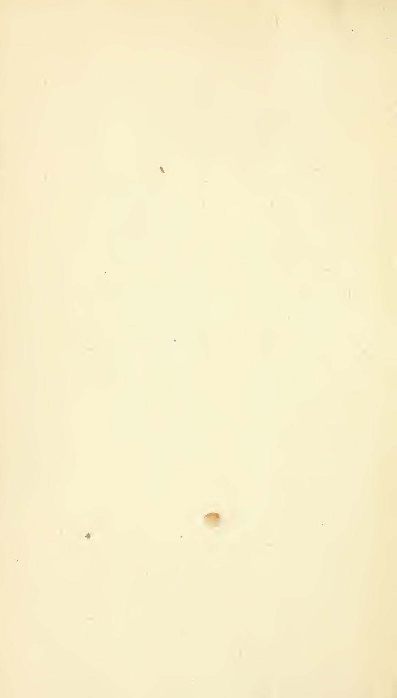
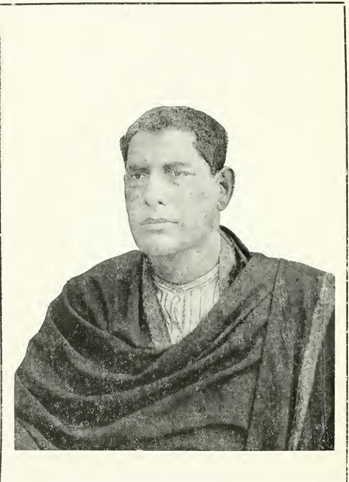
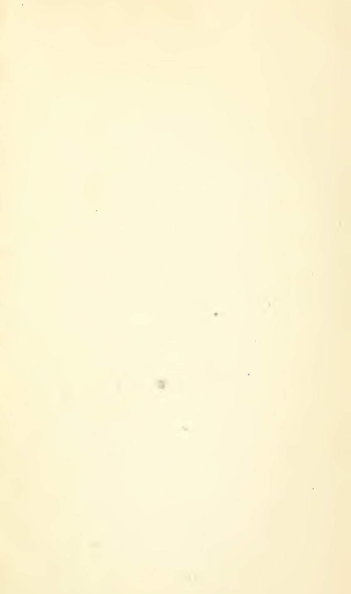
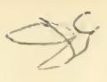
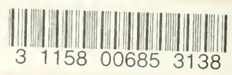
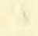

# 

Classe of a Aller And and Partie between the children The Sep 2000

100 100

Carrier, Mar

10 00 1999

R. L. BHISHAGRATHA

100 Million and

100

Burne farth and the least of

And Comments of the a

THE LIBRARY OF THE UNIVERSITY OF CALIFORNIA LOS ANGELES

Digitized by the Internet Archive in 2008 with funding from Microsoft Corporation

http://www.archive.org/details/englishtranslati03susr

# AN ENGLISH TRANSLATION

OF

.

# THE SUSHRUTA SAMHITA

### Vol. III.

UTTARA-TANTRA

. :

-

## AN ENGLISH TRANSLATION

OF

# THE SUSHRUTA SAMHITA

#### WITH

A FULL AND COMPREHENSIVE INTRODUCTION, ADDITIONAL TEXTS, DIFFERENT READINGS, NOTES, COMPARATIVE VIEWS, INDEX, GLOSSARY AND PLATES

#### (IN THREE VOLUMES)

#### EDITED BY

KAVIRAJ KUNJA LAL BHISHAGRATNA, M. R. A. S. (LOND.)

### Vol. III.

#### UTTARA-TANTRA

------------------------------------------------------------------------------------------------------------------------------------------------------------------------------

PUBLISHED BY S. L. BHADURI, E. L. 10, KASHI GHOSE'S LANE, CALCUTTA

#### 1916

All Rights Reserved.

The Criental Book-Supplying Agency, Poona.

PRINTED AT THE BHARAT MIHIR PRESS BY M. BHATTACHARYYA OF Messrs. SANYAL & Co., ' 25, ROY BAGAN STREET, CALCUTTA.

ア

1

0

,

.

-

Kaviraj Kunja La!I Bhishgratna, M.R.A.S. ( Lond.)

## PREFACE.

127 5

The a 1217

It was some years ago that we took upon ourselves the rather ambitious task of bringing out the Sushruta Samhità in English. And we may mention that the appreciation the first instalment of our undertaking met with at the hands of scholars at home and abroad considerably encouraged us in completing this huge undertaking.

We desire to record here our deepest feelings of gratitude towards His Highness the Maharaja Sir Sawai Jai Singh Bahadoor, K. C. S. I., of Alwar (Rajputana), who has, by his princely donation, enabled us to bring this highly important work to a completion. It is known throughout India that the illustrious Ruler of Alwar is a great patron of letters and a lover of Ayurvedic Science, and many noble undertakings in our country have depended largely upon his liberal support. No words of mine can adequately express my admiration for the good he is doing to our country.

Now that the whole work is before the public. its worth and importance will be duly judged Our translation does not claim to have any literary excellence, as our sole aim has been to render as faithfully as we could the original into one of the European languages. The technical terms occurring in the Sushruta Samhità cannot be

201 59 8

accurately translated into English, as there are no corresponding words in that language which would convey the exact meaning of the original. We have therefore retained the Sanskrit terms. and have in some cases put within brackets such English words as may approximately render the meaning of the original.

No apology is needed for placing before the learned world of the West a scientific treatise of ancient India. We may only mention that the Hindu system of medicine is not a thing of mere antiquarian interest. It is a living system, and even to-day millions of people in India are being treated according to this system. A system which has stood the test of centuries, and which still holds its own against rival systems of the day, cunnot be lightly brushed aside as wholly unscientific. It has been said that a system which recognises prayer as one of the means of curing human ailments, can lay no claim to any scientific character. All that we need say in answer to this criticism is that humanity has not yet risen above prayer in any country in the world, and faith in the efficacy of prayer in curing diseases is, instead of dying out, gaining ground in the modern scientific world. Whatever that may be, in actual practice, Hindu medical men, like their brethren of Europe, rely chiefly upon medicine and surgery, but occasionally prescribe prayer also as an efficient form of remedy. While recognising the influence of mind on body, and the

efficacy of faith in certain forms of disease, they treat it as a special method, falling more properly within the province of priests.

A few words, however, seem necessary to show what abiding interest there is for all time in such a work as the Sushruta Samhitá. We do not wish to enter into any historical criticism to prove that the different systems of medicine in other countries, new or old, have received more than a mere stimulus from the Indian System. and that many foreign discoveries may be traced to the work we are now presenting to the world. The opinions of some modern men of science, who cannot be accused of having any bias in favour of our system, will demonstrate its abiding value.

Surgeon General Sir Parder Lukis, M. D., I. M. S., K. C. S. I., Director-General of Indian Medical Service, was pleased to remark in the course of his speech in the Imperial Legislative Council :- '' Many of the so-called discoveries of recent vears are merely re-discoveries of the facts known centuries ago to the ancients (Indians)." In noticing the first volume of this very work, the British Medical Iournal observed in its issue of November, 1912 :- "It is certain that in this ancient medical book there are traces of knowledge which is comparatively recent in the West."

We do not know what reception will be accorded to this work by the public, but we may fairly hope that now that the ancient Indian Medical System and the Indigenous Drugs of

this country are being investigated by scientific experts under the direction of the Government of India, this ancient system of Medicine and Surgery will attract the attention of those who have hitherto neglected it as unworthy of notice.

The encouragement which we have received from the Governments of Bengal and Nepal and from the States of Baroda and Mysore, has helped us a great deal and we take this opportunity of expressing our gratitude towards them. The active help extended to us in the preparation of this work by Vaidyaratna Kaviraj Jogindra Nath Sen, Vidyabhusan, M. A., Kaviraj Madhav Chandra Tarkatirtha, Kaviraj Inanendranath Sen, Kaviratna, B. A., Prof. Satyendranath Sen, Vidyávágis'a, M. A., and Babu Sachindralal Bhaduri, B. A., B. L., we also specially and thankfully acknowledge. We offer our sincerest thanks also to Dr. U. D. Banerjee, L. R. C. P., M. R. C. S. Dr. Y. M. Bose, M. D. (Chicago), and Kaviraj Surendranath Goswami, Vidyavinode, B. A., L. M. S. who have never failed to give us their valuable suggestions whenever we have sought their advice.

I CAI.CUTTA, CARE, KUNJA LAL BHISHAGRATNA,
CON May 25, 1916, 2016, 2016, 2019, 2019, 2019, 2019, 25, 1916, May 25, 1916.

(UTTARA-TANTRA. ) ------------------------------------------------------------------------------------------------------------------------------------------------------------------------------

#### CHAPTER I.

Diseases of the eves, etc. ;- Discases of the eye and its appendages-Description of Drishti-Mandalas and Sandhis-Description of Patalas-Premonitory symploms-Causes of eye-discases-Classification-Prognosis of Vátaja-Pittaja-Kaphaja-Raktaja and Tri-doshaja cycdiseases-Scats of the eye-diseases. 1-8 ... ....

#### CHAPTER II.

Pathology of the diseases of the eye joints :- Their nomenclature-Number-Symptoms. 9-11 ... ... ...

#### CHAPTER III.

.

Pathology of the diseases of the eye lids :- Causes and names -Specific symptoms of Utsangini-Kumbhiká-Pothaki-Ars'ovartma-Anjana-Klishta-vartma-Vartma-bandliaka, etc. etc. ... 12-15

#### CHAPTER IV.

Pathology of the diseases of the sclerotic coat :- Names and number-Symptoms of S'uklárma-Lohitárma-S'uktiká-Arjuna-Pishtaka-Sirá-jála-Balása-grathita, etc. etc. ... ... 16-17

#### CHAPTER V.

Pathology of the diseases of the black part of the eye :-Number-Names-Symptoms-Prognosis-A-vrana-s'ukra Játa-Sa-Vrana-... 18-19 S'ukra-Akshi-pákátyaya-Ajaká. ...

#### CHAPTER VI.

Pathology of the diseases affecting the eyes as a whole :-Names and Causes-Symptoms of Vátaja-Pittaja-Kaphaja and Raktaja Abhishyanda-Causes of Adhimantha-Symptoms of Vátaja-Pittaja-Kaphaja-and Raktaja Adhimantha-Prognosis-Symptoms of Sa-s'opha and A-s'opha Akshi-páka-Symptoms of Hatádhimantha-Váta-paryáya - S'ushkákshi-páka-Anvato-váta - Amlá-dhyushita - S'irot-páta-Siráharsha. ... 20-24

#### CHAPTER VII.

Pathology of the diseases of the Pupil :- Description of Drishti -Symptoms-When first-second-third and fourth Patola attacked-Blindness-Specific symptoms of Vataja-Pittaja-Kaphaja and Sanni-Timira-Parimlayi-Different colours of the pupil in cases of pátika Linga-nás'a-Specific traits of Vátaja-Pittaja-Kaphaja-and Sánnipátika Linga-nás'a-Traits of Vátaja-Pittaja-and Kaphaja Vidagdha-Drishti-Smoky sight-Hrasva-Játya-Nakulándhya,-Gambhiriká-Symptoms of traumatic Linga-nás'a. : 25-31 ...

#### CHAPTER VIII.

Classification and treatment of ocular affections :- Classification-Names of Chhedya-Lekhya-Bhedya-Vyádhya eye diseases -Names of eye-diseases where operation not to be risked-Names of curable and incurable eye-diseases. ... 32-33

#### CHAPTER IX.

Treatment of Vataja Ophthalmia :- Tarpana-Puta-páka-Fumigation-Snuff-Wash-Eye-drop-Collyrium-Treatment of Anyatováta-Váta-paryáya-S'ushkákshi-páka. ... 34-37

#### CHAPTER X.

Treatment of Pittaja Ophthalmia :- Tarpana measures-Wash -Snuff-Anjana-Rasa-kriyá-A's'chyotana-Treatment of S'ukti-páka 38-40 and Dhuma-dars'i.

#### CHAPTER XI.

Treatment of Sleshmaja Ophthalmia :- Fomentation-Anjana -Treatment of Balása-grathita-Pishtaka-Praklinna-vartma. ... 41-46

#### CHAPTER XII.

Treatment of Raktaja Ophthalmia :- Venesection-Inhalation -Eye-drop-Snuffs- Plaster- Vartis- Treatment of S'irotpata- Siráharsha-Arjuna. - Scarifying- Anjana-Treatment of S'ukra- Kshára-Anjana-Soothing applications-Treatment of Ajaká-Akshi-páka -Puyálasa-Praklinna-Vartma and Aklinna-Vartma. ··· 47—53 ...

#### CHAPTER XIII.

Treatment of Lekhya-roga :- Mode of treatment by Scarification -Satisfactory-defective and excessive scarification-Names of diseases amenable to scarification. ··· 54-56 ... . . . ...

#### CHAPTER XIV.

Treatment of eye-diseases which require Incision :- Treatment of Visa-granthi-Lagana-Anjana-Krimi-granthi and Upanáha. -Application of Sneha and Sveda. 57-58 ... :

#### CHAPTER XV.

Treatment of eye diseases which require Excision :- Treatment of Armans-Preliminary actions-Mode of operation-Medicinal treatment-Treatment of Sirá-jála-Sirája-pidaká-Parvaniká. - Churna-Anjana-Treatment of the inner part of the eye-lids. 59-63

### CHAPTER XVI.

Treatment of diseases peculiar to eye-lashes and eye-lids :-Surgical treatment of Pakshma-kopa-Preliminary actions-Mode of operation- Cauterisation and other measures. .... 64-65 • • •

#### CHAPTER XVII.

Treatment of diseases of pupil and crystalline lens :- General treatment of Pitta and S'leshma-Vidagdha-Drishti. - Pushpanjana-Dravánjana-Gudikánjana - Treatment of Day-blindness - Nocturnal blindness-Application of Vartis-Ras -kriyánjana-Kshudránjana-Treatment of a palliative type-Triphala.Ghrita-Navana-errhines-Putapáka-Pratyanjana-Treatment of Pittaja-Vátaja-Kaphaja and Tridoshaja Kacha-Fumigation-Treatment of Parimláyi-Diet-Bloodletting-Treatment of Timira-Prognosis-Surgical treatment of Kaphaja Linga-nása-Its after-measures-Symptoms and treatment of the disorders resulting from an injudicious operation-Causes of relapse-Symptoms produced by the defects of the S'aláká-Description of the S'aláká-Derangements due to defective operations-Their treatment-Eye-sigitinvigorating Anjanas and Vartis. 66-83 ... . • :

### CHAPTER XVIII.

Preparations and medicinal measures for ocular affections in general :- The Tarpana measures - Mode of application-Symptoms of satisfactory-excessive and defective Tarpana-Treatment of excessive and defective Tarpana-Cases of Tarpana-The Puta-paka measures-Emulsive-Scraping and Healing Puta-paka-Preparations of Snehana-Lekhana and Ropana Puta-paka-Prohibition and Remedies for infringements-Symptoms of satisfactory-excessive-and defective applications of Puta-paka-Mode of preparing Puta-páka-Mode of application- As'chyotana and Seka-their classes-Maximum time for Seka-Time for application-S'iro.vasti-Lekhana-Ropana and Prasádana Anjana-Forms of Anjana-Their size and dose-Materials of vessels and rod for the use of Anjana - How to apply Anjana - Forbidden cases for the application of Anjana-Symptoms of satisfactory-excessive and deficient use of Lekhana Anjana—I'rasádana Anjana—Ropana Anjana—Recipe of several principal Anjanas-Bhadrodaya-Anjana-Vartis-Findánjana. ... 84-101

#### CHAPTER XIX.

Treatment of hurt or injury to the eye :- General Treatment-Prognosis-Treatment of sunken eye-Symptoms and treatment of Kukunaka-Conclusion. 102 -- 105

#### CHAPTER XX.

Causes and symptoms of Ear-disease :- Classifications-Symptoms of Karna-s'ula-Pranáda-Vádhirya-Kshveda-Karna-sráva-Karnakandu-Karna-gutha-Karna-pratináha - Krimi-karna-Karna-vidradhi-... I06-108 Karna-páka-Puti-karna. ...

#### CHAPTER XXI.

Medical Treatment of Ear-disease :- General Treatment-Treatment of Vataja ear-disease-Karna-s'u!a-Pranáda-and Vádhiryya. -Siro-vasti-Dipika-Taila-Different kinds of Ear-drop-General and specific treatment of Pittaja car-sche and Kaphaja Karna-Sula-Treatment of Deafness-General and Special Treatment of Puti-karna-Karna-sráva Krimi-karna - Karna-kshveda - Vidradhi, etc. - Karnakandu-Karna-páka. .... ... 109-117 ...

#### CHAPTER XXII.

Causes and symptoms of diseases of the nose :- Nomenclature and Classification-Symptoms of Apinasa-Puti-nasya-Nasá-páka-Rakta-pitta-Puya-rakta-Kshavathu-Bhrams'athu - Dipti-Pratináha-Parisráva-Pari-s'osha-Ars'as-S'opha-Arvuda-Pratis'y áya 118-120

#### CHAPTER XXIII.

Therapeutics of nasal diseases :- Treatment of Puli-na. ya-Apinasa. - Diet-Errhines-Treatment of Násá-páka-S'onita-pitta-Puyarakta-Kshavathu-Bhrams'athu-Dipti -Nasánáha - Nasa-sráva-Násás'osha etc. I21-122 ...

#### CHAFTER XXIV.

Symptoms and treatment of Catarrh :- Causes-Premonitory symptoms -- Specific symptoms of Vátaja -- Pittaja -- Kaphaja -- Tri-doshaja types-Raktaja-pratis'yaya-Prognosis-General treatment of Pratis'yáya-Regimen of diet and conduct-Treatment of Vataja-Pittaja-Kaphajaand Tri-doshaja types. 121-130 ....

#### CHAPTER XXV.

Symptoms of diseases of the head :- Classification-Symptoms of Vátaja-Pittaja-Kaphaja-Tri-doshaja-Kshayaja-Raktaja-Krimija S'iro-roga-Symptoms of Suryávarta-Ananta-váta-Ardháva-bhedakaand S'amkhaka. 131-133 ... ...

#### CHAPTER XXVI.

Treatment of diseases of the head :- Treatment of Vataja -Pittaja-Raktaja S'viroroga-Food-Treatment of Kaphaja-Tri-doshaja Kshayaja-Krimija-Ardháva-bhedaka- Ananta-váta-and S'amkhaka. -Conclusion. ... ... . • • • 134-140

Here ends the Salakya-Tantra.

#### CHAPTER XXVII.

Specific features of nine malignant Grahas :- Different names -General course of attack-Symptoms of attack by Skanda-Skandápasmára-S'akuni - Revati-Putaná- Andhá-putaná-Sita putaná-Mukhamandika-Naigamesha -Prognosis-Rules to be observed. ... I4I-I44

#### CHAPTER XXVIII.

Therapeutics of an attack by Skanda Graha :- General treatment-Fumigation-Mantras ... 145-146 ... . •

#### CHAPTER XXIX.

Therapentics of an attack by Skandapasmara :- General treatment-Sprinkling-Anointment- Utsadana-Funigation-Religious propitiation-Mantras. ... ... 147-148

### CHAPTER XXX.

Treatment of an attack by Sakuni graha :- Sprinkling-Anointment-Pradeha-Fumigation-Religious propiliation-Mantras. 149-150

#### CHAPTER XXXI.

Theraputics of an attack by Revati-graha :- Sprinkling-Anointment-Plaster-Religious propitiation-Mantras. ... ... 151-:52

### CHAPTER XXXII.

Treatment of an attack by Putana-graha :- Washing-Anointnient-Funigation-Religious propitiation-Mantras. ... 153-154

#### CHAPTER XXXIII.

Treatment of Andha-putana-graha :- Sprinkling-Plaster-Fumigation-Religious propitiation-Mantras. ... 155-156 ...

### CHAPTER XXXIV.

Treatment of an attack by Sita-putana :- Sprinkling-Fumigation-Anointment-Religious propitiation-Mantras. ... 157

### CHAPTER XXXV.

Treatment of an attack by Mukha-mandika :- Srrinkling-Anointment-Fumigation-Religious propitiation-Mantras ... 158

### CHAPTER XXXVI.

Treatment of an attack by Naigamesha :- Sprinkling-Anointment-Utsádana-Fumigation-Religious propitiation-Mantras. 159-160

#### CHAPTER XXXVII.

Origin of nine Grahas :- The nine presiding deities. ... 161-163

#### CHAPTER XXXVIII.

Symptoms and Therapeutics of the diseases of the female organ of generation :- Causes. - Enumeration-Classification-Names -Symptoms of Vátaja-l'ittaja-Kaphaja-and Tri-doshaja types-Medical treatment.-Internal and External treatment. ... 164-168

#### Here ends the Kaumara-bhritya-Tantra.

#### CHAPTER XXXIX.

Symptoms and Treatment of Fever :- Description of Iwara-Definition and classification-Pathology-Premonitory symptoms-Symptoms of Vátaja-Pittaja-Kaphaja and Tri-doshaja fever-Abhinyásafever-Hataujas - Sannyása-Dwandaja fever-Váta-pitta-fever - Váta-S'leshma-fever-Pitta-S'leshma fever-Pralepaka-Tritiyaka (tertian) and Cháturthaka (quartan) fever-Vishama-fever-Seat and duration of Vishamajwara-Satataka-Anyedyushka-Tritiyaka-Cháturthaka - Action-Influcnce of Váyu on Vishama fever-Agantuka fever duc to the effects of voison - Hay-fever-Gambhira fever and its prognosis-General treatment-Fasting-Probibition of fasting-Effect of fasting-Satisfactory and excessive fasting-Tepid water-Cold water-Peya-Yavagu-Symptoms of Pakya and Ama-jwara-Time for administering febriluge-Preliminary treatment -Application of Vasti and S'iro-virechana-Administration of Ghrita-Diet-Laja-tarpana-Milk as a diet-Meat-diet-Prohibitions in fever-Sams'amana decoctions for Vataja-Pittaja and Kaphaja fever-Treatment of Kapha-Vata-Pitta-S'leshma-Vaja-pitta fever and Tri-doshaja fever-Treatment of Vishama-jwara-Ghrita in cases of Vishama fever-Guduchyádi ghrita - Kalasyádi-ghrita - Mahá-kalyána-ghrita - Panchagavya ghrita- Triphalá-ghrita--Pancha-sára-Medicated Tailas-Fumigations and Anjanas-Treatment of shivering and burning sensation-General and specific treatment of the complications-Application of Vastis-Symptoms of the remission of fever. .... 160-211

#### CHAPTER XL

Symptoms and treatment of Diarrhea, etc :- Causes-l'atho. logy- Premonitory symptoms-Symptoms of Valaja-Pittaja-Kaphaja and Tri-doshaja types-Symptoms of S'okaja and Amaja Atisára-Symptoms of Ama and Pakva Atisára-Prognosis-General treatment-Twenty different Recipes for Amatisara-Fasting-Six Yogas for Pittaja Atisára-Astringent remedies-Application of Ghrita-Putanaka-preparations-Peyá-Treatment of thirst-Use of milk-Asthápana and Anuvásana Vastis -Pichchhá-Vasti-Diet-Causes and symptoms of Pakvátisára-Treatment and Symptoms of Pravahika-General Treatment-Application of Vastis -Diet-Medical treatment-Yavagu-General principle of treatment-Indications of cure-Static or dynamic causes of diseases and treatment-Grahani-Premonitory symptoms of Grahani-Symptoms-Specific symptoms of Vataja-Pittaja-Kaphaja and Tri-doshaja Grahani-Treat-212-236 ment and diet. ...

#### CHAPTER XLI.

Symptoms and Treatment of Phthisis :- Nomenclature-S'osha -Kshaya-Raja-yakshina-Etiology and general symptoms-Specific symptoms of Vataja-Pittaja and Kaphaja types-Prognosis-Other causes of Sosha and their symptoms-Premonitory symptoms-Prognosis-Treatment-Diet-Meat, etc. - Utsadana- Medicated Ghritas-Eládi-mantha-Use of goat's flesh, milk, etc .- Rules of conduct. 237-245 ...

#### CHAPTER XLII.

Symptoms and Treatment of Gulma :- Definition and Number-Localisation and Nomenclature-Premonitory Symptoms-Specific Symptoms of Vátaja-Pittaja-Kaphaja and Tri-doshaja types-Symptoms of Raktaja Gulma-General Treatment of Vátaja-Pittaja-Kaphaja-Tridoshaja and Raktaja types - Uttara-Vasti - Anuvásana - Chitrakaghrita - Hingvádi-ghrita - Dádhika-ghrita - Rasona-ghrita. - Ghritas in Pittaja-Raktaja and Kaphaja Gulma. - Internaluse of Kshara-Virschirárishta-Blood-letting-Diet and Sveda. - Peyá-Khada-yusha-Fomentation-Medicated plugs-Supervening symptoms - Prohibited articles-Causes and Symptoms of Sula-Symptoms of Vátaja-Pittaja-Kaphaja and Sannipátika S'ula .- General treatment-Treatment of Vátaja-Pittaja-Kaphaja and Tri-doshaja S'ula. - Symptoms and treatment of Partya-Sula. - Symptoms and treatment of Kukshi-Sula -- Symptoms and treatment of Hrich-chhula - Symptoms of Vasti-S'ula-Mutra.S'ula -Vit-S'ula and Annaja S'ula .- Their treatment. 246-264 ...

#### CHAPTER XLII.

Symptoms and Treatment of Heart-disease :- Etiology and Nomenclature-Number-Specific Symptoms of Vátaja—Pittaja—Kaphaja and Krimija types-Supervening Symptoms-Medical treatment of Vátaja—Pittaja—Kaphaja and Krimija types. 265-268 .... ...

#### CHAPTER XLIV.

Symptoms and Treatment of Jaundice, etc. :- Etiology and Nomenclature-Premonitory Symptoms-Specific Symptoms of Vátaja-Pittaja - Kaphaja and Tri-doshaja types - Symptoms of Kamalá-Kumbha-Kamala-Lagharaka and Halimaka. - Supervening Symptomss

General treatment -Treatment of -- Kamala-Kumbha-kamala-Lagharaka - Articles of Diet-Treatment of Supervening Symptoms - Prognosis. ... 269-276

#### CHAPTER XLV.

Symptoms and Treatment of Hamorrhage :- Cause and Pathology-Prognosis-Premonitory Symptoms-Supervening Symptoms-Symptoms of incurable types-General principles of treatment .- Emetic-Purgative-Fasting-Articles of fare-Diet-Lambatives-The best six Yogas-Ásthápana and Anuvásana-Treatment of down-coursing type-Uttara-vasti. ..... 277-284 ....

### CHAPTER XLVI.

Symptoms and Treatment of Fainting fits :- Definition-Classification-Premonitory symptoms-Specific symptoms-General treatment -Specific treatment .- Symptoms of Sannyasa -- Treatment-Incurable type-Diet. ... ... 285-288

#### CHAPTER XLVII.

Symptoms and Treatment of Alcoholism :- Properties and action of wine-Evil effects of drinking-Three stages of Alcoholic intoxication-Cases where wine is prohibited .- Specific symptoms of Panatyaya -symptoms of Vátaja-Pittaja - Kaphaja and Tri-doshaja types-Symptoms of Para-mada-Panajirna-and Pana-vibhrama -Prognosis-Treatment of Vátaja-Pittaja-Kaphaja-Tri-doshaja and Dvi-doshaja types. - Pánaka-Treatment of Para-mada-Pánájirna-Pána-vibhrama and Pánátyaya-Treatment of Thirst-Remedies for Daha. - Symptoms and treatment of Raktaja .- Daha due to thirst-Accumulation of blood-Due to Kshaya-Due to hurt of Marma. - Their Treatment-Mode of drinking wine. ... 289-301 ....

### CHAPTER XLVIII.

Symptoms and Treatment of thirst :- Etiology-Classification-Premonitory symptoms-Symptoms of Vátaja-Pittaja-and Kaphaja types .- Symptoms of Kshataja-Kshayaja-Amaja and Annaja thirst. -Prognosis-General treatment-Specific treatment-Treatment of Kshataja - Kshayaja and Amaja thirst .- General treatment. 302-308

ಸ

#### CHAPTER XLIX.

Symptomsiand Treatment of Vomiting :- Causes and Nomenelature-Premonitory symptoms-Specific symptoms of Vátaja-Pittaja-Kaphaja-and Tri-doshaja types-Traumatic cases-Prognosis-General treatment-Treatment of Vataja-Kaphaja and Pittaja types. - Vomiting due to pregnancy. - Treatment of traumatic and Krimija types. - General treatment-Diet. ... 309-313

#### CHAPTER L.

Symptoms and Treatment of Hic-cough :- Causes-Derivation -Classification-Premonitory symptoms-Symptoms of Annajá-Yamalá - Kshudriká-Gambhirá-and Mahá-hikká. - Prognosis-Their treatment -Four liquid compounds-Meat as diet. 314-318

#### CHAPTER LI.

Symptoms and Treatment of Asthma :- Etiology-Classification -Premonitory symptoms-Specific symptoms of Kshudra-Tamaka-Pra-tamaka-Chhinna-Mahi-and Urdhva-S'vása. - Prognosis-General treatment. - Ilinsrádi-ghrita - S'ringvádi-ghrita-Suvahádi-ghrita-Tális'ádi-ghrita - Meat as diet. - The five Lambatives-Utkáriká-Articles recommended - Application of Sneha and Dhuma -- Purging and Vomiting. . . . ... 319-325

#### CHAPTER LII.

Symptoms and Treatment of Cough :- Causes and Etiology-Classification-Premonitory symptoms .- Specific symptoms of Vátaja-Pittaja—Kshataja and Kshayaja types. —General Treatment-Inhalation of Dhuma -Treatment of Vátaja - Pittaja -- Kaphaja-Kshayaja and Kshataja Kása. - Kalyána-guda-Agastya-leha. ... 326-337 ....

#### CHAPTER LIII.

Symptoms and Treatment of Hoarseness :- Etiology-Symptoms of Vátaja - Pittaja - Kaphaja and Tri-doshaja types. - Symptoms of Kshayaja and Medoja types -Prognosis-General Treatment-Treatment of Vátaja - - Pittaja - Kaphaja - Tri-doshaja - Kshayaja and Medoja types. 335-337

#### CHAPTER LIV.

Symptoms and Treatment of Worms :- Causes-Classification-Names and symptoms of Purishaja-Kaphaja-Raktaja worms .- Specific causes-General symptoms - Prognosis-Their Treatment .- Treatment of Romada and Dantada worms-Diet. 338-343 ... ...

### CHAPTER LV.

Symptoms and Treatment of Udavartta :- Causes-Classification-Symptoms of Vátaja-Purishaja-Mutraja Udávarta .- Repression of Yawning-Tears-Sneezing-Eructation- Vomiting - Seminal discharge -Hunger-Thirst-Breath and Sleep .- Prognosis-Their General Treatment-Their Specific treatment. - Treatment of Adhmána. - Udávartta due to errors of diet-Its treatment. · -... 344-351

#### CHAPTER LVI.

Symptoms and Treatment of Visuchika :- Causes-Definition -Symptoms-Alasaka-Vilambika -Prognosis - General Treatment -Ksharagada-Kalyána-lavana-Diet. - Causes and Symptoms of Anaha -Treatment. ... ... 352-356 . 나

#### CHAPTER LVII.

Symptoms and Treatment of Arochaka :- Etiology-Classification-Symptoms of Vataja-Pittaja- Kaphaja and Tri-doshaja types. -Their Treatment - Four specific Lambatives - Regimen of diet decoction - Arishta and Asava. - Treatment of Manasa Use of Arochaka. ... . . . 357-360 ...

#### CHAPTER LVIII.

Symptoms and Treatment of suppression of Urlne :- Classification-Symptoms of Váta-knndaliká-Vátásthilá-Váta-vasti-Mutrátita -Mutra-jathara-Mutra-sanga-Mutra-kshaya - Mutra-granthi -- Mutrasarkara-Ushna-vata and two kinds of Mutrauka-sada. - General treatment -Application of Uttara-Vasti. 361-368 . …

#### CHAPTER LIX.

Symptoms and Treatment of the defects of Urine :- Classification-Symptoms of Vátaja-Pittaja-Kaphaja and Sánnipátika types - Ulcer or injury in the Urethra-Mutra-ghata due to Stone or Gravel-General Treatment-Treatmet of Vataja-Pittaja-Kaphaja and Tridoshaia types. - Treatment of Abhighátaja and Purishaja types. 369-372

#### Here ends the Kaya-chikitsa.

#### CHAPTER LX.

Symptoms and Treatment of the diseases brought on through Superhuman influences :- Action of Graha-Causes of influence by a Graha-Indications of attack by Grahas-Deva-graha- Asura-graha-Gandharva-graha-Yaksha-graha-Pitri-graha- Bhujanga-graha - Ráksbasagraha and Pis'acha-graha. - Progonosis-Times of their Possession-Explanation of Bhuta-vidya. - Gencral and religious treatment-Their specific religious treatment-Medical treatment-Special treatment. ... 373-380

#### CHAPTER LXI.

Symptoms and Treatment of Apasmara :- Derivative significance-Causes-Nomenclature-Premonitory Symptoms-Symptoms of Vátaja-Pittaja-Kaphaja and Sannipátaja types. - Discussion on its causes. - General treatment-Specific treatment - Siddhartha-ghrita-Pancha-gavya-ghrita-General treatment-Preparation of special wine-Venesection. 381-386 .... :

#### CHAPTER LXII.

Symptoms and Treatment of Insanity :- Derivation-Classifications of Vataja-Pittaja-Kaphaja and Tri-doshaja types-Symptoms of S'okaja and Vishaja types-General treatment-Treatment by frighten ing acts-Diet-Maha-Kalyána-ghrita - Kalyána-ghrita - Phala-ghrita-Vartis-Venesection. 387-391 . • •

Here ends the Bhuta-Vidya-Tantra.

### CHAPTER LXIII.

Different Combinations of six different Rasas :- Taken two at a time-Three at a time-Four at a time-Five at a time-Six at a time-One at a time. .. .. ... ... ··· 392-395

#### CHAPTER LXIV.

Rules of Health :- Indications of Health-Its importance-Regimen of diet and conduct in the rainy season-Rules for autumn-Hemanta-Winter-Spring-Summer and for Pravrit. - Different kinds of food-When and how to be taken .- Ten proper times for administration of Medicines-Their names-Definitions and Effects-Proper time for taking food. . . . ... ... ... 396-405

#### CHAPTER LXV.

The Technical terms used in the treatise :- Names of the Technical terms-Necessity-Their definitions and examples. 406-413

#### CHAPTER LXVI.

The different Modifications of the different Doshas :-Number of different diseases. - Number of drugs .- Different combinations of the three Doshas-Their number. ... ... 414-416 ...

End of the Contents of the Uttara Tantra.

-: 0 :--

xiv

. ッ .

## द्यों

### THE

# SUSHRUTA SAMHITÁ. UTTARA-TANTARAM.

(SUPPLEMENTARY PART OF THE TREATISE).

ー:0:一一

### CHAPTER I.

Now we shall discourse on the chapter which deals with the diseases, viz., of the eye, etc. (Aupadravikam adhyayam). 1.

Here commences that portion of the Susruta Samhitá which is known as the Uttara Tantra (the supplementary part) to which references have been often made in the preceding one hundred and twenty chapters. as the fit place wherein to revert in detail to the topics cursorily mentioned therein. This part comprises within it the specific descriptions of a large and a varied number of diseases, viz., those which form the subject matter of the Salakya-Tantra (Diseases of the eye, car, nose and throat) as narrated by the king of Videha ; the ætiology and symptomatology, etc. of diseases peculiar to infants and women (Kaumarabhritya), the pathology, etc., of those diseases mentioned in the six books of the Practice of Medicine par excellence (Kaya-chikitsa) compiled by the holy sages of old and diseases known as Upasarga (e.g. Bhutopasarga

-Demonology) as well as diseases of traumatic origin are also included in this supplementary text*. Hercin are also mentioned the sixtv-three combinations of the six different Rasas (tasces) as well as the laws of health and hygiene with their rationale (rules, interpretation and reasonings) and the classifications of different Doshas and organic principles of the body and various accessories and remedial agents required for their successful treatment and cure. 2.

I shall now begin with the description of the numbers, the pathology and the curability or incurability of those specific ailments of the body which are peculiar to the region of the head out of a myriad of other distempers reserved for treatment in this portion of the work (Uttara-tantra) which may be compared to the unfathomable deep in respect of the vastness of its depth and magnitude. 3.

Diseases of the eye and its appendages :- The eye-ball (Nayana-Budbuda) is two fingers (about an inch) in transverse diameter, about the breadth of one's own thumb in depth (Sagittal diameter), and two fingers and a half all round (in circumference). The eye-ball is almost round in shape and resembles the teat of a cow. It is made up of all the (five) elements of which the universe is built up. The element of the 'solid' earth (Bhu) contributes to the formation of its muscles, the element of 'heat' (Agni or Tejas) is in the blood (that courses in its veins and arteries). 'the gaseous element' (Vavu) contributes to the formation of the black part (Iris, etc.) in which the pupil is situated, the fluid element (Jala) preponderates-in the >lucid

(I) The text has Agantuka (traumatic diseases). Gayadasa explains it to mean Apasmára, Unmida, etc. (Hysteria, insanity, etc.),

(white) part (Vitrcous body) and the void (ethereal) Space (Ákâsa) is there to form lachrymal or the other ducts or sacs (Asrumarga) through which the secretions are discharged. 4.

I shall now proceed to describe the Drishti (the central part of Retina-'Macula Lutea') as set forth by expert ophthalmic physicians. The black portion of the eve (Krisbna-mandala-Choroid) forms one third vart of its whole extent while the Drishti, according to them, occupies only one-seventh part of the Krishna-mandala. The Mandalas or sub-divisions or circles of the eve-ball. the Sandhis or loints (parts where these sub-divisions meet with one another) and the Patalas (layers or coats) of the eye are respectively five, six and six in number. 5-6.

Mandala and Sandhi :- The Mandalas of the eye are the following, viz., (1) the Pakshma-mandala (the circle of the eve-lashes), (2) the Vartma-mandala (the eye-lid) (3) the Sveta-mandala (the Sclerotic and Cornea), the Krishna-mandala (the choroid) and (4) the Drishtimandala (the pupil). These circles are so arranged that the one preceding lies within the next in the list.* The Sandhis (which serve as lines of demarcation of the circles) already pointed out are six in number, the first binding the eye-lashes (Paksha-mandala) with the eyelids (Vartma-mandala), the second the eve-lids and the Sclerotic coat (Sveta-mandala), the third binding the latter with the Krishna-mandala (choroid), the fourth situated between the latter and the Drishti-mandala, the fifth lying in the interior corner (Kaninakas) and the last (sixth) in the exterior (posterior) corner (Apangas) of the eye. 7-8.

* Evidently some line or lines are missing here as the line cannot give a complete sense by itself. Ed.

The Patalas :- Of the Patalas, two are in the eye-lid (Vartma-mandala) and four in the eyc proper. wherein occurs the dreadful disease known as the Timira (loss of vision). Of these four the first or anterior coat (Patala) supports the humour Tala and light (Tejas), * the second coat or Patala (choroid) is supported by muscles ; the third coat or Patala (Sceroim and Cornea) consists of Medas (lit. fat) and there is the fourth which is a fifth part of the whole and is known as the Drishti. There are, however, divisions and subdivisions of these coats. 9.

The different parts of the eye-ball are held together by the blood-vessels, the muscles, the Vitreous body and the choroid.+ Bevond the choroid, the eve-ball is held (in the orbit) by a mass of Sleshmá (viscid substance-capsule of Tenon) supported by a number of vessels. The deranged Doshas which pass upward to the region of the eyes through the channels of the upcoursing veins and nerves give rise to a good many dreadful diseases in that region. Io.

Purva-rupa, etc. :- Cloudiness of vision, slight inflammation, lachrymation, mucous accumulation, heaviness, burning sensation, sucking pain (D. R .- aching pain) and redness in the eyes are indistinctly manifest (in the incubatory stage) in such cases. In cases of an inflammation of the Vartmas (eye-lids) the eye seems as if studded with the bristles of worms (Suka) and attended with pain (as if pricked into with thorns) and a sensible impairment of the faculty of the eyes in detecting

* By "Jala" is meant here the serum (Rasa) in the skin, and by "Tejas" the blood in the veins (Sirá) carrying the (Tejas) known as the A'lochaka.

+ D. R. vessels, muscles and aqueous humour (Medas) are most important for the maintenance of Krishna-mandala.

colours and in closing and opening the eve-lids freely. An intelligent physician will conclude from these symptoms that the eves have been affected by the (deranged) Doshas, with a due consideration whereof the remedies should be (carefully) administered, otherwise the evediseases might become too serious. The simple maxim or principle to be followed in the treatment of a disease is simply to forego the primary pathological causes of that disease. The special remedial measures that would pacify the different Doshas, Vâyu, etc. have been described in detail. 12-13.

Causes of Eye-disease :- The local Doshas deranged and aggravated by such causes as diving in water immediately after an exposure to the heat and the glare of the sun, (constant) gazing at distant objects, sleep in the day time and keeping up late hours in the night, fixed and steady gaze, excessive weeping or over-indulgence in grief, worry and fatigue, a blow or a hurt, sexual excesses, the partaking (in inordinate quantities) of Sukta, Aranála (fermented rice-water), acid gruel, Masha pulse, and Kulattha pulse, voluntary repression of any call of nature, exposure (of the eves) to smoke or dust, trickling down of the drops of sweat (into the eyes), excessive or impeded vomiting, repression of tears, constant contraction of the eyes to adjust the sight to extremely small objects, etc., beget disorders of the organs of vision. IA.

Classification of the Eye-diseases : -Seventy-six different kinds of eye-diseases have been come across in practice ; of these ten are originated by the deranged Vayu, ten by Pitta and thirteen by Kapha. Sixteen are produced by vitiated blood, and twenty-five by the concerted action of the deranged Doshas (Tri-Doshaja), and lastly, two are produced by

external causes i. e., they are traumatic in their origin.

Prognosis of the Vátaja Type :- Of the diseases of the eyes which are due to the action of the deranged Vayu, those known as Hatádhimantha, Nimisha. Gambhirikâ affecting the vision, and Váta-hatavartma (Váyu-afflicted Sclerotic coat) is said to be incurable. A temporary cure(Yápya) is all that can be effected in a case of Kácha (cataract) due to the action of the deranged bodily Vávu : while the affection of the eves known as the Anyato-Vata, Adhi-mantha (ophthalmia), Sushkàkshi-páka, Abhishyanda and Maruta-Paryaya are curable. 16.

Prognosis of the Pittaja Type :- Of the diseases due to the deranged action of the Pitta known as Hrasva-jádya and Jala-srâva should be deemed incurable ; and palliative measures are the only remedies in cases of Kacha, Parimlàyi and Nila, while Abhishynda, Adhi-mantha Amládhyushita, Sùktiká, Pitta-Vidagdha-Drishti, Pothaki and Lagana are curable. 17.

Prognosis of Kaphaja Type :- Of the diseases due to the aggravation of Kapha, the one known as the Sràva-roga is incurable and (Kaphaja) Kácha (cataract) admits of only palliative treatment, while a cure may be be effected in the following cases, viz, Abhishyanda (conjunctivitis), Adhi-mantha, Balása-Grathita, Sleshma-Vidagdha-Drishti, Pothaki, Lagana, Krimi-granthi, Pariklinna-Vartma, Suklárma, Pishtaka, Šleshmo-panáha. 18.

Prognosis of the Raktaja Type :- Of the diseases of the eyes due to the vitiated condition of the blood, those known as Raktasráva, Ajakájâta, Avalambita (pendent), Sonitársas and Sukra-roga should be regarded as incurable, and the type of §Kácha (cataract) due to the same cause admits of only palliative measures, while the diseases known as Adhi-mantha, Abhishyanda, Klishta-vartma, Sirâ-harsha and Sirotpàta, Anjana, Sirâ-jàla, Parvani, Avrana (non-ulcerated), Sukraroga, Sonitarma and Arjuna may be included within the group of curables. 19.

Prognosis of the Tridoshaja Type, etc. :- Of the eye-diseases due to the concerted action of the three aggravated Doshas, those known as Puyasráva. Nakulándhya, Akshipákátyaya and Alaji are incurable and palliative measures are only possible in cases of Kâcha (cataract) or Pakshma-kopa ; while those known as Vartmávabandha, Sırája-pidakâ, Prastárvarma. Adhi-mánsárma, Snayvarma, Utsangini, Puyálasa, Arvuda, Syáva-vartma, Kardama-vartma, Arsovartma, Sukrársas, Sarkará-vartma, the two forms of inflammation with or without local swelling known as) Sasopha-paka and Asopha-páka, Bahala-vartma, Kumbhiká and Visa-vartma yeild to the curative efficacy of appropriate remedial agents. Both the forms of eye-disease due to the external causes* should be considered as incurable. 20-21.

Their Localities :- Thus we have finished enumerating the seventy-six types of eye-diseases, of which nine are confined to the Sandhis (binding unions), twenty-one to the Vartma (eye-lids), eleven to the Sukla-bhaga (the Vitreous body), four to the Krishna bhaga (the region of the Choroid), seventeen to the entire region (cyc-ball) and twelve to the Fregion of the Drishti (pupil or the "crystalline lens, etc.). The

*The one due to any external blow or hurt (Sa-nimitta) and the other originating from the sudden sight of any celestial being of extreme brilli. ancy (A-nimitta).

[Chap. I.

two cases due to the extraneous cause (are chiefly located in the Drishti though affecting the whole of the eye-ball and) arc very painful and incurable. The characteristic symptoms of all these will be hereaftcr described in detail. 22-223.

Thus ends the first chapter of the Uttra-tantra in the Sus'ruta Samhitá which deals with the diseases, viz. of the eye, etc.

Now we shall discourse on the chapter which deals with the pathology of diseases which are peculiar to the joints or binding membranes of the eye (Sandhigata-Roga-Vijnaniya).

The names of those diseases :- Diseases peculiar to the joining (Sandhi) of the eye are nine in number and are named Puyálasa, Upanáha, (the four kinds of) Sráva (viz. Puya-sráva, Sleshma-sráva, Raktasráva, Pitta-sráva), Parvani, Alaji and Krimi-granthi. 2.

Symptoms of Puyalasa and Upanaha :- A suppurated swelling occurring at any of these joining and exuding a sort of fetid and dense * pus is called Puyalasa. A painless cyst (Granthi) of considerable size occurring at the union of the pupil (with the Krishna-mandala) and attended with an itching sensation and a little suppuration is called Upangha. 3. A.

Symptoms of Srava :- The ( deranged ) Doshas + of the locality passing through the lachrymal ducts into the binding tissues of the four different Sandhis (joinings) set up a painless ! secretion (Srava) from the localities characterised by the specific symptoms of the different Doshas involved. These are known as Sravas, which according to some, are also called

* According to Madliava's reading, the swelling should be painful (सतोट:). There is no mention whether the pus should be dense (सान्ट्र) or otherwise.

+ The term "Dosha" here means S'leshmá, Pitta, Rakta (blood) and the concerted action of the above three Doshas. It should be noted that Vayu is excluded from the list as it does not produce any secretion.

* Madhava does not mention this (painlessness) to be a symptom.

Netra-nadi and are classified into four different groups, the different symptoms of which will be described presently. A suppuration (D. R. swelling) in any of the unions (Sandhi) of the eye marked by a discharge of pus is called Puya-srava. This is due to the concerted action of the Doshas (Kapha, Pitta and blood). The secretion of slimy, white and thick muco-purulent discharges marked by the absence of pain * is called Sleshma-srava. The flow of thin, warm+ and blood-streaked copious discharge due to a contaminated state of the local blood is called Rakta-srava. A warm, water-like and yellowish blue (D. R. reddish yellow) discharge from the middle part of the union (owing to the deranged condition of the Pitta) is called Pitta-srava. 3.

Symptoms of Parvani, etc. :- A small, round and copper-coloured swelling occurring at the joining of the Krishna-mandala and Sukla-mandala, due to the vitiated state of the local blood and attended with a burning sensation and aching pain, is called Parvani. A swelling possessed of the preceding features and occurring at the very same joining is called Alaji (Keratitis) !. A cyst or swelling (Granthi) characterised by an itching sensation appearing on the joining of the eye-lids and eye-lashes owing to the germination of parasites (Krimi) in those localities, is called Krimi-granthi. Parasites of different forms in such a case are found to infest the regions where the inner lining of the Vartma-

* According to Mâdhava's reading, the absence of pain is not a necessary concomitant in this case.

The difference between a case of Parvani and that of Alaji is that the swelling in a case of Parvani is smaller, and that in the Alaji is larger.

+ According to Madhava's reading thinness and warmness are not essential.

mandala (eye-lid) is connected with the Sukla-mandala (Sclerotic coat) of the eye and to invade and vitiate the substance of the eye-ball. 4-5.

Thus ends the second chapter of the Uttara-Tantra in the Sus'ruta Samhitâ which deals with the pathology of the diseases peculiar to the Sandhi (unions) of the eye.

### CHAPTER III.

Now we shall discourse on the chapter which deals with the pathology of diseases peculiar to the region of the eve-lids (Vartmagata - Roga - Viinaniva), I.

Causes and Names :- The Doshas of the body iointly or severally expanding through the nerves and veins, (Sirâ) of the eye-lids (Vartma) bringing about an augmentation of the quantity of the blood and the growth of the flesh in the localities (determination of blood toward formation of fleshy growth in the affected parts) give rise to a host of local diseases which are known as Utsangini, Kumbhikâ, Pothaki, Vartma-Šarkará. Arso-vartma, Sushkârsas, Anjana, Bahala-vartma, Vartmâyabandha, Klishta-vartma, Kardama-vartma, Syáva-vartma, Praklinna-vartma, Pariklinna-vartma, Vâtáhata-vartma, Arvuda, Nimisha, Sonitarsas, Lagana, Visha-vartma and Pakshma-kopa. These twenty-one diseases are restricted to the eye-lids (Vartma). 2.

The Specific symptoms of the diseases of the eye-lids :- The names of these have been enumerated : now hear me describe their specific symptoms. A (rolled up and indented) boil or eruption (Pidakâ) appearing along the lower eye-lid on its exterior side with its mouth or head directed inward is called Utsangini. A number of boils or pustules (Pidakâ) to the size of a Kumbhikâ seed appearing on the joint of the eye-lids and the eye-lashes and becoming inflamed after being burst is called Kumbhika *. 3-4.

* This disease (Kumbhiká) is due to the concerted action of the three Doshas.

A number of red and heavy (hard) boils or pustules (Pidaká) resembling red mustard seeds attended with pain, itching and exudation is called Pothaki. A rough and large pustule (Pidaká) surrounded by other very small and thick erythematous pustules (covering the entire length of the eye-lid) is called Vartma-sarkara'. इ-6.

Vegetations of small (D. R. soft) and rough papilæ (Pidakâs) on the eye-lid resembling Erváruka seeds and attended with very little pain are called Arso-vartma. Long, rough, hard, and numbed papilæ (Amkura) on the eve-lid (2) are called Sushkarsas. 7-8.

A small, soft, copper-coloured pustule (Pidakâ) appearing on the eye-lid and attended with burning, pricking sensation and a slight pain is called an Anjana. Vegetations of pustules (Pidaká) of equal size (D. R .attended with hardness) occurring all along the eye-lid and resembling it (or each other) in colour are called Bahala-vartma. 9-10.

Such swelling of the eye-lid attended with an itching sensation and a slight pain as impedes or interferes with its being evenly opened is called Vartma-bandha. A mild and copper-coloured inflammatory swelling of both the eye-lids simultaneously attended with a slight pain and changing suddenly into redness (D. R.-suddenly discharging blood therefrom) is called Klishtavartma. 11-12.

A case of Klishta-vartma in which the l'itta has deranged and affected the blood and much dirty matter (mucus) is discharged as a consequence is called a case of Vartma-kardama. A dark brown colour of the eve-lids both internally and externally marked by a

(2) According to Madhava, the papila in such cases occur in the inner side of the eve-lid.

swelling (D. R.-pain) and attended with a discharge of pus and with burning and itching sensations is called Syava-vartma. 13-14.

An external swelling of the eye-lid with a deposit of mucous matter in its inner surface accompanied with a little pain as well as a discharge, itching and pricking sensation, is called a Praklinna-Vartma. A sticking together of the eve-lids even in the absence of any suppuration and in spite of the eyes being constantly washed (with water) * is called Pariklinna-vartma. 15-16.

The drooping down (lit .- inactivity) of the eye-lids, whether attended with any pain or not, (so as to obstruct the opening of the eye-lashes) where the eyelids seem to be out of joint is called Vatahata-vartma. A red and knotty swelling (Granthi) of an uneven size or shape, growing hastily on the interior side of the eye-lid and attended with a little pain is called an Arvuda or tumour. 17-18.

Constant wrinklings of the eye-lids owing to the incarceration of the (deranged) Vâyu within the nerves or veins (Sirâ) controlling their wrinkings (closing and opening) are known as Nimesha. Soft and fleshy growths (Amkura) on the eye-lid which reappear even after being removed with a knife, and are attended with pain, itching and burning sensation are called Sonitarsas and should be ascribed to the vitiated condition of the blood. 19-20.

A thick, slimy, hard and painless nodular swelling (Granthi) on the eye-lid resembling a Kola fruit in size and marked by an itching sensation and absence of suppuration is called Lagana +. An inflammatory swelling

+ Certain editions read Nagana.

* A different reading reads 'whether washed or not.' This, however, not a good reading.

Chap. III. ]

of the eye-lid dotted with minute punctures like the pores in the stem of a water-soaked lotus plant is called Visa-vartma. 21-22.

An accumulation of the deranged Doshas about the eye-lashes makes them rough and sharp-pointed, which give pain to the eye and give relief when drawn off. The disease is known as Pakshma-kopa in which the eye cannot bear the least wind or heat or the glare of fire. 23.

Thus ends the third chapter of the Uttara-Tantra in the Sus'ruta Samhita which deals with the pathology of the diseases of the eye-lids.

### CHAPTER IV.

Now we shall discourse on the chapter which deals with the pathology of discases of the Sclerotic coat (white coat) of the eye (Suklagata-Roga-Vijnaniya). I.

Names :- The eleven different forms of diseases which are peculiar to the Sclerotic coat (white) of the eye, are Prastâryarma, Suklârma, Kshatajarma (Raktârma), Adhimânsârma, Snávvarma, Suktikâ, Arjuna, Pishtaka, Sirâ-jâla, Sirâ-pidakâ, and Balâsa-grathita. 2,

Symptoms :- A thin and extended glandular swelling (Granthi) coloured reddish blue and apearing on the Sclerotic coat (Sukla) is called Prastarvarma. A crop of soft and whitish growths slowly extending over the cntire length of the Sclerotic coat is called Suklarma. The fleshy growth on the white coat of the eye resembling a (red) lotus flower in colour is called Lohitarma. The soft, extended, thick and darkbrown and liver-coloured growth of flesh on the white coat is called Adhi-mansarma. The rough, vellowish (D. R. white) growth of flesh on the white coat, and gaining (slowly) in size, is called Snayvarma. 3-7.

The appearance of dark brown specks resembling flesh in colour or of those having the colour of an oyster-shell on the white coat (Sukla) of the eye is called Suktika. The appcarance of a single dot or speck on the Sclerotic coat (Sukla), coloured like a (drop of the) hare's blood, is called Arjuna. A raised and circular dot or speck appearing on the white coat and coloured white like pasted rice and (as transparent as) water is called Pishtaka. Red and extensive patches of hardened veins spreading over the white coat and looking like a net-work is called Sira-jala. The

crop of white pustular growths (Pidakâ) on the Sclerotic coat (Sukla), near the limit of the black coat (Iris) and covered over with shreds of veins are called the Sira-Pidaka. The disease in which a speck coloured like the Indian bell-metal (Kamsya) and covered over with a vein (Sirá) appears on the region of the Scleratic coat is called the Balasa *. 8-13.

Thus ends the fourth chapter of the Uttara-Tantra in the Sus'ruta Samhità which treats of the pathology of the diseases of the Sceloretic region of the eye.

The reading in Mâdhava's Nidàna is quite different here, and * Dallana seems to support that. It is defined as the disease in which a hard speck appears like a drop of water on the white coat and looks like bell-metal in colour.

Now we shall discourse on the chapter which deals with the pathology of the diseases of the black part of the eye-Choroid including the Iris (Krishna-gata-Roga-Vijnaniya). I.

The diseases which are found to invade the region of the Choroid including the Iris (Krishna-mandala) have been briefly said to be four in number. Their names are Sa-vrana-Sukra, A-vrana-Sukra, Pâkátyaya and Ajakâ. 2.

Symptoms :- A puncture-like dip in the region of the (Krishna-mandala) with a sensation there as if the part has been pricked with a needle and attended with an excruciating pain and a hot exudation is called Sa-vrana-Sukra. If the seat of this disease considerably remote from the pupil-entire part of the Drishti (Retina) be marked by the absence of pain and discharge and be not deep-seated and if there be not double spots, it offers very little chance of remedy. 3-4.

Symptoms and Prognosis of A-vrana-Sukra :- A whitish film appearing on the region of the Choroid including the Iris (Krishna) like a speck of transparent cloud in the sky, and attended with lachrymation and slight pain due to the eve-disease known as Abhishyanda (Ophthalmia-lit. secretion) is called the A-vrana-Sukra. This is easily curable. A case of Ayrana-Sukra (non-ulcerated film) which is thickened, deep-seated and long-standing, may be cured only with the greatest difficulty, while an long-standing case of this disease, if it is mobile, covered with shreds of flesh, vein-ridden, stretching down to the second layer of skin (in the eye) and obstructing the vision,

#### Chap. V. ] UTTARA-TANTARAM.

severed in the middle and marked with a reddish tint in the extremities, should be deemed as incurable. Several authorities aver that the appearance of Mudgalike specks or films on the region of the Iris, attended with growths of pustules and hot lachrymations, should be like-wise regarded as incurable. The fact of its (speck) assuming the colour of the feather of a Tittira bird is an additional indication of the incurable nature of this disease. 5.

The appearance of a whitish milky film over the black part of the eye slowly shrouding it entirly with its mass and attended with acute pain is known as the Akshi-Pakatyaya. This is invariably found to result from an attack of Akshi-kopa* and is due to the concerted action of all the Doshas. A painful reddish growth, like the head of a goat, found to shoot forth from beneath the surface of the black part and attended with reddish slimy secretion is called an Ajaka. 6-7.

Thus ends the fifth chapter of the Uttara-Tantra in the Sus'ruta Sam. hitâ which treats of the pathology of the diseases of the black part of the eye.

* According to Madhava's reading in his Nidana, this disease need not necessarily result from an attack of Akshi-kopa, and there need not be an acute pain, and it would be incurable.

I g

Now we shall discourse on the chapter which deals with the (symptoms and) pathology of the diseases affecting the eye as a whole (Sarva-gata-Roga-Viinániya). 1.

Names and causes :- The four types of Abhishyandha (Ophthalmatis), the four types of Adhimantha, the two forms of Akshi-páka (suppuration of the eve) attended with or without swelling, these ten, as well as Hatádhimantha, Anila-Parjáva, Suskákshipáka, Anyato-váta, Amládhyushita, Drishti, Śirotpata and Sirá-Harsha are the names of the (seventeen kinds of) diseases which affect the eye as a whole. Nearly all these forms of eve-diseases may result from the Abhishyanda (Ophthalmitis). Hence a wise physician shall try speedily to remedy a case of Abhishyanda (Ophthalmitis )as soon as it is found out. 2.

Specific symptoms of Abhishyanda :- The symptoms which mark a case of Abhishvanda due to the action of the deranged Vayu are pricking pain (in the eyes), numbness, horripilation and irritation in the eyes, roughness and parchedness of the organ, cold lachrymations and headache. A case of Pittaja-Abhishyanda exhibits the following features, viz., burning and inflammatory suppuration of the eyes, longing for coldness (in the eyes), excessive hot lachrymations, cloudy vision and a vellowness of the eye. In the Kaphaja type of the disease, the affected organ longs for the contact of warm articles and is attended with a heaviness, itching sensation, swelling, excessive whiteness and a constant deposit and discharge of slimy mucus. The special type of this disease which has

its origin in the vitiated condition of the blood, i. c., the Raktaja type is marked by redness of the eyes, flow of copper-coloured tears, as well as the symptoms of the Pittaja type of the discase and the presence of deep red stripes all along. 3-6.

Causes of Adhimantha :- All the (four) forms of chronic Abhishyanda, if not properly attended to and remedied at the outset, may run into as many cases of Adhimantha which is attended (invariably) with an excruciating pain in the eye, which seems as if being torn out, the pain extending upward to and crushing, as it were, the half the region of the head. The characteristic symptoms of the Doshas involved in each case are also seen to supervene. 7.

Symptoms of Vataja Adhimantha :-In the Vataja type of Adhimantha the eye becomes cloudy and seems as if being torn out and churned as with an Arani (fire-producing wooden stick) attended with an irritating, piercing and cutting pain, as well as with a swelling of the local flesh, and a half of the head (on the side of the affected eye) is afflicted with a twisting and cracking sensation as well as with local swelling, shivering and pain. 8.

Symptoms of Pittaja Adhimantha :-The symptoms which mark the Pittaja type of Adhimantha are the blood-streaked eye attended with secretion and a sensation therein of being burnt with fire, as well as swelling, perspiration and suppuration in the affected organs, yellowish vision, fainting fits and a burning sensation in the head. The eyes in this case become liver-coloured and seem as if ulcerated or rubbed with an alkali. 9.

Symptoms of Kaphaja Adhimantha : -In the Kaphaja type of Adhimantha the eve is

swollen with a slight congestion (inflammation). Discharges with a sensation of itching, coldness and heaviness in the localities set in, and there is horripilation. The eye becomes slimy with deposit of mucous matter. The sight becomes cloudy, the nostrils are dilated, the head aches and all objects seem to be full of dust. 10.

Symptoms of Raktaia Adhimantha : -A pricking pain in and a blood-streaked secretion from the affected organ which looks (bright red) like a Bandhujiva flower, are the symptoms which mark the type of Raktaja Adhimantha (due to the vitiated blood). The eve becomes painful and incapable of bearing the least touch or contact, and the objects of vision seem as if enveloped in flames. The extremities of the eve become red and the whole origin of the cornea (black coat of the eve) looks like an Arishta fruit submerged in blood. II.

The prognosis :- A course of injudicious diet, conduct or medical treatment may usher in the blindness of vision in seven days from an attack of the Kaphaja type of Adhimantha (Ophthalmia) and in five days from that of the blood-origined (Raktaja) type, in six days in a case of the Vátaja Adhimantha and instantaneously within three days of the attack) in the Pittaja type of (i. e., Adhimantha. 12.

Symptoms of Sa-ŝopha and A-ŝopha Akshi-paka :- A case of Sa-sopha-Netra-paka exhibits the following symptoms, viz, itching sensation, deposit of mucous matter (in the eye), lachrymation and a redness of the eve like the colour of a ripe Udumbara fruit. There is a burning sensation in the eve-ball which becomes copper-coloured, heavy, and attended with a pricking pain and horripilation. The eye becomes swollen and constantly secretes either cold or hot slimy

discharges, and ultimately suppurates. All these symptoms except swelling mark the (non-swollen) A-supha-Netra-paka type of the disease. 13.

The deranged Vayu getting incarcerated in the optic nerve (Sirá) impairs the faculty of sight, and gives rise to an incurable disease which is called Hatadhimantha (blinding Ophthalmia). A shifting pain experienced sometimes in the region of the eye-lashes* or of the eye-brows and sometimes in the region of the eye, owing to the coursing of the deranged and incarcerated Váyu in those localities, is called Vata-Paryáva. 14-15.

The disease in which the eye-lids become dry and hard and remain always closed, the vision becomes cloudy and hazy, and it becomes very painful to open the eye-lids, is called the Sishkakshi-paka.+ The excessive pain in the eyes or in the eye-brows due to the action of the deranged Vavu incarcerated in the region of the head, the cars, the cheek-bones, the back of the neck (Avatu), the Manya (a particular nerve on either side of the neck), or in any other (adjacent) place, is called the Anvato-vata. 16-17.

The swelling of the eye attended with a bluish red tint all about, owing to the partakings of meals composed of an unduly large proportion of acid articles, or of such food as is followed by a digestionary acid reaction, is called the Amládhyushita-Drishti. The disease in which the veins all over the eye become copper-co!oured and are frequently discoloured, whether attended with pain or not, is called the Sirotpata. 18-19.

* Mádhava in the Nidána does not mention the eye-lashes,

+ Madhava in the Nidana reads " z = = = = = = = = = = = = = = = = = = = = = = = = = = = = = = = = = = = = = = = = = = = = = = = = = = = = = = = = = = = = = = = = = = = = = = burning sensation is produced in the affected eye, in place of "विल्लीक ने"-a word which seems redundant.

A case of Sirotpata, if not attended to and remedied in time through ignorance, gives rise to transparent and copper-coloured discharges in copious quantities from the eyes and produce a complete blindness of vision. This is known as the Sira-harsha. 20.

Thus ends the sixth chapter of the Uttara-Tantra in the Sus'ruta Samhita which treats of the diseases affecting the eye as a whole.

### CHAPTER VIL

Now we shall discourse on the chapter which deals with the pathology of the diseases which are peculiar to the Drishti (pupil) of the eye (Drishti-gata-Roga-Viinániya). 1.

Experts well-versed in the anatomy of the eye aver that the Drishti (pupil) of the eve is the quintessence of the five material clements with that of the eternal light predominating therein-this principle of light neither increasing nor decreasing in this case. It is naturally accustomed to cold from the very nature of its temperament and is covered by the outer coating (Patala) of the organ proper. It looks like a hole and is equal in dimension to that of a Masura secd or pulse*. The pupil of the eve resembles in its action the phosphorescent flash of a glow-worm or that of a minute particle of fire (in not burning the things coming in contact with it). Now we shall describe the pathology of the twelve kinds of discase peculiar to the region of the Drishti (pupil), as well as of the one which is known as Timira (loss of vision) affecting the Patala (coating over the pupil). 2.

All external objects appear dim and hazy to the sight when the deranged Doshas of the locality passing through the veins (Sirá) of the eve, get into and are incarcerated within the first Patala (innermost coat) of the pupil (Drishti). 3.

Symptoms-when second Patala attacked :- False images of gnats, flies, hairs, nets or cob-webs, rings (circular patches), flags, car-rings appear

* According to Nimi, quoted in Mádhava's commentary by S'fikantha, the dimension of the Drishti is equal to only a half of that of a Masurapulse.

to the sight, and the external objects seem to be enveloped in mist or haze or as if laid under a sheet of water or as viewed in rain and on cloudy days, and meteors of different colours seem to be falling constantly in all directions in the event of the deranged Doshas being similarly confined in the second Patala (coat) of the Drishti. In such cases the near appearance of an actually remote object and the contrary (Miopia and Biopia) also should be ascribed to some deficiency in the range of vision (error of refraction in the crystalline lens) which incapacitates the patient from looking through the eve and hence from threading a needle. 4.

Symptoms-when third Patala attacked :- Objects situate high above are seen and those placed below remain unobserved when the deranged Dosha are infiltrated into the Third Patala (coat) of the Drishti. The Doshas affecting the Drishti (crystalline lens), if highly enraged, impart their specific colours to the objects of vision. Even large objects seem to be covered with a piece of cloth. The images of objects and persons with ears and eyes, etc., seem to be otherwise i.e. bereft of those organs. The deranged Doshas situated at and obstructing the lower, upper and lateral parts of the Drishti (crystalline lens) respectively shut out the view of near, distant and laterally-situate objects. A dim and confused view of the external world is all that can be had when the deranged Doshas spread over and affect the whole of the Drishti (crystalline lens). A thing appears to the sight as if cutfinto two (bifurcated) when the deranged Doshas affect the middle part of the lens, and as triply divided and severed when the Doshas are scattered in two parts ; while a multifarious image of the same object is the result of the manifold distribu-5. tions of movability of the Doshas over the Drishti.

Symptoms-when fourth Patala attacked :- Loss of vision (Timira) results from the fact of the deranged bodily Doshas being confined within the fourth Patala (choroid) of the organ. When the vision is completely obstructed by the aforesaid cause, it is called a case of Linga-nasa (blindness). Only a faint perception of the images of the sun, the moon and the stars, the heaven, a flash of lightning or any other such highly brilliant objects is possible in a case of superficial (not deep-seated) Linga-násía. The Linga-násá (blindness) is also called Níliká and Kácha. 6.

Specific traits of Timira :-- All external objects are viewed as cloudy, moving, crooked and redcoloured in the Vataja tvpe (of Timira), while in the Pittaja type they appear to be invested with the different colours of the spectrum or of the rain-bow, of the glowworm, of the flash of lightning, or of the feathers of the pea-cock, or with a dark blue tint bordering on black : while in a case of Kaphaja Timira, a thick white coat like that of a pack of white clouds or a deep white chowri (Chámara) seems to intervene in everything which look white and oily and dull and appear hazv and cloudy in a fine day, or as if laid under a sheet of water. In a case of the Raktaja type of Timira, all objects appear red or envoloped in gloom, and they assume a grevish, blackish or variegated colour. In a case of Sannipatika Timira, the outer world looks vareigated and confused, appears as doubled or trebled to the vision (of the patient), and stars and planets, cither defective or supplied with additional limbs, seem to float about in the vision. 7-11.

Parimlayi :- The quarters of the heaven look yellow and appear to the sight as if resplendent with the light of the rising sun, and trees seem as if sparkling with the tangles of fire-flies in a case of Parimlayi,

which should be ascribed to the action of the deranged Pitta in concert with the vitiated blood. 12.

The different colours of the pupil in cases of Linga-nasa :- Now we shall describe the colours of the pupil in the six different types of Linga-nása. The pupil assumes a reddish (Aruna) colour in the Vataja type of the disease ; looks blue or bluish vellow in the Pittaia, white in the Kaphaja and bloodred in the blood-origined one, while it assumes a variegated hue in the Sannipatika type of Linga-nasa. A circular patch (Mandala) tinged with a shade of bluish or bluish yellow colour and looking like fire or a piece of thick grass, is formed on the pupil owing to the diseased and aggravated condition of the blood (with pitta) in a case of Parimlayi. In this case the patient is sometimes permitted to catch faint glimpses of the external objects owing to the spontaneous and occasional filtering away of the deranged Doshas obstructing the vision. 13-15.

Specific Traits of Linga-nasa :- The circular patch (over the pupil) in a case of Vataja Linganása is red-coloured, and is moving and rough to the touch, while that in a case of Pittaja Linga-nása is bluish or yellow or coloured like bell-metal. The circular patch in a case of Kaphaja Linga-nasa is thick, oily and as white as a conch-shell, a Kunda flower or the moonresembling a white drop of water on the moving lotus leaf and moving away to and fro when the eve is rubbed. The circular patch over the pupil in a case of Raktaja (blood-origined) Linga-nása is red-coloured like a coral or a (red) lotus-petal. A Sanuipatika type of the disease is marked by a variegated colour of the Drishti (pupil) and by the specific symptoms of the different Doshas. 16.

The total number of diseases peculiar to the Drishti

is twelve. The six types of Linga-nása (Drishti) have been described above. The six other forms of the discase. peculiar to the Drishti (pupil) are named as Pitta-vidagdha-Drishti, Sleshma--vidagdha-Drishti, Dhuma-darsin, Hrasva-Jâtya, Nakulândhyatá and Gambhîriká.

The disease in which the region of the Drishti (pupil) assumes a vellowish colour, and all external objects appear yellow to the sight owing to the presence of the vitaited (and augmented) Pitta in the region of the Drishti is called Pitta-Vidagdha-Drishti. It is due to an accumulation of the deranged Dosha (Pitta) in the third Patala (coat) of the eye, and the patient cannot see anything in the day, but can see only in the night. 18.

The external objects appear white to the sight when it is affected by the accumulation of the deranged Kapha. The deranged Dosha (Kavha), in this case, is simultaneously divided over all the three Patalas (coats) of the eye. In consequence of this the patient is attacked with nocturnal blindness, being able to see only in the daytime owing to the (melting and) decrease of the deranged Kapha through the heat of the sun. This is known as Sleshma-vidagdha-Drishti. 10.

The external objects appear dusky or smoke-coloured when the sight is affected through grief, (high and protracted) fever, over-straining or excessive physical exercise, or injury to the head, etc. The affection of vision thus congendered is called Dhuma-Drishti (smoky sight). 20.

The discase in which small things can be viewed only with the greatest difficulty (even) in the daytime, but can be viewed (easily and clearly) in the night owing to the subsidence of the deranged pitta through the

coldness of the atmosphere (and a general cooling of the Earth's surface)* is called Hrasva-jatyat. 21.

The form of occular affection in which the colour of Drishti (pupil) of a man affected by the Doshas resembles (and is found to emit (luminous) flashes like) that of a mungoose in consequence of which the external objects appear multi-coloured in the day time, I is called Nakulandhya. The form of occular affection due to the action of the deranged Vayu, and in which the Drishti (pupil) is contracted and deformed and sinks into the socket, attended with an extreme pain in the affected parts, is called Gambhirika. 22-23.

Besides the above, there are two more forms of Linga-uasa of traumatic origin. vis., Sa-nimitta (of ascertainable origin) and A-nimitta (without any manifest or ascertainable cause). Under the first group may be arranged those which are produced by such causes as an over-heated § condition of the head (brain, etc.), and marked by the specific symptoms of (blood-origined) Abhishyanda, while the second comprises those in which the loss of one's vision is due to causes, such as the witnessing of divine halo or effulgence conanating from the ethereal person of a god, or a Gandharva (demigod), a holy saint, a celestial servent, or such other

* The latter part of the text here seems to be incongruous. Mádhava does not read the last line in his Nidána, nor does Dallana include it in his commentary. Dallana, on the other hand, says that some read this line, but holds, on the authorityof Videha, that the reading is incongruous, in as much as "Hrasva-játya" is said to cause one of the four types of night-blindness.

+ Some read Hrasva-jádya in place of Hrasva-játva.

This shows that a man affected with this form of disease cannot see anything in the night.

\$ The head is liable to be over-heated by the smelling of poison or poisonous objects or any other strong-scented flower, etc.

highly bright object. In this case the eye is not outwardly affected and the pupil (Drishti) looks as bright and clear as a Vaidûrya gem, while in the former case (of ascertainable origin) the eye is characterised by a sunken or pierced or impaired aspect of the pupil. 24.

We have thus finished describing separately the diagnostic traits of the seventy-six forms of disease which affect the organ of vision. We shall hercafter separately deal with the nature of the medical treatment to be pursued in each case. 25.

Thus ends the seventh chapter of the Uttara-Tantra in the Sus'ruta Samhitá which treats of the pathology of the diseases peculiar to the pupil of the eye.

### CHAPTER VIII.

Now we shall discourse on the chapter which deals with the classification of occular affection according to the different modes of treatment (Netra-Roga-Chikitsá-Vibhága-Vijnániya). 1.

Classification :- We have already described the names and symptoms of the seventy-six kinds of eye disease. We shall now briefly and severally deal with the nature of treatment to be pursued in them. Of these seventy-six kinds eleven should be treated with incision operations (Chhedva), nine with scarification (Lekhya), five with excision (Bhedya), fifteen with venesection (Vyadhya); twelve cases should not be operated upon and seven admit only of palliative measures (Yapva), while fifteen should be given up by an experienced physician (Ophthaimic surgeon) as incurable. The two kinds of eye-disease of traumatic origin should be likewise held as incurable or admitting only of palliative measures at the best. 2.

Names of the Chhedya and Lekhya eve-diseases :- Diseases which should be treated with incision are Arso-vartma, Sushkársas, Arvuda, Sirá-Pidaká. Sirá-jâla, the five types of Arman*, and Parvaniká (thus numbering eleven in all). Diseases in which scarification should be resorted to (numbering seven in all) are Utsanginî, Bahala-vartma, Kardamavartma, Šyáva-vartma, Vaddha-vartma, Klishta-vartma, Pothaki, Kumbhîkinî, and Sarkará-vartma. 3-4.

Names of Bhedya and Vyádhya eyediseases :- Optical diseases in which the affected

* See Chapler IV, para 2, Uttara-Tantara.

localities should be treated with excisions, are Sleshmopanáha, Lagana, Visa-vartma, Krimi-granthi and Anjana-thus numbering five in all. The two kinds of eve-discase beginning with Sirá vis., Sirotpita and Siráharsha, the two kinds of Akshi-paka attended or unattended with swelling, viz., Sasothâkshi-páka and Asothákshi-páka, and Anyatováta, Puyálasa, Vátaviparyaya and the four types of Abhishyanda and the four types of Adhimantha should be treated with Venesection (Sirá-vyadhana). 5-6.

Eye-diseases-not to be operated :-Operations should not be resorted to in cases of Sushkákshi-páka, Kapha-Vidagdha-Drishti, Pitta-Vidagdha-Drishti, Amládhyushita-Drishti, Sukra-roga, Arjuna, Pishtaka, Aklinna-vartma, Dhuma-darsin, Suktiká, Praklinna-vartma and Valása-thus making twelve in all. In the traumatic forms also of eye-disease surgical operations are not advised by experts. 7.

Names of curable and incurable evedisease :- Palliative or temporary relief is all that can be offered in any of the six types of Kâcha described before, as well as in the affection known as Pakshma-kopa, if the patient retains the faculty of sight. Four of the Vayu-origined, two of the Pittaia. one of the Kaphaja, four of the blood-origined and four of the types caused by the concerted action of the three Doshas, as well as the two traumatic forms of optical affections should be regarded as beyond all cure. 8-9.

Thus ends the eighth chapter of the Uttara-Tantra in the Sus'ruta Samhita which deals with the classification of eye-diseases according to the different modes of treatment.

### CHAPTER IX.

Now we shall discourse on the remedial measures of Abhishyanda (Ophthalmia) due to the action of the deranged Vayu (Vátábhishvanda-Pratishedha)* I.

The patient should be treated with old and matured clarified butter, both in a case of (Vátaja) Abhishyanda (Ophthalmia) and (Vátaja) Adhimantha (Conjunctivites). The diseased organ should be then duly* fomented and local venesection resorted to. Then after having effected full purging with the help of a Sneha-vasti (oleaginous enema), such measures as Tarpana, Putapaka, fumigation, sprinklings (Aschyotana) +, snuffing (Nasva), oily washings, Siro-vasti (errhines) or washing the organ with Kânjika (Amla) or with any decoction prepared with the drugs of the Vayu-subduing group or with that of the flesh of any aquatic (Jalaja) animal. or of one frequenting the marshy places (Anupa), should be resorted to. A compound consisting of clarified butter, curd, fat and marrow should be applied lukewarm to the affected organ, which should also be

* It should be noted that the part of the forehead adjoining the eve and not the eve itself-should be fomented, since fomentation should not be applied directly over the eye.

+ ASCHYOTANA (EVE-DROP)-Consists in dropping into the eve with the two fingers, honey, A'sava, drug-decoction or any oleaginous substance. Its doses are eight drops for scarifying purposes, ten drops for lubricating the part with any oleaginous substance (Snehana), twelve drops for the healing of any local ulcer (Ropana). They should be dropped lukewarm in winter and cold in summer into the eyes. In diseases of Vátaja origin they should be of a bitter taste ; oleaginous in diseases due, to the Pitta : and bitter,-warm and parching in diseases due to Kapha, -VAIDYAKA NIGHANTU as quoted in the Vaidyaka-S'abda-Sindhu. Cf. also Chapter XVIII. Uttara-Tantra.

covered with a compress or linen soaked with the preceding lardacious compound. Milk, Vesavára, Sâlvana Poultice, Porridges (Páyasa), etc., should be used by a physician in poulticing the affected organ. A portion of clarified butter cooked with the decoction of Triphald, or simply old and matured clarified butter, or milk duly cooked with the drugs of the Vayu-subduing group, or of the first group (viz., Vidári-Gandhádi Gana) should be taken after the meal. 2. A.

The application of any lardacious substance other than oil cooked with the admixture of the Vayu-subduing drugs will prove beneficial for Tarpana purposes in such cases. The use of medicated Sneha in the shape of Putapaka, Dhuma (fumigation) and Nasva (snuffs) is likewise recommended. Oil (duly) cooked with Sthird, milk and the drugs of the Madhura group should be employed as a snuff (in such cases). The milk of a she-goat duly cooked with the admixture of the leaves, roots or barks of Eranda plants, or with the roots of Kantakari, should be employed lukewarm in washing (Sechana) the affected organ. A liquid compound containing half milk and half water, and boiled together with Saindhava, Válá. Yashti-madhu and Pippali, should be used in washing the eye as well as an Aschyotana (eye-drop). A liquid compound consisting of the milk of a she-goat diluted with the addition of water, boiled with the admixture of Hrivera, Chakra (Tagara), Manjishthá, and Udumbara-barks is considered to be the best eve-drop in cases of there being any pain (Sula) in the eye. 2. B.

A thin plaster compound of Yasthi-madlu, Rajani, Pathyá and Devadáru, pasted together with the milk of a she-goat should be used as an Anjana (collyrium) in a case of acute Ophthalmia (Abhishyanda), and it proves

very effective. Gairika-earth, Saindhava, Krishná, (Pippali) and S'unthi-the quantity of each subsequent one being double of that of the one preceding it in the order of enumeration, should be pasted together with water, made into Gutika (a large pill) and be likewise applied (to the cye) in the manner of the application of an Anjana. The use of Snaihika (lardacious) Anjana (Collyrium) is beneficial in such cases. These will be duly dealt with later on. 2.

Physicians should likewise adopt this method in treating cases of Anyato-vata and Vata-parvaya. Draughts of (medicated) clarified butter and of milk before the meal, are highly efficacious. Clarified butter duly cooked with (two parts of) Vrikshadani, Kapittha and major Pancha-mula, (one part of) the expressed juice (or decoction) of Karkata and (one part of) milk should be taken in such cases *. In the alternative, Ghrita duly cooked with (the decoction of) Pattura, Aguika (Ajamoda) and Artagala and with milk, or clarified butter duly cooked with milk and (the decoction of) Mesha-s'ringi, or of Viratara should be similarly taken. 3.

Treatment of Sushkákshi-páka :-Saindhava, Devadaru and Sunthi and the expressed juice of Matulunga, water, breast-milk and clarified butter mixed together and duly prepared (in the manner of Rasa-kriyá) should be prescribed as an Anjana in cases of Sushkakshi-paka. The taking of clarified

* According to Dallana and Gayadása, this Ghrita should be prepared without any Kalka. Strikanta holds that the drugs Vrikshadini, Kapitiha and the Pancha-mula should be taken as Kalka and the Ghrita prepared with three parts of milk. S'ivadása also seems to support this view.

Chap. IX.]

butter cooked with the drugs of the Jivaniya group and the filling of the cavity of the eye with the same, as well as snuffing with the Anu-taila* are also efficacious in such cases. Washes composed of cold milk with the admixture of Saindhava salt or of milk cooked with Rajani and Deva-dáru and mixed with (a little quantity of) Saindhava are efficacious. Mahaushadha (Sunthi) rubbed over a stone-slab with clarified butter and breastmilk is also recommended as an Aniana (eve-salve) . The Vasá (essence of the flesh) of aquatic animals or of those which frequent swampy grounds, mixed with a little quantity of powdered S'unthi and Sanidhava salt (and rubbed on stone-slab) should be applied to the eves as an Anjana (collyrium) in a case of Sushkâkshipâka (Non-secreting type of conjunctivites). Let the intelligent physician treat the sight-destroying Vátaja affections of the eve of what-soever kind in accordance with the principle herein inculcated. 4-5.

Thus ends the ninth Chapter of the Uttara-Tantra in the Sus'ruta Samhitá which deals with the medical treatment of Vátaja Abhishyanda.

* According to Dallana, this Anu-taila is not the one described in Chapter V of the Chikitsita Sthána ; but the one described in the S'álákya-Tantra.

+ This couplet may also be translated as follows :- Anjana (blackantimony) rubbed over a stone-slab with clarified butter and breast-milk is also recommended as a best remedy in such cases.

### CHAPTER X.

Now we shall discourse on the curative treatment of Abhishyanda (Ophthalmia) due to the action of deranged Pitta (Pittá-bhishyanda-Pratishedha). 1.

General Treatment :- Blood-letting and purgatives, eve-washes and plasters round the eves, medicinal snuffs and Anjana (collyrium), as well as the remedial measures for Pittaja-Visarpa (Ervsipelas) should be employed in a case of Pittaja Abhishyanda (Ophthalmia) and Pittaja Adhimantha (Conjunctivites). 2.

Clarified butter or goat's milk duly cooked with Gundrá, S'áli (paddy), S'aivála, S'aila-bheda, Dáruharidrá, Elá, Utpala, two parts of Lodhra, Abhra (Mustaka), Padma-leaves, sugar, Durvá, Ikshu, Tála, Vetasa, Padmaka, Draksha, honey, (red) Chandana, Yashtimadhu,breast-milk, Haridrá and Ananta-mula, should be employed as a Tarpana measure* or as a wash or snuff in the present case. As an alternative, all the preceding drugs or as many of them as would be available should be daily used in the manner of any of the four forms of Nasya+. 3.

Anjanas :- All the Pitta-subduing measures, may be employed in such cases. Application of medicinal snuffs (as well as eye-drops, etc.) with Kshira-Sarpik (clarified butter churned from milk) at the interval of three days, as well as that of Anjana (collyrium) with the expressed juice of Palas'a or of S'allaki. mixed with honey and sugar, should be likewsse resorted

* See Chapter XVII, ibid.

+ The four forms of Nasya are (1) Pratimarsha. (2) Avapida (3) Nasya (snuff) and (4) S'iro-virechana.

The thick liquid extract (Rasa-Kriyá)* of Palindi to. or Yashti-madlu mixed with honcy and sugar, should be likewise employed. As an alternative, a compound consisting of Musta, Samudra-phena, Utpala, Vidanga, Ela. Dhátri and Vijaka and prepared in the manner of Rasa-kriyá should be employed (as an Anjana). 4.

Acompound of Tálisa (D. R.- Kásisa), Elá, Gairika, Us'ira and S'amkha (conch-shell) pasted with breastmilk should be applied to the affected organ in the manner of an Anjana (eyc-salve). As an alternative, the powder or the Rasa-kriyá of Dhátaki and Syandana (D. R.-Chandana) mixed with breast-milk should be used as an Anjana. Gold-leaf rubbed with breastmilk, or the flowers of Kims'uka rubbed with honey, or of a compound of Rodhra, Draksha, sugar, Utpala, Vacha and Yashti-madhu rubbed with breast-milk should be used as an Anjana. Barks of Varnaka+ pasted in cow's milk, or (red) Chandana wood, Udumbara and Toya (Válá) pasted in the same, or Samudra-phena rubbed either in honey or breast-milk should be likewise applied to the eyes in the manner of an Anjana. 5.

Aschvotana :- Rodhra, Yashti-madhu, Drákshá, sugar and Utpala should be soaked in breast-milk. It should then be folded inside a piece of silk (Kshauma) and cmployed as an Aschyotana (cyc-drop). A compound of Yashti-madhu and Rodhra rubbed in clarified butter should be similarly used. A compound of Kas'mari (Gámbhári) Dhátri, Pathyá (Haritaki) and Toya (Vâlà),

+ According to Dallana, 'Varnaka' Imeans 'Rochanika'. It may also mean 'Karnika'ra' which is not accepted cither by Gay or by Dallana. It may also mean 'Chandana' which is most probably the meaning here.

* For preparation of Rasa-krivá see Chapter XVIII, ibid.

as well as that of Katphala and Ambu (Vâlâ) should be similarly* prepared and applied. 6.

All the above remedial measures with the exception of blood-letting should be resorted to in a case of Amládhyushita-Drishti and Sukti-pâka. The medicated Ghritas known as the Traiphala Ghrita or the Tilvaka Ghrita+should be prescribed, or simply old and matured clarified butter should be given in such cases. 7.

In a case of Sukti-paka an Anjana with cooling drugs should be speedily employed in the event of the Doshas being located in the lower part of the eye. Fine powder of Vaidurya gem, Sphatika (crystal), Vidruma (coral) and Muktá (pearl), Samkha (conch-shell), silver and gold mixed with sugar and honey and used as an anjana would prove a speedy remedy in a case of Sukti-pâka. 8.

Clarified butter should be administered in a case of Dhuma-darsin and the procedure and the remedial measures laid down in connection with Rakta-pitta and Pitta-origined Visarpa (Erysipelas) as well as the Pittasub-duing remedies + should be likewise employed therein. o.

Thus ends the tenth chapter in the Uttra-Tantra of the Sus ruta Samhitá which deals with of the curative treatment of Pittabhishyanda.

* In the first two compounds, some take 'Toya' and 'Ambu' for water. But Dallana having explained 'Toya' as 'Valaka' in a preceding compound we adopt that meaning of the word here also.

+ Traiphala-Ghrita is prepared by duly cooking clarified butter with the Kalka and decoction of Triphala'. For Tilvaka-Ghritaisee chapter III. Chikistsita-Sthána.

* By Pitta-subduing remedies Dallana means the remedial measures laid down in connection with the treatment of Pitta-Vidagdha- Drishti.

Now we shall discourse on the chapter which deals with the curative treatment of Abhishyanda due to the deranged action of Sleshmá (Sleshmábhishyanda-Pratishedha). 1.

General Treatment :- An attack of Sleshmaja Abhishyanda or Adhimantha during the stage of acute aggravation should be treated by opening a local vein* or by the employment of fomentation, Avapida-Nasya, Anjana, fumigation, washes, plasters, gargles or non-fatty (Ruksha) eye-drops (Aschyotana) and Putapáka. The patient should be made to fast on each fourth day and to take a potion of Tikta-Ghrita+ in the morning, and his diet should consist of such articles as do not lead to the aggravation of the bodily Kapha. 2-3.

Tender twigs or leaves of Kutannata, Ashpotá, Phanijhaka, Vilva, Pattura, Pilu, Arka and Kapitthat should be employed in (mildly) fomenting the affected eve. A thin plaster composed of Valaka, Sunthi, Devadáru and Kushtha, should be likewise applied to the affected eve. 4.

Hingu, (Asafcetida), Triphalá, Yashti-madhu, Saindhava, Prapaundaika, Anjana (black Antimony), Tuttha (Sulphate of copper), and copper pasted together with

* The word 'Atha' ( ग्रूय) in the text means says Dallana, that the local vein should be opened as the best resource, when fomentation, efc. would fail to effect a cure.

+ See Chikitsita-sthána, chapter IX.

t In place of "Kutannata" and "Arka" both Vrinda and Chakrapáni read "Surasa" and "Aria". S'rikantha the commentator of Vrinda however is of opinion that Arka should be better reading in place of that of " Aria".

water and made into a stick (Varti) should be applied as an Anjana to the affected eye. As an alternative, sticks (Varti) composed of Pathyá, Haridrá, Yashti-madhu and Anjana should be similarly applied. Compounds made of the equal parts of Pippali, Maricha, S'unthi, Haritaki, Amalaki, Vibhitaka, Haridrá and Vidanga-seeds, or of Válaka, Kushtha, Deva-dáru, (burnt) conch-shell, Páthá (Ákanidhi), Anala (Chitraka roots), Pippali, Maricha. S'unthi and Manah-s'ilá (Realgar) and the flowers of Játi, Karanja and Sobhánjana» pasted together with water should be applied to the eye. The seeds of Prakiryá (Karanja), or of S'igru with the seeds and flowers of the two kinds of Vrihati mixed with Rasánjana, Chandana, Saindhava-salt, Manah-s'ilá, Haritaki, and garlic taken in equal parts and pasted together with water should be made into sticks (Varti) and used as an Anjana in all forms of Kaphaja eye-diseases. 5. 1

The following medicinal compounds should be prescribed by experts as an Anjana (eve-salve) in a case of Valasa-Grathita after the system of the patient had been properly cleansed by means of blood-letting. A quantity of blue barley with the horns should be soaked (for a week or two) in milk and dried (after the manner of Bhayana saturation). It should then be burnt into ashes. These ashes should then be mixed with an equal part of burnt ashes of Arjaka, Ashphotaka, Kapittha, Vilva, Nirgundi and Játi flowers and an alka-

* Dallana quotes the reading of " Panjika'ku'ra" (another commentator of Sus'ruta) according to whom Murva' and the flowers of Ja'ti only should be taken instead of the flowers of Jali, Karanja and Sobha'njana. This reading seems to be the correct one inasmuch as this makes the number of the drugs in the list twelve in all, as given by Dallana himself.

+ According to some commentators both the seeds and flowers of Prakirja and of S'igru should be taken.

line solution should be duly prepared therewith. Saindhava, Tuttha (Sulphate of copper) and Rochana should now be added to the above a'kaline solution and dulv boiled. The compound thus prepared should be applied as an Anjana with an iron pipe (Nâdi). This is prescribed in a case of Valâsa-Grathita. Alkaline preparations may be similariv prepared with (the flowers, etc. of) Phanijjhaka etc., and may be cmployed in a similar manner. 6.

A (thin) plaster composed of S'unthi, Pippali, Musta, Saindhava and white Maricha* pasted with the expressed juice of Matulunga and applied to the eye as an Anjana, would bring about a speedy cure of the evedisease known as Pishtaka. 7.

Vrihati fruits should be gathered when ripe and a pas _ compound of (the equal parts of) Pippali and Srotánjana should be kept inside those seedless fruits for seven nights. The (preserved) paste should then be taken out and applied to the eve as an Anjana. It proves beneficial in a case of Pishtaka. Paste may similarly be preserved inside a Vártáku (brinjal), S'igru, Indra-Varuni, Patola, Kiráta-tikta and Amalaki and used for the same. 8.

Kâsis'a (Sulphate of iron), Samudray, Rasánjana and buds of /áti-flowers pasted together and rubbed in honey, is advised to be prescribed as an Anjana in a case of Praklinna-Vartma. 9.

A single application as an Anjana of the compound composed of of excellent Nadeya (Saindhava) { salt,

* Dallana explains white Maricha as S'igru seeds.

+ Samudra may either mean Samudra-phena or Samudra salt, i. e. Karakacha salt. The commentators are silent on this point.

* Dallana explains Nádeya as meaning Saindhava, but it generally eans Srotanjana (black antimony).

{ Chap. XI.

white pipper* and Nepala-jata (Realgar-lit., that which is produced in Nepala) taken in equal parts and pasted together with the expressed juice of Matulanga, would alleviate the itching sensation (Kandu) in the eyes. Similarly a compound of S'ringa-vera, Deva-dáru, Musta, Saindhava salt and buds of Jati flowers pasted together with wine and used as an Anjana would prove efficacious in a case of swelling (Sopha) and itching sensation of the eyes. The above eye-diseases should be judiciously treated in accordance with the principles laid down in the treatment of the cases of Abhi-shyanda and Adhi-mantha. 10.

Thus ends the eleventh chapter of the Uttara-Tantra in the Sus'ruta Samhità which treats of the curative treatment of S'leshmâbhishyanda.

# Dallana explains "S'veta-Maricha" as "S'igru-seeds", but there is a particular kind of Maricha which is white in colour and this is also supported by some commentator.

### CHAPTER XIL

Now we shall discourse on the curative treatment of the type of Abhishyanda (Ophthalmia) which has its origin in the vitiated condition of the blood (Raktábhishyanda-Pratishedha). I.

General Treatment :- 1 wise physician shall pursue the same course of medical treatment in those four diseases known as Adhimantha, Abhishyanda, Sirotpata and Sirá-harsha due to the vitiated condition of the blood. Persons suffering from any of the aforesaid four complaints should be first anointed and lubricated with old and matured clarified butter technically known as Kaumbha Ghrita*. or with a copious quantity of clarified butter. Venesection should then be resorted to. The patient, having becn made thus to bleed as much as required, should be treated with clarified butter duly ccoked with Siro-virechana drugs and mixed with sugar. as an errhine for cleansing the head. Plasters, washes, snuffs (Nasya), inhalations (Dhuma) of medicated smokes, eye-drops (Áschyotana), Abhyanjana+, Tarpana (soothing measures), Sneha-karma (cmulsive measures) and Puta-pâka should then be prescribed according to the nature of the deranged Dosha involved in each case. 2-5.

A plaster (Pralepa) composed of Nilotpala, Us'ira. Dáru-haridrá, Kâliya, Yashti-madhu, Musta, Lodhra and Padma-Kâshtha (taken in equal parts and) mixed with Ghrita-duly washed, should be applied round the region

* Sec Chapter XLV, Sutra-Sthána.

+ Dallana explains 'Abhyanjana'as 'collyrium, but he also says'that some commentators take it in its usual sense of anointment with clarified butter washed hundred times in water, or such other Sneha.

of the affected eye. Mild fomentations (Syeda), or leeches should be applied to the region around the eve in the event of there being intolerable pain (due to any defect in bleeding) in the affected organ. Large draughts of clarified butter tend to alleviate the pain. Remedial measures and agents mentioned in connection with Pittâbhishvanda, should be as well employed. 6-7.

Rain-water with powdered Kas'eru and Yashti-madhu added thereto may be squeezed with benefit through a piece of linen into the affected organ* as an Aschyorana. Flowers of Patalá, Arjuna, S'riparni, Dhataki, Dhátri, Vilva, the two kinds of Virihati, and of Vimbi-lota and Manjishtha taken in equal parts and pasted together with honey or expressed juice of sugar-cane and applied to the affected organ as an Anjana (Collyrium) is said to be a curative in cases of Raktábhishyanda. 8-9.

A similar compound consisting of Chandana, Kumuda, Patra, Silá-jatu, Kumkuma, powders of dead iron and dead copper, Tuttha (Sulphate of copper), lead, bell-metal, Rasânjana and the resinous exudation of a Nimba tree taken in equal parts should be pasted with honey and made into large Vartis (sticks). These are always recommended to be applied to the affected eve as an Anjana. 10.

Treatment of Sirotpáta :- A compound consisting of honey and clarified butter and applied as an Anjana should be regarded as a patent cure in cases of Sirotpata eye-disease. A compound composed of Saindhava (salt), Kás'is'a (Sulphate of iron) and pasted together with breast-milk should be similarly used. The

* Both Dallana and S'ivadasa say that pure transparent water may be used in preparing the compound if rain-water is not available. Dallana says further that the affected eye should also be washed with the liquid compound thus prepared. S'ivadasa, however, supports this latter view.

application as an Anjana of Samkha (conch-shell), Manah-s'ilâ, Tuttha, Dáru-haridrá, and Saindhava pasted with honey, or of (white) Maricha pasted with the juice of Sirisha flowers, honey and wine, or of Svarna-Garika pasted with honey would be attended with beneficial results in cases of Sirotpata. II.

Sira-harsha :- A compound consisting of Phánita ( treacle boiled down to a sticky consistency) and honey should be applied to the affected organ as an Anjana in a case of Sira-harsha. Similar applications of compounds composed of Rasánjana (Antimony) pasted with honev, or of Saindhava and Kas'is'a (Sulphate of iron) pasted with honev, or of Vetrámla* and Saindhara pasted with Phanita and breast-milk would likewise prove highly efficacious. 12.

Treatment of Arjuna :- All the measures and remedies for Pittabhishyanda should be emploved i in cases of Arjuna eye-discase. The expressed juice of sugar-cane, honey, sugar, breast-milk, Dáru-haridra, Y ashti-madhu and Saindhava should be used in combination as a wash (Seka), or as an Anjana. Amla (Kánjika, &c.) should also be used as an Aschyotana (eyedrop) in such cases. The following drugs, wis., sugar, Yashti-madhu, Katvanga, Mastu, Amla, honey, Saindhava, Vija-puraka, Kola and Dádimba of acid taste and other acid fruits cither singly or in combination of two or three should be judiciously used (as an Aschyotana with a due consideration of the vitiated Dosha in cach case). 13-14.

These two following compounds viz., of Sphatika

* Dallana explains "Vetrámla" as "Amla vetasa". Some, however, divide it into two words viz., "Vetra" and "Amla" meaning thereby sprouts of Vetra (cane) and Amla-vetasa respectively.

(crystal), Vidruma (coral), S'amkha (conch-shell), and Yashti-madhu, pasted with honey, as well as of S'amkha, sugar, and Samudra-phena pasted with honev, if used as an Anjana would prove curative in a case of Arjuna evedisease. Saindhava and Kataka pasted with honey, or Rasánjana pasted with honey, or Kás'isa (Sulphate of iron) pasted with honev, shouid constantly be applied as an Aniana to the affected organ. 15.

Scarifying-Anjana :- All kinds of powdered (dead) metals (Gold, Silver, Iron, Copper, etc.) and metallic substances (Manah-s'ilá, Gairika, etc.), (the five officinal kinds of) salt, all kinds of gems (Vaidurya, coral etc.), the teeth (of cows, horses, etc.), the horns (of cows, etc.), the drugs of the sedative (Avasádana) * group, pulverised shells of hen's eggs, Las'una (garlic), Trikatu, Karanja seeds and Elá (cardamom) mixed together and used as an Anjana, should be regarded as Scarifying (Lekhva) in their action. 16.

Treatment of Sukra :- In a case of nonulcerated (A-vrana) Sukra (milky film or white fleshy growth in the eye) a skilful physician shall (first) adopt all the preceding measures prescribed in the treatment of (Blood-origined) Abhishyanda, + beginning with Rakta-visrávana (Venescction) and ending with Puta-pâka (and these failing, the Lekhyánjanacollyrium for scarifying) should be adopted. A case of ulcerated (Sa-vrana) Sukra whether superficial or deepseated = or rough should be treated in the same manner. 17-18.

ж The group beginning with Kas'is'a-See Chapter XXXVI, Sutra-Sthana, page 334, Vol. I.

+ Sec paras 3 and 4 of this Chapter.

* &quot;Superficial" (Uttana) is here used in the sense of "seated in the first layer" and "deep seated" (Avagadha) 'seated in the second laver',

In a case of Sukra the affected part should be rubbed (scarified) with a compound consisting of S'irishaseeds. Marich. Pippali and Saindhava pounded together. or with Saindhava a!onc. A compound composed of powdered copper, Manah-s'ilá, Maricha and Saindhava each preceding drug being taken in a quantity double the one immediately succeeding it in the order of enumeration*. should be vounded together and made into a thin paste. Applied as an Anjana to the seat of the disease, it will cure a case of Sukra. As alternatives, the two compounds composed of Samkha, stones of Kolas, Kataka, Drákshá, Yashti-madhu, Mákshika (honey), or of teeth (of cows, ctc.), Samudra-phena and S'irisha flower and honey should be applied to the affected locality inthe manner of applying an Aniana. The Ksharaniana (alkaline collyrium) mentioned in connection with the medical treatment of Valása-grathita,+ may as well be profitably cmployed as an Anjana (eve-salve) in the present disorder. Eve-salves made of fried huskless Mudga pulse, (burnt) S'amkha and sugar mixed with honey, or of the pith of Madhuka pasted with honey. or of the inner pulps of the stones of Vibhitaka pasted with honey should be constantly used as an Anjana, in cases of the eye-disease known as Sukra. A compound consisting of conch-shell, oyster-shell, Draksha, Yashtimadhu, Kataka and honey may be used and soothing application (Tarpana) antidotal to the deranged bodily Vayu, should be resorted to in cases of Sukra, if the second layer (Patala) of the eve is attended with pain (Sula). 10 21.

* One part of Saindh via, two parts of Maricha, four of Manahs' ilá, eight of Samkha and sixteen parts of copper should be taken in the prevaration of the compound.

+ See Chapter XI, para 6.

Young bamboo-sprouts, Arushkura, Tals (palm) and Nárikela (cocoanut)* should be burnț to ashes and alkaline water should be duly prepared therewith. The burnt ashes of elephant's bones should be soaked several (seven) times with the above alkaline preparation in the manner of Bhavana saturation. The application of this preparation in the manner of an Anjana tends to remove the discolouring nature (whiteness) of a case of Sukra +. 22.

Treatment of Ajaka :- The thin watery matter accumulated in the eye in a case of Ajaka should be drained by making a puncture on either side ( of the cornea ) with a needle after which the incidental ulcer should be filled with powdered beef mixed with clarified butter. Scarification should be many times made in the event of the ulcer becoming raised. 23.

Treatment of Akshi-paka :- Applications of Sneha and of Sveda (fomentation) to the affected locality should be made in cases of the two kinds of eyedisease known as Sa-sopha and A-sopha Akshi-paka (inflammation of the eye-lid whether attended with any local swelling or otherwise). Venesection should then be resorted to. Eye-washes, eye-drops (Aschyotana), errhines (Nasya) and Puta-páka measures should also be employed. 24.

After having cleansed the system of the patient both internally and externally the following compounds should be used as an Anjana (in cases of the two kinds

* The spathe (Jatá) of the palm tree and the shell of the cocoanut fruit should be taken in preparing the compound -S'ivadasa.

+ The prepared powder of elephant's bone should be mixed with honey and rubbed over the affected part (S'ukra) with the tip of the finger or with a S'aláká (rod). The eye should then be washed with the infusion of Triphald. - Dallana.

of Akshi-paka). Saindhava and clarified butter pasted together in a copper vessel with flesh or Mairera or curd or with curd-cream should be used as an Anjana. As an alternative, the rust of bell-metal pasted with clarified butter, or Saindhava pasted with breast-milk, or equal parts of the pith of Madhuka tree and Gairika pasted with honey, or Sainthava and copper pasted with breast-milk and clarified butter should be used as Anjanas. The compounds of Dadimba, Araveta, Asmanta, Kola, and Saindhava pasted with any acid juice* should be applied to the affected organ in the manner of a Rasa-kriya measure for the cure of (the two kinds of) Akshi-pika. 25-26.

Animal flesh and Saindhava salt soaked in clarified butter and mixed with S'unthi and breast-milk should be applied to the affected organ in the manner of an Aschyotana or as an Anjana. I compound consisting of Játi flower, Saindhava, S'unthi, Pippali and huskless Vidanga pasted together with honev, may as well be used as an Anjana with advantage in a case of Akshi-paka. 27-28.

Treatment of Puyálasa :- Blood-letting (after the application of Sneha and Sveda) and poulticing (Upanaha) of the affected lecality are efficacious in the affection of the eve, known as Puyalasa. The measures and remedies which prove curative in cases of Akshi-páka should as well be employed with discretion in this case by a physician. An Anjana (eve-salve) composed of Ardraka, Saindhava and Kas'isa (Sulphate of iron), or Kás'isa Saindhava, Ardraka, iron and copper dust pasted together with honey, should be applied to the affected eye in the manner of an Anjana (in a case of Puyalasa). 29-30.

* Some add honey in the list.

Treatment of Praklinna-vartma :-The deranged Doshas of the system should be duly* removed (corrected) and the patient should be duly soothed in a case of Praklinna-vartma, after which washes, eve-salves, eve-drops (Áschyotana), snuffs (Nasya) and fumigation (Dhuma) should be resorted to according to the Dosha involved in each case. A compound composed of Musta, Haridrá, Yashti-madhu, Priyangu, Siddhártha, Rodhra, Utpala-sárivá + pasted together ; should be employed in the manner of an Aschyotana measure. As an alternative, the compound consisting of Rasanjana and honey should be used as an Anjana. 31-32.

The decoction of the leaves and fruits of Amalaka should be duly prepared (in the manner of Rasa-kriyá) and used as an Anjana. Rasa-kriya preparations prepared with (the expressed juice of) the roots of bamboo. or Vartis prepared with the same by (condensing it by) cooking it (again) in a copper vessel, should be used for the above purpose. Rasa-krivá preparations prepared with Triphala, flowers of Palasa, or Khara-manjari, should be similarly applied to the affected organ. - Eyesalves made of powdered Kamsya-mala and cotton fibres (Tantu) burnt together and pasted with the milk of a she-goat and mixed with (white) Marichx and powdered copper should be used as a Pratranjana to the eve (already weakened by the use of Anjana.) 33-34-

* Dallana says that the deranged Doshas of the system should be cleansed with the application of Sneha, Venesection, purgative, errhines and A'sthápana.

+ In place of 'रोधीयन सारिवासि: som > read 'लोधा सित सारिवाभि:', meaning in this case "Syâma-latâ" by the term 'Asita-sáriva'. Others again mean 'Rasánjana' by the term 'Asita'.- Dallana.

* Dallana recommends 'rain water' as the liquid for the preparation.

An eve-salve or an Anjana made of Samudra-phena, Saindhava, conch-shell, Mudga and white Maricha mixed together (in the shape of a powder) should be prescribed in a case of Akliuna-vartma as it would promptly alleviate the local itching. The foregoing measures and remedies should be likewise employed in a case of Praklinna-vartma according to the nature of the deranged Doshas involved therein. An Anjana prepared with the admixture of Kajjala and Tuthhaka (Sulphate of copper) rubbed in clarified butter on the surface of a copper vessel, would be similarly used (in such cases). 35-36.

Thus ends the twelfth chapter of the Uttara-Tantra in the Sus ruta Samhità which treats of the curative treatment of Kaktábhishyanda.

### CHAPTER XIII.

Now we shall discourse on the curative treatment of eve-discases in which Scarification should be resorted to (Lekhya-Roga-Pratishedha), I.

The general course of treatment to be adopted in the nine kinds of eye disenses which are amenable to Scarifying (Lekhana) operations is as follows :- The patient should be laid in a chamber not exposed to the sun and the gales of wind, after having been treated with proper emulsive measures (Sneha-karma)* and subjected to a course of emetics and purgatives. The cvelid should be over-turned with the thumb and the index finger and should be yerv carefully fomented with a piece of linen soaked in lukewarm water and squeezed. The eve-lid should be covered with a piece of linen and over-turned with the thumb and the index finger at the time to guard against its movement and enclosing. The (part of the) eve-lid to be scraped. should be wiped with a linen and marked with a surgical instrument and the scraping should be effected therein with a scraping knife or any (rough) leaf according to the exigencies of the case. After the subsidence of the bleeding, the part should be fomented and then gently rubbed (Pratisarana) with a medicinal compound consisting of Manahs'ilá (Realgar), Kás'isa (Sulphate of iron), Trikatu, Anjana (black antimony), Saindhava salt and Makshika finely pounded together. After this the part should be washed with lukewarm water and lubricated with clarified butter. The subscouent treatment thereof should be

* It should be noted that the patient should also be fomented (Sveda) after being treated with the emulsive measures.

like that of an ulcer (Vrana).* Fomentations, Avapida, etc., should also be employed after three days. Thus I have described to you the general measures to be observed in scraping an affected locality in the eye. 2.

Satisfactory and deficient scarification :- Stoppage of bleeding, subsidence of the swelling and itching, a smooth level aspect of the part like the surface of a finger nail are the features, which mark a proper and satisfactory scarification. Redness of the eyes, swelling and discharge of blood from the operated locality, occurrence of Timira (blindness or darkness of vision), non-ameliorations of the disease under treatment, brownness, heaviness, numbness, itching, horripilation and coating (as if with foreign matter) of the eye-lids and a consequent high inflammation of the eve if not attended to in time, are the symptoms which attend an incomplete and unsitisfactory scarification, and this should be remedied by anointing+ and scarifying the affected part again. 3-4.

Excessive Scarification :- Excessive discharge and pain in the locality together with an upturning of the eve-lids and spontancous uprooting of the eve-lashes should be ascribed to excessive scraping. Fomentation, application of Sneha and employment of Vayu-subduing measures should be resorted to in such cases. 5.

In the following discases of the eye, wis., Vartmavabandha, Klishta-vartma, Bahala-vartma and Pothaki, the affected part should first be gently scraped and then

* For the first seven days the treatment should be like that of an incidental ulcer (Sadyo-vrana) after which period, the case should be treated, if necessary, as a case of S'arira. Vrana.

t Dallana says that some read 'na figer' (fomenting) in place of 'स्वर्ट्यित्वा' (anointing).

scarified. In Syâva-vartma and Kardama-vartma, the intelligent physician will gently scarify the affected part neither deeply nor superficially. In cases of Utsangini, Sarkará and Kumbhikini, the seat of the disease should be first cut (with a knife) and then carefully scarified. An incision should be followed by a scarification in the case of small, very hard, supperated, coppercoloured, Pidakás (pustules) occurring on (the inner membrane of) the eye-lid. Small and slightly swelling Pidakás (pustules) occurring on the exterior surface of the eye-lid should be remedied with fomentations, plasters and the general corrective remedies. 6.

Thus ends the thirteenth chapter of the Uttara-Tantra in the Sus'ruta Samhità which treats of the curative treatment of (eye-) diseases amenable to scarification.

### CHAPTER XIV.

Now we shall discourse on the curative treatment of eve-diseases which require surgical incisions (Bhedya = Roga-Pratishedha), 1.

Treatment of Visa-granthi :- In a case of suppurating Visi-granthi, it should be first fomented. and its puncture-like holes should be completely incised (so as to remove any swelling in the affected part). It should then be dusted with Saindhava. Kas'is'a. Mâgadhi. Pushbanjana, Manah-s'ilâ and Ela pounded together*. Honev and clarified butter should then be applied (over the dusted part), and it should be duly (looselv) bandaged (for the complete union of the parts). 2.

Lagana :- An incision should be made into the affected part in a case of Lagana, and any of the following drugs, viz, Rochana, Yava-kshara, Tuttha, Pippali and honev should be applied to the incised part : while in serious (lit .- big) cases cauterization with alkali or with fire will be the remedy. 3.

Anjana :- In a case of Anjana, the affected part should be duly fomented and if it spontaneously bursts open, it should be well pressed and rubbed (Pratisarana) with a plaster-compound of Manah-sila, Ela, Tagarapáduká and Saindhava, pasted together with honey. If, however, the surgeon wants to open it, it should be rubbed with honey and Rasánjana mixed together and

* Both Vrinda and Chakradatta read only the first two lines of the lext and hold that the incision should be dusted with Saindhava only. Their commentators, however, accept the reading there to be Sus'ruta's. They supply the next two lines of Sus'ruta, and notice the consequent alleration in the sense.

then coated with a warm collyrium made with the lamp-black collected from a burning lamp flame. 4.

Krimi-granthi :- In a case of Krimi-granthi, the affected part should be duly fomented after it has been incised and it should then be treated with the Rasa-kriyá solution prepared with (the decoction of) Triphala (with the addition of) Tuttha*, Ka-sisa and Saindhava. In a case of Upanaha (in the eve) due to the action of the deranged Kapha, the affected part should be opened and rubbed with powdered Pippali and Saindhava mixed with honey. It should then be scraped with a Mandalagra instrument. The surrounding parts should also be gently scratched all around. 5.

In the foregoing five cases of incisable eye-disease, until the setting in of suppuration therein, the affected eye should first be treated with Sneha and then with light fomentation with (the help of) tender leaves (as a cover over the eye). In all the remedies to be adopted in the treatment of these (incisable eye) diseases, the application of a Sneha should be first adopted. In cases, however, where suppuration had already set in, the remedies for the healing up of the ulcer, should be carefully adopted. 6.

Thus ends the fourteenth chapter of the Uttara-Tantra of the Sus'ruta Samhitá which deals with the curative treatment of (eye-) diseases requiring incisions.

* Both Vrinda and Chakrapáni read 'Mutra' (cow's urine) in place of 'Tuttha'. Both of them also recommend the addition of Rashnjana in the compound.

### CHAPTER XV.

Now we shall discourse on the curative treatment of eve-diseases, which should be cured with excisions (Chhedva-Roga-Pratishedha). I

Treatment of Armas :- The patient should he first treated with a Sneha-predominating food before being surgically operated upon in a case of Arman marked by the manifest vegetation or polypus (on the affected eve). The patient should then be made carefully to sit at ease and the affected eye should then be irritated by casting powdered Saindhava-salt into its cavity after which the eve-ball, without any loss of time, should be duly fomented and rubbed with the hand. The intelligent physician will then ask the patient to look at his Apanga (the interior corner of his own affected eve) and the cyst or the polypus (thus turned up), should be carefully secured with a hook (Vadis'a) and held with a Muchundi instrument or with a threadneedle. It is dangerous to suddenly uplift the eve-lid under the circumstances. The two eye-lids should be firmly drawn asunder so as to guard against their being anywise hurt during the operation. The polypus. thus made flabby and pendent with the means of the three aforesaid accessories, should be fully got rid of by scraping it with a sharp Mandalágra instrument. The root of the polypus should be pushed asunder from the Krishna-mandala (Sclerotic region) and the Sukla-mandala (region of the cornea), to the extremity of the Kaninaka (pupil) and then removed. The Kaninaka (pupil) should be duly guarded so as not to be hurt. A quarter layer of the flesh (of the polypus) should be left back and then the operation would not in any way hurt or injure the eve. An operation at

a point beyond the aforesaid limit of the Kaninaka (might hurt the pupil and) would set up a hœmorrhage and beret a sinus (as well as pain) in the locality. The vegetation or polypus is sure to grow up again to its former size if it is cut off insufficiently. 2.

A shreddy or netted Arman in the form of a membranous growth (Jála) in the eye should be made pendent by rubbing it (with Suindhava-salt) and then cut with a bent Vadisa instrument at the junction of the Sukla-mandala (cornea) and the Vartma-mandala (coniunctiva or eve-lid). The affected part should then be rubbed with a compound consisting of Yava-kshara, Trikatu and Saindhava-salt (pounded together) and then (duly) fomented and bandaged up by the skilful physician. Lardaceous or oily (Sneha) application should thereafter be prescribed with due regard to the nature of the place*, the season, the time (day or night) and the strength of the patient, and the incidental wound should be treated as an uicer. The bandage should be removed after three days and the affected part should be (mildly) fomented with the application of heated palms of the hands and treated with corrective or purifying remedies. 3.

Milk duly cooked with Karanja seed, Amalaka and Yashti-madlu and mixed with honey (when cold), should be dropped twice a day (morning and evening) into the affected eye in the event of there being any pain in it. A cold plaster composed of Yashti-madlu, polens of lotus (Utpala) and Durva-grass pasted together with milk and mixed with clarified butter is recommended in such cases to be applied to the scalp. 4.

* In place of '2 " the particular part and nature of the country, some read ' 2 r'-the particular Dosha involved in each case.

Chap. XV. l

Any residue of the Arman, left after the excision, should be removed with the application of Lekhva* (scraping) Anjana or eye-salve. An Arman (Cyst-like papilla or protruberance) which is as white as curdled milk (Dadhi), or which looks blood-red or blue or grev. should be treated like a case of Sukrárman (Opacity of the cornea or a flimy and fleshy growth in the eve). An Arman which is very thick and looks like a piece of skin and covered over with fibres of flesh and nerves t, as well as one occurring on the Krishna-mandala (region of the iris) should be excisioned. The eve assumes its former and natural colour and function, and becomes free from pain and other complications by the proper excision of an Arman. 5-8.

Treatment of Sira-Jala and Sirapidaka :- In a case of Sira-Jala, the hardened yeins (Sirá) should be hung down with a hook (Vadisa) and scraped with a Mandalágra (round-topped) instrument. Cysts or pimples (Pidakás) appearing on the diseased veins in a case of the aforesaid Sirá-Jála and not proxing amenable to the application of medicines, should be excisioned as in a case of Arma with a Mandalâgra instrument. Pratisárana (rubbing) as in a case of Arma and Lekhana (scraping) with due regard to the nature of the deranged Doshas involved in each case, are also recommendad in both the diseases (Sirá-Jála and Sirá-l'idaká) under discussion. 9.

Treatment of Parvanika :- In a case of Parvanika the place of junction \$ (of the lachrymal

* For Lekhya Anjana see Chapter XII, para 16 of this Uttara Tantra.

+ Some here read 'fury' (veins) in place of ' ga' |

* The 'junction' is the junction of the Krishna-mandala and the S'ukla-mandala of the eye .- Dallana.

sac and the cornea) should be duly fomented. A quarter part only of the protuberance or growth should be kept apart, while the remaining upper three quarters should be secured with a hook and cut with a knife. Half of the aforesaid quarter part should then be cut away (very carefully), as lachrymal sinus (and consequent lachrymation) would otherwise set in. The seat of operation should be subsequently rubbed (Pratisárana) with a compound of honey and Sainthava-salt. Scarifying (Lekhana) powders should then be applied to the affected part for the complete recovery of the disease (any complaint still remaining). 10.

Churna-Anjana :-Powders of of S'amkha (conch-shell), Samudra-phena, marine oyster-shell, crystal, ruby, coral, As'mantaka, Vaidurya (Lapis lazuli), pearl, iron, copper and Srotonjana (antimony) taken in equal parts and mixed together, should be stuffed in a ram's horn* and then let the intelligent one apply this Churnaanjana (powder) to the affected locality, morning and evening everyday, as such applications are extremely cfficacious in all types of Armans, Pidakás, Sirá-jála, Arsas, Sushkársas and Arvuda, etc., in the eye. II.

Treatment of inner part of the evelids :- The mode of treatment in a case of any affection in the inner lining of the Vartma (eye-lid) is given below. The affected part should be first fomented and then the eye-lid should be over-turned (held at an angle), and the diseased growth or swelling should be carefully lifted up with a needle, when an experienced physician should cut it at its root or base with the help of a sharp Mandalágra instrument. After that the affected part should be rubbed with a pulverised compound consist-

* Dallana explains 'Mesha stringa as a kind of Inguili tree.

#### UTTARA-TANTRAM. Chap. XV. ]

ing of Saindhava, Kásisa (Sulphate of iron) and Pippali. The affected eye-lid should then be carefully cauterised with a (red-hot) rod after a (complete) cessation of the bleeding. The residue of its root or base, if any, should be scarified with a scarifying alkaline (caustic) preparation. Decoctions of strong emetic and purgative drugs* should be (internally) administered for the elimination of the Doshas (from the Vrana-ulcer). The measures and remedies mentioned in connection with Abhishyanda (Ophthalmia) should also be prescribed with regard to the nature of the bodily Doshas involved in the case. The patient shall observe strict regimen of diet and conduct for a month after the surgical operation. 12.

Thus ends the fifteenth chapter in the Uttara-Tantra of the Sus'ruta Samhita which treats of the remedies of cye-diseases requiring excisions or surgical operation.

* Some commentators say that emetics and purgatives should be internally administered, but Dallana and the Panjika-kara oppose this view.

### CHAPTER XVI.

Now we shall discourse on the curative measures for the remedy of diseases occurring on the eye-lashes and hence on the evelid (Pakshma-kopa Pratishedha). I.

Surgical Treatment :- In a case of Pakshma-kopa which is an affection of the eye-lid and which has been described before as admitting only of palliative treatment, the patient should be first treated with a Sneha and made to take his seat (in a proper position). A cut in the shape and size of a barley corn should be made in the eye-lid horizontally parallel to (the part of the eye-ball lying between) the Kaninaka (pupil) and the Apanga (exterior corner of the cye) leaving two parts below the eye-brow and one part above the eye-lashes. The surgeon should then diligently suture up the two edges of the incisions with (horse's) hair. After the application of honey and clarified butter to the operated part, it should be treated in the manner of an (incidental) ulcer. A piece of linen should be tied round the forehead and the horse's hair sewing up the operated part should be attached thereto. The stitching hair should be carefully removed after the complete adhesion* of the two cdges of the incidental ulcer. 2.

Cauterisation :- In case of the failure of the preceding measure, the eye-lid should be carefully examined and lifted up in an inverted posture and the diseased cyst (Bali) should be very carefully cauterised with fire or alkali. As an alternative, the Pakshma-

* According to Vágbhata, the stitching hair should be removed on the fifth day.

malá (eyc-lashes) should be all removed and the affected eve-lid having been carefully secured with three hooks ( Vadis'a) should be rubbed with pasted Haritaki and Tuvaraka (Lodhra). The four aforesaid measures* as well as purgatives, eye-drops (Aschyotana), medicinal snuffs, inhalations (fumigations), Plasters, Collyrium, Sneha and Rasa-kriyá, should be likewise held as beneficial+ in cases of Pakshma-kopa. 3-5.

Thus ends the sixteenth chapter of the Uttara-Tantra in the Sus'ruta Samhitá which treats of the remedies of Pakshma-kopa.

* The four measures are (a) operation, (b) cauterisation with fire, (c) cauterisation with alkali, and (d) application of medicinal drugs.

+ It should be noted that this disease cannot be radically cured, but is amenable only to palliative treatments ( 210).

#### CHAPTER XVII.

Now we shall discourse on the curative treatment of the diseases of the pupil and the Crystalline lens (Drishti-gata-Roga-Pratishedha), 1.

Of the diseases included within the present group, three are curable, three are incurable, while the remaining six admit only of palliative treatment. The curative remedies of the discase known as Dhuma-darsi (smoky or dusky vision) has been already described (in connection with the medical treatment of Pittaja Ophthalmia) *. All the remedies applicable in cases of deranged Pitta and Kapha as well as application of Nasya (snuff), Seka (sprinkling), Anjana (Collyrium), A'lepa (plaster), Puta-páka and Tarpana (soothing) remedies with the exception of surgical operation should be respectively administered in cases of I'itta-affected (Pitta-vidagdha) and Kapha-affected (Sleshma-vidagdha) vision. Traiphala-Ghrita should be prescribed in a case of Pitta-vidagdha-Drishti and Traivrita-Ghrita in a case of Sleshma-vidagdha-Drishti. Potions of old and matured clarified butter as well as of Tailyaka-Ghrita are iequally efficacious in both cases +. Collyriums (Anjanas) should be prepared with Gairika, Saindhava, Pippali, and the charred remains (Masi) of cow's tecth. or with beef, Maricha, S'irisha-seeds and Manah-s'ilá, or with the stalk of a Kapitth fruit together with honey, or with Atmaguptá pasted with honey ; these four

* See Chapter X, 9, Uttara-Tantra.

+ Traiphala-Ghrita. Traivrita-Ghrita and Tailvaka-Ghritá should be prepared with both the decoction and Kalka of Triphalá, Trivrita and of Tilvaka respectively.

Anjanas may be used with advantage in both the types under discussion. 2-3.

Pushpa'n jana :- Powders of the flowers of Kubjaka, Asoka, Sala, Amra, Priyangu, Nalini and of Utpala, as well as powdered Renuka, Pippali, Haritaki and Amlaki mixed with honcy and clarified butter, should be kept inside a hollow bamboo and applied to the eye in the manner of a collyrium (Anjana) in cases of Pitta-vidagdha and Sleshma-vidagdha eyediseases. 4.

Dravánjana and Gudikánjana :- As an alternative, Renuká pasted with the expressed juice of the flowers of Amra (mangoe) and Jumbu (black-berry) and mixed with honey and clarified butter, should be used in both the above cases as an Anjana. Pollens of Nalini (red lotus) and of Uthala (blue lotus) as well as Gairika * pasted together with the Rasa (watery secretions) of cow-dung + and made into large pills (Gudika) may be profitably applied to the eye as an Anjana alike in cases of day-blindness and night-blindness. This Anjana is called the Gudikanjana. 5.

Treatment of Day-blindness :- Rasánjuna, Rasa (Juice) ;, honey, Tális a-patra and Svarnagairika should be pasted together with the Rasa of cow-dung and applied (in the manner of an Anjana) in cases of Pitta-affected vision i.e. day-blindness. S'ita

· Chakradatta does not read 'Gairika' in the list.

+ In place of " गीगुऊत" some read " गीयुक्त" i.e., the liver of a " " " which may mean a cow or any animal, such as goat, sheep, etc.

* According to Dallana, Rasa (lit :- Juice) means the juice of A'malaka. According to others, however, it means the juice of the leaves of Juli flower. Chakradatta, however, reads "25" (clarified butter) in place of "TH".

(Rasánjana, or according to some Camphor), and Sauvira should be soaked in Rasa (meat-juice) * and then pasted together. It should then be soaked again in the bile of a tortoise or of a Rohita fish and dried and reduced to powder. The present compound is called the Churna-anjana (powdered Collyrium) and may be used beneficially for the pacification of Pitta (in cases of Pitta-vidagdha-Drishti). Kas'mari flowers, Yashti-madhu, Darvi, Rodhra and Rasánjana, should be pounded together and mixed with honey. Used as an Aniana it is always efficacious in the affections of the eye. 6-8.

Treatment of nocturnal blindness : -The application of a medicinal Varti (stick) composed of Sanviranjana, Saindhava, Pippali and Renuká pasted together with the urine of a she-goat would prove highly beneficial in cases of nocturnal blindness. Similarly the application of a medicinal Varti (stick) composed of Kálánu-Sárivá, Pippali, S'unthi, Yashti-madhu, Talis'a-patra, the two kinds of Haridra, and Musta, pasted with the Rasa of cow-dung + and dried in the shade, proves beneficial in such cases. Manahs'ilá, Haritaki, Trikatu, Balá, Kálánu-sárivá and (S'amudra-\ Phena pasted together with the miik of a she-goat and similarly prepared in the shape of a Varti is also recommended. 9-11.

Rasa-Kriya'njana :- The urine, bile and dung of a cow ; together with wine, should be boiled (in the manner of Rasa-kriyanjana preparation) in the

Rasa may also, from the context, mean the watery secretions of 来 cow-dung.

+ Dallana's reading is evidently 'गीयक्तवरस' which he explains as meaning the juice or serum of the liver of a goat, &c.

The text has "गोमवपित्त" | The term " ] Which literally means a cow, here stands for any female quadruped, such as a she-goat, etc.

expressed juice of Dhátri, or in the Rasa (serum) of the liver of an animal (e.g. a goat), or in the decoction of Triphalá. It is called the Kshudranjana, and should be applied to the affected organ in the manner of an Anjana (collyrium). An Anjana consisting of cow's urine, clarified butter, Samudra-phena, Pippali, Katphala, Saindhava and honey mixed together should be first kept inside a hollow bamboo and subsequently applied (in night-blindness) as a collyrium. The Medas (fat) and liver of a goat, together with a quantity of clarified butter skimmed out of the milk of a she-goat, mixed with Pippali and Saindhava should be boiled and cooked with the (expressed) juice of Amalaka (in the manner of Rasa-krivá preparations). It should then be mixed with honey and kept in a closed vessel made of Khadira (Catechu) wood. The use of this (compound), known as the Kshudrânjana, as an Anjana (collyrium) would be attended with good results. Harenu, Pippali-seeds (without pericarps), Eld and the liver (of a goat, etc.) should be pasted with the Rasa of cow-dung. Used as an Anjana, it would prove efficacious in a case of Kapha-affected vision (Sleshma-Vidagdha-Drishti). 12-14.

The liver of a Godhâ (a kind of wild lizard)should be partially opened and stuffed with Pippali and roasted in fire (having been coated with clay ). The use of the compound * for only once + as an Anjana (with honey)

* According to Dallana the Pippali so roasted should be used with honey as an Anjana.

+ Both Vrinda and Chakradatta read 'युक्त' in place of 'मुक्त' and the commentators of both of them say that the sentence means-the liver should be taken internally and the l'ippali should be used as an Anjana. The commentator of Vrinda further says that the practice is to use both of them together as an Anjana.

would be found to be highly beneficial in cases of night-blinducss. Similarly a single application of an Anjana made of a goat's liver stuffed with Pippali * and roasted in fire as in the preceding case would speedily and certainly cure an attack of night-blindness. As an alternative, both the spleen and the liver (of a goat or of a lizard) would be cut into pieces, mixed with oil and clarified butter, and roasted on a spit. Used internally or used as an Anjana with mustard oil, it would speedily cure an attack of night-blindness. 15-17.

An Anjana or a pill composed of Nadija (Saindhava), S'imbi (D. R.—Samkha-conch-shell), Kataka, Anjana (Rasánjana), Manah-s'ilá, the two kinds of Nis'd, pasted together with the juice of the liver + (of a cow) and mixed with red-sandal paste is recommended in a case of day-blindness. 18.

Treatment of palliative types :-Bleeding by opening the (local) veins should be resorted to in the six kinds of ocular affections in which the palliative treatment is all that is open to us. The patient should be as well kept constantly purged with draughts of matured clarified butter duly cooked with the admixture of suitable purgative drugs. In a Vátaja

水 Both Vágbhata and Dallana plainly say that the roasted Pippali only should be used with honey as an Anjana in cases of night-blindness.

+ There is a confusion in the reading of this couplet. In place of " as pasted with the juice of the liver (of a cow or any other animal}, Chakradatta reads "मान्यं युक्तत" i.c. to say-the liver of a cow (and of no other animal) should be taken. Vrinda, however, reads and his commentator accepts the reading "श्रमवां युक्तत" (the liver of an animal other than a cow) ; ; but this reading is objectionable on the ground of a faulty construction. " " " = = = = = = = = = = = = = = = = = = = = = = = = = = = = = = = = = = = = = = = = = = = = = = = = = = = = = = = = = = = = = = = = = = = = secretions of cow-dung, is yet another variant noticed by both the commentators of Vrinda and of Chakradatta.

type (of any of these six affections) purging should be induced with castor oil taken through the vehicle of milk. Administration of Traiphala-Ghrita is also recommended for purgative purposes, especially in the Pittaja blood-origined types. Purging with (clarified butter duby cooked with) Trivit should be induced in types having their origin in the deranged Kapha, while oil duly cooked with Trivit should be administered (for the purpose) in cases of affections having their origin in the concerted action of all the three deranged Doshas. The use in any shape of old and matured clarified butter, kept in an iron vessel, proves beneficial in cases of Timira of any type. Clarified butter cooked with (the Kalka and decoction) of Triphala or Meshas'ringi always proves efficacious in Timira of any type. The patient should be made to lick a compound of powdered Triphala with a copious quantity of clarified butter in cases of Pittaja blindness, with oil in the Vataja type, and with a copious quantity of honey in the Kaphaja type, of this disease (Timira-loss or darkness of vision). 19-21.

The use as a Navana (errhine) of a medicated oil cooked and prepared with the decoction of cow-dung would be attended with beneficial results in all types of Timira. Clarified butter * alone is beneficial in the Pittaja type ; similarly clarified butter prepared by churning the milk of a ewe or a she-goat and cooked with the admixture of the drugs of the Madhura (Kakolyádi) group would prove beneficial in the Pittaja type of Timira. Oil cooked with the drugs of the Sthird:li (Vidári-gandhádi) or the Madhura

* Some say that this clarified butter is to be prepared from the milk of a ewe or she-goat

group * as well as the Anu-taila (see Chapter V, Chikitsita Sthána), might be prescribed with the greatest advantage in the types of the disease due respectively to the action of the deranged Vayu and vitiated blood of the system. A medicated oil duly cooked with an admixture of Sahá, As'va-gandhá, Ati-valá, S'atávari, Trivrit and the three fatty substances, Ghrita, lard and marrow, mentioned before (in connection with the treatment of Mahá-Váta-Vyádhi, Chapter VI, Chikitsita Sthána) might be advantageously employed as an errhine in cases of Vátaja Timira. Butter churned out of the milk duiv cooked with the flesh of any aquatic or marsh-frequenting fowl or beast should be employed as an errhine; it would prove curative in cases of Vátaja Timira (loss of vision). 22-23.

The flesh of a vulture and of a deer of the Ena species, Saindhava salt, honey and clarified butter should be prepared and applied (to the affected eye) in the manner of Puta-paka (see next Chapter). The lard of vultures, snakes and cocks and Yashti-madhu should be pasted together (with honev) and applied (to the affected organ) in the manner of an Anjana (eve-salve)t. 24.

Antidotes :- Srotonjana should be successively soaked in meat-juice, t milk and clarified butter in

* The part of the text within the two *s from 'Similarly' in the last page to 'group' in this page is not to be found in either Vrinda or Chakradatta. The commentator of Chakradatta, moreover, does clearly say that this part is an interpolation and cannot be found in some of the Mss. of Sus'ruta Samhitá.

+ According to Dallana the lards of vultures, snakes and cocks may be jointly or separately used-taken either one, two or all the three at a time. But in all cases they should be mixed with honey and Yashtimadhu. It should be noted that the lard of a Krishna-Sarpa (venomous serpent) should be used.

+ Flesh of those animals which give strength to the sight should be used in the preparation of meat-juice.

the manner of Bhavana saturation and used as a Pratyanjana * (in cases of Vátaja Timira unattended with redness). In cases of Vátaia Timira attended with redness of the eve, however, the Srotoniana should be placed inside the blades of Kus'a grass and preserved for a month inside the mouth of a (dead) black cobra. Then it should be taken out and mixed with Saindhava salt and the burnt ashes of Malati (Játi) flowers. It should then be applied as an Aniana to the affected organ. As an alternative. Srotoniana should be soaked in milk for three successive days and applied to the seat of the disease in a case of (Vátaja) Kácha (cataract) which is said by experts to be remediable by this Aniana. 25.

Treatment of Pittaja-Kacha :- Clarified butter skimmed from milk (and not from curd) and duly cooked with the drugs of the Madhura (Kakolyadi) group + should be employed as a snuff (Nasva). or as a Tarpana in the Pittaja type of this disease. The flesh of Jangala animals (deer, etc.) and the drugs of the Kakolyadi group should be used in the manner of Puta-páka in the Pittaja type of Kácha. A Kshudránjana composed of Rasánjana, sugar, honey Manah-s'ilá, and Vashti-madhu may likewise be applied. The use of an Anjana composed of Rasánjana and Tutthaka taken in equal parts and finely pounded, is also recommended by experts * in such cases. Powdered Tutthaka soaked in the decoction of Bhillota and the drugs of

* Pratyanjana (secondary cyc-salve) is an antidote for the over-use of an Anjana.

+ According to some commentators the milk should be first cooked with the drugs of the Mudhura group, and butter should then le churned out of that milk.

* A benumbed condition of the eye through the abuse of eye. salves calls for the use of this Anjana as an antidote.

the Eladi-gana would be used as a Pratyanjana, and would be found beneficial in such cases. The use (as an Anjana) of Mesha-s'ringi and Srotonjana taken in equal parts and two parts of conch-shell pounded together is efficacious in the Pittaja type of this disease (Kâcha).

The juice of Palas'a, Rohita and Madhuka (flower) mixed with honey and the surface layer of wine (taken in equal parts) should be prepared (in the manner of Rasakriyá and applied as an eye-salve in this type). 26-27.

Treatment of Kaphaja Type :- The drugs known as Us'ira, Rodhra, Triphalá and Priyangu duly cooked together (with Tila oil) should be employed for the purposes of snuffing (Nasya) in the Kaphaja Type. Fumigation (Dhumana) with the vapours of Vidanga, Pathá, Kinihi and Ingudi-bark would also prove beneficial in the Kaphaja type of cataract (Timira). The affected part should be likewise lubricated with the medicated Ghrita duly cooked with the decoction of Vanaspati (the milkexuding trees, e.g., those of the species of Indian holy fig) with pasted Haridra and Us'ira (as Kalka), The essence of the meat of Jangala (forest) animals, mixed with Pippali and profusely saturated with Saindhava and honey, should be prepared in the manner of Puta-páka (and applied to the affected part). Manah-s'ila, Trikatu, Saindhava, Mákshika (honey), S'amkha, Kásisa and Rasánjana should be combinedly used for the purposes of Rasa-krijá (in the type under discussion). Kasisa, Rasánjana, Guda (old and matured treacle) and Nagara, mav be likewise used with benefit. 28.

Treatment of Tri-doshaja Ka'cha :-Anjana (Antimony) many times heated and (subsequently) soaked in the decoction of. Triphala prepared with (the

cight kinds of) urine, should be put inside the hollow (marrowless) bone of a nocturnal bird (such as the vulture, etc.) and kept immersed for a month in unruffled (currentless) water. The Anjana thus prepared may be used with advantage, in combination with Madhuka (Yashti-madhu) and the flowers of Meshas'ringi in the Tri-doshaja types of Kacha. As an alternative, all the measures and remedies (e. g., Tarpana, Puta-páka, etc.) * applicable in all the three Doshas should be employed in such cases. 20.

Treatment of blood origined Parimlayi :- Measures and remedies mentioned in connection with the Pittaja type of Timira should be employed in a case of blood-origined Parimlayi. In the alternative, the remedial agents prescribed for the treatment of the different kinds of Ophthalmia (Abhishyanda) should be as well prescribed according to the nature of the deranged Doshas involved in the case. In case the deranged Doshas are not thereby subducd, Nasyas of the proper drug, as well as the many other Anjanas (collyrium) mentioned in the (next) Chapter on Kriyá-kalpa should be employed. - 30.

Diet :- A person carefully partaking of old and matured clarified butter, Triphala, S'atávari, Patola, Mudga, Amalaka, Yava (barley) as diet enjoys immunity from all attacks of the dreadful Timira. Simply the Páyasa + prepared with S'atávari, or with Amalaka or a meal of barley corns cooked with the decoction

According to some, the measures and remedies to be applied in such cases are the measures of Rasa-kriyá applicable in cases of Vátaja, Pittaja and Kaphaja Timira.

+ The Pavasa of S'ata'vari and A'malaki should be prepared by duly cooking S'ata'vari or A'malaki, as the case may be, with milk and sugar. According to others, however, it means the gruel (Yavágu) prepared with the expressed juice of S'ata'vari or A'malaki.

of Tribhald and a copious quantity of clarified butter would remove (an attack of) Timira. The use of such edibles as Jivanti, Sunishannaka, Tandulivaka, Vástuka, Chilli. Mulaka as well as meat of birds (such as Lava, etc.) and Jángala animals (e.g. deer, ctc.) should be considered as invigorating to eve-sight. The use of the leaves or fruit (as the case mav be) of Patola, Karkotaka, Káravella, Vártáku, Tarkári, Karira (tender bamboo plants), S'igru or Artagala, cooked with clarified butter, proves beneficial (invigoratiog) to the sight. 31.

Blood-letting (venesection) should never be resorted to in a case of Timira, marked by the reduess of the affected eye in as much as it might bring about an aggravation of the deranged Doshas ending in blindness of the patient. 32.

Prognosis :- A case of Timira marked by the absence of any redness of the eye and in which the first Patala (coat) of the organ is the seat of the disease, is curable (Sadhya). The case in which the eye assumes a bright red hue and the second coat or Patala of the organ is the seat of the disease, may be regarded as a curable one though only with the greaterst difficultv (Krichchhra-Sadhya). The case in which the third coat or Patala of the organ is the seat of the disease (characterised by the redness of its outer coat) should be regarded as (an incurable affection) admitting only of palliative treatment (Yapya). Proper palliative measures and remedies mentioned before should be employed in cases of Timira marked by a redness (of the affected organ), and leeches may also be applied to the region of the affection (to relieve it of its exuberance of the Dosha in cases of emergency). 33-

Surgical treatment of Kaphaja Linga-nas'a :- Now we shall describe the (surgi-

cal) measures to be cmploved for curing a case of Linganasa (obstruction or choking up at the pupil with a cataract) due to the action of the deranged Kapha. In cases where the deranged Dosha in the organ, i.e., the affected vart of the organ does not appear semicircular or thin in the middle, nor, fixed, (hard) nor irregular (in shape), nor marked by a large number of lines or a variety of tints, or where it does not resemble a pearl or a drop of water in shape. or if it does not become painful and red coloured, the patient should be first treated with Sneha and Sveda at a season of the year which is neither too cold nor too hot for the purpose. Then the hands, etc., of the patient should be secured with proper fastenings and he should be made to sit, looking simultaneously (with his two eves) at (the tip of) his nose. Then the intelligent surgeon leaving off two portions of the white part of the eve-ball from the end of the Apanga (the cnd of the eve) and having fully and carefully drawn apart the eve-lids with his thumb and the index and the middle fingers, should insert the Yava-vaktra (necdle) instrument* through the sides of the natural apperturelike point near the external angles of the eve, neither above nor below, care being taken not to picrce the veins. The left eve should be pierced with the right hand, and the right with the left. The satisfactory nature of the operation (perforation) should be presumed from the characteristic report or sound and the emission of a drop of water + from the affected region, following upon the perforation. 34-35.

- Blood would come out if the perforation be not satisfactorily done.
Both Strikantha Datta and S'ivadasa, the commentators respectively of Vrinda and Chakradatta, read 'ग्रालाकथा' meaning that the S'aláká (rod) should be made of copper.

Instantly with the perforation the affected organ should be sprinkled over with breast-milk. The Saláká should be retained in its place and the diseased growth or appearance (cataract), whether fixed or mobile, should be duly fomented from the outside with the help of the tender leaves of Váyu-subduing efficacy, and the region of the Drishti-mandala should be subsequently scraped with the (pointed) end of a Saláká. The mucus or phlegm (Kapha) accumulated in the affected eye should be removed by asking the patient to snuff it off by closing the nostril on the other side of the operated eveball. The part should be regarded as properly scraped when it would assume the glossiness of a resplendent cloudless sun and would be free from pain. Then the Saláká (rod) should be gently withdrawn as soon as it would be able to perceive vision, and then the (affected) eve should be sprinkled over with clarified butter and bandaged with a piece of linen. During this period * the patient should be laid on his back in a comfortable chamber (free from dust and smoke), and be warned against indulging in all those bodily functions such as eructation, coughing, vawning, spitting, sneezing, etc. The regimen of diet and conduct thereafter should be the same as observed by one internally treated with a Sneha (See Chapter XXXI, Chikitsita-stha'na). 36-A.

The bandage should be removed on every fourth day, and the organ should be washed with the decoction of the drugs of Vayu-subduing properties and bandaged again with a fresh one. The eye should be (mildly) fomented on every fourth day as before, so that the bodily Váyu might not be aggravated. This rule should be

| The period during which these rules should be followed is 'seven days' according to Vágbhata. But according to Dallana it is only the period during which the operation lasts.

followed for ten days, as it would impart a fresh vigour to the sight. After-measures (such as snuffs, errhines, Tarpanas, etc.) should then be employed and the Diet should consist of light articles of food and be given only in moderate quantities. 36.

Persons declared unfit for venesection (viz., infants. old men, etc.) in the chapter on venesection * should not be subjected to any surgical operation, in cases of Nilika except at the place mentioned before (viz. the natural aperture-Daiva-krita Chhidra). 37.

Symptoms and treatment of the disorders resulting from an injudicious operation :- If the incidental hemorrhage (from a puncture in a wrong place) fill in the cavity of the eye, in that case the eye should be beneficially sprinkled over with clarified butter duly cooked with Yashti-madlu and breast-milk. An incision (puncture) close to the exterior corner (Apanga) of the eve would usher in swelling, pain, lachrymation and redness of the eve, which should be remedied by poulticing (Upanáha) the part between the arches of the eye-brows, and sprinkling (Scchana) the eye over with tepid clarified butter. In the event of the organ being punctured ncar the Krishna-mandala (region of the iris) and the Krishna-mandala being affected thereby, the affected part should be sprinkled over with clarified butter, purgative should be administered and blood-letting (by means of leeches) should be resorted to. A distressing pain ensues from the puncture being made on the upper part of the cye (Krishna-mandala) and this should be cured by sprinkling drops of lukewarm clarified butter on the seat of affection. Excessive lachrymation sets in

S'árira-Sthána, Chapter VII.

with pain and redness of the eve in the event of the puncture being made on the lower part of the eve (Krishna-mandala) and such cases should be treated in the preceding manner. Emulsive (Sneha) application and fomentation (Sveda) of the parts as well as applications of Anuvâsana enema should be considered as remedies in cases of redness, lachrymation, pain, numbness and bristling (of the eye-lashes) in the eye, as the result of an excessive and improper handling of the instrument during the operation. 37-38.

If removed in its acute stage (in a case of Linganás'a) the Dosha is liable to have an upward course and produce relapse in the red-coloured specks or films (opacity) in the Sukra (white part of the eye), and it tends to give rise to an excruciating pain in the locality and completely obstruct the vision. The remedy in such a case consists in sprinkling the eve with clarified butter duly cooked with the drugs of the Madhura-gana, and in the application of the same in the manner of Siro-vasti (errhine). Meat diet should be prescribed for the patient in such cases. As a full-bodied cloud coming in contact with the wind meets its destruction. so the fully aggravated Dosha meets its doom, if operated upon with the surgeon's Śaláká (rod). 39-40.

Causes of Relapse : - A relapse of the deranged Dosha is caused by a blow on the head, physical exercise, sexual excesses, vomiting, epileptic fits, or by an act of piercing the Linga-násia (cataract) during its partially developed (D. R. immature) stage. 41.

Symptoms produced by the defects of the Salaka' :- Care should be taken not to remove the cataract with a roughly shaped Salaka (rod) as it might usher in an acute and aching pain in the affected organ. A rod with an unsmooth body might

lead to an aggravation of the deranged Doshas. A thicktopped rod would necessarily create an extensive ulcer, whereas a sharp one begets the apprehension of hurting the eve in many ways. An excessive lachrymation sets in from using a rod with an unequal or irregular top or mouth, whereas its unsteadiness (in the course of the operation) makes the operation an abortive one. Hence a Saláká (rod) should be constructed and used for the purpose in such a manner as to preclude the possibility of the foregoing defects and injuries. 42.

Description of the Saiaka :- The Saláká (rod) should be made to measure eight fingers in length, its middle part being covered with strings of thread and resembling the upper section of the thumb in circumference and its ends terminating in the form of a bud. The rod (Saláká) should be prepared of copper, iron or gold. 43.

Derangements due to defective operation :- Redness of the eye, local swelling. sucking pain, (appearance of) Arvuda or Vudvuda, hoglike eye (Sukarákshitá) * and ophthalmia &c. arc due to the improper handling of the rod or to the use of improper regimen of diet and conduct. These should be remedied according to the nature of the deranged Dosha involved in each case. 44.

Their treatment :- Now again hear me discourse on the (specific) medicines to be employed in cases of pain or redness in the cyes. A medicinal plaster composed of Gairika, S'arivá, Durvá, and barley pasted with milk + and clarified butter, should be

* Both Virinda and Chakradatta reads ''Kekarákshitá'i. e. a squinting look.

+ Vrinda and Chakradatta following Vágbhata do not read "Pavas" (milk) and they read the first line of this couplet in a different form.

applied lukewarm (about the eves) for the subsidence of pain and redness. A plaster (Lepa) prepared of Siddhárthaka (white mustard seeds) and slightly fried sesamum seeds pasted with the expressed juice of Mátulunga, or one prepared of Payasyá (Kshira-kákoli), Sárivá, Patra, Manjishthá and Yashti-madhu pasted together with the milk of a she-goat, if applied lukewarm to the affected region, removes the pain and redness of the eyes. A plaster composed of Dáru, Padmaka, and S'unthi, prepared and used in the same way is likewise recommended for the purpose. A plaster of Drákshá, Yashti-madhu, Kushtha and Saindhava should be likewise used. Cow's milk cooked with Saindhava should also be used for the alleviation of pain and redness of the eye. Clarified butter duly cooked with the admixture of Satávari, Prithak-parni, Musta, Amalaka, Padmaka and the milk of a she-goat, should be applied (cold) to the affected organ (eye) for the alleviation of pain and burning sensation therein. Clarified butter duly cooked with the Kalka of the drugs of the Kákolyádi group with a quantity of milk four times the weight of the clarified butter, previously cooked with the drugs of the Váyu-subduing (Bhadradárvádí) group (in the manner of Kshira-páka) should be considered as efficacious in any form (internally or externally in cases of ocular affections. The affected organ should be treated with Sneha emulsive (applications) and (Syeda), fomentation and opening of the veins (Sirá) or cauterisation (by honey, clarified butter, or treacle) as described before, should be resorted to in cases where the foregoing remedies would fail to produce any effect. 45-46.

Eye-sight-invigorating Anjana :-Now hear me describe two beneficial recipes of Anjana which would invigorate the eye-sight and impart a clearness of vision. Flowers of Mesha-S'ringi, S'irisha, Dhawa and of Málati together with pearl and Vaidurra (ruby) should be pounded and made into a paste with the addition of the milk of a she-goat. The compound thus prepared should be kept in a copper vessel for a week and then made into Vartis (sticks) of convenient lengths and applied to the eyes in the manner of an Anjana. A Varti (stick) should be similarly prepared with Srotonjana, coral, Samudra-phena, Manak-s'ilá and Maricha and used similarly as an Anjana (eve-salve). It imparts steadiness of vision. The many other Anjanas to be described in the next Chapter (Kriyá-kalpa) may also be beneficially applied for the purpose. 47-48.

Thus ends the seventeenth chapter in the Uttara-Tantra of the Sus'ruta-Samhitá which treats of the curative measures of the diseases of the Drishti (pupil).

### CHAPTER XVIII.

Now we shall diseourse on the Chapter which treats of the preparations and uses of the medicinal measures (external applications) to be adopted or employed in treating ocular affections in general (Kriyakalpa). 1.

Here follows a general exposition of the instructions which the sainted lord of Benares, the holy Dhanvantari of profound intellect imparted to his disciple the son of Visvamitra (Sus´uta) regarding the different medicinal measures (Kriyá) such as Tarpana (soothing), Seka (sprinkling), A'schyotana (eye-drops), Puta-pakas Anianas (eve-salves), etc., mentioned before in different places to be emploved in diseases of the eve. 2-3.

The Tarpana Measure :- The measure known as Tarpana should be employed in respect of an affected eve either in the fore-noon or in the after-noon under the auspices of propitious astral combinations. after having purged the head and bowels of the patient and subsequent to the digestion of any food previously taken. The patient should be laid on his back in a chamber not exposed to the rays of the sun.and the gust of the wind, and where the atmosphere is not charged with minute particles of floating dust. The region of his eve (i. e. eve-lids) should be thickly coated with powdered Masha pulse, pasted (with water) in the form of a circular wall which should be even, hard and compact. Then a quantity of the transparent upper layer of clarified butter should be stirred with the admixture of a quantity of lukewarm water and poured (Purana) into the cavities of the eve up to the eve-lashes and retained therein for as

long a period as one would take to count five hundred, six hundred, eight hundred, and ten hundred syllabless respectively in cases of healthy persons and persons with Kapha-origined, Pitta-origined and Vayu-origined diseases of the eye. According to certain authorities, the periods of such retention (of clarified butter) should vary with the seat of the affection (in the eve-ball). The clarified butter mentioned above should, according to them, be retained in the cavities of the eve for as long a period as one would take to utter three hundred, five hundred, seven hundred, one thousand, or eight, hundred syllables respectively in cases of the diseases confined to the region of the Sandhi, Vartman, Sukla, Krishna, the eve in general (Sarva-gata) and the Drishti of the eve*. The clarified butter should then be secreted through the interior corner of the affected organ which should be purified by applying voultices of pasted barley. The Kapha, deranged by the use of this Sneha-Purana should be then conquered by making the patient inhale, some kind of Kapha-subduing Dhuma (smoke). This rule + should be observed for one, three or five days in succession. 4.

Symptoms of satisfactory, excessive and defective Tarpana :- Sleep at the first call, unembarrassed waking, cessation of secretion, clearness of vision, agreeable sensation, perceptible amelioration of the disease, and lightness of the organ

* According to some, the 'Purana' should be retained in the eve for a period required to count one thousand syllables in cases of Sarva-gata and eighteen hundred words in cases of Drishti-gata everdiseases.

+ According to Gayadasa, this rule should be observed for one, three, or five days in cases of the preponderance of Vayu, Pitta and Kapha respectively, and according to Jejjata, in cases of mild, moderate and severe attack respectively.

are the symptoms which result from a proper and satisfactory Tarpana of the eye. Cloudiness of vision. a sense of heaviness in the affected organ, excessive glossiness (of the eye), lachrymation, itching, sliminess and an aggravation of the Doshas are the features which mark a case of severe and excessive Tarpana. A sense of dryness in the affected organ, cloudiness of vision, profuse lachrymation, sensitiveness to light and an aggravation of the disease are the evils which follow an act of defective Tarpana (of the eve). 5.

Treatment of excessive and defective Tarpana :- Cases of defective and excessive Tarpana should be remedied with the application of medicinal snuffs, Anjanas, washes and inhalations of smoke and by adopting dry or emulsive measures, (as the cases may require). 6.

Cases for Tarpana :- Shrivelling and dcpilation of the eye-lashes, cloudiness and darkness of vision, archedness of sight, absolute want of lachrymation, parchedness of the eve, hardness of the eve-lid and a severely diseased condition of the cye are amenable to the application of the Tarpana measure as giving tone to the eye. The Tarpana measure should not to be applied in a cloudy day, nor in a dav excessively hot or cold. It should not be applied to the eve of a person engrossed by anxiety or fear, nor before the subsidence of the supervening symptoms (Upadrava) of the eve-disease. 7-8.

The Puta-pa'ka :- The Puta-paka measure should be applied in the aforesaid cases. The Puta-paka is not applicable in cases where Nasya (errhines), Tarpana and the internal application of Sneha (Sneha-pana) are forbidden. After a complete subsidence of the Dosha, the Puta-paka should be applied to the (affected) eve

in cases where the patient would be found capable of being treated with it. The Puta-paka measure may be divided into three classes, viz., Snehana (cmulsive), Lekhana (scraping) and Ropana (healing) Puta-páka. The Snehana (emulsive) Puta-páka is recommended in cases marked by the extreme parchedness of the affected organ or locality, and Lekhana (scraping) ones are efficacious in cases of excessive applications of the Sneha to the eye ; while the eye-sight is invigorated by the Ropana (healing) Puta-páka, which restores the Váta, * the Pitta and the blood of the affected locality to their natural conditions, and (consequently) heals) the ulcer. 9-10.

Preparation of Snehana, Lekhana, and Ropana Puta-pa'kas :- The Suehana (emulsive) Puta-páka should be prepared with the flesh (of animals frequenting marshy places) abounding in Sneha + and with the Vasá (lard), Majjan (marrow), and Medas (fat), and the drugs of the Madhura group and it should be retained in the cyc so long as one would take to utter two hundred syllables. The scraping or Lekhana Puta-pàka should be prepared with the flesh and the liver of an animal of the Jángala species and the drugs possessing the Lekhana or scraping properties, as well as powders of black iron (steel), copper, conchshells, Vidruma (corals), Sàindhva salt, Samudra-phena, Kasisa (sulphate of iron) and Srotonjano (pasted together) with the cream of curd. The affected locality should be exposed to a Lekhana Puta-páka as long as

A different reading, mentioned by Dallana, does not read "Váta." 来

I In place of " " " " " meaning flesh abounding in Sneha, a different reading " द्वपिस्त्रांस" (i. e. clarified butter and flesh) is quoted by Dallana.

one would take to utter a hundred syllables at most. The healing or Ropana Puta-pâka should be prepared by cooking the flesh of an animal of the langala group with breast-milk, honey*, clarified butter and the bitter drugs, and should be retained in the affected eye for a period three times as much as the Lekhana-Puta-páka should be retained i.e., for a period as long as one would require to utter three hundred syllables. 11-13.

The fumigating measures mentioned in connection with the Tarpana of an affected eve, as well as the appli cations of Sneha and Sycda, should be resorted to in the cases of the application of the Puta-pâka measures, except in cases of the application of the Ropana Puta-páka. Puta-paka applications may be made on one day only or may be continued for two or three days.t. A strict regimen of diet and conduct should be observed for a period twice as long as the preparatory period (beginning with the time of administering the Sneha to the patient for preparing him for the application of the Puta-páka till the time of actually administering the Putapáka itself). 14-15.

Prohibition and Remedies for infringement :- After the application of Tarpana and Puta-páka (to the affected eyc) the patient should not catch glimpses of the light, fire, sky, looking-glass or any other luminous object ; nor he should expose the eye

* In place of ' सध्वाज्य" (honey and clarified butter) Dallana quotes a variant "Reagley"-lit. sacred clarified butter i e., clarified butter prepared from cow's milk.

+ Dallana explains that the application of the Puta-paka measure should be made for one day only in Kaphaja eve-diseases, or if the Puta-paka be a Lekhana one ; and it should be continued for two days in Pittaja eye-diseases, or if it be a Snehana one ; and for three days in Vátaja eye-diseases, or if it be a Ropana Pula-páka.

to the blast of the wind. The unfavourable symptoms incidental to and induced by an infringement of the rules to be observed after the application of these two (Tarpana and Puta-pâka) measures should be remedied with the applications of Anjana (collyrium), A'schyotana and Syeda (fomentation) to the deranged bodily Doshas, underlying each particular case. I6-17.

Satisfactory, excessive and defective application of Puta-paka :- Freshness and clearness of the colour (of the cornea), capability of the organ (eye) to bear heat, light and wind, refreshing sleep and an unembarrassed gladsome wakening and a lightness of the organ are the benefits which are derived from Satisfactory Puta-páka applications. Darkness of vision, pain and swelling of the eye and the appearance of eruptions (Pidaká) in the affected organ, are the evils which mark an excessive application of the Puta-páka measure ; while suppuration and lachrymations of the eye and a thrilling sensation (Harsha) in the affected organ, as well as a further aggravation of the Dosha (involved) are the characteristic features of a deficient Puta-páka application, 18.

Mode of preparing Puta-páka :- Now I shall describe the mode of preparing a Puta-paka remedy. Two Vilwa (Pala) measures of cleansed and pasted meat, one Pala measure of the medicinal drugs pasted together and one Kudava (half a seer) measure of liquid ingredients should be mixed together (and made into a ball), well covered with the leaves of Kadali, Kasmari, Eranda, Kumuda or of Padma plant. Coated with clay, it should be duly scorched in the burning charcoal (fire) of catechu wood or in that of Kataka, As'mantaka, Eranda, Pátalâ, Vásaka, Vadara, Kshira-exuding trees, or in the fire of the dried cakes

of cow-dung. When well cooked the ball should be taken out of the fire and broken and its contents withdrawn and squeezed. The fluid extract should then be collected and applied (to the affected organ) in the manner of applying a Tarpana. 19.

The mode of application :- The patient being laid on his back at the time, the fluid cxtract in both the cases (Tarpana and Puta-paka) should be dropped cold into the Kaninika (Cornea) of the eve in cases of derangement of the blood and the Pitta : it should be used lukewarm when the Vayu and the Kapha would be found to have been aggravated. A burning sensation in the affected eve as well as its consequential inflammation would result from the use of too hot (warm) or strong or keen-potencied (Tikshna) extract for the purpose. A thrilling sensation (Harsha), pain and numbness in the locality and lachrymation from the affected organ originate from the use of a cold and mild-potencied Puta-paka or Tarpana eve-drop. Redness and contraction of the eye attended with a jerking and throbbing sensation therein are the effects of an excessive (over-dose) application of the Puta-paka and Tarpana, whereas a deficient (under-dose) use of them produces an aggravation of the deranged bodily Doshas in the locality. Properly applied, they alley the burning and itching sensation, swelling, pain, lachrymation and mucous secretion, as well as the (unnatural) coating and redness in the affected eye. As every one is desirous of avoiding the aggravation of Doshas, so the Puta-paka and Tarpana measures should be applied in such a way as would give health and happiness (to the eye). The evils resulted by a course of injudicious application of Puta-paka or Tarpana, are to be remedied with the application of errhines ( Nasya ), Dhuma and Anjana

remedial to the specific deranged bodily Dosha or Doshas involved in each case. 20.

The affected eve should be fomented before the use of a Puta-páka or a Tarpana measure with a piece of cloth soaked in hot water (and rinsed). Fumigation of the affected organ in the end should be prescribed in a case marked by an aggravation of the deranged Kapha of the locality. 21.

Ás'chyotana and Seka :- Properly prepared and applied, the Aschvotana and Seka measures would respectively subdue cases of slight and violent attacks of the eve. Like the Puta-paka measure these two also are devided into three classes vis., (Lekhana, Snehana and Ropana). Seven or eight drops of the medicinal fluid should be used in Lekhana-Aschyotana (for the purpose of scraping the affected eve) ; ten drops in the Snehana (for emulsive purposes) and twelve drops in the Ropana Aschyotana ( for the purpose of setting up a granulative process in a local sore or wound). The maximum period for which an (affected) eve should be subjected to the Seka measure is twice as long as is enjoined in respect of a Puta-páka measure, * or until the disease is gradually and wholly removed.+ Both the Aschyotana and the Seka applications should be made in the morning or evening or at noon (in accord-

The period for which an affected eye should be subjected to the As'chyotana measure, is not given in the text, but Dallana says that it should be the same as observed in cases of Puta-paka. Some, however, hold that in cases of both Scka and As chyotana the period would be twice as that for Puta-páka.

+ This rule for subjecting the affected eye to the measure till the disease is gradually and wholly removed is for Seka and As'chyotana only ; but according to some it is a general rule which applies also to cases of Puta-paka and Tarpana, ctc.

ance with the aggravation of the deranged Doshas),* or whenever there would be pain (in the affected eye). + The symptoms of proper and improper (excessive and deficient) applications of a Sneha (emulsive) Seka are identical with those of Tarpana. 22-23,

Siro-vasti :- The scrious diseases peculiar to the head readily yeild to and are conquered by the application of Siro-vasti, which also produces the very good effects known as the Murdha-tailika ones peculiar to the use of (emulsive) Śiro-vasti. The patient having been treated with purgatives and emetics (according to requirements ) should be given a proper diet according to the nature of the disease, and made to sit erect in the evening, when an animal bladder (the bladder of a goat being usually used for the purpose) filled with the proper Sneha, should be placed on his crown and firmly tied up with a bandage. The Snchafilled bladder should be so retained on the head ten times as long as is necessary for Tarpana measure, according to the nature of the disease. 24-25.

Anjana :- Proper Anjana for Lekhana (scraping), Ropana (healing), or Prasádana (invigorating) purposes should be applied after the cleansing ( purging, etc.) of the system in cases where the deranged bodily Doshas would manifest themselves in the region of the eye only. 26.

A Lekhana-Anjana should be prepared with the

来 The Lekhana-seka and As'chyotana should be applied in the morning in the aggravation of Kapha, while the Snehana one should be applied in the afternoon in the aggravation of Vayu,-the Ropana ones being applied at noon in the aggravation of Blood and Pitta.

+ Dallana holds, that both the Scka and Ástchyotana measures may be applied when ver there is pain in the affected eye, but others hold that this rule applies only in cases of Seka.

drugs of one or more tastes (Rasa) except the sweet one and should be used in five different ways according to the nature of the Dosha or Doshas involved in each case. * The Dosha accumulated in the regions of the eye and the eve-lids, in the ball, the passages, and in the capillaries of the eye, as well as in the gristle of the nose would be secreted through the mouth, the nostrils and the corners of the eyes by the application of a Lekhana Anjana. A Ropana-Anjana should be prepared with the drugs of bitter and astringent tastes ( Rasa ) mixed with ( a little quantity of ) clarified butter and is good for healing purposes. Owing to the presence of the Sneha, it is cooling in its effect and consequently gives natural colour and vigour to the eye. A Prasadana-Anjana, prepared with the drugs of sweet taste and with (a profuse quantity of ) Sneha, imparts tone and vigour to the evesight and should be used with advantage for all soothing purposes connected with the organ. The application of the different kinds of Anjana should be made in the morning, evening or in the night + in accordance

* In cases of the derangement of the local Valvy, the Aniana should be prepared with the drugs of acid and saline tastes (Rasa); in the derangement of the Pitta with those of astringent taste ; in Kapha with those of astringent, bitter and pungent tastes In cases of the derange. ment of the blood, the Anjana should be like that in the derangement of Pitta, and in cases of the derangement of two or three Doshas simultaneously, the Anjana should be prepared with drugs of two or three of the tastes required.

t The Anjana should be applied in the morning, in the evening and in the night respectively in the cases of the derangement of the Kapha Vayu and the l'itta. According to the others, the S'odhana, the Ropana and the Snehana Anjanas should be respectively used in the morning, in the evening and in the night. Others, however, are of opinion that these different times should be judiciously selected in the different seasons of the year according to requirement.

with the nature of the deranged bodily Dosha or Doshas involved in cach case. 27-30.

Forms of Anjana :- The forms in which an Anjana mav be, are those of pills, liquid (Rasa-krivá) and powder * cach succeeding, one being more efficacious than the one preceding it, in the order of enumeration. 31.

Their sizes and doses :- The size (dose) of a Lekhana, Prasádana and Ropana Varti (Pill) should be equal to that of one and a half and twice as much as a Kaláya pulse for ocular affections in general. As regards the application of Rasa-krivá-Anjana in these disorders the quantity to be used in a dose should be equal to that of the Varti in the different cases respectively. As regards the dose of the powders (to be used in eyediseases) it should be respectively twice, thrice and four times as much as would be contained at the end of a Šalâkâ (rod). 32.

The materials of the vessel and rod for the use of an Anjana :- The vessels containing the different kinds of Anjana should be according to the different kinds of Anjana themselves, and these vessels as well as the Saláká (rod) for the use should be made of gold, silver, horn, copper, Vaidurya (a kind of precious stone), bell-metal and iron respectively (in accordance with the different tastes of the drugs the Anjanas are made of). + The end of the

* Dallana says that Pill-Anjanas, Liquid-Anjanas and Powder-Anjanas should be preseribed in cases of severe, intermediate and mild attacks respectively.

t According to Dallana the Anjana of sweet taste should be placed in a golden vessel, that of acid taste in a silver vessel, that of saline taste in a vessel made of horn (of a sheep), that of astringent taste, in a vessel either of copper or iron, that of pungent taste in a vessel made of Vaidurya,

rod should terminate in a bud-shaped ball with the girth of that of a Kalaya pulse, its entire length measuring eight fingers only. It would be well polished, slender at the middle and capable of being casily handled. A rod prepared of copper, precious stones such as Vaidurya, etc., and horns or bones, etc., * will prove beneficial. 33.

How to apply an Anjana :- The lids of the affected eye (of the patient) should be slantingly drawn apart with the left hand, and the Anjana should be carefully applied by holding the rod with the right hand and by constantly moving the rod from the Kaniniká to the Apânga and vice versa (along the inner side of the cye-lid ). This process should be repeated ( twice or thrice ) according to requirements. The Anjana should be applied with the finger when it would be necessary to use it on the outer side of the eve-lid. The Anjana in no case should be thickly painted in the corners of the eye (i.e., in the Kaninika and the Apanga from fear of hurting them), nor the organ should be washed till all the aggravations of the deranged (bodily) Dosha in the locality are completely removed thereform, in as much as it might bring on a fresh aggravation and impair the strength of the evesight. After the subsidence of the deranged local Dosha

and that of bitter taste should be placed in a vessel made of bell-metal. The S'alaka (rod) for the use of the different kinds of Anjana should be also accordingly prepared.

According to Nimi, however, as quoted by Dallana and Strikantha Datta, in their commentaries, the Ropana, Lekhana and Prasádana Anjanas should be placed in a vessel and used with a rod prepared respect. ively of iron, copper and gold. The other materials may be, however, used with discretion by an experienced physician.

The word 'ऋषि' in the text shows that a rod of gold may also be used with benefit-Dallana.

and of lachrymation, the eve should be first washed with water, and Pratyanjana should then be used in accordance with the nature of the specific deranged bodily Dosha or Doshas underlying in each case. 34.

Forbidden Cases :- The application of Anianas is prohibited in cases of persons suffering from fever. Udávarta, and the diseases of the head and during fits of anger, grief, fear, weeping and intoxication, as well as in cases of the retention of stool and urine. in as much as it might produce (in these cases) lachrymation. Sula (aching pain), redness, pain, blindness (Timira), swelling in the locality, as well as giddiness. An application of the Anjana in a case of insomnia might be followed by the loss of the eyesight*. The application of an Anjana in a windy day may impair the eye-sight. Application to the eyes affected with dust or smoke, may bring on redness, Adhimantha (Ophthalmia) and local secretion. Applied after the use of an errhine (Nasva) it may usher in an aching pain and swelling in the eyes. It leads to the aggravation of the disease, if applied in any disease of the head. The application of an Anjana would be abortive, nay, it would rather aggravate the Dosha, if applied before sun-rise, after a bath, or in a very cold day, owing to the fixedness of the deranged bodily Dosha. Similarly, the application of an Anjana would fail to produce any effect in a case of indigestion. owing to the sluggish condition of the internal passages of the body (during the continuance of the disease).

* In some editions there is an additional text--------------------------------------------------------------------------------------------------------------------------------मिषिद्वे युक्तमञ्जूनम" which supplies a complete verb and makes the sense complete. The line means-the application of an Anjana in a forbidden case produces loss of sleep (insomnia) in addition (to redness, pain etc , mentioned in the preceding line).

The application of an Anjana in an aggravated stage of the deranged bodily Doshas, ushers in the distressing symptoms peculiar to each of them. Hence, the application of an Anjana should be carefully made in such a manner as not to induce any of the aforesaid evils, and these rules should be specially observed in connection with a Lekhana-Anjana. These distressing symptoms should be treated with washes (lotions), Aschyotana, plasters, Dhuma (fumigation), Nasva and Kavala (gurgle) with duc regard to the specific nature of the deranged bodily Dosha or Doshas involved in each case. 35-36.

Symptoms of satisfactory.excessive and deficient use of a Lekhana-Aniana :- Lightness, whiteness and pristine clearness of the eye, marked by the improved power of vision and absence of secretion and all other distressing symptoms, are the indications which point to the fact that the eve has been satisfactorily purged of the accumulated Doshas (bv)the proper application of a Lekhana Anjana). An excessive purging of the eye (by the excessive use of a Lekhana Anjana) begets such local evils as the deep discolouration of the external coat of the eye, its sense of looseness in the socket. lachrymation, archedness of the organ and a sense of constant dryness in its cavity. The medical treatment in such instances consists in the employment of soothing (Santarpana) and other Vayu-subduing remedies. An insufficient or deficient application of the Lekhana Anjana leads to the aggravation of the local deranged bodily Dosha which should be fully secreted out by employing medicinal errhines, Anjana and local fumigation. 37-39.

### Symptoms of satisfactory, excessive and deficient use of Prasádana

(Snehana) and Ropana Anjanas :- The action of the satisfactory application of a Prasadana (Snehana) Anjana is to soothe the eve, to impart a healthy tone to the organ of sight, to restore its natural colour and gloss, and to make it strong and unclouded and free from the aggravation of any Dosha, Any excess in the application is followed by results identical with those of excessive application of Tarpana (soothing measures)* to the organ, and the remedy consists in employing mild but parching remedies antidotal to the deranged bodily Dosha (Kapha) involved in the case. The symptoms which mark a satisfactory and excessive application of a Ropana (healing) Aniana. as well as the medical treatment to be applied in cases of excess, are identical with those mentioned in connection with the satisfactory and excessive application of the Prasádana (soothing) Anjanas (respectively). Deficient applications of both the Snehana (soothing) and the Ropana (healing) Anjanas (in respect of ocular affections) are sure to prove abortive in their effects. Care should, therefore, be taken to apply it properly, if it is hoped to get the wished-for result. 40-43.

Thousands of remedial measures and remedies may be devised and employed in the manner of the Puta-paka and other measures on the basis of the fundamental principles herein inculcated. 44.

Now we shall describe the recipes and preparations of several principal Anjanas fit for the use of kings and crowned heads for the purpose of giving strength to the eve-sight and for the amelioration of ocular affections (Kacha, ctc.) amenable only to the palliative measures. Eight parts of Rasánjana (Antimony) having the hue of

* See S'loka 5 of this Chapter.

a (full-blown) blue lotus flower, as well as one part each of (dead) copper, gold and silver should be taken together and placed inside an carthen crucible. It should then be burnt by being covered with the burning charcoal of catechu or As mantaka wood, or in the fire of dricd cakes of cow-dung and blown (with a blow-pipe till they would glow with a blood-red effulgence) after which the expressed juice (Rasa) of cow-dung, cow's urine, milk-curd, clarified butter, honey, oil, urinc, lard, marrow, infusion of the drugs of the Sarva-gandha group, grape-juice, sugarcane-juice, the expressed juice of Triphala and the completely cooled decoctions of the drugs of the Sarivadi and the Utbaladi groups, should be separately sprinkled over it in succession alternately each time with the heating thereof, (or to put it more explicitly, the crucible should be taken down after being heated and then one of these draughts should be sprinkled over its contents and then again heated and again sprinkled over with another draught, and so on). After that, the preparation should be kept suspended in the air for a week, so as to be fully washed by the rains. The compound should then be dried, pounded and mixed together with proportionate parts (quarter part) of powdered pearls, crystals, corals and Kalanu-sariva. The compound thus prepared is a very good Anjana and should be kept in a pure vessel made of ivory, crystal, Vaidurya, Samkha (conch-shell), stone, gold or silver or of Asana wood. It should then be purificd (lit. worshipped) in the manner of the purification of the Sahasra-Páka-Taila described before. It may then be prescribed even for a king. Applied along the eve-lids as a collyrium, it cnables a king to become favourite with his subjects and to continue invincible to the last day of his life free from ocular affections. 45.

Bhadrodaya-Anjana :--The drugs known as Kushtha, Chandana, Ela, Patra, Yashti-madhu, Rasánjana, flowers of Mesha-s'ringi, Chakra (Tagara), the seven kinds of jewels*, the poliens of the flowers of Uthala, Brihati, Kantakári and of lotus, Nága-kes ara, Us'ira, Pippali, the shells of hen's eggs, Daru-haridra, Haritaki, Gorochouá, Maricha, marrow or kernel of Vibhitaka-seeds and the flesh of lizards (which are found to scale the walls of rooms), should be powdered together in equal parts and should be preserved in a vessel and purified (sanctified) in the preceding manner. This Anjana is called the Bhadrodaya-Anjana and should always be used by a king. 46.

Equal parts of Chakra (Tagara), Maricha, Jata-mámsi and S'ailera with Manah-s'ilá cqual to the combined weight of the preceding drugs, four parts of Patra with Rasánjana (antimony) twice the combined weight of all the preceding drugs and Yashti-madlu of equal+ weight with the last-named drug (Rasánjana) should be powdered together and used as an Anjana in the foregoing manner. 47.

Manah-s'ilá, Deva-dáru, the two kinds of Rajani, Triphalá. Trikatu, Lákshá, Las una, Manjishthá, Saindhava, Elá. Mákshika. Sávaraka Rodhra, dead iron and copper, Kálànu-sárivá and the outer shells of hen's eggs taken in equal parts should be powdered together, resolved into a paste with milk and made into pills of adequate size. Diseases of the eye such as the itching sensation in the eye, Timira, Suklárma and Raktaráji readily vield to the curative efficacy of this Anjana. 48.

* The seven kinds of gems are (1) Padmarága, (2) Marakata, (3) Nila, (4) Vaidurya, (5) Muktá (pcarl) (6) Pravála and (7) Hema (gold).

+ According to some the weight of the Yashti-madhu to be used in this Anjana should be equal to that of all the other drugs combined.

An Anjana should be prepared by collecting lampblack on a vessel made of Indian bell-metal, and mixing it with one part each of Yashtimadhu, Saindhava, Tagara and roots of Eranda, as well as two parts of Brihati. This compound should be pasted together with goat's milk and thinly plastered on a copper plate. This process should be continued for seven times in succession and dried in the shed. It should then be made into Vartis and (used as such) would relieve pain in the eye. 49.

One part each of Haritaki, Yashti-madhu with sixteen parts of Maricha should be pounded and pasted together with cold water. It should then be made into Vartis and would be efficacious in all sorts of ocular affections. An experienced physician may with care and discretion prepare Pindanjanas with the drugs antidotal to the specific Dosha or Doshas involved in the case, in the manner of preparing the Rasa-krivá preparations. 50-51.

Thus ends the eighteenth chapter of the Uttara-Tantra in the Sus'ruta Samhita whieh deals with the prevarations and uses of the medicinal measures to be used in different ocular affections.

### CHAPTER XIX.

Now we shall discourse on the medical treatment to be adopted in cases of hurt or injury to the eve (Navanábhigháta-Pratishedha). 1.

A violent and intolerable pain in the eye accompanied by redness and swelling therein, resulting from a blow or from any sort of hurt or injury to the organ. should be remedied with the avplication of medicinal Nasya (errhines), plasters, sprinkling and Tarpana (soothing measures), and other measures mentioned before, as well as the measures prescribed in cases of Pittaia and Raktaja Abhishvanda-lit, remedial to the pain (Śula) caused by thc deranged blood and Pitta in the locality. The affected eve (Drishti) should also be soothed with the help of cool, sweet and fatty drugs. This kind of treatment should also be followed in cases where the eve would be hurt or oppressed by (excessive) fomentation, smoke or glare-fire, or affected on account of fear, mental agony, pain or injury. These measures should also be resorted to in the first stage (i c. during the first week) of the hurt or injury in the eve. After this period the affected eve should be treated as a case of an Abhishvanda with due regard to the nature of the specific deranged bodily Dosha or Doshas involved in the case. A slight hurt in the eye may be instantaneously relieved by the application of warm breath-fomentation. 2-4.

Prognosis :-- Any ulceration restricted to one Patala (coat) only of the eye may be casily cured ; an ulcer invading two Patalas of the organ may be healed only with the greatest difficulty, while the one affecting three Patalas should be regarded as incurable.

Palliative measures are all that are possible in cases of looseness, dislocation, sunkenness and the thrashed condition (Pichchita) of the eves as well as in a case of Hata-drishti (loss of eve-sight). Cases of wrong or erroncous vision. marked by the dilation of the pupil, absence of any considerable redness and those cases where the eve (eve-ball) is in its proper place and is not affected in its power of vision prove amenable to medical treatment. 5-6.

A sunken eve may be uplifted either by holding the breath (Prána-váyu) or by inducing vomiting or sneezing, or by throttling or obstructing the wind-pipe. Where the eyes would be found to be hanging down from the sockets, the measures and remedies prescribed before* should be resorted to, and the patient should be made to take in long breaths of air (through the nostrils) and cold water should be poured on his head. 7.

Symptoms and treatment of Kukunaka :- The seventy-six kinds of eve-discases herein mentioned before, occur to adults as well as to infants. but a peculiar disease, due to the action of deranged Vayu, Pitta, Kapha and blood, sometimes manifests itself in (the inner lining of) the eye-lids of an infant and this is known as Kukunaka. Its exciting cause is the vitiated condition of the breast-milk of the mother. In this disease, there is excessive itching in the eves, and the child frequently rubs his eves, nose and forchead with his fist ; there is constant lachrymation and the child cannot bear the least light of sun's rays. The organ should, in such cases, be specdily bled (by applying lecches) and be scraped (with rough leaves). The organ should further be rubbed with Tri-katu and honey pasted together.

* Sec Chikit-ita-sthána, Chapter II, Para 29.

The mother (or the nurse) should also be treated in the manner prescribed before (in cases of an affection of the breast-milk). Compounds of Saindhava salt, honey and powdered Khara-manjari (Apamárga) sceds, as well as those of powdered Pippali. Saindaava-salt and honev with the vehicle of breast-milk should be given to the child for emetic purposes, but this should be discontinued as soon as vomiting would set in. 8-10.

To a child who takes both breast-milk and other solid food, the emetic should be administered with the admixture of Vachá, and to a much older child (i.e., one who has given up taking breast-milk) the emetic should be given with the admixture of Madana fruit. 11.

Decoction of the tender leaves of Jambu, Amra and Amalaki should be used for washing and sprinkling purposes. Clarified butter duly cooked with Tri-phala or with Guduchi should be dropped into the eye as an Áschyotana measure. 12.

Anjanas composed of Manah-s'lá, Maricha, S'amkha (conch-shell), Rasánjana and Saindhava pounded together and pasted with honcy and treacle should be applied to the affected organ. Compounds of Murva. honey and powdered copper should also be used as Anjana. The compound prepared by burning black iron (steel), clarified butter, milk and honey mixed together should be similarly used as an Anjana. As an alternative, the Gutikanjana made up of Trikatu, Palándu (onion), Gairika (carth) pasted together, should be used. The Anjana made of Nimba-leaves, Yashti-madhu, Darvi, *

I 04

* &quot; Darve" generally means Daru-haridra ; but, here, on the authority of Videha, Dallana takes it to mean the two kinds of Haridrá, viz., Haridrá and Da'ru-haridrá.

copper (powdered) and Lodhra taken in equal parts and pounded together, is also efficatious. I3.

An Aniana prepared with Rasániana (Antimony), S'amkha, curd and Saindhava kept together for a period of half a fortnight, * should be applied to the affected organ of the child in cases of Sukra, and the directions given under the head of Kaphaja-Abhishyanda should also be followed by experienced physicians in such cases of the eye-disease of children. 14.

Conclusion :- The Science of medicine is as incomprehensible as the ocean. It cannot be fully described even in hundreds and thousands of verses. Dull people who are incapable of catching the real import of the Science of reasoning would fail to acquire a proper insight into the Science of medicine if dealt with elaborately in thousands of verses. The occult principles (of the Science of medicine), as explained in these pages, would, therefore, sprout and grow and bear good fruits only under the congenial heat of a (medical) genius. A learned and experienced (medical) man would therefore try to understand the occult principles herein inculcated with due caution and with reference to other Sciences. 15.

Thus ends the nineteenth chapter of the Uttara-Tantra in the Sus'ruta Samhitá which deals with the medical treatment to be adopted in cases of hurt or injury to the eve.

* The method of preparing this Anjana, as explained by Dallana on the authority of Videha, is as follows :- S'amkha (conch-shell) and Saindhava should be first pasted together with curd (Dadhi) and then a quantity of Rashnjana should be soaked with this preparation for seven days and a half and Varti should then be prepared therewith and applied to the eye as an Anjana.

### CHAPTER XX.

Now we shall discourse on the chapter which treats of the causes and symptoms of the diseases peculiar to the car-the organ of hearing (Karna-gata-Roga-Viinániva), I.

Classification :- Twenty-eight different forms of ear-diseases are noticed in practice, vis., Karna-Sula ( ear-ache). Pra-náda (ringing or noise in the ear). Vádhirva (deafness), Kshveda, Karna-Sráva (discharge of pus, etc., from the ear). Karna-Kandu (itching in the ear). Karna-gutha. Krimi-karna (vermin-infested cars). Prati-náha, the two kinds of Vidradhi (local abscess), Karna-páka (suppuration of ear), Puti-karna (fetor in the ear), four kinds of Ars'as (Cysts or polypuses in the ear), seven kinds of Arvuda (tumour) and four kinds of Sopha (swelling). 2.

Symptoms of Karna-Sula and Pranáda :- The violent aching pain in the region of the ear and inside the tympanum caused by the deranged local Váyu, aggravated and obstructed by the other deranged Doshas in the locality is called the Karna-Sula (ear-ache). Ringing and various other sounds in the ear are heard when the deranged Vavu of the locality, gets into the wrong way and remains there stuffed in the sound-carrying channels of the organ. This disease is called the Pra-náda. 3-4.

Symptoms of Vádhirva and Kshveda ;- Vadhirya (deafness) results from the continuance in the sound-carrying channels of the deranged local Vavu in combination with the deranged local Kapha in those localites without anyway being remedied or subdued. An attack of Karna-kshyeda (expresing a peculiar sound in the ear) may be attributed to such causes, as to the use of any cold thing or exposure to cold after being treated with a head-purging remedy (crrhines), or to the continuance of the deranged local Vávu in the sound-passage, aggravated by excessive labour, by any wasting process in the system or by taking articles of fare of astringent taste or of parching (Ruksha) property. * 5-6.

Symptoms of Karna-Sráva and Karna-kandu :- Any discharge or secretion of pus from the ear caused bv the deranged bodily Vávu stuffing the ear-cavity, owing to a blow on the head or a long immersion in water or a spontaneous suppuration. (and bursting) of an abscess in the inner car, is called Karna-srava. The excessive itching sensation in the car due to the aggravation of the local Kapha is called Karna-kandu. 7-8.

Symptoms of Karna-gutha and Karna-Prati-náha :--Anv mucous accumulation in the car dried and hardened by the heat of the local Pitta is called Karna-gutha : when the dried accumulation of the ear in cases of Karna-gutha becomes liquefied. (and comes out through) the cavity of the nose + and produces head-disease ; it is called Karna-Prati-náha. 9-10.

* Tha difference in the 'Karna-náda" and "Kshveda" is that in the former the sound in the ear is produced by the deranged Váyy alone and is of various kinds, whereas, in the latter it is of a special kind, vz., that of a wind-pipe-the exciting cause being the deranged local Pitta, Kapha and blood. - Videha.

+ Some explain "groug" to mean the cavity of the nose and of the mouth.

# In place of "fingenti" (producer of head-disease) Mádhava his Nidana reads "["ຫຼັງमीड़िसेट्रक्षत" i.e,, producer of the headin disease known as Ardha-vedhaka (see chapter XXV).

Symptoms of Krimi-karna and Karna-Vidradhi :-Germination of vermins or of other local parasites in the cavities of the ear completely impairs the faculty of hearing and is called Krimi-karna from the existence of worms in the ear. Any abscess caused by any local ulcer or by a blow. as well as any idiopathic abscess in the cavity of the ear is known as Karna-vidrathi. It is marked by a choked and burning sensation, and piercing and sucking pain, and it secretes red, yellow or reddish bloody discharges. 11-12.

Symptoms of Karna-paka and Putikarna, etc. :- A process of suppuration setting in (in any of these boils) in the ear through the aggravated condition of the deranged Pitta is marked by a blocked and putrid condition of the passage of the ear. The disease is called Karna-paka (suppuration of the ear). A discharge of condensed and fetid pus whether accompanied or not with pain is set up by the local mucous accumulation in the passage of the ear having been liquefied by the heat of the aggravated Pitta. This disease is called Puti-karna (pus in the car). The symptoms of swelling (Sopha), tumours (Arvuda) and polypoid growths (Arsas) * in general as have been described before should be carefully understood by an experinced physicain to be the symptoms of these diseases in the region of the ear. 13-15.

Thus ends the twentieth chapter of the Uttara-Tantra in the Sus'ruta Samhita which deals with the causes and symptoms of the diseases peculiar to the ear.

- * See chapter VI, XVIII and XXIII, Chikitsita-Sthána.
## CHAPTER XXI.

Now we shall discourse on the chapter which treats of the medical treatment of the diseases peculiar to the car (Karna-gata-Roga-Pratishedha). 1.

General treatment :- Potions of clarified butter (after meal), use of Rasáyana-measures, renunciation of all sorts of physical exercise, baths without immerging the head, absolute sexual abstinence and abstinence from talkativeness are the general remedies and rules to be prescribed in the affections of the ear in general . 2.

Treatment of the Vataja Ear-di-Seases :- The course of medical treatment to be pursued in the four forms of the ear-diseases (all due to the action of Vávu) vis.. Karna-sula. Pranáda. Vádhirva. and Karna-kshyeda is the same and is as follows. Sneha should be first administered (both internally and externally) and the patient purged with emulsive, purgatives after which the affected locality should be fomented with Vayu-subduing drugs administered in the manner of Nadi-sveda or Pinda-sveda. 3-

A case of Karna-sula (ear-ache), due to the concerted action of the deranged Vávu and Kapha of the locality yield to the application of fomentation to the affected part with (the fumes of) Vilva. Eranda-roots. Arka. Varshábhu, Kapittha, Dhustura, S'igru, Ajagandhá, As'vagandhá, Jayanti, barley and bamboo, boiled in Áranála (fermented ricc-gruel) and administered in the manner of Nádi-sveda (fomentation through a pipe). An attack of Karna-sula (ear-ache) vieds to the application of

* In place of "Rasáyana" (use of tonic) some read "Rasás"anam" (use of meat-soup with meal).

Pinda-sveda made with pieces of boiled flesh of fish, cock or Láva (jointly or severally), or with (balls of condensed) milk. 4-5.

A bowl-shaped cup should be made of the leaves of the As'vattha soaked in oil and Dadhi-mastu* and it should be heated by means of charcoal-fire. The oil. thus heated and made to drov into the affected organ. gives instantaneous relief in a case of ear-ache. The affected organ should be fumigated with the fumes of burning pieces of Kshauma (linen cloth) as well as with clarified butter, Aguru and Guggulu mixed together. Draughts of clarified butter as well as the avplication of Siro-vasti after meal are also found beneficial. 6-7.

A rice diet should be foregone in the night, and draughts of clarified butter followed by potions of milk should be taken in its stead. The Sata-páka Valá-Taila+ should also be prescribed as Siro-vasti, errhine, as well as Mastikya-Siroyasti and sprinkling. It may also be given internally. Goat's milk first cooked with Kantakári (in the manner of Kshira-páka) and then with the fat (Vasá) of a cock is extremely efficacious (in cases of ear-ache) if used as an ear-drop. 8-9.

The four kinds of Sneha (oil, clarified-butter, lard and animal marrow) dulv cooked together with the Kalka of Tandulivaka, Amkota fruits, Ahimsrá, Kendrakároots. Sarala, Deva-Daru, Las'una (garlic), S'unthi and the scrapings of bamboo-skin and with the liquids of acid?

* "Mastu" (curd-cream) is mentioned neither by Vrinda nor by Chakrapáni. According to Videha's recipe, clarified butter should be used in place of oil in cases of the aggravation of the Pitta.)

+ For "Valá-Taila"-See chapter XV, Chikitsita Sthána.

# The liquid acids here are Dadhi, Takra, Surá, Chukra (a kind of Kánjika) and the expressed juice of Mátulunga.

IIO

taste (instead of water) should be used as an ear-drop in order to alleyiate the aching pain therein. 10.

The expressed juice of Las'una, Sigru, Ardraka, Murangi, Mulaka and (branch of) Kadali jointly or severally poured lukewarm into the cavity of the organ acts as an excellent ear-drop (in case of acute ear-ache), As an alternative, the expressed juice of Stringa-vera mixed with honey, Saindhava, and oil should be used lukewarm as an ear-drop to alleviate the pain therein. Clarified butter* duly cooked with the scrapings of bamboo-skin and the urine of a ewe and of a she-goat+ should also be used as an ear-drop in cases of earache. 11-13.

Dipika-Taila :- Pieces of the roots of the major Pancha-mula measuring eighteen fingures in length should be covered (extending only to threefourths of the whole) with a piece of linen and then soaked in oil. The stick so formed, should then be lighted and the oil pouring in drops therefrom should be used lukewarm (as an ear-drop). It instantancously removes the pain, and is known as the Divika-Taila. Different kinds of Dipiká-Taila may be likewise prepared with pieces of Deva-dáru. Kushtha or Sarala wood and used in the same manner in cases of ear-ache. 14-15,

Tender sprouts of Arka plants pasted with Kaniika (Amla) should be mixed with oil and salt. The paste thus prepared should be placed inside the hollow made in a branch of Snuki tree and wrapped up with the

* Both Vrinda and Chakrapáni read "Taila" (oil) in place of "Sarpih" (clarified butter). But we have the authority of Videha (as quoted by S'rikantha Datta in his commentary on Vrinda) in favour of clarified butter.

f Clarified butter should first be cooked with the urine of a cwe and then with that of a she-goat. - Dallana.

leaves of the same plant. It should then be scorched in fire in the manner of Puta-pâka. The juice should then be squeezed out of it and used lukewarm as an ear-drop to alleviate the pain in the ear. 16.

Different kinds of Ear-drops :- The expressed juice of Kapittha, Matulunga and Ardraka mixed together and made lukewarm, or the lukewarm Chukra (a kind of Kánjika) should be used as ear-drops in a case of ear-ache. As an alternative, the affected ear should be judiciously dusted with powdered Samudraphena in such a case. As an alternative, the eight kinds of officinal urines made lukewarm and used as an eardrop may prove efficacious in removing an ear-ache. Similarly, a case of an car-ache yields to the curative virtue of an ear-drop, composed of the four officinal kinds of Sneha duly cooked with the different kinds of officinal urine and acids (wine, sour-gruel, etc.,) as well as with the Vayu-subduing drugs. 17.

General and Specific treatment of Pittaja Ear-ache :- The above-mentioned mode ® of treatment (ear-drops and fomentations, etc.) with the Pitta-subduing drugs should be followed in Pittaia-Karna-sula (ear-ache). The use of the medicated Ghrita duly cooked with milk weighing ten times as much and with the drugs of the Kakolyadi group, as well as the Ghrita* duly cooked with the drugs of the Tikta (bitter) group would be found beneficial in such cases. Clarified butter duly cooked with the tender sprouts of Kshira-vriksha (milk-exuding trees), as well as with Yashti-madhu and Chandana wood, or that cooked with the decoction of Vimbi with (the Kalka of) sugar, Yasthi-

II2

* Dallana says that Jejjatáchárya holds these two recipes as unauthoritative.

#### Chap, XXI. 1 UTTARA-TANTRAM.

madhu and the purgative drugs would also be found beneficial. 18-20.

Treatment of the Kaphaja Karna-Sula :- In cases of Kaphaja-Karna-sula mustard oil or Ingudi oil will be found beneficial if used as an ear-drop. Decoctions (Yusha) of the drugs of the bitter group, fomentation (Sveda) with Kapha-subduing drugs, as well as the oil cooked with the drugs of the Surasadi. or the major Pancha-mula group would be found beneficial. The expressed juice of Matulunga, Las'una and Ardraka, as well as S'ukta, or the oil cooked with any of them should be used as car-drops in such cases. The use of strong head-purgatives (errhines), or of gurgles is, likewise, recommended in such cases. 21-24.

The medical treatment in a case of ear-ache due to the vitiated condition of the blood should be just the same as that in the case of a Pittaja Karnasula. 25

Thus we have given a general outline of the course of treatment and remedial measures to be adopted in the four kinds of ear-affections, viz., Karna-sula (carache), Pra-náda, Vádhirya and Karna-kshveda. Now we shall deal with the special recipes and preparations of car-drops to be employed in cases of deafness (Vadhirva). 26.

Treatment of deafness :- The oil duly cooked with water, milk and Vilva pasted with cow's urine (as Kalka) should be used as an ear-drop in cases of deafness. Oil should be first cooked with goat's milk or the decoction of Vimbi fruit with sugar and Yashti- madhu and Vimbi fruit (as Kalka). When cooled down (it should be churned with the hand and) the Sneha (oily portion) should be separated. This oily part, after being stirred in the decoction of

Vilya* should again be cooked with milk weighing ten times and with (the Kalka of) sugar, Yashti-madhu and (red) sandal wood. It should then be thickened and used as an ear-drop in cases of deafness. Measures and remedies, which will be mentioned in connection with Pratisyaya+ (catarrh) or have been already described in the chapter on Váta-Vyádhi † Chikitsá may be as well employed with benefit in the present instances. 27-30.

Treatment of Puti-karna, Karnasráva and Krimi-karna :-- The general mode of treatment to be employed in cases of Karna-srava, Puti-karna and Krimi-karna is the same as above. Now here (me describe) the general mode of treatment to be employed in them. Errhines, fumigating, filling up the cavity of the ear (as with an ear-drop), cleansing and washing should be employed according to the exigencies of each case. The affected ear should be washed with the decoction of the drugs of the Raja-vrikshadi or the Surasadi group and filled with the powders of those drugs. In a case of Karna-Srava, the cavity of the affected organ should be filled in with the powders (D. R. decoction) of the Paucha-Kasháya § drugs mixed with honey and the expressed juice of Kapittha. 31-32.

* In place of "Vilvámbu-gádham" some read "Vimbi-gádham" ,i. e, mixed with an abundant quantity of powdered Vimbi fruit .- Dallana.

+ Chap. XXIV, Uttara-Tantra.

* Chapter V and VI, Chikitsita-Sthána.

§ According to some, "Pancha-Kasháya" means the barks of A'ragbadha, S'irisha, Jambu, Sarja and of Asvamára (Palás'a), but Dallana, on the authority of the authors of the Tika and the Paniika, (the two commentaries) refutes this and holds that "Pancha-kasháya" means the barks of I induka, Abhaya, Lodkra, Samanga' and of A'malaka enumerated below in this chapter,

The use of the powders of Sarja-bark mixed with honcy and expressed juice of the Karpási fruit is recommended in cases of Karna-Srava. A compound consisting of pulverised Lákshá and Sarja-rasa (D. R. Rasánjana) should be used in filling up the cavity of the affected organ in the said disease. The oil duly cooked with the tender sprouts of S'aivála, Mahá-vriksha, Jambu and of Amra, as well as with Karkata-S'ringi honey and Manduki is highly efficacious in these cases. Powders of the barks of Tinduka, Abhaya, Rodhra, Samanga and of Amalaka mixed with honey* and the expressed juice of Kapittha should be similarly used. 33-36.

The expressed juice of Amra, Kapittha, Madhuka flower, Dhava and of S'ála, or an oil duly cooked with these is likswise recommended as ear-drops in these in these cases. The oil cooked with Priyangu, Yashti-madhu, Anbáliká, Dhátaki, Sita-parni, Maniishthá, Lodhra, and Láishá (as Kalka), and with the expressed juice, of the sprouts of Kapittha as the liquid, if used as an ear-drop, arrests the secretion in a case of Karnasráva. 37-38.

Treatment of Puti-karna :- Rasániana rubbed and dissolved in the breast-milk and mixed with boney proves highly efficacious even in chronic and longstanding cases of Puti-karna attended with fetid discharge. The use as ear-drops of the compound composed of oil, the expressed juice of Nirgundi and honev mixed together arrests an attack of Puti-karna. 39-40.

Treatment of Krimi-karna ;- Vermifuges should be employed for the treatment of a case

&quot; S'rikantha Datta in his commentary on Vrinda quotes this couplet, but does not read 'honey' there. - He reads "त्रण्य" in place of "मुध" |

Krimi-karna. Fumigation* of the affected parts with the fumes of (dried) Vártáku, or (the pouring of) mustard oil (into the cavity of the affected organ) is also beneficial in such cases. Vidanga and Haritala (vellow orpiment) mixed with cow's urine (and used as an ear-drop) as well as fumigating the affected organ with the fumes of (burnt) Guggulu tends to destroy the fetor in the ear due to local parasites. Administration of emetics, smoke-inhalation and gurgles are also beneficial in such cases. 41-42.

Treatment of Karna-Kshveda. Vidradhi, etc. :- Use of mustard oil as an ear-drop is efficacious in cases of Karna-kshveda.+ An abscess (Vidradhi) in the car should be treated as an ordinary abscess. The affected ear should be sufficiently fomented after being filled in with oil so as to soften the filthy deposit in the cavity of the ear, after which the filthy matter should be extracted with a probe or a director (Śaláká). . 43-45.

Treatment of Karna-kandu and karna-pratinaha :- Fumigation of the parts with the help of a tube (Nadi-sveda), exhibitions of emetics, smoke-inhalations, head-purging (errhines), as well as all kinds of Kapha-subduing measures should be resorted to in cases of Karna-kandu. Application of Sneha and of Sveda and then of head-purgatives (errhines) should be made in cases of Karna-pratinaha.

* Dallana explains this to mean fumigation of the affected organ, as well as the use of the same in the manner of smoking.

+ The use of oil is also recommended in cases of abscess in the ear. In cases of acute and painful Vataja Vidradhi sesamum oil should be used, whereas in cases of Kaphaja Vidradhi the use of mustard oil is recommended. - Dallana.

and the treatment thercafter should conform to the nature of the specific deranged Dosha of the body involved in the case. 46-47.

Treatment of Karna-paka, etc .: -Remedies and remedial measures described in connection with Pittaja Visarpa* should be used with equal profit in a case of Karna-paka (inflammatory suppuration of the ear). Any filth or vermin, etc., lodged in the cavity of the ear should be removed with the help of a probe, or (by cutting it) with a horn. Cures for the remaining cases of affections in the ear have been described before ( in the Chikitsita-sthana, Chapters XVIII, VI and XXIII). 48-50.

Thus ends the twenty-first chapter of the Uttara-Tantra in the Sus'ruta Samhità which deals with the treatment of the diseases peculiar to the car.

* In place of Pittaja-Visarpa', both Vrinda and Chakradatta read ' Kshataja-Visarpa'.

### CHAPTER XXII.

Now we shall discourse on the chapter which deals with the causes and symptoms of diseases of the nose (Násá-gata-roga-Viinániva), 1.

Nomenclature and Classification :-Diseases which are specifically found to affect the organ of smell may be classified into Thirty-one different groups, viz.,-Apinasa, Puti-nasya, Násá-páka. Sonita-Pitta,Puya-sonita, Kshavathu, Bhramsathu, Dipta, Násánáha, Pari-sráva, Násá-sosha, the four kinds of Arsas ( polypoids ), the four kinds of swelling, the seven types of tumours and the five types of Prati-syava which will be described hereafter with the specific treatment of each. Thus the diseases of the nose are said to be thirty-one in all. 2.

Symptoms of Apinasa and Puti-na-Sya :- Chokedness and burning sensation in the nostrils attended with dryness and deposit of filthy slimy mucus in their passages, thereby deadening the faculty of smell and taste for the time being, are the specific indications of Apinasa, (obstructions in the nostrils) which are identical with the symptoms ( of the same type ) of Pratisyáya (catarrh). It is due to the concerted action of the deranged Vayu and Kapla. The disease in which the fetid breath is emitted through the mouth and the nostrils owing to the presence of the deranged Vávu mixed up with the other Doshas ( Pitta, Kapha and blood ) in the throat and about the root of the palate is called Puti-nasya. 3-4-

Symptoms of Nasa-paka, Rakta-Pitta and Puya-rakta :-- A purulent inflammation and the presence of pimples (Arush) in the nostrils owing to the vitiated condition of the local Pitta attended with sliminess and foetid odor is called Nasapaka. The four kinds of Rakta-Pitta (hæmorrhages) with the two different origins and two different courses will be dealt with again later on.* The disease in which bloody or blood-streaked pus is discharged through the nostrils either as the effect of a blow on the region of the fore-head or through the highly heated condition of the local blood, Pitta and Kapha is called Puya-rakta ( bloody pus ). 5-7.

Symptoms of Kshavathu :- The disease in which the Váyu charged with Kapha repeatedly gushes out of the nostrils accompained by loud reports or sounds, owing to the fact of the nasal Marma being anywise affected, is called Kshavathu (sneezing).+ A trickling sensation in the gristle of the nose owing to the insertion of a thread, etc., into the nostrils, or to the action of any strong (Tikshna) articles of fare, or of any pungent smell, or of looking to the sun causes sneezing. 8-9.

Symptoms of Bhramŝathu and Dipta :- The discase in which the deranged undigested thickened and saline Kapha previously accumulated in the region of the head is dissolved or disintegrated and dislodged from its seat through the heat of Pitta and is expelled (sneezed off) through the nostrils is called Bhramsathu. The affection in which

* The four kinds are due to vitiated Vayu, Pitta and Kapha as well as their concerted action. The two origins are (a) the spleen and the liver, or (b) the Amàs'aya (stomach) and the Pakvas'aya (intestines). The two courses are (a) the upper and the lower orifice, or (b) the mouth and the nostrils. (2)

+ The sneezing is here said to be of two kinds (1) Doshaja and (2) traumatic. Here the former is Doshaja, while the latter is of traumatic origin.

the Vayu, in the shape of warm vapour-like breaths, comes out of the nostrils accompanied by an excessive burning sensation in the locality is called Dipta. 10-11.

Symptoms of Nasa-Pratináha, Násáparisráva and Násá-Pariŝosha :- The condition under which the up-coarsing | Udána Váyu of the region of the head is defanged in its passage by a surcharge of Kapha, seems to stuff the passages of the nostrils, and is called Nasa-Pratinaha. The disease in which there is constant, transparent, slightly discoloured water-like secretion (of Kapha) through the nostrils, more particularly at night, is called Nasa-Parisrava (fluent corvza). Difficulty of respirating (inhaling and exhaling) caused by the drying up and consequent thickening of the Kapha (mucus) accumulating in the passages of the nostrils, through the action of the deranged Vayu and Pitta, is called Nasa-Parisosha (parchedness of the nostrils ). 12-14.

Local Arsas (polypoids) as well as local Sopha (four cach) are due to the action of the three deranged Doshas of the locality jointly and separately. The different kinds of Arvuda (nasal tumour) as mentioned in the Sálákya-Tantra, with the one of Sánnipátika origin are seven in all. The five types of Pratisyara (catarrh) mentioned here will be dealt with in chapter XXIV. Remarks made in the chapter on the causes and symptoms of swellings in general (Sopha-Vijnana), as well as those of Arsas (hæmorrhoid growths) in the · Nidána-sthána should be understood to apply to those diseases affecting the locality of the nose as well. 15-18.

Thus ends the twenty-second chapter in the Uttara-Tantra of the Sus'ruta Samhitá which deals with the causes and symptoms of the diseases of the nose.

I 20

### CHAPTER XXIII.

Now we shall discourse on the chapter which deals with the therapeutics of nasal diseases (Nasa-gata-Roga-Pratishedha). I.

Treatment of Apinasa and Putinasya :- In cases of the first-mentioned disease (i.e. Apinasa) and in those of Puti-nasya, applications of Sneha and of Sveda to the affected part, and application of emetics and purgatives should be made. The diet should be light and moderate in quantity. The water for drinking should be boiled before use, and inhalation of smoke (Dhuma-pana) should be indulged in at the proper time. Hingu, Trikatu, Indra-Yava, S'iváti*, Lákshá, Katphala, Vacha, Kushtha, Stobhánjana, Vidanga, and Karanja should be used daily with benefit in the manner of Avapida-Nasya. Mustard oil should be duly cooked with the aforesaid drugs together with cow's urine and be used as an errhine (Nasya). 2-3.

Treatment of Nasá-páka. etc. :- In cases of Nasa-paka, all the Pitta-subduing measures both for internal and external use should be duly employed. Barks of the Kshiri (milk-exuding) trees mixed with clarified butter should be duly employed as wash and plaster after a local bleeding. The medical treatment of Sonita-vitta (Hæmorrhaege) from the nose shall be hercafter+ described. A case of Puya-Rakta ( discharge of bloody pus from the nose ) should be treated

* S'ivati may mean cither white Punarnava or S'ephalika. Neither Chakrapáni nor Vrinda reads it in the text.

+ See ch. XLIV of the Uttara-Tantra.

as a case of sinus (Nadi) * for all practical purposes, and Avapida-nasya as well as inhalations of smoke (Dhuma) of keen-potcncied drugs and Nasva (snuff) or errhines) of drugs of correcting or purifying virtues should be used after the satisfactory exhibition of emetics. 4-5.

Treatment of Kshavatu and Bhram-S'athu :- Powders of head-purgaing drugs in the form of snuff should be administered into the nostrils through a pipe in cases of Kshavathu and Bhramsathu. The head should be duly fomented with Vayusubduing drugs and inhalation of Sncha-Dhumat as well as similar other medicinal measures remedial to the deranged bodily Vayu should be resorted to. All the Pitta-subduing measures should be employed in a case of Dipta, and all cooling remedies and the drugs of sweet taste should also be prescribed. 6-7.

Treatment of Nasá-náha, etc. :- The internal use of Sneha (Sneha-pana) forms the principal remedy in a case of Nasa-naha, in which fumigations with lardacious drugs as well as head-purgings may be likewise employed. The use of Bala-Taila or any other Vayu-subduing remedy mentioned in the chapter on the treatment of Váta-vyádhi (Ch. V. Chikitsita Sthána) may be similarly used with beneficial results. Powdered snuff should be introduced into the nostrils through a pipe or tube, and strong and keen Avapida-Nasya should be used in cases of Nasa-Srava. Strong fumes of (burnt) Deva-dáru and Chitraka should be applied to the affected part. Goat's flesh is also found beneficial in such cases. 8-9.

* See ch. XIV of the Chikitsita-Sthana.

+ See ch. XVII of the Chikitsita-Sthána.

Treatment of Násá-Sosha :- The use of clarified butter churned out of milk, as well as that of the oil as an errhine prepared in the manner of Anu-taila are pre-eminently the best cures in a case of Nasa-Sosha. Potions of clarified butter, meals with Jángala meat-soup, applications of Sncha and of Sveda, and fumigating the affected part with lardacious drugs may be similarly prescribed with best advantage. The remaining nasal diseases should be duly treated according to the specific treatment of each case as described before. 10-11.

Thus ends the twenty-third chapter of the Uttara-Tantra in the Sus'ruta Samhita which deals with the treatment of the diseases of the nose.

### CHAPTER XXIV.

Now we shall discourse on the chapter which deals with the (symptoms and) medical treatment of catarrh (Pratiŝváva-Pratishedha). L

Causes :- Excessive indulgence in sexual intercourse, heating of the head, entrance of the minute particles of dust or smoke into the nostrils, excessive application of cold or heat, voluntary retention of stool and urine are the causes which may instantly usher in an attack of nasal catarrh (Pratis'yáya). The fundamental principles of Váyu, Pitta and Kapha, jointly and separately, as well as of blood becoming aggravated bv various aggravating causes, bring on an attack of nasal catarrh in course of time. 2-3.

Premonitary Symptoms :- Heaviness of the head, sneezing and aching in the limbs, appearance of goose-flesh upon the body, as well as many other different kinds of supervening symptoms are seen to precede an attack of nasal catarrh (Pratisváva). 4.

Specific Symptoms :- Hoarseness of voice a sense of stuffedness and obstruction in the nostrils accompanied by a thin mucous secretion, dryness, of the throat, of the palate and of the lips, a pricking, and piercing pain in the region of the temples as well as excessive sneezing and a bad taste in the mouth are the characteristics of Vataia type of catarrh (Pratisváva). A hot and vellowish secretion from the nose, heated skin.thirst. emaciation and vellowness of the complexion, as well as the secretion being sudden, hot and smoky-these are the characteristics which mark the Pittaia type of catarrh. Constant running at the nose the secretion being white and cold, paleness (of the skin) and swelling (D. R.

whiteness) of the eyes, heaviness of the head, flabbiness of the face* and tickling and itching sensation in the regions of the head, throat, lips and of the palate are the features which mark the Kaphaja type of the disease. 5-7.

The spontaneous disappearance, as well as reappearance of Pratisváva-be it acute or chronic-is the charracteristic symptom of Tri-doshaja Pratis váva. wherein the specific symptoms of all (the three) kinds of Apinasa are present. 8.

Symptoms of Raktaja Pratiŝyaya :-Discharge of blood (from the nose), redness of the eyes, a bruised pain in the chest which seems as if struck with a blow, fetid smell in the breath and the mouth, and loss of the faculty of smelling are the characteristic symptoms of the Raktaja type of Pratisyáya which has its origin in the deranged condition of the blood. In these cases + hosts of extremely small worms of whitish or blackish ; hue are found to infest the affected localities (vis., the nostrils) which show symptoms identical with those of the head-disease due to the germination of parasites in that region. 9.

Prognosis :- The malignant nature of the disease (Dushta-Pratisyaya) should be inferred from the constant alternate sliminess and dryness, as well as constant alternate contraction and expansion of the nostrils.

* In place of " " " " " " " " " " " some read " " " " " " " " i. e. "the man (patient) gets heaviness of the head." In this case the flabbiness of the face is not seperately mentioned.

+ According to some this is the characteristic symptom of another kind of Pratis'yaya, and not one of the symptoms of the Raktaja type as appears at the first sight.

* Mádhava Kar reads 'श्वेता: स्न्न्याश' i. e., glossy white in hue, in place of ' ' ' ' ' ' ' ' ' ' . whitish and blackish in huc.

fetour in the breath and loss of the faculty of smell. Such a case of Pratis váva should be regarded as extremely hard to cure. Neglected and not proverly remedied at the outset of an attack, any type of catarrh (Pratis'vava) may bring on cases of malignant Pinasa, which in time gives rise to a number of diseases and produces in its train deafness, blindness, loss of smell, violent ocular affections, cough, dulness of appetite, and Sopha (swelling). 10-11.

General Treatment of Pratiŝváva :-Potions of clarified butter, various sorts of emetics, and fomentations (Sveda) may be prescribed in nasal catarrh (Pratisvaya), except in fresh and acute cases. Errhines (Nasva) of Avapida type may also be employed in time, if required. Fomentation should be applied and diet should be taken in a tepid state with articles of acid taste, and draughts of milk should be administered with green ginger* and with any modification of the expressed juice of sugar-cane+ for the vurpose of thickening and maturing the secreted mucus, in cases where that maturing process has not already spontaneously set in. The mucus found matured, thick and pendent should be made to secrete by applying head-purgatives (Siro-vireka). Purgatives, Vasti of the Asthápana kind. smoke-inhalations and medicinal gurgles should also be prescribed according to the exigencies of each case under treatment and in consideration of the nature and intensity of the deranged Dosha involved therein. 12-14.

* Some explain "Ardraka" to mean the expressed juice of fresh ginger, while others explain it to mean the powder of dried ginger.

+ In place of " ' ' ' ' ' ' ' ' ' with any moditication of the expressed juice of sugar-cane, such as treacle, sugar, etc, some read "कटकापथोंगे:" i. e., with articles of pungent taste.

Regimen of diet and conduct :- In a case of Pratisyaya the patient should sit, lie, or move about in closed and windless rooms and wear warm and thick turban on his head. He should take Vijaya (Haritaki) and partake of meals consisting of Palánna* cooked without clarified butter. He should also be subjected to a course of strong head-purging as well as of smoke-inhalations. Use of new wine and cold drink, cold baths, sexual intercourse, anxious cares, lamentations, voluntary retention of stools and urine, as well as partaking of fares which are excessively dry (and beget dryness in the system), should be foregone by a person suffering from an attack of Pinasa. 15-16.

Fastings and employment of digestive (Pachana) and appetising (Dipaniya) remedies should be the medical treatment in cases of Pinasa (nasal catarrh) accompanied by such distressing symptoms as vomiting, aching, heaviness in the limbs, feverishness, non-relish for food, apathy, and Atisára (diarrhœa). In case of an adult person suffering from an attack of Pinasa due to the concerted action of Vayu and Kapha, the patient should be made to vomit by taking in a large quantity of any liquid substance. The complications (Upadraya) involved therein should be remedied by appropriate diet and remedial agents and after their subsidence, the patient should be treated according to the instructions given before. 17-18.

Treatment of Vátaja Type :- In cases of Vataja-Pratisyaya clarificd butter duly cooked with the drugs of the Vidari-gandhadi group or with the five officinal salts should be prescribed for internal

* Palánna is generally prepared by cooking together rice, meat and clarified butter as well as other spices, but in this case clarified butter should not be used.

use, according to the rules of taking Sneha (see chapter XXXI., Chikitshita-Sthána). The process of snuffing, etc., should also be resorted to, if necessary, as in a case of Ardita (Facial paralysis). 19.

Treatment of Pittaja and Raktaja types :- In the Pittaja and Raktaja types (of Pratisyaya) the patient should be given draughts* of clarified butter duly cooked with the drugs of the Kákolyádi group. Cold+ washes and plasters should also be used. Sarjarasa (Resin), Pattanga (red-sandal), Priyangu, honey, sugar, Drákshá, Madhuliká (Guduchi), Goji, S'ri-parni and Yashti-madhu should be prescribed as gurgles, and purgings (errhines ?) should be induced with the help of the drugs of sweet potency (such as Drákshá, Áragbadha, honey, sugar, etc.). Oil duly cooked with (a paste composed of) Dhava-bark, Tri-phala, Syama, Tilvaka, Yashti-madhu, S'ri-parri, Rajani, and with milk weighing ten times as much as oil, should be preserved for a time and used as an errhine (Nasya) in either of these cases. 20.

Treatment of Kaphaja Type :- In a case of the Kaphaja-Pratisyaya, emulsive measures (Sneha-karma) should be performed with clarified butter, and the patient should be made to vomit by using Yavagu (gruel) prepared with Masha-pulse and Tila, (sesamum-seed), after which the general Kapha-subduing measure should be employed. Oil duly cooked with the two kinds of Balá, the two kinds of Brihati,

* Some read 'तिक्तै:' in place of 'पेयम्' This word means that the clarified butter for use in this case should be duly cooked with the सित्क (bitter) drugs, viz., the leaves of Patola, etc.

+ Both the commentators of Vrinda and Chakradatta explain the terni श्रीतलिम (cold) to mean 'prepared with the drugs of cold potency such as the drugs of the Nyagrodhádi and Utpaládi groups.'

Vidanga, Tri-kantaka, Sivita-roots, Sahá (Mudgaparni), Bhadrá (Gámbhári) and Varshábhu should be employed as an errhine. Saralá, Kinihi, Dáru, Nikumbha (Danti) and Ingudi should be pasted together and duly formed as Vartis, These Vartis should be duly used for the purposes of smoking (Dhuma-pana) 21-22.

Treatment of Tri-doshaja Type :-Clarified butter duly prepared with the drugs of bitter and pungent tastes, inhalation of the smoke of strongpotencied drugs as well as the use of articles of pungent taste and other appropriate medicinal preparations would prove curative in a case of Tri-doshaja Pratis'yáya (nasal catarrh) brought about by the aggravation of all the three Doshas. An intelligent physician should prescribe as an errhine the medicated oil duly cooked and prepared with the admixture of Rasánjana, Ati-vishâ, Musta and Bhadra-dáru. Gargles prepared with the decoction of Musta, Tejovati, Páthá, Katphala, Katuka, Vachá, Sarshapa (mustard), Pippali-mula, Pippali, Saindhava, Agnika (Ajamodá), Tuttha, Karanja-seeds, Salt and Bhadra-dáru should be prescribed. Oil duly cooked with the preceding drugs is recommended for purging (Siro-vireka) the head of the patient. 23-24.

Flesh of birds and beasts of the Jangala group, aquatic flowers and the Váyu-subduing drugs (Bhadra-dárvádi) should be duly cooked in milk mixed with water weighing half as much as the milk. * The liquid in this case should be reduced to the original quantity of milk, when it should be taken down and allowed to cool. Clarified butter should then be prepared from this milk and should be again duly cooked with the drugs of the Sarvagandhá (Eládi) group, sugar, Anantá, Yoshti-

I 29

* Some say that milk and water in equal parts should be faken.

madhu and (red) Chandana and with a quantity of milk ten times its own weight. All types of nasal catarrh, yield to the curative efficacy of this medicated Ghrita, if used as an errhine (Nasya). Oils medicated with the drugs remedial to the specific deranged. Dosha involved in each case under treatment should also be prescribed. 25-26.

All the foregoing preparations should be surcharged with the urine and bile of a cow and used in cases due to the existence of local parasites , and vermifuges (e. g., drugs of the Surasadi group) should be administered as a palliative measure. * 27.

Thus ends the twenty-fourth chapter of the Uttara-Tantra in the Sus'ruta Samhità which deals with the (symptoms and) medical treatment of Pratis yaya.

* In places of " " " " " " " " " " " " " " " " " as an errhine. He also reads " सुमूवपुष्टा;" i.e., pasted with the urine (of a cow), and thus does not read the bile of a cow (fun) in the text. Vrinda, however, reads "ध्याव नामि" in place of "यापनाथि" which means that vermifuges should be used for washing purposes.

### CHAPTER XXV.

Now we shall discourse on the chapter which deals with the symptoms of diseases peculiar to the region of the head (Siro-roga-Vijnániva)。 1.

Classification :- Diseases which are peculiar to the region of the head number eleven in all. viz., the four kinds respectively due to the action of the deranged Vávu. Pitta. Kapha. and their combination, as well as those which are respectively incidental to any bodily waste (Kshavaja), or to the vitiated condition of the blood (Raktaja), or to the existence of parasites (Krimija), the remaining four being known as Survavarta. Anantaváta. Ardhávabhedaka and Samkhaka. The symptoms of these eleven kinds of head-diseases are given below. 2.

Symptoms of Dosha-origined types : —A fit of violent headache without any apparent cause and which becomes worse in the night and is relieved by pressure or by being bandaged or by an application of fomentation round the head, should be ascribed to the action of the deranged Valvu, and is known as the Vataja-Siroroga. A violent burning and aching pain in the head. in which the scalp secms to have been strewn over with bits of live charcoal, accompanied by a sense of scorching vapour being emitted from the nostrils, and which ameliorates in the night or on the application of cold, should be ascribed to the action of the deranged Pitta, and is known as the Pittaja-Siroroga. A fit of headache in which the head (palate) and the throat* seem to be covered with a coat of sticky

* In place of "finging" some read "[mg] भवित". This reading is adopted by Mádhava. There seems to be no difference in the meaning sthe word firm thead) may include both the palate and the throat.

mucus, and feel cold and heavy, and cannot be turned about, and the face and the eyes look swollen or flabby, should be attributed to the action of the deranged bodily Kanha, and is called the Kaphaja Siroroga. A case marked by the concerted action of all the three preceding Doshas exhibits all the symptoms peculiar to all of them, and is known as the Tri-doshaja-Siroroga. 2-6.

Symptoms of Raktaja, Kshayaja and Krimija types of Siro-roga :- A case of headache due to the vitiated condition of the local blood manifests all the symptoms of the Pittaja type, and the head becomes incapable of (bearing) the least touch. This is known as the Raktaja-Siroroga. A case of headache incidental to the waste of the local Vasá (fat) or Kapha* is marked by an intolerable pain (Abhi-tapa) in the head which is aggravated by the application of fomentation, fumigation, errhine, emetic and blood-letting. This is known as the Kshayaja-Siroroga. The disease of the head in which a pricking and tingling pain is felt inside the head as if being stung, (by some poisonous insect), and which is accompanied by a watery discharge mixed with blood (D.R. pus) from the nose, should be attributed to the existence of local parasites. This disease is a dangerous one and is known as the Krimija (Parasitic) Siro-roga. 7-9.

Symptoms of Suryávarta Siroroga :- The disease of the head in which a severe pain is felt in the eye and the eyebrow just at sunrise, and

* Dallana here comments that the term "Vasa" means all the fatty substances in the body, e.g., the brain substance, Medas, semen, Majjan, etc. There is a variant which is not recognised by Gayi. That reading is व्यव्यवसायो प्रसस्मीद्गानां (i. e., by the waste) of blood, Vasá Kapha and Váyu. This, however, seems to be the better reading.

which goes on growing worse with the progress of the day and berins to abate only when that great luminary begins to set in the western sky, is called Survavarta. It (generally) abates on the use of cold articles but sometimes on that of warm things as well. It is ascribed to the concerted action of the three Doshas. IO.

Symptoms of Ananta-vata Siroroga :- The disease of the head in which a violent pain is felt at the Manyá and the Ghátá (the two nerves on the backside of the neck) which ultimately affects the region of the eye, the eyebrow and the temples and specially produces a throbbing of the cheek, as well as paralysis of the jaw-bone and the eye. The disease is known as Ananta-vata and is due to the concerted action of the three Doshas. II.

Symptoms of Ardhávabhedaka and Samkhaka :- The disease of the head in which a violent and excruciating pain of a piercing or aching nature is felt in one half of the cranium which makes the patient feel giddy, and which cither follows no distinct periodicity or recurs at a regular interval of ten days or of a fortnight, is called the Ardhavabhedaka and is due to the concerted action of the three Doshas. A violent pain caused in the head and more especially in the temples by the local Váyu in combination with the deranged Kapha, Pitta and blood is designated by the holy sages of Avurveda as the Samkhaka. It produces a very great pain, and is very hard to cure even by the ioint advice of thousands of physicians and is as fierce as death itself. 12-13.

Thus ends the twenty-fifth chapter in the Uttara Tantra of the Sus'ruta Samhità which deals with the symptoms of the diseases of the bead.

### CHAPER XXVI.

Now we shall discourse on the chapter which deals with the therapeutics of the diseases of the liead (Siroroga-Pratishedha). 1.

Treatment of Vataja-Siroroga :- Remedial measures described in connection with the treatment of Vata-Vyádhi should be employed in their entirety in the Váyu-origined types of the diseases of the head, and all medicinal compounds of oil or clarified butter should be followed by a potion of milk. Mudga, Kulattha, or Masha pulse, unmixed with any other thing, as well as pungent and heat-making articles, saturated with clarified butter and followcd by potions of tepid milk should be taken in the night. Sesamum oil or the paste of sesamum may also be taken. Milk duly boiled with the Vávu-subduing drugs should be employed in a lukewarm state in washing the diseased locality, and a plaster composed of the powders of the same drugs boiled with milk should be applied lukewarm to the scalp. In the alternative, the scalp may be plastered over with the boiled flesh of fish or with Kris'ard (preparation of rice and sesamum) saturated with Saindhava salt. or with (the paste of) Chandana, Uthala, Kushtha and Pippali, finely powdered together (all in a lukewarm state). 2-3.

Oil duly prepared with Kulira (crabs) should be used for Nasva (snuffing) purposes subsequent to the employment of the (above) fomentation. A quantity of milk diluted with the addition of half as much of water should be duly boiled with the paste of the drugs of the Varunádi group and taken down from the fire when the water has evaporated. Butter should be skimmed out of it when cool and clarified butter prepared therefrom should be again duly cooked with the paste of the drugs of the Madhura group. The use of this Ghrita as a Nasva (snuff) is highly efficacious in the type under discussion. Clarified butter duly cooked with the decoction of the preceding drugs (of the Varunadi group) and with milk should be taken with sugar. Snaihika Dhuma (Chikitsá. XL.) should be administered in time when required, and Traivrita Ghrita and Balá Taila should be prescribed as a draught and as an errhine, as well as for the purposes of anointing, sprinkling and Vasti-Karma. The food in the present type of the disease should be taken with milk cooked with Vayusubduing drugs and with meat-soup saturated with Sneha (clarified butter). 4-5.

Treatment of Pittaia and Raktaia Siro-roga :- Cooling plasters saturated with clarified butter should be applied to the scalp and cooling head-washes should be prescribed in the Pittaja and Raktaja types of Siro-roga. Milk, the expressed juice of sugarcane, fermented rice-gruel (Dhányámla), curd-cream (Mastu), honey and sugar mixed in water-these should be used for sprinkling purposes. Plaster for the head should be prepared with Nala, Vetasa, Kahlára (red lotus), Chandana, Utpala, S'amkha (conch-shell), S'aivála, Yashti-madhu, Musta and lotus taken together and mixed with clarified butter, and the plasters described in connection with the treatment of Pittaja and Raktaja Visarpa (Erysipelas) should also be used. The drugs of the Madhura group should be used in a tepid state as plasters and the Sneha (oil or clarified butter) duly cooked with the same drugs should be used as an errhine. and appropriate medicines should be used as purgatives as well as in Asthápana and Sneha-Vasti measures.

Clarified butter skimmed from milk, and fresh Vasá (lard)* of Jángala animals should be used as, errhines, and, cooked with the drugs of the Utpaládi. group, should be used in the manner of Asthápana-vasti. Food should be taken with meat-soup of Jangala animals, and clarified butter should be used in the manner of an Anuvásana Vasti. Clarified butter skimmed from milk and du'y cooked with the drugs of the Madhura group and mixed with sugar should be used for emulsive purposes (Snehana), and all measures and remedies which are remedial to the deranged blood and Pitta may be likewise employed with profit in these cases. 6-7.

Treatment of Kaphaja Siro-roga :-In a case of Kaphaja-Siroroga, the Kapha-subduing measures, such as strong emetics, head-purgatives (Sirovireka) and gargling should be resorted to. The transparent upper part of clarified butter + should be given to drink, and fomentation should then be frequently applied to the head. Head-purgatives should then be administered with the pith of Madhuka wood, or with Mesha-s'ringi and Ingudi bark. Vartis (sticks) made of Mesha-s'ringi and Ingudi barks should be used in smoking. Snuffs of powdered Katphala should be taken, and gargles with Kapha-subduing drugs should be used. Plasters propared with Sarald, Kushtha, Stárngashtá, Deva-dáru, and Rohisha pasted together with the alkaline water and mixed with Saindhava salt should be applied lukewarm to the head. The diet should consist of cooked barley or Shashtika rice, which should

* In place of 'and) (lard) some read ' ray' which means meat-soup.

+ According to a variant matured clarified butter should be used in this case.

be judiciously taken with Yava-kshara and powdered Tri-katu and with the soup of Mudga, Patola and Kulattha pulse. 8.

Treatment of Tri-doshaja and Kshayaja Siroroga :- The Measures which are severally remedial to the three deranged Doshas of the body should be employed in a case of Siroroga marked by the concerted action of the three Doshas (Tri-doshaja) and draughts of old and matured clarified butter are said to be specially efficacious in such instances. Employment of nutritive (Vrimhana) measures and remedies is recommended in cases of the diseases of the head due to any waste or atrophy of the local fat, etc. (Kshayaja Siroroga). Clarified butter duly cooked with the admixture of the drugs of the V âyu-subduing and the Madhura groups* should be given as drinks and errhines. Any medicated Ghrita which acts as a remedy in cases of consumptive cough would be found most efficacious in the present (Kshayaja) type. 9-10.

Treatment of Krimija S'iroroga :-In a case of head-disease (head-ache ?) due to the germination of parasites (Krimi) in the head, the patient should be made to snuff in a quantity of animal blood. The worms or parasites lured with the smell of the blood, would greedily come down (into the passages of the nostrils) when they should be carefully extracted (by means of tongs, etc). Head-purgatives composed of the pulverised seeds of Hraswa (small) S'igru mixed with Kansya (dead brass) and Nili (indigo) pounded together should then be used, if necessary, or any vermifuge drug ( Vidanga, etc.) pasted with the urine of a cow should be

According to Videha the clarified butter in this case should be * cooked with the decoction of the Váyu-subduing drugs and with the Kalka of the Madhura drugs.

stuffed into the nostrils in the manner of an Avapida Nasya. Fumigations should be applied into the nostrils with the fumes of burnt sordid fishes and vermifuge foods and drinks of various kind should be given. II.

Treatment of Suryávarta and Ardhávabhedaka :- Errhines etc. (plaster, gargle, etc.) should be prescribed in cases of the Suryavarta type of Siroroga. The diet should principally consist of boiled rice and milk with clarified butter and the essence or extract of the meat of Jângala animals. These and similar other suitable remedial agents should be emploved in cases of the Ardhavabhedaka type of Siroroga. Sirisha* and Mulaka seeds or bamboo-roots camphor, or Vacha and Magadhi, or Yashti-madhu and honey, or Manah silá, pasted with honey, or (pasted) Chandana should be stuffed into the nostrils in the manner of an Avapida Nasya in a case of the Suryávarta type of Siroroga as well as in a case of Ardhávabhedaka headache. After the use of the above, the patient should be made to snuff in the medicated clarified butter cooked with the drugs of the Madhura + (Kákolyádi) group, in both the above cases. Plasters composed of Sârivâ, Utpala, Kushtha and Yashti-madhu pasted with Kánjika(acid gruel) and surcharged with oil and clarified butter are to be found efficacious in both the cases, if applied to the affected region. This may be employed with equal success in the cases of the Kaphaja type t of Siroroga. 12-14.

* Sripati Datta, the commentator of Vrinda, prescribes the bark and S'ivadása Sen, the commentator of Chakrapáni, prescribes the seeds of S'irisha.

t Some take "मधुरसा" to mean "मवा" ।

In place of the Kaphaja type some read the Kshayaja type. But it is not accepted by Jejjata, Others again read "Anilátmake" i.c. in the Vátaja type.

Treatment of Ananta-váta :- Cases of Ananta-váta Siroroga should be treated like those of Survavarta. Morcover blood-letting should be effected (by opening a local vein) and the diet should be such as to subdue the Váyu and the Pitta and should cossist of Madhu-Mastaka, Sangyáva and Ghrita-pura (different kinds of confectionery made of wheat, sugar, milk, clarified butter, etc.). 15.

Treatment of Samkhaka :-Clarified butter churned from milk should be given for a drink and used as an errhine in a casc of Samkhaka and the diet should consist of (boiled rice mixed with) clarified butter and the essence of the meat of jangala animals. Plasters composed of S'atávari, black sesamum, Yashti-madhu, Nilottala. Durvá and Punarnava pasted together, or of Mahá-sugandhá (Utpla-asárivá) or Pálindi pasted with Kánjika should be applied to the affected locality. Cooling washes and plasters as well as different Avapida Nasyas prescribed in cases of Survávarta should also be prescribed for this disease (Samkhaka). 16.

Strong head-purgatives (errhines) composed of oil and honev should be first administered in cases of Siroroga with the exception of the Krimija and the Kshavaja types. Then the patient should be made to snuff in drops of mustard oil. In cases where the preceding remedies would fail to produce any relief, the patient should be treated with Sneha and Sveda, and bleeding should then be cffcctcd by ovening a local vein.

The Conclusion :- The causes, symptoms and the therapeutics of the seventy-six kinds of ocular affection, of the twenty-cight kinds of the disease of the ear. of the thity-one kinds of nasal disease, of the eleven kinds of the disease of the head as well as

of the sixty-seven (sixty-five) kinds of the affection of the mouth have been described in detail in other treatises (e.g. those of Videha, etc. dealing with this special subject-the diseases of the over-clavicular region). The number, symptoms and therapeutics of these diseases of the over-clavicular region are herein briefly described in accordance therewith. 19.

Thus ends the twenty-sixth chapter of the Uttara-Tantra in the Sus'nuta Samhità which deals with the treatment of the diseases of the head.

### Here ends the Salakya Tantra (Surgery Minor).

### CHAPTER XXVII.

Now we shall discourse on the chapter which deals with the specific features (of the nine diseases of infant life, which are attributed to the influences) of the nine malignant Grahas (Nava-Grahákriti-Vijnánam). 1.

Different Names :- Attentively hear me describe, Susruta, the origin, cause and medical treatment of the diseases of infancy which are due to the influences of malignant stars (Graha) or demons as well as the characteristic symptoms by which each can be accurately diagonosed. The diseases number nine in all and are called Skanda-Graha, Skandápasmára, Sakuni, Revati, Putaná, Andha-Putaná, Sita-Putaná, Mukhamandiká and Naigamesha or Pitri-Graha. 2-3.

General course of attack :- These malignant stars (Graha) or demons affect the person of a child in the cases where the directions laid down before (in the Sarira-sthana) in respect of the conduct of the mother or the nurse during the time the child is broughtup on the breast are not followed, and consequently where proper benedictory rites are not performed and the child is allowed to remain in an uncleanly state, or where the child becoming anyhow uneasy gets frightened, is rebuked, or begins to cry. They (demons) make their appearance for the purpose of getting proper respect and worship. They being omnipotent and omnipresent are not capable of being seen by man when they enter the person of a child. I should, therefore, discourse on the symptoms of their presence, as derived from the authority of the sages of yore. 4.

Symptoms of attack by Skandagraha and Skandápasmára-graha :-Swelling of the eyes and distorted features of the face and an aversion to the breast-milk are the indications of an attack by the Skanda-graha. The body of the chiid emits a bloody smell and one of the eyelids becomes fixed or motionless. The child looks frightened, closes his fists (as in a fit of convulsion) and moans a little. The eyes become highly rolling and the stool becomes hard and constipated. Alternate fits of fainting and consciousness, convulsive jerks of legs and hands like those in dancing, foaming (at the mouth), vawning and the passing of stool and urine with the passage of wind are the characteristic features of an attack by the Skandapasmára-graha. 5-6.

Sakuni and Revati :- Looseness of limbs which emit a peculiar bird-like* smell are the indications of an attack of the child by the Sakuni Graha. The child in such a case starts up in terror and its body is covered with a large number of secreting ulcers (Vrana), or of eruptions of vesicles attended with a burning sensation subsequently suppurating and bursting of themselves. The face assumes a blood-red hue, the stool (as well as the urine) becomes green and the body of the child looks as if of deep yellow or dark brown colour. fever ensues with an inflamation of the mouth, a bruised pain is felt all over the body and the child frequently rubs its nose and ears-these are the features which mark a sure attack of Revati-Graha. 7-8.

Putaná and Andha-putaná :- Looseness of the limbs, disturbed sleep whether by day

* By the word विद्यु (lit. a bird) in विद्हुद्भगव्य, is here meant meateating aquatic birds.

or at night, loose stools, emission of a crow-like smell from the body, vomiting, appearance of goose-flesh, on the skin and thirst are the specific symptoms of an attack of the child by the Putana-Graha. Dislike for the breast-milk as well as an attack of dysentry, (Atisara), cough, hic-cough, vomiting, fever, discolouring of the complexion, and swelling in the skin as well as an inclination to lie always on the face are the symptoms which are exhibited in a case of an attack by the Andha-Putana-Graha. 9-10.

Sita-putana and Mukha-mandika :-Constant and frightened startling up, excessive shivering, comatose sleep, constant diarrheic stools and bloody smell of the limbs are the symptoms which characterise a case of an attack by S.t.-Putana. The child in this case cries almost unceasingly, and a rumbling sound is heard in the intestines. Paleness (emaciation) of the body (trunk) and a glossv line (swelling) of the face and the extremities attended with frightfulness, voracious appetite, appearance of net-like veins on the abdomen and the emission of urine-like smell from the body are the symptoms of an attack of the child by Mukha-mandika Graha. II-12.

Naigamesha-Graha :- Frothy vomits, bending of the middle of the trunk, anxious appearance, loud crving, upward gaze of the eyes, constant emaciation (fever-D. R.), a fatty smell in the body and unconsciousness are the symptoms which mark a case of an attack by the Naigamesha. 13.

Prognosis :- A stupified state of the child attended with anaversion to breast-milk and constant fits of fainting as well as the full development of all the specific symptoms show the imminent fatal termination of the disease. Otherwise it may prove amenable to medical treatment, if it be not a case of long standing. 14.

Rules to be observed :- The child should be kept in a clean and purified chamber and its body should be rubbed or anointed with old and matured clarified butter. Mustard seeds should be strewn all over the floor (bv a person) in a clean state and a lamp of mustard oil should be kept perpetually burning therein. Libations of clarified butter with the drugs of the Sarvagandha and Sarvoushadhi * groups and garlands of flowers as well as sandal paste should be cast into the fire and kept continually burning by reciting the following incantations. "Obeisance to thee, O fire-god, obeisance to thee, O goddess Krittika, obeisance to thee, O Skanda, obcisance to thee, O lord of the Grahas (which has cast this malignant influence). With head down with deep humility, I supplicate thy favour. Dost thou accept the offerings I have made to thee. May my child get rid of the disease it has been suffering from. Makest it hale and hearty again." I5.

Thus ends the twenty-seventh chapter of the Uttara-Tantra in the Sus'ruta-Samhità which deals with the specific features of an attack by the nine (malignant) Grahas.

The drugs of the Eládi group are known as Sarva-gandha. Sarvaaushadhi drugs here mean Yava, Dhanya, Tila, etc.

I44

### CHAPTER XXVIII.

Now we shall discourse on the chapter which deals with the Therapeutics (and remedial measures) of an attack by Skanda-Graha (Skanda-Graha-Pratishedha). I.

Decoctions of the leaves of the trees (Vilvádi) possessed of Vavu-subduing virtue should be used for sprinkling purposes and oil duly cooked and prevared with the decoction of their roots and with the drugs of the Sarvagandha, group and with Kaitaryya* and Surámanda as Kalka should be used in anointing the body of the child laid up with an attack of Skanda-graha. Draughts of clarified butter duly cooked with Devo-dary, Rasna, the drugs of the Madhura group and with milk, should be internally administered. 2-3.

Fumigation :- Moreover the body of the child should be fumigated with the fumes of the mustard seeds, the cast-off skin of a snake. Vachá, Kákádani. clarified butter and the hairs of a camel, a goat, a sheep or of a cow mixed together and burnt. 4.

The twigs of Soma-balli (Guduchi), Indra-balli (Asmantaka) and S'ami as well as the thorns of Vilva and the roots of Mrigádani, should be strung together (in the shape of a garland) and tied (round its neck). 5.

The physician (or any other person acting on his behalf) should bathe in the night and worship the god Skanda for three successive nights in the inner quadrangle of the house of the child or at the crossing of roads with various offerings, vis., garlands of red flowers, red flags, red perfumes such as Kumkuma, cdibles of various

* Kaitaryya, according to Dallana, means Nimba or Guduchi.

kinds and newly harvested barley grains, S ali rice. A cock should be sacrificed on the occasion (to appease his wrath) and bells should be rung (for his propitiation). The water to be used for bath (in course of worship), should be consecrated by reciting the Gayatri Mantra and the sacrificial fire should be duly lit with (three. seven or ten) libations (of clarified butter). 6.

Mantras :- The body of the child should be guarded by a careful physician against the influence of the malignant Grahas by reciting every day a Mantra which runs as follows :- "May Skanda, the eternal and changeless deity who is the receptacle of all sorts of energies produced by austerities, fame, valour, or organic combination (vital energy), be propitious to thee. May the almighty Guha protect thee from all evils-Guha who is the commander-in-chief both of the army of the gods and of the Grahas and is the destroyer of the enemies of the army of the gods (in which rank he has been installed, lit. wedded, with the suffrage of all the gods). May he who is the begotten son of the supreme deity-the god of the gods and who acknowledges severally the exalted motherhood of Gangá, Umá and the Krittikás, give thee health and comfort. May the beautiful god who pierced with a single shaft right through the heart of the mountain Krouncha and who is effulgent with the red rays of his own divine person smeared with the paste of red sandal-wood and decked with the garland of red flowers, protect thee from all perils." 7.

Thus ends the twenty-eighth chapter of the Uttara-Tantra in the Sus'ruta Samhità which deals with the Therapeutics of Skanda-Graha.

### CHAPTER XXIX.

Now we shall discourse on the chapter which deals with the Therapeutics of an attack by Skandápasmára (Skandápasmára-Pratishedha), I.

A decoction of Vilva, Sirisha, Golomi (Durálabhá), and the drugs of the Surasáili group should be employed in sprinkling the body of the possessed child in a case of the present disease. Medicated oil duly cooked with the drugs of the Sarvagandha group should be used in anointing its body. Clarified butter duly cooked with milk and the decoction of the barks of the Kshiri trees together with the drugs of the Kakolyddi group as Kalka* should be prescribed for internal use. 2A.

The body of the affected child should be rubbed (Utsadana) with the paste of Vachá and Hingu taken together. The dungs of an owl and a vulture, human hairs, the nails of an elephant, clarified butter, and the hairs of a bull should be mixed together and used for fumigating the child's body. Anantá, Vimbi, Markati, and Kukkuti should be strung together and fastened (as a charm) to the body of the child. 23.

The physician (or the votary officiating for him) should worship the presiding deity of the disease in a ditch (dug out for the purpose) with the offerings of both cooked and uncooked meat, fresh blood (of a goat), milk, and edibles prepared with the Masha pulse for the ghosts, and the possessed child should be bathed at the crossing of roads by physician observing the

* Although Dallana prescribes the drugs of the Kakolyádi group to be used as Kalka, we are inclined to take the sentence to mean that the decoction of those drugs should be used.

necessary fast, etc. with the recital of the following Mantra :- "O thou, the trusted and beloved friend of the god Skanda, O Skandápasmára, O thou ugly-faced one whom the world knows by the epithet of Visakha, may good befall this child in distress." 2.

Thus ends the twenty-ninth chapter of the Uttara-Tantra in the Sus'ruta Samhità which deals with the Therapeutics of an attack by Skandápasmára.

Now we shall discourse on the chapter which deals with the medical treatment of an attack by Sakuni (Sakuni-Pratishedha). I.

A wise physician should sprinkle the body of the child possessed by Sakuni with the decoction (duly prepared) of Vetasa, Amra and Kapittha. Oils duly cooked with the drugs of the sweet and astringent groups should be used in anointing its body. Pradehas (plasters) composed of Madhuka, Us'ira, Hrivera, Sárivá, Utpala, Padmaka, Rodhra, Privangu, Maniishthá and Gairika, should be applied. 22A.

Various kinds of medicinal powders and diet and remedial measures in general described in connection with the medical treatment of Ulcers * as well as the fumigations (Dhupana) mentioned in the chapter on the treatment of Skanda-graha (vide ch. XXVIII.) should be prescribed for the disease under discussion. Drugs such as S'atávari, Mrigádani, Erváru, Nágadanti, Nidiodhiká, Lakshmaná, Sahadevá and Vrihati should be fastened (as a charm) to the body of the child (in the preceding manner). 2B.

The presiding deity of the disease (Sakuni Graha) should be worshipped by a physician of self-control inside a Karanja bower and be propitiated with offerings of huskless sesamum, garlands of flowers, Haritála (yellow crpiment) and Manahs'ilá (realgar) and the child should be bathed duly inside the bower (according to the rules laid down in the treatment of Skanda Graha). The medicated Ghrita prescribed for

* See Chauter I. Chikitshita Sthána.

the treatment of Skanda Graha may also be advantageously given in the present instance. 2C.

Various sorts of worship should be made with the offerings of various species of auspicious flowers. The Mantra to be recited on the occasion runs as follows :-"May the ever down-looking sharp-beaked goddess. Sakuni, who (with her keen and far-seeing eyes) is decked with all sorts of ornaments and who traverses the ethereal sky in her flight, be propitious to thee. May the brown-eyed, fierce-looking, huge-bodied, largebellied, and spike-eared Sakuni, who strikes terror into the heart of man with her terrible voice, be pleased with thee." 2.

Thus ends the thirtieth chapter of the Uttara Tantra in the Sus'ruta Samhità which deals with the treatment of (an attack) by S'akuni.

I 50

### CHAPTER XXXL

Now we shall discourse on the chapter which treats of the Therapeutics of an an attack by Revati (Revati-Pratishedha), I.

The duly prepared decoction of As vagandha, Sarivá, Ajas'ringi, Punarnava, the two kinds of Sahá and Vidari should be employed in sprinkling (Scchana) the body of the affected child (in a case of an attack by Revati). Medicated oil duly cooked with Kushtha and Sarjarasa (resin) * should be used in anointing the child's body. Medicated Ghrita duly cooked with the decoction of Dhava, As'va-karna, Kakubha, Dhátaki and Tinduka and with the drugs of the Kakolyddi group (as Kalka) should be employed internally as a draught. 2A.

Kulattha, (burnt and) powdered S'amkha (conch-shell) and the drugs of the Sarvagandha group should be used as Pradehas (plasters), and the body of the child should be fumigated (Dhupana) morning and evening with the smokes of barley, Yava-phala (bamboo), and the dungs of vultures and owls mixed with clarified butter. Neckornament should be made with (the wood or pith of) Varuna, Arishta ( Nimba), Ruchaka, Sinduka (Nirgundi), and Putraniivaka and should be always worn on the neck (as a charm) by the child. 2-3.

The presiding deity of the disease known as Revati should be worshipped in a cow-shed by a self-controlling physician with the offerings of white flowers, milk, parched

* There is an additional text in the Bhavaprakás'a which says, that Guggulu (Palamkashá), Nalada (Khus-khus) and Giri-kadamba should also be used in the preparation of the medicated oil,

#### THE SUSHRUTA SAMHITA. [Chap. XXXI.

paddy and boiled Stali rice and the nurse as well as the child should be bathed in a junction of rivers. The Mantra (to be recited in course of worship) runs as follows :- "May the goddess, Revati, of dark complexion who is clad in parti-coloured garments and garlands of flowers of various colours and painted with anointments of various kinds and with oscillating earrings, be pleassd with thee. May the goddess, Revati, who is tall, drooping and terrible-looking, and who is the mother of many sons be always propitious to thee." 2.

Thus ends the thirty-first chapter of the Uttara-Tantra in the Sus ruta Samhita which deals with the Therapeutics of an attack by Revati.

### CHAPTER XXXII.

Now we shall discourse on the chapter which treats of the medical treatment of an attack by Putaná (Putana-Pratishedha). I.

A decoction of the barks of Kapota-banka, Araluka, Varuna, Páribhadraka and A'sphotá should be used in washing, and medicated oil duly cooked and prepared with (the Kalka and decoction of) Vacha. Vayastha. (Bráhmi), Golomi, Haritála, Manah-s'ilá, Kushtha and Sarja-rasa (resin) should be used in anointing the body of a child possessed by Putana. 2-3.

Clarified butter duly cooked with the Tugg-kshiri. Kushtha, Tális a, Khadira and Chandana, and the drugs of the Madhura group would be found beneficial. 4.

Deva-dáru, Vachâ, Kushtha, Hingu, Giri-kadamba, Ela and Harenu should be used in fumigating the body of the child. Fumigation of Gandhanakuli, Kumbhiká, marrow of Vadara-fruits, shells of crabs, and mustard-seeds pounded together and mixed with clarified butter may also be used. Kakádani, Chitraphalá, Vimbi and Gunjá should be worn on the body (as a charm) by the child. 5-6.

Putaná, the presiding deity of the disease, should be worshipped in the interior of a lonely chamber with oblations and with the offerings of boiled rice prepared with the admixture of fish as well as those of Krisará. and Palala (meat or puddings of sesamum) placed in a saucer and covered with another, and the child should be bathed with the water left behind after worship. 77A.

The worshipping Mantra is as follows :- "May the slovenly shag-haired goddess, Putana, who is dressed in dirty clothes, and who loves to hannt lonely

dwellings, preserve the child. May the fierce-looking, frightful goddess who is as black as a dark rain-cloud, who loves to haunt loncly and dilapidated human dwellings and whose body gives off filthy odours protect the child from all evils." 7.

Thus ends the thirty-second chapter of the Uttara-Tantra in the Sus'ruta Samhità which deals with the medical treatment (of an attack) by Putaná.

### CHAPTER XXXIII.

Now we shall discourse on the chapter which deals with the medical treatment of (an attack by) Andha-putaná (Andha-putaná-Pratishedha). 1.

The decoction of the leaves of the trees of the Tiktaka gana (trees of bitter taste) should be used in sprinkling (the body of the possessed child). Surá (wine), Souviraka (a kind of acid gruel), Kushtha, Haritála, Manah-silá and Sarjarasa (resin) should be used in duc proportion in medicating the oil (for the child) and medicated Ghrita should be duly cooked with the Kalka and decoction of Pippali, Pippali-mula, the drugs of the Madhura group, S'dlaparni and the two kinds of Vrihati with the addition of honey (as an after-throw), 2 A.

Plasters of the drugs of the Sarva-gandhá (Eládi) group should be applied to the body of the child and its eves should be soothed with cold applications. The feces of the the cock, its feather and skin®, the cast-off skin of a snake and the ragged garment of a (Buddhist) monkt should be used for fumigating the child's body. The child should be made to wear (the roots of) Kukkuti, Markati, Simbi and Anantá as a charm. 2B.

Offerings of meat, cooked or uncooked, and of blood should be made (to Andhaputana) at the crossing of roads or inside a house for the preservation of the

* Some explain "क्षेणान" (hair) and चम (tkin) as those of man and not of a cock.

+ Bhavaprakas'a reads " जीवा नामी शाणी वास" i. c., very old cloth. This reading does not suggest that the cloth to be used should have been worn by a Buddhist monk.

child, which (with its nurse) should also be bathed with the decoction of the holy drugs of the Sarva-gandha group. The Mantra runs as follows :- "May the dreadful, brown-coloured, bald-headed, goddess Andha-putana, wearing a red-coloured garment be pleased to save this child." 2.

Thus ends the thirty-third chapter in the Uttara-Tantra of the Sus ruta Samhità which deals with the medical treatment of (an attack) by Andha-putaná.

### CHAPTER XXXIV.

Now we shall discourse on the medical treatment of (an attack by) Sita-putaná (Sita-putana-Pratishedha). 

The decoction of Kapittha, Suvahá (Rásná), Vimbi, Vilva, Prachivala (?), Nauli (Vata) and Bhallátoki should be used in sprinkling (the child's body). The urine of a cow and of a she-goat, as well as Musta, Deva-dáru, Kushtha and the drugs of the Sarva-gandha (Eládi) group should be used in dulv preparing a medicated oil (for the purpose) and medicated Ghrita should be duly cooked with (three parts of) the decoction of Rohini. Sarjarasa (resin). Khadira, Palásá and barks of Ariuna and (one part of) milk. 21).

Dungs of an owl and a vulture, the cast-off skin of a snake as well as Aiagandhá and Nimba leaves and Vashthi-madlu should be used for fumigating purposes and Lambá (Tiktálávu), Gunjá and Kákádani should be be worn (as a charm) by the child. 22B.

The goddess Sitanutana should be worshipped, with the offerings of the preparation of rice and Mudga pulse (cooked together) as well as with Varuni wine and blood, and the child should be bathed near a river or a tank. The Mautra is as follows :- "May the goddess Sita-putaná, who is fond of the preparation of rice and Mudga vulse, who delights in drinking wine, and blood and who resides by the side of a river or a tank, preserve thee." 2.

Thus ends the thirty-fourth chapter in the Uttara-Tantra of the Sus ruta Sambita which deals with the medical treatment of (an attack by) S'itaputaná.

### CHAPTER XXXV.

Now we shall discourse on the chapter which deals with the medical treatment of (an attack by) Mukhamandiká (Mukha-mandiká-Pratishedha) v

The decoction of Kapittha, Vilva, Tarkári (Jayanti), V ams' a-lochana (D.R. Vásá), Gandharva-hastaká (Eranda) and Kuvrákski (Pátalá) should be used in sprinkling (the body of the vossessed child). Oil and fat (in equal parts) should be duly cooked with the expressed juice of the Bhringaráia. Aiagandhá and Harigandhá (Asicagandha} and be used in anointing the child's body. Medicated Ghrita should be duly cooked with Madhulika (Murvá), Tugá-kshiri and the drugs of the Madhura and the minor Pancha-mula groups and with milk. 2. A.

Fumigation with Vachá. Sariarasa and Kushtha mixed with clarified butter would be found beneficial and the child should be made to wear the tongue of a Chása bird, a Chiralli bird or a snake (as a charm), 2. B.

Offerings of Varnaka (Kampillaka), Churnaka, garlands of flowers. Rasaniana. Parada (mercury). Manak-S'ilâ, Pávasa (rice, boiled in milk) and puddings should be made (to the deity) inside a cow-shed and the child should also be bathed therein with water consecrated with Mantra. The Mantra runs as follows :- "May the beautiful and blessed goddess, Mukhamandiká, who is decked with ornaments, who can assume different forms at will and who resides in cow-sheds, preserve thee".

Thus ends the thirty-fifth Chapter of the Uttara-Tantra in the Sus ruta Samhità which deals with the medical treatment of (an attack bv) Mukhamandiká.

### CHAPTER XXXVI.

Now we shall discourse on the chapter which deals with the medical treatment of (an attack by) Naigamesha (Naigamesha-Pratishedha). 1.

The decoction of Vilva, Agnimantha and Putika should be used in sprinkling (the body of the possessed child) and sprinkling with Surá. Sauvira and Dhányamla (Kániika) is also advisable in such cases. A medicated oil should be duly cooked with Privangu Saralá, Anantá, S'ata-pushpá and Kutannata and with cow's urine, the liquid of the milk-curd (Dadhi-mastu) and Kanjika. Medicated Ghritas shouly be duly prepared with the drugs of the Madhura group as Kalka. with the decoction of the Dasámula and with milk, or with the head of a date-palm tree 2. A.

The child should be made to wear Vachá, I'arasthá, Golomi and Jatilá as a charm and the utsadana measures recommended in the treatment of Skandápasmára should be used in this case also. Siddhárthaka (white mustard), Vachá, Hingu, Kushtha, parched rice, Bhallátaka and Ajamodá should be used in fumigating the body of the child. In cases of attacks by Navagraha the dungs of a monkey, an owl and a vulture should also be used by persons wishing the good of the child for a fumigating purpose and that at the dead of the night when all persons are asleep. 22. B.

Offerings of huskless sesamum, garlands of flowers and various dishes should be made to the deity Naigamesha (the preserver of the child) at the foot of a Vata tree on the sixth day of the fortnight and the child should be bathed there at the foot of the tree,

The Mantra runs as follows :- "May the far-famed god, Naigamesha, the preserver of children, who has a goat's face with moving brow and rolling eyes and who can assume different forms at will, preserve the child." 2.

Thus ends the thirty-sixth chapter of the Uttara-Tantra in the Sus'ruta Samhità which deals with the medical treatment of (an attack by) Naigamesha.

### CHAPTER XXXVII.

Now we shall discourse on the chapter which- deals with the origin of the (nine) Grahot patti-Adhváva). I.

The nine presiding deities-vis Skanda and othersof the nine discases of infant life are all possessed of ethereal frames, divine effulgence and specific sexdistinction of their own. They were created by the gods Agni, Mahádeva and the goddesses Krittiká and Umá for guarding the person of the new-born Guha though protecting himself with his own divine prowess amidst the stems of Sara grass. Of these Grahas the females who are possessed of various shapes as described before are considered as originally made of the Rájasa essence of the goddesses Gangá, Umá and Krittiká

The Naigamesha Graha who is possessed of a sheen's face was created by the goddess Parvati as the friend and protector of the young god Guha and who was as dear to him as bis own self. Skandápasmára the presiding deity of the disease named after him, was created by Agni, the fire-god (Vulcan). He is as bright as fire itself and is a constant companion of the god Skanda and is also, known by the name of Visakha The god Skanda, the tutelar divinity of the discase of that denomination, was begotten by His Holiness, the Almighty Destrover of Tripura, and is otherwise known by the name of Kumára (lit. a child, vis. of Mahádeva). 2B.

It is impossible that the god springing from Kudra and. Agni, with his exalted varentage would find pleasure in such a dangerous disease even out of childish frolicsomeness and it has also been asserted by eminent authorities on the physical science that some unintelligent persons have been misled into holding, through a mistake due to the identity of the names, that the author of the disease under discussion (Skanda) is no other than the invincible Skanda. 2.

On the effulgent god Skanda's being elevated to the leadership of the armies of Heaven, the presiding deities of those discases waited upon him and with folded palms asked him about the means of their subsistence. The god Skanda in his turn, referred them to His Holiness the god Siva for the answer, whereupon they went to the latter in a body and made the same query. Mahádeva, the Destroyer of Bhaga's eyes, replied "Gods, men and other animals, O, ye Grahas, exist on the principle of reciprocal benefit*. The gods minister to the wants of men and beasts, etc., by marshalling different seasons of the year and by setting the air in motion and sending down the rain, and men, in their turn, propitiate the gods by duly and reverentially performing the sacrificial rites, by saying their prayers with blended palms, by bowing down in reverence, and by repetition of prayers, religious vows and other religious observances. All services and their emoluments in consequence have been filled up and settled and there remains nothing for you to fill. Your proper means of subsistence will, therefore, be in the life of an infant (though the emoluments you shall receive shall be stained with the tears of many an anxious, watchful and night-worn parent). 3A.

* Exchange or reciprocity of services underlies the foundation of all distinct and cognitive existences, whether beasts, men or gods. The worlds are linked to one another by bonds of service. Clive-and-take is the law of the universe. Duty implies obligation.

Children of the families in which the gods, the Pitris (departed fathers), the Brahmans, the pious, the preceptors and the seniors and the guests are not properly worshipped and attended upon and wherein the rules of cleanliness and virtues are not observed and the members of which do not make daily offerings to the gods and give alms to beggars and live on food prepared by others and eat from broken bowls and plates of Indian bell-metal would be the proper persons whom you might strike with impunity, and by your malign influence lay them up with diseases peculiar to infant life. (It shall be your duty to see that iniquities of the parents are visited on their children. Attack them without least compunction of heart and ample means of subsistence will be thereby secured to you). There the parents of those children will worship you in their calamities and you shall get plenty to live upon." 3B.

Thus the Grahas came into being and began to attack the children (of iniquitious parents), and it is therefore that a child attacked by a malignant Graha becomes very hard to be cured. Death or permanent disfigurement of any limb or organ is sure to ensue from an attack of Skanda Graha, since he is the most dreadful of all the Grahas. A case of full-developed attack by any other Graha should be likewise held as incurable. 3.

Thus ends the thirty-seventh chapter of the Uttara Tantra in the Sus'ruta Samhità which deals with the origin of the Grabas.

Now we shall discourse on the chapter which deals with (the symptoms and) the therapeutics of the diseases of the female* organ of generation (Yoni-vyapat-Pratishedha). I.

Causes :- The bodily (as well as the local) Vayu of a girl of tender years, weakly constitution or build and dry organic temperament, is deranged and aggravated in consequence of her excessive indulgence with a man of abnormally developed reproductive organ, and on getting into her organ of generation (yoni) gives rise to different local vaginal diseases which become manifest through the presence of the symptoms of the aggravation of the three specific Doshas. 2.

In the chapter on the enumeration of diseases, the diseases which affect the female organ of generation (voni) have been classified into twenty different kinds+. The injudicious conduct of life which is usually found in females, menstrual disorders, the diseased or defective nature of the seed (of the parents of the girl), or any accidental cause may be fairly set down as causes of these female diseases. Now hear them discussed separately. 3.

Enumeration and Classification :-Udávartá (dysmenorrhcea), Bandhyá (sterility), Viplutá (introversion of the uterus), Pariplutá (retroversion or retroflexion of the uterus) and Vátalá are the five kinds

* The term "voni" is here used in a very comprehensive sense and means the whole female organ of generation, i. e., Uterus, Vagina, etc.

+ These three lines correspond verbation with three lines in the Charaka Samhita (vide Charaka Samhita, Chapter XXX, Chikitsitasthána).

of Vataja vaginal discases. Rudhirakshará (menorrhœa), Vâmini, Sramsini, Puttraghni and Pittalá are the Pittaja ones. Atvánandá (nymphomania), Karnini, the two kinds of Charaná and Slaishmiki find their origin in Kapha, and Shandi, Phalini, Mahati, Suchivaktrá and Sarvajá arc said to be due to the aggravation of the three Doshas. 4.

Symptoms of the Vátaja types :- An Udávartá voni discharges painful and frothy menses and a Bandhya yoni is marked by the absence or suppression of the catamenial flow. A local pain is always complained of in a Vipluta yoni and in a Paripluta your an excessive local pain is experienced at the time of sexual congress. A Vatala yoni is marked by an aching and piercing pain in the organ which seems rough and numbed. The peculiar pain due to the derangement of the Vayu is also felt in the first four types of the series. 5.

Symptoms of the Pittaja types :-Discharge of the menses with a burning sensation in the passage is the characteristic symptom of Loliitakshara or Rudhira-kashrá yoni. The yoni from which the semen charged with the menstrual blood, is ejected with Váyu (sound) is called Vamini ; the coming out (prolapsus) of the organ (uterus) when disturbed and a difficult or painful parturition are the symptoms of a Prasramsini yoni. The your in the case of repeated abortions due to the excessive discharge of catamenial blood during the period of gestation is called Puttraglini. An extremely burning sensation and suppuration in the organ attended with fever are the symptoms which mark a Pittala yoni. The four previous vaginal diseases are also marked by the specific symptoms of the aggravated Pitta. 6.

Symptoms of the Kaphaja types :-An Atyananda yoni knows no satisfaction in matters of sexual pleasures. Hæmorrhoid growths or polypii due to the aggravation of Kapha and vitiated blood appear on the living membrane of the organ in a Karnini yoni. In an Acharana yoni a greater quantity of ovum is secreted before the completion of sexual act, and in the other i. c., in an Aticharana voni the semen is not retained in consequence of over-indulgence. A Sleshmala yoni is very cold and slimy and has a local itching sensation. The first four kinds of this series of vaginal disease (lit. diseased vagina) are also characterised by the actions of the deranged and aggravated Kapha in the locality. 7.

Symptoms of the Tri-doshaja types :- The yoni of a woman marked by the nonappearance of the menses, non-development of her breasts and the roughness of the vagina (vaginal canal) which is felt at the time of coition is called a Shandhi. A woman of tender years, who has just passed her girlhood, when ravished by a man with an abnormally developed genital organ, offers the illustration of a Phalini yoni. An extremely dilated vagina is called Mahayoni, while an extremely constricted one is called a Suchivaktra (lit. a vagina with a needle-cyed vulva). The yoni marked with the symptoms of the aggravation of all the three Doshas is said to be a Sarvajá yoni. The four preceding kinds of vaginal malformations or diseases are also due to the concertcd action of the three deranged Doshas in the locality and these last (five) kinds of Tridoshaja vaginal diseases are incurable. 8.

Medical Treatment :- The medical treatment of the curable types of vaginal diseases should begin with the administration of a Sneha according to the Dosha involved in each case and applications of properly charged vaginal enemas (Uttara-vasti) should be particularly resorted to. In cases where the voni (vagina) would feel cold, rough, numbed and be marked by diminished sensibility of its mucous membrane during sexual action it should be fomented, in the manner of Kumbhi-sveda, with the flesh of aquatic and A'nupa animals : and drugs of the Madhura group mixed with Vesavára (all described before) should be applied (in the form of poultice) to the part, and plugs of oil-soaked cotton should be constantly retained in the yoni (vagina). Proper vaginal lotions and washes as well as the measures of Purana i. c. medical injection (prepared with the Váyu-subduing drugs) should also be cmployed ; cooling measures should be adopted in the cases marked by dryness and sucking pain (Osha and Chosa) in the affected locality. The vagina should be filled up with the powders of the five officinal kinds of drug (Pancha-kashara) in a case, marked by fetour and slimy mucous secretion, and the decoction of the drugs of Rajavrikshádi group should be used in washing. Pindas (balls) of disinfectant (Sodhona, lit. purifying) drugs pasted with cow's urine and saturated with salt, should be inserted into the vagina marked by the discharge of pus. 9-12.

A voni (vagina) marked by an itch and impaired sensibility should be fumigated with the vapour of V rihati and the two kinds of Haridrá taken together. which should be as well inserted and retained in the vagina (in the shape of a plug). A plug or stick composed of a paste of disinfectant (or Sodhana) drugs should be inserted into and retained in a Karnini you ; and a prolapsing - (Prasramsini) voni should be fomented with

hot milk and rubbed with clarificd butter. It should then be restored to its proper place and, being pasted with Vesavára, should be duly bandaged. 13-14.

Diet .- Sura, Asava, Arishta, (wines of medicinal drugs) should be prescribed according to the Dosha involved in each case and the patient should be made to take the expressed juice of garlic (Lashuna) every morning and her diet should consist mainly of milk. meat-soup, etc. 15.

We have already described the nature of the medical treatment and the remedial agents to be respectively pursued in and prescribed for diseases of the semen, menstrual complaints, affections of the mammae, impotency, cases of false presentation of child and diseases during the period of pregnancy and motherhood, and all those may be employed with equal benefit in these diseases peculiar to the female sex. Other diseases (such as fever etc.) which may arise from immature delivery should be treated in the manner described in the respective treatment of those diseases in the Uttara Tantra. 16,

Thus ends the thirty-eighth chapter of the Uttara Tantra in the Sus'ruta Samhità which deals with the therapeutics of the female organ o generation.

### Here ends the Kaumárabhritya Tantra.

### CHAPTER XXXIX.

Now we shall discourse on the (symptoms and) medical treatment of Fever (Jwara-Pratishedha). I.

The Divine Dhanvantari, who in his first incarnation arose out of the primordial Ocean with a pitcher of ambrosia on his head. (when it was churned, by the gods and the demons) and who conferred immortality on Indra and his brother celestials, was thus interrogated by his disciples. Sus´ruta and others - "You have instructed us. O. you, the foremost of physicians the subject on all the concomitant distressing symptoms. (Unadrava) of IIIcar (Vrana). Now let us have a general outline and detailed description of the concomitant distressing symptoms, physiological and pathological conditions e. g. fever.dysentery. cough. etc. showing in an ulcerpatient - An ulcer attended with many a concomitant symptom Upadrava) may be cured only with the greatest difficulty and such concomitant symptoms appearing in an cinaciated and weak ulcer-patient. take time to be subdued because of the loss of his Doshas and Dhatus. Hence illumine us fully, O sir. on those diseases affecting the whole body (and not localised in any particular limb or organ) observed by the holy sages of vore, and instruct us the nature and application of the therapeutic agents to be employed in their cure". 2.

Description of Jwara :- To the query of the disciv'es, the divine physician, Dhanvantari replied as follows :- "First I shall discourse on the nature and origin of fever for it is the king of all bodily distempers

in as much as it affects the whole orgainsm at a time. It was begotten by the fire of wrath of Rudra, and afflicted the whole animal world or organic kingdom. The different names by which it is desiguated amongst the different kinds of animals are well known. Its presence is perhaps an indispensable condition under which a creature can come into being or can depart from this life, and hence it is called the lord of ailments and none but a god or man can bear the heat of fever. Men may become gods by virtue of their good deeds (Karma) in life and would again revert to humanity (mortality) at the close of their blissful effects, and it is this divine or godly element in man that enables him to bear this abnormal heat of fever whereas the lower animals are simply lost under its influence. 3.

Definition and Classification of Fever : - The disease which is marked by the arrest of the flow of perspiration, by increased heat (of the skin). by pain all over the body and by a sense of numbness in the limbs, is called Jwara (fever). Cases of fever of which the causes are numerous, are divided into eight types according as they are brought on through the derangement of the three bodily Doshas separately, or through that of any two of them in combination or through their cencerted action, or by any extraneous causes. * 4-5.

When the Doshas of the body are deranged by their respective aggravating causes and in the hours of their specific dominance+ they bring on an attack of fever by

* There can be three cases of fever due to the derangement of the three Doshas separately, three cases from the derangement of (wo of them at a time and one case only from the concerted action of the three Doshas These are the seven cases while that due to an extraneous cause is the eighth.

+ Kapha is aggravated in the morning, Pitta, at noon and Vayu, in the evening. Fever follows a distinct periodicity determined by the spreading through the whole organism. The deranged bodily Doshas augmented or enraged by their specific aggravating causes, enter into the Amasaya and soon find lodgment in the Rasa (lymph-chyle) by virtue of their inherent heat (Ushman). The Doshas thus deranged and mixed with Rasa obstruct the Rasacarrying and sweat-carrying ducts, impair the digestive fire and expelthe inherent heat (Ushman) out of its seat in the Pakvásaya, and spreading all over the body during the period of their specific dominance, bring on fever and causes its rise and exhibit their specific colour on the skin, etc. (of the patient). 6-7.

Pathology :- The improper and excessive application of Sneha, etc., any kind of blow, the presence of any other affection in the organism, suppuration (of an existing boil or ulcer in the body). over-fatigue, any process of physical waste, indigestion, introduction of any extraneous poison or poisonous matter into the system, infringement of any habitual rule of diet and conduct, the sudden change or contrarietv of seasons, the smelling of any kind of poisonous herb or flower, grief, the malignant influences of inaus picious stars or planets (at the time of birth), dynamics

time of aggravation of the deranged bodily Doshas ushering in the attack An attack of fever due to the deranged Kapha comes on in the morning or after dusk : one due to the deranged Pitta comes on at noon or midnight, one due to the deranged Vávu cours on in the afternoon, or during the small hours of the night. In a case of Dvi-doshaja fever (due to the combined action of the two deranged bodily Doshas) the heat is ageravated during the specific hours of domination of the stronger Dosha and continues through those peculiar to each of them. All night attacks should be regarded as connected with the action of the deranged Pitta. In a Tri-doshaja case, the heat comes on with the specific hour of the strongest one and is abated on the approach of the time peculiar to the weakest. Vayu is aggravated in the Varsha (rainy) season, Pitta, in the S'arat (autumn) and Kapha, in the Vasanta (spring).

of deadly incantations or charms, curses (from Brahmanas and superiors), any fancied dicad or anxiety, effects of miscarriage or untimely parturition, injudicious conduct of life on the part of a woman after delivery, and the first accumulation of the milk in the breast (after delivery) are the causes which lead to an attack of fever, the derangement and aggravation of the fundamental vital principles (Doshas) of the body being the existing origins of the disease. The stomachic heat is propelled by the extremely deranged and aggravated Doshas of the body, and, coursing through the wrong channels in the orgainsm, tends to escape through the surface (the skin of the body) and, by incarcerating the vitiated Rasa Dhátu generally causes a rise in the bodily temperature and puts a stop to perspiration. 8-9.

Premonitory Symptoms :-- A sense of fatigue or physical languor, aversion to all sorts of work, paleness of complexion, bad taste in the mouth, tearfulness of the eyes, alternate liking and dislike for heat, cold and air, constant yawning, aching of the limbs, a sense of heaviness of the body, horripilation, disrelish for food, darkness of vision, depression and a feeling of creeping cold in the body are the general premoritory symptoms which usher in an attack of fever Constant yawning, burning of the eyes and aversion to food are the special premonitory symptoms of the derangement of Vayu, Pitta and Kapha respectively. The derangement of all the three Doshas is marked by the presence of all the symptoms, while, in the derangement of any two of these, the special symptoms of those two Doshas appear. 10.

Symptoms of Vataja fever :- Shivering,

irregular fits of fever, dryness of the throat, lips and of the mouth, loss of sleep, stoppage of sneezing, parchedness of the skin, pain in the head, chest and limbs, distaste in the mouth, suppression (D. R .- hardness) of stool and aching pain (in the abdomen) are the characteristics of a case of fever due to the action of the deranged Vay of the body. II.

Symptoms of Pittaia fever :- High fever (hyperpyrexia), diarrhœa, scanty but disturbed sleep, vomiting, inflamation in the throat, lips, mouth and nostrils, perspiration, delirious talks, swoon or fainting fits, burning sensation in the body, loss of consciousness, pungent taste in the mouth, ycllowness of the stool, urine and of the eves and vertigo are the symptoms which mark the Pittaja tvpe of fever. I 2.

Symptoms of the Kaphaja fever :-Heaviness of the limbs, shivering, nausea, appearance of goose-flesh, excessive sleep, obstruction of the internal passages of the body, slight pain (in the limbs), water-brash, sweet taste in the mouth, slight heat in the body, vomiting, lassitude, mal-assimilation (Avipákatá), whiteness (glossinss) of the eyes are the indications which point to the Kapliaja origin of the disease. 13.

Symptoms of the Tri-doshaja fever :- Insomnia, vertigo, laboured or difficult breathing, drowsiness (somnolence), a sense of innertness in the limbs, aversion to food, thirst, swoon, delirium, numbness, burning sensation and shivering of the body, pain about the region of the heart, delayed assimilation of the deranged bodily Doshas, (temporary) insanity, blackish yellow coat on the tecth, blackness and roughness of the tongue, pain in the head, in the joints

and in the bone, dilation of the pupil and cloudiness of the eyes, pain and ringing in the ears, delirious talks, inflamation of the living membranes of the channels (of the nose and of the mouth), indistinct sound in the mouth, coma (loss of consciousness) as well as perspiration, scantv emission of urine and fæcal matter at long intervals, are the symptoms which are exhibited in a case of fever due to the concerted action of all the three deranged Doshas of the body (I'ri-doshaja or Sannipataja) 14.

Abhinyása fever :- Now hear from me about the peculiar forms of this type of fever the symptoms whereof are as follows :- Where a slight or imperceptible rise of the bodily heat. or a slightly subnormal temperature attended with a subcomatose state, erroneous vision, loss of voice, injured or cracked condition of the tongue, dryness of the throat, suppression of stool, perspiration and urine, tearful eyes, hardness of the thorax *, aversion to food, dulness of complexion, difficult breathing and delirious talks and other concomitant symptoms are the specific indications in a patient always confined to his bed, it is known by the name of Abhinyasa, while others call it a case of Hataujasa fever. 15.

An attack of Sannipátaja fever can be cured only with the greatest difficulty, while others hold it to be almost incurable. A case of Sannipátaja fever attended with somnolence is called Abhinyasa, it is called Hataujisa when the vitality of the patient is greatly diminished and it is called Saunya'sa when there is an innertness of the limbs. 16

* " साथ निर्मं युनयन:" is a different reading in place of ' साला लिस-व्यहद्या, । The term निर्मिय is more appropriately applicable to न्यून than to gen both grammatically and in sense.

When (in a case of Sannipátaja fever), the Ojo-dhátu (one of the fundamental principles) of the organism being disturbed or agitated by the deranged and aggravated Pitta and Vayu, gives rise to shivering and numbness of limbs and makes the patient drop into fits of unconsciousness whether asleep or awake, and when there are somnolence delirious talks, horripilation, looseness of the limbs and slight pain (in the body)-this kind of fever is called Ojo-nirodhaja fever (due to an obstruction or an overwhelmed condition of the Ojo-dhatu) by the experts. 17.

The disease, (in such cases) finds aggravation on the seventh, the tenth or on the twelfth day ** when the case takes either a fayourable turn or ends in death. 18.

Symptoms of Dwandvaja fever :-A case of fever which involves, and is due to the combined action of any two deranged Doshas of the body, is called Dwandvaja fever and such cases are classified into three different types (e. g. Vâta-pitta-fever, Vata-sleshma-fever and Pitta-sleshma-fever). Yawning, distension of the abdomen, loss of consciousness, shivering pain in the joints, emaciation of the body, thirst. delirium and heat or increased temperature of the skin. are the characteristic symptoms of Vata-vitta fever (due to the action of the derange i Pitta and Vávu). Aching pain (Sula), cough, the vomiting of Kapha, shivering, coryza, cold, sense of heaviness of the limbs, aversion to food, and a feeling of general numbness, are the

* The fever in which Váyu predominates gets aggravated on the 7th, that in which Pitta predominates becomes aggravated on the 10th and that in which Kapha predominates comes to be aggravated on the 12th day. According to some authority, however, Abhinyása, Hataujasa, and Sannyasa types of fever are pacified on the 7th, 10th and 12th, day respectively .- Dallana,

svinptoms of a case of Vata-sleshma-f-ver (due to the action of the deranged Vayu and Kapha). Sensation of cold and heat, aversion to food, numbness, perspiration, epileptic fits, unconsciousness, vertigo, cough, lassitude and nausea are the symptoms which characterise a case of Pitta-sleshma-fever (due to the action of the deranged Pitta and Kapha) . 19-21.

Even a small residue of the deranged bodily Doshas in a patient just cured of an attack of fever but still sufferring from weakness and indulging in injudicious regimen of diet and rule of conduct, is apt to be augmented and aggravated by the deranged Vayu of the body, and thus begets five different types of fever lodged in any of the five specific locations of Kapha +. These five types are known as the Satata. Anvedvushka, Tritiyaka. Chaturthaka and the Pralepaka *. The (residue of the) deranged Dosha of the bodv, shifting from one location of Kapha to the next in the course of the entire day

* Dallana in his commentary has quoted in cight lines with different wordings the symptoms of these kinds of Dwandvaja lever and these lines have been adopted by Mulhava in his Niclána The lines when transtated would be thus :- Thirst, unconsciousness, vertigo, burning sensation, somnolence, pain in the head, dryness of the mouth and of the throat, vomiting, horripilation, disrelish for food, giddiness, pain in the joints, and vawning are the symptoms of Vata-pitta-fever. Seusation of moisture ( faffa ) all over the body, pain in the joints, excessive sleep, heaviness of the limbs, pain in the head, catarrh, cough, scanty perspiration, slight sensation of heat, and pulsation not too quick nor 100 slow, are the symptoms of Vata-sleshma-fever. A bitter taste, a coating on the mouth, somnolence, unconsciousness, cough, disrelish for food, thirst, alternate and varying sensation of heat and cold are the symptoms of Sleshma-pitta-fever .

t The five locations of Kayha are the Amás'aya, chest, throat, head and the joints.

t There is another kind of Vishama Jwara named Santata (cf. S'loka 31 of this Chapter) and Dallana remarks that it is begotten whin the residue of the deranged Dosha is lodged in all the five seats of Kapha.

and night, ultimately finds lodgment in the Amásaya (stomach) and thus brings on the virulent attack of (those) fevers. Of these the type known as the Pralepaka appears in cases of Sosha (consumption) and though its attak is a mild one, it puts almost insurmountable difficulties in the wav of its cure, brings about a loss or waste of Dhatus (the seven fundamental principles of the organism) and thus ultimately ends in death. There are cases of Vishama-jwara known as the Viparvyaya type (reverse of the above type) which are the result of the deranged bodily Doshas being simultaneously located in two or four specific seats of the deranged bodily Kapha and are hard to cure. 22-23.

Several authorities hold Vishama Ivara to be suigeneris in its origin. But whether spontancously idiopathic or not, an extraneous fact (cither a passing psychic condition such as fear, grief, etc. or the presence of any foreign poisonous matter in the system) is always involved in and intimately connected with a case of Vishama fever. The pre-dominance of the deranged and aggravated Vayu is marked in cases of Tritiyaka (tertian) and Chaturthaka (quartan coming on every fourth day) fevers. A case of fever due to the abuse of any wine or ardent spirits as well as the one occuring in a low land at the foot of a mountain, should be supposed to involve a predominant action of the deranged and aggravated Pitta. A case of Pralepaka fever is due to the concerted action of the deranged and aggravated Vávu and Kapha, of which the action of the latter should be regarded as more dominant. Cases of Vishama fever ushered in by epileptic fits should be regarded as the result of the concerted action of any two deranged Doshas of the body. 24-25.

The deranged Kapha and Vayn of the body, if lo-

cated under the surface of the skin, produce cold (shivering) during the first istage of fever, while the deranged Pitta brings on the characterstic burning sensation at its latter stage after the subsidence of the deranged Kapha and Vayu. In certain cases the burning sensation is engendered by the deranged Pitta at the outset, cold (shivering) being brought on by the deranged Kapha and Váyu at the latter stage after the subsidence of the deranged l'itta. Both these two types of fever are brought on through the combined action of two deranged Doshas of the body and of these two, the type which is ushered in by a burning sensation in the body is extremely hard to cure. A case of continued fever resulting from an abnormal psychic condition (such as anger, grief, desire, etc.) or due to anv blow or hurt is likewise hard to cure. 26-28.

Fever of the Vishama type attacks a man in various ways and follows a distinct periodicity, it being aggravated during the six specific times of dominance of the deranged bodily principles (Doshas) as mentioned before * in the course of day and night. This Vishama fever never finds complete remission, (but lurks in the deeper organic principles of the body) and produces a sense of physical langour and heaviness of the limbs as well as the characteristic cmaciation. It is called Vishama-iwara because its abatement is always confounded with its cure and remission, and this confounding is due to the fact that the disease (fever) lies dormant in a very small degree in the deeper principles of the vital organism to be patent only at the slightest exciting cause, just as a feeble fire fed with an insufficient supply of fuel, becomes patent at the slightest exciting cause. 29.

本 See chapter XXI.-Sutra-sthána.

Seat of Vishama Jwara :- Even a small residuc of the deranged bodily Dosha, lurking in the system after the apparent cure of fever, is aggravated by a course of injudicious conduct and indifference to strict regimen of diet, and thus invites a fresh attack * which is known as the Vishama Jwara. A case of Santata (remittent or continuous) fever has its seat in the vitiated Rasa (serum) and blood + of the organism ; while a case of Anvedyuh finds location in the contaminated flesh of the body. The type known as the Tri-tiyaka (tertian-fever coming on every third day) affects the principle of Meda (fat), while the one called Chaturthaka (quartan-fever coming on every fourth dav) affects and is infiltrated into bones and marrow. The last named type is very dangerous. It brings on a simultaneous attack of several other discases and often terminates fatally. Several authorities include cases of fever due to the malignant influence of evil spirits within the category of Vishama Jwara. 30.

Duration of Vishama Jwara :- The type of fever which continues for seven, ten or twelve days without any break or remission, is called Santata. A case of Satataka fever is characterised by two distinct aggravations in the course of day and night. Fever of the Anvedyushka type comes on only once a day and one of the Tri-tivaka type comes on every third i.e. on every alternate day, while a case of Chaturthaka fever sets in every fourth day. 31.

* A case of fever may lapse into a Vishama type even from the very commencement of the attack.

+ Vijaya Rakshita, the commentator on Mádhava Nidána, says, on the authority of Charak, that by the term Santata are neant here both Santata and Satataka and that they have their origin in the villated Rasa and blood respectively.

Influence of Vayu on Vishama Jwara :- Just as the ocean is overflown when its water is swollen up by the gusts of wind (Váyu), so the bodily Doshas are aggravated by the bodily Vayu, and give rise to different kinds of fever. Just as the water of the occean floods the shore at flowtide and rolls back to its former place during ebb-tide, so fever being augmented by the deranged Doshas of the body, rushes out of its lurking place in the organism and manifests itself (or comes) to the surface of the skin) during the hours of the specific aggravation of the Doshas, only to be driven back into the deeper tissues and vital principles of the body during the period of their specific abatement, or to be expelled from the organisim at the completion of their perfect assimilation in or elimination from the system. 32.

Agantuka Jwara :- A case of fever due to any extraneous blow or injury should be treated in the light of its periodicity and aggravation or in other words the nature of the deranged bodily Doshas underlving, or involved in such a case should be ascertained from the periodicity of its aggravation. A case of fever duc to the effects of poison is marked by such symptoms, as blackness of the face, burning sensation, diarrhœa, catching pain in the region of the heart, aversion to food, thirst, piercing pain in the limbs, epileptic fits and extreme weakness. A case of fever caused by smelling the pollens of any kind of ( strong smelling ) herbs ( as Hay fever ) is marked by fainting fits, pain in the head and sneezing. A case of fever incidental to an ungratified amorous longing of the heart, or due to any such ardent passion is characterised by aberration or a distracted state of the mind, drowsiness, languidness,

aversion to food, pain at the cardiac region and a speedy emaciation of the body. Delirium marks a case of fever due to grief or terror and shivering characterises one due to a fit of anger. Thirst and fainting fits are the concomitants of a case of fever due to any curse, or ushured in through the dynamics of deadly incantations. Anxicty, laughter, shivering and weeping mark a case due to the malignant influence of evil genii. 33-34.

The bodily Váyu deranged and aggravated by fatigue, physical waste or by a blow spreads through the entire organism and begets (traumatic) fever. There is another kind of fever which is due to any extraneous cause or which results from the acute stage of any other disease attendant on the body. It exhibits all the symptoms characteristic of each of the deranged bodily Doshas involved therein * 35-36.

Gambhira fever and its prognosis :-A case of Gambhira fever is characterised by a feeling of internal burning sensation in the body (which is not complained of in the surface), thirst, suppression of the stool, laboured or painful breathing and cough. Paleness of the complexion, dulness of the sense-organs, emaciation of the body, depression of the mind + and presence of supervening symptoms (e. g. hard breathing, cough, etc.) in cases of both Gambhira (inward or latent) and

* "Abhichár,' means incantations or Atharvan rites by which disease, death and any other injuries are brought about.

"Abhis'apa" means the curse pronounced by Bráhmins, preceptors, seniors and alters possesed of puissance.

" Dallana says in his commentary that some read a few additional lines after this. He, however, does not comment on those lines and further adds that Jejjata does not read them. So we, too, reftain from translating those lines.

Tikshna (high) fever are the indications which point to the hopeless nature of the case. 37--38.

A slightly, middling or excessively aggravated condition of the deranged Doshas of the body forebodes the continuace of fever for three, seven and twelve days respectively, each succeeding one being more difficult to cure than the one immediately preceding it in order of enumeration. Thus we have done with the description of (the nature, causes and symptoms of) the different types of fever. We shall now deal with the remedial measures or therapeutic agents to be employed in these cases. 39.

Treatment :- Draughts of filtered (matured but non-medicated) clarified butter should be given as soon as the premonitory symptoms would make their appearance and the patient would get relief thereby. This is applicable only in a case of the Vataja type of fever while purgatives should be administered in a case of the Pittaja and mild cmetics, in a case of the Kaphaja type under similar conditions. In cases of Dwidoshaja and Tri-doshaja fevers, the foregoing measures should be adopted according to the Doshas involved in each case. In the cases in which emulsive measures (Sneha-Karma) and exhibition of purgatives and emetics are forbidden, such measures should be employed as would tend to lighten the system such as fasting, (Langhana) etc. 40.

Fasting :- The premonitory and the actual stages of fever are of various forms like those of fire and its fume. Fasting is pre-eminently the best remedy as soon as the characteristic symptoms of the disease make their appearance distinctly and vomiting is most efficacious in a case marked by the presence of the deranged bodily Dosha in the Amasaya (stomach) and attended with nausea, thirst, water-brash.

Fasting should be continued as long as the least quantity of the deranged Dosha or Doshas would remain intact in the organism, and light food should then be given with discretion after the Doshas have been fully assimilated in (to) the sysmtem. 41.

Prohibition of Fasting :- Fasting is prohibited in a case of fever due to a wasting process in the body or incidental to the action of the deranged bodily Vayu or appearing in consequence of any serious state of the mind (c. g. lust, anger, grief, etc.) as well as in cases in which fasting has been forbidden as in the chapter on Divi-vrana (Chapter I, 25-Chikitsásthána). 42.

Effect of Fasting :- Fasting in the case of a patient in whom the bodily Doshas have been deranged and of whom the digestive fire has become dull, lead to an assimilation of the deranged Doshas and kindles the digestive fire, produces remission of fever, lightness of the body and relish for food. 43.

Satisfactory and excessive fasting :- Easy and natural passing of Vayu and stool and urine, intolerable keenness of thirst and appetite, lightness of the body, sprightly, action of the mind and the sense-organs and a weakness of the body are the results which spring from Satifactory fasting ; while such symptoms as loss of strength, thirst, dryness (of the mouth), insomnia, vertigo, doziness, fatigue and such other supervening symptoms (as difficult breathing, cough, fever, hic-cup) mark an excessive fasting. 44-45.

Tepid water :- Tepid (boiled) water is appetising and it tends to disintegrate the accumulation of Kapha and restores the deranged bodily Pitta and Vávu to their normal condition. The use of tepid water which allays thirst is highly efficacious in cases of fever due to the actions of the deranged bodily Kapha and Váyu, as it tends to cleanse the internal passages of the body and helps in the easy movement of the deranged bodily Doshas in the organism. The effect of cold water is just the reverse and its inherent cold tends to aggravate fever. 46

Peva :- A potion consisting of water boiled with the admixture of the following bitter drugs viz. Gángera (Musta), Nágara, Us'ira, Párpata, Udichya (Bálaka) and red sandal-wood should be given, when cooled, for drinking in a case of Pittaja fever, as well as in one due to the effect of any liquor or poison *. A Peya prepared with digestive drugs should be given to the patient when hungry in as much as it is digestive, appetising, light and febrifugal Tasteful decoctions of digestive drugs, which alleviate thirst, remove bad taste in the mouth, bring about a fresh relish for food and prove remedial for fever, should be given after the seventh day in a case of fever which, in consequence of a plethora of deranged Dosha in the system, would not abate even after the observance of fasting and the subsequent use of Yavagu and where the digestive power of the patient has been impaired. 47-49.

A decoction of Pancha-mula assimilates the bodily Dosha in a case of Vátaja fever, while a decoction of Musta, Katuka and Indra-yava mixed with honey (when cold) proves curative in a case of Pittaja fever, and a decoction of the component drugs of the Pippalyad? group helps the assimilation of the deranged bodily Dosha in a case of Kaphaja fever. Decoctions reme-

* According to different authori ies purely boiled water, when cooled, may also be given in such cases.

dial to cach of the deranged bodily - Doshas should be administered in combination in a case of fever due to the concerted action of any two deranged Doshas of the body. A decoction should not be given to a patient immediately after cating, drinking or fasting, nor to a patient afflicted with thirst, extreme weakness, emaciation and indigestion. 50.

Symptoms of Pakva-iwara :- Abatement of the bodily heat, lightness of the body and an easy passing of stool and urine are the indications from which the assimilation of the deranged bodily Doshas should be presumed, and it is then that febrifuges should be administered according to the nature of the deranged bodily Doshas underlying the case under treatment *. Some, however, believe that the assimilation of the deranged Doshas should be presumed from the changes in the symptoms characteristic of the Doshas. 51.

Symptoms of Ama-Jwara :- A crushing sensation in the region of the heart, drowsiness, salivation, aversion to food, non-assimilation of the deranged bodily Doshas, suppression of stool (and wind), copious discharge of urine, laziness, sense of heaviness in the abdomen, stoppage of perspiration, undigested stool, dissatisfaction, somnolence, heaviness and numbness of the limbs, dulness of appetite, bad taste in the mouth, a sense of physical languor and increased virulence and continuity of the attack of fever (abnormal rise in the bodily temperature) are the symptoms by which a learned physician should ascertain the

* Some read these two lines in a different way. They would mean that the non-assimilation (A'ma) of the deranged Doshas would be presumed by the presence of high fever, heaviness of the body and stoppage of the excreta (Mala), and the reverse is the sign of their assimilation (Paka).

undigested state of the deranged bodily Doshas ushering in an attack of fever. 52.

Time for administering Febrifuge:-According to several authorities, medicines (febrifuges) should be given in a case of fever after the seventh. or according to others after the tenth day of the attack. Febrifuges may be administered earlier in the cases of Pittaia fever, or in the event of the deranged bodily Doshas being digested earlier. An administration of (febrifugal) medicine in an undigested stage of the fever is sure to produce a recrudescence of the disease. Corrective, purifying and soothing (Samaniya) remedies (in a case of fever with undigested Dosha) helps the lapse of the disease (fever) into a Vishama type. 53-54.

The spontaneous motions of the bowels (Mala) of a patient suffering from fever should not be stopped unless they are excessive, when the case should be medically treated as one of Atisára (Diarrhea). 55.

Preliminary Treatment:-A suitable purgative should be administered even in a case of acute fever if the digested Malas (frecal matter etc.) are accumulated in the internal passages of the Koshtha (abdomen), in as much as their presence in the organism in that undigested state may usher in an attack of Vishama Jwara attended by distressing symptoms, or may produce loss of strength. Hence they should be eliminated from the system with the helf of emetics, etc. Emetics, Asthápana-enemas, purgatives, Siro-virechana and errhines should be successfully employed for the purpose. Emetics should be at the outset exhibited in a case of Kaphaja fever where the patient would be found to be a person of considerable physical strength, and purgatives should be given in a case of

fever marked by the predominant action of the deranged Pitta in the event of there being laxity of the bowels (intestines). Nirudha-vasti should be applied in a case of Vátaja fever attended with aching pain in the limbs and with Udávarta (obstinate constipation of the bowels), whereas Anuvasana-vasti should be prescribed for a patient with a strong appetite, if there be pain in the regions of the back and the waist. Sirevirechana (head-purgative) should be adiministered in cases marked by the accumulation of the deranged Kapha in the head, as the pain in and heaviness of the head would be relieved, and the sense-organs roused up thereby to their normal functions. 56-A.

A plaster composed of Deva-dáru, Vacha, Kushtha, S'atáhvá, Hingu and Saindhava pasted together with Kánjika should be applied lukewarm to the abdomen in a case of fever attended with painful tympanites if the patient be weak, whereas a medicated plug (Varti) prepared with the above drugs should be applied into the anus in a case marked by the upward coursing of the bodily Vavu attended with suppression of stool and urine, and Yavagu prepared with Pippali, roots of Pippali, Vamáni and Chavya should be given to the patient as a potion, it being remedial for the deranged bodily Váyu. 56.

Administration of Ghrita :- The residue of the deranged bodily Dosha having lurked in the system (of a patient) even after the exhibition of proper cinetics and purgatives, the fever should be remedied by draughts of medicated clarified butter, if the system of the patient be sufficiently dry (Ruksha). 57.

A weak patient with only a small quantity of the deranged bodily Dosha should be treated with the help of soothing (Samaniva) remedies. Fasting should be the principal cure for all types of fever due to (Santarvana) over-cating etc., provided the patient be found to possess sufficient strength. 58.

Diet :- Diluted barley gruel (Yavágu) should be given to a patient constantly feeling thirsty and with impaired digestion. Powdered parched corn (vaddy) mixed with honey and water should be given in copious quantity to a patient suffering from the after-effect of liquor, and afflicted with vomiting, thirst, burning or perspiration and it should be followed, when duly digested, by meals of rice-soup and meat-soup. A diet consisting of boiled rice mixed with meat-soup should be given to a patient suffering from an attack of fever marked by the preponderance of the bodily Váyu, as well as in a mild type * of fever due to fasting or over-fatiguing physical labour. The diet in a case of Kaphaja fever should consist of boiled rice and of Mudga pulse. In a case of Pittaja fever it should consist of boiled rice and a soup of Mudga pulse and be taken, when cold, with the admixture of sugar. In a case marked by the concerted action of the deranged Vayu and Pitta, the diet should consist of Mudga soup mixed with (the expressed juice of) Amalaka or Dádima. In a case of Váta-sleshmá fever the diet should be prescribed to be taken with the soup of tender radish, while in one of Kapha-pitta type it should consist of the soup of the leaves of Nimba and Patola. 59-60.

Laja-tarpana-powdered parched corn (paddy) mixed with a copious quantity of water and with honey (and sugar)-should be given, instead of any other diet (e.g

This passage is quoted by S'reekantha Datta in his commentary on Chakra-datta wherein he does not read tify (mild type), and his reading appears to be the better one, it being supported by Charaka as well.

boiled rice) to a patient suffering from fever marked by burning sensation, vomiting, thirst and weakness. Yavagu is not beneficial in summer as a diet in a case of Kapha-pittaja fever or in a case of Rakta-pitta (Hemoptysis ?) or in the case of a habitual drunkard. Such a case should be treated with the soup of any pulse or of the meat of langala animal with or without any acid juice. 61-62.

Prepared barley mixed with any old wine would prove beneficial in cases of (fever accompained by) a dullness of appetite. Takra (butter-milk or whey) mixed with the powdered Tri-katu should be given in case of disrelish for food due to the action of the deranged Kapha. 63-A.

Milk as a diet:-Milk may be given with advantage in a case of chronic or lingering fever marked by the scanty presence of the deranged bodily Dosha in the system, by emaciation of the frame and by mental depression as well as in a case of Váta-pittaja fever accompained by dryness of the organism and nonemission or otherwise of the deranged bodily Doshas as well as in a case of fever marked by thirst or burning sensation. But milk taken in a case of fever in its acute stage is highly injurious. 63.

A spare and light diet for a weak person should be observed in all cases of fever, when its intensity abates. as, otherwise by a heavy dict, it is aggravated. A proper and wholesome dict should be given in a case of fever even if the patient would show a positive aversion to it since the want of food at the proper time or when the system craves for it, is sure to be followed by the waste of the body, and may bring about death in the end. A food which is heavy of digestion (Guru), or secreting ( Kapha-producing) in its cffect should by no means

be taken nor should food be taken at an improper time. since such a food which is not beneficial, is neither conducive to longevity nor to happiness (in a case of fever). 64-66.

A light diet (such as milk or essence of meat) may be given in copious quantity and with advantage to a patient emaciated through a long and protracted attack of Satataka or Vishama fever. The soup of such pulses as Mudga, Masura, Chanaka (gram), Kulattha and Makushtaka, etc. may be given with benefit as diet to the hungry patient suffering from fever. 67. A

Meat-diet :- The meat of Lava, Kapinjala, Ena, Prishata, Sarabha, Kála-puchchha, Kuranga, Mriga-mátriká (different kinds of deer) or S'as'a (hare) may be prescribed as diet for a fever-patient accustomed to the use of animal food *. Several authorities, however, + do not recommend the use of the meat of Sarasa, Krouncha, Mayura (peacock), Kukkuta (cock) and of Tittira in cases of fever, owing to its heaviness (as regards digestion), as well as to its heat-making potency. (We, too, subscribe to this opinion with a certain limitation) The use of the flesh of these animals may, however, be recommended in a case of fever in moderate quantitiy and at proper time provided the fever is marked by a preponderance of the deranged bodily Vayu. 67.

Prohibitions in fever :- A fever-patient should forego baths, washing (Parisheka), plunge-bath (Avagáha. D. R. Pradeha-plaster), anointments, emulsive potions, day-sleep, physical exercise, sexual intercourse and any cold articles or any emetic or purgative

* According to Charaka, the meat-soup, in cases of fever, may be given with or without the addition of an acid juice (e.g. Dádima, A'mlaki, etc )

+ Charaka also holds the same opinion as Sus'ruta.

medicine (for a time even after his recovery) till he is restored to his wonted strength and vigour. * 68.

Any of the preceding prejudicial acts done in a weak state of health, closely following a recovery from fever may bring on a relapse which invariably consumes the body just as fire does a dried and sapless tree. These rules, therefore, should be strictly followed after recovery from fever till the fundamental Principles of the body have returned to their normal condition and the health and strength is fully regained. 60

A very small amount of physical exertion, in cases of fever, is likely to usher in an attack of fainting fit and hence the patient in such cases should be supported when he sits taking his food or passing urine or stool. An emetic or purgative (Sodhana) remedy should be resorted to even after the subsidence of fever in the case where the continuance of a residue of the deranged Doshas in the organism would be apprehended from such symptoms as aversion to food, weariness of the limbs, discoloration of the body, its evacuations, etc. A fever-patient emaciated through prolonged suffering should not be largely fed at a time (D. R. should not have a bath) and in haste i.c. until the patient recruits his strength in as much as it might lead to a fresh attack of the disease. 70-72.

All cases of fever should be remedied with therapeutic agents antidotal to the exciting factors. The principal pathogenic cause or causes should be first removed and remedied in a case of fever due to bodily

* Additional text :- A patient suffering from acute fever should forego also the use of astringent, heavy and dry food as well as fatty and secreting food. In short he should also discourage mental emotions of anger, grief, etc. as well as the use of newly collected corns, This is evidently Dallana's reading.

exhaustion, waste or hurt. An attack of (peurperal) fever incidental to miscarriage or to the spontaneous accumulation of milk in the breast of the mother after delivery, should be medically treated by an experienced physician with Dosha-subduing (Samsamana) remedics according to the deranged bodily Dosha involved therein. Now we shall deal with the recipes of Dosha-subduing (Samsamana) decoctions which may be advantageously cmployed in ali types of fever. 73—74·

Sams'amana decoctions for Váta-J'wara:- A decoction duly prepared of Pippali, Sarivá, Drákshá, Satapushpá and Harenu should be given with the admixture of treacle in a case of Vátaja fever or a cold infusion t of Guduchi should be taken by the patient. Similarly a decoction of Vald, Darbha and S'wa-danshtrá boiled down to a quarter part of the original quantity of water and mixed with sugar and clarified butter ; or a decoction of S atapushpá, Vachá, Kushtha, Devaddru, Harenuká, Kustumburu Nalada and Musta mixed with sugar and honey should be given to a patient in a case of Vátaja fever. A decoction of Drákshá, Guduchi, Kás marya, Tráyamáná and Sárivá mixed with treacle should be prescribed in a case of Vataia fever. A potion of the expressed juice of Guduchi mixed with an equal quantity of that of S'atávari and with treacle proves almost instantaneously efficacious in a case of fever of the same type. Rubbing of the

* According to Dallana the cold infusion of Guduchi should be given in a case of Vátaja fever involving the action of vitiated Pitta also : whereas the decoction duly prepared of Guduchi should be prescribed if, in a case of Vátaja-fever, the vitiated Kapha is also involved. Cold infusion is prepared by keeping over-night a quantity of the drugs immer. sed in hot water. The infusion thus prepared is used in the morning.

body with clarified butter as well as formentation (Sveda) and plaster should also be prescribed under certain conditions in the present disease. 75-St.

Samsamana decoctions for Pittaja Jwara :- A decoction of S'riparui, red sandal wood, Us'ira, Parushaka and Mudhuka (Moul) flowers duly boiled and mixed with a proportionate quantitv of sugar (when cold), or a decoction of the drugs of the Sárivádi group duly mixed with sugar, or a decoction of the drugs of the Utpaladi group and Yashti-madlu. * or a cold infusion of the drugs of the same group mixed with sugar would cure a case of Pittaja fever. A similar preparation of Guduchi, Padmaka, Rodhra, Sarivá and l'thala taken, when cold, with sugar would prove beneficial in cases of Pittaja fever, 82-84.

A decoction of Drakshá and Aragvadha, or of Kas marya, or of the drugs of sweet, bitter or astringent groups mixed with sugar and used, when cold, would alleviate thirst and the severe burning sensation of the body (in a case of Pittaja fever). The contents of the stomach should be vomited out by large draughts of cold water saturated with honey whereby thirst (in a case of Pittaja fever) would be alleviated. Milk duly cooked with the decoction (of barks or twigs) of the Kshiri-Vriksha (milk-cxuding trees), or with Chandana or with any other cooling drugs should be used cold (both internally and externally) as a relief for an internal sensation of burning in a case of Pittaja fever. 85-87.

Draughts of water with Padmaka, Yushti-madhu,

* Yashti-madhu is comprised in the drugs of the Utpaládi group. I ence in preparation of this deeoction, two parts of Yashti-madhu should be taken.

Drákshá, Paundarika (white lily), Utpala, parched barlev. Us'ira, Samangá and Kás'mari fruit steeped therein and stirred and kept overnight and then mixed and taken with honev (in the morning) would give relief from fever and burning sensation and a plaster of the same drugs should be applied over the scalp in a case of fever accompained by dryness of the tongue the palate, the throat and of the Kloma. Pastes of the polens or filaments (Kes'ara) of Mátulunga mixed with honey and Saindhava salt, or of Dádima mixed with sugar, Drakshá and Kharjura (date) as well as gargles prepared from these drugs should be retained in the mouth with a view to removing its bad taste. 88-89.

Sams'amana decoctions for Kaphaja Jwara :- A decoction of Saptachchhada, Guduchi, Nimba and Sphurjaka mixed with honey, or of Trikatu, Nága-Kes ara, Haridrá, Katurohini and Indravava, or of Chitraka, Haridrá, Nimba, Us'ira, Ativishá, Vacha, Kushtha, Indra-yava, Murvá and Patola mixed with honey and pulverised Maricha(black pepper) should be given in a case of Kaphaja fever. A decoction of Sárivá, Ativishá, Kushtha, Puru (Guggulu), Durálabhá and Musta, or of Musta, Vrikshaka-seeds (Indra-vava), Tri-phala, Katurohini and Parushaka will be found to be equally efficacious in the case of Kaphaja fever. 93-94.

Treatment of Kapha-Vataja Jwara:-A decoction of the component members of the Raie. vrikshadi group mixed with honey and taken in due course, would readily prove curative in a case of fever due to the concerted action of Vata and Kapha. The exhibition of the decoction of Nágara, Dhanyáka, Bhárgi, Abhayá, Devadáru Vachá, Parpataka, Musta, Bhutika,

I 94

and Katphala mixed with honey and Hingu (asafcetida) would be attended by almost instantaneous benefit in the present type of fever accompanied with bronchitis, cough, asthma, constriction of the throat, hic-cough, swelling in the throat and aching pain at the chest and at the sides. 95-96.

Pitta-Sleshmaja Jwara :- A decoction duly propared with Elá, Patola, Tri-phalá, Yashtyáhva, and Vrisha (Vásaka) and mixed with honey, or onc of Katuka, Vijayá, (Haritaki), Drákshá, Musta and Parpataka, or of Bhargi, Vacha, Parpataka, Dhanyáka, Hingu, Abhayá, Ghana, Nágara and Kás'marra mixed with honey would prove efficacious in a case of fever duc to the combined action of the deranged Pitta and Sleshma. Similarly two Tolá-measure of of powdered Katuka and sugar dissolved in warm water proves curative equally in a case of the present type. 97-100.

A decoction of Bhu-nimba, Guduchi, Draksha, Amalaki and Sathi mixed with treacle, or of Rasná, Vrisha (Vásaka), Tri-phalá and fruits of Rája-vriksha proves curative in a case of fever due to the combined action of the deranged Vayu and Pitta 101-102.

Drugs and therapcutic agents remedial to cach of the specific deranged Doshas involved in a case of the Tri-doshaja type should be employed in combination for cure according to the predominance of cach Dosha. A potion of miik duly boiled with Vrischika (white Punarnavá), Varshábhu (red Punarnavá), Vilva and water, but from which the water has entirely evaporated would prove curative in Tri-doshaja fever. The pith and marrow of a S'irisha tree duly mixed with milk (weighing eight times that of the drug) and with water weighing three times that of the milk, should be boiled down to the quantity of the milk which, if administered as a drink would prove curative in Tri-doshaja fever. A potion of the decoction* duly prepared with the roots of Nala and of Vetasa (cane) and Murvá and Devadáru would prove remedial to this form of fever. + Clarified butter mixed with the decoction of Tri-phalá should be given to a patient suffering from an attack of Tridoshaja fever. ‡ 103-106.

Two-Tolá-measure of powdered Anantá (Durálabhá), l'álaka, Musta, S'unthi and Katuka should be given with (one Pala of) tepid water with benefit to a patient before sun-rise in Tridoshaja fever. Moreover, it acts as a good appetiser. Any one or two of the (groups of the) drugs of the purgative or appetising properties can be employed with benefit in a case of (chronic) fever. A lambative composed of Abhajá pasted together with honey and mixed with oil and clarified butter should be licked by the patient in a case of Tri-doshaja fever. Trivit with honey would pacify a case of high fever. 107-109.

Medical treatment of Vishama-J wara :-- l'urgatives and emetics should be exhibited in a case of Vishama Jwara and the medicated clarified butter described under the treatment of Plihodara (chapter XIV Chikitsá-sthána), or pulverised Tri-phalá & with the addition of treacle may be advantageously used in the type under discussion. A decoction of

* The decoction should be prepared with water only or with milk and water according to the rules of Kshira-paka, if the exigencies of the case so require. - Dallana.

+ Additional text :- A potion of the decoction of Haridra, Bhadra-musta, Tri-phala, Kaluka, Nimba, Patola, Devada'ru and Kantaha'ri would cure a case of Tri-doshaja fever with indigestion, water-brash, dropsy, cough and disrelish for food.

Dallana includes this line also in the additional text.

& According to Dallnaa the decoction of Tri-phala' should be used.

Guduchi, Nimba* and Dhátri duly mixed with honey, may be likewise prescribed (in a case of Chaturthaka fever). The patient should be likewise made to take Las'una (garlic) with clarified butter. The three decoctions dulv prepared with three, four or all of the following drugs, viz :- Madhuka, Patola, Katuka, Mustaka (D. R .- Batsaka) and Haritaki + should be likewise administered. II0-III.

A potion consisting of milk, clarified butter, sugar, honev and Pippali should be administered according to the strength of the patient. Similarly Pippali should be taken with the decoction of Dasa-mula. Pippali-Bardhamana (see chapter V. Chikitsita-sthána) should be likewise used by a patient who should then be made to take only milk or meat-soup. The use of good wine with the meat of fowl is also recommended. II2

Use of medicated Ghrita in cases of Vishama Jwara :- Clarified butter duly cooked with the decoction of Kola, ; Agnimantha and Triphalá, with milk-curd (Dadhi), with Tilvaka as Kalka would be found to be highly efficacious in a case of Vishama Jwara A potion of clarified butter duly cooked with the Kaika (and decoction-Dallana) of Pippali, Ativishá, Drákshá, Sárivá, Vilva. Chandana (red), Katuka, Indra-yava, Us'ira, Simhi, Tâmalaki, Musta, Tráyamáná, Sthirá (Sála-parni), A'mlaki, S'unthi and Chitraka would be found highly beneficial to irregular (Vishama) appetite and would cure cases of chronic

* Chakradatta reads "Musta" in place of "Nimba".

t Dallana says that some commentators are inclined to use the decoction of the 16 different combinations of the five drugs taken three, four or five at a time.

(25) Kola is here used for Pancha-kola, viz :- Pippali, Pippali-rools, Charrya, Chilraka and Na'gara.

fever, headache, Gulma, Udara (ascites), Halimaka, consumption, cough, burning sensation in the body and pain at the sides. II3-114

Guduchvádi Ghrita :- The use of a medicated clarified butter duly cooked with the decoction of Guduchi, Tri-phalá, Vâsâ (D. R. Ràsnâ), Trávamáná and Durálabhá together with the Kalka of Drákshá, Mágadhiká, (Pippali), Ambhoda (Musta), Nágara, Uthala and Chandana would be attended by good results in cases of consumption, asthma, cough and Iirna-Jwara (chronic fever). 115.

Kalasvádi Ghrita :- Cases of chronic fever headache, pain at the sides, cough, and of consumption (lit .- any wasting disease of the body attended with fever) would readily yield to the curative efficacy of a medicated clarified butter duly cooked and prepared with the decoction of Kalas'i (Prisni-parni), Vrihati, Drákshâ, Tranti, Nimba, Gokshura, Va!á, Parpataka, Musta, Stálaparni and Yavásaka and with the Kalka of Sathi, Támalaki, Bhárgi, Medá, Kataka (D. R .-Amalaka) and Pushkara-roots and with milk twice as much as the clarified butter. I 16.

Patoládi Ghrita :- Clarified butter duly cooked with the Kalka of Patola, Parpata, Arishta (Nimba), Guduchi, Tri-phala, Brisha, Katuka, Ambuda (Musta), Bhu-nimba, Yavása, Yashti-madhu, Chandana, Dárvi, Indra-yava, Us'ira, Tráyamáná, Kaná and Uthala and with the expressed juice of Dhátri, Bhringa-rája, Abhiru (Satávari) and Kâka-máchi readily proves curative in cases of Apachi (scrofula), Kushtha, fever, Sukra and Arjuna (two optical diseases), ulcer and in discases of the mouth, cars, nose and the eyes. 117,

Kalvanaka Ghrita :- Clarified butter duly cooked with the Kalka of Vidanga, Tri-phala, Musta,

Manjishthá, Dádima, Utpala, Priyangu, Elá, Elaváluka, Chandana, Devadáru, Varhistha (Válaka), Kushtha, Haridrá, the two kinds of Parnui and of Sariva, Harenuka, Trivrit, Danti, Vacha, Tális'a, Kes'ara and Málati flowers with milk twice as much as clarified butter, is called the Kalyanaka Ghrita. The range of its therapeutic application includes such diseases as Vishama Jwara, asthma, Gulma, insanity and diseases due to the effect of any poison. It is auspicious and it removes affections due to the evil influences of malignant spirits and demons, etc., dulness of appetite, epileptic fits, senile decay, sterility and diseases of the seminal cord. It invigorates the eye-sight and imparts memory and longevity to the person who uses it. IIS.

Maha-Kalyánaka Ghrita :- A Prastha measure of clarified butter made from the milk of a cow of Kapila species and duly cooked with the Kalka of the preceding drugs and the drugs known as Sarvagandhá (Eládi-gana) and with (dead) gold and gems should again be duly cooked with the Kalka of Sumanah, Champaka, Asoka and S'irisha flowers and with Nalada and Padma (red lotus) and the polens of Dadina flowers with the milk of a cow of the same species. It should be prepared under the auspicious of favourable astral combinations and lunar planes of both the physician and of the patient and then be duly consecrated by Brámhanas. It is called Maha-Kalyánaka Ghrita aud may be prescribed for a king. It proves curative in all forms of fever. Its very touch and sight confers bliss and destroys disease. Its use enables a man to live to three hundred years free from disease and decay and to remain invincible against the attacks of all created beings. 119.

Pancha-Gavya-Ghrita :- Fqual parts of milk, curd, clarified butter and urine of a cow and the expressed fluid of cow-dung dulv cooked with the Kalka of Tri-phala, Chitraka, Musta, the two kinds of Haridrá, Ativisha, Vachá, Vidanga, Tri-katu, Chavya and Suradaru prove curative in Vishama Jwara. It is called Pancha-Gayya-Ghrita. The same five substances obtained from a cow (e.g., milk, curd, clarlficd butter, urine and the expressed liquid of cow-dung) may be duly cooked without the addition of anv Kalka as also with the above Kalkas and the expressed juice of Vasaka or of Vala. or of Guduchi * All of these medicated Ghritas are efficacious in cases of Jirna Jwara (chronic fever), chlorosis and edema. The same five substances (e. g. milk, curd, clarified butter, urine and the expressed fluid of dung) of a she-sheep, a she-goat or a shcbuffalo and the four substances ( c. g. milk curd, clarified butter and urine) of a she-camel may be prepared (and used) in the same manner. I 20-122.

Tri-phaládi Ghrita :- Clarified butter dulv cooked with the Kalkas + of Tri-phala, Us'ira, Sampáka, Katuka, Ativishá, S'atávari, Sapta-parna, Guduchi, the two kinds of Rajani, Chitraka, Trivrita', Murvá, Patola, Arishta, Válaka, Kiráta-tikta, Vachá, Visálá, Padmaka, lipala, the two Kinds of Sarivá, Yashtimadhu, Chaviká, Rakta-chandana, Durdlabhâ, Parpataka, Tráyamáná, Atarushaka (Vásaka), Rásná, Kumkum i (saffron), Manjishthá, Mágadhi and Nágara with the

* Dallana says that the expressed juice of Vasaka, Balla or Guduchi, should be separately used along with the ordinary Kalkas (Tri-phala, etc.) of the Pancha-gavya Ghrita. But we are inclined to take the lines to mean that Vasaks, Val.1 and Guduchi should be separately used as Kalkas in place of the ordinary Kalkas.

4 Some here add Ghana ( Musta) with the other Kalkas,

#### UTTARA-TANTRA.

expressed juice of Dhátri weighing twice as much as clarified butter proves curative in Parisarpa (ervsipelas). fever, Asthma, Gulma, Kushtha, Chlorosis, enlargement of the spleen and dulness of appetite. 123.

One Pala weight each of Patola, Katuka, Dárvi, Nimba, Vásá, Tri-phalá, Durálabhá, Parpataka and Tráramáná and a Prastha measure of Amalaka should be boiled in one Drona measure of water down to its quarter measure. A Prastha measure of Ghrita should then be cooked with the above decoctions. * The Ghrita thus prepared proves curative in cases of Raktapitta, diseases due to Kapha, perspiration, muco-purulent discharges, atrophy of the limbs, fever, chlorosis, erysipelas and Ganda-málá (scrofula). 124.

Pancha-s'ara :- Boiled milk, sugar, Pippali, honev and clarified butter should be taken by stirring them together with hands. The compound is called Pancha-sara and may be employed with advantage in cases of Vishama-Jwara, Kshata-Kshina, consumption, asthma and affections of the heart. 125.

Medicated Tailas :-- A medicated oil duly prepared by cooking it with Lákshá, Viswa, Nis'a, Murvá, Manjishthá, Sarjiká and Amaya (Kushtha) as Kalka and with Takra weighing six times as much as oil acts as a febrifuge. A medicated oil duly cooked and prepared with Kshiri-Vriksha, Asana, Arishta, Jambu, Sapta-chchhada, Arjuna, S'irisha, Khadira, Asphotá, Amrita-valli, Atarushaka, Katuka, Parpata, Us'ira, Vacha, Tejovati and Ghana as Kalka may be employed

* Additional text :- Some recommend the use of Kutaja, Bhunimba, Ghana (Musla), Yashli-madhu, Chandana and Pippali as Kalka in the preparation of this Ghrita and that it proves efficacious in the diseases of the eye, nose, ear, mouth and of the white part of the eye and of the eye-lid and in ulcer.

in anointing the body of the patient in a case of Jirna-Jwara with benefit. 126-127.

The patient should be frightened with a non-venomous snake, trained elephants and bogus thieves (or rebuked with a thievish act falselv supposed to have been committed by him before) at the appointed date and hour of the paroxysm and be kept in empty stomach for the day. In the alternative, he should be fed with heavy and extremely secreting articles (milk, milkcurd, etc.) and be made to continually vomit out the contents of his stomach afterwards, or he should be made to drink any strong liquor, or febrifugal medicated clarified butter or simply matured clarified butter in copious quantity or be treated with drastic purgatives, or with!fomentations followed by Nirudha-Vasti application on the date of the expected attack. 128.

Fumigation and Aniana :- The body of the patient should be fumigated with the fumes of the skin and hairs of a goat and a sheep mixed with Vachá, Kushtha, Palankashá (Guggulu), Nimba leaves, and honey and burnt together. The excreta of a cat should be similarly used in fumigating the body of the patient in a case of fever marked by shivering. Pippali, Saindhava and Naipáli (Manah-śilá) should be pasted together and mixed with oil and be applied along the eye-lids as an Anjana. 129-130.

The medicated Ghritas mentioned in conection with the treatment of Udara (ascites), as well as the Ajita Ghrita mentioned in the Kalpa-sthana (Chapter II.) may be likewise employed with benefit in fever. I 31.

A case of fever due to the malignant influence of the spirits, etc. should be remedied with the help of magical incantations (Ávesana), binding and beating (D. R .adoration) mentioned in the treatment of Bhuta-vidya

(demonology-Chapters LX-LXII). A case of fever due to any mental condition should be cured with psychic (hypnotic) measures ; while the one due to overfatigue or exhaustion should be treated with diets of Rasaudana * after anointing the body of the patient with clarified butter. Fever due to any curse or to deadly incantations (exorcism) may be cured by performing Homa (offering oblations to the gods) and such other ceremonies : while the cases duc to the malignant influence of any hostile planet, or of any unearthly sound may be cured by practising charity, hospitality and peace-giving rites (Svastyayana). All heat-engendering (Ushna) measures are prohibited in a case of traumatic fever and sweet and astringent drugs charged with oil or clarified butter should be prescribed. Other therapeutic agents should also be employed according to the nature of the specific derangement of Dosha involved in the case. In a case of fever caused by the smell of any herb or cereals or in one due to the effect of any sort of poison, the treatment should consist in such measures as would alleviate the poison and the aggravated Pitta in the system. + Decoction of Sarva-gandha (the drugs of the Eladi-gana) is also beneficial in these cases. A decoction of Nimba and Deva-dáru or of Játi flowers may be prescribed as well. Clarified butter, wine and preparations of barley grains are wholesome in a case of Vishama-Iwara which may be got rid of as well

* Rasaudana is a kind of food prepared by boiling rice in meat soup (instead of in water). The term may, however, mean rice simply mixed with meat-soup.

t In place of "विष्णपत्तपुसाद में:" some read "विषयोत्तप्रद्धने:" and that would mean that the measures and remedies prescribed in cases of poisoning (see Kalpa-sthána) should be applied. This variant seems to be the better one.

by worshipping Brahmans, cows, the god Isana, and Ambiká. 132-133.

The body of the patient overwhelmed with coldness (shivering) in cases of fever due to the action of the aggravated Kapha or Vávu, should be plastered with a paste of the drugs of the heat-making group * and heating measures should then be resorted to. In the alternative, a compound of Aranala, Sukta, cow's urine and Mastu (curd-cream) made lukewarm should be sprinkled over the body. Plasters of the leaves of Surasa, Arjaka and Sigru pasted together with water would prove beneficial. The body may be rubbed with Kshara-taila (oil cooked with alkali) mixed with S'ukta. A decoction of the drugs of the Araguadhadi group proves highly efficacious particularly in the present case, and decoction of Vayu-subduing drugs should be used tepid as a bath. The shivering having been thus relieved with the foregoing measures and by the sprinkling of tepid water over the body, the languid body of the patient should be smeared with pasted Kalaguru and wrapped up in a silk, woolen or linnen cover and then the patient should be made to lie in a bed. 134 .- A.

Damsels young, beautiful and skilled in the sport of love, with faces glowing like the full moon of autumn and darting forth beams of love from their languid blue-lotus-like eyes, with eyc-brows moving in the ardour of desire and with dreary foreheads throbbing with the gentle pulsations of love, with girdles sliding down from their slender waists, with their splendid buttocks naturally making them lazy in their steps, with their lips vying with the ripe Vimba fruit in their luscious

* Dallana explains the Ushna-varga (heat-making group) to mean the Bhadra-dárvádi, Surasídi and the Eládi groups.

redness, with their elevated thickest breasts, and smeared with saffron and Aguru pastes and clad in thin transparent garment, fumigated and scented with the vapours of burnt Aguru, should be asked to take the patient into a firm embrace like a forest-creeper entwining itself around a sylvan tree, and the girls should be told to keep off as soon as the patient would feel himself heated. The patient thus cured of the disease (cold-fever) by the fond embrace of these beautiful damsels should be treated to such a wholesome repast as would be welcome to him. 134.

Measures which alleviate the burning sensation should be employed in a case of fever marked by sever burning sensation of the body. Vomiting should be induced in such cases with honey and treacle mixed with the (cold) infusion of Nimba leaves. The body of the patient should be anointed with Sata-dhauta * Ghrita and then plastered with a paste formed by mixing powders of barley, Kola and Amalaka with the fermented boilings of Suka paddy, or with the cold paste of tender learcs of Phenila (soap-berry) mixed with Kola and A'malaka and pasted with Amla (Kánjika), or with the cold paste of the leaves of Palás'a pasted with Amla (Kánjika`, or with the froth (produced by stirring in Kanjika the paste) of the leaves of Vadara or Arishta, + whereby thirst, swoon and burning sensation would be relieved and removed. I 35,

A Prastha measure of oil duly prepared by cook-

* Clarified butter washed hundred times in water is known as Satadhauta Ghrita.

+ Arishta according to Dallana and S'rikantha (the commentator of Vrinda) may mean cither Nimha or Phenila' (soap-b rry). But S'ivadasa. the commentator of Chakradatta, explains Arishta to mean (leaves of) Nimba. The practice, however, is, to use the leaves of Nimba.

ing it with half a Kudava measure of Yava (barlev), half a Pala weight of Manjishthá and a hundred Prastha measure of Amla (Kanjika). The oil is called Prahladana (refreshing) Taila and it relieves the burning sensation of the body due to an attack of fever. I 36.

In the alternative, the body of the patient should be plastered with the pasted drugs of the Nyagrodhádi, Kákolyádi or U thaládi groups, or anointed with a Sneha duly cooked with the decoction of the drugs of the preceding groups and with Amla, or the patient should be given a bath (Avagáha) in the Sita-kasáya * of these drugs. On the alleviation of the burning sensation, the patient should be raised out of the tub and then washed with the spray of cold water and smeared with soothing sandal pastes, etc. Young, gay, beautiful and lotus-faced damsels with their youthful cooling breasts profusely smeared with sandal pastes, wearing garlands of beautiful lotus flowers as well as necklace of pearls, etc., and clad in fine silken clothes should be asked to hold the depressed patient in their firm embrace and to kiss him. These damsels should be removed as soon as the patient would exhibit symptoms of exhilaration. He should be given wholesome (Pitta-subduing) food which would give him much relief. Purgative and pacifying (soothing) medicines described in connection with the Pittaja fever are likewise beneficial in the present case. 137.

General treatment of the Complications :- The deranged l'itta should be crushed and remedied first of all in a case of fever, involving therewith the co-operation of any of the deranged Doshas of the body, in as much as it is extremely hard

* &quot;Sita-kasaya" may here mean either the cold infusion of the drugs or only the cold decoction.

to subdue the deranged Pitta especially in a case of fever. Such distressing symptoms as vomiting, cpilentic fits, thirst, etc. should be remedied with such therapeutic agents as are not hostile or aggravating to the principal disease (fever) but are antidotal to the exciting factors, 138.

Specific treatment of the complications :- Now hear me tell you other specific remedies for the complications. A plaster composed of Yashtimadhu, Rajani, Musta, Dádima, Ainla-vetasa, Rasánjana, Tintidika (tamarind), Nalada (Mánsi), Patra, Utpala, Tvak (cinnamon), Vyághra-nakha, the expressed juice of Matulunga, honey and Madhu-sukta, * if applied to the head, would alleviate heat in the head, delirium, vomiting , hic-cough, and shivering-concomitants in cases of fever. Vomiting would vield to the use of a compound consisting of Madhuk r flower, Hrivera, Utpala and Madhulika mixed with honey and clarified butter and used to be licked up with the tongue as a lambative. It is equally efficacious in water-brash, hic-cough, Raktapitta (hemoptisis) and asthma. Fits of cough and asthma in cases of fever readily yield to the use of the clectuary prepared with Tri-phala, Pippali and Makshika + and mixed with honey and clarified butter. I 39—141.

A plaster of Vidári, Dádima, Lodhra, Dadhittha and

* Malhu-s'ukta is prepared by preserving the expressed juice of Jumbira-lemon, Pippali and honey in an earthen pot formerly used in keeping honey. It should be laid for a month under the heap of paddy before use. (Dallana) For an alternative mode of preparation see शाद्भव, Chapter X- मथ्य खुख.

+ Dallana takes "Makshika" in the sense of honey and comments largely on the seperate use of honey (qu) in the compound. But we are inclined to take "Makshika" as the mineral of the same name.

Vijapuraka pasted together may be applied with advantage to the scalf of a fever-patient afflicted with thirst and burning sensation. Pastes of Dadima and sugar, and of Draksha and Amalaka, if kept in the mouth, or a gargle (Gandusha) of milk, expressed juice of sugar-cane, Madhvika, * clarified butter, oil and warm water, according to the exigency of the case, would remove the bad taste in the mouth in fever. An empty feeling in the head in fever would be relieved by using as an errhine (Nasya) the medicated clarified butter prepared with the drugs of the Jivaniya group. 142-144.

A pulverised compound consisting of Tri-phala', S'ya'ma', Trivit and Pippali mixed with honey and sugar, can be given for purgative purposes with benefit after the digestion of the derangsd Dosha in a case of chronic Pittaja fever, in an up-coursing Raktapitta and in shivering. The system of the patient should be cleansed with similar purgatives and lardaceous lubrications in cases of Kaphaja and Vátaja fever. Lambative of honey, sugar and Abhara' should be given in a case marked by vertigo (Bhrama) even after the subsidence of the aggravated Dosha. 145.

Application of Vastis :- Nirudha-vastis charged with the decoctions of sweet (Kakolyádi) or Váyu-subduing (Bhadra-dárvádi)drugs, should be applied in fever due to the derangement of the bodily Vayu, according to the nature and intensity of the specific deranged Dosha in the case and to the strength of the patient ; in the alternative, Anuvásana Vasti should also be similarly applied. The decoction of the drugs

* Dallana seems to read "Ma'kshika," and explains it as honey. " Madhvika" which generally means the wine made of honey, may however, also mean honey.

200

of the Utpaldi group mixed with Chandana and Us'ira and sweetened with the addition of sugar should be similarly applied cold (as a Nirudha Vasti) in cases of Pittaja fever. A Vasti (in the manner of Nirudha) charged with a compound consisting of Amra-barks. etc., Samkha (conch), Chandina, Utpala, Gairika, Rasánjana, Manjishthá, Mrina'lu and Padma-káshtha pasted together and dissolved in milk saturated with sugar and honey should be passed through a piece of linen and then applied cold in a case of (Pittaja) fever marked by intolerable pain. The characteristic burning sensation due to fever may be relieved by applying Vasti charged with a decoction of the preceding drugs in the manner of an Anuvasana-vasti. A Nirudha Vasti charged with the decoction of the drugs of the Áragvadhádi group mixed with (the powders of) the drugs of the Pippaládi group and with honey should be applied in cases of Kaphaja fever and the decoction of the Kapha-subduing (Áragvadhádi) drugs should also be injected into the rectum in the manner of an Anuvásana Vasti. In cases of fever due to the aggravation of two or three Doshas, the Vastis (Nirudha and Anuvásana) to be applied should be charged with the decoction of the drugs-respectively antidotal to the deranged Doshas involved in each case. 146-150.

All the medicated lardacious substances with the exception of oil, which have been prescribed as being efficacious (in the use of Vastis) in diseases of the deranged Váyu, arc equally applicable (in Anuvásana Vastis) in a case of fever due to the same cause. But all of them (including also oil) are equally applicable to anointing, etc. Lubrication of the body with oil at the close of the acute stage i.e., on the thirteenth or fourteenth day of the attack would be attended with

beneficial results in a case of Vata-sleshma fever, where fomentations have utterly failed to relieve the distressing symptoms of the deranged Vavu. Clarified butter duly cooked with sweet and bitter drugs should be used (for the purpose of annointing) in Pittaja fever ; while in Kaphaja fever, the Ghrita should be cooked with bitter and pungent drugs. In the cases of fever due to the concerted action of two or three Doshas, the Ghrita should be cooked with the drugs of two or more of the above groups according to the nature of the Doshas involved in each case. 151-152.

The presence of even a small residue of the deranged Pitta in the organism maintains the heat of the skin up to the fever-point, so the remedy consists in taking the expressed juice of sugar-cane, or sweet cordials or Sarvats (sugar dissolved in water), and the diet in such a case should consist of cooked Sáli and Shashti rice and milk. Fomentations and anointments should be employed in cases of Kaphaja and Vátaja fevers. Draughts of clarified butter should be given in all forms of fever at the close of twelve days, for by that time the aggravated Doshas return to their respective Asayas (places in the system). The Dosha involved (in a case of fever) becomes aggravated by affecting, at the time of the remission of the fever, the other fundamental vital principles (Dhátus) of the body and thereby makes the patient weak and dejected at this time. 153-155.

Symptoms of remission :- The features or indications which mark a complete remission of fever, are lightness of the head, flow of perspiration, pale and yellowish colour of the face, sneezing and desire for food. 156.

Fever originating from the wrath-fire of the god Sambhu, is a dangerous disease. It affects appetite and

the strength as well as the complexion of the body and is virtually the sum-total of all the other diseases. It is, therefore, called the lord of all bodily diseases. It is common to all created beings (men and animals), affects the whole of the organism (including also the mind), is extremely hard to cure and is present in all cases at the time of the death of all creatures. Hence it is rightly called the destroyer of created beings. 157.

Thus ends the thirty-ninth chapter of the Uttara Tantra in the Sus rutra Samhita which deals with the (symptoms and) medical treatment of fever.

### CHAPTER XL.

Now we shall discourse on the (causes, symptoms and) medical treatment of diarrhœa, etc. (Atisárapratisheda). 1.

Causes of Atisára :- The excessive use of extremely heavy (hard to digest), oleaginous, drv, hot, cold, fluid, thick, and incompatible articles of food, eating irregularly and at improper time (or unaccustomed articles of fare), indigestion, eating before the digestion of the previous meal, excessive use or misuse of any lardacious substances, etc., (Sneha, Sveda, etc.), use of any poison, fright, grief, drinking impure water, the excessive drinking cf liquor, change of season or physical contrarieties, indulgence in aquatic sports, voluntary repression of any natural urging (of the body) or germination of parasites in the intestines are the causes which bring on an attack of diarrhcea (Atisara) the symptoms whereof will be dealt with presently. 2.

Pathology :- The liquid part (Ap-dhátu) of the body, if aggravated and carried downward by the bodily Vavu, impairs the fire in the stomach (fire of digestion) and mixing with the fecal matter, is painfully and constantly emitted through the anus. This dangerous discase is named Atisara from the constant oozing out (Ati and Sarana) of the liquid fecal matter from the anus. It is usually classified into six different types, viz., those due to the predominance of the deranged bodily Doshas severally involved therein, that due to the concerted action of the three Doshas, one due to grief and that due to the indigested mucous accumulations (Ama)

Chap. XL. J

in the intestines. Some authorities hold that Atisára is of many kinds but the holv Dhanyantari, on the contrary, holds that it is not so but that the physical conditions of a diarrheic vatient undergo changes and become manifold. 3.

Premonitory Symptoms :- Piercing pain in the regions of the heart, umbilicus, rectum, abdomen and in the Kukshi (sides of the abdomen), a sense of numbness in the limbs, stoppage or suppression of flatus and of stool, distension of the abdomen, and indigestion are the premonitory symptoms of the disease. 4.

Symptoms of Vátaja, Pittaja, Kaphaja and Tri-doshaja Types :- The Vayu-origined type of the disease is marked by Sula (colic), suppression of urine, rumbling sound in the intestines, looseness (constant movement in the intestines) of the abdominal (Apana) wind, a gone feeling in the waist, in the thighs and in the legs, and frequent emissions with flatus of a scanty, frothy, dry (Ruksha) brown-coloured (yellowish black) stool. The specific features of the Pitta-origined type are that the stool is fetid, hot, yellow, blue or slightly red-coloured, or resembles the washings of meat, and is emitted with sharp or acute force and is accompained by thirst, epileptic fits (fainting), burning sensation, perspiration, suppuration and inflamation (Paka) of the affected organs, and fever. In the Kaphaorigined type of the disease the stool becomes loose and constant, gets mixed with the lump of mucus and looks white. The stool comes out without any sound. A sense of constant urging is complained of and each motion only creates the apprehension of a fresh one in the mind. The patient becomes drowsy or sleepy, and feels a sense of heaviness in the limbs, nausea, disrelish for

food, horripalation and lassitude. The symptoms which mark a case of Tri-doshaja type (due to the concerted action of the three simultaneously deranged bodily Doshas) are drowsiness, swoon, lassitude, dryness of the mouth, thirst and a varied colour of the stools. A case of Tri-doshaja type, if attended with all the symptoms, is very hard to cure and if occurring in an infant, or an old person, is scarcely amenable to medical treatment. 5-8.

Symptoms of Sokaja and Amaja Atisara :- The suppressed tears of a bereaved person of sparing diet, on quenching the digestive fire, reach down into the Koshtha (intestines) and there freely mix with, and vitiate the local blood which becomes dark-red like Kákananti (Gunjá). It then passes through the rectum, charged with a peculiar fetour imparted to it by the fecal matter in case of its combination with the latter or without any fetid smell, when passing out unmixed. Such an attack ushered in by the grief of bereavement of a person is accordingly considered very hard to cure. The local bodily Doshas in the Koshtha (abdomen) are aggravated and deranged when they come in contact with the Ama (unassimilated chyle), and are brought down into the Koshtha (bowels), where they are more agitated and emitted in combination with the undigested fecal matter in various ways, and are attended with pain and characterised by a variety of colour. This is the sixth type of Atisára. 9-10

Symptoms of Ama and Pakva Atisára :--- A case of Atisára (diarrhœa) would be said to be in the Ama (acute) state, if the stool of the patient suffering from any of the foregoing Doshas would be found to sink in water and to emit a very fetid smell and to pass in broken jets (D.R .- to be slimy). A contrariety of the preceding symptoms and a sense of lightness of the body and in the affected cavity would indicate that the disease has passed the acute stage and it is then called Pakva (chronic) Atisára. II.

Prognosis :- If the colour of the stool (in a case of Atisara) resembles that of clarified butter, fat, the washings of Vesavára, oil, goat's milk, honey, Manjishtha, brain-matter, or Rasaniana, or if the stool is cold or hot to the touch, or if it is charged with a fleshy or fetid smell, or marked with lines or specks of variegated colours, or if it looks like pus or clay, or if just the opposite or reverse symptoms or other distressing symptoms would be exhibited, the case is likely to end fatally in case the patient be weak. A patient suffering from an attack of Atisára would be given up (as incurable) if he be weak, if the orifice of his anus become suppurated and cannot be closed, if there be distension of the abdomen (D. R .- if the patient be not self-restrained), if there be distressing symptoms and if the patient be found destitute of thermal heat. 12-13.

An attack of Atisára ushered in by whatsoever cause, is sure to be marked by the specific symptoms of the deranged bodily Dosha or Doshas complicated with it. All cases of Atisára whether due to the indigestion of any oleaginous food or drink (Ghrita, oil, etc.), whether with (or without) the symptoms of Praváhiká and the accompanying colic, as well as those due to Visuchiká or any other kind of indigestion as also those due to the effect of any poison (affecting the digestive system), homorrhoids (Arsas), or worms in the intestines, -- all of them are marked by the symptoms of the specific Dosha involved therein. The treatment of Atisara varies according to its acute or matured

stage, the characteristic symptoms of those therefore are to be carefully observed and noted in each case under treatment. 14-15.

The patient should be kept without food as soon as the premonitory symptoms of Atisara would appear, and then the dietic gruels (Yavágu) prepared with the admixture of digestive drugs should be given in their proper order. In a case marked by colic and flatulent distension of the abdomen, fasting should be first advised. And then vomiting should be induced with draughts of water mixed with powdered Pippali and Saindhava salt. A light diet in the shape of a Khada-yusha, Yavágu, etc., prepared with the admixture of the drugs of the Pippalyadi group, should then be prescribed after the cessation of vomiting. A decoction of the drugs of the Haridrádi, or Vachàdi group, should be be taken in the morning where the preceding remedies would fail to relieve mucous accumulations in the intestines (Amatisara). No astringent or costive medicine in the acute or immature (Ama) stage of the disease should be administered in as much as by obstructing the passage of the Doshas it might bring on an attack of enlarged spleen, chlorosis, distension of the abdomen with suppression of stool and nrine, Meha (urinary complaints), Kushtha (cutaneous affections), ascites, fever, cedematous swellings of the limbs, Gulma (abdominal gland, etc.,) diarrhœa, piles, colic, Alasaka and catching pain at the heart. 16-17.

Purging should be induced with Haritaki in a case marked by constant and scanty motions (of mucus and) attended with griping and pain (Sula) or by an incarceration of the deranged bodily Doshas (in the intestines). Emetics should be first exhibited and followed by fastings and digestive or assimilative (Pachana) remedies

in a case marked by watery and copious motions. Powdered Haritaki and Pippali with tepid water should be administered for purgative purposes in a case marked by scantv emissions of stool at times attended with pain and colic (Sula). Fasting is the first remedy to be prescribed in cases of Ama (acute) Atisára, or in the alternative, digestive remedies should be prescribed. The recipes of digestive medicinal compounds which are curative in the disease under discussion (Amátisára) are described below. 18-19.

Twenty different Recipes for Amati-Sára :- (1) Deva-dáru, Vacha, Musta, Nágara, Ativishá and Abhará ; or of (2) Kalinga (Indra-rava), Ativishá, Hingu, Sauvarchala-salt, Vachá and Abhará, or of (3) Abhará (D. R.- Nágara), Dhanyáka, Musta, Válaka and I'ilva ; or of (4) Musta, Parpataka, S'unthi, Vacha, Ativishá and Abhayá ; or of (5) Abhayá, Ativishá, Hingu, Vachá, and Sauvarchala-salt ; or of (6) Chitraka, Pippalimula, Vacha, Katuka-rohini, or of (7) Páthá, Vatsakaseeds (Indra-vava), Haritaki and Mahaushadha (Sunthi), or of (8) Murvá, Nirdahani, (Chitraka), Páthá, Tryushana (Tri-katu) and Gaja-pippali ; or of (9) Siddhárthaka, Bhadra-dáru, S'atáhvá and Katu-rohini ; or of (10) Elá, Sávaraka (Lodhra), Kushtha, the two sorts of Haridrá, Kutaja-seeds (Indra-vava); or of (11) Mesha-s'ringi, Tvak, Elá, Krimighna (Vidanga) and Frikshaka (Indra-yava) ; or of (12) Brikshádani, Virataru, the two kinds of I rihati and the two kinds of Sahá (Mudga-parni and Másha-parni); or of (13) barks of Eranda, Tinduka, Dádima, Kutaja and of Sami; or of (14) Páthá, Tejovati, Musta, Pippali and Indra-yava ; or of (15) Patola, Dipyaka (Yamáni), Vilva, the two kinds of Haridrá and Deva-dáru ; or of (16) Vidanga, Abhayá, Páthá, S'ringavera, Ghana (Musta) and Vacha ; or of (17) Vacha,

Vatsaka-seeds (Indra-yava), Saindhava and Katu-rohini ; or of (18) Hingu, Vatsaka-seeds (Indra-yava), Vacha and dried green Vilva ; or of (19) Nagara, Ativishá, Mustá, the two kinds of Pippali and Vatsaka-seeds (Indra-yava) ; or of (20) Mahaushadha, Prati-vishá and Mustá,—these are the Twenty different recipes of the remedies which are digestive (of the mucous accumulations) in cases of Ama-Atisara and should be administered (in the shape of powder) with Dhanyamla (Kanjika), tepid water or wine, or their decoctions in luke-warm state should be used. This is a detailed list of the best remedies in cases of Ama-Atisara. 20.

A compound of Haritaki, Ativishá, Hingu, Sauvarchala and Vachá should be taken with tepid water in cases of Ama-Atisáras. Similarly a compound of Patola, Yamáni, Vis va, Vachá,Pippali, Nágara, Musta, Vidanga, and Kushtha, or that of Sunthi and Guduchi should be taken with tepid water. 21-23.

The five following compounds separately composed (1) of all kinds of officinal salt, Pippali, Vidanga and Haritaki ; or of (2) Chitraka, Sims apá, Páthá, S'árngashtá, and all kinds of officinal salt ; or of (3) Hingu, Vrikshaka-seeds (Indra-yava) and all kinds of officinal salt taken in equal parts ; or (4) of Naga-danti and Pippali, weighing two Tolás ; or (5) of Vachá and Guduchi-stems, would be found beneficial, if taken with tepid water. Twenty Musta, should be boiled in a quantity of milk and thrice as much water. The milk which is left back after all the water is evaporated by boiling, should be used for the relief of the griping (Sula) due to the accumulation of mucus (Ama) in the intestines. 24-25.

Clarified butter mixed with Saindhava-salt and Yava-kshara should be given to a patient of weak

digestive power in a case in which the Vayu has not been restored to its normal condition in spite of the subsidence of the intestinal Sula (griping) and which is marked by scanty (but repeated) motions passed with pain. The Ghrita dulv cooked with Nagara, Chângeri and Kola (Vadara) and with milk*, curd (Dadhi) and Amla (Kanjika), or simply the transparent part of clarified butter should be taken as a relief for Atisára attended with Sula (pain). In the alternative, clarified butter mixed with (an equal quantity of) oil and duly cooked with curd, together with a paste of Tri-katu, Játi (flower) and Chitraka, or with that of Pippali-mula, Vilva, Dádima-bark and Kushtha should be given. All these are the remedies to be employed in a type of Atisára due to the action of Váta or of Sleshmá ; and all the foregoing remedies with the exception of those of keen and heat-making potency, may be used in the Pittaja type of the disease. 26-27.

Fasting as already advised should be first observed and it should be broken with gruels (Yavagu) duly cooked with the two kinds Valá, or with Ams's-mati, or S'vadamshtrá and Vrihati, or S'atávari made cold and mixed with honey. The soup (Yusha) of Mudga duly cooked with the drugs of appetising virtue, or with mild and bitter drugs of appetising property would cure (the Dosha in) the acute stage (Amá-dosha) of the stool. Decoctions of Haridrá, Ativishá, Páthá, Vatsa-sceds (Indra-yava) and Rasdujana ; or of Rasánjana, the two kinds of Haridra and Kutaja-sceds (Indra-yava ; or of l'áthá, Guduchi, Bhu-nimba and Katu-rohini would

* We have tha recipe of this Ghrita in Charaka Samhità also. But there we find Kshara in place of Kshira and that appears to be the better reading. See Chapter XIX,-under Changeri Ghrita, Charaka Samhita.

prove extremly useful in correcting (Páchana) the deranged Pitta. 28-29.

Six Yogas for Pittaja-Atisára :- Any one of the six decoctions respectively prepared with Mustá, Kutaja-sceds (Indra-yava.), Bhu-nimba and Rasánjana ; or with Dávi, Durálabhá, Vilva and red Chandana ; or with Chandana, Válaka, Mustá, Bhunimba, Durdlavá ; or with Mrinála, Chandana, Rodhra, Nágara and Nilotpala ; or with Páthá, Musta, the two kinds of Haridrá, Pippali and Kutaja-seeds ; or with the seeds and barks of Vatsaka, Sringavera and Vachá mixed with clarified butter should be regarded as good remedies for the Pittaja type of Atisára. 30.

A case of Pittaja-Atisara in its acute (Ama) stage would vield to the use of a decoction of (unrive) Vilva, Indra-vava, Ambhoda (Mustá), Válaka and Ativishá. A decoction of Yashti-madhu, Upala, Vilva, Amra, Hrivera, l s'ira and Nagara mixed with honey proves curative in the case under discussion. 31-32.

Astringent or constipating (Samstambhana) remedies should be employed in a case of the chronic (Pakva) Atisára marked by dullness of the Grahani, vis, the digestive fire and by constant motions. Any of the four following medicinal compounds, wis., Samanga, Dhátaki-flower, Manjisthá, Lodhra and Mustá ; or of S'álmali-veshtaka, Rodhra and the bark of V rikshaka (Kutaja) and of Dádina ; or of the stone of Amra, Lodhra, the inner pulp of (unripe) Vilwa and Priyangu ; or of Yashti-madhu, Stringavera and the bark of Dirgha-vrinta (Syonaka) should be taken with honey and the washings of rice in cases of chronic (Pakva) Atisára. 33-34

The decoction of Musta alone should be taken with honey in the case under discussion, or a decoction of any of the nine Ganas, vis., the Lodhrádi, Amboshthádi, or Privangvádi groups, etc. (sec Chapter XXXVIII, Sutra-Sthana) should be employed. Similarly, the decoction of Padmá, Samangá, Yashti-madhu and dricd Vilva and Jambu fruits should be taken with the washings of rice mixed with honey. A paste of the root of Kachchhurá weighing an Udumvara (two Tolás) should be similarly taken with the same vehicles). A case of Pakvátisára marked by bloody stool or by cmission of blood (from the intestines) would yield to the use of the decoction of Payasyá, Chandana, Padmá (Bhárgi), Sitá (sugar), Mustá and the polens of lotus. 35-38.

Application of Ghrita :- Clarified butter with Yava-kshara should be given to a patient with due regard to the state of his digestive power if, after being treated with fasting, etc., he be still found to be affected with Sula and dryness and if the stool would be found to be free from mucus i.e., in a case of Pakvátisára. The colic (in a case of Atisára) is relieved by taking (a potion of clarified butter duly cooked with) Valá, Vrihati, Ams'u-mati and Kachchhurá-roots mixed with a little honey and Yashti-madhu (as an after-throw). Clarified butter duly cooked with Dárvi, Vilva, Kaná (Píppali), Drákshá, Katuka and Indra-yava would prove curative in a case of Atisará due to the action of the Vata, Pitta and Kapha (jointly or separately). A draught of milk, honey and clarified butter (in equal parts) mixed with sugar, Ajamoda, Katvanga and Yashti-madhu (as an after-throw) would relieve the griping (Sula) in the intestines (in a case of Atisára). 39-42.

Putapáka Preparations :- A casc of long-standing (chronic) Atisára marked by stools of various colours and a keen digestion but unattended

with any sort of pain or complication should be remedied with medicines prepared in the maner of Putapaka preparation (described below). The barks of Dirgha-vrinta (S'yonaka), and polens of lotus should be pasted together and wrapped up in leaves of Kás'mari or of Padma (lotus) with their ends tied with string or thread (D. R.—Kusa). The cover should be then coated with a plaster of clay and duly scorched in the fire of (smokeless) charcoal (of Khadira). When well cooked, it should be taken out and the juice, squeezed out of its contents. This juice should be cooled and administered in combination with honey in a case of Atisára. Similar preparations of the drugs known as Jivanti and Mesha-sringi, etc., may also be used in the same way. The skin of a Tittira bird should be peeled off and a paste of the drugs of the Nyagrodhádi group should be stuffed into its belly after it has been previously drawn. After this it should be duly stitched up and cooked (scorched) in the fire in the above manner. The juice should then be squeezed out therefrom and administered, when cool, with the admixture of honey and sugar in a case of Atisara. The drugs known as Lodhra, Chandana, Vashti-madhu, Dárvi, Páthá, Sitá (sugar), Utpala and the barks of Dirgha-vrinta pasted together with the washings of rice should be duly scorched in the fire in the above manner (of a Puta-páka). The juice pressed out of its contents and taken with honey, when cold, proves curative in cases of Atisára due to the action of the deranged Pitta and Kapha. Similar preparations may be made of the acrial roots of Vata, etc., and may be advantageously prescribed with the soup of the flesh of any Jangala bird (such as Tittira, Kapinjala, etc ,). 43-47.

The Kutaja-bark taken with treacle would cure perforce the long-standing cases of Atisara attended with blood and marked by the diminished action of the bodily Vávu but a predominant action of the deranged Kapha. The drugs of the Ambashtadi group as well as those of the Pippalyádi group taken with honey would be similarly beneficial. 48-49

A Peya duly prepared with the admixture of Pris'niparni, Balá, Vilva (D. R. Visva), Bálaka, Utpala, Dhanyaka and Nagara, should be taken by a patient suffering from Atisára A case of Pakvátisára would yield to the curative efficacy of a light medicinal gruct ( Yavagu) duly prepared with the admixture of the paste of Stronaka-bark, Prijangu, Yashti-madhu, and tender sprouts of Dadima pasted together with curd. A case of Atisara attended with blood and colic (Sula) would be readily cured by the use of Rasanjana, Ativisha, Dhataki, Nagara and the bark and seeds of Kutaja taken with honey and the washings of rice. 50-52.

Yashti-madhu, (dricd) green Vilva-fruit mixed with honev and sugar, or particles of S'ali and Shashtika rice (administered with the same drugs) would prove curative in a case of Atisara. Badari-roots pasted with honey should be given to be licked with the same result. Barks of Badari, Arjuna, Jambu, Amra, Sallaki and Vetasa taken with honey and sugar would cure a case of Atisára. Grucls (Yavágu), Mandas (thick gruel squeezed through a piece of linen) and Yusha (soup) may also be duly prepared with the admixture of these drugs, and in a case marked by excessive thirst, the water for drinking should be prepared by duly boiling these drugs. The cold infusion of * S'almali-stems kept in the open

Powders of S'almali stem should be kept immersed for whole

space for a whole night, may be given good with good results as a drink in combination with Vasthi-madhu and honey. 53-54.

Use of Milk in Atisára :- Milk should be given in a case of Atisára marked by the suppression of stool and Vayu and attended with griping (Sula), constant scanty motions, symptoms of Rakta-pitta and thirst. Milk is ambrosia itself in such a case of Atisara (Dysenterv), and in long-standing cases the milk to be taken should be duly boiled with thrice as much water. This would remove the remnant, if any, of the Dosha involved and is, therefore, considered as the best remedy in such cases. Oily purgatives and application of Pichchila-Vasti (slimv intestinal injections) as well as the medicated Ghrita duly prepared with the expressed iuice of the barks of slimy trees, e. g., S'yond, S'dlmali. etc., are beneficial under the circumstances (in chronic or longstanding cases). 56.

Draughts of clarified butter duly prepared with the tender sprouts of the Kshiri trees and mixed with honev and sugar (as an after-throw) should be taken in a case of Atisara marked with a discharge of blood before or after the passing of the stool and with a cutting pain (in the region of the anus). Draughts of medicated clarified butter duly prepared with the barks of Deva-daru, and with Pippali, S'unthi, Lakshá, Indrarava, and Bhadra-rohini (Katuká) administered through the medium of any kind of Peyá, would prove highly efficacious in a case of Tri-doshaja Atisára of severe type. 57-58.

night in an equal quantity of water. In the morning the water should be passed through a piece of linen. Four-Paia-weight of this water mixed with a Karsha weight of Yashti-madhu and honey should be taken.

Chap. XL.J

Exhibition of emetics or vomiting is an excellent remedy in a case of Atisara marked by heaviness (in the abdomen) and the predominance of the deranged bodily Kapha. A case attended with fever, burning sensation and suppression of stool and marked by an aggravation of Vayu should be treated as a case of Rakta-pitta. Intestinal injections with urine-purifying (Mutra-Sodhana) drugs should be speedily administered in the manner of an Asthapana or Anuvasana Vasti, as the occasion might arise, in a case marked by an excessive accumulation of the deranged bodily Doshas in the affected iocality as well as by the suppression (of stool) during the mature stage of the disease. 59-60.

Intestinal injections consisting of oil or clarified butter duly cooked and prepared with the drugs of sweet and acid tastes should be applied in the manner of an Anuvásana Vasti in a case marked by the protrusion of the bowel through violent and excessive straining and by painful obstruction of urine (Mutrágháta) and pain in the waist. Pitta-subduing washes, and injections prepared with the Pitta-subduing drugs and applied in the manner of Anuvasana Vasti, are the remedies in a case marked by the suppuration of the anus due to the aggravation of Pitta in an injudicious or intemperate patient. Anuvasana Vasti charged with oil duly cooked with wine, Vilva and Dadhi-manda should be applied in a case of Atisára marked by the aggravation of the deranged bodily Vayu, and milk duly boiled and cooked with the admixture of Kachchurdroots should be given to drink. 61-63.

Pichchha-Vasti should be applied (into the rectum) in a case of Atisara marked by painful and frequent emission of blood, though in scanty quantities at a time, and by an entire suppression of Vayu (flatus). An

atonic condition of the anus results from a longstanding attack of Atisara which should, therefore, be remedied by rubbing the part with oil. 64-65,

Diet :- The diet of the patient suffering from Atisára should be prepared with the admixture of Kapittha, S'almali, Phanji (a kind of Páthá), Vana-Kárpási (D. R. Vata and Kárpási), Dádima, Yuthiká, Kachchhurá, S'elu, S'ana, Chuchchu, Dadhi (curd), S'álaparni, Pris'niparni, Vrihati, Kanta-káriká, Valá, S'vadamstrá, Vilva, Páthá, Nágara and Dhanyáka and may also consists of the pastes of sesamum and Mudga pulse or of Mudga soup. 66.

Causes and Symptoms of Raktáti-Sara :- The bodily Pitta of a person already suffering from an attack of Pittaja-Atisára is further deranged and aggravated, if Pitta-generating eatables are taken, and ushers in the discharge of blood with stool accompanied by fever, burning sensation, thirst, gripings (Sula) and excessive suppuration (inflamation) of the anus (Guda). The above are the characteristies of the Raktáti-sára. 67.

Treatment :- Draughts of milk duly boiled and cooked with the leaves of Vata, etc. (those included within the Nyagrodhadi group) should be given with clarified butter, or with sugar and honey in a case marked by a discharge of blood before or after motions ; or the butter prepared by stirring the preceding preparation of milk should be taken ; and draught of the Takra (thus prepared) should be taken as an after-potion. The discharge of blood (in a case of Atisára) may be stopped by a potion consisting of the barks of Piyála, S'álmali, Plaksha, S'allaki, and of Tinis'a pasted together with milk and mixed with honey. The same result is obtained by administering the milk of a she-

goat with a paste of Yashti-madhu, sugar, Lodhra, Payasrá (Arkapushpi) and Dárvi and mixed with honey, or with a paste (or powder) of Manjishthá, S'arivá, Lodhra, Padmaka, Kumuda, Utpala and Padmá (Bhárgi . 68-71.

Sugar, Utpala, Lodhra, Samangá, Vashti-madhu and Tila ; or Tila, Mocha-rasa and Lodhra ; or Yashti-madhu and Utpala ; or Kachchura and Tila are the ingredients of four recipes which, if taken with the she-goat's milk and honey, would remove the blood in the stool. Pastes of unripe Vilva fruits, treacle and honey taken before the meal would be a remedy in a case marked by watery motions mixed with blood. A case of blooddysentry due to the deranged blood, and Pitta and attended with Sula yields to the use of a compound consisting of Kos'akára (a kind of sugar-cane) pulverised parched paddy fried in clarified butter and mixed with sugar and honey. A case of blood-dysentery due to the action of the deranged blood, and Pitta may be cured with a compound of the kernel of a (unripe) Vilva-fruit mixed with Yashti-madhu and taken with the washings of rice, honcy and sugar. The remedies mentioned in connection with a case of Guda-paka (suppuration of anus) should also be employed in these cases. Application of Pichchha-Vasti is recommended in the type where the pain begins to subside. A purgative consisting of the decoction of Vidanga, Triphala and Pippali should be given to a patient with good appetite as soon as the stool would assume* the colour of blood. In the alternative, a purgative consisting only of milk cooked with Eranda-roots (castor plant) should be cmployed and the patient should be

* D. R.—Wher: the stool would harden "मन्नावर" ।

given Yavagu prepared with appetising and Váyusubduing drugs. 72-78.

Treacle (Phánita) mixed with powdered S'unthi, curd, oil, milk and clarified butter should be given in a case marked by good appetite but by frothy motions devoid of all foecal matter. Badara-fruits boiled with oil and treacle, or cakes prepared from them and dried unripe Vilwa-fruits should be prescribed. Cakes prepared with boiled Masha-pulse should be prescribed to be taken with curd followed by a draught of S'vetd (cakemade) wine in the case marked by the absence of fecal matter in the stool. The blood-stained flesh of a harc cooked with S amanga, curd and clarified butter should be taken with well boiled rice. 79.

A decoction of Masha-pulse, Kola and barley duly cooked in equal parts of the oil and clarified butter and mixed with curd and the expressed juice of Dadima should be prescribed as diet in the case. The absence of any fecal matter in the stool (Furisha-Kshava) would yield to the use of Bit (black salt), dried unripe Vilva fruit and S'unthi pasted with any acid juice and mixed with curd-cream and cooked in equal parts of oil and clarified butter. Clarified butter duly cooked with as- tringent and appetising drugs should be given in a case of Atisára attended with Sula where the patient feels a good appetite after the loss of fecal matter. 80-81.

Symptoms of Praváhiká :- The Vávu in the organism of a person addicted to the use of unwholesome food, is deranged and aggravated. It carries down the accumulations of Valása (mucus) into the lower part of the body, whence, mixed with stools, they are constantly passed off with tenesmus. The disease is called Praváhika (mucous diarrhora). The

motions are attended with Sula (pain) in the Vataja type of the disease, with burning sensation in the Pittaja one, with mucus in the Kaphaja one and with blood (blood-streaked mucus) in the Raktaja (bloodorigined type). Excessive use of dry (Ruksha) or of fatty articles of food may be regarded as the exciting factor of these cases. The specific indications of l'raváhiká as well as its Ama or acute and Pakva or mature stage are respectively identical with those of the several types of Atisára. 82-83.

Treatment :- In the event of fasting and other digestive (Páchana) compounds (cf Praváhiká) producing no beneficial effect in serious cases they are found to readily yield to the use of boiled milk, oil, Tila (sesamum) or Pichchhila Vasti. The green stems of S'almali well covered with green Kus'a-blades, should be scorched in the fire in the manner of Puta-páka. The juice should be squeczed out thereof and mixed with boiled milk, oil, clarified butter and powdered Vashti-madhu, and should be carefully injected into the rectum in the manner of Vasti application in cases of Praváhiká marked with the retention of stool and urine. Similar injections of a decoction of Das a-mula duly cooked in milk and mixed with honey and applied in the manner of an Asthapana-Vasti as well as the application of oil in the manner of an Anuvasana Vasti would prove highly efficacious in cases marked with painful tenesmus. 84-86.

Diet :- Oil duly cooked with the drugs of the Váyu-subduing (Vidári-gandhádi) group and with (the five officinal kinds of) salt should be used in (the preparation of) food and drink. A compound consisting of Lodhra, Bit-salt and dried unripe Vilva-fruit pasted with oil and mixed with Tri-katu should be

given to be licked*. The food (boiled rice) of a diarrhœtic patient should be taken with honey and curd from which the cream has not been removed ; or with milk warmed by a piece of red-hot metal + (other than gold and silver) and mixed when cold with a profuse quantity of honey. The use of milk duly boiled and cooked with the admixture of Tri-katu and Vidárigandha, with the food would prove curative in a case attended with Sula. He should also be given soups (Rasa) prepared with the drugs of appetising, astringent (Grahi) and Vayu-subduing virtues. Fish he may take and his soup should be prepared with oil and clarified butter with the admixture of Vayu-subduing drugs. The diet in this disease should consist of venison, mutton or goat's flesh cooked with the tender sprouts of a Vata tree or of blood of a fatty goat duly cooked with curd (Dadhi), oil and clarified butter. He may take his food with an unsalted soup (Yusha) of a peacock or of a Láva bird, or with well prepared curd. He may take (with benefit) well cooked Masha-pulse mixed with the transparent upper part of clarified butter (Ghrita-manda) and with curd, while chewing at intervals (with his teeth) the unpowdered Maricha (black pepper). 87-89.

A compound of milk, honey and clarified butter mixed with the decoction of Yashti-madhu and Utpala should be applied in the manner of Vasti-application in (a case of Praváhiká, marked by) excessive pain and painful micturation (Mutra-Krichchhra). The application of this Vasti would alleviate the burning sensation,

According to some variants this compound should be taken thrice daily.

+ In place of "कुछ "-Kupya (any metal other than gold and silver) some read "#fy"-Kurpa which is explained to mcan a kind of stone.

allay the the accompanving fever and remove the blood (in the stool). Injections of the decoction (of the drugs) of Madhura group (such as Kákoli, etc.) in the manner of an Anuvásana Vasti, should also be applied every day-at daytime or in the night, if the patient be feeling anv pain. 90.

A Vasti applied with the admixture of oil would pacify the aggravated bodily Vávu and Praváhiká, would be removed with the pacification of the deranged bodily Váyu. The main treatment, therefore, in a case of Praváhiká is to restore the deranged local Váyu to its normal condition, (which is identical with a cure), 01.

Medical Treatment :-- The drugs known as Pathá, Ajamodá, Kutaja-seds, S'unthi and Mágadhiká taken in equal parts, pasted together and dissolved in tepid water or milk duly boiled with the testicles of a goat and mixed with clarified butter would prove efficacious in a case of Praváhiká. Clarified butter mixed with oil and dulv cooked with Sunthi and Kshavaka would give instantaneous relief, if licked. Yavágu duly prepared with the admixture of Vilva and the expressed juice of Gajas ana (Sallaki). Kumbhiká and Dadima and with curd, oil and clarified butter would prove highly beneficial. The use of milk just drawn would similarly prove beneficial in the case. 92.

A wise and experienced physician should employ the foregoing medicinal compounds and decotions in the complaints of the bowels and of the stomach (Udarámaya) as well as light, appetising and emulsive (Snigdha) articles of fare and other articles of food prescribed before as diet in the cases. 93.

Yavágu :- Yavágu (gruel) is always efficacious in cases of fever and Atisara in as much as it allays thirst, is light in digestion and appetising, and acts as a cleanser of the bladder (diuretic). 94.

General Principle of Treatment :-Drying (Ruksha) measures should be employed in a case due to the excessive use of any oily or emulsive food and emulsive (Snigdha) measures should be adopted in a case brought on through an excessive use of any dry (Ruksha) article. The cause of terror should be first removed in a case due to fright, while the mind should be calmed or consoled in the case duc to any grief or bereavement. The treatment in cases (of Atisára) due to piles or worms (in the intestines) as well as in those due to the effect of poison (introduced into the system) consits in employing therapeutic agents which are simultaneously remedial both to the disease and to its exciting factors. Complications or distressing concomitants such as vomiting, thirst, fainting fits, etc., should be removed with drugs which are not incompatible with the main treatment of the disease, and which do not aggravate the exciting factors. In a case of fever or Atisara marked by the simultaneous aggravation of the deranged bodily Doshas, the deranged Pitta should be first remedied, while in all other affections, it is the deranged bodily Vayu which should be first curbed down or corrected. 95-96.

Indications of cure :- Non-emission of stool at the time of urination and the free emission of flatus (Váyu), as well as the rousing of the appetite, and the lightness of the abdominal cavity (Koshtha) are the indications of cure in a case of Udarámaya (Diarrhœa, etc.).* 97.

* The printed edition of Dallana's commentary says that these are the symptoms of cases of aggravated Atis ira.

Static or Dynamic causes of Diseases and Treatment :- Some diseases are due to the dynamics of Karmas (decds done by a man in the present or anv prior existence), and some are duc to the effects of deranged bodily Doshas, while there may be others which have their origin both in the dynamics of Karma and the necessary physiological (Doshaja) causes. Of these a Karma-origined discase may come on without any apparent exciting factor and it disappears with the extinction of its (Karma's) result effected by means of any remedial measure (c.g. penance, etc.) other than medical treatment, whereas as a Dosha-origined disease is conquered as soon as the involved deranged Doshas of the body are restored to their normal condition. Cases due to a slight derangement of the bodily Doshas but attended with a good deal of troubles as well as those duc to the excessive aggravation of the Doshas but attended with only slight troubles should be attributed both to the physiological causes and to the dynamics of Karma, and these are cured only when both of these causes wis.. Karma, and aggravated Doshas are removed. 08.

Grahani :- The Grahani (lit. the uppermost extremity or the receiving ducts of the intestines) is affected by the causes which produce dulness of appetite. The digestive fire of a patient is again deranged, even after * the subsidence of an attack of Atisára, if, with the dulness of appetite, he be still intemperate and injudicious in matters of food and drink. Hence the regimen of diet and conduct in a case of Atisara should be as laid down in connection with the

* The use of "affa" in the text shows, say the commentators, that Grahani is possible even without a previous attack of Atisfra.

sequel of any purgative course (Virechana), until the deranged Doshas of the body would be completely restored to their normal condition, bringing in the natural health and strength in their train. The sixth Kalá which has been described as the Pitta-dhará Kalá (Pittacontaining sheath) is situated between Pakvásaya and Amásaya (duodenum ?) is called Grahani. The strength of the organ of Grahani is dependent on the digestive fire (Agni) and the latter is situate in the former. Hence anything that impairs the digestive fire (Agni) necessarily affects the Grahani. 99-102.

The aggravation of one or all the bodily Doshas leads to the derangement of the Grahani into which the food taken is passed off in the shape of undigested fecal matter, or if it is digested, it sometimes produces constipation of the bowels and sometimes liquid motions accompained (in both cases) by pain and fetid smell. The disease is called Grahani (chronic diarrhœa ?) by experienced Physicians. 103.

Premonitory Symptoms :- Incomplete digestion, lassitude or a sense of physical langour, laziness, thirst, a sense of exhaustion, weakness, aversion to food, cough, ringing in the ears (Karna-Kheda) and rumbling sound in the intestines are the symptoms which mark the premonitory stage of the disease. 104.

Symptoms :- Swelling or cedema of the hands and of the feet, emaciation, pain at the joints, greediness, thirst, vomiting, fever, aversion to food, burning sensation, eructations of bitter, acid or fermented taste, or of those smelling of blood or smoke, water-brash, bad taste in the mouth and non-relish for food, as well an attack of Tamaka-Svása (variety of asthma) are the indications of the developed stage of the disease (Grahani). 105.

Specific Symptoms of Grahani :- A case of the Vataja type is accompained by a severe aching pain at the anus, thorax (Hridaya), sides, abdomen and the head. A case of the Pittaja type is marked by a burning sensation in the body, while the one of Kaphaja origin is characterised by a sense of heaviness in the limbs. A case of Tri-Doshaja Grahani exhibits symptoms belonging to all the symptoms of the three cases (Vátaja, Pittaja and Kaphaja types). The deranged bodily Dosha involved in a case imparts its characteristic colour to the finger-nails, eyes, face and excreta (stool and urine) of the patient. Thus it furnishes a satisfactory clue to the diagnosis of the disease, which, if neglected or unchecked at the outset, may usher in an attack of Hrid-roga (disease of the heart), Pándu (chlorosis), Udara (ascites, ctc.), Gulma, piles and enlargement of spleen. 106.

Treatment and Diet :- Appropriate emetics and purgatives should be exhibted (for cleansing the upper and lower parts of the body) in accordance with the aggravation of the Dosha or Doshas involved, and Pevás (gruels) and other articles of diet duly prevared with appetising drugs should then he prescribed in their due order. Therapeutic agents possessed of digestive, astringent and appetising virtue should then be employed through the vehicles of Surá, Arishta (wine), Sneha (oil or clarificd butter), cow's urine, tepid water, or Takra. The use of Takra in the morning is in itself an excellent cure for the disease (Grahani). Remedies mentioned in connection with the treatment of worms in the intestines, Gulma, ascites or piles may also be adopted with benefit in the disease uuder discussion. The compound known as the Hingvádihurna, or the medicated clarified butter described as

remedial in a case of enlarged spleen, or the one duly cooked with the expressed juice of Changeri and with the drugs of the Mágadhádi (Pippalyádi) group as Kalka may be likewise prescribed with beneficial results. Clarified butter duly cooked with four times as much curd (Dadhi) may also be used with benefit. Whatever is appetising (medicines, drugs and diet, etc.) would be beneficial in cases of Grahani. Complications (Upadrava) such as fever, etc. should be subdued with drugs not incomptible with the main treatment of nor in any way aggravative of the main disease. 107

Thus ends the fortieth chapter of the Uttara-Tantra in the Sus'ruta Samhita which deals with the (symptoms) and medical treatment of Atisára.

### CHAPTER XLI.

Now we shall discourse on the (symptoms and) medical treatment of Phthisis (Sosha-Pratishedha). I.

Nomenclature :- Wasting or a general emaciation of the frame marks the sequel of and comes in as a premonitory symptom of an organic disease. Any cachectic condition of the body accompanied by a low lingering fever is called Kshaya. A correct diagnosis and a radical cure of the disease under discussion has baffled many a skilful physician. The discase is nameds Sosha from the fact of its consuming or drying up (Sosha-withering) the vital principles of the body such as Rasa-serum, etc. It is called Kshaya (wasting) since a wasting process is found to accompany all the functional activities of the body during its attack. Since the Moon-god, the king of the Brahmanas, was the first to fall a victim to its attack. it is also called Raja-vakshmá (king's disease) + by some authorities. 2.

Some say that the discase is produced by the separate action of the three fundamental Doshas of the body. It being usually found to be attended with all

* The mythological origin of Sosha (Phihisis) is :-

The Moon-god married 27 daughters of Daksha of whom he was attached to Rohini in the extreme. Thereupon the versonated wrath of his father-in-law. Daksha entered the Moon-god in the shape of Phihisis, whereby the body of the Moon-god began to cmaciate. The Moon-god became penitent and the wrath of his father-in-law having been subdued at the intervention of the other gods, he managed to send down the personated Phthisis to earth to lake possession of men indulging in any kind of excess and more particularly-sexual excess. moon-god was then medically treated and radically cured by the celestial physicians, the twin As wins.

1 Cf. Scrofula which is now known at the "King's discase."

the cleven distressing symptoms which are manifested simultaneously with the ushering in of the disease, and being the only instance in the science of therapeutics in which the treatment does not vary according to the variation of symptoms. This disease, Sosha, is more properly said to originate in the simultaneous aggravation of all the three Doshas, and it is the symptoms of the most predominant Dosha only that are manifested. 3.

Ætiology and general symptoms :-The process of any wasting disease in the system, repression of any physical urging or propulsion, over-fatiguing phvsical exercise and irregular diet are the causes which, by aggravating the bodily Doshas and propelling them all over the organism, give rise to the disease. The aggravated Doshas with Kapha as the most predominant factor having obstructed the lymphatic channels, or the semen of a person having been exhausted by sexual excesses consequently produce a loss of the other Doshas or the principal elements of the organism, thereby producing a cachectic condition of the body, and the following symptoms, vis, aversion to food, fever, asthma, cough, emission of blood, loss of voice, numbering six in all are found in cases of Rája-yakshmá. 4-6.

Specific Symptoms:-The symptoms which mark the action of the deranged bodily Vayu in the disease are loss of voice (hoarseness), aching pain (in the chest), contraction of the sides and stoop at the shoulders (Amsa), while those which are exhibited through the action of the deranged Pitta are fever, burning sensation, Atisara and expectoration of blood, and the features which indicate the action of the deranged Kapha in the disease are a sense of fullness in the head, aversion to food, cough and a sense of the

Chap. XLI.1

presence of a lump or plug in the throat (as if something is rising up). 7.

Prognosis :- A physician having an eye to his professional reputation or good name should not take in hand the treatment of a case of Sosha (Phthisis) whether marked by all the preceding cleven kinds of sumptoms or attended with six of them vis. cough, Atisára, pain at the sides, loss of voice, aversion to food and fever, or accompanied by only three symptoms, vis, fever, cough and blood-spitting. S.

Other causes of Sosha and their symptoms :- Sexual excess, grief, old age, overfatiguing physical exercise, toils of journey, fasting, ulcers and ulceration of the Urah (lungs) are included by certain authorities within the exciting factors of this disease, Sosha. A case of Sosha due to sexual excess is attended with all the symptoms due to loss of semen and is marked by palour or yellowness of the complexion, the vital organic principles beginning with semen being wasted up in succession in their inverse order of enumeration. Constant brooding over the departed person, looseness of the limbs and all the symptoms of sexual excess other than the actual discharge of semen mark a case due to grief. A general cachectic condition of the body accompanied by imbecility of the mind.diminution of bodily strength, impaired functions of the sense-organs, labourcd or difficult breathing (D. R. shivering of the limbs), aversion to food, a gong-like voice, expectorations marked by the absence of mucus (A, R. heaviness of the limbs), a general apathy to the concerns of life and (constant mucus) secretions from the cars, nose, eyes and mouth are the symptoms which indicate the origin of the disease in the natural and spontancous waste of an extreme old age. 9-12.

A case due to the toils of journey or travel develops such symptoms as looseness of the limbs, flabbiness of the muscles, scorched or burntness of complexion, a haggard and cadaverous look, a gone-feeling in the limbs, the absence of natural gloss of the body and dryness of the mouth, throat and of the Kloma. These symptoms in addition to those of the ulccrated lungs (Urah-Kshata) without actual ulceration, characterise the tvpe due to over-fatiguing physical exercise. 13-14

If a case of ulcer is attended by loss of blood, pain and difficulty in eating, it is turned to a case of Sosha and is pre-eminently the most uncurable type of the desease. Rupture or ulceration in the lungs (Urahkshata) is caused by physical excrcises, lifting up heavy loads, excessive and loud reading, a hurt or a blow, or excessive sexual congress and such other acts as require the active co-operation and entail cxcessive straining of the chest (Urah). They ultimately discharge blood and pusy secretions. Yellowish, black or purple coloured blood is expectorated or hawked out by coughing. A burning sensation is felt inside the region of the chest. A fetid smell is felt in the mouth and in the breath. The complexion of the body and the tone of the voice is changed and the patient becomes senseless from the excessive pain he suffers from. In certain cases the symptoms vary according to the varied natures of their exciting factors, and all the specific symptoms are not fully exhibited. Nevertheless these diseases also go nuder the denomination of Kshaya (consumption) owing to the fundamental vital principles of the body being equally consumed or withered up in them, and the specific mode of their treatment has alrcady been cxplained before (Chapter XV, Sutra-Sthana). 15-17.

Premonitory Symptoms: -Laboured or difficult breathing, a gone-feeling in the limbs and a sense of physical lassitude, secretion of mucus, dryness of the palate, vomiting, dulness of appetite, vertigo or fainting fits, nasal catarrh, cough, somnolence, whiteness of the eyes, desire for meat, and increased sexual propensities are the symptoms which mark the advent of the dreadfui disease-Sosha. The patient dreams that he has been borne on the wings of a crow or a parrot or a vulture or a pea-cock or has been riding a porcupine or a lizard or a monkey or sees in dreams river-beds dried up and trees dried up or fanned by gales of wind or surrounded by flames or fumes of fire. 18.

Prognosis :- A gradual wasting of the body inspite of sufficient food, presence of Atisara (diarrhœa) and swelling of the abdomen and scrotum are the symptoms of a comsumptive patient who should be given up. The treatment, however, of a patient temperate in his habits and strictly conforming to the instructions of the physician and possessed of a good digestive fire and not much reduced in body may be taken in hand provided the disease be an acute one. I 19-20.

Treatment :- The patient should be made first to use the medicated clarified butter prepared from the milk of a ewe or a she-goat and duly cooked with the drugs of the Sthirádi (Vidári-gandhádi) group and then mild emetics and purgatives. Intestinal injections after the manner of an Asthápana Vasti should follow the preceding medicinal measures and head-purgative (Siro-vireka) should be applied. The diet should then be given consisting of (cooked) wheat, barley Stali-rice together with meat-essence. Constructive tonics or tissue-builders (Vrimhana) should be given to a patient with a good digestion and relieved of

all distressing symptoms or concomitants. Complications peculiar to the action of the deranged bodily Váyu generally mark a case due to sexual excess, wherein constructive tonics and remedial agents of Vayu-subduing virtue would be found to be extremely efficacious. 21-22.

Diet-meat, etc. :- The flesh of a crow or an owl or a mungoose or a cat or a Gandupada (earthworm) or a cormorant or a beast of prey (Vyála) or of any animal of the Vilesaya or Jangala class mixed with Saindhava salt and fried in mustard oil, should be prescribed in various ways for a patient laid up with Phthisis. The diet may also consist of Mudga-soup or of Adhaki-soup or of the flesh of an ass, camel, elephant, mule or horse variously prepared and well cooked. Meat in combination with any Arishta as well as wine mixed with Mádhvika may also be given. 23.

Various articles of food made of barley-grains previously soaked in the alkaline water duly prepared with Arka and Amritá may likewise be prescribed. Clarified butter skimmed off from the milk of a ewe or a she-goat, may be given with gruel at the meal-time to an extremely emaciated patient. A compound consisting of Tri-katu, Chavya and Vidanga made into a paste with honey and clarified butter should be given to be licked up by a patient suffering from Phthisis. The use of a medicated clarified butter duly cooked with the essence of the flesh of any carnivorous animal and mixed with Pippali and honey as an after-throw proves remedial in a case of Phthisis. A lambative consisting of Drâkshá, sugar and Mágadhiká pasted together with honey and oil proves efficacious as a cure for Phthisis. A case of Phthisis would yield to the use of a lambative consisting of Tila, Másha-pulse and As'vgandhá ground

242

to a fine paste with the addition of honey and clarificd butter skimmed out of the milk of a she-goat, or of sugar, As vagandha and Pippali pounded together and made into a fine paste with the addition of honev and clarified butter. Milk duly cooked with the admixture of As'varandhá may be prescribed as a constructive tonic. Butter skimmed out of the preceding preparation of milk and mixed with copious quantity of sugar should be taken, as an alternative, every morning and this should be then followed by a draught of milk. 24.

As' vagandhá, Punarnavá and Yava should be used in rubbing (Utsadana) the body of the patient. Clarified butter duly cooked with (the decoction of) the whole of a Vasaka tree (vis., its roots, leaves, branches and barks) and with its flower (as Kalka) and mixed with an adequate quantity of honey* should be taken by a consumptive patient strictly conforming to the regimen of diet. Thus a virulent attack of Phthisis accompanied with cough, asthma and chlorosis would be speedily conquered. 25-25.

A wise physician should take equal parts of clarified butter, milk, decoctions of Murva, Haridrá and of Khadira and the expressed liquid of the dungs of a cow. a horse, an clephant, a she-goat and a cwc. Ten equal parts of the above ten articles should be duly boiled and cooked together with the Kalka of powdered Tri-katu, Tri-phala, Devadáru and the drugs of the sweet (Kákolvádi) group. This medicated clarified butter would be found highly beneficial in the cure of Phthisis (Yakshmá). 27.

Six Patra measures of the duly prepared decoction of Das a-mula, Varuna, Karanja, Bhallátaka, Vilva, the two

* This prevaration is also found in the Charaka Samhita though in different language under the treatment of Rakta-pitta.

kinds of Punarnavá, Yava, Kulattha, Badara, Bhárgi, Páthá, Chitraka and Mahi-Kadamba should be cookcd with a Patra measure of clarified butter and with (the Kalka of) Vyosha (Tri-katu), the milk of Mahá-vriksha (Snuhi), Abhayá, Chavya, Devadáru and Saindhava salt (D. R. Pippali). The medicated clarified butter thus prepared proves efficacious in cases of I'hthisis, Ascites and Vátaja-Prameha. Clarified butter duly cooked with the milk, blood, meat-essence and the expressed liquid of the dungs of a cow, a mare, a ewe, a she-goat, a convelephant, a hind, a she-ass and a she-camel and with the Kalka of Drákshá, As'vagandhá, Magadhá and sugar proves extremely beneficial in cases of Phthisis. 28-29.

Eladi-mantha :- A Prastha measure of clarified butter should be duly cooked with the decoction of Elá, Ajamodá, Ámalaka, Abhayá, Aksha, Gáyatri, Arishta, Asana, S'álasára, Vidanga, Bhallátaka, Chitraka, Ugrá*, Tri-katu、Ambhoda and Suráshtraja-earth. When duly cooked it should be taken down from the oven and thirty Pala weight of candied sugar, six-Pala-weight of Tuga-kshira (Vamsa-lochana) and two-Prasthameasure of honey should be added to it and stirred with a laddle. A Pala weight of this preparation followed by a draught of milk should be given to be licked every morning to a Phthisical patient. The present elixir is possessed of ambrosial sanctity. The extent of its therapeutic application embraces such diseases of the body as Phthisis, chlorosis, fistula-inano, asthma, loss of voice, cough, troubles of the heart, enlarged spleen, Gulma and chronic diarrhea or indigestion. It imparts longevity to a person using it, leads to the expansion of his intellectual faculties and

* Chakradatta does not read Ugrá in the list.

tends to invigorate his eye-sight. It is the best of all reiuvenating preparations of our pharmacopea and no strict regimen of dict and conduct is required to be followed while it is used. 30.

The medicated clarified butter mentioned under the treatment of Plihodara (dropsy of the abdomen owing to the enlargement of spleen-Chapter XIII, Chikitsitasthana) as well as the three others mentioned in that connection may be also used with advantage in the disease under discussion. The accompanying symptoms or complications such as hoarseness of voice, etc. should be remedicd with appropriate medicines presented for those diseases in the Sastras. The patient should be made to use regularly the milk, butter, urine, blood, meat and the (expressed liquid of the) dung of a goat as his bath or in anv other way possible (e.g., in drinking) and to live in a goat-shed (in the company of goats) whereby he would be cured of his Phthisis in a month. A Phthisical patient should likewise be made to take Rasona (carlic) or Nága-valá or Mágadhiká or S'iláiatu with milk, in the prescribed manner (laid down in connection with the medical treatment of Mahá-váta-Vvádhi). 31-34.

Rules of conduct :- He should not allow any grief, anger or jealousy to disturb the cquilibrium of his mind, should lead a life of strict continence, deal in the discussion of sublime subjects and conform to the injunctions of his medical advisers or physicians. He should pay respects to the gods, superiors and Brahmanas and listen to the discussions of the spiritual truths from the lips of Brahmans. 35.

Thus ends the forty-first chapter of the Uttara Tantra in the Sus'ruta Samhita which deals with the (symptoms and) treatment of Phthisis.

### CHAPTER XLII.

Now we shall discourse on the chapter which deals with the symptoms and) medical treatment of Gulma (Gulma-Pratisheda). I.

Definition and number of Gulmas :-The fundamental principles of the body, deranged and aggravated by their respective or specific exciting causes and factors tend to accumulate in the cavity of the abdomen (Koshtha) and help the formations of balllike tumours or Gulmas (internal tumours inculsive, of those known as the phantom tumours) somewhere inside the body lying between the extremc confine of the regions of the heart and of the bladder (Vasti). The Gulma is of five kinds and found to be round or spheroid in shape and may be either fixed or mobile. (lit shifting) in their character and subject to variations in their mass and size. 2.

Localisation and nomenclature ;-They have five locations inside the abdominal cavity, vis. the two sides, the region of the heart, the bladder (Vasti) and the region of the umbilicus). The Gulmas are so named because their root or base cannot be exactly localised as well as their cause cannot be exactly ascertained owing to the fact of their having their origin in the aggravated condition of the local bodily Vávu, or because of their being but a agglomeration of the deranged bodily Doshas in the affected locality and the shrub-like large converse outline of the surface (Gulma-shrub). Since a Gulma, like a bubble of water, is a self-contained agglomeration of the deranged bodily Doshas and freely moves about, in, the cavity of its growth, it is not marked by the advent of

any suppurative process in its mass or body. The Gulmas are the products of either the several or concerted actions of the three Doshas, while in females a separate class of tumours (such as the ovarian or uterine tumours) intimately connected with the deranged or vitiated condition of the blood (catamenial fluid, etc ) is also recognised. 3-5.

Primonitory Symptoms :- A sense of lassitude, dulness of appetite, pain and rumbling in the intestines, suppression of stool, urine and flatus, incapacity to take food to the full, aversion to food, and an upward coursing of the internal Vayu are the indications which may be set down as the premonitory symptoms of Gulma. 6.

Specific Symptoms :- Pain (Sula) in the region of the heart and the belly (Kukshi), dryness of the throat and of the mouth, suppression of Váyu (flatus). irregularity of digestion and all other symptoms which specifically indicate the deranged condition of the bodily Váyu are the characteristics of the Vataja-Gulma. Fever, perspiration, defective digestion, burning sensation, thirst, redness of the body (Anga-rága), bitter taste in the mouth and all other specific symptoms of the deranged Pitta mark the Pittaja type of the disease. A sensation of wetness all over the body, an aversion to food, lassitude, vomiting, water-brash, sweet taste in the mouth and all other specific indications of the deranged Kapha are exhibited in the Kaphaja type of the discase. The Tri-doshaja type exhibits the symptoms specifically belonging to each of the preceding ones and should be regarded as incurable. 7-9.

Symptoms of Raktaja-Gulma ;-The symptoms of Raktaja-Gulma are mentioned below. The bodily Vayu of a woman newly delivered of a child as

well as that of a woman who has recently miscarried, or of a woman in her courses is deranged by the use of unwholesome or injudicious food (and regimen of conduct), and by supressing the discharge of the blood (lochia) it gives rise to Gulma attended with pain and burning sensation. A Gulma of this type is easily mistaken for a case of conception, which exhibits all the symptoms of pregnancy as well as those which are peculiar to the state of the Pittaja type, with the exception that the abdomen does not enlarge and there is no movement (in the womb). The medical treatment of a Gulma of the present type should be taken in hand after the lapse of the natural term of gestation and this is known as the Raktaja-Gulma * by the experienced physician. 10.

General Treatment :- A person suffering from an attack of Vataja Gulma should be duly treated with a Sneha, purged with any fatty purgative and then treated in the proper time with Nirudha and Anuvásana Vastis. In a case of Pittaja type of the disease, the patient should be treated (rubbed) with clarified butter duly prepared and cooked with the drugs of the Kakolyádi group and then being properly purged with the compounds of sweet drugs (of the Aragvadhádi group) he should be treated with Nirudha Vastis. In a case of the Kaphaja type, the patient should be first anointed with a medicated Ghrita duly cooked and prepared with the drugs of the Pippalvadi group, then purged with a strong (Tikshna) purgative and then treated with Nirudha Vastis of the same

: This Raktaja Gulma is peculiar to the females only. But some authorities are of opinion that a kind of Raktaja (blood-origined) Gulma due to the vitiated blood of the organism may be possible both in the males and females.

248

character. In a Tri-doshaja type, measures held to be remedial for each of the Doshas should be adopted or employed. Measures laid down in connection with the Pittaja type of the disease should be as well employed in cases of Raktaja (blood-origined) Gulma in female patients. Now hear me describe the recipes of the medicines which would particularly lead to the disintegration of the blood (in cases of Raktaja Gulma). Clarified butter duly cooked and prepared with the alkaline preparation of Palás'a wood (water charged with the burnt ashas of Palása) should be internally administered, and the medicated clarified butter known as the Pippalyádi Ghrita should be cmployed after the manner of an Uttara-vasti. In the alternative, the discharge (of blood) should be induced with the help of the drugs of heat-making (Ushna) potency (e.g., Pippalyádi group) and measures laid down in connection with menorrhagia (Asrigdara) should be adopted after the flow has fairly set in. II.

Anuvasana :- The use of curd, clarified butter, oil, lard (Vasá) and marrow of Anupa (such as boar buffalo, ctc.) and Audaka (aquatic) animals, boiled together and applied after the manner of an Anuvasanavasti, proves beneficial in a case of Vataja-Gulma. The application of similar Vastis charged with a solution of clarified butter and the lard of animals of the langala and Eka-sapha groups proves efficacious in the Pittaja type of the discase, while the application of these containing solutions of oil and the marrow of any Jangala animal will prove beneficial in a case of the Kpahaja type *. 12-15.

Dallana recommends the use of Vayu-subduing, Pitta-subduing 水 and Kapha-subduing drugs as Kalka in the preparation of these three Vastis respectively.

In a case of the Vataja type of Gulma, the patient should be made to use the medicated Ghrita duly cooked with the expressed juice of Amalaka and with the Kalka of the six drugs * and with the admixture of sugar and Saindhava (as an after-throw). 15.

Chitraka Ghrita :-- Clarified butter duly cooked with curd, fermented rice-boilings (Kániika) as well as with the decoction of Tadara and the expressed juice of Mulaka and with the Kalka of Chitraka, Tri-katu, Saindhava, Prithviká, Chavra, Dadima, Dipyaka, Granthika, Ajáji. Habushá and Dhanráka taken in equal parts, proves curative in cases of Valtaja Gulma, Sula (colic), distention of the abdomen and dulness of appetite. 16.

Hingvádi Ghrita :- Ciarified butter duly cooked with Hingu, Sauvarchala-salt, Aidii, Vit-salt, Dádima, Dipraka, Pushkara, Vyosha, Dhanyáka, Amla-vetasa, Yava-kshára. Chitraka. S'athi. Vachá. Ájagandhá. Elá and Surasa as Kalka and with the admixture of curd (Dadhi) as liquid, proves efficacious in a case of Vátaja Gulma, colic-pain and suppression of stool and urine, 17.

Dadhika Ghrita :- Clarificd butter duly cooked with Vit-salt, Dadima, Saindhava, Chitraka, Vyosha, Jiraka, Hingu, Sauvarchala-salt, Yava-Kshára, Kushtha, S'unthi, Vrikshamla (turmerie) and Amlavetasa as Kalka and with the expressed juice of Vija-pura and with curd weighing four times as much as of Ghrita, proves curative in cases of Gulma, enlargement of spleen and Sula. The clarified butter thus prepared is called Dadhika-Ghrita. 18.

Rasona Ghrita :-Clarificd butter duly cooked with the admixture of the expressed juice of Rasona

* The six drugs to be used as Kalka are Pippali, Pippali-mula, Chavya, Chitraka, Nâgara and Yava-kshâra taken one Pala of each.

Chap. XLII.]

and with the decoction of (major) Pancha-mula as well as with wine (Surá), Áranála (fermented rice-boilings), curd, and the expressed juice of Mulaka, with the Kalka of Vyosha, Dádima, Vrikshámla, Yamáni, Chavya, Saindhava, Hingu, Amla-vetasa, Ajáji and Dipyaka (Ajamoda) taken in equal parts, includes within the range of its curative efficacy such diseases of the body as Gulma, Grahani (chronic diarrhœa), piles, asthma, insanity, consumption, fever, cough, epilepsy (Apasmára , dulness of appetite, enlargement of spleen, colic, and the derangements of the bodily Vayu. 19.

An Adhaka measure each of curd, Sauviraka (a kind of Kániika), clarified butter and the decoctions of Mudga and Kulattha pulse should be cooked with the admixture of two Pala weight of each of the following drugs, vis., Sauvarchala, Sarjiká, Dovadáru and Saindhava. The medicated Ghrita thus prepared proves curative in cases of Vátaja Gulma and acts as a good appetiser. 20.

Ghritas in Pittaia and Raktaia Gulmas :- Clarificd butter duly cooked with the Kalka of the drugs or the fivaniya (Kákolyádi) group and with the decoction of the component members of the Trina-pancha-mula, or of the Nragrodhádi or of the l' that group, would undoubtedly prove curative incases of Pittaja and Raktaja Gulma. 21.

Ghritas in Kaphaja Gulma :- \ Gulma of the Kaphaja type would surely yield to the use of medicated Ghritas duly cocked with the drugs of the Dipaniya (Pippalvádi) group as Kalka with the admix. ture (as liquid) of the decoction of the component members of cither the Aragvadhadi group, the alkaline (Mushkakádi) group or the Aragvadhádi Gana, or with the officinal group of (animal) urines. 22.

A Gulma of the Sannipatika type (due to the concerted action of all the three fundamental Doshas of the body) should be treated according to the predominance of of any specific deranged bodily Dosha involved therein. The patient should be made to take at the proper time (ix, as soon as the disease sets in) the pulverised compound known as the Hingvádi-churna or the medicated Ghrita known as Tilvaka-Sarpik or the one (vis. Shatpalaka Ghrita) which has been described as curative of the enlargement of the spleen, as these would prove curative in a case of Gulma. 23-24.

Internal use of Kshara :- Alkaline preparation should be duly made with the following drugs, vis, the ashes of (dried stems of) Tila, Ikshuraka, Sarshapa and Yava and of (the barks of ) Palás'a and of Mulaka with the urines (weighing four times as much) of a cow, she-goat, ewe, she-ass and she-buffalo. This alkaline preparation should then be cooked in an iron vessel and on a slow fire with one Pala weight of cach of the following pulverised drugs, vis, Kushtha, Saindhava, Yashti-madhu, Nágara, Vidanga and Ajamodá and with ten Pala weight of Samudra-salt thereto added and, should be taken in the form of a lambative with one or the other of clarified butter, curd, wine, fermented rice-boilings (Dhanyamla), warm water or the soup of Kulattha. The alkaline compound, thus prepared, undoubtedly proves curative in cases of Gulma and in the derangements of the bodily Váyu. Compounds consisting of Sarjika-Kshára, Kushtha and the ashes of Ketaki taken with oil*, or of Sarjiká-Kshára, Kushtha

* According to Dallana, Sarjiká-Kshára, Kushtha and Yava-Kshára with oil would form the 1st compound and the Ketaka-Kshára with oil would form a separate compound.

and Saidhava taken with tepid water, would subdue an attack of the deranged bodily Váyu. 25-26.

Vrischirárishta :- The drugs known as Vrischira, Uruvuka, Varshábhu, the two kinds of Vrihati and Chitraka should be duly boiled together with a Drona-measure of water and taken down from the oven after three-fourths of the water are evaporated by boiling. It should then be poured into an earthen pitcher of which the interior has been previously coated with pastes of Magadhi, Chitraka and honey. One Seer of powdered Pathyá and four Secrs of honey should be subsequently added to its contents and the pitcher should be then kept buried in a heap of husks for ten days, after which it should be taken out and its contents should be given to the patient after the digestion of his daily food. The Arishta (fermented wine) thus prepared proves curative in cases of Gulma, indigestion and aversion to food. 27.

Powders of Páthá, Nikumbha, Rajani, Tri-katu, Triphalá, Agnika (Chitraka), Saindhava-salt and Vrikshavija (Indra-yava) in cqual parts should be taken with matured treacle of their combined weight ; or the powders of the above drugs with pulverised Pathya (weighing a fourth part only of the other powders taken together) should be cooked with cow's urine (weighing four times) to a thick consistency and made into pills which should be taken in an empty stomach (by the vatient). These medicines would radically cure the cases of Gulma, enlarged spleen, indigestion, heart-disease, chronic diarrhaa and violent forms of chlorosis. 28.

Blood-letting :- Blood-letting by the application of leeches or by venesection should be effected in a case of elevated and immobile (unshifting) Gulma characterised by Sula, burning sensation, inflamation and piercing pain. 20.

Diet and Sveda :- Drinks composed of the meat-essence of an animal of the Jangala group, profusely salted with Saindhova and mixed with clarified butter and Tri-katu and taken lukewarm are good for Gulma-patients Peyas prepared with the Vayusubduing drugs and the soup of Kulattha-pulse cooked with a Sncha as well as the Khada-yusha prepared with Pancha-mula also are likewise efficacious as Diet. Draughts of milk with Ardraka should be prescribed in a case of Gulma attended with the suppression of stool and flatus. Fomentation (Sveda) after the manner of Kumbhika, Pinda and Ishtaka (see Chapter XXXII) Chikitsita Sthána) are also efficacious - 30-32.

Purgatives preceded by the application of fomentation should be exhibited to a Gulma-patient, since it is extremely difficult to purge him. Vilepana (massage of the Gulma), application of unguents and poultices, Samdahana (cauterisation) as well as tepid fomentation after the manner of Sálvana-Sveda and the like are likewise applicable. Medicated Ghritas, powders and Vartis mentioned in connection with the treatment of Udara as well as medicated salts mentioned under the head Udarámaya* are likewise applicable in the present disease. 33-34.

Medicated Plugs or Vartis made of Samudra +,

* Udarámaya may mean either indigestion or ascites. Anilámaya (Váta-vyádhi) is a variant addopted by Dallana and is undoubtedly preferable since there are several medicated salts e. g., Patra-Lavana, Kánda-Lavana, in the treatment of Váta-Vyádhi. See Chap. IV, Chikitsita Sthána.

+ According to some 'Samudra' means Sámudra-salt and others, it means Samudra-Phena.

254

Ardraka, Sarshapa (mustard) and a profuse quantity of Maricha pasted together should be inserted into the recturn in suppression of stool and flatus in a case of Gulma. Arishtas made with Danti -roots, Chitraka-roots, or with the Vayu-subduing drugs according to the manner laid down in the Sutra-sthána should be prescribed, or the patient should be made to use the duly fried tender sprouts of Putika and Nripa-Vriksha. A Gulma patient with the upward coursing of his bodily Váyu should not be treated with Nirudha-Vasti. 35-37.

Compounds of Trivit and S'unthi or of treacle and powdered Haritaki* as well as of Guggulu, Trivit, Danti, Dravanti, Saindhava and Vacha should be administered through milk, wine or the expressed juice of grapes, according to the strength (of the discase and of the patient). Pilu made into a paste and salted with the addition of Saindhava should also be similarly taken. Wine surcharged with Pippali, Pippali-roots, Chavya, Chitraka and Saindhava and taken at an opportune moment (i. c., when attended with tympanities, etc.) would prove readily curative in a case of Gulma. A Gulma-patient afflicted with a suppression of stool and of flatus should take barley with milk or Kulmasha (Masha-cakes) profusely saturated with salt and clarified butter. 38-39.

Supervening Symptoms :- If Sula which is its supervening symptom anyhow appears whereupon the patient suffers a kind of digging and piercing pain resembling that arising from the piercing of a dart, there will also appear the following distressing concomitants according to the Dosha or Doshas involved,

* According to some commentators the first two compounds should be taken with water.

viz., supression of stool and urine, difficult respiration, and numbness or stiffness of the limbs (in cases of aggravated Vayu), thirst, burning sensation, vertigo, illdigestion of food, and excess of the colic pain (in cases of aggravated Pitta), and goose-flesh, aversion to food. vomiting, increase of pain after the taking of food and a sense of lassitude in the limbs (in cases of aggravated-Kapha). The course of medical treatment in such cases should be determined by the nature and number of the deranged bodily Doshas specifically lying at the root and should be as follows. 40.

The following three compounds, vi., (1) Pathya, the three kinds of salt (Saindhava, Sauvarchala and Vit) Yava-Kshára, Hingu, Tumburu, Pushkara, Yamáni, Haridiá, Vidanga and Amla-vetasa ; (2) Vidári, Triphalá, Satávari, S'ringáta, Guda-s'arkará (Gángeri-phala), Kás mari-phala, Yashthi-madhu, Parushaka, Hima (sandal wood) and (3) Shad-granthá (Vacha), Ativishá, Devadáru, Pathyá, Maricha, Vrikshaka, Pippali-mula, Chavya, Nágara, Kshára (Yava-kshára) and Chitraka should be respectively given in the Vátaja, Pittaja and Kaphaja types of the disease. The medium through which these compounds should be given would be tepid Amla-Kanjika, luke-warm milk and tepid water respectively. The preceding three compounds should be jointly administered in sets of two or three when two or three Doshas are involved in any case. 41.

Sprinkling (of water), baths, plaster (Pradcha) unguents and dictetic treatment should be similarly applied in Vátaja cases. Contacts with vessels filled with cold water should be applied in Pittaja cases, while the use of emetics, rubbing, fomentation (Sveda), fasting and other Kapha-subduing remedics should be recommended in Kaphaja types. Applications of Sneha and such-like

remedial measures are specifically recommended in the discase, according to the Dosha or Doshas involved in each casc. 42.

Prohibited articles :- A person suffering from Gulma, should refrain from taking Vallura (dried meat), Mulaka (radish), fish, dried pot-herbs, any preparation of pease, Aluka, (potato of any kind) and any kind of sweet fruit. 43.

Causes and symptoms of Sula :- Now I shall deal with the causes, the characteristic symptoms and the treatment of Sula occurring in any specific locality of a Gulma even without its actual presence or formation therein. A voluntary retention of flatus (Váta), stool or urine, over-eating, indigestion, eating before the digestion of previous food, over-exertion, use of articles of food which are incompatible in their combination, drinking water when hungry, use of germinated grains. dry food or cakes of dry meat, as well as the use of other such-like articles of fare, derange and aggravate the bodily Vavu, which produces a violent cutting and spasmodic vain (Sula) in the main cavity of the trunk (Koshtha). The patient complains of as if being pierced with a Samky (spear) in the inside and of a feeling of suffocation under the influence of that excruciating pain, which fact has determined the nomenclature of Sula (lit .- a spear). 44-45.

Vataja Sula :- The patient experiences a violent colic whenever in an empty stomach and he feels a difficulty of respiration. The limbs seem to be numbed or stuffed and the flatus, stool and urine are evacuated with the greatest difficulty-these are the symptoms which mark the Vataja type of the discase. 46.

Pittaja Sula :- Thirst and a burning sensation in the body attended with an excruciating pain, giddiness, loss of consciousness, desire for cold things and amelioration on application of cooling measures, are the specific features of the Pittaja type. 47.

Kaphaja and Sannipatika Sulas ;-An agonising pain attended with nausea, excessive fullness of the stomach and a sense of heaviness in the limbs are the indications which distinguish the Kaphaja type of the discase. The type due to the concerted action of the three simultancously deranged Doshas of the body (Sannipatika Sula) exhibits all the series of symptoms which respectively mark the preceding types. and hence it is said to be incurable. 48-49.

General treatment :- The symptoms have been described. Now hear me describe the mode of medical treatment (to be generally pursued in curing a case of Sula). Since the deranged bodily Váyu (which is the principal and immediately exciting factor, is very active in its operation, hence it should be speedily subducd. Fomentations with Payasa, Kris'ará or cooked meat saturated with any Sneha (clarified butter, ctc.) should be resorted to. Fomentation naturally gives relief to a patient suffering from Sula. The patient should take cooked Trivrit-leaves (as pot-herbs) with his meals cooked with a Sneha (clarified butter) and served hot ; or he should eat the tender sprouts of Chiravilva fried with oil, or drink the meat-essence of the flesh of any birds of the Jangala group charged with a Sneha, or take the meat of any animal of the Vilesaya group. 50.

Treatment of Vataja Sula :- Surd, Sauriraka (fermented rice boilings), S'ukta, the cream of curd and Udas vit (half-diluted Takra) saturated with Kalasalt *, should be taken in a case of Vataja Sula. The

* Kála Lavana generally means 'Vit-salt', but here, according to Dallana, it means 'Sauvarchala-salt'.

soup of Kuluttha with an adequate quantity of the acid articles (c. g. pomegranate, etc.) and cooked with the soup of Láva bird salted with Saindhava and seasoned with pepper, exercise a curative efficacy in a case of the Váyu-origined type. The compound of Videnga, S'igru, Kampilla, Pathyá, S'yama, Amla-vetasa, Surasá, As'va-karna and Sauvarchala should be taken with wine in an attack of the Vayu-origined type of Sula. 51-52.

A pulverised compound consisting of Prithviká, Ajáji, Chaviká. Yavání, Vyosha, Chitraka, Pippali, Pippala-mula and Saindhava pounded together should be taken with milk or Kámbalika or Madhvásava (wine of honey) or Chukra or Surá (wine) or with Sauviraka (fermented rice-boilings) as alternatives. The above pulverised compound should be soaked in the cxpressed juice of Matulunga and with the decoction of Badara several times after the manner of Bhávaná saturation, and the compound should be taken with a profuse quantity of Hingu, and with sugar. A Varti made of the same powders and pulverised (pith of) Dadima wood mixed together should be licked with treacle or honev or taken with wine in cases of Vátaja Sula as giving an instantancous relief. 53.

In a case of Sula due to hunger, light and sparing diet should be given with lukewarm milk, Yavágu or meat-soup charged with clarified butter. Emulsive diet should be given in a case of Vátaja Sula to a patient of dry or parched organism, use of well seasoned Ghrita-puras being specially recommended. The patient should also take Váruni wine wherefrom he will get relief. 54-55.

Treatment of Pittaja Sula :- The treatment of Vátaja Sula has been described above. Now l shall natrate the therapeutic agents and remedies in

respect of Pittaja-Sula. A person afflicted with an attack of the present type of the disease, should be made to vomit without any violent effort by drinking (a stomachful of) cold water. He should have recourse to cooling measures and avoid all heat-making ones. Vessels of copper, silver, or precious stones and cooling gems and filled up to the brim with water, should be placed upon the seat of affection (Sula) in his body. Treacle, barley, S'a'li rice, milk, (draughts of, clarified butter, purgatives, the flesh of any Jangala animalsthese should be prescribed in cases of Pittaja Sula. All Pitta-generating articles should be avoided and those which soothe the Pitta should be used. The soup of the meat of Jangala animals may be taken with sugar as an alternative. Parushaka, grapes, dates and aquatic fruits such as S'ringa'taka, etc., should also be taken with sugar as they tend to relieve Pittaja Sula. 56.

Treatment of Kaphaja Sula :- A fit of Sula due to the action of the deranged Kapha is aggravated just after eating. Vomiting should be induced in such a case with draughts of the decoction of Piphali*. Dry fomentations and other heating measures should be likewise resorted to and the patient should be made to take Pippali and S'unthi (in any shape) in cases of Kaphaja Sula. Páthá, Vachá, Tri-katu, and Katuka-rohini should be used with the decoction of Chitraka, or the soup (of any Sula-subduing article) should be taken with an equal part of Arjaka. 57–58.

Seeds and roots of Eranda, Gokshura-roots, S'alaparni, Pris'ni-parni, Brihati, Kantakári, S'rigála-vinná (a kind of Prisni-parni), Sahadrvá, Mahásahá (Máshaparni),

* Some commentators, according to Dallana, take Fippali to mean seeds of Madana-phala.

Kshudra-sahá (Mudga-parni) and Ikshuraka-roots should be duly boiled with a Drona measure (sixty-four seers) of water and should be boiled till reduced to a quarter part. This decoction should be used with the admixture of Yava-kshara *. By this compound attacks of Vátaja, Pittaja, Kaphaja and Tri-doshaja types of Sula would be thrown off just as the floating clouds are shattered and driven by the wind. Pippali, Yava, Chitraka, Us'ira and Sarjiká-kshára should be burnt together and reduced to ashes. Taken with tepid water, this compound proves curative in an attack of Kaphaja Sula. 59-60.

Symptoms of Pars'va-Sula :- The deranged Kapha in the regions of the Parsya (sides) arrests the course of local Vayu which thus irritated causes an immediate distention of the abdomen and a rumbling in the intestines. A pricking pain is felt in the affected part, which seems as if being pierced with needles, and the patient complains of insomnia and has no relish for food and his respiration becomes painful and difficult. The discase is named Parsva-Sula (sidecolic) and is brought on by the action of the deranged Váyu and Kapha. 61.

Treatment of Pars'va-Sula :- A pulverised compound of Pushkara-roots, Hingu, Sauvarchala, Vit-salt, Saindhava, Tumburu and Pathrá should be taken with a decoction of barley in a case of (colic) pain at the sides, at the region of the heart and at the region of the bladder. The medicated Ghrita mentioned in connection with abdominal dropsy due to the en-

* The total weight of the drugs should be S seers, according to Dallana. According to others, however, it should be 12 seers. The preparation should be used in any shape both internally and externally e. g. a bath, wa hings, etc.

larged spleen, or clarified butter mixed with Hingu should be as well administered in such cases. Vijapuraka-Sara* duly cooked in milk as well as draughts of castor oil mixed with wine, Mastu, milk or meat-soup (whichever of these may be conducive to the health of the patient) should be taken and the diet should be taken with milk or with the meat-soup of Jangala animals. 62.

Symptoms of Kukshi-Sula :- The deranged and aggravated bodily Vayu, affecting the fire of digestion and incarcerated in the region of the Kukshi (loins) interferes with the digestion of the food previously taken which remains stiff and undigested in consequence. The patient breathes heavily owing to the accumulation of undigested (fecal) matter and tosses about in agony of pain, finding no relief in any posture whatever, whether sitting or lying. The disease is called Kukshi-Sula, and is due to indigestion incidental to the action of the deranged bodily Vayu. 63.

Treatment of Kukshi-Sula :- Vomiting should be induced and fasting should be prescribed in the case according to the strength of the patient. Acid and appetising drugs should be employed for the alleviation of the Doshas (Váyu and Ama). A decoction of Nagara, Dipyaka, Chavya, Hingu, Sauvarchala, Vit, + and the seeds of Matulunga, Stamá, Uruvuka, Brihati and of Kantakári, should be taken for the relief of the pain (Sula). Vachá, Sauvarchala, Hingu, Kushtha Ativisha, Abhayá and Kutaja-seeds taken together would instantaneously relieve Sula. Purgatives should be administered, and Sneha-Vastis and Nirudha-Vastis should be applied for the amelioration of the deranged

* Vijapuraka-sára, according to Dallana, means the finit of Vijapuraka. Vijaka-sára (the pith of Vijaka) is, however, a variant.

+ Hingu, Souvarchala and Vit-salt should be used as an after-throw.

Doshas according to their nature and intensity. Sneha-Sveda and poultices should be applicd and Dhányámla (fermented paddy-boilings) should be comployed as washes. 64-66.

Symptoms and treatment of Hrich-Chhula :- The deranged bodily Vávu aggrayated by the vitiated Rasa (chvle) and incarcerated in the region of the heart through the action of the deranged Pitta and Kavha, produces Sula (pain) in the heart and gives rise to difficulty of respiration. This disease which is called Hrich-chhula (cardiac colic) is ushered in through the action of the deranged Vayu and Rasa of the body. Remedial measures mentioned in connection with the treatment of the diseases of the heart should be as well employed in the present malady. 67-58.

Symptoms of Vasti-Sula and Mutra-Sula :-The local Vávu aggravated by the suppression of stool and urine is incarcerated in the region of the Vasti (bladder) and gives rise to a pain in the bladder, in the groins and about the umbilicus causing a further suppression of the stool, urine and flatus. The disease is called Vasti-Sula (bladder colic) and is due to the action of the deranged bodily Vayu. A cutting pain experienced in the genital, the intestines and the loins as well as at the sides and in the inguinal regions and about the umbilicus and causing a complete suppression of urine, is called Mutra-Sula. The discase should be likewise attributed to the action of the deranged bodily Vávu 60-70.

Symptoms of Vit-Sula :- The bodily Vavu deranged and aggrayated by the use of dry, food. cic. affects or impairs the digestive fire and obstructs the cracuation of feces accumulated in the bowels and gives rise to an excruciating pain in the locality by

stuffing or choking the channels of the intestines. The pain is first experienced in the region of the right or left Kukshi (loin), but it soon extends over the whole abdomen with rumbling sounds therein. Thirst becomes unquenchable and vertigo and cpileptic fits follow in its train, and the patient finds no relief even after the evacuation of the bladder and of the bowels. This disease is called Vit-Sula and is a very violent onc. 71.

Treatment :- An experienced physician should instantly employ (in such cases) the medicinal remedies which have the virtue of climinating the deranged Doshas from the system. Fomentations, emetics as well as Sncha-Vastis and Nirudha-Vastis should be applied, and the bowel-cleansing compounds dealt with before should be administered. - Medicinal measures mentioned in connection with the treatment of Udávarta should be likewise employed with advantage. 72.

Symptoms of Annaja Sula :- A voracious eating in an impaired state of digestive fire, aggravate the local Vayu which makes the food taken remain stiffed in the Koshtha. The food thus undigested in the Koshtha causes an intolerable colic, which brings on a distension of the abdomen, epileptic fits, eructation, nausca and an attack of Vilambiká. The patient shivers, vomits, or passes stool, and even loses consciousness. Anti-colic (pain-killing) pills, powders and medicinal Ksharas are recommended in the case. All the medical remedies applicable in cases of Gulma should likewise be applied in cases of Sula. 73-74.

Thus ends the forty-second chapter of the Uttara-Tantra in the Sus ruta Samhita which deals with the medical treatment of Gulma,

26.1

### CHAPTER XLIII.

Now we shall discourse on the chapter which deals with the (symptoms and) medical treatment of the disease of the heart (Hridroga-Pratishedha). 1.

Etiology and Nomenclature :- The deranged Doshas of the body, aggravated by such causes as voluntary repression of any natural urging (of stool, urine, etc ), external blow or hurt, use of extremely dry (Kuksha) and heat-making articles of fare in inordinate quantities or of such articles as are indigestable or are incompatible in combination or are uncongenial to the system as well as taking food before digestion, contaminate the bodily Rasa (lymph chyle) and find lodgement in the heart, producing the characteristic pain in the organ, which is known as Hridroga (the disease of the heart). The disease may be divided into five distinct types, of which four are Dosha-origined, (viz .-Vátaja, Pittaja, Kaphaja, Sánnipátika) and the fifth is due to the presence of worms (Krimi). The different symptoms should be first described and then the medical treatment thereof. 2-3.

Specific symptoms :- In the Vataja type, a pain is felt in the region of the heart which seems as if being drawn and crushed, pierced and cracked, pricked and split. Thirst with a burning sensation, a gone-feeling and a sucking pain in the heart, epileptic fit, perspiration, fumy cructation and dryness of the mouth, are the symptoms which characterise the Pittaja type. A sense of heaviness in the chest, secretion of mucus (from the nose and the mouth), an aversion to food, feeling of numness (in the body), dulness of appetite and

a swect taste in the mouth are the features which mark the Kaphaja type of the heart-discase. 4-6.

Krimija Hridroga :- Nausea, salivation (spitting), piercing and cutting pain (in the heart), dark vision, an aversion to food, a dull yellow hue of the eyes, as well as cmaciation of the body (D. R. swelling) are the indications which point to the presence of worms (Krimija Hridroga) as the exciting factor of the disease. 7.

Supervening symptoms :- Vertigo and a sense of cxhaustion attended with a feeling of physical lassitude and emaciation of the body exhibit themselves as the distressing concomitants in all the cases, while the supervening symptoms of Kaphaja worms exhibit themselves in case of Krimija Hridroga also. 8.

Medical treatment of the Vátaja type :- In a case of the Vataja type, the patient should be first treated with a Sneha and then made to vomit (out the contents of his stomach) with a draught of the decoction of Dasa-mula mixed with salt and a Sneha. After being purged he shouid be made to take a pulverised compound consisting of Pippali, Ela, Vachá, Hingu, Yava-kshára, Saindhava-salt, Sauvarchala, S'uthin and Ajamoda through the medium of the juice of (acid) fruits, fermented rice-boilings, decoction of Kulattha, curd, wine, Asava or with any kind of Sneha. The patient should be made to have his meal of matured S'áli rice, with the soup of any Jangala meat cooked with clarified butter. Oil duly cooked with the Vayusubduing drugs should be applied as a Vasti in an adequate quantity in the case. 9.

Treatment of Pittaja type :- In a case of Pittaja-Hridroga, vomiting should be induced with the

decoction of S'ri-pari-fruit, Yashti-madhu and Utpala (1). R .- treacle) mixed with honey and sugar. Clarified butter duly cooked with the drugs of the Madhura group, as well as the decoction efficacious in Pittajafever, should be internally administered. The food of the patient should be prescribed with the soup of the flesh of the principal animals of the Jangala group cooked with clarified butter, and he should then be treated with a Vasti, charged with honev and oil dulv cooked with Yashti-madhu. IO.

Treatment of Kaphaja type :- In the Kaphaja type of the disease, vomiting should be induced with the decoction of Vachá or of Nimba and the pulverised medicinal compound prescribed for the Vátaja type; should be adminstered. The patient should also be advised to take clarified butter with his food. A decoction of Tri-phala or of the drugs of the Phaládi (Madana-phaládi-Sutra, Ch. XXXIX) or the Mustádi (Sutra, Ch. XXVIII) group, should be prescribed for internal use, or the patient should be purged with clarified butter mixed with powdered Strama (Vriddha-dáraka) and Trivrit. A physician skilled in the art of applying Vasti should prescribe a Vasti charged with Valá-oil under the circumstances. II.

Treatment of Krimija type :- In the type (Krimija) characterised by the persence of worms, the patient should be first treated with a Sneha. A meat-diet with curd or (fried and) powdered sesamun should then be given to the patient for three days in succession after which he should be purged with the compound of Ajaji and sugar mixed with the saltpredominating purgative preparation (see-Sutra,

* Some read "Su-pala-lair-jogaih" in place of 'Salava-nair-jogaih'. would mean that the compound should be mixed with fried and powdered sesamum.

XLIV.) and mixed with the scented drugs (mentioned in the Sutra-sthána, Ch. XLIV). An adequate quantity of fermented-rice boilings (Dhanyamla) with a profuse quantity of Vidanga should then be internally administered, whereby the worms would be dislodged from the hearts (and expelled through the lower orfices of the body). A diet consisting of cooked barley grains saturated with powdered Vidanga should then be given to the patient. 12.

Thus ends the forty-third chapter of the Uttara Tantra in the Sus'ruta Samhità which treats of the (symptoms and) treatment of Hridroga.

### CHAPTER XLIV.

Now we shall discourse on the chapter which deals with the (symptoms and) medical treatment of Jaundice. etc. (Pandu-roga Pratishedha), I.

Etiology and Nomenclature :- The deranged bodily Doshas of a person addicted to sexual excesses* or to eating clay or salts or articles of keen potency and of acid or saline taste or to strong liquors in excessive quantities or to sleeping in the day, contaminate the blood and produce a vellowish (Pándu) colour of the skin. This is known as Pándu-roga and is divided into four distinct types + according as they are severally originated through the action of the deranged Váta. Pitta, or Kapha, the fourth being the one incidental to their concerted action The disease has got the name of Pandu-roga, from the fact that a deep vellow (Pándu) colour is imparted to the skin of the patient suffering therefrom. 2

Premonitory symptoms :- Cracking of the skin, salivation (spitting) a sense of lassitude in the limbs. (desire for) eating clay, swelling of the evelids, yellow colour of stool and urine, and indigestion are the premonitory symptoms which usher in an attack of Pándu-roga. The diseases known as Kámalá-Pálaki-Pándu (vopularly called Kámalá). Kumbha-Kámalá,

* Mádhaya in his Nidána reads "V váváma" (physical exercise) in the place of "Vyayaya" "sexual enjoyment." Charaka, however, includes both "Yvavává" and Vyáváma" in the long list of the causes of Pándu-roga.

I A variant reads that Pándu-roga is of eight kinds. In that case the four different varieties of Pandy, separately, mentioned, below, should be added to the four kinds mentioned here. Charaka says that Pandu-toga is of five different types : - by separating and adding the one due to the cating of clay to the four linds cramcrated here.

[Chap. XLIV.

Lágharaka and Alasa (otherwise known as Halimaka) are all included within Jaundice (l'ámdu-roga), the characteristic symptoms of which are fully enumerated in succession below. 3-4.

Specific Symptoms :- A black colour of the eyes and of the skin marked by the prominent appearance of black-coloured vein (on the surface), black colour of the stool and of the urine, blackness of the face and of the finger-nails as well as other symptoms characteristic of the deranged bodily Váyu are manifested in the Vataja type of Pandu. Yellowness of the eyes and of the skin marked by the appearance of veins (Sirá) of the same colour (on its surface), vellowness of the stool and of the urine, yellowness of the face and fingernails and other specific symptoms of the deranged Pitta, mark the Pittaja type of the disease. Whiteness of the eves and of the skin, marked by the appearance of veins of the same colour (on its surface), whiteness of the stool and urine, whiteness of the face and of the finger-nails and other specific symptoms of the deranged Kapha mark a case of the Kaphaja type of the disease. All the preceding symptoms are exhibited in a case of the Saunipáta type. Now I shall describe the symptoms which mark the disease known as Kámalá. 5-8.

The Pitta of a patient suffering from any disease not radically cured gets deranged by the use of any acid, or unwholesome food or drink, and imparts a (deep) yellow tint to his complexion and produces physical weakness as well as all the specific symptoms (of Pandu-roga) described above. This disease is known as Kamala. When it is accompanied by a general swelling (edema) of the body and a crushing vain in the joints, is called Kumbha-Kamala, which, when it developes in its course such symptoms as fever,

aching pain in the limbs, vertigo, physical langour, drowsiness and emaciation comes to be known as Lagharaka. This, in its turn, when marked by an excessive preponderance of the deranged Váyu and Pitta is called Alasa, otherwise known as Halimaka, by those who are conversant with its nature. 9-12.

Supervening Symptoms :- Aversion to food, thirst, vomiting, fever, headache, dulness of appetite, swelling about the neck, weakness, epileptic fits, exhaustion and a pain in the region of the heart are included their distressing concomitants. I3.

General Treatment :-- Having ascertained the curable nature of an attack of Pandu-roga, the patient should be treated with clarified butter *. He should then be purged and vomited with the compounds containing powdered Haritaki mixed with a copious quantity of honev and clarified butter. Clarified butter duly cooked with turmeric or the one known as Traiphala-Ghriita + as well as the one known as Tailyaka-Ghrita * may also be used for the purpose. Drugs possessed of purgative properties should also be taken in combination with clarified butter (or clarified butter duly cooked with purgative drugs should be prescribed). Half a Pala (four Tolás) of Nikumbha duly cooked in an adequate quantity (eight Palas) of the urine of a she-buffalo should be daily used. Similarly half a Kudaya measure of treacle mixed (D. R. duly cooked)

* Some say that the Sneha used should be the Kalyanaka-Ghrita (Ch. LXII.). Others says that simply matured clarified butter should be used.

+ Traiphala-Ghrita may mean either the Ghrita duly cooked with Tri-phala or the one known as Traiphala-Chrita mentioned in.

* Similarly Tailvaka-Ghrita may mean the Ghrita of that name mentioned in Chap. V. Chikitsita-sthana or the one duly cooked with Tilvaka.

with pulverised Haritaki should be taken by the patient. A decoction of the drugs of the Aragvadhádi group, may be likewise prescribed for internal use. Powdered (dead) iron mixed with pulverised Vrosha and Vidanga, or powdered Haridra® and Tri-phalá should be licked up with honey and clarified butter. + Any other medicinal compound mentioned anywhere as remedial to Gulma should also be administered. 14.

The aggravated Doshas should be gradually climinated from the system in as much as an quick and excessive climination of the Doshas under the circumstances might produce swelling in the patient. Fither the expresed juice of Dhati or of sugar-canc, or a Mantha * should be taken with honey by a patient and he should take wholesome diet. 15-16.

Clarified butter duly cooked with the Kalka and deccetion of the two kinds of Vrihati, Rajani, S'ukákhyá (S'uka-s'imbi), Kákádani, Kákamáchi, Adári-vimbi and Kadamba-pushpi (Bhumi-Kadamba) should be taken as a remedy for Pandu-roga. Pippali-powder dissolved in milk should also be taken according to the condition of the appetite. The use of a decoction of Yashtimadhu, or of powdcred Yashti-madhu mixed with honey would likewise prove efficacious. Powdered

* Ilere we have followed Dallana in the text. Some take IIaridra to mean Dáru-Haridrá.

| According to Charaka's recipe, however, we find that the two compounds here have been combined into one and there we find the definite mention of Darvi (Dáru-haridrá). In our practice also we follow Charaka in this case.

* Mantha is prepared by mixing powdered grains of barley with clarified butter and a copious quantity of water. Some commentators, however, on the authority of other medical works, are of opinion that in cases of Pandu (jaundice) the word "Mantha" is technically used for the preparation of the powdered grains of barley mixed with the expressed juice of A'malaki and of sugar-cane and with honey.

Icares of Tri-phala and powdered (dead) iron should be frequently taken as an electuary in combination with cow's urine. A compound composed of powdered coral. pearl, antimony and conch-shell, or powdered Girimrittiká (ferrugnious earth) should be similarly used by the patient. 17-18.

A compound consisting of half a seer of powdered goat's dung together with a l'ala weight of each of the drugs known as Vit-salt, Haridra and Saindhava-salt, should be licked with honey by a patient living on wholesome diet. A compound of Mandure (iron-rust), Agni (Chitraka), Vidanga, Pathyá, Tri-katu all taken in equal parts with Tápya (Svarna-mákshika) equal to their combined weight should be duly soaked in cow's urine and formed into a lambative with the addition of honey, the same being prescribed for an immediate cure of a serious type of Pándu-roga. 10-20.

Vibhitaka, Mandura (iron-rust), Nágara and Tila should be pounded together and made into a paste with the addition of a profuse quantity of treacle. Pills prevared from this compound should be administered through the medium of Takra whereby a violent attack of jaundice would be defeated. Pills of the Kaláva weight of each of Sauvarchala, Hingu and Kiráta-tikta pasted together, should be taken with tepid water. As an alternative, a lambative compound of Murva, Haridrá and Amalaka pounded together and alternately dried and soaked in cow's urine for a week, should be given to be licked by the patient. 21-22.

A patient suffering from Pandu-roga should observe a proper regimen of diet and take two-Tolá-weight of the compound of the powders of Valá and Chitraka (with cow's urine or tepid water). The compound of Saindhava salt and powdered S'igril-seeds taken in equal

parts should be taken with tepid water, followed by a meal of cooked rice with milk. The decoction of the drugs of the Nyagrodhádi group should be taken, when cold, with honey and sugar followed by a proper regimen of diet. Powders of the drugs included within the S'dlasárádi group or of Amalaka should be formed into a lambative with the addition of honey and given to be licked by the patient. 23-26.

The pulverised compound of Vidanga, Musta, Triphalá, Ajamodá, Parushaka, Vrosha and Chitraka as well as clarified butter, honey, sugar and treacle should be duly cooked in the decoction of the drugs of the S'ála-sárádi group till reduced to the consistency of a lambative. It should then be taken down and preserved inside a covered vessel prepared of Mokshaka (Mushkaka). This lambative proves curative in cases of Pándu attended (with a general edema as well as in cases of the violent types of Kamalá. 27.

Treatment of Kámalá, etc :- Tribhandi (Trivrit) taken with sugar as well as Gavákshi or S'unthi taken with treacle, is beneficial to a patient suffering from an attack of Kamala. Clarified butter duly cooked with Kaleya-wood and mixed with turmeric as an after-throw is also efficacious. In the alternative the patient should take Srotánjana and S'ilájatu with cow's urine in a case of Kumbha-Kamala. Mandura (rust of iron) kept immerged in cow's urine should be likewise taken with Saindhava-salt continually for a month. Mandura should be burnt in the fire of Vibhitakawood and cooled with cow's urine. The process should be repeated eight times in succession. The iron-rust thus tempered should be subsequently reduced to powders. I Licked with honey it would act as a speedy cure in cases of Kumbha-Kamala. 28-30.

Sainthava-salt once made red-hot by heating (in the fire of Vibhitaka-wood) should be cooled in cow's urine. Iron-rust (Mandura) should be successively heated in fire and cooled with cow's urine as directed above, the process being repeated many times. The two substances (Saindhava and iron-rust) thus prepared. (taken in equal varts) and made into a paste with (five times of) cow's urine, should be cooked on an oven, care being taken to guard against their ignition. When dried, the compound should be reduced to powder and taken with l'das'vit (a kind of Takra). The medicine acts as a good appetiser and proves curative in cases of Pandu. I'he patient using it should take his diet with Takra after the assimilation of the medicine. Clarified butter duly cooked with the expressed juice of Draksha, Guduchi and Amalaki proves curative in cases of Lagharaka 31.

Articles of Diet :- Arishtas and Asavus prepared with treacle or with honey or with sugar or with cow's urine or with Kshara (alkali) as well as the essence of meat of any langala animal saturated with clarified butter and mixed with the expressed juice of Amataka or of Kola should be prescribed and meals of cooked bar'ev grains or of S'ali rice and the preparations prescribed in cases of swelling (Sopha) should, be daily taken by a patient suffering from an attack of Pándu-roga. 32.

Treatment of supervening Symptoms :- The supervening symptoms such as difficulty of breathing, diarrhea, aversion to food, cough, epileptic fits, thirst, vomiting, colic pain, fever, swelling (Sopha), burning sensation in the body, indigestion, hoarseness, lassitude, etc. should be remedied on the principles laid down in the Sastras with due regard to the nature and intensity of the deranged bodily Doshas, severally lying at their roots. 33.

Prognosis :- If a patient afflicted with Pandu have an edematious swelling of the extremities with an emaciation of the abdominal region and vice versa or if he have a swelling of the scrotum or of the genitals or about the anus or if he be suffering from fever or diarrhæa or be lying in a sub-comatose state, he should be given up and should not be attended by a physician caring anything for his fame. 34.

Thus ends the forty-fourth chapter of the Uttara-Tantra in the Sus'ruta Samhita which deals with the (symptoms and) medical treatment of Pándu-roga.

### CHAPTER XLV.

Now we shall discourse on the Chapter which deals with the symptoms and) medical treatment of Hemorrhare (Rakta-Pitta-Pratishedha). 1.

Cause and Pathology :- Excessive indulgence in grief, fright or anger, excessive physical labour, exposure to the sun and fire, constant use of pungent, acid, saline and alkaline food, or, of articles of fare which are keen or heat-making in potency, or incompatible in their combination, or are followed by deficient gastric or intestinal digestion are the factors which tend to aggravate the Rasa (chyle), which, in its turn, aggravates the Pitta. The aggravated Pitta thus imperfectly assimilated affects or invades in virtue of its own essence the blood (lit. leads to its imperfect digestion) which finds an outlet through the upper or the lower channels of the body or through the both. The deranged blood accumu. lated in the Amásaya (stomach) finds out an upward outlet, while it flows out through the lower orifices in the event of its continuing in a similar state in the Pakvášaya (intestines), and it escapes through both the upward and downward orifices in the event of its being deranged and accumulated in both the Amásaya and the Pakvásáya. According to several authorities, the ciected blood in the discase comes from the spleen and the liver. 2.

Prognosis : - A case of Rakta-pitta in which the blood finds outlet through an upward channel of the body is amenable, while palliation is all that is possible in a case in which it flowes out through a downward orifice of the body. A case marked by the emission of blood through both these outlets, upward and downward, should be regarded as incurable. 3.

Premonitory Symptoms :- A sense of lassitude in the limbs, desire for cooling things, a sense as if fumes are rising in the throat, vomiting and fetor of blood in the breath are the symtoms which usher in an attack of Rakta-pitta. The number of the cases of Rakta-pitta as well as the aggravation of the different Doshas involved in each case should be ascertained from the colour and nature of the ejected blood (as described before in Chap. XIV-Sutra-sthana). 4-5.

Supervening Symptoms :- Weakness, laboured breathing, cough, fever, vomiting, mental aberration (lit : a state like intoxication), ycllowness of complexion, burning sensation in the body, epileptic fits, acidity of the stomach,restlessness, extreme pain in the region of the heart, thirst, loss of voice (D. R. loose stool), heat in the head, fetid expectoration, aversion to food, indigestion and absence of sexual desire (D. R. bending of the body after sexual act) are the usual complications in a case of Rakta-pitta. 6.

Symptoms of Incurable Types :-In a case of Rakta-pitta the cmitted matter resembling the washings of meat or drug-decoction, or turbid water or fat or pus, or being liver-coloured or dark-black or blood-red in colour or looking like a ripe Jambu-fruit or blackish blue or variously coloured like a rain-bow or having a very fetid smell as well as the presence of the above mentioned supervening symptoms-these are the indications which show that the case should be given up as incurable . 7.

General Principles of Treatment :-It is improper to arrest the emission of blood immediately at the outset of the disease if the patient be a

sufficiently strong man, in as much as such a procedure may bring on an attack of * Pandu-roga, Grahani, Kushtha (cutaneous diseases), Gulma, or fever or enlargement of the spleen. An attack in which the blood makes a downward course should be arrested with emetic medicines, while purgatives should be exhibited in a case in which the blood finds an upward course. But weak patient, under the circumstances, should be treated in both cases with soothing remedies. Fasting should be first enjoined in the case of an excessive emission + of blood in respect of a strong patient with an unimpaired digestion and an unemaciated frame. A Pevá prepared with a small quantity of rice should be given to the patient after fasting t. Tarpana measures, decoctions of digestive drugs, as well as a variety of medicinal lambatives and Ghritas should be the proper applications in the disease under discussion. Purgation should be induced with the compound of Draksha. Yashti-madhu, Kasmarya and sugar, while vomiting should be induced with an emetic compound consisting of Yashti-madhu mixed with honey. 8-II.

Articles of Fare :- The use of milk, the drugs of cold-producing potency (e g, the drugs of the Utpaládi group), essence of the meat of an animal of the Jángala group, soup of Satina (cerials), S'áli-rice, Shashtika-zrains, leaves of Patola, S'elu, Sunishanna, Vuthiká

* Both Chakrapáni and Vrinda read "ज्ञनपाल्यून्यून स्थी etc." i.e., they say that it may bring on an attack of heart-disease also.

+ Both Chakrapanitand Vrinda read "' 3 g garding" i.e. in cases of upward cmission. There is also another variant "ऊद्द प्रहड्डद्रीयस्य" i.e. in cases of excessive upward emission or in cases where a good deal of the vitiated Doshas takes an upward course.

* Additional Text :- Meat-essence (Rasa) and soup (Yusha) seasoned with clarified butter prepared from cow's milk.

and Sindhuvára (Nirgundi) as well as the tender sprouts of Vata and Atimuktá (Tinduka) as pot-herbs and cooked with clarified butter are recommended as diets. Soup of the meat of pigeons, S'amkha (conch) and tortoise as well as the gruels mentioned before mixed with the expressed juice of Dhátri and pomegranate and with a profuse quantity of clarified butter should be given to the patient as diet. Milk should be duly cooked in combination with the drugs of the Utpaladi group, and the cream therefrom should be likewise prescribed with a copious quantity of honey and sugar. Cold Pradehas, honey, sugar, and clarified butter are said to be beneficial in cases of Rakta-pitta. 12-13.

An experienced physician should prescribe any one of the four lambatives composed of the powders of the flowers of Madhuka, S'obhánjana, Kovidára or of Priyangu, mixed with honey to be licked up by a patient suffering from Rakta-pitta. Similarly lambatiyes of Durbá, or the tender leaves of Vata, or of white Karnika pasted together with the honey should be given to be licked up by the patient*. Dates and other friuts of the same therapeutic virtue, taken with honey, would prove efficacious in the disease. I4-15.

Medicinal compounds mentioned in connection with the treatment of Raktátisára (blood-dysentery) may be a.s well cmployed with advantage in the present instance. A piece of sugar-cane devoid of its skin and crushed should be kept immersed in cold water contained in a new earthen pitcher. The picther with its lid off should be kept in an open place for a night. Its contents duly strained in the morning should be given with powdered Utpala and honey to a patient suffering from

* Dallana takes only Durba and Vata under one recipe. Some commentators would prescribe all these together under one recipe.

Rakta-pitta. A cold infusion of Jambu, Amra and Ariuna should be taken with honev. As an alternative, the expressed juice of Udumbara fruit should be taken (with honey). 16-A.

The best six Yogas :- \ paste (Kalka) of Trapusi-roots in combination with honey and washings of rice or two Tolás of the pasted Yashti-madhu should be taken (with the same vehicles). A compound consisting of Chandana, Yashti-madhu, and Rodhra taken in equal parts or Karanja-seeds made into a paste with sugar and honey should be similarly used - In a similar way, the pith of Ingudi together with Yashti-madhu should be taken. As an alternative, salt (Saindhava) and Karania-seeds turned into a paste with curd-cream should be taken lukeworm for three days in succession by a verson suffering from an attack of Rakta-pitta. The six preceding medicinal compounds act as excellent cures for the discase under discussion. 16.

Patkrá should be employed as an errhine after the manner of Avapida-Nasva in the event of the blood passing through the nostrils. In case of excessive hæmorrhage (in the disease) the patient should drink blood in combination with honey, or cat a goat's raw liver with the bile. 17.

Clarified butter duly cooked with the admixture of an adequate quantity of the expressed juice of (the bark of) Palás a trees should be taken, when cool, in combination with honey, or clarified butter prepared by churning the milk duly cooked with the expressed inice of (the bark of) the Vanaspati-trees (Vata, etc.) should be used with sugar. A Pala weight of each of Drakshá, Us'ira, Palmaka and sugar should be kept immersed in cold water during the (whole) night. This cold infusion would cure a case of Rakta-pitta. A

draught of milk with an equal quantity of water is also recommended for a patient comforming to a proper regimen of diet and conduct. 18.

The watery secretion of the dung of a horse or a bull should be taken with honey and sugar. In the alternative, powders of the seeds of Vastuka or (of the roots_of Tanduliyaka-plants should be licked with honey. A lambative formed of Laja (parched paddy) and Aniana * mixed with honey, or powdered Tuga-kshiri mixed with honey and sugar should be licked. A patient suffering from an attack of Rakta-pitta should take a compound of Drakshá, Tiktu-rohini, Yashti-madhu and sugar with cold water, or lick a compound of pulverised Pathyá, Ahinsrá and Rajani with clarified butter. I.

The compound of (blue), Utpala Souráshtra mrithiká (red earth), Priyangu, Lodhara, polens of lotus and sugar mixed together and taken with honey and a decoction of Vasaka would speedily stop the cmission in a virulant type of Rakta-pitta. Similarly a compound consisting of flowers of Khadira, Jambu, Arjuna, (red) Kovidára, Sirisha, Lodhra, Asana, S'álmali and S'igru, pounded together and mixed with honey should be licked by the patient in a case of Rakta-pitta. 20-21.

The alkaline water prepared with the ashes of Indivara and taken with honey, powdered Karanja-seeds taken with honey and clarified butter and the decoction of Jambu, Arjuna and Amra-these three compounds prove curative in cases of Rakta-pitta. A paste made of the roots and flowers of Matulunga should also be taken with the washings of rice. 22-23.

* Kálánjana is a variant, in place of Lája and Anjana. For Kálánjana Dallana reads Souviránjana. This should be the proper reading because there is a word in the receipe which shows that there will be only one thing and not two.

A solution of milk or water saturated with sugar should be applied into the nostrils in the event of bleeding from the nose. The expressed juice of grapes, clarified butter prevared by churning milk or the expressed juice of sugar-cane should be taken cold (through the nostrils) in combination with sugar *. All cooling measures and sweet-drugs should be employed in the present disease 224-25.

Ásthápana and Anuvásna :- The application of an Asthápana-Vasti charged with milk duly cooked with the drugs of the Vidari-gandhádi group and mixed with honey, clarified butter, sugar and Draksha, proves extremely efficacious in the disease under discussion. The application of an Anuvásna-Vasti charged with clarified butter * would be attendded with equal benefit. The drugs known as Priyangu, Lodhra, Souviránjana, Gairika, Utpala, Suvarnagairika, Káliyaka, conch-shell, Chandana, sugar, As'vagandhá, Ambuda, Yashti-madhu, Mrinála and Sougandhika, taken in equal parts, should be pounded together and mixed with copious quantities of milk, honey and clarified butter. This solution should be injected into the rectum after the manner of Nirudha-Vasti. The patient should be sprinkled with cold water and given his diet with milk after which clarified butter duly cooked with Yashti-madhu should be injected into the rectum of the patient after the manner of Anuvasana-Vasti. This measure proves extremely beneficial in cases of down-coursing Rakta-pitta and violent types of blooddysentery. In the case of an excessive discharge of

* S'rikantha Datta, the commentator of Vrinda, would mix sugar with the juice of sugar-cane only and not with the other two. All these should be applied into the nostrils.

blood, if the patient be strong enough, vomiting should be induced after the cessation of the blood-discharge. 26-27.

Urethral-injections composed of the aforesaid drugs should be applied (after the manner of Uttara-vasti) in the event of bleeding from the bladder. Measures laid down in connection with the treatment of Rakta-pitta should be resorted to in cases of bleeding-piles. In cases of menorrhagia as well as in cases of excessive bleeding incidental to any surgical operation, the above measures (of the medical treatment) should be adopted by an experienced physician. The subsequent treatment of the cases should be determined by the nature and intensity of the deranged bodily Doshas as well as of the blood involved therein. 28-29.

Thus ends the forty-fifth chapter of the Uttara-Tantra in the Sus'ruta Samhità which deals with (the symptoms and) the medical treatment of Rakta-pitta.

### CHAPTER XLVI.

Now we shall discourse on the chapter which deals with (the symptoms and) the medical treatment of fainting fits (Murchchha-Pratishedha).

Defination :- The deranged and aggravated Doshas of the body of a person who is cmaciated or accustomed to the use of incompatible articles of food or who has become very weak on account of a sudden suppression of his natural urgings or of any external blows or injury give rise to fainting fits. The deranged bodily Váyu, etc. choking up the sense-carrying nerves of the body, produces that giddy state in a patient in which the world seems to vanish from the eves, of the afflicted person and the perception of the pleasure or pain is suspended for the time being. The patient, in consequence of this suspension of the sense-perception drops down insensible as a log of wood and this disease is called Murchchha or Moha (fainting). It admits of being divided into six kinds or types according as an attack is due to the action of the deranged Doshas separately or to that of blood wine or poison, but a predominance of the deranged Fitta may be detected in all forms of the diseases due to any cause whatever. - 3,

Premonitory Symptoms :- Pain or onpression of the heart, yawning, lassitude, loss of consciousness, and of strength are the symptoms which usher in an attack of the disease (Murchchhá) according to the nature of the derauged bodily Dosha lying at its root.

The natural elements, water (Ap) and carth (Kshiti) abound with the attribute of Tamas (insensibility). - A mell of blood also contains the same attribute - Tamus.

It is therefore that persons generally lose their consciousness at the smell of blood. Several authorities hold that the loss of consciousness in these instances happens in virtue of the natural properties of the thing itself, vis., blood, wine and poison which also possess these properties in a greater degree and it is therefore that an use of either of these substances suspends animation and produces Moha (fainting). 4-5.

Symptoms :- A case of Murchchhá (fit of unconsciousness) due to the effects of (deranged) blood is characterised by stiffened condition of the limbs and by the fixedness of the eyes (Drishti) and by deep breathing. Delirious talks, mental aberration and the state of the patient convulsively lying flat on the earth until the wine is perfectly assimilated into the system are the symptoms of a case of Murchchhá due to the effects of wine ; while shivering, drowsiness, thirst and numbness of the body) attended with the specific symptoms of poisoning form the general characterstics of the type due to the effect of poison. 6.

General Treatment :- Constant sprinkling of water over the body (water-spray) plunge-bath in cold water, contact of cold gems and garlands of flowers, cold plasters and compresses, (cold) breeze and fanning, cold and perfumed drinks and cooling measures in general are efficacious in all cases of the desease under discussion. Cordials prepared with the expressed juice of Ikshu, Piyála and Drákshá and with sugar or with the expressed juice of Draksha and Madhuka ( Maula ) or those prepared by boiling Kas marya and Kharjura or clarified butter duly cooked with the drugs of the fivaniya group with the drugs of the Madhura group, or the essence of Jangala meat in combination with the expressed juice of pomegranate should be taken in a case of Murchchhá. The diet should consist of cooked red S'ali-rice or barley grains or Satina-pulse. * 7-8.

Specific Treatment:-A compound consisting of Naga-kes ara, Maricha, Us'ira, the kernal of Kola as well as Visa (lotus stock) and Mrinála (lotusstem) taken in equal parts should be taken with the decoction of Satina (D. R.-with cold water). Pippali with honey or Pathyá with sugar should also be taken. The mouth and the nostrils should be pressed close during a fit and the breast-milk should be given to the patient to be drunk. 9.

Strong medicinal crrhine should be administered and strong emetics should be as well employed in cases of repeated attacks of the fit. Clarified butter duly cooked and prepared with the decoction of Haritaki or with expressed juice of Amulaki should be prescribed. The decoction remedial to Pittaja-fever should be given in a cold state, mixed with Drakshá, sugar, parched paddy, Nilotpala and Padma and well perfumed with any good-smelling scent. 10.

Sannyasa :- The case of a patient lying in a comatous state and incapable of being roused up or brought to under the circumstances owing to the aggravated nature of the delusion (unconsciousness) duc to an extensive preponderance of the deranged bodily Dosha (involved therein) should be looked upon by an intelligent physicion as extremely hard to cure. This is said to be a case of Sannyása (Epilepsy ?). Just as a lump of clay, when thrown into water, should be instantaneously taken up before it is being finally desolved therein, so a patient lying unconscious under an attack of suspended

* Chakrapáni and Vrinda both-read Mudga also in the list of the diet.

animation ( Sannyása ) should be speedily restored to consciousness with the help of medecinal remedies before the process of final dissolution ( lit.-death ) sets in his body. II-12.

Treatment :- The patient should be tried to be roused up with the applic :tion of strong eye-salves (Anjana), unguents and inhalation of smoke (Dhuma) or by pricking needles into his finger-nails or by discoursing sweet words and music in his hearing or by shaking his limbs roughly or by rubbing his skin with the fruits of Atma-gupta creepers. An attack of the present disease not amenable to the above remedies but attended with, salivation, laboured breathing, retention of stool and urine and distension of the abdomen should be given up as irremediable. Strong emetics and purgatives should be exhibited after the return of consciousness and diet should consist of light articles of fare. S'ildiatu* mixed with Tri-phala, Chitraka, S'unthi, etc. should be employed in combination with sugar and continued for a month. Matured clarified butter should be used in particular. Medicinal compounds remedial to any case of fever originated by the Dosha in the case may be as well prescribed in any case of Murchchha ; and a case due to the action of poisom should be remedied with the antitoxine remedies (mentioned in the Kalpa Sthána). 13-14.

Thus ends the forty-sixth chapter of the Uttara-Tantra in the Sus'ruta Samhità which deals with the (symptoms and) treatment of Murchchhá.

* According to Dallana S'ilájatu should be prepared with the said drugs after the manner of Bhavana saturation and then be applied with sugar.

### CHAPTER XLVIL

Now shall discourse on the (symptoms and) medical treatment of alcoholism and its kindred maladies (Pánátváva-Pratishedha). I.

Properties and actions of Wine :-Wine is heat-making in its potency, keen or sharp in its proverties subtile in its essence, acts as a soaker or cleanser of moisture and albuminous matter (Visada), is is dry, and instantaneous in its action (Ásukara), stimulating or exhilarating in its effect (Vyavayi) and is diffusive (Vikási). It destrov cold and shivering by virtue of its heat-making potency. It suspends all cognitive vrocess (lit.-intellectual motions) on account of its keenness or sharpness, cnters into every limb and member of the body by reason of its subtlety ( Sukshmatya ). destroys Kapha ( phlegm ) and semen in virtue of its Vaišadva enrages or aggravates the bodily Vávu on account of its dryness ( Rukshmtva ), and is instantaneous in its action by reason of its As'ukáritya. It is exhilarating on account of its Vyayavitya and diffusive (coursing swiftly) all through the body) for its Vikásitya. Wine is acid in its taste, is light and appetising, and produces fresh relish for food. Others assume the presence of all the tastes except the saline one in it. 3-4.

Wine taken in combination with cooked meat and boiled rice, or any other articles of food profusely saturated with a Sneha (clarified butter, etc.) adds to the longevity, muscular strength and corpulency of a person (using it in moderate quantities) and to the exhilarated state of mind accompanied with beauty, fortitude, vigour and valour and these benefits one may derive from the proper use of wine. This fiery liquid in combination with the aggravated bodily fire ( Káya-Agni ) produces the symptoms of intoxication and unconciousness, etc. ( Mada ) in a foolish person taking it without food or in an empty stomach and in an inordinate quantity. 5.

Evil effects of Drinking :- Excessive drinking produces incidental nescience which gradually creeps into and clouds the sense-perceptions, destroying all power of self control (control over the sense-organs) and giving publicity to the innermost thoughts (in the mind) of the intoxicated person. 6.

Three stages of Alcoholic Intoxication :- There are three stages of intoxication-vis. the first, the second or intermidate and the third or last. The first or preliminary stage ( of intoxication ) is marked by an exhilarated state of mind with increased yalour, and conviviality as well as satisfaction and talkativeness, etc. The second or intermediate stage is indicated by incoherent speech, exhilaration and the performance of proper and improper acts. In the third or last stage the man lies down unconscious. bereft of all powers of action, of memory and of judging the ethic effects of his acts. 7.

A man who is in the habit of taking fatty food or in whom Sleshmá predominates, or in whose constitution. there is only a little of Pitta. is not so easily affected by the action of wine, which, however, proves distressing in a person of contrary nature. Wine, if taken daily without food by a man in an empty stomach, gives rise to many distressing and dangerous discases in his organism and leads to the ultimate dissolution of his body. 8-9.

Cases where wine is prohibited :-Wine should not be taken by a person under the influence of anger, grief, fright, thirst or hunger, The use

of wine is prohibited immediately after a fatiguing journey, physical exercise or an act of load-carrying, or after the repressing of any physical urging, or after the use of excessively acid food, (D. R. excessive water and food) to the full, or before the proper digestion of food or by a weak person, or by one suffering from the effects of heat. In the above cases, wine undoubtedly proves a source of a host of bodily derangements such as Pánátvava, Paramada, Pánájirna and the violent Pánavibhrama the characterstic symptoms of which I shall presently describe. IO.

Specific symptoms of Panátyava :-The Vataja type of Panatvava is marked by such symptoms as numbness and aching pain in the limbs, palpitation, a catching and pricking pain in the region of the heart and headache. Perspiration, delirium, dryness of the mouth, burning sensation and fainting fits (loss of consciousness) and vellowness of the face and eyes are the features which distinguish the Pittaja. type (of Panatyava). Vomiting, shivering and waterbrash are the indications which mark the Kaphaja type. The symptoms of all the three preceeding types being exhibited in the one due to the concerted action of the three deranged bodily Doshas-Tri-Doshaja type of Pánátvara. II.

Symptoms of Para-mada :-- Heat and a s nse of heaviness in the body, bad taste in the mouth. excessive accumulation of Sleshmá in the body, an aversion to food, supression of stool and urine, thirst, headache and a crushing pair. in the joints are the symptoms which the learned physicion sets down to Para-mada (reactionary effects of the abuse of wine). 12.

Pánájirna and Pána-Vibhrama :-Distension of the abdomen (tympanites), acid or sour

taste (in the mouth), vomiting, deficient gastric digestion are the symptoms which are exhibited in a Panajirna type (alcoholic indigestion). Aggravation of the deranged Pitta should be regarded by a physicion as the exciting factor of the disease. The malady which exhibits such symptoms as piercing pain in the heart and limbs, vomiting, fever, a sensation of the rising of fumes into the throat, salivation, epileptic fits, headache, a burning sensation in the throat and an aversion to all sorts of food and wine (in connection with an abuse of wine) is called Pana-Vibhrama. 13-14.

Prognosis :- A patient suffering from the effects of excessive drinking and exhibiting such symptoms as protuded upper lip, excessive shivering or burning sensation and clamminess of the face, black or blue colour of the tongue, lips or teeth and vellowness or blood-colour of the eves should be givin up as incurable. Hiccough, fever, vomiting, shivering, tremor, cramp of the sides, cough and vertigo are the supervening symptoms ( Upadrava ) which are found in all forms of Pánátvava (alcoholism). 15.

Treatment of Vataja type :- Now hear me describe the medicinal remedies for all the above said maladies. Wine saturated with the mixture of vulverised Chukra, Maricha, Adraka, Dipya (Yamáni), Kushtha and Souvarchala should be given for the relief of the Vataia type of Panatyaya, or one mixed with Prithviká, Dipyaka, Mahoushadhi and Hingu, or with Souvarchala should be taken for comfort. Shádavas or cordials made of Amrátaka, Amra-fruits, Dádima and Mátulunga should be given for relief. In the alternative, the cooked flesh of an animal of Anupa group i.i. tortoise, etc. should be seasoned with the expressed juice of above fruits and be taken. 16.

Treatment of Pittaja type :- In the Pittaia-type of Panatvava, wine mixed with the decoction of the drugs of the Madlura group and saturated and flayoured with the admixture of sugar and scented drugs should be taken, or wine profusely mixed with the expressed juice of sugar-cane should be taken and fully vomited out, a short while thereafter. Meat-juice (Rasa) of Láva, Ena and Tittira unmixed with any acid, or Mudga soup should be taken with sugar and clarified butter. 17.

Treatment of Kaphaja and Tri-Doshaja type, etc. :- In the Kaphaja tvpc of Pánátvava, the mucus should be eliminated by taking a potion of wine mixed with the expressed juice or decoction of Vimibi and Vidula (Vetasa). Meat-juice of any fatty Jángala animal mixed with bitter and and pungent articles as also the Mudga-soup made bitter and pungent should be taken as beneficial to the patient. The diet should consist of preparations of barley, flesh of Jangala animals and also the Kapha-subduing articles, as well as those calculated as remedial to the present type of Panátyava. The above kinds of medicines and dict should be combinedly applied in the one due to the concerted action of the three Doshas of the body (Tri-Doshaja type), while in the Dvi-Doshaja tvpcs, the treatment should be according to the nature of the predominant Doshas. 18-19.

Now I shall describe the medicinal compounds which tend to relieve the delirious state of mind and may be employed for the relief of all forms of Pánátvaya in general. The fine powder of Naga-pushpa, Magadhika, Elá. Madhuka. Dhánya, Ajáji and Maricha taken in equal parts mixed copiously with the expressed juice of Kapittha, water and Parushaka should be duly taken in all forms of Panatyaya after the mixture is strained through a piece of cloth. The body of the patient should be anointed with a paste of Haridra, Padma, Paripelava, Karavira, Padmaka, drugs of the Sárivádi group and acquatic flower pasted togather, and clear and cold water should be sprinkled over the body of the patient in a case of Madátvaya. 20-21.

Pánaks :- A Pának prepared with Tvak, Patra, Chocha, Maricha, Ela, Naga-pushpa and flowers of S'leshmataka ground together into a paste and mixed with treacle and Draksha, should be filtered and perfumed and given to a verson suffering from an attack of Pánátyava. The patient would find relief by the frequent use of a Panaka (draughts) composed of Yashti-madhu, Katurohini, Drákshá and Trapusha-roots, or of Kárpásaroots, Nága-valá and Suvarchalá (Surjávarta) all taken in equal parts. 22-23.

Treatment of Para-mada :-- A Pánaka ( cordial ) made of the fruits of Kashmarya, Dáru, Dadima, Vit. Pippali, Draksha pasted together and disolved in water and taken in combination with the expressed juice of Vijapuraka, instantly gives relief in discomforts due to an abuse of wine (Para-mada). Pánakas made of sugar, Drákshá, Madhuka, Jiraka, Dhánya, Krishná (Pippali)and Trivrit, or of Souvarchala, the meat-soup (Rasa) of any fatty Jaugala animal and Phalámla should be taken. Cold infusion of Bhárgi would be found beneficial in sprinkling. 24-25.

Treatment of Panájirna :- Vomiting should be induced with an Anjali measure of milk duly cooked with the admixture of Ikshváku, Dhámárgava, Brikshaka and two kinds of Udumvariká after which the patient should be advised to take wine in the evening in a case of indigestion due to an abuse

of wine (Panajirna). Phalamla in combination with Tvak, Pippali, Nága-pushpa, Vid, Hingu, Maricha and Elá, or a compound consisting of Saindhava, vid, Tvak, Chabya, Ela, Hingu, Pippali, Pippali-roots and Sunthi pounded and desolved in warm water should be taken. The food of the patient should be made palatable with the admixture of Khada-jusha * in the present instance. 27.

Treatment of Pana-vibhrama :- A Pánaka composed of Drâkshá, Kapittha, Phala ( Mátulunga, etc.) and Dádima swectened with profuse quantity of sugar and honey, as well as the one made with the expressed juice of Kola and Amrataka sweetened in the same manner would prove curative in a case of Panavibhrama. A compound consisting of Kharjura, Vetra, Karira, Parushaka, Drákshá and Trivrit pounded together and disolved in cold water should be taken, sweetened with sugar, or the same should be taken in combination with S'ri-parni. In the alternative, the tender sprouts of Kshiri-trees, Visa (Mrinála), Jiraka, Nágapushpa, Patra, Elaválu, Sita-sárivá, Padmaka, Ámrátaka, Bhavya, Karamarda, Kapittha, Kola, V rikshámlı, Vetra-fruits, Jiraka, Dadima, Yashti-madhu and Utpala, all pounded together and mixed with the cold infusion of such drugs as Maricha, Jiraka, Naga-pushpa, Tvak, Patra, Vis'va, Chaviká and Elá filtered through a piece of thin linen duly perfumed with the addition of scented drugs would be found curative in the seven types of distempers which have their origin in drinking excesses. 28.

Objects which are pleasing to the five sense-organs of man and gratifying to the mind and heart, as well as

* Dallana in his commentatory says that some read "मुद्रो" in place of " हृद्ये:" and others read "फ़लें:" in place of "मव ड़ै:".

light wine should be always prescribed in a case of Panatavaya and the vatient should be enlivened with the embrace of handsome and vouthful damsels exceedingly attached to the gratification of the senses with splendid hips and thighs with their slender waists drooping under the weight of the exuberance of their breasts. 29.

Potions prepared with powders of Naga-pushha. Aidii. Krishna and Maricha taken in equal parts mixed with sugar, Madhuka and Tri-sugandhi and then disolved in the expressed juice of Kushmanda fruits. should be taken. The drugs known as Varshábhu. Vashtrákva, Madhuka, Lákshá, Tvak, tender sprouts of Karvudara, Jiraka, Drákshá, Krishná and Kes'ara should be given mixed with tepid milk. 30-31.

A person afflicted with diseases due to the excess of Surá Asava, ctc. should be treated with the same wines (Surá, Asava, etc.) dulv administered otherwise he will be ruined, in the same manner as a person who has incurred the king's displeasure, should be saved by courting the roya! fayour. An inveterate drunkard giving up his habit of drinking is afflicted with the symptoms of Panatvaya if he suddenly revert to his former pernicious habit. 32-33-

The Agneva and Vávaviva virtues of wine tend to produce a dryness in the water carrying -channels of the body, hence thirst is experienced by a drunkard person. A cold infusion of Patola, flowers and bulbs of Uthala, and Mudga-parni mixed with Magadhika' should be taken under the circumstances {reactionary thirst}, or oil, c'arifiied butter. Vasá (lard) and marrow (D. R .milk) should be duly cooked with curd (four times), expressed juice of Bhringa-ra'ja (four times), and the decoction of Vilva and Yava (four times) with the Kalkas of the drugs known as the Sarva-gandhá should be

applied as an Abhyanga. The body should be sprinkled (Scka) with the cold decoction*. P Palatable foods and cold, pleasing and scented cordials should be prescribed according to the nature and intensity of the deranged bodily Doshas underlying the disease. 34 -35.

The heat generated by drinking being aggravated by bodily Pitta and blood of an intoxicated person, escapes through the surface of the skin and causes a feeling of intense burning (Daha) which should be remedied with measures and therapeutic agents prescribed in connection with the aggravation of Pitta. 36.

Remedies for Daha :- Now I shall describe the cooling measures which should be employed for alleviating the burning sensation (Daha) in the case of a rich patient. The body of such a patient under the circumstances should be smeared at the outest with Chandana white sandal wood) pastes made cooler by the contact of cold beams of the moon, pearl-necklaces and the water produced from melted ice. He should be laid down in a bed of full-blown lotus flowers sparkling with dew drops or of lotus-leaves sprinkled with spray of translucent water, and youthful damsels decked with necklace and bangles of lotus-stems cooler even than cold water, should be asked to touch him. He should try to alleviate the burning feeling by strolling on the banks of a tank in a garden in the soft, cool and swect breeze bearing on its wings the soft perfume of Kalhára (red) lotus and water-moss dancing in the adjoining tank. Water cooled and charged with Us'ira, Valaka and (white) sandal paste should be sprinkled over his body, or he should be made to sport in a cleansed tank filled with freshly collected water em-

Decoction of the drugs of Madhura-gana and of the drugs of cold 李 virtues.

balmed with full-blown red and blue lotus-flowers and scents (e. g. sandal pastes) after being smcared with sandal paste and with the hairs of his body standing on their roots with the magnetic touch of beloved female hands. Here he should take his bath with young, gay and beautiful damsels skilful in aquatic sports refreshing him with the lotus-like touch of their cold hands, thighs and mouth and hard (i.e., full-grown) breasts and with their sweet words. 37-A.

He should lie down, when tired, in a cool chamber cooled with watery breeze, fitted with fountains and made dusky with the misty jets (vapours) of water. The floor of the chamber should be sprinkled over with scented water and flowers and the walls thickly coated with pastes of sandal wood, Teja-patra and Válaka. The chamber should be scented and decorated with Mánsi, Tamála, Musta, Kumkuma, Padma-leaves, Játiflower, Utpala (blue-lotus), Priyangu, Kes'ara (Bakula), and Pundarika (red-lotus), Punnága, Nága-Kes'ara, and Karavira and there in the room with garlands of flowers gently swinging in the sweet and lazy wind, the patient should lie down and listen to the sweet discourses about the Hemanta, the Vindhya, the Malaya or the Himalaya mountains as well as about cold water, leaves of Kadali or of any other evergreen tree or plant and about the receptacles of full-blown blue or red lotus, as well as about topics of moon-rise, or any other subject which may be calculated to be agreeable to his mind under the circumstances. Young and beautiful damsels with their full and thick-set breasts and thighs anointed with sandal pastes, being clad in wet clothes (adhering to and advantageously showing the splendid contours of their limbs, etc.,) and with their necklaces and girdles loosely sliding down their bosoms and

slender waists should lie there with him in their firm embrace. These damsels should refresh him with their secret charms in that lonely chamber and by means of their bodily coolness would be able to alleviate the burning sensation of aggravated Pitta due to overdrinking. 37.

These are the measures in general which should be employed also in the cases of burning sensation due to the aggravated condition of blood. Pitta and thirst. Now hear me discourse on the measures which are to be specifically employed in the case of a burning sensation in the body under different circumstances. 38 A.

Symptoms of Raktaja Dáha :- The blood coursing through the whole body when aggravated by any cause whatsoever becomes heated and imparts a copper colour to the skin, complexion and the eyeballs of the patient. It produces a bloody smell in the mouth and the body, and the patient feels a burning and contracting sensation as if he is surrounded by fire. 38.

Treatment :- Fasting should be prescribed at the outset in such a case and then the diet should be regulated conformably to the nature and intensity of the deranged bodily Dosha involved therein. If such burning sensation (in the body) be still unrelieved, the patient should be treated with a diet largely composed of the soup of Jangala flesh and venesection in the extremeties should then be resorted to duly in conformity with the rules (prescribed in Chapter VIII-Sárira Sthana). Cases of burning sensation due to the aggravation of Pitta would produce the symptoms of Pittaja fever and remedies for Pittaja fever should in such cases be resorted to. 39.

Symptoms and treatment of Daha due to thirst :- The watery part is dried up in the event of an unslaked thirst, thus generating a heat in the organism. This produces an extreme dryness of the lip, throat and palate and a burning sensation (Daha) both in the skin and inside the organism of the patient followed by the coming out of the tongue and the trembling of the whole body. The medical treatment under such circumstances consists in alleviating the heat and adding to the watery component of the body. A large draught of cold water or cooled milk saturated with a copious quantity of sugar, or of the expressed juice of sugar-cane or of Mantha should be given to the patient to his satiety under the circumstances. 40-41.

An intense burning sensation in the body is caused by the presence of accumulated blood in the abdomen (Koshtha), the symptoms and therapeutics of which are those mentioned in the chapter on Sadyo-vrana (Chap. II—Chikitsita-Sthana) A burning sensation of the body incidental to the waste (Kshava) of any of its fundamental organic principles (Dhátus) brings on thirst, fainting fits, feebleness of voice, suspension of physical and mental faculties or functions, weakness and lassitude in its train which should be remedied with measures laid down under Rakta-pitta. Emulsive and Vávu-subduing remedies are likewise applicable therein. 42-43.

A severe internal burning sensation in the body may also be produced by (the aggravation of) blood due to (the breach of the rules of) diet and to grief of any kind. The symptoms in such cases are thirst, fainting fits and delirium. The remedy should consist in giving the patient the wished-for objects, and the diet under the circumstances should largely consist of milk and meatessence to be partaken of in company with friends in the manner described before. A burning sensation in the body incidental to a hurt or to a blow on any of

its vulnerable or tender parts (Marma) is the seventh of its kind and should be deemed as incurable. All kinds of burning sensation in the body with a coolness of its surface are incurable. Emetics and purgatives should be exhibited according to the Dosha involved even after the subsidence of the supervening symptoms of excess in wine. 44-46.

Wine mixed with half its quantity of water and scented with Jiraka, Sauvarchala, Ardraka and S'unthi becomes palatable and immediately allays thirst. Wine, taken with meal and with cooked meat by a person besmeared with sandal paste and wearing wet clothes and garlands of flowers, does not produce any of its bad after-effects nor brings on intoxication which in its turn would throw the mind and mental faculties off their balance. 47-48.

Thus ends the forty-seventh chapter of the Uttara-Tantra in the Sus'ruta Samhitá which deals with the (symptoms and) medical treatment of alcoholism.

Now we shall discourse on the chapter which deals with the (symptoms and) medical treatment of thirst (Trishná-Pratishedha Adhyáya). 1.

He who is not satisfied even with the constant drinking of water but craves for more and more water should be regarded as afflicted with the disease known as thirst (morbid desire for water). 2.

Etiology :- The Pitta and Vayu of the body become extremely aggravated by such factors as (excessive) exercise, grief (or any violent mental agitation), fatigue, drinking, use of any extremely dry, acid, hot or pungent fares, or of those which cause a parched condition in the organism, or waste of any vital organic principle (Dhátu) of the body, fasting or exposure to the sun, and combinedly affect the watercarrying channels of the body (diminish the liquid portion of the bodily lymph-chyle). The water-carrying channels thus affected give rise to violent thirst. The disease is divided into seven types. 3.

Classification :- The first three are due to the action of the deranged Doshas (Vavu, Pitta and Kapha). The fourth and fifth!are respectively incidental to any ulcer and to the waste of any of its fundamental organic principles. The sixth is due to the presence of undicested fecal matter in the intestines (lit. mucus) and the seventh is due to errors in diet. Now hear me describe their specific symptoms and the therapeutic agents to be emploved in curing them. 4.

Premonitory Symptoms :- An extreme dryness of and a burning sensation in the palate,

throat, lips and mouth, external heat, vertigo, loss of consciousness, and delirium are the general premonitory symtoms which usher in an attack of the disease. The specific symptoms are given below. 5.

Symptoms of Vátaja, Pittaja and Kaphaia Thirst :- Dryness of the mouth with a tingling sensation in the regions of the temples, and the head (D. R .- throat), obstruction of the (water-carrying) channels of the body and a bad taste in the mouth, are the symptoms which specifically mark a case of the Vataja type in which the drinking of cold water leads to a distinct aggravation of the disease (thirst). Loss of consciousness (epileptic fits), delirium, an aversion to food, dryness of the mouth, yellowness of the eyes, extreme burning sensation in the whole body, desire for coldness, a bitter taste in the mouth and a fumid sensation (in the throat) are the features which specifically mark the Pittaja type of the disease. The vapours produced by the fire of digestion being enveloped and obstructed in their course by the layer of accumulated Kapha, the heat (pent up in the body tends to dry up the moisture of its water-carrying channels and) produces a kind of thirst which is characterised by somnolence, a sense of heaviness in the limbs, a sweet taste in the mouth, extreme emaciation, cold-fever, vomiting, an aversion to food and suppuration in the skin are the symptoms of Kaphaja type. And where such symptoms are present, the patient has no excessive desire for drinking water. 6-8.

Kshataja and Kshayaja Thirsts :- A case of thirst which is engendered in consequence of pain in or discharge of blood from, any cut in the body is the fourth type and is known as Kshataja thirst. The days of the patient in such a case pass with great un-

easiness even if he drinks water. In the type due to the waste of the fundamental organic fluid (Rasa) which is known as Kshavaia thirst, the patient constantly drinks water in large quantity both in the day and in the night but still finds no relief. This type is attributed by several authorities to the concerted action of the three deranged Doshas and all the specifice symptoms due to the waste of the vital organic principle (Rasa) described before are expected there. 9-10.

Amaia and Annaia Thirst :- The symptoms of all the three (aggravated) Doshas in addition to pain in the heart, spitting and a sense of lassitude in the limbs are present in the type which is due to indigestion (Amaja). The case of thirst which is produced by using extremely fatty and saline articles of fare, as well as those which are hard to digest is due to errors in diet (and is known as Annaja thirst). 11-12.

Prognosis :- A patient who has become extremely weak and deaf in consequence of thirst and who suffers from a mental stupour and lies with his tongue protruded and hung down should not be taken charge of (by a physician) for treatment. 13.

General Treatment :- Vomiting should be induced with a solution of powdered Pippali in a case of thirst in which the stomach of the patient becomes fully loaded (with water). A plaster composed of Dádima, Ámrátaka and Mátulunga is also beneficial, Drugs which are cooling in their virtue and potency should be applied in the three cases of thirst (due to the three Doshas). A gargle composed of a solution of powdered Amalaka with any acid drug (Mátulunga, etc.) should be retained in the mouth for removing the bad taste in the mouth under the circumstances. Water made hot by immersing bits of heated gold, silver, etc,

304

as well as picces of heated stone or baked clay in it and taken in a tepid state, or cold water charged with sugar and honey, is possessed of the efficacy of allaying thirst. 14-16.

Specific Treatment :- A patient suffering from Vataja thirst would find relief by taking lukewarm and in a little quantity at a time the water boiled with the drugs of any of * the five Pancha-mula groups or with the drugs of the first group (Vidári-gandhádigana). A decoction of the drugs of the Pitta-subduing groups + subsequently cooled and taken with the addition of honey and sugar, or milk duly boiled with the admixture of the drugs of the Jivaniya group (Kakolyádi Gana) would allay a case of Pittaja thirst. Water duly boiled with Vilva, Adhaki, the drugs of the Kantaka-Pancha-mula = and Darbha allays a case of Kaphaja thirst. Vomiting induced with the help of a draught of the infusion of tender Nimba-leaves taken lukewarm would likewise prove curative in such a case. 17-19.

The Pitta-subduing remedies and measures should, in the alternative, be applied in all types of thirst which cannot otherwise be allayed. The expressed juice or a decoction of ripe Udumvara should be taken with

* The five Pancha-mula groups are (I) The major pancha-mula, (2) The minor Paucha-mula, (3) The Valli-Pancha-mula, (4) The Kantaka-Panchamula, (5) The Trina-Pancha-mula See Chap. XXXVIII, Sutra sthána.

+ The Pitta-subduing groups are Utpaládi, Sárivádi and Kákolyádi groups.

In place of "करएक प्रश्यक ली, cic.", some read "कारटकपञ्चकोल्" etc., i.e. Kantaka (Gokshura) and the drugs included in the group known as "पञ्चकोल्लू," viz. Pippali, Pippali-mula, Chavya, Chitraka and Nagara. The commentator Kartika Kundu supports this :- Dallana. For Kantaka-Pancha-mula, see Chap. XXXVIII-Sutra-Sthána.

sugar under the circumstances. A thirst-afflicted patient should likewise drink the water duly boiled with the drugs of the Sarivadi group sufficiently cooled down for the purpose. 20-21.

Water duly boiled with Kas'eru, S'ringataka, Padma, Mocha (plantain-flower) and Vis'a is efficacious in allaying thirst incidental to hurt (Kshataja). Water containing Nilotpala, Us'ira and red Chandana should be kept in an open space during the night and a physician should give this well-scented water mixed with sugar and honey and with a large quantity of Draksha to the thirstafflicted patients on the following morning for their benefit. Cold infusions of the drugs of anv of the Trinapancha-mula. Utpaládi and Madhura (D. R. the first group i c. Vidárigandhádi) groups mixed with the drugs of the Sárivádi group as well as that of the drugs of the Madhuka-pushpadi groups should be prepared in the preceding manner and prescribed. The six kinds of cordials (Pánaka) separately prepared (in the preceding manner) with the (four kinds of) Rájádana, Kshiri or Kapitana are also beneficial in such cases. Fruits of Tundikeri (wild Kárpása) and of Kárpása pasted together (and dissolved in water) and taken internally would prove beneficial. A case of thirst incidental to any ulcer (Kshataja) is allayed with the stoppage or removal of the pain or by taking meat-soup or the blood (of deer, goat, etc.). 22-26.

A case of thirst due to the waste (Kshayaja) of any fundamental organic fluid (Rasa) is removed by taking draughts of clarified butter churned from milk.*

* In places of ''न्तीर्वहतं" 'मांसीद्रक' and "मध्यकोटक" some read "च्चीरजल" (milk mixed with water), ''माषीदक'' (soup of Másha pulse) and मधूद्रक (honey mixed with water) respectively.

as well as those of meat-soup and infusion of Yashtimadhu. Thirst which is incidental to the presence of mucus and undigested fecal matter in the intestines ( Amaja) should be remedicd with the decoction of Vilva, Vachá and the drugs of the Dipaniya (Pippalyádi) group or with the decoction of the drugs of the Dipaniya group mixed with Amrátaka, Bhallátaka and Valá. The type which has its origin in the use of heavy and indigestible fares or due to errors in diet as well as all other types of thirst with the exception of the one which is incidental to the waste of any fundamental organic principle should be cured by inducing vomiting. 27-28.

Solution of common treacle or Mantha or meatsoup is efficacious in allaying thirst which is due to physical fatigue. Warm Yavágus or cold Manthas * would alleviate a thirst caused by the obstruction of the participated meal. A man should drink warm water in cases of thirst due to an excessive taking of any fatty substance (Sneha). The thirst of a habitual drunkard which is due to the reactionary effects of wine is allayed by draughts of half-diluted wine. Thirst due to heat, may be allayed with draughts of cold water surcharged with sugar on with the expressed juice of suger-cane. 20-33.

General Treatment :- Vomiting should be induced in these cases with the decoction of such drugs as are remedial to the deranged bodily Doshas involved in each case and the digestive (Páchana) remedies as prescribed in cases of fever should also be prescribed in these cases. Use of cooling plasters and of cold

* Warm Yavagu should be prescribed in cases where Vayu preponderates and cold Mantha in cases where Pitta preponderates.

baths and spray, residence in cold chambers, exhibition of emetics and purgatives, use of milk, meat-essence, clarified butter and sweet and cooling lambatives would be likewise prescribed in all cases of thirst. 34-35.

Thus ends the forty-eighth chapter of the Uttara-Tantra in the Sus'ruta Samhita which deals with the (symptoms and) treatment of thirst.

### CHAPTER XLIX.

Now we shall discourse on the chapter which deals with the (symptoms and) medical treatment of yomiting (Chhardi-Pratishedha).

Causes and Nomenclature :- The bodily Doshas are deranged and aggravated per force by the use of extremely liquid, emollient, unpalatable or oversalted food or of one taken at an improper time or in an inordinate quantity or which is incongenial to the physical temperament of its user, as well as by over-fatiguing physical exercise, fear, mental agitation, indigestion, presence of worms (in the intestines). or quick eating or owing to pregnancy or any disgusting or loathsome causes. Thus deranged, the Doshas rush up to the mouth and after covering the whole of it come out with great force and with an aching pain in the limbs. This is, therefore, called Vomiting (Chhardi). 2.

The vital Váyu known as the Udána-Vávu coming in combination with the one known as the Vyána-Váyu in a man addicted to incompatible food and drink leads to the derangement of the bodily Doshas and rushes up to the upper part of his body (which causes vomiting). 3.

Premonitory Symptoms :- Nausea, suppression of eructations, thin and saline water-brash and an aversion to food and drink are the premonitory symptoms of vomiting. 4.

Specific Symptoms :- Scanty ciections of frothy matter of strong astringent taste accompanied with a loud sound and cramps at the back and the sides

produce a sense of exhaustion or fatigue and increase after the digestion of a meal and this should be ascribed to the action of the deranged bodily Vayu. Vomiting of vellow, greenish or blood-streaked matter with an excessively acid, pungent or bitter taste in the mouth and attended with such complications as fever, dryness of mouth, fainting fits and burning and sucking (Chosha) sensations in the body, should be ascribed to the action of the deranged Pitta. Excessively cold. white. sweet, thick and mucous yomiting attended with horrivilation, an aversion to food, heaviness of the limbs and lassitude should be ascribed to the Kaphaja type of vomiting. The specific features of all the three preceding types are present in the type duc to the concerted action of all the three Doshas. 5-8.

Traumatic Cases :- The five cases of vomiting due to any disgusting or loathsome cause or to pregnancy, indigestion, presence of worms (in the bowels) or the taking of uncongenial food and drink. should be duly classified according to the Dosha aggravated in each case. The stomach is irritated in all types of yomiting. Fasting should, therefore, be the first remedy in these cases. - Violent - cramps and nausea as well as the symptoms of Krimija-Hridroga are the special characteristics of a case of vomiting due to the presence of worms in the bowels. 9-10.

Prognosis :- A skilful physician shall not take in hand the medical treatment of a patient afflicted with vomiting, where the patient is emaciated and is distressed with the supervening symptoms, * and in which the ejected matter is mixed with pus and

* The supervening symptoms are :- Cough, asthma, fever, hiccongh, thirst, mental dejection, heart-disease and Tamaka-S'vása.

blood, and resembles the variegated colour of a peacock's plume and where vomiting is almost constant. - II.

General Treatment :- In a case of vomiting marked by an excessive preponderance of any Dosha (or by the presence of all the three Doshas), emetics or purgatives should be administered with a due regard to the nature and intensity of the Dosha or Doshas involved. In cases due to the concerted action of any two of the deranged bodily Doshas the medical treatment should be determined according to their relative order of preponderance. Diet in these cases should consist of dry and light articles and what the patient is accustomed to. Febrifuge decoctions should be administered according to the nature and intensity of the deranged bodily Doshas involved in each case. 12.

Treatment of Vataia Type :- Draught of clarified butter churned from milk, * or the soup of Mudga and Ámalaka taken with clarified butter and Saindhava-salt, or gruels (Yavagu) prepared with the drugs of Pancha-mula and taken with honey, would prove curative in the Vataja type of vomiting. The use of the essence of any bird of the Vishkira group (e.g. chicken, etc.) taken with a little quantity of salt and juice of acid-fruits would likewise prove efficacious. Lukewarm oily purgtives mixed with salt are also recommended in such cases - 13.

Pittaja Type :- Cold drinks and decoctions of Pitta-subduing virtue would relieve vomiting due to the derangement of Pitta. Emetics or purgatives composed of the drugs of the Madhura-drugs and mixed

* "चीर " has been explained by some commentators as milk mixed with clarified butter. Chakradatta reads " milk and water in place of " " नीरभूतं",

with the expressed juice of Draksha may likewise be employed in the present type. In violent attacks of vomiting the medicated clarified butter known as Tailvaka-ghrita should also be prescribed. II.

Treatment of Kaphaja Type :- A decoction of the drugs of the Aragvadhads-group or of Das a-mula should be given with honey in a case of vomiting duc to the aggravation of Kapha. A cold infusion (Hima-Kasháva) of Guduchi mixed with honcv would prove an excellent remedy in all the three preceding types of vomiting. 15-16.

Vomiting due to ( the use or sight of ) any disgusting or loathsome thing should be treated with agreeable things, while that peculiar to pregnancy should be relieved by giving to the enceinte the things she longs for,

Traumatic Types :- Vomiting due to the use of any unaccustomed or incongenial food should be relieved with fasting, vomiting or with the administration of habituated or congenial food. Vomiting duc to the presence of worms in the bowels (Krimija) should be treated with remedies applicable in a case of Krimija Hrid-roga (heart-disease of parasitic origin). The measures and remedies prescribed before should be employed with a due regard to the nature and intensity of the deranged bodily Dosha or Doshas involved in each ease. 17.

General Treatment :- Vomiting is relieved by frequently licking a lambative made of Pippali, honey and the expressed juice of Kapittha-fruit. Madhurasá * with the washings of rice and with honey may be likewise taken for the purpose. Tarpana (soothing) measure with the admixture of honev would be bene-

* , "Madhurasá" may mean (1) Drak'shá (2) Gámbhári fruit (3) Muryá or (4) Yashti-madhu. The practice is to prescribe Drákshá.

ficial in all the three cases (due to the aggravation of the Doshas). A potion composed of powdered Atma-gubta'seeds and Yashti-madhu mixed with a copious quantity of rice-washing and with honev as well as gruels prepared with the admixture of Karanja-leaves should be administered. Kustumburu pasted and mixed with salt and acid would also be benificial. - Kapittha should also be taken with Tri-k tu and rice-washing. 18-A.

The excreta of flies should be licked with sugar. honey and sandal paste. A lizard should be immersed in hot milk and this milk, when cooled, should be given to the patient to drink. Powdered fried packly mixed with honey and clarified butter should be given to drink or pulverised Pippali mixed with honev, sugar and clarified butter should be licked. Sandal-paste * with the expressed juice of Amalaka or the decoction of the leaves of Mudga + as well as a lambative composed of of the marrow of Kola and Amalaka spiced with the Tri-sugandhi drugs (viz., Elá, Patra and Tyak) powdered together should be prescribed. Gruels of fried S'ali paddy mixed with honey should also be prescribed. The use of perfumes which are agreeable both to the mind and to the organ of smell, is also recomended. 18-B.

Diet :- The meat of any Jangala animal and palatable cordials and victuals of various plates should be likewise taken with care in all cases. 18.

Thus ends the forty-ninth chapter of the Uttara-Tantra in the Sus'ruta Samhità which deals with the (symptoms and) treatment of Vomiting.

- * The practice is to take white Sandal in this case.
+ Vágbhata prescribes the decoction alone as a separate remedy.

### CHAPTER L.

Now we shall discourse on the chapter which deals with the (symptoms and) medical treatment of hiccough (Hicca-Pratishedha). I.

Causes :- Hiccough, cough and asthma are the result of using those articles of fare which are heavy, dry, or secreting (Abhishyandi) or which are followed by an acid reaction or which remain long in an undigested state (in the stomach) as well as of cold drinks, residence in cold places, exposure to cold or dust or smoke or fire or wind, over-fatiguing physical exercises, physical exertion, load-carrying, toils of journey, voluntary repression of (physical urgings), fasting (Apatarpana), accumulation of Ama-dosha (mucus in the intestines), blow or hurt, emaciation (weakness) due to sexual excesse, concomitant distress or agony of any existing or continuing physical ailment, irregular diet, eating before the digestion of a previous meal or of a wrong application of Samsamana remedies. 2.

Derivation :- The Vayu (wind) constantly belches out of the mouth with a report shaking, as it were, the spleen, the liver and the intestines. The physicians have bestowed the name Hicca on the disease owing to fact of its speedily extinguishing the vital spark in man (from Sanskrit root-Hins to kill). 3.

Classification :- Hiccá is divided into five kinds which are styled Annajá, Yamalá, Kshudrá Gambhirá and Mahati, all of which are the effects of the derangement of the bodily Vayu acting in unison with the deranged Kapha. 4.

Premonitory Symptoms :- An astrigent

taste in the mouth, an aversion to all sorts of pursuits. heaviness about the throat and cardiac region and a rumbling sound in the abdomen (Jathara) are the premonitory symptoms which usher in a fit of hiccough. 5.

Symptoms :- The bodily Vayu being suddenly deranged by taking too much food and drink, is pushed upward and belched out in gusts which are known as Annajá Hiccá. The hiccough which occurs in double strokes and at long intervals shaking the head and the neck is called Yamala. The hic-cough which rises with a mild force and at long intervals from the root* of the clavicles (latru) is called Kshudrika. The violent hiccough which rises from the region of the umbilicus accompained by a deep sound and interfering with free respiration, causing dryness of the lips, throat, tongue and of the mouth and producing pain at the sides and complicated with many other distressing symptoms. is called Gambhira The hiccough which produces a feeling of crushing pain as it were, at the vulnerable parts (Marmans) and stretches out the body in full, shaking all the limbs and which occurs frequently and with a considerable force accompained by a report, and produces a severe thirst is called Maha-Hicca. 6-12.

Prognosis :- A hiccough-patient whose body is stretched out in full during a fit, with his eves turned upward and fixed in a gaze as well as the one suffering from weakness, frequent sneezing (D. R .- cough) or an aversion to food as well as those suffering from the last two cases of Hicca vis., Gambhirá and Mahati should be given up as incurable. II

* By the word "Mula" (i. e, root) of the Jatru (clavicles) Gayadas'a understands the regions of the heart, Kloma, throat, etc. - Dallana.

Treatment :- Practice of Pránáváma (control of breath-wind), tickling, frightening and producing confusion by pricking with needles may be effectively resorted to in a case of (simple) hiccough. Yashti-madhu mixed with honey, or Pippali mixed with sugar, or a Inkewarm compound of milk, clarified butter and the expressed juice of sugar-cane* should be employed after the manner of an Ayapida-Nasva. Vomiting and purging may be induced in a patient not extremely weak. Red sandal-wood made into a paste with the breast-mitk, or lukewarm clarified butter mixed with Saindhava salt, or powdered Saindhava dissolved in water is beneficial, if administered as a medicinal snuff. 12.

Gummy exudation of Stala trees, Manah-s'ilá, or cow's horn, or cow's hairs and skin, charged with clarified butter, should be used in fumigation (Dhupana). As an alternative, the seats of hiccough (vis., umbilical region, etc ) should be duly fomented. The patient should be advised to use a lambative composed of Svarna-Gairika or the ashes of the bones of any domestic animal pasted with honey. Hairs of Svavidh +, a sheep, a cow or of Sallaki should be burnt in a covered pot and given to be licked with honcy. Plumes of a peacock or the fruit of Udumvara or (the bark of) Lodhra should be similarly burnt and the ashes thus prepared should be licked by the patient in combination with honey and clarified butter. Sarjika-kshara licked with the expressed juice of Vijapura and with honey

* Tepid milk, tepid clarified butter and expressed juice of sugar-cane are also separately used as snuff.

+ S'vávidh and S'allaki are the two different kinds of porcupine.

#### Chap. L. ]

#### UTTARA-TANTRA.

would also give instatancous relief in a paraxysm of hiccough. I 3.

Lukewarm gruels (Yavágu) saturated with clarified butter as well as lukewarm Payasa prove curative in a case of hiccough. The milk of a she-goat duly cooked with S'unthi and water * (in the manner of Kshira-páka) and mixed with sugar could be as well taken with benefit. The urine of a she-goat and of a ewe taken to satiety would readily cure a fit of hiccough. Similarly the smell of Puti-keta + duly soaked in the infusion of radish, Vachá and Hingu + after the manner of Bhávaná saturation would have the same result. - 14.

Vága-kes'ara mixed with sugar and honey should be taken with a copious quantity of) the expressed juice of sugar-cane and of Madhuka flowers. A Pala weight of Saindhave salt should be used with two-l'ala weight of clarified butter. Haritaki should be first taken and then a draught of tepid water. Clarified butter should be taken with milk and honey. A Pichu (two Tolás) weight of the expressed juice of Kapittha should be taken with honev and powdered l'ippali for the relief (of hiccough). A lambative prepared with Pippali. A'malaka, S'unthi, sugar and honey, or one prepared with Anjana (Souviránjana), powdered fried paddy, and the kernel (of the stone of) Vadara-fruit should be licked as a remedy for an attack of Hiccá. 15.

The four different liquid compounds - prepared

* Some render गुराहीतीय as the decoction of Sunthi.

+ Puti-keeta is a kind of bad-smelling worm appearing generally during the rainy season.

* Some read frasm' (Hingu and lotus) in place of 'freste'। In both cases, however, 'भावित' means simply 'mixed'.

I According to Vrinda and Chakrapani lambatives should be prepared with these drugs. According to some, the decoction should be used,

with the drugs mentioned in the four quarts of the present verse, vis., (1) The fruit and flower of Patala, (2) Gairika and Katu-rohini (3) the kernel (inner pulp) of Kharjura and Pippali and (4) Kásisa (sulphate of iron) and Kapittha (D. R.- Dadhi), should be mixed with honey and administered by an experienced physician in cases of Hiccá. 16.

Meat as diet :- The soup prepared with the meat of S'allaka (porcupine), S'vadamshtrá, Godhá, Vrisha-dams'a (wild cat), Rishya (D.R. Riksha-a bear) and Mriga (different kinds of deer as well as of Kapota and Párávata (different kinds of pigeon), Láva and other birds should be taken lukewarm with the expressed juice of acid fruits and with Saindhava and a Sneha (clarified butter, etc.). 17.

Purgatives as well as potions of tepid clarified butter mixed with Saindhava-salt and sugar should be regarded as highly beneficial in an up-coursing of the bodily Vayu in cases of Hicca. Some authorities are of opinion that the application of an Anuvasana-vasti would be also beneficial in such cases. 18.

Thus ends the fiftieth chapter in the Uttara-Tantra of the Sus'ruta Samhità which deals with the (symptoms and) treatment of hiccough.

### CHAPTER LL

Now we shall discourse on the chapter which deals with the (symptoms and) medical treatment of Asthma (Śvása-Pratishedha), 1.

Etiology :- To the same group of exciting factors which bring in an attack of hiccough should be attributed the origin of that yoilent discase which is known as Syása (asthma). The vital Vávu known as the Piána-Vávu, foregoing its normal function rises upward in unison with the deranged Kapha of the body and produces that gasping and laboured breathing which is called Syása (asthma). This dreadful discase though virtually one in its nature and origin is divided into five spicific types, vzs., Kshudra-Svása, Tamaka-Svása, Chhinna-Syása, Mahá-Svása and Urddhva-Śvása. 2 4.

Premonitory Symptoms :- Pain in the region of the heart and at the sides, aversion to food as well as to all other pursuits. suppression of stool and urine and a bad taste in the mouth, may be regarded as the premonitory symptoms of the disease. 5.

Specific Symptoms :- The type in which the least movement or excrtion brings on an aggravation of the disease, and a distinct amelioration or relief is restored in a sitting posture, is called Kshudra-Svasa The type which is accompained by such symptoms as thirst, perspiration, vomiting and a rattling sound in the throat and finds aggravation specially in foul weather is called Tamaka-Svasa. In a case of Tamaka-Syása the patient is weak and has a loud (wheezing) sound in the throat, as also cough, the symptoms of (bronchial) catarrh and an aversion to food. He is oppressed with difficult breathing even in sleep which

abates only when the cough subsides and is aggravated when the patient sleeps. If a case of Tamaka-Svása be attended with fever and fainting fits, it is then called Pratamaka. 6-9.

The case wherein the patient pants for breath and has tympanites and a burning sensation in the bladder, and wherein the breaths are painful, detached and intermittent, is known as Chhinna-Svasa. The case wherein the patient breathes heavily lying unconscious and with a loud rattling sound in his throat and with cramps at his sides, the lips and the throat being parched and the eves riveted in a fixed gaze or stare, is known as Maha-Svasa. The case wherein a patient breathes hurriedly, lies unconscious with choked voice and upturned eyes and with his Marmans stretching out fully with cach stroke of breath is called Urddhva-Svasa. 10-12.

Prognosis :- Of these (five) types the onc known a Kshudra-Syása is easily curable, while the one known as Tamaka-Śvása is hard to cure, and the three remaining ones, as well as Tamaka, ocurring in a weak or enfecbled patient are regarded as incurable. 13.

General Treatment :- Several authorities aver that mild emetics and purgatives (lit. upward and downward cleansing - Sodhana-of the system) with the exception of the application of Sneha-vasti would be the chief remedies in cases of asthma, if the patient possesses sufficient vitality. Old and matured clarified butter duly cooked with Abhard, Vit-salt and Hingu or with Souvarchala, Abhayá and Vilva would be bencficial in cases of cough, asthma, hiccough and heartdisease. Similarly old and matured clarified butter duly cooked with the pulverised drugs of the Pippalyádi group as Kalka and with (the decoction of) the drugs of the first i.c. the Vidárigandhádi group and with the

five officinal kinds of salt added to it by way of an after-throw, relieves both cough and asthma. I4-15.

Himsrádi Ghrita :- Clarified butter should be duly cooked with a Kola (D. R. Karsha) weight each of * Himsrá, Vidanga, Putika, Tri-phalá, Vyosha and Chitraka, and with milk twice as much and water four times as much as clarified butter. A draught of this mediated Ghrita relieves both cough and asthma and proves curative in cases of piles, aversion to food. Gulma, diarrhœa and consumption (Kshava). 16.

A quantity of clarified butter, duly cooked with four times as much of the decoction of all the parts (viz leaves, branches, barks, flowers and roots) of Vasaka and with its roots and flowers as Kalka, should be used with honcv when cold (in cases of asthma). 17.

Sringvádi-Ghrita,-A Prastha measure of clarified butter duly cooked with Stringi, Madhurika, Bhárgi, S'unthi, Rasánjana, sugar, Ambuda, Haridrá and Yashti-madhu all taken in equal parts and as Kalka and with four times of water, would cure cases of cough, asthma and hiccough, 18.

Suvahádi Ghrita :- A l'rastha measure of clarified butter should be duly cooked with twice as much of water and with a Kola (one Tolá, D. R.—Karsha) weight cach of Suvahá, Kaliká, Bhárgi, S'ukandsá, fruits of Nichula. Kákádani, S'ringavera, Varshábhu and the two kinds of Vrihati. Taken hot after being made pungent (by the addition of some pungent drug c.g., Pippali), it would cure all forms of asthma. 19.

Calrified butter duly cooked with the admixture of Souvarchala, Yava-kshára, Katuka, Vyosha, Chitraka, Vachá, Abhayá, and Vidanga, proves curative in a case

* Some prescribe the Kalkas to be taken in the ordinary way and say that the dose would be one Kola weight.

of asthma. Similarly clarified butter duly cooked with the decoction of Gopa-valli (Sarivá) weighing twice as much as the clarified butter is also prescribed. Physicians prescribe these five medicated Ghritas in cases of asthma and cough. * 20-21

Talisadi-Ghrita :- Clarified butter mixed with Hingu weighing a quarter part of its own weight and duly cooked in combination with four times as much of water and with Tális'a, Támalaki and Ugrá, Jivanti, Kushtha, Saindhava, Bilva, Pushkara, Putika, Souvarchala, Kaná (Pippali), Agui (Chitraka), Pathyá, (Haritaki) and Tejovati as Kalka proves curative in all forms of asthma. The medicated Ghrita known as Vasa-Ghrita + and Shatpala-Ghrita = would likewise prove beneficial. 22.

The proper use of oil duly cooked in combination with the expressed juice of Bhringa-raja weighing ten times as much, would relieve cough and asthma. 23.

Meat as Diet :- Essence of any bird of the Vishkira species (e.g. chicken, Láva, etc.) charged with the juice of any acid fruit (e g. pomegranate, Vijapura, etc.) and with clarified butter and salted with a profuse quantity of Saindhava, or the soup of Kulattha cereals, properly cooked with the heads of Ena deer, etc., as well as milk duly cooked with (Anti-asthmatic and Vayusubduing) drugs (e.g. Pancha-mula) would destroy cough and asthma. 24.

The five Lambatives :- A lambative com-

Some editors add this sentence after the next (Tálisádi) Ghrita.

+ Vasa-Ghrita is mentioned in the treatment 'of Rakta-pitta (Ch. XLV, 20, Uttara-Tantra). In should be prescribed in cases of asthma when Pitta predominates.

# Shatpala-Ghrita is mentioned in the treatment of Váta-Vyálhi. It should be prescribed if Vayu prevail.

posed of any of the following five groups of drugs mentioned in a hemistich cach, vis , Tinis'a-seeds, Karkata-S'ringi and S'uvarchiká (Jatuka-creeper), or Durá-labhá, Pippali, Katuka and Haritaki, or porcupine's hair, peocock's feather, Kola' (Chavya) Mágadhiká, and Kana', * or Ehárgi, Tvak, (cardamom), S'ringavera, S'arkara' (sugar) and S'allaka-bark, or the well-pounded seeds of Tri-kantaka alone, should be licked with honey and clarified butter by a patient suffering from cough and asthma. 25.

Powders of sapta-chchhada-flowers and Pippali should be taken with curd-cream (Mastu) or powders of fried barley grains ( ? ) previously soaked for several times in the expressed juice of tender Arka-twigs together with honey should be taken. As an alternative, a patient suffering from asthma wou'd drink the Tarpana (cordial) prepared with the above-mentioned barleypowder (bv mixing it with a copious quantity of water and) with honev. 26.

A potion prepared with the flowers of Stirisha, Kadali and of Kunda and with Mágadhiká and dissolved in the washings of rice would completely cure all forms of asthma. The pith or inner pulp of Kola-stone, roots of Tála (palm) tree (D. R.—Tála-muli) and the burnt skin + of a deer of the Rishya species, should be taken with honev ; or Bhárgi with honey and clarified butter, or Kadamba-seeds and Nimba in combination with honey and the washings of rice. 27-28.

Drákshá, Haritaki, Krishná, Karkata-s'ringi and

* Maghadhika and Kana are synonyms and mean Pippali. Some, therefore, prescribe two parts of Pippali in the compound. Others prescribe one part of Pippali, and one of Gaja-pippali.

t The skin of the deer should be burnt in a covered carthen pitcher and the black contents should be used.

Duralabhá in combination with honey and clarified butter, should be licked by a patient whereby he would get rid even of a violent attack of asthma. A lambative composed of the equal parts of Haridrá Maricha, Drákshá, treacle, Rásná, Kaná and Sathi. should be given to be licked with oil by an asthma-patient, conforming to the regimen of wholesome diet. 29-30.

The expressed liquid of cow-dung and horse-dung should be licked by the patient with honey and powdered Pippali in cases of cough and asthma. The medicinal remedies or compounds mentioned in connection with Pándu-roga, and edema (Sotha) or cough, may be employed with efficacy both in cough and asthma. A compound made of Bhárgi, Tvak, Tryushana, oil, Haridrá, Katurohini, Pippali, Maricha, Chanda and the expressed liquid of cow-dung should be given (to be licked). Utkarika should be prepared with Tala-keeta-vija*. Taken internally, it instantaneously subdues even a violent attack of asthma. 31-34.

Articles recommended :- Matured clarified butter, Pippali, soups of Kulattha, or of the flesh of any lángala animal, Surá, Souviraka (fermented riceboilings), Hingu, the expressed juice of Matulunga, honey; Drákshá, Ámalaki and Bilva arc recommended (as diet) in cases of asthma and hiccough. 35.

Application of Sveda :- Oily fomentation (Spigdha-Sveda) with the help of oil and salt should be applied to the patient suffering from asthma and hiccough, whereby the hardened Kapha (accumulated in the channels) would be liquefied and the deranged bodily Váyu pacified. If the Váyu and Kapha be not thereby

* We do not know what 'Tala-kecta' is. Some printed cditions read "Talpa-lieeta" which would evidently mean a "bug". Dallana is silent on the point.

pacified, the patient should be first treated with Sneha and then with a diet consisting of boiled rice cooked with meat-soup. Application of Dhuma-inhalation should then be resorted to. 36A.

Application of Dhuma :- The stick (Varti) to be used in the process should be duly made of Manahs'ilá, Deva-dáru, Haridrá, Patra, Guggulu, Lákshá and Eranda-roots made into a paste. Compounds made of clarified butter, fresh wax and resin ; or of cow's horn, hairs, hoof, tendon and skin ; or of Turashka (Silá-rasa), S'allaki (Mocha-rasa), Guggulu and Padmaka, should be pounded together (and made into sticks) with the addition of clarified butter. An intelligent physician should use these (sticks) for the purpose of smoke-inhalation in the disease. 36.

Purging and vomiting should be induced in a patient overwhelmed with the action of the deranged Kapha, while Tarpana measures with the administration of a potion of the well-cooked soup of mutton or of the flesh of any Jangala or Anupa animal, should be prescribed in the case of a weak or enfecbled patient, or in respect of one suffering from an internal parched condition of the body. 37.

A lambative should be prepared with Nidigdhika paste of the weight of an Amalaka, mixed with half as much of powdered Hingu and with a copious quantity of honey. Dulv taken, it would per force conquer a varoxysm of asthma within three days. 38.

Irresistible is an attack of asthma like that of a fire fed with heaps of fuel (D. R. fauned by the wind) or like that of the thunderbolt hurled by the wrathful Indra, the king of the gods. 39.

Thus ends the titty-first chapter in the Utlara-Tantra of the SusTuta-Samhita which deals with the (symptoms and) treatment of asthina.

### CHAPTER LIL.

Now we shall discourse on the chapter which deals with the (symptoms and) medical treatment of cough. (Kása-Pratishedha). I.

Cause and Etiology :- Cough has its origin in the same sets of causes, which excite or usher in an attack of hiccough or asthma. The vital Váyu of the body known as the Prána-Váyu combined with other Doshas (Pitta and Kapha) is deranged by such causes as the entrance of smake or of particles of dust (into the larvnx and nostrils), over-fatiguing physical exercise, inordinate use of any dry or parched (Ruksha) food, any food going wong way, voluntary repression of sneezing or of any natural propulsion of the body. Thus deranged, it is suddenly pressed upward and emitted through the mouth in unison with the deranged Udana-Vayu (situated in the trachea) producing a peculiar sound resembling that of broken Indian bell-metal. This is called Kasa (cough) by the learned. 2-3.

Classification :-- This disease is divided into flve types according as it is originated through the action of the deranged Vayu, or Pitta or Kapha of the body, or is due to the presence of any ulcer (Kshata) or to any wasting process (Kshavaja) in the organism. These five types of cough are recognised by the physicians (in practice), which, when fully developed, (i.e., if neglected) would tend to produce phthisis (Yakshmá), 4.

Premonitory Symptoms :- Itching in the throat, a sense of obstruction in eating (difficulty of deglutition), a sticky feeling in the throat and in the palate, changed voice, aversion to food, and dulness of the digestive fire are the symptoms which usher in an attack of cough. 5.

Specific Symptoms :-- A person affected with a cough of the Vataja type, complains of an aching pain in the region of his heart, in his temples, head, stomach and the sides and has dry and frequent coughs (unattended with mucous expectorations), with a pale face, a weak and hoarse voice and diminished strength and vigour (Ojas). A burning feeling in the region of the heart, fever, sense of dryness, and a bitter taste in the mouth, thirst, vellow and pungent expectoration, paleness of complexion and a burning sensation in the body, are the indications of the Pittaja type of Kása. A sticky sense in the mouth, a sense of physical lassitude, headache, aversion to food, a sense of heaviness in the body, itching, frequent fits of cough and thick mucous expectorations are the features which distinguish the Kaphaja type. 6-8.

Symptoms of Kshataja Kasa :- Ulceration in the Vakshas (chest ?) caused by loud reading. over-fatiguing physical exercise or carrying loads of excessive weight, or incidental to any blow or hurt dealt thereon, affects the locality and gives rise constant fits of cough accompained by blood-spitting. The disease is called Kshatja Kasa or cough of ulcerated chest. 9.

Sexual excess, carrying heavy loads, excessive toils of journey, over-exertion in battle, forcible controlling of horses and elephants and such other fatiguing feats tend to produce parchedness of the system and ulcers in the Uras (chest) whereby the bodily Vayu is deranged and cough is produced. The patient is afflicted only with a sort of dry cough at the outset but begins to

spit blood with the progress of the disease. The patient feels an excessive pain in the throat and his Uras (chest) seems to be broken and pricked into with sharp needles. and cannot bear the least touch on account of the pressure of an intolerable aching pain (Sula) in the locality. Breaking pain in the joints, fever, asthma, thirst, and loss of voice are the symptoms which mark the Kshataja type of the disease and the patient lies moaning like a pigeon. 10.

Kshayaya-Kasa.—The fire of digestion in a person who is addicted to the habit of taking unwholesome and incongenial food or of taking it at improper time and quantity or who is given to sexual excesses or who indulges in grief or disgust or abhorrence (of food) in his mind, or who voluntarily represses any natural urging of his body, becomes affected and diminished. It (thereby) aggravates all the three Doshas of the body, which, in their turn, give rise to a type of cough attended with a gradual emaciation of the body. The disease is called Kshavaja Kasa. Cramps in the limbs, fever, burning sensation in the body, fainting fits (Moha), loss of strength (Prana) and of flesh, emaciation of the body, spitting blood streaked with pus, and weakness are the symptoms of this type of Kasa known as Kshavaja Kása. It is said by medical experts to be due to the concerted action of all the three Doshas and to be included within the category of diseases which are very hard to be cured. A case of cough (in an old man) due to his declining years is only susceptible of palliation. II-12.

General Treatment :- A compound consisting of Sringi, Vachá, Kat-phala, Ka-trina, Musta, Dhanyaka, Ahhaya, Bhárgi, Deva-dáru, Vistva and Hingu taken in hot water would rapidly cure a case of long-standing cough. A lambative composed of the equal quantity of Tri-phalá, Vyosha, Vidanga, S'ringi, Ra'sna', Vacha', Padmaka and Deva-dáru pounded together and mixed with a copious quantity of honey, sugar and clarified butter, would specdily conquer a scrious attack of cough. I3 -14.

A patient afflicted with cough should use a lambative composed of Pathyd, sugar, Amalaka, fried paddy, Magadhi, and Sunthi pounded together and mixed with honey and clarified butter, or take Krishná and Saindhava salt with warm water. He should use Nagara and Pippali in combination with treacle, or use a lambative of the paste of Drákshá mixed with honey and clarified butter. A compound composed of the equal parts of Draksha, sugar and Magadhiká, or of S'ringavera, Yashti-madhu, and Tugá (Vamsa-lochana) should be licked with honey and clarified butter ; or a compound consisting of S'itopala (sugar) and an equal quantity of Maricha should be licked with honey and clarified butter. A compound consisting of Dhátri, Kaná, Vis va and S'itopala (sugar) should be taken with curd-cream (Dadhi-manda). A person suffering from an attack of cough should use Harenuká and Mágadhiká taken in equal parts and pounded together through the medium of curd. The two kinds of Haridrá, Deva-dáru, S'unthi and the pith of a Garatri-tree pounded and mixed in equal parts. should be taken with the urine of a goat, or a pulverised compound consisting of Danti, Dravanti and Tilvaka should be taken. Leaves of Vadara pasted with Saindhava salt and fried in clarified butter should be taken ; or a Kola (two tolás) weight of Hingu should be taken with fermented rice-boilings (Souviraka) or with the juice of acid fruit. Powdered Maricha should be likewise licked with honey. 15.

Inhalation of Dhuma :- The patient should be made to inhale the smoke of a burning Varti (medicinal stick) composed of Bhárgi, Vachá and Hingu, pounded together and mixed with clarified butter, or of the scrapings of (green) bamboo. * Ela and Lavana mixed with clarificd butter. Similarly, a patient suffering from an attack of cough due to Vata and Kapha should inhale the smoke of a Varti prepared with Musta, bark of Ingudi, Yashti-madhu, Mansi, Manak-sila and Haritála pasted together with goat's urine and then take a draught of milk. 16.

In the alternative, Sidhu (a kind of wine) should be taken in combination with Maricha, whereby a fit of cough would be instantaneously subdued. Milk duly boiled and cooked with the admixture of Drâkshá, Ambu (Válaka), Manjishthá and Pura† should be taken with honey. Well-boiled Mudga pulse should be taken with powdered Kanta-Káriká, Nágara and pippali mixed with honey ! Utkaraká (a kind of confection) prepared with clarified butter, Mula §, Truti (Elá), leaves of Vadara and a -copious quantity of powdered Nagara should be used. A thin Peyá prepared with the preceding drugs may be taken cold in combination with honey. 17-19.

Treatment of Vátaja Kása :- The medicated clarified butter mentioned in connection with the

* Dallana explains वेगुत्वक् as वंश्रृद्ध (leaves of bamboo).

| Pura means S'allaki (gum) or Guggulu. - Dallana.

* Dallana reads कटुकीपयादान as a variant and explains that the powders of Tri-katu should be added in a large quantity in place of honey,

S By the term "मूल" some mean सुलुक (raddish), while others take it to mean the drugs of the Pancha-mula-group.

Chap. LII.]

medical treatment of Plihodara (enlargement of spleen) and known as Shadanga-Ghrita * proves equally curative in cases of Vataja-Kasa. Clarified butter duly cooked with the drugs of the Viddri-gandhádi group, or with the expressed juice of Vasaka, would also prove beneficial. Applications of purgatives with any Sneha, as well as those of Asthapana or Anuvasana-Vasti are recommended. Inhalation of Snaihika (oleaginous) Dhuma as well as potions of lukewarm clarified butter, gruels duly cooked with meat-essence, milk and lambatives saturated with clarified butter, may be taken with advantage in such a case. 20.

Treatment of Kaphaja Kasa :- Cases of Kaphaja Kasa readily vield to the use of emetics, purgatives, medicinal head-purgatives. medicinal gargles, hot and pungent lambatives as well as the inhalation of smoke (Dhuma). Any articles of food which are emaciating (i.e., light, percifying and small in quantity and even fasting) should more particularly be beneficial. A case of cough due to the action of the deranged bodily Kapha is relieved by the use of Tri-katu, + or of clarified butter duly cooked with the expressed juice of Krimighna * (Vidanga) or with the expressed juice of the leaves of Nirgundi. 21.

A clarified butter duly cooked in combination with twice as much juice of Nidigdhika (Kantikári) and with the Kalka of Pathá, Vit-salt, Vyosha, Vidanga, Sain-

* For Shadánga-ghrita, see chapter XIV, Para 18. It is better known as Shatpalaka. Chrita.

+ According to Vágbhata the claritied butter should be duly cooked with the Kalta of Tri-katu and with the decoction (Rasa) of Vidanga.

* Some take 'Krimighua' to mean Vidanga, others take it to mean any antiparasitic drug, vi., the drugs of the Surasadi-gama - Dallana. The infusion on decoction of Vidanga should be used if its expessed ice be not wailable. - Ibid.

dhava, Tri-kantaka (Gokshura), Rásná, Chitraka, Valá, S'ringi, Vachá, Mustá, Deva-dáru, Durálabhá, Bhárgi, Abluayá and Stathi, proves curative in asthma, dulness of digestion, hoarseness, as well as the violent attacks of the five different types of cough. 22.

Pittaja and Kshavaja Kása :-- A case of cough of the Pittaja-type, as well as the one due to the wasting (Kshaya) brought about by sexual excess, yields to the use every morning of the clarified butter, duly cooked with the decoction of the drugs of the Vidári-gaadhádi, Utpaládi, Sárivádi and the Madhura (i.c. Kákolyádi) groups and with the expressed juice of sugar-cane, water, milk and with the drugs of the Kákolyádi group as Kalka and with the addition of sugar as an after-throw. The three cases vis., Pittaja, Kshataja (ulccr-orignied) and Kshayaja (due to any wasting process in the system) of Kása are relieved by the use of the compound prepared with Kharjura, Bhárgi, Pippali, Piyála, Madhuliká. Elá and Ámalaka mixed in equal parts, and taken with a copious quantity of clarified butter, honey and sugar. 23-24.

Cases of the Kshataja (ulcerated) or Kshavaja (consumptive) Kasa, would become amenable to the use of a compound consisting of the equal parts of Raktá (Manjishthá), Haridrá, Anjana (antimony), Chitraka, Páthá, Murvá and Pippali pounded together and taken with honev, or of clarified butter duly cooked with the expressed juice of sugar-cane. Amalaka powder duly cooked with milk and taken in combination with clarified butter would prove efficacious. Persons afflicted with the three types of cough may take with |benefit the fine powders of wheat, barley as well as of the drugs of the Kakolyadi group, with milk and clarified butter. Treacle boiled with water should be taken,

when cold, with honey and with Maricha taken at intervals by biting it. 25-28.

Kalayana-Guda :- Three Prastha measures of the expressed juice of Amalaka and half a Tulá measure (six seers and a half) of treacle should be duly cooked with cight-Pala-weight of powdered Trivrit (lightly fried) with eight-Pala measures of oil. Powdered Granthika (Pippali-roots), Chavya. Jiraka, V yosha, Gajapippali, Havashá, Ajamodá, Vidanga, Saindhava, Triphalá, Yamáni. Páthá, Chitraka and Dhánya, cach weighing a Pichu weight (two Tolás) should then be added to it as an after-throw and the whole compound should be scented with the three scented drugs (Tvak, Elá and Patra). The patient should take an Aksha (two Tolá) weight of this preparation. The medicine thus prepared is called Kalyanaka Guda and it proves curative in cases of Grahani, cough, asthma, hoarseness of voice and phthisis. It serves to improve appetite, increase the semen of males and remove sterility in females. There is no special restriction about the regimen of diet and conduct when it is used. 20.

Agastva=Leha :- Two Palas cach of the drugs known as Das a-mula, Gaja-pippali, Atma-guptá, Bhárgi, S'athi, Pushkara-roots, S'unthi, Patha, Gulancha, Granthika (Pippali-roots), S'amkha-pushpi. Rásná, Chitraka, Abámárga, Valá and Durálabhá, and onc Ádhaka (half a seer) of Yava together with one hundred large-sized Haritaki should be boiled with one Drona measure of water and taken down from the oven with its threequarter part evaporated in the process. It should then be filtered through a piece of linen. A Tulá weight of treacle should be dissolved in the above decoction and duly cooked with the addition of a Kudava measure each of oil and clarified butter. When the cooking is

finished, powdered Pippali should be added as an afterthrow and honey should be mixed with it, when cooled. One Karsha weight of this elixir Leha should be licked every day in combination with two Abhavas. It conquers cases of phthisis. Grahani edema, dulness of appetite, hoarseness of voice, cough, Pándu, asthma, head-ache (Siroroga), Hrid-roga (diseases of the heart),, hiccough and Vishama Iwara. A regular use of this elixir improves strength and memory, imparts vigour of mind and cnergy of action and removes disinclination to work. It was first concocted by the holy sage, Agastya. 30.

Clarified butter duly cooked with the decoction made by boiling the drugs of the Madhura or any other suitable group with the essence of Kulira (crab). Sukti. Chataka. Ena-deer and Láva proves curative in the case of cough due to the presence of any ulcer (in the lungs) or to any wasting process in the system. The use of clarified butter duly cooked with Statávari, Nága-valá and Valá proves beneficial to a person afflicted with cough. 31-32.

Thus ends the fifty-second chapter of the Uttara Tantra in the Sus'ruta Samhitá which deals with the (symptoms and) treatment of cough

### CHAPTER LILL

Now we shall discourse on the chapter which deals with the (svmptoms and) medical treatment of hoarseness of voice (Svara-bheda-Pratishedha). 1.

Etiology :- The Vavu and the other Doshas are deranged and aggravated by such causes as extremely loud speaking, taking poison, reading at the top of the voice, external hurt or injury and exposure to cold. etc., * and finding lodgment in the sound carry .ing channels, they affect the voice. The disease is called Svara-bheda (hoarseness of voice) and is classified into six different types. 2.

Specific Symptoms :- The Vataja type imparts a black colour to the face, eyes, urine and stool and the voice acquires the sound of the rough and hoarse braving of an ass +. The face, eyes and the stool and urine of the patient are tinged yellow in a case of the Pittaja type and the voice sounds sunken as if proceeding from the throat with an internal burning sensation. In the Kaphaja type the patient constantly feels a sense of constriction in his throat with mucus and is only enabled to speak slowly and softly and that specially in the day. Symptoms specifically belonging to the three preceding Dosha-originated types, are simultaneously present in the type due to the concerted action of the three Doshas (Tri-Dhoshaja) together with indistinctness of speech and incapability

· Here Pitta-aggravating and Vayu-aggravating causes also are intended by the word 'आदि' i.e., etc. in 'गोलादिभि:' ।

1 Dallana's reading evidently is गद्यानवत 'indistinct).

of articulation. This type should be decmed as incurable. 3-6.

Symptoms of Kshavaja and Medoja types :- In the Kshayaja type the voice emits vapour and, becoming lower and lower, it ultimately disappears. This stage of Svara-bheda (loss of voice) should be given up as incurable. In an attack of the Medoja type the patient speaks very indistinctly, the voice remaining, as it were, inside his throat. And his throat, lips and palate become sticky. 7-8.

Prognosis :- Svara-bheda in cases of weak, old, emaciated, or fatty patient, as well as a long-standing, congenital or Tri-Doshaja one should be regarded as incurable. 9.

General Treatment :- The body of the patier.t should be first rubbed wiih a Sneha (clarified butter, lit.-treated with emulsive measures) and the deranged bodily Dosha underlying the root of the attack should be curbed with the help of emetics, purgatives, Vasti, errhines, Avapida-Nasya, lambatives, smoke-inhalations or gargles. Measures and remedies previously mentioned in connection with the treatment of cough and asthma should be as well employed in their entirety in the present disease. Now hear me describe the medicinal remedies which are specifically beneficial to a patient afflicted with an attack of Svarabheda.

Treatment of Vátaja Type :-- In the Vataja type of the disease, the patient should take, after a full meal, clarified butter mixed with the expressed juice of Kása-marda, Vártáku and Márkava with Artagala (Arjua). In the alternative, Ghrita prepared from goat's milk and duly cooked with Yava-Kshara and Aiamodá or with Chitraka and Amalaka, or with

Deva-daru and Agni (Chitraka) should be taken with honey. The diet of the patient in such a case should consist of boiled rice taken with treacle and clarified butter, followed by draughts of tepid water. II.

Pittaja and Kaphaja types :- Clarified butter should be constantly used with milk in the Pittaja type of the disease. Payasa * duly prepared with the admixture of Yashti-madhu and clarified butter, should also be taken. Lambatives composed of the powdered drugs of the Madhura (Kákolyádi) group saturated with honey and clarified butter, or of powders of Statávari or of Valá should be similarly taken. Powders of pungent drugs should be taken with a copious quantity of cow's urine or licked with oil and honey in a case of the Kaphaja type of Svara-bheda. 12-13.

Medoja, Kshayaja, etc., Types :- The medical treatment in the case of the Medoja type of Syarabheda should be the same as in the Kaphaja type. The medical treatment of the Tri-Doshaja and Kshayaja types of the disease Should be taken in hand without holding out any hope of recovery. Milk + duly cooked with the drugs of the Madhura group should be taken in combination with sugar and honey in a case due to the effects of loud speaking. 14-15.

Thus ends the fifty-third chapter of the Uttara-Tantra in the Sus'ruta Samhità which deals with the (symptoms and) treatment of hoarseness.

* Pagasa is a special preparation of rice boiled with milk and sugar.

+ Milk of a cow or of a she-buffalo, etc., may be used here .- Dallana.

### CHAPTER LIV.

Now we shall discourse on the chapter which deals with the (symtoms and) medical treatment of worms (Krimi-Roga-Pratishedha). 1.

Causes :- The Pitta and Kapha of the body are aggravated by such causes as eating before the digestion of a previous meal, excessive use of any indigestible, uncongenial, incompatible or filthy articles of farc, sedentary habits, partaking of cold, heavy or fatty meals, sleeping in the day-time, excessive use of Masha, cakes, Vidala (cereals), Visa (lotus stems), S'áluka (bulbous root of the lotus), Kas'eruka, pot-herbs, Surá (wine) S'ukta (a kind of fermented rice-gruel), curd, milk, treacle, sugar-cane, Palala (dried plants of corn), flesh of Anupa animals, Pinyáka (oil cakes), Prithuka (Chipitaka), and such other articles of fare as well as by the use of sweet, acid and liquid articles. They help the germination of parasites of various shapes in the different parts of the body, Amásaya (stomach) and Pakvásaya (intestines) being their principal seats or location. 2.

Classification :- The worms or parasites (which are found to germinate and grow in a living human organism) are divided into twenty different species, and have their origin either in feces. Kapha or blood *. Now I shall enumerate their names and characteristic features. 2-3.

Names and Symptoms of Purishaja Worms :- The seven kinds of worms which are

* Charaka speaks of another kind viz. Malaja (produced from the external filth of the body), over and above that kind of worms which are present in every organism from the very birth (Sahaia).

known as Ajava, Vijava, Kipya, Tripya, Gandu-pada, Churu and Dvi-mukha, originate from foces (Purishaja). They are white and extremely attenuated in their size. They frequent the passage of the rectum and produce a pricking pain (therein). Several of them are thicker and have tails. Cramps (Sula), dulness of appetite, yellowness of complexion, distension of the abdomen, loss of strength, water-brash, aversion to food, heart-disease (Hrid-roga) and looseness of stool, are the symptoms which mark the presence of worms (in the intestines), which originate in the feces. Of these Gandu-pada worms are red and long in their shape producing such symptoms as cutting pain (Sula), rumbling sound in the intestines, looseness of stool, and indigestion and they come out of the anus with an itching sensation. 4-5.

Names and Symptoms of Kaphaja Krimi :- Those known as Darbha-pushpa, Mahápushpa, Praluna, Chipita, Pipiliká and Dáruna, have their origin in the deranged Kapha. They are either hairy or have hairs only on their heads, or are marked with brown spots on their sides or are provided with tails. They are white and small-sized like fresh paddy-sprouts. They eat away the marrow and bore into the eye-balls, the palate and the ears and produce head-ache, cardiac troubles (Hrid-roga), vomiting and catarrh. 6-7.

Names and Symptoms of Raktaja Krimi :- The names of the worms originating from the vitiated blood arc Kesáda, Romáda, Nakháda, Dantada, Kikkisa, Kushthaja and Parisarpa *. They are either black or blood-coloured, glossy and thick and

The names of these worms have been derived from the nature of their actions on the different parts of the organism.

generally produce diseases which are peculiar to the vitiated state of the blood * in the body. 8.

Specific Causes :- Worms which have their origin in the feces (accumulated in the bowels) are the results of the (excessive) use of such articles of fare as Masha-pulse, cakes, salt, treacle and pot-herbs. The Kaphaja worms germinate in the system in consequence of eating flesh, Masha-pulse (D. R. fish), treacle, milk, curd and Sukta (a kind of fermented rice-gruel). Worms which originate from the contaminated blood of the body, are intimately connected with the use of pot-herbs and other indigestible and incompatible articles of fare. 9.

General Symptoms :- Fever, paleness of complexion, Sula, cardiac troubles (Hrid-roga), lassitude, vertigo, aversion to food and diarrhoea (Atisára) are the complaints which mark the presence of worms in the system. IO.

Prognosis :- Of these the first thirteen kinds of worms may be seen with the naked eyes, while those beginning with Kes'ada (vis., the Raktaja worms) are not so visible and (of these latter ) the first two (vis., Kesada and Romada) kinds should be given up (as incurable). 11.

A physician should first ascertain the nature of the worms and, with a view to destroy their colony in the body, should treat the patient with a Sneha (clarified butter or oil) and then administer an emetic with clarified butter duly cooked with the drugs of the Surasadi group. He should then purge the patient with any strong purgative and treat him with an Asthapana-vasti prepared with the decoction of Yava, Kola, Kulattha-pulse, and the drugs of the Surasadi

中 See Chapter xxiv.,- Sutra Sthána.

group, charged with salt and with a Sneha (clarified butter or oil) duly cooked with Vidanga, Just after the flowing out of the injected solution (through his anus) the patient should be bathed with lukewarm water and a meal prepared with vermifugal articles should be given to him. Anuvásana-vasti should then be applied with the preceding Sneha (prepared with Vidanga). He should take a potion composed of the expressed juice of S'irisha and Kinihi (Apamarga) mixed together aud sweetened with honey. The expressed juice of Kevuka may be similarly (mixed with and) administered with a meal prepared with the articles of strong (Tikshna) property. 12.

A paste (or powder) of Palás a-seeds or the expressed juice thereof should be taken with the washings of rice. The expressed juice of Paribhadra-leaves should be taken with honey. The juice extracted from Pattura * or the drugs of the Surasádi group should (similarly) be taken, or the powders of dried horsedung or of Vidanga should be licked with honey. Pupulika-cakes prepared with (pasted Yava and) the pasted leaves of Mushika-parni (a kind of Danti) should be taken by the patient followed by draughts of Dhányámla (fermented paddy-gruels). 13-14.

Oil duly cooked with (the paste and decoction of) the drugs of the Surasádi group should be given to be drunk. Different kinds of cakes should be prepared for him with (Yava mixed with) powdered Vidanga. Sesamum-seeds should be duly soaked in the decoction of Vidanga (after the manner of Bhávaná saturation) and oil should be then pressed out thereform (for his use). 15 A.

Dallana explains "Pattura" as Sepháliká, but Sivadás'a takes ﻪ it to be S'alincha.

Powdered excreta of a Svávidh (porcupine) similarly soaked seven times in ( each of ) the decoctions of Tri-phala and of Vidanga should be licked with honey, followed by draughts of the expressed juice of Amalaka, Haritaki, and Aksha (Vibhitaka). Powders of any (dead) metal (Ayas) * may also be prepared and taken in the preceding manner. In the alternative, the expressed juice of Putika should be taken with honey, or Pippali-roots should be administered through the vehicle of the urine of a she-goat. Trapu (killed lead) should be rubbed in the upper liquid part of curd (Mastu) and should be taken for a week. Worms which have their origin in the accumulated feces or aggravated Kapha in the body should be destroyed with the help of the aforesaid medicinal remedies. 15.

Medicinal Anjanas, Nasyas and Avapidas should be particularly employed in destroying the different classes of vermins which infest the regions of head. heart and mouth and the nostrils. The liquid expressed out of horse-dung should be dried and then successive-Iv soaked several times in the decoction of Vidanga. The preperation should be blown into the nostrils (Pradhamana). Powders of killed metal (Ayas, etc.+) may also be applied in the same manner. Oil duly cooked with the drugs of the Surasadi Gana should be used in snuffing with the blue part ! of Indian bellmetal. 17 A.

Measures and remedies mentioned in connection

* A vas-lit, iron, is also used for all the metals generally.

+ Ayas-as in para 15 may mean any metal.

* Oil duly cooked with the drugs of the Surasadi Gana should be placed in a pot of Indian bell-metal. When the inner surface of the pot would become blue by being oxidised, the oil should be well stirred and mixed with that blue part and used as an errhine.

#### UTTARA-TANTRA.

with the treatment of alopecia (Indra-lupta) should be cmployed in cases of Romada worms (vis. where the worms would be found to have invaded the hairs of the body). Medicines enumerated in connection with the treatment of the diseases of the mouth should be prescribed in cases of Dantada worms (vie, where the vermins would be found to have taken lodgment in the teeth). Cases where the worms would be found to have their origin in the vitiated condition of the blood should be treated as cases of Kushtha to all intents and purposes. The drugs of the Surasadi Gana, however, may be used in any shape * in anv case (of Krimi). 17.

Diet :- Meals composed of the articles of bitter and pungent tastes as well as draughts of milk mixed with the soup of Kulattha-pulse are recommended. A person suffering from any complaint due to the presence of worms (Krimi of whatever kind) and seeking their destruction, should refrain from using milk, cooked meat, clarified butter, curd, pot-herb (edible leaves), things of acid or sweet tastes as well as cold things in general. 18.

Thus ends the fifty-fourth chapter in the Uttara-Tantra of the Sus'ruta Samhità which deals with the (symptoms and) treatment of Krimi-Roga.

* Both internally and externally e. g. as a drink or bath.

### CHAPTER LV.

Now we shall discourse on the chapter which deals with the (symptoms and) medical treatment of the disease due to the retention of any natural physical urging (Udávarta=Pratishedha). 1.

Causes :- A wise man valuing his life shall never repress any natural urging of his body, whether upward or downward, e. g. that of Váyu, etc. Udávarta is so called from its origin from the repression of any natural urging such as Váta (flatus), evacuation of bowels. micturition, yawning, lacrimation, sneezing, eructation, vomiting and discharge of semen when it makes its appearance (Udita) and urges a person to answer its call. Udávarta is also brought on by the repression of hunger, thirst, respiration and sleep, I shall now fully describe its symptoms and the mode of medical treatment to be pursued therein. It is of thirteen different types and are brought about through the aforesaid causes, over and above the one incidental to the habitual use of unwholesome food and drink (Apathyaja). 2-4.

Symptoms of Vátaja Udávarta :-The vital Apána-Váyu (at the anus) anyhow obstructed in its passage gives rise to distension and cramps in the abdomen, oppression and a constricted feeling at the heart, headache, laboured breathing, hiccough, cough, catarrh, catching pain at the throat which makes speaking and Deglutition difficult (Gala-graha), violent movement of deranged Pitta and Kapha all through the body and suppression of stools or emission of fecal matter through the mouth. 5.

Chap. LV.1

345

Purishaja Udávarta :- A repressed urging for stool is followed by the exhibition of such symptoms. as rumbling in the intestines, severe pain (in the abdomen), cutting pain in the anus, upward coursing of the flatus, suppression of stool or even emission of feces through the mouth. 6.

Mutraja Udávarta :- A repression of the desire of making water is followed by scanty emission of urine which is often given out by painful drops producing distension of the bladder and an excruciating pain in the urethra, anus, scrotum and the inguinal regions and about the umbilicus, and sometimes even in the head, accompanied with distortion of features in consequence. 7.

A repression of yawning leads to wry-neck (numbness of the Manyá and of the neck) as well as troubles of the head due to the incarcerated local Vayu and violent diseases affecting the eyes, nose, ears and the mouth. Tears born of any mental condition of grief or iov and voluntarily repressed without being given free vent to, give rise to severe distempers of the cyes, heaviness of the head and catarrh (Pinasa). 8-9.

A repression of sneezing is followed by acute diseases of the head, eyes, nose and ears. A sense of fulness in the throat as well as the suppression and croaking of the incarcerated Váyu (wind) are also exhibited in this case.* The voluntary repression of any natural urging towards eructation gives rise to diseases peculiar to the derangement of the bodily Vayu. 10-11.

A repression of vomiting is followed by cutaneous

* The symptoms mentioned in this sentence (which) comprises a line in the verse) is taken by Madhava with the following line which enumerates the symptoms of Udávarta due to the voluntary repression of eructation.

affections (Kushtha) due to the bodily Doshas which, being vitiated, had interfered with the gastric digestion with reactionary acidity and produced the vomiting. Painful swelling of the bladder and of the scrotum, and about the anus as well as suppression of urine, formation of gravels in the bladder and involuntary emission of semen are the symptoms which manifest themselves in a case of repressed seminal discharge. 12-13.

Ungratified hunger brings on drowsiness, aching pain in the limbs, disrelish for food, sense of exhaustion. and weakness of eve-sight. An ungratified thirst brings on dryness of the throat and mouth, dulness of hearing and pain at the heart. A suppression of breath in an exhausted person brings on cardiac troubles, fainting fits and an attack of Gulma. An unindulged sleep produces vawning aching pain in the limbs, and a sense of heaviness in the limbs as well as in the head and the eves. It may also bring on drowsiness. 14-17.

Prognosis : - An Udávarta-patient afflicted with thirst and cramps (Sula), vomiting fecal matter and suffering from weakness and a distressing exhaustion should be given up by a wise physician. 18.

General Treatment :- In all forms of Udávarta the preliminary treatment generally consists in restoring the deranged and incarcerated bodily Vayu to its normal course and direction. Now hear me again describe the specific medicinal remedies to be separately employed in each case. 19.

Specific Treatment :- In a case of Vataia Udávarta the patient should be first treated with a Sneha and Syeda (fomentation) after which medicinal injections should be made into the rectum after the manner of an Ásthápana-vasti. In a case due to the incarceration of feces in the intestines ( Purishaja ), the remedial

measures and medicines laid down in connection with the treatment of Anaha should be emploved. 20-21.

Wine charged with a large quantity of Souvarchalasalt should be administered in a case due to the retention of urine. Milk or Ela should also be taken in combination with wine. The expressed juice of Dhatri diluted with water should be taken for three successive days ; or the expressed liquid of the dung of a horse or of an ass should be taken ; or wine made from treacle ; (Goudika) should be taken with honey and cooked meat should beitaken by biting at intervals. One Tolá weight of the compound consisting of Bhadra-dáru, Musta, Murvá, Haridrá and Yashti-madhu shonld be dissolved in an adequate quantity of rain-water and then be taken. The cxpressed juice of Duspars'a (Durá-labhá) or an infusion of Kum-kuma (D. R.—decoction of Kakubha i e. Arjuna' should be taken, or Erváruka-seeds mixed with a little salt should also be taken with water. Milk duly cooked with Pancha-mula,* or the expressed juice of Drákshá should be prescribed. The medicinal remedies previously described as possessed of the efficacy of disintegrating gravels, (Asmari)+ should be administered. Similarly, all the measures to be mentioned hereafter in connection with the medical treatment of Mutra-krichchhra † (strangury) and of Mutrágháta § (obstruction of urine) which I shall have occasion to deal with later on should also be adopted in this case. 22.

A case of Udávarta due to the suppression of

* Both Dallana and S'ivadása recommend the use of minor Panchamula, but Stikantha recommeds the Trina.Pancha-mula.

F For As'mari-See Chiktisita-sthána, Chapter VII.

# For Mutra-Kuchchhra-See ch. LIX., Uttara-Tantra.

€ For Mutrághatá-Sce ch. LAIII., Uttara-Tantra

yawning should be conquered with the applications of Sneha and of Sveda (fomentation). The patient should be treated with Sneha and then fomented and lachrymation should then be induced (with appropriate remedies)* in a case where the flow of tears has been suddenly checked. Sneezing should be induced with the help of strong Anjanas and Avapidas, or by the application of Vartis, or by holding any strong smell at his nose or by blowing anv strong medicinal powder into the nose (Pradhamna) or by making the patient look towards the sun (or such like luminous body) in a case of Udávarta due to the suppression of sneezing. 23-24.

In a case of Udávarta due to suppressed eructation, the patient should be made to inhale the fumes of oily or lardaceous articles in duc order+ or to take draught of wine surcharged with Souvarchala-salt and the expressed juice of Vija-pura. A case of Udávarta due to suppressed vomiting should be duly conquered with emulsive measures (treating with a Sneha), etc., according to the nature of the deranged bodily Dosha involved in each case. In the alternative unguents with (Saindhava) salt and (Yava-) Kshara should be applied. 25-26.

Milk should be duly cooked with the admixture of four times as much water and with the drugs of bladder-cleansing virtues \$ and boiled until all the water is evaporated. Draughts of this medicated milk should be prescribed in copious quantities in a case of Udávarta due to the retention of seminal fluid and the patient

* These are the applications of strong Anjanas and Avapida-Nasyas.

| The order is (1) Dhuma-inhalation, (2) Nasya (errhine) and (;) Kavala (gargle)

+ These are the drugs of the Trina-pancha-mula as well as of the Viratarvádi groups (Chapter XXXVIII, Sutra Sthána).

should be advised to have sexual intercourse with lovely women. 27.

Fatty (Snigdha) things should be taken lukewarm and in small quantities in a case of Udávarta due to ungratified hunger. Cold Manthas or Yavagus should be given to the patient in a case of Udavarta due to the suppression of thirst. Food with meat-soup should be given to the patient after sufficient rest in a case of Udávarta originated from the suppression of breath in a tired state of the body. Milk * should be given in a case of Udávarta due to the suppression of sleep and the patient should be made to sleep with the help of sweet discourses. 28.

Cases of Adhmana (distension of the abodomen), etc., which are the supervening symptoms of Udávarta) should be remedied with appropriate medicines and other measures with an eve to the nature and intensity of the deranged Dosha or Doshas involved in each case underlying at the root. 20.

Udávarta due to errors in diet :- The abdominal (Koshthaja) Váyu deranged and aggravated by such factors as eating dry, astringent, pungent or bitter articles of fare (in inordinate quantities) causes an immediate attack of Udávarta in which the Vayu (follows an upward course and) obstructs its own channels as well as those of feces, urine, Kapha, fat and blood. It dries up the fecal matter (in the body) causing pain in the heart and bladder, a sense of heaviness in the limbs (D. R -nausca), aversion to food (D. R. unwillingness to do anything) and difficult and scanty emission of stool, urine and flatus. Laboured breathing, cough,

* Sivadasa advises the use of buffalo's milk in this case as being more etticacious in bringing on sleep. But Dallana refutes this and recommends the use of cow's milk.

catarrh, burning sensation in the body, fits of unconsciousness, vomiting, fever, thirst, hiccough troubles in the head, defective functional activity of the Manas (mind) and of the car and such like symptoms, in consequence, pre-eminently mark the deranged action of the bodily Váyu. 30.

Treatment :- The patient's body should be made emulsive (Snigdha) by the application of unguents composed of salt and oil. Fomentation should then be applied under the circumstances, and intestinal injections should be applied after the manner of a Nirudha Vasti. Intestinal enemas (Vasti) of the Anuvásana kind should also be applied after meal, if the case be attended with loose motions in virtue of the specific nature of the deranged bodily Doshas involved therein. Fattv purgtives should be exhibited after having fully fomented the body of the patient, when the foregoing remedies would fail to give any relief from attacks of Udávarta and he should be made to drink a potion of any acid cordial together with the compound of Pilu, Trivit and Yavani or with the compound consisting of Hingu, Kushtha, Vacha, Svarjika-kshára and Vidanga, * each succeeding drug weighing double the one immediately preceding it in the order of enumeration. These two medicinal compounds may be employed with advantage in relieving attacks of Sula aud Udávarta. 31-32.

The drugs known as Deva-daru, Chitraka, Kushtha, Vacha (D. R -Sunthi), Haritaki, Palamkasha (Guggulu) and Pushkara-roots should be duly boiled with half an Adhaka measure (thirty-two Palas) of water and taken down from the oven with a quarter part of the original

* Chakradatta reads 'विद्यु' (and Vit sall) in place of 'विडडू'.

solution remaining. Draughts of the this decoction would relieve an attack of Udavárta. 33-

A potion of clarified butter duly cooked with the decoction of dried* Mulaka, Ardraka, Varshábhu, Pancha-mula + and Arevata (Aragvadha) fruits would cure any form of Udávarta whatsoever. 34.

A compound consisting of Vachá, Ativishá, Kushtha, Yava-Kshara,Haritaki, Pippali and Chitraka should also be taken with tepid water, or a compound consisting of Iksháku-roots, Madana, Vis alyá, Ativishá, Vacha, Kushtha, Kinva (sediment of wine) and Agnika taken in equal parts should also be taken in the aforesaid manner. A compound of Deva-dáru, Agni, Tri-phalú and Vrihati, should be taken with the urine of a cow. The decoction of Kantakari-fruits and barley weighing a Prastha cooked in an Adhaka measure of water and boiled down to half a Prastha only, should be taken in combination with Hingu. 35-38.

A compound consisting of the pulyerised seeds of Madana and of Alávu, Pippali and Nidigdhiká should be blown into the rectum with a pipe. A Varti made of Nikumbha (Danti), Kampilla, S'yámá (Trivrit), Iksháku, Agnika, (Ajamodá), Krita-Vedhana (Kosátaki), Mágadhi and salt pounded together, made into a paste with the addition of cow's urine, dried and cut into a proportionate size, should be inserted into the rectum. The last two ambrosial remedies give instantaneous relief in a case of Udavarta. 39.

Thus ends the fifty-fifth chapter of the Uttara-Tantra in the Sus'ruta Samhità which deals with the (symptoms and) treatment of Udivarta.

* Dallana takes dried (S'ushka) with both 'Mulaka and Ardraka.

+ Dallana recommends the major Pancha-mula ; but according to Chakrapani's commentary, "Bhanumati," it should be the minor Pancha. mula.

### CHAPTER LVI.

Now we shall discourse on the chapter which deals with the (symptoms and) medical treatment of Vishuchiká type of cholera, ctc. (Visuchika-Pratishedha). I.

Causes :- Visuchi, Alasaka and Vilambika arc produced from the effects of the three kinds of indigestion spoken of before (in Sutra. chapter XLVI), vis., Amájirna (indigestion properly so-called), Vidagdhájirna (indigestion with acidity) and Vishtabdhájirna (indigestion with undigested food stuffed into the intestines in the form of undigested fecal matter). 2.

Definition :- The disease in which the deranged and incarcerated bodily Vayu produces, owing to the presence of indigestion, a pricking pain in the limbs resembling that produced by the pricking of needles is called Visuchika by the physicians. Men well-versed in the (dietetic) principles and temperate in their dict. enjoy an almost absolute immunity from its attack, whereas fools who are greedy and intemperate and eat like gluttons, fall an easy victim to it. 3.

Symptoms :- Fainting, diarrhœa (loose motions), vomiting, thirst, pain, cramps, vertigo, yawning, burning sensation in the body, discolouring or paleness of complexion, pain (cramps) at the heart and a breaking pain in the head are the symptoms of Visuchika. 4.

Alasaka :- Excessive pain in and stuffedness of the abdomen, rumbling noise (in the intestines),* and the upward coursing of the Vayu incarcerated in the abdomen making a croaking rumbling sound in its way

* According to Strikantha the commentator on Madhava's Nidánathe patient himself makes an indistinct sqund.

upwards, absolute suppression of stool and flatus, hiccough * and cructations-a patient suffering from these symptoms is said have an attack of Alasaka. 5.

Vilambika :- The person in whom the deranged and undigested food matter does not find any outlet either through the upper or lower channels of the body owing to the fact of its being obstructed in its course by the action of the deranged Vayu and Kapha, is said to be suffering from an attack of Vilambika by old medical experts and should be given up as incurable. In whatever part of the body the Ama (undigested food matter) is present, it produces its own characteristic symptoms in that very part and the vitiation of a particular Dosha in such cases should be diagnosed by the presence of the characteristic symptoms (e. g. distension, etc.,) of Ama (indigestion). 6-7.

Prognosis :- A patient exhibiting such symptoms as blackish blue (Syáma) colour of teeth, nails and lips, diminished consciousness, vomiting, eyes sunk in their sockets, feeble voice and looseness of all the joints, should be regarded as not returning from his journey (to the eternal home). 8.

General Treatment :- In the curable types. cauterization of the regions of Parshni (heels), dry fomentation, exhibition of strong emetics and such like measures are recommended. Fasting should be observed at (the time of) the digestion of the food, Digestive (Pachana) remedies as well as purgatives should also be prescribed. The patient gets instantaneous relief in cases of fainting, diarrhœa, etc., on the cleansing of his body with the medicinal (emetic or purgative) remedies. Intestinal injections after the manner of an Asthapana Vasti may be likewise applied in all cases

* Madhava reads "thirst" in place of "hic-cough."

of the present disease. Now hear me describe the recipes of other medicinal compounds which may be emploved in the aforesaid diseases in addition to those already mentioned. 9-10.

A pulverised compound of Pathya, Vachá, Hingu, Kalinga (Indra-yava), Grinja (a variety of garlic), Souvarchala and Ativishá taken with tepid water instantaneously relieves an attack of indigestion, colic, Visuchika and an aversion to food. The medicine known as Kshárá-gada (Kalpa-chapter VII) or Vit-salt, or mustard-seeds and a profuse quantity of treacle, should be taken (with tepid water). Saindhava, Hingu, Vija-pura, (D. R. seeds of Saka), clarified butter and the two Tri-vargas (Tri-phala and Tri-katu) in combination with any fermented gruel (Kánjika), or Tri-katu and Saindhava-salt mixed together with the milky exudation of Suuhi, should be taken (with Kanjika). In the alternative, the medicated salt known as Kalyana-Lavana described before under the treatment of Vata-vyadhi should be taken (with Kániika). Pippali, Yamáni and Apamárga, or Pippali and Danti in equal parts should be similarly taken. Pippali mixed with Danti should also be used with the expressed juice of Koshávati (Ghoshá). Pippali and S'unthi should also be taken with hot water. III.

The drugs known as Vyosha (Tri-katu), Karanja-fruits (seeds), the two kinds of Haridra* and the root of Mátulunga taken in equal parts should be pounded together, made into Gutikás (or pills) and dried in the shadc. The application of these pills as an eye-salve (Anjana) along the eye-lids proves curative in cases of Visuchika.+ 12.

* Chakrapani reads Haridrá in the singular number.

+ Some here read the following two compounds as an additional text :-Kushtha, Aguru, Patra, Rásná, S'igru, Vachá and Tvak should be

Diet :- Digestive and appetising Peyá, etc., should be given to the patient when he experiences a good hunger after he had been fully treated with a course of emetic or purgative or kept fasting for a proper period. 13.

Causes and Symptoms of Anaha :-The disease in which Ama (undigested food) or fecal matter, gradually incarcerated (in the stomach) through the action of the deranged and aggravated local Váyu fails to find its natural outlet, or is not spontaneously evacuated is called Anaha (Enteritis ?).

A case of Anáha due to the accumulation of undigested food (in the stomach) exhibits such symptoms as thirst, cattarrh, burning in the head, a sense of heaviness and cramps in the stomach, nausea (D. R .- heaviness of the heart) and suppression of eructations. While a case of Anáha in the Pakvásaya (intestines) is marked by a sense of stuffedness in the back and waist, suppression of stool and urine, colic, epileptic or fainting fits, vomiting of feces, laboured and difficult respiration (D. R .- swelling), as well as the symptoms mentioned under the head of Alasaka. 14.

Treatment :- In a case of Anaha due to the presense of Ama, the patient should be treated with emctics and then with digestive medicines and dict according to the prescribed order. The Ama (undigested food) in a case not marked by any vomiting of feces should be treated with fomentation and therapeutic

mixed together and pasted with Kánjika. This would be the best remedy, for rubbing over the body of the patient, in a case of Visuchika.

Oil should be duly cooked with Chitraka, Yuthi-flower, oil-cakes (of sesamum), Bhallátaka, the two Ksharas, Saindhava and two parts of Kushtha. This should be prescribed by an expert to be rubbed, or used as a plaster over the body of the patient.

agents of digestive efficacy. Vartis (suppositories) made by pasting the purgative drugs mentioned in connection with the medical treatment of Visuchiká together with the urine of a she-buffalo, or of a she-goat or oi a ewe or of a she-elephant, or of a cow, should be used. The body of the patient should be first fomented and then the powders of the drugs used in preparing the afore-said Vartis should be blown (into his intestines) through a pipe inserted into his rectum. Decoction should be duly prepared by boiling the drugs of emetic and purgative virtue in cow's urine. Nirudha Vasti* should soon be applied with the above decoction mixed with half as much of cow's urine+ and with honey and adding also the powders of Trivit and salt weighing a Prakuncha (Pala). The procedure laid down in respect of the exhibition of purgatives should be adopted here. Oil duly cooked and boiled with the foregoing drugs should also be injected into the rectum, if necessary, after the manner of an Aunvásana Vasti. 15-16.

Thus ends the fifty-sixth chapter in the Uttara-Tantra of the Sus'ruta Samhita which deals with the (symptoms and) treatment of Visuchika.

* The application of this Nirudha Vasti should be prescribed only in the "पक्ष" stage of Anaha and never in its "श्राम" stage.

† Kártika Kundu does not include ''vrine' in this list. -IIe reads "मावाईयुक्तेन" (added in half dose) in place of "मूलाईयुक्तेन".

### CHAPTER LVII.

Now we shall discourse on the chapter which deals with the (symptoms and) medical treatment of aversion to food (Arochaka-Pratishedha).

Ætiology :- The derangement of the Doshas either several or combined or an apathetic state of the mind (through grief, etc.) tends to block the foodcarrying channels viz, the esophagus, etc., as well as the region of the heart causing aversion to all sorts of food, which is designated Bhaktopaghata (lit. aversion to food-popularly known as Arochaka) by the physicians and it is divided into five distinct types (according to the different nature of its exciting factor). 2.

Specific Symptoms :- Pain and cramps at the heart and a vapid taste in the mouth are the symptoms which mark the Vataja type of Arochaka. Excessive burning sensation (in the region) of the heart. sucking pain (in the locality), a bitter taste in the mouth, thirst and fainting fits are the features which mark the Pittaja type of the disease. Itching sensation, heaviness of the body, water-brash, lassitude, drowsiness and a sweet taste in the mouth are the indications which characterise the Kaphaja type. The Tri-doshaja type is characterised by a good many symptoms which severally mark the three Doshas. Indulgence in sensual pleasure, as well as in fear and grief, or the sight of any repugnant article, or of anything that tends to disturb the mental ' Mánasa) equilibrium, may also usher in an attack of Arochaka. 3-7.

Treatment :- In a case of the Vataja type, the patient should be first made to vomit with the help of

decoction of Vacha and then be given a pulverised compound of Krishná, Vidanga, Yava-Kshára, Harenu, Bhárgi, Rásná, Elá*, Hingu, Saindhava and Nágara through the medium of any Sneha or wine or hot water. Vomiting should be induced with emetics sweetened + with the solution of treacle in the Pittaja type of the disease. The use of a lambative prepared with Saindhava, Sitá (sugar), honev and clarified butter would also be efficacious. In the Kaphaja type, vomiting should be induced with the decoction of Nimba and the powders of Yamani should then (after the taking of the meal) be administered with the decoction of Aragvadha mixed with honey. The pulverised compound mentioned in connection with the treatment of the Vataja type may also be administered (in this case). All the preceding measures should be employed in the Tri-doshaja type of Arochaka. 8-11.

Four Specific Lambatives :- (1)Drákshá, Patola, Vit-salt, Vetra, Karira (bamboo-sprouts), Nimba, Murvá, Abhayá, Aksha, Vadara, Amalaka, (barks of) Kutaja and seeds of Karanja and of Aragvadha should be (powdered and) duly cooked with the urine of a cow in the form of a lambative. (2) A similar preparation should be made of Mustá, Vachá, Tri-katu, the two kinds of Rajani, Bhárgi, Kushtha and Nirdahani ; and cooked with the urine of a ewe. (3) Similarly

* Ela-Dallana says that some take Elá in the sense of Ela váluká (a part used for the whole). S'ivadasa, however, refutes this and asserts, on the authority of Vágbhata, that "Ela" should mean Elá.

+ According to some, the emetic used should be Madana fruit ; while, according to others, it should be the drugs of the Madhura (Kakolyádi) group-the word 'Madhura' indicating the same. Some, however, read 'Madhuka' (Yashti-madhu) for 'Madhura'.

* Nirdahani, according to some, means Chitraka, but, according to others, it means Yamani. The former sense is the most general one.

#### UTTARA-TANTRA. Chap, LVII. ] ---------

Páthá, Vamsá-lochana, Ativishá and Rajani should be boiled together with the urine of a she-elephant. (4) Manduki, Arka, Amritá and Lángalá should be similarly boiled by an experienced and practical physician with the urine of a she-buffalo. Whoever licks up any * of the four preceding lambatives gets rid of Gulma, aversion to food, asthma and diseases affecting the heart and the larvnx. I2.

Regimen of Diet :- The patient should partake of fruits, edible roots, etc. which grow in his country and take cordials, Shadavas + Ragas + and other palatable dishes which are congenial to his physical temperament and which he is accustomed to. He should also be made to take (articles of) different Rasas § in different ways and his food should be at the same time light, Ruksha and agreeable to his taste. 13.

The due applications of Asthápana-Vasti, purgatives and of light head-purgatives (errhines) are efficacious in the disease under discussion. The drugs known as Tryushana, Rajani (D. R.- the two kinds of Rajani) and Tri-bhala pounded together and mixed with powdered Yava-kshara and honey, should be used as a toothpowder in washing the mouth. Any other drugs of bitter and pungent taste may be likewise prescribed for the purpose. 14-15.

* According to Dallana the four lambatives should be used in cases of Vataja, Pittaja, Kaphaja and Tri-doshaja types of Arochaka respectively.

+ "Shadava"-It is a preparation with a variety of articles of sweet, acid and saline tastes.

+ "Raga"-It is a preparation of a cordial with sugar, Souvarchalasalt, Saindhava, furmeric, Parushaka, black-berry and mustard, etc.

& Dallana interprets "Rasa" by meat-soup but we are inclined to take it in the sense of articles of different tastes (Rasa).

Use of Decoction, Arishta and Asava : -Decoctions of the drugs of the Mustadi and Aragvadhádi or Dasa-mula groups as well as the different lambatives with honey, the different Asavas prepared with any officinal urine and with treacle as well as the different Arishtas and the different Asavas prepared from any Kshara and resembling in scent, the wine prepared from honey, should be used in conquering an attack of Arochaka. The aforesaid measures should also be employed for the purpose of re-kindling the digestive fire (appetite) impaired through the action of deranged Váyu and Kapha. 16.

Treatment of Manasa Arochaka :-In a case of impaired digestion due to the effects of any ungratified desire, fear, grief, etc., the lost longing for food should be restored in the patient by holding out to him the near prospect of its realisation and by consoling him with the prospects of fresh joy and safety. In a case due to the loss of a splendid fortune, the bitter apathy and loathsomeness of the patient towards taking any food should be removed by infusing fresh hopes into his heart and by narrating to him the balmy stories of the Puránas. A case due to dejection or despondency should be conquered by sincere sympathy and cheering up. In short any impairment of appetite due to any disturbed or agitated state of the mind should be remedied with discourses gratifying to the patient under the circumstances. 17.

Thus ends the fifty-seventh chapter in the Uttara-Tantra of the Sus'ruta Samhità which deals with the (symptoms and) treatment of Arochaka.

Now we shall discourse on the chapter which deals with the (symptoms and) medical treatment of the suppression of nrine (Mutra-ghata Pratishedha). I.

The discase is of twelve* kinds, vis., Vata-kundaliká. Ashthilá. Váta-vasti Mutrátita, (Mutra-) Jathara. Mutrotsanga, (Mutra-)Kshaya, Mutra-granthi, Mutra-ട്ukra, Ushna-váta and the two forms of (viz. Kaphaja and Pittaja) Mutraukasáda. 2.

Symptoms of Váta-kundaliká :- Thc bodily Váyu deranged and aggravated through an extremely parched condition or through the voluntary repression of an urging towards micturition affects and retains the urine in the bladder, causing it to revolve in eddies within the cavity of that organ. It allows the urine to pass in small quantity or (even) to dribble out in drops with pain. This discase is known as Vatakundalika and is of a violent type. 3.

Vátáshthilá:-The deranged and aggravated bodily Vayu incarcerated or lodged in the region lying between the bladder and the anus gives rise to a thick lumpy tumour like a pebble (Ashthilá), which is hard and non-shifting in its character, producing suppression of stool, urine and flatus, distension of the abdomen and pain in the bladder. It is known as Vatashthila. 4.

Váta-vasti :- The bodily Váyu in the locality, aggravated by a voluntary repression of a propulsion to urination enters into the bladder of the ignorant

* Madhava reads thirteen different kinds of this disease. He reads only one kind of Mutra-sáda and adds Vid-vigháta and Vasti-kundala.

person doing the same and also obstructs the orifice of that organ causing retention of urine with an oppressive pain in the bladder and loins. The disease is known as Vata-vasti and is extremely hard to cure. 5.

Mutratita :- The urine of a person voluntarily suppressing it does not flow out at all or only dribbles out in drops or in scanty jets with slight pain, when he strains. The disease is called Mutratita. 6.

Mutra-jathara :- The vital Apána Váyu is deranged and aggravated by the Udayarta produced by a checked desire for urination and completely fills up and distends, with an excruciating pain in the abdomen below the umbilicus. The disease is called Mutrajathara and the lower orifices* (vis. the anus and the urethra) are obstructed in this disease. 7.

Mutrotsanga :- The disease in which the stream of urine gliding along the bladder and urethra is oradually emitted in scanty jets or runs down the exterior surface of the glan penis with blood, whether with or without pain, is called Mutrotsanga (lit. gliding urination) and is an outcome of the deranged and aggravated action of the bodily Vayu. 8.

Mutra-kshaya and Mutra-granthi:-The deranged and aggravated Pitta and Vayu in the bladder of an extremely fatigued person already suffering from an extreme parchedness of organism, finds lodgement in the bladder producing, in concert, a sensation of local burning and pain attended with a scanty accumulation of urine in the cavity of the organ (lit. absence of micturition). The disease which can be made to yeild only to the virtue of therapeutic agents

* Some read " श्रधोवस्तिमिरोधकस" the lower part viz, the neck of the bladder is obstructed.

with the greatest difficulty is called Mutra-kshava. A small round painful fixed Granthi suddenly occurring on the interior side (of the orifice) of the bladder and exhibiting by its characteristic pain, etc., all the symptoms of the presence of gravels (urinary calculii) in that organ, and which stands completely obstructing its orifice without letting out a single drop of urine, or admits only of its being dribbled out in scanty jets, is called Mutra-granthi.

Mutra-Sukra and Ushna-vata :- A person visiting a woman in the presence of a strong urging towards urination and by voluntarily repressing the same is found to pass urine highly charged with semen which is sometimes seen to precede or follow the discharge of urine. The urine in this case resembles the washing or solution of ashes in colour. The disease is called Mutra-sukra (lit. scmen-charged urine). The disease in which the Pitta of a person deranged by such factors as over-fatiguing physical exercise, exposure to the sun, or arduous pedestrian journey, gets into his bladder completely wrapped in the deranged Vayu of his body, and produces an intense burning sensation in his bladder, penis and the anus. setting up a painful flow of a dark yellow or bloodstreaked urine or of blood alone through the urethra in its stead, is designated as Ushna-vata. II-12.

Two kinds of Mutraukasáda :- A nonslimy and thick flow of vellow-coloured urine attended with a burning sensation, and leaving a sediment like powdered Rochana when dried, is called (Pittaja) Mutraukasada. The wise ascribe the origin of this disease to the action of the deranged Pitta. The type in which a pale sediment resembling the powders of conch-shell is deposited when the urine is dried and in which the flow is painful and the urine is slimy. thick and white, should be attributed to the action of the deranged Kapha. It is but another variety of the disease described immediately before. I 3.

General Treatment :- Medicinal decoctions. Kalkas, (medicated) Ghritas, (various kinds of) foods, lambatives, preparations of milk, alkalis, honey, Asavas, fomentation and Uttara-vasti should be employed according to their indications in coping with an attack of any of the aforesaid ailments. An intelligent physician shall resort, in these cases, to measures which are efficacious in cases of Asmari, or shall employ in their entirely the medicinal compounds which have been described as curative under the treatment of urinary Udávarta. 14.

A case of Mutra-krichchhra would be relieved by the use of pasted Erváru-seeds and Saindhava weighing an Aksha and taken with the fermented paddy-boilings. A person afflicted with Mutra-krichchhra should take wine (prepared from Pishta or pasted rice) in combination with Souvarchala-salt, or he should take wine prepared from honey by biting meat at intervals, or take any wine made from treacle. In the alternative, a Karsha measure of Kumkuma should be kept saturated with honey and water during the night and this should be taken in the morning, whereby the patient would be relieved of the trouble (of Mutra-krichchhra). By taking the principal wine (vis., that prepared from Pishta or pasted rice) with salt, powdered Elá, Jiraka and Nagara and saturated with the acid juice of pomegranade one would get rid of Mutra-krichchhra. 15-16.

Half a Prastha measure of water with four times as much of milk together with the drugs of the Prithak-Parnyádi (Vidári-gandhádi) group and Gokshura-roots

should be kept boiling till all the water is evaporated. A person suffering from an attack of Mutrá-gháta due to the concerted action of deranged Vayu and Pitta should use this medicated milk, when cooled, with sugar and honey. The dung of an ass or of a horse should he squeezed through a piece of linen and a Kudava measure of this expressed liquid should be taken for the cure of an attack of painful urination. 17-18.

An Aksha measure of the compound made by pasting Musta, Abhayá, Deva-dáru, Murvá and Yashtimadhu, should be taken with the decoction of Drákshá. Abhayá. Amalaka and Aksha (Vibhitaka) together weighing a Vadara measure should be taken with salt and water for getting relief in cases of painful urination. An Udumbara measure of Drakshá should be kept saturated in water for the whole night and this cold infusion should be taken (in the morning) for getting relief in cases of painful urination. A Kudava measure of the expressed juice of Nidigdhika or the Kalka of the same should be taken with honey as a relief from the urinary complaints. 19.

By taking a Kudaya measure of the expressed juice of Amalaka, a person suffering from uninary complaints would get rid of his troubles. In the alternative, the patient should drink a potion consisting of powdered small Eld, dissolved in the expressed juice of Amalaka (and mixed with honcy), or he should take a paste of the tender roots of Tala (palm) with cold ricewashing. The expressed juice of Trapusha and white Karkataka should also be prescribed to be taken with milk in the morning. In the alternative a person should take a potion consisting of milk duly boiled with the drugs of the Madhura group saturated with clarified butter as the compound is possessed of excellent diuretic

properties and tends to remove the seminal troubles (e. g., Mutra-sukra) as well. 20.

A compound consisting of Valá. S'vadamshtrá, seeds of lotus (Krouncha)*, Tandula (i.e., seeds) of Kokiláksha +, roots of Sata-parvan ; Devadáru, Chitraka and stone of Aksha. pasted together and dissolved in wine should be taken by a person under the circumstances inasmuch as it removes the defects of urine and eliminates the gravels from the bladder. 21.

The ashes of burnt Patala wood, which are efficacious in relieving all sorts of urinary troubles, should be strained seven times in succession (after the manner of Kshara prevaration) and taken with a small quantity of oil. In a similar way a paste of Nala. Ikshu. Darbha. As'ma-bheda and the seeds of Trapusha and Erváruka, should be duly washed in milk and filtered and taken in combination with clarified butter. Powders of Tvak, Eld and Tri-katu should be taken by the intelligent one in combination with the alkaline solution of the ashes of Pátalá. Yava-kshára, Páribhadra and Tila, Lambatives made of the powders of the above-mentioned drugs should be separately licked with treacle. 22-24.

Now I shall describe the measures which are beneficial in Mutra-dosha (urinary defects). Purgatives should be administered to a vatient after the due application of Sneha and Sveda. Uttara-vastis should be injected after he has been duly purged. 25.

Sexual intercourse should be refrained from by a person afflicted with a discharge of blood from the

* "S'ata-parvan" may mean Durba-grass or bamboo.

* Dallana explains Krounchásthi as bones of a Krouncha bird, but we are not inclined to accept this explanation.

+ Some explain "Kokilákshaka-tandula" as meaning Kokiláksha and Tandula (rice) which meaning may also be accepted.

urethra owing to sexual excesses, and he should be treated with remedies which are constructive tonics (e. g., meat-soup, milk, clarified butter, * etc.). Uttaravastis should be applied into the urethra, under the circumstances, with cock's lard and with oil, the process of applying which has already been elaborately described. (See Chikitsá, XXVII). 26-27.

Half a Pátra measure of honey, one Pátra measure of clarified butter churned from milk (Kshira-sarpis) + and equal parts of sugar, and powdered Draksha, Atmarupta-seed. Ikshuraka and Pippali, together weighing one half part i.c., half of half a Patra) should be thoroughly mixed by stirring the compound with a laddle. A Páni-tala (two Tolás) measure of this compound should be licked, followed by draughts of milk. By using this Ghrita, a man is relieved of all injurious principles of his body, and gets rid of distressing and dreadful urinary troubles which cannot otherwise be easily cured by anv other remedy. It acts as an excellent blood-purifier, and, by using it, even a barren woman may get rid of her sterility and of all other vaginal and uterine complaints which usually obstruct or retard concontion in females. 28.

Dallana says that Kartika does not read this, in as much as this would increase the number originally mentioned, as also because this case has already been mentioned in Prameha. But according to Jejjata, this is mentioned here to make the case more clear.

+ Dallana's reading here evidently is 'Kshira-sarpishah', but according to a variant the reading would be "Kshira-sarpish u" i.e., milk and clarified butter (taken together). The latter reading has the support of Chakrapáni and Vrinda who, however, read these lines in a different way and prescribe the drugs in somewhat different proportions. The former reading "Kshira-sarpishah' with the sixth case-ending is, however, more grammatical.

#### THE SUSHRUTA SAMHITA. SAMHITA. [Chap. LVIII.

Equal parts of Valá, stones of Kola-fruits, Yashtimadhu, Svadamshtrá (Gokshura), S'atávari, Mrinála (lotus-stem), Kaseru, seeds of Ikshuraka, Sahasra-viryá (Durbá), Amsumati (Śála-parni), Payasyá (Vidári), Kálá, S'rigalavinná (Prisniparni), Ati-valá and the drugs of the Vrimhaniya (Kákolyádi) group should be duly boiled with four times of water of their combined weight and a Tulá masure of treacle. When only a Drona measure of water would remain, it should be taken down and strained through a piece of linen. It should then be duly cooked with an Adhaka measure of clarified butter. The medicated Ghrita (thus prepared) with a Prastha measure of honey added to it (when cooled) should be kept in an earthen pitcher. By using this medicated Ghrita, one would be cured of all urinary troubles. * 29,

Thus ends the fifty-eighth chapter in the Uttara-Tantra of the Sus'ruta Samhità which deals with the (symptoms and) treatment of the suppression of urine (Mutraghata).

* Additional Text :- Powders of Tugá-kshiri and sugar should be mixed together with honey and licked in an auspicious day according to the digesting capacity of the patient and a draught of milk should then be taken. By its use the patient would be able to conquer all seminal troubles if he observes a perfect continence. One whose semen has been wasted by sexual excesses would get instantaneous relief; and a man who is possessed of vigour (Ojas) and strength would be refreshed and cheerful.

### CHAPTER LIX.

Now we shall discourse on the chapter which deals with the (symptoms and)medical treatment of the defects of wine (Mutra-dosha-Pratishedha).* I.

Classification :- The disease known as Mutropaghata is divided into eight different types according as an attack is induced by the deranged action of the bodily Vavu. Pitta and Kapha separately, or is due to the concerted action of all of them, or to the effects of an external blow or hurt (on the locality) or to the pressure of the feces incarcerated (in the intestine).- i.e. to the constipation of the bowels-or to the presence of any stone (Asmari in the bladder), The cighth is the one due to the presence of gravels (Sarkará in the bladder). This disease is one of the most painful and distressing ailments which assail the human body. 2.

Specific Symptoms:-A scanty flow of urine coming out in drops and producing an oppressive and bursting pain in the scrotum, penis and bladder, is the specific feature of the Vataja type of the discase. The Pittaia type is characterised by the emission of bloody or high-coloured(lit.dark vellow) and (very) warm uring which produces a burning sensation in the scrotum bladder and penis being burnt by fire, as it were. A

* Dallana's reading evidently is Mutra-krichchhra (Strangury), for he says that the variant here in some Mss. is Mutra-dosha. He says further that some do not read this chapter at all on the ground that the matter in this chapter is included in the chapters on As'mari. Mutrágháta and Udavaria, etc. But, according to him, it must be read here for treatment's sake as well as on the ground of its being separately treated in other authoritative works. Madhava, Chakra-pani, Vrinda and other compilers have read this as Mutra-krichchhra in a separate chapter as here.

sense of weight or heaviness in the scrotum, penis and bladder, an appearance of goose-flesh (on the skin) and the emission of cold, white and glossy (oily) urine, are the features which mark the Kaphaja type. Burning sensation (in the urethra, etc.), shivering (of the body), frequent emission of urine of varied colours, painful micturition and loss of consciousness are the indications which point to the Sannipatika origin of the disease which is very hard to cure. 3-6.

The presence of any ulcer in or an injury to the urethra, bv anv external object gives rise to an extremely distressing stricture in the case of which the characteristic symptoms of Váta-vasti manifest themselves. The suppression of the feces leads to the aggravation of the local Vayu which, in its turn, produces a distension of the abdomen and a suppression of urine accompanied with cramps (in the bladder). 7-8.

Aśmarija and Śarkarája :- Mutrá-gháta (obstructed urination) due to the presence of Assmari (stone) has been already mentioned (in the Nidana Sthana). Stones and gravels are of similar origin and exhibit similar symptoms. Now hear me describe the symptoms which are the distinguishing traits of a case of Sarkará (gravel or urinary calculus in the bladder). Flakes or particles of deranged and condensed Kapha when baked (dried ?) by the action of the deranged and aggravated Pitta and severed in pieces by the deranged bodily Vayu, are called Sarkara (gravels) giving rise to such symptoms as cardiac troubles (pain in the heart, etc.), shivering, cramps in the loins, great diminution of the digestive fire, fainting fits and painful and obstructed urination. The pain, however, subsides with the subsidence of the desire for micturition (full evacuation of the bladder), the relief from the pain continuing until

the orifice of the organ (urethra) is not again obstructed by the presence of other calculii. These are the symptoms which characterise a case of Mutrágháta (obstructed urination)due to the presence of gravels in the bladder. 9.

General Treatment :- Now I shall describe the mode of medical treatment and active therapeutic agents to be employed in the eight cases of Mutraghata. Medical measures and remedies mentioned in connection with the treatment of Asmari (stone) should also* be employed in the present instance in due succession-commencing with the application of Sneha, etc. - with proper regard to the Dosha or Dhosas involved in each case. 10.

Treatment of Vataja Type :- Oil, clarified butter and lard mixed together should be duly cooked with S'va-damshtrá, As'mabheda, Kumbhi (a kind of moss), Hapushá, Kantakári, Balá, S'atávari, Rásná, Varuna, Giri-karniká and the drugs of the Vidárigandhádi group. Oil or clarified butter alone may also be similarly cooked and prepared with the above drugs. The above preparations should be internally administered, or injected into the intestines after the manner of an Anuvásana-vasti, or into the urethra as an Uttara-vasti for giving relief in cases of Vataja Mutra-krichchhra. 11-12.

Pittaja and Kaphaja Types :- The internal use of the clarified butter duly cooked with the drugs of the Trina-pancha-mula, Utpaládi, Kákolyádi and Nyagrodhadi groups, would give an instantaneous relief in a case of Pittaja Mutra-Krichchhra. The use of this Ghrita as an Uttara-vasti would also similarly give

* Dallana says that the presence of the particle " a" (meaning also) indicates that the mode of medical treatment prescribed in cases of Mutrágháta should also be applied in this case.

relief in a case of the present type. Any Sneha duly cooked with the preceding drugs should be similarly used after the manner of any of the three Vasti-applications. Purging with milk and the expressed juice of Ikshu and of Drákshá is also beneficial. Oils and Yavágus duly cooked with the drugs of the Surasadi, Ushakádi, Mustádi and the Varunádi groups would prove curative in a case of Kaphaja Mutra-krichchhra. 13-14.

Tri-doshaja Type :- The foregoing measures and remedics should be employed in the Tri-doshaja type of Mutra-krichchhra according to the nature and intensity of the predominance of the Doshas involved. Pulverised compound of Phalgu (Kakodumbara), Vrischika (white Punarnavá), Darbha and As ma-sára (dead iron) taken with water, potions of Surá (wine), the expressed juice of Ikshu, and the decoction of Darbha would relieve pain in a case of Mutra-krichchhra. 15.

Medicines and medicinal measures mentioned in the chapter on the treatment of Sadvo-vrana should be employed in a case of stricture due to any hurt (Abhighata) to the urethra. Vayu-subduing remedies should be constantly used, and baths, formentations, unguents, applications of Vasti and powders should be employed in a case of Purishaja Mutra-krichchhra. The treatment of the last two kinds (vis. Asmari-ja and Sarkará-ja) has already been described. 16-17.

Thus ends the fifty-ninth chapter of the Uttara-Tantra in the Sus'ruta Samhita which deals with the (symptoms and) medical treatment of Mutradosha.

### Here ends the Kaya-Chikitsá.

### CHAPTER LX.

Now we shall discourse on the chapter which deals with the (symptoms and) medical treatment of the disease brought on through super-human* influences (Amánusha-Pratishedha), I.

Now we dilate upon the dictum which has been put forward in the first portion of the present work. and which is to the effect that a pationt, suffering from ulcers should always be protected from the evil influences cast by night-rangers (i.e. ghost, monsters, and malignant spirits, etc.). Whoever produces superhuman character in a man by making him exhibit uncommon fortitude and marked irrelevancy in his dealings and the power to know the private and future events is called a Graha. 2-3.

Causes of influence by a Graha i-Innumerable are the Grahas and their tutelary divinities who roam about in the world in quest of offerings or out of their innate tendency for mischief and cruelty and choose their victims from among persons who are impure in body, mind and acts-be they ulcerated or otherwise. These Grahas though possessed of various shapes and figures are mainly classified under eight groups or families. The Devas (deities) and their enemies (vis, the Asuras), Gandharyas, Yakshas, Pitris (manes), Bhujangas, (Serpent-dietics), Rákshasas (monsters) and Pisáchas (filthy goblins) are the eight classes of Grahas. 4-5-

Indications of attack bv Grahas !-A person possessed by a Deva (divine) Graha is cleanly,

Amánusha-lit. non-manusha, i. e. other than human. It includes the delies, demons, ghosts, monsters and the manes and even the serventdeities.

contented, vigorous and with little sleep. He speaks in good and pure Sanskrit, betrays a strong and decided liking for flowers and perfumes, grants boons (after the fashion of a divine being) to all and is devoted to Brahmanas, and stares with a fixed gaze (in his eves). A person labouring under the malignant influence of an Asura Graha (devil) perspires copiously, speaks ill of the gods, Brahmanas and preceptors, knits his brow with arched eyes, has no fear, becomes satisfied with all kinds of food or drink and exhibits vicious propensities. A person under the influence of a Gandharva Graha moves about happily along lovely river-banks, or in lovely forest. Always cleanly in body and acts, he shows fondness for songs, flowers and sweet scents, laughs merrily and croons sweet songs and dances. Copper-coloured eyes, partiality for wearing thin red garments, vigour and fortitude, repeated offers for granting boons or gifts to persons, taciternity, restiveness (D. R .- fastness in walking) and gravity of the mind are the symptoms which are manifested in a person coming under the influence of a Yaksha Graha. 6-9.

A person similarly affected by a Pitri Graha becomes calm and quiet as well as reverent towards the manes. He offers oblations on Kus'a-grass and libations of water for their satisfaction, with the upper garment worn in a fashion so as to fall under his left arm and exhibits a liking for cooked meat as well as sesamum, treacle and Payasa. A person struck by the malignant influence of a Bhujanga Graha, sometimes moves on his breast along the ground like a serpent, always licks the corners of his lips with the tip of his tongue, becomes drowsy (D. R. irritable) and shows a marked predilection for treacle, honey, milk and Payasa. 10-11.

A fondness for flesh, blood and various kinds of ardent spirit, blank shamelessness, extreme cruelty, courageousness, irritability, extraordinary strength, stirring out in the night and an entire disregard of cleanliness are the traits which mark a person attacked by a Rakshasa Graha. Haughtiness, emaciation of the frame, roughness of behaviour, garrulousness, fetid smell from the body, extreme uncleanliness and restiveness, voracious eating, fondness for cold water and lonely places, stirring abroad in the night (D. R. fondness for walking about the out-skirts of forest) and roaming about weeping and engaged in vicious pursuits (D. R. anxious looks) are the features which show that a person has been possessed by a Pisacha Graha. 12-13.

Prognosis : - If a person possessed by a Graha, has swollen eves, quick pace, foam at the mouth which he licks himself, drowsiness, staggering gait which sometimes compels him to fall down on the ground or if he is possessed by a Graha after his fall from a hill, an elephant, a tree or such other high place, or if he be old.* he should be regarded as incurable. 14.

Times of possession :- A Deva Graha strikes i. e. possesses a man at full moon ; an Asura Graha at the meeting of day and night i.e. in the morning and evening twilights ; a Gandharva generally on the eighth and a Yaksha on the first day of the fortnights. A Pitri Graha possesses a man on the new moon day ; and a Sarpa Graha (serpentdevil) enters on the fifth day of the new or full moon. A Rakshasa Graha possesses a man at night and a

* In place of "वाईकीन जुए" Madhava reads 'चयोद्रणार्व' i. e. (it is also incurable) when it has continued for thirteen years.

Pisacha Graha on the fourteenth day of the fortnights. A Graha imperceptibly enters into the body of the patient in the same way as an image imperceptibly enters into (the surface of ) a mirror, as heat or cold penetrates into the body of an organic being and as the rays of the sun are collected in the crystal lens known as the Surja-kánta gem and as soul enters the body unseen. 15-16.

Austere penances and vows, self-control, truthfulness, charities and religious practices as well as the eight qualities* are either wholly or partially present in the Grahas according to the degree of their respective power. These spiritual bodies never come in contact with, nor do they themselves strike human beings. Those who hold contrary opinion, must be ignorant of the mysteries of demonology. It is the thousands and hundreds of thousands and hundreds of millions of the followers of the Grahas, who are fierce-looking and fond of flesh and blood, and who stir abroad in the night and possess the men on earth. 17.

Of these malignant spirits (Grahas) those who are associated with the gods should be regarded as of celestial essence in virtue of their partaking of a tinge of divine virtues. Those who are known as Deva Grahas and are cleanly should be worshipped and homaged and prayed like the other gods of our Pantheon. The Grahas should be credited with those powers, virtues and characteristics which are the attributes of

* The eight qualities referred to are :-- (I) Animan or the superhuman power of becoming as small as an atom at will. (2) Laghiman-power of becoming excessively light at will. (3) Vyápti-expansiveness. (4) Prákamya-irrisestible will. (5) Mahiman-power of increasing the size at will. (6) Is'itva-greatness. (7) Vas'itva-self-control and (8) Kámávasayità-suppression of passion.

their respective masters. They are the issues of Nairiti's daughters and their living has been fixed as such by the various Ganas (or groups of gods and demi-gods) as they are always adverse to truthfulness, i. e. the true performance of the dictates of the Sastra. Those that roam about in quest of evil and mischief in spite of the celestial nature of their own divine essence and temperament have been termed Bhutas (spirits). Hence that branch of medical science which treats of the therapeutics of diseases which originate from the influences of Bhutas (or Grahas) is called the Bhuta-Vidyá. 18-20.

General Religious Treatment :- Japas (mental repetition of a Mantra sacred to any deity), Homas (offering of oblations to the gods) and other religious rites in accordance with the proper rules should be undertaken by a careful physician for their propitiation. Offerings of garlands of red flowers with red scents (such as red Sandal paste, Kumkuma, etc.), seeds (such as mustard, barley, etc.), honcy, clarified butter and all sorts of victuals are the articles required generally for (propitiation of ) all classes (of Grahas). 21.

Specific Religious Treatment :-Clothes, wine, blood, flesh or milk should be offered to them according to their respective likings*. Offerings to the respective Grahas should be made on the day corresponding to that in which they generally strike their victims. Homas in the fire with the offerings of Kus'a, Svastika, cakes (Pupa), clarified butter, umbrella and Payasa (porridge) should be made to the Deva (celestial) Grahas in divine temples. To the Asura Grahas the offering should the made in the yard

* This Stloka corresponding to "cloth ......likings" is only a variant according to Dallana. He does not seem to read this S'loka.

(Chatwara), etc. of a house at the proper time (vis, at evening); offerings to the Gaudharva Grahas should be made with wine and the soup of Jangala animals in the midst of a gathering ; while those to the Yaksha Grahas should be made inside a house with the cakes of boiled Masha pulse (Kulmásha), blood, wine, etc. The Pitri Grahas should be propitiated with the offerings made on Kus'a grass together with Mádhavi and and Kunda flowers on the banks of a river ; offerings to the Rakshasas should be dedicated in dreadful lonely forests or at the crossing of two roads, while to the Pisachas cooked or uncooked flesh should be offered in a lonely chamber. 22.

Medical Treatment :- In case the prevalent Mantras enjoined to be recited on such occasions (in works on Demonology) are found to be ineffective the following medical measures, should be cmployed. Skin and hairs of a goat, a bear, a Salyaka (porcupine), or of an owl pasted togother with Hingu and goat's urine and made into incense sticks, should be burnt before the patient. who would be fumigated with the fumes emitted therefrom. The attack even of a violent Graha would readily vield to it. The drugs known as Gajapippali, Pippali-roots, Tri-katu, Amalaka and Sarshapa, duly soaked in the biles of a lizard, mungoose, cat and bear should be employed as unguents, snuffs and wash by an experienced physician. Dungs of an ass, horse, mule, owl, camel*, dog, jackal, vulture, crow and boar pasted together with the urine of a she-goat should be duly cooked with an adequate quantity of oil. The oil thus prepared would be beneficial if used (as snuff, etc.) in the preceding manner. 23-25.

* The word in the text is 'Karabha' which many mean a camel or an elephant. Dallana explicitly explains the word as a camel.

S'irisha-seed, Las'una, S'unthi, Siddhárthaka, Vacha, Manjishthá, Rajani and Krishná should be pasted together with goat's urine and dried in the shade. Vartis (sticks) prepared with this should be applied with the bile (of a cow) along the eye-lids as an Anjana. Vartis prepared with Naktamála-fruit. Tri-katu, roots of S'yonáka and of Vilva as well as the two kinds of Haridrá should be used as an Anjana in a similar way. Saindhava, Katuka, Hingu, Vayasthá (Guduchi) and Vachá, pasted together with goat's urine and with the bile of a fish, should be similarly used as an Anjana in cases of attacks by the Grahas which would not otherwise yield. 26-28.

Matured clarified butter, Las'una, Hingu, Siddharthaka, Vacha, Golomi, Ajalomi, Bhutakes'i (Jatámámsi), Jatá (Gandha-mámsi), Kukkuti (a kind of bulb), Sarpagandhá, Kána, (Kshira-kákoli), Vishániká (Madhuriká), Rishya-prokta, Varasthá, S'ringi, Mohana-Valli, (Vatapatriká), Arka-roots, Tri-katu, Latá (Priyangu), Anjana (Rasánjana), Srotonjana, Naipáli, Haritála and other articles which have the efficacy of exorcising evil spirits. as well as the dungs, hairs, skin, Vasá, urine, blood, bile nails, etc. of lions, tigers, bears, cats, elephants, horses cows, dogs, Salyakas, lizards, camels, mongooses, etc., should be used in the preparation of oil and clarified butter which should be used internally as well as in snuffing and as unguents. Pills made of the above drugs should be used in sprinkling (wash) and their powdered compound in dusting (the body of the patient). A paste prepared with the above drugs should be used as plasters. The due and proper application of the oil, Ghrita, etc. thus prepared would, in a very short time, surely cures all sorts of mental disorders. 29.

Unholy and improper articles should not be em-

[Chap. LX.

ployed in a case due to the influence of any Deva Graha (divine spirit). No hostile measure should be adopted in a case of possession by a Graha other than that due to the influence of a Pisácha Graha in as much as the mighty Grahas, if offended, might kill both the patient and the physician for the act. A physician, treating such a case with discretion according to the rules laid dawn in the chapter known as the Hitáhita (Ch. XX, Sutra-Sthána) may acquire both fame and wealth. 30-31.

Thus ends the sixtieth chapter of the Uttara-Tantra in the Sus'ruta-Samhità which deals with the (symptoms and) treatment of the disease brought on through super-human influences.

### CHAPTER LXL.

Now we shall discourse on the chapter which deals with the (symptoms and) medical treatment of Apasmára (Apasmára-Pratishedha). I.

Derivative Significance :- The word "Smriti" signifies the faculty of past sense-perceptions and (the prefix) "Apa" denotes the privation (of any object or attribute). Hence, this disease (in which an individual loses the faculty of past cognitions) is termed Apasmara (Epilepsy) and it turns fatal. 2.

Causes :- Excessive, inadequate and improper attention to the objects of the sense as well as to their actions, partaking of filthy, impure, incompatible and uncongenial articles of fare and regimen of conduct, repression of any natural urging of the body or aggravation of the Rajas and Tamas (nescience), or going in unto a woman in her menses, or indulgence in amorous fancies, fright, anxiety, anger, or grief, etc., leads to an aggravation of the bodily Doshas which in their turn affect the mind (Chetas) very greatly and give rise to Apasmara. 3.

The sense-carrying Srotas (channels) of the body overwhelmed by the concerted action of the deranged Doshas bring in a predominance of Rajas and Tamas (Nescience) causing the patient unconscious and forgetful of all past memories. He writhes in agony and throws his hands and legs in convulsive jerks with contracted eyes (D. R. tongue) and eye-brows. He gnashes his teeth, with foams at the mouth, etc., and falls to the ground with open eyes, the consciousness returning a short while after. The discase is called Apasmara which is classified into four distinct types-viz., Vátaja, Pittaja, Kaphaja and Sannipátaja. 4.

Premonitory Symptoms :- The throbbing of the heart, emptiness or lightness (of the chest ir, a sense as if the external world is vanishing away fastly), perspiration, pensiveness, fainting, stupid appearance and sleeplessness are the symptoms, which are usually found to usher in an attack (of Apasmára). 5.

Symptoms of Vátaja and Pittaja types : - In the Vataja type of Apasmára the patient fancies that a dark supernatural being is coming after him to seize his person and is frightened and faints in consequence with shivering grinding of the teeth i.e. lock-jaw, laboured breathing and foaming at the mouth. Fainting is excited by a terror of being seized by a yellow and fierce-looking being in the Pittaja type which is further marked by thirst increased heat of the body, perspiration, fainting, mild tremor of the limbs and restlessness. 6-7.

Kaphaja and Sannipátaja Types :-Where the patient is excited by a fancied dread as if a supernatural being of white colour is coming to apprehend him, it is a case of the Kaphaja type which is moreover characterised by the exhibition of such symptoms as shivering, nausea, sleepiness, falling prostrate on the ground and vomiting of mucus. Pain in the heart, thirst and nausea are the specific characteristics of the three types respectively. But delirious talk and the making of indistinct and moaning sounds are present in all the types The specific features of all the three foregoing types manifest themselves in concert in a case of Sannipatika type. 8-10.

Discussion on its cause :- The sudden appearance of the disease without any apparent cause

382 -

and also its sudden and spontaneous disappearance after a short while without any apparent treatment, have induced several medical authorities to hold that Apasmára is not due to any (aggravation of the) Dosha. Several authorities, on the contrary, have described, on the authority of other works on the subject, the gradual aggravation of the (suddenly) deranged Doshas as well as the concomitant symptoms of the disease in its various phases with the spontaneous and speedy nature of its abatement (though only temporary). Hence it may be presumed that as seeds sprout in autumn only, when the rains make the ground ready to receive them, the shortness of time being counted as no factor potent enough to obstruct the process (of sprouting), so the deranged Doshas of the body though gradually aggravated bring on, as a matter of fact, an attack of Apasmára with all its concomitant symptoms, only under conditions favourable to its appearance which may, however, be short and transitory in its duration. Hence this dreadful Apasmára is certainly a disease of idiopathic origin. II.

General Treatment :- Medicinal agents and remedies to be mentioned in connection with insanity (Unmada) may be as well employed in the present disease. The use of matured clarified butter both internally and as ungueuts is recommended. Medicinal measures and compounds mentioned under the head of possession by the Grahas are also specially beneficial in the present disease. Oil duly cooked with Sigra, Katuanga, (Syonáka), Kinna (sediment of wine) and with the expressed juice of Nimba-barks and with cow's urine weiging four times as much, should be employed as unguents. Draughts and embrocations of oil duly cooked (separately) with the biles of a lizard, a mongoose, an elephant (or snake), a deer of the Prishata class, a bear

and a cow, are recommended. Strong medicinal errhines (Śiro-virechana) as well as strong emetics and purgatives should be administered. The divine Rudra god and the host of his followers should be regularly worshipped and propitiated every day. 12-15.

Specific Treatment :- Clarified butter duly cooked with goat's urine and with the decoction of Kulattha, Yava, Kola, S'ana seeds, Palankashá (Guggulu , Jatámámsi, Das'a-mula and Pathyá may be given with advantage in a case of the Vataia type (of Apasmára). Clarified butter duly cooked with the decoction of the drugs of the first (ż.e. Vidári-gandhádi) group and with the drugs of Kákolyádi group (as Kalka) if admínistered with milk, honev and sugar would be beneficial in a case of the Pittaja tvpe. The use of (the medicated) Ghrita duly cooked with Krishna, Vachá and the drugs of the Mustakádi group (as Kalka) and with the decoction of the drugs of the Aragvadhadi group* and with the five officinal kinds of animal urine is recommended in cases of the Kaphaja tvpe of Apasmára. 16-18.

Siddharthaka Ghrita :- Clarified butter duly cooked with (the Kalka of) Sura-druma, Vacha, Kushtha. Siddhártha, Vyosha, Hingu, Manjishthá, the two kinds of Rajani, Samanga, Tri-phala, Ambuda (Musta), Karanja-seeds, S'irish :-sceds, Giri-kurná (white Aparájitá and Hutás ana (Chitraka) and with four times as much of cow's urine is called Siddharthaka Ghrita, which proves curative in cases of poisoning, worms (in the intestines), Kushtha, asthma, derangements of Kapha, Vishama-Jvara, Bhuta-graha, insanity and Apasmára. 19.

* According to Dallana, the Ghrita should be cooked with the decoction of Krishná and Vacha, while the drugs of the Aragvadhádi group should be used as Kalka.

Pancha-gavya Ghrita :- Clarified butter duly cooked with the Kalka of Das a-mula, barks of Indra-vriksha. Murvá, Bhárvi +, Tri-phalá, Sampáka, (Áragvadha), S'reyasi (Gaja-pippali), Supta-parni, Apámárga and Pilu, and with the decoction of Bhu-nimba, Putika (Karanja), Vyosha, Chitraka, Trivrit, Páthá, the two kinds of Haridrá, the two kinds of Sarivá, Pushkara-roots Katuka, Madayanti (Malliká), Ugrá (Vachá), Ni'ini and Vidanga, and with the milk, curd (Dadhi), urine and the expressed liquid of dung of a cow is called Pancha-gavya Ghrita. It proves curative in all forms of Apasmára, Bhuta-graha, Cháturthaka (quartian) fever, Phthisis, Asthma and Insanity. 20.

General Treatment :- Vastis should be applied in the Vátaja, purgatives, in the Pittaja and emetics, in the Kaphaia tvpes of Apasmara. 21.

Milk should be duly cooked with Bhargi and Pávasa (porridge) should be prepared by cooking grains of Sali rice with this milk. This preparation should be given to a boar kept fasting for three days. When it is assured that the food taken has acquired a sweet taste (i.e.that the process of digestion has begun in the stomach of the boar) and when the symptoms of poisoning come to be exhibited in the boar, the contents should be taken out (of the boar's stomach) and (should be dried and) powdered. Three parts of this powder and one part of Kinva (the sediment of wine) should be mixed together and made to ferment in a cleansed earthen pitcher with the addition of the cooled decoction of Bhargi. The wine (Surá) thus prepared should be given in proper doses to

* By the term 'Indra-vriksha-twak' some mean (barks of) Kutaja and Twak (cinnamon).

+ Bhargi-Dallana explains it as Goshthodumbara-the wild fig.

the patient as soon as it would acquire its (particular) taste and aroma. Venesection (in the forehead) as recommended before (Sárira-sthána, Chap. VIII, 25-26) should be resorted to and prophylactic and auspicious articles should be used (by the patient). 22-23.

Thus ends the sixty-first chapter in the Uttara Tantra of the Sus'ruta Samhità which deals with the (symptoms and) treatment of Apasmára.

Now we shall discourse on the chapter which deals with the (symptoms and) medical treatment|of Insanity (Unmáda-Pratishedha). 1.

Derivation :- In as much as (in this disease) the deranged bodily Doshas traversing the upper part of the body affect the up-coursing nerves and produce thereby a distracting state of the mind, it is called Unmada (Insanity), and it is a disease of the Manas (mind). 2.

Classification :- This disease is divided into five different types according to the nature of their origin -viz., the three types due to the several actions of the three deranged and aggravated Doshas, the one due to their concerted actions and the one due to grief, etc. (real or imaginary). There is a sixth kind also, viz, that due to the effects of poison, which should be treated according to the nature and intensity of the deranged Dosha or Doshas lying at the root and which in its early stage, if not abnormally aggravated, goes by the name of Mada. 3.

Premonitory Symptoms :- Fits of unconsciousness, agitated state of the mind, ringing of the cars, emaciation of the body, excessive energy of action aversion to food, eating filthy things in dreams, perturbation i e. palpitation (of the heart) due to Váyu and vertigo or giddiness are the symptoms in a patient which forebode a speedy and impending attack of insanity. 4.

Specific Symptoms of Vátaja, Pittaja and Kaphaja types :- Shaggy appearance, use of harsh language, appearance of a number of Dhamanis

(nerves) over the body, laboured breathing (D. R. experience of excessive coldness), emaciation of the body and throbbing of the joints of the limbs are the specific features of a case of the Vataja type (of Unmâda) and the patient in such a case reads clapping his hands, or sings while dancing, or shouts or wanders about. Excessive thirst, perspiration, burning sensation, voracious eating, insomnia, desire for shade, cold, wind and walks on the banks (of rivers or tanks), fits of anger, fancying fire in cold water and fancied sight of stars in the heavens in the day are the symptoms which characterise a case of the Pittaja type. Vomiting, dulness of appetite, lassitude or gone-feeling in the limbs, aversion to food, fondness for sexual propulsion and loveliness, stupidity, somnolence, reservedness in speech, eating little, fondness for warm things and aggravation of the disease in the night mark a case of the Kaphaja type of insanity. 5-7.

Tri-doshaja Type :-- A case of Sannipátika insanity exhibits all the symptoms belonging to the three aforesaid types origined from the three Doshas, viz., Váta, Pitta and Kapha. A case in which the specific symptoms of the disease are manifested in full should be deemed as incurable. Several authorities, however, hold the Sannipátika type to be sometimes curable. 8.

Sokaja and Vishaja types :- A person frightened by a thief, a king's officers or his own enemy or any such person, or suffering from any distracted state of the mind owing to a loss of wealth, or from any grief (Soka) or bereavement or from any disappointed love would likely have an attack of menta! distraction (insanity). In such cases he would unconsciously talk incoherently about subjects uppermost in his mind or would sing in a stupid fashion or laugh or

weep. (These are the symptoms of Sokaja insanity). Redness of the eyes, dulness of complexion and of the perceptive faculties, diminution of bodi'y strength, extreme dejection, blush on face and loss of consciousness are the symptoms which mark a case of insanity due to the effects of poisoning. 9-10.

General Treatment :- A patient suffering from insanity should be first treated with Sneha and Sveda and then subjected to a course of emetics, purgatives and head-purgatives (Siro-Virechana). Powders of various sorts of (drugs used in) Avapida snuffing should be mixed with mustard oil and employed for the purpose of snuffing). Fumigation with burnt putrid beef or dog's flesh should be constantly employed. Snuffing and unguents of mustard oil are also effica. cious in all cases. The patient should be surprised with wonderful sights and the news of the death of any of his dear ones should be related to him. He should be constantly frightened with sights of fierce-looking men, well-trained elephants or non-venomous snakes. The patient should be threatened with being fastened with ropes or being flogged, or frightened with bundles of blazing hav, after being fastened, while asleep. He should also be pierced in his body with pointed instruments, avoiding, however, the vulnerable parts*, or he should be made to reside constantly in a dry well with a cover over it. Barley gruel, powders of parched barley mixed with water alone should be given to him on every third day by an intelligent physician. The diet of the patient should consist also of palatable and appetising articles. II.

* Additional Text :- The rations should likewise be threatened with being forced into a burning hut. He should be also kept immersed in water or threatened with the fall of a thunder bolt.

Maha-Kalvána Ghrita :- Clarified butter duly cooked with twice as much of milk and with Vidanga, Tri-phalá, Musta, Manjishthá, Dádima, Utpala, S' yamá, Ela-váluká, Elá, (red. Chandana, Deva-dáru, Barhishtha (Bálaka), Harıdrá, Kushtha, Parnini Sálaparni), Sárivá, Harenuká, Trivrit, Danti, Vacha, Tálisapatra, Nága-kes ara and Málati flowers as Kalka (is called Kalya'na Ghrita* and) proves curative in cases of Gulma, cough, fever, asthma, phthisis and insanity. Clarified butter duly cooked with four times as much of milk and with the aforesaid drugs as Kalka and with the drugs of the Kakolyádi group added to it by way of an after-throw is called Maha-kalyana Ghrita. The range of its therapeutic application includes (such ailments as) Apasmára, (attack by) Graha, consumption, impotency, emaciation and sterility as well as the diseases mentioned above. 12.

Phala Ghrita :- Clarified butter duly cooked with Bálaka, Kushtha, Manjishthá, Katuka, Elá, Haridrá, Tri-phalá, Hingu, As'vagandhá, Deva-dáru, Vacha, Yamáni, Kákoli, Medá, Yashti-madhu and Padmak as Kalka), and with four times as much of milk and with sugar as an after-throw would be beneficial. It should also be prescribed for infants struck by malignant stars as well as for male adults of evil propensities and short intellect. This is known as Phala-Ghrita* and removes barrenness of women - 13.

Bráhmi (Manduka-parni), Aindri, Vidanga, Tri-katu, Hingu, Surá (Deva-dáru), Jatá (Jatá-mámsi), Vishaghni (Haridrá), Las'una (garlic), Rásná, Vis'alyá (Guduchi), Surasá, Vacha, Jyotishmati, Nága-vinná (a kind of

* According to Dallana the mentions of these two recipes (Kalyána Ghrita and Phala Grita) are interpolations.

Indra-váruni), Anantá, Abhayá and Souráshtri taken in equal parts should be pounded together and made into a paste with the addition of elephant's urine. It should then be dried in the shade, and Vartis should be prepared thereof. These should be used by an intelligent person as an Anjana, unguent, snuff, fumigation and Avapida. 14.

Blood-letting from the Uras (chest), Apanga (outer corner of the eye) and Laláta (forehead) should be resorted to. Measures and drugs mentioned in connection with the treatment of Apasmara and Graha-roga may be likewise employed in the present instance. Oily purgatives (Sneha-vasti) should be administered after the subsidence of the deranged Dosha. 15.

In a case of the fifth kind (vis. Sokaja) of insanity the cause of grief should be first removed. In all forms of insanity the restoration of the serenity of mind should be first attempted. Mild and gentle forms of these remedies should be resorted to in a case of Mada (preliminary stage of insanity). Mild anti-venomous (anti-toxin) measures should be resorted to in a case (of insanity due to the effects of poison. 17-18.

Thus ends the sixty-second chapter in the Uttara-Tantra of the Sustruta Samhita which deals with the (symptoms and) treatment of Insanity.

### Here ends the Bhuta-vidya-Tantra.

### CHAPTER LXIL.

Now we shall discourse on the chapter which deals with the different combinations of the (six) different Rasas (Rasa-bheda-vikalpa-Adhváva), 1.

The fifteen different combinations of the Doshas already spoken of (in Chapter XXI, Sutra-Sthána) are meant only for the sixty-three different combinations of the (six) Rasas (taken one, two, three, four, five or all at a time). They (vis.the different Doshas) may be manifest separately (Avidagdha) or combinedly (Vidagdha) with one another and the number of their combinations should be taken to be sixty-three pari passu with the sixtythree different combinations of the (six) different Rasas. In other words, the combinations of the Doshas with one another already spoken of should be considered by an intelligent person to be sixty-three in all (and not fifteen only, as spoken of in Chapter XXI, Sutra-Sthana). 2-3.

Enumeration-Taken two at a time :-The Madhura Rasa (sweet taste) coming first in the order of enumeration has got five combinations (with the other five Rasas) taken two at a time. Similarly Amla Rasa (acid taste) has got four combinations and Lavana Rasa (saline taste) has got three. Katuka Rasa (pungent taste) has got two and Tikta Rasa (bitter taste) has got only one with Kasaya Rasa (astringent taste). The different combinations taken two at a time are thus fifteen in all. They are as follows :-

(1) Sweet and acid, (2) sweet and saline, (3) sweet and pungent (4) sweet and bitter and (5) sweet and astringent-these are the five combinations of Madhura

(sweet) Rasa. (t) Acid and saline, (2) Acid and pungent (3) Acid and bitter, and (4) Acid and astringent -these are the four combinations of Amla (acid) Rasa. (1) Saline and pungent, (2) Saline and bitter, and (3) Saline and astringent-these are the three combinations of Lavana (saline) Rasa. (I) Pungent and bitter, and (2) Pungent and astringent-these are the two combinations of Katuka (pungent) Rasa. Bitter and pungent is the only combination of Tikta (bitter) Rasa. Thus the fifteen different combinations (of the six Rases) taken two at a time have been enumerated. Now we shall speak of their combinations taken three at a time. 4.

Taken three at a time :- The Madhura Rasa syeet taste) coming first in the list has got ten combinations (with the other Rasas taken three at a time). Similarly Amla Rasa (acid taste) has got six : Lavana Rasa (saline taste) has got half that number zi e threa : and Katuka Rasa (punzent taste) has got only one combination - They are as follows : - (1) Sweet. acid and saline. (2) Sweet, acid and pungent. (3) Sweet. acid and bitter, (4) Sweet, acid and astringent, (5) Sweet, saline and pungent, (6) Sweet, saline and bitter, (7) Sweet, saline and astringent, (8) Sweet, pungent and bitter, (9) Sweet, pungent and astringent, and (10) Sweet, bitter and astringent-these are the ten combinations of the Rasas taken three at a time and beginning with Madhura (sweet) Rasa. (1) Acid, saline and pungent,(2) Acid, saline and bitter, (3) Acid, saline and astringent, (i) Acid, pungent and bitter, (;) Acid, pungent and astringent, and (6) Acid, bitter and astringent -these are the six combinations (taken three at a time and) beginning with Amla (acid) taste. (1) Saline, pungent and bitter, (2) Saline, pungent and astringent, and (3) Saline, bitter, and astringent - these are the three combinations (taken three at a time) beginning with Lavana (saline) taste. (1) Pungent, bitter and astringent is the only one combination (taken three at a time and) beginning with Katuka (puugent) taste. Thus the twenty different combinations (of the six Rasas) taken three at a time have been explained. Now we shall speak of their combinations taken four at a time. 5.

Taken four at a time :- The Madhura (sweet) Rasa has got ten different combinations of four at a time. Similarly Amla (acid) Rasa has got four, and Lavana (saline) Rasa only one. They are as follows :-(1) Sweet, acid, saline and pungent, (2) Sweet, acid, saline and bitter, (3) Sweet, acid, saline and astringent, (4) Sweet, acid, pungent and bitter (5) Sweet, acid, pungent and astringent, (6) Sweet, saline, pungent and bitter, (7) Sweet, acid, bitter and astringent, (8) Sweet, saline, pungent and astringent, (9) Sweet, saline, pungent and astringent, and (10) Sweet, pungent, bitter and astringent-these are the ten combinations (taken four at a time and) beginning with Madhura (sweet) Rasa. (1) Acid, saline, pungent and bitter, (2) Acid, saline, bitter and astringent, (3) Acid, pungent, bitter and astringent, and (4) Acid, saline, pungent and astringentthese are the four combinations beginning with Amla (acid) taste. (1) Saline, pungent, bitter and astringentthis is the only one combination beginning with Lavana (saline) taste. Thus the fifteen different combinations (of the six Rasas) taken four at a time have been enumerated. Now we shall speak of their combinations taken five at a time. 6.

Taken five at a time :- There would be five combinations (of the six Rasas) taken five at a time and beginning with the Madhura (sweet) Rasa,

and only one with Amla (acid) Rasa. They are as follows :- (1) Sweet, acid, saline, pungent and bitter, (2) Sweet, acid, saline, puncent and astringent, (3) Sweet, acid, saline, bitter and astringent, (4) Sweet, acid. pungent, bitter and astringent, and 5) Sweet, saline, pungent, bitter and astringent-these are the five combinations (of the six Rasas) taken five at a time beginning with Madhura (sweet) Rasa. (1) Acid, saline, pungent, bitter and astringent is the only one combination of the kind beginning with Amla (acid Rasa. Thus the six combinations taken five at a time have been enumerated. Now we shall speak of their combination with (all the) six at a time. 7.

The combination (of the six Rasas) taken (all the) six at a time is only one. The only combination of this kind is (1) Sweet, acid, saline, pungent, bitter and astringent. S.

Separately taken one at a time, the six Rasas will be-(1) Madhura (sweet), (2) Amla acid), (3) Lavana (saline) (4) Katuka (pungent), (5) Tikta (bitter , and (6) Kashàya (astringent). 9.

Memorable Verse ;- Sixty-three combinations of the six different Rasas have been enumerated by the experts on Rasa and these sixty-three combinations should be prescribed by experienced physicians with due regard to (the aggravation or diminution of one or more of ) the (three) different Doshas. 10.

Thus ends the sixty-third chapter of the Uttara-Tantra in the Sus'ruta Samhita which deals with the different combinations of the (six) different Rasas.

### CHAPTER LXIV.

Now we shall discourse on the chapter which deals with the Rules of Health (Svastha-Vrittaadhváva). I.

Health indicates a normal condition of the (three) Doshas (fundamental principles), Agni (the digestive fire), Mala (excrements vis., feces, urine, etc.)*, and the (seven) Dhátus or root-principles of the body as well as a serene state of the body. mind and the sense-organs. It has already been stated in the Sutra-sthana, that the primary object of medical treatment is to maintain this healthy state (of the body and of the mind) in its normal equilibrium. A brief outline of the means to be applied and of the rules to be observed for the realisation of that end, has also been given before. Now we shall enter into a lengthy and elaborate dissertation on the subject. 2-3,

Regimen of diet and conduct in the Varsha (rainy) season :- Articles of particular tastes which are remedial to the specific deranged bodily Dosha should be used or employed by experienced persons in the particular season of the year in which the Doshas are respectively aggravated. The bodily Vayu, etc., of a person is generally aggrayated during the Varshá (rainy) season owing to a slimy condition of the organism, producing an impairment of the digestive fire as well as goose-flesh on the skin. Articles of astringent, bitter and pungent tastes should therefore be prescribed for a king and king-like personages during those months of the year for

* Some explain 'Kriyá' scparately as the organic functions e. g. sleep and awakening, etc .- Dallana.

correcting or remedying the altered slimy condition of (things which obtain inside) the body, as well as for mitigating the aggravation of the bodily Doshas. The food should be non-liquid and made neither too emollient (fatty or lardacious) nor too Ruksha (dry), and should be composed of articles which are appetising and heatmaking in their potency. Water for drinking should be prescribed according to the rules laid down before (in chapter XLV, Sutra-sthana), or water, heated and subsequently cooled, should be taken in combination with honey, if the sky is overcast with clouds and the air is charged with humid vapours, making the water consequently very cold. 4-5.

The herbs and vegetables being newly grown in this (rainv) season, are (over-juicy and) consequently not very easy to digest ; a wise man should, therefore, avoid the excessive use of physical exercise, water, dew, sexual intercourse and the sun's rays (which might lead to indigestion). One should, in this season, lie upon some higher place to avoid the cold damp due to the emission of earthly vapours at this time. When feeling cold one should protect oneself from it with warm clothes and should lic inside a room free from blasts of wind and with fire burning within. Finc Aguru should be used as pastes, and clephants should be used as conveyance in this season. Sleep at day-time and cating before the previous meal is digested should be strictly avoided. 6.

Rules for Autumn :- Articles of astringent. sweet and bitter tastes, different preparations of milk and of sugar-cane-juice as well as honey, S'ali-rice, Mudga-pulse, oil and the meat of Jángala animals should be used in the Autumn (Sarat) season. All kinds of water are recommended in this season as they are all clear and pure at this time of the year. Swimming

and (immersion) in ponds full of Kamala (lotus) and Utpala (water lily), enjoving the moon's rays at dusk and the use of sandal-pastes are recommended. The aggravation of Pitta in the (previous) rainv season should, in this season, be dulv remedicd by the use of Tikta-Ghrita (Chapter IX, Chikitsita sthána), by means of venesection or by the use of purgatives. Tikshna (sharppotencied or pungent), acid, hot and alkaline articles (of food) as well as the sun's rays, sexual excess and sleep at day-time and keeping late hours should be avoided. Sweet and cold water and purified wine as transparent as crystals are also recommended. All kinds of water are in this season washed, as it were, by the clear white rays of the autumnal moon and being purified by the rising of the Agastya star.* become very clear and transparent and consequently beneficial. Clean and thin clothes scented with sandal-pastes or with camphor as well as garlands of autumnal flowers should be worn, and the Sidhu class of wine should be judiciously taken In short, all Pitta-subduing measures should be taken in this season. 7.

Rules for Hemanta and winter Seasons :- The season of Hemanta is cold but dry (Ruksha). The sun is weak and the atmosphere is very airy. Hence, owing to the outside cold, the bodily Váyu is also aggravated in this season. The abdominal fire becomes dull owing to the internal cold and dries up the bodily Rasa (liquid portion of the system). The use of oleaginous things is therefore, beneficial in this

* The waters in the rainy season are generally muddy and impute. When, after the rains, the waters become purer, it is said in Hindu mytho. logy that owing to the rise of Agastya (a star making its appearance in the horizon after the rains-generally in the beginning of September) the waters become clear and transparent.

season. The use of saline, alkaline, bitter, acid and pungent articles of diet (prepared) with the addition of clarified butter or oil are beneficial. Food should not be taken cold, and drinks prepared with tikshina (hotpotencied) articles (such as strong wine should be taken. after pasting the body all over with Acury-pastes. Baths should be taken in tepid water after rubbing in oil all over the body. Large inner apartments completely surraunded by rooms on all sides and containing firepots (serving the purpose of chimneys) should be used as bed-rooms. and the bed-sheets should be silken. Sufficiently warm coverings for the body should be used. Kings (and king-like personages) should lie within the sweet embraces of maider.s with big breasts and thighs and scented with the fumes of Aguru, and they can, in this season, enjoy the sexual pleasures to their heart's content and should take proper soothing food. Sweet, bitter, pungent, acid and saline articles of food and drink, as well as Tila (sesamum-seeds), Másha-pulse, vot-herbs.curd.different modifications of sugar-cane-juice. scented and newly husked S'ali-rice. flesh of Prasalia. Ánupa, Kravváda, Bilešava, Audaka (aquatic), Playa and Padin classes* of animals, as well as clear transparent wines and all other invigorating articles of diet should be used to his content at the advent of cold by a person wishing vigour (of the body and of the mind). The rules for Hemanta enumerated above would hold equally good for the Sisira (winter) season. 8-2.

Rules for Spring : - The bodily Kapha already stored in the organism owing to the coldness of the body during the Hemanta season is aggravated during the spring by the (increasing) heat (of the sun

* For a list of the animals of the different classes mentioned here, see Chapter XLVI, Sutra-sthona, pages 480 &c., Vol. I.

and consequently of the organism) and gives rise to many diseases. Acid, sweet, demulcent and saline articles of food and drink as well as those that are heavy (of digestion) should, therefore, be avoided, and recourse should be had to vomiting, etc. Shashtikarice, barlev, articles of cold potency, Mudga-pulse, Nivára rice, and Kodrava-rice, should be duly prescribed after the cold i. e. in the spring with the soup of the meat of the animals of the Vishkira class, such as Láya, etc., as well as with the soup of Patola, Nimba-leaves, bringals and other bitter vegetables. All sorts of Asava and especially the Asava and Sidhu prepared from honey should be freely used in the spring. Physical exercise should be had recourse to, Anjana (collyrium) should be applied (to the cyes), strong smokes should be inhaled and strong gargles used in the spring. Everything should be used with tepid water and a diet consisting of Tikshna (strong-potencied), Ruksha (non-demulcent), pungent, alkaline, astringent, tepid and non-liquid articles and especially the preparations of barley, Mudga pulse and honey would be beneficial in the spring. Physical exercise in the shape of mock-fight, walk, or the throwing of stones would be beneficial. Utsádana (massage) and bath should be had, and groves should be resorted to. Sexual pleasure may be enjoyed in this scason. The bodily Kapha stored in the body during the Hemanta season should be eliminated by means of Siro-Vireka (errhines), vomiting, Niruha-vasti and gargles, ctc. Day-sleep and sweet, demulcent aud liquid articles of fare as well as those hard to digest should be strictly avoided. 10.

Rules for Summer :- Physical exercise, toil, hot and excessively drying articles of fare (e.g. those prepared with pulses), as well as those abounding in

400

heat-producing (e. g. pungent, acid and saline) tastes should be avoided in summer. Large tanks, lakes and rivers as well as charming gardens and cold rooms should be resorted to and the finest (refreshing) sandal-pastes and garlands of flowers of lotuses and lilies, soft breeze from palm-leaf-fans and necklaces (of precious stones and pearls) as well as light clothes should be used in summer. Sweet-scented and cooling l'ánakas and Manthas with abundance of sugar should be used. Sweet, liquid and cold food mixed with clarified butter, and boiled milk sweetened with sugar, ctc, taken at night-time would be found (tasteful and) beneficial at that time. One should at that time lie on a bed strewn over with fullblown and fresh flowers in some palatial building with his body besmeared with sandal-pastes and refreshed by cooling breeze. Ii.

Rules for Pravrit (rainy) season* :-Articles of the three (vis. sweet, acid and saline) heavy Rasas as well as milk, tepid meat-soup, oil, clarified butter, and everything which is Vrimhana (fat-making) and Abhishvandi (secreting) in its nature are beneficial after the end of the summer season i.e. in the rainv season. The bodily Vávu which is liable to be aggravated and which actually begins to aggravate in the summer should be pacified by wise men with Vavusubduing remedies. 12 A.

River-water, Ruksha (non-demulcent) and heatproducing articles. Manthas prepared with abundance of water, the sun's rays, physical exercise, day-sleep and sexual intercourse should be avoided in this season. Old barley, old Shastika-rice, old S'áli-rice, and old wheat

* A period of four months has been ascribed to the rains. Of these the first two months are ealled Pràvril and the last two Varsha-both meaning the rainy season. See chapter VI, Sutra-sthana.

should be used as food, and the bed to lie upon should be stretched inside a room where there is no blast of wind and should be covered over with a soft bed-sheet. The rain-water (in and after its descent on the earth) becomes poisoned with the excretions, urine, salivation, sputum, etc., of poisonous animals as well as with the poisonous atmosphere peculiar to the rainy season ; its use should. therefore, be strictly avoided in this season. The naturally aggravated bodily Vayu (in this season) should be duly pacified, or the rules for Varshá (ic. the rainv season) should be duly observed in this season *. 12.

Whoever observes these rules for the different seasons of the vear does not suffer from the evil consequences due to the change of seasons. I 3.

Different kinds of food :- Now we shall deal with the twelve different kinds of food (and drink). They are - Cold, hot, Snigdha (demulcent), Ruksha (non-demulcent), liquid, dry, taken once a day, twice a day, taken with medicine, taken in smaller quantity, taken for the pacification of (any aggravated Dosha) and taken for subsistence. 14.

Persons afflicted with thirst, heat, alcoholism, burning sensation, Rakta-pitta, poisoning and epileptic fits as well as those suffering from the effects of sexual excess should be treated with cold food (and drink) ; while persons afflicted with the aggravation of bodily Kapha and Vayu as well as those already treated with purgatives or Sneha and those whose bodies are full of Kleda (physical moisture) should be treated with warm food (and drink). 15-16.

Persons suffering from the aggravation of bodily Vayu and from a parched (Ruksha) condition of the

* The whole of this Para is an interpolation in as much as Jejjata does not read this .- Dallana.

body as well as those suffering from the effects of sexual excess and those accustomed to physical exercise should be treated with Suigdha food (and drink) ; while persons with an excess of bodily Medas and Kapha as well as those suffering from Meha and those previously treated with a Sneha should be treated with Ruksha (or non-demulcent) food and drink. 17-18.

Weak, parched and thirsty persons should be given Drava (liquid) food ; while those suffering from Meha and ulcers as well as those whose bodies are full of Kleda (bodily moisture) should be given dry (nonjuicv) food. Persons with impaired digestion should be given only one meal every day, so that the digestive fire may have opportunities to) be rekindled ; while persons with the proper amount of digestion should be given two meals a day. 19-20.

Medicine should be given with food and drink to a person averse to it, while food and drink in smaller quantity would be beneficial to persons suffering from impaired digestion or any other disease. Food and drink administered with due regard to the bodily Doshas is called Dosha-prasamana; while any kind of food and drink taken for the preservation of life by a healthy person would be called Vrittayrtha food and drink. These are the twelve different kinds of food and drink. 21-22.

Propertimes for the administration of Medicines :- We shall now speak of the ten specific times (i. e. proper occasions) for the administration of medicines. They are-Nir-bhakta, Prág-bhakta, Adho-bhakta, Madhye-bhakta, Antará-bhakta, Sa-bhakta, Sámudga, Muhur-muhuh, Grása and Grásántara. 23.

Of the above medicines what is applied alone (with or without some vehicle but not with any food or drink) is called Nirbhakta medicine. A medicine not applied with any food (but applied by itself with or without any vehicle) would have greater effect and would soon and certainly destroy the disease it is applied in ; but a medicine should not be applied in this way to a child, an old man, a young woman and persons of mild temperament, for it is likely to produce lassitude and weaken the patient (in such cases). 24.

A medicine taken (in an empty stomach) just before a meal, is called Pragbhakta. A medicine taken in such a manner, is easily digested, does not lead to any diminution of strength and is not cjected out of the mouth owing to its being covered over with the meal. On the other hand, taken before the meal, it adds to the bodily strength and proves the most convenient form in which a medicine can be administered to old men, infants, females and persons of timid disposition. A medicine taken just after a meal is called Adhobhakta. It conquers diseases which affect the upper part of the body and gives strength in many ways. 25-26.

A medicine taken in the course of a meal is called Madhyebhakta. A medicine taken in this manner fails to be diffused all through the organism and hence proves beneficial only in those ailments which are confined to the middle part of the body. A medicine taken between the two meals (i.e. after the morning-meal but before the evening-meal) is called Antarabhakta. It is invigorating to the mind, greatly appetising and Hridya (agreeable) and is beneficial in every respect. A medicine applied with* any food is called Sabhakta. It is most convenient to administer

* &quot;A medicine applied with food" may mean a medicine prepared before and taken with the meal ; or, it may mean that the meal is cooked (while being prepared) with the medicines to be applied.

Chap, LXIV.]

a medicine with food in cases of female, old and infant patients as well as in cases of those averse to taking any medicine. 27-20.

A medicine taken at the beginning and again at the close of a meal is called Samudga. This form of administration is most beneficial in cases where the deranged bodily Doshas take both the (upward and downward) courses. A medicine taken at intervals, cither with or without food, is called Muhurmuhuh. This mode is to be adopted in severe cases of asthma, cough, hiccough and vomiting. A medicine taken with every morsel (Grasa) of food is called Grasa. In this form the medicine in the shape of a powder is administered for increasing the appetite in cases of weak patients. Vájikara (aphrodisiac) medicines are also better administered in this form. A medicine taken with cach alternate morsel of food is called Grasantara - Emetics and Dhumas as well as the well-known and well-experimented lambatives for cases of asthma should be administered in this form. These are the ten proper occasions for administering medicines. 30-33.

Proper time for taking food :- The proper time for giving dict to a patient is when he gets free stool, urine and eructations, and feels his body and sense-organs light and free, when he gets free actions of the heart as well as natural courses of his bodily (Apana) Vayu, when he feels hungry (D. R. feels easy) and has got relish for food and when his Kukshi (belly) becomes light (i. e. when his belly appears to be cmpty on account of hunger). 34.

Thus ends the sisty-fourth chapter in the Uttara-tantia of the Sus'ruta-Samhità which deals with the Rules of Hygiene.

Now we shall discourse on the chapter which deals with the technical terms used in this treatise (Tantra-Yukti-Náma-Adhyáya). I.

### Names of the technical terms :-There are thirty-two technical terms in this Treatise. They are -(1) Adhikarana, (2) Yoga, (3) Padártha, (1) Hotvartha, (5) Uddesa, (6) Nirdesa, (7) Upadesa, (8) Apadesa, (9) Pradesa, (10) Atidesa, (11) Apavarga, (12) Vákya-sesha, (13) Arthápatti, (14) Viparyaya, (15) Prasanga, (16) Ekánta, (17) Anckánta, (18) Purvapaksha, (19) Nirnaya, (20) Anumata, (21) Vidhána, (22) Anágatá-vekshana, (23) Atikrántá-vekshana, (24) Samsaya, (25) Vyàkhyána, (26) Sva-samjna, (27) Nirvachana, (30) Samuchchaya, (31) Vikalpa, and (32) Uhya. 2.

Necessity :- What is the necessity of the use of these technical terms (Tantra-Yukti) ? The answer is-For connecting words together, i. c., making up sentences and giving a sense or meaning to them. 3.

Memorable verses :- By the use of technical terms in a scientific treatise the points of argument of the opposite party are frustrated and the points of one's own argument are established. The meanings of the words, whether clearly used or not, whether direct or indirect, or partially used, if there is any such, in the treatise are also made distinct (by the use of the technical terms). Just as the sun shows a cluster of lotus and a lighted lamp (the inside of) a room at their best, so the technical terms used in a treatise clearly show 1. c., explain the intended meaning. 4.

Of these terms Adhikarana is the subject about which something is spoken of. For example-on (the subject of ) Rasa or on (the subject of) Dosha. 5.

The term "Yoga" is the union of words or sentences together. For example-an oil duly cooked with Amrita-valli, Nimba, Himsrá, Abhayá, Vrikshaka, Pippali, the two kinds of Balá and with Deva-daru should be prescribed for drinking as being efficacious in all cases of Gala-ganda. Here the main idea is 'Siddham pivet' i. c. should be cooked and taken internally : but the word 'Siddham' is used in the first half of the second hemistich, far away from the word 'Pivet' in the sentence. I his combining together of the different words, however distant in a sentence, is called a Yoga. 6.

The term "Padartha" is the meaning implied by a word or an aphorism (i. e. a sentence). Padárthas are innumerable. For example-Sncha. Sveda. or Aniana. when used in a sentence, would each imply two or three meanings : but only one meaning which tallies with the use of the previous or subsequent word (in the text) should be understood in each case. Thus, in the sentence "Vedotpattim Vyákhyá syámah" i. e. we shall discourse on the origin of the 'Veda', the use of the word "Veda" would put the hearer at a loss to understand which of the Vedas is going to be discoursed on. for there are several Vedas, vis , Rigveda, elc. But when we try to understand the expression in connection with the previous or subsequent use of the expression - for the root 'vid' may mean either 'Vicharana' (discussion) or 'Vindati' (to get)-we can afterwards come to the conclusion that the subject to be discoursed upon is the origin of Ayurveda. This is what is meant by the term Padártha. 7.

Hetwartha is the meaning indirectly implied by a

word. For example-as carth is moistened by water. so an ulcer is moistened and consequently sccretes) by (the taking of) Masha-pulse, milk, etc. 8.

Uddesa is the statement in brief. For cxample-Salya (ordinarily any foreign matter but secondarily implying any obstructing matter in the body). 9.

Nirdesa is the statement in detail. For example-"Salya" is of two kinds "Sarira" (idiopathic) and "Agantu" (traumatic). 10.

Upadesa is an instruction for the doing of a thing in a particular way. For example-one should not sit up at night and one should give up sleep at the day time. II.

Apadesa is the statement of reason. For exampleit has been specified that Sleshmá is increased by the use of the articles of sweet taste. 12.

Pradesa is the determination of a present action from past events. For cxample-Devadatta's Salya has been extracted by this person, hence Yajnadatta's Salya will also be extracted by him. 13.

Atidesa is the determination of some future event from some present event. For example-one's bodily Váyu courses upwards by such and such an action, hence one may get (an attack of Vátaja) Udávarta by such an action. 14.

Apavarga is the extraction-i. e. exception of (something) from something more comprehensive or extended. that is to say, it is an exception to the general rule. For example-fomentation should not be applied to persons suffering from the effects of poisoning excepting those suffering from insect-poison. 15,

Vakya-sesha is the word the absence of the use of which does not make the sentence incomplete. For example -when we say of the head, the hands, the legs,

the sides, the back, the abdomen (Udara) and the chest" it becomes evident that these (parts) of a 'person' are intended. 16.

Arthapatti (presumption) is the term used when the sense (of a sentence), though not specifically mentioned, can yet be indirectly presumed or deduced. For example* - when one says to another 'this rice (solid food) can be taken, it becomes evident that he is not willing to drink a (liquid) Yavagu or gruel. 17.

Viparyaya (reverse) is the term used when the words used (in a sentence) convey quite a different or opposite sense. For example, ~ when it is said that 'emaciated, weak and frightened persons are very difficult . to be medically treated', the opposite sense becomes evident, vis., that strong, and such-like persons are very casy to be medically treated. 18.

Prasanga (connected reasoning) is the term used when a different subject is introduced at the end. It is also the term used when the same sense is repeated in different words in different places (in the same topic). For example - it is said in the chapter on Vedotpatti (Chapter J, Sutra-Sthana) that "Purusha" (living organism) is the sum-total of the "Mahá-bhutas" (or the five primary clements-vis., earth, water, fire, air and cther) and the Sariri (or the soul), that medical treatment should be made of him (Purusha) and that he is the subject matter of every action) ; and it has been repeated in the chapter on Bhuta-vidya (demonology) that the Purusha has therefore been said to be the combination of the five Maha-bhutas and the soul and

' The common example of an Arthápatti (presumption) in Sanskrit philosophy is 'Pino Devadatto divá na bhumkte,' (i. e., Fat Devadata does not eat at day-time), from which it is evident that he certainly eats at night, otherwise he could not have become fat.

that he is the subject-matter of all sorts of medical treatment. IQ.

Ekanta is the term used to denote a thing which is certain in every case. I'or example-Trivrit causes purgation, and Madana-fruit produces vomiting. 20.

Anekanta is the term used to denote certainty in some cases and uncertainty in some other cases. For cxample-many authorities hold that 'Dravya' or the thing itself is the principal factor, some hold the Rasa' or taste (in a thing) to be the principal factor, some again hold the "Viryya" or potency to be the principal factor and others hold "Vipaka" or digestive reaction to be the principal factor. 21.

Purva-paksha is (the putting of ) a question with an apparent objection. For example-(the question why are the four kinds of Vataja-Prameha incurable. 22,

Nirnaya is the reply to a Purva-paksha or question. For example the (bodily) Vayu affects i. e. spreads over the (whole) body and then forces the urine through (the passage with the (vitiated bodily Vasa (grease), Medas (fat) and Majjan (marrow). The Vátaja cases (of Prameha) are, therefore, incurable. As has been said-the (bodily) Vayu affects i e. spreads over the whole body and coming in contact with the (bodily) Medas (fat), Majjan (marrow) and Vasá (grease) becomes vitiated and courses downward. The Vataja cases (of Prameha) are, therefore incurable. 23.

Anumata is the term used when an opinion of another is (quoted but) not refuted. For example-some authorities hold that there are seven Rasas or tastes. (Now, as this is not refuted it is said to be Anumata or sanctioned by the author). 24.

Vidhana is the act of mentioning, at the beginning, the fact to be established, For example-the vulnerable

or vital parts (Marmans) in the thigh are cleven in number, and this has already been stated to be established. 25.

Anagatavekshana is the term used when something in the future is referred to in such terms as 'this will be dealt with hereafter'. For example-it can be said in the Sutra-sthana 'it will be dealt with in the Chikitsitasthána'. 26.

Atikrantavekshana is the term used when something in the past is referred to. For example-it can be said in the Chikitsita-sthana 'it has already been said in the Sutra-sthána'. 27.

Samsyya is the term used when examples of two opposite and dissimilar subjects are cited. For example-hurt to the Tala-Hridaya (Marmans in the hands and legs) is fatal ; amputation of the hand and of the leg is not fatal. 28.

Vyakhvana is the description or explanation of the details. For example-Purusha as the twenty-fifth factor has been dealt with in this book. While only the twenty-four factors constituting this body have been dealt with in other works 29.

Sva-samina denotes the specific terms specially used in any work and not in common with any other work. For example - the term 'Mithuna' (in medical works) means the two things, vis., honey and clarified butter. 30.

Udaharana* is the example of what is well-established or well-known in the world. For example-

* Udáharana has been recognised here as a technical term. But it should not have been recognised as such, since it has not been included in the list (see para 2). Had it been so, the number would have been 33 and not 32. Dallana prefers to regard the portion यूथा भारत etc. as an interpolation and adding a या after the sentence लोक प्रश्यितम्दाद्र ग्राम takes it in continuation of the example of स्वसंज्ञा

cooling measures should be had recourse to to guard against warmth. 31.

Nirvachana is the derivation of a term. For example-Ayus (life) is the subject-matter of this work, and a man gets (the means of) Ayus (longevity) from this work and hence it is called Ayurveda. 32.

Nidarsana is the term used when the meaning (of a word or sentence) is supported by examples. For example-just as the (digestive) fire in the Koshtha (abdomen) increases in contact with (the local bodily) Váyu, so also an ulcer increases when assisted by the (bodily) Váyu, Pitta and Kapha. 33.

Nivoga is the enjoining of something to be done as a duty. For example-only what is beneficial (Pathya) should be taken. 34.

Samuchchava is the joining (of two or more connected but independent ideas) as such and such. For example-in the group of flesh, (those of) Ena and Harina (two kinds of deer), Láva and Tittira (two kinds of birds) and Saranga (spotted deer) are the principal ones. 35.

Vikalpa is the term used when something is said to be this or that, i. e., when alternatives are used. Forexample-either meat-soup or Yayagu (gruel) cooked with clarified butter (should be used in such and such a case). 36.

Uhya is the term used when something more can be understood by an intelligent man, though not definitely used. For example-it has been said in the chapter on Anna-pana-vidhi (Chapter XLVI, Sutra-Sthána) that Anna (food) is of four kinds, vis., (1)

in the previous para. His meaning is that the word forex being not found in the sense referred to in para. 30, the reader is asked to find out a popular example.

Bhaksh a (masticable) or the solid food that has to be bitten with the teeth before eating, (2) Bhojya (edible) or the solid food proper i. e., which has not to be bitten with the teeth, (3) Lehya (lambative) or the semi-liquid food that has to be licked like an electuary, and (4) Peya (drink) or the liquid food proper that has to be drunk ; but of these four kinds, two kinds only (viz, Anna and Paniya) have been mentioned (in naming the chapter). Here it is (said that the other two kinds) are) understood. For, when only two are mentioned in respect of food and drink, the inclusion of all the four therein is easily comprehended. And why? Because the term ' Bhakshya ' is included in the term ' Anna 'both being of the same kind, viz. solid food : and the term 'Lehya' is included in the term ' l'eya'-both being of the same kind, vis, liquid. And the articles of food, though they are really of four kinds, are usually spoken of in the common language as being of two kinds only (vis., solid and liquid). 37.

Here have been fully described by me the thirtytwo technical terms for the investigation into the essence of this Tantra (work). The intelligent man who is fully conversant with these technical terms-which work like lights, as it were,-is to be regarded as the greatest physician and to be held in great esteem.- This is what the Sage Dhanvantari says. 38.

Thus ends the sixty-fifth chapter of the Ultara-Tantra in the Sus'ruta-Sambita which deals with the technical terms used in this work

Now we shall discourse on the chapter which (deals with and) is called the different modifications (combinations) of the different Doshas-Dosha-Bhedavikalpa-námádhváva.

Revered Susruta, the son of Visyamitra, asks (the following to) the high-minded Divodása, well-versed in all the eight divisions of Ayurveda, with intellect sharp and as deep as an ocean, as it were, and with all the difficulties in the meanings of the Sastras fully solved. The question is - It has been already said that there are sixtv-two* varieties of the Doshas, but how are they divided when taken one, two or all the three at a time' ? 2-3.

On hearing his word the great sage and king (Divodása) with all his difficulties solved was greatly pleased and thus narrated the true conditions to Susruta. 4.

The three Doshas, the (seven) Dhatus, feces and urine-these, in their normal state, hold together the corporeal frame in conjunction with the (six Rasas necessary (for the constitution). 5. _

Puru-ha or human body has sixteen sub-strata+. The Pranas (viz. the organs of sense) are eleven in number while the number of diseases is one thousand one hundred and twenty and that of elementary sub-

* The reference is to chapter LXIII, but there the number is sixty-three and not sixty-two. The three Dhatus Vayu, Pitta and Kapha, in their normal state, cannot properly be called Doshas. The state in which all the three Dhatus are in their normal state, is said to be the 63 rd. combination (see also para. 8 below).

+ The sixteen sub-strata are the five elementary principles. (vir. - Earth, Water, Fire, Air and Ether) and the eleven sense-organs.

stances (Dravya) is five hundred and seventy-three, these have already been explained in detail. The three qualitics (vis., Sattva, Rajas and Tamas) have also been explained in connection with the (three) different Doshas (vis. Vávu. Pitta and Kapha) which are generally said to have sixty-tw , combinations. 6-S.

Different Combinations of Doshas :-The three Doshas separately have three combinations, vis., where one of the Doshas is acgravated and the other two are in their normal state. Taken two at a time, both of them aggravated, whether equally or unequally (with the third in its normal state), the number of combinations would be nine ; while the number of combinations would be thirteen if they are taken three at a time-all of them aggravated, both cqually and unequally (thus making twenty-five in all with the aggravated Doshas). With an equal number of combinations in cases of the diminution of the Doshas (taken onc, two or three at a time) we have fifty combinations. The number of combinations (taken one, two and three at a time) with the aggravated and diminished Doshas mixed together would be twelve only .-Thus making sixty-two in all. 9

The number of combinations, when mixed together, would be innumerable. It, therefore, behoves a physiciau to treat a patient with the different combinations of the (six different) Rasas after properly diagnosing the disease with a due regard to the aggravation of the different Doshas and without going into anv further details. In ameliorating a disease, the physician is the doer of that action the effect whereof is health and the instruments with which the action is performed are the Rasas while the Doshas are the causes. The opposite hercof is want of health. 10.

The Uttara-Tantra, enriched with the sixty-six chapters wherein have been described and explained the order of the words and their meanings, and wherein have been explained very clearly the hidden meanings of the terms for making them clear to persons of weak intellect, has thus been duly explained to you in accordance with your question. II.

Persons reading, according to the rules laid down, this treatise together with the Uttara-Tantra coming from (the mouth of) Brahmá himself, are not abondoned by their wished for objects, that is to say, they are sure to obtain them. This word of Brahmá is perfectly truc. I 2.

Thus ends the sixty-sixth chapter of the Ultara. Tantra in the Sus rula-Samhita which (deals with and) is called the different combinations of the different Doshas.

### Here ends the Uttara-Tantra.

#### THE END

## AN ENGLISH TRANSLATION

OF

# THE SUSHRUTA SAMHITA

INDEX & APPENDICES, Etc.

BY

KAVIRAJ KUNJA LAL BHISHAGRATNA, M. R. A. S. (LONDON).

PUBLISHED BY S. L. BHADURI, B. L. IO, KASHI GHOSE LANE, CALCUTTA.

1918.

All rights Reserved.

# INDEX

| A                               | Vol. Page.                                                                                                                                                                               |
|---------------------------------|------------------------------------------------------------------------------------------------------------------------------------------------------------------------------------------|
| Vol. Page.                      | Age-its stages - -  i 321                                                                                                                                                                |
| ii 324 Abhayárishta          | Agni  ii Intro. xlviii, xlix                                                                                                                                                             |
| iii 20, 34 Abhishyanda       | ii 319, 492                                                                                                                                                                              |
| 36, 38, 41                      | -- Alochaka i                                                                                                                                                                         |
| iii 174 Abhinyása-fever      | -- Bhrájaka i . :                                                                                                                                                                  |
| ii 484, 489 Abhyanga         | -- Karma i :                                                                                                                                                                       |
| ii 57   Abortion             | -Páchaka i   197                                                                                                                                                                      |
| ii 235, 237 -- treatment of  | -- Ranjaka i 197 :                                                                                                                                                                 |
| ii 63, 412 Abscess           | -- Rohini ii S7, 456                                                                                                                                                               |
| see Gulma ! Abdominal glands | — Sádhaka i :                                                                                                                                                                      |
| İ 132 Abnormal ossification  | Ahamkára : ii 113                                                                                                                                                                  |
| ii 124 Achamana              | Ahára ii 489 :                                                                                                                                                                     |
| iii 166 Acharaná  .          | Ahi-putaná 93, 458 ii                                                                                                                                                              |
| i 475 Adhaki                 | Aja Aja ii 542 :                                                                                                                                                                   |
| ··· ii 98 Adhah-Kshipta      | Aja galliká ii 84, 450                                                                                                                                                                |
| i 229 Adhidaivika            | Ajagari ii 541                                                                                                                                                                        |
| Adhi.danta                      | i 234 ii 465 : Ajaká iii 18, 50                                                                                                                                                       |
| Adhi-Jihviká                    | ii 107, 471 Aja-lomi ii 543 :                                                                                                                                                      |
| Adhi·mánsa ii 104, 465       | Ajeya-Ghrita ii 693 .                                                                                                                                                              |
| iii 20 Adhi-mantha           | Ajirna i 564                                                                                                                                                                          |
| iii Adhi-mánsárma :       | 565 -Amaja ﺳﮯ                                                                                                                                                                      |
| Ádhmána   ii 16, 312 iii 349    | દર્ભ ક -Rasa-s'esha                                                                                                                                                                   |
| ii 490 Adhva                 | -- Vidagdha ટેહ્દ્વ                                                                                                                                                                   |
| ii 106, 470 Adhrusha         | ------------------------------------------------------------------------------------------------------------------------------------------------------------------------------ દેર્ણવ |
| iii 313 . Adhya-váta         | Akás'a I 20 ii                                                                                                                                                                     |
| Aditya-parnini   ii 542         | Aklinna Vartma iii 53                                                                                                                                                              |
| Adhibhautika  i 229, ii 115     | 165 Akshaka ii                                                                                                                                                                     |
| Affusion     ii 484             | IO ii Akshepaka                                                                                                                                                                    |
| After-potions   i 548           | 【【 ii -- diff types of                                                                                                                                                             |
| Agada-use and preparations of   | ςο Akshi páka iii                                                                                                                                                                  |
| - ii 724-7, 737, 748, 758       | Akshi-pákátyya 19 iii                                                                                                                                                              |
| Agada-Tantra    i 4             | 10 Alaji   ii 95 iii                                                                                                                                                               |
| Aguntaka Jwara                  | 271 Alasa  ii 89, 453, 473 iii                                                                                                                                                        |
| Agastya-Leha  iii 333   Alasaka | iii 352                                                                                                                                                                               |
| i 475 Alasándra . • •     | Alasya ii  153 :                                                                                                                                                             |

్రా

| Vol. Page.                                                                                                                                                                                             | Vol. Page.                                                                                                                                                                                 |
|--------------------------------------------------------------------------------------------------------------------------------------------------------------------------------------------------------|--------------------------------------------------------------------------------------------------------------------------------------------------------------------------------------------|
| i 59 Alávu-yantra                                                                                                                                                                                   | Anxemia  see Pandu-roga iii 269                                                                                                                                                            |
| Albumen  see Ojah. i 130                                                                                                                                                                               | Anágata-vádha    ii 480                                                                                                                                                                    |
| see also i. Intro. liii                                                                                                                                                                                | iii 355 Anáha -  - - - - -                                                                                                                                                              |
| Alepa  i 163-64, ii 489                                                                                                                                                                                | Ánàha-Varti : ii 397 :                                                                                                                                                            |
| Alkali i 78                                                                                                                                                                                         | ii 85,450 Andhálaji                                                                                                                                                                     |
| -- external and internal                                                                                                                                                                               | Ananta-vata S'iroroga                                                                                                                                                                      |
| i 79.80 use of                                                                                                                                                                                      | iii 133 --- symptoms of                                                                                                                                                                 |
| i 80 -- injurious cases                                                                                                                                                                             | ---------------------------------------------------------------------------------------------------------------------- iii 139                                                          |
| -- preparation of three                                                                                                                                                                                | Anasarca   . ii 475                                                                                                                                                                     |
| i 80-3 different potency of                                                                                                                                                                         | ii 159-72 Anatomy of human body                                                                                                                                                         |
| -- strong and weak pre-                                                                                                                                                                                | iii Andha-putana ---------                                                                                                                                                           |
| 83 parations of រំ                                                                                                                                                                               | iii 155 -- treatment of                                                                                                                                                                 |
| -- defective or success-                                                                                                                                                                               | iii 156 -- Mantra used in                                                                                                                                                               |
| ful preparations of İ 84                                                                                                                                                                         | ··· ··· ii 74 Aneurysm                                                                                                                                                                  |
| i -- relations with acids                                                                                                                                                                           | Angina-pectoria  see Hrid-roga iii                                                                                                                                                         |
| --- patients unfit for alka-                                                                                                                                                                           | Animal-                                                                                                                                                                                    |
| line treatment   i 86-S7                                                                                                                                                                               | 480 -- classifications of i                                                                                                                                                          |
| -- groups of   i 529                                                                                                                                                                                   | i 487 -- Anupa --- Anupa                                                                                                                                                             |
| Alopecia iii 90                                                                                                                                                                                  | 486 ------------------------------------------------------------------------------------------------------------------------------------------------------------------------------   |
| Alochaka    i. xliii, i 197                                                                                                                                                                            | 484 -- Guhás'aya i                                                                                                                                                                   |
| All-healing Drugs ii 539                                                                                                                                                                            | -- Jángala 480                                                                                                                                                                          |
| -- therapeutic effects ii 541                                                                                                                                                                    | 490 -- Koshastha                                                                                                                                                                        |
| -- traits of -- -- ii 541                                                                                                                                                                        | 488 ------------------------------------------------------------------------------------------------------------------------------------------------------------------------------      |
| -- method of culling li 543                                                                                                                                                                      | 490 -- Pádina 1                                                                                                                                                                      |
| -- localities of ii 544                                                                                                                                                                          | --- Parna-mriga 485 l                                                                                                                                                                |
| Alveolar abscess ii 103                                                                                                                                                                          | 491 ------------------------------------------------------------------------------------------------------------------------------------------------------------------------------ l |
| Ama-jwara 185 iii                                                                                                                                                                                | 489 -- Plava  . İ                                                                                                                                                                 |
| Amaja-Atisara iii 214                                                                                                                                                                               | 492 -- Sámudra 1 . • •                                                                                                                                                            |
| --- symptoms of 214 iii                                                                                                                                                                          | -- Viles'aya 485                                                                                                                                                                  |
| -- diff. recipes for iii 217                                                                                                                                                                     | 58 Anjali-karma i .                                                                                                                                                               |
| -- thirst in iii 304                                                                                                                                                                             | 61  Anjana                                                                                                                                                                           |
| Ámalakyádi group i 353                                                                                                                                                                           | ii 489, iii 13, 35, 37, 42, 48, 57, 92                                                                                                                                                     |
| Amanusha-pratishedha iii 373                                                                                                                                                                        | -- forms of iii 94                                                                                                                                                                   |
| Ambu _ ii 129 .                                                                                                                                                                               | 82-3 -- eye-sight-invigorating iii                                                                                                                                                   |
| Amenorrhora ii 126 . • • • • • • • • • • • • • • • • • • • • • • • • • • • • • • • • • • • • • • • • • • • • • • • • • • • • • • • • • • • • • • • • • • • • • • • • • • • • • • • • • • • • • • | -- size and dose of iii 94                                                                                                                                                           |
| ii 46, 375 Amla-meha                                                                                                                                                                                | -- materials for  - iii 94                                                                                                                                                           |
| Amládhyushita-Drishti  iii 23                                                                                                                                                                          | -- mode of application iii ਹੇ ੜ                                                                                                                                                      |
| i Intro xix Amputation -------------------------------------------------------------------------------------------------------------------------------------------------------------------          | 95 -- forbidden cases        - iii                                                                                                                                                   |
| ii 759 Amrita-Ghrita                                                                                                                                                                                | Anjanádi group 350 i :                                                                                                                                                            |
| i 350 Ambashthádi group                                                                                                                                                                             | i 58,60 Ankusha                                                                                                                                                                         |
| i. xxxii, xxxvi Anabolism                                                                                                                                                                           | Anna-pána-Rakshá-kalpa ii 673                                                                                                                                                              |

e

| Vol. Page.                                                                                                                                                                              |         |                                                                                                                                                                                |   | Vol. Page. |         |
|-----------------------------------------------------------------------------------------------------------------------------------------------------------------------------------------|---------|--------------------------------------------------------------------------------------------------------------------------------------------------------------------------------|---|------------|---------|
| Annaja-S'ula   iii 264                                                                                                                                                                  |         | -- types of                                                                                                                                                                    |   | iii 382    |         |
| Anointing-                                                                                                                                                                              |         | -- symptoms of  iii 382                                                                                                                                                        |   |            |         |
| -- prohibition of etc.) iii 485                                                                                                                                                         |         | -- discussion of its cause iii 382                                                                                                                                             |   |            |         |
|                                                                                                                                                                                         |         |                                                                                                                                                                                |   |            |         |
| -with scented pastes ii 488                                                                                                                                                          |         | -- treatment of of - - - - - iii 382-6 -- venesection in -  - viii 386                                                                                                         |   |            |         |
| Ans'a                                                                                                                                                                                | ii 165  | Apatanaka                                                                                                                                                                      |   |            |         |
| Antarmukha                                                                                                                                                                           | i 64    | -symptoms of of                                                                                                                                                                |   | ii 10      |         |
| Antrálaji                                                                                                                                                                            | ii 450  | -- curable cases of  ii 305-6                                                                                                                                                  |   |            |         |
| Antra-vriddhi                                                                                                                                                                           |         | ------------------------ ii 305-7                                                                                                                                              |   |            |         |
| -- symptoms of                                                                                                                                                                       | ii      | -- remedial measures ii 307-S                                                                                                                                                  |   |            |         |
| -- treatment of                                                                                                                                                                      | ii 442  | Apatantraka (convulsions)                                                                                                                                                      |   |            |         |
| Antar-vidradhi ﻪ ﻩ ﻣﻦ ﺍﻟﻤ                                                                                                                                                            | ii 62   | -- symptoms of of -- -- -                                                                                                                                                      |   | ii 12-13   |         |
| ------------------------------------------------------------------------------------------------------------------------------------------------------------------------------ . • • | ii 415  | ------------------------------------------------------------------------------------------------------------------------------------------------------------------------------ | : | ii 309     |         |
| Ants                                                                                                                                                                                 | ii 746  | Apoplexy                                                                                                                                                                       | : | iii 287    |         |
| Anulepana ii                                                                                                                                                                      | 488     | Aphrodisiac                                                                                                                                                                    | : | ---        | 5       |
| Anulomana ii                                                                                                                                                                   | 394     | Apinasa                                                                                                                                                                        |   |            | iii     |
| Anupa  . i  . • •                                                                                                                                                              | 487     | ——symptoms of                                                                                                                                                                  |   |            | iii IIS |
| Anupána                                                                                                                                                                           | i 548   | ------------------------------------------------------------------------------------------------------------------------------------------------------------------------------ |   |            | iii     |
| Anus'ayi                                                                                                                                                                             | ii      | Ará Ará                                                                                                                                                                        |   | i 64,66    |         |
| Anu-S'as'tra                                                                                                                                                                            | i 69    | Aragvadhádi group                                                                                                                                                              |   |            | i 342   |
| Anu-Taila-use of                                                                                                                                                                        |         | Ardha-dhára                                                                                                                                                                    |   |            | i 64    |
| ii 341, 343, 517, 518, 533                                                                                                                                                              |         | Arddhava-bhedaka                                                                                                                                                               |   |            |         |
| Anuvásana Vasti                                                                                                                                                                         |         |                                                                                                                                                                                |   |            |         |
| ii 594, 608 iii 225                                                                                                                                                                     |         | --- symptoms of of   iiii 1133                                                                                                                                                 |   |            |         |
| -different kinds of oil for                                                                                                                                                             |         | Ardita    ii 13-14, 310                                                                                                                                                        |   |            |         |
| ii 608-13                                                                                                                                                                               |         | -- treatment of of  ii 310-12                                                                                                                                                  |   |            |         |
| -- mode of application ii 616                                                                                                                                                           |         | Arishta (fatal indication) i 284                                                                                                                                               |   |            |         |
| Anyato-váta · ································································································································································          | iii 23  | Arishta (drug) see appendix                                                                                                                                                    |   |            |         |
| Apa                                                                                                                                                                                     | ii  121 | -- preparations of  ii 362                                                                                                                                                     |   |            |         |
| Apachi                                                                                                                                                                                  |         | Arjuna - - - - - - iii 16, 47                                                                                                                                                  |   |            |         |
| -- symptoms of of                                                                                                                                                                       | ii 74   | -- as drug - see appendix                                                                                                                                                      |   |            |         |
| -- treatment of of                                                                                                                                                                      | ii 431  | Arkádi group       344                                                                                                                                                         |   |            |         |
| -use of emetics and                                                                                                                                                                     |         | Arman                                                                                                                                                                          |   | ili        |         |
| errhines in -  - ii 431-32                                                                                                                                                              |         | Arochaka                                                                                                                                                                       |   |            |         |
| -surgical treatment of ii 432-34                                                                                                                                                        |         | -etiology of                                                                                                                                                                   | . |            | iii 357 |
| -- diet in                                                                                                                                                                              |         |                                                                                                                                                                                | : | iii        | 357     |
| ------------------------------------------------------------------------------------------------------------------------------------------------------------------------------          |         |                                                                                                                                                                                |   | iii        | 357     |
| -- Váyu --------                                                                                                                                                                        | ii      | -- treatment of                                                                                                                                                                | : | iii 357-60 |         |
| Apará                                                                                                                                                                                   | ii 148  | -- dict in --                                                                                                                                                                  |   |            | iii 359 |
| Apasmára iii                                                                                                                                                                      | 381     | Arrow (S'alya)                                                                                                                                                                 |   |            |         |
| --- causes of iii                                                                                                                                                                    | 381 .   | -classifications                                                                                                                                                               | . |            | i 248   |

| Vol. Page.                                                                                                                                                                     |                                                                                                                                                                                               | Vol. l'age.    |
|--------------------------------------------------------------------------------------------------------------------------------------------------------------------------------|-----------------------------------------------------------------------------------------------------------------------------------------------------------------------------------------------|----------------|
| ------------------------------------------------------------------------------------------------------------------------------------------------------------------------------ | --- surgical treatment  ii 332                                                                                                                                                                |                |
| Arsas   ii 18, iii 118                                                                                                                                                         | -- lithotomic operations ii 334                                                                                                                                                               |                |
| --- pathology of of  ii 18 18                                                                                                                                                  | -- measures after operation ii                                                                                                                                                                | 335            |
|                                                                                                                                                                                | -- parts to be guarded in ii                                                                                                                                                                  | 336            |
| ----- premonitory symptoms of ii 19                                                                                                                                            | -- warning to patients ii                                                                                                                                                                     | 336            |
| -- specific symptoms of ii 19-21                                                                                                                                               | As'opha-netrapáka                                                                                                                                                                             | 23             |
| -- congenital type of ii 21                                                                                                                                                    | Asrigdara     ii 125                                                                                                                                                                          |                |
| -- prognosis   ii 24                                                                                                                                                           | Asthápana  ii 592, 594, 595                                                                                                                                                                   |                |
| -- medical treatment of ii 319-25                                                                                                                                              |                                                                                                                                                                                               | 225 iii     |
| -alkaline treatment of ii 316-18                                                                                                                                               | Asthma  see S'vása iii 319                                                                                                                                                                    |                |
| -- diet in -  ii 319                                                                                                                                                           | Asthi-sangháta   ii 162                                                                                                                                                                       |                |
| -- remedial measures for                                                                                                                                                       | As'ura-sattva                                                                                                                                                                                 | ii             |
| internal    ii 322                                                                                                                                                             | Asyá : :                                                                                                                                                                                | 493 ii      |
| - description and shape                                                                                                                                                        | Atimukha :                                                                                                                                                                                 | i 64        |
| of instrument used in cases of ii 321                                                                                                                                          | Ati-charaná                                                                                                                                                                                   | iii 166        |
| -warning to patients  ii 328                                                                                                                                                   | Atichchhtrá · • • •                                                                                                                                                                        | ii 542         |
| Ars'a-vartma   iii 13                                                                                                                                                          | Ati-kshipta . • •                                                                                                                                                                          | 98 ii       |
| Artava  i 1c9, ii 123, iii 129                                                                                                                                                 | Atisara                                                                                                                                                                                       |                |
| Arteries - -  - - ii 209, 15                                                                                                                                                   | -- causes                                                                                                                                                                                     | iii 212     |
| Arunshiká -  -  ii 90, 453                                                                                                                                                     | -- pathology                                                                                                                                                                                  | iii 212        |
| Arvuda ii 75, 89, 95, 107, 434, 473                                                                                                                                            | -specific symptoms                                                                                                                                                                            | iii 213        |
| iii 14                                                                                                                                                                         | -- application of Ghrita iii 221                                                                                                                                                              |                |
| -- treatment of  - ii 435                                                                                                                                                      | -cure of chronic cases                                                                                                                                                                        |                |
| Asava     ii 364                                                                                                                                                               | of                                                                                                                                                                                            | iii 222-4      |
| As'aya                                                                                                                                                                         | -- use of milk                                                                                                                                                                                |                |
| -perforation and symp-                                                                                                                                                         | -- use of wine, and                                                                                                                                                                           |                |
| toms of ··· ii 266-274                                                                                                                                                      | Vastis Vastis -  - iii 225                                                                                                                                                                    |                |
| As'chyolana iii 35, 91                                                                                                                                                      | -- diet -- diet -- diet -- diet :                                                                                                                                                          | iii 225        |
| : s.e Udara Ascites                                                                                                                                                      | ------------------------------------------------------------------------------------------------------------------------------------------------------------------------------                | iii 232        |
| ii 131 As'ekya :                                                                                                                                                         | Ati-valá                                                                                                                                                                                      | ii 519         |
| ii 312 Ashthilá :                                                                                                                                                        | Ati yoga                                                                                                                                                                                      |                |
| ii 94, 459 Ashthiliká                                                                                                                                                       | Atmaguptá                                                                                                                                                                                     | i 476          |
| As'mari                                                                                                                                                                        | Atrophy-of the feetus                                                                                                                                                                         | ii 236         |
| ii 24 -- etiology -- etiology -- etiology -- -- --                                                                                                                          | ------------------------------------------------------------------------------------------------------------------------------------------------------------------------------             | ii 5           |
| --- premonitory symptoms ii 24                                                                                                                                                 | Atyánandá-yoni . • •                                                                                                                                                                       | iii            |
| -- leading indications                                                                                                                                                         | Audbhida (salt)                                                                                                                                                                            | i 528          |
| -specific symptoms - ii 26-28                                                                                                                                                  | Avabhanjanas . • • • • • • • • • • • • • • • • • • • • • • • • • • • • • • • • • • • • • • • • • • • • • • • • • • • • • • • • • • • • • • • • • • • • • • • • • • • • • • • • • • • • • • | i 58           |
| -- amenable to medicine ii 329                                                                                                                                                 | Avabhásini :                                                                                                                                                                               | ii 145         |
| - requiring operation - iii 329                                                                                                                                                | Avaleha                                                                                                                                                                                       | ii 365         |
| -- specific treatment ii 329-30                                                                                                                                                | Avagharsana                                                                                                                                                                                   | ii Intro. xlv. |
| -- alkaline treatment  ii 331 + Avamantha                                                                                                                                      |                                                                                                                                                                                               | ii 95, 460     |

; NDÈX.

|                                                                                                                                                                                |               |                | Vol. Page. |          |                                                                                                                                                                                |   |              | Vol. Page.  |         |
|--------------------------------------------------------------------------------------------------------------------------------------------------------------------------------|---------------|----------------|------------|----------|--------------------------------------------------------------------------------------------------------------------------------------------------------------------------------|---|--------------|-------------|---------|
| Avapátiká ···································································································································································· |               | ii 92, 456     |            |          | -- treatment of different                                                                                                                                                      |   |              |             |         |
| Avapida-Nasya                                                                                                                                                                  |               |                |            |          | types    ii 338-344                                                                                                                                                            |   |              |             |         |
| Avrana-S'ukra                                                                                                                                                                  |               | ii 664 :    |            |          | ------------------------------------------------------------------------------------------------------------------------------------------------------------------------------ |   |              |             | ii 343  |
| Avyakta                                                                                                                                                                        |               | iii 113        |            |          | -- warning to patients                                                                                                                                                         |   |              |             | ii 345  |
| Ayaskriti                                                                                                                                                                      | . • •         | ii 366         |            |          | -- diff shapes of inci-                                                                                                                                                        |   |              |             |         |
| Ayoga                                                                                                                                                                          |               | ii 580 2, 604  |            |          | sion in  -                                                                                                                                                                     | : | . •          |             | ii 339  |
| Ayurveda                                                                                                                                                                       |               | i 2            |            |          | Bhagárs'as                                                                                                                                                                     |   |              |             | ii 22   |
| Ayuh                                                                                                                                                                           |               | ii Intro. viii |            |          | Bhagna                                                                                                                                                                         |   | ii 97, 279   |             |         |
| -- its feature                                                                                                                                                                 |               | ii 309-10      |            |          | -- Sandhi                                                                                                                                                                      |   |              | ii          | 97      |
| Axe                                                                                                                                                                            |               |                |            | 1 64     | -- general features                                                                                                                                                            |   |              | ii 97.98    |         |
|                                                                                                                                                                                |               |                |            |          | -- diagnostic symptoms ii 98                                                                                                                                                   |   |              |             |         |
|                                                                                                                                                                                | B             |                |            |          | -- application of oil in                                                                                                                                                       |   |              |             | ii 286  |
| Bahala-vartma    iii 13                                                                                                                                                        |               |                |            |          | -- Kanda-Bhagna                                                                                                                                                                |   |              | ii          | 98      |
| Balása    ii 474, iii 17                                                                                                                                                       |               |                |            |          | ------------------------------------------------------------------------------------------------------------------------------------------------------------------------------ |   |              | ii          | 08      |
| Bandage                                                                                                                                                                        |               |                |            |          | -- curable and incur-                                                                                                                                                          |   |              |             |         |
| -- articles for  "  "                                                                                                                                                          |               |                |            | i 166    | able types                                                                                                                                                                     |   |              | il          | gg      |
| ——names and application                                                                                                                                                        |               |                |            |          | -- treatment                                                                                                                                                                   |   |              | ii          | 279     |
| - - evils of non-bandaging i 171-72                                                                                                                                            |               |                |            |          | -- diet -- diet -- diet -- diet -- diet -- diet -- diet -- diet -- die -- die -- die -- die -- die -- die -- die --                                                            |   |              | ii          | 279     |
| --- prohibited cases                                                                                                                                                           |               |                |            | 1 172    | -- materials for splint                                                                                                                                                        |   |              | il          | 279     |
| ------------------------------------------------------------------------------------------------------------------------------------------------------------------------------ |               |                |            | i 173    | -- plastering  ···                                                                                                                                                             |   |              | ii          | 279     |
| -for fractures                                                                                                                                                                 |               |                |            | ii 280   | -- bandage                                                                                                                                                                     |   |              | ii          | 280     |
| Bandhyá.yoni                                                                                                                                                                   |               |                |            | iii 165  | -washings  .                                                                                                                                                                   |   |              |             | ii 280  |
| Baráha                                                                                                                                                                         |               |                |            | i 489    | -- prognosis                                                                                                                                                                   |   |              |             | ii 281  |
| Barley  .                                                                                                                                                                      |               |                | l          | 477      | -treatment of fractures                                                                                                                                                        |   |              |             |         |
| Bathing                                                                                                                                                                        |               |                | ii         | 488      | of particular limbs  ii 281-286                                                                                                                                                |   |              |             |         |
| -- prohibition of                                                                                                                                                              |               |                | ii         | 488      | Bhanjaka                                                                                                                                                                       | : | ··· ii 104   |             |         |
| Beams                                                                                                                                                                          |               |                | İ          | 477      | Bhallátaka                                                                                                                                                                     |   | ii 369, 518  |             |         |
| Beasts ----------------------------------------------------------------------------------------------------------------------------------------------------------------------- | (vide animal) |                |            |          | -Taila                                                                                                                                                                         |   |              |             | ii 424  |
| Beef                                                                                                                                                                           | :             |                | i          | 487      | Bhanjana                                                                                                                                                                       | . | :            |             | ii 473  |
| Beverages  see Drinks i                                                                                                                                                        |               |                |            | 554      | Bhedana                                                                                                                                                                        |   | i 65, 66, 67 |             |         |
|                                                                                                                                                                                |               |                | ii         | 280      | Bhedási                                                                                                                                                                        |   | ··· i 483    |             |         |
| Bhadrodaya-Anjana                                                                                                                                                              |               |                |            | iii 100  | Bhedya-eye-disease                                                                                                                                                             |   | :            | iii 32      |         |
| Bhaga                                                                                                                                                                          |               | .              | ii         | 164      | -- treatment                                                                                                                                                                   |   |              | iii         | 57      |
| Bhagandara-                                                                                                                                                                    |               |                |            |          | Bhrama                                                                                                                                                                         |   |              | ii          | 153     |
| --- diff types                                                                                                                                                                 |               |                | ii         | 31       | Bhrams'athu                                                                                                                                                                    |   |              |             |         |
| --- symptoms                                                                                                                                                                   |               |                |            | ii 31-33 | -- symptoms                                                                                                                                                                    |   |              | iii         | II9     |
| --- prognosis                                                                                                                                                                  |               |                |            | ii 34    | ------------------------------------------------------------------------------------------------------------------------------------------------------------------------------ |   |              |             | iii 122 |
| --- curable cases                                                                                                                                                              |               |                |            | ii 338   | Bhringarája                                                                                                                                                                    |   |              |             | 58      |
| -- cases hard to cure                                                                                                                                                          |               |                |            | ii 338   | Bhuta-Vidyá                                                                                                                                                                    |   |              |             | i 4,28  |
| -- cleven kinds of                                                                                                                                                             |               |                |            |          | -- Tantra                                                                                                                                                                      |   | .            | iii 373-391 |         |
| remedial measures -                                                                                                                                                            |               |                |            | ii 338   | Bidáriká ------                                                                                                                                                                |   |              |             | ii      |

| Vol. Page.                                                                                                                                                                                       | Vol. Page.                            |
|--------------------------------------------------------------------------------------------------------------------------------------------------------------------------------------------------|---------------------------------------|
| Bidárikanda  i 524                                                                                                                                                                               | -forms, distribution                  |
| Bile   (see Pitta) i 120                                                                                                                                                                         | and locations of                      |
| Birds-diff. species of i 481-90                                                                                                                                                                  | Bracial neuralgia(see Vis'vachi)ii 14 |
|                                                                                                                                                                                                  | Brahma-káya  . ii 157 :         |
| Blacking of cicatrix   iii 257 Black--teeth    iii 105                                                                                                                                           | Brahma-suvarchala' ii 543       |
| Bladder ----------------------------------------------------------------------------------------------------------------------------------------------------------------------                   | Bráhmi-Ghrita ii દે ડેરી        |
| Bleeding   i 113, 116, 117                                                                                                                                                                       | -- Rasáyana ii 524              |
| iii 27 Blindness                                                                                                                                                                              | Breast-milk                           |
| -- day-blindness iii 67                                                                                                                                                                 | -- characteristics of ii 70     |
| -- nocternal iii 68                                                                                                                                                                     | -- abnormal and normal                |
| -- causes of being born                                                                                                                                                                          | traits of                             |
| blind ii 126, 130                                                                                                                                                                          | ··· i 125 -- loss of :          |
| Blood i 107                                                                                                                                                                                   | ··· --- excess of                  |
| i 107.9 --- menstrual                                                                                                                                                                         | Brinda ii 474                      |
| -- origin of i 108                                                                                                                                                                            | Buddhi ii 115, 139                 |
| -- seat of i 200                                                                                                                                                                              | Buffalo i 488                      |
| -- healthy i 113                                                                                                                                                                              | ·· i 524 Bulb-group                |
| -- vitiated i 112                                                                                                                                                                             | Burns and scalds i 92-95           |
| -- letting of i 113-19                                                                                                                                                                        | -- characteristic symptoms i 91-2     |
| -- nature, location and                                                                                                                                                                          | -- four kinds of burns  i 92          |
| functions of i 121-24, 108                                                                                                                                                                    | -- medical treatment  i 92, 95        |
| ------------------------------------------------------------------------------------------------------------------------------------------------------------------------------ i 129 . • • | i 532 Butter :                  |
| --- plethora of i 128 :                                                                                                                                                                    |                                       |
| ---------------------- i 124 :                                                                                                                                                             | C                                     |
| i 113-15 Blood-letting                                                                                                                                                                        | ii 58 note. Cresarean section      |
| --- by leeches i 130                                                                                                                                                                          | Calculi (see As'mari) ii 28, 329      |
| Body (human)                                                                                                                                                                                     | Carbuncle ii :                  |
| i 120 --- constitution                                                                                                                                                                        | : i 107.8 Catamenial Huid       |
| ------------------------------------------------------------------------------------------------------------------------------------------------------------------------------ different      | ii 123                                |
| i 310 limbs                                                                                                                                                                                | -- loss of  125                 |
| Boils i 211                                                                                                                                                                                   | i 129 -- excess of                 |
| Bone                                                                                                                                                                                             | Catarrh                               |
| -- its degenaration I 124                                                                                                                                                                  | iii 124 --- causes              |
| -- its excessive forma-                                                                                                                                                                          | iii 124 -- symptoms  .             |
| i 128 tion tion                                                                                                                                                                               | iii 126-29 -- treatment            |
| -- bandaging of fractured                                                                                                                                                                        | Cauterisation (see Alkali) i So       |
| i 175 and dislocated bones                                                                                                                                                                    | ii 542 Chakraka                    |
| --- atrophy of ii 5                                                                                                                                                                        | Chakra-Taila ii 275, 451, 456, 483    |
| --- its number   ii 163                                                                                                                                                                          | ··· İ 489 Chámara :             |
| -- its situation                                                                                                                                                                                 | : İ 475 Chanaka                 |
| -- its joints -- -- ii 166                                                                                                                                                                    | (see Srotas). Channels :        |
|                                                                                                                                                                                                  |                                       |

| Vol. Page.                                                                                                                                                                                       | Vol. Page.                                                                                                                                                                                                |
|--------------------------------------------------------------------------------------------------------------------------------------------------------------------------------------------------|-----------------------------------------------------------------------------------------------------------------------------------------------------------------------------------------------------------|
| ii 38 Charma-dala                                                                                                                                                                             | Conception                                                                                                                                                                                                |
| Charma-kila ii 23, 91                                                                                                                                                                         | -- general factors in ii 129                                                                                                                                                                           |
| iii 177 Cháturthaka                                                                                                                                                                           | -- signs of male and female                                                                                                                                                                               |
| Chavyádi-Ghrita ii 396                                                                                                                                                                        | fætus    ii 142                                                                                                                                                                                           |
| Chetaná ii 150                                                                                                                                                                                | - - paternal and maternal                                                                                                                                                                                 |
| Chhardi (vide vomiting) iii 309                                                                                                                                                                  | ·············································································································································································· elements                |
| --- causes --  - iii 309                                                                                                                                                                   | Conduct                                                                                                                                                                                                   |
| -- premonitory and specific                                                                                                                                                                      | -- general rules of - ii 492-97                                                                                                                                                                           |
| symptoms iii 309                                                                                                                                                                           | Condylomatous growths (see                                                                                                                                                                                |
| ------------------------------------------------------------------------------------------------------------------------------------------------------------------------------ iii 311  | Mánsa Sangháta)                                                                                                                                                                                           |
| ------------------------------------------------------------------------------------------------------------------------------------------------------------------------------ iii 311     | Confectionery - in food i 543                                                                                                                                                                          |
| iii 32 Chhedya eye-disease                                                                                                                                                                    | Congenital hemorrhoid 21                                                                                                                                                                               |
| Chhedya-roga  . iii 59                                                                                                                                                                     | -- disease -  - - - - - - - - - - - - - - - - - - - - - - - - - - - - - - - - - - - - - - - - - - - - - - - - - - - - - - - - - - - - - - - - - - - - - - - - - - - - - - - 229                        |
| Chikitsá 24-5 . • •                                                                                                                                                                        | Constipation (see Anáha) iii 355                                                                                                                                                                          |
| Child                                                                                                                                                                                            | Constriction ii 02                                                                                                                                                                                  |
| -- management -- ii 225                                                                                                                                                                       | Convulsion (see Apatánaka                                                                                                                                                                                 |
| -- nursing  -- ii 231                                                                                                                                                                      | and Apasmára) ii 10-12, iii 381                                                                                                                                                                        |
| ------------------------------------------------------------------------------------------------------------------------------------------------------------------------------                   | Copper l 530 • ••                                                                                                                                                                                |
| by malignant stars  ii 232                                                                                                                                                                       | Corals 531 İ :                                                                                                                                                                                |
| -- when attacked by Grahas                                                                                                                                                                       | Corns ii 89                                                                                                                                                                                         |
| -- education and marriage ii 232                                                                                                                                                                 | Cordials  . i 532 :                                                                                                                                                                                 |
| iii 141-160                                                                                                                                                                                      | iii 124 Coryza (see Pratis'yáya)                                                                                                                                                                       |
| Chippa                                                                                                                                                                                           | Cosmogony                                                                                                                                                                                                 |
| iii 250 Chitraka-Ghrita                                                                                                                                                                       | Cough (see Kás'a)  iii 326                                                                                                                                                                                |
| ii 523 Chitraka-roots                                                                                                                                                                         | Crystals i 531                                                                                                                                                                                         |
| Chitrila i 480                                                                                                                                                                                | (see Liquid.) Curd                                                                                                                                                                                     |
| Chlorosis (see Pandu-roga) iii 269                                                                                                                                                               | Cutaneous affections (see Kushtha,                                                                                                                                                                        |
| Cholera (see Visuchiká) iii 352                                                                                                                                                                  | and Kushudra Roga) ii 38, 85                                                                                                                                                                              |
| Chitrá ii 542 • • •                                                                                                                                                                        | Cyst Cyst    ii Sg                                                                                                                                                                                        |
| ---------- ii 542 . • • •                                                                                                                                                                  | Cystic tumours (see Granthi)                                                                                                                                                                              |
| iii 62 Churna-Anjana                                                                                                                                                                          | D                                                                                                                                                                                                         |
| ii 45 Chyluria Chyluria  .                                                                                                                                                                 | - Dádhika-Ghrita --- iii 250                                                                                                                                                                        |
| Chyle  i 105-109 121, 124                                                                                                                                                                        | Dadru ii 37, 351                                                                                                                                                                                    |
| i 483 Cock                                                                                                                                                                                    | Daha  . iii 297                                                                                                                                                                                        |
| iii 257 Colic (see S'ula) :                                                                                                                                                                | ------------------------------------------------------------------------------------------------------------------------------------------------------------------------------ iii 297                 |
| i 61 Collyrium                                                                                                                                                                                | -- Raktaja iii 299                                                                                                                                                                                     |
| ii 482-3, 719, 720                                                                                                                                                                               | -- duc to thirst 299 ============================================================================================================================================================================== |
| (see Anjana.)                                                                                                                                                                                    | iii 300 -- ,, ,, Kshaya                                                                                                                                                                                |
| -- forbidden cases  ii 483                                                                                                                                                                       | -- other causes iii 300-1                                                                                                                                                                              |
| ii 484 Combing                                                                                                                                                                                | ii 53, 401 Dakodara ---------------------------------------------------------------------------------------------------                                                                                |
| Concretions                                                                                                                                                                                      | ii 104, 473 Dalana                                                                                                                                                                                  |

| Vol. Page.                                                                                                                                                                                         | Vol. Page.                          |
|----------------------------------------------------------------------------------------------------------------------------------------------------------------------------------------------------|-------------------------------------|
| Danda (stick) ii 490                                                                                                                                                                            | Diarrhea  (see Atisára)             |
| Dandá-patánaka ii 10, 309                                                                                                                                                                       | ii 317, 587 iii 212                 |
| Danta-harsha ii 104, 467                                                                                                                                                                        | Difficult labour  ii 55, 404        |
| -- Káshtha ii 480                                                                                                                                                                               | Diet  (see food) i lxii, 533        |
| -- Mula ii 463                                                                                                                                                                                  | -- salutary and non-salutary        |
| ------------------------------------------------------------------------------------------------------------------------------------------------------------------------------ ii 104, 465, 473 | effect   i ch. ch. xx               |
| -- Pupputaka ii . • •                                                                                                                                                                        | -- physician's prescription i 186   |
| -- S'arkará 467                                                                                                                                                                                 | -- food-stuff in general i 184   |
| -- Veshtaka ii 103                                                                                                                                                                              | -- unwholesome through              |
| -- S'anku i 64, 67                                                                                                                                                                              | combination i 186                |
| --- Vaidarbha ii 103, 465                                                                                                                                                                       | -- chemical actions of i 189     |
| ii Dantyárishta 324                                                                                                                                                                          | -- of ulcer-patients i 181       |
| Dáranaka ii 90, 454                                                                                                                                                                             | 263 ii                           |
| Das'a-mula i 355                                                                                                                                                                             | i 556-71 --- rules               |
| Dauhrida ii 1 :2                                                                                                                                                                             | -- serving of a meal i 556       |
| Day-blindness iii - 67                                                                                                                                                                       | i --- four kinds of 470       |
| Deafness ii 15                                                                                                                                                                                  | ii - Digestive fire 319       |
| iii 106, 113                                                                                                                                                                                       | Diphtheria ii 108 . • •       |
| i Death-causes of 303                                                                                                                                                                        | Dipiká-Taila iii III          |
| i 480 Deer                                                                                                                                                                                      | Dipta iii 119                 |
| Delirium (see Madatyaya) iii 289                                                                                                                                                                   | Diseases  . i   10, 14        |
| Dermatitis -  (see Kushtha)                                                                                                                                                                        | -- types == i io, 228, 229-35       |
| Dhamani ii 9, 12, 16, 135, 140, 141                                                                                                                                                                | -- incurable cases i 298, 316       |
| Dhanustambha  ii 10-11                                                                                                                                                                             | -- sympathetic and pri-             |
| Dhánvantara-Ghrita  ii 380                                                                                                                                                                         | mary mary i 317                  |
| Dhányámla i 465 . • •                                                                                                                                                                        | -- treatment according              |
| Dhátu  ····· i - I20                                                                                                                                                                         | to seasons i 318                 |
| Dhatvagni i Intro. xlviii                                                                                                                                                                       | -- Karma and Dosha-                 |
| Dhuma                                                                                                                                                                                              | origined iii 23                  |
| -- classifications 653 ii                                                                                                                                                                    | Displacement of fretus  ii 233      |
| -- materials of Dhuma-Varti                                                                                                                                                                        | Dissection                          |
| ii 653                                                                                                                                                                                             | ii   172                            |
| -- pipe used in Dhuma-pana ii 654                                                                                                                                                                  | Dislocation (see Bhagna) ii 97, 279 |
| -- mode of inhalation ii 655                                                                                                                                                                 | Dosha          i  Intro. xvii, 120  |
| --- forbidden cases ii 656                                                                                                                                                                      | ii 647                              |
| -- time for smoking  - ii 656                                                                                                                                                                   | Doshahara-vasti ii 642, 644      |
| -- therapeutic effects ii 657                                                                                                                                                                   | Drava-Sveda ··· ii 561           |
| Dhuma-drishti  iii 29, 40, 66                                                                                                                                                                      | Dravánjana iii 67 :           |
| Diabetes (see Madhu-meha) ii 386                                                                                                                                                                   | Dravya-dosha ii    597 :      |
| Diagnosis-method of  i 74-6                                                                                                                                                                        | Dreams i 279-83 :          |
| Diaphoretic measures  ii 558                                                                                                                                                                       | Drowsiness ii 152             |

| Vol. Page.                                                                                                                                                                                  | Vol. Page.                                                                                                                                                                               |
|---------------------------------------------------------------------------------------------------------------------------------------------------------------------------------------------|------------------------------------------------------------------------------------------------------------------------------------------------------------------------------------------|
| i 165 Dressing                                                                                                                                                                           | -- recommended cases ii 569                                                                                                                                                              |
| Drinks                                                                                                                                                                                      | -- disorders due to an                                                                                                                                                                   |
| -- kinds of  i 548-53                                                                                                                                                                 |                                                                                                                                                                                          |
| ------------------------------------------------------------------------------------------------------------------------------------------------------------------------------ i 542  | injudicious use of                                                                                                                                                                       |
| Drishti ii 153                                                                                                                                                                        | -- measures after exihibiton                                                                                                                                                             |
| -- description of iii 5                                                                                                                                                                  | of of    ii 647-52                                                                                                                                                                       |
| -- diseascs of iii 25, 66                                                                                                                                                                | Emetic drugs i 358                                                                                                                                                                    |
| ii 50 Dropsy (see Udara)                                                                                                                                                                 | :: : Emprosthotonos ii   Io                                                                                                                                                        |
| Drugs-                                                                                                                                                                                      | Ena - -  - -  - i 481                                                                                                                                                                 |
| --- proper soil for  i 336                                                                                                                                                                  | Enceinte ------------- ii 234                                                                                                                                                         |
| -- general classifications                                                                                                                                                                  | Enema ii 592                                                                                                                                                                          |
| of of       i 342.55                                                                                                                                                                        | Enlargement of                                                                                                                                                                           |
| -- emetic and purgative i 35S                                                                                                                                                               | -- spleen and liver (see Udara)                                                                                                                                                          |
| -- flavour, virtue, potency i 364                                                                                                                                                           | -- Scrotum -- (see Vriddhi)                                                                                                                                                              |
| -- classifications according                                                                                                                                                                | Epilepsy (see Apasmára) iii 381                                                                                                                                                          |
| to tastes i 393                                                                                                                                                                          | -- without convulsion ii                                                                                                                                                              |
| -- different groups  i 342                                                                                                                                                                  | Epithelioma                                                                                                                                                                              |
| Dumbness    ii 16                                                                                                                                                                           | Errhine ______________________________________________________________________________________________________________________________________________________________________ ii 653 |
| Duct - - ---------------------------------------------------------------------------------------------------------------------------------------------------------------------              | Eruption (see Pidaká) ii 86                                                                                                                                                           |
| Duhkha-vardhana  ii 504                                                                                                                                                                     | i 57 Erváruka                                                                                                                                                                         |
| Dundubhi-svaniya  ii 737                                                                                                                                                                    | Erysipelas (see Visarpa) ii 67, 418                                                                                                                                                      |
| Dushi-Visha ii 52, 673, 678, 689,733                                                                                                                                                        | Erythema (see Kushtha) ii 39                                                                                                                                                          |
| Dushta-rakta   ii 9                                                                                                                                                                         | Eshani i 64,67                                                                                                                                                                        |
| Dushta-vrana i 213, ii 547                                                                                                                                                                  | Excision ----------- i 65.7                                                                                                                                                           |
| Dushyodara   ii 52, 394                                                                                                                                                                     | i 120 Excretion                                                                                                                                                                       |
| Dwi-vrana    ii 239                                                                                                                                                                         | ii 485.88 Exercise (physical)                                                                                                                                                      |
|                                                                                                                                                                                             | Exudation 1 65                                                                                                                                                                     |
| Dwandaja-fever                                                                                                                                                                              | Eye ball iii   I . • •                                                                                                                                                             |
| Dyspepsia (see Ajirna)                                                                                                                                                                      | Ear                                                                                                                                                                                      |
| Dysentery (see Atisára) iii 212                                                                                                                                                             | iii 113  -- ache                                                                                                                                                                   |
|                                                                                                                                                                                             | -- piercing and bandaging of                                                                                                                                                             |
| E                                                                                                                                                                                           | the lobules of 1.4 I                                                                                                                                                                  |
| Emaciation   i 137                                                                                                                                                                          | -- evils of hurting local                                                                                                                                                                |
| Embryology  I Intro. xxviii,                                                                                                                                                                | veins    i 142                                                                                                                                                                           |
| ii 134                                                                                                                                                                                      | -- medical unguents ctc. i 143                                                                                                                                                           |
| i 394 Emetics                                                                                                                                                                            | - - fifteen diff. processss of                                                                                                                                                           |
| ------------------------------------------------------------------------------------------------------------------------------------------------------------------------------              | adhesion of car-lobes  i 143                                                                                                                                                             |
| ------------------------------------------------------------------------------------------------------------------------------------------------------------------------------              | -- rhinoplastic operations i 151-54                                                                                                                                                      |
| of imperfect, excessive and                                                                                                                                                                 | -- treatment   ii 503                                                                                                                                                                    |
| satisfactory use of  ii 567 -- forbidden cases  . iii 568                                                                                                                                   | Ear-disease   iii 106                                                                                                                                                                    |
|                                                                                                                                                                                             |                                                                                                                                                                                          |

|                                                                                                                                                                                |              |     | Vol. Page.   |  |
|--------------------------------------------------------------------------------------------------------------------------------------------------------------------------------|--------------|-----|--------------|--|
| -- symptoms   iii 106-S                                                                                                                                                        |              |     |              |  |
|                                                                                                                                                                                |              |     |              |  |
| ------------------------------------------------------------------------------------------------------------------------------------------------------------------------------ |              |     |              |  |
|                                                                                                                                                                                |              |     |              |  |
| --- treatment of deafness iii 113                                                                                                                                              |              |     |              |  |
| Ear drops                                                                                                                                                                      |              |     | iii II2      |  |
| Ear-lobes                                                                                                                                                                      |              |     | i    I42     |  |
| ------------------------------------------------------------------------------------------------------------------------------------------------------------------------------ |              |     | ii 503       |  |
|                                                                                                                                                                                |              |     | ii 503-4     |  |
| ------------------------------------------------------------------------------------------------------------------------------------------------------------------------------ |              |     | ii 504       |  |
| -- specific treatment                                                                                                                                                          |              |     | ii 505       |  |
| Earth-worm                                                                                                                                                                     |              |     | i 60, 65     |  |
| Eczema (see Kushtha)                                                                                                                                                           |              |     | ii 38, 88    |  |
| Edema                                                                                                                                                                          | (see S'opha) |     |              |  |
| Eka-kushtha                                                                                                                                                                    |              |     | ii 38        |  |
| Eka-vrinda                                                                                                                                                                     |              |     | ii 109, 471  |  |
| Eládi-group                                                                                                                                                                    |              |     | i 346        |  |
| -- mantha                                                                                                                                                                      |           | iii | 244          |  |
| Elements                                                                                                                                                                       |              |     | ii   120     |  |
| Elements                                                                                                                                                                       |              |     | 488 I     |  |
| Elephantiasis (see S'lipada) ii                                                                                                                                                |              |     | 79           |  |
| Ere-salve (sease )                                                                                                                                                             |              |     |              |  |
|                                                                                                                                                                                |              |     |              |  |
|                                                                                                                                                                                |              |     |              |  |
|                                                                                                                                                                                |              |     |              |  |
| -- diff. kinds of -  iii 5, 6, 32                                                                                                                                              |              |     |              |  |
| -- curable and incurable                                                                                                                                                       |              |     |              |  |
| types                                                                                                                                                                          |              |     | iii 6, 7, 33 |  |
| -- peculiar to eye-joints iii 11                                                                                                                                               |              |     |              |  |
| -- restricted to eye-lids iii 12-15                                                                                                                                            |              |     |              |  |
| -- peculiar to sclerotic                                                                                                                                                       |              |     |              |  |
| coat and its symptoms                                                                                                                                                          |              |     |              |  |
| -- peculiar to choroid and                                                                                                                                                     |              |     |              |  |
| its symptoms   iii 18-19                                                                                                                                                       |              |     |              |  |
| -- of the eye as whole iii 20 24                                                                                                                                               |              |     |              |  |
| -- cases where operation                                                                                                                                                       |              |     |              |  |
| forbidden                                                                                                                                                                      |              |     |              |  |
|                                                                                                                                                                                |              |     |              |  |
| -- treatment of the diseases                                                                                                                                                   |              |     |              |  |
| of the pupil and crystalline                                                                                                                                                   |              |     |              |  |
| lens   iii                                                                                                                                                                     |              |     | 66           |  |

|                                    | Vol. Page. |     |           |
|------------------------------------|------------|-----|-----------|
| -- Symptoms due to the de-         |            |     |           |
| fects of the S'aláká  iii 880      |            |     |           |
| --- surgical treatment             |            |     | iii 54.63 |
| -- derangement due to the          |            |     |           |
| defective operation                |            |     | SI        |
| -- eye-sight-invigorating          |            |     |           |
| Anjana                       |            | iii | 82        |
| -- external application iii S4-101 |            |     |           |
| -- treatment in cases of           |            |     |           |
| hurt or injury to the eye iii 102  |            |     |           |

### F

| Facial paralysis (See Ardita) ii 13                                                                                                                                            |          |        |
|--------------------------------------------------------------------------------------------------------------------------------------------------------------------------------|----------|--------|
| Fat                                                                                                                                                                            |          | i 108  |
| -- Nature, location                                                                                                                                                            |          |        |
| and functions of                                                                                                                                                               | i        | I22    |
| -- loss of                                                                                                                                                                     | i        | 124    |
| -- excess of                                                                                                                                                                   | i        | 128    |
| ------------------------------------------------------------------------------------------------------------------------------------------------------------------------------ |          | i 131  |
| Fætus                                                                                                                                                                          | 133, 144 |        |
| -- development  ii 137, 139                                                                                                                                                    |          |        |
| -- colour -- colour -- -- --                                                                                                                                                   |          | ii 130 |
| --- diff. opinions                                                                                                                                                             | ii       | 140    |
| -- excessive growth of                                                                                                                                                         | i        | 129    |
| -- wasting of                                                                                                                                                                  | i        | 126    |
| False presentation                                                                                                                                                             | ii       | 55     |
| Fatal indications                                                                                                                                                              |          | ii 284 |
| Fecal matter   i 125, 128                                                                                                                                                      |          |        |
| Feature   i 157-S                                                                                                                                                              |          |        |
| Fever   i 236, iii 169                                                                                                                                                         |          |        |
| Vol. iii (see also Jwara.)                                                                                                                                                     |          |        |
| Finger    i                                                                                                                                                                    |          | 66     |
| Fish -  -  -                                                                                                                                                                   | i        | 491    |
| Fistula (see Bhagandara) ii                                                                                                                                                    |          | 31     |
| Flatulent colic -  -                                                                                                                                                           |          | ii 580 |
| Flavour                                                                                                                                                                        |          | i 382  |
| Flesh i 108,137, 494 495, 497, 531                                                                                                                                             |          |        |
| -- loss of                                                                                                                                                                     | i i      | 124    |
| -- excess of                                                                                                                                                                   |          | i 128  |
| Flowers - -  - - - -                                                                                                                                                           |          | i 520  |
| Folds of skin                                                                                                                                                                  | ii       | 141    |

.

| Vol. Page.                                                                                                                                                                                    | Vol. Page.                                                                                                                                                                               |
|-----------------------------------------------------------------------------------------------------------------------------------------------------------------------------------------------|------------------------------------------------------------------------------------------------------------------------------------------------------------------------------------------|
| Food   i chap xlvi                                                                                                                                                                            | -- signs of parturition ii 218                                                                                                                                                        |
| ------------------ -- i 469                                                                                                                                                                   | -- diff. opinions on                                                                                                                                                                     |
| -- four kinds of                                                                                                                                                                              | the formation ii 140                                                                                                                                                                  |
| --- diff. preparations  i 533                                                                                                                                                                 | --- author's solution 140 ii                                                                                                                                                       |
| Fracture (see Bhagna) i 97, 279                                                                                                                                                               | --- paternal and mater-                                                                                                                                                                  |
| Fruit-group  i 497-532                                                                                                                                                                        | nal elements etc. of ii 142                                                                                                                                                           |
|                                                                                                                                                                                               | -- external signs of                                                                                                                                                                     |
| G                                                                                                                                                                                             | male, female and twin ii 142                                                                                                                                                          |
| Gad-gada ii 15                                                                                                                                                                          | Garbhádhána ii   127                                                                                                                                                                  |
| Gala-ganda ii  77                                                                                                                                                                    | Garbhás'aya ·································································································································································· ii 134 |
| --- definition ii 77                                                                                                                                                                    | Garbha-vyákarana ii 144-58                                                                                                                                                            |
| -- specific symptoms ii 77.78                                                                                                                                                              | ii 216 Garbhini-vyákarana                                                                                                                                                             |
| --- prognosis ii 78 . • •                                                                                                                                                               | -- general rules ii 216                                                                                                                                                               |
| ------------------------------------------------------------------------------------------------------------------------------------------------------------------------------ ii 436 . | -- special rules during                                                                                                                                                                  |
| -- diet --- --- ii 438 :                                                                                                                                                                | gestation -  - ii 217 ・・・                                                                                                                                                          |
| Galaugha ii 110, 474                                                                                                                                                                       | ii 218 --- signs of parturition                                                                                                                                                       |
| Gala-S'undiká ii 105, 469                                                                                                                                                                  | -- effects of prema-                                                                                                                                                                     |
| Gala-vidradhi ii 110, 472                                                                                                                                                                  | ture urging 221 ii                                                                                                                                                                 |
| Gambhira-fever iii 181 .                                                                                                                                                                | -- natal rites  - - 221 ii                                                                                                                                                         |
| Gambhíriká iii 6, 30 :                                                                                                                                                                  | -- diet for child ii 221                                                                                                                                                              |
| i 342-55, Gana (of drugs)                                                                                                                                                                  | -- treatment of mother ii 222                                                                                                                                                         |
| Ganda ii 165                                                                                                                                                                               | Gargles ii 653, 668                                                                                                                                                                   |
| Ganda-karna ··· i 144                                                                                                                                                                      | ii 130 Gaura-syáma :                                                                                                                                                               |
| Ganda-malá ii 75 note.                                                                                                                                                                     | Gaurava ii 153 :                                                                                                                                                                   |
| Ganda-námní ii 450 • • •                                                                                                                                                                | Gaura-varna ii 130 :                                                                                                                                                               |
| ii 157 Gandharva-káya                                                                                                                                                                      | Gauryádi-Ghrita ::= 419                                                                                                                                                            |
| Gandu-pada  i 60, 65 iii 339                                                                                                                                                                  | Gavya-ghrita  . i 488                                                                                                                                                                 |
| Gandusha ii 669                                                                                                                                                                         | Gestation ii 137 :                                                                                                                                                                 |
| Gara ii 744                                                                                                                                                                             | Genital disease (sec Upadans'a                                                                                                                                                           |
| Garbha-vakránti ii 134                                                                                                                                                                     | and S'uka-dosha.)  ii 81, 459                                                                                                                                                            |
| ------------------------------------------------------------------------------------------------------------------------------------------------------------------------------                | Giláyu   ii 110, 47 1                                                                                                                                                                    |
| impregnated matter ii 134                                                                                                                                                                  | Gingivitis (sec Danta-mila) ii 463                                                                                                                                                       |
| -- factors determin-                                                                                                                                                                          | Glands (see Granthi) ii 12                                                                                                                                                               |
| ing the sex ii 135                                                                                                                                                                         | Glandular intlamations (see Granthi)                                                                                                                                                     |
| -- period and signs of                                                                                                                                                                        | Glandular swelling  ii 427                                                                                                                                                               |
| menstruation ii 136                                                                                                                                                                        | ii 153 Glàni                                                                                                                                                                          |
| -- signs of pregnancy ii 136                                                                                                                                                               | Grat i 487 : :                                                                                                                                                                  |
| --- conduct prohibited                                                                                                                                                                        | i 485 Godhá  . : :                                                                                                                                                              |
| during gestation - ii 137                                                                                                                                                                  | Goitre  (see Gala-ganda) ii 77                                                                                                                                                           |
| -- development of fectus ii 137                                                                                                                                                               | Go-karna - ------------------------------------------------------------------------------------------------------------- i 489                                                        |
| --- longing during pregnancy jj 138                                                                                                                                                           | 530 Gold i                                                                                                                                                                         |

|                                                                                                                                                                                |        | Vol. Page. |         |                                                                                                                                                                                |
|--------------------------------------------------------------------------------------------------------------------------------------------------------------------------------|--------|------------|---------|--------------------------------------------------------------------------------------------------------------------------------------------------------------------------------|
| Golomi    ii 543 Gulm                                                                                                                                                          |        |            |         |                                                                                                                                                                                |
| Gonasí    ii 539, 542                                                                                                                                                          |        |            |         | -- de                                                                                                                                                                          |
| Grahas                                                                                                                                                                         |        |            |         | --- lo                                                                                                                                                                         |
| -- origin of  - - iii 161                                                                                                                                                      |        |            |         |                                                                                                                                                                                |
| -- causes of their influence iii 373                                                                                                                                           |        |            |         | ------------------------------------------------------------------------------------------------------------------------------------------------------------------------------ |
| -- indications of their                                                                                                                                                        |        |            |         | ------------------------------------------------------------------------------------------------------------------------------------------------------------------------------ |
| attack                                                                                                                                                                         |        |            |         | ------------------------------------------------------------------------------------------------------------------------------------------------------------------------------ |
| ------------------------------------------------------------------------------------------------------------------------------------------------------------------------------ |        |            |         | ------------------------------------------------------------------------------------------------------------------------------------------------------------------------------ |
|                                                                                                                                                                                |        | 377        |         | ------------------------------------------------------------------------------------------------------------------------------------------------------------------------------ |
| Grahani                                                                                                                                                                        |        |            |         |                                                                                                                                                                                |
|                                                                                                                                                                                |        |            |         | -- di                                                                                                                                                                          |
| ------------------------------------------------------------------------------------------------------------------------------------------------------------------------------ |        | iii 234    |         | ------------------------------------------------------------------------------------------------------------------------------------------------------------------------------ |
| ------------------------------------------------------------------------------------------------------------------------------------------------------------------------------ |        | iii        | 225     | Gum-l                                                                                                                                                                          |
| ------------------------------------------------------------------------------------------------------------------------------------------------------------------------------ |        | iii        | 235     | Gulph                                                                                                                                                                          |
| Gráhi-vasti  ······························································································································································    |        | ii         | 641     | Guik                                                                                                                                                                           |
| Granthi  ii 16, 73, 427, 430                                                                                                                                                   |        |            |         |                                                                                                                                                                                |
| -- Medoja                                                                                                                                                                      |        |            | ii 72   |                                                                                                                                                                                |
| --- S'irája -  -- ----                                                                                                                                                         |        | ii         | 73      | Hæmo                                                                                                                                                                           |
|                                                                                                                                                                                |        | ii         | 122     |                                                                                                                                                                                |
| Granthila                                                                                                                                                                      |        | ii         | 94      | -- fr                                                                                                                                                                          |
|  Gravel Gravel                                                                                                                                                              |        | ii 26, 331 |         | -- d                                                                                                                                                                           |
| Green-stick fracture                                                                                                                                                           |        | ii         |         | , -----                                                                                                                                                                        |
| Gridhrasi                                                                                                                                                                      |        | ii         | 14      | Hæm                                                                                                                                                                            |
|                                                                                                                                                                                |        | ii         | 514     | Hair .                                                                                                                                                                         |
|                                                                                                                                                                                |        | ii         | 165     | ------------------------------------------------------------------------------------------------------------------------------------------------------------------------------ |
| Grishli                                                                                                                                                                        |        |            |         | Halin                                                                                                                                                                          |
| --- pertaining genitals to                                                                                                                                                     |        | ii         | 21      | Ilanu                                                                                                                                                                          |
|                                                                                                                                                                                |        | ii         | 23      | --- N                                                                                                                                                                          |
|                                                                                                                                                                                |        | ii         | 23      | Harer                                                                                                                                                                          |
| ーー >>                                                                                                                                                                          |        | ii         | 23      | Harid                                                                                                                                                                          |
|                                                                                                                                                                                |        | ii         | 23      | Harid                                                                                                                                                                          |
| --                                                                                                                                                                             |        | ii         | 23      | Harir                                                                                                                                                                          |
| -- ,, anus                                                                                                                                                                     |        | ii         | 23      | I Iarit                                                                                                                                                                        |
| Gruel                                                                                                                                                                          |        | i          | 533     | Ilasti                                                                                                                                                                         |
| Guda-bhrams'a                                                                                                                                                                  | ii  |            | 93, 458 | Hatá                                                                                                                                                                           |
| Guda-harítaki                                                                                                                                                                  |        | ii         | 303     | Hata                                                                                                                                                                           |
| Gudikánjana                                                                                                                                                                    |        |            | iii 67  | Head                                                                                                                                                                           |
|                                                                                                                                                                                |        | ii         | 230     | ------------------------------------------------------------------------------------------------------------------------------------------------------------------------------ |
| Guduchyádi-Ghrita -  ------------------------------------------------------------------------------------------------------------------------------------------------------    |        | iii        | 198     | --------                                                                                                                                                                       |
|                                                                                                                                                                                |        | i          | 352     | ------------------------------------------------------------------------------------------------------------------------------------------------------------------------------ |
| Gugenhu                                                                                                                                                                        |        |            | ii 214  | ------------------------------------------------------------------------------------------------------------------------------------------------------------------------------ |

|                                  |  |     | Vol. Page.  |
|----------------------------------|--|-----|-------------|
| Gulma -  ii 65, 331 iii 246      |  |     |             |
| -- definition and number iii 245 |  |     |             |
| --- location and nomencla-       |  |     |             |
| ture                             |  |     | iii 246     |
| -- symptoms -- --                |  |     | iii 247-255 |
| --- treatment                    |  | iii | 248         |
| -- Anuvásana                     |  | iii | 249         |
| -- use of Ghrita                 |  | iii | 250         |
| -- ,, ,, ksliára                 |  | iii | 252         |
| --- blood-letting                |  | iii | 253         |
| -- diet -- "                     |  | iii | 254         |
| -- prohibition                   |  | iii | 257         |
| Gum-boil                         |  | ii  | 102         |
| Gulpha                           |  | ii  | 164         |
| Guilkánjana                      |  | iii | 104         |
|                                  |  |     |             |

### ਮ

| Hæmorrhage  i 115, ii 583.4                                                                          |   |  |              |
|------------------------------------------------------------------------------------------------------|---|--|--------------|
|                                                                                                      |   |  | iii 119, 277 |
| -- from uterus -- -  -- -                                                                            |   |  | ii 125       |
| -- due to vomiting  --                                                                               |   |  | ii 583       |
| -- ,, purging  ______                                                                                |   |  | ii 584       |
| Hæmorrhoids (see Ars'as) ii 18, 316                                                                  |   |  |              |
| Hair     i 61                                                                                        |   |  |              |
| -- to arrest greyness of ii 507                                                                      |   |  |              |
| Halimaka   iii 271                                                                                   |   |  |              |
| Hanu                                                                                                 |   |  | ii 165       |
| -- Moksha   ii 105, 468                                                                              |   |  |              |
| Harenu                                                                                               |   |  | i 475        |
| Haridrá-meha  ii 46, 375                                                                             |   |  |              |
| Haridrádi group                                                                                      |   |  | i 347        |
| Harina                                                                                               | . |  | i 481        |
| Haritaki-ghrita ------------------------------------------------------------------------------------ |   |  | ii 395       |
| Hasti-meha   ii 46, 375                                                                              |   |  |              |
| Hatádi-mantha                                                                                        |   |  | iii 6, 23    |
| Hataujasa                                                                                            |   |  | iii 174      |
| Head                                                                                                 |   |  |              |
| -- disease of (S'iro-roga) iii 131                                                                   |   |  |              |
| -- diet -- diet -- "                                                                                 |   |  | iii 138      |
| -- forms of   iii 131                                                                                |   |  |              |
| -- treatment   iii 134.39                                                                            |   |  |              |

|                                                                                                                                                                                | Vol. Page.                  |   |
|--------------------------------------------------------------------------------------------------------------------------------------------------------------------------------|-----------------------------|---|
| Ilemiplegia    ii 12                                                                                                                                                           |                             | I |
| Ilemi-crania (scc Ardháva-                                                                                                                                                     |                             | I |
| bhedaka)                                                                                                                                                                       |                             | I |
| Ileat      i 319                                                                                                                                                               |                             |   |
| Ileart-discase (sec IIrid-roga) iii                                                                                                                                            |                             |   |
|                                                                                                                                                                                | Ch. xr. iii                 |   |
| Ilerbs (see plants)  i. ch. xlvi                                                                                                                                               |                             | I |
| Ilernia (see Vriddhi) ii 74                                                                                                                                                    |                             | I |
| -- Inguinal                                                                                                                                                                    | ii iii   314                | I |
| Iliccá                                                                                                                                                                      |                             | I |
| Hic-cough                                                                                                                                                                      | iii 314               | I |
| ------------------------------------------------------------------------------------------------------------------------------------------------------------------------------ | iii 314               | - |
| -- diff. forms of                                                                                                                                                              | iii 314 .             |   |
| -----------------------------------------------------------------------------------------------------------------------------------------------------------------------------  | iii 315               |   |
|                                                                                                                                                                                | iii 316-18                  | I |
| ------------------------------------------------------------------------------------                                                                                           | iii 318 :                | I |
| I Iimsrádi-ghrita                                                                                                                                                              | iii 321 . • • •          | I |
| IIingvádi-churna                                                                                                                                                               | ii 312, 323, 399            |   |
| Hingvádi-vati                                                                                                                                                                  | iii 312                  |   |
| Hingvádi-Ghrita                                                                                                                                                                | iii   250                | I |
| Honey                                                                                                                                                                          | i 449                    | I |
| —— diff. kinds                                                                                                                                                                 | and                         | I |
| names                                                                                                                                                                          | i 449                    | I |
| -- their qualities                                                                                                                                                             | i 449-52                 |   |
| -- as cmetic                                                                                                                                                                   | i 452                    |   |
| IIrasva-Jatya                                                                                                                                                                  | iii                      | I |
| l Irich-chhûla                                                                                                                                                                 | iii                      | I |
| IIrid-roga -                                                                                                                                                                | :                           | I |
| -- types of                                                                                                                                                                    | iii   265 :              | 1 |
| -- symptoms                                                                                                                                                                    | iii 265 :                |   |
| --------------                                                                                                                                                                 | iii 266-68                  |   |
| I I ridayo pasarana                                                                                                                                                            | ii 587, 605                 |   |
| l lumours                                                                                                                                                                      | (see Dosha)                 |   |
|                                                                                                                                                                                | i preface, i Intro.  xivil, |   |
|                                                                                                                                                                                | i. Ch. xv                   |   |
| Hydrocele                                                                                                                                                                      |                             |   |
|                                                                                                                                                                                |                             |   |
| l I l drophobia  .                                                                                                                                                             | ii 734                   |   |
| Hygienic measures  ii 480-502                                                                                                                                                  |                             |   |
|                                                                                                                                                                                | iii 396                     |   |
| Ilyper-trophy (see Kushtha) ii 38                                                                                                                                              |                             |   |

|                                  | Vol. Page. |  |
|----------------------------------|------------|--|
| Iypcresthesia                    | ii         |  |
| Iyperpyrexia                     | iii 173    |  |
| fysterical convulsions  ii 305   |            |  |
| (see also Apasmára) iii, Ch. Ixi |            |  |

### l

| Ichthyosis  (sec Kushtha) ii 38     |             |           |        |
|-------------------------------------|-------------|-----------|--------|
| Idiopathic ulcer  . ii 240          |             |           |        |
| Ikshu meha   ii 48, 374             |             |           |        |
| Impacted fracture. - -  -           |             |           | ii 99  |
| Impotency   ii 511                  |             |           |        |
| -- mental, virile, organic and      |             |           |        |
| congenital                          |             |           | ii 511 |
| -- its remedics - - its ii 511-14   |             |           |        |
| Incision --------------             |             |           | i 65   |
| Incurable ulcer                     |             |           | i 123  |
| Indigestion -  -  i 564-67          |             |           |        |
| -- causes, symptoms and             |             |           |        |
| treatment of                        |             | iii   352 |        |
| Indra-lupta -  - - - - ii 90, 453   |             |           |        |
| Indra-vasti                         | ii 180, 432 |           |        |
| Indra-vriddhá                       | ii 86, 450  |           |        |
| Infantile disease                   |             | ii 228-30 |        |
| -- elixirs --                       |             |           | ii 231 |
|                                     |             | iii       | I4I    |
| Inguinal hernia                     |             | ii        | 80     |
| Inhalation                          |             | ii        | 655    |
| Insanity (sec Unmáda)               |             | - iii     | 387    |
| Insect    ii                        |             |           | 742    |
| -of various temperament ii          |             |           | 742    |
| -- symptoms of its bitc             |             | ii        | 743    |
| -- species and character of         |             |           |        |
| its bite                            |             | ii        | 745    |
| -- curable and incurable            |             |           |        |
| bites bites  ii                     |             |           | 747    |
| -- remedial measures                |             | ii        | 748    |
| Instrument ------------------------ |             | ı -       | 64     |
| Internal abscess                    |             | ii        | 68     |
| -- fire -- fire -- -                |             | I         | 195    |
| --- piles ---------------           |             | li        | 322    |
| Intermittent fever (sec [wara)      |             |           |        |

|  |                             |  | 101' 1 age. |
|--|-----------------------------|--|-------------|
|  | Irivellí    ii 450          |  |             |
|  | Iron I    i 530             |  |             |
|  | -- preparation from  ii 365 |  |             |
|  | I'rshaka     ii 131         |  |             |
|  | I's'vara    ii 118          |  |             |
|  |                             |  |             |

### ﻝ

| Jála                                                                                                                                                    |  |                   |  |            | ii 162     |  |  |
|---------------------------------------------------------------------------------------------------------------------------------------------------------|--|-------------------|--|------------|------------|--|--|
| Jála-gardabha                                                                                                                                           |  |                   |  |            | ii 87, 450 |  |  |
| Jala trásha                                                                                                                                             |  | • • •             |  |            | ii 734     |  |  |
|                                                                                                                                                         |  |                   |  |            | ii 58      |  |  |
| Jáliní                                                                                                                                                  |  |                   |  | ii 53, 401 |            |  |  |
| Jangama-Visha                                                                                                                                           |  |                   |  |            | ii 695     |  |  |
| Janghá                                                                                                                                                  |  |                   |  |            | ii 164     |  |  |
| Jánu                                                                                                                                                    |  |                   |  |            | ii 164     |  |  |
| Jathara (see Udara)                                                                                                                                     |  |                   |  |            | ii 50      |  |  |
| Jálismara                                                                                                                                               |  |                   |  |            |            |  |  |
|                                                                                                                                                         |  |                   |  |            |            |  |  |
| Jaundice -  -  iii 269                                                                                                                                  |  |                   |  |            |            |  |  |
|                                                                                                                                                         |  | (see-Pándu-roga.) |  |            |            |  |  |
| Jihvá-kantaka                                                                                                                                           |  | ii 105, 468       |  |            |            |  |  |
| Jirnaushadhatva                                                                                                                                         |  | :                 |  |            | ii 577     |  |  |
| Jiva-dána                                                                                                                                               |  | ii 583, 605       |  |            |            |  |  |
| Jivaniya-ghrita                                                                                                                                         |  |                   |  |            | ii 413     |  |  |
| Jiva-s'onita                                                                                                                                            |  |                   |  |            | ii 585     |  |  |
| Jivátmá                                                                                                                                                 |  |                   |  | ii         | 150        |  |  |
| Jrimbhá                                                                                                                                                 |  |                   |  | ii         | 152        |  |  |
| Jwara                                                                                                                                                   |  |                   |  | iii        | 159        |  |  |
| --- description of                                                                                                                                      |  |                   |  | iii        | 169        |  |  |
| -- definition and                                                                                                                                       |  |                   |  |            |            |  |  |
| classification                                                                                                                                          |  |                   |  | iii        | 170        |  |  |
| --- pathology                                                                                                                                           |  |                   |  |            | iii   171  |  |  |
| -- symptoms   iii 172                                                                                                                                   |  |                   |  |            |            |  |  |
| --- premonitory symptoms iii 172                                                                                                                        |  |                   |  |            |            |  |  |
| --- Vishama   iii 179 80                                                                                                                                |  |                   |  |            |            |  |  |
| -- Agantuka  iii . 180 -------------------------------------------------------------------------------------------------------------------------------- |  |                   |  |            |            |  |  |
|                                                                                                                                                         |  |                   |  |            |            |  |  |
| -- fasting in                                                                                                                                           |  |                   |  |            | iii 182    |  |  |
| -- symptoms of Pakva-jwara                                                                                                                              |  |                   |  |            |            |  |  |
|                                                                                                                                                         |  |                   |  | iii        | 185        |  |  |
| -- preliminary treatment iii 186                                                                                                                        |  |                   |  |            |            |  |  |

|                                    |             | Vol. Page. |  |  |  |  |  |
|------------------------------------|-------------|------------|--|--|--|--|--|
| -time for applying                 |             |            |  |  |  |  |  |
| febrifuge                          |             | iii 186 |  |  |  |  |  |
| -- treatment by Ghrita             |             | 187 iii |  |  |  |  |  |
| -- diet                            | iii         | 188        |  |  |  |  |  |
| -- milk-diet                       |             | iii 189 |  |  |  |  |  |
| -- meat-diet                       | iii         | ICO        |  |  |  |  |  |
| -- tepid water                     |             | 183 iii |  |  |  |  |  |
| -- Sams'amana decoction iii 192-91 |             |            |  |  |  |  |  |
| -- fumigation and Anjana iii 202   |             |            |  |  |  |  |  |
| --- complications and their        |             |            |  |  |  |  |  |
| treatment                          | iii 206-207 |            |  |  |  |  |  |
| -- Vasti-application in iii 20S    |             |            |  |  |  |  |  |
| -- symptoms of remission           |             |            |  |  |  |  |  |
| of                                 | iii      | 210        |  |  |  |  |  |
| -- influence of spirits in iii     |             | 202        |  |  |  |  |  |
| -- prohibitions in                 |             | iii 193 |  |  |  |  |  |
|                                    |             |            |  |  |  |  |  |

## K

| Kácha                              |       | iii 27, 73      |         |
|------------------------------------|-------|-----------------|---------|
| Kachchhapí                         |       | ii 86, 450      |         |
| Kachchhu                           |    | ii 39, 452      |         |
| Kachchhapiká                       |       | ii 47, 85       |         |
| Kadara                             |       | ii 89. 453      |         |
| Kákolyádi-group                    |       |                 | i 348   |
| Kákalaka                           |       |                 | ii 167  |
| Kákanaka                           |       |                 | ii 37   |
| Kákánda                            |    |                 | i 476   |
| Kakshá                             |       | ii 87, 167, 450 |         |
| Kalá                               |       | ii 145-47       |         |
| Kála                               |  . |                 | i 45    |
| Kalala                             |    | ii 132          |         |
| Kaláya                             |       |                 | i 475   |
| Kaláya-khanja                      | :     |                 | ii 15   |
| Kalasyádi Ghrita                   |       |                 | iii 198 |
| Kálakuta ----                      |       |                 | ii 687  |
| Kalpa                              |       |                 | i 25-6  |
| -- Rasáyana                        |       | ii 516-27       |         |
| Kalyána-Guda                       |       | iii 333         |         |
| Kalyánaka Ghrita   ii 738, iii 198 |       |                 |         |
| Kalyánaka-Lavana  ii 295           |       |                 |         |

|                                                                                                                                                                                |   |   | Vol. Page.     |                                                                                                                                                                                |    |      | Vol. Page  |
|--------------------------------------------------------------------------------------------------------------------------------------------------------------------------------|---|---|----------------|--------------------------------------------------------------------------------------------------------------------------------------------------------------------------------|----|------|------------|
| Kámalá                                                                                                                                                                         |   |   | iii 270, 274   | Karniní                                                                                                                                                                        |    |      | iii 165    |
| Kána-Kapota                                                                                                                                                                    |   |   | i 483          | Karshya                                                                                                                                                                        | .  |      | i 137-40   |
| Kandará - -                                                                                                                                                                    |   |   |                | Karuna-káya                                                                                                                                                                    |    |      | ii 157     |
| Kanda-Lavana                                                                                                                                                                   |   |   |                | Kasa-Roga  .                                                                                                                                                                   |    |      | iii 326    |
| Kanda-Bhagna                                                                                                                                                                   |   |   |                | -cause and etiology                                                                                                                                                            |    |      | iii 326    |
| Kaumára•Bhritya                                                                                                                                                                |   |   | i 4, iii I     | -- five types of                                                                                                                                                               |    |      | iii 325    |
| Kaumára Tantra                                                                                                                                                                 |   |   | i 27, 28       | ------------------------------------------------------------------------------------------------------------------------------------------------------------------------------ |    |      | iii 326-28 |
| Kánsya Kantaka                                                                                                                                                                 |   |   |                | -- treatment                                                                                                                                                                   |    |      | iii 328-34 |
|                                                                                                                                                                                |   |   |                | Kasháya-Páka-Kalpa                                                                                                                                                             |    |      | ii 549     |
| Kantha-Nádi                                                                                                                                                                    |   |   |                | Kás'marya-Kalpa -  ii 518                                                                                                                                                      |    |      |            |
| -Roga                                                                                                                                                                          |   |   | ii 107, 470    | Kati                                                                                                                                                                           |    |      |            |
| ------------------------------------------------------------------------------------------------------------------------------------------------------------------------------ |   |   | .  ii 108      | Kavala-(gargle)                                                                                                                                                                |    |      |            |
| Kanyá                                                                                                                                                                          |   |   | ··· ii 542     | ------------------------------------------------------------------------------------------------------------------------------------------------------------------------------ |    |      |            |
| Kapála                                                                                                                                                                         | : |   | ii 36, 165     | --- mode of application of ii -669                                                                                                                                             |    |      |            |
| Kapáliká                                                                                                                                                                       |   |   | li 104         | --- duration of retaining ii 669                                                                                                                                               |    |      |            |
| Kapha Kapha i 121                                                                                                                                                              |   |   |                | -- use and preparation of ii 670                                                                                                                                               |    |      |            |
| (vide Shlesmá) see Intro 1, xli, xlvi                                                                                                                                          |   |   |                | -- effects of judicious and                                                                                                                                                    |    |      |            |
| ------------------------------------------------------------------------------------------------------------------------------------------------------------------------------ |   |   | i  i 123       | injudicious use of ii 670-6                                                                                                                                                    |    |      |            |
| -- excess of                                                                                                                                                                   |   | : | i 127          | Kavala-Graha   .                                                                                                                                                               |    |      | ii 668     |
| Kapha-Rakta  .                                                                                                                                                                 |   |   | ii 8           | Káya-Chikitsá-def. of iii 1, 3                                                                                                                                                 |    |      |            |
| Kapinjala                                                                                                                                                                      |   |   | i 482          | Káyágni                                                                                                                                                                        |    |      |            |
| Karanjádya Ghrita                                                                                                                                                              |   |   | ii 444         | Keloid ----------------------------------------------------------------------------------------------------------------------------------------------------------------------- |    |      |            |
| Karanja Taila  .                                                                                                                                                               |   |   | ii 436         | Khadira-Sára-kalpa  ii 369-70                                                                                                                                                  |    |      |            |
| Kara-patra                                                                                                                                                                     |   |   | i 64,66        | -Vidhána   ii                                                                                                                                                                  |    |      | 368        |
| Karenu                                                                                                                                                                         |   |   | ii 542         | Khala                                                                                                                                                                          |    | i    | 60         |
| Karkata                                                                                                                                                                        |   |   | ii 98          | Khâlitya                                                                                                                                                                       |    |      | റ്റാ       |
| Karma                                                                                                                                                                          |   |   | ··· ii 113     | Khanja-(lamenees)                                                                                                                                                              |    |      |            |
| Karma-Indriya                                                                                                                                                                  |   |   | ii 114         | -- Pangu                                                                                                                                                                       |    | L ii | 15         |
| Karma-Purusha - - - ii 113, 119                                                                                                                                                |   |   |                | -- Kaláya-khanja                                                                                                                                                               |    |      |            |
| Karna    See Ear                                                                                                                                                               |   |   |                | Kilása    ii                                                                                                                                                                   |    |      | 39         |
| Karna-gata-Roga  iii 105, 109                                                                                                                                                  |   |   |                | Kita kalpa (vide insects) ii                                                                                                                                                   |    |      | 742        |
| -- gutha _____________________________________________________________________________________________________________________________________________________________________ |   |   |                | Kitima                                                                                                                                                                         |    |      |            |
| -Kandu -  - iii 107                                                                                                                                                            |   |   |                |                                                                                                                                                                                | ii |      | 1 53       |
| -- Kshvoda (peculiar sound                                                                                                                                                     |   |   |                | Klama -  Klishta-vartma  -                                                                                                                                                     |    | i:i  | 13         |
| in the ear)  iii 105                                                                                                                                                           |   |   |                | Kliva Kliva                                                                                                                                                                    |    | ii   | 132        |
| -- Páka - -  - -  iii 19S, 117                                                                                                                                                 |   |   |                | Kloma   ii                                                                                                                                                                     |    |      | 167        |
| -Prati-náha                                                                                                                                                                    |   |   | iii 107, 116   | Kodrava                                                                                                                                                                        |    | i    | 474        |
| -- Sráva --  -                                                                                                                                                                 |   |   | iii 107, 114   |                                                                                                                                                                                |    | ii   | 167        |
| ------------------------------------------------------------------------------------------------------------------------------------------------------------------------------ |   |   | ii 15. iii 10, | Kora Koslitha                                                                                                                                                                  |    |      | ii 166,570 |
|                                                                                                                                                                                |   |   | 109, 112, 113  | --- classification of  ii 570-71                                                                                                                                               |    |      |            |
| -Vidradhi                                                                                                                                                                      |   |   | iii 108, 116   | Koshátakyádi Yavágu ii 692                                                                                                                                                     |    |      |            |

.

|                                                                                                                                                                                |         |     | Vol. Page.  |                                                                                                                                                                                |    | Vol. Page. |
|--------------------------------------------------------------------------------------------------------------------------------------------------------------------------------|---------|-----|-------------|--------------------------------------------------------------------------------------------------------------------------------------------------------------------------------|----|------------|
| Kouvera-Káya   ii ii 157                                                                                                                                                       |         |     |             | Kshetra    ii                                                                                                                                                                  |    | 129        |
| Krakara-(see birds)  i 482                                                                                                                                                     |         |     |             | Kshetrajna                                                                                                                                                                     | ii | IIQ        |
| Krimi-danta                                                                                                                                                                    |         |     | ii 103,467  | Kshira-Taila                                                                                                                                                                   | ii | 310        |
| Krimi-granthi                                                                                                                                                                  |         | iii | 10          | Kshira-Sarpih                                                                                                                                                                  | ii | 311        |
| --- treatment of                                                                                                                                                               |         | iii | 58          | Kshiti                                                                                                                                                                         | ii | 130        |
| Krimi-karna                                                                                                                                                                    |         | iii | 108         | Kshudra-kushtha                                                                                                                                                                |    | ii 35, 362 |
| -- treatment of                                                                                                                                                                |         | iii | 115         | Kshudra-roga                                                                                                                                                                   |    |            |
| Krimi-Roga                                                                                                                                                                     |         | iii | 338         | -- various types of  ii                                                                                                                                                        |    | 85         |
| -- causes of                                                                                                                                                                   |         | iii | 338         | -- treatment -- - - ii                                                                                                                                                         |    | 450        |
| -- 20 types of                                                                                                                                                                 |         | iii | 338         | Kshudránjana   iii                                                                                                                                                             |    | 69         |
| ------------------------------------------------------------------------------------------------------------------------------------------------------------------------------ |         | iii | 338-40      | Kudhánya (see Dhányam) i                                                                                                                                                       |    | 473        |
|                                                                                                                                                                                | iii     |     | 340-43      | Kukshi-S'ula   iii                                                                                                                                                             |    | 262        |
| -- diet -- diet -- diet iii                                                                                                                                                    |         |     | 343         | -- symptoms and treat-                                                                                                                                                         |    |            |
| Krimija S'iro-roga :-                                                                                                                                                          |         |     |             | ment    iii                                                                                                                                                                    |    | 252        |
| ------------------------------------------------------------------------------------------------------------------------------------------------------------------------------ |         |     | 132         | Kukunaka   iii                                                                                                                                                                 |    | 103        |
|                                                                                                                                                                                | iii     |     | 137         | -- symptoms and treat-                                                                                                                                                         |    |            |
| -- treatment Krishna-gata-Roga -  iiii                                                                                                                                         |         |     | 18          | ment of of     iii Kulattha     iii                                                                                                                                            |    | 103        |
| -Varna   iii                                                                                                                                                                   |         |     | 130         | i                                                                                                                                                                              |    | 476        |
| -Kapoti   ii                                                                                                                                                                   |         |     | 542         | Kulinga (bird) i                                                                                                                                                            |    | 484        |
| -Karma   ii                                                                                                                                                                    |         |     | 547         | Kumbha-Kámalá iii                                                                                                                                                           |    | 269        |
| -- Syáma   ii                                                                                                                                                                  |         |     | 130         | --------------------------- iii                                                                                                                                             |    | 270        |
| Kritánna Varga (see food) i                                                                                                                                                    |         |     | 532         | -- treatment of of  iii                                                                                                                                                        |    | 274        |
| Kriyá-Kalpa  iii                                                                                                                                                               |         |     | 84          | Kumbhiká ii 94 ; 131. 459, iii 12                                                                                                                                              |    |            |
| Kroshtuka-S'irsha ii                                                                                                                                                           |         |     | 14          | Kunakha (Kshudra-roga) ii                                                                                                                                                      |    | 83         |
| Kshara :- (see Alkali)                                                                                                                                                         |         |     |             | Kunapa   ii                                                                                                                                                                    |    | 123        |
| -composition of  i                                                                                                                                                             |         |     | 78          | Kuranga (antelope)  i i 481                                                                                                                                                    |    |            |
| -- properties of                                                                                                                                                               | i       |     | 79          | Kurchas (drug)  ii 162,164                                                                                                                                                     |    |            |
| -- Agada                                                                                                                                                                       | ii      |     | 737         | Kurma                                                                                                                                                                          |    | ii 470     |
| -- Anjana                                                                                                                                                                      |         |     | iii 49      | Kurura                                                                                                                                                                         |    | i 454      |
| - Meha -- Meha                                                                                                                                                                 |         |     | ii 46, 375  | Kus'a-patra                                                                                                                                                                    |    | i 64       |
| -- Sutra ------                                                                                                                                                                |         |     | ii 423      | : Kushtha  .                                                                                                                                                                |    | i 33. 346  |
| Kshata (wounds)                                                                                                                                                                |         |     | ii          | Kushtha                                                                                                                                                                        |    |            |
| Kshoudra-meha                                                                                                                                                                  |         |     | ii 46, 376  | -- premonitory symptoms ii 35                                                                                                                                                  |    |            |
| Kshataja-kása                                                                                                                                                                  |         |     | iii 327.332 | -- two broad divisions of                                                                                                                                                      |    |            |
| Kshavathu :-                                                                                                                                                                   |         |     |             | -- (I) Mahá-kushtha (major) ii 35                                                                                                                                              |    |            |
| -symptoms                                                                                                                                                                      |         |     | iii 119     | ------------------------------------------------------------------------------------------------------------------------------------------------------------------------------ |    |            |
| -- treatment ----------------------------------------------------------------------------------------------------------------------------------------------------------------- |         |     | iii         | ------------------------------------------------------------------------------------------------------------------------------------------------------------------------------ |    |            |
| Kshayaja-kása  iii 328,332                                                                                                                                                     |         |     |             | --- (2) Kshudra Kushtha                                                                                                                                                        |    |            |
| Kshayaja-S'iro-roga :-                                                                                                                                                         |         |     |             | ------------------------------------------------------------------------------------------------------------------------------------------------------------------------------ |    |            |
| -----------------                                                                                                                                                              |         |     | iii         | ------------------------------------------------------------------------------------------------------------------------------------------------------------------------------ |    |            |
| ------------------------------------------------------------------------------------------------------------------------------------------------------------------------------ | ··· iii |     | 137         | --- congenital causes of                                                                                                                                                       |    | ii 40      |
|                                                                                                                                                                                |         |     |             |                                                                                                                                                                                |    |            |

-

| Vol. Page.                                                                                                                                                                                 | Vol. Page.                               |
|--------------------------------------------------------------------------------------------------------------------------------------------------------------------------------------------|------------------------------------------|
| -- prognosis of of  ii 41                                                                                                                                                                  | -- key to long life  ii 529              |
| -- its contagion, how caught ii 42                                                                                                                                                         | Lientic diarrhoa-see                     |
| -- Kilása, a type of  ii 39                                                                                                                                                                |                                          |
| --- origin of  of ii 346                                                                                                                                                                | Grahani (Snáyu)   iii 2333               |
| -- warning to patients - ii 346                                                                                                                                                            | --- number and situations of ii 168      |
| ii 346 -- diet -- diet -- -- --                                                                                                                                                         | -- description of  ii 168-9              |
| ---------------------------------- ii 347-61                                                                                                                                            | Lightning-stroke and treat-              |
| ------------------------------------------------------------------------------------------------------------------------------------------------------------------------------ ii 361   | ment     i  i 97                      |
| i 478 Kusumbha                                                                                                                                                                          | Linga-nasa   iii 27                      |
| Kutháriká i 64, 66                                                                                                                                                                      | -- types of  iii 28, 29, 30              |
| Kyphosis ----------- ii 231 . • •                                                                                                                                                    | -- specific traits of  iii 28-31         |
|                                                                                                                                                                                            | --- surgical treatment of iii 76.9    |
| L.                                                                                                                                                                                         | Lingárs'as (Fig warts)  ii 22         |
| Labour (false presentations                                                                                                                                                                | Linseed   i 478                       |
| and difficult labour)-see                                                                                                                                                                  | Lint :-                                  |
| ii 55 "Mudha.garbha"                                                                                                                                                                    | -- proper lubrication of i 169        |
| iii 14 Lagana                                                                                                                                                                        | Liquids :-                               |
| -- its symptoms iii 14                                                                                                                                                               | - different groups of i 418-68        |
| iii 57 --- its treatment . • •                                                                                                                                                       | -- curd-group   i 434-37                 |
| Lágharaka iii 27 I                                                                                                                                                                      | -- honey-group -- - i 449 53 . • • |
| i 354 Lákshádi-group                                                                                                                                                                    | -- milk-group i 430-34             |
| ii 365 Lambatives                                                                                                                                                                       | -- oil-group i 444-49              |
| Lameness ii 15                                                                                                                                                                          | --- sugarcane-group i 453-56          |
| Lancet-see Arddha-dhára i 64                                                                                                                                                               | --- takra-group i 437-44              |
| Langour ii 153 • • • •                                                                                                                                                               | --- water-group i 418-29              |
| i 482 Lava-(bird)                                                                                                                                                                    | -- wine-group ··· i 457-66            |
| Lavana-meha   ii 45, 374                                                                                                                                                                   | -- urine-group i 466-68               |
| Lavana-Varga-see "Salt" i 391                                                                                                                                                              | Liver with dropsy (Udara) ii 52          |
| Laziness ii 153                                                                                                                                                                         | Load-stone                               |
| Leeches ______________________________________________________________________________________________________________________________________________________________________ i 98-105 | Lobules (see ear)  . i 141, ii 503       |
| Lekhana Vasti ii 640                                                                                                                                                                    | Loha (iron) ії                        |
| iii 92 Lekhana Anjana                                                                                                                                                                   | -- mode of preparation ii 366            |
| Lekhya (eye-diseases) iii 32                                                                                                                                                            | Lohárishta ii 383-4                   |
| iii 54 Lekhya-Roga-Pratishedha                                                                                                                                                          | :: Lohitá ii  145               |
| Lentil seed i 68                                                                                                                                                                        | Lohitárma iii 16 :                 |
| Leprosy (see Kushtha) ii 35                                                                                                                                                             | Lutá (vide spider) ii 752, 754, 755      |
| and (Váta-rakta) ii 15                                                                                                                                                                     | Lymph chyle (see "Rasa") i 106-7         |
| Lichen - -  -  ii 36, 91                                                                                                                                                                   | 124, 128                                 |
| Life-(measures and remedies                                                                                                                                                                | M                                        |
| to prolong)   ii 522-9                                                                                                                                                                     | ii 38 Macule :                     |
| -- def. of of of   ii Intro. ii                                                                                                                                                            | Madhu-Tailika Vasti  ii 642              |
|                                                                                                                                                                                            |                                          |

19

دب

| Vol. Page.                                                                                                                                                                                     | Vol. Page.                                                                                                                                                                                                                                                                                                                                                                     |
|------------------------------------------------------------------------------------------------------------------------------------------------------------------------------------------------|--------------------------------------------------------------------------------------------------------------------------------------------------------------------------------------------------------------------------------------------------------------------------------------------------------------------------------------------------------------------------------|
| ------------------------------------------------------------------------------------------------------------------------------------------------------------------------------ Madhuliká    | Mánsa-kachchhapa ii 106                                                                                                                                                                                                                                                                                                                                                     |
| Madhu-meha (diabetes) ii 49                                                                                                                                                                    | Mánsa-samgháta ii 107, 470                                                                                                                                                                                                                                                                                                                                                  |
| ii 381-2, 386-91                                                                                                                                                                               | Mánsa-tána ii 110, 474                                                                                                                                                                                                                                                                                                                                                      |
| -- treatment by Selajatu ii 386.88                                                                                                                                                             | iii 360 Mánasa-Arochaka :                                                                                                                                                                                                                                                                                                                                                |
| -- - by Makshika ii 388                                                                                                                                                                        | i 533 Manda Manda . • • :                                                                                                                                                                                                                                                                                                                                             |
| -- - ,, by Tuvaraka ii 388-90                                                                                                                                                                  | Mandala ii 167 :                                                                                                                                                                                                                                                                                                                                                         |
| -- use of mantra in treating ii 389                                                                                                                                                            | Mandalágra i 64, 66                                                                                                                                                                                                                                                                                                                                                         |
| i 390 Madhura-group :                                                                                                                                                                    | Manduka ii 746                                                                                                                                                                                                                                                                                                                                                           |
| ii 137 Mahábhuta :                                                                                                                                                                       | Manduka-parni ii 523                                                                                                                                                                                                                                                                                                                                                     |
|  Mahendra-Káya                                                                                                                                                                              | ii 523 Manduka-parni kalpa                                                                                                                                                                                                                                                                                                                                                  |
| ii 114 Mahán                                                                                                                                                                                | Mánsa-dhará   ii 146, 445                                                                                                                                                                                                                                                                                                                                                      |
| Mahá-Nila-Ghrita Ghrita -  ii 355                                                                                                                                                              | Mánsa-pàka - - - - ii 96 :                                                                                                                                                                                                                                                                                                                                               |
| iii 166 Mahá-yoni                                                                                                                                                                           | Mánsárvudá  ii 95 :                                                                                                                                                                                                                                                                                                                                                   |
| Mahá-kalyánaka Ghrita iii 199, 390                                                                                                                                                             | ii 363 Mantha Mantha :                                                                                                                                                                                                                                                                                                                                                |
| Mahá-kushtha (vide kushtha)                                                                                                                                                                    | ii 362 Mantha-kalpa :                                                                                                                                                                                                                                                                                                                                                    |
| ------------------------------------------------------------------------------------------------------------------------------------------------------------------------------ a B          | Manyastambha (wryneck) ii 13                                                                                                                                                                                                                                                                                                                                                   |
| Mahá-S'aushira                                                                                                                                                                                 | ii 13 -- causes of . • •                                                                                                                                                                                                                                                                                                                                                 |
| ii 543 : Mahá-S'rávani ---                                                                                                                                                               | ii 309 --- treatment of :                                                                                                                                                                                                                                                                                                                                                |
| Mahá-sugandhi Agada                                                                                                                                                                            | Karmariká i 142                                                                                                                                                                                                                                                                                                                                                             |
| Mahá-tikta Ghrita  ii 349                                                                                                                                                                      | Marmas                                                                                                                                                                                                                                                                                                                                                                         |
| Maha.vyadhi (see kushtha, etc.)                                                                                                                                                                | --- their classification -- ii 173                                                                                                                                                                                                                                                                                                                                             |
| ii 359-60 Mahá-Vajraka Taila                                                                                                                                                                | --- their different numbers ii 173                                                                                                                                                                                                                                                                                                                                             |
| Mahá-vriksha Ghrita  ii 396                                                                                                                                                                    | -- their locations  ii 173                                                                                                                                                                                                                                                                                                                                                     |
| Mahá-Váta-Vyádhi  ii 297                                                                                                                                                                       | -- their names and distributions                                                                                                                                                                                                                                                                                                                                               |
| ii 46, 375 Manjishtha-meha                                                                                                                                                                  | ii 173-4                                                                                                                                                                                                                                                                                                                                                                       |
| Mahaushadha Ayaskriti ii 368                                                                                                                                                                | ------ different heads of                                                                                                                                                                                                                                                                                                                                                      |
| i 355 Mahá-panchamula                                                                                                                                                                       | marmas - -  -  ii - 174                                                                                                                                                                                                                                                                                                                                                     |
| ii 145 Majjá Majjá                                                                                                                                                                          | -- qualitative classes :- ii 175                                                                                                                                                                                                                                                                                                                                            |
| Majja-játa Vidradhi ii 416                                                                                                                                                                  | -- different opinions on i 177                                                                                                                                                                                                                                                                                                                                              |
| Major culaneous affections-                                                                                                                                                                    | Marrow-its origin  i i 108                                                                                                                                                                                                                                                                                                                                                  |
| vide "Mahá-kushtha"- ii 362                                                                                                                                                                    | -- its nature, locations                                                                                                                                                                                                                                                                                                                                                       |
| Makkalla-its treatment                                                                                                                                                                         | and functions  i 122, 125, 125, 128                                                                                                                                                                                                                                                                                                                                            |
| ii 65, 224.25                                                                                                                                                                                  | Mas'aka (Lichen)                                                                                                                                                                                                                                                                                                                                                               |
| ii 746 Makshiká (flies)                                                                                                                                                                     | Másha (pulse)  i 475                                                                                                                                                                                                                                                                                                                                                           |
| ii 388 Mákshika (iron-pyrites)                                                                                                                                                              | Masura (pulse) i 58, 68, 475                                                                                                                                                                                                                                                                                                                                                |
| i 475 Makushtaka :                                                                                                                                                                       | Masuriká --------------------------------------------------------------------------------------------------------------------------------------------------------------------- ii 90, 454 •••••••••••••••••••••••••••••••••••••••••••••••••••••••••••••••••••••••••••••••••••••••••••••••••••••••••••••••••••••••••••••••••••••••••••••••••••••••••••••••••••••••••••••• |
| i 61 Málati flower :                                                                                                                                                                     | Matara (pulse) i 61                                                                                                                                                                                                                                                                                                                                                         |
| i 213 Malignant ulcers                                                                                                                                                                   | ii 158 Matsya-Sattva                                                                                                                                                                                                                                                                                                                                                        |
| 1-see Mammæ (of a ----------------------------------------------------------------------------------------------------------------------                                                    | Matter :-                                                                                                                                                                                                                                                                                                                                                                      |
| woman) :                                                                                                                                                                                       | -specific properties of i 567-569                                                                                                                                                                                                                                                                                                                                              |
| "Stana-Roga" ------------------------------------------------------------------------------------------------------------------------------------------------------------------------------ | Mayura (see "Birds")  i 482                                                                                                                                                                                                                                                                                                                                                    |

| ··· i 414 ··· i 538.39 ··· ii 404 |
|-----------------------------------------|
|                                         |
|                                         |
|                                         |
| ii 404-495                              |
| -- incantations used in ii 405          |
| -- postures of the feetus and           |
| measures for them ii 405-407            |
|                                         |
| ii 405                                  |
| -- craniotomy  ii 406-7                 |
|                                         |
| 407                                     |
|                                         |
| 408                                     |
|                                         |
| 409                                     |
| ii 410-11                               |
| 54                                      |
| ii ' 54-5                               |
| ii 56                                   |
| ii 401-11                               |
| 56-7                                    |
|                                         |
| 57                                      |
| 57-8                                    |
|                                         |
| 58-60                                   |
| 64, 67                                  |
| 16                                      |
| 1.43                                    |
| 143                                     |
| 1 52,                                   |
|                                         |
| 158                                     |
| Mukha-dushiká                           |
| ii 1111                                 |
| Mukha-Roga                              |
|                                         |
| fications     ii 101                    |
| ii                                      |
| -- their symptoms -  ii 101             |
|                                         |

|                                                                                                                                                                                |     |    | Vol. Page. |    |
|--------------------------------------------------------------------------------------------------------------------------------------------------------------------------------|-----|----|------------|----|
| -- their treatment  ii 462-74                                                                                                                                                  |     |    |            |    |
| ------------------------------------------------------------------------------------------------------------------------------------------------------------------------------ |     |    |            | I  |
| roots of teeth   ii 102-4                                                                                                                                                      |     |    |            |    |
| ------------------------------------------------------------------------------------------------------------------------------------------------------------------------------ |     |    |            |    |
|                                                                                                                                                                                |     |    |            |    |
|                                                                                                                                                                                |     |    |            | D  |
| tooth proper iii . 104 -------------------------------------------------------------------------------------------------------------------------                               |     |    |            |    |
| ------------------------------------------------------------------------------------------------------------------------------------------------------------------------------ |     |    |            |    |
|                                                                                                                                                                                |     | ii | 105        |    |
| tongue ----------------------------------------------------------------------------------------------------------------------------------------------------------------------- |     | ii | 468        | M  |
| ------------------------------------------------------------------------------------------------------------------------------------------------------------------------------ |     |    |            | N  |
| palate                                                                                                                                                                         |     | ii | 106        | N  |
| -- their treatment  ii 469                                                                                                                                                     |     |    |            | A  |
| ------------------------------------------------------------------------------------------------------------------------------------------------------------------------------ |     |    |            |    |
|                                                                                                                                                                                |     | ii | 107        |    |
| throat ----------------------------------------------------------------------------------------------------------------------------------------------------------------------- |     | ii | 470        |    |
| ------------------------------------------------------------------------------------------------------------------------------------------------------------------------------ |     |    |            | N  |
| mouth mouth mouth mouth mouth mouth mouth montheir                                                                                                                             |     |    |            | N  |
|                                                                                                                                                                                |     | ii | III        | D  |
|                                                                                                                                                                                |     | ii | 472        |    |
| -- incurable types                                                                                                                                                             |     | ii | 473        |    |
| Mukundaka                                                                                                                                                                      |     |    | 474        |    |
|                                                                                                                                                                                |     |    | 116        |    |
| Murchechback                                                                                                                                                                   |     |    | 285        |    |
|                                                                                                                                                                                |     |    | 285        | I  |
|                                                                                                                                                                                |     |    | 285        | N  |
| -- treatment of                                                                                                                                                                | iii |    | 286        | N  |
| Muscles-(see "Pes'is").                                                                                                                                                        |     |    |            |    |
|                                                                                                                                                                                |     |    |            | 11 |
| Mushika                                                                                                                                                                        |     |    | ii 728     |    |
| -general symptoms                                                                                                                                                              |     |    |            | I  |
| of rat-poisoning  ii 72S                                                                                                                                                       |     |    |            | N  |
| -- specific symptoms                                                                                                                                                           |     |    |            | S  |
|                                                                                                                                                                                |     |    |            | N  |
| and treatment of rat- poisoning                                                                                                                                                |     |    |            | N  |
| -- general treatment of ii 732-33                                                                                                                                              |     |    |            | N  |
| Mushkakádi-group                                                                                                                                                               |     |    |            | N  |
|                                                                                                                                                                                |     |    |            | N  |
| Mushrooms                                                                                                                                                                      |     |    |            | N  |
|                                                                                                                                                                                |     |    |            | -  |
|                                                                                                                                                                                |     |    |            | N  |

|                                                                                                                                                                                |                 |     | Vol. Page. |
|--------------------------------------------------------------------------------------------------------------------------------------------------------------------------------|-----------------|-----|------------|
| ------------------------------------------------------------------------------------------------------------------------------------------------------------------------------ | ····· ··· i 479 |     |            |
| Mutra-dosha  iii                                                                                                                                                               |                 |     | 369        |
| -eight types of                                                                                                                                                                |                 | iii | 369        |
| -- symptoms of   iii 369                                                                                                                                                       |                 |     |            |
| -- treatment of                                                                                                                                                                |                 |     | iii 371-2  |
| Mutra-ghata   iii 361                                                                                                                                                          |                 |     |            |
| -- two kinds of  iii                                                                                                                                                           |                 |     | 361        |
| -- symptoms of   iii 361                                                                                                                                                       |                 |     |            |
| -- treatment of                                                                                                                                                                |                 |     | iii 364-8  |
| Mutra-sanga                                                                                                                                                                    |                 |     | ii 547     |
| Mutrás'ayá   ii 161                                                                                                                                                            |                 |     |            |
| Mutra-S'ula -  iii 253                                                                                                                                                         |                 |     |            |
| Mutraja-Vriddhi (vide                                                                                                                                                          |                 |     |            |
| Vriddhi)                                                                                                                                                                       |                 |     |            |
|                                                                                                                                                                                |                 |     |            |

#### N

| Nadly                                                                                                                                                                          |  |        | 11 67, 104 |     |
|--------------------------------------------------------------------------------------------------------------------------------------------------------------------------------|--|--------|------------|-----|
| Nádi-sveda                                                                                                                                                                     |  | ii 434 |            |     |
| Nádi-Vrana (sinus)                                                                                                                                                             |  |        | ii 6g      |     |
| -- Gati-Vrana                                                                                                                                                                  |  |        | ii 6g      |     |
| ------------------------------------------------------------------------------------------------------------------------------------------------------------------------------ |  |        | ii 69-70   |     |
| -- S'alyaja type of                                                                                                                                                            |  | :      | ii         | 70  |
| --- treatment of                                                                                                                                                               |  | o m    | ii 421     |     |
| -its treatment with                                                                                                                                                            |  |        |            |     |
| Kshára-Sutra                                                                                                                                                                   |  |        | ii         | 423 |
| Nága-Valá                                                                                                                                                                      |  |        | ii         | 519 |
| Naigamesha-Graha :-                                                                                                                                                            |  |        |            |     |
| -- symptoms of its attack                                                                                                                                                      |  |        | iii        | 143 |
| -- medical treatment                                                                                                                                                           |  |        | iii        | 159 |
| -- mantras used in pro-                                                                                                                                                        |  |        |            |     |
| pitiating                                                                                                                                                                      |  |        | iii        | 160 |
| Nail-clipper (vide Nakha-                                                                                                                                                      |  |        |            |     |
| s'astram)                                                                                                                                                                      |  |        | i          | 64  |
| Nakha-s'astram                                                                                                                                                                 |  |        | i 64, 66   |     |
| Nakulándhya                                                                                                                                                                    |  |        | iii        | 30  |
| Nalaka  "                                                                                                                                                                      |  |        | ii         | 165 |
| Nándi-mukha                                                                                                                                                                    |  |        | i          | 58  |
| Nándi-mukhi                                                                                                                                                                    |  |        | İ          | 474 |
| Násá-gata-Roga-Pratishedha iii                                                                                                                                                 |  |        |            | I2I |
| -- Vijnániya                                                                                                                                                                   |  |        | iii        | 118 |
| Násá-náha-its treatment                                                                                                                                                        |  |        | iii        | 】22 |

| Vol. Page.                                                                                                                                                                     | Vol. Page.                                                                                                                                                                     |
|--------------------------------------------------------------------------------------------------------------------------------------------------------------------------------|--------------------------------------------------------------------------------------------------------------------------------------------------------------------------------|
| Nasa-paka :-                                                                                                                                                                   | Nimesha     iii 14                                                                                                                                                          |
| --- its symptoms -  - iii - 118-19 --- its treatment -  - iii - 121-22                                                                                                         | iii                                                                                                                                                                            |
|                                                                                                                                                                                |                                                                                                                                                                                |
| Násá-Parisráva (fluent coryza) :-                                                                                                                                              | Nirghátana                                                                                                                                                                     |
| -- its symptoms ._ iii 120, 122                                                                                                                                                | Niruddha. Prakása (Phi-                                                                                                                                                        |
| Násá-pratináha                                                                                                                                                                 | mosis) -  -  i 59, ii 92, 456                                                                                                                                                  |
| -- its symptoms  iii 120-22                                                                                                                                                    | Nirudha-vasti  ii 627                                                                                                                                                          |
| Nasá-s'osha-its treatment iii 123                                                                                                                                              | -- mode of preparation ii 627, 632                                                                                                                                             |
| Nasal voice    ii ii 16                                                                                                                                                        | - , application ._ ii 625                                                                                                                                                      |
| Nashta-Rakta                                                                                                                                                                   | -symptoms of im-                                                                                                                                                               |
| Nasya Nasya   ii 563-71                                                                                                                                                        | proper application  ii 629                                                                                                                                                     |
| Nava-Grahákriti-Vijnánam iii 141                                                                                                                                               | ============================================================================================================================================================================== |
|                                                                                                                                                                                | plication   ii 629-32                                                                                                                                                          |
| -- different forms of  iii 141                                                                                                                                                 | --- drugs used in  ii 632, 634-46                                                                                                                                              |
| Naváyasa-churna ii 382-83, 478,                                                                                                                                                | --- formula of   ii 632-33                                                                                                                                                     |
| Nayanábhigháta-Prati-                                                                                                                                                          | -- its classifications                                                                                                                                                         |
| shedha    iii 102                                                                                                                                                              | according to therapeu-                                                                                                                                                         |
| Needle-(see "Suchi")  i 64                                                                                                                                                     | tic applications                                                                                                                                                               |
| Nerves-description of ii 209-15                                                                                                                                                | Nirudhopakrama.Chi-                                                                                                                                                            |
| Nervous disorders (váta-                                                                                                                                                       | kitsitam                                                                                                                                                                       |
| vyádhi)                                                                                                                                                                        | Nitamba    ii 164                                                                                                                                                              |
| -- symptoms of of - -  ii ii 10-10-17                                                                                                                                          | Nivára ··· i 474                                                                                                                                                            |
| -- different kinds of  ii 289-91                                                                                                                                               | ii 491                                                                                                                                                                         |
| ------------------------------------------------------------------------------------------------------------------------------------------------------------------------------ | Nivritta.santápiya-                                                                                                                                                            |
| -- treatment of  ii 292-95                                                                                                                                                     | Rasáyana ii 539                                                                                                                                                          |
| -- beneficial measures                                                                                                                                                         | Niyati ii IIS                                                                                                                                                               |
| in    ii 292-3                                                                                                                                                                 | Nocturnal Blindness -  iii - 6S                                                                                                                                                |
| Nescience                                                                                                                                                                      | Nodules (granthis)   ii S3                                                                                                                                                     |
|                                                                                                                                                                                | Nose-(vide Náságata-roga)                                                                                                                                                      |
|                                                                                                                                                                                | -- its diseases -  - -  iii 118                                                                                                                                                |
| Netra-Roga-chikitsá-Vibhága-                                                                                                                                                   | -- 31 groups of diseases iii 118                                                                                                                                               |
| Vijnániya                                                                                                                                                                      | Nurse-qualitics of                                                                                                                                                             |
| Netra-Vasti-Pramána-Pravibhàga-                                                                                                                                                | Nyachchha (kshudra-                                                                                                                                                            |
| Chikitsitam   ii 590                                                                                                                                                           | roga)                                                                                                                                                                          |
| Netravasti-Vyápach-                                                                                                                                                            | Nyctalopea (see Ratryandha)                                                                                                                                                    |
| Chikitsitam   ii 599                                                                                                                                                           | Nygrodhádi-group                                                                                                                                                               |
| Nidána    i 23-4, ii 1-72                                                                                                                                                      |                                                                                                                                                                                |
| Nidrá ii 153, 492                                                                                                                                                           | O                                                                                                                                                                              |
| ···· ···· ii 354-5 Nila-Ghrita                                                                                                                                              | Obesity-its Etiology  i 135.7                                                                                                                                                  |
| ii 46, 375 Nila-meha                                                                                                                                                        | Oblique dislocation -  ii - 98                                                                                                                                                 |
| Niliká                                                                                                                                                                         | Oil (sec "Liquids") i 411-18 ii 517 -                                                                                                                                          |

Vol. Page. Oil—(medicated) -- preparation and use of ii 608-14, iii 201 Ojah ... i Intro. liii, iii 201, 130 -----------------------------------------------------------------------------------------------------------------------------------------------------------------------------location of of ... ... ... i 30 -- meaning of ... ... t 1 30 ------------------------------------------------------------------------------------------------------------------------------------------------------------------------------Ophthalmitis-(see Abhishyanda") ii 10, iii 20 Oshadhis-diff. kinds of ... i 12 Oshtha páka Otitis-(see Karna-s'ula) ... ii 16 Ovum ii 118

#### P

| Páda-dáha    ii 15                                                                                                                                                             |        |  |            |
|--------------------------------------------------------------------------------------------------------------------------------------------------------------------------------|--------|--|------------|
| Páda-dári    ii 452                                                                                                                                                            |        |  |            |
| Páda-dáriká (Ks'hudra-roga) ii                                                                                                                                                 |        |  | Sg         |
| l'áda-harsha - -- -- - - - ii                                                                                                                                                  |        |  | 15         |
| Paddy-(see "Dhányam") i 470                                                                                                                                                    |        |  |            |
| Padma-seed -  -  ii 527                                                                                                                                                        |        |  |            |
| Padmini-Kantaka (Kshudra-roga)                                                                                                                                                 |        |  |            |
|                                                                                                                                                                                |        |  | ii 90, 455 |
| Pain (of ulcer) :-                                                                                                                                                             |        |  |            |
| -- its character                                                                                                                                                               |        |  | i 217      |
| -- its varieties   i 217-18                                                                                                                                                    |        |  |            |
| Pais'acha-Sattva   ii S5S                                                                                                                                                      |        |  |            |
| Páká-tyaya                                                                                                                                                                     |        |  |            |
| Pakshaghata (IIcmiplegia) ii 12                                                                                                                                                |        |  |            |
| -- prognosis of  of  ii 12                                                                                                                                                     |        |  |            |
| ------------------------------------------------------------------------------------------------------------------------------------------------------------------------------ |        |  |            |
| l'akshma-kopa                                                                                                                                                                  | iii 15 |  |            |
| Pakshma-kopa Prati-                                                                                                                                                            |        |  |            |
| shedha    ii                                                                                                                                                                   |        |  | 64         |
| Pakva-Atis'ara   iii                                                                                                                                                           |        |  | 214        |
| Pakva-Jwara-its symptoms iii                                                                                                                                                   |        |  | 185        |
| Palate (disease of)   ii                                                                                                                                                       |        |  | 106        |
| Páli     ii                                                                                                                                                                    |        |  | 503        |

|                                                                                                                                                                                |   |                    |                      | Vol. Page.   |
|--------------------------------------------------------------------------------------------------------------------------------------------------------------------------------|---|--------------------|----------------------|--------------|
| Palita                                                                                                                                                                         |   |                    |                      | ii 90, 506   |
| Pámá                                                                                                                                                                           |   | ii 36, 38, 89, 452 |                      |              |
| Pancha-kola - - ------                                                                                                                                                         |   |                    |                      | ii 89, 452   |
| Pánájirna : -                                                                                                                                                                  |   |                    |                      |              |
|                                                                                                                                                                                |   |                    |                      | iii 291-2    |
| -- its symptoms --- its treatment                                                                                                                                              |   |                    |                      | iii 294      |
| Pánaka   i 540, iii 294                                                                                                                                                        |   |                    |                      |              |
| Panasiká-(Kshudra-rogam) ii 8850 Panasiká-(Kshudra-rogam) ii 885                                                                                                               |   |                    |                      |              |
|                                                                                                                                                                                |   |                    |                      |              |
| Pánátyaya-Pratishedha  iii 289                                                                                                                                                 |   |                    |                      |              |
| Panatyaya (alcoholism)                                                                                                                                                         |   |                    |                      |              |
| ------------------------------------------------------------------------------------------------------------------------------------------------------------------------------ |   |                    |                      | iii 291      |
|                                                                                                                                                                                |   |                    |                      | iii 291      |
|                                                                                                                                                                                |   |                    |                      | iii 292.94   |
| Pana-Vibhrama-                                                                                                                                                                 |   |                    |                      |              |
| -- symptoms                                                                                                                                                                    |   |                    |                      | iii 291-2    |
| -- treatment -                                                                                                                                                                 |   |                    |                      | iii 295      |
| Pancha-Gavya-Ghrita                                                                                                                                                            |   |                    |                      | iii 200, 385 |
| Pancha-kantaka                                                                                                                                                                 |   |                    | i                    | 350          |
| Pancha mula                                                                                                                                                                    |   |                    | i                    | 355          |
| Pancha-Sára ----                                                                                                                                                               |   |                    | iii                  | 201          |
| Pancha-Trina - ---                                                                                                                                                             |   | . • •              | i                    | 356          |
| Pandu-roga                                                                                                                                                                     |   |                    | iii                  | 269          |
| -- its four types                                                                                                                                                              |   |                    | iii                  | 269          |
|                                                                                                                                                                                |   | ン・・                | iii                  | 269          |
| ______its treatment                                                                                                                                                            |   |                    | iii                  | 271          |
| Panináma  ····                                                                                                                                                                 |   |                    | ii                   | 118          |
| Pangu                                                                                                                                                                          |   | . ---              | ii                   | 15           |
| Papilla                                                                                                                                                                        | : |                    | ii                   | 105          |
| Paralysis (see also "Vata-                                                                                                                                                     |   |                    |                      |              |
| vyádhi)  ·····                                                                                                                                                                 |   | ii                 |                      | 308          |
| -- facial  Paraphimosis                                                                                                                                                        |   |                    |                      | ii 310-11    |
|                                                                                                                                                                                |   |                    | ii 92                |              |
| Paramada-                                                                                                                                                                      |   |                    |                      |              |
| ------------------------------------------------------------------------------------------------------------------------------------------------------------------------------ |   | iii 291            |                      |              |
|                                                                                                                                                                                |   |                    | iii 294              |              |
|                                                                                                                                                                                |   |                    | ii 103, 464          |              |
| Pari-dara                                                                                                                                                                      |   |                    | · mo ii 56 ii 585 |              |
|                                                                                                                                                                                |   |                    |                      |              |
| Pariklinna-vartma                                                                                                                                                              |   |                    | iii 14               |              |
| Parilehi                                                                                                                                                                       |   |                    | ii 504, 505          |              |

|                                                                                                                                                                                |  | Vol Page. |         |                                                                                                                                                                                |   |   |            | Vol. Page. |
|--------------------------------------------------------------------------------------------------------------------------------------------------------------------------------|--|-----------|---------|--------------------------------------------------------------------------------------------------------------------------------------------------------------------------------|---|---|------------|------------|
| Parimláyi                                                                                                                                                                      |  |           | iii 27  | Phala-Ghrita                                                                                                                                                                   |   |   | ._ iii 390 |            |
| -- treatment of                                                                                                                                                                |  | iii 75    |         | Phalini yoni                                                                                                                                                                   |   |   | iii 166    |            |
| Pariplutá yoni                                                                                                                                                                 |  |           | iii 165 | Phenaka                                                                                                                                                                        |   |   | ii 487     |            |
| Paripota                                                                                                                                                                       |  |           | ii 503  | Phena-meha                                                                                                                                                                     | : |   | ii 46, 375 |            |
| Parisarpa (kushtha)                                                                                                                                                            |  |           | ii 38   | Phimosis      1 59, ii 92                                                                                                                                                      |   |   |            |            |
| Parisheka                                                                                                                                                                      |  |           | ii 484  | Phlegmasia dolens                                                                                                                                                              |   |   |            |            |
| Parisrávi (dysenteric                                                                                                                                                          |  |           |         | Phlegm-(see "S'leshmá") i 121                                                                                                                                                  |   |   |            |            |
| stools)    ii 32, 53 586, 605                                                                                                                                                  |  |           |         | Phthisis                                                                                                                                                                       |   |   |            |            |
|                                                                                                                                                                                |  |           |         | -- mythological origin  iii 237                                                                                                                                                |   |   |            |            |
| Parisrávi-udara -  - - ii 53, 400 Parivartiká - - - - -  - ii 92, 455                                                                                                          |  |           |         | -- its etiology and symp.                                                                                                                                                      |   |   |            |            |
| Párshní     ii 164                                                                                                                                                             |  |           |         | toms                                                                                                                                                                           |   |   |            |            |
| Párs'va    ii 163                                                                                                                                                              |  |           |         |                                                                                                                                                                                |   |   |            |            |
| Pársíva-s'ula                                                                                                                                                                  |  |           |         |                                                                                                                                                                                |   |   |            |            |
| -its symptoms and treat-                                                                                                                                                       |  |           |         | ------------------------------------------------------------------------------------------------------------------------------------------------------------------------------ |   |   |            |            |
| ment -  -  -  iii 261                                                                                                                                                          |  |           |         | ------------------------------------------------------------------------------------------------------------------------------------------------------------------------------ |   |   |            |            |
| Parushakádi-group  i 350                                                                                                                                                       |  |           |         | Physician-qualities of  i 306                                                                                                                                                  |   |   |            |            |
| Parvani    iii 10                                                                                                                                                              |  |           |         |                                                                                                                                                                                |   |   |            |            |
| Parvaniká                                                                                                                                                                      |  |           |         | Pichchhá-Vasti                                                                                                                                                                 |   |   |            |            |
|                                                                                                                                                                                |  |           |         | Pichchitam                                                                                                                                                                     |   |   |            |            |
| Pás'ava-Sattva - Garddabha - - - - - - - - - - - - - - - - - - - - - - - - - - - - - - - - - - - - - - - - - - - - - - - - - - - - - - - - - - - - - - - - - - - - - - - - - - |  |           |         | Pichu                                                                                                                                                                          |   |   |            |            |
| Patalas (layers or coats                                                                                                                                                       |  |           |         | Pidaká (cruptions or abscesses)                                                                                                                                                |   |   |            |            |
| of the eye)    ii ii 4                                                                                                                                                         |  |           |         |                                                                                                                                                                                |   |   |            | i 43, 47   |
| ------------------------------------------------------------------------------------------------------------------------------------------------------------------------------ |  |           |         | --- see "Prameha"-                                                                                                                                                             |   |   |            |            |
|                                                                                                                                                                                |  |           |         | Pidana-dosha   ii 597                                                                                                                                                          |   |   |            |            |
| 'attacked  .iii 25-27 Pathyaii 25-27 Pathyaii . 124                                                                                                                            |  |           | ii 124  | Piles (see "Ars'as") ii 18, 316                                                                                                                                                |   |   |            |            |
| Patient-qualities of                                                                                                                                                           |  |           |         | Pimples     ii 47                                                                                                                                                              |   |   |            |            |
| Pátitam    ii 99                                                                                                                                                               |  |           |         | Pincers (See "Danta                                                                                                                                                            |   |   |            |            |
| Patoládi Ghrita                                                                                                                                                                |  |           |         | Shanku")                                                                                                                                                                       | : | : |            | i 64 67    |
| Patoládi-group                                                                                                                                                                 |  |           | i 348   | l'inda Taila                                                                                                                                                                   |   | : |            | ii 304     |
| Patra-Lavana    ii 295                                                                                                                                                         |  |           |         | Pingálaksha                                                                                                                                                                    |   |   |            | ii 136     |
| Páyasa   i 533-4 ii 300                                                                                                                                                        |  |           |         | Pinyáka-group                                                                                                                                                                  |   |   |            | i 523      |
| Peacock-(see ''mayura'') i 482                                                                                                                                                 |  |           |         | Pipiliká (ants)                                                                                                                                                                |   |   |            | ii 746     |
| Pearls-(see "metals")  i 530-31                                                                                                                                                |  |           |         | Pippali-Vardhamána                                                                                                                                                             |   |   |            | ii 303     |
| Perforation   ii 266                                                                                                                                                           |  |           |         | Pippalyádi-group                                                                                                                                                               |   |   |            | i 346      |
| Pesis                                                                                                                                                                          |  |           |         | Pishtaka                                                                                                                                                                       |   |   |            | iii 16, 43 |
| --- their number   ii 169                                                                                                                                                      |  |           |         | l'ishta-meha                                                                                                                                                                   |   |   |            | ii 45, 375 |
| -- ,, locations -  ii 169-70                                                                                                                                                   |  |           |         | Pittábhishyanda-                                                                                                                                                               |   |   |            |            |
| -- extra pes'is in women ii 170                                                                                                                                                |  |           |         | -Pratishedha                                                                                                                                                                   |   |   |            | iii 38     |
| -- shape and size of  ii 171                                                                                                                                                   |  |           |         | -- its treatment                                                                                                                                                               |   |   |            | iii 38.40  |
| Peyá Peyá    i 533                                                                                                                                                             |  |           |         | Pitta-dhará-Kalá   ii 147                                                                                                                                                      |   |   |            |            |
| Phala (effect)                                                                                                                                                                 |  |           |         | Pitta-Raktam -(a discase) - ii S-9                                                                                                                                             |   |   |            |            |

| Vol. Page.                                                                                                                                                                     | Vol. Page.                                                                                                                                                                     |
|--------------------------------------------------------------------------------------------------------------------------------------------------------------------------------|--------------------------------------------------------------------------------------------------------------------------------------------------------------------------------|
| Pitta-sráva -  -  iii - 10                                                                                                                                                     | -- features of poisoned                                                                                                                                                        |
| Pitta. Vidagdha Drishti - iii 29, 66                                                                                                                                           | water, etc. and their purifica-                                                                                                                                                |
| Pitta- i Introd. xxiii, i 323                                                                                                                                                  | tion    ii 695-8                                                                                                                                                               |
| --- its functions   i 195-8                                                                                                                                                    | -- atmospheric poison                                                                                                                                                          |
| -- flve kinds of  i 120-1, 127                                                                                                                                                 | and its purification                                                                                                                                                           |
| -- its derivative meaning i 195                                                                                                                                                | -- nature and location                                                                                                                                                         |
| ------------------------------------------------------------------------------------------------------------------------------------------------------------------------------ | of snake-poison of ii 699                                                                                                                                                   |
| Shuman system of deranged                                                                                                                                                      | -- treatment of snake                                                                                                                                                          |
|                                                                                                                                                                                | and other insect-poison ii 700-2                                                                                                                                            |
| i 159 Pitta                                                                                                                                                                 | -- treatment of poisoned                                                                                                                                                       |
| i 162 Plasters (medicinal)                                                                                                                                                  | wound ii 723                                                                                                                                                                |
| i 162 -- classifications of                                                                                                                                                 | -- symptoms of elimina-                                                                                                                                                        |
| -- three different types                                                                                                                                                       | ii 74I tion of                                                                                                                                                              |
| of of    1 163-65, 330-32                                                                                                                                                      | -- external indications                                                                                                                                                        |
| Plexus-see ("Jála".)                                                                                                                                                           | ii 675 of a poisoner                                                                                                                                                        |
| Plihodara-                                                                                                                                                                     | -- indications of poisoned                                                                                                                                                     |
| ------------------------------------------------------------------------------------------------------------------------------------------------------------------------------ | food and drink, etc.                                                                                                                                                           |
|                                                                                                                                                                                | -- remedial measures in                                                                                                                                                        |
| Plug-stick ------------------------------------------------------------------------------------------------------------------------------------------------------------------- | various poisoning                                                                                                                                                              |
| Poison and poisoning                                                                                                                                                           | -- treatment by various                                                                                                                                                        |
| ii 685, ii 673                                                                                                                                                                 | Agadas in -  ii 724-7 ; 737-40                                                                                                                                                 |
| -- classifications and sources                                                                                                                                                 | ------------------------------------------------------------------------------------------------------------------------------------------------------------------------------ |
| of poison    ii 685                                                                                                                                                            | ------------------------------------------------------------------------------------------------------------------------------------------------------------------------------ |
| -- names of poison  ii 685                                                                                                                                                     | -- symptoms of elimina-                                                                                                                                                        |
| -its mythological origin ii 698                                                                                                                                             | tion of poison ii 741                                                                                                                                                       |
| -- its properties -- - - 699 ii                                                                                                                                          | i 377                                                                                                                                                                          |
| -- its effects on human                                                                                                                                                        | Potency  Pothaki iii 13                                                                                                                                                     |
| organism    ii 686                                                                                                                                                             | Pot-herbs-properties                                                                                                                                                           |
| -- effects of bulb-poisons ii 687                                                                                                                                              | of i 508                                                                                                                                                                    |
| -- 13 kinds of bulb-poison                                                                                                                                                     | -- best pot-herbs i 532                                                                                                                                                     |
| ii 687-8                                                                                                                                                                       | Potions -(See "Drinks")                                                                                                                                                        |
| -- symptoms of weak                                                                                                                                                            | -- after-potions -- - - i 548                                                                                                                                                  |
| and slow poisoning  ii 689-90                                                                                                                                                  | Prades'ini                                                                                                                                                                     |
| -- symptoms of Sthávara                                                                                                                                                        |                                                                                                                                                                                |
| poisoning    ii 691                                                                                                                                                            | Praklinna-Vartma                                                                                                                                                               |
| --- treatment of Sthávara                                                                                                                                                      |                                                                                                                                                                                |
| poisoning    ii 691-2                                                                                                                                                          | Prameha -(diseases of                                                                                                                                                          |
| -- curable and incurable                                                                                                                                                       | urinary tract) tract)  ii 43                                                                                                                                                   |
| cases                                                                                                                                                                          | -- pathology --- pathology                                                                                                                                                     |
| --- locations of animal                                                                                                                                                        | -- premonitory symptoms - ii 43                                                                                                                                                |
| poison -  - - - - - - - - - ii 695                                                                                                                                          | -general characteristics                                                                                                                                                       |
|                                                                                                                                                                                |                                                                                                                                                                                |

| Vol. Page.                                                                                                                                                                     | Vol. Page.                                                                                                                                                                     |
|--------------------------------------------------------------------------------------------------------------------------------------------------------------------------------|--------------------------------------------------------------------------------------------------------------------------------------------------------------------------------|
| -its principal types and their                                                                                                                                                 | Pra-náda    iii 106                                                                                                                                                            |
| symptomis                                                                                                                                                                      | Pranidhána dosha                                                                                                                                                               |
| -Kaphaja Type of :- ii 44                                                                                                                                                   | Prasádana-Anjana  iii 93                                                                                                                                                       |
| -- its symptoms ii 45                                                                                                                                                    | -- symptoms of satis-                                                                                                                                                          |
| -Pittaja Type of :- ii 44                                                                                                                                                   | factory, excessive, and                                                                                                                                                        |
| -- its symptoms ii 46                                                                                                                                                       | deficient uses of Prastáryarma : iii 97                                                                                                                               |
| -supervening symp-                                                                                                                                                             | iii 16                                                                                                                                                                      |
| ii 45-47 toms of its different types                                                                                                                                        | ii 167 Pratara                                                                                                                                                              |
| -- prognosis   ii 46-9                                                                                                                                                         | Pratikhura ii 56                                                                                                                                                            |
|                                                                                                                                                                                | Pratimarsha Nasya ii 666                                                                                                                                                    |
| -Madhu-meha types of \ ii 49 ------------------------------------------------------------------------------------------------------------------------------------------------- | Prati-nâha iii 106                                                                                                                                                          |
| -English equivalents                                                                                                                                                           | Pratisárana                                                                                                                                                                    |
| for different types of ii 49                                                                                                                                                   | Pratisyaya (catarrh) : iii 118, 124                                                                                                                                            |
| -its two causes - - - ii 372                                                                                                                                                   | -- canses canses -  iii 124                                                                                                                                                    |
| -forbidden articles of                                                                                                                                                         | -- premonitory symptoms iii 124                                                                                                                                                |
| food and drink in -  ii 372                                                                                                                                                    | -specific symptoms  iii 124.5                                                                                                                                                  |
| -- its treatment - ii 373-S, 547                                                                                                                                               | -- prognosis   iii 125                                                                                                                                                         |
| -- medicinal remedies for ii 373-4                                                                                                                                             | -- general treatment of iii 126                                                                                                                                                |
| -- forms of meha - -  ii 374-6                                                                                                                                                 | ------------------------------------------------------------------------------------------------------------------------------------------------------------------------------ |
| -specific treatment of ii 374-75                                                                                                                                               | -- specific treatment  iii 127-20                                                                                                                                              |
| -palliative measures even                                                                                                                                                      | Pratis yaya Pratishedha  iii 124                                                                                                                                               |
| in cases of incurable types ii 376.8                                                                                                                                           | Prati-tuni (a disease)  ii 16                                                                                                                                                  |
| -- use of physical exercise                                                                                                                                                    | Pratyádhmána    ii 16, 312                                                                                                                                                     |
| in cases of advanced stage ii 377                                                                                                                                              | Pratyashthilá -  -  ii 17, 312                                                                                                                                                 |
| -modes of treatment for                                                                                                                                                        | Praváhiká                                                                                                                                                                      |
| poor patients   ii -377                                                                                                                                                        | ------------------------------------------------------------------------------------------------------------------------------------------------------------------------------ |
|                                                                                                                                                                                | --- treatment                                                                                                                                                                  |
| -- », rich men  ii 377 ii 377                                                                                                                                               | ------------------------------------------------------------------------------------------------------------------------------------------------------------------------------ |
| -- ", Bráhmanas -- ", " S'udras  ii 378                                                                                                                                     | Praváta     ii 491                                                                                                                                                             |
| 385                                                                                                                                                                            | Pregnancy ii 134-43 ; ii 233-38                                                                                                                                                |
| ------------------------------------------------------------------------------------------------------------------------------------------------------------------------------ | -- its management 1                                                                                                                                                            |
| Prameha Pidaka (abscesses                                                                                                                                                      | -- special recipe for } = ii 236-S                                                                                                                                             |
| or eruptions duc to                                                                                                                                                            | pregnant woman                                                                                                                                                                 |
| "Prameha")  ii 47, 48 379                                                                                                                                                      | -- Defective :-                                                                                                                                                                |
| -- nine kinds of abscesses ii 379                                                                                                                                              | -- its symptoms and ii 233-4                                                                                                                                                |
| -- curable cases of -  iii 379.84                                                                                                                                              | medical treatment                                                                                                                                                              |
|                                                                                                                                                                                | Pregnant woman :-                                                                                                                                                              |
| -traits of cure in cases                                                                                                                                                       | -- nursing and manage-                                                                                                                                                         |
| of Prameha - - --------------------------------------------------------------------------------------------------------------------------------------------------------------- | ment of   ii 216-3S                                                                                                                                                            |
| Prak-kevalam -  - ---- i 317                                                                                                                                                   | Premonitory symptom                                                                                                                                                            |
| Prána    ii 120,176                                                                                                                                                            | -- definition of -- - i 317                                                                                                                                                    |
| Prána Váyu (Sec "Váyu") ii 3                                                                                                                                                   |                                                                                                                                                                                |
|                                                                                                                                                                                | 4                                                                                                                                                                              |

.

| Vol. Page.                                                                                                                                                                           | Vol. Page.                             |
|--------------------------------------------------------------------------------------------------------------------------------------------------------------------------------------|----------------------------------------|
| ··· ii 158 Preta-sattva                                                                                                                                                           | -- barks used as                       |
| Prishtha  •••• ii 165                                                                                                                                                             | -- fruits used as                      |
| Prithivi                                                                                                                                                                          | -- drugs -- drugs ··· i 358         |
|                                                                                                                                                                                      | Purification of semen and              |
| Priyangvádi-group  i 350                                                                                                                                                             | catamenial fluid etc.  ii 122-3        |
| Probes (see "Eshani")  i 60, 65                                                                                                                                                      | Purisha-dhará Kalá                     |
| Prognosis :-                                                                                                                                                                         | Purusha-def. of- of- i 9, 14;          |
| -- as determined by dreams i 279                                                                                                                                                     | ii 114, 117, 119                       |
| ------------------------------------------------------------------------------------------------------------------------------------------------------------------------------       | Purva-rupa                             |
| omens, messengers &c.  i 270                                                                                                                                                         | Pushkariká                             |
| -- as obtained from per-                                                                                                                                                             | Pushpánjana                            |
| verted functions of five                                                                                                                                                             | Pustules  - Graha :- Giii 142          |
| senses  - - --- - - i ch. xxx                                                                                                                                                        |                                        |
| -as gathered from the al-                                                                                                                                                            | -symptoms of its attack iii 142-3      |
| tered condition of features i ch xxxi                                                                                                                                                | -- me dical treatment  iii 153         |
| -as based on the per-                                                                                                                                                                | -- Mantras used in pro-                |
| version of external appear-                                                                                                                                                          | pitiating - - -  iii iii 153           |
| ances of the body                                                                                                                                                                    | Puta-páka                              |
| Pulmonary consumption-                                                                                                                                                               | -- preparation of vari-                |
| (see S'osha)   iii 93                                                                                                                                                                | ous sorts of                           |
| Prolapsus ani                                                                                                                                                                        | -prohibition after the                 |
| Psoriasis                                                                                                                                                                            | use of SS                           |
| iii 37, 38 Pundarika                                                                                                                                                              | -satisfactory, exces.                  |
| iii 512 Pupaliká  .                                                                                                                                                               | sive or defective applica-             |
| Purgatives                                                                                                                                                                           | tion of 89 iii                   |
| -choice of purgatives i 400-17                                                                                                                                                       | -- mode of preparation 89 iii    |
| -- mode of using                                                                                                                                                                     | -- mode of application go iii    |
| -- symptoms of an im-                                                                                                                                                                | Puta-páka-Preparations 22 I iii  |
| ii 571-2 perfect use of                                                                                                                                                           | Puti-Karna 1c8 iii               |
| -- diet ii 572                                                                                                                                                                    | -- treatment of 115 iii          |
| -- benefits of proper  -- forbidden cases -- forbidden cases -- forbidden cases -- forbidden cases -- forbidden cases -- forbidden cases -- forbidden cases -- forbidden c ii 572 | Puti-nasya  ii 23, 118 iii       |
| ii 572-3                                                                                                                                                                             | -- symptoms of 118 iii :      |
| -- cases recommended ii 573                                                                                                                                                       | . - treatment of I 2 I iii :  |
| -application of Sneha                                                                                                                                                                | Puti-puya ii I 22                |
| and Sveda before using ii 575-6                                                                                                                                                   | Putrini   . 48 ii                |
| - disorders due to in-                                                                                                                                                               | Puyálasa  Puya rakta iii 9, 51 : |
| judicious use of ii 577                                                                                                                                                           | iii 119 :                           |
| -- diet and measures                                                                                                                                                                 | -- symptoms of iii 119 :         |
| after exhibition of  ii 647-52                                                                                                                                                       | --- treatment of : iii   121     |
| -- preparation of Mudga                                                                                                                                                              | Puya-sráva --- iii : • •••    |
| etc. as    . i 403-11                                                                                                                                                                |                                        |

| Vol. Page.                                                                                                                                                                                 | Vol. Page.                                                                                                                                                                 |
|--------------------------------------------------------------------------------------------------------------------------------------------------------------------------------------------|----------------------------------------------------------------------------------------------------------------------------------------------------------------------------|
| R.                                                                                                                                                                                         | -its metamorphosis into - - - - -                                                                                                                                          |
| Rabies—                                                                                                                                                                                    | blood -  - -  i 107, 108, 109                                                                                                                                              |
| -- causes of   ii 733                                                                                                                                                                      | -- its nature and func-                                                                                                                                                    |
| -- treatment of of  ii 734-6                                                                                                                                                               | tions tions İ                                                                                                                                                           |
| Rága-Shádava   i 538                                                                                                                                                                       | Rasa-Kriyànjana iii 6S                                                                                                                                                  |
| Rajas  ii 114 and foot note                                                                                                                                                                | iii 250 Rasona-ghrita                                                                                                                                                   |
| Rajju     ii 162                                                                                                                                                                           | Rasayana ii 515                                                                                                                                                         |
| Rájashika-cast  ii 120                                                                                                                                                                     | ii 516 -- its use                                                                                                                                                       |
| Rája-yakshmá   iii 237                                                                                                                                                                     | -time for using ii 515-16                                                                                                                                               |
| Rakasá ii 36, 39, 89                                                                                                                                                                    | ii 516 27 -- its preparation                                                                                                                                            |
| Rakasa     ii 36, 39, 89                                                                                                                                                                   | -- persons unfit for  ii 509                                                                                                                                               |
| Raktábhishyanda-Pratishedha iii 45                                                                                                                                                         | Rasáyana-Tantra-defini-                                                                                                                                                    |
| Rakta-meha ··· ii 46                                                                                                                                                                    | tion of      .   4                                                                                                                                                         |
| Rakta.dhará Kalá ii 146                                                                                                                                                                 | Rat (vide "Mushika")  ii 728                                                                                                                                               |
| Raktaja Dosha iii 299                                                                                                                                                                   | Kazor (see Vriddhi-patra) i 64                                                                                                                                             |
| Raktaja Gulma iii 247                                                                                                                                                                | Receptacle    i 377                                                                                                                                                        |
| Raktaja Pratis'yáya iii 125                                                                                                                                                             | Reptiles-(Pádina species) i 490                                                                                                                                            |
| Raktaja S'iroroga-                                                                                                                                                                         | Restoratives -   ii 530-38                                                                                                                                                 |
| iii 132                                                                                                                                                                                    | Retention-                                                                                                                                                                 |
| -- its symptoms  --- its treatment iii 135                                                                                                                                              |                                                                                                                                                                            |
| Raktaja Vidradhi ii 62                                                                                                                                                               | --- of flatus ) ---------------------------------------------------------------------------------------------------------------------------------------------------------- |
| Raktaja Vriddhi ii So                                                                                                                                                                   | - of urine  )                                                                                                                                                              |
| Raktaja Váta-Rakta ii 302                                                                                                                                                               | Revati Graha-                                                                                                                                                              |
| Rakta-Pitta-                                                                                                                                                                               | -symptoms of its attack iii 142                                                                                                                                         |
| -- symptoms  iii IIS, 278                                                                                                                                                                  | -- remedies - - remedies - -  iii 151                                                                                                                                   |
| --- symptoms of incurable                                                                                                                                                                  | - Mantras used in -  iii 152                                                                                                                                            |
| types types   iii 278                                                                                                                                                                      | Rheumatism (see Vata-vyádhi)                                                                                                                                               |
| -- treatment    iii 12, 27S                                                                                                                                                                | Rhinoceros ---------------------------------- 489                                                                                                                    |
| -- cause and pathology iii 277                                                                                                                                                             | King-worm Rishi-sattva ii 39 :                                                                                                                                    |
| -- diet in -- - - - iii 279                                                                                                                                                                | 157 ii  :                                                                                                                                                         |
| -- use of A'sthápana and                                                                                                                                                                   | Rishya-jihva ii : 37                                                                                                                                           |
| Anuvásana vastis -  iii 283                                                                                                                                                                | Ritu Ritu ii 129 : ····                                                                                                                                        |
| Rakta-sráva -  - -  iii - 10                                                                                                                                                               | Ritu-charyá i 45 :                                                                                                                                             |
| Raktatisara-causes and                                                                                                                                                                     | Rodhrádi-group İ 344                                                                                                                                                 |
| symptoms of -  - -  iii 226                                                                                                                                                                | Robini (vide "skin") : ii - 145                                                                                                                                   |
| ------------------------------------------------------------------------------------------------------------------------------------------------------------------------------             | Rohini-(a discase)                                                                                                                                                         |
| Ranula (Upa-jihviká)  ii 106                                                                                                                                                               |  -its symptoms 107 ii                                                                                                                                             |
| ·············································································································································································· Rasa     | -- its treatment ii 470 :                                                                                                                                            |
| -- its origin ]                                                                                                                                                                            | Romaka (salt) i 529                                                                                                                                                     |
| -- its location > 106, 107, 110,                                                                                                                                                           | Ropana Ropana Wor ii 669                                                                                                                                             |
| --- its cause ---------------------------------------------------------------------------------------------------------------------------------------------------------------- 120, 121 | Ropana Anjana   iii QS                                                                                                                                                  |

529 669

|                                   |     |      |     | Vol. Page.                                                        |                                                                                                                                                                                |       | Vol. Page. |
|-----------------------------------|-----|------|-----|-------------------------------------------------------------------|--------------------------------------------------------------------------------------------------------------------------------------------------------------------------------|-------|------------|
| Ruchaka                           |     |      |     | ii 165                                                            | S'amkhaka-                                                                                                                                                                     |       |            |
| Ruru                              |     |      |     | i 489                                                             | -- its symptomis                                                                                                                                                               |       | iii 133    |
|                                   |     |      |     |                                                                   | -its treatment                                                                                                                                                                 |       | iii 138    |
| Sâdhãrana                         |     |      |     | i 325-326                                                         | Sammudha-pidaká                                                                                                                                                                |       | ii 95, 460 |
| Sadyo-vrana                       |     |      |     |                                                                   | Sams'amana decoction                                                                                                                                                           |       | iii 192-94 |
| -- its treatment                  |     |      |     | ii 265                                                            | Sams'amanam                                                                                                                                                                    |       | İ          |
| Sahasra-páka-Taila                |     |      |     | ii 295                                                            | Sams'amaniya drugs                                                                                                                                                             |       | i 360      |
| S'akuna-Sattva                    |     |      |     | ii 158                                                            | Sams'odhana                                                                                                                                                                    |       | i II       |
| Saindhava                         |     |      |     | 527                                                               | Sams'odhana-vasti                                                                                                                                                              |       | ii 642     |
| S'akuni Graha                     |     |      | iii | 142                                                               | Samudga                                                                                                                                                                        |       | ii 167     |
| -- symptoms of its attack iii 142 |     |      |     |                                                                   | Samudra (salt)                                                                                                                                                                 | i     | 527        |
| -- remedies -- -- -               |     | iii  |     | 149                                                               | Samváhana                                                                                                                                                                      | ii    | 491        |
| -Mantras used in                  |     | iii  |     | I <o< td=""><td>Samyag-dagdha </td><td></td><td> ii 318</td></o<> | Samyag-dagdha                                                                                                                                                                  |       | ii 318     |
| S'aláká                           |     | iii  |     | So                                                                | S'ana (seeds)                                                                                                                                                                  |       | ii 521     |
| -- description and                |     | pre- |     |                                                                   | : S'anair-meha                                                                                                                                                              |       | ii 45, 374 |
| paration of                       |     | iii  |     | SI                                                                | Sandans'a    i 56                                                                                                                                                              |       |            |
| S'ála-sárádi-Avaleha              |     |      |     | ii 382                                                            | Sandhi-gata-Roga-Vijnániya iii 9                                                                                                                                               |       |            |
| S'ála-sárádi-group                |     |      |     | i 344                                                             | Sandhis                                                                                                                                                                        |       |            |
| S'ailamulaja (salt)               |     |      |     | i 529                                                             | -- joints of four extremitics ii 166                                                                                                                                           |       |            |
| S'álákya                          |     |      | i   | 29                                                                | -- Sandhis of "Koshtha"                                                                                                                                                        |       |            |
| S'áli rice (see Dhánya)           |     |      |     |                                                                   | and Clavicles  ii 166-7                                                                                                                                                        |       |            |
| -- different species of  i 470    |     |      |     |                                                                   | -- their forms                                                                                                                                                                 |       |            |
| -- properties of  i 471           |     |      |     |                                                                   | --- ,, distinctions                                                                                                                                                            |       | ii         |
| Salt (group)                      |     |      |     | i 527                                                             | ------------------------------------------------------------------------------------------------------------------------------------------------------------------------------ |       |            |
| --- best                          | : : |      |     | " i 532                                                           | Sandhi-mukta                                                                                                                                                                   | :     | ii 97      |
| S'álvana ············             |     |      |     | ii 455                                                            | Sándra-meha -  -                                                                                                                                                               |       | ii 45, 375 |
| Sálvana-Upanáha                   |     |      |     | ii 291-2                                                          | Sanniruddha.Guda                                                                                                                                                               |       | ii 92, 456 |
|                                   |     |      |     | li 343, 393                                                       | Sannyása (fever)   iii 174                                                                                                                                                     |       |            |
| S'álmali wood wood   i S6         |     |      |     |                                                                   | Sannyasa (epilepsy)-                                                                                                                                                           |       |            |
| S'alyam-                          |     |      |     |                                                                   | -its symptoms                                                                                                                                                                  | • • • | iii 287    |
| -- definition   i 55, 247         |     |      |     |                                                                   | -its treatment                                                                                                                                                                 |       | ili 288    |
| -- mode of exploration i 247-55   |     |      |     |                                                                   | S'ántanu                                                                                                                                                                       |       | 474        |
| -- mode of extraction i 256-65    |     |      |     |                                                                   | Sapphires (see "metal")                                                                                                                                                        | i     | 531        |
| -- its localisation  i 251        |     |      |     |                                                                   | Sâra                                                                                                                                                                           | i     | 314        |
| S'alyaka (see "animals") i        |     |      |     |                                                                   | S'aráviká                                                                                                                                                                      | ii    | 47         |
| S'álákya-Tantra  i 3, iii I       |     |      |     |                                                                   | Sárivádi-group                                                                                                                                                                 |       | i 349      |
| S'alya-Tantram-definition of i 3  |     |      |     |                                                                   | S'arira-Sankhya-vya-                                                                                                                                                           |       |            |
| Samâgni    i 319                  |     |      |     |                                                                   | karnam                                                                                                                                                                         |       |            |
| Samána-Váyu-(see Váyu) ii 3-4     |     |      |     |                                                                   | -- definition of fætus  ii 159                                                                                                                                                 |       |            |
| S'amkha    ii                     |     |      |     | 165                                                               | -- enumeration of different                                                                                                                                                    |       |            |
| S'amkhá-Varta                     |     |      | ii  | 167                                                               | limbs and members of body ii 159-50                                                                                                                                            |       |            |

|                                                                                                                                                                                | Vol. Page. |           |                                                                                                                                                                                |   | Vol. Page.   |        |
|--------------------------------------------------------------------------------------------------------------------------------------------------------------------------------|------------|-----------|--------------------------------------------------------------------------------------------------------------------------------------------------------------------------------|---|--------------|--------|
| -- their number                                                                                                                                                                |            | ii 160.61 | Sarvopagháta-Samaniya-                                                                                                                                                         |   |              |        |
| S'arkará                                                                                                                                                                       |            | ii 105    | Rasáyana                                                                                                                                                                       |   |              |        |
| S'arkarás'mari                                                                                                                                                                 |            | ii 547    | S'as'a (see "animal")  i 485                                                                                                                                                   |   |              |        |
| S'arkarárvuda                                                                                                                                                                  | ii 89, 452 |           | Sa-s'opha-Netra-páka  iii 22                                                                                                                                                   |   |              |        |
| Sarpa-sattva                                                                                                                                                                   | ii 157     |           | S'ataghni                                                                                                                                                                      |   |              |        |
| S'ara-pumkha                                                                                                                                                                | i 60       |           | S'ata-paka-Vachá-Ghrita - ii 527                                                                                                                                               |   |              |        |
| S'arári-mukha                                                                                                                                                                  | i 64, 67   |           | S'ataponaka    ii 94                                                                                                                                                           |   |              |        |
| S'árira-Sthána   i 24                                                                                                                                                          |            |           | S'atávari    i 524                                                                                                                                                             |   |              |        |
| Sarpih (elarified butter)  i 440                                                                                                                                               |            |           | S'atávari-ghrita                                                                                                                                                               |   |              | ii 528 |
|                                                                                                                                                                                |            |           | Satina                                                                                                                                                                         |   |              | i 475  |
| Sarpir-meha - - -  - - -  ii 46, 375 Sarshapiká - - -  - -  - iii 47, 94                                                                                                       |            |           | Sáttvika temperament                                                                                                                                                           |   |              | ii 120 |
| Sarva-Bhuta-chintá                                                                                                                                                             |            |           | Saumya    ii 176                                                                                                                                                               |   |              |        |
| S'arira    ii 11 3-21                                                                                                                                                          |            |           | S'aushira                                                                                                                                                                      |   |              |        |
| -- the twenty-four Tattvas ii 115                                                                                                                                              |            |           |                                                                                                                                                                                |   |              |        |
| -- Prakriti  ii 113, 115, 116                                                                                                                                                  |            |           | Sauvarchala (salt)                                                                                                                                                             |   |              |        |
| 117, 118, 121                                                                                                                                                                  |            |           |                                                                                                                                                                                |   |              |        |
| -- Purusha -  ii 114, 116, 117,                                                                                                                                                |            |           | Saw-see Kara-patra-  i 64                                                                                                                                                      |   |              |        |
|                                                                                                                                                                                | 119, 121   |           | Scalds-medical treatment                                                                                                                                                       |   |              |        |
| ------------------------------------------------------------------------------------------------------------------------------------------------------------------------------ |            |           |                                                                                                                                                                                |   |              |        |
| ty and diversity  ii 116-7                                                                                                                                                     |            |           | of (see ''burn'')                                                                                                                                                              |   |              |        |
| -- comparison of the                                                                                                                                                           |            |           | Science of Being                                                                                                                                                               |   | ii 113       |        |
| philosophy of A'yurveda                                                                                                                                                        |            |           | Scissors-see "S'arári-                                                                                                                                                         |   |              |        |
| with that of Samkhya                                                                                                                                                           |            |           | mukham"- - -   i 64                                                                                                                                                            |   |              |        |
| and with other branches                                                                                                                                                        |            |           | Scorchings by hot wind &c .-                                                                                                                                                   |   |              |        |
| of Philosophy                                                                                                                                                                  | ii IIS     |           | -- medical treatment of i                                                                                                                                                      |   |              | 95     |
| -- Prakriti and Purusha                                                                                                                                                        |            |           | Scorpion                                                                                                                                                                       |   | ii 749       |        |
| as understood in A'yur.                                                                                                                                                        |            |           | -- its origin and classifi-                                                                                                                                                    |   |              |        |
| veda                                                                                                                                                                           |            | ii 119    | cations                                                                                                                                                                        |   |              | ii 749 |
| -- different kinds of                                                                                                                                                          |            |           | -- its traits and charac-                                                                                                                                                      |   |              |        |
| Manas (mind)                                                                                                                                                                   |            | ii 120    | teristics                                                                                                                                                                      |   |              | ii 750 |
| -- the five primary                                                                                                                                                            |            |           | -treatment of its bites ii 751                                                                                                                                                 |   |              |        |
| elements of creation,                                                                                                                                                          |            |           | Scraping    i 65                                                                                                                                                               |   |              |        |
| with their functions and                                                                                                                                                       |            |           | Scrofula (see "Apachi") ii 14, 73, 74                                                                                                                                          |   |              |        |
| co-operation -  - -                                                                                                                                                            | ii 120-I   |           | Scrotal tumour              ii 79, 441                                                                                                                                         |   |              |        |
| -- the attributes of an                                                                                                                                                        |            |           | Scurvy                                                                                                                                                                         |   | ii 102       |        |
| organic individual -                                                                                                                                                           |            | ii 120    | Scybalous                                                                                                                                                                      | : | ii 53        |        |
| Sarva-gata-Roga-Vijnániya iii 20                                                                                                                                               |            |           | Seasons  .                                                                                                                                                                     |   | i 53         |        |
| Sarva-sara (S'opha)                                                                                                                                                            | ii 475     |           | -winter                                                                                                                                                                        |   | i 46, 48, 53 |        |
| Sarva-sara. Mukha. Roga-                                                                                                                                                       |            |           | --- spring                                                                                                                                                                     |   | i 46, 48, 53 |        |
| -- its symptoms -- --                                                                                                                                                          |            | ii 111    | ------------------------------------------------------------------------------------------------------------------------------------------------------------------------------ |   | i 46, 48, 54 |        |
| -- its treatment                                                                                                                                                               |            | ii 472    | -rains                                                                                                                                                                         | : | i 46, 48, 54 |        |

-

| Vol. Page.                                                                                                                                                                     | Vol. Page.                                                                                                                                                                                 |
|--------------------------------------------------------------------------------------------------------------------------------------------------------------------------------|--------------------------------------------------------------------------------------------------------------------------------------------------------------------------------------------|
| -autumn -  i 46, 48, 55                                                                                                                                                        | S'imvas (beans)                                                                                                                                                                            |
| -- Hemanta  i 46, 48, 53                                                                                                                                                       | Sindáki                                                                                                                                                                                    |
| --- their influence on Dosha                                                                                                                                                   | Sinus (see "Nádi-Vrana") ii 421, 61                                                                                                                                                        |
| and organism                                                                                                                                                                   |                                                                                                                                                                                            |
| -- their influence on vege-                                                                                                                                                    | S'irá                                                                                                                                                                                      |
| tables, plants, etc.  i 48.55                                                                                                                                                  | S'irá-Jála                                                                                                                                                                                 |
| Secretions    i 214                                                                                                                                                            | S'irá-Pidaká                                                                                                                                                                               |
|                                                                                                                                                                                | S'iro-roga-Vijnániya  iii 131                                                                                                                                                              |
| Seka - - -- -- - - - - - - - - - - - - - - - - - - - - - - - - - - - - - - - - - - - - - - - - - - - - - - - - - - - - - - - - - - - - - - - - - - - - - - - - - - - - - - - - | S'ira-Varnana-Vibhakti-                                                                                                                                                                    |
| -- its nature, location                                                                                                                                                        | nama-S'arira                                                                                                                                                                               |
| and functions                                                                                                                                                                  | -- description and classi-                                                                                                                                                                 |
| -- its loss or excess  i 125. 128                                                                                                                                              | fications - -  ii 191-3                                                                                                                                                                    |
| Sesamum                                                                                                                                                                        | -number and actions                                                                                                                                                                        |
| ii 112 Sevanis or Sutures                                                                                                                                                   |                                                                                                                                                                                            |
| ii 511 Sexual incapacity                                                                                                                                                    | --- locations   ii 192-3                                                                                                                                                                   |
| Shádava   . i 540                                                                                                                                                        | -- names and classification                                                                                                                                                                |
| Shad-Yoni (S'ilájatu) ii 386                                                                                                                                             | of principal s'irás                                                                                                                                                                        |
| Shampooing-(see                                                                                                                                                                |                                                                                                                                                                                            |
| "Samvábana")  491 ii                                                                                                                                                  | ------------------------------------------------------------------------------------------------------------------------------------------------------------------------------             |
| Shanda ii 131                                                                                                                                                               | puncture of specific s'irás - ii 194-7                                                                                                                                                     |
| Shandi-Yoni  iii 166                                                                                                                                                     | S'irá-vyadha-vidhi-s'áriram --------                                                                                                                                                       |
| Shashtika rice i 471                                                                                                                                                        | ··· ···· ··· ··· ii 198-208                                                                                                                                                                |
| -- its species :-                                                                                                                                                              | S'irobhyanga   483                                                                                                                                                                         |
| -Shashtika, Kanguka,                                                                                                                                                           | Siro-roga   iii 131                                                                                                                                                                        |
| Mukundaka, Peetaka,                                                                                                                                                            | -- forms of -  - -  iii 131                                                                                                                                                                |
| Pramodaka, Kákalaka,                                                                                                                                                           | -- symptoms of of -  iii 131-32                                                                                                                                                            |
| Asana-Pushpaka, Mahá-                                                                                                                                                          | -- treatment of of of iii 134-39                                                                                                                                                           |
| Shashtika, Churnaka,                                                                                                                                                           | S'iro-roga-Pratishedha  iii 134                                                                                                                                                            |
| Kuravaka, Kedáraka etc.                                                                                                                                                        | iii 23 Sirotpata                                                                                                                                                                        |
| Shaving ii 490                                                                                                                                                              | iii 23 --- symptoms of                                                                                                                                                                  |
| Sheep i 487                                                                                                                                                                 | ------------------------------------------------------------------------------------------------------------------------------------------------------------------------------ iii 46.7 |
| Shells-(See "Animals"-                                                                                                                                                         | S'iro-vasti                                                                                                                                                                                |
| "A'nupa" group) --- i 487                                                                                                                                                   | S'itáda     ii 102                                                                                                                                                                         |
| -- conchiferous species                                                                                                                                                        | S'ita-putana-Graha  iii 143                                                                                                                                                                |
| Shoe-use of   ii 493                                                                                                                                                           | -symptoms of its attack iii 143                                                                                                                                                            |
| Siddhárthaka-Ghrita -  iii 384                                                                                                                                                 | -- medical treatment of iii 157                                                                                                                                                            |
|                                                                                                                                                                                | -mantras used in pro-                                                                                                                                                                      |
| Siddha-Vasti                                                                                                                                                                   | pitiating iii 157                                                                                                                                                                       |
|                                                                                                                                                                                | Skanda-Graha   iii 141                                                                                                                                                                     |
| Silver-see "Metal"-  i 5;o                                                                                                                                                     | --- symptoms of its attack                                                                                                                                                                 |
| Simantas ii 163                                                                                                                                                             | by    iii 142                                                                                                                                                                              |

| Vol. Page.                                                                                                                                                                                 | Vol. Page.                                                                                                                                                                     |
|--------------------------------------------------------------------------------------------------------------------------------------------------------------------------------------------|--------------------------------------------------------------------------------------------------------------------------------------------------------------------------------|
| -- treatment   iii 145-6                                                                                                                                                                   | Snake    ii 703                                                                                                                                                                |
| Skandápasmára Graha iii 141                                                                                                                                                                | -its classifications  ii 703                                                                                                                                                   |
| -symptoms of its attack                                                                                                                                                                    | -classification of its                                                                                                                                                         |
| by     iii 142                                                                                                                                                                             | bites and their symptoms ii 704-5                                                                                                                                              |
| -- remedies for its attack iii 147                                                                                                                                                         | -its characteristic features ii 705-7                                                                                                                                          |
| Skin-folds of  iii 144-5                                                                                                                                                                   | -names of different                                                                                                                                                            |
| -- avabhásini  ii 144                                                                                                                                                                      | ii 707-8 species                                                                                                                                                            |
| -- bhedini                                                                                                                                                                                 | -features of male and                                                                                                                                                          |
|                                                                                                                                                                                            | female snakes    ii 709                                                                                                                                                        |
| ----------------------------------------------------------------------------------------------------------------------------------------------------------------------------- ii 145    | -nature and location of                                                                                                                                                        |
| ------------------------------------------------------------------------------------------------------------------------------------------------------------------------------             | snake-poison   ii 699.700                                                                                                                                                      |
| -svetá                                                                                                                                                                                     | -- description of fatal                                                                                                                                                        |
| -- tamrá                                                                                                                                                                                   | bites     ii 701-2                                                                                                                                                             |
| Sleep-its virtues- ii 149-53, 492                                                                                                                                                          | -- symptoms of its bite - ii 709-11                                                                                                                                            |
| S'leshma (vide "Kapha")-                                                                                                                                                                   | -- symptoms of different                                                                                                                                                       |
| i Intro. xli, i 121                                                                                                                                                                        | stages of bite    ii 711-13                                                                                                                                                    |
| -- different kinds of  i 121, 127                                                                                                                                                          | -symptoms of different                                                                                                                                                         |
| -its derivative meaning i 195                                                                                                                                                              | stages of poisoning in cases                                                                                                                                                   |
| -its location in human                                                                                                                                                                     | of lower animals                                                                                                                                                               |
| system    i 195-98                                                                                                                                                                         | -medical treatment for                                                                                                                                                         |
| -- its functions ii 99, 200, 323                                                                                                                                                           | snake-bites -  -  ii 715-27                                                                                                                                                    |
| S'leshmá bhishyanda-Prati-                                                                                                                                                                 | -use of mantras in                                                                                                                                                             |
| shedha     iii 41                                                                                                                                                                          | snake-bite -   ii 715                                                                                                                                                          |
| S'leshma-dhará                                                                                                                                                                             | -- treatment of infants,                                                                                                                                                       |
| S'leshmalá Yoni   iii 166                                                                                                                                                                  | old men and women suffering                                                                                                                                                    |
| S'leshmá-sráva   iii 10                                                                                                                                                                    | from snake-bites - -  ii 719                                                                                                                                                   |
| S'leshma-Vidagdha-Drishti iii 29, 66                                                                                                                                                       | ------------------------------------------------------------------------------------------------------------------------------------------------------------------------------ |
| S'lipada (elephantiasis)                                                                                                                                                                   | in snake-bites   ii 719                                                                                                                                                        |
| ii 83, 434, 446-9                                                                                                                                                                          | -remedy for aggravated                                                                                                                                                         |
| -its definition)                                                                                                                                                                           | Doshas due to poison  ii 721-2                                                                                                                                                 |
| - ,, symptoms -  ii 83                                                                                                                                                                     | -symptoms and treat-                                                                                                                                                           |
| - ,, prognosis                                                                                                                                                                             | ment of poisoned wound - ii 722-7                                                                                                                                              |
| -- ", treatment ============================================================================================================================================================== ii 445 8 | -- use and preparation of                                                                                                                                                      |
| -- use of alkaline reme-                                                                                                                                                                   | various Agadas in snake-                                                                                                                                                       |
| ii 448-9 dies for                                                                                                                                                                       | poisoning ii 724-6                                                                                                                                                          |
| Smoke-symptoms and                                                                                                                                                                         | 146, 168                                                                                                                                                                       |
| treatment of a person                                                                                                                                                                      | iii                                                                                                                                                                            |
| choked with -  -  i 95-6                                                                                                                                                                   | Sneha ii 546                                                                                                                                                                |
| Smoking-(vide "Dhuma-                                                                                                                                                                      | -- its classifications  ii 546                                                                                                                                                 |
| pána")   ii 653                                                                                                                                                                            | -use and preparation                                                                                                                                                           |
| Snaihika Dhuma . ii 467                                                                                                                                                                 | of various vegetable oils ii 546 S                                                                                                                                             |

| Vol. Page.                                                                                                                                                                               | Vol. Page.                                                                                                                                                                             |
|------------------------------------------------------------------------------------------------------------------------------------------------------------------------------------------|----------------------------------------------------------------------------------------------------------------------------------------------------------------------------------------|
| - preparation of drug.                                                                                                                                                                   | -- distinctive features                                                                                                                                                                |
| decoctions and medicated                                                                                                                                                                 | of Soma-plants   ii 537                                                                                                                                                                |
| oil - - - - - - - - - - - - - ii 548-5 I                                                                                                                                                 | -their locality ii 537-7                                                                                                                                                            |
| - preparation of Sneha-                                                                                                                                                                  | ii 152 Somnolence                                                                                                                                                                   |
| Paka-Kalka   ii 549-50                                                                                                                                                                   | ii 134 Soma-guna                                                                                                                                                                    |
| -- internal use of ii 551-3, 647                                                                                                                                                         | i 106 S'onita                                                                                                                                                                       |
| -- dosage of   ii 553-4                                                                                                                                                                  | S'onita-meha ii 375                                                                                                                                                                 |
| -- evil effects of over-                                                                                                                                                                 |                                                                                                                                                                                        |
| ii 554-5 dosage  .                                                                                                                                                                    | S'onitárs'as                                                                                                                                                                           |
| - - use and preparation                                                                                                                                                                  | Souviraka , ,                                                                                                                                                                          |
| ii 555-6 of Sadyah-Snehana -                                                                                                                                                          | Sopha (swelling) ii 475, iii 108                                                                                                                                                       |
| -- forbidden cases of                                                                                                                                                                    | -- its causes   ii ii 475                                                                                                                                                              |
| iii 556-7 "Sneha-pána"                                                                                                                                                                | -- symptoms of various                                                                                                                                                                 |
| -- good effects of inter-                                                                                                                                                                | types of   ii 475-6                                                                                                                                                                    |
| nal use of Sneha-pana ii 557                                                                                                                                                          | -- curable and incur - .                                                                                                                                                               |
| --- its use as purgatives ii 575-6                                                                                                                                                    | able cases of                                                                                                                                                                          |
| Sneha-Lavana ii 311                                                                                                                                                                   | ------------------------------------------------------------------------------------------------------------------------------------------------------------------------------         |
| -- preparation and appli-                                                                                                                                                                | -- diet    ii 479                                                                                                                                                                      |
| cation of ii 295                                                                                                                                                                      | -- warning to patients ii 477, 479                                                                                                                                                     |
| Snehaupayogika Chikitsitá ii 546                                                                                                                                                      | S'osha-Pratishedha                                                                                                                                                                     |
| ii 641 Sneha-Vasti ·································································································································································· | S'otha    155, ii 67, 477                                                                                                                                                              |
| Snuff (Nasya) ii 659                                                                                                                                                               | Sougandhika ii 131                                                                                                                                                                  |
| -- its classifications ii 659                                                                                                                                                         | i 537-541 Soup Soup   .                                                                                                                                                             |
| -- use and preparation                                                                                                                                                                   | --- Godhuma-soup -  i 538                                                                                                                                                              |
| ii 650 of S'iro-Virechana                                                                                                                                                             | -- Kámbhalika-soup  i 540,541                                                                                                                                                          |
| -- use of sneha-nasya ii 661-2,668                                                                                                                                                       | -- Khala-soup  i 540                                                                                                                                                                   |
| -- effects of using sneha- -                                                                                                                                                          | -- Khara yavágu -  i 540                                                                                                                                                            |
| nasya    ii 663                                                                                                                                                                          | -- Khara-Vusha soup  i - 540                                                                                                                                                           |
| -- use of Avapida-nasya ii 664                                                                                                                                                           | -- Kola-soup   i 540                                                                                                                                                                   |
| -- forbidden cases of using ii 665                                                                                                                                                       | -- Kulattha pulse-soup i 539                                                                                                                                                           |
| -- use and effects of Pra-                                                                                                                                                               | -- Masura-soup                                                                                                                                                                         |
| timarsha Nasya   ii 666                                                                                                                                                                  | -- Meat-soup -  - - -  - i - 537 --- Mudga-soup - - -  - - i - 538-9                                                                                                                   |
| ii 940 S'odhana-Vastis  -                                                                                                                                                             |                                                                                                                                                                                        |
| iii 214 S'okaja Atisára                                                                                                                                                               | i 538, 541 -Rága-Shádava                                                                                                                                                            |
| ii 530-8, 540 Soma-                                                                                                                                                                   | -- Vava-soup   i 540                                                                                                                                                                   |
| ii 530 -- 24 species of                                                                                                                                                               | i 540 -- Rága                                                                                                                                                                       |
| ii 531-6 --- mode of using                                                                                                                                                         | --- Akrita- Yusha                                                                                                                                                                      |
| -- diet and conduct                                                                                                                                                                      | --- Krita-Yusha -- soups ----------------------------------------------------------------------------------------------------------------------------------------------------- 5.40 |
| after taking -  - - ii 532:6                                                                                                                                                          |                                                                                                                                                                                        |
| -- therapeutic effects                                                                                                                                                                   | 541 ——Shádava I                                                                                                                                                                  |
| ii 5 6-7 of                                                                                                                                                                           | i 235 Spermatorrhea                                                                                                                                                              |

| Vol. Page.                           | Vol. Page.                                                                                                                                                                         |
|--------------------------------------|------------------------------------------------------------------------------------------------------------------------------------------------------------------------------------|
| Spars'a-háni   ii 95                 | S'ukla-gata-Roga-Vijná-                                                                                                                                                            |
| Speculum-rectal- -  ii 321           | niya     iii  16                                                                                                                                                                   |
| -- its shape -  - - - - - ii ្រះរ | S'ukra (eye-disease) -  iii 48-50                                                                                                                                                  |
| Spider    ii 752                  |                                                                                                                                                                                    |
| -- stages and develop-               | S'ukra (male reproduc.                                                                                                                                                             |
| ment of spider-poison  ii 7 53    | tive element)    ii 134                                                                                                                                                            |
| -- location and charac-              | S'ukra-dhará    ii 147                                                                                                                                                             |
| teristics of spider-poison ii 754-5  | S'ukra-meha   ii 45-375                                                                                                                                                            |
| -- mythological origin of ii 755  | Sukra Sonita-Suddhir-                                                                                                                                                              |
| --- different names of  ii 755       | náma Sáriram -  ii 122-33                                                                                                                                                          |
| --- symptoms and treat-              | -- symptoms of impo-                                                                                                                                                               |
| ment of its bite   ii 755-62         | tency    ii 1122                                                                                                                                                                   |
| -- surgical treatment of             | -- derangement of se-                                                                                                                                                              |
| its bite    ii 760                | men and catamenial fluid                                                                                                                                                           |
| Spleen (with dropsy) 53           | and their specific treat-                                                                                                                                                          |
| Splinters  (see S'alyam) i 247    | ment     ii 122-5                                                                                                                                                                  |
| 9-10                                 | -- traits of pure and                                                                                                                                                              |
| Sráva 527                         | healthy semen' and                                                                                                                                                                 |
| 489                                  | menstrual fluid                                                                                                                                                                    |
| S'ringyádi Ghrita iii 321         | -- Menorrhagia and                                                                                                                                                                 |
| S'roni ii 163                     | Amenorrhea and their                                                                                                                                                               |
| i 60, ii 161                         | treatment = =  = =  ii 125-6                                                                                                                                                       |
| Stana-roga ii 61, 70, 424         | -- Observance of regi-                                                                                                                                                             |
| -- its treatment  ii 424-6           | men during menses and                                                                                                                                                              |
| Sterile    ii 237                    | conduct of husband dur-                                                                                                                                                            |
| Sthávara-Visha-Vijnániyam            | ing that period   ii 127-8                                                                                                                                                         |
| ii 685-694                           | -- prohibited period of                                                                                                                                                            |
| Stain-see Vyanga                     | sexual intercourse                                                                                                                                                                 |
| Stomatites - - - - - - - i 481       | --- conception and sub-                                                                                                                                                            |
| Stone-vide 'As'mari",                | sequent conduct 129                                                                                                                                                             |
| --- its medicines                    | -- causes of different                                                                                                                                                             |
|                                      | colours of the child  ii 130                                                                                                                                                    |
| Suchi-vaktrá -  -  iii 166        | -- causes of birth of a                                                                                                                                                            |
| S'uddha vrana 265                 | twin -  - - - - - - - - - - - - - - - - - - - - - - - - - - - - - - - - - - - - - - - - - - - - - - - - - - - - - - - - - - - - - - - - - - - - - - - - - - - - - - - - - - I3I |
| Sugar-cane (see "Liquid") i 453   | -- causes of defective                                                                                                                                                             |
| Suka-dosha   ii 94                | organ of the child -  ii 131-2                                                                                                                                                     |
| -- its classifications  ii 94     | -- fecundation without                                                                                                                                                             |
| - - its prognosis  _  ii 95       | sexual intercourse  ii 132                                                                                                                                                         |
| -- its treatment   ii 459         | -- causes of deformity                                                                                                                                                             |
| -- general treatment of ii 461    | in the child    ii 132-3                                                                                                                                                           |
| -- cases hard to cure  ii 461     | -- state of the fortus                                                                                                                                                             |

| Vol. Page.                                                                                                                                                                                                    | Vol. Page.                         |
|---------------------------------------------------------------------------------------------------------------------------------------------------------------------------------------------------------------|------------------------------------|
| and its activity while in                                                                                                                                                                                     | Svábhávika-Vyádhi-Prati-           |
| Ii the womb 133                                                                                                                                                                                         | shedhaniya Rasáyana  ii 530        |
| 16                                                                                                                                                                                                            | Svalpa-Panchamula ··· i 355     |
| 40                                                                                                                                                                                                            | Svara-bheda iii 335             |
| S'uktiká 257                                                                                                                                                                                               | -- etiology of iii 335          |
| -- causes and symp-                                                                                                                                                                                           | -- symptoms of iii 335          |
| toins of 257                                                                                                                                                                                               | -- six types of iii 335         |
|                                                                                                                                                                                                               | --- treatment of iii 336-7      |
| ------------------------------------------------------------------------------------------------------------------------------------------------------------------------------                                | ii 110, 473-4 Svaraghna         |
| Sun-stroke-medical treat-                                                                                                                                                                                     | Sveda ii 558                    |
| ment of   i 96                                                                                                                                                                                                | ii 558 --- its classification   |
| Supervening Symptoms  i 298.302                                                                                                                                                                               | -its application ii 559-62      |
|                                                                                                                                                                                                               | -- its effects   ii 563            |
| Surás                                                                                                                                                                                                         | --- forbidden cases of ii 563-4    |
| Surasádi-group   i 345                                                                                                                                                                                        | -- actions of   ii 561-2           |
| i 7 Surgery                                                                                                                                                                                                | -- its use in purgatives ii 575-6  |
| -- eight divisions of sur-                                                                                                                                                                                    | Svedá-vacharaniya  ii 558          |
| gical operations i 37.8                                                                                                                                                                                    | S'vetá S'vetá ii 145            |
| -- different kinds and                                                                                                                                                                                        | S'veta-Kapoti ii 542            |
| process of operation - i 39-44                                                                                                                                                                             | ii 522 S'vetávalguja            |
| -- practice of i 71                                                                                                                                                                                        | S'vitra ii 351                  |
| -- method of i 71-2                                                                                                                                                                                        | -- its treatment ii 351.61      |
| -- description of S kinds                                                                                                                                                                                     | -- rules of diet (see           |
| of surgical operations  i 238.42                                                                                                                                                                              | Kustha-patent) in ii 356        |
| -- defective operations i 243-6                                                                                                                                                                               | ii 356 -- blood- letting in     |
| -- surgical instruments                                                                                                                                                                                       | Swelling-(S'otha) -- i 555         |
| i 56 (101 in number) .                                                                                                                                                                                  | ii 61, 475                         |
| -- "minor" (see Anu-                                                                                                                                                                                          | -- suppuration and non-            |
| s'astras) 69 I                                                                                                                                                                                          | suppuration distinguished i 157-8  |
| -- tempering of 68 i                                                                                                                                                                                    | -- six different types of i 155 |
| -- surgical appliances 56 i                                                                                                                                                                             | -- their symptoms i 156         |
| -6 groups of i 56                                                                                                                                                                                       | -- "S'otha" defined i 155       |
| Suryávarta-S'iro-roga                                                                                                                                                                                         | -- seven kinds of sur-             |
| iii 132  ---- its symptoms                                                                                                                                                                              | gical operations of                |
| -- its treatment iii 138 •••••••••••••••••••••••••••••••••••••••••••••••••••••••••••••••••••••••••••••••••••••••••••••••••••••••••••••••••••••••••••••••••••••••••••••••••••••••••••••••••••••••••••••• | abscess i 161                   |
| S'ushkákshi-páka iii 36                                                                                                                                                                                 | -- evils of opening abs-           |
| iii S'ushkárs'as 13 . • •                                                                                                                                                                         | cess at inflammatory               |
| i 21-3 Sutra-sthánam                                                                                                                                                                                       | stage    i 160                     |
| Suture ii 169 :                                                                                                                                                                                         | --- remedies for - -  i 329-35     |
| iii 321 Suvahádi-ghrita                                                                                                                                                                                    | Swelling (of the ear)  iii 108     |
| iii IIS Svabháva :                                                                                                                                                                                      | Syandana Taila   ii 344            |

|                       |            | Vol. Page. |  |
|-----------------------|------------|------------|--|
| S'yáva-dantaka        | ii 105 473 |            |  |
| S'yáva-Vartma  iii 14 |            |            |  |
| Syphilis (Upadans'a)  |            |            |  |

### T

| Tailas -  - -  i 444-48, ii 547                                                                                                                                                |       |         |             |
|--------------------------------------------------------------------------------------------------------------------------------------------------------------------------------|-------|---------|-------------|
| Takra-see "Liquids"  i 437                                                                                                                                                     |       |         |             |
| Takra-kalpa                                                                                                                                                                    |       |         | ii 322      |
| Tala                                                                                                                                                                           |       |         | ii 164      |
| Tális'ádi Ghrita                                                                                                                                                               |       |         | iii 322     |
| Tálu                                                                                                                                                                           |       |         | ii 165      |
| Tálugata diseases                                                                                                                                                              |       |         | ii 106, 469 |
| Tálu-páka                                                                                                                                                                      |       |         | ii 107, 470 |
| Tálu-pupputa -   ii 107, 470                                                                                                                                                   |       |         |             |
| Talu-S'opha    ii 107, 470                                                                                                                                                     |       |         |             |
| Tamas   ii 114 (foot note)                                                                                                                                                     |       |         |             |
| Támashika stamp                                                                                                                                                                |       |         |             |
| Támrá    ii 145                                                                                                                                                                |       |         |             |
| Tandrá                                                                                                                                                                         |       |         | ii 152      |
| Tanmántras                                                                                                                                                                     |       |         | ii 113      |
|                                                                                                                                                                                |       | ii      | 558         |
| Tarpana (measure)                                                                                                                                                              |       | iii     | 84          |
| -- symptoms and treat-                                                                                                                                                         |       |         |             |
| ment of satisfactory,                                                                                                                                                          |       |         |             |
| excessive and defective                                                                                                                                                        |       |         |             |
| Tarpana                                                                                                                                                                        |       |         | iii 85-6    |
| -- uses of tarpana                                                                                                                                                             |       |         | iii 86      |
| -- mode of application                                                                                                                                                         |       |         |             |
| Tartar                                                                                                                                                                         |       |         | ii 105      |
| Taruna (bone)                                                                                                                                                                  |       | ii      | 165         |
| Taste                                                                                                                                                                          |       |         |             |
| -its characteristics                                                                                                                                                           |       | i       | 385         |
| -- its specific virtue                                                                                                                                                         |       | i       | 386         |
| ------------------------------------------------------------------------------------------------------------------------------------------------------------------------------ |       | ﻪ ﻋﺒﺮ ﺍ | 387         |
| ---------------------------------                                                                                                                                              | .     | İ       | 389         |
| -- saline __ _                                                                                                                                                                 |       | i       | 388         |
| -- pungent --                                                                                                                                                                  |       | i       | 388         |
| -- bitter -- bitter -- bitter                                                                                                                                                  | .     | i       | 389         |
| -- madhura                                                                                                                                                                     |       | ﻩ ﺳﻴﺎ   | 386         |
| Tattvas                                                                                                                                                                        |  : | ii      | 115         |
| Taiar                                                                                                                                                                          |       |         | ii 121      |

|                                                                                                                                                                                |                  |             | Vol. Page.  |       |
|--------------------------------------------------------------------------------------------------------------------------------------------------------------------------------|------------------|-------------|-------------|-------|
|                                                                                                                                                                                |                  |             |             |       |
| ------------------------------------------------------------------------------------------------------------------------------------------------------------------------------ |                  |             |             |       |
| Temperament (Prakriti)                                                                                                                                                         |                  |             |             |       |
|                                                                                                                                                                                | ··· ··· ii 154-6 |             |             |       |
| -its 7 kinds or types  i 154                                                                                                                                                   |                  |             |             |       |
| -- its characteristics -  ii 154-56                                                                                                                                            |                  |             |             |       |
| Tephrosia Purpura                                                                                                                                                              |                  |             | i 60        |       |
| Testes                                                                                                                                                                         |                  |             | ii   149    |       |
| Tetamus                                                                                                                                                                        |                  |             | ii          |       |
| Thirst                                                                                                                                                                         |                  |             | iii 302     |       |
|                                                                                                                                                                                |                  |             | iii         |       |
| --- etiology -- classification                                                                                                                                                 |                  |             |             |       |
| --- symptoms                                                                                                                                                                   |                  | . • • • •   | iii         |       |
| --- types -------------------------------------------------------------------------------------------------------------------------------------------------------------------- |                  | :           | iii 303-4   |       |
| ------------------------------------------------------------------------------------------------------------------------------------------------------------------------------ |                  | ili 304-S   |             |       |
| Throat (diseases)                                                                                                                                                              |                  | ii 107 470  |             |       |
|                                                                                                                                                                                |                  | ii 417      |             |       |
| Tikta-Sarpih                                                                                                                                                                   |                  |             |             |       |
|                                                                                                                                                                                |                  | ii   349-50 |             |       |
| Tila-kálaka (S'uka-dosha)                                                                                                                                                      |                  |             |             |       |
|                                                                                                                                                                                |                  | ii 96, 454  |             |       |
| Tilvaka Ghrita                                                                                                                                                                 |                  |             |             |       |
|                                                                                                                                                                                |                  |             |             |       |
|                                                                                                                                                                                |                  |             |             |       |
| Timira       iii 27, 71 ------------------------------------------------------------------------------------------------------------------------------------                   |                  |             |             |       |
| -- diet in a case of  iii 75                                                                                                                                                   |                  |             |             |       |
| -prohibition of blood-                                                                                                                                                         |                  |             |             |       |
| letting in                                                                                                                                                                     |                  |             | iii 70      |       |
| -- curable and incurable                                                                                                                                                       |                  |             |             |       |
| cases of                                                                                                                                                                       |                  |             | iii         | 76    |
| Tiryak-Kshipta  .                                                                                                                                                              |                  |             | ii          | 98    |
| Tittira-(Sec "Birds" of                                                                                                                                                        |                  |             |             |       |
| the Vishkira species)                                                                                                                                                          |                  |             |             | i 482 |
| Tongue (diseases)                                                                                                                                                              |                  |             | ii 105, 468 |       |
|                                                                                                                                                                                |                  |             | ii 515, 539 |       |
| Tonic                                                                                                                                                                          |                  |             | ··· ii 106  |       |
| Tooth-brushing                                                                                                                                                                 |                  |             | ii 480-2    |       |
| Tooth-discase                                                                                                                                                                  |                  |             | ii 102      |       |
| Torticollis                                                                                                                                                                    |                  |             | ii          | 1     |
| Tow (Kavaliká)                                                                                                                                                                 |                  | :        |             | i 168 |
| Trainbola Chrita                                                                                                                                                               |                  |             | iii 40 71   |       |

ii 16, 012

100

|                                                                                                                                                                                | Vol. Page.           |    |
|--------------------------------------------------------------------------------------------------------------------------------------------------------------------------------|----------------------|----|
| Traivrita Ghrita   ii 306                                                                                                                                                      |                      |    |
| -- preparation and use                                                                                                                                                         |                      |    |
| of of   ii 306-7, 447, 467                                                                                                                                                     |                      | I  |
| Trapvádi-group   i 354                                                                                                                                                         |                      | 1  |
| Traumatic-                                                                                                                                                                     |                      |    |
| --- sores, and their types ii 278                                                                                                                                              |                      |    |
| ------------------------------------------------------------------------------------------------------------------------------------------------------------------------------ |                      |    |
|                                                                                                                                                                                |                      |    |
| Treatment (medical)                                                                                                                                                            |                      |    |
| -- essential factors of  i 305                                                                                                                                                 |                      |    |
|                                                                                                                                                                                |                      |    |
| Tridosha (see Dosha) Tridosha (see Dosha) Trikatu - - - - - - - - - - - - - - - - - - - - - - - - - - - - - - - - - - - - - - - - - - - - - - - - - - - - - - - - - - - - - -  |                      |    |
|                                                                                                                                                                                |                      |    |
|                                                                                                                                                                                |                      |    |
| Triphalá-group  i 353                                                                                                                                                          |                      |    |
| Tri-phaládi Ghrita -  iii 200                                                                                                                                                  |                      |    |
| Trishná-(vide "Thirst") iii 302                                                                                                                                                |                      |    |
|                                                                                                                                                                                |                      |    |
| Tritiyaka (tertian) fever                                                                                                                                                      |                      |    |
| Trocar-(see Tri-kurchakam) i 64                                                                                                                                                |                      |    |
|                                                                                                                                                                                | (foot-note)          |    |
| Tumour ii 61, 65, 75, 79, 412                                                                                                                                                  |                      |    |
| -- vide "Gulma" (internal                                                                                                                                                      |                      |    |
|                                                                                                                                                                                |                      |    |
| tumour)                                                                                                                                                                        |                      | C  |
|                                                                                                                                                                                | ii 75, 434, 435, 436 |    |
| ------------------------------------------------------------------------------------------------------------------------------------------------------------------------------ |                      |    |
| (scrotal tunlour) ii 79, 80, 499                                                                                                                                               |                      | t  |
| -- Vidradhi   ii 412                                                                                                                                                           |                      |    |
| Tundi    ii 230                                                                                                                                                                |                      | t  |
| Tundikeri                                                                                                                                                                      |                      |    |
|                                                                                                                                                                                |                      | k  |
|                                                                                                                                                                                |                      | U  |
| Tunna-sevani (suture)  ii 167                                                                                                                                                  |                      |    |
| Turban                                                                                                                                                                         | ii 490               | 11 |
| Tushodaka                                                                                                                                                                      |                      |    |
| Tuvaraka                                                                                                                                                                       |                      |    |
|                                                                                                                                                                                | ii 95, 461           | U  |
| Twin                                                                                                                                                                        | ii 131               | U. |
| Cympanites (Ádhmána)                                                                                                                                                           |                      | U  |

U

|                                                                                                                                                                                |                                     |            |          | Vol. Page. |
|--------------------------------------------------------------------------------------------------------------------------------------------------------------------------------|-------------------------------------|------------|----------|------------|
| Udaka-meha   ii 45, 37.                                                                                                                                                        |                                     |            |          |            |
|                                                                                                                                                                                |                                     |            |          |            |
| Udakodara Udána Váyu i Intro. xili, iii 10. xiii, 11 Udána —(abdomen) Udara (abdomen) Udara (dropsy)   ii 50-4  ; 392-303                                                      |                                     |            |          |            |
|                                                                                                                                                                                |                                     |            |          |            |
|                                                                                                                                                                                |                                     |            |          |            |
| -- predisposing causes  ii 50                                                                                                                                                  |                                     |            |          |            |
| -- premonitory symptoms ii 51                                                                                                                                                  |                                     |            |          |            |
| -- symptoms of various                                                                                                                                                         |                                     |            |          |            |
|                                                                                                                                                                                |                                     |            |          | ii 51, 52  |
| types                                                                                                                                                                          |                                     |            | ii       | 52         |
|                                                                                                                                                                                |                                     |            | ii       | 52         |
| -- Jakriddályudaram                                                                                                                                                            |                                     |            | ii       | રેટ        |
| -- Vaddha.gudodaram }                                                                                                                                                          |                                     |            |          |            |
| -- Parisrávi-Udaram J                                                                                                                                                          |                                     |            | ii       | 53         |
|                                                                                                                                                                                |                                     |            | ii       | 53-4       |
| -- Dakodaram (ascites)                                                                                                                                                         |                                     |            | ii       | 54         |
| -- cases hard to cure                                                                                                                                                          |                                     |            | ii       | 392        |
|                                                                                                                                                                                |                                     |            | ii       | 392        |
| -- diet                                                                                                                                                                        |                                     |            | ii       | 392        |
| -- use of purgatives                                                                                                                                                           |                                     |            |          |            |
| (Anulomana) in                                                                                                                                                                 |                                     |            |          | ii 394     |
| -- general treatment                                                                                                                                                           |                                     |            |          | ii 395-8   |
| -- treatment of Pliho-                                                                                                                                                         |                                     |            |          |            |
| dara type -                                                                                                                                                                    | ii 398-9                            |            |          |            |
| -- ", of Vadda-guda type ii 400                                                                                                                                                |                                     |            |          |            |
| -- " of Parisrávi                                                                                                                                                              |                                     |            |          |            |
| type ========================================================================================================================================================================= |                                     |            |          | ii         |
| ------------------------------------------------------------------------------------------------------------------------------------------------------------------------------ |                                     |            |          |            |
| type type                                                                                                                                                                      |                                     |            | ii 401-2 |            |
| --- diet in cases of Uda-                                                                                                                                                      |                                     |            |          |            |
| kodara (ascites)                                                                                                                                                               |                                     | ii 402-3   |          |            |
| Udávarta -   iii 344                                                                                                                                                           |                                     |            |          |            |
| -- causes of                                                                                                                                                                   |                                     | iii 344    |          |            |
| -- various types of  iii 344                                                                                                                                                   |                                     |            |          |            |
|                                                                                                                                                                                |                                     | iii 344-6  |          |            |
| ------------------------------------------------------------------------------------------------------------------------------------------------------------------------------ |                                     | iii 346-51 |          |            |
| Udávartá Yoni                                                                                                                                                                  |                                     | iii 165    |          |            |
| Udbhid-group                                                                                                                                                                   |                                     | i 522      |          |            |
| Udgharshana                                                                                                                                                                    |                                     | ii 487     |          |            |
| Udukhala                                                                                                                                                                       | Company of Concession of Concession | ··· ii     |          | 167        |

| Vol. Page.                                                                                                                                                                              | Vol. Page.                       |
|-----------------------------------------------------------------------------------------------------------------------------------------------------------------------------------------|----------------------------------|
| Ulcer (Vrana) i 162-182 194-227                                                                                                                                                         | iii 387 -- five types of      |
| ii 239-204                                                                                                                                                                              | -- symptoms of iii 387        |
| -- dressings and ban-                                                                                                                                                                   | iii 389 -- treatment of       |
| dages for   i 167-75                                                                                                                                                                    | iii 390 -- use of ghritas in  |
| -- evils of non-bandag-                                                                                                                                                                 | iii 391 -- blood-letting in   |
| ing     i 171-2                                                                                                                                                                         | Unmantha    ii 503, 505          |
| -- cases where bandag.                                                                                                                                                                  | Unmárgi   ii 33               |
| i 172 ing is prohibited                                                                                                                                                              | Upadans'a (disease of            |
| -- beds and chambers                                                                                                                                                                    | genital organ)                   |
| i 176 of ulcer-patient                                                                                                                                                               | -- its origin, definition        |
| -- articles prohibited to                                                                                                                                                               | &c. of  of   ii SI               |
| i 178 ulcer-patients                                                                                                                                                                 | -- its types and their           |
| 182-2 ------------------------------------------------------------------------------------------------------------------------------------------------------------------------------ | ii 82 symptoms                |
| i 212 ------------------------------------------------------------------------------------------------------------------------------------------------------------------------------ | -- its treatment ii 443-46    |
| -- six classes of -  i 213                                                                                                                                                              | ii 106-469 Upa-jihvá          |
| -- colours of   i 219                                                                                                                                                                   | ii 103-464 Upa-kus'a          |
| ------------------------------------------------------------------------------------------------------------------------------------------------------------------------------          | Upa-nália  . i 161, ii 300    |
| ------------------------------------------------------------------------------------------------------------------------------------------------------------------------------          | ii 88, iii 9, 58 Upa-nakha    |
|                                                                                                                                                                                         | ii 560 Upa-náha-Sveda         |
| sions of   ii 239                                                                                                                                                                       | i 477 Upáya (agency)  .       |
| -- (I) Idiopathic )                                                                                                                                                                     | ii 163 Urah Urah              |
| -- (2) Traumatic)                                                                                                                                                                       | Urah-kshata iii 240           |
| --- treatment of  ii 240, 243-45                                                                                                                                                        | Urethral syringe  ii 622-26      |
| ------------------------------------------------------------------------------------------------------------------------------------------------------------------------------          | Urinary Calculi-see "As'mari"-   |
| -- symptoms of of 240-243                                                                                                                                                               | ii 25, 28, 329                   |
| --- surgical treatment of ii 248-52                                                                                                                                                     | Urinary tracts-                  |
| ——different modes of                                                                                                                                                                    | --- dis cases of (sec "I'rameha) |
| treatment for   ii 252-63                                                                                                                                                               | ii 43-372                        |
| --- poisonous ii 253                                                                                                                                                                 | Urine (group)    i 466           |
| -- vermifugal ii 261                                                                                                                                                                 | ii 164 Uru Uru                |
| -- diet in ulcer -- -- ii 203                                                                                                                                                        | ii 313 Uru stambha            |
| ii 263 -- protective rites in                                                                                                                                                        | ii 313 -- symptoms of         |
| --- causes of ii 263                                                                                                                                                                 | ii 313-14 -- treatment of     |
| --- locality of ii 263                                                                                                                                                               | --- diet in -------- ii 314   |
| -- distressing symptoms                                                                                                                                                                 | Ushakádi-group i 349          |
| 264 (Upadrava) in ii                                                                                                                                                              | Ushara-kshára (alkali)  i 530    |
| Ulcer in the urinary                                                                                                                                                                    | ii 558 Ushma-Sveda :       |
| ii 334                                                                                                                                                                               | ii 26 Ushna-váta - :       |
| bladder 490 ii                                                                                                                                                                    | Ushnisha ii 490               |
| Unduka ii 148                                                                                                                                                                        | ii 32 Ushtra-griva            |
| iii Unmada (insanity) 387                                                                                                                                                         | ii 300, 512 Utkáriká  - - - - |

|                                  |       | Vol. Page.     |             |                                                                                                                                                                                | Vol. Page.     |
|----------------------------------|-------|----------------|-------------|--------------------------------------------------------------------------------------------------------------------------------------------------------------------------------|----------------|
| Utkles'a ب ،                  |       | ii 153         |             | Valá-kalpa                                                                                                                                                                     | ii 410         |
| Utkles'ana-vasti                 |       | ii 642         |             |                                                                                                                                                                                | ii 578         |
| Utpaládi.group                   |       | i 352          |             | Valárdha  -                                                                                                                                                                    | ii 486, 478    |
| Utpáta  ····                     |       | ii 503-505     |             | Valása   ····                                                                                                                                                                  | ii 109         |
| Utplishta                        |       | ii 97          |             | Valása-Grathita                                                                                                                                                                | iii 42         |
| Utsádana (rubbing)               |       | ii 487         |             | Valaya    .                                                                                                                                                                    | ii 109, 165    |
| Utsangini                        |       | iii            |             | Valli-panchamula                                                                                                                                                               |                |
| Uttama (S'uka.dosha)  ii 95, 460 |       |                |             | Valmika-"Kshudra-roga"-                                                                                                                                                        |                |
| Uttara-Tantram                   |       | i 26, vol. iii |             |                                                                                                                                                                                |                |
| Uttara-vasti                     |       |                | ii 622-26   | Vamana-Virechana-Sádhya                                                                                                                                                        |                |
|                                  |       |                |             | upadrava                                                                                                                                                                       |                |
| V                                |       |                |             | Vamana-Virechana-Vyápat                                                                                                                                                        |                |
| Vachá-ghrita                     |       | iii 527        |             | ------------------------------------------------------------------------------------------------------------------------------------------------------------------------------ |                |
| Vachá-kalpa                      |       |                |             | --- causes and treatment of ii 577-89                                                                                                                                          |                |
| Vacha-Rasâyana                   |       |                |             | Vamkshana    ii 167                                                                                                                                                            |                |
| Vachádi group                    |       | i, 347         |             | Vanaspatis-definition of of i 12                                                                                                                                               |                |
| Vaddha-gudodara                  |       | ii 53, 400     |             | Vanaspati-sattva   ii 158                                                                                                                                                      |                |
| Vádhirya (deafness)              |       | ii 15.16       |             | Vanya-kulattha                                                                                                                                                                 | ··· i 476      |
|                                  |       |                | iii 106     | Váráhi                                                                                                                                                                         | ii 542         |
| Vadis'a                          |       | i 64,67        |             | Váráhi-kalpa                                                                                                                                                                | ii 519-20      |
| Vaginal diseases                 |       |                |             | Varaka                                                                                                                                                                         | i 473       |
| -- their classifications         |       | iii 164-5      |             | Vardhana                                                                                                                                                                       | 103 ii : |
| -- their symptoms                |       |                | iii165-66   | Varicose veins                                                                                                                                                                 | ii 74       |
| -- their treatment -             |       |                | iii 166-S   | Variola                                                                                                                                                                        | ii go       |
| -- prescribed diet in            |       |                | iii 168     | Vartma-bandha                                                                                                                                                                  | iii 13      |
| Vahiráyáma                       |       |                | ii 10, 11   | Vartma.gata-Koga-Vijná-                                                                                                                                                        |                |
| Vaidala Dhányam (pulse)          |       |                | i 474       | niya                                                                                                                                                                           | iii I 2     |
| -- varieties of                  |       |                | i 474.5     | Vartma-kardama  .                                                                                                                                                           | iii 13      |
| Vaidurya                         |       |                | "i 531      | Vartma-s'arkará .                                                                                                                                                           | iii 13         |
| Vaidyaka                         |       |                | ii 118      | Varuka                                                                                                                                                                         | i 474          |
| Vaikárika Ahamkára               |       |                | ii          | Varunádi-group                                                                                                                                                                 | i 343 :     |
| Vaikárika Taijasa                |       |                | ii 114      | Vasá (muscle-fat)                                                                                                                                                              | ··· ii 146     |
| Vaji-karana                      | . • • |                | ii 519      | Vasá-meha                                                                                                                                                                      | ii 46, 375     |
| --- definition of                |       |                | ii 510      | Vascular system                                                                                                                                                                | ii 191 :    |
| -- means of                      |       |                | ii 510-11   | Vasti (bladder)                                                                                                                                                                | ii 148      |
| -- medicines used in  ii 511-14  |       |                |             | Vasti Vasti                                                                                                                                                                 | ii 599         |
| Váji-karana-Tantram              |       |                |             | -its importance and                                                                                                                                                            |                |
| -- definition of   i             |       |                | 5           | application                                                                                                                                                                 | ii 599-1       |
|                                  |       |                | ii 510      | -- dimensions of the pipe ii 591-2                                                                                                                                             |                |
| Váji-karana-Vasti                |       |                | ii 640      | -materials of the pipe                                                                                                                                                         |                |
| Vajraka Taila                    |       |                | ii 347, 349 | of                                                                                                                                                                             | ii 592-3       |

Vol. Page. -- its construction -- its classification and use -- evil effects due to injudicious application of ii. 596-7 -- remedies for mishaps -- - - - - - - - - - - - - - - - - - - - - - - - - - - - - - - - - - - - - - - - - - - - - - - - - - - - - - - - - - - - - - - - - - - - - - - - - - due to injudicious application of the pipe and vasti -----------------------------------------------------------------------------------------------------------------------------------------------------------------------------their remedies - disorders resulting from defective position of patients and their reme dial measures - ... - - ... ii 692-3 -- proper time for appiication of sneha-vasti ... ii 616-18 --- actions of - ... - ... ii 618-19 -distressing symptoms of abuse or excess of of sneha-vasti -- mode of applying -- mode -- mode -- mode -- mode -- mode -- mode -- mode -- mode --Uttara-vasti Vasti-dosha Váta-see Vávu-Vátábhishyanda-Pratishedha iii 34 Vátáhata-vartma ... Vátaja Atisára ... ... iii 213 Vátaja fever -------------------------------------------------------------------------------------------------------------------------------------------------------------------------------its treatment ... ... iii 182 -use of Sams'amana decoction in ------------------------------------------------------------------------------------------------------------------------------------------------------------------its classification - - ... iii 131 -- its treatment ... ... iii 134 Váta-Kantaka (a disease) ... ii 16 Vátalá Váta-Paryaya ... iii 23 iii 175

Vol. Page. ···················· ii 7,197 logy) -- its premonitory symptoms -its prognosis - ii 9 ; ii 298 -its causes - - ... - - ... ii 297 -- kinds of men susceptible of its attack -- its preliminary reme dial measures - - - - ii 298-99 -preparation and use of poultice (payasas) in a case preponderated by Váyu ... ... ... ii 299-390 -- treatment of cases of prepondering Pitta - - ... ii 300-4 -- diet in cases of -warning to patients ... ii 305 Váta-s'leshma-fever Váta-S'ula ... . . . . . . . . . . . . . . . . . . . . . . . . . . . . . . . . . . . . . . . . . . . . . . . . . . . . . . . . . . . . . . . . . . . . . . . . . . . . . . . . Vátáshthilá (a kind of tumour) ii 16 Váta-Taila - ii 304, 309, 409-10, 460, 534 Váta-Vyádhi Va'yu-different kinds of i 120, 195, ii 1-7, 121, ii 134 -- derivative meaning of i 195 -- its location in the human system ... .. ... i 195 -- increase of (during the closing years of life) -------- i 523 -- meaning and functions of -- its action in normal state ii 2 -- diseases caused by aggravated Vayu ... ... ii 4-7 -- symptoms of loss or Cexcess of ... . . ... i 123, 127

.

|                                                                                                                                                                                          |   |           | Vol. Page. |                                                                                                                                                                                |   |                 |       |     | Vol. Page. |
|------------------------------------------------------------------------------------------------------------------------------------------------------------------------------------------|---|-----------|------------|--------------------------------------------------------------------------------------------------------------------------------------------------------------------------------|---|-----------------|-------|-----|------------|
| -- aggravating causes of i 201-2                                                                                                                                                         |   |           |            | -- curable and incurable                                                                                                                                                       |   |                 |       |     |            |
| ------------------------------------------------------------------------------------------------------------------------------------------------------------------------------ Vedini |   |           |            | cases of  con   ii 412                                                                                                                                                         |   |                 |       |     |            |
| Vegavati - - - - - - - - ii 543                                                                                                                                                          |   |           |            | -- treatment of   ii 412-17                                                                                                                                                    |   |                 |       |     |            |
| Vein (see "S'irá") -  i 68                                                                                                                                                               |   |           |            | -- treatment of internal ii 415                                                                                                                                                |   |                 |       |     |            |
| Venesection  ii 198-208, iii 45                                                                                                                                                          |   |           |            |                                                                                                                                                                                |   | , suppurated ,, |       |     | ii 416     |
| -- its method -- ii 199-205                                                                                                                                                              |   |           |            | ---- - ,, of Majja-játa - iii415-17                                                                                                                                            |   |                 |       |     |            |
| -- persons unfit for  ii 19S                                                                                                                                                             |   |           |            | Vidradhiká (carbuncle)  ii 48                                                                                                                                                  |   |                 |       |     |            |
| -- preliminary rules  ii 199                                                                                                                                                             |   |           |            | Vija                                                                                                                                                                           |   |                 |       |     | ii 129     |
| -- Yantra-vidhi                                                                                                                                                                          |   |           |            | Vijaka                                                                                                                                                                         |   | :               | . • • |     | ii 56      |
| -- defective venesection,                                                                                                                                                                |   |           |            | Vikára                                                                                                                                                                         | : | :               |       |     | ii 115     |
| its kinds & their definitions ii 205-7                                                                                                                                                   |   |           |            | Vilepi                                                                                                                                                                         |   | :               |       | I   | 533        |
| Veniká (braided hair)                                                                                                                                                                    |   |           |            | Vilva -                                                                                                                                                                        |   |                 |       | 们   | 527        |
| Venison   .                                                                                                                                                                              |   | ··· i 481 |            | Vinatá                                                                                                                                                                         |   |                 |       | ii  | 48         |
| Vetasa-patraka  .                                                                                                                                                                        | : |           |            | Vipádiká                                                                                                                                                                       |   |                 |       | ii  | 38         |
| Vertigo                                                                                                                                                                                  |   |           | 64         | Viparyyaya fever (Vishama                                                                                                                                                      |   |                 |       |     |            |
| Vibandha                                                                                                                                                                                 |   |           | ii 588     | Jwara)                                                                                                                                                                         |   |                 |       | iii | 177        |
| Vibhitaka oil ································································································································································           |   | ii 507    |            | Viplutá yoni                                                                                                                                                                   |   |                 |       | iii | 165        |
| Vicharchiká (psoriasis) ii 89, 452                                                                                                                                                       |   |           |            | Vira-tarvádi-group                                                                                                                                                             |   |                 |       | i   | 343        |
| Vidanga-kalpa   ii 516                                                                                                                                                                   |   |           |            | Virudhs-definition of  .                                                                                                                                                       |   |                 |       | i   | 12         |
| Vidangu-Rasáyana                                                                                                                                                                         |   |           |            | Virya Virya                                                                                                                                                                    |   |                 |       |     | i 377      |
| Vidári      ii III, 519                                                                                                                                                                  |   |           |            | Visha-granthi                                                                                                                                                                  |   |                 |       |     | 57         |
| Vidári-gandhádi-group  i 342                                                                                                                                                             |   |           |            | Visarpa (erysipelas)                                                                                                                                                           |   |                 |       |     |            |
|                                                                                                                                                                                          |   |           |            | -- definition of of                                                                                                                                                            |   |                 |       |     | ii         |
| Vidáriká                                                                                                                                                                                 |   |           |            | ------------------------------------------------------------------------------------------------------------------------------------------------------------------------------ |   |                 |       |     |            |
| Vid (salt)                                                                                                                                                                               |   |           |            | -- prognosis of                                                                                                                                                                |   |                 |       |     | ii 67      |
| Vidradbi (S'uka-dosha)  ii 96                                                                                                                                                            |   |           |            | -- curable and incurable                                                                                                                                                       |   |                 |       |     |            |
| Vidradhi-(abscess, tu-                                                                                                                                                                   |   |           |            | cases of                                                                                                                                                                       |   |                 |       |     | ii 418     |
| mours &c  ii61, 412, 92                                                                                                                                                                  |   |           |            | -- treatment of                                                                                                                                                                |   |                 |       |     | ii418-20   |
| -- definition and classi-                                                                                                                                                                |   |           |            | Visarpa-kushtha .-                                                                                                                                                             |   |                 |       |     | ii 38      |
| fication of of                                                                                                                                                                           |   |           | ii 61      | Viscera (see "A's'ayas")                                                                                                                                                       |   |                 |       |     | іі         |
| -- symptoms of                                                                                                                                                                           |   |           | ii 61-62   | Visha-vartma - -  - -                                                                                                                                                          |   |                 |       |     | iii 15     |
| -- in throat                                                                                                                                                                             |   |           | ii  IIo    | Visha-kanyá ·································································································································································· |   |                 |       |     | ii 673     |
| --- Antar-vidradhi (inter-                                                                                                                                                               |   |           |            | Vishama Jwara                                                                                                                                                                  |   |                 |       |     | iii 177    |
| nal abscess)                                                                                                                                                                             |   | ii        | 62         | -- origin of -- -- -                                                                                                                                                           |   |                 |       | iii | 177        |
| ------------------------------------------------------------------------------------------------------------------------------------------------------------------------------           |   | ii        | 63         | -- characteristics of                                                                                                                                                          |   |                 |       |     | iii 178    |
| -- specific symptoms of                                                                                                                                                                  |   | ii        | 63         | -- seat of   iii 179                                                                                                                                                           |   |                 |       |     |            |
| -- prognosis of                                                                                                                                                                          |   | ii        | 64         | -duration of  -                                                                                                                                                                |   |                 |       |     | iii 180    |
| -- "Gulma," differentiated                                                                                                                                                               |   |           |            | -- influence of Váyu in iii 180                                                                                                                                                |   |                 |       |     |            |
| from                                                                                                                                                                                     |   | ii        | હુર        | ------------------------------------------------------------------------------------------------------------------------------------------------------------------------------ |   |                 |       |     |            |
| -- incurable types of  ii                                                                                                                                                                |   |           | 66         | Visa-pita                                                                                                                                                                      |   |                 |       |     |            |
| -- S'uka-dosha                                                                                                                                                                           |   | ii        | 96         | Vishári-Agada   ii 693                                                                                                                                                         |   |                 |       |     |            |

|                                                                                                                                                                                |         | Vol. Page. |
|--------------------------------------------------------------------------------------------------------------------------------------------------------------------------------|---------|------------|
| Vishphotaka                                                                                                                                                                    |         |            |
| Visrávanam   i 65                                                                                                                                                              |         |            |
|                                                                                                                                                                                |         |            |
|                                                                                                                                                                                |         |            |
| Vis/vachi (bracial neuralgia) ii 2014 Vit-s'ula -  Vital Parts (see "Marmas") iii - 173                                                                                        |         |            |
| Vivandha                                                                                                                                                                       |         | 588        |
| Vivartitá                                                                                                                                                                      |         | 97         |
|                                                                                                                                                                                |         |            |
| Vivritá (Kshudra-roga)                                                                                                                                                         |         |            |
|                                                                                                                                                                                |         |            |
| -- its causes and nomen-                                                                                                                                                       |         |            |
| ------------------------------------------------------------------------------------------------------------------------------------------------------------------------------ |         |            |
|                                                                                                                                                                                |         |            |
|                                                                                                                                                                                |         |            |
| --- diet in                                                                                                                                                                    | iii 313 |            |
| Vrana (see ulcer)                                                                                                                                                              |         |            |
| -- S'uddha-(Vrana)  ii 243 -- sixty factors of its                                                                                                                             |         |            |
|                                                                                                                                                                                |         |            |
|                                                                                                                                                                                |         |            |
| il                                                                                                                                                                             |         |            |
|                                                                                                                                                                                |         |            |
|                                                                                                                                                                                |         |            |
|                                                                                                                                                                                |         |            |
| -- lefinition and pre-                                                                                                                                                         |         |            |
| monitory symptoms of                                                                                                                                                           |         |            |
| ------------------------------------------------------------------------------------------------------------------------------------------------------------------------------ |         |            |
|                                                                                                                                                                                |         |            |
| ------------------------------------------------------------------------------------------------------------------------------------------------------------------------------ |         |            |
| -- opening - - - - - - ii 440                                                                                                                                                  |         |            |
| -- diet in -  - - ii 439                                                                                                                                                       |         |            |
| -treatment of Medoja                                                                                                                                                           |         |            |
| type treatment of Mutraj.1                                                                                                                                                     |         | ii 411-2   |
|                                                                                                                                                                                |         |            |
| type                                                                                                                                                                           | 1       | ii 442     |
| ------------------------------------------------------------------------------------------------------------------------------------------------------------------------------ |         |            |
|                                                                                                                                                                                |         |            |
|                                                                                                                                                                                |         |            |
| Vriddhi-patram -  Vriddhi-patram - - ----------------------------------------------------------------------------------------------------------------------------------        |         |            |
|                                                                                                                                                                                |         |            |
|                                                                                                                                                                                |         |            |
| Jatumukha, Nandimukha, Lávak-                                                                                                                                                  |         |            |

|                                |  | Vol. Page.        |        |
|--------------------------------|--|-------------------|--------|
| shaka, Taritaka, Kukkutándaka, |  |                   |        |
| Párávataka, Pátala, etc.       |  |                   |        |
| Vrihi-mukham                   |  |                   |        |
| Vrihi seed                     |  | i 64 (foot note). |        |
| Vrikkas    ii 149              |  |                   |        |
| Vrikshas-definition of  i 12   |  |                   |        |
| Vrimhana-Vasti                 |  | ii 640            |        |
| Vrinda                         |  | ii 109, 474       |        |
| Vrishana-Kachchhu  ii 93, 458  |  |                   |        |
| Vuddhi-Indriya   ii II4        |  |                   |        |
| Vyadhanam                      |  |                   |        |
| Vyádhya (eye-diseases)  iii    |  |                   | 32     |
| Vyána Váyu (sce "Váyu") ii     |  |                   | 4      |
| Vyanga    ii 91, 455, 508      |  |                   |        |
| Vyápad                         |  |                   | ii 598 |
| Vyápat                         |  | ii 577-87, 606    |        |
|                                |  |                   |        |

### W

| Warts      11 20-21                                                                                                                                                            |  |           |        |
|--------------------------------------------------------------------------------------------------------------------------------------------------------------------------------|--|-----------|--------|
| Water-(Sec "Liquids") i 41S                                                                                                                                                    |  |           |        |
| -- drinking   ii 497                                                                                                                                                           |  |           |        |
| -rules of drinking  ii 497                                                                                                                                                     |  |           |        |
| Wet-nurse                                                                                                                                                                      |  | ii 225-28 |        |
| -selection of                                                                                                                                                                  |  |           |        |
| ------------------------------------------------------------------------------------------------------------------------------------------------------------------------------ |  | ii 225-5  |        |
| -examination of breast-                                                                                                                                                        |  |           |        |
| milk of     ii 227-5                                                                                                                                                           |  |           |        |
| ------------------------------------------------------------------------------------------------------------------------------------------------------------------------------ |  |           |        |
| Wheat Wheat                                                                                                                                                                    |  |           | i 477  |
| Wind (see "Váyu")                                                                                                                                                              |  |           | i I20  |
| -its effect on human                                                                                                                                                           |  |           |        |
| system    i 192                                                                                                                                                                |  |           |        |
| -effects of east, south,                                                                                                                                                       |  |           |        |
| west and north wind  i 192-3                                                                                                                                                   |  |           |        |
| Wisdom-tooth                                                                                                                                                                   |  |           | ii 104 |
| Wine (see "Liquids")  i 457                                                                                                                                                    |  |           |        |
| -- liff. kinds of  i 457-62                                                                                                                                                    |  |           |        |
| -properties and actions                                                                                                                                                        |  |           |        |
| of of    iii 289                                                                                                                                                               |  |           |        |
| -- vil effects of drink.                                                                                                                                                       |  |           |        |
| ing    iii 290                                                                                                                                                                 |  |           |        |
|                                                                                                                                                                                |  |           |        |

|                                   |   |   |    | Vol. Page. | Vol. Page.                        |  |
|-----------------------------------|---|---|----|------------|-----------------------------------|--|
| -stages of intoxication iii 290   |   |   |    |            | Yava (see "Barley") i 477      |  |
| -- prohibited cases  iii 290      |   |   |    |            | Yavá-prakshyá   ii 85, 450        |  |
| -- purgative   i 406-7            |   |   |    |            | Vavágu i 533, iii 231          |  |
| Vomen-(unfit to visit) ii 498-505 |   |   |    |            | Yawning    ii 152                 |  |
| Womb    ii 133                    |   |   |    |            | Yoni                              |  |
| Wounds                            |   |   |    | ii 265-7   | -twenty forms of the              |  |
| -- poisoned                       |   |   |    | ii 722     | diseases of iii 164            |  |
| Worms (see "Krimi-roga")          |   |   |    |            | -causes of diseases of iii 164    |  |
| Wry-neck    ii 13                 |   |   |    |            | -classification of                |  |
|                                   |   |   |    |            | diseases affecting - -  iii 154-5 |  |
|                                   | Y |   |    |            | Yoni-vyápat-Pratishedha iii 164   |  |
| Yadrichchhá                       |   |   |    | ii 118     | Yukta-ratha-Vasti -  ii 643       |  |
| Yakriddályudara                   |   |   |    | ii 52      | Yuvána-pidaká  ii 90, 455         |  |
| Vámya Sattva                      |   | : | ii | 157        |                                   |  |
| Yaráyu                            |   |   | ii | 133        | Z                                 |  |
| Yatumani (mole)                   |   |   |    |            | 91 Zinc (see "Metal")   i 530     |  |
|                                   |   |   |    |            |                                   |  |

and the comments of the country

### APPENDIX No. 1.

### GLOSSARY OF IMPORTANT WORDS.

|          | Abhishyandi        | Anything that produces a sliminess       |
|----------|--------------------|------------------------------------------|
|          |                    | in the channels and a consequent         |
|          |                    | heaviness of the limbs. Causing          |
|          |                    | defluxions or watery effusion ;          |
|          |                    | secreting.                               |
|          | Abhyanga           | Smearing the body with oily substance.   |
| II-532   | Achamana           | Rinsing the mouth ; sipping water        |
|          |                    | before religious ceremony, or            |
|          |                    | before or after meal. Washing.           |
| 【-287    | Adhvaryu           | One of the priests at a Vedic sacrifice. |
|          |                    | See note Vol. I P. 305.                  |
| II-549   | Adequate quantity  | See Vol. II. 549. .                   |
|          | Agneya             | Pertaining to fire. Sec Vol. I P. 108.   |
|          |                    | Digesting.                               |
|          | I-196, 319 Agni    | The Fire-god. See Vol. I intro.          |
|          |                    | XLVII ; Vol. II P. 3.                    |
|          | II-531 Agni-shtoma |  A religious sacrifice.               |
|          | Aksha              | A weight equal to two Tolás.             |
| 【】一】【【   | Akshi-Tarpana      | A fluid medicine to be dropped into      |
|          |                    | the eye. Eye-lotions. Sec Vol. III.      |
|          |                    | P. Sc.                                   |
|          | Akrita-yusha       | Unseasoned soup.                         |
| II-735   | Alarka             | A mad dog.                               |
|          | Alakta             | Lac.                                     |
|          | Alepa              | Plaster-see Vol. I Ch. XVIII.            |
|          | Alepana J          |                                          |
| 111 -155 | Andha-putaná       | A demoness supposed to cause dis-        |
|          |                    | cases to children.                       |
|          | Anila              | See Váyu                                 |
|          | Anjali             | A measure weighing half a seer.          |
|          |                    | 32 Tolás.                                |
|          | .\nna              | Boiled rice ; solid food ; food.         |
| II - 391 | Antar-dhuma        | (Burning) in two covered pitchers-       |
|          |                    | i.e. in the abscence of air.             |
| I-487    | Anupa              | Belonging to a marshy place. See         |
|          |                    | Vol. I. P. 325, 487.                     |
|          | Anuloma            | In regular or natural order or course.   |

|        | II-394 Anulomana | . … | Medicines which help the digestion of the Doshas, esp. the Vayu and set |
|--------|------------------|-----|----------------------------------------------------------------------------|
|        |                  |     | them free. Purgative.                                                      |
|        | Anu-rasa         |     | A secondary flavour. An after-taste.                                       |
|        | Anuvásana        |     | Oily enema. See Vol. II P. 594.                                            |
|        | Anuvellita       |     | Bandage. See Vol. I P. 167.                                                |
|        | Apa              |     | Water or liquid. See Vol. I P. 374 ; Vol. II P. 121.                    |
|        | Apána-Váyu       |     | See Vol. II P. 3. Flatus.                                                  |
|        | Apa-Tarpana      |     | Depletory measures ; fasting ; food that does not gratify.              |
| II-209 | Apta-vák         |     | Persons or words of authority.                                             |
|        | Apupa            |     | Cakes.                                                                     |
|        | Aranála          |     | The acid fermentation of the wheat- . boiling. A variety of kánjika. |
|        | Ardrá            |     | One of the 27 constellations.                                              |
|        | Arishta          |     | A variety of liquor. See Vol. I. 266.                                      |
| I-287  | Arundhati        |     | Pole-star ; one of the Pliades.                                            |
| II—75  | Arvuda           |     | A tumour.                                                                  |
|        | Asava            |     | Fermented liquor.                                                          |
|        | As'chyotana      |     | The process of dropping a liquid into the eye. Eye-drop. See Vol. III   |
|        |                  |     | P. S4.                                                                     |
|        | As'leshá         |     | . One of the 27 constellations.                                            |
|        | Asthápana        |     | Non-oily enema. See Vol. II Ch. XXXVII.                                 |
|        | As'vini          |     | The first of the 27 constellatons.                                         |
|        | Atharvan         |     | The fourth Veda.                                                           |
|        | Atreya           |     | The founder of the school of Ayurvedic medicine.                        |
|        | Audaka           |     | Pertaining to water.                                                       |
|        | Aupadrava        |     | Pertaining to an Upadrava or the side-issue of a disease.               |
| I-317  | Aupasargika      |     | Pertaining to an Upasarga ; sympa- thetic.                              |
| 1-425  | Avanti           |     | Name of a city-modern Ujjaini.                                             |
|        | Avapida-nasya    |     | A kind of errhine. II. P. 659.                                             |
|        | Avasechana       |     | Sprinkling.                                                                |
|        | Ayana            |     | IIalf year : the solstice.                                                 |
|        | Ayaskánta        |     | Magnet. Vol. I. 256.                                                       |
|        | Ayuh             |     | Vital condition ; natural span of life. See Vol. II. - Intro. VIII.     |

|         | Ayurveda       |  | The Science of life : See Vol. I. P. 2 ; Vol. II. Intro. ii.                                                                                                             |
|---------|----------------|--|-----------------------------------------------------------------------------------------------------------------------------------------------------------------------------|
|         |                |  | 00                                                                                                                                                                          |
| III-162 | Bhaga          |  | A god of that name.                                                                                                                                                         |
|         | Bharadvája     |  | The founder of the School of Ayurvedic medicine.                                                                                                                      |
|         | Bharani        |  | The second of the 27 constellations.                                                                                                                                        |
|         | Bhávaná        |  | A process of saturating. Sec Vol. II. note 1'. 312.                                                                                                                      |
|         | Brahmá         |  | The supreme Being. The creator ; the first Deity of the sacred I Indu Trinity to whom is entrusted the work of creating the world. The founder of the Ayurveda. |
|         | Bráhmana       |  | A person belonging to the highest (original) caste of the Ilindus ; A Brahmana was born from the mouth of the Purusha-cf. Manu. ch. I P. 30.                    |
|         | Brahmadeva     |  | A commentator of Sushruta Samhita.                                                                                                                                          |
| II-128  | Brahma-chárini |  | A woman ovserving the vow of con- tinence  Manu-samhita-ch I.                                                                                                            |
|         | Brahmarshi     |  | A Bráhmana ascetic.                                                                                                                                                         |
|         |                |  | C                                                                                                                                                                           |
|         | Chakra-taila   |  | Oil pressed out from a wooden oil-mill.                                                                                                                                     |
|         | Chakradatta    |  | A shortened form of Chakrapáni Dutta, commentator of Charaka and Sushruta Samhita and the clebrat- ed compiler of a medical treatise named "Chakradatta."       |
|         | Chaitya        |  | A Buddhist temple. See note Vol. II. P. 216.                                                                                                                             |
|         | Chatuh-Sneha   |  | Oil, clarified butter, fat and marrow.                                                                                                                                      |
| II-405  | Chitra-bhánu   |  | The name of Surya, the Sun-god.                                                                                                                                             |
|         |                |  |                                                                                                                                                                             |
|         | Dárvi-homa     |  | A kind of Vedic religious sacrifice.                                                                                                                                        |
|         | Das'a-mula     |  | See Vol. I. P. 355.                                                                                                                                                         |
| I-230   | Dauhrida       |  | The longing of an enciente (for some thing or other).                                                                                                                    |
|         | Dhatus         |  | Root or fundamental principles. Sec Vol. I. Ch. XV. Sec Intro. XLI.                                                                                                      |

|           | Dhányámla      |  A fermented acid gruel prepared from paddy.                                                                                                             |
|-----------|----------------|----------------------------------------------------------------------------------------------------------------------------------------------------------------|
| I-546     | Dháná          | Parched barley.                                                                                                                                                |
|           | Dhamani        | See Vol. II. P. 209. A vessel, artery or duct.                                                                                                              |
| II. - 653 | Dhuma-pána     | Smoking ; fumagative inhalation.                                                                                                                               |
|           | Dhruva         | Immutable Being ; the pole-star.                                                                                                                               |
|           | Dipana         | Appetising.                                                                                                                                                    |
| II-120    | Dosha . • • | The fundamental principles ; morbid diothesis. See Dhátu I. P. 120                                                                                          |
|           | Drona          | Intro. XLVII. A measure of sixteen seers ; when used in respect of a liquid subs- tance, it would mean double that quantity i.e. thirty-two seers. |
|           | Dundubhi       | A sort of large kettle-drum ; a drum.                                                                                                                          |
|           | Dvandaja       | Dvi-doshaja ; Produced from the morbid affection of any two Doshas.                                                                                      |
|           | Dvi-dosha      | . A combination of any two of the three Doshas.                                                                                                             |
|           |                | G                                                                                                                                                              |
|           | Gangá          | One of the sacred rivers of the Hindus ; the modern Ganges. The                                                                                             |
| II-127    | Garbhádhána    | river Ganges personified. The ceremony of impregnation ; one of the principal Samskáras (rites) of the Hindus.                                        |
|           | Garuda         | The name of the king of birds. It is the carrier of Vishnu.                                                                                                 |
|           | Garuda-Purána  | One of the principal Puránas.                                                                                                                                  |
|           | Gáyatri        | The sacred vedic hymn.                                                                                                                                         |
|           | Ghata          | A measure of thirty-two seers ; when used in respect of liquid substances, it would mean double the quantity-i.e. 64 seer.                            |
| 1-437     | Ghola       | Curd-whey. Sec Takra.                                                                                                                                          |
| 1-442     | Ghrita-manda   |  Upper layer of clarified butter ;                                                                                                                          |
|           |                | cream-feather.                                                                                                                                                 |
| II-26     | Gomeda         | A kind of gem                                                                                                                                                  |
|           |                |                                                                                                                                                                |

|           | Gophaná          | A kind of bandage. See Vol. I. P. 16S. Stars, planets or spirits. An evi.                                                                         |
|-----------|------------------|------------------------------------------------------------------------------------------------------------------------------------------------------|
|           | III-I4I Graha    | spirit.                                                                                                                                              |
|           | Gráhi            | Astringent, lit. any medicines which is both stomachic and digestive and dries the fluid of the body through its heat-producing properties. |
|           |                  | H                                                                                                                                                    |
|           | II-127 Havishya  | A particular conrse of food consisting of Chrita, etc., esp. without meat and fish as prescribed in the Hindu Sinriti.                      |
|           | Ilimálaya        | . . A mountain.                                                                                                                                      |
|           | Iloma            | Offering oblations to gods by throw. ing Ghee into the consecrated fire.                                                                          |
|           | I-lotri          | A sacrificial priest, esp. one who recites the prayers of Rig-veda at a sacrifice. See note Vol. I. P. 305.                                    |
|           | Ilridya          | Cordial ; pertaining to the heart ; exhilarant.                                                                                                   |
|           |                  |                                                                                                                                                      |
|           | Indra            | The king of the gods of Hindu mythology. The preceptor of the different branches of Ilindu medicine.                                        |
| 1-105     | Indramada        | A kind of disease peculiar to the leeches.                                                                                                        |
| 11-180    | Indra-vasti      | The name of a Marma.                                                                                                                                 |
|           | Is'ana           | The presiding diety of the north- east quarter. One of the different manifestations of S'iva.                                                  |
|           |                  | C                                                                                                                                                    |
|           | Jángala          | Pertaining to the forest ; See Vol. I. 1'. 326, 480.                                                                                              |
|           | Il-133 Jatismara | One who remembers his conditions in a former life.                                                                                                |
|           |                  | K                                                                                                                                                    |
| 1-46 Kalá |                  | A division of time ; thirty Kashthás make one Kala, i.e. one lundred and forty-four seconds.                                                   |

|         | I-164 Kalka       | A paste of any drug. In connection with any medicated oil or Ghrita this term is used to mean the pasted drugs with which the oil or Ghrita is cooked. See Vol. II 549. |
|---------|-------------------|-------------------------------------------------------------------------------------------------------------------------------------------------------------------------------------|
| I-54I   | Kámvalika         | A kind of soup.                                                                                                                                                                     |
|         | Kánjika           | A fermented acidgruel. The water of boiled rice &c. preserved in a closed pitcher for spontaneous fer- mentation.                                                          |
| II-530  | Kandarpa          | The cupid of the Hindu mythology.                                                                                                                                                   |
| 1-17    | Karana            | An astrological division of the day.                                                                                                                                                |
|         | Karma             | Physiological action. Action of medicine .- Vol. I.P. 377.                                                                                                                       |
| I -522  | Karisha           | Dry cakes of cow-dung.                                                                                                                                                              |
| I-46    | Káshthá           | A measure of time ; 4 seconds.                                                                                                                                                      |
|         | Kapha             | See Vol. I. P. 121 ; Intro. P. XLI.                                                                                                                                                 |
| 【-202   | Katvara           | Curd mixed with oil.                                                                                                                                                                |
|         | Khattá            | Bandage. See Vol. I. Ch. 18.                                                                                                                                                        |
| I-540   | Khada) Khala J | A kind of soup.                                                                                                                                                                     |
| 99      | Khada-Yavágu      | A kind of soup.                                                                                                                                                                     |
| 99      | Khada-yusha       | A kind of soup.                                                                                                                                                                     |
| I-439   | Kiláta         | Condensed milk.                                                                                                                                                                     |
|         | Kos'a             | Bandage, See Vol I. Ch. IS.                                                                                                                                                         |
| I-530   | Krisará           | A kind of food prepared by cooking rice and pulse together. See Vol. I. P. 178.                                                                                               |
|         | Krita-yusha       | A seasoned soup.                                                                                                                                                                    |
|         | Krishna           | An incarnation of Vishnu.                                                                                                                                                           |
| III-146 | Krittikás         | One of the constellations of the Hindu astronomy. The supposed nurse-mother of Kumára.                                                                                        |
|         | Kshatriya         | The second of the four original castes of the Hindus. The warrior and ruling caste of the Hindus.                                                                             |
|         | Kshiti            | Earth or solid See Vol. I. P. 375 ; Vol. II. P. 121.                                                                                                                             |
| 1-442   | Kshira-Ghrita 1   | Clarified butter churned out of milk                                                                                                                                                |
|         | Kshira-Sarpih J   | itself without turning it into curd.                                                                                                                                                |
|         | Kudava            | A measure of weight equal to half a Seer.                                                                                                                                        |

-

|       | Kulmásha       | A preparation of food from Masha Half-boiled Chanaka or pulse.                                                                                                                                      |
|-------|----------------|-----------------------------------------------------------------------------------------------------------------------------------------------------------------------------------------------------------|
|       | Kumára         | gram. I-546. The name of Skanda, originally the chief of Grahas, afterwards the god of war-Vol. iii. Ch. 37.                                                                                     |
| 【-443 | Kumbha-Ghrita  | Clarified butter one hundred and ten years old. According to Charaka one hundred years old.                                                                                                         |
| 1-439 | Kurchiká       | Coagulated or inspissated milk.                                                                                                                                                                           |
|       | Kuvera         | The god of riches and treasure, son Visravá ; Croesus.                                                                                                                                                 |
|       | Kás'i          | The seat of ancient lindu surgery. It was here that the holy Dhan- vantari gave lessons on Ayurveda to Susr'uta and others. The greatest place of Hindu pilgrimage. The modern Benares. |
|       | Kavaliká       | Plug. Medicated tow. Vol. I. Ch. 18.                                                                                                                                                                      |
|       |                |                                                                                                                                                                                                           |
|       | Lekhana        | Liquefacation as opposite to Vringhana ; attenuated ; Scarification.                                                                                                                                |
|       | Loha           | The seven principal metals ; also it means iron.                                                                                                                                                       |
|       | Lunchaka       | One who plucks or tears off.                                                                                                                                                                              |
|       |                | M                                                                                                                                                                                                         |
| 1-456 | Madhu-S'arkará | Sugar prepared from concentrated honey.                                                                                                                                                                |
| 1-544 | Madhu-Mastaka  | A kind of confection having for lits ingredients powdered rice, barley, Ghrita and honey.                                                                                                           |
|       | Maghá          | One of the constellations of Hindu Astronomy ; the liones.                                                                                                                                             |
|       | Magnet         | Vol. I. 256.                                                                                                                                                                                              |
|       | Mahá·agada     | The name of an antitoxic preparation. See Kalpa-sthána Ch. 5. 21 Sloka.                                                                                                                                |
|       | Mahá-vyádhi    | See Vol. I. P. 287, 297.                                                                                                                                                                                  |
|       | Mahendra       | One of the seven principal chains of mountains in India.                                                                                                                                               |
| -443  | Mahá-ghrita    | Older even than Kumbha.ghrita.                                                                                                                                                                            |
|       | Mala           | See Vol. I. P. 119; also Intro. P. LII. 1                                                                                                                                                              |

|       | I-425 Malaya   | One of the seven principal chains of mountains in India. It is said to                                      |
|-------|----------------|----------------------------------------------------------------------------------------------------------------|
|       |                | be teeming with sandal trees.                                                                                  |
|       | Mantra         | Incantations.                                                                                                  |
| 【-42  | Manu           | The progenitor of the human race. Author of "Manu-Samhita."                                                 |
|       | Mandala        | A kind of circular bandage. See Vol. I. P. 167.                                                          |
| 1-439 | Manda          | The residuary sediment of a com. pound made of Kurchiká and Dadhi.                                       |
| I-533 | Manda          | Rice, Barley etc. boiled in water weighing fourteen times of rice and strained through a piece of linen. |
|       | Mantha         | See Vol. I. 542.                                                                                               |
|       | Máruti         | Air or Ether. The wind-god. See Vol. I. P. 375.                                                             |
| I-425 | Maru-des'a     | Lit. - a desert - land ; the name of a                                                                         |
|       |                | country.                                                                                                       |
|       | Mastu          | The upper part of a thickened sour milk ; the watery part of curd, whey &c.                              |
|       | Másha          | A weight equal to twenty grains.                                                                               |
|       | Masi           | A lamp-black ; anything burnt in a covered pitcher or vessel.                                               |
|       | Mastulunga     | Brain materials.                                                                                               |
|       | Mastishkya     | Any medicine or substance acting on the brain.                                                              |
|       | Mátrá          | A dose.                                                                                                        |
|       | Mercury        | Vol. II. 508 and 698.                                                                                          |
|       | Morata         | See note Vol. I. P. 439.                                                                                       |
| I-544 | Modakas        | Sweets.                                                                                                        |
|       | Muhurta        | A measure of time i.e. twenty Kalás make one Muhurta, i.e. equal to forty-eight minutes.                 |
| I-544 | Mudga-vesavára | Vesavára prepared with the addition of Mudga pulse-see Vesavára.                                            |
| 【一】【】 |                | Mukhamandiká graha ._ An evil goddess often doing harm to children.                                         |
|       | Mulá           | One of the constellations of Ilindu astronomy .                                                             |
|       | Mushti         | A measure equal to eight Tolas.                                                                                |

50

I

### N

| II-140 Nádi |                   |  | Umbelical chord. Senus.                 |
|-------------|-------------------|--|-----------------------------------------|
|             | Nága              |  | The celestial serpent.                  |
| II-236      | Nágodara          |  | False pregnancy. See Vol. II. P. 236.   |
| II-236      | Naigamesha        |  | An evil god often doing harm to         |
| III—111     | Naigamesha Graha) |  | children.                               |
| I-42        | Nárada            |  | The name of a divine sage.              |
|             | Nasya             |  | Snuff, errhine ; anything taken through |
|             |                   |  | the nostrills. See Vol. II. P. 659.     |
|             | I-439 Navanita    |  | Butter.                                 |
| 1-42        | Nimesha           |  | Time taken in closing the eyelids.      |
|             | Niyama            |  | Certain minor duties to be observed     |
|             |                   |  | by every man.                           |
|             | Nirudha-Vasti     |  | Same as Asthápana. See Vol. II.         |
|             |                   |  | P. 627.                                 |

### O

| Ojah   |  | Strength ; Vitality. See Vol. I. 130. |
|--------|--|---------------------------------------|
|        |  | Intro. P. LVI.                        |
| Omkára |  | The mystic syllable "Om".             |

### P

|       |              |       | Páchana   Process of setting up suppuration. Anything that digests the undigest- ed focd without increasing the                             |
|-------|--------------|-------|---------------------------------------------------------------------------------------------------------------------------------------------------|
|       |              |       | appetite.                                                                                                                                         |
|       | Panchangi    |       | A five-tailed bangage I - 168.                                                                                                                    |
|       | Pala      | . • • | A measure equal to S Tolas.                                                                                                                       |
| I-545 | Palala    |       | A preparation of treacle, pasted sesamum and corn flour.                                                                                       |
|       | Palala    |       | Powdered sesame.                                                                                                                                  |
|       |              |       |                                                                                                                                                   |
| 】-101 | Pandya       |       | The Deccan.                                                                                                                                       |
| 99    | Pautana      |       | Mathurá.                                                                                                                                          |
|       | Panchángi    |       | A kind of Bandage. See Vol. I. P. 168.                                                                                                         |
|       | Pancha-karma |       | It is a technical term used for the application of the five medical measures viz. Emetics, Purgatives, Errhine, Asthápana and Anuvásana. |
|       | I-542 Panaka |       | Syrup ; drinks ; cordials.                                                                                                                        |

.

|        | Pancha-kola    | The five officinal drugs Pippali, Pippali.root, Chavya, Chitraka-root                                                                      |
|--------|----------------|-----------------------------------------------------------------------------------------------------------------------------------------------|
|        |                | and S'unthi.                                                                                                                                  |
|        | Pancha Lavana  | The five different officinal salts. See Vol. I. 527.                                                                                       |
|        | Párada         | Mercury. Vol. II. 508, 698.                                                                                                                   |
|        | Páripàtra      | The name of a mountain in the                                                                                                                 |
| 1-425  |                | Deccan. The Western Range.                                                                                                                    |
| 1-41   | l'arjanya      | The rain-god ; a cloud.                                                                                                                       |
| 1-42   | Parvata        | Mountain ; the presiding god of the                                                                                                           |
|        |                | mountain.                                                                                                                                     |
| II-499 | Parvan         | See foot-note, P. 499, Vol. II.                                                                                                               |
| 1-180  | Pas'upati      | The name of S'iva of the Hindu Trinity.                                                                                                    |
|        | Pavana         | The wind-god ; Váyu.                                                                                                                          |
|        | Páyasa         | A preparation of rice, milk and sugar cooked together.                                                                                     |
| I-533  | Peyá        | A preparation of rice, barley &c., boiled in 15 times of water.                                                                            |
| I--455 | Phánita ��� | The inspissated or half boiled juice of sugar-cane; a variety of treacle.                                                                  |
| 1-439  | Piyusha        | The milk of a cow during the first seven days after calving.                                                                               |
| 【-195  | Pitta          | See Vol. I, P. 120. Intro, P. XLIII.                                                                                                          |
| 1-41   | Pitris         | The Manes, the deceased forefathers.                                                                                                          |
| 1-41   | Pis'ácha       | A kind of demon.                                                                                                                              |
|        | Prajápati      | The first progenitor.                                                                                                                         |
|        | Pradeha        | Thick plaster. See Vol. I, Ch. 18.                                                                                                            |
|        | Pralepa        | Plaster. See Vol. I, Ch. 18, P. 163.                                                                                                          |
|        | Prána          | Strength or Protoplasm. One of the five vital Váyus.                                                                                       |
| 1-253  | Pránáyáma      | The regulation of the breath prelimi- nary to the practice of Yoga.                                                                        |
|        | Pratoli        | A form of broad bandage. See Vol. I, P. 167.                                                                                               |
|        | Pratiloma      | Against the natural direction or bending of the hair, i.e. against the hair, hence against the natural course or motion of anything. |
|        | Prána · Váyu   | See Vol. II, P. 3.                                                                                                                            |
|        | Prakuncha      | A weight equal to eight Tolás or one Pala.                                                                                                 |

。

### APPENDIA

|        | Prásáa             |  | A form of medicine-lit. that which is eaten, e.g. Chyavana-prás'a.                                                                     |  |  |  |  |
|--------|--------------------|--|-------------------------------------------------------------------------------------------------------------------------------------------|--|--|--|--|
|        | Prasrita           |  |                                                                                                                                           |  |  |  |  |
|        | Prithuka           |  | A measure equal to sixteen Tolas.                                                                                                         |  |  |  |  |
| I-547  |                    |  | Thrashed or parched paddy.                                                                                                                |  |  |  |  |
| I -544 | Pupa               |  | Cakes. See Apupa.                                                                                                                         |  |  |  |  |
|        | Purusha            |  | Vol. I, P. 9, 14 ; Vol. II. P. 117.                                                                                                       |  |  |  |  |
| 【一42   | Purushottama       |  | The foremost of beings.                                                                                                                   |  |  |  |  |
|        | Purva-rupa         |  | Premonitory symptoms or indications of a disease. Vol. I. 317.                                                                         |  |  |  |  |
| III-So | l'uta-páka         |  | A process of preparing medicine by burning something inside two pots hermetically closed, one placed upside-down over the other. |  |  |  |  |
|        | II-312 Phala-varti |  | A kind of purgative plug. Suppo. sitory.                                                                                               |  |  |  |  |
|        | R                  |  |                                                                                                                                           |  |  |  |  |
| I-538  | Rága-shádava       |  | Soup prepared with grapes and the :                                                                                                    |  |  |  |  |
|        |                    |  | expressed juice of pomegranate.                                                                                                           |  |  |  |  |
|        | Kajas              |  | The Principle of action and co-hesion. See note Vol. II, P. 114, 120.                                                                  |  |  |  |  |
| 【-41   | Rájarshi           |  | A royal sage.                                                                                                                             |  |  |  |  |
|        | Rakshá-karma       |  | Incantations for the cure and safety                                                                                                      |  |  |  |  |
|        |                    |  | of a patient. See Vol. I. Ch. 5.                                                                                                          |  |  |  |  |
| II-543 | Ráma               |  | The eldest son of Das'aratha, king of Ajodhyá, better known as Ráma Chandra.                                                        |  |  |  |  |
|        | Rasa               |  | The water-origined Havour. Ex- pressed juice. Essence ; serus fluid. Vol. I. P. 107 and P. 382 ; Vol. III. 392.                  |  |  |  |  |
|        | Rasa-kriyá         |  | A process for preparing medicine by thickening the decoction of any drug or drugs.                                                  |  |  |  |  |
| I-541  | Rasálá             |  | . A kind of sweetened drink.                                                                                                              |  |  |  |  |
|        | Rati               |  | A measure equal to two grains.                                                                                                            |  |  |  |  |
|        | Revati-graha       |  | The name of an evil goddess often                                                                                                         |  |  |  |  |
|        |                    |  | doing harm to children.                                                                                                                   |  |  |  |  |
|        | Ric                |  | The name of one of the Vedas.                                                                                                             |  |  |  |  |
|        | Rishi              |  | A sage ; a hermit.                                                                                                                        |  |  |  |  |
|        | Rudra              |  | The name of a god. The god of des-                                                                                                        |  |  |  |  |
|        |                    |  | truction.                                                                                                                                 |  |  |  |  |

| APPENDIX |  |
|----------|--|
|          |  |

|             |                     | S                                                                                                  |
|-------------|---------------------|----------------------------------------------------------------------------------------------------|
| I-425 Sahya |                     | The Ghata mountains.                                                                               |
|             | S'akra              | Indra, the king of the gods.                                                                       |
|             | S'aktu              | Powdered barley.                                                                                   |
|             | S'alya . • •     | See Vol. P. 56, 245.                                                                               |
| II-29I      | S'álvana-Upanáha    | A kind of fomentation by plastering.                                                               |
|             | Sams'odhana         | A medication which purifies the system by purgative or vomiting. Vol. I. Intro. LXI. P. 358. |
| I-358       | Sams amana          | A medicine or measure which neutralises the Doshas in the system. Vol. I. Intro. LXI.        |
|             | Sáma                | The name of one of the Vedas.                                                                      |
|             | Samána-Váyu         | See Vol. II, P. 3.                                                                                 |
|             | S'anaka             | The name of a sage.                                                                                |
|             | Sánnipátika         | Pertaining to the Sannipata or the simultaneous aggravation of all the three Doshas.         |
| 1-544       | Sanyáva             | A preparation of wheat boiled with milk, clarified butter &c.                                   |
|             | Sankhya             | One of the six schools of Hindu philosophy.                                                     |
| I-314       | Sára                | The pith. Physical temperament.                                                                    |
|             | Saráva              | A weight equal to 8 Palas or one seer.                                                             |
|             | S'arkará            | Sugar.                                                                                             |
|             | S'arkará            | Gravels ; concretions ; calculi.                                                                   |
|             | Sárodaka            | The decoction of the drugs of the Sála-sárádi group. See note Vol. II. P. 387.               |
|             | Sarpih              | Clarified butter.                                                                                  |
|             | Sattva              | An illuminating or psychic prin- ciple. Sec note Vol. II. P. 114.                               |
|             | S'ataka             | Linen ; cloth.                                                                                     |
|             | S'ata-dhauta Ghrita | Clarified butter washed 100 times in water.                                                     |
|             | Sattaka             | Vol. I. P. 544.                                                                                    |
|             | Shádava             | I. P. 549.                                                                                         |
|             | Sauvira             | A kind of fermented gruel prepared by boiling huskless barley.                                  |
| I-=545      | Shashkuli           | A kind of confectionary.                                                                           |
|             | Siddhas             | A class of demi-gods.                                                                              |
| I-461       | Sidhu               | Wine prepated from Madhuka Hower.                                                                  |

|            | I-541 S'indáki                 | A special combination of some spices. A kind of firmented gruel prepared                                                                                                                                        |
|------------|--------------------------------|--------------------------------------------------------------------------------------------------------------------------------------------------------------------------------------------------------------------|
|            |                                | from radish, mustard &c. Sternutatoric. see Vol II. P. 659.                                                                                                                                                     |
| II-92      | S'iro-Virechana S'iro-Vasti | An applieation over the scalf. An application of medicated oil on the head by tying a piece of leather all round the head, luting its margin to the skin by pasted Masha pulse and then filling the |
|            |                                | cavity thus formed with oil.                                                                                                                                                                                       |
|            | S'leshmá                       | See Kapha.                                                                                                                                                                                                         |
|            | Sneha                          | See Vol II. P. See 546.                                                                                                                                                                                            |
|            | Sneha-Karma                    | The applying, whether internally or externally, of any oily (fotty) substance to the body. II. Ch. 31.                                                                                                       |
|            | Sneha-páka                     | See Vol II. P. 549.                                                                                                                                                                                                |
|            | Soma                        | See note Vol. II. 530.                                                                                                                                                                                             |
|            | Sounya                         | Pertaining to Soma or the moon-god; cold.                                                                                                                                                                       |
| II-527     | S'ree-S'ukta                   | A number of holy Mantras dedicated to S'ree or the goddess of fortune.                                                                                                                                          |
|            | Stambhana                      | Constipator. Stuffing.                                                                                                                                                                                             |
| Ch. II.    | Sthandila                      | The bare ground.                                                                                                                                                                                                   |
|            | Sthagiká                       | A sort of bandage, See Vol I. P. 16S                                                                                                                                                                               |
|            | S'udra                         | One of the first four castes accord- ing to the Hindu S'astras.                                                                                                                                                 |
| 【 】 -- 290 | Supta-Váta                     | A kind of nervous disease. See Vol. II. P. 290.                                                                                                                                                                 |
| I. - 465   | S'ukta                         | Acid fermentation of any article.                                                                                                                                                                                  |
|            | S'ukti                         | A weight equal to four Tolás ; an oyster.                                                                                                                                                                       |
|            | Supa                           | Soup.                                                                                                                                                                                                              |
|            | Sutára                         | Mercury. Vol. II. P. 698.                                                                                                                                                                                          |
| I. P. 18   | Sváhá-mantra                   | The uttering of the holy word "Sváhá' in connection with the dedication of anything to a god.                                                                                                                |
|            | Sveda-Karma                    | Diaphoretic measures. Vol. II. P. 558.                                                                                                                                                                             |
|            | Svastika                       | A circular cross bandage. See Vol. I. 167.                                                                                                                                                                      |
| I-275      | Svastika                       | A cross-shaped religious insignia.                                                                                                                                                                                 |
|            | Sva.gotra                      | One belonging to the same family.                                                                                                                                                                                  |

ﻪ

|         | Sveda                   |       | See Vol. II P. 558.                                                                                      |
|---------|----------------------------|-------|----------------------------------------------------------------------------------------------------------|
|         | S'yámá stri                |       | A young lady of middle age.                                                                              |
|         |                            |       | T                                                                                                        |
|         | Takra                      |       | Vol. I 438.                                                                                              |
|         | Takshaka                   |       | The name of the king of serpents.                                                                        |
|         | Tamas                      | .     | Princple of nescience. Illusion.                                                                         |
|         |                            |       | See note-Vol. II. I'. 114, 120                                                                           |
|         | Tarpana                    | .     | A pleasing tonic. A soothing measure. Vol. III. 84.                                                   |
|         | Tarpana                    |       | Flour of barley or parched grain dis- solved in water. Vol. II. P. 303.                               |
| II-12I  | Tejas                      |       | Fire or gas. See Vol. I. P. 375.                                                                         |
| 11-413  | Traivrita                  |       | Clarified butter, oil and lard.                                                                          |
|         | Tri páda Gáyatri           |       | The holy mantra of Gayatri which is divided into three parts.                                         |
|         | Tri-phalá                  |       | See Vol. I. P. 353.                                                                                      |
|         | Tri-sugandhi               |       | The three aromatic drugs viz. Tvak,                                                                      |
|         |                            |       | (cinnamon), Ela (cardamom) and Tejapatra.                                                             |
|         | Tri-dosha                  |       | Váyu, Pitta and Kaplia.                                                                                  |
| II-529  | Tripáda                    |       | Three-footed.                                                                                            |
| III-161 | Tripura                    | :     | The three ærial cities of the demon, generally known as Tripura for possessing those three cities. |
| II-481  | Tri-Varga                  |       | Tri-katu, Tri-phalá and Tri-mada.                                                                        |
|         | Tri-Katu                   | o e-s | Pippali, Maricha and S'unthi.                                                                            |
|         | Tryushana                  | a • • | Same as Tri-Katu.                                                                                        |
| I-408   | Tushodaka                  | .     | See Vol. I. 408.                                                                                         |
| I-465   | Tushámbu                   |       | Fermented liquid of unboiled barley with husks.                                                       |
|         | Tulá                       |       | One hundred Palas or twelve seers and a half.                                                         |
|         | Tvak                       |       | Serum ; skin ; cinnamon.                                                                                 |
|         |                            |       | U                                                                                                        |
| II-405  | Uchchaihs'ravs             |       | The name of Indra's horse.                                                                               |
|         | Udána-Váyu                 |       | See Vol. II. P. 3.                                                                                       |
|         | Udgátri                    |       | See note Vol. I. P. 305.                                                                                 |
|         | Ulumba                     |       | Mudga-pulse etc., boiled over a fire.                                                                    |
| III-146 | Umá                        |       | The consort of Mahádeva.                                                                                 |
|         | Upa-drava ) Upa-sarga J |       | Supervening symptoms.                                                                                    |

.

|        | Upanáha         | A kind of fomentation ; poulticing.                                                                                                                                     |
|--------|-----------------|-------------------------------------------------------------------------------------------------------------------------------------------------------------------------|
|        | Utkáriká        | Porridge-like preparations used as food. A massive poultice.                                                                                                         |
| II=536 | Uttara-Kuru     | The country round the North Pole.                                                                                                                                       |
|        | Uttara-Vasti    | Urethral and vaginal injection. See Vol. II. P. 628. 624.                                                                                                            |
|        |                 | V                                                                                                                                                                       |
| 1-42   | Vais vánara     | The fire-god.                                                                                                                                                           |
|        | Vais ya         | One of the 4 classes of men accord- ing to the Hindu S'astras.                                                                                                       |
| 1-42   | Varuna          | The god of water (Neptune).                                                                                                                                             |
| II-225 | Varna           | Caste. Colour.                                                                                                                                                          |
| I-42   | Vasundhará      | The earth.                                                                                                                                                              |
|        | Vasti-s'odhaka  | Diuretic.                                                                                                                                                               |
| II-405 | Vásava          | Indra.                                                                                                                                                                  |
|        | Vasti-karma     | Application of enema. See Vol. II. P. 590.                                                                                                                           |
|        | Vasá            | The oily substance of the flesh.                                                                                                                                        |
|        | Váta            | See Váyu.                                                                                                                                                               |
| 1-541  | Vataka          | A kind of food. Pill. 8 Masha.                                                                                                                                          |
|        | Váyu            | The one of the three fundamental morbifie principles of human body. Vol. I. P. 120. Intro. P. XLI. Vol. II. P. 3.                                              |
|        | I-538 Ves'avára | A poultice prepared with boneless pasted flesh-Vol. II. P. 30. A cooked preparation of boneless pasted meat mixed with treacle Ghrita, Pippali and Maricha. |
|        | Vidáha          | A sluggish digestion due to the produc-                                                                                                                                 |
|        | Vidagdha        | tion of acidity. Imperfect digestion.                                                                                                                                   |
|        | Vidyádhara      | A class of demi-gods.                                                                                                                                                   |
|        | Videha          | The modern Tirhoot ; The name of an author of S'alakya Tantra (esp. the eye-disease).                                                                             |
|        | Vile pi         | Rice, barley etc. cooked with water weighing four times.                                                                                                             |
|        | Vipáka          | Digestive transformation ; digestive or chemical reaction. Vol. I. 369.                                                                                              |
| 【-12   | Vishnu          | The second god of the Ilindu Triad.                                                                                                                                  |

ყ

| APPENDIX |  |  |  |  |  |  |  |
|----------|--|--|--|--|--|--|--|
|----------|--|--|--|--|--|--|--|

|          | Vitána          | A Canopy-bandage. See Vol. I. P. 168.                      |
|----------|-----------------|------------------------------------------------------------------|
|          | Vishyandana     | Secretion. See note-Vol. I. P. 544.                              |
| III-14S  | Vis'ákhá        | Name of an evil goddess bent upon doing harm to children.     |
|          | Vilva           | A weight equal to eight Tolás.                                   |
|          | Vi-yoni         | A woman of an inferior caste.                                    |
|          | Vrimhana        | Constructive or restorative.                                     |
|          | Vrishya         | An agent stimulating the sexual passion ; aphrodisiac.        |
|          | Vyosha          | Trikatu.                                                         |
|          | Vyoma           | The sky or etherin. See Vol. I. P. 375 ; see Vol. II. P. 121. |
|          | Vivandha        | A circular chest-bandage-Vol. I. 167.                            |
|          | Vyána-váyu      | Vol. I. 120 ; Vol. II. P. 3.                                     |
|          | Vyasana         | See note-Vol. II. 539.                                           |
|          |                 | Y                                                                |
|          | Vajna           | Religious sacrifice.                                             |
|          | Yamaka          | See Vol. I. A double bandage. P. 168.                      |
|          | Yamaka          | Two things viz., oil and clarified- butter ; rice and pulse.  |
|          | Yaksha          | A class of demi-gods.                                            |
| 【-291    | Yama            | Pluto, the god of death.                                         |
| 【--- 【0】 | Vavana          | Turkisthána. The Jonians, generally                              |
|          |                 | used for the Greeks and the Mahomedans.                       |
| I-456    | Yavása-S'arkárá | Sugar prepared from the decoction of Durálabhá.               |
|          | Tavágu          | A gruel prepared with rice, barley, wheat &c.                 |
|          | Yoga            | Religious meditation. Medicinal pre- parations. Compounds.    |
|          | Tojana       | Equal to eight miles.                                            |
| 1-46     | Yuga .       | Twelve complete years count as a Yuga.                        |
|          | Yusha           | Soup.                                                            |
|          |                 |                                                                  |

### APPENDIX No. 2.

#### NAMES OF ANIMALS

### (With English equivalents or explanations).

### A

|                             |  |  | Ajágara                           |
|-----------------------------|--|--|-----------------------------------|
|                             |  |  | A'lahvaya                         |
|                             |  |  | kill or strike with beaks.        |
|                             |  |  | Ambu-Kukkutika                    |
|                             |  |  | Anjali-karna                      |
| Arnaya Gavaya    A wild cow |  |  |                                   |
| As'wa                       |  |  | A horse.                          |
| As watara                   |  |  | A mule.                           |
| A'ti (Turdus Ginginiamus)   |  |  | A kind of bird living in marshes. |
| Aundra                      |  |  | An otter.                         |
| Avabhanjana                 |  |  |                                   |
| Avakus'a                    |  |  | A sort of ape.                    |
|                             |  |  |                                   |

#### B

|   | ····················· ··· A particular class of shells.                                                                                                                                                                                |
|---|----------------------------------------------------------------------------------------------------------------------------------------------------------------------------------------------------------------------------------------|
|   |                                                                                                                                                                                                                                        |
|   | A vulture.                                                                                                                                                                                                                             |
|   | ··············································································································································································                                                         |
|   | with bills.                                                                                                                                                                                                                            |
|   | Bhramara      bumble-bee.                                                                                                                                                                                                              |
|   | Bhringaraja (Lanius malabaricus) A kind of bird, probably a shrike                                                                                                                                                                     |
|   | or thrush.                                                                                                                                                                                                                             |
|   |                                                                                                                                                                                                                                        |
|   |                                                                                                                                                                                                                                        |
| . |  ···· ···· ···· ···· ··· ··· ··· ·· ··· ·· ·· ·· ·· ·· ·· ·· ·· ·· ·· ·· ·· ·· ·· ·· ·· ·· ·· ·· ·· ·· ·· ·· ·· ·· ·· ·· ·· ·· ·· ·· ·· ·· ·· ·· ·· ·· ·· ·· ·· ·· ·· ·· ·· ·· Brik3        \ wolf. Byaghra ( Tigris regalia) |

### C

|                                                 |  | Chakora      A Greek partridge.                                  |
|-------------------------------------------------|--|------------------------------------------------------------------|
| Chakra-baka (Anas casarca)                      |  | Ruddy goose generally known in                                   |
|                                                 |  | India as Brahminy duck or goose.                                 |
| Chamara (Bos or yak Grunniens)  A sort of deer. |  |                                                                  |
|                                                 |  | Chandraka   A silver-fish (a sea-fish) ; (turbot ?).             |
| Charaki                                         |  | A kind of poisonous (?) fish.                                    |
| Charushkara -----                               |  | A kind of decr.                                                  |
|                                                 |  | Chasha (Coracias Indica)   The blue jay ; a king-lisher (accord- |
|                                                 |  | ing to some).                                                    |

| Chataka                    |       |   |     | A sparrow.                                            |
|----------------------------|-------|---|-----|-------------------------------------------------------|
| Chataka                    |       |   |     | A kind of bird ; a sky-lark.                          |
| Chilli                     |       |   |     | A kite.                                               |
|                            |       |   |     | D                                                     |
| Darbbikara Sarpa           |       |   |     | A class of venomous snakes with                    |
|                            |       |   |     | expanded or broad hoods-e. g.                         |
|                            |       |   |     | a cobra-(26 species).                                 |
| Datyuha                    |       |   |     | One of the several wading birds ;                     |
|                            |       |   |     | a gallinule.                                          |
| Dhushaka                   |       |   |     | A bird of the genus that kill or strike               |
|                            |       |   |     | with beaks.                                           |
| Dindimanaka                |       |   |     | A kind of bird whose cry is very                      |
|                            |       |   |     | harsh and loud.                                       |
| Dvipi (Felis parlus)       |       |   |     | A panther ; a leopard.                                |
|                            |       |   |     | L                                                     |
| lana                       |       |   |     | A kind of deer having black colour,                   |
|                            |       |   |     | beautiful eyes and short legs.                        |
| Ervaruka (Cervus elephas)  |       |   |     | A deer.                                               |
|                            |       |   |     |                                                       |
|                            |       |   |     | G An elephant.                                     |
| Gaja                       |       |   |     | An ass.                                               |
| Gardabha  .                |       | : |     | Gargara ( Pimelodus gagora, Hum) A kind of sea-fish   |
|                            |       |   |     | Gavaya (Bas gavaus) wild on  A kind of ox, the gayal. |
| Girisa  .                  |       | : | . . | A kind of mountain-bird.                              |
| Go                         |       |   |     | A cow.                                                |
| Godhá                      |       |   |     | An iguana.                                            |
| Gokarna                    |       |   |     | An animal frequenting a marshy                        |
|                            |       |   |     | place ; (the Nilgan ?).                               |
| Gokshada                   |       |   |     | A kind of heron.                                      |
| Gomatsya                   |       |   |     | A huge sheat-fish.                                    |
| Gridhra (Perogine falcoon) |       |   |     | A female vulture.                                     |
| Griha-godhika              |       |   |     | A lizard.                                             |
| Griha-Kulinga              |       |   |     | A sparrow.                                            |
|                            |       |   |     | H                                                     |
| Hansa                      |       |   |     | A goose or duck.                                      |
| Harina                     | . • • |   |     | A red deer ; a spotted deer.                          |
| Harita (Columba hariala)   |       |   |     | The green or wood pigeon.                             |
|                            |       |   |     | J                                                     |
| Jivan-jivaka               |       |   |     | A variety of heion (Vaka) with                        |
|                            |       |   |     | blackish white feathers or wings                      |

### K

| Kadali                        |   | A kind of antelope.                                                 |
|-------------------------------|---|---------------------------------------------------------------------|
| Kadamba                       |   | A kind of goose with dark grey wings.                               |
| Kaka (Corvus corone)          |   | A crow or raven.                                                    |
| Kala-Kapota                   |   | A wild dove.                                                        |
| Kala puchchhaka  .            |   | A black-tailed bird.                                                |
|                               |   | Kalavinka (Lonius malabaricus)  A variety of bird.                  |
| Kanka (Ardea cenerea)         |   | A heron.                                                            |
|                               |   | Kapinjala (the francoline partridge ?) A sort of bird.              |
| Kapinjala  .                  |   |  A brown partridge.                                              |
| Kapota                        |   | A dove.                                                             |
| Karala                        |   | A musk-deer.                                                        |
| Karandava                     |   | A variety of white goose.                                           |
| Karkataka                     | . | A crab.                                                             |
| Khadgi                        |   | A rhinoceros.                                                       |
| Khanjaritaka (Motacilla alba) |   | The wag-tail.                                                       |
| Konalaka …                    |   | A kind of aquatic bird.                                             |
| Koyashthika                   |   | A bird of the genus that kill or                                    |
|                               |   | strike with bills.                                                  |
| Krakara (Perdix Sylvatica)    |   | A sort of partridge.                                                |
| Krauncha (Ardea jaculator)    |   | A kind of heron.                                                    |
| Krishna-Karkataka             |   | A variety of crab-                                                  |
| Krishna-matsya                |   | A kind of fish (lit. a black fish).                                 |
| Kritamala                     |   | A kind of deer.                                                     |
| Kukkuta                       |   | A cock.                                                             |
| Kulinga                       |   | A kind of bird (a fork-tailed shrike ?).                            |
| Kulis'a                       |   | A kind of sea-fish.                                                 |
| Kumbhira                      |   | A crocodile.                                                        |
| Kuranga                       |   | An antelope.                                                        |
| Kurara (Pandion haliaectus)   |   | A chakraváka ; an osprey (whose cry resembles a plaintive note), |
| Kurma                         |   | A tortoise ; a turtle.                                              |
| Kura-Vahuka                   |   | A kind of bird.                                                     |
| Ku Tittira                    |   | A sort of partridge.                                                |
| Kuvara                        |   | A kind of water-bird.                                               |
|                               |   |                                                                     |
| Lava (Perdix chinensis)       |   | A kind of quail.                                                    |
| Lomas'a-karna                 |   | A sort of burrower (lit. one having hairy cars).                 |
| Lopaka                        |   | A fox.                                                              |
| Luta                          |   | A spider.                                                           |
|                               |   |                                                                     |

### M

| Madgu Madgu                |       | :  :                                                                                                                                                                          | A shag ; a cormorant.                                      |
|----------------------------|-------|-------------------------------------------------------------------------------------------------------------------------------------------------------------------------------|------------------------------------------------------------|
| Mahabhru                   | : :   | :                                                                                                                                                                             | A variety of mungoose.                                     |
| Maha-mina                  |       | .                                                                                                                                                                             | A kind of sca-fish.                                        |
| Mahisha                    |       | . • •                                                                                                                                                                         | A buffalo.                                                 |
| Makara                     | . • • |                                                                                                                                                                               | A Dolphin shark or a shark with a                          |
|                            |       |                                                                                                                                                                               | proboscis.                                                 |
| Makshika                   |       |                                                                                                                                                                               | A fly.                                                     |
| Mallikaksha                |       |                                                                                                                                                                               | A sort of goose.                                           |
| Marjjara (Filus domestica) |       |                                                                                                                                                                               | A cat.                                                     |
| Matri-nindaka              |       |                                                                                                                                                                               | A bird belonging to the group that                         |
|                            |       |                                                                                                                                                                               | kills or striks with bills.                                |
|                            |       |                                                                                                                                                                               | Mayura (Celosin :restola)         A pea-cock.              |
|                            |       |                                                                                                                                                                               | Medahpuchchha   A fat-tailed sheep.                        |
|                            |       |                                                                                                                                                                               | Meghavara (Acuculus Milanohuercas) A kind of aquatic bird. |
| Mesha Mesha    A sheep.    |       |                                                                                                                                                                               |                                                            |
|                            |       |                                                                                                                                                                               | Mrigairbbaruka    A species of animal (probably a          |
|                            |       |                                                                                                                                                                               | jackal-like tiger dwelling in a                            |
|                            |       |                                                                                                                                                                               | cave or hole and feeding on a                              |
|                            |       |                                                                                                                                                                               | deer) ; glutton (?).                                       |
| Mriga-matrika              | .     |                                                                                                                                                                               | A doe.                                                     |
| Mriga-priyaka              | . .   | :                                                                                                                                                                             | A boa (lit. one fond of a deer).                           |
| Mrigodara                  | .     |                                                                                                                                                                               | A big-bellied deer.                                        |
| Murala                     | ·· •  | . • • • • • • • • • • • • • • • • • • • • • • • • • • • • • • • • • • • • • • • • • • • • • • • • • • • • • • • • • • • • • • • • • • • • • • • • • • • • • • • • • • • • • • | A kind of fish (fry-fish ?).                               |
| Mushika                    |       | .                                                                                                                                                                             | A mouse ; a rat.                                           |

### N

| Nakula (Mungoose viverra ichncumon) A mongoose.   |  |  |  |                                  |  |  |  |
|---------------------------------------------------|--|--|--|----------------------------------|--|--|--|
| Nandi-mukha (Turdus Ginginianus)  A sort of bird. |  |  |  |                                  |  |  |  |
|                                                   |  |  |  | Nandi-váralaka                   |  |  |  |
|                                                   |  |  |  | Naptrika                         |  |  |  |
|                                                   |  |  |  | Niralaka     A kind of sea-fish. |  |  |  |
|                                                   |  |  |  | Nyanku      An antelope.         |  |  |  |

-

#### P

| Paka-matsya                       |                              |  | ·············································································································································································· |  |                                      |
|-----------------------------------|------------------------------|--|--------------------------------------------------------------------------------------------------------------------------------------------------------------------------------|--|--------------------------------------|
| Parabhrita                        | ··· ···· ··· ··· A cuckoo.   |  |                                                                                                                                                                                |  |                                      |
| Paravata     A pigeon.            |                              |  |                                                                                                                                                                                |  |                                      |
| Parna-mriga                       |                              |  |                                                                                                                                                                                |  | A kind of arboreal animal; a monkey. |
| Pithina (Siburus pelorius boalis) |                              |  |                                                                                                                                                                                |  |                                      |
|                                   |                              |  | a Boál fish.                                                                                                                                                                   |  |                                      |
| Plava                             | ·················· ··· ··· · |  |                                                                                                                                                                                |  |                                      |

| Prishata                   |     | The porcine deer (?) ; birds that roam together.                      |
|----------------------------|-----|--------------------------------------------------------------------------|
| Pundarika                  |     |  A kind of white-eyed bird.                                           |
|                            |     | Pushkara-S'ayika (Ardea Sibcreca) A species of crane.                    |
| Putighasa                  |     |  A civet-cat.                                                         |
|                            |     |                                                                          |
|                            |     | R                                                                        |
| Rajiva                  |     | (I) A species of fish (2) a kind of sea-fish.                         |
| Raktaráji                  |     | A species of poisonous insect.                                           |
| Riksha (Ursus Amiricanas)  |     | A bear.                                                                  |
| Rishya                     |     | The painted or white-footed ante- lope ; a blue deer.                 |
| Rohita (Cyprinus Rohita)   |     | A Rohita or red fish (2) a doe (3) a                                     |
|                            |     | kind of red deer.                                                        |
| Ruru                       |     | A sort of many-horned deer (it sets                                      |
|                            |     | up a plaintive cry at the time when                                      |
|                            |     | the horns fall off).                                                     |
|                            |     | S                                                                        |
| Sahasra-danshtra           |     | A huge trout (lit. one having 1000                                       |
|                            |     | teeth).                                                                  |
|                            |     | S'akuli-matsya (cyprinus Migal) A kind of fish.                          |
| S'alyaka                   |     | A porcupine.                                                             |
| S'ambuka                   |     | A small conch-shell ; a snail.                                           |
| S'amkha                    |     | A conch-shell.                                                           |
| S'mkha-nakha               |     | A small shell.                                                           |
| S'arabha                   |     | A species of deer of the size of a camel (fabulously supposed to have |
|                            |     | S legs).                                                                 |
| Saranga (Ardea Sarunga)  . |     | A large kind of crow.                                                    |
| Sárasa (Ardea Siberice)    |     | An Indian crane.                                                         |
| Sarari-mukha               |     | A kind of bird.                                                          |
| S'arddula  .               |     | A liger                                                                  |
|                            |     | Sarika (Gravula religiosa or turdus A kind of Indian mimic bird ;        |
| Salica)                    | 8.1 | a Mainá.                                                                 |
| S'as'a                     |     | A hare ; a rabbit.                                                       |
| S'as'a-ghati               |     | A bird of prey (lit. one killing a                                       |
|                            |     | hare) ; an eagle (?).                                                    |
| S'atapatra                 |     | A wood-pecker.                                                           |
| S'atapatra                 |     | A peacock ; " Raja-s'uka".                                               |
| Sinha                      |     | A lion.                                                                  |
| Sis'u·mara                 |     | A vornoise.                                                              |
|                            |     |                                                                          |

| S'rigala (Conis aureas)    |              |                                                                                                                                                                                |       | A            |
|----------------------------|--------------|--------------------------------------------------------------------------------------------------------------------------------------------------------------------------------|-------|--------------|
| Srimara                    |              |                                                                                                                                                                                |       | A         |
| Sugrihi                    |              | . • •                                                                                                                                                                          |       | A :       |
| S'uka                      |              | :                                                                                                                                                                              | .     | 1         |
| Suklaksha                  |              | . • •                                                                                                                                                                          | .     | A         |
| S'ukti                     |              | .                                                                                                                                                                              |       | A . • • • |
| S'wadanshtra               |              | . • •                                                                                                                                                                          | .     | ಗೆ        |
| S'wavit                 |              | .                                                                                                                                                                              | .     | A . • • • |
| S'wetacharana              |              | .                                                                                                                                                                              | . • • | A .       |
| S'yena ( Vulture cinereas) |              |                                                                                                                                                                                |       | A            |
|                            |              |                                                                                                                                                                                |       | T            |
| Tarakshu                   |              |                                                                                                                                                                                | :     | I            |
| Timi                       | .            | . •                                                                                                                                                                            | . ・ ・ | f            |
| Timingila                  |              | .                                                                                                                                                                              |       | ﮯ ﮨﯿﮟ ﮨﮯ ۔   |
| Tittira                    | . • •        | . •••••••••••••••••••••••••••••••••••••••••••••••••••••••••••••••••••••••••••••••••••••••••••••••••••••••••••••••••••••••••••••••••••••••••••••••••••••••••••••••••••••••••••• |       | I            |
|                            |              |                                                                                                                                                                                |       | U            |
| Uchchitinga                |              |                                                                                                                                                                                |       | .            |
| Uluka (Strex flammea)      |              |                                                                                                                                                                                | . • • | A            |
| Upachakra                  |              |                                                                                                                                                                                |       | :            |
| Ushtra                     |              |                                                                                                                                                                                | . • • | i            |
| Utkros'a                   |              |                                                                                                                                                                                |       |              |
|                            |              |                                                                                                                                                                                |       | V            |
| Vagunjara                  |              |                                                                                                                                                                                |       | I            |
| Vaka (Ardea Niveda)        |              |                                                                                                                                                                                |       | .            |
| Valaka                     |              |                                                                                                                                                                                |       | ﻣﺘﺎ :     |
| Valgudi                    | . • . • • |                                                                                                                                                                                | . • • | P .       |
|                            |              | .                                                                                                                                                                              | • • • |              |
| Vanara                     | . • •        | . • •                                                                                                                                                                          | .     | 1 . • •   |
| Varáha                     | . • •        | . • •                                                                                                                                                                          | .     | . 1       |
| Varati                     | . •          | .                                                                                                                                                                              | .     | ( . • •   |
| Varmmi                     | .            | .                                                                                                                                                                              |       | . • •        |
|                            |              |                                                                                                                                                                                |       |              |
| Vartaka) Vartika J         |              |                                                                                                                                                                                | :     | L            |
| Vartira                    |              |                                                                                                                                                                                |       | £            |
| Vatika                     |              | . • •                                                                                                                                                                          | .     | A            |
| Vrika (Conis lupus)        |              |                                                                                                                                                                                | :     | 1            |
| Vriksha-S'ayika            |              |                                                                                                                                                                                |       | r . • •   |
| Vris'chika                 |              |                                                                                                                                                                                | . • • | I            |

|  | . A jackal. |                       |  |
|--|-------------|-----------------------|--|
|  |             | A kind of young deer. |  |

- tailor-bird.
- parrot.
- white-eyed bird.
- pearl-oyster.
- four-horned deer.
- hedge-hog.
- kind of edible bird (lit. one having white legs).
- hawk or falcon.
- 1 hyena. A kind of whale. A large whale. A partridge.

A sort of cricket. n owl. A variety of ruddy goose. A camel. An osprey.

| Vagunjara           |       |   |                                                                                                                                                                                |         | A kind of fish.                         |
|---------------------|-------|---|--------------------------------------------------------------------------------------------------------------------------------------------------------------------------------|---------|-----------------------------------------|
| Vaka (Ardea Niveda) |       |   | .                                                                                                                                                                              |         | A heron ; a crane.                      |
| Valaka              | .  |   | .                                                                                                                                                                              |         | A crane ; a kind of edible crane.       |
| Valgudi             | :     |   | •••• •• •• •• •• •• •• •• •• •• •• •• •• •• •• •• •• •• •• •• •• •• •• •• •• •• •• •• •• •• •• •• •• •• •• •• •• •• •• •• •• •• •• •• •• •• •• •• •• •• •• •• •• •• •• •• •• • |         | A bird of the genus that kill or strike |
|                     |       |   |                                                                                                                                                                                |         | with bills ; a Bool-bool (?).           |
| Vanara              |       |   |                                                                                                                                                                                |         | A monkey ; an ape.                      |
| Varaha              | .     |   | :                                                                                                                                                                              |         | A boar.                                 |
| Varati              | .     | : |                                                                                                                                                                                |         | A wasp.                                 |
| Varmmi              | .     |   |                                                                                                                                                                                |         | An eel.                                 |
| Vartaka)            | …     |   |                                                                                                                                                                                |         | A quail.                                |
| Vartika J           |       |   | :                                                                                                                                                                              |         |                                         |
| Vartira             |       |   | :                                                                                                                                                                              |         | A kind of bird.                         |
| Vatika              |       |   | .                                                                                                                                                                              |         | A kind of tick (?).                     |
| Vrika (Conis lupus) |       |   | :                                                                                                                                                                              | A wolf. |                                         |
| Vriksha-S'ayika     |       |   | :                                                                                                                                                                              |         | A squirrel.                             |
| Vris chika          |       |   |                                                                                                                                                                                |         | A scorpion.                             |
| Vris'a-dans'a       |       |   | :                                                                                                                                                                              | A cat.  |                                         |

## APPENDIX NO, 3.

#### NAMES OF DRUGS.

### (WITH LATIN SYNONYMS).

| Abhaya             | ﻩ ﻣ ﻩ |       | Terminalia Chebula.                 |
|--------------------|-------|-------|----------------------------------------|
| Abhraka            | .     |       | Talc.                                  |
| Adhaki             |       |       | See Tuvara.                            |
| Aditya-Vaktrá      |       |       | Cleome Viscosa. Gynandropsis           |
|                    |       |       | pentaphylla.                           |
| Ardraka            |       |       | Zingiber.                              |
| Agara-dhuma        |       |       | Soot.                                  |
| Agasti             |       |       | Sesbana grandiflora.                   |
| Agastya            | ﻴﻴﻦ ﻣ |       | Agati.                                 |
| Agni               |       | . • • | See Chitraka.                          |
| Agnika             |       |       | See Ajamodá.                           |
| Agni-mantha        |       |       | Premna Serratifolia :                  |
|                    |       |       | Integrifolia.                          |
| Aguru              |       |       | Aquilaria agallocha.                   |
| Ahifena            |       |       | Papaver Somniferum. Opium.             |
| Ahigandha          |       |       | Aristolochia Indica. Indian birthwort. |
| Airavata (Nárengá) |       |       | Citrus Aurantium. Orange.              |
| Ajagandha          |       |       | Ocymum gratissimum.                    |
| Ajamoda            |       |       | Pimpinella Involucrata.                |
| Aja-Sringi         |       |       | Gymnema Sylvestre.                     |
| Akasa-Valli        |       |       | Cassayta filiformis.                   |
| Akhu-parni         |       |       | Salvinia cucullata.                    |
| Aksha              |       | .     | Terminalia belerica.                   |
| Akshota            |       |       | Juglans regia.                         |
| Alarka             |       |       | Calotropis gigantia.                   |
| Alávu              |       |       | Lagenaria Vulgaris.                    |
| Amalaka )          |       |       | Phyleanthus emblica ;                  |
| Amalaki /          |       |       | Emblica officinalis.                   |
| Amara-pushpi       |       |       | Andropogon acicularis.                 |
| Ambhoja            |       |       | Nelumbium speciosum.                   |
| Ambashtha          |       |       | Stephania hernandifolia.               |
| Ambu               |       |       | Pavonia odorata.                       |
| Amla-loniká        |       |       | Sce Changeri.                          |
| Amla-Vetasa        |       |       | Ruxem vesicarius.                      |

| Amlika          |   |  | Tamarindus Indica. Tamarind.    |
|-----------------|---|--|---------------------------------|
| Amra            |   |  | Mangifera Indica. Mango.        |
| Amra taka       |   |  | Sapondias Mangifera.            |
| Amrita          |   |  | See Guduchi.                    |
| Ananta          |   |  | Hemidesmus Indicus.             |
| Ananta-mula /   |   |  |                                 |
| Ankotaka        |   |  | Alangium hexapetalum.           |
| Apamarga        |   |  | Achyranthis Aspera.             |
| Aparajita       |   |  | Clitoria Ternatia.              |
| Aragbadha       |   |  | Cassia Fistula.                 |
| Aravinda        |   |  | See Ambhoja.                    |
| Arevata         |   |  | See A'ragvadha.                 |
| Arimeda         |   |  | Accacia Farnesiana.             |
| Arishta         | . |  | Sapindus trifoliatus. Soap-nut. |
| Arishta         | . |  | See Nimba.                      |
| Arjaka          |   |  | Ocimum Album.                   |
| Arjuna          |   |  | Terminalia Arjuna.              |
| Arka            |   |  | Calotropis gigantia.            |
| Arka-mula       |   |  | Aristolochia Indica.            |
| Arka-pushpi     |   |  | Gynandropsis Pentaphylla.       |
| Arushkara       |   |  | See Bhallátaka.                 |
| Asana           |   |  | Terminalia Tomentosa.           |
| Asma-bheda      |   |  | Kalanchoe Laciniata.            |
| Asoka           |   |  | Saraca Indica.                  |
| Asphota'        |   |  | Salvodora Persica.              |
| Asthi-samharaka |   |  | Vitis quadrangularis.           |
| Asva-Bala       |   |  | Basella Bubra.                  |
| Asva-gandha     |   |  | Withania Somnifera ; Physalis   |
|                 |   |  | Flexuosa.                       |
| Asva-karna      |   |  | See S'ála.                      |
| Asva-maraka     |   |  | Nerium Odorum.                  |
| Asvattha        |   |  | Ficus Religiosa.                |
| Atasi           |   |  | Linum Usitatissimum.            |
| Atipatra        |   |  | Sida Cordifolia.                |
| Ativala         |   |  | Sida rhombifolia.               |
| Ativisa         |   |  | Aconitum heterophyllum.         |
| Atma-gupta      |   |  | Macuna pruriens.                |

### B

| Badara :  |   |                                                                                                                                                                                | See Vadara.               |
|--------------|---|--------------------------------------------------------------------------------------------------------------------------------------------------------------------------------|---------------------------|
| Badarámalaka | : | ------------------------------------------------------------------------------------------------------------------------------------------------------------------------------ | Andropogon Schoenantteus. |

| Bahu-mula              |  | See S'atávari.                         |
|------------------------|--|----------------------------------------|
| Bahu-vara .-           |  | Cordi Myxa.                            |
| Bahu-vija              |  | Citrus Medica.                         |
| Baka                   |  | Sec Agasti.                            |
| Bakuchi                |  | Psoralea Corylifolia.                  |
| Bakula ) Vakula J   |  | Mimusops Elengi.                       |
| Bala-bhadra)           |  |                                        |
| Bala                   |  | Sida Cordifolia.                       |
| Bala                   |  | l'avonia Odorata.                      |
| Balga                  |  | Jasaminum curiculatum.                 |
| Bandhu-jiva            |  | Pentapetes phoenicea.                  |
| Bandhuka               |  | Pentapetas phoenicea.                  |
| Bandhyakotika          |  | Sec Karkati.                           |
| Barbura   Barbula J |  | Accacia Arabica.                       |
| Bhadra-kali            |  | Sce Prasárani.                         |
| Bhallataka             |  | Semecarpus Anacardium.                 |
| Bhándi                 |  | Rubica Cordifolia.                     |
| Bhandira               |  | Amaranthus Spinosus.                   |
| Bhantaki               |  | Solanum Indicum.                       |
| Bharadvaji             |  | IIibiscus Vitifolius.                  |
| Bhargi                 |  | Clerodendron Siphonanthus.             |
| Bhanjana               |  | Calartroptis gigantia.                 |
| Bhavya                 |  | Dilenia Indica.                        |
| Bhringa-ra'ja          |  | Wedelia Calendulacea ; Eclipta Erecta. |
| Bhu-champaka           |  | Kemferia Kotunda.                      |
| Bhu Kadamba            |  | Blumnia lacera.                        |
| Bhumi-Kushmanda        |  | Batatas paniculata : Ipomea Digitata.  |
| Bhumyamalaki           |  | Phyallanthus Niruri.                   |
| Bhu-Nimba              |  | Swertia Cherata.                       |
| Bhurja patra           |  | Betula Bhojapattra.                    |
| Bhuta-kes'i            |  | Corydalis Govoniana                    |
| Bhu-trina              |  | Andropogon Schocnanthus.               |
| Bilva                  |  | Acgle Marmellos.                       |
| Bimbika                |  | Coccinia Indica.                       |
| Brahmadandi            |  | Mimosa pudica.                         |
| Brahma-yashtika        |  | Clerodendron Siphonanthus.             |
| Bra'hmi                |  | Siphonanthus Indica ; Herpestis        |
|                        |  | Mouniera.                              |
| Briddha dáraka         |  | Argyreira speciosa.                    |

бј

### C

| Chakramarda    |  | Cassia Tora.                        |
|----------------|--|-------------------------------------|
| Champaka       |  | Michelia Champaca.                  |
| Chanaka     |  | Cicer Arietinum.                    |
| Chandana       |  | Santalum Album.                     |
| Changeri    |  | Oxalis Monadelpha ; O. corniculata. |
| Chavya         |  |                                     |
| Chaviká        |  | Piper Chaba.                        |
| Chavyaka       |  |                                     |
| Chhatrika      |  | Agaricus Campestris.                |
| Chira-villa    |  | Pongamia Glabra.                    |
| Chitraka       |  | Pleumbago Zeylanica.                |
| Chitraka phala |  | See Indra-váruni.                   |
| Choraka        |  |                                     |
| Chora-pushpi J |  | Andropogon Acicularis.              |
| Chuta          |  | See Amra.                           |
|                |  |                                     |

### D

| Daturnist        |                                                                                                                                                                               |       |       | Punica Granatum. Pomegranate.    |
|------------------|-------------------------------------------------------------------------------------------------------------------------------------------------------------------------------|-------|-------|----------------------------------|
| Da'dimba J       |                                                                                                                                                                               |       | . • • |                                  |
| Dandalu          |                                                                                                                                                                               |       |       | Dioscorea Alata.                 |
| Dandotpala       |                                                                                                                                                                               | . • • |       | Canscora decussata.              |
| Danti            |                                                                                                                                                                               | .     |       | Baliospermum Montonum ;          |
|                  |                                                                                                                                                                               |       |       | Axillare. ﻭ ﻭ                 |
| Darbha           |                                                                                                                                                                               |       |       | Poa cynosuroides.                |
| Dadru-marda      |                                                                                                                                                                               |       |       |                                  |
| Dadrughna        |                                                                                                                                                                               |       |       | Cassia alata.                    |
| Daru             |                                                                                                                                                                               |       |       | Berberis Asiatica ;              |
| Dáru. Haridrá    |                                                                                                                                                                               |       |       |                                  |
| Darvi            |                                                                                                                                                                               |       |       | Lycium.                          |
| Dasi             |                                                                                                                                                                               |       |       | Barleria cristata ; B. Caerulea. |
| Deva-daru        |                                                                                                                                                                               |       |       | Cedrus Deodara.                  |
| Dhanya           |                                                                                                                                                                               |       | . • • | Oryza sativa. Paddy.             |
| Dhanyaka         |                                                                                                                                                                               |       | . • • | Coriandrum Sativum.              |
| Dhataki          |                                                                                                                                                                               |       | . • • | Woodfordia floribunda.           |
| Dhatri           |                                                                                                                                                                               | • • • |       | See Amalaka.                     |
| Dhava            | . • • • • • • • • • • • • • • • • • • • • • • • • • • • • • • • • • • • • • • • • • • • • • • • • • • • • • • • • • • • • • • • • • • • • • • • • • • • • • • • • • • • • • • |       | .     | Anogeissus latifolia.            |
| Dhustura  .      |                                                                                                                                                                               |       | . • • | Datura fastuosa.                 |
| Dirgha-patolika' |                                                                                                                                                                               |       | . • • | Luffa Cylindrica.                |
| Dirgha-vrinta    |                                                                                                                                                                               |       | . • • | Calosanthes Indica.              |
| Draksha          |                                                                                                                                                                               | . • • |       | Vitis Vinifera Grapes.           |

y

| Dravantika ) |  | Anthericum Tuberosum.            |
|--------------|--|----------------------------------|
| Dravanti     |  |                                  |
| Drona-pushpi |  | Leucas Linifolia.                |
|              |  | Dugdhika'  Oxystelma esculentum. |
|              |  | Duralabha     Alhagi Maurorun.   |
| Durva        |  | Cynodon dactylon.                |
|              |  |                                  |

#### E

|        |  |  | Ela      Elettaria Cardamomum. Cardamomum. Cardamom. |  |
|--------|--|--|------------------------------------------------------|--|
| Eranda |  |  | Ricinus communis.                                    |  |
|        |  |  | Ervaruka     Cucumis utillissimus.                   |  |

### G

| Gairika      |   |   |       | Red ochre.                      |
|--------------|---|---|-------|---------------------------------|
| Gaja-Pippali |   |   |       | Scindapasus officinalis. .   |
| Gambhari     |   |   |       | Gmelina arboria.                |
| Gandha Trina |   |   | .     | See Katrina. :               |
| Gangeruki    |   | . | . • • | I ledysarum lagopodioides. : |
| Gauri        |   |   |       | See Haridra'.                   |
| Gayatri      | . |   |       | See Khadira                  |
| Godhapadi    |   |   | .     | Vitis pedata. .              |
| Godhuma      |   |   |       | Triticum Vulgare. Wheat.        |
| Goji         |   |   |       | Elephantopus Scaber.            |
| Gokshura     |   |   |       | Tribulus terestris.             |
| Guda-Tvak    |   |   |       | Cinnamomum zeylanicum.          |
| Guduchi      |   |   |       | Tinospora Cordifolio.           |
|              |   |   |       | Coculus cordifolius.            |
|              |   |   |       | Balsamodendrom Mukul.           |
| Guggulu      |   |   |       |                                 |
| Gunja        |   |   |       | Abrus precatorius.              |

### H

| Hamsa-padi         |  |  | Vitis pedata.                |
|--------------------|--|--|------------------------------|
| Haridra            |  |  | Curcuma longa.               |
| Hari-Mudga         |  |  | Phaseolus mungo.             |
| Haritaki           |  |  | Terminalia chebula. Chebulic |
|                    |  |  | Myrobalan.                   |
| Hasti-karna-Palasa |  |  | Butea Superba.               |
| Hasti-Pippali      |  |  | Scindaspus officinalis.      |
| Hasti-sunda        |  |  | IIeliotropium Indicum.       |
| Haya-maraka        |  |  | Nerium odorum.               |
| Hijjala            |  |  | Barringtonia acutangula.     |
| Hila mochika       |  |  | Enhydra Heloncha.            |
|                    |  |  |                              |

|         |  |  | Hingu      Ferula asafoetida. |
|---------|--|--|-------------------------------|
|         |  |  | Hingu-patri                   |
| Hrivera |  |  | Pavonia odorata.              |

| Ikshu         |  | Saccharum officinarum. Sugarcane.       |
|---------------|--|-----------------------------------------|
| Ikshu-gandha  |  | Tribulus terrestris.                    |
| Indra-Váruni  |  | Citrulus Colocynthis. Cunnis melo.      |
| Indra-Yava    |  | (Seeds of) Hollarrhena anti-dysenterica |
| Indra-vriksha |  | Wrightia Tinctorea.                     |
| Ingudi        |  | See Putranjiva.                         |
|               |  |                                         |

### ﻝ

| Jambira      |    |   |  | ·············································································································································································· |
|--------------|----|---|--|--------------------------------------------------------------------------------------------------------------------------------------------------------------------------------|
| Jambu        |    |   |  | Eugenia gambolana.                                                                                                                                                             |
| Jata'-ma'nsi |    |   |  | Valeriana Jatámánsi.                                                                                                                                                           |
| Ja'ti        |    |   |  | Jasminum Grandiflorum.                                                                                                                                                         |
| Jatila'      |    |   |  | See Jatamansi.                                                                                                                                                                 |
| Ja'ti.phala  |    |   |  | Myristica Fragrans.                                                                                                                                                            |
| Java         |    |   |  | Hibiscus Rosa sinensis.                                                                                                                                                        |
| Jayapa'la    |    |   |  | Croton tiglium.                                                                                                                                                                |
| Jhinti       |    |   |  | Barlarea Cristata.                                                                                                                                                             |
| Jiraka       | 。。 |   |  | Cuminum Cyminum. Cumin seed.                                                                                                                                                   |
| Jivaka       |    |   |  | Pentaptera tomentosa.                                                                                                                                                          |
| Jayanti      |    | : |  | Sesbania aculatia ; S. Egyptiaca.                                                                                                                                              |

### K

| Kachu (Mána)     |       |       | ·············································································································································································· |
|------------------|-------|-------|--------------------------------------------------------------------------------------------------------------------------------------------------------------------------------|
| Kachchhura       |       | :     | See Atmaguptá.                                                                                                                                                                 |
| Kadali           |       |       | Musa Sapientum, Plantain.                                                                                                                                                      |
| Kadamba          |       |       | Anthocephalus Kadamba.                                                                                                                                                         |
| Kaivarta-Mustaka |       | :     | Cyperus Rotundus.                                                                                                                                                              |
| Kaka-jangha      |       | • • • | Leea hirta.                                                                                                                                                                    |
| Ka'ka-ma'chi     |       |       | Solanum nigrum.                                                                                                                                                                |
| Kaka-nasa        | . • • |       | Cocculus Suberosus; Solanum Indicum                                                                                                                                            |
| Kakkola          |    |       | (Fruit of) Cocculus Indicus.                                                                                                                                                   |
| Kakoli           |    |       | Tizyphus Napeca.                                                                                                                                                               |
| Kalambi          |    |       | Convobrelus repens.                                                                                                                                                            |
| Kalinga          |    |       | See Kutaja.                                                                                                                                                                    |
| Kamala           |       |       | Nebembium Speciosum.                                                                                                                                                           |
|                  |       |       | Nymphaea Lotus.                                                                                                                                                                |
| Kampilla  .      |       |       | Mallotus Philippensis.                                                                                                                                                         |

| Ka'nchana       |  |  | Bauhinia Variegata.                       |
|-----------------|--|--|-------------------------------------------|
| Kankarola       |  |  | Alangium Hexapetalum.                     |
| Kanku)          |  |  |                                           |
| Kangul          |  |  | Panicum Itailcum.                         |
| Kantakari       |  |  | Solanum Xanthocarpum ; S. Jaquinii.       |
| Kapi-kachchhu   |  |  | See Atma-Guptá.                           |
| Kapittha        |  |  | Feronia Elephantum.                       |
| Karanja         |  |  | Pongamia Glabra.                          |
| Ka'ravella      |  |  | Momordica charantia ; M. Muricata.        |
| Karavira        |  |  | Nerium Odorum.                            |
| Kari-Pippali    |  |  | See Gaja-pippali.                         |
| Karkáru         |  |  | Cucumis utilatissimus ; Convolvulus       |
| Karka'ruka)     |  |  | Panicutatus. Mello.                       |
| Karkata-S'ringi |  |  | Rhus succedanea ; Pistaca Integerruna.    |
| Karkati         |  |  | Cucumis utilatissimus.                    |
| Karmaranga      |  |  | Averrhoa Arambola.                        |
| Karpasi         |  |  | Gossypium Ilarbeceum.                     |
| Karpura         |  |  | Cinamomum Camphora.                       |
| Kasa            |  |  | Soccharum Spontaneum.                     |
| Kasa-marda      |  |  | Cossia Saphora.                           |
| Ka'smari        |  |  | See Gámbhári.                             |
| Kataka          |  |  | Strychnos Potatorum.                      |
| Katphala        |  |  | Myrica Sapida.                            |
| Ka-trina        |  |  | Andropogon Schoenanthus.                  |
| Katuka          |  |  |                                           |
| Katuki          |  |  | . Picrorrhiza Kurroa ; IIelleborus Niger. |
| Katu-Rohini     |  |  |                                           |
| Kes'a raja      |  |  | Eclipta Erecta.                           |
| Ketaki          |  |  | . Pandanus Odoratissimus.                 |
| Khadira         |  |  | Accacia Catechu.                          |
| Kharjura        |  |  | Phoenix sylvestris. Dactylifera.          |
| Kimsuka         |  |  | Butea frondosa.                           |
| Kira'ta         |  |  | Swertia Chirata.                          |
| Kira'ta tikta   |  |  |                                           |
| Kodrava         |  |  | Paspalum Scrobiculatum.                   |
| Kokila'ksha     |  |  | Ilygrophila Spinosa.                      |
| Kovida'ra       |  |  | Bauhinia Variegata.                       |
| Koranta         |  |  | Barleria Prionitis.                       |
| Kosha taki      |  |  | Luffa Amara ; L. Acutangula.              |
| Kramuka         |  |  | Areca Catechu.                            |
| Krishna'        |  |  | See Pippali.                              |
| Krishna-jiraka  |  |  | Nigella Sativa.                           |

1

| Krita-vedhana    |       |      | See Koshátaki.                    |
|------------------|-------|------|-----------------------------------|
| Kshetra-Parpata  |       |      | Oldenlandia herbacea. :        |
| Kshira-kanda     |       |      | ._ See Vidári.                    |
| Kshudra-mallika' |       |      | Oxalis Corinculata.               |
| Kulattha         |       |   | Dolichos Biflorus ; D. uniflorus. |
| Kuma'ri          | • • • |      | Aloe Barbadensis. Indica.         |
| Kumbhika         |       |   | Pistia Stratiotes.                |
| Kumkuma          |       |   | Crocus Sativus. Saffron.          |
| Kumuda           |       |      | Nymphaea Esculenta.               |
| Kunda            | .     |      | Tasminum Multiflorum.             |
| Kuruvaka         |       |      | Barleria Cristata.             |
| Kusa             |       |      | Poa Cynosuroides.                 |
| Kushmanda        |       |      | Benincasa Cerifera.               |
| Kustumburu       |       |      | See Dhanya'ka.                    |
| Kushtha          |       |      | Sausurea Auriculata ; Lappa.      |
| Kutaja           | .     |      | Holarrhena Antidysenterica.       |

### L

|                                                   |                                     | Mimosa Pudica.           |
|---------------------------------------------------|-------------------------------------|--------------------------|
|                                                   |                                     | Coccus Lacca. Lac.       |
|                                                   |                                     | Artocarpus Lakucha.      |
|                                                   |                                     | Andropogon Muricatus.    |
|                                                   |                                     | Gloriosa Superba.        |
|                                                   |                                     |                          |
|                                                   |                                     | Allium Sativum.          |
|                                                   |                                     | Abelmoschus Moschatus.   |
|                                                   |                                     |                          |
|                                                   |                                     | Caryophylius Aromaticus. |
|                                                   |                                     | Phyllanthus distichus.   |
|                                                   |                                     | Anona Reticulata.        |
|                                                   |                                     | Rnmex Vesicarius.        |
|                                                   |                                     | Citras acida. Lemon.     |
|                                                   |                                     | Symplocos racemosa.      |
|                                                   |                                     | Portulaca oleracea.      |
| Lamajjaka Langalika) Lasuna Lata-Kasturi | Lata - Kasturika Lodhra (Rodhra) |                          |

### M

|                  |  | Madana                                                                                                                                                                         |
|------------------|--|--------------------------------------------------------------------------------------------------------------------------------------------------------------------------------|
|                  |  | Ma'dhavi     Hiptage Mádhablatá.                                                                                                                                               |
|                  |  | Madhuka    Glycyrrhiza Glabra. Liquorice.                                                                                                                                      |
|                  |  | Madhuka     Basia Latifolia.                                                                                                                                                   |
| Madhu Karkatika' |  | Citrus Acida.                                                                                                                                                                  |
| Madhurika'       |  | ·············································································································································································· |

o

|                   |                                    | Sce "Pippali."                                     |
|-------------------|------------------------------------|----------------------------------------------------|
| Maha - kosha'taki |                                    | Luffa Pentandra.                                   |
|                   |                                    | Melia Azedarach.                                   |
|                   |                                    | . Andrographis Paniculata.                         |
|                   |                                    | Sida Rhomboidea.                                   |
| Maha-vriksha      |                                    | See Snuhi.                                         |
|                   |                                    | Phaseolus Aconitifolius.                           |
|                   |                                    | Aganosam Crayophyllata ; Jasminum Grandiflorum. |
|                   |                                    | Jasminum Samboc.                                   |
|                   |                                    | Arum Indicum.                                      |
|                   |                                    | See "Paribhadra."                                  |
|                   |                                    | Hydrocotyle Asiatica.                              |
|                   |                                    | See Braumi.                                        |
|                   |                                    | Rubia Cordifolia.                                  |
|                   |                                    | Nardostachys Jatámánsi.                            |
|                   |                                    | Peper Nigrum, Black pepper.                        |
|                   |                                    | Amaranthus obraceus.                               |
|                   |                                    | Sce "S'uka-s'mbi."                                 |
|                   |                                    | Wedelia Calendulacea.                              |
|                   |                                    | Ocymum Caryophyllatum.                             |
|                   |                                    | Phaseolus radiatus, Roxburghii.                    |
|                   |                                    | Teramnus labialis.                                 |
|                   |                                    | Vicia lens, Lens Esculenta.                        |
|                   |                                    | Ervum Lens.                                        |
|                   |                                    | Citrus Medica.                                     |
|                   |                                    | . Gymnema Sylvestre.                               |
|                   |                                    |                                                    |
|                   |                                    | Trigonella foenum graecum                          |
|                   |                                    | Foeniculum vulgari Anisi.                          |
|                   |                                    | Peterospermum Suberfolium.                         |
|                   |                                    | Phaseolus Mungo.                                   |
|                   |                                    | Phaseolus Tribolus.                                |
|                   |                                    | Raphanus Sativus. Redish.                          |
|                   |                                    | Saphoerontheus Hirtus.                             |
|                   |                                    | Saccharum Munja.                                   |
|                   |                                    | . Murraya Exotica.                                 |
|                   |                                    | . Sanseviera Zeylanica.                            |
|                   |                                    | Curculigo Orchioides.                              |
|                   |                                    |                                                    |
|                   |                                    | Salvina Cucullata.                                 |
|                   | Manduka-parni Mishi (Madhuriká) |                                                    |

【O

| Mushkaka | :     |  Schrebera Switenioides. |
|----------|-------|-----------------------------|
| Mustaka  |       |                             |
| Musta    | . 9 . |  Cyperus Rotundas.       |

### N

| Na'dika        |  |   | Corchorus Olitorius.                  |
|----------------|--|---|---------------------------------------|
| Naga-dantika   |  |   | Helistropium Indicum.                 |
| Naga-Kesara    |  |   |                                       |
| Naga-pushpa    |  |   | Mesua Ferrea.                         |
| Nagana         |  |   | See "Jyotishmati."                    |
| Nagara-mustaka |  |   | Cyperus pertinuis.                    |
| Naga-vala      |  |   | Sida spierosa. Graveolens.            |
| Naga-valli     |  |   | Betelo, Coevica Betel, Piper Betel.   |
| Naktá          |  |   | Gloriosa Superba.                     |
| Nakta-mala     |  |   | Pangamia Globra.                      |
| Nakuli         |  |   | Vanda Roxburghii.                     |
| Nala           |  |   | Phragmites Karka.                     |
| Nalada         |  |   | See "Us'ira."                         |
| Nandi          |  |   | Ficus Cingalensis.                    |
| Narikela       |  |   | Cocos Nucefera. Cocoa-nut.            |
| Nichula        |  |   | Calamus rotang.                       |
| Nidigdhika     |  |   | See "Kantakári."                      |
| Nikumbha       |  |   | See "Danti."                          |
| Nila           |  |   |                                       |
| Nili           |  |   | Indigofera Tinctoria. (Indigo plant). |
| Nilini         |  |   |                                       |
| Nilotpala      |  |   | Nymphea Stellata.                     |
| Nimba          |  |   | Melia Azadirachta Indica (Neem).      |
| Nimbuka        |  |   | Citrus Medica. (Lemon).               |
| Nirbishá       |  |   | Kyllingia Monocephala.                |
| Nirgundi       |  |   | Vitex Negundo.                        |
| Niša           |  |   | Curcuma Longa.                        |
| Nishpava       |  |   | Vigna Catjang.                        |
| Nivára         |  |   | Wild variety of Oryzo sativa.         |
| Nyagrodha      |  |   | Ficus Bengalensis                     |
|                |  |   | D                                     |
|                |  |   |                                       |
| Padma          |  |   | Nelumbium Speciosum.                  |
| Palándu        |  |   | Allium sepa. Onion.                   |
| Palanka        |  |   | Beta Maritima.                        |
| Palankasha     |  |   | See Guggulu.                          |
| Palasa         |  | . | Butea Frandosa. :                  |

### APPENDİX.

| Palindi        |  | See "Trivrit."            |
|----------------|--|---------------------------|
| Panasa         |  | Artocarpus Integrifolia.  |
| Páribhadra     |  |                           |
| Parijáta       |  | Erythrina Indica.         |
| Parkati        |  | Ficus Infectoria.         |
| Parna          |  | Coevika betel.            |
| Parpata        |  | Oldenlandia herbocea.     |
| Parpataka      |  |                           |
| Parusha        |  | Zyllocarpus Granatum      |
| Parushaka      |  |                           |
| Pashána-bheda  |  | Colemes Amboinicus.       |
| Pashana-bhid   |  |                           |
| Patala )       |  | Stereopermum Suaveolens.  |
| Pátali         |  |                           |
| Patha          |  | Stephanea Hernandifolio.  |
| Patola         |  | Tricosanthus Diocia.      |
| Patra          |  | See "Tejpatra."           |
| Pattanga)      |  | Cœsalpinia Sappan.        |
| Patranga)      |  |                           |
| Phala vriksha  |  | See "Panasa."             |
| Phalini        |  | See "Priyangu."           |
| Phanji         |  | Clerodendron Siphonanthus |
| Pheuil 2       |  | Sapindus Triofoliotus.    |
| Phanijjhaka    |  | See "Arjaka."             |
| Pilu           |  | Salvdora persica.         |
| Pindalu        |  | Dioscorea globosa.        |
| Pinda-kharjura |  | Phoenix Dactylifera.      |
| Pinditaka      |  | Randia Dumeterum.         |
| Pippali        |  | Piper longum.             |
| Pita-Sala      |  | Pterocarpus Marsupium.    |
| Piyala         |  | Buchanania Latifolia.     |
| Plaksha        |  | Ficus Infectoria.         |
| Prachinamalaka |  | Flacourtia cataphracta.   |
| Prapaundarika  |  | Nymphoea Lotus.           |
| Prapunnáda     |  | Cassia Tora.              |
| Pras'arani     |  | Pæderea Fætida.           |
| Prikka         |  | Trigonella Corinculata.   |
| Prisniparni    |  | I Icmionites Cordifolia.  |
| Priyangu       |  | Aglaia Roxburghiana.      |
| Puga           |  | Arcca Catacchu.           |
| Punarnava      |  | Boerhavia diffusa.        |
| Pundarika      |  | Nclumbium speciosum.      |

·

76

| Punnaga               |       |       | Culophyllum Inophyllum ; Ochrocar- pus Longifolius. |
|-----------------------|-------|-------|--------------------------------------------------------|
| Pushkara              |       |       | Sassurea Lappa. Costus Speciosus.                      |
| Putaná                |       |       | Mentha Arvensis.                                       |
| Putika                |       | . �-� | Guilandina Bonducella ; Cæsalpinia                     |
|                       |       |       | Bonducella.                                            |
| Putika                | le me |       | Besella Rubra.                                         |
| Puturajiva            |       |       | Putranjiva Roxburghii.                                 |
| Puti-karapja          |       |       | Caesalpinia Bonducella.                                |
|                       |       |       | R                                                      |
| Rajadana              |       |       | Mimusops Indica.                                       |
| Raja-druma            |       |       | See "Aragvadha "                                       |
| Raja-koshataki        |       |       | Luffa Cylindrica.                                      |
| Raja-masha            |       |       | Vigna Sinensis.                                        |
| Rajani                |       |       | See "Haridrá."                                         |
| Raja-Sarshapa         |       |       | Brassica Juncea.                                       |
| Raja-Vriksha          |       |       | See A'ragvadha.                                        |
| Ra'jika) J Raji |       |       | See "Sarshapa."                                        |
| Rakta-Chandana        |       |       | Pterocarpus Santalinus.                                |
| Rakta-Chitraka        |       |       | Plumbago Rosea.                                        |
| Rakta-Eranda          |       |       | Ricinus Communis.                                      |
| Rakta-Kanchana        |       |       | Bauhimia Variegata.                                    |
| Rakta-kuruntaka       |       |       | Barlaria Cristola.                                     |
| Rakta-Sali            |       |       | Oriza Sativa.                                          |
| Raktotpala            |       |       | Nymphoea Rubra.                                        |
| Rala                  |       |       | Mimosa Rubicanlis.                                     |
| Ra'sna                |       |       | Vanda Roxburghii.                                      |
| Rasona                |       |       | Allium Sativum. Garlic.                                |
| Rasála                |       |       | Mangifera Indica. Mango.                               |
| Rasánjana .           |       |       | Extract of Berberis Asiatica.                          |
| Renuka                |       |       | Piper Anantiacum.                                      |
| Renuka                |       |       |                                                        |
| Rohisha               |       |       | Andropogon Schaenanthus.                               |
| Rohitaka              |       |       | Amoora Rohitaka.                                       |
| Rodhra                |       |       | See "Lodhra."                                          |
|                       |       |       | Q                                                      |

0

l

.

#### D

|         |  |  | Sahachara     Barlaria Cristata.                   |
|---------|--|--|----------------------------------------------------|
|         |  |  | Sahadeva    See "Balá."                            |
| Sailaja |  |  | ····························· A species of Lichen. |

| S'aivala        |  |  | Blyxa Octandra.                      |
|-----------------|--|--|--------------------------------------|
| Saka            |  |  | Sectona grandis.                     |
| Sakra           |  |  | See "Kutaja."                        |
| Sakhotaka       |  |  | Streblus asper.                      |
| Sála            |  |  | Shorea robusta.                      |
| Salmali         |  |  | . Bomba malabaricum.                 |
| Sala-parni      |  |  | . Desmodiumgan Geticum.              |
| Sali            |  |  | Oryza Sativa.                        |
| Salincha        |  |  | . Alternanthera Sessilis.            |
| Sallaki         |  |  | Boswellia Serrata.                   |
| Saluka          |  |  | . Bulbs of different species of      |
|                 |  |  | Nymphoea.                            |
| Sami            |  |  | Accacia Suma.                        |
| Samkha-pushpi   |  |  | Andropogon Aciculatum. Causcoro   |
|                 |  |  | Decassata.                           |
| Samkhini        |  |  | Andropogon Ocicularis.               |
| Sana            |  |  | Crotalaria Juncea.                   |
| Sankhalu        |  |  | Pachyrizno Angulius.                 |
| Saptala         |  |  | Accaia Concinna.                     |
| Sapta-chchhada) |  |  |                                      |
| Saptaparna      |  |  | . Alstonia Scholaris.                |
| Sara            |  |  | Saccharum Sara.                      |
| Sarala          |  |  | Pinus Longifolia.                    |
| Sarala'         |  |  | . See "Trivoit."                     |
| Sara-pumkha     |  |  | Tephrosia purpurea.                  |
| Sariva'         |  |  | . Hemidesmus Indicus.                |
| Sarjikshara     |  |  | Carbonate of Soda.                   |
| Sarja           |  |  | Shorea Robusta.                      |
| Sarpagandha     |  |  | Ophioxylon Serpentinum.              |
| Sarpa kshi      |  |  | Ophiorrhiza Mungos.                  |
| Sarshapa        |  |  | Brassica Campestris. Sinapis Jungca. |
| Satáhvá         |  |  | Pencedanum Sawa. P. Graveolens.      |
| Satamuli)       |  |  |                                      |
| Sata'vari)      |  |  | Asparagus Racemosus.                 |
| Sataparva'      |  |  | . Bamboo.                            |
| Satapushpi      |  |  | Sec Satáhvá.                         |
| Sathi           |  |  | Curcuma Zerumbet.                    |
| Satina          |  |  | . Pisum Sativum.                     |
| Sehunda )       |  |  |                                      |
| Sehundi J       |  |  | Euphorbia Neriifolia.                |
| Selu            |  |  | Cordia Myxa.                         |
| Sepha'lika'     |  |  | Nyctanthus Arbortristis.             |

| Sigru            |  | Moringa Pierygospermum,            |
|------------------|--|------------------------------------|
| Sikhari          |  | Boswellia Serrata.                 |
| Sila'jatu        |  | . Bitumenous substance.            |
| Simbi            |  | . Dolichos gladiatus.              |
| Simsapa'         |  | . Dalbergia Sissoo.                |
| Sindhuva'ra      |  | Vitex Negundo.                     |
| Sirisha          |  | . Albizzia Lebbek.                 |
| Sita-siva        |  | . Cinnamomum Camphora.             |
| Sleshma'taka     |  | . See "S'elu."                     |
| Sobhánjana       |  | Moringa Pterygospermum.            |
| Souvira'njana    |  | Antimony.                          |
| Sra'vani         |  | Sphaeranthus Indicus.              |
| Sriga'la-Kantaka |  | Argemone Mexicana.                 |
| Sriga'la-Koli    |  | . Zizyplus Oenoplia.               |
| Srikhanda        |  | . Yellow variety of Sandal-wood.   |
| Sringa'taka      |  | Trapa Bispinosa.                   |
| Sringavera       |  | Gingiber officinal.                |
| Sringi           |  | . See "Karkata-S'ringi."           |
| Sriparni         |  | Gmelina arborea.                   |
| Sriphala         |  | Aegle Marmellos.                   |
| Sriva'sa .       |  | Resin of Pinus longifolia.         |
| Sriveshtaka      |  | Gum of Boswellia Thuripera.        |
| Suka-s'imbi      |  | Mucuna pruriens.                   |
| Suka-na'sa'      |  | Orxylum Indicum.                   |
| Sukla-dugdha'    |  | . See "S'ringátaka "               |
| Sukla-Mudga      |  | Phaseolus Subloleatus.             |
| Sunthi           |  | Gingiber officinal.                |
| Surana           |  | . Amorphophallus Compomulatus.     |
| Sweta-chandana   |  | Santalum Album.                    |
| Sya'ma'          |  | See "Sarivá and Trivrit." Sec also |
|                  |  | "Dhánya."                          |
| Sya'ma'ka        |  | Panicum Frumentaccum.              |
| Sya'ma'lata)     |  |                                    |
| Sariva'          |  | . Ichnocarpus Frutescens.          |
| Syonaka          |  | Colosanthes Indica. Oroxylum       |
|                  |  | Indicum.                           |
| Singhi           |  |                                    |
| Singhika'        |  | See "Vrihati."                     |
| Sirdha'rtha      |  |                                    |
| Sirdha'rthaka.   |  | See "Sarshapa."                    |
| Soma             |  | Sarcostemna Brevistigma.           |
| Soma-lata'       |  |                                    |
|                  |  |                                    |

| Soma-ra'ji       |  | Vernonia Anthelnintica.   |
|------------------|--|---------------------------|
| Snubi            |  | Euphorbia Neriifolia.     |
| Srotonjana  .    |  | Antimony.                 |
| Sthala-padma     |  | Hibiscus Mutabilis.       |
| Sthulaila'       |  | Amomum Subulatum.         |
| Sudha' Sudha'    |  | See "Snuhi."              |
| Sukshmaila'      |  | Elettaria Cardamomum.     |
| Sunnishannaka    |  | Marsiba quadrifolia.      |
| Sura da'ru       |  |                           |
| Sura-druma       |  | See "Devadáru."           |
| Surja - varta    |  | Cleome Viscosa.           |
| Sushavi          |  | Momordica Charantia. : |
| Suvarchika'      |  | Carbonate of Soda.     |
| Suvarna kshiri   |  | Cleome felina.            |
| Swarna-ma'kshika |  | Iron Pyrites.             |
|                  |  |                           |

### T

| Tagara        |       |       |       | Tabernaemontana Coronaria.        |
|------------------|-------|-------|-------|-----------------------------------|
| Tal              | .     | :     | .     | Borassus Flabellisormis.          |
| Ta'la            |       | .     | . • • | Yellow orpiment. See "Haritála."  |
| Ta'la-muli       |       | :     |       | Circuligo orchioides.             |
| Tallisa          | 1     |       |       |                                   |
| Ta'lisa'-patra / |       |       |       | Abies Webbiana.                   |
| Tamala           | :     |       |       | Zanthochymus Pictorius.           |
| Ta'mbula         |       |       | .     | Peper Bettle.                     |
| Tandula          |       |       |       | Oryza Sativa, rice.               |
| Tandula          |       |       |       | Amoranthus spinosus.              |
| Tanduliyaka      |       | l     | .     |                                   |
| Tangana          |       |       | . .   | Borax.                            |
| Tara             | .     |       | . .   | Silver.                           |
| Teja-patra       | .     | . • • |       | Leaf of Lauruscassia.             |
| Tejovati         | .     | .     |       | Cardiosdermum Halicacabum:        |
| Tila             | .     |       | . • • | Sesamum Indicum.                  |
| Tilvaka          | ﻩ ﻩ ﻩ | . • • |       | Sec Lodhra. :                  |
| Tinduka          | . • • | .     | .     | Dyospyros Glutinosa. Eubyopteris. |
| Tinisa'          | . • • |       |       | Dalbergia Oujeinensis.            |
| Tintida          | . • • |       |       | Tamarindus Indica. :           |
| Trapusha         |       | .     | .     | Cucumis Sativus. :             |
| Tra'yanti        |       |       |       | Ficus Heterophylla.               |
| Tra'yama'na' J   |       |       |       |                                   |

| Tvak-kshiri         |   |  | Curcuma Anguslifolia.           |
|---------------------|---|--|---------------------------------|
| Tri-kantaka         |   |  | See "Gokshura."                 |
| Triputi             |   |  | Lathyrus Sativus.               |
| Trivrit             |   |  | Ipomea Turpethum.               |
| Tuda                |   |  | Morus Indica.                   |
| Tulasi              | . |  | Ocimum Sanctum.                 |
| Tumburu             |   |  | Zanthoxylum Alatum.             |
| Tuttha              |   |  | Sulphate of Copper.             |
| Tuvari Tuvarika' |   |  | Cajanus Indica.                 |
| Trak                |   |  | Cinnamon bark. Sce "Guda-tvak." |

### U

| Udumbara |  | Ficus Glomerata.       |
|----------|--|------------------------|
|          |  | Upodika'               |
| Usira    |  | Andropogon Neuricatum. |
| Utpala   |  | Nymphoea Stellata.     |

.

### V

| Vacha          |           |       |   | Acorus Calamus.                  |
|----------------|-----------|-------|---|----------------------------------|
| Vacha' J       |           |       |   |                                  |
| Vadara         |  。。。   |       | . | Ziziphus Jujuba.                 |
| Va'g'uji       |        |       |   | See "Somaráji "                  |
| Vajri          |        |       |   | Euphorbia Antiquorum.            |
| Vakula         |  . • • |       | . | Mimusops Elengi.                 |
| Vamśa          |           |       |   | Bambusa Arundinacae. Bamboo.     |
| Vandhujiva     |           |       | . | Pentapetes Phoenica.             |
| Vamsaka        |           |       | . | Saccharum Afficonarum.           |
| Vams'a-lochana |           | .     |   | Bamboo Mama.                     |
| Vana-ka'rpa'sa |           |       |   | Hibiscus Vitiolius.              |
| Vana-yama'ni   | .         |       |   | Seseli Sambac.                   |
| Vanjula        |        |       |   | Calamus Rotong.                  |
| Va'ra'hi       |  .     |       |   | Randla Dumetorum.                |
| Va'ra'hi-kanda | - - -     |       |   | Dioscorea Globosa.               |
| Va'rta'ku      |        | . • • |   | Bringal.                         |
| Varuna         |           | .     |   | Crataeva Nurvala ; C. Religiosa. |
| Va'sa'         |           |       |   | Adhatoda Vasika.                 |
| Va'saka        |           |       |   |                                  |
| Va'stuka       |           |       | : | Chenopodium Album.               |
| Vata,          |  .     |       |   | Ficus Bengalensis.               |
| Vata-patri     |           |       |   | Colcus Ambonicus.                |

### 80

1

.

| Vetasa                      |       |       |   | Calamus Rotong.                 |
|-----------------------------|-------|-------|---|---------------------------------|
| Vida'ri                     |       |       |   |                                 |
| Vidari-kanda                |       |       |   | Batatas paniculata              |
| Vidanga                     |       |       |   | Embelia Ribes ; E. Robusta.  |
| Vijaya'                     | . • • |       | . | Canabis Sativa.              |
| Vimbi                       |       |       |   | Cinhalandra Indica. :        |
| Vit-Kharkdira               |       |       |   | Accacia Fernisiana.             |
| Vibhitaka                   |       | . • • |   | Terminalia Bebrica.             |
| Vrihati                     |       |       |   | Solanum Indicum. :           |
| Vrihl  .                    |       |       |   | Oryza Sativa. See "Dhanya."     |
| Vrischika'li ) Vrischira |       |       |   | A variety of Punarnavá.         |
| Vrisha                      |       |       |   | See "Vásá."                     |
| Visha                       |       |       |   | Ac nitum Ferox.                 |
| Visa                        |       |       |   | Lotus-root.                     |
| Vya ghri                    |       |       |   | See "Kantakári."                |

#### Y

|                     |  | Yajnodumvura -  - - - - - Ficus Glomerata. |
|---------------------|--|--------------------------------------------|
| Yama'ni             |  | Lingusticum Ajwan; Carum Copticum          |
| Yama'nika' J        |  |                                            |
| Yashti-madhu        |  | Glycyrrhiza Glabra. Liqucorice.            |
| Yava                |  | Hordeum Hexastichum. Barley.               |
| Yavaksha'ra ·····   |  | Carbonate of Potash.                       |
| Yava'saka (Vása)  . |  | Alhgi Maurorum.                            |
| Yuthika             |  | Jasminum Auriculatum.                      |

N. B. In the preparation of Appendices we have gratefully laid under contribution "Vaidyaka-Sabdasindhu," "Wilson's Sanskrit and English Dictionary," "Indian Plants and Drugs", "Kaviráji S'ikshá," etc.

PRINTED BY HARI CHURN RAKSHIT AT THE BIJARAT MIHIR PRESS, 25, ROY BAGAN STREET, CALCUTTA.

#### UNIVERSITY OF CALIFORNIA LIBRARY Los Angeles This book is DUE on the last date stamped below.

Form L9-50m-4,'61(B8994s4)444

11-1

25

100 200 and modern in

1 1 1 1 1 1 1 1 1 1 1 1 1 1 1 1 1 1 1 1 1 1 1 1 1 1 1 1 1 1 1 1 1 1 1 1 1 1 1 1 1 1 1 1 1 1 1 1 1 1 1 1 1 1 1 1 1 1 1 1 1 1 1 1 1 1 1 1 1 1 1 1 1 1 1 1 1 1 1 1 1 1 1 1 1 1 1 1000 A Tour Comments and and the comments of the country Career of Children 100 000 100 100 Market 100 Caroline Color College

1

2-10

1986 - 19

--------

and and the count 100 West 12.20 100 Beach 100 be 14.00 1000 - 100

Sales (1980) 1999 1000 and the control and of acres 100 million in Caroline of Career

2 8 8 3 Carrely Concession 100 2002 Comments 100 1 2 2 4 + 100 million in 1000 - 100 - 100 1 - 1 - 1 -100000000000000000000000000000000000000000000000000000000000000000000000000000000000000000000000000000000000000000000000000000000000000000000000000000000000000000000000000000

1 2017 14.00